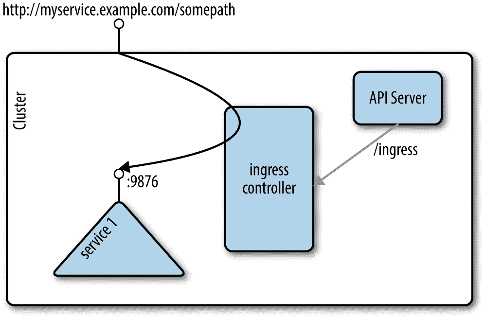

# 五、使用服务

在本章中，我们将讨论 pods 如何在集群内通信，应用如何相互发现，以及如何公开 pods 以便可以从集群外访问它们。

我们将在这里使用的原语被称为Kubernetes [*服务*](https://kubernetes.io/docs/concepts/services-networking/service/) ，如图 5-1 所示。


###### 图 5-1。永恒的服务理念

一项服务为一组POD提供了一个[稳定的虚拟 IP (VIP)地址](https://blog.openshift.com/kubernetes-services-by-example/)。尽管POD可能来来去去，但服务允许客户使用 VIP 可靠地发现并连接到POD中运行的容器。VIP 中的“虚拟”表示它不是连接到网络接口的实际 IP 地址；它的目的纯粹是将流量转发到一个或多个 pod。使 VIP 和 pods 之间的映射保持最新是`kube-proxy`的工作，这是一个在集群的每个节点上运行的过程。这个`kube-proxy`过程查询 API 服务器以了解集群中的新服务，并相应地更新节点的 iptables 规则(iptables)，以提供必要的路由信息。

# 5.1 创建服务来公开您的应用

## 问题

您希望提供一种稳定可靠的方法来发现和访问集群中的应用。

## 解决办法

为组成应用的豆荚创建一个 Kubernetes 服务。

假设您使用`kubectl run nginx --image nginx`创建了一个`nginx`部署，您可以使用`kubectl expose`命令自动创建一个`Service`对象，如下所示:

```
$ kubectl expose deploy/nginx --port 80
service "nginx" exposed

$ kubectl describe svc/nginx
Name:                   nginx
Namespace:              default
Labels:                 run=nginx
Annotations:            <none>
Selector:               run=nginx
Type:                   ClusterIP
IP:                     10.0.0.143
Port:                   <unset> 80/TCP
Endpoints:              172.17.0.5:80,172.17.0.7:80
Session Affinity:       None
Events:                 <none>

```

然后，当您列出所有服务时，您将看到该对象出现:

```
$ kubectl get svc | grep nginx
NAME         TYPE        CLUSTER-IP     EXTERNAL-IP   PORT(S)   AGE
nginx        ClusterIP   10.109.24.56   <none>        80/TCP    2s

```

## 讨论

要通过浏览器访问该服务，请在单独的终端中运行代理，如下所示:

```
$ kubectl proxy
Starting to serve on 127.0.0.1:8001

```

然后打开您的浏览器:

```
$ open http://localhost:8001/api/v1/proxy/namespaces/default/services/nginx/

```

如果您想为相同的`nginx`部署手工编写一个`Service`对象，您可以在 YAML 文件之后编写:

```
apiVersion:  v1
kind:        Service
metadata:
  name:      nginx
spec:
  selector:
    run:     nginx
  ports:
  - port:    80
```

在这个 YAML 文件中需要注意的一件事是*选择器*，它用于选择组成这个微服务抽象的所有容器。 Kubernetes 使用`Service`对象动态配置所有节点上的 iptables，以便能够将网络流量发送到组成微服务的容器。选择作为标签查询完成(参见[配方 6.6](06.html#labels) )，并产生一个端点列表。

###### 小费

如果您的服务似乎没有正常工作，请检查选择器中使用的标签，并验证一组端点是否填充了`kubectl get endpoints`。如果没有，这很可能意味着您的选择器没有找到任何匹配的豆荚。

###### 注意

Pod 主管(如部署或复制控制器)与服务正交运行。主管和服务都通过使用标签来找到他们正在照看的 pods，但是他们有不同的工作要做:主管监控 pods 的运行状况并重新启动 pods，服务使它们能够以可靠的方式访问。

## 请参见

*   立方〔t0〕服务文档〔t1〕

*   Kubernetes教程[“使用服务公开你的应用”](https://kubernetes.io/docs/tutorials/kubernetes-basics/expose-intro/)

# 5.2 验证服务的域名系统条目

## 问题

您已经创建了一个服务(参见[配方 5.1](#simple_service) )，并希望验证您的域名系统注册是否正常工作。T3】

## 解决办法

默认情况下，Kubernetes 使用`ClusterIP`作为服务类型，并在集群内部的 IP 上公开服务。 如果 DNS 集群插件可用且工作正常，您可以通过`$SERVICENAME.$NAMESPACE.svc.cluster.local`形式的完全限定域名(FQDN)访问该服务。

要验证这是否按预期工作，请在集群的容器中获取一个交互式外壳。最简单的方法是将`kubectl run`与`busybox`映像一起使用，如下所示:

```
$ kubectl run busybox --image busybox -it -- /bin/sh
If you don't see a command prompt, try pressing enter.

/ # nslookup nginx
Server:    10.96.0.10
Address 1: 10.96.0.10 kube-dns.kube-system.svc.cluster.local

Name:      nginx
Address 1: 10.109.24.56 nginx.default.svc.cluster.local

```

为服务返回的 IP 地址应该与其集群 IP 相对应。

# 5.3 更改服务类型

## 问题

您有一个现有的服务，比如类型为`ClusterIP`，如[配方 5.2](#dns_service) 中所述，并且您希望更改其类型，以便您可以将您的应用公开为`NodePort`或者通过云提供商负载平衡器使用`LoadBalancer`服务类型。

## 解决办法

使用`kubectl edit`命令和您喜欢的编辑器来更改服务类型。假设您有一个名为*的清单文件，其内容如下:*

```
kind:       Service
apiVersion: v1
metadata:
  name:     webserver
spec:
  ports:
  - port:   80
  selector:
    app:    nginx
```

创建`webserver`服务并进行查询:

```
$ kubectl create -f simple-nginx-svc.yaml

$ kubectl get svc/webserver
NAME        CLUSTER-IP   EXTERNAL-IP   PORT(S)   AGE
webserver   10.0.0.39    <none>        80/TCP    56s

```

接下来，将服务类型更改为，比方说，`NodePort`，如下所示:

```
$ kubectl edit svc/webserver

```

该命令将下载应用编程接口服务器拥有的服务的当前规范，并在您的默认编辑器中打开它，结果类似于[图 5-2](#service-editing-using-kubectl) (这里设置了`EDITOR=vi`)所示。


###### 图 5-2。使用 kubectl edit 的编辑服务截图

一旦保存了编辑内容(将`type`更改为`NodePort`、`containerPort`更改为`nodePort`，您就可以验证更新后的服务，如下所示:

```
$ kubectl get svc/webserver
NAME        CLUSTER-IP   EXTERNAL-IP   PORT(S)        AGE
webserver   10.0.0.39    <nodes>       80:30080/TCP   7m

$ kubectl get svc/webserver -o yaml
apiVersion: v1
kind: Service
metadata:
  creationTimestamp: 2017-08-31T05:08:12Z
  name: webserver
  namespace: default
  resourceVersion: "689727"
  selfLink: /api/v1/namespaces/default/services/webserver
  uid: 63956053-8e0a-11e7-8c3b-080027390640
spec:
  clusterIP: 10.0.0.39
  externalTrafficPolicy: Cluster
  ports:
  - nodePort: 30080
    port: 80
    protocol: TCP
    targetPort: 80
  selector:
    app: nginx
  sessionAffinity: None
  type: NodePort
status:
  loadBalancer: {}

```

请注意，您可以将服务类型更改为适合您的用例的类型；但是，请注意某些类型的影响，如`LoadBalancer`，这可能会触发公共云基础架构组件的供应，如果在没有意识和/或监控的情况下使用，成本可能会很高。

# 5.4 在 Minikube 上部署入口控制器

## 问题

您想要在 Minikube 上部署入口控制器来了解`Ingress`对象。`Ingress`您对对象感兴趣，因为您希望从 Kubernetes 集群外部提供对运行在 Kubernetes 中的应用的访问；但是，您不想创建`NodePort`或`LoadBalancer`类型的服务。

## 解决办法

要使`Ingress`对象(在[配方 5.5](#ingress) 中讨论)生效并提供从集群外部到您的POD的路径，您需要部署一个入口控制器。

在 Minikube 上，启用入口插件，如下所示:

```
$ minikube addons enable ingress

```

完成后，您应该会看到入口在 Minikube 插件列表中显示为已启用。检查以下情况是否如此:

```
$ minikube addons list | grep ingress
- ingress: enabled

```

一分钟或更短时间后，两个新的POD将在您的`kube-system`命名空间中启动:

```
$ kubectl get pods -n kube-system
NAME                             READY     STATUS    RESTARTS   AGE
default-http-backend-6tv69       1/1       Running   1          1d
...
nginx-ingress-controller-95dqr   1/1       Running   1          1d
...

```

您现在可以创建`Ingress`对象了。

## 请参见

*   [`Ingress`文档](https://kubernetes.io/docs/concepts/services-networking/ingress/)

*   [基于 Nginx 的入口控制器](https://github.com/kubernetes/ingress-nginx/blob/master/README.md)

# 5.5 从集群外部访问服务

## 问题

您希望从集群外部的 访问 Kubernetes 服务。

## 解决办法

使用入口控制器(参见[配方 5.4](#ingress_controller) ，该控制器通过创建`Ingress`对象来配置。下面显示了配置 nginx 服务路径的`Ingress`规则清单:

```
$ cat nginx-ingress.yaml
kind:                                     Ingress
apiVersion:                               extensions/v1beta1
metadata:
  name:                                   nginx-public
  annotations:
    ingress.kubernetes.io/rewrite-target: /
spec:
  rules:
  - host:
    http:
      paths:
      - path:                             /web
        backend:
          serviceName:                    nginx
          servicePort:                    80

$ kubectl create -f nginx-ingress.yaml

```

现在，您可以在 Kubernetes 仪表板中看到为 nginx 创建的`Ingress`对象([图 5-3](#nginx-ingress-screenshot) )。


###### 图 5-3。nginx 入口对象的截图

从 Kubernetes 仪表盘可以看到，nginx 将通过 IP 地址 192.168.99.100 可用，清单文件定义应该通过路径`/web`公开。根据这些信息，您现在可以从集群外部访问 nginx，如下所示:

```
$ curl -k https://192.168.99.100/web
<!DOCTYPE html>
<html>
<head>
<title>Welcome to nginx!</title>
<style>
    body {
        width: 35em;
        margin: 0 auto;
        font-family: Tahoma, Verdana, Arial, sans-serif;
    }
</style>
</head>
<body>
<h1>Welcome to nginx!</h1>
<p>If you see this page, the nginx web server is successfully installed and
working. Further configuration is required.</p>

<p>For online documentation and support please refer to
<a href="http://nginx.org/">nginx.org</a>.<br/>
Commercial support is available at
<a href="http://nginx.com/">nginx.com</a>.</p>

<p><em>Thank you for using nginx.</em></p>
</body>
</html>

```

## 讨论

一般来说，入口的工作方式如图 5-4 所示:入口控制器监听应用编程接口服务器的`/ingresses`端点，了解新规则。然后，它配置路由，以便外部流量到达特定的(集群内部)服务—在我们的示例中是端口 9876 上的`service1`。



###### 图 5-4。入口概念

###### 注意

该方法使用微移位，其中入口控制器附加组件随时可用。通常，你需要自己设置一个入口控制器；例如参见 GitHub 上的[说明。](https://github.com/kubernetes/ingress-nginx)

## 请参见

*   立方/入口-基尼系数在 [GitHub](https://github.com/kubernetes/ingress) 上休息

*   Milos Gajdos 的博文[“Kubernetes 服务和 x 光下的进入”](http://containerops.org/2017/01/30/kubernetes-services-and-ingress-under-x-ray/)

*   大元扎的博客帖子[【kuble engine-entry controller】](https://daemonza.github.io/2017/02/13/kubernetes-nginx-ingress-controller/)