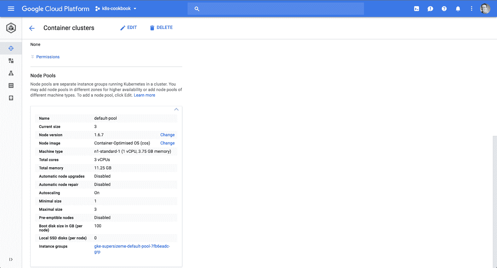

# 九、扩展

在 Kubernetes 中，扩展对于不同的用户来说意味着不同的事情。我们区分两种情况:

*   *集群扩展*，有时称为基础设施级扩展，指的是基于集群利用率添加或删除工作节点的(自动化)过程。

*   *应用级扩展*，有时也称为 pod 扩展，是指基于各种指标操纵 pod 特性的(自动化)过程，从 CPU 利用率等低级信号到给定 pod 的每秒服务的 HTTP 请求等高级信号。 存在两种 POD 级定标器:

    *   水平 pod 自动缩放器(HPAs)，根据特定指标增加或减少 Pod 副本的数量。

    *   垂直 POD 自动缩放器，增加或减少在 POD 中运行的容器的资源需求。由于截至 2018 年 1 月，VPA 仍在开发中，我们在此不再讨论。如果你对这个话题感兴趣，你可以在迈克尔的博客文章[“容器资源消耗——太重要了，不能忽视”](https://hackernoon.com/container-resource-consumption-too-important-to-ignore-7484609a3bb7)中读到它们。

在这一章中，我们首先研究 AWS 和 GKE 的集群级扩展，然后讨论 HPAs 的应用级扩展。

# 9.1 扩展部署

## 问题

您有一个部署并希望水平扩展它。

## 解决办法

使用`kubectl scale`命令来扩展部署。

让我们重复使用[配方 4.4](04.html#deployments) 中的`fancyapp`部署，有五个副本。如果还没有运行，用`kubectl create -f fancyapp.yaml`创建。

现在假设负载已经减少，您不再需要五个副本；三个就够了。要将部署缩减到三个副本，请执行以下操作:

```
$ kubectl get deploy fancyapp
NAME       DESIRED   CURRENT   UP-TO-DATE   AVAILABLE   AGE
fancyapp   5         5         5            5           9m

$ kubectl scale deployment fancyapp --replicas=3
deployment "fancyapp" scaled

$ kubectl get deploy fancyapp
NAME       DESIRED   CURRENT   UP-TO-DATE   AVAILABLE   AGE
fancyapp   3         3         3            3           10m

```

您可以自动化这个过程，而不是手动扩展部署；示例见[食谱 9.4](#auto_app_scaling_hpa_gke) 。

# 9.2 在 GKE 自动调整集群大小

## 问题

您希望 GKE 集群根据利用率自动增加或减少节点数量。

## 解决办法

使用 GKE 集群自动缩放器。该配方假设您已经安装了`gcloud`命令，并且设置了环境(即，您已经创建了一个项目并启用了计费)。

首先，创建一个具有一个工作节点的集群，并确保您可以使用`kubectl`访问它:

```
$ gcloud container clusters create --num-nodes=1 supersizeme
Creating cluster supersizeme...done.
Created [https://container.googleapis.com/v1/projects/k8s-cookbook/zones/...].
kubeconfig entry generated for supersizeme.
NAME         ZONE            MASTER_VERSION  MASTER_IP       ...  STATUS
supersizeme  europe-west2-b  1.7.8-gke.0     35.189.116.207  ...  RUNNING

$ gcloud container clusters get-credentials supersizeme --zone europe-west2-b \
                                                        --project k8s-cookbook

```

接下来，启用集群自动缩放:

```
$ gcloud beta container clusters update supersizeme --enable-autoscaling \
                                                    --min-nodes=1 --max-nodes=3 \
                                                    --zone=europe-west2-b \
                                                    --node-pool=default-pool

```

请注意，如果您尚未启用`beta`命令组，则在此步骤中将提示您获得安装权限。

此时，在查看谷歌云控制台时，您应该会看到类似于[图 9-1](#gke-cluster-autoscale-1-node) 所示的内容。


###### 图 9-1。谷歌云控制台的截图，显示了一个节点的初始集群大小

现在，使用部署发射 15 个 POD。这将产生足够的负载来触发集群自动缩放:

```
$ kubectl run ghost --image=ghost:0.9 --replicas=15

```

现在应该有一个由三个节点组成的集群，如图 9-2 中的[所示。](#gke-cluster-autoscale-3-nodes)



###### 图 9-2。谷歌云控制台的截图，显示了扩展到三个节点的集群

[图 9-3](#gke-cluster-autoscale-terminal) 展示了你看到的整个交互:

*   在左上角的会话中，您可以看到负载(创建了 15 个 POD，触发了集群扩展事件)。

*   在右上角的会话中，您可以看到`gcloud`命令，启用集群自动缩放。

*   在底部会话中，您可以看到`kubectl get nodes --watch`命令的输出，显示了当前可用的节点。


###### 图 9-3。终端会话的屏幕截图，显示了正在运行的集群自动缩放

请注意，节点池中的所有节点应具有相同的容量、标签和运行在其上的系统单元。此外，在为节点池指定最大设置时，请检查您的配额是否足够大。

做完了别忘了做`gcloud container clusters delete supersizeme`；否则，您将继续为集群资源付费。

## 请参见

*   [集群自动缩放器](https://github.com/kubernetes/autoscaler/tree/master/cluster-autoscaler)在*kubernetes/自动缩放器* repo

*   [在 GKE 文档 中集群自动缩放器](https://cloud.google.com/container-engine/docs/cluster-autoscaler)

# 9.3 自动调整 AWS 中集群的大小

## 问题

您希望在 AWS EC2 中运行的 Kubernetes 集群根据利用率自动增加或减少节点数量。

## 解决办法

使用 [AWS 集群自动缩放器](https://github.com/kubernetes/charts/tree/master/stable/cluster-autoscaler)，这是一个利用 AWS 自动缩放组的 Helm 包。如果你还没有安装赫尔姆，那么先看看[食谱 14.1](14.html#helm_install) 。

# 9.4 在 GKE 使用水平 POD 自动缩放

## 问题

您希望根据当前负载自动增加或减少部署中的 POD 数量。

## 解决办法

使用水平 POD 自动缩放器，如下所述。

首先，创建一个应用——一个 PHP 环境和服务器——您可以将其用作 HPA 的目标:

```
$ kubectl run appserver --image=gcr.io/google_containers/hpa-example \
                        --requests=cpu=200m --expose --port=80
service "appserver" created
  │NAME   ZONE            MASTER_VERSION
deployment "appserver" created

```

接下来，创建一个 HPA 并定义触发参数`--cpu-percent=40`，这意味着 CPU 利用率不应超过 40%:

```
$ kubectl autoscale deployment appserver --cpu-percent=40 --min=1 --max=5
deployment "appserver" autoscaled

$ kubectl get hpa --watch
NAME       REFERENCE             TARGETS          MINPODS  MAXPODS  REPLICAS  AGE
appserver  Deployment/appserver  <unknown> / 40%  1        5        0         14s

```

在第二个终端会话中，注意部署:

```
$ kubectl get deploy appserver --watch

```

最后，在第三个终端会话中，启动负载生成器:

```
$ kubectl run -i -t loadgen --image=busybox /bin/sh
If you don't see a command prompt, try pressing enter.

/ # while true; do wget -q -O- http://appserver.default.svc.cluster.local; done

```

由于并行涉及三个终端会话，因此在[图 9-4](#horizontal-pod-autoscaler-terminal) 中提供了整个情况的概述。


###### 图 9-4。设置 HPA 的终端会话截图

在[图 9-5](#horizontal-pod-autoscaler-dashboard) 中可以看到 HPA 对`appserver`部署的影响，这次显示的是 Kubernetes 仪表盘。


###### 图 9-5。Kubernetes 仪表板的截图，显示了 HPA 的效果

## 讨论

这里描述的自动缩放是通过 HPA 控制器自动增加或减少副本的数量，这可以通过 HPA 资源来影响。控制器是控制平面中 Kubernetes 控制器管理器的一部分，它通过运行在集群中每个节点上的 cAdvisor 实例来检查 pod 指标，然后由 Heapster 进行聚合。HPA 控制器计算满足 HPA 资源中定义的目标度量所需的副本数量。 <sup>[1](#idm139735591695296)</sup> 基于该计算，HPA 控制器随后调整目标资源上的副本(例如，部署)。

请注意，自动缩放可能很棘手，调整低级别指标(如中央处理器或内存利用率)可能不会产生预期的影响。 如果可以，尝试使用应用级[自定义指标](https://blog.openshift.com/kubernetes-1-8-now-custom-metrics/)。

## 请参见

*   [水平 POD 自动缩放器漫游](https://kubernetes.io/docs/tasks/run-application/horizontal-pod-autoscale-walkthrough/)

*   杰西·斯泽普科夫斯基和玛西恩·维格斯的 博客文章[“Kubernetes 的自动缩放”](http://blog.kubernetes.io/2016/07/autoscaling-in-kubernetes.html)

*   [GKE 自动缩放演示](https://github.com/mhausenblas/k8s-autoscale)

<sup>[1](#idm139735591695296-marker)</sup>GitHub 上的 Kubernetes 社区，[【自动缩放算法】](https://github.com/kubernetes/community/blob/master/contributors/design-proposals/autoscaling/horizontal-pod-autoscaler.md#autoscaling-algorithm)。