# 灾难恢复和备份

在本章中，我们将重点介绍备份和灾难恢复场景，这些场景可保持生产中的应用程序高度可用，并允许它们在云提供商或基本 Kubernetes 节点出现故障时快速恢复服务。遵循本章中的方法后，您将获得操作用于**灾难恢复** ( **灾难恢复**)的工具的技能，并且能够跨集群和云实时迁移应用程序。

在本章中，我们将介绍以下食谱:

*   使用 MinIO 配置和管理 S3 对象存储
*   管理 Kubernetes 卷快照和恢复
*   使用 Velero 进行应用程序备份和恢复
*   使用 Kasten 进行应用程序备份和恢复
*   跨云应用程序迁移

# 技术要求

本章中的方法假设您已经按照[第 1 章](01.html)、*中描述的推荐方法之一部署了功能性 Kubernetes 集群，构建生产就绪型 Kubernetes 集群*。

Kubernetes 操作工具`kubectl`将用于本章的其余部分，因为它是针对 Kubernetes 集群运行命令的主要命令行界面。如果你使用的是红帽 OpenShift 集群，你可以用`oc`代替`kubectl`。所有的命令都应该以类似的方式运行。

# 使用 MinIO 配置和管理 S3 对象存储

在本节中，我们将使用 MinIO 创建一个 S3 对象存储，以存储您的应用程序在 Kubernetes 中创建的工件或配置文件。您将学习如何创建部署清单文件、部署 S3 服务以及为其他应用程序或用户提供外部 IP 地址来使用该服务。

# 准备好

将`k8sdevopscookbook/src`存储库克隆到您的工作站，以使用`chapter6`目录下的清单文件，如下所示:

```
$ git clone https://github.com/k8sdevopscookbook/src.git
$ cd src/chapter6
```

确保您已经准备好了 Kubernetes 集群并配置了`kubectl`，以便您可以管理集群资源。

# 怎么做…

本节进一步分为以下几个小节，以简化这一过程:

*   创建部署 YAML 清单
*   创建 MinIO S3 服务
*   访问 MinIO 网络用户界面

# 创建部署 YAML 清单

所有 Kubernetes 资源都是通过使用 YAML 清单文件以声明方式创建的。让我们执行以下步骤来创建一个示例文件，稍后我们将使用该文件在 Kubernetes 中部署应用程序:

1.  对于这个方法，我们将使用 MinIO 创建一些资源，我们可以使用这些资源来理解文件格式，并在以后帮助我们部署功能齐全的应用程序。去[https://min.io/download#/kubernetes](https://min.io/download#/kubernetes)打开 MinIO 下载网站。
2.  在 MinIO 网站的可用下载选项列表中，单击 Kubernetes 按钮并选择 Kubernetes CLI 选项卡。此页面将根据我们的偏好帮助我们生成 MinIO 应用程序所需的 YAML 内容:


3.  输入您的访问密钥和密钥对。在我们的例子中，我们使用了`minio` / `minio123`。当您访问您的 MinIO 服务时，这将用来代替用户名和密码。选择分布式作为部署模型，并输入`4`作为节点数。此选项将创建一个包含四个副本的状态集。输入`10` GB 作为大小。在我们的示例中，我们将使用以下配置屏幕上显示的值:


4.  单击生成按钮并检查文件内容。您将注意到 YAML 清单中存储了三种不同的资源，包括服务、状态集和第二个服务，这将创建一个云负载平衡器，向外部访问公开第一个服务端口。
5.  复制内容并保存为工作站上的`minio.yaml`。

# 创建 MinIO S3 服务

让我们执行以下步骤来创建必要的资源，以便使用 MinIO 获得功能性的 S3 服务:

1.  使用您在*中创建的 YAML 清单部署 MinIO 创建部署 YAML 清单*配方:

```
$ kubectl apply -f minio.yaml
```

As an alternative method, you can use the sample YAML file saved under the `/src/chapter6/minio` directory in the example repository using the `$ kubectl apply -f minio/minio.yaml` command.

2.  请验证 StatefulSet。您应该看到 4 个副本中有 4 个已部署，类似于以下输出。请注意，如果作为独立部署，您将没有状态集:

```
$ kubectl get statefulsets
NAME  READY AGE
minio 4/4   2m17s
```

现在，您已经部署了一个 MinIO 应用程序。在下一个食谱中，我们将学习如何发现它的外部地址来访问服务。

# 访问 MinIO 网络用户界面

作为部署过程的一部分，我们让 MinIO 创建一个云负载平衡器，将服务公开给外部访问。在这个食谱中，我们将学习如何访问 MinIO 接口上传和下载文件到 S3 后端。为此，我们将执行以下步骤:

1.  使用以下命令获取`minio-service`负载平衡器的外部 IP。您将在`EXTERNAL-IP`列下看到公开的服务地址，类似于以下输出:

```
$ kubectl get service
NAME          TYPE         CLUSTER-IP EXTERNAL-IP                     PORT(S)  AGE
minio         ClusterIP    None       <none>                          9000/TCP 2m49s
minio-service LoadBalancer 10.3.0.4   abc.us-west-2.elb.amazonaws.com 9000:30345/TCP 2m49s
```

2.  如您所见，输出服务通过端口`9000`公开。要访问该服务，我们还需要在地址(`http://[externalIP]:9000`)的末尾添加端口`9000`，并在浏览器中打开 MinIO 服务的公共地址。

3.  您需要拥有访问仪表板的权限。使用我们之前创建的`minio`默认用户名和`minio123`默认密码登录 Minio 部署。登录后，您将能够访问 MinIO 浏览器，如下图所示:


MinIO 与亚马逊 S3 云存储服务兼容，最适合存储照片、日志文件和备份等非结构化数据。现在，您可以访问 MinIO 用户界面，您可以创建雄鹿，上传您的文件，并通过 S3 应用编程接口访问它们，类似于访问标准的亚马逊 S3 服务来存储您的备份。您可以前往*中的 *MinIO 文档*链接了解更多关于 MinIO 的信息，另请参见*部分。

# 它是如何工作的...

这个菜谱向您展示了如何使用部署在 Kubernetes 上的 MinIO 来提供完全与亚马逊 S3 API 兼容的服务。该服务稍后将用于灾难恢复和备份运行在 Kubernetes 上的应用程序。

在*创建 MinIO S3 服务*配方中，在*步骤 1* 中，当我们部署 MinIO 时，它会在端口`9000`创建一个负载平衡器服务。由于我们将节点数量设置为`4`，将创建一个包含四个副本的状态集合。每个人将使用`volumeClaimTemplates`部分下设置的信息来创建一个聚氯乙烯。如果`storageClassName`没有明确定义，那么将使用默认的存储类。因此，您将看到集群上创建了四个**PersistentVolumesClaim**(**PVC**)实例，以提供高可用性的 MinIO 服务。

# 请参见

*   MinIO 文档，位于:[https://docs.min.io/docs/minio-quickstart-guide.html](https://docs.min.io/docs/minio-quickstart-guide.html)
*   库本内斯的迷你操作符位于:[https://github.com/minio/minio-operator](https://github.com/minio/minio-operator)
*   MinIO 擦除代码快速启动指南位于:[https://docs . min . io/docs/MinIO-擦除代码-快速启动指南](https://docs.min.io/docs/minio-erasure-code-quickstart-guide)
*   使用 MinIO 客户端，位于:[https://docs.min.io/docs/minio-client-quickstart-guide](https://docs.min.io/docs/minio-client-quickstart-guide)

# 管理 Kubernetes 卷快照和恢复

在本节中，我们将从 Kubernetes 中的持久卷创建卷快照。按照此方法，您将了解如何启用卷快照功能、创建快照存储类以及从现有卷快照恢复。

# 准备好

确保您已经准备好 Kubernetes 集群并且`kubectl`已配置为管理集群资源。

将`k8sdevopscookbook/src`存储库克隆到您的工作站，以使用`chapter6`目录下的清单文件，如下所示:

```
$ git clone https://github.com/k8sdevopscookbook/src.git
$ cd src/chapter6
```

确保首选存储供应商的**容器存储接口** ( **CSI** )驱动程序安装在您的 Kubernetes 集群上，并且已经实现了快照功能。我们在[第 5 章](05.html)、*准备有状态工作负载*中介绍了 AWS EBS、GCP PD、Azure Disk、Rook 和 OpenEBS CSI 驱动程序的安装。

本节中的说明同样适用于通过 CSI 支持快照的其他供应商。您可以在库本内斯 CSI 文档网站上找到这些额外的驱动程序，网址为:[https://kubernetes-csi.github.io/docs/drivers.html](https://kubernetes-csi.github.io/docs/drivers.html)。[T3】](https://kubernetes-csi.github.io/docs/drivers.html)

# 怎么做…

本节进一步分为以下几个小节，以简化这一过程:

*   启用特征门
*   通过 CSI 创建卷快照
*   通过 CSI 从快照恢复卷
*   通过 CSI 克隆卷

# 启用特征门

这里将要讨论的一些特性目前可能处于不同的阶段(alpha、beta 或 GA)。如果遇到问题，请执行以下步骤:

1.  为`kube-apiserver`和`kubelet`设置以下`feature-gates`标志为`true`:

```
- --feature-gates=VolumeSnapshotDataSource=true
- --feature-gates=KubeletPluginsWatcher=true
- --feature-gates=CSINodeInfo=true
- --feature-gates=CSIDriverRegistry=true
- --feature-gates=BlockVolume=true
- --feature-gates=CSIBlockVolume=true
```

您可以通过*中的*库本内特特征门*链接找到特征及其状态的最新状态，另请参见*部分。

# 通过 CSI 创建卷快照

卷快照是从 Kubernetes 群集中的 PVC 获取的状态副本。它是使用现有数据启动有状态应用程序的有用资源。让我们执行以下步骤，使用 CSI 创建卷快照:

1.  创建一个聚氯乙烯或选择一个现有的。在我们的配方中，我们将使用 AWS EBS CSI 驱动程序和我们在[第 5 章](05.html)、*中为有状态工作负载准备**g*中创建的`aws-csi-ebs`存储类，在*中安装 EBS CSI 驱动程序来管理 EBS 卷*配方:

```
$ cat <<EOF | kubectl apply -f -
apiVersion: v1
kind: PersistentVolumeClaim
metadata:
 name: csi-ebs-pvc
spec:
 accessModes:
 - ReadWriteOnce
 storageClassName: aws-csi-ebs
 resources:
 requests:
 storage: 4Gi
EOF
```

2.  创建一个将写入**持久卷** ( **PV** )中的`/data/out.txt`文件的 pod:

```
$ cat <<EOF | kubectl apply -f -
apiVersion: v1
kind: Pod
metadata:
 name: app
spec:
 containers:
 - name: app
 image: centos
 command: ["/bin/sh"]
 args: ["-c", "while true; do echo $(date -u) >> /data/out.txt; sleep 5; done"]
 volumeMounts:
 - name: persistent-storage
 mountPath: /data
 volumes:
 - name: persistent-storage
 persistentVolumeClaim:
 claimName: csi-ebs-pvc
EOF
```

3.  创建一个`VolumeSnapshotClass`。确保快照提供程序设置为您的 CSI 驱动程序名称。在这个食谱中，这是`ebs.csi.aws.com`:

```
$ cat <<EOF | kubectl apply -f -
apiVersion: snapshot.storage.k8s.io/v1alpha1
kind: VolumeSnapshotClass
metadata:
 name: csi-ebs-vsc
snapshotter: ebs.csi.aws.com
EOF
```

4.  必须使用存储供应商的 CSI 驱动程序来创建 PVC。在我们的配方中，我们将使用我们在*安装 EBS CSI 驱动程序中创建的 PVC 来管理 EBS 卷*配方。现在，使用我们在*步骤 1* 中设置的聚氯乙烯名称(`csi-ebs-pvc`)创建一个`VolumeSnapshot`:

```
$ cat <<EOF | kubectl apply -f -
apiVersion: snapshot.storage.k8s.io/v1alpha1
kind: VolumeSnapshot
metadata:
 name: ebs-volume-snapshot
spec:
 snapshotClassName: csi-ebs-vsc
 source:
 name: csi-ebs-pvc
 kind: PersistentVolumeClaim
EOF
```

5.  列出卷快照:

```
$ kubectl get volumesnapshot
NAME AGE
ebs-volume-snapshot 18s
```

6.  检查以下命令的输出时，确认状态为`Ready To Use: true`:

```
$ kubectl describe volumesnapshot ebs-volume-snapshot
```

# 通过 CSI 从快照恢复卷

我们可以创建快照来尝试恢复其他快照。让我们执行以下步骤来恢复我们在上一个配方中创建的快照:

1.  使用以下命令，使用聚氯乙烯从快照恢复卷。如您所见，将基于`ebs-volume-snapshot`快照创建一个名为`csi-ebs-pvc-restored`的新聚氯乙烯:

```
$ cat <<EOF | kubectl apply -f -
apiVersion: v1
kind: PersistentVolumeClaim
metadata:
 name: csi-ebs-pvc-restored
spec:
 accessModes:
 - ReadWriteOnce
 storageClassName: aws-csi-ebs
 resources:
 requests:
 storage: 4Gi
 dataSource:
 name: ebs-volume-snapshot
 kind: VolumeSnapshot
 apiGroup: snapshot.storage.k8s.io
EOF
```

2.  创建另一个 pod，它将继续写入 PV 内的`/data/out.txt`文件。此步骤将确保卷在创建后仍可访问:

```
$ cat <<EOF | kubectl apply -f -
apiVersion: v1
kind: Pod
metadata:
 name: newapp
spec:
 containers:
 - name: app
 image: centos
 command: ["/bin/sh"]
 args: ["-c", "while true; do echo $(date -u) >> /data/out.txt; sleep 5; done"]
 volumeMounts:
 - name: persistent-storage
 mountPath: /data
 volumes:
 - name: persistent-storage
 persistentVolumeClaim:
 claimName: csi-ebs-pvc-restored
EOF
```

3.  确认`newapp`窗格包含恢复的数据和来自*的时间戳，创建卷快照*配方:

```
$ kubectl exec -it newapp cat /data/out.txt
```

至此，您已经了解了如何从现有快照调配持久性卷。这是配置项/光盘管道中非常有用的一步，这样您就可以节省故障管道的故障排除时间。

# 通过 CSI 克隆卷

虽然快照是 PVs 特定状态的副本，但它不是创建数据副本的唯一方法。CSI 还允许从现有卷创建新卷。在本配方中，我们将通过执行以下步骤，使用现有聚氯乙烯创建聚氯乙烯:

1.  获取 PVC 列表。你可能有不止一个聚氯乙烯。在本例中，我们将使用我们在*创建卷快照*配方中创建的聚氯乙烯。您可以使用另一个聚氯乙烯，只要它是使用支持`VolumePVCDataSource`应用编程接口的 CSI 驱动程序创建的:

```
$ kubectl get pvc
NAME STATUS VOLUME CAPACITY ACCESS MODES STORAGECLASS AGE
csi-ebs-pvc Bound pvc-574ed379-71e1-4548-b736-7137ab9cfd9d 4Gi RWO aws-csi-ebs 23h
```

2.  使用现有聚氯乙烯(在本配方中，这是`csi-ebs-pvc`)作为`dataSource`创建聚氯乙烯。数据源可以是`VolumeSnapshot`或聚氯乙烯。在本例中，我们使用`PersistentVolumeClaim`克隆数据:

```
$ cat <<EOF | kubectl apply -f -
apiVersion: v1
kind: PersistentVolumeClaim
metadata:
 name: clone-of-csi-ebs-pvc
spec:
 accessModes:
 - ReadWriteOnce
 resources:
 requests:
 storage: 4Gi
 dataSource:
 kind: PersistentVolumeClaim
 name: csi-ebs-pvc
EOF
```

至此，您已经了解了一种从现有数据源克隆持久数据的简单方法。

# 它是如何工作的...

本食谱向您展示了如何创建快照、从快照中恢复数据，以及如何在 Kubernetes 上即时克隆持久卷。

在*通过 CSI* 从快照恢复卷*和*通过 CSI* 克隆卷的方法中，我们向引用现有聚氯乙烯的聚氯乙烯添加了一个`dataSource`，从而创建了一个完全独立的新聚氯乙烯。如果删除了源，则可以独立附加、克隆、快照或删除生成的聚氯乙烯。主要区别在于，在配置完 PVC 后，后端设备会配置指定卷的精确副本，而不是空的 PV。*

需要注意的是，对于使用已实施此功能的 CSI 驱动程序的动态资源调配程序，可以使用本机克隆支持。CSI 项目正在不断发展和成熟，因此并非每个存储供应商都提供完整的 CSI 功能。

# 请参见

*   立方 CSI 驱动程序列表，at[https://立方 CSI . github . io/docs/drivers . html](https://kubernetes-csi.github.io/docs/drivers.html)
*   **容器存储接口** ( **容器安全倡议**)文件，网址为
*   犯罪现场调查规范，在[https://github.com/container-storage-interface/spec](https://github.com/container-storage-interface/spec)
*   Kubernetes 特征门，位于[https://kubernetes . io/docs/reference/命令行-工具-reference/特征门/](https://kubernetes.io/docs/reference/command-line-tools-reference/feature-gates/)
*   Kubernetes 卷克隆文档，位于[https://kubernetes . io/docs/concepts/storage/Volume-PVC-data source/](https://kubernetes.io/docs/concepts/storage/volume-pvc-datasource/)
*   Kubernetes 卷快照文档，位于[https://kubernetes . io/docs/concepts/storage/卷快照/](https://kubernetes.io/docs/concepts/storage/volume-snapshots/)

# 使用 Velero 进行应用程序备份和恢复

在本节中，我们将使用 VMware Velero(以前的 Heptio Ark)创建灾难恢复备份，并在 Kubernetes 中迁移 Kubernetes 应用程序及其持久卷。

您将学习如何安装 Velero，使用 S3 目标创建应用程序的标准和计划备份，并将它们恢复到 Kubernetes 集群。

# 准备好

确保您已经准备好 Kubernetes 集群并且`kubectl`已配置为管理集群资源。

将`k8sdevopscookbook/src`存储库克隆到您的工作站，以使用`chapter6`目录下的清单文件，如下所示:

```
$ git clone https://github.com/k8sdevopscookbook/src.git
$ cd src/chapter6
```

这个方法需要现有的有状态工作负载和可呈现的数据，这样我们就可以模拟灾难，然后恢复数据。为此，我们将使用我们在*安装 EBS CSI 驱动程序期间创建的`mytestapp`应用程序来管理 [第 5 章](05.html)、*准备有状态工作负载*中的 EBS 卷*配方。

Velero 还需要与 S3 兼容的对象存储来存储备份。在本方案中，我们将使用我们在*期间部署的 MinIO S3 目标，使用 MinIO* 方案配置和管理 S3 对象存储，以存储我们的备份。

# 怎么做…

本节进一步分为以下几个小节，以简化这一过程:

*   安装 Velero
*   备份应用程序
*   恢复应用程序
*   创建定时备份
*   备份整个命名空间
*   使用 MinIO 查看备份
*   删除备份和计划

# 安装 Velero

Velero 是一个开源项目，用于制作备份、执行灾难恢复、恢复和迁移 Kubernetes 资源和持久卷。在本食谱中，我们将按照以下步骤学习如何在 Kubernetes 集群中部署 Velero:

1.  下载最新版本的 Velero:

```
$ wget https://github.com/vmware-tanzu/velero/releases/download/v1.1.0/velero-v1.1.0-linux-amd64.tar.gz
```

At the time of writing this book, the latest version of Velero was v1.1.0\. Check the Velero repository at [https://github.com/vmware-tanzu/velero/releases](https://github.com/vmware-tanzu/velero/releases) and update the link with the latest download link if it's changed since this book's release.

2.  取出油球:

```
$ tar -xvzf velero-v1.1.0-linux-amd64.tar.gz
$ sudo mv velero-v1.1.0-linux-amd64/velero /usr/local/bin/ 
```

3.  确认`velero`命令可执行:

```
$ velero version
Client:
 Version: v1.1.0
 Git commit: a357f21aec6b39a8244dd23e469cc4519f1fe608
<error getting server version: the server could not find the requested resource (post serverstatusrequests.velero.io)>
```

4.  使用您在*中使用的访问密钥和密钥创建`credentials-velero`文件，使用 Minio* 配方配置和管理 S3 对象存储:

```
$ cat > credentials-velero <<EOF
[default]
aws_access_key_id = minio
aws_secret_access_key = minio123
EOF
```

5.  用您的 MinIO 服务的外部 IP 更新`s3Url`并安装 Velero 服务器:

```
$ velero install \
 --provider aws \
 --bucket velero \
 --secret-file ./credentials-velero \
 --use-restic \
 --backup-location-config region=minio,s3ForcePathStyle="true",s3Url=http://ac76d4a1ac72c496299b17573ac4cf2d-512600720.us-west-2.elb.amazonaws.com:9000
```

6.  确认部署成功:

```
$ kubectl get deployments -l component=velero --namespace=velero
NAME READY UP-TO-DATE AVAILABLE AGE
velero 1/1 1 1 62s
```

这样，Velero 已经在您的 Kubernetes 集群上配置，使用 MinIO 作为备份目标。

# 备份应用程序

让我们执行以下步骤，使用 Velero 备份应用程序及其卷。我们在这里创建的所有 YAML 货单文件都可以在`/src/chapter6/velero`目录下找到:

1.  如果您已经标记了要备份的应用程序和卷，您可以跳到*步骤 5* 。否则，使用以下命令创建命名空间和聚氯乙烯:

```
cat <<EOF | kubectl apply -f -
apiVersion: v1
kind: Namespace
metadata:
 name: backup-example
 labels:
 app: app2backup
EOF
```

2.  使用您喜欢的`storageClass`在`backup-example`命名空间中创建一个聚氯乙烯。在我们的例子中这是`aws-csi-ebs`:

```
cat <<EOF | kubectl apply -f -
apiVersion: v1
kind: PersistentVolumeClaim
metadata:
 name: pvc2backup
 namespace: backup-example
 labels:
 app: app2backup
spec:
 accessModes:
 - ReadWriteOnce
 storageClassName: aws-csi-ebs
 resources:
 requests:
 storage: 4Gi
EOF
```

3.  查看`src/chapter6/velero`目录中的`myapp.yaml`文件，并使用它创建一个使用聚氯乙烯的容器，并写入容器内的`/data/out.txt`文件:

```
$ kubectl apply -f myapp.yaml
```

4.  验证我们的`myapp` pod 是否将数据写入卷:

```
$ kubectl exec -it myapp cat /data/out.txt -nbackup-example
Thu Sep 12 23:18:08 UTC 2019
```

5.  为所有带有`app=app2backup`标签的对象创建备份:

```
$ velero backup create myapp-backup --selector app=app2backup
```

6.  确认备份阶段已完成:

```
$ velero backup describe myapp-backup
Name: myapp-backup
Namespace: velero
Labels: velero.io/storage-location=default
Annotations: <none>
Phase: Completed
...
```

7.  列出所有可用的备份:

```
$ velero backup get
NAME         STATUS    CREATED                       EXPIRES STORAGE LOCATION SELECTOR
myapp-backup Completed 2019-09-13 05:55:08 +0000 UTC 29d     default app=app2backup
```

至此，您已经学习了如何使用标签创建应用程序的备份。

# 恢复应用程序

让我们执行以下步骤从备份中恢复应用程序:

1.  删除应用程序及其聚氯乙烯以模拟数据丢失情况:

```
$ kubectl delete pvc pvc2backup -nbackup-example
$ kubectl delete pod myapp -nbackup-example
```

2.  从以前名为`myapp-backup`的备份中恢复您的应用程序:

```
$ velero restore create --from-backup myapp-backup
```

3.  确认您的应用程序正在运行:

```
$ kubectl get pod -nbackup-example
NAME  READY STATUS  RESTARTS AGE
myapp 1/1   Running 0        10m
```

4.  确认我们的`myapp`窗格将数据写入卷:

```
$ kubectl exec -it myapp cat /data/out.txt -nbackup-example
```

至此，您已经学习了如何使用 Velero 从备份中恢复应用程序及其卷。

# 创建定时备份

Velero 支持 cron 表达式来调度备份任务。让我们执行以下步骤来为我们的应用程序安排备份:

1.  创建计划的每日备份:

```
$ velero schedule create myapp-daily --schedule="0 0 1 * * ?" --selector app=app2backup
```

如果您不熟悉 cron 表达式，您可以使用*中的 *Cron 表达式生成器*链接创建不同的计划，另请参见*部分。

Note that the preceding schedule uses a cron expression. As an alternative, you can use a shorthand expression such as `--schedule="@daily"` or use an online cron maker to create a cron expression.

2.  获取当前计划备份作业的列表:

```
$ velero schedule get
 NAME        STATUS  CREATED                       SCHEDULE    BACKUP TTL LAST BACKUP SELECTOR
 myapp-daily Enabled 2019-09-13 21:38:36 +0000 UTC 0 0 1 * * ? 720h0m0s   2m ago      app=app2backup
```

3.  确认计划备份作业已创建备份:

```
$ velero backup get
NAME                       STATUS    CREATED                       EXPIRES STORAGE LOCATION SELECTOR
myapp-daily-20190913205123 Completed 2019-09-13 20:51:24 +0000 UTC 29d     default app=app2backup
```

至此，您已经学习了如何使用 Velero 创建应用程序的定时备份。

# 备份整个命名空间

进行备份时，可以使用不同类型的选择器，甚至可以在选定的命名空间中使用完整的源。在这个方法中，我们将通过执行以下步骤在名称空间中包含资源:

1.  使用以下命令备份整个命名空间。这个例子包括`backup-example`命名空间。如果需要，请替换此命名空间。在执行以下命令之前，命名空间和资源应该已经存在:

```
$ velero backup create fullnamespace --include-namespaces backup-example
```

2.  如果需要从备份中排除特定资源，请为其添加`backup: "false"`标签，并运行以下命令:

```
$ velero backup create fullnamespace --selector 'backup notin (false)'
```

至此，您已经学习了如何使用 Velero 在给定的命名空间中创建资源备份。

# 使用 MinIO 查看备份

让我们执行以下步骤，在 MinIO 界面上查看备份内容:

1.  按照*中的说明访问 MinIO 网络用户界面*配方并访问 MinIO 浏览器。
2.  点击`velero`桶:

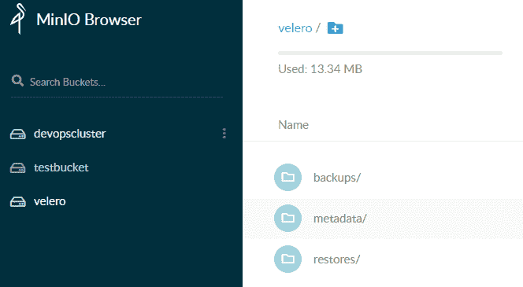

3.  打开`backups`目录，找到您的 Velero 备份列表:

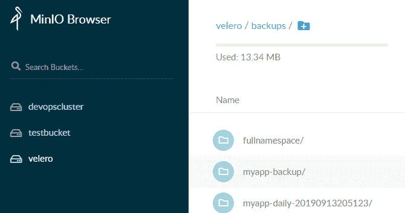

4.  单击备份名称以访问备份内容:

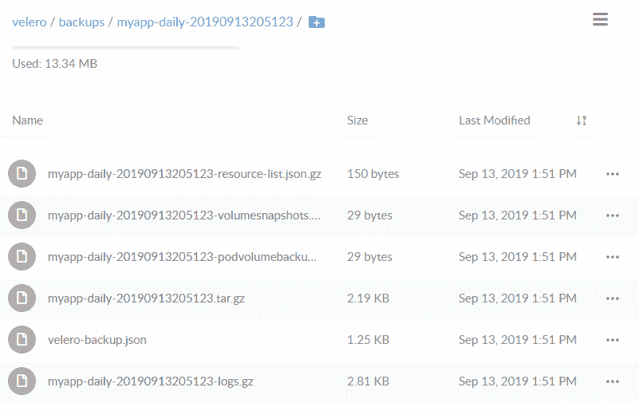

至此，您已经学会了如何定位和查看 Velero 备份的内容。

# 删除备份和计划

如果维护不当，Velero 备份的大小会迅速增加。让我们执行以下步骤来删除现有备份资源并清理计划备份:

1.  删除名为`myapp-backup`的现有备份:

```
$ velero backup delete myapp-backup
```

2.  删除所有现有备份:

```
$ velero backup delete --all
```

3.  删除名为`myapp-daily`的定时备份作业:

```
$ velero schedule delete myapp-daily
```

# 它是如何工作的...

此菜谱向您展示了如何创建灾难恢复备份，如何从 S3 目标恢复应用程序及其数据，以及如何在 Kubernetes 上创建计划备份作业。

在*备份应用程序*配方中，在*步骤 4* 中，当您运行`velero backup create myapp-backup --selector app=app2backup`时，Velero 客户端调用 Kubernetes API 服务器并创建备份对象。

You can get a list of **Custom Resource Definitions** (**CRDs**) that have been created by Velero by running the `kubectl get crds |grep velero` command.

Velero 的 BackupController 会监视新对象，当检测到该对象时，它会执行标准验证并处理备份。Velero 的备份控制器通过向应用编程接口服务器请求资源来收集要备份的信息。然后，它调用默认存储提供商并上传备份文件。

# 请参见

*   韦莱罗项目库，位于[https://github.com/vmware-tanzu/velero/](https://github.com/vmware-tanzu/velero/)
*   韦莱罗文件，在[https://velero.io/docs/master/index.html](https://velero.io/docs/master/index.html)
*   韦莱罗支持矩阵，在[https://velero.io/docs/master/supported-providers/](https://velero.io/docs/master/supported-providers/)
*   韦莱罗播客和社区文章，在[https://velero.io/resources/](https://velero.io/resources/)
*   Cron 表达式生成器，位于[https://www . freeformatter . com/cron-表达式生成器-quartz.html](https://www.freeformatter.com/cron-expression-generator-quartz.html)

# 使用 Kasten 进行应用程序备份和恢复

在本节中，我们将使用 **Kasten** ( **K10** )创建灾难恢复备份并迁移 Kubernetes 应用程序及其在 Kubernetes 中的持久卷。

您将学习如何安装和使用 K10，创建应用程序到 S3 目标的标准和计划备份，并将它们恢复到 Kubernetes 集群。

# 准备好

确保您已准备好 Kubernetes 集群并配置了`kubectl`和`helm`，以便您可以管理集群资源。在本食谱中，我们将在 AWS 上使用一个三节点 Kubernetes 集群。

这个方法需要一个现有的有状态工作负载和可呈现的数据来模拟灾难。为了恢复数据，我们将使用我们在*安装 EBS CSI 驱动程序中创建的`mytestapp`应用程序来管理[第 5 章](05.html)、*准备有状态工作负载*中的 EBS 卷*配方。

将`k8sdevopscookbook/src`存储库克隆到您的工作站，以使用`chapter6`目录下的清单文件，如下所示:

```
$ git clone https://github.com/k8sdevopscookbook/src.git
$ cd src/chapter6
```

默认情况下，K10 附带一个 Starter Edition 许可证，允许您在具有三个工作节点(最多三个)的集群上免费使用该软件。K10 需要配置备份目标。

# 怎么做…

本节进一步分为以下几个小节，以简化这一过程:

*   安装 Kasten
*   访问卡斯滕仪表板
*   备份应用程序
*   恢复应用程序

# 安装 Kasten

让我们执行以下步骤，在 Kubernetes 集群中安装 Kasten 作为备份解决方案:

1.  添加 K10 舵库:

```
$ helm repo add kasten https://charts.kasten.io/
```

2.  在开始之前，让我们验证一下环境。以下脚本将执行一些安装前测试来验证您的集群:

```
$ curl https://docs.kasten.io/tools/k10_preflight.sh | bash
Checking for tools
 --> Found kubectl --> Found helm
Checking access to the Kubernetes context kubernetes-admin@net39dvo58
 --> Able to access the default Kubernetes namespace
Checking for required Kubernetes version (>= v1.10.0)
 --> Kubernetes version (v1.15.3) meets minimum requirements
Checking if Kubernetes RBAC is enabled
 --> Kubernetes RBAC is enabled
Checking if the Aggregated Layer is enabled
 --> The Kubernetes Aggregated Layer is enabled
Checking if the Kasten Helm repo is present
 --> The Kasten Helm repo was found
Checking for required Helm Tiller version (>= v2.11.0)
 --> Tiller version (v2.14.3) meets minimum requirements
All pre-flight checks succeeded!
```

3.  确保您的首选存储类被设置为默认存储类；否则，通过将`-set persistence.storageClass`参数添加到以下命令来定义它。在我们的示例中，我们使用的是`openebs-cstor-default`存储类。此外，添加您的 AWS 访问密钥和密码，并安装 K10:

```
$ helm install kasten/k10 --name=k10 --namespace=kasten-io \
 --set persistence.storageClass=openebs-cstor-default \
 --set persistence.size=20Gi \
 --set secrets.awsAccessKeyId="AWS_ACCESS_KEY_ID" \
 --set secrets.awsSecretAccessKey="AWS_SECRET_ACCESS_KEY"
```

4.  使用以下`helm`命令确认部署状态为`DEPLOYED`:

```
$ helm ls
NAME REVISION UPDATED                  STATUS   CHART      APP    VERSION NAMESPACE
k10  1        Tue Oct 29 07:36:19 2019 DEPLOYED k10-1.1.56 1.1.56         kasten-io
```

所有的吊舱应该在这一步后的一分钟内部署完毕，因为 Kasten 公开了一个基于 Kubernetes CRDs 的 API。您可以将`kubectl`与新的 CRDs 一起使用(参考*中的 *Kasten CLI 命令*链接，另请参见*部分)，或者按照下一个配方使用 Kasten 仪表板，即*访问 Kasten 仪表板*配方。

# 访问卡斯滕仪表板

让我们执行以下步骤来访问 Kasten 仪表板。这是我们进行应用程序备份和恢复的地方:

1.  使用以下命令创建端口转发。这一步将把端口`8000`上的 Kasten Dashboard 服务转发到端口`8080`上的本地工作站:

```
$ export KASTENDASH_POD=$(kubectl get pods --namespace kasten-io -l "service=gateway" -o jsonpath="{.items[0].metadata.name}")
$ kubectl port-forward --namespace kasten-io $KASTENDASH_POD 8080:8000 >> /dev/null &
```

2.  在您的工作站上，用浏览器打开`http://127.0.0.1:8080/k10/#`:

```
$ firefox http://127.0.0.1:8080/k10/#
```

3.  阅读并接受最终用户许可协议:


至此，您已经访问了卡斯滕仪表板。您可以通过点击主菜单并参考*中的 *Kasten 文档*链接来熟悉它。如果需要，还可以参见*部分了解其他设置。

# 备份应用程序

让我们执行以下步骤来备份我们的应用程序:

1.  如果您已经标记了与备份相关联的应用程序和持久卷，您可以跳到*步骤 5* 。否则，使用以下示例代码创建命名空间和聚氯乙烯:

```
$ cat <<EOF | kubectl apply -f -
apiVersion: v1
kind: Namespace
metadata:
 name: backup-example
 labels:
 app: app2backup
EOF
```

2.  在`backup-example`命名空间中创建一个聚氯乙烯:

```
$ cat <<EOF | kubectl apply -f -
apiVersion: v1
kind: PersistentVolumeClaim
metadata:
 name: pvc2backup
 namespace: backup-example
 labels:
 app: app2backup
spec:
 accessModes:
 - ReadWriteOnce
 storageClassName: openebs-cstor-default
 resources:
 requests:
 storage: 4Gi
EOF
```

3.  创建一个使用聚氯乙烯的容器，并使用`src/chapter6/kasten`目录下的样本`myapp.yaml`清单写入容器内的`/data/out.txt`文件:

```
$ kubectl apply -f - kasten/myapp.yaml
```

4.  验证我们的`myapp` pod 是否将数据写入卷:

```
$ kubectl exec -it myapp cat /data/out.txt -nbackup-example
Thu Sep 12 23:18:08 UTC 2019
```

5.  在 Kasten 仪表板上，单击未管理的应用程序:

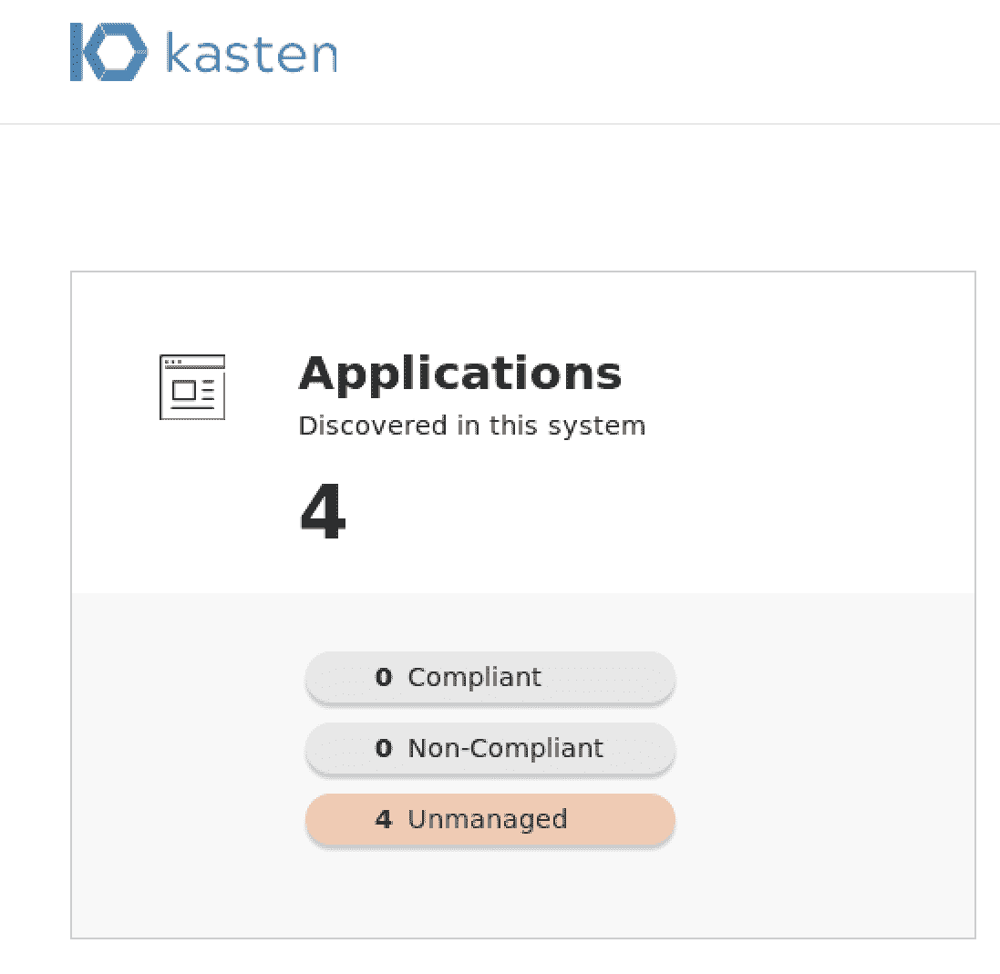

6.  在`backup-example`命名空间中，单击创建策略:

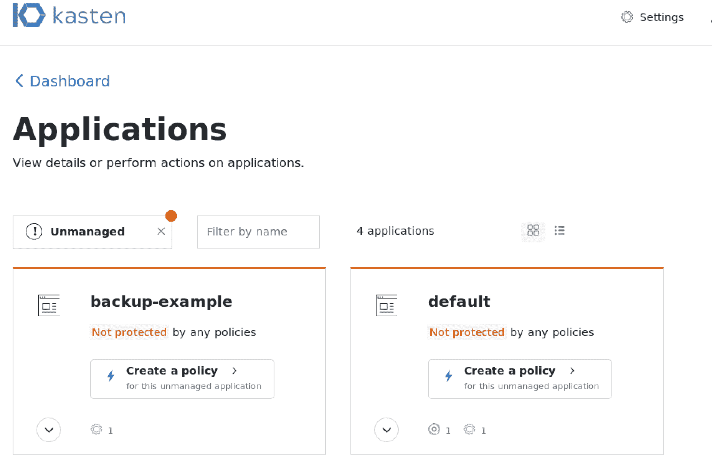

7.  输入名称并选择快照操作:

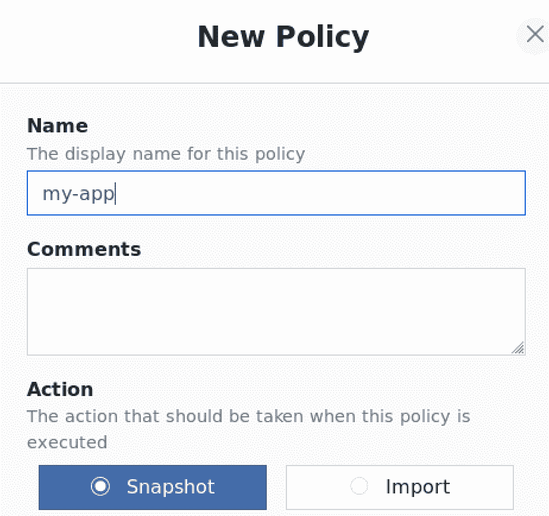

8.  选择“每日”作为操作频率:

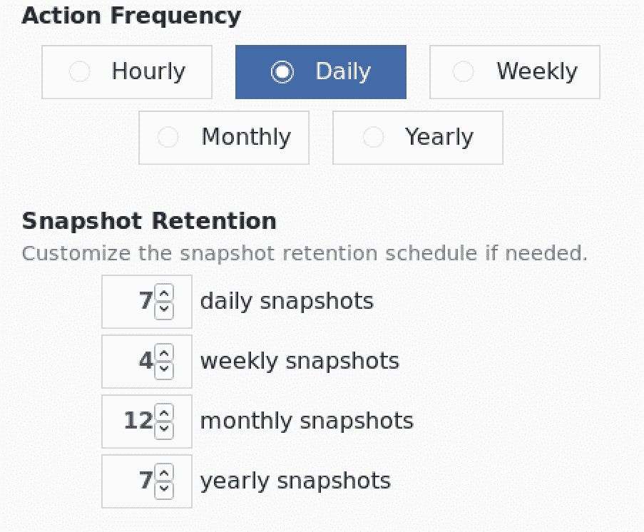

9.  单击创建策略:


通过执行这些步骤，您将使用策略创建了第一个备份，并为以下备份作业创建了时间表。

# 恢复应用程序

让我们执行以下步骤，从现有备份中恢复应用程序:

1.  在应用程序下，从兼容应用程序列表中，单击`backup-example`旁边的箭头图标，并选择恢复应用程序。如果应用程序已被删除，则需要选择“已删除”选项:

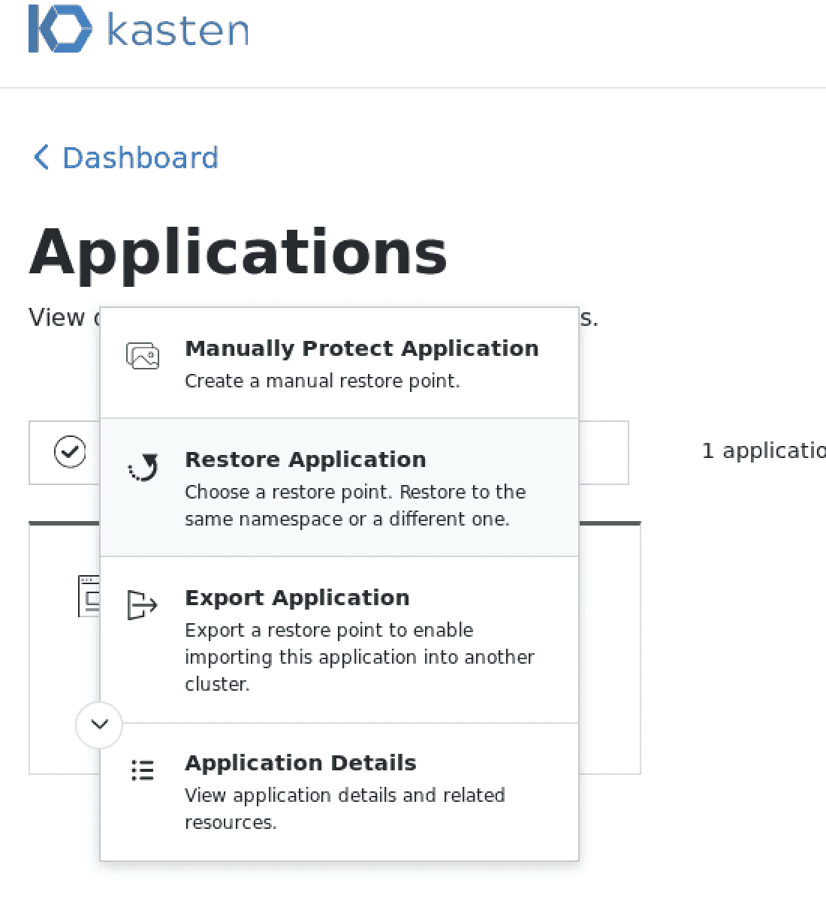

2.  选择要恢复到的还原点:

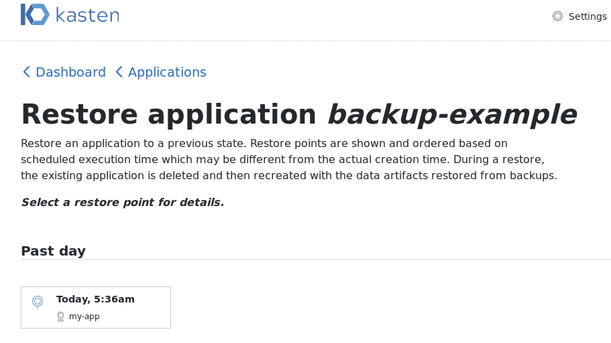

3.  选择`backup-example`并点击恢复:

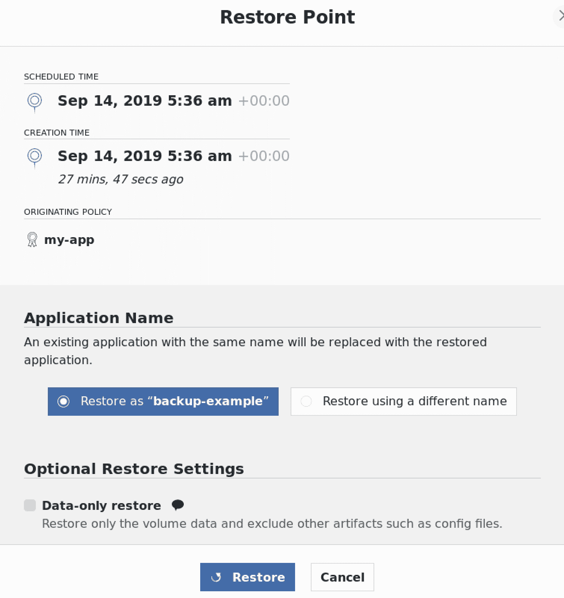

4.  确认您想要恢复:

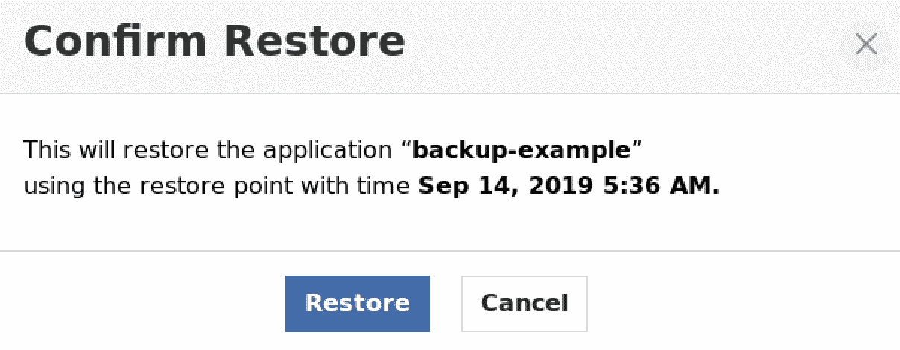

至此，您已经了解了如何使用 Kasten 从备份中恢复应用程序及其卷。

# 它是如何工作的...

此食谱向您展示了如何创建灾难恢复备份，如何从 S3 目标恢复应用程序及其数据，以及如何在 Kubernetes 上创建计划备份。

在*备份应用程序*配方中，在*步骤 2* 中，我们创建了一个使用 OpenEBS 作为存储供应商的 pod。在这种情况下，Kasten 使用了一种通用的备份方法，该方法要求您的应用程序有一个可以装载应用程序数据卷的边车。以下是使用非标准存储选项时可以添加到您的 pods 和部署中的示例:

```
- name: kanister-sidecar
  image: kanisterio/kanister-tools:0.20.0
  command: ["bash", "-c"]
  args:
  - "tail -f /dev/null"
  volumeMounts:
  - name: data
    mountPath: /data
```

# 请参见

*   卡斯滕文件，在[https://docs.kasten.io/](https://docs.kasten.io/)
*   卡斯滕命令行界面命令，在[https://docs.kasten.io/api/cli.html](https://docs.kasten.io/api/cli.html)
*   有关使用 Kanister 进行通用备份和恢复的更多信息，请访问[https://docs . kasten . io/Kanister/generic . html # generic-Kanister](https://docs.kasten.io/kanister/generic.html#generic-kanister)

# 跨云应用程序迁移

在云上运行应用程序时，重要的是要有一个计划，以防云供应商服务中断，并避免可能的云锁定，方法是使用类似于 OpenEBS 管理层的云原生存储解决方案抽象存储层，允许您管理对每个云或数据中心的暴露。在本节中，我们将把云原生应用程序从一个 Kubernetes 集群迁移到另一个运行在不同云供应商上的集群，以模拟迁移场景。您将学习如何使用 Kasten 和 OpenEBS Director 使用备份来迁移应用程序。

# 准备好

确保您已经准备好两个 Kubernetes 集群并且`kubectl`已配置为管理集群资源。

在本食谱中，我们将使用由 D2iQ `Konvoy`部署和管理的 AWS 上的集群和使用`kops`部署的集群。例如，我们将迁移一个现有的`minio`应用程序。

此处提供的说明要求 AWS 帐户和拥有使用相关服务权限的策略的 AWS 用户。如果没有，去[https://aws.amazon.com/account/](https://aws.amazon.com/account/)创建一个。

# 怎么做…

本节进一步分为以下几个小节，以简化这一过程:

*   在卡斯滕创建导出配置文件
*   在卡斯滕导出还原点
*   在卡斯滕创建导入配置文件
*   在 Kasten 迁移应用程序
*   在 openers director 中导入集群
*   在 OpenEBS Director 中迁移应用程序

# 在卡斯滕创建导出配置文件

首先，我们将使用 Kasten 并创建一个导出配置文件来存储迁移场景中使用的示例应用程序的远程副本。为此，请遵循以下步骤:

1.  在设置下，选择移动选项卡，然后单击新建配置文件:


2.  要创建目标配置文件，请选择导出，选中启用数据可移植性框，选择亚马逊 S3，然后输入您的用户凭据。
3.  单击验证并保存:


我们在此配方中创建的导出配置文件将在以后用于将数据移动到另一个集群。

# 在卡斯滕导出还原点

让我们执行以下步骤来创建应用程序还原点:

1.  在应用程序下，从兼容应用程序列表中，单击 minio 旁边的箭头图标，然后选择导出应用程序。
2.  选择要导出的还原点:

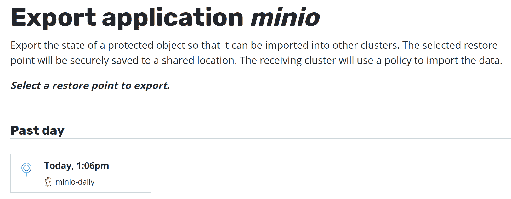

3.  选择您的导出配置文件，然后单击导出:

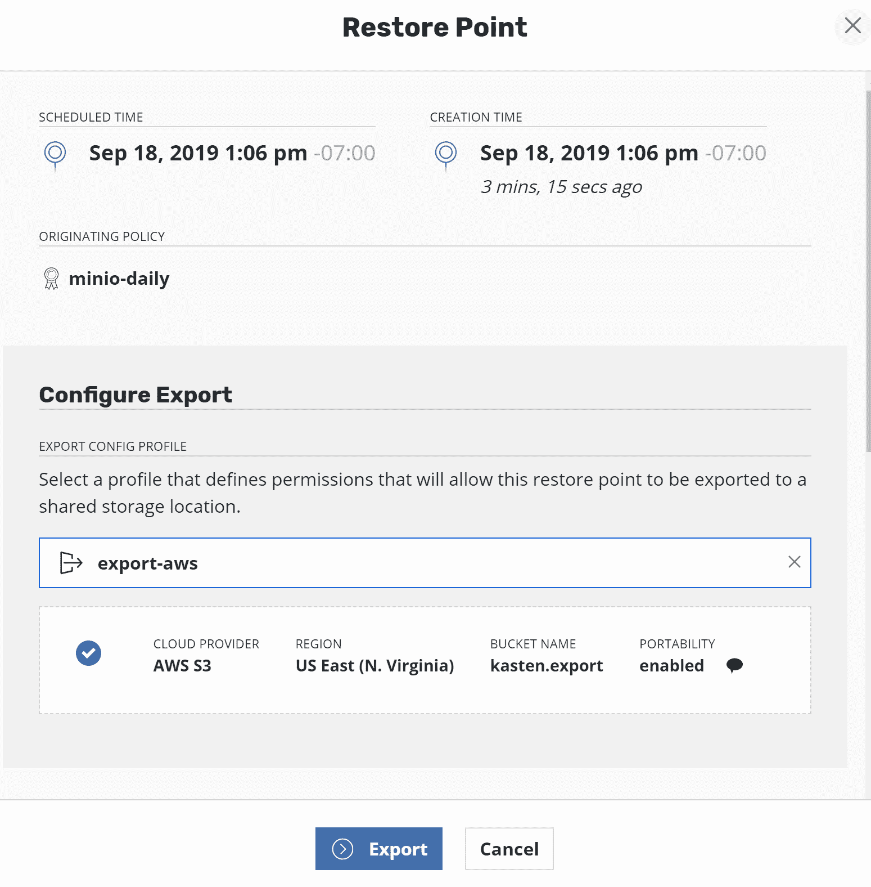

4.  确认恢复。
5.  将文本块复制到剪贴板:

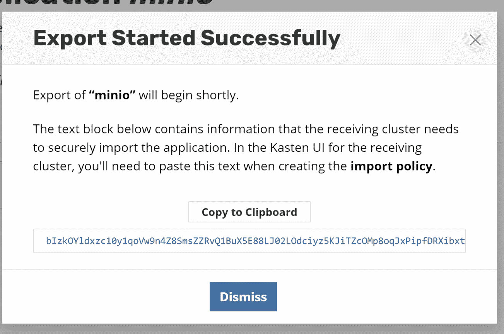

# 在卡斯滕创建导入配置文件

让我们在第二个集群上执行以下步骤，这是我们要迁移应用程序的地方:

1.  在设置下，选择移动选项卡，然后单击新建配置文件:


2.  要创建目的地配置文件，请选择导入，选择亚马逊 S3，然后输入您的用户凭据。
3.  使用您为源群集上的导出配置文件创建的存储桶名称。
4.  单击验证并保存:


我们在此配方中创建的导入配置文件将在以后用于从另一个集群导入数据。

# 在 Kasten 迁移应用程序

最后，让我们执行以下步骤来使用导入配置文件并从另一个集群迁移应用程序:

1.  在策略下，单击新策略:


2.  选择导入并选中导入后恢复框。
3.  选择每日作为操作频率，并从*导出还原点*配方粘贴配置数据文本块。
4.  选择您在*创建导入配置文件*配方中创建的导入配置文件:


5.  单击创建策略按钮。

在此步骤之后，Kasten 会将应用程序及其数据从还原点恢复到新的集群中。

# 将集群导入 openers 控制器

OpenEBS Director Online 是一个免费使用的 **SaaS(软件即服务)**解决方案(企业用户可以使用 OnPrem 选项)，用于管理 Kubernetes 中的有状态应用程序。除了日志记录和监控功能，它还提供**数据迁移即服务** ( **数据迁移即服务**)。在本食谱中，我们将学习如何将现有集群添加到平台，然后在以下食谱中执行 DMaaS:

1.  前往[https://portal.mayadata.io/home](https://portal.mayadata.io/home)登录您的 OpenEBS 企业平台:


2.  单击连接您的集群按钮:


3.  说出你的项目。这里，我们用了`GKECluster`这个名字:


4.  选择您的 Kubernetes 集群位置。这里，我们在`GKE`上使用了一个集群:

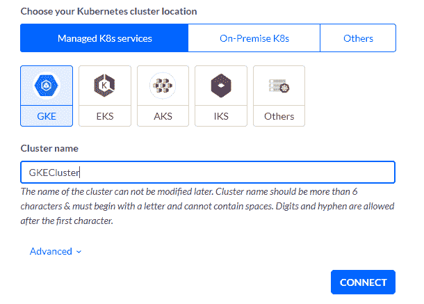

5.  在第一个集群上复制并执行命令:


6.  从左侧菜单中，单击集群:


7.  在集群视图中，单击连接新集群，并对第二个集群重复*步骤 4* 和*步骤 5* :


8.  完成后，您将在平台上看到这两个集群。

# 在 openejb director 中迁移应用程序

让我们按照以下步骤执行数据迁移(DMaaS):

1.  在“集群”视图中，单击“订阅”列下的“免费”，并开始评估这两个集群的高级计划:

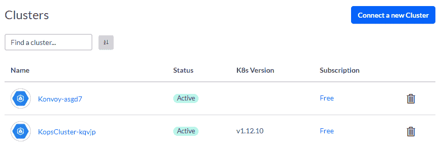

2.  在源群集的“概述”页面上，单击要迁移的工作负载。在本食谱中，我们将迁移 MinIO 工作负载:

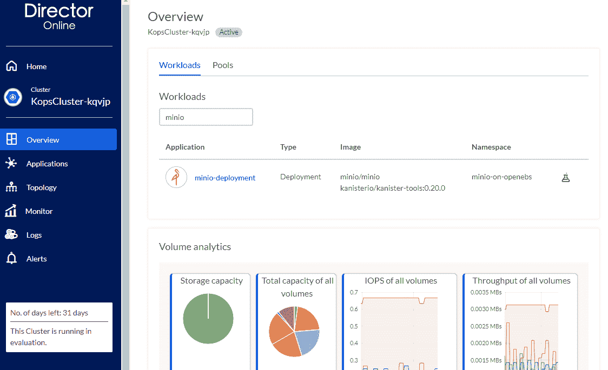

3.  在“应用程序”视图中，选择“数据助理”选项卡，然后单击“新建计划”按钮:


4.  在“新计划”视图中，选择 AWS 作为 S3 提供商，并选择您的凭据和地区。最后，选择备份间隔为每日，然后单击立即计划按钮创建备份。或者，您也可以使用 GCP 或 MinIO 作为 S3 目标:


5.  从左侧菜单中，选择“数据助理”，然后单击您创建的时间表旁边的“恢复”按钮:

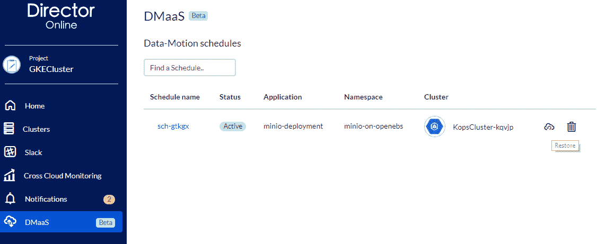

6.  从托管群集列表中选择您的目标群集，然后单击开始恢复:

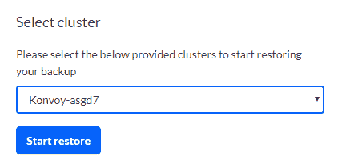

您的工作负载将恢复到第二个集群。

# 请参见

*   在[https://help.mayadata.io/hc/en-us](https://help.mayadata.io/hc/en-us)打开 EBS 总监文档
*   在汽车开发用例中使用 OpenEBS Director，在[https://youtu.be/AOSUZxUs5BE?t=1210](https://youtu.be/AOSUZxUs5BE?t=1210)
*   在[https://docs.openebs.io/docs/next/directoronline.html](https://docs.openebs.io/docs/next/directoronline.html)连接到 OpenEBS 导演在线