# 使用 Kubernetes 登录

在本章中，我们将讨论 Kubernetes 集群的集群日志记录。我们将讨论如何设置一个集群来接收日志，以及如何使用自我管理和托管解决方案来查看日志。

在本章中，我们将介绍以下食谱:

*   在本地访问 Kubernetes 日志
*   访问特定于应用的日志
*   使用 EFK 堆栈在 Kubernetes 构建集中式日志记录
*   使用谷歌 Stackdriver 与 Kubernetes 一起登录
*   使用托管的 Kubernetes 日志服务
*   针对您的詹金斯CI/CD环境的日志记录

# 技术要求

本章中的食谱期望您按照[第 1 章](01.html)*中描述的推荐方法之一，构建生产就绪型Kubernetes集群*，部署一个功能性Kubernetes集群。

本章中的*詹金斯CI/CD环境的日志记录*方法期望您拥有一个功能性的詹金斯服务器，该服务器具有通过遵循[第 3 章](03.html)、*构建CI/CD流水线中描述的推荐方法之一创建的现有配置项管道。*

Kubernetes 命令行工具`kubectl`将用于本章的其余部分，因为它是针对 Kubernetes 集群运行命令的主要命令行界面。为了部署解决方案，我们还将在有 Helm 图表的地方使用`helm`。

# 在本地访问 Kubernetes 日志

在 Kubernetes 中，日志可以在一定程度上用于调试和监控活动。基本日志记录可用于检测配置问题，但对于集群级日志记录，需要外部后端来存储和查询日志。集群级日志记录将在*中介绍，使用 EFK 堆栈*在 Kubernetes 构建集中式日志记录，使用谷歌 stack drive 配方在 Kubernetes 构建集中式日志记录。

在本节中，我们将学习如何基于 Kubernetes 中可用的选项来访问基本日志。

# 准备好

将`k8sdevopscookbook/src`存储库克隆到您的工作站，以使用`chapter10`目录中的清单文件，如下所示:

```
$ git clone https://github.com/k8sdevopscookbook/src.git
$ cd src/chapter10
```

确保您已准备好 Kubernetes 集群，并且`kubectl`和`helm`已配置为管理集群资源。

# 怎么做…

本节进一步分为以下几个小节，以简化这一过程:

*   通过 Kubernetes 访问日志
*   使用远程呈现在本地调试服务

# 通过 Kubernetes 访问日志

这个食谱将带你了解如何在本地访问 Kubernetes 日志和调试服务。

让我们执行以下步骤，通过使用 Kubernetes 中可用的各种选项来查看日志:

1.  获取在`kube-system`命名空间中运行的吊舱列表。在这个命名空间中运行的吊舱，尤其是`kube-apiserver`、`kube-controller-manager`、`kube-dns`和`kube-scheduler`，在Kubernetes控制平面中扮演着关键角色:

```
$ kubectl get pods -n kube-system
NAME                                             READY STATUS  RST AGE
dns-controller-6577fb57f7-hx9wz                  1/1   Running 0   16d
etcd-manager-events-ip-172-20-8-2.ec2.internal   1/1   Running 0   16d
etcd-manager-main-ip-172-20-8-2.ec2.internal     1/1   Running 0   16d
kube-apiserver-ip-172-20-8-2.ec2.internal        1/1   Running 2   16d
kube-controller-manager-ip-172-20-8-2.ec2.int... 1/1   Running 0   16d
kube-dns-66d58c65d5-mw6n5                        3/3   Running 0   16d
kube-dns-66d58c65d5-rntmj                        3/3   Running 0   16d
kube-dns-autoscaler-6567f59ccb-c9rmv             1/1   Running 0   16d
kube-proxy-ip-172-20-32-123.ec2.internal         1/1   Running 0   16d
kube-proxy-ip-172-20-38-218.ec2.internal         1/1   Running 1   16d
kube-proxy-ip-172-20-45-93.ec2.internal          1/1   Running 0   16d
kube-scheduler-ip-172-20-58-244.ec2.internal     1/1   Running 0  3d6h
```

2.  从`kube-system`命名空间中的单个容器中查看日志。在这个例子中，这个吊舱是`kube-apiserver`。替换吊舱的名称，并根据需要对其他吊舱重复此操作:

```
$ kubectl logs kube-apiserver-ip-172-20-58-244.ec2.internal -n kube-system
...
E1112 08:11:05.662027 1 authentication.go:65] Unable to authenticate the request due to an error: [invalid bearer token, Token has been invalidated]
I1112 09:09:39.448428 1 log.go:172] http: TLS handshake error from 124.84.242.10:49016: tls: first record does not look like a TLS handshake
I1112 09:30:00.726871 1 trace.go:81] Trace[76921086]: "GuaranteedUpdate etcd3: *coordination.Lease" (started: 2019-11-12 09:30:00.177607414 +0000 UTC m=+1250671.527180434) (total time: 549.223921ms):
```

如前面的输出所示，您可以在日志中找到事件的时间、来源和简短解释。

The output of the logs can become long, though most of the time all you need is the last few events in the logs. If you don't want to get all the logs since you only need the last few events in the log, you can add `-tail` to the end of the command, along with the number of lines you want to look at. For example, `kubectl logs <podname> -n <namespace> -tail 10` would return the last 10 lines. Change the number as needed to limit the output.

3.  豆荚可以容纳多个容器。列出容器时，`Ready`栏下的数字显示容器内的容器数量。让我们从`kube-system`命名空间中有多个容器的 pod 中查看一个特定的容器日志。在这里，我们正在看的吊舱叫做`kube-dns`。替换容器的名称，并对具有多个容器的任何其他容器重复此操作:

```
$ kubectl -n kube-system logs kube-dns-66d58c65d5-mw6n5
Error from server (BadRequest): a container name must be specified for pod kube-dns-66d58c65d5-mw6n5, choose one of: [kubedns dnsmasq sidecar]
$ kubectl -n kube-system logs kube-dns-66d58c65d5-mw6n5 kubedns
```

4.  要查看特定时间后的日志，请使用带有日期的`--since-time`参数，类似于下面的代码。您可以使用绝对时间，也可以请求持续时间。仅显示指定时间后或持续时间内的日志:

```
$ kubectl -n kube-system logs kube-dns-66d58c65d5-mw6n5 kubedns --since-time="2019-11-14T04:59:40.417Z"
...
I1114 05:09:13.309614 1 dns.go:601] Could not find endpoints for service "minio" in namespace "default". DNS records will be created once endpoints show up.
```

5.  除了 pod 名称，您还可以通过标签查看日志。这里，我们使用`k8s-app=kube-dns`标签列出豆荚。由于 pod 包含多个容器，我们可以使用`-c kubedns`参数来设置目标容器:

```
$ kubectl -n kube-system logs -l k8s-app=kube-dns -c kubedns
```

6.  如果容器已经崩溃或重启，我们可以使用`-p`标志从容器的前一个实例中检索日志，如下所示:

```
$ kubectl -n kube-system logs -l k8s-app=kube-dns -c kubedns -p
```

现在你知道如何通过 Kubernetes 访问 pod 日志了。

# 使用远程呈现在本地调试服务

当您的配置项管道中的构建失败或在临时集群中运行的服务包含错误时，您可能需要在本地运行该服务以正确排除故障。但是，应用依赖于集群上的其他应用和服务；例如，数据库。远程呈现帮助您在本地运行代码，作为一个正常的本地进程，然后将请求转发到 Kubernetes 集群。本食谱将向您展示如何在运行本地 Kubernetes 集群时在本地调试服务。

让我们执行以下步骤，通过 Kubernetes 中可用的各种选项查看日志:

1.  在 **OSX** 上，使用以下命令安装远程呈现二进制文件:

```
$ brew cask install osxfuse
$ brew install datawire/blackbird/telepresence
```

在**窗口**上，使用**Linux**Windows 子系统上的 Ubuntu(**WSL**)。然后，在 **Ubuntu** 上，使用以下命令下载并安装远程呈现二进制文件:

```
$ curl -s https://packagecloud.io/install/repositories/datawireio/telepresence/script.deb.sh | sudo bash
$ sudo apt install --no-install-recommends telepresence
```

2.  现在，创建应用的部署。这里，我们使用一个`hello-world`例子:

```
$ kubectl run hello-world --image=datawire/hello-world --port=8000
```

3.  使用外部`LoadBalancer`公开服务，获取服务 IP:

```
$ kubectl expose deployment hello-world --type=LoadBalancer --name=hello-world
$ kubectl get service hello-world
NAME        TYPE         CLUSTER-IP     EXTERNAL-IP                                   PORT(S)        AGE
hello-world LoadBalancer 100.71.246.234 a643ea7bc0f0311ea.us-east-1.elb.amazonaws.com 8000:30744/TCP 8s
```

4.  为了能够查询地址，请使用以下命令将地址存储在变量中:

```
$ export HELLOWORLD=http://$(kubectl get svc hello-world -o jsonpath='{.status.loadBalancer.ingress[0].hostname}'):8000
```

5.  向服务发送查询。这将返回类似如下的`Hello, world!`消息:

```
$ curl $HELLOWORLD/
Hello, world!
```

6.  接下来，我们将创建一个本地 web 服务，并用本地 web 服务器服务替换 Kubernetes 服务`hello-world`消息。首先，使用 HTTP 服务器创建要共享的目录和文件:

```
$ mkdir /tmp/local-test && cd /tmp/local-test
$ echo "hello this server runs locally on my laptop" > index.html
```

7.  创建一个 web 服务器，并使用以下命令通过端口`8000`公开服务:

```
$ telepresence --swap-deployment hello-world --expose 8000 \
--run python3 -m http.server 8000 &

...
T: Forwarding remote port 8000 to local port 8000.
T: Guessing that Services IP range is 100.64.0.0/13\. Services started after this point will be inaccessible if are outside
T: this range; restart telepresence if you can't access a new Service.
T: Setup complete. Launching your command.
Serving HTTP on 0.0.0.0 port 8000 (http://0.0.0.0:8000/) ...
```

前面的命令将使用`vpn-tcp`方法启动代理。其他方法可以在*中的*远程呈现方法完整列表*链接中找到，另请参见*部分。

When a service is exposed over the network, remember that your computer is exposed to all the risks of running a web server. When you expose a web service using the commands described here, make sure that you don't have any important files in the `/tmp/local-test` directory that you don't want to expose externally. 

8.  向服务发送查询。您将看到对`hello-world`服务的查询将被转发到您的本地网络服务器:

```
$ curl $HELLOWORLD/
hello this server runs locally on my laptop
```

9.  要结束本地服务，使用`fg`命令将当前 shell 环境中的后台远程呈现作业带到前台。然后，使用 *Ctrl* + *C* 键退出。

# 它是如何工作的...

在本食谱中，您学习了如何在本地访问日志和调试服务问题。

在使用远程呈现方法本地调试服务的*中，在*步骤 7* 中，我们运行`telepresence --swap-deployment`命令，用本地网络服务替换服务。*

远程呈现通过构建双向网络代理来发挥作用。`--swap-deployment`标志用于定义将被集群上的代理 pod 替换的 pod。远程呈现启动一个`vpn-tcp`进程，将所有请求发送到本地公开的端口，即`8000`。`--run python3 -m http.server 8000 &`标志告诉网真通过端口`8000`在后台使用 Python 3 运行一个`http.server`。

在同一个配方中，在*步骤 9* 中，`fg`命令用于将后台服务移动到前台。当您退出服务时，旧的 pod 将被恢复。通过查看*中的*远程呈现如何工作*链接，您可以了解远程呈现是如何工作的。*

# 请参见

*   `kubectl`日志命令:[https://kubernetes . io/docs/reference/generated/kube CTL/kube CTL-commands #日志](https://kubernetes.io/docs/reference/generated/kubectl/kubectl-commands#logs)
*   远程呈现源代码库:[https://github.com/telepresenceio/telepresence](https://github.com/telepresenceio/telepresence)
*   远程呈现方法完整列表:[https://telepresence.io/reference/methods.html](https://telepresence.io/reference/methods.html)
*   远程呈现是如何工作的:[https://www.telepresence.io/discussion/how-it-works](https://www.telepresence.io/discussion/how-it-works)
*   如何使用远程呈现的卷访问支持:[https://telepresence.io/howto/volumes.html](https://telepresence.io/howto/volumes.html)

# 访问特定于应用的日志

在 Kubernetes 中，可以通过`kubectl logs`命令访问与如何调度 pod 和容器相关的 pod 和部署日志，但并不是所有的应用日志和命令都通过 Kubernetes APIs 公开。可能需要访问容器中的这些日志和 shell 命令。

在本节中，我们将学习如何访问容器外壳、提取日志和更新二进制文件以进行故障排除。

# 准备好

将`k8sdevopscookbook/src`存储库克隆到您的工作站，以使用`chapter10`目录下的清单文件，如下所示:

```
$ git clone https://github.com/k8sdevopscookbook/src.git
$ cd src/chapter10
```

确保您已经准备好 Kubernetes 集群并且`kubectl`已配置为管理集群资源。

# 怎么做…

本节进一步分为以下几个小节，以简化这一过程:

*   获取容器中的外壳访问权限
*   访问容器内的 PostgreSQL 日志

# 获取容器中的外壳访问权限

让我们执行以下步骤来创建一个具有多个容器的部署，并将一个 shell 引入正在运行的容器中:

1.  在这个食谱中，我们将在 OpenEBS 持久卷上部署 PostgreSQL 来演示 shell 访问。将目录更改为`src/chapter10/postgres`中的示例文件目录，这是存储该配方的所有 YAML 清单的地方。创建一个数据库名称和凭证类似于下面的`ConfigMap`，或者检查它们并使用`cm-postgres.yaml`文件:

```
$ cd postgres
$ cat <<EOF | kubectl apply -f -
apiVersion: v1
kind: ConfigMap
metadata:
 name: postgres-config
 labels:
 app: postgres
data:
 POSTGRES_DB: postgresdb
 POSTGRES_USER: testuser
 POSTGRES_PASSWORD: testpassword123
EOF
```

2.  为`postgres`创建服务:

```
$ cat <<EOF | kubectl apply -f -
apiVersion: v1
kind: Service
metadata:
 name: postgres
 labels:
 app: postgres
spec:
 type: NodePort
 ports:
 - port: 5432
 selector:
 app: postgres
EOF
```

3.  查看`postgres.yaml`文件，并将其应用于创建 PostgreSQL 状态集。我们可以用它来部署吊舱和自动创建光伏/聚氯乙烯:

```
$ kubectl apply -f postgres.yaml
```

4.  获取带有`postgres`标签的豆荚:

```
$ kubectl get pods -l app=postgres
NAME READY STATUS RESTARTS AGE
postgres-0 1/1 Running 0 7m5s
postgres-1 1/1 Running 0 6m58s
```

5.  将一个外壳放入`postgres-0`容器中:

```
$ kubectl exec -it postgres-0 -- /bin/bash
```

前面的命令将让您获得运行容器的 shell 访问权限。

# 访问容器内的 PostgreSQL 日志

让我们执行以下步骤，从容器内运行的应用中获取日志:

1.  当您在 shell 中时，使用用户名`testuser`连接到名为`postgresdb`的 PostgreSQL 数据库。您将看到 PostgreSQL 提示，如下所示:

```
$ psql --username testuser postgresdb
psql (12.1 (Debian 12.1-1.pgdg100+1))
Type "help" for help.
```

2.  在 PostgreSQL 提示符下，使用以下命令创建一个表并向其中添加一些数据:

```
CREATE TABLE test (
   id int GENERATED BY DEFAULT AS IDENTITY PRIMARY KEY,
   a int NOT NULL,
   created_at timestamptz NOT NULL DEFAULT CURRENT_TIMESTAMP
);
INSERT INTO test (a) SELECT * FROM generate_series(-1, -1000, -1);
```

3.  从`postgresql.conf`获取日志的配置详细信息。您会看到日志存储在`/var/log/postgresql`目录中:

```
$ cat /var/lib/postgresql/data/postgresql.conf |grep log
```

4.  列出并访问`/var/log/postgresql`目录中的日志:

```
$ ls /var/log/postgresql
```

5.  或者，当您在容器中时，您可以使用以下命令在`tmp`目录中创建我们的示例`postgresdb`数据库的备份:

```
$ pg_dump --username testuser postgresdb > /tmp/backup.sql
```

至此，您已经了解了如何让 shell 访问容器，以及如何访问容器中本地存储的日志和文件。

# 使用 EFK 堆栈在 Kubernetes 构建集中式日志记录

如*本地访问 Kubernetes 日志*部分所述，基本日志可以用来检测配置问题，但是对于集群级日志，需要外部后端来存储和查询日志。集群级日志堆栈可以帮助您快速分类和分析由 Kubernetes 集群中的应用生成的大量生产日志数据。Kubernetes 生态系统中最受欢迎的集中式日志解决方案之一是 **Elasticsearch、Logstash 和 Kibana** ( **ELK** )堆栈。

在 ELK 堆栈中，Logstash 用作日志收集器。Logstash 使用的内存比 Fluent Bit 稍多，Fluent Bit 是 Fluent 的一个低占用空间版本。因此，在本食谱中，我们将使用**弹性搜索、流畅位和基巴纳** ( **EFK** )堆栈。如果您有一个应用有日志隐藏依赖项，您总是可以用日志隐藏替换 Fluentd/Fluent Bit。

在本节中，我们将学习如何使用 EFK 堆栈来管理 Kubernetes 日志，从而构建集群级日志记录系统。

# 准备好

将`k8sdevopscookbook/src`存储库克隆到您的工作站，以使用`chapter10`目录中的清单文件，如下所示:

```
$ git clone https://github.com/k8sdevopscookbook/src.git
$ cd src/chapter10
```

确保您已准备好 Kubernetes 集群，并且`kubectl`和`helm`已配置为管理集群资源。

# 怎么做…

本节将向您展示如何在 Kubernetes 集群上配置 EFK 堆栈。本节进一步分为以下几个小节，以简化这一过程:

*   部署弹性搜索运算符
*   请求弹性搜索端点
*   部署基巴纳
*   使用流畅位聚合日志
*   访问基巴纳的 Kubernetes 日志

# 部署弹性搜索运算符

Elasticsearch 是一个高度可扩展的开源全文搜索和分析引擎。Elasticsearch 允许您快速存储、搜索和分析大量数据。在这个配方中，我们将使用它来存储 Kubernetes 日志。

让我们执行以下步骤来部署库本内斯 ( **ECK** )上的**弹性云:**

1.  使用以下命令部署弹性搜索运算符及其 CRDs:

```
$ kubectl apply -f https://download.elastic.co/downloads/eck/1.0.0/all-in-one.yaml
```

2.  弹性搜索操作员将创建自己的**自定义资源定义** ( **CRD** )。我们稍后将使用这个 CRD 在 Kubernetes 上部署和管理弹性搜索实例。使用以下命令列出新的 CRD:

```
$ kubectl get crds |grep elastic.co
apmservers.apm.k8s.elastic.co                2019-11-25T07:52:16Z
elasticsearches.elasticsearch.k8s.elastic.co 2019-11-25T07:52:17Z
kibanas.kibana.k8s.elastic.co                2019-11-25T07:52:17Z
```

3.  创建一个名为`logging`的新命名空间:

```
$ kubectl create ns logging
```

4.  使用以下命令，使用`logging`命名空间中的默认参数创建弹性搜索:

```
$ cat <<EOF | kubectl apply -f -
apiVersion: elasticsearch.k8s.elastic.co/v1beta1
kind: Elasticsearch
metadata:
 name: elasticsearch
 namespace: logging
spec:
 version: 7.4.2
 nodeSets:
 - name: default
 count: 3
 config:
 node.master: true
 node.data: true
 node.ingest: true
 node.store.allow_mmap: false
EOF
```

5.  获取弹性搜索节点的状态:

```
$ kubectl get elasticsearch -n logging
NAME HEALTH NODES VERSION PHASE AGE
elasticsearch green 3 7.4.2 Ready 86s
```

6.  您还可以使用以下命令确认 pod 在日志命名空间中的状态:

```
$ kubectl get pods -n logging
NAME                       READY STATUS  RESTARTS AGE
elasticsearch-es-default-0 1/1   Running 0        2m24s
elasticsearch-es-default-1 1/1   Running 0        2m24s
elasticsearch-es-default-2 1/1   Running 0        2m24s
```

将创建一个三节点弹性搜索集群。默认情况下，我们在这里创建的节点都是以下类型:符合主节点条件的节点、数据节点和接收节点。随着您的弹性搜索集群的增长，建议创建专用的主合格数据和摄取节点。

# 请求弹性搜索端点

创建弹性搜索集群时，会生成一个默认用户密码，并将其存储在 Kubernetes 密码中。您将需要完整的凭据来请求弹性搜索端点。

让我们执行以下步骤来请求弹性搜索访问:

1.  获取为默认`elastic`用户生成的密码:

```
$ PASSWORD=$(kubectl get secret elasticsearch-es-elastic-user \
-n logging -o=jsonpath='{.data.elastic}' | base64 --decode)
```

2.  请求弹性搜索端点地址:

```
$ curl -u "elastic:$PASSWORD" -k "https://elasticsearch-es-http:9200"
{
 "name" : "elasticsearch-es-default-2",
 "cluster_name" : "elasticsearch",
 "cluster_uuid" : "E_ATzAz8Th6oMvd4D_QocA",
 "version" : {...},
 "tagline" : "You Know, for Search"
}
```

如果您正在远程访问 Kubernetes 集群，您可以创建一个端口转发服务并使用 localhost，类似于下面的代码:

```
$ kubectl port-forward service/quickstart-es-http 9200
$ curl -u "elastic:$PASSWORD" -k "https://localhost:9200"
```

现在，我们可以访问部署在 Kubernetes 上的三节点小型弹性搜索集群。接下来，我们需要部署 Kibana 来完成堆栈。

# 部署基巴纳

Kibana 是一个开源的数据可视化仪表板，允许您可视化您的弹性搜索数据。

让我们执行以下步骤来部署基巴纳:

1.  创建一个与我们之前创建的弹性搜索集群相关联的 Kibana 实例:

```
$ cat <<EOF | kubectl apply -f -
apiVersion: kibana.k8s.elastic.co/v1beta1
kind: Kibana
metadata:
 name: mykibana
 namespace: logging
spec:
 version: 7.4.2
 count: 1
 elasticsearchRef:
 name: elasticsearch
EOF
```

2.  获取基巴纳节点的状态:

```
$ kubectl get elasticsearch -n logging
NAME     HEALTH NODES VERSION AGE
mykibana green  1     7.4.2   2m27s
```

3.  您还可以使用以下命令确认 pod 在日志命名空间中的状态:

```
$ kubectl get pods -n logging
NAME                         READY STATUS  RESTARTS AGE
elasticsearch-es-default-0   1/1   Running 0        37m
elasticsearch-es-default-1   1/1   Running 0        37m
elasticsearch-es-default-2   1/1   Running 0        37m
mykibana-kb-7864bfdb45-26lpq 1/1   Running 0        3m36s
```

这样，您就同时部署了弹性搜索和基巴纳节点。接下来，我们将部署 fluent-bit 来将容器日志转发到我们的 Elasticsearch 部署。

# 使用流畅位聚合日志

让我们执行以下步骤来部署 fluent-bit:

1.  获取默认`elastic`用户的密码:

```
$ kubectl get secret elasticsearch-es-elastic-user \
-n logging -o=jsonpath='{.data.elastic}' | base64 --decode; echo
```

2.  复制*步骤 1* 的输出，在`/src/chapter10/efk`目录下编辑`fluent-bit-values.yaml`文件。将`http_passwd`值替换为*步骤 1* 的输出，并保存文件:

```
backend:
 type: es
 es:
 host: elasticsearch-es-http
 port: 9200
 http_user: elastic
 http_passwd: m2zr9fz49zqbkbpksprf4r76
 # Optional TLS encryption to ElasticSearch instance
 tls: "on"
 tls_verify: "off"
```

3.  使用 Helm 图表部署流畅位:

```
$ helm install stable/fluent-bit --name=fluent-bit --namespace=logging -f fluent-bit-values.yaml
```

4.  使用以下命令确认 pod 在`logging`命名空间中的状态:

```
$ kubectl get pods -n logging
NAME                         READY STATUS  RESTARTS AGE
elasticsearch-es-default-0   1/1   Running 0        158m
elasticsearch-es-default-1   1/1   Running 0        158m
elasticsearch-es-default-2   1/1   Running 0        158m
fluent-bit-249ct             1/1   Running 0        2m11s
fluent-bit-4nb9k             1/1   Running 0        2m11s
fluent-bit-fqtz9             1/1   Running 0        2m11s
fluent-bit-lg9hn             1/1   Running 0        2m11s
mykibana-kb-5596b888b5-qv8wn 1/1   Running 0        115m
```

至此，您已经部署了 EFK 堆栈的所有组件。接下来，我们将连接到基巴纳仪表板。

# 访问基巴纳的 Kubernetes 日志

让我们执行以下步骤来连接到基巴纳仪表板:

1.  确认基巴纳服务已经创建。默认情况下，将创建一个`ClusterIP`服务:

```
$ kubectl get service mykibana-kb-http -n logging
```

2.  在我们连接到仪表板之前，获取默认`elastic`用户的密码:

```
$ kubectl get secret elasticsearch-es-elastic-user \
-n logging -o=jsonpath='{.data.elastic}' | base64 --decode; echo
```

3.  创建端口转发服务，从您的工作站访问基巴纳仪表板:

```
$ kubectl port-forward service/mykibana-kb-http 5601
```

4.  在浏览器中`https://localhost:5601`打开基巴纳仪表盘。从*步骤 2* 的输出中输入`elastic`作为用户名和密码:

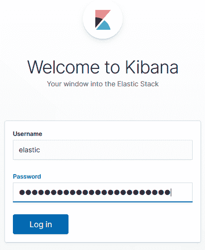

5.  在主页上，单击连接到您的弹性搜索索引按钮，如下图所示:

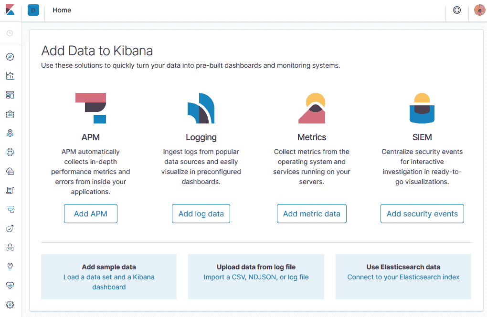

6.  Kibana 将搜索 Elasticsearch 索引模式。定义与您的结果相匹配的索引模式。在我们的例子中，我们使用了`kubernetes_cluster-*`。单击下一步继续:

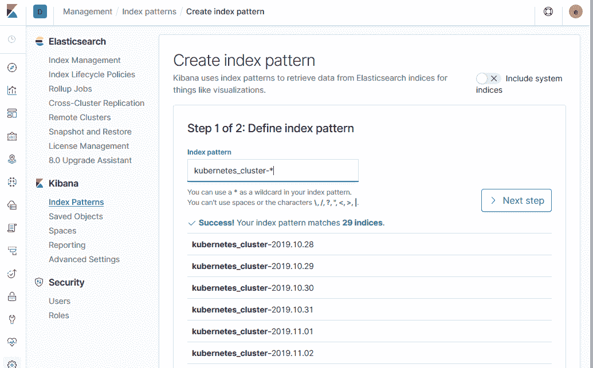

7.  指定时间过滤器字段名为`@timestamp`，点击创建索引模式按钮，如下图所示:

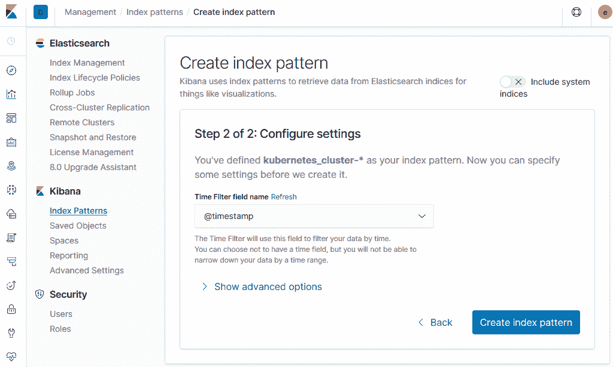

8.  单击“发现”菜单。它是顶部的第一个图标:

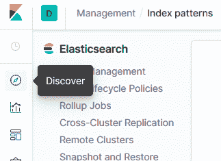

9.  在“发现”页面上，使用搜索字段查找关键字和筛选器:

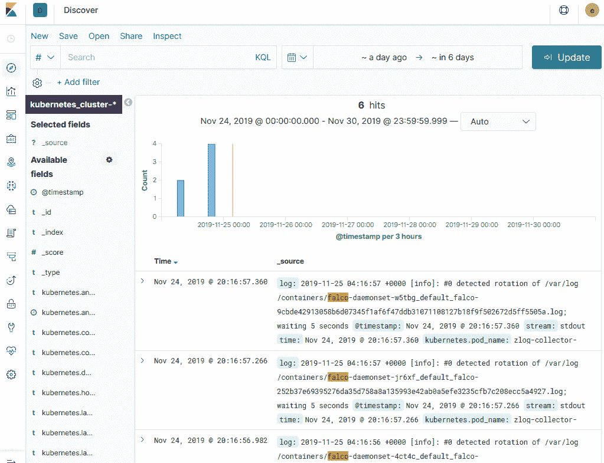

10.  如果在当前时间范围内找不到您要查找的关键字，您需要更改日期范围，方法是单击搜索字段旁边的日历图标，并在选择新范围后单击应用按钮:


至此，您已经学习了如何在 Kubernetes 集群上配置 EFK 堆栈，以便管理和可视化集群范围的日志。

# 请参见

*   **库本内斯上的弹性云**(**ECK**):[https://github.com/elastic/cloud-on-k8s](https://github.com/elastic/cloud-on-k8s)
*   红帽 OpenShift 上的部署说明:[https://www . elastic . co/guide/en/cloud-on-k8s/0.9/k8s-OpenShift . html](https://www.elastic.co/guide/en/cloud-on-k8s/0.9/k8s-openshift.html)
*   弹性搜索服务文档:[https://www.elastic.co/guide/en/cloud/current/index.html](https://www.elastic.co/guide/en/cloud/current/index.html)
*   Kibana 简介:[https://www . elastic . co/guide/en/Kibana/7.4/introduction . html #简介](https://www.elastic.co/guide/en/kibana/7.4/introduction.html#introduction)
*   流动文件:[https://docs.fluentd.org/](https://docs.fluentd.org/)
*   流利的 Bit 文档:[https://docs.fluentbit.io/manual/](https://docs.fluentbit.io/manual/)
*   牧场主弹性堆栈 Kubernetes Helm Charts:[https://github . com/牧场主/图表/树/主/图表/efk/v7.3.0](https://github.com/rancher/charts/tree/master/charts/efk/v7.3.0)
*   工藤弹性算子:[https://github . com/kudobuilder/operators/tree/master/repository/Elastic](https://github.com/kudobuilder/operators/tree/master/repository/elastic)

# 使用谷歌 Stackdriver 记录Kubernetes

在本节中，我们将使用谷歌 Stackdriver Kubernetes 引擎监控来监控、隔离和诊断我们的容器化应用和微服务环境。您将学习如何使用 Stackdriver Kubernetes 引擎监控来聚合 GKE Kubernetes 环境中的日志、事件和指标，以帮助您了解应用在生产中的行为。

# 准备好

确保您已经准备好了一个**谷歌库本内斯引擎** ( **GKE** )集群，并配置了`kubectl`来管理集群资源。如果没有，可以按照*在谷歌云平台*上配置 Kubernetes 集群食谱中[第 1 章](01.html)、*构建生产就绪的 Kubernetes 集群*中的说明进行操作。

# 怎么做…

本节进一步分为以下几个小节，以简化这一过程:

*   为 GKE 安装 Stackdriver Kubernetes 发动机监控支持
*   在 Stackdriver 上配置工作区
*   使用 Stackdriver 查看 GKE 日志

# 为 GKE 安装 Stackdriver Kubernetes 发动机监控支持

安装 Stackdriver Monitoring 支持允许您使用高级分析和跟踪功能轻松监控 GKE 集群、调试日志和分析集群性能。在这个配方中，我们将启用 Stackdriver Kubernetes 引擎监控支持，从我们的 GKE 集群中收集集群指标。请遵循以下步骤:

1.  在[https://console.cloud.google.com/kubernetes](https://console.cloud.google.com/kubernetes)打开谷歌 Kubernetes 引擎控制台。在此控制台上，您将看到您的 GKE 集群列表。这里，我们有一个集群叫做`k8s-devops-cookbook-1`:

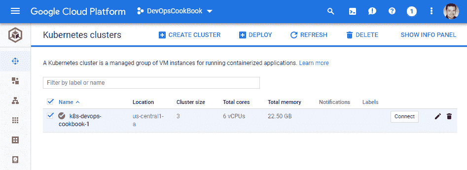

2.  单击集群旁边的小笔形编辑图标:


3.  在“群集配置”页面上，确保禁用了旧堆栈河日志记录和旧堆栈河监控，并且将“堆栈河库本内斯引擎监控”选项设置为“已启用”:


4.  单击保存按钮将这些更改应用到您的集群。

# 使用 Stackdriver 查看 GKE 日志

启用 Stackdriver Monitoring 支持允许您使用高级分析和跟踪功能轻松监控 GKE 集群、调试日志和分析集群性能。在这个食谱中，我们将学习如何访问我们在 GKE 的 Kubernetes 集群的日志。请遵循以下步骤:

1.  从谷歌云控制台，通过转到[https://console.cloud.google.com/logs/viewer](https://console.cloud.google.com/logs/viewer)打开 Stackdriver 日志查看器:


2.  从“资源”菜单中，单击库本内斯容器选项:

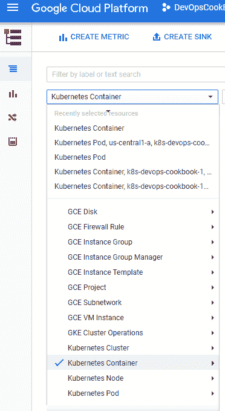

3.  Stackdriver 日志视图将显示所选 GKE 集群中容器的日志列表。在这里，您可以看到过去 7 天的容器日志正在显示:

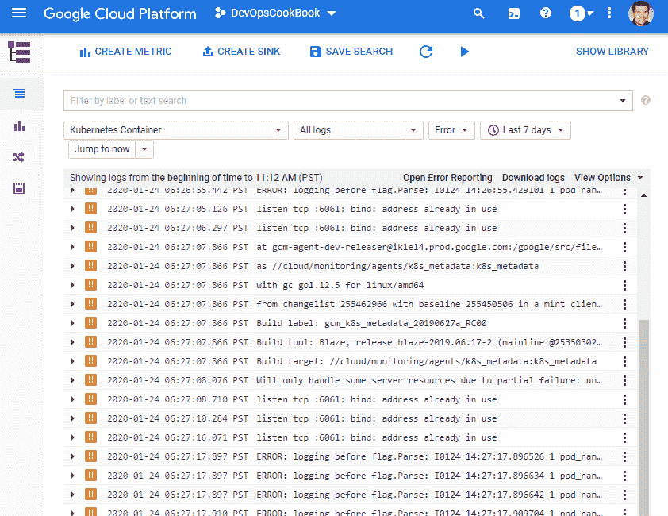

4.  将日志级别过滤为“严重”，并将时间范围设置为“最近 24 小时”，以查看最近的严重容器日志。在下面的截图中可以看到一个示例结果:

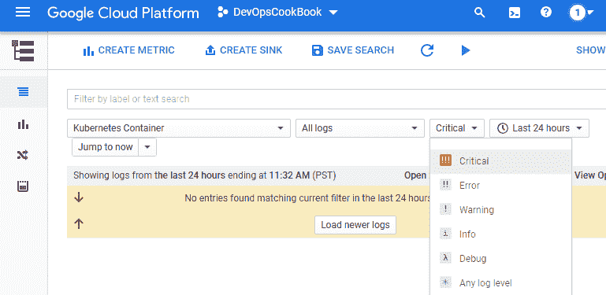

这样，您就知道如何使用 Stackdriver 查看 GKE 集群和资源的日志，例如已经部署在 GKE 集群上的容器。

# 请参见

*   谷歌 Stackdriver 日志文档:[https://cloud.google.com/logging/docs](https://cloud.google.com/logging/docs)
*   Stackdriver 基本查询示例:[https://cloud.google.com/logging/docs/view/basic-queries](https://cloud.google.com/logging/docs/view/basic-queries)
*   使用测井工具快速启动:[https://cloud.google.com/logging/docs/quickstart-sdk](https://cloud.google.com/logging/docs/quickstart-sdk)
*   Stackdriver 日志路由器概述:[https://cloud.google.com/logging/docs/routing/overview](https://cloud.google.com/logging/docs/routing/overview)

# 使用托管的 Kubernetes 日志服务

运行 EFK 堆栈来存储和维护集群中的 Kubernetes 日志非常有用，直到集群出现问题。建议您将日志管理系统和生产集群分开，以便在集群出现故障时可以访问。

在本节中，我们将学习如何使用一些免费提供的 SaaS 解决方案来保持您的集群日志可访问，即使您的集群不可用。

# 准备好

确保您已经准备好 Kubernetes 集群并且`kubectl`已配置为管理集群资源。

# 怎么做…

本节进一步分为以下几个小节，以简化这一过程:

*   将集群添加到控制器在线
*   使用在线控制器访问日志

# 将集群连接到控制器在线

OpenEBS Director 提供了一个免费管理的 EFK 堆栈作为 SaaS 解决方案，因此您可以存储和管理您的 Kubernetes 集群日志。在本食谱中，我们将把 Kubernetes 集群添加到 Director SaaS 平台，以便在云中存储我们的日志:

1.  前往[https://portal.mayadata.io/home](https://portal.mayadata.io/home)登录您的 OpenEBS 企业平台:

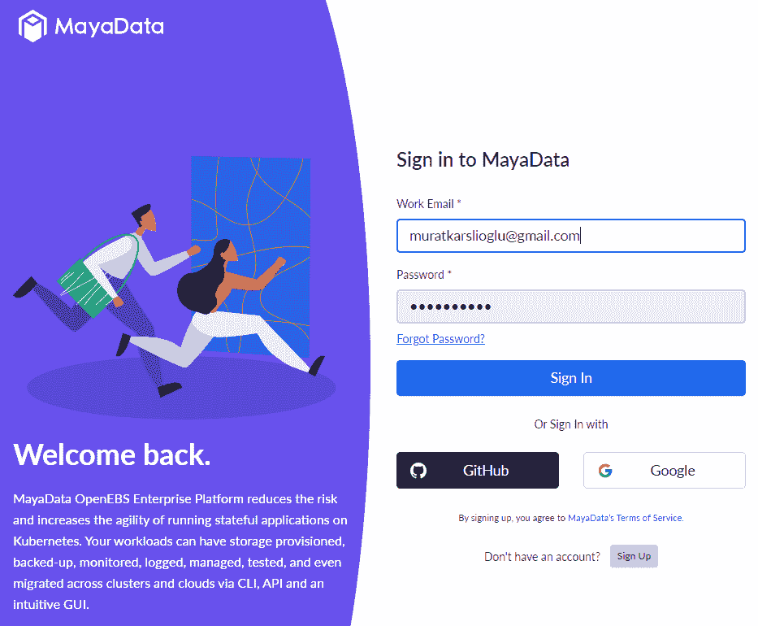

2.  单击连接您的集群按钮:

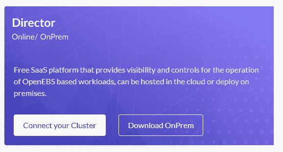

3.  从主菜单中，选择集群，然后单击连接新集群按钮。
4.  选择您的 Kubernetes 集群位置并命名您的项目。这里，我们使用了一个 AWS 集群，并将`AWSCluster`设置为我们的集群名称:


5.  在第一个集群上复制并执行命令:


完成此操作后不久，Director Online 将在您的集群上部署一个灵活的转发器和聚合器，以收集其平台上的日志。

# 使用在线控制器访问日志

OpenEBS Director 的免费计划存储集群日志长达 1 周。额外的存储由高级计划提供。在本食谱中，我们将学习如何使用 Director Online 提供的托管 EFK 堆栈来访问日志:

1.  前往[https://portal.mayadata.io/home](https://portal.mayadata.io/home)登录您的 OpenEBS 企业平台。
2.  从主菜单中，选择集群并选择活动集群。
3.  从左侧菜单中，单击日志:


4.  将在基巴纳探索仪表板上打开日志视图。在这里，您可以使用搜索和过滤弹性搜索和基巴纳的功能来管理您的 Kubernetes 日志:


至此，您已经学会了如何使用托管 Kubernetes 日志记录解决方案来简单地保持日志的可访问性。您可以在多个集群上使用控制器在线，并从单个界面管理日志。

# 针对您的詹金斯CI/CD环境的日志记录

在繁忙的构建环境中，CI/CD 管道每天都会生成大量的元数据。Elasticsearch 是从 Jenkins 输入这类数据的完美平台。

在本节中，我们将学习如何启用和访问我们的 Jenkins 实例的日志，并分析团队效率。

# 准备好

本食谱中提到的所有操作都需要一个功能齐全的詹金斯部署，如*在詹金斯 X* 部分设置 CI/CD 管道中[第 3 章](03.html)、*构建 CI/CD 管道*所述。

将`k8sdevopscookbook/src`存储库克隆到您的工作站，以使用`chapter10`目录中的清单文件:

```
$ git clone https://github.com/k8sdevopscookbook/src.git
$ cd src/chapter10
```

确保您已经准备好了 Kubernetes 集群、Jenkins X 和 EFK 堆栈，并且`kubectl`已经配置好，以便您可以管理集群资源。

# 怎么做…

本节将向您展示如何将 Jenkins 日志馈送到 Elasticsearch。本节进一步分为以下几个小节，以简化这一过程:

*   安装 Fluentd 插件
*   使用 Fluentd 将詹金斯日志流式传输到弹性搜索

# 安装 Fluentd 插件

Fluentd 是 EFK 堆栈的一部分，还有 Elasticsearch 和 Kibana。它是一个用于构建统一日志记录层的开源数据收集器。这个食谱将告诉你如何为詹金斯安装 Fluentd 插件，它将把詹金斯日志转发给你的 Fluentd 记录器。

让我们执行以下步骤在 Jenkins 上安装 Fluentd 插件:

1.  访问您的詹金斯服务控制面板，然后单击管理詹金斯菜单:


2.  在管理詹金斯菜单中，单击管理插件按钮:


3.  点击可用选项卡，在过滤器字段中搜索`fluentd`。结果应该如下所示。单击不重启安装按钮安装 Fluentd 插件:


Fluentd 插件将在不需要重新启动 Jenkins 实例的情况下安装。

# 使用 Fluentd 将詹金斯日志流式传输到弹性搜索

在这个食谱中，我们将学习如何配置我们在詹金斯上安装的 Fluentd 插件。

让我们执行以下步骤将 Jenkins 日志馈送到 Elasticsearch:

1.  在管理詹金斯菜单中，单击配置系统按钮。
2.  滚动设置。在用于 Fluentd 设置的记录器下，输入记录器名称。记录器名称用作 Fluentd 的前缀。在主机字段中，输入 Fluentd 服务的服务名称和公开的端口号。在我们的例子中，在我们的 Kubernetes 集群中，我们使用了稳定/fluentd Helm 图来安装 fluentd。服务名称为`fluentd`。这是通过端口`24220`暴露的。保存更改:


3.  在管道配置下选择一个作业。
4.  单击“添加后期生成操作”按钮，并从下拉菜单中选择“发送到 Fluentd”选项。

现在，Fluentd 插件将通过日志收集器将日志推送到 Elasticsearch。

# 还有更多…

如果你使用的是 ELK 堆栈，而不是 EFK 堆栈中的 Fluentd，那么请遵循这里给出的食谱。本节进一步分为以下几个小节，以简化这一过程:

*   安装日志存储插件
*   使用日志存储将詹金斯日志流式传输到弹性搜索

# 安装日志存储插件

Logstash 是弹性堆栈的一部分，还有 Beats、Elasticsearch 和 Kibana。它是一个具有实时流水线能力的开源数据收集引擎。在这个食谱中，你将学习如何为詹金斯安装 Logstash 插件。

让我们执行以下步骤来为 Jenkins 安装 Logstash 插件:

1.  访问您的詹金斯服务控制面板，然后单击管理詹金斯菜单:

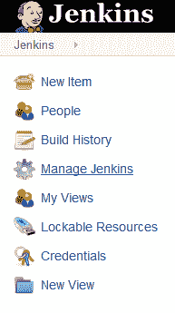

2.  在管理詹金斯菜单中，单击管理插件按钮:


3.  点击可用选项卡，在过滤器字段中搜索`logstash`。结果应该如下所示。单击不重启安装按钮安装日志存储插件:


Logstash 插件将被安装，而您不需要重新启动您的詹金斯实例。

# 使用日志存储将詹金斯日志流式传输到弹性搜索

在这个食谱中，我们将向您展示如何配置您之前在 Jenkins 上安装的 Logstash 插件。

让我们执行以下步骤将 Jenkins 日志馈送到 Elasticsearch:

1.  在管理詹金斯菜单中，单击配置系统按钮。
2.  滚动设置。在日志存储设置下，选中启用向索引器发送日志复选框。启用此设置后，它将打开四个新字段。

3.  在 URI 字段中，输入服务名称，后跟索引器名称；例如`http://elasticsearch-es-http:9200/logstash/jenkins`。输入您的`elastic`用户名和密码并保存更改:

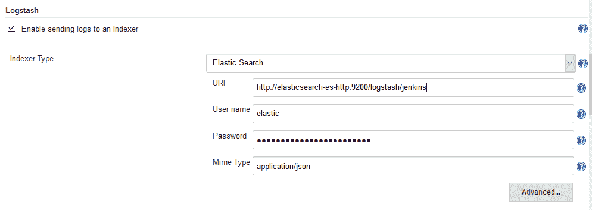

现在，Logstash 插件将通过日志收集器将日志推送到 Elasticsearch。

# 请参见

*   詹金斯日志隐藏插件文档:[https://wiki.jenkins.io/display/JENKINS/Logstash+Plugin](https://wiki.jenkins.io/display/JENKINS/Logstash+Plugin)
*   詹金斯 FluentD 插件文档:[https://github.com/jenkinsci/fluentd-plugin](https://github.com/jenkinsci/fluentd-plugin)
*   詹金斯调试日志:[https://wiki.jenkins.io/display/JENKINS/Logging](https://wiki.jenkins.io/display/JENKINS/Logging)