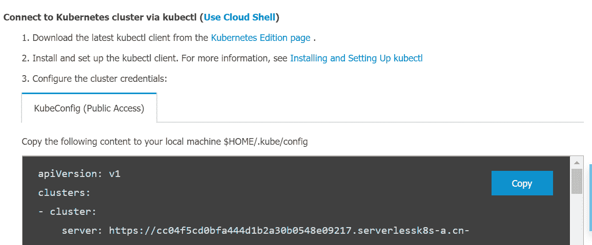

# 第一章：构建生产就绪的 Kubernetes 集群

本章提出了最常用的部署方法，这些方法在流行的云服务以及本地都有使用，尽管您肯定会在互联网上找到其他教程，解释其他方法。本章解释了托管/托管云服务与自我管理云或本地 Kubernetes 部署之间的区别，以及一个供应商相对于另一个的优势。

在本章中，我们将涵盖以下示例：

+   在亚马逊网络服务上配置 Kubernetes 集群

+   在谷歌云平台上配置 Kubernetes 集群

+   在 Microsoft Azure 上配置 Kubernetes 集群

+   在阿里云上配置 Kubernetes 集群

+   使用 Rancher 配置和管理 Kubernetes 集群

+   配置 Red Hat OpenShift

+   使用 Ansible 配置 Kubernetes 集群

+   故障排除安装问题

# 技术要求

建议您对 Linux 容器和 Kubernetes 有基本的了解。为了准备您的 Kubernetes 集群，建议使用 Linux 主机。如果您的工作站基于 Windows，则建议您使用**Windows 子系统用于 Linux**（**WSL**）。WSL 在 Windows 上提供了一个 Linux 命令行，并允许您在 Windows 上运行 ELF64 Linux 二进制文件。

始终使用相同的环境进行开发是一个良好的实践（这意味着相同的发行版和相同的版本），就像将在生产中使用的一样。这将避免意外的惊喜，比如**它在我的机器上运行**（**IWOMM**）。如果您的工作站使用不同的操作系统，另一个很好的方法是在您的工作站上设置一个虚拟机。VirtualBox（[`www.virtualbox.org/`](https://www.virtualbox.org/)）是一个在 Windows、Linux 和 macOS 上运行的免费开源的虚拟化程序。

在本章中，我们假设您正在使用 Ubuntu 主机（18.04，在撰写时的代号为 Bionic Beaver）。由于本章中的所有示例都将部署和运行在云实例上，因此没有特定的硬件要求。以下是在本地主机上完成示例所需的软件包列表：

+   cURL

+   Python

+   Vim 或 Nano（或您喜欢的文本编辑器）

# 在亚马逊网络服务上配置 Kubernetes 集群

本节中的操作将带您了解如何获得一个功能齐全的 Kubernetes 集群，具有完全可定制的主节点和工作节点，您可以在以下章节或生产中使用。

在本节中，我们将涵盖 Amazon EC2 和 Amazon EKS 的操作步骤，以便我们可以在**Amazon Web Services**（**AWS**）上运行 Kubernetes。

## 准备工作

这里提到的所有操作都需要一个 AWS 账户和一个具有使用相关服务权限的 AWS 用户。如果您没有，请访问[`aws.amazon.com/account/`](https://aws.amazon.com/account/)并创建一个。

当在 AWS 上运行 Kubernetes 时，AWS 提供了两个主要选项。如果您想完全管理部署并具有特定的强大实例要求，可以考虑使用**Amazon Elastic Compute Cloud**（**Amazon EC2**）。否则，强烈建议考虑使用**Amazon Elastic Container Service for Kubernetes**（**Amazon EKS**）等托管服务。

## 如何做…

根据您想要使用 AWS EC2 服务还是 EKS，您可以按照以下步骤使用 kops 或 eksctl 工具来启动和运行您的集群：

+   安装命令行工具以配置 AWS 服务

+   安装 kops 以配置 Kubernetes 集群

+   在 Amazon EC2 上配置 Kubernetes 集群 provision a Kubernetes cluster on Amazon EC2.

+   在 Amazon EKS 上配置托管的 Kubernetes 集群

### 安装命令行工具以配置 AWS 服务

在这个操作中，我们将获取 AWS **命令行界面**（**CLI**）`awscli`和 Amazon EKS CLI `eksctl`以访问和配置 AWS 服务。

让我们执行以下步骤：

1.  在您的工作站上安装`awscli`：

```
$ sudo apt-get update && sudo apt-get install awscli
```

1.  配置 AWS CLI 以使用您的访问密钥 ID 和秘密访问密钥：

```
$ aws configure
```

1.  下载并安装 Amazon EKS 命令行界面`eksctl`：

```
$ curl --silent --location "https://github.com/weaveworks/eksctl/releases/download/latest_release/eksctl_$(uname -s)_amd64.tar.gz" | tar xz -C /tmp
$ sudo mv /tmp/eksctl /usr/local/bin
```

1.  验证其版本并确保`eksctl`已安装：

```
$ eksctl version
```

为了能够执行以下操作，`eksctl`版本应为`0.13.0`或更高。

### 安装 kops 以配置 Kubernetes 集群

在这个操作中，我们将获取 Kubernetes 操作工具`kops`和 Kubernetes 命令行工具`kubectl`，以便配置和管理 Kubernetes 集群。

让我们执行以下步骤：

1.  下载并安装 Kubernetes 操作工具`kops`：

```
$ curl -LO https://github.com/kubernetes/kops/releases/download/$(curl -s https://api.github.com/repos/kubernetes/kops/releases/latest | grep tag_name | cut -d '"' -f 4)/kops-linux-amd64
$ chmod +x kops-linux-amd64 && sudo mv kops-linux-amd64 /usr/local/bin/kops
```

1.  运行以下命令以确保`kops`已安装并确认版本为`1.15.0`或更高：

```
$ kops version
```

1.  下载并安装 Kubernetes 命令行工具`kubectl`：

```
$ curl -LO https://storage.googleapis.com/kubernetes-release/release/$(curl -s https://storage.googleapis.com/kubernetes-release/release/stable.txt)/bin/linux/amd64/kubectl
$ chmod +x ./kubectl && sudo mv ./kubectl /usr/local/bin/kubectl
```

1.  验证其版本并确保`kubectl`已安装：

```
$ kubectl version --short
```

为了能够执行以下操作，`kubectl`版本应该是`v1.15`或更高。

### 在 Amazon EC2 上创建一个 Kubernetes 集群

这个步骤将带您完成如何获得一个完全可定制的主节点和工作节点的完全功能的 Kubernetes 集群，您可以在后续章节或生产中使用。

让我们执行以下步骤：

1.  为您的集群创建一个域。

按照云管理最佳实践，最好使用子域名，并使用逻辑和有效的 DNS 名称来划分您的集群，以便`kops`成功地发现它们。

例如，我将使用`k8s.containerized.me`子域作为我们的托管区域。此外，如果您的域名是在 Amazon Route 53 之外的注册商注册的，您必须更新注册商的名称服务器，并为托管区域添加 Route 53 NS 记录到您的注册商的 DNS 记录中：

```
$ aws route53 create-hosted-zone --name k8s.containerized.me \
--caller-reference k8s-devops-cookbook \
--hosted-zone-config Comment="Hosted Zone for my K8s Cluster" 
```

1.  创建一个 S3 存储桶，用于存储 Kubernetes 配置和集群状态。在我们的示例中，我们将使用`s3.k8s.containerized.me`作为我们的存储桶名称：

```
$ aws s3api create-bucket --bucket s3.k8s.containerized.me \
--region us-east-1
```

1.  通过列出可用的存储桶来确认您的 S3 存储桶：

```
$ aws s3 ls
2019-07-21 22:02:58 s3.k8s.containerized.me
```

1.  启用存储桶版本控制：

```
$ aws s3api put-bucket-versioning --bucket s3.k8s.containerized.me \
--versioning-configuration Status=Enabled
```

1.  设置`kops`的环境参数，以便您可以默认使用位置：

```
$ export KOPS_CLUSTER_NAME=useast1.k8s.containerized.me
$ export KOPS_STATE_STORE=s3://s3.k8s.containerized.me
```

1.  如果您还没有创建 SSH 密钥，请创建一个：

```
$ ssh-keygen -t rsa
```

1.  使用您希望主节点运行的区域列表创建集群配置：

```
$ kops create cluster --node-count=6 --node-size=t3.large \
 --zones=us-east-1a,us-east-1b,us-east-1c \
 --master-size=t3.large \
 --master-zones=us-east-1a,us-east-1b,us-east-1c
```

1.  创建集群：

```
$ kops update cluster --name ${KOPS_CLUSTER_NAME} --yes
```

1.  等待几分钟，直到节点启动并验证：

```
$ kops validate cluster
```

1.  现在，您可以使用`kubectl`来管理您的集群：

```
$ kubectl cluster-info
```

默认情况下，`kops`在`~/.kube/config`下创建和导出 Kubernetes 配置。因此，连接集群使用`kubectl`不需要额外的步骤。

### 在 Amazon EKS 上创建托管的 Kubernetes 集群

执行以下步骤，在 Amazon EKS 上使用`eksctl`启动和运行您的托管 Kubernetes 服务集群：

1.  使用默认设置创建一个集群：

```
$ eksctl create cluster
...
[√] EKS cluster "great-outfit-123" in "us-west-2" region is ready
```

默认情况下，`eksctl`使用 AWS EKS AMI 在`us-west-2`地区部署一个带有两个`m5.large`实例的集群。`eksctl`在`~/.kube/config`下创建和导出 Kubernetes 配置。因此，连接集群使用`kubectl`不需要额外的步骤。

1.  确认集群信息和工作节点：

```
$ kubectl cluster-info && kubectl get nodes
Kubernetes master is running at https://gr7.us-west-2.eks.amazonaws.com
CoreDNS is running at https://gr7.us-west-2.eks.amazonaws.com/api/v1/namespaces/kube-system/services/kube-dns:dns/proxy
NAME                                  STATUS ROLES  AGE   VERSION
ip-1-2-3-4.us-west-2.compute.internal Ready  <none> 5m42s v1.13.8-eks-cd3eb0
ip-1-2-3-4.us-west-2.compute.internal Ready  <none> 5m40s v1.13.8-eks-cd3eb0
```

现在，您已经有一个运行中的双节点 Amazon EKS 集群。

## 工作原理...

在亚马逊 EC2 上的第一个配方向您展示了如何提供多个可以在主节点故障以及单个 AZ 故障中生存的主节点副本。虽然与亚马逊 EKS 的第二个配方中具有多 AZ 支持相似，但在 EC2 上的集群给您更高的灵活性。当您使用亚马逊 EKS 时，它为每个集群运行一个单租户 Kubernetes 控制平面，控制平面由至少两个 API 服务器节点和三个`etcd`节点组成，这些节点跨越区域内的三个 AZ 运行。

让我们看看我们在第 7 步中使用的集群选项，使用 `kops create cluster` 命令：

+   `--node-count=3` 设置要创建的节点数。在我们的示例中，这是 `6`。这个配置将在定义的每个区域部署两个节点，使用`--zones=us-east-1a,us-east-1b,us-east-1c`，总共有三个主节点和六个工作节点。

+   `--node-size` 和 `--master-size` 设置了工作节点和主节点的实例大小。在我们的示例中，工作节点使用 `t2.medium`，主节点使用 `t2.large`。对于更大的集群，建议工作节点使用 `t2.large`。

+   `--zones` 和 `--master-zones` 设置了集群将在其中运行的区域。在我们的示例中，我们使用了三个区域，分别是 `us-east-1a`，`us-east-1b`，和 `us-east-1c`。

有关额外区域信息，请查看*另请参阅* 部分中的 AWS 全球基础设施链接。

AWS 集群不能跨多个区域，所有已定义的主节点和工作节点的区域都应该在同一个区域内。

在部署多主节点集群时，应创建奇数个主实例。还要记住，Kubernetes 依赖于 etcd，一个分布式键/值存储。etcd quorum 要求超过 51%的节点随时可用。因此，有三个主节点时，我们的控制平面只能在单个主节点或 AZ 故障时生存。如果需要处理更多情况，需要考虑增加主实例的数量。

## 还有更多...

还有以下信息也很有用：

+   使用 AWS Shell

+   使用基于 gossip 的集群

+   在 S3 存储桶中使用不同的区域

+   编辑集群配置

+   删除您的集群

+   使用亚马逊 EKS 仪表板来提供 EKS 集群

+   部署 Kubernetes 仪表板

### 使用 AWS Shell

在这里值得一提的另一个有用工具是`aws-shell`。它是一个与 AWS CLI 一起工作的集成式 shell。它使用 AWS CLI 配置，并通过自动完成功能提高了生产力。

使用以下命令安装`aws-shell`并运行它：

```
$ sudo apt-get install aws-shell && aws-shell
```

您将看到以下输出：


您可以使用`aws-shell`与更少的输入来使用 AWS 命令。按*F10*键退出 shell。

### 使用基于八卦的集群

在这个示例中，我们创建了一个域（可以从亚马逊购买或其他注册商购买）和一个托管区域，因为 kops 使用 DNS 进行发现。虽然它需要是一个有效的 DNS 名称，但从 kops 1.6.2 开始，DNS 配置变成了可选项。可以轻松地创建一个基于八卦的集群，而不是实际的域或子域。通过使用注册的域名，我们使我们的集群更容易共享，并且可以被其他人用于生产。

如果出于任何原因，您更喜欢基于八卦的集群，您可以跳过托管区域的创建，并使用以`k8s.local`结尾的集群名称：

```
$ export KOPS_CLUSTER_NAME=devopscookbook.k8s.local
$ export KOPS_STATE_STORE=s3://devops-cookbook-state-store
```

设置`kops`的环境参数是可选的，但强烈建议，因为它可以缩短您的 CLI 命令。

### 为 S3 存储桶使用不同的地区

为了让 kops 存储集群配置，需要一个专用的 S3 存储桶。

`eu-west-1`地区的示例如下：

```
$ aws s3api create-bucket --bucket s3.k8s.containerized.me \
--region eu-west-1 --create-bucket-configuration \
LocationConstraint=eu-west-1
```

这个 S3 存储桶将成为我们 Kubernetes 集群配置的真相来源。为了简单起见，建议使用`us-east-1`地区；否则，需要指定适当的`LocationConstraint`以便在所需的地区创建存储桶。

### 编辑集群配置

`kops create cluster`命令，我们用来创建集群配置，实际上并不创建集群本身并启动 EC2 实例；相反，它在我们的 S3 存储桶中创建配置文件。

创建配置文件后，您可以使用`kops edit cluster`命令对配置进行更改。

您可以使用以下命令分别编辑您的节点实例组：

```
$ kops edit ig nodes 
$ kops edit ig master-us-east-1a
```

配置文件是从 S3 存储桶的状态存储位置调用的。如果您喜欢不同的编辑器，您可以例如设置`$KUBE_EDITOR=nano`来更改它。

### 删除您的集群

要删除您的集群，请使用以下命令：

```
$ kops delete cluster --name ${KOPS_CLUSTER_NAME} --yes
```

这个过程可能需要几分钟，完成后，您将收到确认。

### 使用亚马逊 EKS 管理控制台配置 EKS 集群

在《在 Amazon EKS 上提供托管的 Kubernetes 集群》教程中，我们使用 eksctl 部署了一个集群。作为替代方案，您也可以使用 AWS 管理控制台 Web 用户界面来部署 EKS 集群。

执行以下步骤来在 Amazon EKS 上启动和运行您的集群：

1.  打开浏览器并转到 Amazon EKS 控制台[`console.aws.amazon.com/eks/home#/clusters`](https://console.aws.amazon.com/eks/home#/clusters)。

1.  输入集群名称并点击“下一步”按钮。

1.  在创建集群页面上，选择 Kubernetes 版本、角色名称、至少两个或更多可用区的子网列表和安全组。

1.  点击创建。

1.  使用 EKS 创建集群大约需要 20 分钟。在 15-20 分钟后刷新页面并检查其状态。

1.  使用以下命令更新您的`kubectl`配置：

```
$ aws eks --region us-east-1 update-kubeconfig \
--name K8s-DevOps-Cookbook  
```

1.  现在，使用`kubectl`来管理您的集群：

```
$ kubectl get nodes
```

现在您的集群已配置好，您可以配置`kubectl`来管理它。

### 部署 Kubernetes 仪表板

最后但并非最不重要的是，在 AWS 集群上部署 Kubernetes 仪表板应用程序，您需要按照以下步骤进行操作：

1.  在我写这个教程的时候，Kubernetes Dashboard v.2.0.0 仍处于测试阶段。由于 v.1.x 版本很快就会过时，我强烈建议您安装最新版本，即 v.2.0.0。新版本带来了许多功能和对 Kubernetes v.1.16 及更高版本的支持。在部署仪表板之前，请确保删除之前的版本（如果有）。通过以下信息框中的链接检查最新发布，并使用最新发布进行部署，类似于以下操作：

```
$ kubectl delete ns kubernetes-dashboard
# Use the latest version link from https://github.com/kubernetes/dashboard/releases
$ kubectl apply -f https://raw.githubusercontent.com/kubernetes/dashboard/v2.0.0-beta5/aio/deploy/recommended.yaml
```

随着 Kubernetes 版本的升级，仪表板应用程序也经常会更新。要使用最新版本，请在发布页面[`github.com/kubernetes/dashboard/releases`](https://github.com/kubernetes/dashboard/releases)上找到 YAML 清单的最新链接。如果您在使用仪表板的最新版本时遇到兼容性问题，您可以始终使用以下命令部署以前的稳定版本：`$ kubectl apply -f`

`https://raw.githubusercontent.com/kubernetes/dashboard/v1.10.1/src/depl`

`oy/recommended/kubernetes-dashboard.yaml`

1.  默认情况下，`kubernetes-dashboard`服务使用`ClusterIP`类型进行公开。如果您想从外部访问它，请使用以下命令编辑服务，并将`ClusterIP`类型替换为`LoadBalancer`；否则，请使用端口转发进行访问：

```
$ kubectl edit svc kubernetes-dashboard -n kubernetes-dashboard
```

1.  从`kubernetes-dashboard`服务中获取仪表板的外部 IP：

```
$ kubectl get svc kubernetes-dashboard -n kubernetes-dashboard
NAME                 TYPE          CLUSTER-IP    EXTERNAL-IP PORT(S) AGE
kubernetes-dashboard LoadBalancer 100.66.234.228 myaddress.us-east-1.elb.amazonaws.com 443:30221/TCP 5m46s
```

1.  在浏览器中打开外部 IP 链接。在我们的示例中，它是`https://myaddress.us-east-1.elb.amazonaws.com`。

1.  我们将使用令牌选项来访问 Kubernetes 仪表板。现在，让我们使用以下命令在我们的集群中找到令牌。在这个例子中，该命令返回`kubernetes-dashboard-token-bc2w5`作为令牌名称：

```
$ kubectl get secrets -A | grep dashboard-token
kubernetes-dashboard kubernetes-dashboard-token-bc2w5 kubernetes.io/service-account-token 3 17m
```

1.  用前一个命令的输出替换密钥名称。从 Secret 的描述中获取令牌详细信息：

```
$ kubectl describe secrets kubernetes-dashboard-token-bc2w5 -nkubernetes-dashboard
```

1.  从前面命令的输出中复制令牌部分，并将其粘贴到 Kubernetes 仪表板中以登录到仪表板：


现在，您可以访问 Kubernetes 仪表板来管理您的集群。

## 另请参阅

+   最新版本和额外的`create cluster`参数的 Kops 文档：

+   [`github.com/kubernetes/kops/blob/master/docs/aws.md`](https://github.com/kubernetes/kops)

+   [`github.com/kubernetes/kops/blob/master/docs/cli/kops_create_cluster.md`](https://github.com/kubernetes/kops/blob/master/docs/cli/kops_create_cluster.md)

+   AWS 命令参考 S3 创建存储桶 API：[`docs.aws.amazon.com/cli/latest/reference/s3api/create-bucket.html`](https://docs.aws.amazon.com/cli/latest/reference/s3api/create-bucket.html)

+   AWS 全球基础设施地图： [`aws.amazon.com/about-aws/global-infrastructure/ `](https://aws.amazon.com/about-aws/global-infrastructure/)

+   Amazon EKS 常见问题： [`aws.amazon.com/eks/faqs/`](https://aws.amazon.com/eks/faqs/)

+   AWS Fargate 产品，另一个 AWS 服务，如果您希望在不管理服务器或集群的情况下运行容器： [`aws.amazon.com/fargate/`](https://aws.amazon.com/fargate/)

+   CNCF 认证的 Kubernetes 安装程序的完整列表： [`landscape.cncf.io/category=certified-kubernetes-installer&format=card-mode&grouping=category`](https://landscape.cncf.io/category=certified-kubernetes-installer&format=card-mode&grouping=category)。

+   在 AWS 上获取高可用集群的其他推荐工具：

+   Konvoy: [`d2iq.com/solutions/ksphere/konvoy`](https://d2iq.com/solutions/ksphere/konvoy)

+   KubeAdm: [`github.com/kubernetes/kubeadm `](https://github.com/kubernetes/kubeadm)

+   KubeOne: [`github.com/kubermatic/kubeone`](https://github.com/kubermatic/kubeone)

+   KubeSpray: [`github.com/kubernetes-sigs/kubespray`](https://github.com/kubernetes-sigs/kubespray)

# 在 Google Cloud Platform 上配置 Kubernetes 集群

本节将逐步指导您在 GCP 上配置 Kubernetes 集群。您将学习如何在不需要配置或管理主节点和 etcd 实例的情况下运行托管的 Kubernetes 集群，使用 GKE。

## 准备工作

这里提到的所有操作都需要启用计费的 GCP 帐户。如果您还没有，请转到[`console.cloud.google.com`](https://console.cloud.google.com)并创建一个帐户。

在 Google Cloud Platform（GCP）上，运行 Kubernetes 有两个主要选项。如果您想完全管理部署并具有特定的强大实例要求，可以考虑使用 Google Compute Engine（GCE）。否则，强烈建议使用托管的 Google Kubernetes Engine（GKE）。

## 如何做…

本节进一步分为以下小节，以使此过程更易于跟进：

+   安装命令行工具以配置 GCP 服务

+   在 GKE 上配置托管的 Kubernetes 集群

+   连接到 GKE 集群

### 安装命令行工具以配置 GCP 服务

在这个教程中，我们将安装 Google 云平台的主要 CLI，`gcloud`，以便我们可以配置 GCP 服务：

1.  运行以下命令以下载`gcloud` CLI：

```
$ curl https://sdk.cloud.google.com | bash
```

1.  初始化 SDK 并按照给定的说明进行操作：

```
$ gcloud init
```

1.  在初始化期间，当询问时，请选择您有权限的现有项目或创建一个新项目。

1.  为项目启用 Compute Engine API：

```
$ gcloud services enable compute.googleapis.com
Operation "operations/acf.07e3e23a-77a0-4fb3-8d30-ef20adb2986a" finished successfully.
```

1.  设置默认区域：

```
$ gcloud config set compute/zone us-central1-a
```

1.  确保您可以从命令行启动 GCE 实例：

```
$ gcloud compute instances create "devops-cookbook" \
--zone "us-central1-a" --machine-type "f1-micro"
```

1.  删除测试 VM：

```
$ gcloud compute instances delete "devops-cookbook"
```

如果所有命令都成功，您可以配置您的 GKE 集群。

### 在 GKE 上配置托管的 Kubernetes 集群

让我们执行以下步骤：

1.  创建一个集群：

```
$ gcloud container clusters create k8s-devops-cookbook-1 \
--cluster-version latest --machine-type n1-standard-2 \
--image-type UBUNTU --disk-type pd-standard --disk-size 100 \
--no-enable-basic-auth --metadata disable-legacy-endpoints=true \
--scopes compute-rw,storage-ro,service-management,service-control,logging-write,monitoring \
--num-nodes "3" --enable-stackdriver-kubernetes \ --no-enable-ip-alias --enable-autoscaling --min-nodes 1 \
--max-nodes 5 --enable-network-policy \
--addons HorizontalPodAutoscaling,HttpLoadBalancing \
--enable-autoupgrade --enable-autorepair --maintenance-window "10:00"
```

集群创建需要 5 分钟或更长时间才能完成。

### 连接到 Google Kubernetes Engine（GKE）集群

要访问您的 GKE 集群，您需要按照以下步骤进行操作：

1.  配置`kubectl`以访问您的`k8s-devops-cookbook-1`集群：

```
$ gcloud container clusters get-credentials k8s-devops-cookbook-1
```

1.  验证您的 Kubernetes 集群：

```
$ kubectl get nodes
```

现在，您有一个运行中的三节点 GKE 集群。

## 工作原理...

这个教程向您展示了如何使用一些默认参数快速配置 GKE 集群。

在 *步骤 1* 中，我们使用了一些默认参数创建了一个集群。虽然所有参数都非常重要，但我想在这里解释其中一些。

`--cluster-version` 设置要用于主节点和节点的 Kubernetes 版本。只有在想要使用与默认值不同的版本时才使用它。您可以使用 `gcloud container get-server-config` 命令获取可用版本信息。

我们使用 `--machine-type` 参数设置了实例类型。如果没有设置，默认值是 `n1-standard-1`。您可以使用 `gcloud compute machine-types list` 命令获取预定义类型的列表。

默认镜像类型是 COS，但我个人偏好 Ubuntu，所以我使用 `--image-type UBUNTU` 来将 OS 镜像设置为 `UBUNTU`。如果没有设置，服务器会选择默认镜像类型，即 COS。您可以使用 `gcloud container get-server-config` 命令获取可用镜像类型的列表。

GKE 提供了高级集群管理功能，并配备了节点实例的自动扩展、自动升级和自动修复功能，以维护节点的可用性。`--enable-autoupgrade` 启用了 GKE 的自动升级功能，用于集群节点，`--enable-autorepair` 启用了自动修复功能，该功能在使用 `--maintenance-window` 参数定义的时间开始。这里设置的时间是 UTC 时区，并且必须以 `HH:MM` 格式。

## 还有更多...

以下是在上一节描述的教程之外可以采用的一些替代方法：

+   使用 Google 云 Shell

+   使用自定义网络配置部署

+   删除您的集群

+   查看工作负载仪表板

### 使用 Google 云 Shell

作为 Linux 工作站的替代方案，您可以在浏览器上获得 CLI 接口，以管理您的云实例。

转到 [`cloud.google.com/shell/`](https://cloud.google.com/shell/) 获取 Google 云 Shell。

### 使用自定义网络配置部署

以下步骤演示了如何使用自定义网络配置来配置您的集群：

1.  创建 VPC 网络：

```
$ gcloud compute networks create k8s-devops-cookbook \
--subnet-mode custom
```

1.  在您的 VPC 网络中创建一个子网。在我们的示例中，这是 `10.240.0.0/16`：

```
$ gcloud compute networks subnets create kubernetes \
--network k8s-devops-cookbook --range 10.240.0.0/16
```

1.  创建防火墙规则以允许内部流量：

```
$ gcloud compute firewall-rules create k8s-devops-cookbook-allow-int \
--allow tcp,udp,icmp --network k8s-devops-cookbook \
--source-ranges 10.240.0.0/16,10.200.0.0/16
```

1.  创建防火墙规则以允许外部 SSH、ICMP 和 HTTPS 流量：

```
$ gcloud compute firewall-rules create k8s-devops-cookbook-allow-ext \
--allow tcp:22,tcp:6443,icmp --network k8s-devops-cookbook \
--source-ranges 0.0.0.0/0
```

1.  验证规则：

```
$ gcloud compute firewall-rules list
 NAME                          NETWORK             DIRECTION PRIORITY ALLOW  DENY    DISABLED
 ...
 k8s-devops-cookbook-allow-ext k8s-devops-cookbook INGRESS   1000     tcp:22,tcp:6443,icmp      False
 k8s-devops-cookbook-allow-int k8s-devops-cookbook INGRESS   1000     tcp,udp,icmp              False
```

1.  将`--network k8s-devops-cookbook`和`--subnetwork kubernetes`参数添加到您的`container clusters create`命令并运行它。

### 删除您的集群

要删除您的`k8s-devops-cookbook-1`集群，请使用以下命令：

```
$ gcloud container clusters delete k8s-devops-cookbook-1
```

这个过程可能需要几分钟，完成后，您将收到确认消息。

### 查看工作负载仪表板

在 GCP 上，您可以使用内置的工作负载仪表板并通过 Google Marketplace 部署容器化应用程序，而不是使用 Kubernetes 仪表板应用程序。按照以下步骤：

1.  要从 GCP 仪表板访问工作负载仪表板，请选择您的 GKE 集群并单击工作负载。

1.  单击“显示系统工作负载”以查看已部署在`kube-system`命名空间中的现有组件和容器。

## 另请参阅

+   GCP 文档：[`cloud.google.com/docs/`](https://cloud.google.com/docs/)

+   GKE 本地安装：[`cloud.google.com/gke-on-prem/docs/how-to/install-overview-basic`](https://cloud.google.com/gke-on-prem/docs/how-to/install-overview-basic)

# 在 Microsoft Azure 上配置 Kubernetes 集群

在本节中，我们将使用 Microsoft **Azure Kubernetes Service**（**AKS**）创建 Microsoft Azure 云上的 Kubernetes 集群。

## 准备就绪

这里提到的所有操作都需要 Microsoft Azure 订阅。如果您还没有，请转到[`portal.azure.com`](https://portal.azure.com)并创建一个免费帐户。

## 如何做…

本节将带您了解如何在 Microsoft Azure 上配置 Kubernetes 集群。本节进一步分为以下子节，以使此过程更容易：

+   安装命令行工具以配置 Azure 服务

+   在 AKS 上配置托管的 Kubernetes 集群

+   连接到 AKS 集群

### 安装命令行工具以配置 Azure 服务

在这个配方中，我们将安装名为`az`和`kubectl`的 Azure CLI 工具。

让我们执行以下步骤：

1.  安装必要的依赖项：

```
$ sudo apt-get update && sudo apt-get install -y libssl-dev \
libffi-dev python-dev build-essential
```

1.  下载并安装`az` CLI 工具：

```
$ curl -L https://aka.ms/InstallAzureCli | bash
```

1.  验证您正在使用的`az`版本：

```
$ az --version
```

1.  如果尚未安装，请安装`kubectl`：

```
$ az aks install-cli
```

如果所有命令都成功，您可以开始配置您的 AKS 集群。

### 在 AKS 上配置托管的 Kubernetes 集群

让我们执行以下步骤：

1.  登录到您的帐户：

```
$ az login
```

1.  在您喜欢的区域创建一个名为`k8sdevopscookbook`的资源组：

```
$ az group create --name k8sdevopscookbook --location eastus
```

1.  创建服务主体并记下您的`appId`和`password`以进行下一步：

```
$ az ad sp create-for-rbac --skip-assignment
{
 "appId": "12345678-1234-1234-1234-123456789012",
 "displayName": "azure-cli-2019-05-11-20-43-47",
 "name": "http://azure-cli-2019-05-11-20-43-47",
 "password": "12345678-1234-1234-1234-123456789012",
 "tenant": "12345678-1234-1234-1234-123456789012"
```

1.  创建一个集群。用前面命令的输出替换`appId`和`password`：

```
$ az aks create  --resource-group k8sdevopscookbook \  --name AKSCluster \ --kubernetes-version 1.15.4 \
 --node-vm-size Standard_DS2_v2 \ --node-count 3 \ --service-principal <appId> \ --client-secret <password> \ --generate-ssh-keys
```

集群创建大约需要 5 分钟。当成功完成时，您将看到`"provisioningState": Succeeded"`。

### 连接到 AKS 集群

让我们执行以下步骤：

1.  收集一些凭据并配置`kubectl`以便您可以使用它们：

```
$ az aks get-credentials --resource-group k8sdevopscookbook \
--name AKSCluster
```

1.  验证您的 Kubernetes 集群：

```
$ kubectl get nodes
```

现在，您有一个运行中的三节点 GKE 集群。

## 它是如何工作的…

本教程向您展示了如何使用一些常见选项快速创建 AKS 集群。

在*步骤 3*中，命令以`az aks create`开头，后面跟着`-g`或`--resource-group`，这样您就可以选择资源组的名称。您可以使用`az configure --defaults group=k8sdevopscookbook`来配置默认组，并在下次跳过这个参数。

我们使用`--name AKSCluster`参数来设置托管集群的名称为`AKSCluster`。其余的参数是可选的；`--kubernetes-version`或`-k`设置要用于集群的 Kubernetes 版本。您可以使用`az aks get-versions --location eastus --output table`命令来获取可用选项的列表。

我们使用`--node-vm-size`来设置 Kubernetes 工作节点的实例类型。如果没有设置，默认值为`Standard_DS2_v2`。

接下来，我们使用`--node-count`来设置 Kubernetes 工作节点的数量。如果没有设置，默认值为`3`。可以使用`az aks scale`命令来更改这个值。

最后，使用`--generate-ssh-keys`参数来自动生成 SSH 公钥和私钥文件，这些文件存储在`~/.ssh`目录中。

## 还有更多…

尽管 Kubernetes 现在支持基于 Windows 的容器，但要能够运行 Windows Server 容器，您需要运行基于 Windows Server 的节点。AKS 节点目前在 Linux OS 上运行，不支持基于 Windows Server 的节点。但是，您可以使用 Virtual Kubelet 在容器实例上调度 Windows 容器，并将其作为集群的一部分进行管理。在本节中，我们将看一下以下内容：

+   删除您的集群

+   查看 Kubernetes 仪表板

### 删除您的集群

要删除您的集群，请使用以下命令：

```
$ az aks delete --resource-group k8sdevopscookbook --name AKSCluster
```

这个过程将需要几分钟，完成后，您将收到确认信息。

### 查看 Kubernetes 仪表板

要查看 Kubernetes 仪表板，您需要按照以下步骤进行：

1.  要启动 Kubernetes 仪表板，请使用以下命令：

```
$ az aks browse --resource-group k8sdevopscookbook --name AKSCluster
```

1.  如果您的集群启用了 RBAC，则创建`Clusterrolebinding`：

```
$ kubectl create clusterrolebinding kubernetes-dashboard \
--clusterrole=cluster-admin \
--serviceaccount=kube-system:kubernetes-dashboard
```

1.  打开浏览器窗口，转到代理运行的地址。在我们的示例中，这是`http://127.0.0.1:8001/`。

## 另请参阅

+   Microsoft AKS FAQ：[`docs.microsoft.com/en-us/azure/aks/faq`](https://docs.microsoft.com/en-us/azure/aks/faq)

+   在 GitHub 上的 AKS 开源核心存储库：[`github.com/Azure/aks-engine`](https://github.com/Azure/aks-engine)

# 在阿里巴巴云上配置 Kubernetes 集群

阿里巴巴云（也称为阿里云）提供了多个模板，您可以使用这些模板来提供 Kubernetes 环境。有四个主要的服务类别：

+   Kubernetes：在单个区域的 ECS 实例上部署的具有三个主节点的自管理 Kubernetes。工作节点可以是 ECS 或裸金属。

+   托管的 Kubernetes：类似于 Kubernetes 集群选项，只是主节点由阿里巴巴云管理。

+   多 AZ Kubernetes：类似于 Kubernetes 集群选项，只是自管理的主节点和工作节点可以部署在不同的可用区。

+   无服务器 Kubernetes：一种 Kubernetes 服务提供，您可以在其中部署容器应用程序，而无需管理和维护集群实例：


在本节中，我们将介绍如何在不需要配置或管理主节点和 etcd 实例的情况下，提供一个高可用的多 AZ Kubernetes 集群。

## 做好准备

这里提到的所有操作都需要阿里巴巴云账户（也称为阿里云）和 AccessKey。如果您还没有，请转到[`account.alibabacloud.com`](https://account.alibabacloud.com)并创建一个账户。

## 如何做到…

本节将带您了解如何在阿里巴巴云上配置 Kubernetes 集群。本节进一步分为以下子节，以使此过程更加简单：

+   安装命令行工具以配置阿里巴巴云服务

+   在阿里巴巴云上提供一个高可用的 Kubernetes 集群

+   连接到阿里巴巴容器服务集群

### 安装命令行工具以配置阿里巴巴云服务

对于此示例，我们将使用阿里巴巴云控制台，并从仪表板生成 API 请求参数，该参数将与 CLI 一起使用。您还需要安装阿里巴巴云 CLI `aliyun`和`kubectl`。

1.  运行以下命令以下载`aliyun`工具：

```
$ curl -O https://aliyuncli.alicdn.com/aliyun-cli-linux-3.0.15-amd64.tgz
```

您可以在此处找到最新版本的链接：[`github.com/aliyun/aliyun-cli`](https://github.com/aliyun/aliyun-cli)。

1.  提取文件并安装它们：

```
$ tar –zxvf aliyun-cli*.tgz && sudo mv aliyun /usr/local/bin/.
```

1.  验证您正在使用的`aliyun` CLI 版本：

```
$ aliyun --version
```

1.  如果您还没有创建 AccessKey，请转到您的帐户中的安全管理并创建一个([`usercenter.console.aliyun.com/#/manage/ak`](https://account.alibabacloud.com/login/login.htm?spm=a2c44.11131515.0.0.4e57525cYlZEdf))。

1.  通过输入您的 AccessKey ID、AccessKey Secret 和区域 ID 完成 CLI 配置：

```
$ aliyun configure
Configuring profile '' in '' authenticate mode...
Access Key Id []: <Your AccessKey ID>
Access Key Secret []: <Your AccessKey Secret>
Default Region Id []: us-west-1
Default Output Format [json]: json (Only support json))
Default Language [zh|en] en: en
Saving profile[] ...Done.
```

1.  启用`bash/zsh`自动完成：

```
$ aliyun auto-completion
```

1.  转到容器服务控制台([`cs.console.aliyun.com`](https://cs.console.aliyun.com))，为容器服务授予权限访问云资源。在这里，选择`AliyunCSDefaultRole`、`AliyunCSServerlessKuberentesRole`、`AliyunCSClusterRole`和`AliyunCSManagedKubernetesRole`，然后点击“确认授权策略”。

确保已启用**资源编排服务（ROS）**和自动伸缩服务，因为它们是部署 Kubernetes 集群所需的。ROS 用于根据您的模板自动提供和配置资源以进行自动部署、操作和维护，而自动伸缩用于根据需求调整计算资源。

### 在阿里云上部署高可用的 Kubernetes 集群

让我们执行以下步骤：

1.  打开浏览器窗口，转到阿里云虚拟私有云控制台[`vpc.console.aliyun.com`](https://vpc.console.aliyun.com)。

1.  确保选择至少有三个区域的区域（中国大陆的大多数区域都有三个以上的区域），然后点击“创建 VPC”。

1.  为您的 VPC 指定一个唯一名称并选择一个 IPv4 CIDR 块。在我们的示例中，这是`10.0.0.0/8`。

1.  为您的第一个 VSwitch（`k8s-1`）输入一个名称，并选择一个区域（`北京 A 区`）。

1.  设置一个 IPv4 CIDR 块。在我们的示例中，我们使用了`10.10.0.0./16`。

1.  点击“添加”按钮，然后重复*步骤 4*和*步骤 5*以获取不同的区域。使用以下 CIDR 块信息：

|  | **VSwitch 2** | **VSwitch 3** |
| --- | --- | --- |
| **名称：** | k8s-2 | k8s-3 |
| **区域：** | 北京 B 区 | 北京 E 区 |
| **IPv4 CIDR 块：** | 10.20.0.0/16 | 10.30.0.0/16 |

1.  点击“确定”创建您的 VPC 和 VSwitches。

1.  在您的 Web 浏览器上打开阿里云 Web 控制台([`cs.console.aliyun.com`](https://cs.console.aliyun.com)。)。

1.  点击“创建 Kubernetes 集群”。

1.  选择标准托管集群。

1.  点击“多可用区 Kubernetes”选项卡，为您的集群命名，并选择与创建 VPC 和 VSwitches 时相同的区域。

1.  如果您选择了相同的区域，VPC 下拉菜单将显示为`k8s-devops-cookbook-vpc`。现在，选择我们创建的所有三个 VSwitches：


1.  在每个区域的 Master 节点配置中设置实例类型。

1.  在每个区域的 Worker 节点配置中设置实例类型，并将每个区域的节点数设置为`3`。否则，请使用默认设置。

1.  选择 Kubernetes 版本（`1.12.6-aliyun.1`，在撰写时）。

1.  从下拉菜单中选择“密钥对名称”，或者点击“创建新密钥对”来创建一个：


1.  阿里巴巴提供两种 CNI 选项：Flannel 和 Terway。区别在本食谱的*更多内容…*部分有解释。使用`Flannel`保留默认网络选项。默认参数支持集群中最多 512 台服务器。

1.  监控和日志记录将在第八章 *Kubernetes 上的可观察性和监控*和第十章 *Kubernetes 上的日志记录*中进行解释。因此，此步骤是可选的。勾选“在您的 ECS 上安装云监控插件”和“使用日志服务”选项以启用监控和日志记录。

1.  现在，点击“创建”以配置您的多可用区 Kubernetes 集群。此步骤可能需要 15-20 分钟才能完成。

### 连接到阿里巴巴容器服务集群

要访问阿里巴巴云上的集群，您需要按照以下步骤进行：

1.  要获取集群的凭据，请转到“集群”菜单，然后单击要访问的“集群名称”：


1.  复制 KubeConfig 选项卡中显示的内容到您本地机器的`$HOME/.kube/config`文件中：



1.  验证您的 Kubernetes 集群：

```
$ kubectl get nodes
```

作为替代方案，请参阅*查看 Kubernetes 仪表板*部分下的说明，以管理您的集群。

## 工作原理…

本食谱向您展示了如何使用集群模板在阿里巴巴云上配置托管的 Kubernetes 集群。

在容器服务菜单下，阿里巴巴云提供了一些 Kubernetes 集群，其中提供了七个集群模板。我们在这里使用了标准托管集群。此选项只允许您管理工作节点，并为您节省了主节点的资源和管理成本：


默认情况下，帐户支持最多 20 个集群和每个集群 40 个节点。您可以通过提交支持工单来请求配额增加。

## 还有更多...

作为使用阿里巴巴云控制台的替代方法，您可以通过`aliyuncli`使用 REST API 调用来创建 ECS 实例和您的集群。按照以下步骤操作：

1.  在阿里巴巴云控制台上配置了集群选项后，点击“创建”按钮下方的“生成 API 请求参数”以生成用于`aliyun` CLI 的 POST 请求主体内容。

1.  将内容保存到文件中。在我们的案例中，这个文件被称为`cscreate.json`。

1.  有关本节中列出的其他参数的解释，请参阅[`www.alibabacloud.com/help/doc-detail/87525.htm`](https://www.alibabacloud.com/help/doc-detail/87525.htm)中的*创建 Kubernetes*部分。

1.  使用以下命令创建您的集群：

```
$ aliyun cs POST /clusters --header "Content-Type=application/json" \
--body "$(cat cscreate.json)"
```

阿里巴巴云容器服务为其 Kubernetes 集群提供了两种网络插件选项：Terway 和 Flannel。

Flannel 基于社区 Flannel CNI 插件。Flannel 是一个非常常见和稳定的网络插件，提供基本的网络功能。除了不支持 Kubernetes NetworkPolicy 之外，它是大多数用例的推荐选项。Terway 是阿里巴巴云 CS 开发的网络插件。它与 Flannel 完全兼容。Terway 可以根据 Kubernetes NetworkPolicy 定义容器之间的访问策略。Terway 还支持对容器进行带宽限制。

# 使用 Rancher 配置和管理 Kubernetes 集群

Rancher 是一个容器管理平台，具有使用**Rancher Kubernetes Engine**（**RKE**）或基于云的 Kubernetes 服务（如 GKE、AKS 和 EKS）创建 Kubernetes 集群的灵活性，这些我们在前面的章节中讨论过。

在本节中，我们将介绍配置 Rancher 的方法，以便部署和管理 Kubernetes 服务。

## 准备工作

Rancher 可以安装在 Ubuntu、RHEL/CentOS、RancherOS 甚至 Windows Server 上。您可以在高可用配置或单节点中启动 Rancher 服务器。请参考*另请参阅...*部分，获取替代安装说明的链接。在本教程中，我们将在单个节点上运行 Rancher。

## 如何做...

本节将带您了解如何使用 Rancher 配置和管理 Kubernetes 集群。为此，本节进一步分为以下子节，以使此过程更加简单：

+   安装 Rancher 服务器

+   部署 Kubernetes 集群

+   导入现有集群

+   启用集群和节点提供程序

### 安装 Rancher 服务器

按照以下步骤安装 Rancher 服务器：

1.  安装支持的 Docker 版本。如果您已经安装了 Docker，则可以跳过此步骤：

```
$ sudo apt-get -y install apt-transport-https ca-certificates curl \
software-properties-common
$ curl -fsSL https://download.docker.com/linux/ubuntu/gpg | sudo apt-key add -
$ sudo add-apt-repository "deb [arch=amd64] https://download.docker.com/linux/ubuntu $(lsb_release -cs) stable"
$ sudo apt-get -y install docker-ce && docker --version
```

1.  将用户添加到 Docker 组：

```
$ sudo usermod -a -G docker $USER
```

1.  要安装 Rancher 服务器，请运行以下命令：

```
docker run -d --restart=unless-stopped \
-p 80:80 -p 443:443 rancher/rancher:latest
```

1.  打开浏览器窗口，转到`https://localhost`。如有必要，请将`localhost`替换为您主机的 IP。

1.  设置新密码，然后单击继续。

1.  设置 Rancher 服务器的公共 IP 地址，并单击保存 URL。这个 IP 地址需要从您的集群外部访问。

### 部署 Kubernetes 集群

要部署一个新的集群，您需要按照以下步骤进行：

1.  单击添加集群。

1.  选择提供程序。在我们的示例中，我们将使用 GKE。其他提供程序的一些设置可能略有不同：


1.  输入集群名称。

如果您有我们之前保存的 GCP 服务帐户 JSON 文件，请跳至*步骤 10*。

1.  从 GCP 导航菜单中，转到 IAM，然后单击服务帐户链接。

1.  单击创建服务帐户。

1.  输入服务帐户名称，然后单击创建。

1.  添加所需的最低权限；即，Compute Viewer、Viewer、Kubernetes Engine Admin 和 Service Account User，然后单击继续。

1.  单击创建密钥。使用 JSON 作为密钥类型，以保存您的服务帐户。

1.  在 Rancher UI 上，单击从文件读取，并加载您之前保存的服务帐户 JSON 文件。

1.  根据需要自定义集群选项；否则，使用默认设置，然后单击创建以部署您的 Kubernetes 集群：


您的集群将被列出，并立即可以在 Rancher 仪表板上进行管理。

### 导入现有集群

要导入现有集群，您需要按照以下步骤进行：

1.  单击添加集群

1.  单击导入：


1.  输入集群名称，然后单击“创建”。

1.  按照显示的说明，复制并运行显示在屏幕上的`kubectl`命令到现有的 Kubernetes 集群。如果您使用的是不受信任/自签名的 SSL 证书，则此命令看起来类似于以下内容：


1.  点击“完成”后，您的集群将被列出，并且可以立即在 Rancher 仪表板上进行管理：


最后一步可能需要一分钟的时间来完成。最终，当准备就绪时，您的集群状态将从待定变为活动。

### 启用集群和节点提供者

为了支持多个提供者，Rancher 使用集群和节点驱动程序。如果您在列表中找不到您的提供者，则很可能是未启用。

要启用其他提供者，请按照以下步骤操作：

1.  从“工具”中，单击“驱动程序”。

1.  在列表中找到您的提供者，然后单击“激活”：


从同一页，您还可以停用您不打算使用的提供者。

## 它是如何工作的...

这个教程向您展示了如何快速运行 Rancher 服务器来管理您的 Kubernetes 集群。

在*步骤 1*中，我们使用了默认的自签名证书方法进行单节点安装。出于安全目的，与集群交互需要 SSL。因此，需要证书。

如果您更喜欢使用由认可的 CA 签名的自己的证书，可以使用以下命令，并提供路径以将它们挂载到容器中，通过用您的签名证书替换`FULLCHAIN.pem`和`PRIVATEKEY.pem`文件：

```
$ docker run -d --restart=unless-stopped \
 -p 80:80 -p 443:443 \
 -v /<CERTDIRECTORY>/<FULLCHAIN.pem>:/etc/rancher/ssl/cert.pem \
 -v /<CERTDIRECTORY>/<PRIVATEKEY.pem>:/etc/rancher/ssl/key.pem \
 rancher/rancher:latest --no-cacerts
```

使用认可的证书将消除登录页面上的安全警告。

## 还有更多...

还有以下信息也很有用：

+   绑定挂载主机卷以保留数据

+   保持用户卷持久

+   在主机卷上保持数据持久

+   在相同的 Kubernetes 节点上运行 Rancher

### 绑定挂载主机卷以保留数据

在使用单节点安装时，持久数据保存在容器中的`/var/lib/rancher`路径上。

要在主机上保留数据，可以使用以下命令将主机卷绑定到位置：

```
$ docker run -d --restart=unless-stopped \
 -p 80:80 -p 443:443 \
 -v /opt/rancher:/var/lib/rancher \
 -v /var/log/rancher/auditlog:/var/log/auditlog \
 rancher/rancher:latest 
```

与卷相比，绑定挂载具有有限的功能。当使用绑定挂载启动 Rancher 时，主机上的目录将被挂载到容器中的指定目录。

### 保持用户卷持久

在使用 RancherOS 时，只有特定目录才能使`user-volumes`参数定义的数据持久。

要添加额外的持久`user-volumes`，例如，添加`/var/openebs`目录：

```
$ ros config set rancher.services.user-volumes.volumes \[/home:/home,/opt:/opt,/var/lib/kubelet:/var/lib/kubelet,/etc/kubernetes:/etc/kubernetes,/var/openebs]
$ system-docker rm all-volumes
$ reboot
```

重新启动后，指定目录中的数据将是持久的。

### 在相同的 Kubernetes 节点上运行 Rancher

要将运行 Rancher 服务器的节点添加到集群中，请将默认端口`-p 80:80 -p 443:443`替换为以下内容，并使用以下命令启动 Rancher：

```
$ docker run -d --restart=unless-stopped \
 -p 8080:80 -p 8443:443 rancher/rancher:latest
```

在这种情况下，Rancher 服务器将通过`https://localhost:8443`而不是标准的`443`端口访问。

## 另请参阅

+   Rancher 2.x 文档：[`rancher.com/docs/rancher/v2.x/en/`](https://rancher.com/docs/rancher/v2.x/en/)

+   K3s，来自 Rancher Labs 的轻量级 Kubernetes：[`k3s.io/`](https://k3s.io/)

+   Rio，来自 Rancher Labs 的 Kubernetes 应用部署引擎：[`rio.io/`](https://rio.io/)

# 配置 Red Hat OpenShift

在这个教程中，我们将学习如何在 AWS、裸金属或 VMware vSphere VM 上部署 Red Hat OpenShift。

*部署 OpenShift 集群教程*中的步骤可以应用于在虚拟化环境上运行的 VM 或裸金属服务器上部署 OpenShift。

## 准备就绪

这里提到的所有操作都需要具有活动 Red Hat Enterprise Linux 和 OpenShift Container Platform 订阅的 Red Hat 帐户。如果您还没有，请转到[`access.redhat.com`](https://access.redhat.com)并创建一个帐户。

在部署 VM 时，请确保计划在 Kubernetes 节点上创建的区域实际上位于单独的 hypervisor 节点上。

对于这个教程，我们需要至少有六个节点，上面安装了 Red Hat Enterprise CoreOS。这些节点可以是裸金属、VM 或裸金属和 VM 的混合体。

## 如何做…

本节将带您了解如何配置 Red Hat OpenShift。为此，本节进一步分为以下子节，以使此过程更加简单：

+   下载 OpenShift 二进制文件

+   部署 OpenShift 集群

+   连接到 OpenShift 集群

### 下载 OpenShift 二进制文件

确保您在第一个主节点的终端上，并且具有 root 访问权限的帐户，或者正在以超级用户身份运行。按照以下步骤操作：

1.  转到 [`cloud.redhat.com/openshift/install`](https://cloud.redhat.com/openshift/install) 并下载最新的 `OpenShift Installer`：


1.  在您的工作站上提取安装程序文件：

```
$ tar -xzf openshift-install-linux-*.tar.gz
```

上述命令将在同一文件夹中创建一个名为 `openshift-install` 的文件。

### 配置 OpenShift 集群

在此教程中，我们将使用 AWS 平台部署 OpenShift：

1.  要启动您的 OpenShift 集群，请使用以下命令：

```
$ ./openshift-install create cluster
```

1.  选择 `aws` 作为您的平台，并输入您的 `AWS Access Key ID` 和 `Secret Access Key`。

1.  选择您的地区。在我们的示例中，这是 `us-east-1`。

1.  选择一个基础域。在我们的示例中，这是 `k8s.containerized.me`。

1.  输入一个集群名称。

1.  从 Red Hat 网站复制 Pull Secret，并将其粘贴到命令行中：


1.  安装完成后，您将看到控制台 URL 和访问新集群的凭据，类似于以下内容：

```
INFO Install complete!
INFO To access the cluster as the system:admin user when using 'oc', run 'export KUBECONFIG=/home/ubuntu/auth/kubeconfig'
INFO Access the OpenShift web-console here: https://console-openshift-console.apps.os.k8s.containerized.me
INFO Login to the console with user: kubeadmin, password: ABCDE-ABCDE-ABCDE-ABCDE
```

1.  转到 Red Hat 网站，单击 `Download Command-Line Tools` 链接以下载 `openshift-client`。

1.  在您的工作站上提取 `openshift-client` 文件：

```
$ tar -xzf openshift-client-linux-*.tar.gz && sudo mv oc /usr/local/bin
```

上述命令将在同一文件夹中创建 `kubectl` 和 `oc` 文件，并将 `oc` 二进制文件移动到 PATH。

### 连接到 OpenShift 集群

要连接到 OpenShift 集群，请按照以下步骤操作：

1.  要访问您的 OpenShift 集群，请使用以下命令：

```
$ export KUBECONFIG=~/auth/kubeconfig
```

1.  替换 `password` 和 `cluster address` 后登录到您的 OpenShift 集群：

```
$ oc login -u kubeadmin -p ABCDE-ABCDE-ABCDE-ABCDE \
https://api.openshift.k8s.containerized.me:6443 \
--insecure-skip-tls-verify=true
```

如果您更喜欢使用 Web 控制台，可以在 *配置 OpenShift 集群* 教程中的步骤 7 中打开 Web 控制台 URL 地址。

## 工作原理…

此教程向您展示了如何在 AWS 上快速部署 OpenShift 集群。

在 *步骤 1* 中，我们使用安装程序提供的基础设施的默认配置创建了一个集群。

安装程序询问了一系列关于用户信息的问题，并且大多数其他配置选项都使用了默认值。如果需要，这些默认值可以通过 `install-config.yaml` 文件进行编辑和自定义。

要查看部署时使用的默认值，让我们创建一个 `install-config.yaml` 文件并查看它：

```
$ ./openshift-install create install-config && cat install-config.yaml
```

如您从以下输出中所见，文件的默认配置创建了一个由三个主节点和三个工作节点组成的集群：

```
apiVersion: v1
baseDomain: k8s.containerized.me
compute:
- hyperthreading: Enabled
 name: worker
 platform: {}
 replicas: 3
controlPlane:
 hyperthreading: Enabled
 name: master
 platform: {}
 replicas: 3
...
```

根据需要编辑`install-config.yaml`。下次创建集群时，将使用新参数。

## 还有更多...

还有以下信息也是有用的：

+   删除您的集群

### 删除您的集群

要删除您的集群，请使用以下命令：

```
$ ./openshift-install destroy cluster
```

此过程将需要几分钟时间，完成后将收到确认消息。

## 另请参阅

+   OpenShift 容器平台 4.3 文档：[`docs.openshift.com/container-platform/4.3/welcome/index.html`](https://docs.openshift.com/container-platform/4.3/welcome/index.html)

# 使用 Ansible 配置 Kubernetes 集群

强大的 IT 自动化引擎，如 Ansible，可用于自动化几乎任何日常 IT 任务，包括在裸机集群上部署 Kubernetes 集群。在本节中，我们将学习如何使用 Ansible playbook 部署一个简单的 Kubernetes 集群。

## 准备工作

在本食谱中，我们将使用一个 Ansible playbook。这些食谱中将使用的示例可通过`k8sdevopscookbook` GitHub 存储库访问。

在执行本节食谱中的命令之前，请使用以下命令克隆 Ansible playbook 示例：

```
$ git clone https://github.com/k8sdevopscookbook/src.git
```

您将在`k8sdevopscookbook/src`目录下找到示例存储。

## 如何做…

本节将带您了解如何使用 Ansible 配置 Kubernetes 集群。为此，本节进一步分为以下子节，以使此过程更加简单：

+   安装 Ansible

+   使用 Ansible playbook 提供 Kubernetes 集群

+   连接到 Kubernetes 集群

### 安装 Ansible

为了使用 Ansible playbook 提供 Kubernetes 集群，请按照以下步骤进行：

1.  要在 Linux 工作站上安装 Ansible，首先需要添加必要的存储库：

```
$ sudo apt-get install software-properties-common
$ sudo apt-add-repository --yes --update ppa:ansible/ansible
```

1.  使用以下命令安装 Ansible：

```
$ sudo apt-get update && *sudo apt-get install ansible -y*
```

1.  验证其版本并确保已安装 Ansible：

```
$ ansible --version
```

在撰写本食谱时，最新的 Ansible 版本是`2.9.4`。

### 使用 Ansible playbook 提供 Kubernetes 集群

为了使用 Ansible playbook 提供 Kubernetes 集群，请按照以下步骤进行：

1.  编辑`hosts.ini`文件，并用您想要配置 Kubernetes 的节点 IP 地址替换主节点和节点 IP 地址：

```
$ cd src/chapter1/ansible/ && vim hosts.ini
```

1.  `hosts.ini`文件应如下所示：

```
[master]
192.168.1.10
[node]
192.168.1.[11:13]
[kube-cluster:children]
master
node
```

1.  编辑`groups_vars/all.yml`文件以自定义您的配置。以下是如何执行此操作的示例：

```
kube_version: v1.14.0
token: b0f7b8.8d1767876297d85c
init_opts: ""
kubeadm_opts: ""
service_cidr: "10.96.0.0/12"
pod_network_cidr: "10.244.0.0/16"
calico_etcd_service: "10.96.232.136"
network: calico
network_interface: ""
enable_dashboard: yes
insecure_registries: []
systemd_dir: /lib/systemd/system
system_env_dir: /etc/sysconfig
network_dir: /etc/kubernetes/network
kubeadmin_config: /etc/kubernetes/admin.conf
kube_addon_dir: /etc/kubernetes/addon
```

1.  运行`site.yaml` playbook 来创建您的集群：

```
$ ansible-playbook site.yaml
```

您的集群将根据您的配置部署。

### 连接到 Kubernetes 集群

要访问您的 Kubernetes 集群，您需要按照以下步骤进行操作：

1.  从`master1`节点复制配置文件：

```
$ scp root@master:/etc/kubernetes/admin.conf ~/.kube/config
```

1.  现在，使用`kubectl`来管理您的集群。

## 另请参阅

+   用于与 Kubernetes 一起工作的 Ansible 模块：[`docs.ansible.com/ansible/latest/modules/k8s_module.html`](https://docs.ansible.com/ansible/latest/modules/k8s_module.html)

+   使用 Ansible 和 Operator SDK 的 Kubernetes 运算符示例：[`github.com/operator-framework/operator-sdk/blob/master/doc/ansible/user-guide.md`](https://github.com/operator-framework/operator-sdk/blob/master/doc/ansible/user-guide.md)

# 故障排除安装问题

Kubernetes 由许多松散耦合的组件和 API 组成。基于环境的不同，您可能会遇到需要更多关注才能使一切正常运行的问题。幸运的是，Kubernetes 提供了许多指出问题的方法。

在本节中，我们将学习如何获取集群信息，以便排除潜在问题。

## 如何执行…

按照以下步骤收集集群信息，以便排除潜在问题：

1.  创建名为`cluster-state`的集群状态文件转储：

```
$ kubectl cluster-info dump --all-namespaces \
 --output-directory=$PWD/cluster-state
```

1.  显示主节点和服务地址：

```
$ kubectl cluster-info
Kubernetes master is running at https://172.23.1.110:6443
Heapster is running at https://172.23.1.110:6443/api/v1/namespaces/kube-system/services/heapster/proxy
KubeDNS is running at https://172.23.1.110:6443/api/v1/namespaces/kube-system/services/kube-dns:dns/proxy
```

1.  显示`us-west-2.compute.internal`节点的资源使用情况：

```
$ kubectl top node us-west-2.compute.internal
NAME CPU(cores) CPU% MEMORY(bytes) MEMORY%
us-west-2.compute.internal 42m 2% 1690Mi 43%
```

1.  将`us-west-2.compute.internal`节点标记为不可调度：

```
$ kubectl cordon us-west-2.compute.internal
```

1.  安全地从`us-west-2.compute.internal`节点中撤出所有的 pod 以进行维护：

```
$ kubectl drain us-west-2.compute.internal
```

1.  在维护后，将`us-west-2.compute.internal`节点标记为可调度：

```
$ kubectl uncordon us-west-2.compute.internal
```

## 工作原理…

这个教程向您展示了如何快速排除常见的 Kubernetes 集群问题。

在第 1 步中，当使用`kubectl cluster-info`命令执行`--output-directory`参数时，Kubernetes 将集群状态的内容转储到指定文件夹下。您可以使用以下命令查看完整列表：

```
$ tree ./cluster-state
./cluster-state
├── default
│ ├── daemonsets.json
│ ├── deployments.json
│ ├── events.json
│ ├── pods.json
│....
```

在第 4 步中，我们使用`kubectl cordon`命令将节点标记为不可用。Kubernetes 有一个调度应用程序的概念，这意味着它会将 pod 分配给可用的节点。如果您事先知道集群中的实例将被终止或更新，您不希望在特定节点上安排新的 pod。 Cordoning 意味着使用`node.Spec.Unschedulable=true`对节点进行修补。当节点设置为不可用时，不会在该节点上安排新的 pod。

在第 5 步中，我们使用`kubectl drain`命令驱逐现有的 pod，因为仅使用 cordoning 不会对当前已安排的 pod 产生影响。驱逐 API 会考虑中断预算。如果所有者设置了中断预算，中断预算将限制复制应用程序中同时处于自愿中断状态的 pod 数量。如果不支持或设置了中断预算，驱逐 API 将在宽限期后简单地删除节点上的 pod。

## 还有更多...

以下信息也很有用：

+   设置日志级别

### 设置日志级别

在使用`kubectl`命令时，您可以使用`--v`标志设置输出详细程度，后面跟着日志级别的整数，该整数介于 0 和 9 之间。 Kubernetes 文档中描述了一般的 Kubernetes 日志约定和相关的日志级别：[`kubernetes.io/docs/reference/kubectl/cheatsheet/#kubectl-output-verbosity-and-debugging`](https://kubernetes.io/docs/reference/kubectl/cheatsheet/#kubectl-output-verbosity-and-debugging)。

将输出详细信息以特定格式获取是有用的，方法是在命令中添加以下参数之一：

+   `-o=wide` 用于获取资源的附加信息。示例如下：

```
$ kubectl get nodes -owide
NAME STATUS ROLES AGE VERSION INTERNAL-IP EXTERNAL-IP OS-IMAGE KERNEL-VERSION CONTAINER-RUNTIME
ip-192-168-41-120.us-west-2.compute.internal Ready <none> 84m v1.13.8-eks-cd3eb0 192.168.41.120 34.210.108.135 Amazon Linux 2 4.14.133-113.112.amzn2.x86_64 docker://18.6.1
ip-192-168-6-128.us-west-2.compute.internal Ready <none> 84m v1.13.8-eks-cd3eb0 192.168.6.128 18.236.119.52 Amazon Linux 2 4.14.133-113.112.amzn2.x86_64 docker://18.6.1
```

+   `-o=yaml` 用于以 YAML 格式返回输出。示例如下：

```
$ kubectl get pod nginx-deployment-5c689d88bb-qtvsx -oyaml
apiVersion: v1
kind: Pod
metadata:
 annotations:
 kubernetes.io/limit-ranger: 'LimitRanger plugin set: cpu request for container
 nginx'
 creationTimestamp: 2019-09-25T04:54:20Z
 generateName: nginx-deployment-5c689d88bb-
 labels:
 app: nginx
 pod-template-hash: 5c689d88bb
 name: nginx-deployment-5c689d88bb-qtvsx
 namespace: default
...
```

正如您所看到的，`-o=yaml`参数的输出也可以用来从现有资源创建清单文件。

## 另请参阅

+   kubectl 命令的概述和详细用法：[`kubernetes.io/docs/reference/kubectl/overview/`](https://kubernetes.io/docs/reference/kubectl/overview/)

+   kubectl 速查表：[`kubernetes.io/docs/reference/kubectl/cheatsheet/`](https://kubernetes.io/docs/reference/kubectl/cheatsheet/)

+   Kubernetes 部署故障排除的可视化指南：[`learnk8s.io/a/troubleshooting-kubernetes.pdf`](https://learnk8s.io/a/troubleshooting-kubernetes.pdf)

+   K9s – 用时尚的 Kubernetes CLI 管理您的集群：[`github.com/derailed/k9s`](https://github.com/derailed/k9s)
