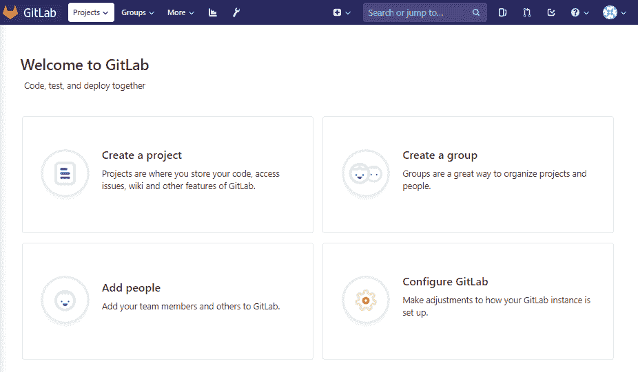

# 第三章

在 Kubernetes 上操作应用程序

在本章中，我们将讨论可用于在 Kubernetes 上部署云原生应用程序的供应工具。您将学习如何使用最流行的生命周期管理选项在 Kubernetes 上部署 DevOps 工具和 CI/CD（持续集成/持续交付或持续部署）基础设施。您将掌握执行第 1 天和第 2 天的操作的技能，例如安装、升级和版本控制部署，排除新应用程序，并在不再需要时删除部署。

在本章中，我们将涵盖以下主题：

+   使用 YAML 文件部署工作负载

+   使用自定义部署工作负载

+   使用 Helm 图表部署工作负载

+   使用 Kubernetes 运算符部署和操作应用程序

+   部署和管理 Jenkins X 的生命周期

+   部署和管理 GitLab 的生命周期

# 技术要求

本节中的配方假设您已部署了一个功能齐全的 Kubernetes 集群，遵循第一章中描述的推荐方法之一。

Kubernetes 操作工具 kubectl 将用于本节中其余的配方，因为它是针对 Kubernetes 集群运行命令的主要命令行界面。如果您使用 Red Hat OpenShift 集群，可以将 kubectl 替换为 oc，并且所有命令预计将类似地运行。

# 使用 YAML 文件部署工作负载

在本节中，我们将创建在 Kubernetes 中部署应用程序所需的资源配置。您将学习如何创建 Kubernetes 清单，部署工作负载，并使用 YAML 文件推出新版本。

## 准备工作

在开始之前，请克隆本章中使用的示例存储库：

```
$ git clone https://github.com/k8sdevopscookbook/src.git
```

确保您已准备好一个 Kubernetes 集群，并配置 kubectl 以管理集群资源。

## 操作步骤

本节进一步分为以下子节，以便简化流程：

+   创建部署

+   验证部署

+   编辑部署

+   回滚部署

+   删除部署

### 创建部署

这个教程将带您按照说明创建一个使用清单文件的部署，该文件保持一组 pod 运行。部署用于声明应该运行多少个 pod 的副本。部署可以进行扩展和缩减；我们将在第七章中更多地了解这个主题，*扩展和升级* *应用程序*。

让我们执行以下步骤：

1.  切换到`src/chapter2/yaml/`目录，这里是本教程的示例文件所在的位置：

```
$ cd src/chapter2/yaml/
```

1.  查看部署清单：

```
$ cat deployment-nginx.yaml
apiVersion: apps/v1
kind: deployment
metadata:
 name: nginx-deployment
 labels:
 app: nginx
spec:
 replicas: 2
 selector:
 matchLabels:
 app: nginx
# actual file is longer, shortened to show structure of the file only
```

YAML 是对空格敏感的。查看示例文件以了解文件的结构。您会发现 YAML 文件不使用制表符，而是使用空格字符。

如果有疑问，请使用 YAML 文件的 linter。

1.  通过应用 YAML 清单创建一个部署：

```
$ kubectl apply -f deployment-nginx.yaml
```

在运行了上述命令之后，YAML 清单中提到的容器镜像将从容器注册表中拉取，并且应用程序将按照部署清单中定义的方式在您的 Kubernetes 集群中安排。现在您应该能够通过以下教程来验证部署。

### 验证部署

这个教程将带您按照说明验证部署的状态，并在需要时进行故障排除。

让我们执行以下步骤：

1.  通过观察部署状态来确认部署状态显示了一个“成功部署”消息：

```
$ kubectl rollout status deployment nginx-deployment
deployment "nginx-deployment" successfully rolled out
```

1.  验证`DESIRED`和`CURRENT`值的数量是否相等，在我们的情况下是`2`：

```
$ kubectl get deployments
NAME             DESIRED CURRENT UP-TO-DATE AVAILABLE AGE
nginx-deployment 2       2       2          2         2m40s
```

1.  最后，还要检查作为部署的一部分部署的 ReplicaSets（`rs`）和`pods`：

```
$ kubectl get rs,pods
NAME                              DESIRED CURRENT READY AGE
nginx-deployment-5c689d88bb       2       2       2      28m
NAME                              READY STATUS  RESTARTS AGE
nginx-deployment-5c689d88bb-r2pp9 1/1   Running 0        28m
nginx-deployment-5c689d88bb-xsc5f 1/1   Running 0        28m
```

现在您已经验证了新的部署成功部署并运行。在生产环境中，您还需要编辑、更新和扩展现有的应用程序。在下一个教程中，您将学习如何对现有的部署执行这些修改操作。

### 编辑部署

这个教程将带您按照说明编辑现有的 Kubernetes 对象，并学习在需要时如何更改部署对象的参数。

让我们执行以下步骤：

1.  编辑部署对象并将容器镜像从 nginx 1.7.9 更改为 nginx 1.16.0：

```
$ kubectl edit deployment nginx-deployment
```

1.  您可以看到，部署首先进入挂起终止状态，然后在运行以下命令后，部署状态显示了一个“成功部署”的消息：

```
$ kubectl rollout status deployment nginx-deployment
Waiting for deployment "nginx-deployment" rollout to finish: 1 old replicas are pending termination...
deployment "nginx-deployment"
```

1.  确认您的部署通过创建新的 ReplicaSet 并将旧的 ReplicaSet 从`2`缩减到`0`来启动新的 pod：

```
$ kubectl get rs
NAME                        DESIRED CURRENT READY AGE
nginx-deployment-5c689d88bb 0       0       0     36m
nginx-deployment-f98cbd66f  2       2       2     46s
```

1.  我们将创建一个更改原因注释。以下命令将向您当前的部署添加在`kubernetes.io/change-cause`参数中定义的描述：

```
$ kubectl annotate deployment nginx-deployment kubernetes.io/change-cause="image updated to 1.16.0"
```

1.  现在，作为编辑部署的另一种替代方法，编辑`deployment-nginx.yaml`文件，并将副本从`replicas: 2`更改为`replicas: 3`，将`nginx:1.7.9`更改为`image: nginx:1.17.0`：

```
$ nano deployment-nginx.yaml
```

1.  通过应用更新后的 YAML 清单来更新部署。此步骤将应用用于部署的镜像标记的更改以及我们在*步骤 5*中增加的副本数：

```
$ kubectl apply -f deployment-nginx.yaml
```

1.  通过创建新的 ReplicaSet 并将旧的 pod 缩减到新的 pod 来确认您的部署正在启动新的 pod：

```
$ kubectl get rs
NAME                        DESIRED CURRENT READY AGE
nginx-deployment-5c689d88bb 0       0       0     56m
nginx-deployment-5d599789c6 3       3       3     15s
nginx-deployment-f98cbd66f  0       0       0     20m
```

1.  通过定义我们使用`kubernetes.io/change-cause`参数所做的更改来创建另一个更改原因注释：

```
$ kubectl annotate deployment nginx-deployment kubernetes.io/change-cause="image updated to 1.17.0 and scaled up to 3 replicas"
```

现在您已经学会了如何编辑、扩展，并使用 ReplicaSet 发布应用程序的新版本。

### 回滚部署

本教程将带您按照说明审查所做的更改，并通过比较注释回滚部署到旧的修订版本。

让我们执行以下步骤：

1.  检查部署的详细信息和事件，并注意最近的`ScalingReplicaSet`事件：

```
$ kubectl describe deployments
```

1.  现在，显示部署的发布历史。输出将显示修订版本以及我们创建的注释：

```
$ kubectl rollout history deployment nginx-deployment
deployment.extensions/nginx-deployment
REVISION CHANGE-CAUSE
1        <none>
2        image updated to 1.16.0
3        image updated to 1.17.0 and scaled up to 3 replicas
```

1.  回滚最后一次发布。此命令将使您的部署回到上一个修订版本，在本示例中为修订版本 2：

```
$ kubectl rollout undo deployment nginx-deployment
deployment.apps/nginx-deployment rolled back
```

1.  确认部署已回滚到上一个版本：

```
$ kubectl get rs
NAME                        DESIRED CURRENT READY AGE
nginx-deployment-5c689d88bb 0       0       0     69m
nginx-deployment-5d599789c6 0       0       0     12m
nginx-deployment-f98cbd66f  3       3       3     33m
```

请注意，回滚命令只会将部署回滚到不同的镜像版本发布，并不会撤消其他规范更改，例如副本的数量。

1.  现在，回滚到特定的修订版本。此命令将使您的部署回到使用`--to-revision`参数定义的特定修订版本：

```
$ kubectl rollout undo deployment nginx-deployment --to-revision=1
```

现在您已经学会了如何查看发布历史并在需要时回滚更改。

### 删除部署

Kubernetes 根据资源的可用性在工作节点上调度资源。如果您使用的是 CPU 和内存资源有限的小集群，您可能会很容易耗尽资源，这将导致新的部署无法在工作节点上调度。因此，除非在配方的要求中提到，否则在继续下一个配方之前始终清理旧的部署。

让我们执行以下步骤来删除`nginx-deployment`：

1.  在继续下一个步骤之前，请删除部署：

```
$ kubectl delete deployment nginx-deployment
```

上述命令将立即终止部署并从集群中删除应用程序。

## 工作原理...

*创建部署*的步骤向您展示了如何使用 YAML 清单文件将您的 Pod 和 ReplicaSets 的期望状态应用到部署控制器。

在第 2 步中，我们使用了`kubectl apply`命令，这是声明性管理方法的一部分，它进行增量更改而不是覆盖它们。第一次创建资源意图时，您可以使用`kubectl create`命令，这被认为是一种命令式管理方法。

我更喜欢使用`apply`命令，因为它允许声明性模式，而不是`create`，因为它更适合创建 CI 脚本，并且如果资源已经存在，则不会引发错误。

现在您已经学会了在 Kubernetes 中运行单个部署的基本步骤，我们可以继续进行更复杂的部署用例，使用 Kustomize、Helm 和 Operator 框架来组成一系列对象。

## 另请参阅

+   YAML 文件的语法检查器：[`github.com/adrienverge/yamllint`](https://github.com/adrienverge/yamllint)

+   在线 Kubernetes YAML 验证器：[`kubeyaml.com/`](https://kubeyaml.com/)

+   阅读更多关于使用配置文件进行 Kubernetes 对象的声明性管理：[`kubernetes.io/docs/tasks/manage-kubernetes-objects/declarative-config/`](https://kubernetes.io/docs/tasks/manage-kubernetes-objects/declarative-config/)

+   编写 Kubernetes 清单指南：[`github.com/bitnami/charts/blob/master/_docs/authoring-kubernetes-manifests.md`](https://github.com/bitnami/charts/blob/master/_docs/authoring-kubernetes-manifests.md)

# 使用 Kustomize 部署工作负载

在本节中，我们将向您展示如何从文件生成资源，并在 Kubernetes 中组成和自定义资源集合。您将了解使用 Kustomize 进行 Kubernetes 对象的声明性管理。

## 做好准备

确保您已准备好一个 Kubernetes 集群，并配置了`kubectl`来管理集群资源。

本节中创建的源文件可以在我的 GitHub 存储库中找到，位于[`github.com/k8sdevopscookbook/src/tree/master/chapter2/kustomize`](https://github.com/k8sdevopscookbook/src/tree/master/chapter2/kustomize)。建议您按照说明创建和编辑它们，并且只在遇到问题时使用存储库中的文件与您的文件进行比较。

## 操作步骤如下…

本节进一步分为以下小节，以便简化流程：

+   验证 Kubernetes 集群版本

+   从文件生成 Kubernetes 资源

+   为开发和生产部署创建一个基础

### 验证 Kubernetes 集群版本

为了使 Kustomize 正常运行，需要 Kubernetes 集群版本 1.14.0 或更高版本，因为 Kustomize 支持仅包含在 kubectl v.1.14.0 及更高版本中。

1.  列出节点以确认您的 Kubernetes 集群版本，并确保其为 1.14.0 或更高版本：

```
$ kubectl get nodes
 NAME STATUS ROLES AGE VERSION
 ip-172-20-112-25.ec2.internal Ready master 7h19m v1.15.0
 ip-172-20-126-108.ec2.internal Ready node 7h18m v1.15.0
 ip-172-20-51-209.ec2.internal Ready node 7h18m v1.15.0
 ip-172-20-92-89.ec2.internal Ready node 7h19m v1.15.0
```

在上面的例子中，版本显示为`v1.15.0`。

### 从文件生成 Kubernetes 资源

让我们学习如何使用 Kustomize 定制我们在上一个配方中做的 nginx 滚动：

1.  创建一个名为`nginx`的目录：

```
$ mkdir nginx
```

1.  将您在“使用 YAML 文件部署工作负载”配方中创建的`deployment-nginx.yaml`文件复制到`nginx`目录下。这个文件仍然使用`image: nginx:1.7.9`作为容器镜像：

```
$ cp deployment-nginx.yaml ./nginx/
```

1.  通过指定新的镜像版本创建一个`kustomization.yaml`文件：

```
$ cat <<EOF >./nginx/kustomization.yaml
apiVersion: kustomize.config.k8s.io/v1beta1
kind: Kustomization
resources:
- deployment-nginx.yaml
images:
 - name: nginx
 newName: nginx
 newTag: 1.16.0
commonAnnotations:
 kubernetes.io/change-cause: "Initial deployment with 1.16.0"
EOF
```

1.  通过运行以下命令检查新版本是否被注入到您的部署中。在输出中，您将看到`image: nginx:1.16.0`，而不是我们之前在`deployment-nginx.yaml`文件中使用的原始镜像版本`nginx:1.7.9`：

```
$ kubectl kustomize ./nginx/
```

1.  使用`-k`参数应用定制的部署：

```
$ kubectl apply -k nginx
```

1.  通过指定一个更新的镜像版本创建一个新的`kustomization.yaml`文件：

```
$ cat <<EOF > nginx/kustomization.yaml
apiVersion: kustomize.config.k8s.io/v1beta1
kind: Kustomization
resources:
 - deployment-nginx.yaml
images:
 - name: nginx
 newName: nginx
 newTag: 1.17.0
commonAnnotations:
 kubernetes.io/change-cause: "image updated to 1.17.0"
EOF
```

1.  使用`-k`参数应用定制的部署：

```
$ kubectl apply -k nginx
```

1.  现在，显示部署的滚动历史：

```
$ kubectl rollout history deployment nginx-deployment
deployment.extensions/nginx-deployment
REVISION CHANGE-CAUSE
1        Initial deployment with 1.16.0
2        image updated to 1.17.0
```

现在您已经学会了如何使用 Kustomize 编辑、扩展，并通过 Kustomize 推出应用的新版本。

### 为开发和生产部署创建一个基础

让我们执行以下步骤来创建一个本地 Docker 镜像注册表部署的基础，我们将在本章后面使用：

1.  创建一个名为`registry`的目录，并在其下创建一个名为`base`的目录：

```
$ mkdir registry && mkdir registry/base
```

1.  在`registry/base`下，从示例存储库中下载名为`deployment-registry.yaml`的部署文件：

```
$ cd registry/base/
$ wget https://raw.githubusercontent.com/k8sdevopscookbook/src/master/chapter2/kustomize/registry/base/deployment-registry.yaml
```

1.  查看文件以了解其结构。您将看到它是一个包含两个名为`registry`和`registryui`的容器的`Deployment`清单。您将看到注册表容器有一个名为`registry-storage`的`volumeMount`，这个卷是由名为`registry-pvc`的持久卷声明提供的：

```
$ cat deployment-registry.yaml
apiVersion: extensions/v1beta1
kind: Deployment
# actual file is longer, shortened to highlight important structure of the file only
 - image: registry:2
#....#
 - name: registry-storage
 mountPath: /var/lib/registry
#....#
 - name: registryui
 image: hyper/docker-registry-web:latest
#....#
 - name: registry-storage
 persistentVolumeClaim:
 claimName: registry-pvc
```

1.  在相同的`registry/base`下，从示例存储库中下载名为`service-registry.yaml`的服务清单文件：

```
$ wget https://raw.githubusercontent.com/k8sdevopscookbook/src/master/chapter2/kustomize/registry/base/service-registry.yaml
```

1.  查看文件以了解其结构。您将看到这是一个服务清单，它在每个节点的 IP 上以静态端口暴露服务；在这个示例中，`registry`服务的端口为`5000`，`registry-ui`服务的端口为`80`：

```
$ cat <<EOF > registry/base/service-registry.yaml
kind: Service
# actual file is longer, shortened to highlight important structure of the file only
 type: NodePort
 ports:
 - name: registry
 port: 5000
 protocol: TCP 
 nodePort: 30120
 - name: registry-ui
 port: 80
 protocol: TCP
 nodePort: 30220 
#....#
```

1.  创建一个名为`pvc-registry.yaml`的`PersistentVolumeClaim`清单文件，内容如下：

```
$ cat <<EOF > registry/base/pvc-registry.yaml
apiVersion: v1
kind: PersistentVolumeClaim
metadata:
 name: registry-pvc
 labels:
 app: kube-registry-pv-claim
spec:
 accessModes:
 - ReadWriteOnce
 resources:
 requests:
 storage: 10G
EOF
```

此时，您可以使用`kubectl apply -f registry/base`来部署`registry`目录下的所有资源文件。但是，每当您需要更改资源中的参数，比如`app`或`label`时，您需要编辑这些文件。使用 Kustomize 的整个目的是利用重用文件而无需修改文件的源。

1.  最后，创建`kustomization.yaml`文件。以下命令将创建 Kustomize 资源内容，其中包括我们之前创建的三个单独的清单文件：

```
$ cat <<EOF >./registry/base/kustomization.yaml
apiVersion: kustomize.config.k8s.io/v1beta1
kind: Kustomization
resources:
 - deployment-registry.yaml
 - service-registry.yaml
 - pvc-registry.yaml
EOF
```

1.  现在，创建两个用于开发和生产部署的叠加层。第一个是用于开发的：

```
$ mkdir registry/overlays && mkdir registry/overlays/dev 
$ cat <<EOF >./registry/overlays/dev/kustomization.yaml
apiVersion: kustomize.config.k8s.io/v1beta1
kind: Kustomization
bases:
 - ../../base
namePrefix: dev-
commonAnnotations:
 note: Hello, I am development!
EOF
```

1.  第二个清单将为生产创建叠加层：

```
$ mkdir registry/overlays/prod
$ cat <<EOF >./registry/overlays/prod/kustomization.yaml
apiVersion: kustomize.config.k8s.io/v1beta1
kind: Kustomization
bases:
 - ../../base
namePrefix: prod-
commonAnnotations:
 note: Hello, I am production!
EOF
```

1.  检查`dev`和`prod`前缀是否注入到您的部署中。当您指向`prod`文件夹时，注释说明将显示“你好，我是生产！”：

```
$ kubectl kustomize ./registry/overlays/prod/
# result shortened to highlight the annotation
metadata:
 annotations:
 note: Hello, I am production!
 labels:
 app: kube-registry-pv-claim
 name: prod-registry-pvc
#...#
```

1.  当您指向`dev`文件夹时，注释说明将显示“你好，我是开发！”：

```
$ kubectl kustomize ./dev/
... # removed
metadata:
 annotations:
 note: Hello, I am development!
 labels:
 app: kube-registry-pv-claim
 name: dev-registry-pvc
... # removed
```

1.  现在，部署您应用的`dev`版本：

```
$ kubectl apply -k ./registry/overlays/dev
```

同样，您可以注入标签，修补图像版本，更改副本的数量，并将资源部署到不同的命名空间。

## 它是如何工作的...

这个示例向您展示了如何使用 Git 管理和实现配置文件的基本版本控制。

在*为开发和生产部署创建基础*配方中，我们在`base`目录下创建的资源代表应用程序/工作负载的上游存储库，而在`overlay`目录下在第 8 步和第 10 步之间创建的自定义内容是您在存储库中控制和存储的更改。

稍后，如果您需要查看变体的差异，可以使用以下`diff`参数：

```
$ kubectl diff -k registry/overlays/prod/
```

通过将更改与基础分离，我们能够为多种目的定制无模板的 YAML 文件，保持原始 YAML 文件不变，从而实现源和更改的版本控制。

## 另请参阅

+   Kustomize 概念概述幻灯片：[`speakerdeck.com/spesnova/introduction-to-kustomize`](https://speakerdeck.com/spesnova/introduction-to-kustomize)

+   Kubernetes 背景下的声明式应用程序管理白皮书-强烈推荐阅读：[`goo.gl/T66ZcD`](https://goo.gl/T66ZcD)

+   Kustomize 中的常见术语：[`github.com/kubernetes-sigs/kustomize/blob/master/docs/glossary.md`](https://github.com/kubernetes-sigs/kustomize/blob/master/docs/glossary.md)

+   其他 Kustomize 示例：[`github.com/kubernetes-sigs/kustomize/tree/master/examples`](https://github.com/kubernetes-sigs/kustomize/tree/master/examples)

# 使用 Helm 图表部署工作负载

在本节中，我们将向您展示如何在 Kubernetes 中使用 Helm 图表。Helm 是 Kubernetes 的软件包管理器，可帮助开发人员和 SRE 轻松打包、配置和部署应用程序。

您将学习如何在集群上安装 Helm 并使用 Helm 来管理第三方应用程序的生命周期。

## 准备工作

确保您已准备好 Kubernetes 集群，并配置了`kubectl`来管理集群资源。

## 如何做…

本节进一步分为以下子节，以便简化流程：

+   安装 Helm 2.x

+   使用 Helm 图表安装应用程序

+   在 Helm 存储库中搜索应用程序

+   使用 Helm 更新应用程序

+   使用 Helm 回滚应用程序

+   添加新的 Helm 存储库

+   使用 Helm 删除应用程序

+   构建 Helm 图表

### 安装 Helm 2.x

让我们执行以下步骤来配置先决条件并安装 Helm：

1.  使用以下命令创建`ServiceAccount`：

```
$ cat <<EOF | kubectl apply -f -
apiVersion: v1
kind: ServiceAccount
metadata:
 name: tiller
 namespace: kube-system
EOF
```

1.  使用以下命令创建`ClusterRoleBinding`：

```
$ cat <<EOF | kubectl apply -f -
apiVersion: rbac.authorization.k8s.io/v1
kind: ClusterRoleBinding
metadata:
 name: tiller
roleRef:
 apiGroup: rbac.authorization.k8s.io
 kind: ClusterRole
 name: cluster-admin
subjects:
 - kind: ServiceAccount
 name: tiller
 namespace: kube-system
EOF
```

1.  下载 Helm 安装脚本。此`install-helm.sh`脚本将检测系统的架构并获取最新的正确二进制文件以安装 Helm：

```
$ curl https://raw.githubusercontent.com/kubernetes/helm/master/scripts/get > install-helm.sh
```

1.  运行脚本安装 Helm。以下命令将安装运行 Helm 所需的两个重要二进制文件 Helm 和 Tiller：

```
$ chmod u+x install-helm.sh && ./install-helm.sh
```

1.  运行`init`参数以使用我们在第 1 步创建的服务帐户配置 Helm。`--history-max`参数用于清除和限制 Helm 历史记录，因为如果没有此设置，历史记录可能会无限增长并引起问题：

```
$ helm init --service-account tiller --history-max 200
```

此过程将在您的集群中安装 Helm 服务器端组件 Tiller。

如果收到`Tiller 已经安装在集群中`的消息，可以在命令的末尾添加`--upgrade`参数运行相同的命令，并强制升级现有版本。

1.  通过运行以下命令确认 Helm 版本：

```
$ helm version --short
```

在撰写本文时，Helm 的最新稳定版本是 v2.15.1，下一个版本 Helm 3 仍处于测试阶段。在接下来的章节和配方中，我们将基于 Helm 2.x 版本进行指导。

### 使用 Helm 图表安装应用程序

让我们执行以下步骤，从官方 Helm 存储库位置安装 Helm 图表：

1.  在安装图表之前，始终同步存储库以获取最新内容。否则，您可能会得到旧版本的 Helm 图表：

```
$ helm repo update
```

1.  安装示例图表，例如`stable/mysql`：

```
$ helm install --name my-mysqlrelease stable/mysql
```

同样，您可以从 Helm 图表稳定存储库安装其他应用程序，或者添加自己的存储库以获取自定义图表。

每次安装图表时，都会创建一个具有随机名称的新发布，除非使用`--name`参数指定。现在，列出发布：

```
$ helm ls
NAME            REVISION UPDATED                 STATUS   CHART         APP VERSION NAMESPACE
my-mysqlrelease 1        Thu Aug 8 02:30:27 2019 DEPLOYED mysql-1.3.0 5.7.14        default
```

1.  检查发布状态，在我们的示例中是`my-mysqlrelease`：

```
$ helm status my-mysqlrelease
```

您将获得部署状态和所有资源的信息。

### 在 Helm 存储库中搜索应用程序

让我们执行以下步骤，从 Helm 图表存储库中搜索要在 Kubernetes 上部署的应用程序：

1.  在存储库中搜索图表。以下命令将在您可以访问的 Helm 存储库中查找您搜索的词语：

```
$ helm search redis
NAME CHART VER APP VER DESCRIPTION 
stable/prometheus-redis-exporter 3.0.0 1.0.3 Prometheus export
stable/redis 9.0.1 5.0.5 Open source, adva
stable/redis-ha 3.6.2 5.0.5 Highly available 
stable/sensu 0.2.3 0.28 Sensu monitoring 
```

您可以在 helm/stable 中找到所有工作负载的完整列表，并在以下 GitHub 链接的存储库中找到源代码：[`github.com/helm/charts/tree/master/stable `](https://github.com/helm/charts/tree/master/stable)

1.  您的`search`关键字不一定要是项目的确切名称。您还可以搜索关键字，如`Storage`、`MQ`或`Database`：

```
$ helm search storage
NAME                 CHART VERSION APP VERSION DESCRIPTION ...
stable/minio         2.5.4 RELEASE.2019-07-17T22-54-12Z MinIO is a hi
stable/nfs-server-pr 0.3.0 2.2.1-k8s1.12 nfs-server-provisioner is an
stable/openebs       1.0.0 1.0.0 Containerized Storage for Containers
```

默认情况下，您的存储库列表仅限于`helm/stable`位置，但稍后在*添加新的 Helm 存储库*配方中，您还将学习如何添加新的存储库以扩展您的搜索范围到其他存储库。

### 使用 Helm 升级应用程序

有几种使用升级的方法。让我们执行以下步骤：

1.  升级发布，在我们的例子中是`my-mysqlrelease`，使用更新的图表版本：

```
$ helm upgrade my-mysqlrelease stable/mysql
```

1.  在将来，您可能会发现应用程序的特定版本在您的环境中更加稳定，或者在多个集群中保持安装的一致。在这种情况下，您可以使用以下命令使用您偏好的图表版本更新图表版本：

```
$ helm upgrade my-mysqlrelease stable/mysql --version 1.2.0
```

1.  使用以下命令确认图表版本更改。在第 2 步升级版本后，您应该期望看到`mysql --version 1.2.0`：

```
$ helm ls
NAME            REVISION UPDATED                  STATUS   CHART       APP VERSION NAMESPACE
my-mysqlrelease 3        Tue Jul 30 22:44:07 2019 DEPLOYED mysql-1.2.0 5.7.14      default
```

1.  使用以下命令查看修订历史。由于我们最近更新了图表版本，您应该在历史记录中看到至少两个修订版本：

```
$ helm history my-mysqlrelease stable/mysql
REV UPDATED             STATUS     CHART       DESCRIPTION
1   Oct 1 22:47:37 2019 SUPERSEDED mysql-1.3.3 Install complete
2   Oct 1 22:57:32 2019 SUPERSEDED mysql-1.3.3 Upgrade complete
3   Oct 1 23:00:44 2019 DEPLOYED   mysql-1.2.0 Upgrade complete
```

1.  使用`helm upgrade`函数通过使用`--set key=value[,key=value]`参数指定参数来更新现有发布上的参数。以下命令将使用`--set mysqlRootPassword`参数设置两个 MySQL 密码：

```
$ helm upgrade my-mysqlrelease stable/mysql --version 1.2.0 --set mysqlRootPassword="MyNevvPa55w0rd"
```

1.  确认密码实际上已更新。您应该期望得到与第 4 步设置的相同密码：

```
$ kubectl get secret --namespace default my-mysqlrelease -o jsonpath="{.data.mysql-root-password}" | base64 --decode; echo
MyNevvPa55w0rd
```

现在您已经学会了如何使用新参数升级 Helm 发布。

### 使用 Helm 回滚应用程序

让我们执行以下步骤，撤消升级并将应用程序状态恢复到先前的修订版本：

1.  列出您的发布的修订历史，例如`coy-jellyfish`：

```
$ helm history my-mysqlrelease
REV UPDATED                 STATUS     CHART       DESCRIPTION
1   Tue Oct 1 22:47:37 2019 SUPERSEDED mysql-1.3.3 Install complete
2   Tue Oct 1 22:57:32 2019 SUPERSEDED mysql-1.3.3 Upgrade complete
3   Tue Oct 1 23:00:44 2019 SUPERSEDED mysql-1.2.0 Upgrade complete
4   Tue Oct 1 23:07:23 2019 SUPERSEDED mysql-1.3.3 Upgrade complete
5   Tue Oct 1 23:10:39 2019 DEPLOYED   mysql-1.2.0 Upgrade complete
```

1.  假设您需要从最后一次升级回滚到修订版本`4`。回滚到特定的修订版本：

```
$ helm rollback my-mysqlrelease 4
Rollback was a success.
```

1.  修订历史将更新以反映您的回滚：

```
$ helm history my-mysqlrelease
 REV UPDATED                  STATUS     CHART       DESCRIPTION
...
 5   Tue Jul 30 22:44:07 2019 SUPERSEDED mysql-1.2.0 Upgrade complete
 6   Tue Jul 30 23:11:52 2019 DEPLOYED   mysql-1.3.0 Rollback to 4
```

现在您已经学会了如何查看发布历史并在需要时回滚 Helm 发布。

### 使用 Helm 删除应用程序

让我们执行以下步骤，从您的 Kubernetes 集群中使用 Helm 删除部署的应用程序：

1.  使用`helm ls`命令和`--all`参数列出所有发布，包括已删除的修订版本：

```
helm ls --all
NAME REVISION UPDATED STATUS CHART APP VERSION NAMESPACE
my-mysqlrelease 6 Thu Aug 8 02:34:13 2019 DEPLOYED mysql-1.3.0 5.7.14 default
```

1.  使用`--purge`参数删除一个发布。以下命令将完全从您的集群中删除应用程序：

```
helm delete --purge my-mysqlrelease
```

上述命令将立即终止部署并从集群中删除 Helm 发布。

### 添加新的 Helm 存储库

默认情况下，Helm 只使用官方的 Helm/stable 存储库进行查找，通常在接下来的章节中，我们需要使用本教程中解释的方法从第三方供应商那里添加额外的存储库。

让我们执行以下步骤来将额外的 Helm 存储库添加到你的源列表中：

1.  检查现有存储库的列表。你应该只能看到列表上的`stable`和`local`：

```
$ helm repo list
 NAME   URL
 stable https://kubernetes-charts.storage.googleapis.com
 local  http://127.0.0.1:8879/charts
```

1.  我们需要为我们的存储库服务器配置一个持久卷和认证。使用以下内容创建一个名为`customhelmrepo.yaml`的文件：

```
cat <<EOF >customhelmrepo.yaml
env:
 open:
 STORAGE: local
persistence:
 enabled: true
 accessMode: ReadWriteOnce
 size: 10Gi
 secret:
 BASIC_AUTH_USER: helmcurator
 BASIC_AUTH_PASS: myhelmpassword
EOF
```

1.  使用持久卷创建一个存储库服务器：

```
$ helm install --name my-chartmuseum -f customhelmrepo.yaml stable/chartmuseum
```

1.  获取`chartmuseum`的服务 IP。以下命令将返回一个 IP 地址，在我们的例子中是`10.3.0.37`：

```
$ kubectl get svc --namespace default -l "app=chartmuseum" -l \
"release=my-chartmuseum" -o jsonpath="{.items[0].spec.clusterIP}"; echo
10.3.0.37
```

1.  将新的 Helm 存储库添加到你的存储库列表中；在我们的例子中，IP 是`10.3.0.37`：

```
$ helm repo add chartmuseum http://10.3.0.37:8080
```

1.  检查现有存储库的列表：

```
$ helm repo list
NAME        URL
stable      https://kubernetes-charts.storage.googleapis.com
local       http://127.0.0.1:8879/charts
chartmuseum http://10.3.0.37:8080
```

有许多选项可用于托管你的图表存储库。你可以使用一个名为 ChartMuseum 的开源 Helm 存储库服务器部署一个本地存储库，也可以使用 S3 存储桶、GitHub 页面或经典的 Web 服务器。为了简单起见，我们使用 Helm 本身来部署服务器。你可以在*另请参阅*部分找到 Helm 图表的替代托管方法。

### 构建一个 Helm 图表

让我们执行以下步骤来构建一个自定义的 Helm 图表，以便发布到你的本地`chartmuseum`存储库中：

1.  创建一个名为`mychart`的图表：

```
$ helm create mychart
```

1.  根据你的喜好编辑你的图表结构并测试模板可能出现的错误：

```
$ helm lint ./mychart
==> Linting ./mychart
[INFO] Chart.yaml: icon is recommended
1 chart(s) linted, no failures
```

1.  使用`--dry-run`测试你的应用程序：

```
$ helm install ./mychart --debug --dry-run
```

4. 构建 Helm 图表。通过运行以下命令，你将从`mychart`位置生成一个 Helm 存储库的 tarball 包：

```
$ helm package .
```

1.  用你的 Helm 服务器替换 Helm 存储库服务器地址，并使用 URL 上传这个 Helm 图表包：

```
$ cd mychart && curl --data-binary "@mychart-0.1.0.tgz" http://10.3.0.37:8080/api/charts
```

现在你已经学会了如何创建、清理、测试、打包和上传你的新图表到本地基于 ChartMuseum 的 Helm 存储库。

## 它是如何工作的...

这个教程向你展示了如何安装 Helm 包管理器并构建你的第一个 Helm 图表。

当我们在*构建 Helm 图表*教程中构建 Helm 图表时，在第 1 步中，`helm create`命令在`chart`文件夹下创建了一些文件作为模板。你可以通过编辑这些文件或者在你对结构更加熟悉时从头开始创建它们。

`helm create`命令创建了构建我们 Helm 图表的模板。这里解释了内容及其功能：

```
mychart 
├── Chart.yaml          --> Description of the chart
├── charts              --> Directory for chart dependencies
├── mychart-0.1.0.tgz   --> Packaged chart following the SemVer 2 standard
├── templates           --> Directory for chart templates
│   ├── NOTES.txt       --> Help text displayed to users
│   ├── _helpers.tpl    --> Helpers that you can re-use 
│   ├── deployment.yaml --> Application - example deployment
│   ├── service.yaml    --> Application - example service endpoint
└── values.yaml         --> Default values for a chart
```

在*构建 Helm 图表*的步骤中，在第 3 步`helm install`中，当与`--dry-run`参数一起使用时，会将图表发送到服务器，并返回渲染的模板，而不是安装它。这通常用于测试 Helm 图表。

在同一步骤中，在第 4 步中，`helm package`命令将您的完整图表打包成图表存档，基本上是一个 tarball。

在第 5 步中，我们使用`curl`命令将打包的 tarball 二进制文件发送到我们的 ChartMuseum 服务器，一个 HTTP 服务器，以便在接收到`helm`命令的`GET`请求时为我们提供 Helm 图表存档。

现在您已经学会了如何安装 Helm 图表并在本地存储库中创建您自己的 Helm 图表，您将能够安装下一章节中所需的第三方图表，以及在 CI/CD 流水线中构建您自己的构件。

## 另请参阅

+   Helm 文档：[`docs.helm.sh`](https://docs.helm.sh)

+   Helm 图表的替代托管方法：https://v2.helm.sh/docs/chart_repository/

+   使用图表模板入门：[`helm.sh/docs/chart_template_guide/`](https://helm.sh/docs/chart_template_guide/)

+   构建`Chart.yaml`文件所需的字段：[`v2.helm.sh/docs/chart_template_guide/`](https://v2.helm.sh/docs/chart_template_guide/)

+   J-Frog 容器注册表，一个强大的混合 Docker 和 Helm 注册表：[`jfrog.com/container-registry/`](https://jfrog.com/container-registry/)

# 使用 Kubernetes 操作员部署和操作应用程序

Kubernetes 操作员是另一种在 Kubernetes 上打包、部署和管理应用程序的方法。操作员比 Helm 等包管理器更复杂。操作员有助于消除手动步骤、特定于应用程序的准备工作和部署后步骤，甚至自动化用户的二天操作，如扩展或升级。

例如，一个应用程序的要求可能会根据其安装的平台而有所不同，或者可能需要更改其配置并与外部系统进行交互。

在本节中，我们将部署两个基于两种不同操作员框架的热门有状态应用程序的操作员，并了解它们提供了哪些功能。

## 准备工作

确保您已经准备好一个 Kubernetes 集群，并配置了`kubectl`来管理集群资源。

## 如何做…

该部分进一步分为以下子部分以简化流程：

+   安装**KUDO**（**Kubernetes 通用声明运算符**）和 KUDO kubectl 插件

+   使用 KUDO 安装 Apache Kafka 运算符

+   安装 Operator Lifecycle Manager

+   安装 Zalando PostgreSQL 运算符

### 安装 KUDO 和 KUDO kubectl 插件

在使用 KUDO 运算符安装应用程序之前，您需要安装 KUDO。我们将使用`brew`来安装 KUDO，这是 Linux 上用于简单安装二进制文件的软件包管理器；因此，如果您还没有安装`brew`，您也需要安装它：

1.  按照*使用 Helm 图表部署工作负载*中的 Helm 说明来运行 Helm。

1.  使用以下命令安装`brew`：

```
$ sh -c "$(curl -fsSL https://raw.githubusercontent.com/Linuxbrew/install/master/install.sh)"
$ PATH=/home/linuxbrew/.linuxbrew/bin/:$PATH
```

1.  通过运行以下命令使用`brew install`安装 KUDO 和`kudo kubectl`插件：

```
$ brew tap kudobuilder/tap && brew install kudo-cli
```

1.  按照以下方式安装 KUDO：

```
$ kubectl kudo init
```

值得一提的是，Kubernetes 运算符是 Kubernetes 社区中一个不断发展的概念。有多个运算符框架，例如 Red Hat Operator Framework、D2iQ 的 KUDO 等。此外，对于每个工作负载，您会发现社区开发了许多运算符。我建议在决定使用运算符之前测试几种不同的运算符，以找到适合您用例的运算符。

现在您已经安装了 KUDO 控制器，可以使用 Kubernetes Operators 测试一些有状态的运行应用程序。

### 使用 KUDO 安装 Apache Kafka Operator

在*另请参阅*部分列出了多个 Kafka 运算符，例如 Strimzi、Banzai Cloud、Confluent、krallistic 等。虽然在本文中我没有偏好，但作为示例，我们将基于 KUDO Operator 部署 Apache Kafka Operator。

让我们执行以下步骤：

1.  Kafka 需要 ZooKeeper。让我们创建一个 ZooKeeper 集群：

```
$ kubectl kudo install zookeeper --instance=zk
```

1.  使用 KUDO Kafka Operator 创建 Kafka 集群：

```
$ kubectl kudo install kafka --instance=kafka
```

1.  通过查询`Operators` CRD API 列出 KUDO 运算符如下。在部署 Kafka 之后，您还应该看到`kafka`和`zookeeper`运算符：

```
$ kubectl get Operators
NAME      AGE
kafka     9s
zookeeper 17s
```

1.  列出 KUDO 实例：

```
$ kubectl get instances
NAME  AGE
kafka 25s
zk    33s
```

现在您已经学会了如何使用 KUDO Operator 部署 ZooKeeper 和 Kafka。

### 安装 Operator Lifecycle Manager

在使用 Red Hat Operator Framework 运算符安装应用程序之前，您需要安装**Operator Lifecycle Manager**（**OLM**）。请注意，OLM 在 OpenShift 4.0 及更高版本中默认安装。

1.  安装 OLM。这是我们下一个配方*安装 Zalando PostgreSQL Operator*所需的：

```
$ kubectl create -f https://raw.githubusercontent.com/Operator-framework/Operator-lifecycle-manager/master/deploy/upstream/quickstart/crds.yaml
$ kubectl create -f https://raw.githubusercontent.com/Operator-framework/Operator-lifecycle-manager/master/deploy/upstream/quickstart/olm.yaml
```

现在您已经安装了 OLM 来测试使用 Operator Framework 运行一些有状态的应用程序。

### 安装 Zalando PostgreSQL Operator

在*另请参阅*部分列出了多个 PostgreSQL Operators，例如 CrunchyDB 和 Zalando。在本示例中，我们将部署 Zalando PostgreSQL Operator 来管理 Kubernetes 集群中的 PostgreSQL 部署的生命周期。

让我们执行以下步骤来使用 Operator Hub 部署 Zalando PostgreSQL Operator：

1.  从 Operator Hub 安装`postgres-Operator`：

```
$ kubectl create -f https://Operatorhub.io/install/postgres-Operator.yaml
```

1.  验证`postgres-Operator`是否正在运行：

```
$ kubectl get pods -n Operators
NAME                               READY STATUS  RESTARTS AGE
postgres-Operator-5cd9d99494-5nl5r 1/1   Running 0        3m56s
```

1.  现在 PostgreSQL Operator 已经启动运行，让我们部署 Postgres Operator UI：

```
$ kubectl apply -f https://raw.githubusercontent.com/k8sdevopscookbook/src/master/chapter2/postgres-Operator/ui/postgres-ui.yaml
```

1.  部署 PostgreSQL。以下命令将创建一个小的两实例 PostgreSQL 集群：

```
$ kubectl create -f https://raw.githubusercontent.com/zalando/postgres-Operator/master/manifests/minimal-postgres-manifest.yaml
```

1.  列出由 Zalando Operator 管理的 PostgreSQL 实例。它将显示一个名为`acid-minimal-cluster`的集群：

```
$ kubectl get postgresql
NAME                 TEAM VERSION PODS VOLUME CPU-REQUEST MEMORY-REQUEST AGE STATUS
acid-minimal-cluster acid 11      2    1Gi                               7s
```

1.  首先获取您的集群凭据，并使用`psql`交互式 PostgreSQL 终端连接到您的 PostgreSQL，如下所示：

```
$ export PGPASSWORD=$(kubectl get secret postgres.acid-minimal-cluster.credentials -o 'jsonpath={.data.password}' | base64 -d)
$ export PGSSLMODE=require
$ psql -U postgres
```

1.  删除您的 PostgreSQL 集群：

```
$ kubectl delete postgresql acid-minimal-cluster
```

现在您已经学会了如何简单地使用流行的 Kubernetes Operators 在 Kubernetes 上部署和管理工作负载。您可以稍后应用这些知识，以简化您在开发和生产环境中使用的有状态工作负载的生命周期管理。

## 另请参阅

+   在 KubeCon 2018 上深入了解 Kubernetes Operators：[`developers.redhat.com/blog/2018/12/18/kubernetes-Operators-in-depth/`](https://developers.redhat.com/blog/2018/12/18/kubernetes-operators-in-depth/)

+   社区提供的 Kubernetes Operators 列表：[`github.com/Operator-framework/awesome-Operators`](https://github.com/operator-framework/awesome-operators)

+   使用 Red Hat Operator SDK 构建的 Kubernetes Operators 列表：[`Operatorhub.io/`](https://operatorhub.io/)

+   **Kubernetes 通用声明 Operator**（**KUDO**）：[`kudo.dev/`](https://kudo.dev/)

+   基于 KUDO 的 Operators 的存储库：[`github.com/kudobuilder/Operators`](https://github.com/kudobuilder/operators)

+   一个 Python 框架，可以用几行代码编写 Kubernetes Operators：[`github.com/zalando-incubator/kopf`](https://github.com/zalando-incubator/kopf)

+   备用 Kafka Operators 列表：

+   在 OpenShift 上运行的 Apache Kafka Operator：[`strimzi.io/`](http://strimzi.io/)

+   KUDO Kafka Operator: [`github.com/kudobuilder/Operators/tree/master/repository/kafka`](https://github.com/kudobuilder/operators/tree/master/repository/kafka)

+   另一个用于 Kubernetes 的 Kafka Operator: [`github.com/banzaicloud/kafka-Operator`](https://github.com/banzaicloud/kafka-operator)

+   Istio Operator: [`github.com/banzaicloud/istio-Operator`](https://github.com/banzaicloud/istio-operator)

+   备用的 PostgreSQL Operator 列表：

+   Crunchy Data PostgreSQL Operator: [`github.com/CrunchyData/postgres-Operator`](https://github.com/CrunchyData/postgres-operator)

+   Zalando PostgreSQL Operator: [`github.com/zalando/postgres-Operator`](https://github.com/zalando/postgres-operator)

# 部署和管理 Jenkins X 的生命周期

Jenkins X 是一个开源解决方案，为软件开发人员提供管道自动化、内置 GitOps、CI、自动化测试和 CD，即 CI/CD，在 Kubernetes 中。Jenkins X 专注于利用 Kubernetes 生态系统加速大规模软件交付。

在本节中，我们将专注于 Jenkins X 示例，并在您的云提供商上创建具有 CI/CD 功能的 Kubernetes 集群。

## 准备工作

在以下示例中，您将学习如何创建一个静态的 Jenkins 服务器，以部署具有管道自动化和自动 CI/CD 的 Kubernetes 集群，并使用 GitOps 推广和预览环境。

此示例需要 kubectl 和 Helm。对于此示例，我们将使用**GKE**（**Google Kubernetes Engine**的缩写），因此还需要安装 gcloud CLI 工具。您还需要创建一个适当的 GitHub 组织和 GitHub 帐户。

## 如何做到...

本节进一步分为以下小节，以便简化流程：

+   安装 Jenkins X CLI

+   创建 Jenkins X Kubernetes 集群

+   验证 Jenkins X 组件

+   切换 Kubernetes 集群

+   验证集群一致性

### 安装 Jenkins X CLI

Jenkins X CLI `jx` 与您首选的云提供商 CLI 一起用于编排 Kubernetes 集群的部署。Jenkins X 支持 Azure、AWS、**GCP**（**Google Cloud Platform**的缩写）、IBM Cloud、Oracle Cloud、Minikube、Minishift 和 OpenShift 作为部署的提供者。对于此示例，我们将使用 GKE。请参阅 Jenkins X 文档以获取其他供应商的说明。

让我们执行以下步骤来安装 Jenkins X CLI 工具：

1.  访问 JX 发布站点[`github.com/jenkins-x/jx/releases`](https://github.com/jenkins-x/jx/releases)并注意最新的发布版本。在撰写本文时，最新的发布版本是 v2.0.905。

1.  在以下命令中更新发布版本。下载并安装最新版本的 Jenkins X CLI：

```
$ curl -L https://github.com/jenkins-x/jx/releases/download/v2.0.905/jx-linux-amd64.tar.gz | tar xzv 
$ sudo mv jx /usr/local/bin
```

现在你已经安装了 Jenkins X CLI，你可以继续下一个步骤了。

### 创建一个 Jenkins X Kubernetes 集群

你可能更喜欢其他云供应商或本地部署。在这个示例中，我们将使用 GKE。查看 Jenkins X 文档以获取其他供应商的说明。

让我们执行以下步骤来使用`jx`创建你的第一个 Jenkins X Kubernetes 集群：

1.  使用以下命令和`gke`参数创建一个 GKE 的 Kubernetes 集群：

```
$ jx create cluster gke --skip-login
```

1.  选择你的 Google Cloud 项目；在我们的例子中是`devopscookbook`。

1.  选择`us-central1-a`当被要求选择一个 Google Cloud 区域时。

1.  选择静态 Jenkins 服务器和 Jenkinsfiles 作为安装类型。

1.  输入你的 GitHub 用户名：

```
Creating a local Git user for GitHub server
? GitHub username:
```

1.  输入你的 GitHub API 令牌。前往 GitHub Token 页面[`github.com/settings/tokens/new?scopes=repo,read:user,read:org,user:email,write:repo_hook,delete_repo`](https://github.com/settings/tokens/new?scopes=repo,read:user,read:org,user:email,write:repo_hook,delete_repo)获取你的 API 令牌：

```
Please click this URL and generate a token
https://github.com/settings/tokens/new?scopes=repo,read:user,read:org,user:email,write:repo_hook,delete_repo
Then COPY the token and enter it following:
? API Token:
```

1.  默认情况下，Jenkins X 会设置入口规则来使用魔术 DNS `nip.io` 域：

```
? Domain [? for help] (your_IP.nip.io)
```

1.  对以下问题输入`Yes`：

```
? Do you wish to use GitHub as the pipelines Git server: (Y/n)
```

1.  选择你想要创建环境仓库的 GitHub 组织；在我们的例子中是`k8devopscookbook`。

1.  当你的部署成功时，你会看到类似以下的消息：

```
Jenkins X installation completed successfully
 ********************************************************
 NOTE: Your admin password is: your_password
 ********************************************************
...
Context "gke_devopscookbook_us-central1-a_slayersunset" modified.
NAME            HOSTS                             ADDRESS PORTS AGE
chartmuseum     chartmuseum.jx.your_IP.nip.io     your_IP 80    7m43s
docker-registry docker-registry.jx.your_IP.nip.io your_IP 80    7m43s
jenkins         jenkins.jx.your_IP.nip.io         your_IP 80    7m43s
nexus           nexus.jx.your_IP.nip.io           your_IP 80    7m43s
```

你也可以在前面的输出中找到你的管理员密码。

### 验证 Jenkins X 组件

让我们执行以下步骤来验证所有 Jenkins X 组件是否按预期运行：

1.  确认所有的 pod 都在运行。`jx`命名空间中的所有 pod 都应该处于运行状态：

```
$ kubectl get pods -n jx
NAME                                          READY STATUS  RESTARTS AGE
jenkins-956c58866-pz5vl                       1/1   Running 0       11m
jenkins-x-chartmuseum-75d45b6d7f-5bckh        1/1   Running 0       11m
jenkins-x-controllerrole-bd4d7b5c6-sdkbg      1/1   Running 0       11m
jenkins-x-controllerteam-7bdd76dfb6-hh6c8     1/1   Running 0       11m
jenkins-x-controllerworkflow-7545997d4b-hlvhm 1/1   Running 0       11m
jenkins-x-docker-registry-6d555974c7-sngm7    1/1   Running 0       11m
jenkins-x-heapster-7777b7d7d8-4xgb2           2/2   Running 0       11m
jenkins-x-nexus-6ccd45c57c-btzjr              1/1   Running 0       11m
maven-brcfq                                   2/2   Running 0       63s
maven-qz0lc                                   2/2   Running 0       3m
maven-vqw9l                                   2/2   Running 0       32s
```

1.  获取我们需要连接的 Jenkins X 服务 URL 列表。你将会得到类似以下的`jenkins`、`chartmuseum`、`docker-registry`和`nexus`的 URL 列表：

```
$ jx get urls
NAME                      URL
jenkins                   http://jenkins.jx.your_IP.nip.io
jenkins-x-chartmuseum     http://chartmuseum.your_IP.nip.io
jenkins-x-docker-registry http://docker-registry.jx.your_IP.nip.io
nexus                     http://nexus.jx.your_IP.nip.io
```

现在你可以通过访问`jx get urls`命令的前面输出中的第一个 URL 连接到 Jenkins UI。

### 切换 Kubernetes 集群

让我们执行以下步骤来在 Jenkins X 中切换你可以访问的 Kubernetes 集群：

1.  通过列出上下文来获取现有的 Kubernetes 集群：

```
$ jx context
```

1.  选择您想要使用的集群。在我们的情况下，我们切换到使用 Jenkins X 创建的 `gke_devopscookbook` 集群：

```
Change Kubernetes context: [Use arrows to move, space to select, type to filter]
> gke_devopscookbook_us-central1-a_slayersunset
eks_devopscookbook_us-west
openshift_cluster
```

现在您知道如何使用 Jenkins X CLI 切换上下文了。

### 验证集群符合性

如果您在现有的 Kubernetes 集群之间切换，建议在运行流水线之前验证集群配置。让我们执行以下步骤：

1.  验证您的集群是否合规。这些测试通常需要一个小时：

```
jx compliance run
```

1.  检查状态。此命令仅在测试完成后返回“合规性测试已完成”消息：

```
$ jx compliance status
Compliance tests completed.
```

1.  查看结果。如果您的集群符合规定，所有执行的测试结果应显示为“通过”：

```
$ jx compliance results
```

现在您知道如何检查集群符合性结果了。

## 工作原理...

《创建 Jenkins X Kubernetes 集群》的教程向您展示了如何为流水线自动化和自动化 CI/CD 提供 Kubernetes 集群。

在《创建 Jenkins X Kubernetes 集群》的教程中，在第 1 步，我们使用 Jenkins X CLI 创建了集群。默认情况下，Jenkins X 在 GKE 上使用 `n1-standard-2` 作为机器类型，并创建一个最小为三个、最大为五个节点的集群。请记住，您也可以使用现有的 Kubernetes 集群，而不是创建新的集群。大多数设置将在下次运行 `create cluster` 命令时保存和记住。

Jenkins X 部署了一些服务，包括 Jenkins、私有 Docker 注册表、私有 Helm 仓库 ChartMuseum、用于管理 Helm 图表的 Monocular，以及名为 Nexus 的 Maven 和 npm 仓库。

安装后，您将在存储库中找到，Jenkins X 创建了两个 Git 存储库，一个用于暂存环境，一个用于生产环境。Jenkins X 使用 GitOps 方法通过 Git 拉取请求（PR）从一个存储库推广代码到另一个存储库。因此，每个存储库都包含一个 Jenkins 流水线来处理推广。

在《创建 Jenkins X Kubernetes 集群》的教程中，在第 7 步，Jenkins X 使用魔术 DNS 服务，并通过 `nip.io` 服务将您的 GKE 集群的 IP 地址转换为可通过 DNS 发现的主机名。如果您拥有自己的域并且 DNS 配置为指向您的集群，您可以使用 `jx upgrade ingress --cluster` 命令稍后更新设置。

稍后，在第 10 步，您将获得分配给您的管理员用户的默认密码。当您首次通过本步骤提供的 URL 连接到 Jenkins UI 时，将要求您更改此密码。

## 还有更多...

了解以下信息也很有用：

+   导入应用程序

+   升级 Jenkins X

+   删除 Jenkins X Kubernetes 集群

### 导入应用程序

让我们执行以下步骤来将现有应用程序导入 Jenkins X 环境：

1.  克隆或使用现有应用程序。例如，我们将创建`hello-world`示例的克隆：

```
$ mkdir import && cd import
$ git clone https://github.com/k8sdevopscookbook/hello-world.git
```

1.  从`cloned`目录中删除 Git 文件。这将从目录中删除 Git 历史记录：

```
$ cd hello-world & sudo rm -r .git/
```

1.  在文件夹中运行以下命令以将源代码导入 Jenkins X：

```
$ jx import
```

### 升级 Jenkins X 应用程序

让我们执行以下步骤来升级 Jenkins X 应用程序及其组件：

1.  首先，升级`jx` CLI。如果远程存储库中有新版本可用，此命令将升级应用程序：

```
$ jx upgrade cli
```

1.  一旦您使用最新的 CLI，使用以下命令升级平台。如果存在新版本，新的`jx` CLI 命令将升级平台组件：

```
$ jx upgrade platform
```

### 删除 Jenkins X Kubernetes 集群

删除托管的 Kubernetes 集群可能会很棘手，特别是如果不是您创建它们的人。由于我们使用 GKE 创建它们，使用 gcloud CLI 工具更快地删除它们。让我们执行以下步骤来删除我们使用 Jenkins X 创建的 Kubernetes 集群：

1.  使用您的云提供商的说明来删除 Kubernetes 集群。在我们的情况下，我们使用 GKE 来进行操作。首先，列出集群：

```
$ gcloud container clusters list
NAME LOCATION MASTER_VERSION MASTER_IP MACHINE_TYPE NODE_VERSION NUM_NODES STATUS
clustername us-central1-a 1.12.8-gke.10 your_IP n1-standard-2 1.12.8-gke.10 3 RUNNING
```

1.  使用步骤 1 的输出中的`clustername`删除集群：

```
$ gcloud container clusters delete <clustername>
```

现在您已经学会了如何使用 Jenkins X 来创建您的集群。这些知识已经为您准备好了第三章，*构建 CI/CD 流水线*，在那里您将继续使用这个环境，并学会在 Jenkins X 中将应用程序导入为流水线。

## 另请参阅

+   Jenkins 简介：[`jenkins.io/blog/2018/03/19/introducing-jenkins-x/`](https://jenkins.io/blog/2018/03/19/introducing-jenkins-x/)

+   Jenkins X 存储库和二进制文件：[`github.com/jenkins-x/jx`](https://github.com/jenkins-x/jx)

+   Jenkins X 教程：[`jenkins-x.io/tutorials/`](https://jenkins-x.io/tutorials/)

+   Jenkins X 入门说明：[`jenkins-x.io/getting-started/install-on-cluster/`](https://jenkins-x.io/getting-started/install-on-cluster/)

+   Jenkins X CLI 命令及其使用说明：[`jenkins-x.io/commands/jx/`](https://jenkins-x.io/commands/jx/)

# 部署和管理 GitLab 的生命周期

GitLab 是一个完整的 DevOps 工具链，提供在单个应用平台中交付。GitLab 提供了您管理、计划、创建、验证、打包、发布、配置、监视和保护应用程序所需的所有工具。

在本节中，我们将使用 Helm 图表来覆盖 GitLab 的部署和生命周期管理。

## 准备工作

在下一个步骤中，您将学习如何在现有的 Kubernetes 集群上安装 GitLab，从而可以管理整个 DevOps 生命周期。

此步骤需要 kubectl 和 Helm，以及现有的 Kubernetes 集群。对于此步骤，我们将使用在第一章中部署的 AWS 集群，*构建生产就绪的 Kubernetes 集群*。您应该能够在任何 Kubernetes 集群版本 1.11 或更高版本上运行相同的步骤，最低要求为 6vCPU 和 16GB RAM。

## 操作步骤：

本节进一步分为以下小节，以便简化流程：

+   使用 Helm 安装 GitLab

+   连接到 GitLab 仪表板

+   创建第一个 GitLab 用户

+   升级 GitLab

+   删除 GitLab

### 使用 Helm 安装 GitLab

对于此步骤，我们将使用在*第一章中部署的 Amazon EC2 上的 Kubernetes 集群，*构建生产就绪的 Kubernetes 集群*下的*在 Amazon Web Services 上配置 Kubernetes 集群*部分：

1.  将 GitLab Helm 图表存储库添加到本地存储库：

```
$ helm repo add gitlab https://charts.gitlab.io/
$ helm repo update
```

1.  用您的域名替换以下`externalUrl`，并在`gitlab`命名空间中使用 Helm 部署 GitLab：

```
$ helm upgrade --install gitlab gitlab/gitlab --namespace gitlab \
--timeout 600 \
--set global.edition=ce \
--set certmanager-issuer.email=youremail@domain.com \
--set global.hosts.domain=yourdomain.com
```

为简单起见，我建议您在*使用自动生成的自签名证书*部分使用您自己的证书。然后，您可以使用`CNAME`记录将您的 DNS 名称映射到创建的 ELB。

1.  部署可能需要大约 10-15 分钟。确认服务状态并注意`gitlab-gitlab-ce`服务的外部 IP：

```
$ kubectl get svc -n gitlab
```

### 连接到 GitLab 仪表板

让我们执行以下步骤，以获取 GitLab 服务地址，以便使用您的 Web 浏览器连接：

1.  获取 GitLab 服务的外部地址：

```
$ echo http://$(kubectl get svc --namespace gitlab \
gitlab-nginx-ingress-controller \
-o jsonpath='{.status.loadBalancer.ingress[0].hostname}')
```

1.  在浏览器中打开上一个命令返回的地址。

1.  通过运行以下命令获取 GitLab 创建的默认 root 密码：

```
$ kubectl get secret gitlab-gitlab-initial-root-password \
-ojsonpath='{.data.password}' | base64 --decode ; echo
```

1.  设置新密码并使用`root`用户和新密码登录。

1.  要使用自定义 URL，请在 DNS 上创建一个`CNAME`记录，将别名指向第 1 步中使用的外部 URL。

### 创建第一个 GitLab 用户

默认情况下，我们使用 root 帐户来管理 GitLab 部署。所有新用户都需要使用自己的凭据登录 GitLab。

让我们执行以下步骤来创建新用户：

1.  以`root`用户身份登录。

1.  登录到 GitLab 仪表板后，您将看到类似以下内容的欢迎屏幕。在 GitLab 欢迎屏幕上点击*添加人员*：



1.  在*新用户*菜单下，至少输入姓名、用户名和电子邮件字段，然后点击*创建用户*以保存更改。

### 升级 GitLab

GitLab 经常发布具有额外功能的新版本。偶尔，您可能还需要升级以获得错误修复。升级可以使用 Helm upgrade 轻松完成。让我们执行以下步骤来升级 GitLab 到新版本：

1.  首先，使用`helm get values`命令将当前使用的参数导出到 YAML 文件中，如下所示：

```
$ helm get values gitlab > gitlab.yaml
```

1.  升级图表存储库以获取远程存储库中可用的新版本：

```
$ helm repo update
```

1.  列出可用的图表版本：

```
$ helm search -l gitlab/gitlab
NAME CHART VERSION APP VERSION DESCRIPTION
gitlab/gitlab 2.1.7 12.1.6 Web-based Git-repository manager with wiki and issue-trac...
gitlab/gitlab 2.1.6 12.1.4 Web-based Git-repository manager with wiki and issue-trac...
...
```

1.  使用相同的参数升级新版本：

```
$ helm upgrade gitlab gitlab/gitlab --version 2.1.7 -f gitlab.yaml
```

## 工作原理...

*使用 Helm 安装 GitLab*配方向您展示了如何使用所有内置组件和外部依赖项来配置 GitLab。

在*使用 Helm 安装 GitLab*配方中，在第 1 步中，我们确保将官方最新的 GitLab Helm 图表存储库添加到本地存储库列表中。否则，将使用来自 stable/gitlab 存储库的旧版本的 GitLab 图表。

在相同的配方中，在第 2 步中，我们使用 Helm 图表在`gitlab`命名空间中使用`--namespace gitlab`参数部署了 GitLab。这个命令不仅部署了 GitLab 组件，还部署了 Redis、PostgreSQL、Minio 对象存储用于数据持久性、Cert Manager、本地容器注册表和 nginx ingress 控制器。

要使用现有的 PostgreSQL、Redis、Gitaly、S3 存储和 ingress 控制器的部署，请按照此处描述的高级配置说明：[`docs.gitla`](https://docs.gitlab.com/charts/advanced/)[b.com/charts/advanced/](https://docs.gitlab.com/charts/advanced/)。

默认情况下，GitLab Helm 图表部署 GitLab 的企业版。通过使用`--set global.edition=ce`参数，我们将部署切换到了免费的社区版。

在*使用 Helm 安装 GitLab*教程中执行了命令后，在第 2 步，Helm 图表假定我们有一个现有的默认存储类，并使用默认存储类为有状态应用创建 PVCs 和 PVs。

## 还有更多...

还有以下信息也很有用：

+   使用您自己的通配符证书

+   使用自动生成的自签名证书

+   启用 GitLab Operator

+   删除 GitLab

### 使用您自己的通配符证书

GitLab 的 Helm 图表安装支持使用 nginx 控制器进行 TLS 终止。当您安装 GitLab 时，您有选择。为了提高安全性，您可以使用 Cert Manager 和 Let's Encrypt，或者选择使用您自己的通配符证书。在本教程中，我们将解释如何使用您自己的通配符证书选项，具体如下：

1.  将您的证书和密钥添加到集群作为一个密钥：

```
$ kubectl create secret tls mytls --cert=cert.crt --key=key.key
```

1.  使用以下附加参数从 Helm 图表部署 GitLab：

```
$ helm upgrade --install gitlab gitlab/gitlab --namespace gitlab \
--timeout 600 \
--set global.edition=ce \
--version 2.1.6 \
--set certmanager.install=false \
--set global.ingress.configureCertmanager=false \
--set global.ingress.tls.secretName=mytls
```

### 使用自动生成的自签名证书

如果您无法使用自己的通配符证书，但仍希望快速测试或小规模使用 GitLab，您也可以使用自动生成的自签名证书。在本教程中，我们将解释如何使用自签名证书，这在 Let's Encrypt 不可用但仍需要 SSL 安全的环境中非常有用：

1.  在您的域名无法从 Let's Encrypt 服务器访问的情况下，您可以提供一个自动生成的自签名通配符证书：

```
$ helm upgrade --install gitlab gitlab/gitlab --namespace gitlab \
--timeout 600 \
--set global.edition=ce \
--version 2.1.6 \
--set certmanager.install=false \
--set global.ingress.configureCertmanager=false \
--set gitlab-runner.install=false
```

1.  检索证书，稍后可以导入到 Web 浏览器或系统存储中：

```
$ kubectl get secret gitlab-wildcard-tls-ca -n gitlab \
-ojsonpath='{.data.cfssl_ca}' | base64 --decode > gitlab.mydomain.com.ca.pem
```

### 启用 GitLab Operator

GitLab 提供了一个实验性的 Operator。这个 Operator 控制升级过程，并帮助执行无停机的滚动升级。让我们执行以下步骤，使 GitLab Operator 运行起来：

1.  首先，通过使用以下 Helm 参数来确保 CRD 已经就位：

```
$ helm upgrade --install gitlab . --set global.Operator.enabled=true \
--set global.Operator.bootstrap=true 
```

1.  使用 Helm 图表部署 GitLab Operator：

```
$ helm upgrade gitlab . --set global.Operator.enabled=true \
--set global.Operator.bootstrap=false 
```

### 删除 GitLab

让我们执行以下步骤，完全删除我们在本节中创建的 GitLab 部署：

1.  使用 Helm 删除 GitLab 的现有发布：

```
$ helm delete --purge gitlab
```

1.  您可能还想删除命名空间，以确保没有留下任何东西：

```
$ kubectl delete ns gitlab
```

现在您已经学会了如何在 Kubernetes 上启动和运行 GitLab。这些知识将在第三章“构建 CI/CD 流水线”中的 GitLab 部分中需要，您将学习如何在 GitLab 中导入应用程序并创建流水线。

## 另请参阅

+   GitLab 原生云 Helm 图表文档：[`docs.gitlab.com/charts/`](https://docs.gitlab.com/charts/)

+   高级配置选项：[`docs.gitlab.com/charts/advanced/`](https://docs.gitlab.com/charts/advanced/)

+   GitLab 运算符：[`docs.gitlab.com/charts/installation/Operator.html`](https://docs.gitlab.com/charts/installation/operator.html)

+   安装 GitLab 社区版的替代方法：[`about.gitlab.com/install/?version=ce/`](https://about.gitlab.com/install/?version=ce/)
