# 第四章

构建 CI/CD 流水线

在本章中，我们将讨论使用最流行的 CI/CD 工具在自托管公共云和 Kubernetes 的 SaaS 解决方案上配置端到端**持续集成/持续交付**（**CI/CD**）流水线。在遵循本章的配方之后，您将掌握构建、部署和推广应用程序从开发到生产环境所需的技能。您将能够使用我们在这些配方中实施的工具来在持续集成过程中检测错误、反模式和许可问题。

在这一章中，我们将涵盖以下的配方：

+   在 Jenkins X 中创建 CI/CD 流水线

+   在 GitLab 中创建 CI/CD 流水线

+   使用 CircleCI 创建 CI/CD 流水线

+   使用 GitHub Actions 设置 CI/CD 流水线

+   在 Amazon Web Services 上设置 CI/CD 流水线

+   在 Google Cloud Build 上使用 Spinnaker 设置 CI/CD 流水线

+   在 Azure DevOps 上设置 CI/CD 流水线

# 技术要求

本节的配方假定您在遵循第一章中描述的推荐方法之一后部署了一个功能性的 Kubernetes 集群，*构建生产就绪的 Kubernetes 集群*。

Kubernetes 的命令行界面`kubectl`将在本节的其余配方中使用，因为它是针对 Kubernetes 集群运行命令的主要命令行界面。如果您使用的是 Red Hat OpenShift 集群，您可以用`oc`替换`kubectl`。所有命令都预计会有类似的功能。

本节的配方需要一个带有容器化项目的 Git 存储库。

# 在 Jenkins X 中创建 CI/CD 流水线

Jenkins X 是一个相当新的开源解决方案，它扩展了 Jenkins 生态系统，并解决了在使用 Kubernetes 在云中自动化 CI/CD 的问题。

在本节中，我们将学习如何将您的应用程序作为一个流水线进入 Jenkins X，您可以通过遵循第二章中的*部署和管理 Jenkins X 的生命周期*配方说明来部署。有了这个，您将学会如何使用简单的命令创建具有自动化 GitOps 的 CI/CD 流水线，并将应用程序从暂存推广到生产。

## 准备工作

确保你已经按照第二章*，在 Kubernetes 上操作应用程序*中的说明，并且已经准备好一个功能齐全的 Kubernetes 集群和一个部署好的 Jenkins X。你也可以在那一章中找到安装`helm`的说明。

在下面的示例中，你将学习如何使用 GitOps 推广创建流水线。

这个示例需要`kubectl`、`helm`、Jenkins X CLI、`jx`以及你安装 Kubernetes 集群的首选云提供商 CLI。

Jenkins X 支持 Azure、AWS、GCP、IBM Cloud、Oracle Cloud、minikube、minishift 和 OpenShift 作为部署过程的提供商。你还需要拥有一个 GitHub 组织和 GitHub 账户。

## 如何操作…

这一部分进一步分为以下子部分，以使这个过程更容易：

+   连接到 Jenkins 流水线控制台

+   将应用程序导入为流水线

+   检查应用程序状态

+   将应用程序推广到生产环境

+   使用快速启动应用程序创建流水线

### 连接到 Jenkins 流水线控制台

让我们执行以下步骤来访问 Jenkins 流水线控制台 Web 界面：

1.  切换到部署了 Jenkins X 的`jx`命名空间：

```
$ jx ns
? Change namespace: [Use arrows to move, space to select, type to filter]
 default
> jx
 jx-production
 jx-staging
 kube-public
 kube-system
```

1.  使用以下命令获取 Jenkins（Blue Ocean）控制台地址，并在浏览器中打开链接。在这个示例中，控制台地址是以下`jx console`命令的输出，即`http://jenkins.jx.your_ip.nip.io/blue`：

```
$ jx console
Jenkins Console: http://jenkins.jx.your_ip.nip.io/blue
```

1.  在你从*步骤 2*的输出中打开 Jenkins 控制台链接后，点击列表中的一个流水线。例如，你可以在我们的演示环境中看到两个流水线：

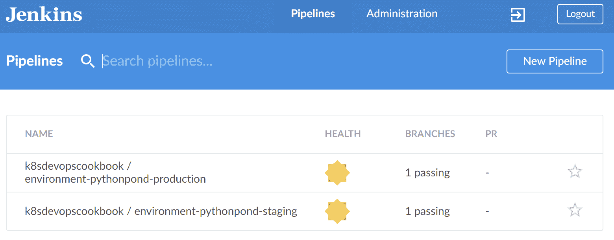

1.  选择最后一次运行，并确保两个流水线都正常，这意味着你的环境是正常工作的。类似于以下截图，你应该在验证环境和更新环境阶段看到绿色的勾号：

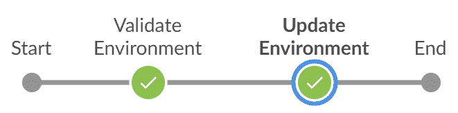

现在我们已经验证了环境是正常的，我们可以开始为我们自己的应用程序添加新的流水线。

### 将应用程序导入为流水线

大多数情况下，你需要将本地项目或 Git 仓库导入到 Jenkins 中。让我们执行以下步骤来创建现有仓库的本地克隆并将其导入为流水线：

1.  首先，将示例代码的副本分叉到您的帐户。在浏览器中转到[`github.com/k8sdevopscookbook/python-flask-docker`](https://github.com/k8sdevopscookbook/python-flask-docker)，并单击右上角的 Fork 按钮。

1.  将存储库克隆到本地计算机。确保您将`your_github_username`替换为您分叉示例的 GitHub 用户名：

```
$ git clone https://github.com/your_github_username/python-flask-docker.git
```

1.  现在，您应该有`python-flash-docker`应用程序的本地副本。使用以下命令导入项目：

```
$ cd python-flask-docker
$ jx import
```

1.  现在，您可以从 Jenkins Blue Ocean 视图或 CLI 观察流水线活动。以下屏幕截图显示了 Jenkins Blue Ocean 仪表板上的流水线活动：

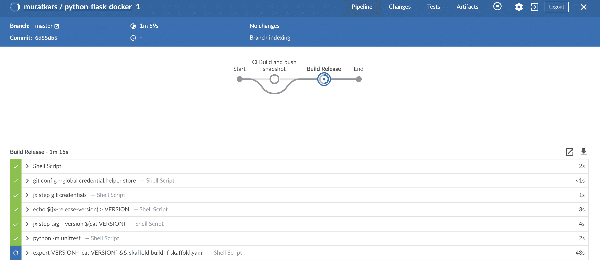

1.  作为替代方案，您可以使用`jx get activity`命令在 CLI 上观察活动：

```
$ jx get activity -f python-flask-docker -w
STEP STARTED AGO DURATION STATUS
muratkars/python-flask-docker/master #1 1m3s Running
 Checkout Source 22s 5s Succeeded
 CI Build and push snapshot 17s NotExecuted
 Build Release 17s Pending
...
 Promoted 2m5s 2m0s Succeeded Application is at: http://python-flask-docker.jx-staging.35.188.140.152.nip.io
 Clean up 1s 0s Succeeded
```

### 检查应用程序状态

创建了流水线后，您需要确认其状态。在将应用程序移入生产之前，让我们执行以下步骤确保应用程序已在暂存中部署：

1.  如果流水线构建成功，您应该在暂存环境中有版本 0.0.1。在流水线完成时列出应用程序：

```
$ jx get applications
APPLICATION STAGING PODS URL
python-flask-docker 0.0.1 1/1 http://python-flask-docker.jx-staging.35.188.140.152.nip.io
```

1.  在这里，您可以看到应用程序已部署。访问 URL 以查看应用程序：

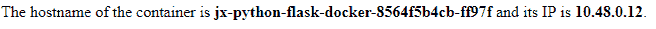

1.  我们的 pod 当前正在`jx-staging`命名空间中运行。确认`jx-staging`和`jx-production`命名空间中的 pod。在将应用程序推广到生产之前，第二个命名空间不应返回任何内容：

```
$ kubectl get pods -n jx-staging
NAME READY STATUS RESTARTS AGE
jx-python-flask-docker-8564f5b4cb-ff97f 1/1 Running 0 21m
$ kubectl get pods -n jx-production
No resources found.
```

### 将应用程序推广到生产

一旦应用程序在暂存中部署，下一步就是将其推广到生产环境。让我们执行以下步骤，将应用程序从暂存推广到生产：

1.  确认应用程序稳定后，下一步是将其推广到生产。让我们使用以下命令将当前版本从`staging`推送到`production`：

```
$ jx promote python-flask-docker --version 0.0.1 --env production
```

1.  出于各种原因，主要是环境限制，成功将应用程序部署到暂存中并不保证成功将其部署到生产中。在推广应用程序后，使用以下命令检查生产部署的进度。运行此命令后，您需要看到`Succeeded`消息：

```
$ jx get activity -f python-flask-docker -w
```

1.  我们的 pod 已经被提升到`jx-production`命名空间。确认 pod 现在也在`jx-production`命名空间中运行：

```
$ kubectl get pods -n jx-production
NAME                                    READY STATUS  RESTARTS AGE
jx-python-flask-docker-8564f5b4cb-fhcpm 1/1   Running 0        104m
```

1.  列出应用程序。您将获得相同应用程序的暂存和生产链接：

```
$ jx get applications
APPLICATION         STAGING PODS URL                                                         PRODUCTION PODS URL
python-flask-docker 0.0.1   1/1  http://python-flask-docker.jx-staging.35.188.140.152.nip.io 0.0.1      1/1  http://python-flask-docker.jx-production.35.188.140.152.nip.io
```

### 使用 QuickStart 应用程序创建管道

如果您没有要导入的项目，则可以从 QuickStart 创建一个新应用程序，并通过以下步骤将新生成的代码导入 Git 和 Jenkins 进行 CI/CD：

1.  从标准化模板创建一个构建。此命令将显示您可以使用的应用程序模板来创建新应用程序：

```
$ jx create quickstart
```

1.  选择您的 GitHub 用户名和组织：

```
? Git user name? 
? Which organisation do you want to use?
```

1.  输入一个新的仓库名称。在本示例中，这是`chapter2-jx-tutorial`：

```
Enter the new repository name: chapter2-jx-tutorial
```

1.  选择您希望创建的 QuickStart 示例。在我们的示例中，这是`golang-http`。

1.  对以下问题指定`是`：

```
Would you like to initialise git now? (Y/n) y
```

1.  管道需要一些时间才能完成。使用以下命令列出可用的管道：

```
$ jx get pipelines
```

## 它是如何工作的...

本节的第二个示例，*将应用程序导入为管道*，向您展示了如何使用现有项目创建 Jenkins 管道。

在*步骤 3*中，当您使用`jx import`命令导入应用程序时，会发生以下情况：

1.  首先，从仓库检出项目源代码并应用新的语义版本号。然后，借助 Skaffold，一个便于 Kubernetes 应用程序持续开发的命令行工具，创建 Git 标签 v0.0.1 并执行单元测试（在我们的示例中，没有单元测试）。

1.  在单元测试执行完毕后，将创建一个 Docker 镜像并推送到本地容器注册表。您可以在以下代码中看到这个过程：

```
Starting build... Building [devopscookbook/python-flask-docker]...
Sending build context to Docker daemon    127kB Step 1/8 : FR
OM python:3.6 3.6: Pulling from library/python 
4ae16bd47783: Pulling fs layer 
bbab4ec87ac4: Pulling fs layer 
...
```

1.  容器镜像推送到注册表后，您可以在 Docker 注册表中找到它：

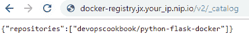

1.  在推广到环境阶段，将执行 Helm 构建。在图表被推送到本地的`chartmuseum`仓库后，您可以在仓库中找到 Helm 图表：

```
$ helm search python-flask-docker
NAME CHART VERSION APP VERSION DESCRIPTION
jenkins-x-chartmuseum/python-flask-docker 0.0.1 0.0.1 A Helm chart for Kubernetes
```

1.  最后，暂存管道从主分支运行，并将我们的 pod 从 Helm 仓库部署到`jx-staging`命名空间。在此步骤之后，暂存和应用程序管道将完成。

# 在 GitLab 中创建一个 CI/CD 管道

GitLab 是一个完整的 DevOps 工具链，以单一应用程序平台的形式提供。GitLab 提供了您管理、规划、创建、验证、打包、发布、配置、监控和保护应用程序所需的所有必要工具。

在这一部分，我们将专注于 GitLab 的 CI/CD 流水线功能，这些功能可以作为 SaaS 或自托管服务使用。我们将导入一个应用程序并在 GitLab 中创建一个流水线。您将学习如何使用 Auto DevOps 创建一个 CI/CD 流水线，并将一个应用程序从暂存推广到生产环境。

## 准备工作

在下面的步骤中，您将学习如何使用 Auto DevOps 创建一个流水线。这个步骤需要 GitLab（自托管或 SaaS）和您在 GitLab 中安装 Kubernetes 集群的首选云供应商的帐户。

GitLab 的社区版包括自动构建、自动测试、自动审阅应用程序、自动部署和自动监控功能。除了这些功能之外，基于订阅的 GitLab 的 SaaS 版本还根据您的订阅计划提供自动代码质量、自动静态应用程序安全测试（SAST）、自动依赖扫描、自动许可合规性、自动容器扫描、自动动态应用程序安全测试（DAST）和自动浏览器性能测试功能。

确保您已经按照第二章*在 Kubernetes 上操作应用程序*中的说明进行操作，并部署了自托管的 GitLab。

如果您愿意，您也可以使用 GitLab 提供的 SaaS 服务。在这种情况下，请访问 GitLab 网站[`about.gitlab.com/free-trial/`](https://about.gitlab.com/free-trial/)并登录您的帐户。

GitLab Auto DevOps 支持 GKE 在任何公共或私有云上创建新的 Kubernetes 集群，以及现有集群。

## 如何做…

这一部分进一步分为以下子部分，以使这个过程更容易：

+   使用模板创建项目

+   从 GitHub 导入现有项目

+   启用 Auto DevOps

+   启用 Kubernetes 集群集成

+   使用 Auto DevOps 创建流水线

+   逐步将应用程序推向生产环境

### 使用模板创建项目

GitLab 上的大部分操作都是在项目上完成的。当您第一次启动项目时，您有几个选项。您可以使用项目模板之一创建项目，导入现有项目，或者启动一个空白项目。在本教程中，您将学习如何使用项目模板创建项目，具体步骤如下：

1.  使用非根用户账户登录 GitLab。

1.  在欢迎使用 GitLab 屏幕上点击“创建项目”按钮：


1.  选择“从模板创建”选项卡，并通过点击“使用模板”按钮选择列出的代码模板之一。在本例中，我们将使用以下 Pages/GitBook 模板：

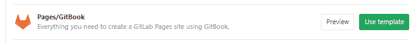

1.  GitLab 项目可以是私有的、内部的或公开的。项目访问级别由项目中的可见性字段确定。给您的新项目命名，并将可见性级别设置为公开：

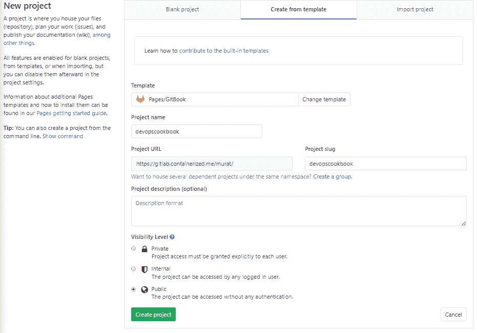

1.  点击“创建项目”按钮。

现在，您将看到模板项目已成功导入。

### 从 GitHub 导入现有项目

并非总是可以从干净的项目模板开始。通常情况下，您需要为现有项目创建一个流水线。让我们执行以下步骤，将一些现有项目源代码添加到 GitLab 环境中：

1.  使用非根用户账户登录 GitLab。

1.  如果您还没有项目，请在欢迎使用 GitLab 屏幕上点击“创建项目”按钮。如果您之前创建过项目，请在以下视图的右上角点击“新项目”按钮：

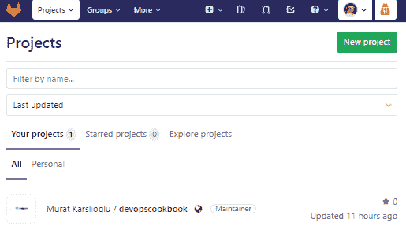

1.  GitLab 可以从各种 Git 仓库导入项目，包括 GitHub、Bitbucket、Google Code、Fogbugz、Gitea 和 GitLab 本身。在这里，选择“导入项目”选项卡，并选择 GitHub：

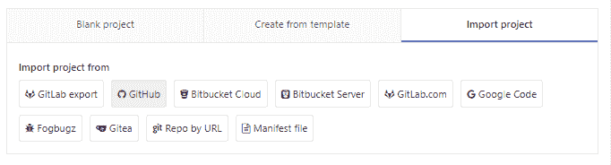

1.  在新窗口中打开[`github.com/settings/tokens`](https://github.com/settings/tokens)，然后转到您的 GitHub 账户。

1.  在您的 GitHub 账户上点击“生成新令牌”。

1.  为了让 GitLab 能够访问您的 GitHub 账户，需要创建一个访问令牌。在新的个人访问令牌页面上，选择 repo 范围，然后点击“生成令牌”按钮。该页面显示了您可以使用令牌分配的权限：

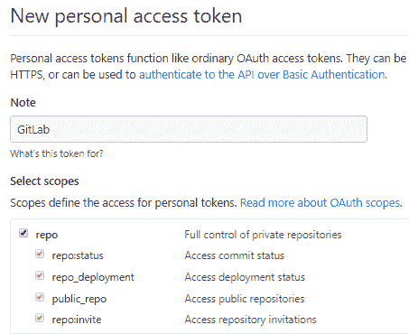

1.  复制在 GitHub 上创建的新个人访问令牌，粘贴到 GitLab 中，并单击“列出您的 GitHub 存储库”按钮：

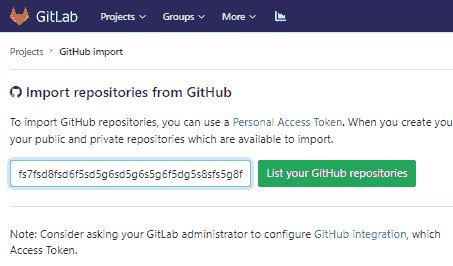

1.  GitLab 将访问并发现您的 GitHub 存储库位置中的项目。导入您想要与此配方一起使用的存储库。在此示例中，我们将使用来自[`github.com/k8sdevopscookbook/auto-devops-example`](https://github.com/k8sdevopscookbook/auto-devops-example)存储库的项目。这是本书中所有示例的位置：

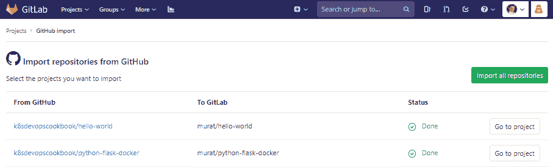

导入完成后，状态将显示“完成”。最后，单击“转到项目”按钮以在 GitLab 中查看您的项目。

### 启用 Auto DevOps

GitLab 的 Auto DevOps 功能提供了预定义的 CI/CD 配置，可以自动检测、构建、测试、部署和监控您的应用程序。让我们执行以下步骤，为现有项目启用 Auto DevOps 选项：

1.  使用您的项目用户帐户登录。

1.  在 GitLab 欢迎屏幕上，您将看到一些链接，可以帮助您入门。在这里，单击“配置 GitLab”按钮以访问配置选项：

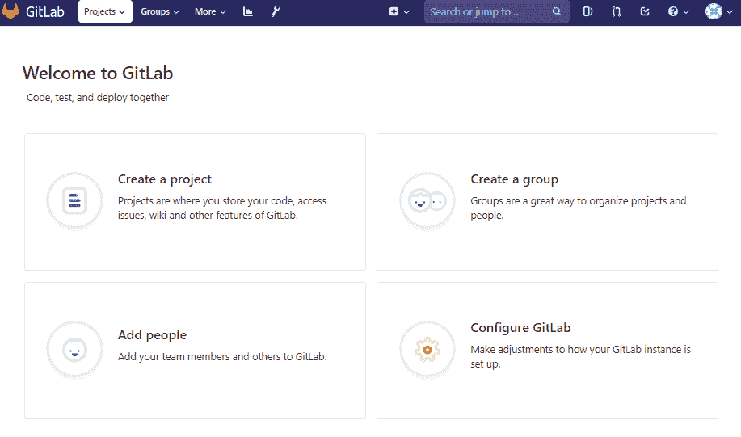

1.  只有具有维护者和管理员权限的项目用户才能访问项目设置。从屏幕左侧的管理区域菜单中，选择设置|CI/CD 菜单以访问 CI/CD 选项。以下屏幕截图显示了 CI/CD 设置的位置：

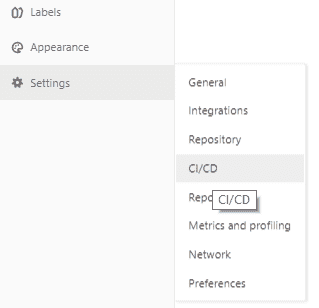

1.  在以下持续集成和部署页面下，确保为所有项目默认使用 Auto DevOps 流水线的复选框已被选中。如果要使用自动审阅应用程序和自动部署功能，可以选择输入基本域：

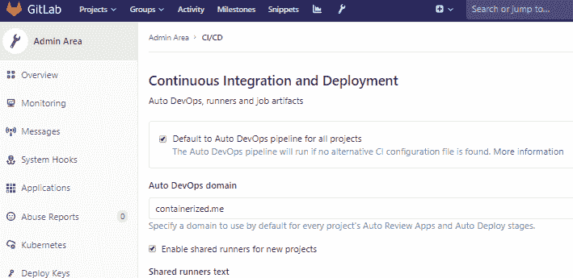

1.  单击“保存更改”按钮。

### 启用 Kubernetes 集成

GitLab 与 Kubernetes 一起工作或在其中以多种方式。让我们执行以下步骤，并添加 Kubernetes 自动化，以便我们可以在多个项目之间共享集群：

1.  以 root 用户身份登录。

1.  在“您的项目”页面下选择一个项目。

1.  从项目的详细信息页面，单击“添加 Kubernetes 集群”按钮：

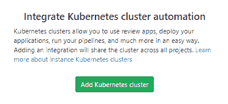

1.  您可以在 GKE 上创建一个新的集群，也可以添加一个现有的集群。假设您已经按照第一章中的配方创建了一个集群，*构建生产就绪的 Kubernetes 集群*，我们将添加一个现有的集群。在下面截图中显示的视图上，选择“添加现有集群”选项卡：

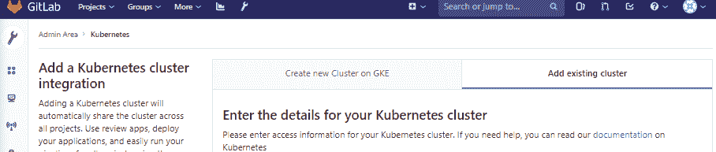

1.  输入 Kubernetes 集群名称。在我们的示例中，这是`AWSCluster`。

1.  从已配置`kubectl`实例的命令行中，以便您可以访问现有的 Kubernetes 集群，使用以下命令获取 API URL：

```
$ kubectl cluster-info | grep 'Kubernetes master' | awk '/http/ {print $NF}'
```

1.  为了让 GitLab 能够使用 API 访问您的集群，需要一个认证令牌。Kubernetes 将`default-token`存储为一个秘密。使用以下命令列出您集群上的秘密来找到该令牌：

```
$ kubectl get secrets | grep default-token
default-token-75958 kubernetes.io/service-account-token 3 4d12h
```

1.  使用前一个命令返回的令牌名称并获取 CA 证书：

```
$ kubectl get secret <secret name> -o jsonpath="{['data']['ca\.crt']}" | base64 --decode
-----BEGIN CERTIFICATE-----
MID...h5x
-----END CERTIFICATE-----
```

1.  在您的集群上创建名为`ServiceAccount`的 GitLab 管理员：

```
cat <<EOF | kubectl apply -f -
apiVersion: v1
kind: ServiceAccount
metadata:
 name: gitlab-admin
 namespace: kube-system
EOF
```

1.  在您的集群上创建名为`ClusterRoleBinding`的 GitLab 管理员：

```
cat <<EOF | kubectl apply -f -
apiVersion: rbac.authorization.k8s.io/v1beta1
kind: ClusterRoleBinding
metadata:
 name: gitlab-admin
roleRef:
 apiGroup: rbac.authorization.k8s.io
 kind: ClusterRole
 name: cluster-admin
subjects:
- kind: ServiceAccount
 name: gitlab-admin
 namespace: kube-system
EOF
```

1.  获取服务账户令牌。以下命令将在“令牌”部分返回您的令牌：

```
$ kubectl -n kube-system describe secret $(kubectl -n kube-system get secret | grep gitlab-admin | awk '{print $1}')

Name: gitlab-admin-token-xkvss
...
Data
====
ca.crt: 1119 bytes
namespace: 11 bytes
token: 
<your_token_here>
```

1.  一旦您从*步骤 11*的输出中复制了令牌信息，请在同一窗口上点击“添加 Kubernetes 集群”按钮。您应该看到类似以下视图的东西，这是我们将集群添加到 GitLab 的地方：

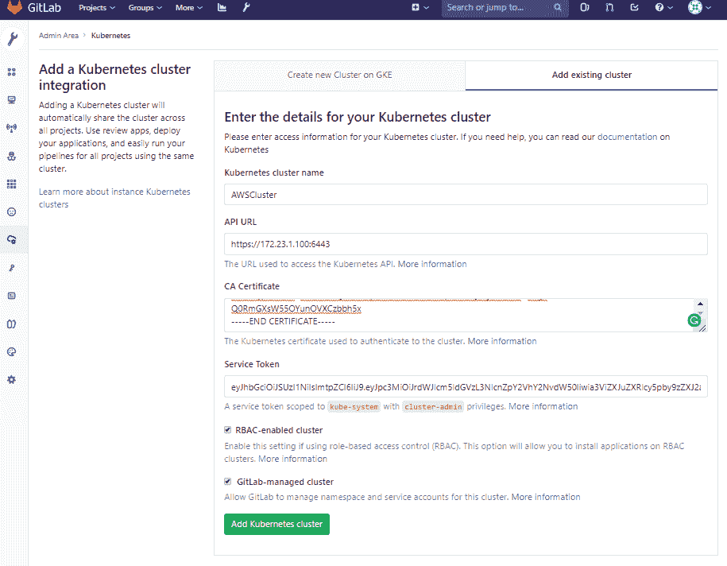

1.  接下来，输入您的基础域名。在我们的示例中，我们使用`k8s.containerized.me`子域作为我们托管区域，我们在第一章中创建了*构建生产就绪的 Kubernetes 集群*中的*在 Amazon EC2 上配置 Kubernetes 集群*配方。

1.  单击 Helm Tiller 旁边的“安装”按钮。此选项将在您的集群中部署 Helm 服务器：

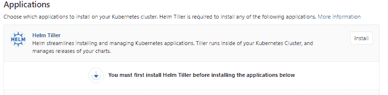

1.  安装 Helm 后，通过单击这些选项旁边的“安装”按钮来安装 Ingress、Cert-Manager、Prometheus 和 GitLab Runner。

1.  所有 GitLab 管理的应用都安装在`gitlab-managed-apps`命名空间下。验证它们在您的 Kubernetes 集群上处于`Running`状态。您应该看到类似以下的 Pod 列表：

```
$ kubectl get pods -n gitlab-managed-apps
NAME                                                   READY STATUS  RESTARTS AGE
certmanager-cert-manager-574b6d6cdd-s87kn              1/1   Running 0        3m39s
ingress-nginx-ingress-controller-7d44688bf-8x7ld       1/1   Running 0        4m39s
ingress-nginx-ingress-default-backend-66645696bf-sz545 1/1   Running 0        4m39s
prometheus-kube-state-metrics-744949b679-2rwnh         1/1   Running 0        2m8s
prometheus-prometheus-server-646888949c-j4wn7          2/2   Running 0        2m8s
runner-gitlab-runner-84fc959dcf-4wxfc                  1/1   Running 0        56s
tiller-deploy-5d76d4796c-fdtxz                         1/1   Running 0        7m13s
```

### 使用 Auto DevOps 创建流水线

启用 Auto DevOps 后，它简化了软件开发生命周期的设置和执行。让我们执行以下步骤来利用 Auto DevOps 并创建我们的第一个自动化流水线：

1.  如果您有多个项目，您需要选择目标项目，您想要在其中运行您的流水线。首先，在“您的项目”页面中选择您的项目。

1.  在 CI/CD 菜单下点击流水线。此选项将带您到可以查看现有流水线的页面。在此页面上，单击“运行流水线”按钮。此选项将帮助我们手动运行流水线：

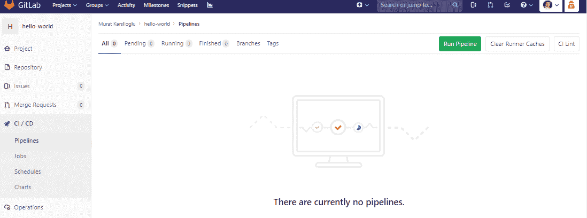

1.  在这里，您可以选择在不同分支上运行流水线的选项。在本例中，选择主分支来运行流水线。在下面的截图中，您可以看到流水线阶段已完成：

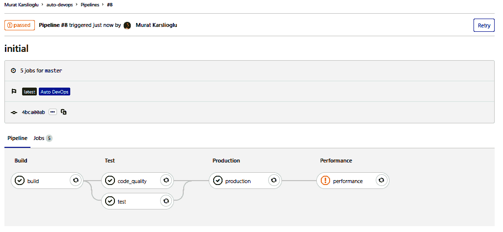

当流水线完成时，您将看到已执行的每个作业的结果，并且您的应用程序应该可以在`http://application_name.your_domain.com`访问。在我们的案例中，这个地址是`http://murat-auto-devops.k8s.containerized.me`。

### 逐步将应用程序部署到生产环境

默认情况下，Auto DevOps 使用连续部署到生产策略。如果您想将该设置更改为执行增量部署，请执行以下步骤：

1.  在“您的项目”页面中选择您的项目。

1.  在设置菜单中点击 CI/CD。

1.  通过单击“展开”按钮展开 Auto DevOps 部分。

1.  将部署策略更改为自动部署到暂存，手动部署到生产，并单击“保存更改”按钮。您还将看到其他 Auto DevOps 选项：

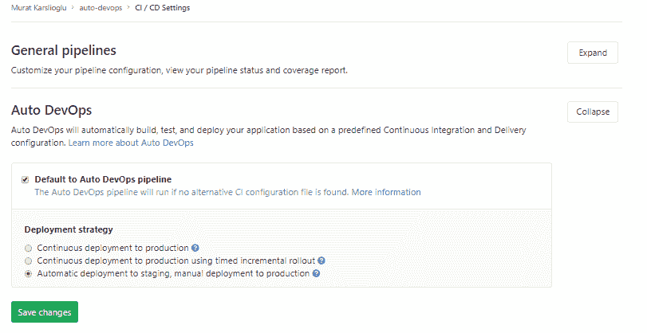

1.  在 CI/CD 菜单下点击流水线。单击“运行流水线”按钮手动运行流水线。

1.  当暂存作业完成时，流水线将被暂停。您将看到已执行的每个作业的结果，并且您的应用程序应该可以在`http://application-name-staging.your_domain.com`访问。在我们的案例中，这个地址是`http://murat-auto-devops-staging.k8s.containerized.me`

1.  现在，在运维菜单下点击“环境”。

1.  一旦您的应用程序处于暂存环境中，您可以逐渐将其移入生产环境。在暂存环境中，单击“部署到”按钮（看起来像播放按钮的那个）并选择要推出的百分比，如下视图所示。在下拉菜单中，您将看到 10%、25%、50%和 100%的选项：

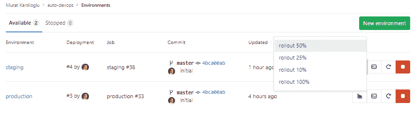

## 它是如何工作的...

前面的教程*使用 Auto DevOps 创建流水线*向您展示了如何利用 Auto DevOps 的功能来简化流水线的创建。

在*步骤 2*中，运行流水线后，当项目中找不到`.gitlab-ci.yml`文件时，GitLab Auto DevOps 会为您节省时间和精力，因为它会自动创建阶段和作业。这个文件由 GitLab 创建，为所有没有该文件的项目提供 CI/CD 配置。

如果您喜欢使用`.gitlab-ci.yaml`文件，可以禁用 Auto DevOps，并在项目上使用“设置 CI/CD”按钮来从模板创建您的 GitLab CI/CD YAML 文件。请参阅*创建一个简单的*.gitlab-ci.yaml*文件*部分中的链接，以了解更多关于创建 YAML 文件的信息。

在*步骤 3*中，Auto DevOps 使用 Herokuish Buildpacks，这是一个在容器中模拟 Heroku 构建和运行任务的工具。通过使用 Herokuish，GitLab 可以检测项目所使用的语言，并自动创建流水线。

## 还有更多...

您还将受益于了解以下内容：

+   GitLab Web IDE

+   监控环境

### GitLab Web IDE

GitLab 不仅是一个 CI/CD 解决方案，它还具有许多其他功能，并为您提供类似 GitHub 的私人代码存储库。您可以使用 GitLab Web IDE 来编辑和提交更改，并将其推送到生产环境。要在不克隆到自己的机器上编辑代码，请执行以下步骤：

1.  在“您的项目”页面上选择您的项目。

1.  单击 Web IDE 按钮。

1.  从存储库中选择一个文件进行编辑。

1.  编辑文件，完成后，单击“提交...”按钮，如下截图所示：

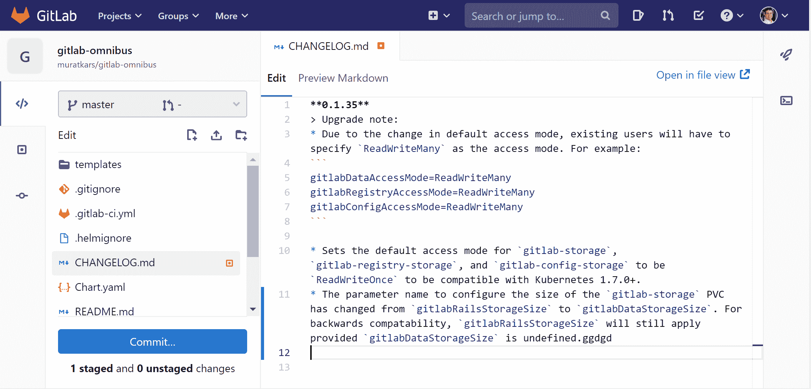

1.  创建提交消息，然后单击“暂存并提交”按钮，如下截图所示：

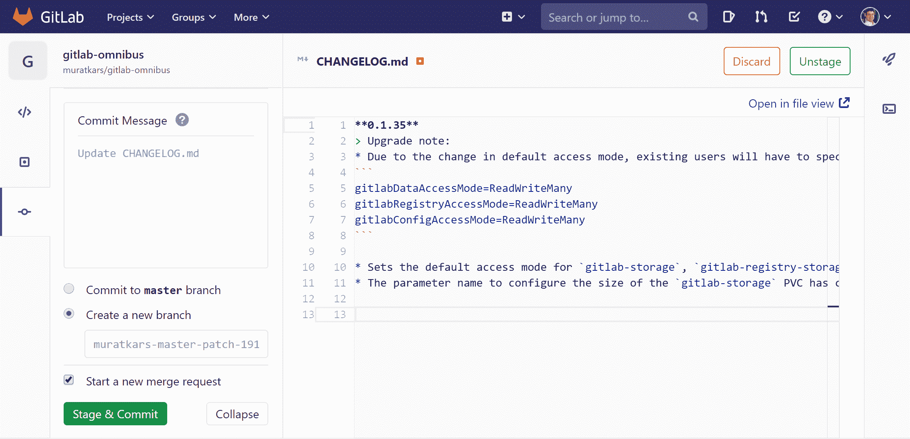

您的提交将触发新的流水线。因此，GitLab 将构建、测试和部署您的更改。

### 监控环境

使用 GitLab，您可以监控 Kubernetes 集群资源使用情况和应用程序响应指标。如果您还没有在 Kubernetes 集群上启用 Prometheus，请按照*启用 Kubernetes 集群集成*的说明进行操作，然后执行以下步骤：

1.  在 Your Projects 页面上选择您的项目。

1.  在操作菜单中点击 Metrics。

1.  从下拉菜单中选择 Production 环境。在下拉菜单上，您将有生产和暂存环境：

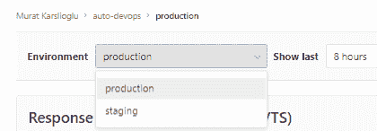

1.  GitLab 将显示一个类似以下内容的页面，其中包含您的应用程序性能数据和 Kubernetes 资源利用率指标的最近 8 小时。在这个视图中，您将能够看到应用程序的历史平均 CPU 和内存利用率以及总利用率：

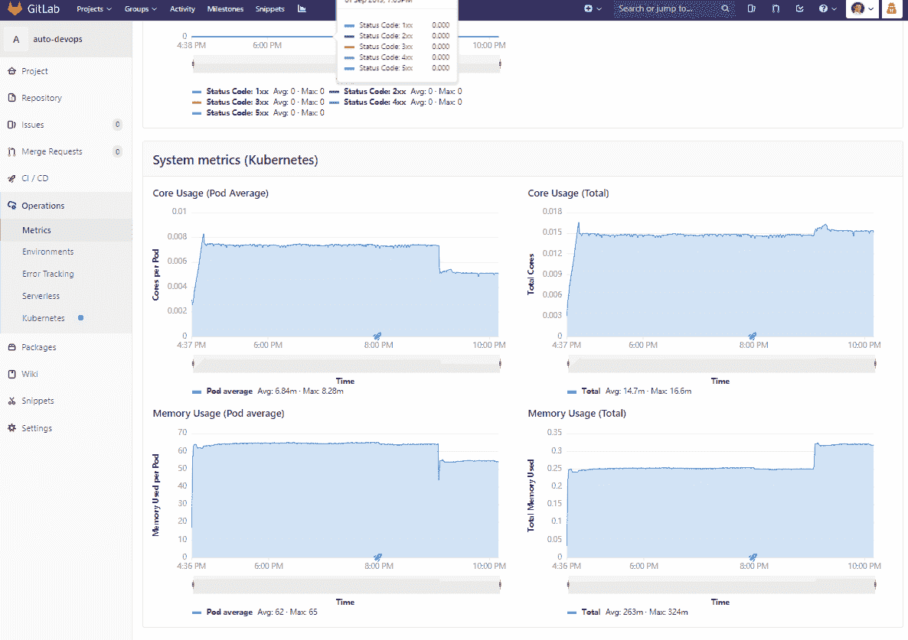

现在，您知道如何在 GitLab 上创建项目，并使用 Auto DevOps 功能来自动创建 CI/CD 流水线。

## 另请参阅

+   如果您想了解更多关于 GitLab 的信息，Adam O'Grady 的《快速入门指南》是一个很好的资源：[`www.packtpub.com/virtualization-and-cloud/gitlab-quick-start-guide`](https://www.packtpub.com/virtualization-and-cloud/gitlab-quick-start-guide)

+   GitLab 培训课程：[`about.gitlab.com/training/`](https://about.gitlab.com/training/)

+   GitLab Git 速查表：[`about.gitlab.com/images/press/git-cheat-sheet.pdf`](https://about.gitlab.com/images/press/git-cheat-sheet.pdf)

+   学习 GitLab：[`www.packtpub.com/application-development/learning-gitlab-video`](https://www.packtpub.com/application-development/learning-gitlab-video)

+   使用 GitLab CI 进行 Auto DevOps 实践：[`github.com/PacktPublishing/Hands-On-Auto-DevOps-with-GitLab-CI`](https://github.com/PacktPublishing/Hands-On-Auto-DevOps-with-GitLab-CI)

+   创建一个简单的`.gitlab-ci.yaml`文件：[`docs.gitlab.com/ee/ci/quick_start/#creating-a-simple-gitlab-ciyml-file`](https://docs.gitlab.com/ee/ci/quick_start/#creating-a-simple-gitlab-ciyml-file)

# 在 CircleCI 中创建 CI/CD 流水线

在本节中，我们将介绍使用 CircleCI 部署和管理 Kubernetes 服务的初始配置和要求。您将学习如何创建一个流水线，以便构建容器镜像并将其存储在容器注册表中。

## 准备工作

这个教程需要一个活跃的 GitHub 账户和一个要构建的项目。我们将使用 AWS EKS 来演示与 CircleCI 的 CI。

首先，访问我们的演示应用程序项目的以下 GitHub 页面，并将其复制到您的 GitHub 帐户中：

```
$ git clone https://github.com/k8sdevopscookbook/circleci-demo-aws-eks.git
```

克隆`k8sdevopscookbook/circleci-demo-aws-eks`存储库到您的工作站，以便在[`github.com/k8sdevopscookbook/circleci-demo-aws-eks`](https://github.com/k8sdevopscookbook/circleci-demo-aws-eks)上使用`circleci-demo-aws-eks`示例。

## 如何做...

该部分进一步分为以下子部分，以使该过程更容易：

+   开始使用 CircleCI

+   将更改部署到 Amazon EKS 上的 Kubernetes 集群

### 开始使用 CircleCI

Circle CI 是一个持续集成平台，可以在干净的容器或虚拟机中自动运行您的构建，从而可以直接测试存储在您的存储库中的代码以进行每次提交。 CircleCI 可以作为 SaaS 解决方案在云中使用，也可以作为自托管解决方案安装在您的环境中。让我们执行以下步骤来开始使用 CircleCI 的云版本：

1.  使用您的 GitHub 帐户在[`circleci.com/signup/`](https://circleci.com/signup/)注册 CircleCI。

1.  注册后，在仪表板视图的左侧点击“添加项目”按钮：

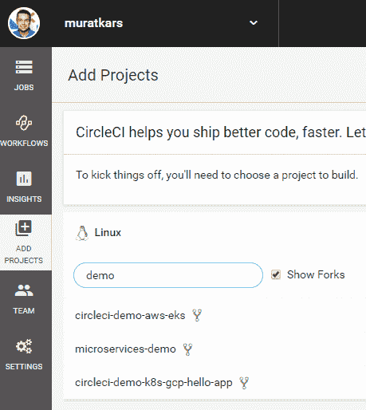

1.  从左上角的下拉菜单中，选择要构建项目的 GitHub 帐户。

### 将更改部署到 EKS 上的 Kubernetes 集群

在这个示例中，我们将使用 Amazon EKS。让我们执行以下步骤来开始：

1.  为 CircleCI 创建一个新的 AWS IAM 用户，并注意您的新用户的访问密钥 ID 和秘密访问密钥。

1.  在 AWS 弹性容器注册表 ECR 上创建名为`eks_orb_demo_app`的存储库。注意您的 ECR URL。它应该类似于`1234567890.dkr.ecr.us-east-2.amazonaws.com`。

1.  确保您已登录 Circle CI。点击“添加项目”按钮，搜索`demo-aws`关键字，然后点击其旁边的“设置项目”按钮：

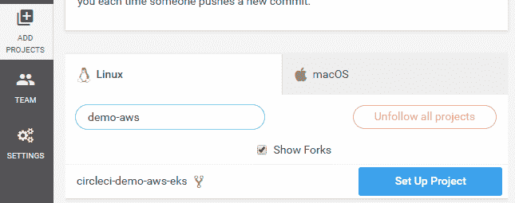

1.  点击构建。构建将失败，因为缺少访问您的 AWS 帐户的环境变量。

1.  点击项目设置。转到“构建设置”下的“环境变量”页面。通过单击“添加变量”按钮创建以下四个变量：

```
AWS_DEFAULT_REGION = us-east-2
AWS_ACCESS_KEY_ID = [Enter your Access key ID here]
AWS_SECRET_ACCESS_KEY = [Enter your Secret Access Key here]
AWS_ECR_URL = [Enter your ECR URL here**]** 
```

此输出可以在以下截图中看到：

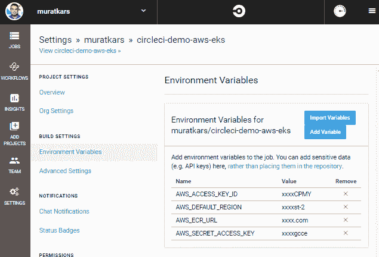

1.  设置环境变量将允许您的流水线访问 AWS 资源。在定义了云变量之后，点击“构建”按钮开始构建。

1.  如果您的 AWS 用户没有所需的权限，构建可能会失败；否则，这应该在 35-40 分钟内成功完成。

## 它是如何工作的...

这个教程向您展示了如何快速创建一个在 Kubernetes 集群上运行的演示应用程序的 CI/CD 流水线。

在*步骤 2*中的*在 EKS 上部署 Kubernetes 集群的更改*教程中，我们在 AWS ECR 上创建了一个存储库，用于推送由 CircleCI 构建的容器映像。构建成功后，这些映像将被保存并可以通过私有注册表位置访问。

在*步骤 6*中，当我们运行流水线时，CircleCI 将按顺序执行六个作业。第一个作业（`build-and-push-image`）将启动一个虚拟机，检出我们的代码，安装任何先决条件，并从代码构建镜像。第二个作业（`aws-eks/create-cluster`）将使用 CloudFormation 堆栈创建一个 EKS 集群，并验证该集群。第三个作业（`deploy-application`）将部署应用程序。第四个作业（`test-application`）将使用`kubectl get service demoapp`命令获取服务的外部 IP，并连接到服务以验证返回。服务将返回一个类似于以下内容的页面：

```
Hello World! (Version info: 63d25fd14ef8dfb1c718cf81a815b36d80138d19, build date: 20190820224253)
```

最后，第五个（`undeploy-application`）和第六个（`aws-eks/delete-cluster`）作业将分别删除应用程序并再次使用 CloudFormation 销毁 EKS 集群。

通过这样，您已经学会了如何使用在 CircleCI 上部署的预定义容器环境轻松构建您的应用程序。

## 另请参阅

+   Circle CI 文档：[`circleci.com/docs/`](https://circleci.com/docs/)

+   Circle CI Hello World 示例：[`circleci.com/docs/2.0/hello-world/`](https://circleci.com/docs/2.0/hello-world/)

+   Circle CI AWS EKS 演示应用程序：[`github.com/k8sdevopscookbook/circleci-demo-aws-eks`](https://github.com/k8sdevopscookbook/circleci-demo-aws-eks)

+   Circle CI GCP 演示应用程序：[`github.com/k8sdevopscookbook/circleci-demo-k8s-gcp-hello-app`](https://github.com/k8sdevopscookbook/circleci-demo-k8s-gcp-hello-app)

# 使用 GitHub Actions 设置 CI/CD 流水线

GitHub Actions 使您能够直接在 GitHub 存储库中创建自定义软件开发工作流程。如果您已经将 GitHub 作为您的代码存储库，内置的 CI/CD 功能使这个选项非常具有吸引力。

在本节中，我们将介绍 GitHub Actions 工作流配置和内置的 CI/CD 功能。您将学习如何管理工作流程并创建新的 GitHub Actions。

## 准备工作

在下一个示例中，您将学习如何通过添加 Dockerfile 在您拥有的存储库中创建一个基本的操作示例。此示例需要一个活跃的 GitHub 帐户和一个要构建的项目。我们将使用 AWS EKS 来演示与 GitHub 的 CI。

## 如何做...：

此部分进一步分为以下子部分，以使此过程更加简单：

+   创建工作流文件

+   创建基本的 Docker 构建工作流程

+   构建并将镜像发布到 Docker Registry

+   添加工作流状态徽章

### 创建一个工作流文件

GitHub flow 是 GitHub 最近推出的一个轻量级分支。让我们执行以下步骤来创建我们的第一个工作流程：

1.  登录到[`github.com/`](https://github.com/)的 GitHub 帐户。

1.  选择一个您拥有维护者访问权限的存储库。在我们的示例中，我们正在使用`k8sdevopscookbook/python-flask-docker`项目的分支。

1.  在`.github/workflows`目录中创建一个`ci.yml`文件，内容如下：

```
name: My Application
on:
 pull_request:
 branches:
 - master
jobs:
 build:
 runs-on: ubuntu-16.04
 steps:
 - uses: actions/checkout@v1
 - name: Set up Python 3.7
 uses: actions/setup-python@v1
 with:
 python-version: 3.7
```

1.  添加以下行以安装任何依赖项：

```
 - name: Install dependencies
 run: |
 python -m pip install --upgrade pip
 pip install -r requirements.txt 
```

1.  在使用计算机编程语言时，会使用 lint 工具对源代码进行静态分析，以检查语义差异。在我们的示例中，我们将使用`flake8`来使用以下命令对我们的 Python 代码进行 lint：

```
 - name: Lint with flake8
 run: |
 pip install flake8
 # stop the build if there are Python syntax errors or undefined names
 flake8 . --count --select=E9,F63,F7,F82 --show-source --statistics
 # exit-zero treats all errors as warnings. The GitHub editor is 127 chars wide
 flake8 . --count --exit-zero --max-complexity=10 --max-line-length=127 --statistics
```

1.  如果您有单元测试，请添加以下行来使用`pytest`测试您的应用程序，`pytest`是 Python 编程中用于编写小型测试的框架：

```
- name: Test with pytest
 run: |
 pip install pytest
 pytest
```

1.  配置完成后，向存储库发送拉取请求以触发流水线：

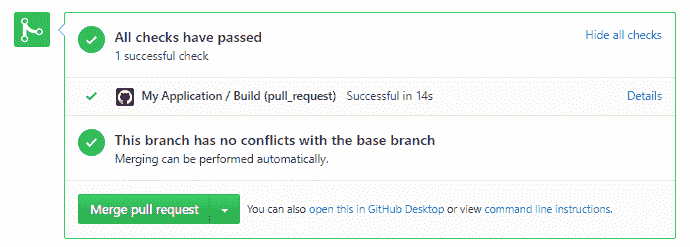

流水线完成后，您将能够在**拉取请求**（**PR**）上看到一个绿色的复选标记。在上面的屏幕截图中，您可以看到所有检查都已通过，并且拉取请求成功。

### 创建基本的 Docker 构建工作流程

让我们执行以下步骤，直接从我们的 GitHub 存储库自动化 Docker 镜像构建：

1.  登录到您的 GitHub 帐户。

1.  选择一个你有维护者访问权限的存储库。在我们的示例中，我们正在使用`k8sdevopscookbook/python-flask-docker`项目的分支。

1.  点击“Actions”选项卡。

1.  在这里，点击“添加新的工作流程”。

1.  在`.github/workflows`目录下创建一个`dockerimage.yml`文件，内容如下：

```
name: Docker Image CI
on: [push]
jobs:
 build: 
 runs-on: ubuntu-latest 
 steps:
 - uses: actions/checkout@v1
 - name: Build the Docker image
 run: docker build . --file Dockerfile --tag my-image-name:$(date +%s)
```

每次将新代码推送到存储库时，工作流都会创建一个新的 Docker 图像。

### 构建并发布图像到 Docker Registry

您可以使用一个操作一次性完成构建、标记、登录和推送到 Docker 存储库，而不是创建多个操作。让我们执行以下步骤：

1.  登录到您的 GitHub 帐户。

1.  选择一个你有维护者访问权限的存储库。在我们的示例中，我们正在使用`k8sdevopscookbook/python-flask-docker`项目的分支。

1.  点击“Actions”选项卡。

1.  从这里，点击“添加新的工作流程”。

1.  在`.github/workflows`目录下创建一个`dockerpush.yml`文件，内容如下。确保更改`MyDockerRepo/repository`，以便使用您想要推送的图像的名称：

```
name: Build and Push to DockerHub
on: [push]
jobs:
 build:
    runs-on: ubuntu-latest
    steps:
    - uses: actions/checkout@master
    - name: Publish to Registry
      uses: elgohr/Publish-Docker-Github-Action@master
      with:
        name: MyDockerRepo/repository
        username: ${{ secrets.DOCKER_USERNAME }}
        password: ${{ secrets.DOCKER_PASSWORD }} 
```

1.  点击“Settings”选项卡，转到“Secrets”菜单。

1.  创建一个`DOCKER_USERNAME`秘密，其值等于您用于登录到 Docker Registry 的用户名。

1.  创建一个`DOCKER_PASSWORD`秘密，其值等于您用于登录到 Docker Registry 的密码。创建了这两个秘密后，您应该能够在“Secrets”菜单中看到它们，如下截图所示：

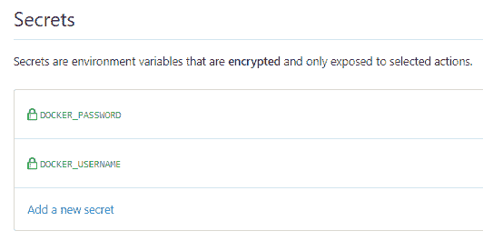

作为秘密存储的环境变量将被加密，并且仅对选定的操作可用。

### 添加工作流状态徽章

许多在 GitHub 上的优秀源代码存储库在其主页上使用徽章来显示已在存储库上完成的各种测试的状态。同样，在这个教程中，我们将向我们的存储库添加一个操作状态摘要，以通知我们的访问者和用户当前的工作流状态：

1.  登录到您的 GitHub 帐户，并选择一个您有维护者访问权限的存储库。在我们的示例中，我们正在使用`k8sdevopscookbook/python-flask-docker`项目的分支。

1.  编辑存储库顶级目录中的`README.md`文件。

1.  按照以下示例中显示的格式`https://github.com/{owner}/{repo}/workflows/{workflow_name}/badge.svg`添加徽章的链接：

```
[
```

## 另请参阅

+   与 Docker 交互的 GitHub 操作：[`github.com/docker-actions`](https://github.com/docker-actions)

+   AWS 的 GitHub 操作：[`github.com/aws-actions`](https://github.com/aws-actions)

+   Azure 的 GitHub 操作：[`github.com/Azure/k8s-actions`](https://github.com/Azure/k8s-actions)

+   GitHub GCP 的操作：[`github.com/GoogleCloudPlatform/github-actions`](https://github.com/GoogleCloudPlatform/github-actions)

# 在亚马逊网络服务上设置 CI/CD 流水线

在本节中，我们将介绍 AWS 上的 CI/CD 流水线构建工作流程和内置的 CI/CD 功能。您将学习如何管理流水线，如何在流水线步骤中运行构建命令，以及如何将构建结果图像存储在 Amazon 弹性容器注册表（ECR）上。

## 准备工作

在以下食谱中，您将学习如何基于 AWS 服务构建、测试和部署示例服务。这里提到的所有操作都需要一个 AWS 账户和一个具有使用相关服务权限的 AWS 用户策略，分配了 CodeCommit 的 HTTPS Git 凭据，并使用 AWS EKS 部署了 Kubernetes 集群。如果您没有，请访问[`aws.amazon.com/account/`](https://aws.amazon.com/account/)并创建一个。

## 如何做...

本节进一步分为以下子节，以使此过程更容易：

+   创建 AWS CodeCommit 代码存储库

+   使用 AWS CodeBuild 构建项目

+   创建 AWS CodeDeploy 部署

+   使用 AWS CodePipeline 创建流水线

### 创建 AWS CodeCommit 代码存储库

AWS CodeCommit 服务是一个托管的源代码控制服务，它在 AWS 平台上托管安全的基于 Git 的存储库。在这个食谱中，我们将学习如何在 CodeCommit 上创建我们的第一个存储库：

1.  登录到您的 AWS 账户，并在[`us-west-2.console.aws.amazon.com/codesuite`](https://us-west-2.console.aws.amazon.com/codesuite)上打开 AWS 开发人员工具。

1.  从开发人员工具菜单中，展开“源”菜单，然后单击“存储库”。您可以在以下截图中看到完整的菜单内容：

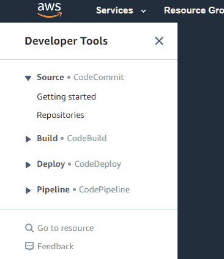

1.  在存储库页面，单击“创建存储库”按钮，以在 CodeCommit 上启动您的代码存储库。

1.  输入存储库名称，然后单击“创建”按钮。在本示例中，存储库名称为`k8sdevopscookbook`：

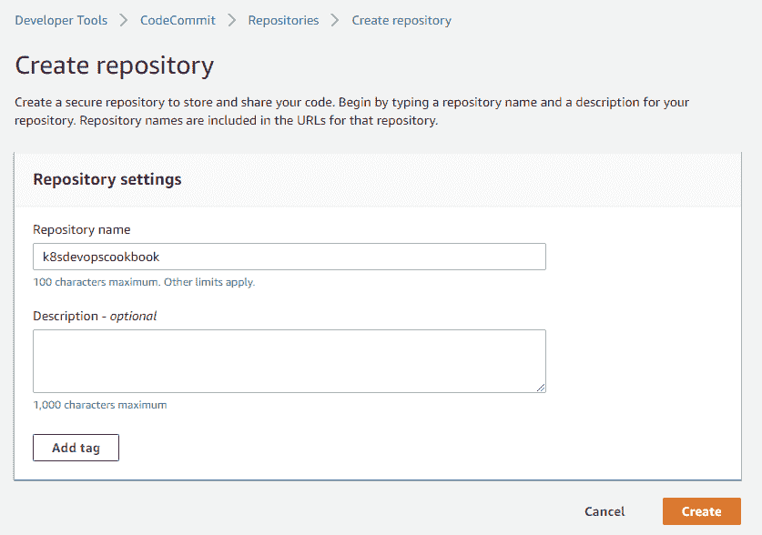

1.  从 AWS 管理控制台，转到 IAM 服务。

1.  从现有用户列表中，选择一个您想要使用的 IAM 用户。

1.  在用户摘要页面上，点击安全凭据选项卡。以下截图显示了选项卡的位置：

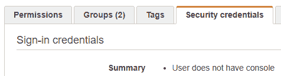

1.  在 AWS CodeCommit 的 HTTPS Git 凭据下，点击生成按钮。这将创建一个我们稍后用于身份验证的用户名和密码：

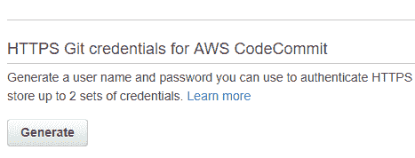

1.  在生成的 Git 凭据窗口中，点击下载凭据按钮以记录您的 CodeCommit 凭据。以下截图显示了为我创建的用户名和密码。这是您查看或复制凭据的唯一机会：

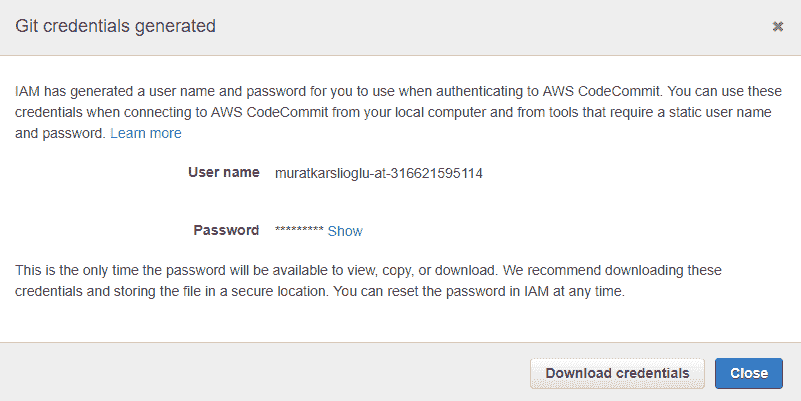

1.  从 AWS 管理控制台，转到 CodeCommit 服务。

1.  在克隆 URL 列下，选择 HTTPS。在本教程中，我们的示例存储库位于[`git-codecommit.us-west-2.amazonaws.com/v1/repos/k8sdevopscookbook`](https://git-codecommit.us-west-2.amazonaws.com/v1/repos/k8sdevopscookbook)。

1.  在您的 Linux 工作站上，克隆空的存储库：

```
$ git clone <your_new_repo>
```

1.  使用您的 CodeCommit 凭据克隆存储库。

1.  下载我们的示例应用程序并解压缩：

```
$ wget https://github.com/k8sdevopscookbook/python-flask-docker/archive/master.zip && unzip master.zip
```

1.  现在，将示例应用程序复制到您的存储库克隆中：

```
$ cp -r python-flask-docker-master/. k8sdevopscookbook/.
$ cd k8sdevopscookbook
```

1.  将所有文件进行分阶段。以下命令将在项目目录中找到所有新的和更新的文件，并将它们添加到暂存区，然后将其推送到目标存储库之前：

```
$ git add -A
```

1.  用消息提交文件。以下命令在使用`-m`参数时添加提交：

```
$ git commit -m "Add example application files"
```

1.  将文件从本地存储库文件夹推送到 CodeCommit 存储库：

```
$ git push
```

现在，您将能够查看 CodeCommit 存储库中的文件。

### 使用 AWS CodeBuild 构建项目

让我们执行以下步骤，从前面的教程中创建的 CodeCommit 存储库构建项目：

1.  登录到您的 AWS 账户并打开 AWS 开发者工具[`us-west-2.console.aws.amazon.com/codesuite`](https://us-west-2.console.aws.amazon.com/codesuite)。

1.  从开发者工具菜单中，展开构建菜单并点击构建项目。以下截图显示了菜单的位置：

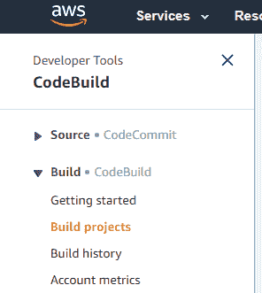

1.  在构建项目页面上，点击创建构建项目按钮。以下截图显示了其他可用菜单选项和创建构建项目按钮的位置：

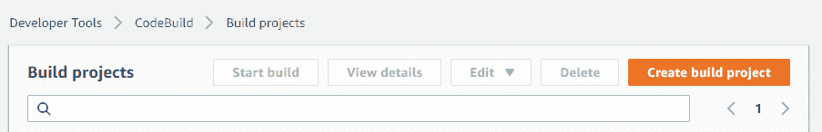

1.  输入项目名称。

1.  现在，我们将设置项目的主要来源。在源框中，选择 AWS CodeCommit 作为源提供程序。选择您在*创建 AWS CodeCommit 代码存储库*中创建的存储库。选择主分支。在我们的示例中，存储库的名称是`k8sdevopscookbook`：

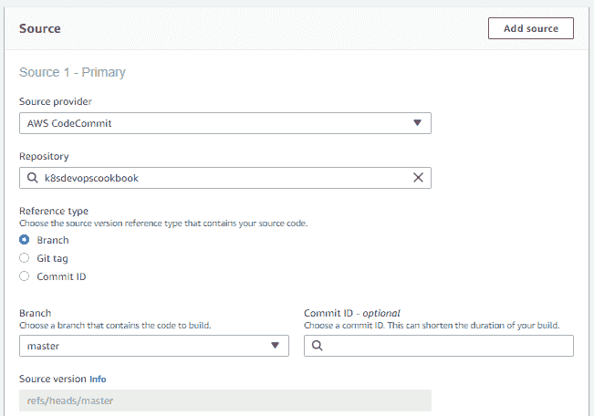

1.  在环境框中，选择托管映像和 Ubuntu 作为您的操作系统。

1.  选择新服务角色：

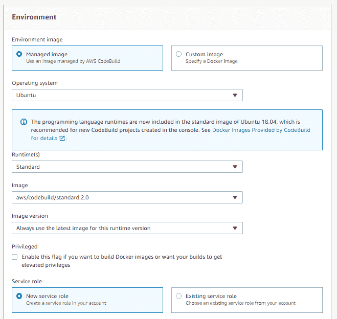

1.  展开附加配置设置。添加`AWS_DEFAULT_REGION`、`AWS_ACCOUNT_ID`、`IMAGE_TAG`和`IMAGE_REPO_NAME`环境变量，如下截图所示：

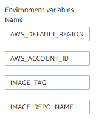

永远不要将环境变量存储在存储库位置。在构建过程中始终使用环境参数来提供值。

1.  在 Buildspec 框中，选择使用 buildspec 文件。确保`buildspec.yaml`文件存在于代码存储库的根目录中。此文件应该看起来像这样：

```
version: 0.2
phases:
 install:
 runtime-versions:
 docker: 18
 pre_build:
 commands:
 - echo Logging in to Amazon ECR...
 - $(aws ecr get-login --no-include-email --region $AWS_DEFAULT_REGION)
 build:
 commands:
 - echo Build started on `date`
 - echo Building the Docker image...
 - docker build -t $IMAGE_REPO_NAME:$IMAGE_TAG .
...
```

1.  最后，单击创建构建项目。

1.  在**身份和访问管理**（IAM）中找到您在*步骤 7*中创建的服务角色，并将此语句添加到附加到 CodeBuild 服务角色的策略中：

```
{
  "Version": "2012-10-17"
  "Statement": [ *### BEGIN ADDING STATEMENT HERE ###* {       "Action": [
         "ecr:BatchCheckLayerAvailability",
         "ecr:CompleteLayerUpload",
         "ecr:GetAuthorizationToken",
         "ecr:InitiateLayerUpload",
         "ecr:PutImage",
         "ecr:UploadLayerPart"       ],
       "Resource": "*",
       "Effect": "Allow"
     }, *### END ADDING STATEMENT HERE ###* ...   ],
 }
```

1.  现在项目准备就绪，单击页面右上角的开始构建按钮。在下图中，您可以在启动后的构建历史选项卡下查看其状态。在我们的示例中，它显示构建成功：

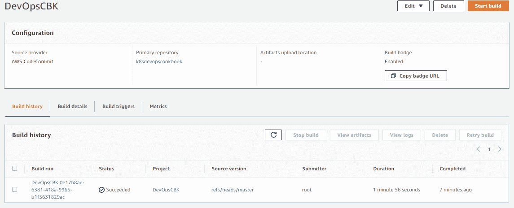

如果您的构建失败，请确保`AmazonEC2ContainerRegistryPowerUser`策略已分配给您的 IAM 角色。

### 创建 AWS CodeDeploy 部署

让我们执行以下步骤来从 CodeBuild 构建创建部署：

1.  登录到您的 AWS 帐户，并在[`us-west-2.console.aws.amazon.com/codesuite`](https://us-west-2.console.aws.amazon.com/codesuite)上打开 AWS 开发人员工具。

1.  从开发者工具菜单中，展开部署菜单，然后单击应用程序。

1.  单击创建应用程序按钮：

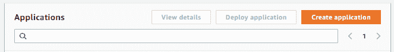

1.  输入应用程序名称。

1.  选择 AWS Lambda 作为计算平台。

### 使用 AWS CodePipeline 构建流水线

最后，我们已经到达了 AWS 开发人员工具的最后阶段。让我们执行以下步骤，使用 AWS CodePipeline 服务构建管道：

1.  登录到您的 AWS 帐户，并在[`us-west-2.console.aws.amazon.com/codesuite`](https://us-west-2.console.aws.amazon.com/codesuite)中打开 AWS 开发人员工具。

1.  从开发人员工具菜单中，展开“管道”菜单，然后单击“管道”。

1.  输入管道名称。

1.  选择“新服务角色”，然后单击“下一步”。

1.  现在，我们将设置管道的主要来源。选择 AWS CodeCommit 作为源提供程序。选择您在“创建 AWS CodeCommit 代码存储库”配方中创建的存储库。单击“下一步”以确认这些更改。以下屏幕截图显示，在我们的示例中，源是`k8sdevopscookbook`：

！[](assets/03852d6f-bc48-4512-bcf2-f18b9ddbc92b.png)

1.  选择 AWS CodeBuild 作为构建提供程序。选择您在“使用 AWS CodeBuild 构建项目”配方中创建的项目名称（或创建一个新项目）。单击“下一步”以确认这些更改。以下屏幕截图显示，在我们的示例中，区域是“美国西部”，项目名称是 DevOpsCookbookExample：

！[](assets/b678c7f3-fab8-466c-8e17-a19e2bbb58b7.png)

1.  单击“跳过部署阶段”。作为部署替代方案，您可以调用一个 Lambda 函数来调用 CloudFormation 模板并部署 Kubernetes 集群。您可以在“另请参阅”部分中找到显示如何执行此操作的 AWS CodeSuite 示例。

1.  单击“创建管道”。

1.  当管道执行完毕时，您将看到类似以下的构建：

！[](assets/77496350-5504-451a-aa6a-1f7c9af63562.png)

通过这样，您已成功使用 AWS CodePipeline 服务构建了一个管道。

## 它是如何工作的...

这个配方向您展示了如何快速使用 AWS 开发人员工具创建管道。

在“使用 AWS CodePipeline 构建管道”配方中，在创建管道之后，AWS CodePipeline 会监视 AWS CodeCommit 中的更改。当新的 PR 合并到存储在您的 CodeCommit 存储库中的主分支时，CodePipeline 会自动检测到分支的更改并触发管道。

在构建作业期间，CodeBuild 将代码和 Docker 文件中描述的任何依赖项打包到 Docker 镜像中。此 Docker 镜像将推送到您在配方中指定的 Amazon ECR 容器注册表中。

该管道也是完全可扩展的。实际上，您还可以选择通过 AWS Lambda 调用无服务器函数，以创建 Kubernetes 集群或在现有 Kubernetes 集群上部署代码，以便进行测试。您可以在*另请参阅*部分提供的 AWS 博客链接中找到其他示例。

## 另请参阅

+   AWS CodeCommit 文档：[`docs.aws.amazon.com/codecommit/latest/userguide/welcome.html`](https://docs.aws.amazon.com/codecommit/latest/userguide/welcome.html)

+   AWS CodeBuild 文档：[`docs.aws.amazon.com/codebuild/latest/userguide/welcome.html`](https://docs.aws.amazon.com/codebuild/latest/userguide/welcome.html)

+   AWS CodeDeploy 文档：[`docs.aws.amazon.com/codedeploy/latest/userguide/welcome.html`](https://docs.aws.amazon.com/codedeploy/latest/userguide/welcome.html)

+   AWS CodePipeline 文档：[`docs.aws.amazon.com/codepipeline/latest/userguide/welcome.html`](https://docs.aws.amazon.com/codepipeline/latest/userguide/welcome.html)

+   AWS 开发者工具在 Kubernetes 上的持续部署博客：[`aws.amazon.com/blogs/devops/continuous-deployment-to-kubernetes-using-aws-codepipeline-aws-codecommit-aws-codebuild-amazon-ecr-and-aws-lambda/`](https://aws.amazon.com/blogs/devops/continuous-deployment-to-kubernetes-using-aws-codepipeline-aws-codecommit-aws-codebuild-amazon-ecr-and-aws-lambda/)

+   CodeSuite - Kubernetes 的持续部署参考架构：[`github.com/aws-samples/aws-kube-codesuite`](https://github.com/aws-samples/aws-kube-codesuite)

+   用于 EKS 部署的 Lambda 函数的类似示例：[`github.com/muratkars/lambda-eks`](https://github.com/muratkars/lambda-eks)

# 在 Google Cloud Build 上使用 Spinnaker 设置 CI/CD 管道

Google Cloud Build 是一个托管的 CI/CD 和部署平台，可让您在云中构建，测试和部署。在本节中，我们将介绍使用 Spinnaker 功能的 Google Cloud Build 配置的 CI/CD 管道，Spinnaker 是一个开源的多云持续交付平台。

## 准备工作

将`k8sdevopscookbook/src`存储库克隆到您的工作站，以使用`chapter3`目录下的清单文件：

```
$ git clone https://github.com/k8sdevopscookbook/src.git
$ cd /src/chapter3
```

确保您有使用 GCP 服务的必要凭据，并且可以访问当前项目。如果您还没有，请转到[`console.cloud.google.com`](https://console.cloud.google.com)并创建一个帐户。

## 如何做...

本节进一步分为以下子节，以使这个过程更容易：

+   安装和配置 Spin CLI

+   为 CI/CD 配置服务账户

+   配置事件以触发流水线

+   使用 Helm 安装 Spinnaker

+   创建 Google Cloud 源代码仓库

+   使用 Google Cloud Build 构建项目

+   配置 Spinnaker 流水线

+   将应用程序部署到生产环境

### 安装和配置 Spin CLI

以下配方中提到的操作需要`spin` CLI、`gcloud`和启用计费的 GCP 项目的账户。我们将使用`gcloud` CLI 来启用相关的 API：

1.  运行以下命令下载`gcloud` CLI。如果您已经安装了`gcloud` CLI 并且已经有一个项目，请跳到*步骤 4*：

```
$ curl https://sdk.cloud.google.com | bash
```

1.  初始化 SDK 并按照给定的说明进行操作：

```
$ gcloud init
```

1.  选择您有权限的项目或创建一个新项目。

1.  为项目启用 Kubernetes Engine API、Cloud Build API 和 Cloud Source Repositories API：

```
$ gcloud services enable compute.googleapis.com cloudapis.googleapis.com sourcerepo.googleapis.com
Operation "operations/acf.d1f2c714-9258-4784-a8a9-6648ab4c59fe" finished successfully.
```

1.  下载并安装`spin` CLI：

```
$ curl -LO \
https://storage.googleapis.com/spinnaker-artifacts/spin/$(curl -s \
https://storage.googleapis.com/spinnaker-artifacts/spin/latest)/linux/amd64/spin
$ chmod +x spin
$ sudo mv spin /usr/local/bin/spin
```

现在您已经启用了 GCP 服务并安装了`spin` CLI。

### 为 CI/CD 配置服务账户

要在 Google Cloud 上使用 CI/CD 服务，您的用户需要被分配正确的权限。让我们执行以下步骤来为 CI/CD 配置服务账户：

1.  按照第一章中*在 GKE 上配置托管的 Kubernetes 集群*配方中的说明，部署一个 GKE 集群。如果您已经有一个，请跳到*步骤 2*创建一个稍后流水线将使用的服务账户*：*

```
$ gcloud iam service-accounts create cicd-account \
--display-name "My CICD Service Account"
```

1.  在两个地方用您的项目名称替换以下的`devopscookbook`，并将存储管理员角色绑定到您的服务账户：

```
$ gcloud projects \
 add-iam-policy-binding \
 devopscookbook --role \
 roles/storage.admin --member \
 serviceAccount:cicd-account@devopscookbook.iam.gserviceaccount.com
```

1.  存储您的`cicd-account`密钥：

```
$ gcloud iam service-accounts keys \
 create cicd-key.json \
 --iam-account cicd-account@devopscookbook.iam.gserviceaccount.com
```

通过这样，您已经为您的服务账户分配了权限。

### 配置事件以触发流水线

Google Pub/Sub 是一个云服务，最好描述为 Kafka 或 Rabbit MQ 的托管版本。我们将使用 Google Pub/Sub 在容器注册表中检测到变化时发送通知。让我们执行以下步骤：

1.  使用以下`gcloud`命令创建 Cloud Pub/Sub 主题：

```
$ gcloud pubsub topics create projects/devopscookbook/topics/gcrgcloud pubsub topics create projects/devopscookbook/topics/gcr
Created topic [projects/devopscookbook/topics/gcrgcloud].
Created topic [projects/devopscookbook/topics/pubsub].
Created topic [projects/devopscookbook/topics/topics].
Created topic [projects/devopscookbook/topics/create].
Created topic [projects/devopscookbook/topics/gcr].
```

1.  创建一个`pubsub`订阅。以下命令应返回一个类似于`Created subscription`的消息：

```
$ gcloud pubsub subscriptions create gcr-triggers --topic projects/devopscookbook/topics/gcr
Created subscription [projects/devopscookbook/subscriptions/gcr-triggers].
```

1.  在两个地方用您的项目名称替换以下的`devopscookbook`，并为您的 CI/CD 服务帐户`cicd-account`添加权限：

```
$ gcloud pubsub subscriptions add-iam-policy-binding \
 gcr-triggers --role roles/pubsub.subscriber \
 --member serviceAccount:cicd-account@devopscookbook.iam.gserviceaccount.com
```

有了这个，您已经学会了如何配置事件来触发管道。

### 使用 Helm 部署 Spinnaker

让我们执行以下步骤，使用 Helm 图表部署 Spinnaker 工具：

1.  验证`helm`是否已安装并在您的 GKE 集群上初始化。如果没有，请按照第二章中的说明，在*使用 Helm 图表部署工作负载*中安装 Helm。如果在您的集群上安装了 Helm，以下命令将返回 Helm 的客户端和服务器：

```
$ helm version --short
Client: v2.14.3+g0e7f3b6
Server: v2.14.3+g0e7f3b6
```

1.  为`ci-admin`服务帐户创建`clusterrolebinding`：

```
$ kubectl create clusterrolebinding \
 --clusterrole=cluster-admin \
 --serviceaccount=default:default \
 ci-admin
```

1.  使用以下命令创建一个管道配置存储桶。确保用唯一名称替换`devopscookbook-ci-config`存储桶名称。这将在 Google Cloud 存储上创建一个对象存储桶：

```
$ gsutil mb -c regional -l us-central1 gs://devopscookbook-ci-config
```

1.  创建一个包含`cicd-account`密钥内容的变量：

```
$ export CICDKEY_JSON=$(cat cicd-key.json)
```

1.  编辑`cd /src/chapter3/gcp`目录中的`spinnaker-config.yaml`文件，并用您在*步骤 3*中使用的存储桶名称替换以下存储桶名称：

```
gcs:
 enabled: true
 bucket: devopscookbook-ci-config
 project: devopscookbok
 jsonKey: '$CICDKEY_JSON'
...
```

1.  使用自定义的`spinnaker-config.yaml`文件在*K 步骤 5*上部署 Spinnaker 到您的 Kubernetes 集群：

```
$ helm install -n cd stable/spinnaker -f \
 spinnaker-config.yaml --timeout 600 --wait
```

1.  创建端口转发隧道以访问 Spinnaker UI：

```
$ export DECK_POD=$(kubectl get pods --namespace default -l "cluster=spin-deck" -o jsonpath="{.items[0].metadata.name}")
$ kubectl port-forward --namespace default $DECK_POD 8080:9000 >> /dev/null &
$ export GATE_POD=$(kubectl get pods --namespace default -l "cluster=spin-gate" -o jsonpath="{.items[0].metadata.name}")
$ kubectl port-forward --namespace default $GATE_POD 8084
```

为了能够访问 Spinnaker UI，我们为我们的工作站创建了端口转发隧道。我们也可以创建一个云负载均衡器来向互联网开放端口，但端口转发更安全。

### 创建 Google Cloud 源代码存储库

让我们执行以下步骤，在 Google Cloud 源代码服务上创建一个代码存储库：

1.  下载我们的示例应用并提取它：

```
$ wget https://github.com/k8sdevopscookbook/src/raw/master/chapter3/gcp/sample-app-v2.tgz && tar xzfv sample-app-v2.tgz  
```

1.  提取示例代码后，切换到我们的源代码目录：

```
$ cd sample-app
```

1.  使用以下命令对您的存储库进行初始提交：

```
$ git init && git add . && git commit -m "Initial commit"
```

1.  创建名为`sample-app`的 Google Cloud 代码存储库：

```
$ gcloud source repos create sample-app
```

1.  为 Google Cloud 存储库设置`credential.helper`：

```
$ git config credential.helper gcloud.sh
```

1.  用您的项目名称替换`devopscookbook`。将您的新存储库添加为`remote`并推送您的代码：

```
$ git remote add origin https://source.developers.google.com/p/devopscookbook/r/sample-app
$ git push origin master
```

1.  现在，您将能够在 Google Cloud 源代码存储库中查看`sample-app`存储库中的文件，如下面的屏幕截图所示：

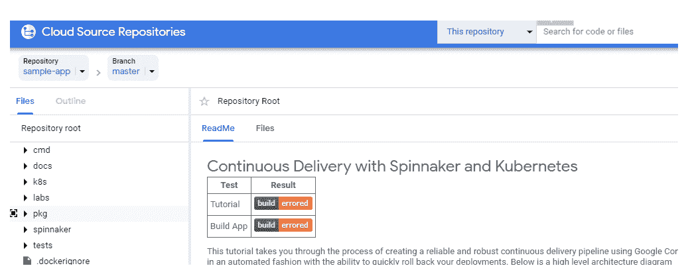

通过这样，您已经学会了如何在 Google Cloud Source 上创建代码存储库。在下一个步骤中，我们将使用 Cloud Source 存储库位置来构建我们的项目。

### 使用 Google Cloud Build 构建项目

让我们执行以下步骤，从我们在上一个步骤中创建的 Cloud Source 存储库构建项目：

1.  在这里，我们将使用 Cloud Build 产品来构建我们的项目。首先，登录到您的 GCP 帐户。从主产品菜单中，点击 Cloud Build。如下截图所示，它位于 TOOLS 下：

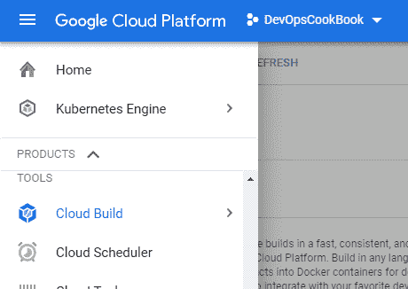

1.  在 Cloud Build 菜单中，选择“触发器”，然后点击“创建触发器”按钮，如下截图所示：

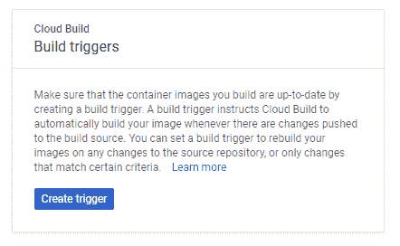

1.  我们的代码在 Cloud Source 存储库中，所以选择 Cloud Source 存储库，然后点击“继续”按钮。如您所见，其他选项是 Bitbucket 和 GitHub：

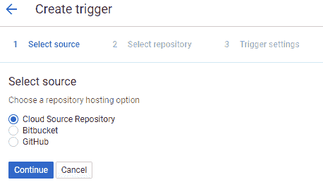

1.  您的帐户上的存储库将被自动检测到。选择 sample-app 存储库，然后点击“继续”按钮：

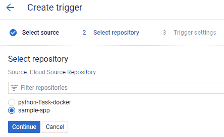

1.  设置以下设置，其他保持不变：

```
Name: devopscookbook-trigger-1
Trigger type: Tag
Tag (regex): v.*
Build configuration: Cloud Build configuration file (yaml or json)
```

1.  点击“创建触发器”按钮。

1.  切换回已配置为访问您的 Kubernetes 集群的`kubectl`命令行，并创建一个存储桶。在创建之前，请将`devopscookbook-kubernetes-manifests`存储桶名称更改为唯一的存储桶名称：

```
$ gsutil mb -l us-central1 gs://devopscookbook-kubernetes-manifests
```

1.  在*步骤 6*中创建的存储桶上启用存储桶版本控制。以下命令将在 Cloud Storage 上启用版本控制，并让存储桶保留对象的旧版本：

```
$ gsutil versioning set on gs://devopscookbook-kubernetes-manifests
```

1.  如果您还没有在源代码文件夹中，切换到我们的源代码目录：

```
$ cd sample-app
```

1.  将我们的 Kubernetes 部署清单文件中的项目 ID 更改为您的项目：

```
$ sed -i s/PROJECT/devopscookbook/g k8s/deployments/*
```

1.  提交更改，并使用类似以下的有意义的提交消息：

```
$ git commit -a -m "Change placeholder project ID to devopscookbook"
```

1.  为发布创建一个 Git 标签，并推送该标签：

```
$ git tag v1.0.0 && git push --tags
```

1.  切换回浏览器，点击 Cloud Code 菜单中的“历史”，确认构建已被触发并成功：

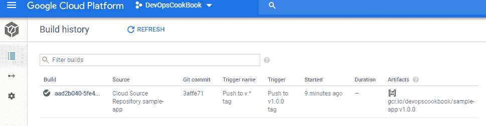

通过这样，您已经学会了如何使用 Google Cloud Build 构建项目。

### 配置 Spinnaker 管道

让我们执行以下步骤，将您的配置上传到 Spinnaker：

1.  在`owner-email`部分用您的电子邮件替换以下电子邮件，并使用以下命令在 Spinnaker 中创建所提供的应用程序：

```
$ spin application save \
--application-name sample \
--owner-email \
youremail@domain.com \
--cloud-providers kubernetes \
--gate-endpoint \
http://localhost:8080/gate
```

1.  将示例流水线上传到 Spinnaker：

```
$ sed s/PROJECT/devopscookbook/g spinnaker/pipeline-deploy.json > pipeline.json
$ spin pipeline save --gate-endpoint http://localhost:8080/gate -f pipeline.json
```

上述命令将配置导出到名为`pipeline.json`的文件中，并将其上传到 Spinnaker。

### 将应用程序部署到生产环境

一旦应用程序部署到了暂存环境，下一步就是将其推广到生产环境。让我们执行以下步骤，将应用程序从暂存推广到 Spinnaker 上的生产环境：

1.  在 Spinnaker UI 中，选择我们在*配置 Spinnaker 流水线*中创建的`sample`应用程序：

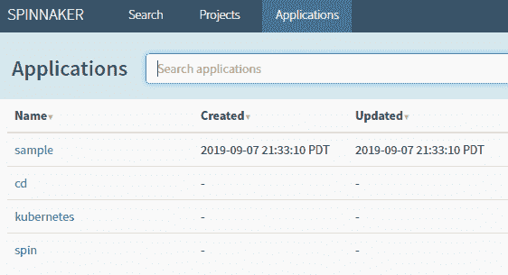

1.  单击以下截图中显示的 PIPELINES 选项卡：

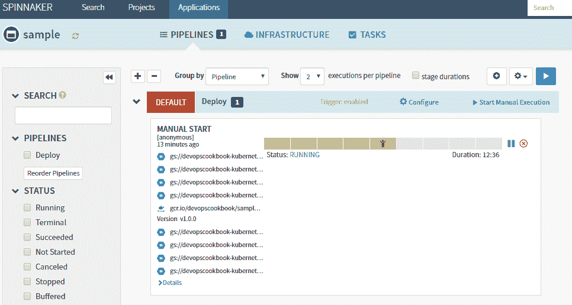

1.  将鼠标悬停在橙色框上，然后单击“继续”按钮。如下截图所示，绿色框表示流水线的已完成部分，而橙色框表示流水线暂停的位置：

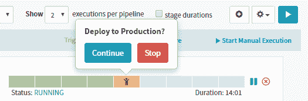

1.  在 INFRASTRUCTURE 菜单下选择 LOAD BALANCERS。以下截图显示了 INFRASTRUCTURE 菜单：

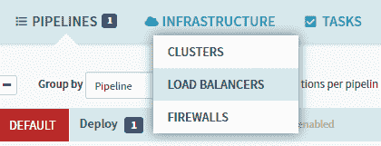

1.  单击服务 sample-frontend-production 负载均衡器下的 DEFAULT 按钮：

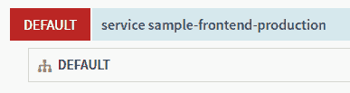

1.  在详细信息窗格的右侧，找到 Ingress IP，并通过单击 IP 地址旁边的复制图标将其复制到剪贴板：

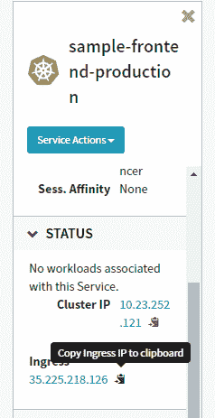

1.  在浏览器中打开 IP 地址，确认生产应用程序是否可访问。您将看到一个类似以下视图的屏幕，显示 Pod 名称、节点名称及其版本：

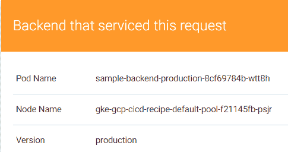

有了这个，您就知道如何使用 Google Cloud Platform 服务和 Spinnaker 在 GKE 上创建您的 CI/CD 流水线。

## 另请参阅

+   Google Cloud 上的 CI/CD 快速入门：[`cloud.google.com/docs/ci-cd/`](https://cloud.google.com/docs/ci-cd/)

+   Cloud Source Repositories 文档：[`cloud.google.com/source-repositories/docs/`](https://cloud.google.com/source-repositories/docs/)

# 在 Azure DevOps 上设置 CI/CD 流水线

Azure DevOps 提供版本控制、报告、自动构建以及项目/实验室/测试和发布管理功能。Azure DevOps 可作为 SaaS 或本地服务器产品提供。在本节中，我们将介绍 Azure DevOps 工作流配置和使用 SaaS 产品的内置 CI/CD 功能。您将学习如何管理工作流程并创建 Azure 管道。

## 做好准备

在以下示例中，您将学习如何通过添加一个 YAML 文件在您拥有的存储库中创建一个管道示例。此示例需要一个准备好进行构建的项目的活动 GitHub 帐户。我们将使用 AKS 来演示 Azure 管道的持续交付。

这里提到的所有操作都需要 Azure DevOps 帐户。如果您没有，请转到[`azure.microsoft.com/services/devops/`](https://azure.microsoft.com/services/devops/)并创建一个。在 Azure Kubernetes 服务上部署应用程序还需要活动的 Azure 云订阅。

## 如何做...

本节进一步分为以下子节，以使此过程更加简单：

+   开始使用 Azure DevOps

+   配置 Azure 管道

+   将更改部署到 AKS 集群

### 开始使用 Azure DevOps

Azure DevOps 是由微软提供的一组 DevOps 工具，包括 CI/CD 和项目管理服务，如 Azure 管道、Azure 看板、Azure 工件、Azure 存储库和 Azure 测试计划。

在使用 Azure 管道之前，让我们执行以下步骤来创建我们的第一个项目：

1.  登录到[`azure.microsoft.com/en-us/services/devops/`](https://azure.microsoft.com/en-us/services/devops/)的 Azure DevOps。

1.  创建一个项目名称。

1.  选择可见性。在我们的示例中，这被设置为公共：

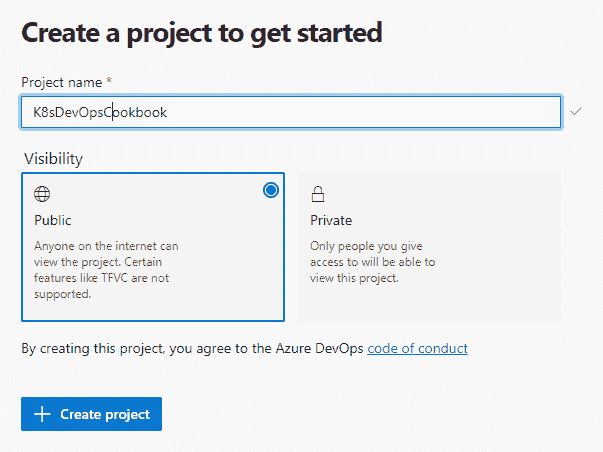

1.  单击“创建项目”按钮。

### 配置 Azure 管道

Azure 管道允许您使用任何语言、平台和云提供商进行 CI/CD 构建、测试和部署。让我们执行以下步骤，首次配置 Azure 管道：

1.  登录到 Azure DevOps 帐户后，您将在左侧概述菜单中看到主要功能的链接。从概述菜单中，单击“管道”菜单。以下屏幕截图显示了“欢迎来到项目！”页面：

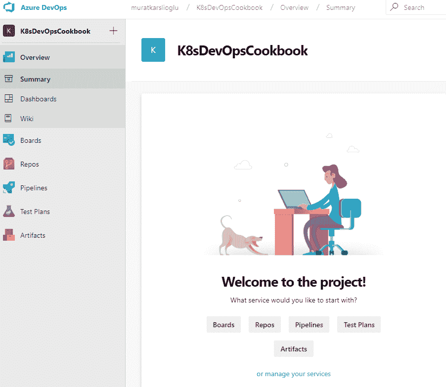

1.  单击“创建管道”按钮。

1.  作为管道创建过程的一部分，您需要设置代码存储库位置。您可以从任何 Git 存储库导入项目。在我们的示例中，我们将使用 GitHub 作为我们的存储库。以下截图显示了所有其他可用选项：

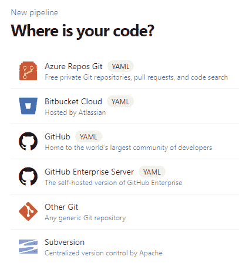

1.  单击“授权 AzurePipelines”：

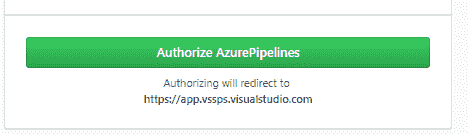

1.  选择一个存储库并单击“批准并安装”：

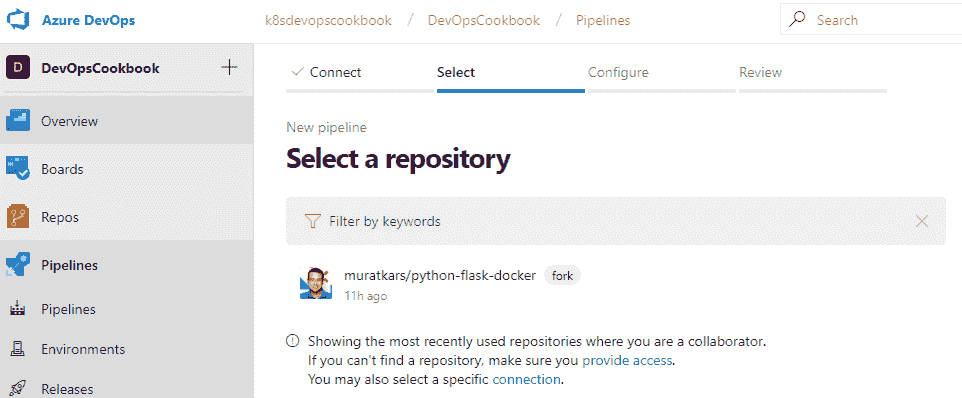

1.  现在，选择要配置管道的存储库。

1.  选择 Docker 构建并推送镜像到 Azure 容器注册表。此选项将上传容器构件到 Azure 容器注册表服务。以下截图显示了我们将使用的 Docker 选项：

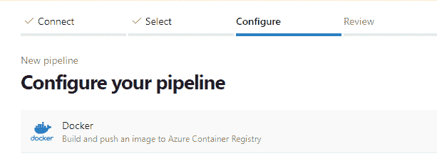

1.  审查您的管道 YAML 并单击“保存并运行”以批准它。

1.  您将看到管道。单击“构建作业”以查看其详细信息：


有了这个，您已经学会了如何配置 Azure 管道。

### 部署更改到 AKS 集群

让我们执行以下步骤：

1.  登录到 Azure DevOps 帐户后，您将在左侧概述菜单中看到主要功能的链接。这次，从概述菜单中选择“管道”选项。如下截图所示，它是从顶部数起的第四个选项：


1.  接下来，您需要创建一个管道。如下截图所示，显示了“管道”菜单。单击页面右上角的“新管道”按钮：

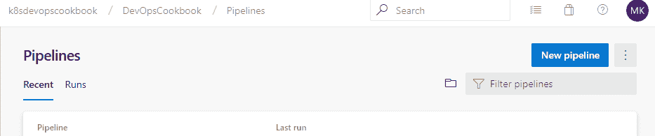

1.  选择 GitHub 作为您的存储库。同样，在以下截图中，所有其他存储库选项都是可见的：

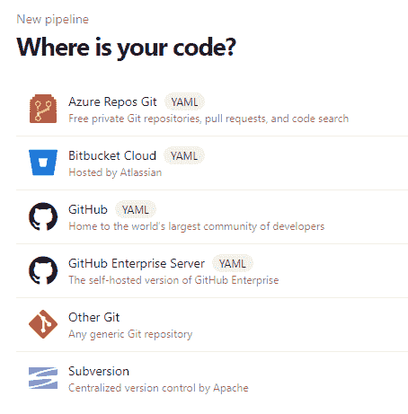

1.  选择一个存储库并单击“批准并安装”。如下截图所示，我的存储库已被选中。在您的情况下，存储库名称将不同：


1.  现在，选择要配置管道的存储库。

1.  如下截图所示，您将获得预定义的配置管道的替代方案。在本例中，选择“部署到 Azure Kubernetes 服务”以构建并推送镜像到 Azure 容器注册表，并部署到 AKS：

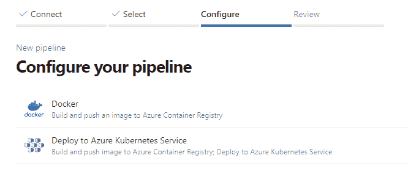

1.  选择您的 Azure 云订阅。

1.  选择现有的 AKS 集群。

1.  选择现有并在命名空间字段中选择默认。

1.  输入您的容器注册表的名称。在下面的屏幕截图中，您可以看到我选择的选项。在您的情况下，容器注册表和镜像名称将不同：

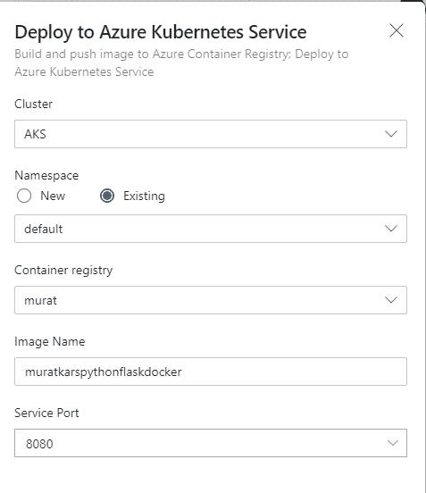

1.  单击“验证和配置”按钮。

1.  审查您的流水线 YAML 并单击“保存并运行”以批准它。

1.  您将看到流水线。单击“构建作业”以查看其详细信息：

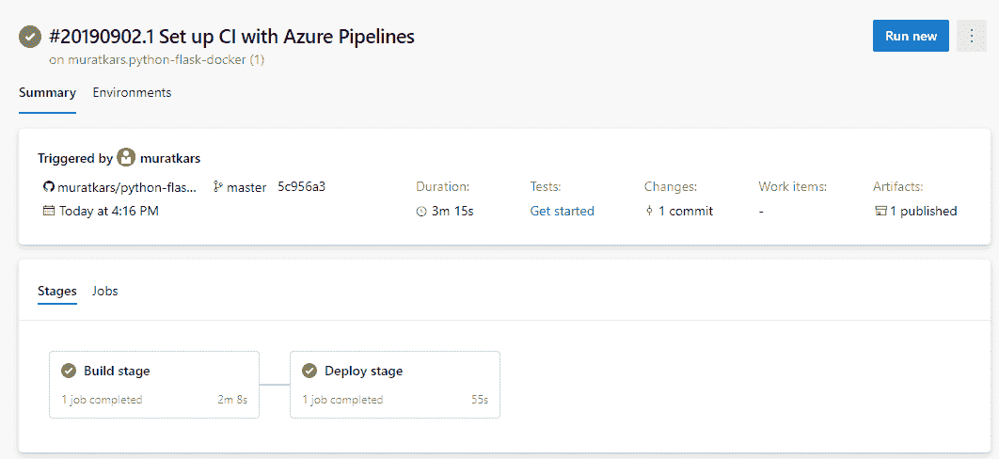

在前面的屏幕截图中，我们简单的流水线只包括两个阶段。这些将在*它是如何工作的...*部分进行解释。

## 它是如何工作的...

这个教程向您展示了如何快速创建一个在 AKS 集群上运行的演示应用程序的 Azure DevOps CI/CD 流水线。

在*将更改部署到 AKS 集群*教程中，在*步骤 9*之后，当我们构建作业时，Azure Pipelines 将创建您的流水线。它将创建以下两个阶段：

1.  在第 1 阶段，即构建阶段，它创建一个 Docker 镜像并将图像推送到您的 Azure 容器注册表中。当成功时，您可以在 Azure 门户中找到存储在现有注册表中的新图像。例如，以下屏幕截图显示了作为我的流水线结果创建的图像在 Azure 容器注册表下以及其详细信息：

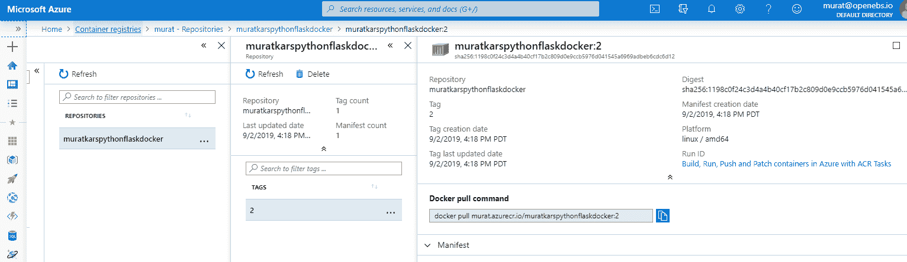

1.  在第 2 阶段，即部署阶段，它创建图像拉取凭据以访问您的注册表，并将您的应用程序部署为部署。

应用程序将部署到您在流水线创建期间指定的命名空间中。

稍后，您可以创建多个环境，用于应用程序的不同阶段（预览、暂存和生产），并更改应用程序需要部署到流水线中的位置。

## 另请参阅

+   Azure DevOps 文档：[`docs.microsoft.com/en-us/azure/devops/?view=azure-devops`](https://docs.microsoft.com/en-us/azure/devops/?view=azure-devops)

+   Azure Pipelines 文档：[`docs.microsoft.com/en-us/azure/devops/pipelines/index?view=azure-devops`](https://docs.microsoft.com/en-us/azure/devops/pipelines/index?view=azure-devops)

+   Kubernetes 部署的金丝雀部署策略：[`docs.microsoft.com/en-us/azure/devops/pipelines/ecosystems/kubernetes/canary-demo?view=azure-devops`](https://docs.microsoft.com/en-us/azure/devops/pipelines/ecosystems/kubernetes/canary-demo?view=azure-devops)
