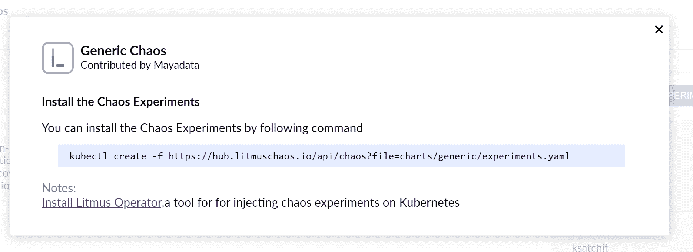
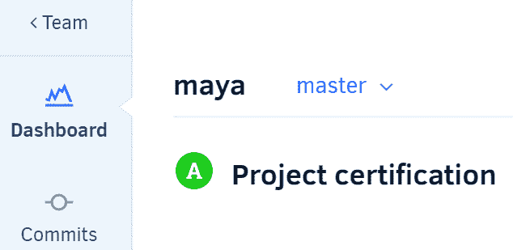
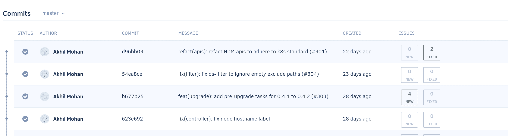
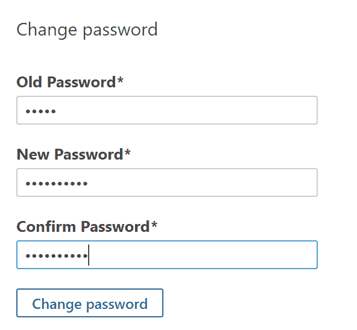
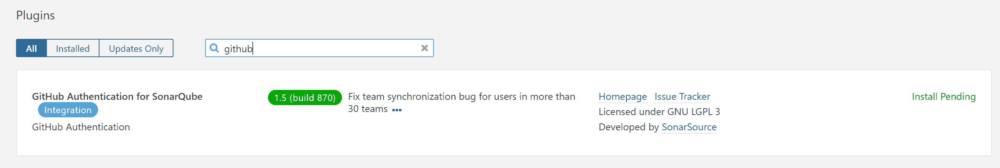

在 DevOps 中自动化测试

在本章中，我们将讨论在 DevOps 工作流中自动化测试，以加快生产时间，减少交付风险的损失，并使用已知的测试自动化工具在 Kubernetes 上检测服务异常。在本章的配方之后，您将学会预防已知缺陷，以及快速发现新缺陷，以减少服务停机时间。

在本章中，我们将涵盖以下配方：

+   使用 StackStorm 构建事件驱动的自动化

+   使用 Litmus 框架自动化测试

+   使用 Gremlin 进行混沌工程自动化

+   使用 Codacy 自动化您的代码审查

+   使用 SonarQube 进行静态代码分析检测错误和反模式

+   使用 Fossa 检测许可合规问题

# 技术要求

本节中的配方假定您已经通过遵循第一章中描述的推荐方法之一部署了一个功能性的 Kubernetes 集群，*构建生产就绪的 Kubernetes 集群*。

Kubernetes 命令行工具`kubectl`将在本章的其余配方中使用，因为它是针对 Kubernetes 集群运行命令的主要命令行界面。我们还将使用`helm`，其中 Helm 图表可用于部署解决方案。

# 使用 StackStorm 构建事件驱动的自动化

StackStorm 是一个开源的、事件驱动的自动化平台。使用 GitOps 方法，它可以根据事件运行工作流。在本节中，我们将使用 Helm 图表在 Kubernetes 上以高可用配置部署 StackStorm，并开始部署规则、自定义传感器、操作和工作流的示例，执行任意自动化或补救任务。

## 准备就绪

确保您已经准备好一个 Kubernetes 集群，以及已经配置好`kubectl`和`helm`，以便您可以管理集群资源。

## 如何做…

本节进一步分为以下子节，以使这个过程更容易：

+   安装 StackStorm

+   访问 StackStorm UI

+   使用 st2 CLI

+   定义规则

+   部署规则

### 安装 StackStorm

尽管 StackStorm 可以作为 Linux 系统的**Red Hat Package Manager**/**Debian**（RPM/Deb）分发，并作为 Docker 镜像，但如果您计划运行业务关键的自动化任务，建议在 Kubernetes 上部署 StackStorm **高可用性**（HA）集群。

在本教程中，我们将学习如何按照以下步骤在 Kubernetes 上部署 StackStorm：

1.  将 Helm 存储库添加到本地图表列表中：

```
$ helm repo add stackstorm https://helm.stackstorm.com/
```

1.  使用 Helm 图表安装 StackStorm HA 集群。以下命令将部署 StackStorm 及其依赖项，如 MongoDB 和 RabbitMQ：

```
$ helm install stackstorm/stackstorm-ha --name=st2 --namespace=stackstorm
```

1.  安装过程可能需要 2 到 3 分钟。确认已部署并运行发布：

```
$ helm ls st2
NAME REVISION  UPDATED                  STATUS   CHART                APP VERSION NAMESPACE
st2  1         Wed Oct 30 23:06:34 2019 DEPLOYED stackstorm-ha-0.22.0 3.2dev      stackstorm
```

现在，您的集群中正在运行 StackStorm。接下来，我们将访问 UI 或使用 CLI 与 StackStorm 进行交互。

### 访问 StackStorm UI

StackStorm Helm 安装假定您正在单节点 Minikube 集群中运行，并且随附的说明适用于较小的部署。我们正在一个具有多个节点的大型集群上运行 StackStorm。我们将外部公开 Web 服务器以访问 StackStorm UI。

让我们执行以下步骤来创建云负载均衡器，以便我们可以访问 StackStorm Web 界面：

1.  创建负载均衡器。以下命令将通过您的云提供商创建负载均衡器并在端口`80`上公开 Web 服务：

```
$ cat <<EOF | kubectl apply -f -
apiVersion: v1
kind: Service
metadata:
 name: st2-service
 namespace: stackstorm
spec:
 type: LoadBalancer
 ports:
 - port: 80
 targetPort: 80
 protocol: TCP
 selector:
 app: st2web
EOF
```

1.  查找外部服务 IP。在以下示例中，我们使用了部署在 AWS 上的 Kubernetes 集群。尽管输出可能不同，但在其他平台上，以下命令应该产生相同的结果：

```
$ kubectl get svc st2-service -nstackstorm
NAME        TYPE         CLUSTER-IP    EXTERNAL-IP PORT(S) AGE
st2-service LoadBalancer 100.68.68.243 a022d6921df2411e9bd5e0a92289be87-2114318237.us-east-1.elb.amazonaws.com 80:31874/TCP 6m38s
```

1.  在浏览器中打开*步骤 2*中的外部 IP 地址：


1.  使用必要的凭据登录，即用户名为`st2admin`，密码为`Ch@ngeMe`：


现在，您可以访问`StackStorm`界面。现在，我们将点击菜单项并在*定义规则*教程中创建我们的第一个规则之前探索操作。

### 使用 st2 CLI

如果我们想熟悉产品，StackStorm Web 界面很有用，但是，如果您要在生产中使用 StackStorm，则需要学习 CLI 命令。现在，执行以下步骤以从 pod 访问 st2 CLI：

1.  查找 st2 客户端的 pod 名称：

```
$ export ST2CLIENT=$(kubectl get --namespace stackstorm pod -l app=st2client -o jsonpath="{.items[0].metadata.name}")
```

1.  通过 st2 CLI 执行以下命令。此命令将从 pod 执行`st2 --version`命令：

```
$ kubectl exec -it ${ST2CLIENT} -n stackstorm -- st2 --version
st2 3.2dev (a643ba7), on Python 2.7.12
```

1.  使用以下 CLI 命令对 StackStorm 进行身份验证，并使用`-w`参数保存密码。如果不想保存密码，则可以在末尾删除`-w`参数：

```
$ kubectl exec -it ${ST2CLIENT} -n stackstorm -- st2 login st2admin -p 'Ch@ngeMe' -w
Logged in as st2admin
```

1.  列出核心包中可用的操作：

```
$ kubectl exec -it ${ST2CLIENT} -n stackstorm -- st2 action list --pack=core
```

1.  列出核心包中的操作。您还可以尝试 Linux、ChatOps 和其他包选项：

```
$ kubectl exec -it ${ST2CLIENT} -n stackstorm -- st2 action list --pack=core
```

所有 StackStorm CLI 操作都可以通过 REST API、Python 和 JavaScript 绑定进行。您可以在*另请参阅*部分的*StackStorm CLI 和 Python 客户端*参考链接中找到更多信息。

### 定义规则

StackStorm 使用规则在事件发生时运行可用的操作。StackStorm 带有默认操作，并且可以通过从社区添加新操作来增加操作目录。按照以下步骤创建您的第一个规则：

1.  规则以熟悉的 YAML 格式创建，由三个部分组成：触发器、条件和操作。在创建规则文件之前，我们将熟悉可以在规则中使用的可用触发器。使用以下命令列出可用的触发器：

```
$ kubectl exec -it ${ST2CLIENT} -n stackstorm -- st2 trigger list
```

1.  检查 webhook 触发器的详细信息。以下命令将返回触发器的描述、参数和有效负载模式。检查`parameters_schema`，因为我们稍后将在示例规则中使用它：

```
$ kubectl exec -it ${ST2CLIENT} -n stackstorm -- st2 trigger get core.st2.webhook
...
| parameters_schema | {                                   |
|                   |      "additionalProperties": false, |
|                   |      "type": "object",              |
|                   |      "properties": {                |
|                   |          "url": {                   |
|                   |              "required": true,      |
|                   |              "type": "string"       |
...
```

1.  使用以下命令列出可用的操作：

```
$ kubectl exec -it ${ST2CLIENT} -n stackstorm -- st2 action list
```

1.  检查`core.local`操作的详细信息。此操作在本地主机上执行任意 Linux 命令。以下命令返回它可以接受的参数，如下所示：

```
$ kubectl exec -it ${ST2CLIENT} -n stackstorm -- st2 action get core.local
...
| parameters    | {                                               |
|               | "cmd": {                                        |
|               |     "required": true,                           |
|               |     "type": "string",                           |
|               |     "description": "Arbitrary Linux command to  |
|               | be executed on the local host."                 |
|               |     },                                          |
|               |     "sudo": {                                   |
|               |         "immutable": true                       |
|               |     }                                           |
|               | }                                               |
| metadata_file | actions/local.yaml                              |
...
```

1.  让我们在规则中使用前面的触发器和操作，并设置一个 webhook 来监听`https://{host}/api/v1/webhooks/sample`的 URL，使用以下规则并创建一个`first_rule.yaml`文件。完成后，将文件复制到容器中。当向此 URL 发出 POST 请求时，操作将被触发：

```
$ cat > first_rule.yaml <<EOF
 name: "sample_rule_with_webhook"
 pack: "examples"
 description: "Sample rule dumping webhook payload to a file."
 enabled: true
 trigger:
 type: "core.st2.webhook"
 parameters:
 url: "sample"
 criteria:
 trigger.body.name:
 pattern: "st2"
 type: "equals"
 action:
 ref: "core.local"
 parameters:
 cmd: "echo \"{{trigger.body}}\" >> ~/st2.webhook_sample.out ; sync"
EOF
```

通过这样，您已经学会了如何查找和使用可用的操作和触发器来构建规则。接下来，我们将学习如何在 StackStorm 中运行它。

### 部署规则

StackStorm 规则可以通过其 UI、CLI 或 API 部署。在本教程中，我们将使用之前定义的规则，并使用以下步骤部署它：

1.  使用我们在*定义规则*教程中创建的 YAML 文件创建规则：

```
$ kubectl exec -it ${ST2CLIENT} -n stackstorm -- st2 rule create first_rule.yaml
```

1.  列出规则并确认新规则已创建。您应该在列表中看到`examples.sample_rule_with_webhook`规则，如下所示：

```
$ kubectl exec -it ${ST2CLIENT} -n stackstorm -- st2 rule list
+------------------+----------+-------------------------+---------+
| ref | pack | description | enabled |
+------------------+----------+-------------------------+---------+
| chatops.notify | chatops | Notification rule to | True |
| | | send results of action | |
| | | executions to stream | |
| | | for chatops | |
| examples.sample | examples | Sample rule dumping | True |
| rule_with_webhook| | webhook payload to a | |
| | | file. | |
+------------------+----------+-------------------------+---------+
```

通过我们在这里创建的新规则，webhook 已开始监听`https://{host}/api/v1/webhooks/sample`。

## 另请参见

+   StackStorm 文档：[`docs.stackstorm.com/install/k8s_ha.html`](https://docs.stackstorm.com/install/k8s_ha.html)

+   StackStorm CLI 和 Python 客户端：[`docs.stackstorm.com/reference/cli.html`](https://docs.stackstorm.com/reference/cli.html)

+   StackStorm 示例：[`github.com/StackStorm/st2/tree/master/contrib/examples`](https://github.com/StackStorm/st2/tree/master/contrib/examples)

# 使用 Litmus 框架自动化测试

Litmus 是一个开源工具集，用于在 Kubernetes 中运行混沌实验。Litmus 为云原生开发人员和 SRE 提供了混沌中央注册库（CRD），以便在生产环境中实时注入、编排和监视混沌，以发现 Kubernetes 部署中的潜在弱点。在本节中，我们将运行一些这些混沌实验，以验证系统的弹性。您将学习如何构建 CI 和端到端测试的流水线，以验证和认证新的 Kubernetes 版本。

## 准备工作

将`k8sdevopscookbook/src`存储库克隆到您的工作站，以便能够使用`chapter4`目录下的清单文件：

```
$ git clone https://github.com/k8sdevopscookbook/src.git
$ cd src/chapter4
```

确保您已准备好 Kubernetes 集群，并配置了`kubectl`和`helm`，以便您可以管理集群资源。

## 如何做…

本节进一步分为以下子节，以使这个过程更容易：

+   安装 Litmus Operator

+   使用 Chaos Charts 进行 Kubernetes

+   创建一个容器杀死混沌实验

+   审查混沌实验结果

+   查看混沌实验日志

### 安装 Litmus Operator

Litmus 混沌工程工具可以使用 Helm 图表进行安装。Books 被定义为 Kubernetes 作业。

让我们执行以下步骤来在我们的集群中安装 Litmus：

1.  安装 Litmus 混沌操作员：

```
$ kubectl apply -f https://litmuschaos.github.io/pages/litmus-operator-latest.yaml
```

1.  验证 Litmus 混沌操作员 pod 是否正在运行：

```
$ kubectl get pods -n litmus
NAME                               READY STATUS  RESTARTS AGE
chaos-operator-ce-554d6c8f9f-46kf6 1/1   Running 0        50s
```

1.  验证集群角色和集群角色绑定已应用：

```
$ kubectl get clusterroles,clusterrolebinding,crds | grep "litmus\|chaos"
```

现在，我们在集群中运行了 Litmus 混沌操作员。接下来，我们需要部署混沌实验来测试集群资源的弹性。

### 使用 Chaos Charts 进行 Kubernetes

与工作负载 Helm 图表类似，Litmus 混沌图表用于安装混沌实验包。混沌实验包含实际的混沌细节。在本食谱中，我们将学习如何列出混沌实验包并下载 Kubernetes 混沌实验包。让我们执行以下步骤来为 Litmus Operator 安装混沌图表：

1.  在浏览器上打开 Kubernetes 混沌图表网站[`hub.litmuschaos.io`](https://hub.litmuschaos.io)，并在搜索框中搜索`generic`：


1.  点击“通用混沌”图表：


1.  点击“安装所有实验”按钮：


1.  复制混沌实验清单链接：



1.  安装混沌实验：

```
$ kubectl create -f https://hub.litmuschaos.io/api/chaos?file=charts/generic/experiments.yaml
```

1.  获取已创建的混沌实验列表：

```
$ kubectl get chaosexperiments
NAME                 AGE
container-kill       19s
pod-delete           19s
pod-network-latency  19s
pod-network-loss     19s
```

通用混沌图表下提供了诸如 pod 删除、网络延迟、网络丢失和容器杀死等混沌实验场景。您还可以安装或构建自己的特定于应用程序的混沌图表来运行特定于应用程序的混沌。

### 创建一个 pod 删除混沌实验

混沌实验捆绑了可复现的混沌情况，以便将它们作为 Kubernetes 作业运行。在这个教程中，我们将部署一个示例应用程序，并在应用程序上使用 Kubernetes 混沌实验。让我们执行以下步骤来测试在我们的集群中删除 pod 的影响：

1.  部署一个示例应用程序：

```
$ kubectl apply -f litmus/nginx/nginx.yaml
```

1.  列出 pod 并确认它们正在运行：

```
$ kubectl get pods |grep nginx
nginx-deployment-5c689d88bb-24n4m 1/1 Running 0 4m31s
nginx-deployment-5c689d88bb-qtvsx 1/1 Running 0 4m31s
```

1.  使用`litmuschaos.io/chaos="true"`为混沌注释部署：

```
$ kubectl annotate deploy nginx-deployment litmuschaos.io/chaos="true"
deployment.extensions/nginx-deployment annotated
```

1.  为混沌执行器创建一个`ServiceAccount`：

```
$ cat <<EOF | kubectl apply -f -
apiVersion: v1
kind: ServiceAccount
metadata:
 name: nginx
 labels:
 app: nginx
EOF
```

1.  创建一个集群角色：

```
$ cat <<EOF | kubectl apply -f -
kind: ClusterRole
apiVersion: rbac.authorization.k8s.io/v1
metadata:
 name: nginx
rules:
- apiGroups: ["", "extensions", "apps", "batch", "litmuschaos.io"]
 resources: ["daemonsets", "deployments", "replicasets", "jobs", "pods", "pods/exec", "events", "chaosengines", "chaosexperiments", "chaosresults"]
 verbs: ["*"]
EOF
```

1.  创建一个`ClusterRoleBinding`：

```
$ cat <<EOF | kubectl apply -f -
kind: ClusterRoleBinding
apiVersion: rbac.authorization.k8s.io/v1
metadata:
 name: nginx
subjects:
- kind: ServiceAccount
 name: nginx
 namespace: default
roleRef:
 kind: ClusterRole
 name: nginx
 apiGroup: rbac.authorization.k8s.io
EOF
```

1.  审阅实验 CRs 以查看混沌参数。在这种情况下，让我们审阅`pod-delete`和`container-kill`实验：

```
$ kubectl get chaosexperiment pod-delete -o yaml
$ kubectl get chaosexperiment container-kill -o yaml
```

1.  使用前面两个你已经审阅过的实验创建一个混沌引擎：

```
cat <<EOF | kubectl apply -f -
apiVersion: litmuschaos.io/v1alpha1
kind: ChaosEngine
metadata:
 name: engine-nginx
spec:
 appinfo: 
 appns: default
 applabel: "app=nginx"
 appkind: deployment
 chaosServiceAccount: nginx
 experiments:
 - name: pod-delete
 spec:
 rank: 1
 - name: container-kill
 spec:
 components:
EOF
```

通过这样，您已经学会了如何基于预定义的混沌图表创建混沌实验。

### 审阅混沌实验结果

混沌实验是作为 Kubernetes 作业执行的，受影响的 pod 将根据实验定义被混沌执行器关闭。

让我们执行以下步骤来审阅我们混沌实验的结果：

1.  观察实验进行中：

```
$ watch kubectl get pods
Every 2.0s: kubectl get pods ip-172-20-50-43: Wed Sep 25 05:17:55 2019
NAME                              READY STATUS       RESTARTS AGE
container-kill-klfr5-rgddd        0/1   Completed    0        2m39s
engine-nginx-runner               1/2   Running      0        4m53s
nginx-deployment-5c689d88bb-qtvsx 1/1   Terminating  1        23m
nginx-deployment-5c689d88bb-rwtk9 1/1   Running      0        3m12s
pod-delete-wzj6w-x6k5t            0/1   Completed    0        4m8s
```

1.  获取结果列表：

```
$ kubectl get chaosresults
NAME                        AGE
engine-nginx-container-kill 9m
engine-nginx-pod-delete     10m
```

1.  查看`engine-nginx-container-kill`实验结果：

```
$ kubectl describe chaosresults engine-nginx-container-kill
...
Spec:
 Experimentstatus:
 Phase: <nil>
 Verdict: pass
Events: <none>

```

1.  查看`engine-nginx-pod-delete`实验结果：

```
$ kubectl describe chaosresults engine-nginx-pod-delete
...
Spec:
 Experimentstatus:
 Phase: <nil>
 Verdict: pass
Events: <none>
```

在这个教程中，我们已经测试并审阅了一个简单的场景。您可以结合现有的混沌图表来创建您自己的实验，并使用 Litmus 框架编写应用程序混沌实验。

### 查看混沌实验日志

日志始终由您的集群上使用的标准 Kubernetes 日志框架收集和存储。在需要快速查看它们的情况下，您可以访问`kubelet`日志。

让我们执行以下步骤，深入了解在混沌实验期间执行的任务：

1.  获取由已完成的作业创建的 Pod 列表：

```
$ kubectl get pods |grep Completed
container-kill-klfr5-rgddd 0/1 Completed 0 35m
pod-delete-wzj6w-x6k5t     0/1 Completed 0 37m
```

1.  使用`kubectl logs`命令查看日志：

```
$ kubectl logs container-kill-klfr5-rgddd
...
TASK [Force kill the application pod using pumba] ******************************
...
TASK [Verify restartCount] ***************************************************
...
PLAY RECAP *******************************************************************
127.0.0.1 : ok=29 changed=18 unreachable=0 failed=0
2019-09-25T05:15:56.151497 (delta: 1.254396) elapsed: 35.944704 *******
```

在日志中，您将能够看到已执行的各个任务以及通过或失败任务的摘要。

## 它是如何工作的...

这个步骤向您展示了如何在运行在 Kubernetes 上的应用程序上快速运行预定义的混沌实验。

Litmus 实验可以很容易地从头开始创建，并集成到应用程序开发人员的 CI 流水线中，在构建和单元/集成测试阶段之后，对 Kubernetes 集群上的混沌行为进行测试。

在*运行 Litmus 混沌实验*步骤中，在*步骤 8*中，我们创建了一个 Chaos Engine 来测试一个 Pod 删除实验，然后是一个容器杀死实验。这两个实验使用 Chaoskube，这是一个定期在您的 Kubernetes 集群中杀死随机 Pod 的工具，以及 Pumba，一个混沌测试和网络仿真工具，作为混沌的最终注入器。

## 另请参阅

+   Litmus 文档：[`docs.litmuschaos.io/`](https://docs.litmuschaos.io/)

+   Kubernetes 的混沌图表：[`hub.litmuschaos.io/`](https://hub.litmuschaos.io/)

+   Chaoskube 项目：[`github.com/linki/chaoskube`](https://github.com/linki/chaoskube)

+   Pumba 项目：[`github.com/alexei-led/pumba`](https://github.com/alexei-led/pumba)

# 使用 Gremlin 自动化混沌工程

Gremlin 是一个混沌工程服务，可以防止停机，并构建更可靠的系统。在本节中，我们将在生产环境中运行混沌攻击，以验证使用 Gremlin 的系统的弹性。您将学习如何创建 CPU 和节点关闭攻击，以测试基础设施的弹性。

## 准备工作

对于这个步骤，我们需要安装 Kubernetes 命令行工具`kubectl`和`helm`。

这里提到的所有操作都需要 Gremlin 帐户。如果您没有帐户，请访问[`app.gremlin.com/signup`](https://app.gremlin.com/signup)并创建一个。

## 如何做…

这一部分进一步分为以下子部分，以使这个过程更容易：

+   设置 Gremlin 凭据

+   在 Kubernetes 上安装 Gremlin

+   对 Kubernetes 工作节点进行 CPU 攻击

+   针对 Kubernetes 工作节点创建节点关闭攻击

+   运行预定义的基于场景的攻击

+   从您的集群中删除 Gremlin

### 设置 Gremlin 凭据

要从我们的 Kubernetes 集群连接到 Gremlin 服务，我们需要将 Gremlin 凭据存储为 Kubernetes 秘密。

让我们执行以下步骤来配置我们的 Gremlin 凭据：

1.  登录到 Gremlin 服务[`app.gremlin.com/`](https://app.gremlin.com/)。

1.  从帐户菜单中，点击“公司设置”：


1.  点击“团队”选项卡并选择您的团队：


1.  点击“配置”选项卡并下载您的证书：


1.  将`certificates.zip`文件复制到已配置 kubectl 的主机上。

1.  提取文件：

```
$ unzip certificate.zip
```

1.  相应地重命名证书文件：

```
$ mv Me-client.pub_cert.pem gremlin.cert && mv Me-client.priv_key.pem gremlin.key
```

1.  在您的集群中创建一个秘密资源：

```
$ kubectl create secret generic gremlin-team-cert --from-file=./gremlin.cert --from-file=./gremlin.key
```

有了这个，我们已经将我们的凭据转换为 Kubernetes 中的秘密资源。这个秘密将在稍后用于将 Gremlin 连接到我们的集群。

### 在 Kubernetes 上安装 Gremlin

在 Kubernetes 上安装 Gremlin 的最简单方法是使用 Helm 图表。在继续之前，请确保您已经创建了一个 gremlin 团队证书秘密，如“设置 Gremlin 凭据”中所述。

让我们执行以下步骤来使用 Helm 图表安装 Gremlin：

1.  添加 Gremlin Helm 存储库：

```
$ helm repo add gremlin https://helm.gremlin.com
```

1.  更新存储库：

```
$ helm repo update
```

1.  使用您的团队 ID 安装 Gremlin 客户端：

```
$ helm install --name gremlin --set gremlin.teamID=abc1234-a12b-1234-1234-abcdefgh gremlin/gremlin
```

1.  Gremlin 将创建一个在集群中的每个节点上运行的 DaemonSet。验证`DESIRED`和`AVAILABLE` pod 是否相等：

```
$ kubectl get daemonsets
NAME    DESIRED CURRENT READY UP-TO-DATE AVAILABLE NODE SELECTOR AGE
gremlin 3       3       3     3          3         <none>        11m
```

Gremlin 正在您的集群中运行。接下来，我们需要通过我们的 Gremlin 帐户触发一些混乱。

### 针对 Kubernetes 工作节点创建 CPU 攻击

Gremlin 可以生成各种影响核心、工作节点和内存的基础设施攻击。

让我们执行以下步骤来攻击 CPU：

1.  部署一个示例应用程序：

```
$ kubectl apply -f ./src/chapter4/gremlin/nginx.yaml
```

1.  列出 pod 并确认它们正在运行：

```
$ kubectl get pods |grep nginx
nginx-deployment-5c689d88bb-24n4m 1/1 Running 0 4m31s
nginx-deployment-5c689d88bb-rwtk9 1/1 Running 0 4m31s
```

1.  获取一个 pod 的节点名称：

```
$ kubectl get pod nginx-deployment-5c689d88bb-rwtk9 -o jsonpath="{.spec.nodeName}"
ip-172-20-50-43.ec2.internal
```

1.  观察`pods`状态：

```
$ watch kubectl get pods
```

1.  登录到您的 Gremlin 帐户[`app.gremlin.com/`](https://app.gremlin.com/)。

1.  从攻击菜单中，点击基础设施。

1.  点击“新攻击”按钮：


1.  在“选择目标主机”选项卡下，从“步骤 3”中选择节点的本地主机名：


1.  在“选择 Gremlin”选项卡下，单击“资源”，选择 CPU 攻击，将 CPU 容量设置为`90`，并消耗所有 CPU 核心：


1.  单击“释放 Gremlin”以运行攻击：


现在，您在 Gremlin 帐户上触发的操作将通过代理在您的集群上执行。

### 针对 Kubernetes 工作节点执行节点关闭攻击

Gremlin 可以生成影响核心、工作节点和内存的各种基础设施攻击。

让我们执行以下步骤来攻击 CPU：

1.  登录到您的 Gremlin 帐户[`app.gremlin.com/`](https://app.gremlin.com/)。

1.  从“攻击”菜单中，单击“基础设施”。

1.  单击“新攻击”按钮：


1.  在“选择目标主机”选项卡下，选择节点的本地主机名*：*


1.  在“选择 Gremlin”选项卡下，单击“状态”并选择“关闭”：


1.  单击“释放 Gremlin”以运行攻击：


1.  获取我们对其执行了关闭攻击的节点上的 Pod：

```
$ kubectl get pod -owide |grep ip-172-20-50-43.ec2.internal
NAME                READY STATUS  RESTARTS AGE IP          NODE NOMINATED NODE
engine-nginx-runner 1/2   Running 1        24h 100.96.0.65 ip-172-20-50-43.ec2.internal <none>
gremlin-rpp22       1/1   Running 1        88m 100.96.0.60 ip-172-20-50-43.ec2.internal <none>
nginx-deployment-5c689d88bb-rwtk9 1/1 Running 1 24h 100.96.0.63 ip-172-20-50-43.ec2.internal <none>
```

您将注意到 Pod 被重新启动。

### 运行预定义场景攻击

Gremlin 混沌场景帮助捆绑攻击以生成真实世界的故障场景。在这个教程中，我们将学习可以用来验证系统如何响应常见故障的预定义场景。

让我们执行以下步骤来验证自动缩放：

1.  登录到您的 Gremlin 帐户[`app.gremlin.com/`](https://app.gremlin.com/)。

1.  单击“场景”菜单并查看推荐的场景：


1.  确保您的 Kubernetes 集群上启用了自动缩放，并选择“验证自动缩放”场景。

1.  单击“添加目标并运行”按钮：


1.  单击“运行场景”以执行攻击。

因此，Gremlin 将对现有节点执行 CPU 攻击，以对集群施加压力，这理想情况下应触发集群的自动缩放功能以减少 CPU 压力。

### 从您的集群中删除 Gremlin

让我们执行以下步骤来从您的 Kubernetes 集群中删除 Gremlin 的组件：

1.  列出 Gremlin Helm 发布：

```
$ helm ls |grep gremlin
gremlin 1 Thu Sep 26 04:37:05 2019 DEPLOYED gremlin-0.1.3 2.11.8
```

1.  使用发布名称删除 Helm 发布：

```
$ helm delete gremlin --purge
```

Helm 将从您的集群中删除发布。

## 它是如何工作的...

这个配方向您展示了如何快速在 Kubernetes 调度应用程序的工作节点上运行预定义的混沌攻击。

请记住，尽管我们正在寻找*创建 CPU 攻击*和*创建节点关闭攻击*配方对特定 pod 的影响，但整个节点都受到了攻击，因此节点上的其他 pod 也受到了影响。

特别是在小集群中，建议限制爆炸半径，并开始针对一个 pod 的单个容器进行攻击。这可以通过使用网络延迟攻击和指定与您希望看到攻击效果的容器相关的端口来完成。

## 参见

+   Gremlin 文档：[`www.gremlin.com/docs/`](https://www.gremlin.com/docs/)

# 使用 Codacy 自动化您的代码审查

在本节中，我们将使用 Codacy 自动化代码审查，而无需对我们的存储库进行任何其他代码更改，并生成有关代码质量和安全问题的通知。您将学习如何自动化在开发代码审查和检查时最被低估的任务之一。

## 准备就绪

这里提到的所有操作都需要 Codacy 帐户。如果您没有帐户，请转到[`www.codacy.com/pricing`](https://www.codacy.com/pricing)并创建一个。

## 如何做…

本节进一步分为以下子节，以使这个过程更容易：

+   访问项目仪表板

+   审查提交和 PR

+   按类别查看问题

+   将 Codacy 徽章添加到您的存储库

### 访问项目仪表板

让我们执行以下步骤来访问 Codacy 项目仪表板：

1.  登录到 Codacy 网站[`app.codacy.com`](https://app.codacy.com)，这将带您到您的组织仪表板。

1.  在左侧菜单中单击项目：


1.  单击特定项目以进入项目视图：


1.  在项目仪表板上找到项目评分选项。在我们的示例中，以下项目已被评为 A：



1.  查找质量演变图，并查看问题数量与行业平均值的比较。如果您的平均值高于行业标准，则需要审查提交并减少问题数量：


### 审查提交和 PR

让我们执行以下步骤来审查 Codacy 仪表板上的代码提交：

1.  在项目仪表板上，单击“提交”菜单。

1.  从下拉菜单中选择主分支：


1.  在提交列表中，找到其中一个标有新问题的提交标记为红色的提交：



1.  单击提交以查看其详细信息：


1.  实施建议的修复以清除问题，或者为开发团队打开 GitHub 问题以进行修复。

1.  现在，单击“打开”拉取请求菜单：


1.  重复*步骤 3*至*5*，以查看问题和推荐的解决方案，以在代码合并之前清除它们。这将提高代码质量。

### 按类别查看问题

并非所有问题都相同，也不需要相同数量的工作来解决。大多数情况下，安全问题应该是首要关注的问题，代码样式应该是持续的工程努力，以便通过改进内部审查流程来解决它们。

让我们执行以下步骤来查看问题分解：

1.  登录到[`app.codacy.com`](https://app.codacy.com)，这将带您到您的组织仪表板。

1.  在左侧菜单上单击“项目”。

1.  选择要分析的项目。

1.  向下滚动仪表板，直到看到问题分解图表：


1.  单击具有问题的类别，并使用代码审查中提供的问题信息：


1.  如果您正在进行同行评审或检查自己的代码，您可以通过单击“所有作者”过滤器并将其更改为名称来过滤来自作者的问题。

### 将 Codacy 徽章添加到您的存储库

徽章用于表示高级项目状态及其对来到您的存储库或网站的用户的稳定性。由于 Codacy 可以显示您的代码质量，因此您可能希望在`README.MD`文件中显示它。

让我们执行以下步骤来向您的 GitHub 存储库添加 Codacy 徽章：

1.  登录到[`app.codacy.com`](https://app.codacy.com)，这将带您到您的组织仪表板。

1.  在左侧菜单上单击“项目”。

1.  选择要分析的项目。

1.  单击项目名称旁边的徽章图标：


1.  单击“添加徽章到存储库”以创建一个 PR 到您的存储库：


1.  审查 PR 的内容并合并它。一旦合并，您将在存储库概述页面上看到代码质量分数，类似于以下截图所示：


徽章用于突出显示存储库访问者的重要测试和信息。

## 另请参阅

+   Codacy 文档：[`support.codacy.com/hc/en-us`](https://support.codacy.com/hc/en-us)

# 使用 SonarQube 检测错误和反模式

SonarQube 是一个流行的开发工具，用于在软件开发中捕捉应用程序中的错误和漏洞。在本节中，我们将学习如何自动化静态代码分析，以检测您可以在 CI/CD 流水线中使用的错误和反模式。

## 准备工作

克隆`k8sdevopscookbook/src`存储库到您的工作站，以便使用`chapter4`目录下的清单文件：

```
$ git clone https://github.com/k8sdevopscookbook/src.git
$ cd src/chapter4
```

确保您已经准备好一个 Kubernetes 集群，并且已经配置了 kubectl 和 helm，以便您可以管理集群资源。

## 如何做…

这一部分进一步分为以下子部分，以使这个过程更容易：

+   使用 Helm 安装 SonarQube

+   访问 SonarQube 仪表板

+   创建新用户和令牌

+   启用质量配置文件

+   添加项目

+   分析项目

+   按类别查看问题

+   向您的存储库添加 SonarQube 徽章

+   添加市场插件

+   从您的集群中删除 SonarQube

### 使用 Helm 安装 SonarQube

SonarQube 是一个领先的开源解决方案，用于采用代码质量的 CI/CD 中的代码质量和安全分析。它可以作为一个独立的解决方案从二进制文件安装。在这个示例中，我们将使用 Helm 图表在 Kubernetes 集群上安装它。

让我们执行以下步骤来启动和运行 SonarQube：

1.  更新您的存储库：

```
$ helm repo update
```

1.  安装 SonarQube：

```
$ helm install stable/sonarqube --name sonar --namespace sonarqube
```

1.  验证 PostgreSQL 和 SonarQube pod 是否就绪：

```
$ kubectl get pods -n sonarqube
NAME                              READY STATUS  RESTARTS AGE
sonar-postgresql-68b88ddc77-l46wc 1/1   Running 0        16m
sonar-sonarqube-995b9cc79-9vzjn   1/1   Running 1        16m
```

通过这样，您已经学会了如何在 Kubernetes 集群上部署 SonarQube。

### 访问 SonarQube 仪表板

使用 Helm 图表安装 SonarQube 会创建一个负载均衡器并公开外部 IP 以进行连接。我们将首先发现 IP 并使用服务 IP 连接到 SonarQube 仪表板。

让我们执行以下步骤通过云负载均衡器公开 SonarQube：

1.  获取 SonarQube 负载均衡器的外部 IP：

```
$ export SONAR_SVC=$(kubectl get svc --namespace sonarqube sonar-sonarqube -o jsonpath='{.status.loadBalancer.ingress[0].hostname}')
$ echo http://$SONAR_SVC:9000
```

1.  在浏览器中打开地址：


1.  点击“登录”，并使用`admin`作为用户名和密码登录到仪表板：


1.  点击屏幕右上角的账户配置标志，然后选择“我的账户”：


1.  选择“安全”选项卡：


1.  通过点击“更改密码”按钮来更改默认管理员密码并保存：



由于服务端口可以从外部访问，重要的是更改 SonarQube 的默认凭据。

### 创建新用户和令牌

团队成员需要拥有自己的用户帐户来访问仪表板。建议您生成令牌以管理帐户。您可以使用它们来运行分析或调用 Web 服务，而无需访问用户的实际凭据。这样，您对用户密码的分析不会通过网络传输。

让我们执行以下步骤来创建可以访问 SonarQube 的新用户：

1.  从顶部菜单中，点击“管理”。

1.  点击“安全”选项卡，然后选择“用户”：


1.  点击“创建用户”按钮：


1.  输入用户的“名称”、“电子邮件”和“密码”，然后点击“创建”：


1.  在“用户”表上，点击“令牌”列下的“更新令牌”按钮：


1.  设置一个令牌名称，然后点击“生成”按钮。

1.  确保复制令牌并记下它，以备后续使用。

### 启用质量配置

要能够分析一个项目，首先需要安装特定的编程语言插件。让我们执行以下步骤来安装我们将在下一个示例“添加项目”中使用的 Java 插件：

1.  点击“质量配置”。如果看到消息“没有可用的语言”，则需要安装语言插件：


1.  点击“管理”菜单，切换到“市场”选项卡：


1.  在市场搜索栏中，搜索您想要启用的语言。对于这个示例，这是`java`：


1.  通过点击相应插件旁边的“安装”按钮，为 SonarQube、Checkstyle、Findbugs、Java i18n 规则、PMD 和 SonarJava 插件添加**Adobe Experience Manager**（**AEM**）规则：


1.  此操作需要重新启动。点击“重新启动服务器”，并在重新启动后登录到仪表板：


1.  一旦您重新登录到仪表板，点击“质量配置文件”。这次，您应该看到 Java 配置文件：


对于您想安装的其他语言，请重复*步骤 1*至*5*。

### 添加一个项目

在第一次分析时，SonarQube 会自动创建一个项目。在我们扫描项目之前，我们需要选择一种分析方法。在这个教程中，我们将启动一个 Gradle 分析。其他可用的方法列在*另请参阅*部分中。

让我们执行以下步骤将新项目添加到 SonarQube 中：

1.  克隆一个示例存储库进行扫描：

```
$ git clone https://github.com/javajon/code-analysis.git
$ cd code-analysis/microservice/
```

1.  对于这个示例，我们还需要在我们的节点上安装 Java 1.8。如果您已经安装了，跳到*步骤 4*：

```
$ sudo apt install openjdk-8-jre-headless default-jdk
```

1.  确认您正在使用的 Java 版本：

```
$ java -version openjdk version "1.8.0_222"
OpenJDK Runtime Environment (build 1.8.0_222-8u222-b10-1~deb9u1-b10)
OpenJDK 64-Bit Server VM (build 25.222-b10, mixed mode)
```

1.  获取 SonarQube 服务的外部 IP：

```
$ export SONAR_SVC=$(kubectl get svc --namespace sonarqube sonar-sonarqube -o jsonpath='{.status.loadBalancer.ingress[0].hostname}')
```

1.  运行分析。分析将在几分钟内完成：

```
$ ./gradlew -Dsonar.host.url=http://$SONAR_SVC:9000 sonarqube
....
BUILD SUCCESSFUL in 13s
6 actionable tasks: 1 executed, 5 up-to-date
```

1.  切换回 SonarQube 门户，查看新项目：


现在，您将能够在 SonarQube 门户上看到您的新项目。

### 审查项目的质量

SonarQube 的分析因所扫描的语言而异，但在大多数情况下，它会生成高质量的度量、问题报告，并找出编码规则被违反的地方。在这个教程中，您将学习如何查找问题类型，并按严重程度查看问题。

确保您通过遵循*添加项目*教程将示例项目添加到 SonarQube 中。现在，执行以下步骤：

1.  点击“问题”菜单：


1.  已知漏洞被视为阻碍因素，需要立即解决。在过滤器下，展开严重性并选择阻碍因素：


1.  在示例代码中检测到了一个硬编码凭据，这是一个严重的漏洞。要将此问题分配给团队成员，请点击“未分配”下拉菜单，并输入该人的名字以将其分配给他们：


1.  最终，所有问题都需要确认和分配，或者解决为已修复、误报或不会修复。可以通过单击“打开”下拉菜单并将其更改为新的状态值来设置状态。

### 添加市场插件

让我们执行以下步骤，从市场上添加新的插件到 SonarQube 中：

1.  单击“管理”菜单，切换到“市场”选项卡：


1.  在市场上，除了代码分析器，您还可以找到替代的身份验证方法、语言包和其他有用的集成。例如，让我们搜索 GitHub 身份验证：



1.  单击插件旁边的“安装”按钮。

1.  现在，单击“重新启动服务器”，并在重新启动后登录仪表板。

1.  使用 SonarQube，转到“管理”|“配置”|“常规设置”|“GitHub”。

1.  将 Enabled 设置为 true：


1.  将`client ID`和`client secret`设置为 GitHub 开发人员应用程序提供的值。通过转到[`github.com/settings/applications/new`](https://github.com/settings/applications/new)在 GitHub 上注册一个新的 OAuth 应用程序。

1.  保存设置并从 SonarQube 注销：


新用户将被要求使用 GitHub 用户登录。

### 从集群中删除 SonarQube

让我们执行以下步骤，从您的 Kubernetes 集群中删除 SonarQube：

1.  列出 SonarQube Helm 发布：

```
$ helm ls |grep sonarqube
sonar 1 Thu Sep 26 22:01:24 2019 DEPLOYED sonarqube-2.3.0 7.9 sonarqube
```

1.  使用发布名称删除 Helm 发布：

```
$ helm delete sonar --purge
```

Helm 将从您的集群中删除 SonarQube 发布及其组件。

## 它是如何工作的...

这个教程向您展示了如何快速检测项目中的安全漏洞和错误。

在“添加项目”教程中，在“第 5 步”中，当我们开始分析我们的示例时，提供给分析的文件在服务器端进行分析，并将分析结果作为报告发送回服务器。这个报告在服务器端以异步方式进行分析。

报告被添加到队列中，并按顺序由服务器处理。如果将多个报告发送回服务器，结果可能需要一些时间才能显示在 SonarQube 仪表板上。

默认情况下，只有安装的代码分析器可以检测到的文件才会加载到项目中。这意味着如果你只有用 C 或 Go 编写的 SonarJava 代码和在 Kubernetes 世界中非常常见的 YAML 文件，它们将被忽略。

## 另请参阅

+   SonarQube 文档：[`docs.sonarqube.org/latest/setup/overview/`](https://docs.sonarqube.org/latest/setup/overview/)

+   使用 SonarScanner for Gradle 进行静态代码分析示例：[`github.com/javajon/code-analysis`](https://github.com/javajon/code-analysis)

+   Jenkins 的 SonarScanner：[`docs.sonarqube.org/latest/analysis/scan/sonarscanner-for-jenkins/`](https://docs.sonarqube.org/latest/analysis/scan/sonarscanner-for-jenkins/)

+   Azure DevOps 的 SonarQube 扩展：[`docs.sonarqube.org/latest/analysis/scan/sonarscanner-for-azure-devops/`](https://docs.sonarqube.org/latest/analysis/scan/sonarscanner-for-azure-devops/)

+   MSBuild 的 SonarQube 扫描仪：[`docs.sonarqube.org/display/SCAN/Analyzing+with+SonarQube+Scanner+for+MSBuild`](https://docs.sonarqube.org/display/SCAN/Analyzing+with+SonarQube+Scanner+for+MSBuild)

+   Maven 的 SonarQube 扫描仪：[`docs.sonarqube.org/display/SCAN/Analyzing+with+SonarQube+Scanner+for+Maven`](https://docs.sonarqube.org/display/SCAN/Analyzing+with+SonarQube+Scanner+for+Maven)

+   Ant 的 SonarQube 扫描仪：[`docs.sonarqube.org/display/SCAN/Analyzing+with+SonarQube+Scanner+for+Ant`](https://docs.sonarqube.org/display/SCAN/Analyzing+with+SonarQube+Scanner+for+Ant)

+   SonarQube 扫描仪可从 CLI 启动分析：[`docs.sonarqube.org/display/SCAN/Analyzing+with+SonarQube+Scanner`](https://docs.sonarqube.org/display/SCAN/Analyzing+with+SonarQube+Scanner)

+   插件库：[`docs.sonarqube.org/display/PLUG/Plugin+Library`](https://docs.sonarqube.org/display/PLUG/Plugin+Library)

+   SonarQube 社区：[`community.sonarsource.com/`](https://community.sonarsource.com/)

# 使用 FOSSA 检测许可合规问题

FOSSA 是一个开源软件许可合规工具，允许现代团队成功开发开源软件。在本节中，我们将使用 FOSSA 框架扫描软件许可证。您将学习如何自动化许可合规性和漏洞检查。

## 准备工作

所有在这里提到的操作都需要一个 FOSSA 账户。如果你没有，请访问[`app.fossa.com/account/register`](https://app.fossa.com/account/register)并创建一个。

## 如何做…

该部分进一步分为以下子部分，以使该过程更加简单：

+   将项目添加到 FOSSA

+   处理许可问题

+   向您的项目添加 FOSSA 徽章

### 将项目添加到 FOSSA

让我们执行以下步骤将项目添加到 FOSSA：

1.  登录 FOSSA 网站[`app.fossa.com/projects`](https://app.fossa.com/projects)。

1.  单击“添加项目”按钮：


1.  选择 QUICK IMPORT，然后继续：


1.  选择存储库位置。在本教程中，我们将使用 Gitlab：


1.  单击“连接服务”按钮。

1.  选择您想要扫描的存储库，然后单击“导入”按钮：


FOSSA 将导入并自动扫描许可合规问题。

### 处理许可问题

FOSSA 不需要任何额外的步骤或代码来扫描您的项目。一旦将您的存储库添加到 FOSSA 帐户中，它就会运行许可证扫描。让我们来看一下：

1.  登录[`app.fossa.com/projects`](https://app.fossa.com/projects)。

1.  选择项目。

1.  “摘要”选项卡将显示已检测到的任何“标记的依赖项”：


1.  单击“问题”选项卡：


1.  从左侧菜单中选择一个问题线程。

1.  查看问题和推荐的解决方案：


根据问题需要采取的行动，您可以选择创建一个工单，留下一条评论与团队成员讨论，或者解释并解决问题。

### 向您的项目添加 FOSSA 徽章

让我们执行以下步骤将 FOSSA 许可证检查徽章添加到我们的 GitHub 存储库页面：

1.  登录 FOSSA 网站[`app.fossa.com/projects`](https://app.fossa.com/projects)。

1.  选择项目以生成徽章。

1.  切换到“设置”选项卡。

1.  选择 SHIELD 作为徽章格式：


1.  将 MARKDOWN 内容复制到剪贴板。

1.  在您扫描的 GitHub 存储库上编辑`README.md`文件。将您在*步骤 5*中复制的 MARKDOWN 徽章代码粘贴到文件的开头：


1.  保存文件后，FOSSA 扫描的结果将显示在存储库的徽章上。
