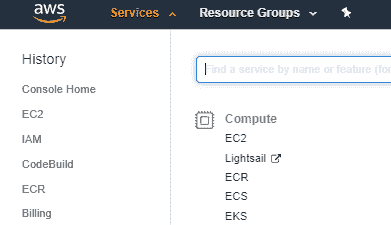
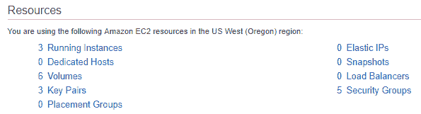
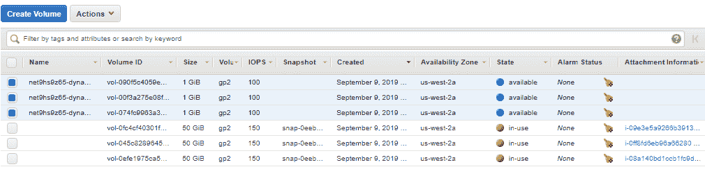
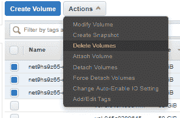
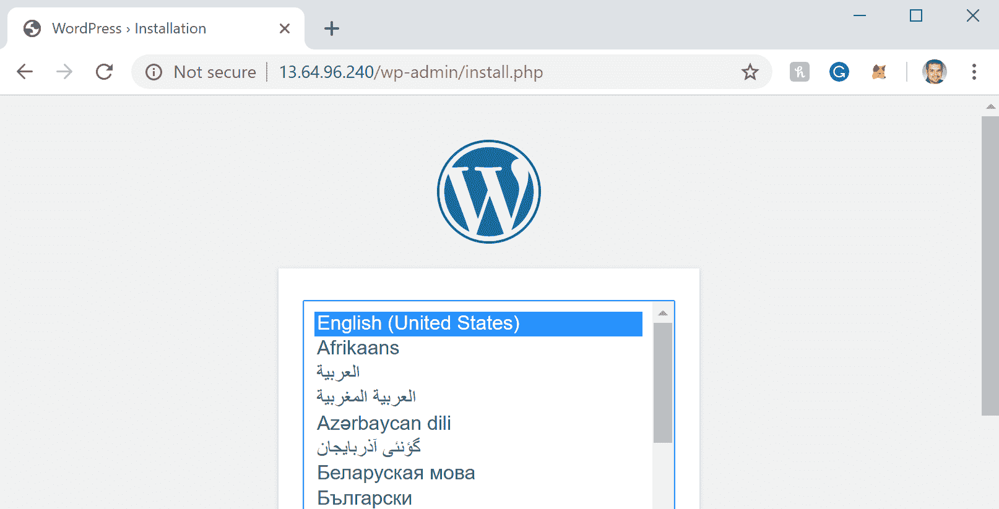
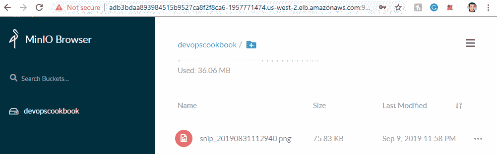

# 第五章：为有状态的工作负载做准备

在本章中，我们将讨论在 Kubernetes 上使用流行的开源存储解决方案，以及如何保护应用程序的状态免受节点或应用程序故障，并共享相同的数据，或者如何在 Pod 被重新调度到不同节点时处理重新附加卷。在本章的示例中，您将学会在自管理基础设施或私有云中使用块和文件存储选项的技能。

在本章中，我们将涵盖以下示例：

+   在 Kubernetes 中管理 Amazon EBS 卷

+   在 Kubernetes 中管理 GCE PD 卷

+   在 Kubernetes 中管理 Azure Disk 卷

+   使用 Rook 配置和管理持久存储

+   使用 OpenEBS 配置和管理持久存储

+   在 Kubernetes 上设置 NFS 共享存储

+   故障排除存储问题

# 技术要求

本节的示例假定您已根据第一章中描述的推荐方法之一部署了功能性 Kubernetes 集群，*构建生产就绪的 Kubernetes 集群*。

Kubernetes 的命令行工具`kubectl`将在本节的其余示例中使用，因为它是针对 Kubernetes 集群运行命令的主要命令行界面。我们还将使用`helm`在可用 helm 图表的情况下部署解决方案。

# 在 Kubernetes 中管理 Amazon EBS 卷

Amazon Elastic Block Store（Amazon EBS）为在 AWS 中使用的 Amazon EC2 实例提供持久的块级存储卷，这些实例用于`kops`创建的 Kubernetes 集群和 Amazon EKS 集群。在本节中，我们将为在 AWS 中运行的 Kubernetes 应用程序创建存储类。您将学习如何在 Kubernetes 中创建`StorageClass`资源，了解 EBS 卷类型性能差异的参数，并使用新的**容器存储接口**（**CSI**）来消耗 EBS 卷。

## 准备就绪

克隆`k8sdevopscookbook/src`存储库到您的工作站，以便能够使用`chapter5`目录下的清单文件：

```
$ git clone https://github.com/k8sdevopscookbook/src.git
$ cd chapter5
```

确保您已准备好一个 Kubernetes 集群，并配置了`kubectl`来管理集群资源。

## 如何做到… 

本节进一步细分为以下子节，以便促进流程：

+   创建 EBS 存储类

+   更改默认存储类

+   使用 EBS 卷进行持久存储

+   使用 EBS 存储类动态创建持久卷

+   删除 EBS 持久卷

+   安装 EBS CSI 驱动程序以管理 EBS 卷

### 创建 EBS 存储类

让我们执行以下步骤来学习构建 EBS 存储类所需的存储类参数，我们可以使用它来动态请求 AWS Cloud 中的新持久卷：

1.  创建一个基本的存储类，指定提供程序`kubernetes.io/aws-ebs`和类型`gp2`：

```
$ cat <<EOF | kubectl apply -f -
apiVersion: storage.k8s.io/v1
kind: StorageClass
metadata:
 name: aws-gp2
provisioner: kubernetes.io/aws-ebs
parameters:
 type: gp2
 fsType: ext4 
reclaimPolicy: Retain
allowVolumeExpansion: true
mountOptions:
 - debug
volumeBindingMode: Immediate
EOF
```

此处还接受其他类型值，包括`io1`、`sc1`和`st1`。您可以在*另请参阅*部分的 AWS EBS 卷类型链接中找到不同卷类型的定义和用例。

在 Amazon EKS 集群上，默认的 EBS 卷类型是`gp2`。对于数据库工作负载，如 MongoDB、Cassandra 和 PostgreSQL，建议使用`io1-type`高性能 SSD。

1.  列出存储类。确认列表中是否有新的`aws-gp2`。根据云提供商或 Kubernetes 部署工具，您可能会在列表中看到类似以下的其他存储类：

```
$ kubectl get sc
NAME                      PROVISIONER                    AGE
aws-gp2                   kubernetes.io/aws-ebs          8s
default                   kubernetes.io/aws-ebs          25h
gp2 (default)             kubernetes.io/aws-ebs          25h
openebs-hostpath          openebs.io/local               175m
openebs-jiva-default      openebs.io/provisioner-iscsi   175m
```

存储类是动态配置的基础。正如我们在示例中所看到的，您的集群中可能有多个存储类。理想情况下，存储类应该根据应用程序的需求创建，因为某些应用程序需要更快的卷，而其他应用程序可能会利用 Rook 和 OpenEBS 等解决方案提供的多可用区复制。

### 更改默认存储类

动态存储配置是扩展应用程序的关键部分。当未指定存储类时，Kubernetes 会使用默认选项。让我们执行以下步骤来将我们首选的存储类设置为默认选项：

1.  通过将`is-default-class`值设置为`true`，同时创建一个新的存储类并将其定义为默认存储类。我们的示例在此处使用`io1`卷类型，并将`iopsPerGB`限制为`10`。它还将`reclaimPolicy`设置为`Retain`，这意味着，如果用户删除相关的 PVC，卷将被保留（其他两个保留策略选项是`Recycle`和`Delete`）：

```
$ cat <<EOF | kubectl apply -f -
apiVersion: storage.k8s.io/v1
kind: StorageClass
metadata:
 name: aws-io1-slow
 annotations:
 storageclass.kubernetes.io/is-default-class: "true"
provisioner: kubernetes.io/aws-ebs
parameters:
 type: io1
 iopsPerGB: "10"
 fsType: ext4
reclaimPolicy: Retain
allowVolumeExpansion: true
EOF
```

1.  在创建存储类后更改现有存储类的状态之前，首先选择一个存储类：

```
$ kubectl get sc
NAME                   PROVISIONER           AGE
aws-gp2                kubernetes.io/aws-ebs 6m28s
aws-io1-slow (default) kubernetes.io/aws-ebs 4m29s
```

1.  让我们将现有的存储类`aws-io1-slow`设置为非默认选项：

```
$ kubectl patch storageclass aws-io1-slow -p '{"metadata": {"annotations":{"storageclass.kubernetes.io/is-default-class":"false"}}}'
```

1.  现在，再次将`aws-gp2`定义为默认存储类：

```
$ kubectl patch storageclass aws-gp2 -p '{"metadata": {"annotations":{"storageclass.kubernetes.io/is-default-class":"true"}}}'
```

1.  确认新的默认存储类：

```
$ kubectl get sc
NAME               PROVISIONER           AGE
aws-gp2 (default)  kubernetes.io/aws-ebs 10m
aws-io1-slow       kubernetes.io/aws-ebs 8m
```

确保始终只有一个默认存储类，否则没有定义存储类但期望默认存储类的 PVC 将失败。

### 使用 EBS 卷进行持久存储

作为创建 PVC 和动态创建卷的替代方案，您还可以手动创建卷并将其直接附加到您的应用程序作为持久卷，执行以下步骤：

1.  通过以下`aws` CLI 在与您的工作节点相同的区域创建 EBS 卷：

```
$ aws ec2 create-volume --availability-zone=us-west-2a --size=10 --volume-type=gp2
```

1.  使用您在*步骤 1*中创建的 EBS `volumeID` 部署一个测试应用程序：

```
$ cat <<EOF | kubectl apply -f -
apiVersion: v1
kind: Pod
metadata:
 name: test-server
spec:
 containers:
 - image: gcr.io/google_containers/test-webserver
 name: test-container
 volumeMounts:
 - mountPath: /test-ebs
 name: test-volume
 volumes:
 - name: test-volume
 awsElasticBlockStore:
 volumeID: vol-02f4bc9b938604f72
 fsType: ext4
EOF
```

1.  验证您的 pod 处于`Running`状态：

```
$ kubectl get pods
NAME        READY STATUS  RESTARTS AGE
test-server 1/1   Running 0        4m32s
```

手动创建持久卷（PV）的主要优势在于 PV 不附加到单个集群或命名空间。它们作为您 AWS 云账户上的资源存在，甚至可以跨集群共享，而动态创建的 PVC 只存在于创建的命名空间中，并且只能被同一命名空间内的 pod 使用。

### 使用 EBS 存储类动态创建持久卷

作为 StatefulSet 的一部分，`volumeClaimTemplates`可以使用您选择的`PersistentVolume`提供持久存储。在这个示例中，我们将使用 StorageClass 动态为您的应用程序创建 PV。让我们从以下步骤开始：

1.  在应用程序部署清单的`volumeClaimTemplates`部分下添加`aws-gp2`存储类行，类似于以下示例：

```
...
  volumeClaimTemplates:
  - metadata:
      name: datadir
      annotations:
        volume.beta.kubernetes.io/storage-class: aws-gp2
    spec:
      accessModes: [ "ReadWriteOnce" ]
      resources:
        requests:
          storage: 1G
...
```

1.  在这个示例中，我们将使用`aws-gp2`存储类部署 Redis StatefulSet。在执行之前，请查看示例存储库中`src/chapter5/aws`目录下的 YAML 清单：

```
$ cat aws/redis-statefulset.yml
```

1.  使用以下示例创建 Redis StatefulSet：

```
$ kubectl apply -f aws/redis-statefulset.yml
```

1.  验证已创建 pod。在这个示例中，我们的示例有带有三个副本的 StatefulSet。因此，您应该看到三个运行的副本，类似于以下输出：

```
$ kubectl get pods
NAME READY STATUS  RESTARTS AGE
rd-0 1/1   Running 0        9m9s
rd-1 1/1   Running 0        7m56s
rd-2 1/1   Running 0        6m47s
```

1.  列出已创建的 PVC 和 PV。您应该期望看到创建的三个 PVC 和三个 PV，类似于我们这里的示例输出：

```
$ kubectl get pvc,pv
NAME STATUS VOLUME CAPACITY ACCESS MODES STORAGECLASS AGE
datadir-rd-0 Bound pvc-8a538aa3-7382-4147-adde-1ea3dbaaafb4 1Gi RWO aws-gp2 10m
datadir-rd-1 Bound pvc-171fbee3-39bf-4450-961f-6c1417ff3897 1Gi RWO aws-gp2 9m1s
datadir-rd-2 Bound pvc-b40df89b-5349-4f02-8510-917012579746 1Gi RWO aws-gp2 7m52s$ 
NAME CAPACITY ACCESS MODES RECLAIM POLICY STATUS CLAIM STORAGECLASS REASON AGE
pvc-171fbee3-39bf-4450-961f-6c1417ff3897 1Gi RWO Retain Bound default/datadir-rd-1 aws-gp2 9m18s
pvc-8a538aa3-7382-4147-adde-1ea3dbaaafb4 1Gi RWO Retain Bound default/datadir-rd-0 aws-gp2 10m
pvc-b40df89b-5349-4f02-8510-917012579746 1Gi RWO Retain Bound default/datadir-rd-2 aws-gp2 8m10s
```

现在，您知道如何在部署中动态创建持久卷了。

### 删除 EBS 持久卷

当回收策略设置为保留卷时，需要通过以下步骤单独删除卷：

1.  请记住，删除您的工作负载不会删除 PVC 和 PV，除非 PVC 清单包含在清单中：

```
$ kubectl delete -f redis-statefulset.yml
```

1.  列出剩余的 PV：

```
$ kubectl get pv
NAME CAPACITY ACCESS MODES RECLAIM POLICY STATUS CLAIM STORAGECLASS REASON AGE
pvc-171fbee3-39bf-4450-961f-6c1417ff3897 1Gi RWO Retain Bound default/datadir-rd-1 aws-gp2 13m
pvc-8a538aa3-7382-4147-adde-1ea3dbaaafb4 1Gi RWO Retain Bound default/datadir-rd-0 aws-gp2 15m
pvc-b40df89b-5349-4f02-8510-917012579746 1Gi RWO Retain Bound default/datadir-rd-2 aws-gp2 12m
```

1.  删除 PVC。您可以通过在单个命令中添加它们的名称来一次删除多个 PVC，类似于以下内容：

```
$ kubectl delete pvc datadir-rd-0 datadir-rd-1 datadir-rd-2
```

1.  删除 PV。您可以通过在单个命令中添加它们的名称来一次删除多个 PV，类似于以下内容：

```
$ kubectl delete pv <pv-name-1> <pv-name-2> <pv-name-3>
```

尽管我们删除了 PVC 和 PV，但我们的 EBS 卷仍然保留。现在让我们也删除这些：

1.  打开您的 AWS 管理控制台，然后在“计算”选项下单击 EC2：



1.  在“资源”部分下，单击“卷”：



1.  选择可用且未使用的卷。从*使用 EBS 存储类创建动态持久卷*中，我们有三个未使用的卷：



1.  从“操作”下拉菜单中，选择“删除卷”：



我们已成功删除了与作为 Redis StatefulSet 资源的一部分创建的应用程序相关的所有存储资源。

### 安装 EBS CSI 驱动程序以管理 EBS 卷

Amazon EBS CSI 驱动程序提供了一个允许 Amazon EKS 集群简单管理 Amazon EBS 卷的生命周期的 Kubernetes CSI 接口。在本教程中，我们将学习如何通过以下步骤安装 EBS CSI 驱动程序：

1.  EBS CSI 与您的 AWS 卷通信，以按需创建卷。因此，它需要访问凭据。请在此处用您的 AWS 凭据替换`key_id`和`access_key`的值，并使用秘密资源配置 CSI 驱动程序权限：

```
$ cat <<EOF | kubectl apply -f -
apiVersion: v1
kind: Secret
metadata:
 name: aws-secret
 namespace: kube-system
stringData:
 key_id: "YOUR_KEY_ID_HERE"
 access_key: "YOUR_ACCESS_KEY_HERE"
EOF
```

1.  从其存储库位置部署 AWS EBS CSI 驱动程序。以下命令将创建 ClusterRoleBindings、CSI 控制器部署和将在每个工作节点上运行的`ebs-csi-node` DaemonSet：

```
$ kubectl apply -k "github.com/kubernetes-sigs/aws-ebs-csi-driver/deploy/kubernetes/overlays/stable/?ref=master"
```

1.  验证驱动程序是否正在运行：

```
$ kubectl get pods -n kube-system | grep ebs-csi
ebs-csi-controller-8579f977f4-ljfhm 4/4 Running 0 2m37s
ebs-csi-controller-8579f977f4-qw6ld 4/4 Running 0 2m37s
ebs-csi-node-5x8nh 3/3 Running 0 2m37s
ebs-csi-node-cfghj 3/3 Running 0 2m37s
ebs-csi-node-xp569 3/3 Running 0 2m37s
ebs-csi-node-z45hn 3/3 Running 0 2m37s
```

1.  现在，创建一个新的存储类，该存储类将使用`ebs.csi.aws.com`作为提供者：

```
$ cat <<EOF | kubectl apply -f -
kind: StorageClass
apiVersion: storage.k8s.io/v1
metadata:
 name: aws-csi-ebs
provisioner: ebs.csi.aws.com
volumeBindingMode: WaitForFirstConsumer
EOF
```

1.  创建 PVC：

```
$ cat <<EOF | kubectl apply -f -
apiVersion: v1
kind: PersistentVolumeClaim
metadata:
 name: csi-ebs-pvc
spec:
 accessModes:
 - ReadWriteOnce
 storageClassName: aws-csi-ebs
 resources:
 requests:
 storage: 4Gi
EOF
```

1.  创建一个将使用 PVC 并写入`/data/out.txt`文件的 pod：

```
$ cat <<EOF | kubectl apply -f -
apiVersion: v1
kind: Pod
metadata:
 name: app
spec:
 containers:
 - name: app
 image: centos
 command: ["/bin/sh"]
 args: ["-c", "while true; do echo $(date -u) >> /data/out.txt; sleep 5; done"]
 volumeMounts:
 - name: persistent-storage
 mountPath: /data
 volumes:
 - name: persistent-storage
 persistentVolumeClaim:
 claimName: csi-ebs-pvc
EOF
```

1.  验证我们的`mytestapp` pod 是否将数据写入卷：

```
$ kubectl exec -it mytestapp cat /data/out.txt
Mon Sep 9 17:40:25 UTC 2019
```

1.  通过使用以下命令删除 pod 和 PVC 来删除资源：

```
$ kubectl delete pod mytestapp && kubectl delete pvc csi-ebs-pvc
```

现在您知道如何使用 CSI 驱动程序来配置 EBS 卷。CSI 驱动程序提供了一个统一的接口来响应 Kubernetes 上的存储请求。只要驱动程序已安装并且具有驱动程序实现的功能，无论底层存储系统如何，用户都可以使用它。

## 另请参阅

+   AWS EBS 卷类型：[`docs.aws.amazon.com/AWSEC2/latest/UserGuide/EBSVolumeTypes.html`](https://docs.aws.amazon.com/AWSEC2/latest/UserGuide/EBSVolumeTypes.html)

+   AWS EBS CSI 驱动程序存储库：[`github.com/kubernetes-sigs/aws-ebs-csi-driver`](https://github.com/kubernetes-sigs/aws-ebs-csi-driver)

+   AWS EBS CSI 驱动程序文档：[`docs.aws.amazon.com/eks/latest/userguide/ebs-csi.html`](https://docs.aws.amazon.com/eks/latest/userguide/ebs-csi.html)

# 在 Kubernetes 中管理 GCE PD 卷

Google Cloud Platform（GCP）为 Google Kubernetes Engine（GKE）实例提供持久的块级存储卷。在本节中，我们将为在 GKE 中运行的 Kubernetes 应用程序创建存储类。您将学习在 Kubernetes 中创建 StorageClass 资源，了解 GCP PD 卷类型性能变化的参数，并使用新的 CSI。

## 准备工作

将`k8sdevopscookbook/src`存储库克隆到您的工作站：

```
$ git clone https://github.com/k8sdevopscookbook/src.git
$ cd src/chapter5
```

确保您有一个区域性的 GKE 集群准备就绪，并配置`kubectl`来管理集群资源。

## 操作步骤…

本节进一步细分为以下子节，以便进行操作：

+   创建 GCE 持久磁盘存储类

+   更改默认存储类

+   使用 GCE PD 卷进行持久存储

+   使用 GCE PD 存储类创建动态持久卷

+   删除 GCE PD 持久卷

+   安装 GCP Compute PD CSI 驱动程序来管理 PD 卷

### 创建 GCE 持久磁盘存储类

让我们执行以下步骤来学习存储类参数，以构建一个 GCE PD 存储类，我们可以用来动态请求新的持久卷：

1.  基于 GKE 的 Kubernetes 集群创建时会有默认的存储类。列出存储类如下：

```
$ kubectl get sc
NAME               PROVISIONER          AGE
standard (default) kubernetes.io/gce-pd 81s
```

1.  描述`standard`存储类：

```
$ kubectl describe sc standard
Name: standard
IsDefaultClass: Yes
Annotations: storageclass.beta.kubernetes.io/is-default-class=true
Provisioner: kubernetes.io/gce-pd
Parameters: type=pd-standard
AllowVolumeExpansion: <unset>
MountOptions: <none>
ReclaimPolicy: Delete
VolumeBindingMode: Immediate
Events: <none>
```

1.  创建基本的存储类，指定`kubernetes.io/gce-pd`的 provisioner 和`pd-standard`类型：

```
$ cat <<EOF | kubectl apply -f -
kind: StorageClass 
apiVersion: storage.k8s.io/v1 
metadata:
 name: gce-pd 
provisioner: kubernetes.io/gce-pd 
parameters:
 type: pd-standard
volumeBindingMode: WaitForFirstConsumer
allowedTopologies:
- matchLabelExpressions:
 - key: failure-domain.beta.kubernetes.io/zone
 values:
 - us-central1-a
 - us-central1-b
EOF
```

您可以在*GCE PD 卷类型*链接中找到不同卷类型的定义和用例，位于*另请参阅*部分。

在 GKE 集群上，默认的 PD 卷类型是`pd-standard`。对于 MongoDB、Cassandra 和 PostgreSQL 等数据库工作负载，建议使用`pd-ssd-type`高性能 SSD。

1.  列出存储类：

```
$ kubectl get sc
NAME                      PROVISIONER                    AGE
gce-pd                    kubernetes.io/gce-pd           3s
standard (default)        kubernetes.io/gce-pd           17m
```

GKE 带有一个名为`standard`的默认存储类。您的集群中可能有多个存储类。理想情况下，存储类应根据应用程序的要求创建，因为某些应用程序需要更快的卷，而其他应用程序可能利用其他解决方案提供的多可用区复制。

### 更改默认存储类

动态存储配置是扩展应用程序的关键部分。当 PVC 未指定存储类时，Kubernetes 将使用默认选项。让我们执行以下步骤，将我们首选的存储类设置为默认值：

1.  让我们创建一个新的存储类，并通过将`is-default-class`设置为`true`来同时将其定义为默认选项：

```
$ cat <<EOF | kubectl apply -f -
kind: StorageClass 
apiVersion: storage.k8s.io/v1 
metadata:
 name: gce-pd-ssd 
 annotations:
 storageclass.kubernetes.io/is-default-class: "true"
provisioner: kubernetes.io/gce-pd 
parameters:
 type: pd-ssd
reclaimPolicy: Retain
allowVolumeExpansion: true
volumeBindingMode: WaitForFirstConsumer
allowedTopologies:
- matchLabelExpressions:
 - key: failure-domain.beta.kubernetes.io/zone
 values:
 - us-central1-a
 - us-central1-b
EOF
```

1.  拥有多个默认存储类将会导致问题。您需要删除一个。要更改已创建的存储类的状态，请首先选择一个存储类：

```
$ kubectl get sc
NAME                 PROVISIONER AGE
gce-pd               kubernetes.io/gce-pd 3m52s
gce-pd-ssd (default) kubernetes.io/gce-pd 4s
standard (default)   kubernetes.io/gce-pd 21m
```

1.  让我们将`standard`和`gce-pd-ssd`存储类设置为非默认值：

```
$ kubectl patch storageclass standard -p '{"metadata": {"annotations":{"storageclass.beta.kubernetes.io/is-default-class":"false"}}}'
$ kubectl patch storageclass gce-pd-ssd -p '{"metadata": {"annotations":{"storageclass.kubernetes.io/is-default-class":"false"}}}'
```

1.  现在让我们再次将`gce-pd`定义为默认存储类：

```
$ kubectl patch storageclass gce-pd -p '{"metadata": {"annotations":{"storageclass.kubernetes.io/is-default-class":"true"}}}'
```

1.  确认新的默认存储类：

```
$ kubectl get sc
NAME             PROVISIONER          AGE
gce-pd (default) kubernetes.io/gce-pd 8m25s
gce-pd-ssd       kubernetes.io/gce-pd 4m37s
standard         kubernetes.io/gce-pd 25m
```

现在您已经学会了如何用新的存储类替换默认存储类。确保始终只有一个默认存储类；否则，没有定义存储类的 PVC 将失败。

### 使用 GCE PD 卷进行持久存储

作为创建 PVC 和动态创建卷的替代方案，您还可以手动创建卷，并将其直接附加到应用程序作为持久卷，观察以下步骤：

1.  在与工作节点相同的区域创建 GCE PD 卷：

```
$ gcloud beta compute disks create gce-disk-1 --region us-central1 --replica-zones us-central1-b,us-central1-c 
Created [https://www.googleapis.com/compute/beta/projects/devopscookbook/regions/us-central1/disks/gce-disk-1].
NAME       ZONE SIZE_GB TYPE        STATUS
gce-disk-1      500     pd-standard READY
```

1.  使用现有卷名`gce-disk-1`创建 PV：

```
$ cat <<EOF | kubectl apply -f -
apiVersion: v1
kind: PersistentVolume
metadata:
 name: gce-disk-1
spec:
 storageClassName: ""
 capacity:
 storage: 500G
 accessModes:
 - ReadWriteOnce
 gcePersistentDisk:
 pdName: gce-disk-1
 fsType: ext4
EOF
```

1.  使用 PV 名称`gce-disk-1`创建 PVC：

```
$ cat <<EOF | kubectl apply -f -
apiVersion: v1
kind: PersistentVolumeClaim
metadata:
 name: pvc-gcedisk1
spec:
 storageClassName: ""
 volumeName: gce-disk-1
 accessModes:
 - ReadWriteOnce
 resources:
 requests:
 storage: 500G
EOF
```

1.  使用您在*步骤 1*中创建的`volumeMounts`名称`gce-disk-1`部署测试应用程序。

```
$ cat <<EOF | kubectl apply -f -
apiVersion: v1
kind: Pod
metadata:
 name: test-server
spec:
 containers:
 - image: gcr.io/google_containers/test-webserver
 name: test-container
 volumeMounts:
 - mountPath: /test-ebs
 name: test-volume
 volumes:
 - name: test-volume
 persistentVolumeClaim:
 claimName: pvc-gcedisk1
EOF
```

1.  验证您的 pod 处于`Running`状态：

```
$ kubectl get pods
NAME        READY STATUS  RESTARTS AGE
test-server 1/1   Running 0        4m32s
```

手动创建 PV 的主要优势在于 PV 不附加到单个集群或命名空间。它们作为您的 GCP 帐户上的资源存在，甚至可以跨集群共享。另一方面，动态创建的 PVC 仅存在于创建的命名空间中，并且只能被同一命名空间内的 pod 使用。

### 使用 GCE PD 存储类创建动态持久卷

作为 StatefulSet 的一部分，`volumeClaimTemplates`可以使用您选择的`PersistentVolume`提供程序提供持久存储。在这个示例中，我们将使用 StorageClass 为您的应用程序动态创建 PV：

1.  在应用程序部署清单的`volumeClaimTemplates`部分下添加`gce-pd`存储类行，类似于以下示例：

```
...
 volumeClaimTemplates:
 - metadata:
 name: datadir
 annotations:
 volume.beta.kubernetes.io/storage-class: gce-pd
 spec:
 accessModes: [ "ReadWriteOnce" ]
 resources:
 requests:
 storage: 1G
...
```

1.  在这个示例中，我们将使用`gce-pd`存储类部署 Redis Statefulset。在执行之前，请查看示例存储库中`src/chapter5/gcp`目录下的 YAML 清单：

```
$ cat gcp/redis-statefulset.yml
```

1.  创建 Redis StatefulSet：

```
$ kubectl apply -f redis-statefulset.yml
```

1.  验证已创建了 Pod：

```
$ kubectl get pods
NAME READY STATUS  RESTARTS AGE
rd-0 1/1   Running 0        2m27s
rd-1 1/1   Running 0        81s
rd-2 0/1   Running 0        19s
```

1.  列出已创建的 PVC 和 PV：

```
$ kubectl get pvc, pv
NAME STATUS VOLUME CAPACITY ACCESS MODES STORAGECLASS AGE
datadir-rd-0 Bound pvc-3481b73c-d347-11e9-b514-42010a80005e 1Gi RWO gce-pd 3m1s
datadir-rd-1 Bound pvc-5b8cc2d6-d347-11e9-b514-42010a80005e 1Gi RWO gce-pd 115s
datadir-rd-2 Bound pvc-80d826b9-d347-11e9-b514-42010a80005e 1Gi RWO gce-pd 53s
NAME CAPACITY ACCESS MODES RECLAIM POLICY STATUS CLAIM STORAGECLASS REASON AGE
pvc-3481b73c-d347-11e9-b514-42010a80005e 1Gi RWO Delete Bound default/datadir-rd-0 gce-pd 3m16s
pvc-5b8cc2d6-d347-11e9-b514-42010a80005e 1Gi RWO Delete Bound default/datadir-rd-1 gce-pd 2m11s
pvc-80d826b9-d347-11e9-b514-42010a80005e 1Gi RWO Delete Bound default/datadir-rd-2 gce-pd 68s
```

现在您知道如何在应用程序部署的一部分动态创建 GCE PD 持久卷。

### 删除 GCE PD 持久卷

当回收策略设置为保留卷时，需要通过以下步骤单独删除它们：

1.  请记住，删除工作负载不会删除 PVC 和 PV，除非清单中包含 PVC 清单：

```
$ kubectl delete -f redis-statefulset.yml
statefulset.apps "rd" deleted
service "redis" deleted
```

1.  列出剩余的 PV：

```
$ kubectl get pv
NAME CAPACITY ACCESS MODES RECLAIM POLICY STATUS CLAIM STORAGECLASS REASON AGE
pvc-171fbee3-39bf-4450-961f-6c1417ff3897 1Gi RWO Retain Bound default/datadir-rd-1 aws-gp2 13m
pvc-8a538aa3-7382-4147-adde-1ea3dbaaafb4 1Gi RWO Retain Bound default/datadir-rd-0 aws-gp2 15m
pvc-b40df89b-5349-4f02-8510-917012579746 1Gi RWO Retain Bound default/datadir-rd-2 aws-gp2 12m
```

1.  删除 PVC。您可以通过在单个命令中添加它们的名称一次性删除多个 PVC，类似于以下内容：

```
$ kubectl delete pvc datadir-rd-0 datadir-rd-1 datadir-rd-2
```

我们已成功删除了与 Redis StatefulSet 资源一起创建的应用程序相关的所有存储资源。

### 安装 GCP Compute PD CSI 驱动程序来管理 PD 卷。

GCP Compute PD CSI 驱动程序提供了一个 Kubernetes CSI 接口，允许 GKE 集群简单地管理持久卷的 GKE 卷的生命周期。在这个示例中，我们将学习安装 GCP Compute PD CSI 驱动程序所需的步骤，通过以下步骤观察：

1.  克隆 GCP CSI 驱动程序项目：

```
$ git clone https://github.com/kubernetes-sigs/gcp-compute-persistent-disk-csi-driver.git
$ cd gcp-compute-persistent-disk-csi-driver/
```

1.  将`PROJECT`名称替换为您的 GCP 项目名称，在存储服务帐户私钥文件的位置设置`GCE_PD_SA_DIR`，并设置 GCP 服务帐户变量：

```
$ EXPORT PROJECT="DevOpsCookBook"
$ GCE_PD_SA_NAME=my-gce-pd-csi-sa 
$ GCE_PD_SA_DIR=/my/safe/credentials/directory 
$ ./deploy/setup-project.sh
```

1.  部署 GCP Compute PD CSI 驱动程序：

```
$ GCE_PD_SA_DIR=/my/safe/credentials/directory
$ GCE_PD_DRIVER_VERSION=stable
$ ./deploy/kubernetes/deploy-driver.sh
```

1.  验证驱动程序是否正在运行：

```
$ kubectl get pods -n kube-system | grep ebs-csi
csi-gce-pd-controller   4/4 Running 0 31s
csi-gce-pd-node-f8w8w   3/3 Running 0 31s
csi-gce-pd-node-g8qn5   3/3 Running 0 31s
csi-gce-pd-node-n2fhp   3/3 Running 0 31s
```

1.  现在，使用`pd.csi.storage.gke.io`提供程序创建一个新的区域性存储类：

```
$ cat <<EOF | kubectl apply -f -
apiVersion: storage.k8s.io/v1
kind: StorageClass
metadata:
 name: gcp-csi-pd
provisioner: pd.csi.storage.gke.io
parameters:
 type: pd-standard
 replication-type: regional-pd
volumeBindingMode: WaitForFirstConsumer
EOF
```

1.  创建 PVC：

```
$ cat <<EOF | kubectl apply -f -
apiVersion: v1
kind: PersistentVolumeClaim
metadata:
 name: csi-gcp-pd-pvc
spec:
 accessModes:
 - ReadWriteOnce
 storageClassName: gcp-csi-pd
 resources:
 requests:
 storage: 4Gi
EOF
```

1.  创建一个将使用 PVC 并写入`/data/out.txt`文件的 Pod：

```
$ cat <<EOF | kubectl apply -f -
apiVersion: v1
kind: Pod
metadata:
 name: mytestapp
spec:
 containers:
 - name: app
 image: centos
 command: ["/bin/sh"]
 args: ["-c", "while true; do echo $(date -u) >> /data/out.txt; sleep 5; done"]
 volumeMounts:
 - name: persistent-storage
 mountPath: /data
 volumes:
 - name: persistent-storage
 persistentVolumeClaim:
 claimName: csi-gcp-pd-pvc
EOF
```

1.  验证我们的`mytestapp` Pod 是否将数据写入卷：

```
$ kubectl exec -it mytestapp cat /data/out.txt
Mon Sep 9 18:20:38 UTC 2019
```

1.  删除资源：

```
$ kubectl delete pod mytestapp && kubectl delete pvc csi-gcp-pd-pvc 
```

现在您知道如何利用 CSI 驱动程序在 GKE 集群上部署 GCE PD 卷。

## 它是如何工作的...

本食谱向您展示了如何使用 Kubernetes 存储类、PVC 和 PV 概念快速提供动态持久卷。

在*创建 GCP 持久磁盘存储类*食谱中，在*步骤 3*中，您使用`allowedTopologies`参数创建了`gce-pd`存储类，并设置了两个 GKE 区域，`us-central1-a`和`us-central1-b`。

当在存储类中定义了`allowedTopologies`时，GCP 会创建一个区域性持久磁盘，并在同一区域的两个区域之间复制数据，以提高可用性。

使用此选项创建的卷也会以类似于此处标签的方式进行标记：`failure-domain.beta.kubernetes.io/region : us-central1`和`failure-domain.beta.kubernetes.io/region : us-central1-a`

区域性 PD 有助于在区域性故障中存活。在这种情况下，您的 Kubernetes 集群将使用卷故障转移工作负载到另一个区域。

在构建高可用状态工作负载的 GKE 集群上，建议使用此选项。

## 另请参阅

+   GCE PD 类型：[`cloud.google.com/persistent-disk/`](https://cloud.google.com/persistent-disk/)

+   GCE PD CSI 驱动程序存储库：[`github.com/kubernetes-sigs/gcp-compute-persistent-disk-csi-driver`](https://github.com/kubernetes-sigs/gcp-compute-persistent-disk-csi-driver)

# 在 Kubernetes 中管理 Azure Disk 卷

Azure Cloud 为与**Azure Kubernetes Engine**（**AKS**）一起使用的持久块级存储卷提供支持。在本节中，我们将为在 AKS 中运行的 Kubernetes 应用程序创建存储类。您将学习如何在 Kubernetes 中创建 StorageClass 资源，了解 Azure Disk 卷类型性能变化的参数，以及如何使用新的 CSI。

## 准备就绪

克隆`k8sdevopscookbook/src`存储库到您的工作站，以便使用`chapter5`目录下的清单文件：

```
$ git clone https://github.com/k8sdevopscookbook/src.git
$ cd src/chapter5
```

确保您有一个区域性的 GKE 集群，并配置`kubectl`来管理集群资源。

## 如何做…

本节进一步细分为以下子节，以便促进流程：

+   创建 Azure Disk 存储类

+   将默认存储类更改为 ZRS

+   使用 Azure Disk 存储类创建动态 PV

+   删除 Azure Disk 持久卷

+   安装 Azure Disk CSI 驱动程序

### 创建 Azure Disk 存储类

让我们执行以下步骤，以了解构建 Azure 磁盘存储类所需的存储类参数，我们可以使用这些参数从 AKS 动态请求新的持久卷：

1.  基于 AKS 的 Kubernetes 集群默认创建两个本地冗余（LRS）存储类。让我们列出 AKS 集群上的存储类：

```
$ kubectl get sc
NAME PROVISIONER AGE
default (default) kubernetes.io/azure-disk 13m
managed-premium kubernetes.io/azure-disk 13m
```

1.  描述`default`存储类：

```
$ kubectl describe sc default
Name: default
IsDefaultClass: Yes
...
Provisioner: kubernetes.io/azure-disk
Parameters: cachingmode=ReadOnly,kind=Managed,storageaccounttype=Standard_LRS
AllowVolumeExpansion: <unset>
MountOptions: <none>
ReclaimPolicy: Delete
VolumeBindingMode: Immediate
Events: <none>
```

1.  使用提供程序`kubernetes.io/azure-disk`和指定`Standard_ZRS` skuName 创建区域冗余存储类：

```
$ cat <<EOF | kubectl apply -f -
kind: StorageClass
apiVersion: storage.k8s.io/v1
metadata:
 name: azure-zrs
provisioner: kubernetes.io/azure-disk
parameters:
 storageaccounttype: Standard_ZRS
 kind: Shared
reclaimPolicy: Retain
allowVolumeExpansion: true
volumeBindingMode: Immediate
EOF
```

您可以在“Azure 磁盘卷类型”链接中找到不同卷类型的定义和用例。

在 Azure 云集群上，默认的 Azure 磁盘卷类型是`Standard_LRS`。对于数据库工作负载，如 MongoDB、Cassandra 和 PostgreSQL，建议使用`Premium_LRS`类型的高性能 SSD。

1.  列出存储类：

```
$ kubectl get sc
NAME              PROVISIONER              AGE
azure-zrs         kubernetes.io/azure-disk 4s
default (default) kubernetes.io/azure-disk 18m
managed-premium   kubernetes.io/azure-disk 18m
```

如您在我们的示例中所见，AKS 集群配备了两个预定义的存储类。

### 将默认存储类更改为 ZRS

动态存储配置是扩展应用程序的关键部分。当 PVC 未指定存储类时，Kubernetes 使用默认选项。让我们执行以下步骤，将我们首选的存储类设置为默认值：

1.  将现有的`default`存储类设置为非默认选项：

```
$ kubectl patch storageclass default -p '{"metadata": {"annotations":{"storageclass.beta.kubernetes.io/is-default-class":"false"}}}'
```

1.  现在，再次将`azure-zrs`定义为默认存储类：

```
$ kubectl patch storageclass azure-zrs -p '{"metadata": {"annotations":{"storageclass.kubernetes.io/is-default-class":"true"}}}'
```

1.  确认新的默认存储类。您应该看到新的`azure-zrs`作为默认值，类似于以下输出：

```
$ kubectl get sc
NAME                PROVISIONER AGE
azure-zrs (default) kubernetes.io/azure-disk 4m38s
default             kubernetes.io/azure-disk 23m
managed-premium     kubernetes.io/azure-disk 23m
```

现在您知道如何在 AKS 集群上将首选的存储类设置为默认值。

### 使用 Azure 磁盘存储类创建动态 PV

作为 StatefulSet 的一部分，`volumeClaimTemplates`可以使用您选择的`PersistentVolume`提供程序提供的`PersistentVolumes`来提供持久存储。在这个示例中，我们将使用 Azure 存储类为您的应用程序动态创建 PV：

1.  在应用程序部署清单的`volumeClaimTemplates`部分下添加`azure-zrs`存储类行，类似于以下示例：

```
...
  volumeClaimTemplates:
  - metadata:
      name: datadir
      annotations:
        volume.beta.kubernetes.io/storage-class: azure-zrs
    spec:
      accessModes: [ "ReadWriteOnce" ]
      resources:
        requests:
          storage: 1G
...
```

1.  在这个示例中，我们将使用`azure-zrs`存储类部署 Redis Statefulset。在执行之前，请查看示例存储库中`src/chapter5/azure`目录下的 YAML 清单：

```
$ cat azure/redis-statefulset.yml
```

1.  创建 Redis StatefulSet：

```
$ kubectl apply -f redis-statefulset.yml
```

1.  验证已创建 Pod。在这个示例中，我们的示例有三个副本的 StatefulSet。因此，您应该看到三个副本正在运行，类似于以下输出：

```
$ kubectl get pods
NAME READY STATUS  RESTARTS AGE
rd-0 1/1   Running 0        6m24s
rd-1 1/1   Running 0        4m14s
rd-2 1/1   Running 0        2m13s
```

1.  列出创建的 PVC 和 PV。您应该期望看到创建了三个 PVC 和三个 PV，类似于我们这里的示例输出：

```
$ kubectl get pvc, pv
NAME STATUS VOLUME CAPACITY ACCESS MODES STORAGECLASS AGE
datadir-rd-0 Bound pvc-afaafb97-d376-11e9-88a2-a2c82783dcda 1Gi RWO azure-zrs 4m31s
datadir-rd-1 Bound pvc-fc9f3a35-d376-11e9-88a2-a2c82783dcda 1Gi RWO azure-zrs 2m22s
datadir-rd-2 Bound pvc-453d185d-d377-11e9-88a2-a2c82783dcda 1Gi RWO azure-zrs 20s
NAME CAPACITY ACCESS MODES RECLAIM POLICY STATUS CLAIM STORAGECLASS REASON AGE
pvc-453d185d-d377-11e9-88a2-a2c82783dcda 1Gi RWO Delete Bound default/datadir-rd-2 azure-zrs 22s
pvc-afaafb97-d376-11e9-88a2-a2c82783dcda 1Gi RWO Delete Bound default/datadir-rd-0 azure-zrs 4m42s
pvc-fc9f3a35-d376-11e9-88a2-a2c82783dcda 1Gi RWO Delete Bound default/datadir-rd-1 azure-zrs 2m38s
```

现在您知道如何在 AKS 集群上动态创建持久卷作为应用程序部署的一部分。

### 删除 Azure 磁盘持久卷

当回收策略设置为保留卷时，需要按照以下步骤单独删除卷：

1.  请记住，除非 PVC 清单包含在清单中，否则删除工作负载不会删除 PVC 和 PV：

```
$ kubectl delete -f redis-statefulset.yml
statefulset.apps "rd" deleted
service "redis" deleted
```

1.  列出剩余的 PV：

```
$ kubectl get pv
NAME CAPACITY ACCESS MODES RECLAIM POLICY STATUS CLAIM STORAGECLASS REASON AGE
pvc-171fbee3-39bf-4450-961f-6c1417ff3897 1Gi RWO Retain Bound default/datadir-rd-1 aws-gp2 13m
pvc-8a538aa3-7382-4147-adde-1ea3dbaaafb4 1Gi RWO Retain Bound default/datadir-rd-0 aws-gp2 15m
pvc-b40df89b-5349-4f02-8510-917012579746 1Gi RWO Retain Bound default/datadir-rd-2 aws-gp2 12m
```

1.  删除 PVC。您可以通过将它们的名称添加到单个命令中一次删除多个 PVC，类似于以下操作：

```
$ kubectl delete pvc datadir-rd-0 datadir-rd-1 datadir-rd-2
```

我们现在已成功删除了与 Redis StatefulSet 资源的创建相关的应用程序的所有存储资源。

### 安装 Azure Disk CSI 驱动程序

Azure Disk CSI 驱动程序提供了一个 Kubernetes CSI，允许 AKS 集群简单地管理 Azure 磁盘卷的生命周期，用于持久卷。在这个教程中，我们将学习安装 Azure Disk CSI 驱动程序所需的步骤，观察以下步骤：

1.  部署 Azure Disk CSI 驱动程序：

```
$ kubectl apply -f https://raw.githubusercontent.com/kubernetes-sigs/azuredisk-csi-driver/master/deploy/crd-csi-driver-registry.yaml
$ kubectl apply -f https://raw.githubusercontent.com/kubernetes-sigs/azuredisk-csi-driver/master/deploy/crd-csi-node-info.yaml
$ kubectl apply -f https://raw.githubusercontent.com/kubernetes-sigs/azuredisk-csi-driver/master/deploy/rbac-csi-azuredisk-controller.yaml
$ kubectl apply -f https://raw.githubusercontent.com/kubernetes-sigs/azuredisk-csi-driver/master/deploy/csi-azuredisk-controller.yaml
$ kubectl apply -f https://raw.githubusercontent.com/kubernetes-sigs/azuredisk-csi-driver/master/deploy/csi-azuredisk-node.yaml
```

1.  验证驱动程序正在运行控制器，并且`azuredisk-node` DaemonSet 正在运行：

```
$ kubectl get po -o wide -n kube-system | grep csi-azuredisk
csi-azuredisk-controller-9bc7f4d77-cbgxs 6/6 Running 0 5m31s 10.244.2.4 aks-agentpool-40109510-2 <none> <none>
csi-azuredisk-node-7kqzm 3/3 Running 0 5m27s 10.240.0.5 aks-agentpool-40109510-1 <none> <none>
csi-azuredisk-node-gm6dr 3/3 Running 0 5m27s 10.240.0.4 aks-agentpool-40109510-2 <none> <none>
csi-azuredisk-node-wqsls 3/3 Running 0 5m27s 10.240.0.6 aks-agentpool-40109510-0 <none> <none>
```

1.  现在，创建一个新的存储类：

```
$ cat <<EOF | kubectl apply -f -
apiVersion: storage.k8s.io/v1
kind: StorageClass
metadata:
 name: disk.csi.azure.com
provisioner: disk.csi.azure.com
parameters:
 skuname: Standard_LRS 
 kind: managed 
 cachingMode: ReadOnly
reclaimPolicy: Delete
volumeBindingMode: Immediate
EOF
```

1.  使用存储类名称`disk.csi.azure.com`创建 PVC：

```
cat <<EOF | kubectl apply -f -
apiVersion: v1
kind: PersistentVolumeClaim
metadata:
 name: csi-azure-pvc
spec:
 accessModes:
 - ReadWriteOnce
 storageClassName: disk.csi.azure.com
 resources:
 requests:
 storage: 4Gi
EOF
```

1.  创建一个将使用`csi-azure-pvc` PVC 并写入`/data/out.txt`文件的 pod：

```
$ cat <<EOF | kubectl apply -f -
apiVersion: v1
kind: Pod
metadata:
 name: mytestapp
spec:
 containers:
 - name: app
 image: centos
 command: ["/bin/sh"]
 args: ["-c", "while true; do echo $(date -u) >> /data/out.txt; sleep 5; done"]
 volumeMounts:
 - name: persistent-storage
 mountPath: /data
 volumes:
 - name: persistent-storage
 persistentVolumeClaim:
 claimName: csi-azure-pvc
EOF
```

1.  验证我们的`mytestapp` pod 是否将数据写入卷：

```
$ kubectl exec -it mytestapp cat /data/out.txt
Mon Sep 9 19:23:29 UTC 2019
```

现在您知道如何在 AKS 集群上使用 Azure Disk CSI 驱动程序来提供持久卷。

## 参见

+   Azure 磁盘卷类型：[`azure.microsoft.com/en-us/pricing/details/managed-disks/`](https://azure.microsoft.com/en-us/pricing/details/managed-disks/)

+   AWS EBS CSI 驱动程序存储库：[`github.com/kubernetes-sigs/azuredisk-csi-driver`](https://github.com/kubernetes-sigs/azuredisk-csi-driver)

# 使用 Rook 配置和管理持久存储

Rook 是一个面向 Kubernetes 的云原生开源存储编排器。Rook 在 Kubernetes 中提供自管理、自扩展和自愈的分布式存储系统。在本节中，我们将使用 Rook 存储编排器为 Kubernetes 中的应用程序创建多个存储提供程序。您将学习为需要持久存储的有状态应用程序创建 Ceph 提供程序。

## 准备工作

确保你已经准备好一个 Kubernetes 集群，并且`kubectl`已配置好以管理集群资源。

## 如何做…

这一部分进一步细分为以下子部分，以便进行流程：

+   使用 Rook 安装 Ceph 提供程序

+   创建一个 Ceph 集群

+   验证 Ceph 集群的健康状态

+   创建一个 Ceph 块存储类

+   使用 Ceph 块存储类创建动态 PVs

### 使用 Rook 安装 Ceph 提供程序

让我们执行以下步骤，使用 Rook 项目来运行 Ceph 扩展存储解决方案：

1.  克隆 Rook 存储库：

```
$ git clone https://github.com/rook/rook.git
$ cd rook/cluster/examples/kubernetes/ceph/
```

1.  部署 Rook Operator：

```
$ kubectl create -f common.yaml 
$ kubectl create -f operator.yaml 
```

1.  验证 Rook Operator：

```
$ kubectl get pod -n rook-ceph
NAME                                READY STATUS  RESTARTS AGE
rook-ceph-operator-6b66859964-vnrfx 1/1   Running 0        2m12s
rook-discover-8snpm                 1/1   Running 0        97s
rook-discover-mcx9q                 1/1   Running 0        97s
rook-discover-mdg2s                 1/1   Running 0        97s
```

现在你已经学会了如何在 Kubernetes 上运行 Ceph 提供程序的 Rook 编排组件。

### 创建一个 Ceph 集群

让我们执行以下步骤，使用 Rook Operator 部署 Ceph 集群：

1.  创建一个 Ceph 集群：

```
$ cat <<EOF | kubectl apply -f -
apiVersion: ceph.rook.io/v1
kind: CephCluster
metadata:
 name: rook-ceph
 namespace: rook-ceph
spec:
 cephVersion:
 image: ceph/ceph:v14.2.3-20190904
 dataDirHostPath: /var/lib/rook
 mon:
 count: 3
 dashboard:
 enabled: true
 storage:
 useAllNodes: true
 useAllDevices: false
 directories:
 - path: /var/lib/rook
EOF
```

1.  验证所有的 pod 是否正在运行：

```
$ kubectl get pod -n rook-ceph
```

在一分钟内，一个完全功能的 Ceph 集群将被部署并准备好使用。你可以在*参见*部分的*Rook Ceph 存储文档*链接中了解更多关于 Ceph 的信息。

### 验证 Ceph 集群的健康状态

Rook 工具箱是一个包含常用工具的容器，用于 Rook 调试和测试。让我们执行以下步骤来部署 Rook 工具箱以验证集群健康状态：

1.  部署 Rook 工具箱：

```
$ kubectl apply -f toolbox.yaml
```

1.  验证工具箱是否正在运行：

```
$ kubectl -n rook-ceph get pod -l "app=rook-ceph-tools"
NAME                             READY STATUS  RESTARTS AGE
rook-ceph-tools-6fdfc54b6d-4kdtm 1/1   Running 0        109s
```

1.  连接到工具箱：

```
$ kubectl -n rook-ceph exec -it $(kubectl -n rook-ceph get pod -l "app=rook-ceph-tools" -o jsonpath='{.items[0].metadata.name}') bash
```

1.  验证集群是否处于健康状态（`HEALTH_OK`）：

```
# ceph status
 cluster:
 id: 6b6e4bfb-bfef-46b7-94bd-9979e5e8bf04
 health: HEALTH_OK
 services:
 mon: 3 daemons, quorum a,b,c (age 12m)
 mgr: a(active, since 12m)
 osd: 3 osds: 3 up (since 11m), 3 in (since 11m)
 data:
 pools: 0 pools, 0 pgs
 objects: 0 objects, 0 B
 usage: 49 GiB used, 241 GiB / 291 GiB avail
 pgs:
```

1.  当你完成故障排除后，使用以下命令删除部署：

```
$ kubectl -n rook-ceph delete deployment rook-ceph-tools
```

现在你知道如何部署 Rook 工具箱及其常用工具，用于调试和测试 Rook。

### 创建一个 Ceph 块存储类

让我们执行以下步骤，为 Ceph 存储创建一个存储类：

1.  创建`CephBlockPool`：

```
$ cat <<EOF | kubectl apply -f -
apiVersion: ceph.rook.io/v1
kind: CephBlockPool
metadata:
 name: replicapool
 namespace: rook-ceph
spec:
 failureDomain: host
 replicated:
 size: 3
EOF
```

1.  创建一个 Rook Ceph 块存储类：

```
$ cat <<EOF | kubectl apply -f -
apiVersion: storage.k8s.io/v1
kind: StorageClass
metadata:
 name: rook-ceph-block
provisioner: rook-ceph.rbd.csi.ceph.com
parameters:
 clusterID: rook-ceph
 pool: replicapool
 imageFormat: "2"
 imageFeatures: layering
 csi.storage.k8s.io/provisioner-secret-name: rook-ceph-csi
 csi.storage.k8s.io/provisioner-secret-namespace: rook-ceph
 csi.storage.k8s.io/node-stage-secret-name: rook-ceph-csi
 csi.storage.k8s.io/node-stage-secret-namespace: rook-ceph
 csi.storage.k8s.io/fstype: xfs
reclaimPolicy: Delete
EOF
```

1.  确认存储类已创建：

```
$ kubectl get sc
NAME              PROVISIONER                AGE
default (default) kubernetes.io/azure-disk   6h27m
rook-ceph-block   rook-ceph.rbd.csi.ceph.com 3s
```

从前面的提供者名称`rook-ceph.rbd.csi.ceph.com`可以看出，Rook 还使用 CSI 与 Kubernetes API 进行交互。该驱动程序针对 RWO pod 访问进行了优化，其中只有一个 pod 可以访问存储。

### 使用 Ceph 块存储类创建动态 PVs

在这个示例中，我们将使用 Rook Ceph 块存储提供程序创建动态持久卷来部署 Wordpress。让我们执行以下步骤：

1.  克隆示例存储库：

```
$ git clone https://github.com/k8sdevopscookbook/src.git
$ cd src/chapter5/rook/
```

1.  查看`mysql.yaml`和`wordpress.yaml`。注意 PVC 正在使用`rook-ceph-block`存储类：

```
$ cat mysql.yaml && cat wordpress.yaml
```

1.  部署 MySQL 和 WordPress：

```
$ kubectl apply -f mysql.yaml 
$ kubectl apply -f wordpress.yaml
```

1.  确认已创建持久卷：

```
$ kubectl get pv
NAME CAPACITY ACCESS MODES RECLAIM POLICY STATUS CLAIM STORAGECLASS REASON AGE
pvc-eb2d23b8-d38a-11e9-88a2-a2c82783dcda 20Gi RWO Delete Bound default/mysql-pv-claim rook-ceph-block 38s
pvc-eeab1ebc-d38a-11e9-88a2-a2c82783dcda 20Gi RWO Delete Bound default/wp-pv-claim rook-ceph-block 38s
```

1.  获取 WordPress 服务的外部 IP：

```
$ kubectl get service
NAME            TYPE         CLUSTER-IP  EXTERNAL-IP  PORT(S)      AGE
kubernetes      ClusterIP    10.0.0.1    <none>       443/TCP      6h34m
wordpress       LoadBalancer 10.0.102.14 13.64.96.240 80:30596/TCP 3m36s
wordpress-mysql ClusterIP    None        <none>       3306/TCP     3m42s
```

1.  在浏览器中打开 WordPress 服务的外部 IP 以访问您的 WordPress 部署：



现在您知道如何获取流行的 WordPress 服务，并在基于 Rook 的 Ceph 存储上存储持久存储。

## 另请参阅

+   Rook 文档：[`rook.io/docs/rook/master/`](https://rook.io/docs/rook/master/)

+   Rook Ceph 存储文档：[`rook.io/docs/rook/master/ceph-storage.html`](https://rook.io/docs/rook/master/ceph-storage.html)

+   Rook 社区 slack 频道：[`slack.rook.io/`](https://slack.rook.io/)

# 使用 OpenEBS 配置和管理持久存储

OpenEBS 是一个受欢迎的开源、云原生存储（CNS）项目，拥有庞大的社区。在本节中，我们将安装 OpenEBS 持久存储提供程序。您将学习如何在 Kubernetes 上为有状态工作负载使用不同类型的存储引擎选项创建卷。

## 准备工作

对于这个步骤，我们需要安装`helm`和`kubectl`。确保您已经准备好一个 Kubernetes 集群，并且`kubectl`配置好以管理集群资源。

## 操作步骤

本节进一步细分为以下子节，以便促进流程：

+   安装 iSCSI 客户端先决条件

+   安装 OpenEBS

+   使用临时存储创建持久卷

+   创建存储池

+   创建 OpenEBS 存储类

+   使用 OpenEBS 存储类创建动态 PV

### 安装 iSCSI 客户端先决条件

OpenEBS 存储提供程序要求 iSCSI 客户端在所有工作节点上运行：

1.  在所有工作节点上，按照安装和启用`open-iscsi`的步骤进行操作：

```
$ sudo apt-get update && sudo apt-get install open-iscsi && sudo service open-iscsi restart
```

1.  验证 iSCSI 服务是否在运行：

```
$ systemctl status iscsid
● iscsid.service - iSCSI initiator daemon (iscsid)
 Loaded: loaded (/lib/systemd/system/iscsid.service; enabled; vendor preset: enabled)
 Active: active (running) since Sun 2019-09-08 07:40:43 UTC; 7s ago
 Docs: man:iscsid(8)
```

1.  如果服务状态显示为非活动状态，则启用并启动 iscsid 服务：

```
$ sudo systemctl enable iscsid && sudo systemctl start iscsid
```

安装 iSCSI 服务后，您可以在集群上安装 OpenEBS。

### 安装 OpenEBS

让我们执行以下步骤，快速安装 OpenEBS 控制平面：

1.  使用运算符安装 OpenEBS 服务：

```
$ kubectl apply -f https://openebs.github.io/charts/openebs-operator.yaml
```

1.  确认所有 OpenEBS pod 都在运行：

```
$ kubectl get pods --namespace openebs
NAME                                        READY STATUS  RESTARTS AGE
maya-apiserver-dcbc87f7f-k99fz              0/1   Running 0        88s
openebs-admission-server-585c6588d-j29ng    1/1   Running 0        88s
openebs-localpv-provisioner-cfbd49877-jzjxl 1/1   Running 0        87s
openebs-ndm-fcss7                           1/1   Running 0        88s
openebs-ndm-m4qm5                           1/1   Running 0        88s
openebs-ndm-operator-bc76c6ddc-4kvxp        1/1   Running 0        88s
openebs-ndm-vt76c                           1/1   Running 0        88s
openebs-provisioner-57bbbd888d-jb94v        1/1   Running 0        88s
openebs-snapshot-operator-7dd598c655-2ck74  2/2   Running 0        88s
```

OpenEBS 由以下核心组件组成。Node Disk Manager (NDM)是 OpenEBS 的重要组成部分之一，负责检测磁盘更改，并作为 DaemonSet 在您的工作节点上运行。

### 使用临时存储创建持久卷

OpenEBS 目前提供三种存储引擎选项（Jiva、cStor 和 LocalPV）。第一个存储引擎选项`Jiva`可以在临时存储之上创建复制存储。让我们执行以下步骤来使用临时存储配置存储：

1.  列出默认存储类：

```
$ kubectl get sc
NAME                      PROVISIONER                                              AGE
openebs-device            openebs.io/local                                         25m
openebs-hostpath          openebs.io/local                                         25m
openebs-jiva-default      openebs.io/provisioner-iscsi                             25m
openebs-snapshot-promoter volumesnapshot.external-storage.k8s.io/snapshot-promoter 25m
```

1.  描述`openebs-jiva-default`存储类：

```
$ kubectl describe sc openebs-jiva-default
Name: openebs-jiva-default
IsDefaultClass: No
Annotations: cas.openebs.io/config=- name: ReplicaCount
 value: "3"
- name: StoragePool
 value: default
```

1.  使用`openebs-jiva-default`创建持久卷声明：

```
$ cat <<EOF | kubectl apply -f -
kind: PersistentVolumeClaim
apiVersion: v1
metadata:
 name: demo-vol1-claim
spec:
 storageClassName: openebs-jiva-default
 accessModes:
 - ReadWriteOnce
 resources:
 requests:
 storage: 5G
EOF
```

1.  确认 PVC 状态为`BOUND`：

```
$ kubectl get pvc
NAME STATUS VOLUME CAPACITY ACCESS MODES STORAGECLASS AGE
demo-vol1-claim Bound pvc-cb7485bc-6d45-4814-adb1-e483c0ebbeb5 5G RWO openebs-jiva-default 4s
```

1.  现在，使用 PVC 动态提供持久卷：

```
$ kubectl apply -f https://raw.githubusercontent.com/openebs/openebs/master/k8s/demo/percona/percona-openebs-deployment.yaml
```

1.  现在列出 Pod，并确保您的工作负载、OpenEBS 控制器和副本都处于运行状态：

```
$ kubectl get pods
NAME                                                          READY STATUS  RESTARTS AGE
percona-767db88d9d-2s8np                                      1/1   Running 0        75s
pvc-cb7485bc-6d45-4814-adb1-e483c0ebbeb5-ctrl-54d7fd794-s8svt 2/2   Running 0        2m23s
pvc-cb7485bc-6d45-4814-adb1-e483c0ebbeb5-rep-647458f56f-2b9q4 1/1   Running 1        2m18s
pvc-cb7485bc-6d45-4814-adb1-e483c0ebbeb5-rep-647458f56f-nkbfq 1/1   Running 0        2m18s
pvc-cb7485bc-6d45-4814-adb1-e483c0ebbeb5-rep-647458f56f-x7s9b 1/1   Running 0        2m18s
```

现在您知道如何为 Kubernetes 上的有状态应用程序配置高可用的云原生存储。

### 创建存储池

在这个示例中，我们将使用附加到您的节点的原始块设备来创建存储池。这些设备可以是 AWS EBS 卷、GCP PD、Azure 磁盘、虚拟磁盘或 vSAN 卷。设备可以附加到您的工作节点 VM，或者如果您使用裸金属 Kubernetes 集群，则可以是基本物理磁盘。让我们执行以下步骤来从原始块设备创建存储池：

1.  列出节点上未使用和未声明的块设备：

```
$ kubectl get blockdevices -n openebs
NAME NODENAME SIZE CLAIMSTATE STATUS AGE
blockdevice-24d9b7652893384a36d0cc34a804c60c ip-172-23-1-176.us-west-2.compute.internal 107374182400 Unclaimed Active 52s
blockdevice-8ef1fd7e30cf0667476dba97975d5ac9 ip-172-23-1-25.us-west-2.compute.internal 107374182400 Unclaimed Active 51s
blockdevice-94e7c768ef098a74f3e2c7fed6d82a5f ip-172-23-1-253.us-west-2.compute.internal 107374182400 Unclaimed Active 52s
```

在我们的示例中，我们在 AWS EC2 上有一个三节点的 Kubernetes 集群，每个节点附加了一个额外的 EBS 卷。

1.  使用未声明的设备从*步骤 1*创建存储池：

```
$ cat <<EOF | kubectl apply -f -
apiVersion: openebs.io/v1alpha1
kind: StoragePoolClaim
metadata:
 name: cstor-disk-pool
 annotations:
 cas.openebs.io/config: |
 - name: PoolResourceRequests
 value: |-
 memory: 2Gi
 - name: PoolResourceLimits
 value: |-
 memory: 4Gi
spec:
 name: cstor-disk-pool
 type: disk
 poolSpec:
 poolType: striped
 blockDevices:
 blockDeviceList:
 - blockdevice-24d9b7652893384a36d0cc34a804c60c
 - blockdevice-8ef1fd7e30cf0667476dba97975d5ac9
 - blockdevice-94e7c768ef098a74f3e2c7fed6d82a5f
EOF
```

1.  列出存储池声明：

```
$ kubectl get spc
NAME AGE
cstor-disk-pool 29s
```

1.  验证是否已创建 cStor 池并且其状态为“健康”：

```
$ kubectl get csp
NAME                 ALLOCATED FREE  CAPACITY STATUS  TYPE    AGE
cstor-disk-pool-8fnp 270K      99.5G 99.5G    Healthy striped 3m9s
cstor-disk-pool-nsy6 270K      99.5G 99.5G    Healthy striped 3m9s
cstor-disk-pool-v6ue 270K      99.5G 99.5G    Healthy striped 3m10s
```

1.  现在我们可以使用存储类中的存储池来提供动态卷。

### 创建 OpenEBS 存储类

让我们执行以下步骤来创建一个新的存储类来使用之前创建的 StoragePool：

1.  使用 cStor `StoragePoolClaim`名称`cstor-disk-pool`创建一个 OpenEBS cStor 存储类，带有三个副本：

```
$ cat <<EOF | kubectl apply -f -
apiVersion: storage.k8s.io/v1
kind: StorageClass
metadata:
 name: openebs-cstor-default
 annotations:
 openebs.io/cas-type: cstor
 cas.openebs.io/config: |
 - name: StoragePoolClaim
 value: "cstor-disk-pool"
 - name: ReplicaCount
 value: "3"
provisioner: openebs.io/provisioner-iscsi
EOF
```

1.  列出存储类：

```
$ kubectl get sc
NAME                  PROVISIONER                  AGE
default               kubernetes.io/aws-ebs        25m
gp2 (default)         kubernetes.io/aws-ebs        25m
openebs-cstor-default openebs.io/provisioner-iscsi 6s
openebs-device        openebs.io/local             20m
openebs-hostpath      openebs.io/local             20m
openebs-jiva-default  openebs.io/provisioner-iscsi 20m
openebs-snapshot-promoter volumesnapshot.external-storage.k8s.io/snapshot-promoter 20m
ubun
```

1.  将`gp2` AWS EBS 存储类设置为非默认选项：

```
$ kubectl patch storageclass gp2 -p '{"metadata": {"annotations":{"storageclass.beta.kubernetes.io/is-default-class":"false"}}}'
```

1.  将`openebs-cstor-default`定义为默认存储类：

```
$ kubectl patch storageclass openebs-cstor-default -p '{"metadata": {"annotations":{"storageclass.kubernetes.io/is-default-class":"true"}}}'
```

确保以前的存储类不再设置为默认，并且您只有一个默认存储类。

### 使用 OpenEBS 存储类创建动态 PVs

让我们执行以下步骤来使用 OpenEBS 存储提供程序动态创建持久卷：

1.  克隆示例存储库：

```
$ git clone https://github.com/k8sdevopscookbook/src.git
$ cd src/chapter5/openebs/
```

1.  审查`minio.yaml`，注意 PVC 正在使用`openebs-stor-default`存储类。

1.  部署 Minio：

```
$ kubectl apply -f minio.yaml
deployment.apps/minio-deployment created
persistentvolumeclaim/minio-pv-claim created
service/minio-service created
```

1.  获取 Minio 服务负载均衡器的外部 IP：

```
$ kubectl get service
NAME TYPE CLUSTER-IP EXTERNAL-IP PORT(S) AGE
kubernetes ClusterIP 10.3.0.1 <none> 443/TCP 54m
minio-service LoadBalancer 10.3.0.29 adb3bdaa893984515b9527ca8f2f8ca6-1957771474.us-west-2.elb. amazonaws.com 9000:32701/TCP 3s
```

1.  在地址末尾添加端口`9000`，并在浏览器中打开 Minio 服务的外部 IP：

1.  使用用户名`minio`和密码`minio123`登录由持久 OpenEBS 卷支持的 Minio 部署：



您现在已成功部署了一个部署在 OpenEBS cStor 存储引擎上的有状态应用程序。

## 它是如何工作的...

这个配方向您展示了如何快速使用 OpenEBS 提供持久存储。

在*使用临时存储创建持久卷*配方中，在*步骤 6*中，当我们使用`openebs-jiva-default`存储类部署工作负载时，OpenEBS 启动了具有三个副本的 OpenEBS 卷。

要设置一个副本，就像单节点 Kubernetes 集群一样，您可以创建一个新的存储类（类似于我们在*创建 OpenEBS 存储类*配方中创建的存储类），并将`ReplicaCount`变量值设置为`1`：

```
apiVersion: openebs.io/v1alpha1
kind: StoragePool
metadata:
  name: my-pool
  type: hostdir
spec:
  path: "/my/openebs/folder"
```

当使用临时存储时，OpenEBS Jiva 存储引擎使用每个可用节点上的`/var/openebs`目录来创建副本稀疏文件。如果您想要更改默认值或创建新的 StoragePool 资源，您可以创建一个新的存储池并设置自定义路径。

## 另请参阅

+   OpenEBS 文档：[`docs.openebs.io/`](https://docs.openebs.io/)

+   基础之外：OpenEBS 研讨会：[`github.com/openebs/community/tree/master/workshop`](https://github.com/openebs/community/tree/master/workshop)

+   OpenEBS 社区 Slack 频道：[`openebs.io/join-our-slack-community`](https://openebs.io/join-our-slack-community)

+   OpenEBS 企业平台：[`mayadata.io/product`](https://mayadata.io/product)

+   用于管理有状态工作负载的 OpenEBS director：[`account.mayadata.io/login`](https://account.mayadata.io/login)

# 为 Kubernetes 设置 NFS 共享存储

尽管它不是最佳性能的解决方案，但 NFS 仍然与需要多节点写访问的云原生应用程序一起使用。在本节中，我们将为这种类型的应用程序创建基于 NFS 的持久存储。您将学习如何使用 OpenEBS 和 Rook 为需要在 Kubernetes 上共享存储的有状态工作负载提供**ReadWriteMany**（**RWX**）可访问的持久卷。

## 准备就绪

对于本教程，我们需要安装`rook`或`openebs`作为编排器。确保您已准备好 Kubernetes 集群，并配置了`kubectl`以管理集群资源。

## 如何做…

在提供 NFS 服务时，有两种常用的选择。本节进一步细分为以下子节，以解释使用 Rook 和 OpenEBS 的过程：

+   安装 NFS 先决条件

+   使用 Rook NFS 运算符安装 NFS 提供程序

+   使用 Rook NFS 运算符存储类创建动态 NFS PV

+   使用 OpenEBS 安装 NFS 提供程序

+   使用 OpenEBS 运算符存储类创建动态 NFS PV

### 安装 NFS 先决条件

要能够挂载 NFS 卷，需要在计划挂载 NFS 的所有工作节点上预先安装 NFS 客户端软件包：

1.  如果您使用 Ubuntu，在所有工作节点上安装`nfs-common`：

```
$ sudo apt install -y nfs-common
```

1.  如果使用 CentOS，在所有工作节点上安装`nfs-common`：

```
$ yum install nfs-utils
```

现在我们在工作节点上安装了`nfs-utils`，准备部署 NFS 服务器。

### 使用 Rook NFS 运算符安装 NFS 提供程序

让我们执行以下步骤，使用 Rook NFS 提供程序选项使 NFS 提供程序功能正常：

1.  克隆 Rook 存储库：

```
$ git clone https://github.com/rook/rook.git
$ cd rook/cluster/examples/kubernetes/nfs/
```

1.  部署 Rook NFS 运算符：

```
$ kubectl create -f operator.yaml
```

1.  确认运算符正在运行：

```
$ kubectl get pods -n rook-nfs-system
NAME READY STATUS RESTARTS AGE
rook-nfs-operator-54cf68686c-f66f5 1/1 Running 0 51s
rook-nfs-provisioner-79fbdc79bb-hf9rn 1/1 Running 0 51s
```

1.  创建一个命名空间`rook-nfs`：

```
$ cat <<EOF | kubectl apply -f -
apiVersion: v1
kind: Namespace
metadata:
 name: rook-nfs
EOF
```

1.  确保您已将首选存储提供程序定义为默认存储类。在本教程中，我们使用在 OpenEBS 教程中定义的`openebs-cstor-default`。

1.  创建 PVC：

```
$ cat <<EOF | kubectl apply -f -
apiVersion: v1
kind: PersistentVolumeClaim
metadata:
 name: nfs-default-claim
 namespace: rook-nfs
spec:
 accessModes:
 - ReadWriteMany
 resources:
 requests:
 storage: 1Gi
EOF
```

1.  创建 NFS 实例：

```
$ cat <<EOF | kubectl apply -f -
apiVersion: nfs.rook.io/v1alpha1
kind: NFSServer
metadata:
 name: rook-nfs
 namespace: rook-nfs
spec:
 serviceAccountName: rook-nfs
 replicas: 1
 exports:
 - name: share1
 server:
 accessMode: ReadWrite
 squash: "none"
 persistentVolumeClaim:
 claimName: nfs-default-claim
 annotations:
 # key: value
EOF
```

1.  验证 NFS pod 处于“运行”状态：

```
$ kubectl get pod -l app=rook-nfs -n rook-nfs 
NAME       READY  STATUS  RESTARTS AGE
rook-nfs-0 1/1    Running 0        2m
```

通过观察上述命令，将创建一个 NFS 服务器实例类型。

### 使用 Rook NFS 运算符存储类创建动态 NFS PV

由于 NFS 具有对 Kubernetes 环境中的`ReadWriteMany`功能，因此需要同时访问相同数据的应用程序。在本教程中，我们将执行以下步骤，动态创建基于 NFS 的持久卷：

1.  使用来自*使用 Rook NFS 运算符安装 NFS 提供程序*教程的`exportName`、`nfsServerName`和`nfsServerNamespace`创建 Rook NFS 存储类：

```
$ cat <<EOF | kubectl apply -f -
apiVersion: storage.k8s.io/v1
kind: StorageClass
metadata:
 labels:
 app: rook-nfs
 name: rook-nfs-share1
parameters:
 exportName: share1
 nfsServerName: rook-nfs
 nfsServerNamespace: rook-nfs
provisioner: rook.io/nfs-provisioner
reclaimPolicy: Delete
volumeBindingMode: Immediate
EOF
```

1.  现在，您可以使用`rook-nfs-share1`存储类为需要`ReadWriteMany`访问的应用程序创建 PVC：

```
$ cat <<EOF | kubectl apply -f -
apiVersion: v1
kind: PersistentVolumeClaim
metadata:
 name: rook-nfs-pv-claim
spec:
 storageClassName: "rook-nfs-share1"
 accessModes:
 - ReadWriteMany
 resources:
 requests:
 storage: 1Mi
EOF
```

通过观察上述命令，将创建一个 NFS PV。

### 使用 OpenEBS 安装 NFS 提供程序

OpenEBS 提供了一个 NFS 提供程序，该提供程序受到 OpenEBS 的基础存储引擎选项的保护。让我们执行以下步骤来启动并运行 OpenEBS 的 NFS 服务：

1.  克隆示例存储库：

```
$ git clone https://github.com/k8sdevopscookbook/src.git
$ cd src/chapter5/openebs
```

1.  在这个示例中，我们使用了`openebs-jiva-default`存储类。查看目录内容，并在 NFS 目录下应用`YAML`文件：

```
$ kubectl apply -f nfs
```

1.  列出 PVC，并确认是否创建了名为`openebspvc`的 PVC：

```
$ kubectl get pvc
NAME       STATUS VOLUME                                   CAPACITY ACCESS MODES STORAGECLASS         AGE
openebspvc Bound  pvc-9f70c0b4-efe9-4534-8748-95dba05a7327 110G     RWO          openebs-jiva-default 13m
```

### 使用 OpenEBS NFS 提供程序存储类创建动态 NFS PV

让我们执行以下步骤来动态部署由 OpenEBS 存储提供程序保护的 NFS PV：

1.  列出存储类，并确认`openebs-nfs`是否存在：

```
$ kubectl get sc
NAME                            PROVISIONER                  AGE
openebs-cstor-default (default) openebs.io/provisioner-iscsi 14h
openebs-device                  openebs.io/local             15h
openebs-hostpath                openebs.io/local             15h
openebs-jiva-default            openebs.io/provisioner-iscsi 15h
openebs-nfs                     openebs.io/nfs               5s
openebs-snapshot-promoter       volumesnapshot.external-storage.k8s.io/snapshot-promoter 15h
```

1.  现在，您可以使用`openebs-nfs`存储类为需要`ReadWriteMany`访问的应用程序创建 PVC：

```
$ cat <<EOF | kubectl apply -f -
apiVersion: v1
kind: PersistentVolumeClaim
metadata:
 name: openebs-nfs-pv-claim
spec:
 storageClassName: "openebs-nfs"
 accessModes:
 - ReadWriteMany
 resources:
 requests:
 storage: 1Mi
EOF
```

## 另请参阅

+   Rook NFS 操作员文档：[`github.com/rook/rook/blob/master/Documentation/nfs.md`](https://github.com/rook/rook/blob/master/Documentation/nfs.md)

+   OpenEBS 提供读写多 PVC：[`docs.openebs.io/docs/next/rwm.html`](https://docs.openebs.io/docs/next/rwm.html)

# 故障排除存储问题

在本节中，您将学习如何解决与 Kubernetes 相关的最常见存储问题。在本章的示例中，您将获得解决持久卷挂起或终止状态所需的基本技能。

## 做好准备

确保您已准备好 Kubernetes 集群，并配置了`kubectl`以管理集群资源。

## 如何做…

这一部分进一步细分为以下子部分，以便促进流程：

+   持久卷处于挂起状态

+   一旦 PVC 被删除，PV 就会卡住

### 持久卷处于挂起状态

您已部署了一个应用程序，但是 pod 和持久卷声明都卡在挂起状态，类似于以下情况：

```
$ kubectl get pvc
NAME STATUS VOLUME CAPACITY ACCESS MODES STORAGECLASS AGE
mysql-pv-claim Pending rook-ceph-block 28s
```

让我们执行以下步骤来开始故障排除：

1.  首先，描述 PVC 以了解根本原因：

```
$ kubectl describe pvc mysql-pv-claim
...
Events:
 Type Reason Age From Message
 ---- ------ ---- ---- -------
 Warning ProvisioningFailed 3s (x16 over 3m42s) persistentvolume-controller storageclass.storage.k8s.io "rook-ceph-block" not found
```

1.  由于存储类不正确或不存在，PVC 被卡住。我们需要用有效的资源更改存储类。列出存储类如下：

```
$ kubectl get sc
NAME                             PROVISIONER                                              AGE
default                          kubernetes.io/aws-ebs                                    102m
gp2                              kubernetes.io/aws-ebs                                    102m
openebs-cstor-default (default)  openebs.io/provisioner-iscsi                             77m
openebs-device                   openebs.io/local                                         97m
openebs-hostpath                 openebs.io/local                                         97m
openebs-jiva-default             openebs.io/provisioner-iscsi                             97m
openebs-snapshot-promoter        volumesnapshot.external-storage.k8s.io/snapshot-promoter 97m
```

1.  使用`kubectl delete -f <deployment.yaml>`删除部署。

1.  编辑部署并用前一步骤输出的有效存储类替换`storageClassName`字段，我们的情况下是`openebs-cstor-default`。

1.  重新部署应用程序使用`kubectl apply -f <deployment.yaml>`。

1.  确认 PVC 状态为“已绑定”：

```
$ kubectl get pvc
NAME STATUS VOLUME CAPACITY ACCESS MODES STORAGECLASS AGE
mysql-pv-claim Bound pvc-bbf2b01e-2a69-4c4c-b9c2-48921959c363 20Gi RWO openebs-cstor-default 5s
```

现在您已成功排除了由于缺少 StorageClass 资源而引起的 PVC 问题。

### 一旦删除了 PVC，PV 就会卡住

您已删除了一个 PVC。但是，无论是 PVC 还是 PV 的删除都卡在终止状态，类似于以下情况：

```
$ kubectl get pv
NAME CAPACITY ACCESS MODES RECLAIM POLICY STATUS CLAIM STORAGECLASS REASON AGE
pvc-bbf2b01e-2a69-4c4c-b9c2-48921959c363 20Gi RWO Delete Terminating default/mysql-pv-claim gp2 7m45s
```

编辑卡在终止状态的 PV 或 PVC：

```
$ kubectl edit pv <PV_Name>
```

删除类似于`- kubernetes.io/pv-protection`的 finalizers，并保存更改。
