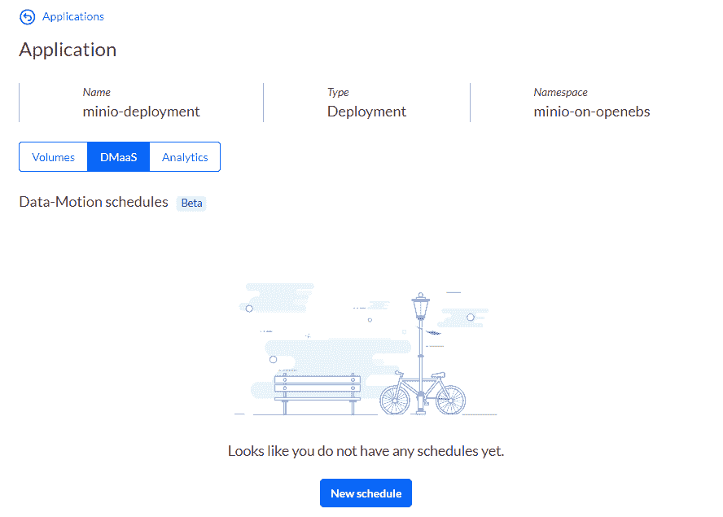
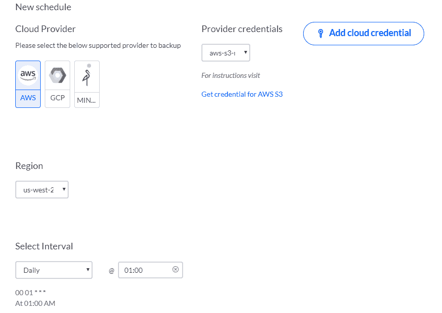

灾难恢复和备份

在本章中，我们将专注于备份和灾难恢复方案，以保持生产中的应用程序高度可用，并允许它们在云提供商或基本 Kubernetes 节点故障期间快速恢复服务。在本章中遵循配方后，您将掌握用于**灾难恢复**（**DR**）的工具，并能够在集群和云之间实时迁移应用程序。

本章中，我们将涵盖以下配方：

+   使用 MinIO 配置和管理 S3 对象存储

+   管理 Kubernetes 卷快照和恢复

+   使用 Velero 进行应用程序备份和恢复

+   使用 Kasten 进行应用程序备份和恢复

+   跨云应用程序迁移

# 技术要求

本章的配方假定您已通过第一章中描述的推荐方法之一部署了功能性 Kubernetes 集群，*构建生产就绪的 Kubernetes 集群*。

Kubernetes 操作工具`kubectl`将在本章的其余配方中使用，因为它是针对 Kubernetes 集群运行命令的主要命令行界面。如果您正在使用 Red Hat OpenShift 集群，可以用`oc`替换`kubectl`。所有命令都预计以类似的方式运行。

# 使用 MinIO 配置和管理 S3 对象存储

在本节中，我们将使用 MinIO 创建 S3 对象存储，以存储 Kubernetes 中您的应用程序创建的工件或配置文件。您将学习如何创建部署清单文件，部署 S3 服务，并为其他应用程序或用户提供外部 IP 地址以使用该服务。

## 准备工作

将`k8sdevopscookbook/src`存储库克隆到您的工作站，以便在`chapter6`目录下使用清单文件，如下所示：

```
$ git clone https://github.com/k8sdevopscookbook/src.git
$ cd src/chapter6
```

确保您已准备好一个 Kubernetes 集群，并配置了`kubectl`，以便您可以管理集群资源。

## 如何做…

本节进一步分为以下子节，以使此过程更容易：

+   创建部署 YAML 清单

+   创建 MinIO S3 服务

+   访问 MinIO Web 用户界面

### 创建部署 YAML 清单

所有 Kubernetes 资源都是通过使用 YAML 清单文件以声明方式创建的。让我们执行以下步骤来创建一个示例文件，稍后我们将在 Kubernetes 中部署应用程序时使用它：

1.  对于这个配方，我们将使用 MinIO 创建一些资源，以便我们可以了解文件格式，并在以后帮助我们部署完全功能的应用程序。通过访问[`min.io/download#/kubernetes`](https://min.io/download#/kubernetes)打开 MinIO 下载网站。

1.  在 MinIO 网站上，从可用下载选项列表中，单击 Kubernetes 按钮，然后选择 Kubernetes CLI 选项卡。此页面将帮助我们根据我们的偏好生成 MinIO 应用程序所需的 YAML 内容：


1.  输入您的访问密钥和秘密密钥对。在我们的示例中，我们使用了`minio`/`minio123`。当您访问 MinIO 服务时，这将代替用户名和密码。选择分布式作为部署模型，并输入`4`作为节点数。此选项将创建一个具有四个副本的 StatefulSet。输入`10`GB 作为大小。在我们的示例中，我们将使用以下配置屏幕上显示的值：


1.  单击“生成”按钮并检查文件内容。您将注意到存储在 YAML 清单中的三种不同资源，包括服务、StatefulSet 和第二个服务，它将创建一个云负载均衡器来将第一个服务端口暴露给外部访问。

1.  复制内容，并将其保存为`minio.yaml`在您的工作站上。

### 创建 MinIO S3 服务

让我们执行以下步骤来创建必要的资源，以使用 MinIO 获得功能齐全的 S3 服务：

1.  使用您在*创建部署 YAML 清单*配方中创建的 YAML 清单部署 MinIO：

```
$ kubectl apply -f minio.yaml
```

作为替代方法，您可以使用示例存储库中`/src/chapter6/minio`目录下保存的示例 YAML 文件，使用`$ kubectl apply -f minio/minio.yaml`命令。

1.  验证 StatefulSet。您应该看到 4 个 4 个副本部署，类似于以下输出。请注意，如果您以独立方式部署，您将没有 StatefulSets：

```
$ kubectl get statefulsets
NAME  READY AGE
minio 4/4   2m17s
```

现在，您已经部署了一个 MinIO 应用程序。在下一个配方中，我们将学习如何发现其外部地址以访问该服务。

### 访问 MinIO Web 用户界面

作为部署过程的一部分，我们让 MinIO 创建一个云负载均衡器来将服务暴露给外部访问。在这个配方中，我们将学习如何访问 MinIO 界面，以上传和下载文件到 S3 后端。为此，我们将执行以下步骤：

1.  使用以下命令获取`minio-service` LoadBalancer 的外部 IP。您将在`EXTERNAL-IP`列下看到公开的服务地址，类似于以下输出：

```
$ kubectl get service
NAME          TYPE         CLUSTER-IP EXTERNAL-IP                     PORT(S)  AGE
minio         ClusterIP    None       <none>                          9000/TCP 2m49s
minio-service LoadBalancer 10.3.0.4   abc.us-west-2.elb.amazonaws.com 9000:30345/TCP 2m49s
```

1.  正如您所看到的，输出服务是通过端口`9000`公开的。要访问该服务，我们还需要将端口`9000`添加到地址的末尾（`http://[externalIP]:9000`），并在浏览器中打开 MinIO 服务的公共地址。

1.  您需要有权限访问仪表板。使用我们之前创建的默认用户名`minio`和默认密码`minio123`登录到 Minio 部署。登录后，您将能够访问 MinIO 浏览器，如下面的屏幕截图所示：


MinIO 与亚马逊 S3 云存储服务兼容，最适合存储照片、日志文件和备份等非结构化数据。现在您可以访问 MinIO 用户界面，创建 buckets，上传文件，并通过 S3 API 访问它们，类似于访问标准的亚马逊 S3 服务来存储您的备份。您可以通过转到*另请参阅*部分中的*MinIO 文档*链接来了解更多关于 MinIO 的信息。

## 工作原理...

这个配方向您展示了如何在 Kubernetes 上部署 MinIO 来提供完全兼容 Amazon S3 API 的服务。此服务将在以后用于灾难恢复和备份在 Kubernetes 上运行的应用程序。

在*创建 MinIO S3 服务*配方中，在*步骤 1*中，当我们部署 MinIO 时，它会在端口`9000`创建一个 LoadBalancer 服务。由于我们将节点数设置为`4`，将创建一个具有四个副本的 StatefulSet。每个副本将使用`volumeClaimTemplates`部分设置的信息来创建 PVC。如果未明确定义`storageClassName`，则将使用默认存储类。结果，您将在集群上看到创建了四个**PersistentVolumesClaim**（PVC）实例，以提供高可用的 MinIO 服务。

## 另请参阅

+   MinIO 文档网址：[`docs.min.io/docs/minio-quickstart-guide.html`](https://docs.min.io/docs/minio-quickstart-guide.html)

+   Kubernetes 的 MinIO Operator 网址：[`github.com/minio/minio-operator`](https://github.com/minio/minio-operator)

+   MinIO Erasure Code QuickStart Guide 网址：[`docs.min.io/docs/minio-erasure-code-quickstart-guide`](https://docs.min.io/docs/minio-erasure-code-quickstart-guide)

+   使用 MinIO 客户端，网址：[`docs.min.io/docs/minio-client-quickstart-guide`](https://docs.min.io/docs/minio-client-quickstart-guide)

# 管理 Kubernetes 卷快照和恢复

在本节中，我们将在 Kubernetes 中从我们的持久卷创建卷快照。通过按照这个步骤，您将学习如何启用卷快照功能，创建快照存储类，并从现有的卷快照中恢复。

## 准备工作

确保您有一个准备好的 Kubernetes 集群，并配置`kubectl`来管理集群资源。

将`k8sdevopscookbook/src`存储库克隆到您的工作站，以便使用`chapter6`目录下的清单文件，如下所示：

```
$ git clone https://github.com/k8sdevopscookbook/src.git
$ cd src/chapter6
```

确保您首选存储供应商的**容器存储接口**（**CSI**）驱动程序已安装在您的 Kubernetes 集群上，并且已实现了快照功能。我们在第五章中介绍了 AWS EBS、GCP PD、Azure Disk、Rook 和 OpenEBS CSI 驱动程序的安装，*为有状态的工作负载做准备*。

本节中的说明与其他支持通过 CSI 进行快照的供应商类似。您可以在 Kubernetes CSI 文档网站上找到这些额外的驱动程序：[`kubernetes-csi.github.io/docs/drivers.html`](https://kubernetes-csi.github.io/docs/drivers.html)。

## 如何做…

本节进一步分为以下子节，以使这个过程更容易：

+   启用功能门

+   通过 CSI 创建卷快照

+   通过 CSI 从快照还原卷

+   通过 CSI 克隆卷

### 启用功能门

这里将讨论的一些功能目前可能处于不同的阶段（alpha、beta 或 GA）。如果遇到问题，请执行以下步骤：

1.  为`kube-apiserver`和`kubelet`设置以下`feature-gates`标志为`true`：

```
- --feature-gates=VolumeSnapshotDataSource=true
- --feature-gates=KubeletPluginsWatcher=true
- --feature-gates=CSINodeInfo=true
- --feature-gates=CSIDriverRegistry=true
- --feature-gates=BlockVolume=true
- --feature-gates=CSIBlockVolume=true
```

您可以通过转到*参见*部分中的*Kubernetes 功能门*链接，找到功能及其状态的最新状态。

### 通过 CSI 创建卷快照

卷快照是从 Kubernetes 集群中的 PVC 中获取的状态的副本。它是一个有用的资源，可以使用现有数据启动有状态的应用程序。让我们按照以下步骤使用 CSI 创建卷快照：

1.  创建 PVC 或选择现有的 PVC。在我们的食谱中，我们将使用 AWS EBS CSI 驱动程序和我们在第五章中创建的`aws-csi-ebs`存储类，*为有状态的工作负载做准备*，在*安装 EBS CSI 驱动程序来管理 EBS 卷*食谱中：

```
$ cat <<EOF | kubectl apply -f -
apiVersion: v1
kind: PersistentVolumeClaim
metadata:
 name: csi-ebs-pvc
spec:
 accessModes:
 - ReadWriteOnce
 storageClassName: aws-csi-ebs
 resources:
 requests:
 storage: 4Gi
EOF
```

1.  创建一个 pod，它将写入**PersistentVolume**（**PV**）内的`/data/out.txt`文件：

```
$ cat <<EOF | kubectl apply -f -
apiVersion: v1
kind: Pod
metadata:
 name: app
spec:
 containers:
 - name: app
 image: centos
 command: ["/bin/sh"]
 args: ["-c", "while true; do echo $(date -u) >> /data/out.txt; sleep 5; done"]
 volumeMounts:
 - name: persistent-storage
 mountPath: /data
 volumes:
 - name: persistent-storage
 persistentVolumeClaim:
 claimName: csi-ebs-pvc
EOF
```

1.  创建`VolumeSnapshotClass`。确保快照提供程序设置为您的 CSI 驱动程序名称。在这个食谱中，这是`ebs.csi.aws.com`：

```
$ cat <<EOF | kubectl apply -f -
apiVersion: snapshot.storage.k8s.io/v1alpha1
kind: VolumeSnapshotClass
metadata:
 name: csi-ebs-vsc
snapshotter: ebs.csi.aws.com
EOF
```

1.  必须使用存储供应商的 CSI 驱动程序创建 PVC。在我们的食谱中，我们将使用我们在*安装 EBS CSI 驱动程序来管理 EBS 卷*食谱中创建的 PVC。现在，使用我们在*步骤 1*中设置的 PVC 名称（`csi-ebs-pvc`）创建`VolumeSnapshot`：

```
$ cat <<EOF | kubectl apply -f -
apiVersion: snapshot.storage.k8s.io/v1alpha1
kind: VolumeSnapshot
metadata:
 name: ebs-volume-snapshot
spec:
 snapshotClassName: csi-ebs-vsc
 source:
 name: csi-ebs-pvc
 kind: PersistentVolumeClaim
EOF
```

1.  列出卷快照：

```
$ kubectl get volumesnapshot
NAME AGE
ebs-volume-snapshot 18s
```

1.  在检查以下命令的输出时，验证状态是否为`Ready To Use: true`：

```
$ kubectl describe volumesnapshot ebs-volume-snapshot
```

### 通过 CSI 从快照还原卷

我们可以创建快照以尝试还原其他快照。让我们执行以下步骤来还原我们在上一个食谱中创建的快照：

1.  使用以下命令从快照中还原卷，并使用 PVC。如您所见，将基于`ebs-volume-snapshot`快照创建一个名为`csi-ebs-pvc-restored`的新 PVC：

```
$ cat <<EOF | kubectl apply -f -
apiVersion: v1
kind: PersistentVolumeClaim
metadata:
 name: csi-ebs-pvc-restored
spec:
 accessModes:
 - ReadWriteOnce
 storageClassName: aws-csi-ebs
 resources:
 requests:
 storage: 4Gi
 dataSource:
 name: ebs-volume-snapshot
 kind: VolumeSnapshot
 apiGroup: snapshot.storage.k8s.io
EOF
```

1.  创建另一个 pod，它将继续写入 PV 内的`/data/out.txt`文件。此步骤将确保卷在创建后仍然可以访问：

```
$ cat <<EOF | kubectl apply -f -
apiVersion: v1
kind: Pod
metadata:
 name: newapp
spec:
 containers:
 - name: app
 image: centos
 command: ["/bin/sh"]
 args: ["-c", "while true; do echo $(date -u) >> /data/out.txt; sleep 5; done"]
 volumeMounts:
 - name: persistent-storage
 mountPath: /data
 volumes:
 - name: persistent-storage
 persistentVolumeClaim:
 claimName: csi-ebs-pvc-restored
EOF
```

1.  确认`newapp` pod 包含恢复的数据和*创建卷快照*食谱中的时间戳：

```
$ kubectl exec -it newapp cat /data/out.txt
```

通过这个，您已经学会了如何从现有快照中提供持久卷。这是 CI/CD 流水线中非常有用的一步，这样您就可以节省时间来排查失败的流水线。

### 通过 CSI 克隆卷

虽然快照是 PV 的某个状态的副本，但这并不是创建数据副本的唯一方法。CSI 还允许从现有卷创建新卷。在这个食谱中，我们将执行以下步骤，使用现有 PVC 创建一个 PVC：

1.  获取 PVC 列表。您可能有多个 PVC。在这个例子中，我们将使用我们在*创建卷快照*食谱中创建的 PVC。只要已经使用支持`VolumePVCDataSource` API 的 CSI 驱动程序创建了另一个 PVC，您就可以使用另一个 PVC：

```
$ kubectl get pvc
NAME STATUS VOLUME CAPACITY ACCESS MODES STORAGECLASS AGE
csi-ebs-pvc Bound pvc-574ed379-71e1-4548-b736-7137ab9cfd9d 4Gi RWO aws-csi-ebs 23h
```

1.  使用现有的 PVC（在本示例中为`csi-ebs-pvc`）作为`dataSource`创建 PVC。数据源可以是`VolumeSnapshot`或 PVC。在本例中，我们使用`PersistentVolumeClaim`来克隆数据：

```
$ cat <<EOF | kubectl apply -f -
apiVersion: v1
kind: PersistentVolumeClaim
metadata:
 name: clone-of-csi-ebs-pvc
spec:
 accessModes:
 - ReadWriteOnce
 resources:
 requests:
 storage: 4Gi
 dataSource:
 kind: PersistentVolumeClaim
 name: csi-ebs-pvc
EOF
```

通过这个，您已经学会了从现有数据源克隆持久数据的简单方法。

## 工作原理...

本示例向您展示了如何创建快照，从快照中恢复数据，以及如何在 Kubernetes 上立即克隆持久卷。

在*通过 CSI 从快照还原卷*和*通过 CSI 克隆卷*的示例中，我们向 PVC 添加了`dataSource`，引用了现有的 PVC，以便创建一个完全独立的新 PVC。生成的 PVC 可以独立附加、克隆、快照或删除，即使源被删除。主要区别在于，在为 PVC 进行供应之后，后端设备会提供指定卷的精确副本，而不是空 PV。

重要的是要注意，对于已经实现了这一功能的 CSI 驱动程序，动态供应商可以使用本地克隆支持。CSI 项目正在不断发展和成熟，因此并非每个存储供应商都提供完整的 CSI 功能。

## 另请参阅

+   Kubernetes CSI 驱动程序列表，请参见[`kubernetes-csi.github.io/docs/drivers.html`](https://kubernetes-csi.github.io/docs/drivers.html)

+   **容器存储接口**（**CSI**）文档，请参见[`kubernetes-csi.github.io`](https://kubernetes-csi.github.io)

+   CSI 规范，请参见[`github.com/container-storage-interface/spec`](https://github.com/container-storage-interface/spec)

+   Kubernetes 功能门，参见[`kubernetes.io/docs/reference/command-line-tools-reference/feature-gates/`](https://kubernetes.io/docs/reference/command-line-tools-reference/feature-gates/)

+   Kubernetes 卷克隆文档，请参见[`kubernetes.io/docs/concepts/storage/volume-pvc-datasource/`](https://kubernetes.io/docs/concepts/storage/volume-pvc-datasource/)

+   Kubernetes 卷快照文档，请参见[`kubernetes.io/docs/concepts/storage/volume-snapshots/`](https://kubernetes.io/docs/concepts/storage/volume-snapshots/)

# 使用 Velero 进行应用程序备份和恢复

在本节中，我们将使用 VMware Velero（前身为 Heptio Ark）在 Kubernetes 中创建灾难恢复备份，并迁移 Kubernetes 应用程序及其持久卷。

您将学习如何安装 Velero，创建标准和计划备份，并将它们恢复到 Kubernetes 集群中的 S3 目标。

## 准备工作

确保您有一个准备好的 Kubernetes 集群，并且`kubectl`配置为管理集群资源。

克隆`k8sdevopscookbook/src`存储库到您的工作站，以便在`chapter6`目录下使用清单文件，如下所示：

```
$ git clone https://github.com/k8sdevopscookbook/src.git
$ cd src/chapter6
```

这个配方需要一个具有可呈现数据的现有有状态工作负载，以便我们可以模拟灾难，然后恢复数据。为此，我们将使用在第五章的*安装 EBS CSI 驱动程序来管理 EBS 卷*配方中创建的`mytestapp`应用程序，*为有状态的工作负载做准备*。

Velero 还需要 S3 兼容的对象存储来存储备份。在这个配方中，我们将使用在*使用 Minio 配置和管理 S3 对象存储*配方中部署的 MinIO S3 目标来存储我们的备份。

## 如何做…

这一部分进一步分为以下子部分，以使这个过程更容易：

+   安装 Velero

+   备份应用程序

+   恢复应用程序

+   创建计划备份

+   备份整个命名空间

+   使用 MinIO 查看备份

+   删除备份和计划

### 安装 Velero

Velero 是一个开源项目，用于备份、执行灾难恢复、恢复和迁移 Kubernetes 资源和持久卷。在这个配方中，我们将学习如何通过以下步骤在我们的 Kubernetes 集群中部署 Velero：

1.  下载 Velero 的最新版本：

```
$ wget https://github.com/vmware-tanzu/velero/releases/download/v1.1.0/velero-v1.1.0-linux-amd64.tar.gz
```

在撰写本书时，Velero 的最新版本是 v1.1.0。检查 Velero 存储库[`github.com/vmware-tanzu/velero/releases`](https://github.com/vmware-tanzu/velero/releases)，如果自本书发布以来已更改，请使用最新的下载链接更新链接。

1.  提取 tarball：

```
$ tar -xvzf velero-v1.1.0-linux-amd64.tar.gz
$ sudo mv velero-v1.1.0-linux-amd64/velero /usr/local/bin/ 
```

1.  确认`velero`命令可执行：

```
$ velero version
Client:
 Version: v1.1.0
 Git commit: a357f21aec6b39a8244dd23e469cc4519f1fe608
<error getting server version: the server could not find the requested resource (post serverstatusrequests.velero.io)>
```

1.  创建`credentials-velero`文件，其中包含您在*使用 Minio 配置和管理 S3 对象存储*配方中使用的访问密钥和秘钥：

```
$ cat > credentials-velero <<EOF
[default]
aws_access_key_id = minio
aws_secret_access_key = minio123
EOF
```

1.  使用 MinIO 服务的外部 IP 更新`s3Url`并安装 Velero 服务器：

```
$ velero install \
 --provider aws \
 --bucket velero \
 --secret-file ./credentials-velero \
 --use-restic \
 --backup-location-config region=minio,s3ForcePathStyle="true",s3Url=http://ac76d4a1ac72c496299b17573ac4cf2d-512600720.us-west-2.elb.amazonaws.com:9000
```

1.  确认部署成功：

```
$ kubectl get deployments -l component=velero --namespace=velero
NAME READY UP-TO-DATE AVAILABLE AGE
velero 1/1 1 1 62s
```

有了这个，Velero 已经在您的 Kubernetes 集群上使用 MinIO 作为备份目标进行配置。

### 备份应用程序

让我们执行以下步骤，使用 Velero 备份应用程序及其卷。我们在这里创建的所有 YAML 清单文件都可以在`/src/chapter6/velero`目录下找到：

1.  如果您已经为要备份的应用程序和卷打上标签，可以跳到*步骤 5*。否则，使用以下命令创建一个命名空间和一个 PVC：

```
cat <<EOF | kubectl apply -f -
apiVersion: v1
kind: Namespace
metadata:
 name: backup-example
 labels:
 app: app2backup
EOF
```

1.  在`backup-example`命名空间中使用您首选的`storageClass`创建一个 PVC。在我们的示例中，这是`aws-csi-ebs`：

```
cat <<EOF | kubectl apply -f -
apiVersion: v1
kind: PersistentVolumeClaim
metadata:
 name: pvc2backup
 namespace: backup-example
 labels:
 app: app2backup
spec:
 accessModes:
 - ReadWriteOnce
 storageClassName: aws-csi-ebs
 resources:
 requests:
 storage: 4Gi
EOF
```

1.  在`src/chapter6/velero`目录中查看`myapp.yaml`文件，并使用它创建一个将使用 PVC 并写入`/data/out.txt`文件的 pod：

```
$ kubectl apply -f myapp.yaml
```

1.  验证我们的`myapp` pod 是否将数据写入卷：

```
$ kubectl exec -it myapp cat /data/out.txt -nbackup-example
Thu Sep 12 23:18:08 UTC 2019
```

1.  为所有具有`app=app2backup`标签的对象创建备份：

```
$ velero backup create myapp-backup --selector app=app2backup
```

1.  确认备份阶段已经完成：

```
$ velero backup describe myapp-backup
Name: myapp-backup
Namespace: velero
Labels: velero.io/storage-location=default
Annotations: <none>
Phase: Completed
...
```

1.  列出所有可用的备份：

```
$ velero backup get
NAME         STATUS    CREATED                       EXPIRES STORAGE LOCATION SELECTOR
myapp-backup Completed 2019-09-13 05:55:08 +0000 UTC 29d     default app=app2backup
```

通过这样，您已经学会了如何使用标签创建应用程序的备份。

### 恢复应用程序

让我们执行以下步骤来从备份中恢复应用程序：

1.  删除应用程序及其 PVC 以模拟数据丢失的情况：

```
$ kubectl delete pvc pvc2backup -nbackup-example
$ kubectl delete pod myapp -nbackup-example
```

1.  从名为`myapp-backup`的先前备份中恢复您的应用程序：

```
$ velero restore create --from-backup myapp-backup
```

1.  确认您的应用程序正在运行：

```
$ kubectl get pod -nbackup-example
NAME  READY STATUS  RESTARTS AGE
myapp 1/1   Running 0        10m
```

1.  确认我们的`myapp` pod 将数据写入卷：

```
$ kubectl exec -it myapp cat /data/out.txt -nbackup-example
```

通过这样，您已经学会了如何使用 Velero 从备份中恢复应用程序及其卷。

### 创建定期备份

Velero 支持 cron 表达式来安排备份任务。让我们执行以下步骤来为我们的应用程序安排备份：

1.  创建一个定期的每日备份：

```
$ velero schedule create myapp-daily --schedule="0 0 1 * * ?" --selector app=app2backup
```

如果您不熟悉 cron 表达式，可以使用*另请参阅*部分中的*Cron 表达式生成器*链接创建不同的计划。

请注意，前面的计划使用了 cron 表达式。作为替代，您可以使用简写表达式，如`--schedule="@daily"`，或者使用在线 cron 生成器创建 cron 表达式。

1.  获取当前已安排的备份作业列表：

```
$ velero schedule get
 NAME        STATUS  CREATED                       SCHEDULE    BACKUP TTL LAST BACKUP SELECTOR
 myapp-daily Enabled 2019-09-13 21:38:36 +0000 UTC 0 0 1 * * ? 720h0m0s   2m ago      app=app2backup
```

1.  确认已经通过定期备份作业创建了备份：

```
$ velero backup get
NAME                       STATUS    CREATED                       EXPIRES STORAGE LOCATION SELECTOR
myapp-daily-20190913205123 Completed 2019-09-13 20:51:24 +0000 UTC 29d     default app=app2backup
```

通过这样，您已经学会了如何使用 Velero 创建应用程序的定期备份。

### 备份整个命名空间

在进行备份时，您可以使用不同类型的选择器，甚至可以在所选命名空间中使用完整的资源。在本教程中，我们将通过以下步骤包括命名空间中的资源：

1.  使用以下命令对整个命名空间进行备份。此示例包括`backup-example`命名空间。如果需要，请替换此命名空间。在执行以下命令之前，命名空间和资源应该存在：

```
$ velero backup create fullnamespace --include-namespaces backup-example
```

1.  如果需要从备份中排除特定资源，请向它们添加`backup: "false"`标签，并运行以下命令：

```
$ velero backup create fullnamespace --selector 'backup notin (false)'
```

通过这个，你学会了如何使用 Velero 在给定命名空间中创建资源备份。

### 使用 MinIO 查看备份

让我们执行以下步骤来查看 MinIO 界面上备份的内容：

1.  按照*访问 MinIO Web 用户界面*食谱中的说明，访问 MinIO 浏览器。

1.  点击`velero`桶：


1.  打开`backups`目录以查找 Velero 备份列表：


1.  点击备份名称以访问备份的内容：


通过这个，你学会了如何定位和查看 Velero 备份的内容。

### 删除备份和计划

如果没有正确维护，Velero 备份的大小会迅速增长。让我们执行以下步骤来删除现有的备份资源和清理定期备份：

1.  删除名为`myapp-backup`的现有备份：

```
$ velero backup delete myapp-backup
```

1.  删除所有现有备份：

```
$ velero backup delete --all
```

1.  删除名为`myapp-daily`的定期备份作业：

```
$ velero schedule delete myapp-daily
```

## 它是如何工作的...

这个食谱向你展示了如何创建灾难恢复备份，从 S3 目标还原你的应用程序及其数据，以及如何在 Kubernetes 上创建定期备份作业。

在*备份应用程序*食谱中，在*步骤 4*中，当你运行`velero backup create myapp-backup --selector app=app2backup`时，Velero 客户端会调用 Kubernetes API 服务器并创建一个备份对象。

你可以通过运行`kubectl get crds |grep velero`命令来获取 Velero 创建的**自定义资源定义**（**CRD**）列表。

Velero 的 BackupController 会监视新对象，一旦检测到，它会执行标准验证并处理备份。Velero 的 BackupController 通过向 API 服务器请求资源来收集备份信息。然后，它会调用默认存储提供程序并上传备份文件。

## 另请参阅

+   Velero 项目存储库位于[`github.com/vmware-tanzu/velero/`](https://github.com/vmware-tanzu/velero/)

+   Velero 文档，网址为[`velero.io/docs/master/index.html`](https://velero.io/docs/master/index.html)

+   Velero 支持矩阵，网址为[`velero.io/docs/master/supported-providers/`](https://velero.io/docs/master/supported-providers/)

+   Velero 播客和社区文章，网址为[`velero.io/resources/`](https://velero.io/resources/)

+   Cron 表达式生成器，网址为[`www.freeformatter.com/cron-expression-generator-quartz.html`](https://www.freeformatter.com/cron-expression-generator-quartz.html)

# **使用 Kasten 进行应用程序备份和恢复**

在本节中，我们将使用 Kasten（K10）创建灾难恢复备份，并在 Kubernetes 中迁移 Kubernetes 应用程序及其持久卷。

您将学习如何安装和使用 K10，创建标准和定期备份到 S3 目标的应用程序，并将它们恢复到 Kubernetes 集群中。

## 准备工作

确保您已准备好一个 Kubernetes 集群，并配置了`kubectl`和`helm`，以便您可以管理集群资源。在这个教程中，我们将在 AWS 上使用一个三节点的 Kubernetes 集群。

这个教程需要一个现有的有状态工作负载，具有可呈现的数据来模拟灾难。为了恢复数据，我们将使用在第五章的*安装 EBS CSI 驱动程序来管理 EBS 卷*教程中创建的`mytestapp`应用程序。

克隆`k8sdevopscookbook/src`存储库到您的工作站，以使用`chapter6`目录下的清单文件，如下所示：

```
$ git clone https://github.com/k8sdevopscookbook/src.git
$ cd src/chapter6
```

K10 默认配备了 Starter Edition 许可证，允许您在最多三个工作节点的集群上免费使用该软件。K10 需要配置备份目标。

## 如何做…

这一部分进一步分为以下小节，以使这个过程更容易：

+   安装 Kasten

+   访问 Kasten 仪表板

+   备份应用程序

+   恢复应用程序

### 安装 Kasten

让我们执行以下步骤，在我们的 Kubernetes 集群中安装 Kasten 作为备份解决方案：

1.  添加 K10 helm 存储库：

```
$ helm repo add kasten https://charts.kasten.io/
```

1.  在开始之前，让我们验证环境。以下脚本将执行一些预安装测试，以验证您的集群：

```
$ curl https://docs.kasten.io/tools/k10_preflight.sh | bash
Checking for tools
 --> Found kubectl --> Found helm
Checking access to the Kubernetes context kubernetes-admin@net39dvo58
 --> Able to access the default Kubernetes namespace
Checking for required Kubernetes version (>= v1.10.0)
 --> Kubernetes version (v1.15.3) meets minimum requirements
Checking if Kubernetes RBAC is enabled
 --> Kubernetes RBAC is enabled
Checking if the Aggregated Layer is enabled
 --> The Kubernetes Aggregated Layer is enabled
Checking if the Kasten Helm repo is present
 --> The Kasten Helm repo was found
Checking for required Helm Tiller version (>= v2.11.0)
 --> Tiller version (v2.14.3) meets minimum requirements
All pre-flight checks succeeded!
```

1.  确保您的首选存储类设置为默认；否则，通过向以下命令添加`-set persistence.storageClass`参数来定义它。在我们的示例中，我们正在使用`openebs-cstor-default`存储类。还要添加您的 AWS 访问密钥和秘钥并安装 K10：

```
$ helm install kasten/k10 --name=k10 --namespace=kasten-io \
 --set persistence.storageClass=openebs-cstor-default \
 --set persistence.size=20Gi \
 --set secrets.awsAccessKeyId="AWS_ACCESS_KEY_ID" \
 --set secrets.awsSecretAccessKey="AWS_SECRET_ACCESS_KEY"
```

1.  使用以下`helm`命令确认部署状态为`DEPLOYED`：

```
$ helm ls
NAME REVISION UPDATED                  STATUS   CHART      APP    VERSION NAMESPACE
k10  1        Tue Oct 29 07:36:19 2019 DEPLOYED k10-1.1.56 1.1.56         kasten-io
```

在此步骤后，所有的 pod 应该在大约一分钟内部署完成，因为 Kasten 基于 Kubernetes CRDs 提供了一个 API。您可以使用带有新 CRDs 的`kubectl`（参考*相关链接*部分中的*Kasten CLI 命令*链接），或者按照下一个步骤，即*访问 Kasten 仪表板*的步骤，使用 Kasten 仪表板。

### 访问 Kasten 仪表板

让我们执行以下步骤来访问 Kasten 仪表板。这是我们将进行应用程序备份和恢复的地方：

1.  使用以下命令创建端口转发。这一步将 Kasten 仪表板服务的端口`8000`转发到本地工作站的端口`8080`：

```
$ export KASTENDASH_POD=$(kubectl get pods --namespace kasten-io -l "service=gateway" -o jsonpath="{.items[0].metadata.name}")
$ kubectl port-forward --namespace kasten-io $KASTENDASH_POD 8080:8000 >> /dev/null &
```

1.  在您的工作站上，使用浏览器打开`http://127.0.0.1:8080/k10/#`：

```
$ firefox http://127.0.0.1:8080/k10/#
```

1.  阅读并接受最终用户许可协议：


通过这样，您已经访问了 Kasten 仪表板。您可以通过单击主菜单并参考*相关链接*部分中的*Kasten 文档*链接来熟悉它，以获取额外的设置（如果需要）。

### 备份应用程序

让我们执行以下步骤来备份我们的应用程序：

1.  如果您已经有一个应用程序和与备份相关的持久卷，您可以跳过*步骤 5*。否则，使用以下示例代码创建一个命名空间和 PVC：

```
$ cat <<EOF | kubectl apply -f -
apiVersion: v1
kind: Namespace
metadata:
 name: backup-example
 labels:
 app: app2backup
EOF
```

1.  在`backup-example`命名空间中创建一个 PVC：

```
$ cat <<EOF | kubectl apply -f -
apiVersion: v1
kind: PersistentVolumeClaim
metadata:
 name: pvc2backup
 namespace: backup-example
 labels:
 app: app2backup
spec:
 accessModes:
 - ReadWriteOnce
 storageClassName: openebs-cstor-default
 resources:
 requests:
 storage: 4Gi
EOF
```

1.  创建一个将使用 PVC 并在`src/chapter6/kasten`目录下的示例`myapp.yaml`清单中写入`/data/out.txt`文件的 pod：

```
$ kubectl apply -f - kasten/myapp.yaml
```

1.  验证我们的`myapp` pod 是否将数据写入卷：

```
$ kubectl exec -it myapp cat /data/out.txt -nbackup-example
Thu Sep 12 23:18:08 UTC 2019
```

1.  在 Kasten 仪表板上，点击未管理的应用程序：


1.  在`backup-example`命名空间中，点击创建策略：


1.  输入名称并选择快照操作：


1.  选择每日作为操作频率：


1.  点击创建策略：


按照这些步骤，您将使用策略创建第一个备份，以及以下备份作业的时间表。

### 恢复应用程序

让我们执行以下步骤来从现有备份中恢复应用程序：

1.  在应用程序下，从符合应用程序的列表中，单击`backup-example`旁边的箭头图标，然后选择还原应用程序。如果应用程序已被删除，则需要选择“已删除”选项：


1.  选择要恢复的还原点：


1.  选择`backup-example`，然后单击还原：


1.  确认您希望进行还原：


通过这样，您已经学会了如何使用 Kasten 从备份中还原应用程序及其卷。

## 它是如何工作的...

本教程向您展示了如何创建灾难恢复备份，从 S3 目标还原应用程序及其数据，并在 Kubernetes 上创建定期备份。

在*备份应用程序*教程中，在*步骤 2*中，我们创建了一个使用 OpenEBS 作为存储供应商的 pod。在这种情况下，Kasten 使用一种通用备份方法，该方法需要一个能够挂载应用程序数据卷的 sidecar 到您的应用程序。以下是一个示例，您可以在使用非标准存储选项时添加到您的 pod 和部署中：

```
- name: kanister-sidecar
  image: kanisterio/kanister-tools:0.20.0
  command: ["bash", "-c"]
  args:
  - "tail -f /dev/null"
  volumeMounts:
  - name: data
    mountPath: /data
```

## 另请参阅

+   Kasten 文档，网址为[`docs.kasten.io/`](https://docs.kasten.io/)

+   Kasten CLI 命令，网址为[`docs.kasten.io/api/cli.html`](https://docs.kasten.io/api/cli.html)

+   有关使用 Kanister 进行通用备份和还原的更多信息，请访问[`docs.kasten.io/kanister/generic.html#generic-kanister`](https://docs.kasten.io/kanister/generic.html#generic-kanister)

# 跨云应用程序迁移

在云上运行应用程序时，重要的是要有一个计划，以防云供应商服务中断发生，以及避免可能的云锁定，通过使用类似于 OpenEBS 管理层的云原生存储解决方案来抽象存储层，该解决方案允许您管理对每个云或数据中心的暴露。在本节中，我们将从一个 Kubernetes 集群迁移一个云原生应用程序到另一个在不同云供应商上运行的集群，以模拟迁移场景。您将学习如何使用 Kasten 和 OpenEBS Director 来使用备份来迁移应用程序。

## 准备就绪

确保您有两个准备好的 Kubernetes 集群，并且已配置`kubectl`以管理集群资源。

在本教程中，我们将使用由 D2iQ `Konvoy`部署和管理的 AWS 集群以及使用`kops`部署的集群。例如，我们将迁移一个现有的`minio`应用程序。

这里提供的说明需要一个 AWS 账户和一个具有使用相关服务权限的 AWS 用户策略。如果您没有，请访问[`aws.amazon.com/account/`](https://aws.amazon.com/account/)并创建一个。

## 如何做…

该部分进一步分为以下子部分，以使该过程更加简单：

+   在 Kasten 中创建导出配置文件

+   在 Kasten 中导出还原点

+   在 Kasten 中创建导入配置文件

+   在 Kasten 中迁移应用程序

+   在 OpenEBS Director 中导入集群

+   在 OpenEBS Director 中迁移应用程序

### 在 Kasten 中创建导出配置文件

首先，我们将使用 Kasten 创建一个导出配置文件，以存储迁移场景中要使用的示例应用程序的远程副本。要做到这一点，请按照以下步骤操作：

1.  在设置下，选择移动性选项卡，然后单击新配置文件：


1.  要创建目标配置文件，请选择导出，勾选启用数据可移植性框，选择 Amazon S3，并输入您的用户凭据。

1.  单击验证并保存：


我们在本教程中创建的导出配置文件将在以后用于将数据移动到另一个集群。

### 在 Kasten 中导出还原点

让我们执行以下步骤来创建应用程序还原点：

1.  在应用程序下，从符合应用程序的列表中，单击 minio 旁边的箭头图标，并选择导出应用程序。

1.  选择要导出的还原点：


1.  选择您的导出配置文件，然后点击导出：


1.  确认还原。

1.  将文本块复制到剪贴板中。


### 在 Kasten 中创建一个导入配置文件

让我们在我们想要迁移应用程序的第二个集群上执行以下步骤：

1.  在设置下，选择移动性选项卡，然后点击新配置文件：


1.  要创建目标配置文件，选择导入，选择 Amazon S3，并输入您的用户凭据。

1.  使用您在源集群上为导出配置文件创建的存储桶名称。

1.  点击验证并保存：


我们在这个教程中创建的导入配置文件将在以后用于从另一个集群导入数据。

### 在 Kasten 中迁移应用程序

最后，让我们执行以下步骤来使用导入配置文件并从另一个集群迁移应用程序：

1.  在策略下，点击新策略：


1.  选择导入并勾选导入后恢复框。

1.  选择每日作为操作频率，并粘贴来自*导出还原点*教程的配置数据文本块。

1.  选择您在*创建导入配置文件*教程中创建的导入配置文件：


1.  点击创建策略按钮。

完成此步骤后，Kasten 将从还原点中恢复应用程序及其数据到新集群中。

### 将集群导入 OpenEBS Director

OpenEBS Director Online 是一个免费使用的**SaaS（软件即服务）**解决方案（企业用户可用 OnPrem 选项）用于管理 Kubernetes 中的有状态应用程序。除了其日志记录和监控功能外，它还提供**数据迁移即服务**（**DMaaS**）。在这个教程中，我们将学习如何将现有的集群添加到平台，然后在下一个教程中执行 DMaaS：

1.  转到[www.mayadata.io](http://www.mayadata.io)登录到您的 OpenEBS 企业平台[`portal.mayadata.io/home`](https://portal.mayadata.io/home)：


1.  点击连接您的集群按钮：


1.  命名您的项目。在这里，我们使用了名称`GKECluster`：


1.  选择您的 Kubernetes 集群位置。在这里，我们使用了`GKE`上的一个集群：


1.  在您的第一个集群上复制并执行该命令：


1.  从左侧菜单中，点击“集群”：


1.  在“集群”视图中，点击“连接新集群”，然后为第二个集群重复*步骤 4*和*步骤 5*：


1.  完成后，您将在平台上看到两个集群。

### 在 OpenEBS Director 中迁移应用程序

让我们按照以下步骤执行数据迁移（DMaaS）：

1.  在“集群”视图中，点击订阅列下的“免费”，并开始为两个集群进行高级计划评估：


1.  在源集群的概述页面上，点击您想要迁移的工作负载。在这个示例中，我们将迁移 MinIO 工作负载：


1.  在应用程序视图中，选择 DMaaS 选项卡，然后点击“新建计划”按钮：



1.  在“新计划”视图中，选择 AWS 作为 S3 提供商，并选择您的凭据和地区。最后，选择备份间隔为每天，然后点击“立即计划”按钮创建备份。作为替代，您也可以使用 GCP 或 MinIO 作为 S3 目标：



1.  从左侧菜单中，选择 DMaaS，然后点击您创建的计划旁边的“恢复”按钮：


1.  从托管集群列表中选择目标集群，然后点击“开始恢复”：


您的工作负载将被恢复到第二个集群。

## 另请参阅

+   OpenEBS Director 文档，请访问[`help.mayadata.io/hc/en-us`](https://help.mayadata.io/hc/en-us)

+   在 Auto DevOps 用例中使用 OpenEBS Director，请访问[`youtu.be/AOSUZxUs5BE?t=1210`](https://youtu.be/AOSUZxUs5BE?t=1210)

+   连接到 OpenEBS Director Online，请访问[`docs.openebs.io/docs/next/directoronline.html`](https://docs.openebs.io/docs/next/directoronline.html)
