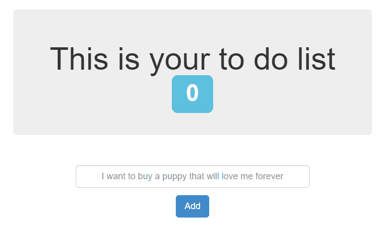

# 第八章

扩展和升级应用程序

在本章中，我们将讨论可以使用的方法和策略，以动态地扩展在 Kubernetes 上运行的容器化服务，以处理我们服务的不断变化的流量需求。在本章的配方中，您将掌握创建负载均衡器以将流量分发到多个工作节点并增加带宽所需的技能。您还将了解如何在生产环境中处理升级以最小化停机时间。

在本章中，我们将涵盖以下配方：

+   在 Kubernetes 上扩展应用程序

+   为节点分配应用程序的优先级

+   创建外部负载均衡器

+   使用 Istio 创建入口服务和服务网格

+   使用 Linkerd 创建入口服务和服务网格

+   在 Kubernetes 中自动修复 Pod

+   通过蓝/绿部署管理升级

# 技术要求

本章的配方假定您已通过第一章中描述的推荐方法之一部署了一个功能齐全的 Kubernetes 集群，*构建生产就绪的 Kubernetes 集群*。

Kubernetes 命令行工具`kubectl`将在本章的其余部分中用于配方，因为它是针对 Kubernetes 集群运行命令的主要命令行界面。我们还将在 Helm 图表可用的情况下使用 helm 来部署解决方案。

# 在 Kubernetes 上扩展应用程序

在本节中，我们将执行应用程序和集群扩展任务。您将学习如何在 Kubernetes 中手动和自动地扩展服务容量，以支持动态流量。

## 准备工作

将`k8sdevopscookbook/src`存储库克隆到您的工作站，以便使用`chapter7`目录中的清单文件，如下所示：

```
$ git clone https://github.com/k8sdevopscookbook/src.git
$ cd /src/chapter7/
```

确保您已准备好一个 Kubernetes 集群，并配置了`kubectl`和`helm`来管理集群资源。

## 操作步骤：

此部分进一步分为以下子部分，以使此过程更加简单：

+   验证 Metrics Server 的安装

+   手动扩展应用程序

+   使用水平 Pod 自动缩放器自动缩放应用程序

### 验证 Metrics Server 的安装

本节中的*使用水平 Pod 自动缩放器自动缩放应用程序*配方还需要在您的集群上安装 Metrics Server。Metrics Server 是用于核心资源使用数据的集群范围聚合器。按照以下步骤验证 Metrics Server 的安装：

1.  通过运行以下命令确认是否需要安装 Metrics Server：

```
$ kubectl top node
error: metrics not available yet
```

1.  如果安装正确，您应该看到以下节点指标：

```
$ kubectl top nodes
NAME                          CPU(cores) CPU% MEMORY(bytes) MEMORY%
ip-172-20-32-169.ec2.internal 259m       12%  1492Mi        19%
ip-172-20-37-106.ec2.internal 190m       9%   1450Mi        18%
ip-172-20-48-49.ec2.internal  262m       13%  2166Mi        27%
ip-172-20-58-155.ec2.internal 745m       37%  1130Mi        14%
```

如果收到错误消息，指出`尚未提供指标`，则需要按照*使用 Kubernetes Metrics Server 添加指标*配方中提供的步骤安装 Metrics Server。

### 手动扩展应用程序

当您的应用程序的使用量增加时，有必要将应用程序扩展。Kubernetes 被设计用来处理高规模工作负载的编排。

让我们执行以下步骤，了解如何手动扩展应用程序：

1.  更改目录到`/src/chapter7/charts/node`，这是您在*准备就绪*部分创建的示例存储库的本地克隆所在的位置：

```
$ cd /charts/node/
```

1.  使用以下命令安装待办事项应用程序示例。这个 Helm 图表将部署两个 pod，包括一个 Node.js 服务和一个 MongoDB 服务：

```
$ helm install . --name my-ch7-app
```

1.  获取`my-ch7-app-node`的服务 IP 以连接到应用程序。以下命令将返回应用程序的外部地址：

```
$ export SERVICE_IP=$(kubectl get svc --namespace default my-ch7-app-node --template "{{ range (index .status.loadBalancer.ingress 0) }}{{.}}{{ end }}")
$ echo http://$SERVICE_IP/
http://mytodoapp.us-east-1.elb.amazonaws.com/
```

1.  在 Web 浏览器中打开*步骤 3*中的地址。您将获得一个完全功能的待办事项应用程序：



1.  使用`helm status`检查应用程序的状态。您将看到已部署的 pod 数量在`Available`列中：

```
$ helm status my-ch7-app
LAST DEPLOYED: Thu Oct 3 00:13:10 2019
NAMESPACE: default
STATUS: DEPLOYED
RESOURCES:
==> v1/Deployment
NAME               READY UP-TO-DATE AVAILABLE AGE
my-ch7-app-mongodb 1/1   1          1         9m9s
my-ch7-app-node    1/1   1          1         9m9s
...
```

1.  将节点 pod 的规模从当前的单个副本扩展到`3`个副本：

```
$ kubectl scale --replicas 3 deployment/my-ch7-app-node
deployment.extensions/my-ch7-app-node scaled
```

1.  再次检查应用程序的状态，并确认，这次可用副本的数量为`3`，`v1/Pod`部分中的`my-ch7-app-node` pod 数量已增加到`3`：

```
$ helm status my-ch7-app
...
RESOURCES:
==> v1/Deployment
NAME READY UP-TO-DATE AVAILABLE AGE
my-ch7-app-mongodb 1/1 1 1 26m
my-ch7-app-node 3/3 3 3 26m
...
==> v1/Pod(related)
NAME READY STATUS RESTARTS AGE
my-ch7-app-mongodb-5499c954b8-lcw27 1/1 Running 0 26m
my-ch7-app-node-d8b94964f-94dsb 1/1 Running 0 91s
my-ch7-app-node-d8b94964f-h9w4l 1/1 Running 3 26m
my-ch7-app-node-d8b94964f-qpm77 1/1 Running 0 91s
```

1.  要缩小应用程序的规模，请重复*步骤 5*，但这次使用`2`个副本：

```
$ kubectl scale --replicas 2 deployment/my-ch7-app-node
deployment.extensions/my-ch7-app-node scaled
```

有了这个，您学会了如何在需要时扩展您的应用程序。当然，您的 Kubernetes 集群资源也应该能够支持不断增长的工作负载能力。

下一个配方将向您展示如何根据实际资源消耗而不是手动步骤来自动缩放工作负载。

### 使用水平 Pod 自动缩放器自动缩放应用程序

在本教程中，您将学习如何创建**水平 Pod 自动缩放器**（**HPA**）来自动化我们在上一个教程中创建的应用程序的扩展过程。我们还将使用负载生成器测试 HPA，模拟增加流量击中我们的服务的情景。请按照以下步骤操作：

1.  首先，确保您已经部署了*手动扩展应用程序*中的示例待办事项应用程序。当您运行以下命令时，您应该会看到 MongoDB 和 Node pods 的列表：

```
$ kubectl get pods | grep my-ch7-app
my-ch7-app-mongodb-5499c954b8-lcw27 1/1 Running 0 4h41m
my-ch7-app-node-d8b94964f-94dsb     1/1 Running 0 4h16m
my-ch7-app-node-d8b94964f-h9w4l     1/1 Running 3 4h41m
```

1.  使用以下命令声明性地创建 HPA。这将自动化在达到`targetCPUUtilizationPercentage`阈值时在`1`到`5`个副本之间扩展应用程序的过程。在我们的示例中，pod 的 CPU 利用率目标的平均值设置为`50`％。当利用率超过此阈值时，您的副本将增加：

```
cat <<EOF | kubectl apply -f -
apiVersion: autoscaling/v1
kind: HorizontalPodAutoscaler
metadata:
 name: my-ch7-app-autoscaler
 namespace: default
spec:
 scaleTargetRef:
 apiVersion: apps/v1
 kind: Deployment
 name: my-ch7-app-node
 minReplicas: 1
 maxReplicas: 5
 targetCPUUtilizationPercentage: 50
EOF
```

尽管结果大多数情况下可能是相同的，但声明性配置需要理解 Kubernetes 对象配置规范和文件格式。作为替代方案，`kubectl`可以用于对 Kubernetes 对象进行命令式管理。

请注意，您必须在部署中设置 CPU 请求才能使用自动缩放。如果您的部署中没有 CPU 请求，HPA 将部署但不会正常工作。

您还可以通过运行`$ kubectl autoscale deployment my-ch7-app-node --cpu-percent=50 --min=1 --max=5`命令来命令式地创建相同的`HorizontalPodAutoscaler`。

1.  确认当前副本的数量和 HPA 的状态。当您运行以下命令时，副本的数量应为`1`：

```
$ kubectl get hpa
NAME                  REFERENCE                  TARGETS       MINPODS MAXPODS REPLICAS AGE
my-ch7-app-autoscaler Deployment/my-ch7-app-node 0%/50%        1       5       1        40s
```

1.  获取`my-ch7-app-node`的服务 IP，以便在下一步中使用：

```
$ export SERVICE_IP=$(kubectl get svc --namespace default my-ch7-app-node --template "{{ range (index .status.loadBalancer.ingress 0) }}{{.}}{{ end }}")
$ echo http://$SERVICE_IP/
http://mytodoapp.us-east-1.elb.amazonaws.com/
```

1.  打开一个新的终端窗口并创建一个负载生成器来测试 HPA。确保您在以下代码中用实际服务 IP 替换`YOUR_SERVICE_IP`。此命令将向您的待办事项应用程序生成流量：

```
$ kubectl run -i --tty load-generator --image=busybox /bin/sh

while true; do wget -q -O- YOUR_SERVICE_IP; done
```

1.  等待几分钟，使自动缩放器对不断增加的流量做出响应。在一个终端上运行负载生成器的同时，在另一个终端窗口上运行以下命令，以监视增加的 CPU 利用率。在我们的示例中，这被设置为`210％`：

```
$ kubectl get hpa
NAME                  REFERENCE                  TARGETS       MINPODS MAXPODS REPLICAS AGE
my-ch7-app-autoscaler Deployment/my-ch7-app-node 210%/50%      1       5       1        23m
```

1.  现在，检查部署大小并确认部署已调整为`5`个副本，以应对工作负载的增加：

```
$ kubectl get deployment my-ch7-app-node
NAME            READY UP-TO-DATE AVAILABLE AGE
my-ch7-app-node 5/5   5          5         5h23m
```

1.  在运行负载生成器的终端屏幕上，按下*Ctrl* + *C*来终止负载生成器。这将停止发送到您的应用程序的流量。

1.  等待几分钟，让自动缩放器进行调整，然后通过运行以下命令来验证 HPA 状态。当前的 CPU 利用率应该更低。在我们的示例中，它显示下降到`0%`：

```
$ kubectl get hpa
NAME                  REFERENCE                  TARGETS MINPODS MAXPODS REPLICAS AGE
my-ch7-app-autoscaler Deployment/my-ch7-app-node 0%/50%  1       5       1        34m
```

1.  检查部署大小，并确认部署已经因停止流量生成器而缩减到`1`个副本：

```
$ kubectl get deployment my-ch7-app-node
NAME            READY UP-TO-DATE AVAILABLE AGE
my-ch7-app-node 1/1   1          1         5h35m
```

在这个教程中，您学会了如何根据不断变化的指标动态地自动化应用程序的扩展。当应用程序被扩展时，它们会动态地调度到现有的工作节点上。

## 工作原理...

这个教程向您展示了如何根据 Kubernetes 指标动态地手动和自动地扩展部署中的 Pod 数量。

在这个教程中，在*步骤 2*中，我们创建了一个自动缩放器，它会在`minReplicas: 1`和`maxReplicas: 5`之间调整副本的数量。如下例所示，调整标准由`targetCPUUtilizationPercentage: 50`指标触发：

```
spec:
  scaleTargetRef:
    apiVersion: apps/v1
    kind: Deployment
    name: my-ch7-app-node
  minReplicas: 1
  maxReplicas: 5
  targetCPUUtilizationPercentage: 50
```

`targetCPUUtilizationPercentage`是与`autoscaling/v1`API 一起使用的。您很快将看到`targetCPUUtilizationPercentage`将被一个名为 metrics 的数组所取代。

要了解新的指标和自定义指标，运行以下命令。这将返回我们使用 V1 API 创建的清单到使用 V2 API 的新清单：

```
$ kubectl get hpa.v2beta2.autoscaling my-ch7-app-node -o yaml
```

这使您能够指定额外的资源指标。默认情况下，CPU 和内存是唯一支持的资源指标。除了这些资源指标，v2 API 还支持另外两种类型的指标，这两种指标都被视为自定义指标：每个 Pod 的自定义指标和对象指标。您可以通过转到*参见*部分中提到的*Kubernetes HPA 文档*链接来了解更多信息。

## 参见

+   使用自定义指标的 Kubernetes Pod 自动缩放器：[`sysdig.com/blog/kubernetes-autoscaler/`](https://sysdig.com/blog/kubernetes-autoscaler/)

+   Kubernetes HPA 文档：[`kubernetes.io/docs/tasks/run-application/horizontal-pod-autoscale/`](https://kubernetes.io/docs/tasks/run-application/horizontal-pod-autoscale/)

+   使用配置文件声明式管理 Kubernetes 对象：[`kubernetes.io/docs/tasks/manage-kubernetes-objects/declarative-config/`](https://kubernetes.io/docs/tasks/manage-kubernetes-objects/declarative-config/)

+   使用配置文件命令式管理 Kubernetes 对象：[`kubernetes.io/docs/tasks/manage-kubernetes-objects/imperative-config/`](https://kubernetes.io/docs/tasks/manage-kubernetes-objects/imperative-config/)

# 将应用程序分配给节点

在本节中，我们将确保 pod 不会被调度到不合适的节点上。您将学习如何使用节点选择器、污点、容忍和设置优先级将 pod 调度到 Kubernetes 节点上。

## 准备工作

确保您已准备好一个 Kubernetes 集群，并配置了`kubectl`和`helm`来管理集群资源。

## 如何做…

此部分进一步分为以下子部分，以使此过程更容易：

+   给节点贴标签

+   使用 nodeSelector 将 pod 分配给节点

+   使用节点和 pod 亲和性将 pod 分配给节点

### 给节点贴标签

Kubernetes 标签用于指定资源的重要属性，这些属性可用于将组织结构应用到系统对象上。在这个配方中，我们将学习用于 Kubernetes 节点的常见标签，并应用一个自定义标签，以便在调度 pod 到节点时使用。

让我们执行以下步骤，列出已分配给您的节点的一些默认标签：

1.  列出已分配给您的节点的标签。在我们的示例中，我们将使用部署在 AWS EC2 上的 kops 集群，因此您还将看到相关的 AWS 标签，例如可用区：

```
$ kubectl get nodes --show-labels
NAME                          STATUS ROLES AGE VERSION LABELS
ip-172-20-49-12.ec2.internal  Ready   node  23h v1.14.6 
kubernetes.io/arch=amd64,kubernetes.io/instance-type=t3.large,
kubernetes.io/os=linux,failure-domain.beta.kubernetes.io/region=us-east-1,
failure-domain.beta.kubernetes.io/zone=us-east-1a,
kops.k8s.io/instancegroup=nodes,kubernetes.io/hostname=ip-172-20-49-12.ec2.internal,
kubernetes.io/role=node,node-role.kubernetes.io/node=
...
```

1.  获取您的集群中的节点列表。我们将使用节点名称在下一步中分配标签：

```
$ kubectl get nodes
NAME                           STATUS ROLES  AGE VERSION
ip-172-20-49-12.ec2.internal   Ready  node   23h v1.14.6
ip-172-20-50-171.ec2.internal  Ready  node   23h v1.14.6
ip-172-20-58-83.ec2.internal   Ready  node   23h v1.14.6
ip-172-20-59-8.ec2.internal    Ready  master 23h v1.14.6
```

1.  将两个节点标记为`production`和`development`。使用*步骤 2*的输出中的工作节点名称运行以下命令：

```
$ kubectl label nodes ip-172-20-49-12.ec2.internal environment=production
$ kubectl label nodes ip-172-20-50-171.ec2.internal environment=production
$ kubectl label nodes ip-172-20-58-83.ec2.internal environment=development
```

1.  验证新标签是否已分配给节点。这次，除了标记为`role=master`的节点外，您应该在所有节点上看到`environment`标签：

```
$ kubectl get nodes --show-labels
```

建议为将使用您的集群的其他人记录标签。虽然它们不直接暗示核心系统的语义，但确保它们对所有用户仍然有意义和相关。

### 使用 nodeSelector 将 pod 分配给节点

在这个配方中，我们将学习如何使用 nodeSelector 原语将 pod 调度到选定的节点：

1.  在名为`todo-dev`的新目录中创建我们在*手动扩展应用程序*配方中使用的 Helm 图表的副本。稍后我们将编辑模板，以指定`nodeSelector`：

```
$ cd src/chapter7/charts
$ mkdir todo-dev
$ cp -a node/* todo-dev/
$ cd todo-dev
```

1.  编辑`templates`目录中的`deployment.yaml`文件：

```
$ vi templates/deployment.yaml
```

1.  在`containers:`参数之前添加`nodeSelector:`和`environment: "{{ .Values.environment }}"`。这应该如下所示：

```
...
          mountPath: {{ .Values.persistence.path }}
      {{- end }}
# Start of the addition
      nodeSelector:
        environment: "{{ .Values.environment }}"
# End of the addition
      containers:
      - name: {{ template "node.fullname" . }}

...
```

Helm 安装使用模板生成配置文件。如前面的示例所示，为了简化您自定义提供的值的方式，使用`{{expr}}`，这些值来自`values.yaml`文件名称。`values.yaml`文件包含图表的默认值。

尽管在大型集群上可能不太实用，但是除了使用`nodeSelector`和标签之外，您还可以使用`nodeName`设置在一个特定的节点上安排 Pod。在这种情况下，您可以将`nodeName: yournodename`添加到部署清单中，而不是`nodeSelector`设置。

1.  现在我们已经添加了变量，编辑`values.yaml`文件。这是我们将环境设置为`development`标签的地方：

```
$ vi values.yaml
```

1.  在文件末尾添加`environment: development`行。它应该如下所示：

```
...
## Affinity for pod assignment
## Ref: https://kubernetes.io/docs/concepts/configuration/assign-pod-node/#affinity-and-anti-affinity
##
affinity: {}
environment: development
```

1.  编辑`Chart.yaml`文件，并将图表名称更改为其文件夹名称。在这个配方中，它被称为`todo-dev`。在这些更改之后，前两行应该如下所示：

```
apiVersion: v1
name: todo-dev
...
```

1.  更新 Helm 依赖项并构建它们。以下命令将拉取所有依赖项并构建 Helm 图表：

```
$ helm dep update & helm dep build
```

1.  检查图表是否存在问题。如果图表文件有任何问题，linting 过程将提出问题；否则，不应该发现任何失败：

```
$ helm lint .
==> Linting .
Lint OK
1 chart(s) linted, no failures
```

1.  使用以下命令安装示例待办应用程序。这个 Helm 图表将部署两个 Pod，包括一个 Node.js 服务和一个 MongoDB 服务，但这次节点被标记为`environment: development`：

```
$ helm install . --name my-app7-dev --set serviceType=LoadBalancer
```

1.  使用以下命令检查所有的 Pod 是否已经安排在开发节点上。您会发现`my-app7-dev-todo-dev` Pod 正在带有`environment: development`标签的节点上运行：

```
$ for n in $(kubectl get nodes -l environment=development --no-headers | cut -d " " -f1); do kubectl get pods --all-namespaces --no-headers --field-selector spec.nodeName=${n} ; done
```

有了这个，您已经学会了如何使用`nodeSelector`原语将工作负载 Pod 安排到选定的节点上。

### 使用节点和 Pod 之间的亲和性将 Pod 分配给节点

在这个配方中，我们将学习如何扩展我们在上一个配方中表达的约束，即使用亲和性和反亲和性特性将 Pod 分配给带标签的节点。

让我们使用基于场景的方法来简化不同的亲和性选择器选项的配方。我们将采用前面的示例，但这次是具有复杂要求：

+   `todo-prod`必须安排在带有`environment:production`标签的节点上，并且如果无法安排，则应该失败。

+   `todo-prod`应该在一个被标记为`failure-domain.beta.kubernetes.io/zone=us-east-1a`或`us-east-1b`的节点上运行，但如果标签要求不满足，可以在任何地方运行。

+   `todo-prod`必须在与`mongodb`相同的区域运行，但不应在`todo-dev`运行的区域运行。

这里列出的要求只是为了代表一些亲和性定义功能的使用示例。这不是配置这个特定应用程序的理想方式。在您的环境中，标签可能完全不同。

上述情景将涵盖节点亲和性选项（`requiredDuringSchedulingIgnoredDuringExecution`和`preferredDuringSchedulingIgnoredDuringExecution`）的两种类型。您将在我们的示例中稍后看到这些选项。让我们开始吧：

1.  将我们在*手动扩展应用程序*配方中使用的 Helm 图表复制到一个名为`todo-prod`的新目录中。我们稍后将编辑模板，以指定`nodeAffinity`规则：

```
$ cd src/chapter7/charts
$ mkdir todo-prod
$ cp -a node/* todo-prod/
$ cd todo-prod
```

1.  编辑`values.yaml`文件。要访问它，请使用以下命令：

```
$ vi values.yaml
```

1.  用以下代码替换最后一行`affinity: {}`。这个改变将满足我们之前定义的第一个要求，意味着一个 pod 只能放置在一个带有`environment`标签且其值为`production`的节点上：

```
## Affinity for pod assignment
## Ref: https://kubernetes.io/docs/concepts/configuration/assign-pod-node/#affinity-and-anti-affinity
# affinity: {}
# Start of the affinity addition #1
affinity:
 nodeAffinity:
 requiredDuringSchedulingIgnoredDuringExecution:
 nodeSelectorTerms:
 - matchExpressions:
 - key: environment
 operator: In
 values:
 - production
# End of the affinity addition #1
```

您还可以在`nodeSelectorTerms`下指定多个`matchExpressions`。在这种情况下，pod 只能被调度到所有`matchExpressions`都满足的节点上，这可能会限制您成功调度的机会。

虽然在大型集群上可能不太实用，但是除了使用`nodeSelector`和标签之外，您还可以使用`nodeName`设置在特定节点上调度一个 pod。在这种情况下，将`nodeName: yournodename`添加到您的部署清单中，而不是`nodeSelector`设置。

1.  现在，在上述代码添加的下面添加以下行。这个添加将满足我们之前定义的第二个要求，意味着带有`failure-domain.beta.kubernetes.io/zone`标签且其值为`us-east-1a`或`us-east-1b`的节点将被优先选择：

```
          - production
# End of the affinity addition #1
# Start of the affinity addition #2
    preferredDuringSchedulingIgnoredDuringExecution:
    - weight: 1
      preference:
        matchExpressions:
        - key: failure-domain.beta.kubernetes.io/zone
          operator: In
          values:
          - us-east-1a
          - us-east-1b
# End of the affinity addition #2
```

1.  对于第三个要求，我们将使用 pod 之间的亲和性和反亲和性功能。它们允许我们基于节点上已经运行的 pod 的标签来限制我们的 pod 有资格被调度到哪些节点，而不是根据节点上的标签进行调度。以下 podAffinity `requiredDuringSchedulingIgnoredDuringExecution`规则将寻找存在`app: mongodb`的节点，并使用`failure-domain.beta.kubernetes.io/zone`作为拓扑键来显示我们的 pod 允许被调度到哪里：

```
          - us-east-1b
# End of the affinity addition #2
# Start of the affinity addition #3a
  podAffinity:
    requiredDuringSchedulingIgnoredDuringExecution:
    - labelSelector:
        matchExpressions:
        - key: app
          operator: In
          values:
          - mongodb
      topologyKey: failure-domain.beta.kubernetes.io/zone
# End of the affinity addition #3a
```

1.  添加以下行以满足要求。这次，`podAntiAffinity preferredDuringSchedulingIgnoredDuringExecution`规则将寻找存在`app: todo-dev`的节点，并使用`failure-domain.beta.kubernetes.io/zone`作为拓扑键：

```
      topologyKey: failure-domain.beta.kubernetes.io/zone
# End of the affinity addition #3a
# Start of the affinity addition #3b
  podAntiAffinity:
    preferredDuringSchedulingIgnoredDuringExecution:
    - weight: 100
      podAffinityTerm:
        labelSelector:
          matchExpressions:
          - key: app
            operator: In
            values:
            - todo-dev
        topologyKey: failure-domain.beta.kubernetes.io/zone
# End of the affinity addition #3b
```

1.  编辑`Chart.yaml`文件，并将图表名称更改为其文件夹名称。在这个示例中，它被称为`todo-prod`。做出这些更改后，前两行应如下所示：

```
apiVersion: v1
name: todo-prod
...
```

1.  更新 Helm 依赖项并构建它们。以下命令将拉取所有依赖项并构建 Helm 图表：

```
$ helm dep update & helm dep build
```

1.  检查图表是否存在问题。如果图表文件有任何问题，linting 过程将指出；否则，不应该发现任何失败：

```
$ helm lint .
==> Linting .
Lint OK
1 chart(s) linted, no failures
```

1.  使用以下命令安装待办事项应用示例。这个 Helm 图表将部署两个 pod，包括一个 Node.js 服务和一个 MongoDB 服务，这次遵循我们在本示例开始时定义的详细要求：

```
$ helm install . --name my-app7-prod --set serviceType=LoadBalancer
```

1.  使用以下命令检查已经在节点上调度的所有 pod 是否标记为`environment: production`。您将发现`my-app7-dev-todo-dev` pod 正在节点上运行：

```
$ for n in $(kubectl get nodes -l environment=production --no-headers | cut -d " " -f1); do kubectl get pods --all-namespaces --no-headers --field-selector spec.nodeName=${n} ; done
```

在本示例中，您学习了在 Kubernetes 中使用一些原语时如何进行高级 pod 调度实践，包括`nodeSelector`、节点亲和性和 pod 之间的亲和性。现在，您将能够配置一组应用程序，这些应用程序位于相同的定义拓扑中或在不同的区域中进行调度，以便您拥有更好的**服务级别协议**（**SLA**）时间。

## 工作原理...

本节中的示例向您展示了如何根据复杂的要求在首选位置上调度 pod。

在*节点标记*示例中，在*步骤 1*中，您可以看到一些标准标签已经应用到您的节点上。这里是它们的简要解释以及它们的用途：

+   `kubernetes.io/arch`：这来自`runtime.GOARCH`参数，并应用于节点以识别在不同架构容器映像（如 x86、arm、arm64、ppc64le 和 s390x）上运行的位置混合架构集群。

+   `kubernetes.io/instance-type`：只有在集群部署在云提供商上时才有用。实例类型告诉我们很多关于平台的信息，特别是对于需要在具有 GPU 或更快存储选项的实例上运行一些 Pod 的 AI 和机器学习工作负载。

+   `kubernetes.io/os`：这适用于节点，并来自`runtime.GOOS`。除非您在同一集群中有 Linux 和 Windows 节点，否则可能不太有用。

+   `failure-domain.beta.kubernetes.io/region`和`/zone`：如果您的集群部署在云提供商上或您的基础设施跨不同的故障域，这也更有用。在数据中心，它可以用于定义机架解决方案，以便您可以将 Pod 安排在不同的机架上，以提高可用性。

+   `kops.k8s.io/instancegroup=nodes`：这是设置为实例组名称的节点标签。仅在使用 kops 集群时使用。

+   `kubernetes.io/hostname`：显示工作节点的主机名。

+   `kubernetes.io/role`：显示工作节点在集群中的角色。一些常见的值包括`node`（表示工作节点）和`master`（表示节点是主节点，并且默认情况下被标记为不可调度的工作负载）。

在*使用节点和跨 Pod 亲和力将 Pod 分配给节点*配方中，在*步骤 3*中，节点亲和力规则表示 Pod 只能放置在具有键为`environment`且值为`production`的标签的节点上。

在*步骤 4*中，首选`affinity key: value`要求（`preferredDuringSchedulingIgnoredDuringExecution`）。这里的`weight`字段可以是`1`到`100`之间的值。满足这些要求的每个节点，Kubernetes 调度程序都会计算一个总和。总分最高的节点是首选的。

这里使用的另一个细节是`In`参数。节点亲和力支持以下运算符：`In`、`NotIn`、`Exists`、`DoesNotExist`、`Gt`和`Lt`。您可以通过查看“通过示例查看调度亲和力”链接来了解更多关于这些运算符的信息，该链接在*另请参阅*部分中提到。

如果选择器和亲和力规则规划不当，很容易阻止 pod 在节点上调度。请记住，如果同时指定了`nodeSelector`和`nodeAffinity`规则，则必须同时满足这两个要求，才能将 pod 调度到可用节点上。

在*步骤 5*中，使用`podAffinity`来满足 PodSpec 中的要求。在这个示例中，`podAffinity`是`requiredDuringSchedulingIgnoredDuringExecution`。在这里，`matchExpressions`表示一个 pod 只能在`failure-domain.beta.kubernetes.io/zone`与其他带有`app: mongodb`标签的 pod 所在的节点匹配的节点上运行。

在*步骤 6*中，使用`podAntiAffinity`和`preferredDuringSchedulingIgnoredDuringExecution`满足了要求。在这里，`matchExpressions`表示一个 pod 不能在`failure-domain.beta.kubernetes.io/zone`与其他带有`app: todo-dev`标签的 pod 所在的节点匹配的节点上运行。通过将权重设置为`100`来增加权重。

## 另请参阅

+   已知标签、注释和污点列表：[`kubernetes.io/docs/reference/kubernetes-api/labels-annotations-taints/`](https://kubernetes.io/docs/reference/kubernetes-api/labels-annotations-taints/)

+   将 Pod 分配给 Kubernetes 文档中的节点：[`kubernetes.io/docs/tasks/configure-pod-container/assign-pods-nodes/`](https://kubernetes.io/docs/tasks/configure-pod-container/assign-pods-nodes/)

+   有关 Kubernetes 文档中标签和选择器的更多信息：[`kubernetes.io/docs/concepts/overview/working-with-objects/labels/`](https://kubernetes.io/docs/concepts/overview/working-with-objects/labels/)

+   通过示例了解调度器亲和力：[`banzaicloud.com/blog/k8s-affinities/`](https://banzaicloud.com/blog/k8s-affinities/)

+   节点亲和力和 NodeSelector 设计文档：[`github.com/kubernetes/community/blob/master/contributors/design-proposals/scheduling/nodeaffinity.md`](https://github.com/kubernetes/community/blob/master/contributors/design-proposals/scheduling/nodeaffinity.md)

+   Pod 间拓扑亲和力和反亲和力设计文档：[`github.com/kubernetes/community/blob/master/contributors/design-proposals/scheduling/podaffinity.md`](https://github.com/kubernetes/community/blob/master/contributors/design-proposals/scheduling/podaffinity.md)

# 创建外部负载均衡器

负载均衡器服务类型是一种相对简单的服务替代方案，用于使用基于云的外部负载均衡器而不是入口。外部负载均衡器服务类型的支持仅限于特定的云提供商，但受到大多数流行的云提供商的支持，包括 AWS、GCP、Azure、阿里云和 OpenStack。

在本节中，我们将使用负载均衡器来公开我们的工作负载端口。我们将学习如何为公共云上的集群创建外部 GCE/AWS 负载均衡器，以及如何使用`inlet-operator`为您的私有集群创建外部负载均衡器。

## 准备工作

确保您已经准备好一个 Kubernetes 集群，并且`kubectl`和`helm`已配置好以管理集群资源。在本教程中，我们使用了在 AWS 上使用`kops`部署的集群，如第一章中所述，*构建生产就绪的 Kubernetes 集群*，在*亚马逊网络服务*的示例中。相同的说明也适用于所有主要的云提供商。

要访问示例文件，请将`k8sdevopscookbook/src`存储库克隆到您的工作站，以便在`src/chapter7/lb`目录中使用配置文件，方法如下：

```
$ git clone https://github.com/k8sdevopscookbook/src.git
$ cd src/chapter7/lb/
```

在您克隆了示例存储库之后，您可以继续进行操作。

## 操作步骤

本节进一步分为以下小节，以使这个过程更容易：

+   创建外部云负载均衡器

+   查找服务的外部地址

### 创建外部云负载均衡器

当您创建一个应用程序并将其公开为 Kubernetes 服务时，通常需要使服务可以通过 IP 地址或 URL 从外部访问。在本教程中，您将学习如何创建一个负载均衡器，也称为云负载均衡器。

在前几章中，我们已经看到了一些示例，这些示例使用了负载均衡器服务类型来公开 IP 地址，包括上一章中的*使用 MinIO 配置和管理 S3 对象存储*和*使用 Kasten 进行应用程序备份和恢复*，以及本章中提供的 To-Do 应用程序在*将应用程序分配给节点*的示例中。

让我们使用 MinIO 应用程序来学习如何创建负载均衡器。按照以下步骤创建一个服务，并使用外部负载均衡器服务公开它：

1.  查看`src/chapter7/lb`目录中`minio.yaml`文件的内容，并使用以下命令部署它。这将创建一个 StatefulSet 和一个服务，其中 MinIO 端口通过端口号`9000`在集群内部公开。你可以选择应用相同的步骤并为你自己的应用程序创建一个负载均衡器。在这种情况下，跳到*步骤 2*：

```
$ kubectl apply -f minio.yaml
```

1.  列出 Kubernetes 上可用的服务。你会看到 MinIO 服务的服务类型为`ClusterIP`，`EXTERNAL-IP`字段下为`none`：

```
$ kubectl get svc
NAME       TYPE      CLUSTER-IP EXTERNAL-IP PORT(S)  AGE
kubernetes ClusterIP 100.64.0.1 <none>      443/TCP  5d
minio      ClusterIP None       <none>      9000/TCP 4m
```

1.  创建一个`TYPE`设置为`LoadBalancer`的新服务。以下命令将使用`TCP`协议将我们的 MinIO 应用程序的`port: 9000`暴露到`targetPort: 9000`，如下所示：

```
cat <<EOF | kubectl apply -f -
apiVersion: v1
kind: Service
metadata:
 name: minio-service
spec:
 type: LoadBalancer
 ports:
 - port: 9000
 targetPort: 9000
 protocol: TCP
 selector:
 app: minio
EOF
```

上述命令将立即创建`Service`对象，但在云服务提供商端实际的负载均衡器可能需要 30 秒到 1 分钟才能完全初始化。尽管对象将声明它已准备就绪，但在负载均衡器初始化之前它将无法正常工作。这是云负载均衡器与入口控制器相比的一个缺点，我们将在下一个教程中看到，*使用 Istio 创建入口服务和服务网格*。

作为*步骤 3*的替代方案，你也可以使用以下命令创建负载均衡器：

```
$ kubectl expose rc example --port=9000 --target-port=9000 --name=minio-service --type=LoadBalancer
```

### 查找服务的外部地址

让我们执行以下步骤来获取服务的外部可达地址：

1.  列出使用`LoadBalancer`类型的服务。`EXTERNAL-IP`列将显示云供应商提供的地址：

```
$ kubectl get svc |grep LoadBalancer
NAME          TYPE         CLUSTER-IP    EXTERNAL-IP                                  PORT(S)        AGE
minio-service LoadBalancer 100.69.15.120 containerized.me.us-east-1.elb.amazonaws.com 9000:30705/TCP 4h39m
```

1.  如果你在 AWS 等云服务提供商上运行，你也可以使用以下命令获取确切的地址。你可以复制并粘贴到网页浏览器中：

```
$ SERVICE_IP=http://$(kubectl get svc minio-service \
-o jsonpath='{.status.loadBalancer.ingress[0].hostname}:{.spec.ports[].targetPort}')
$ echo $SERVICE_IP
```

1.  如果你在裸机服务器上运行，那么你可能不会有`hostname`条目。例如，如果你正在运行 MetalLB ([`metallb.universe.tf/`](https://metallb.universe.tf/))，一个用于裸机 Kubernetes 集群的负载均衡器，或者 SeeSaw ([`github.com/google/seesaw`](https://github.com/google/seesaw))，一个基于**Linux 虚拟服务器**（**LVS**）的负载均衡平台，你需要查找`ip`条目：

```
$ SERVICE_IP=http://$(kubectl get svc minio-service \
-o jsonpath='{.status.loadBalancer.ingress[0].ip}:{.spec.ports[].targetPort}')
$ echo $SERVICE_IP
```

上述命令将返回一个类似于`https://containerized.me.us-east-1.elb.amazonaws.com:9000`的链接。

## 它是如何工作的...

这个教程向你展示了如何快速创建一个云负载均衡器，以便使用外部地址暴露你的服务。

在*创建云负载均衡器*示例中，在*第 3 步*中，当在 Kubernetes 中创建负载均衡器服务时，将代表您创建一个云提供商负载均衡器，而无需单独通过云服务提供商 API。这个功能可以帮助您轻松地管理负载均衡器的创建，但同时需要一些时间来完成，并且需要为每个服务单独创建一个独立的负载均衡器，因此可能成本高且不太灵活。

为了使负载均衡器更加灵活并增加更多的应用级功能，您可以使用 Ingress 控制器。使用 Ingress，流量路由可以由 Ingress 资源中定义的规则来控制。您将在接下来的两个示例中了解更多关于流行的 Ingress 网关，*使用 Istio 创建 Ingress 服务和服务网格*和*使用 Linkerd 创建 Ingress 服务和服务网格*。

## 另请参阅

+   Kubernetes 关于负载均衡器服务类型的文档：[`kubernetes.io/docs/concepts/services-networking/service/#loadbalancer`](https://kubernetes.io/docs/concepts/services-networking/service/#loadbalancer)

+   在 Amazon EKS 上使用负载均衡器：[`docs.aws.amazon.com/eks/latest/userguide/load-balancing.html`](https://docs.aws.amazon.com/eks/latest/userguide/load-balancing.html)

+   在 AKS 上使用负载均衡器：[`docs.microsoft.com/en-us/azure/aks/load-balancer-standard`](https://docs.microsoft.com/en-us/azure/aks/load-balancer-standard)

+   在阿里云上使用负载均衡器：[`www.alibabacloud.com/help/doc-detail/53759.htm`](https://www.alibabacloud.com/help/doc-detail/53759.htm)

+   私有 Kubernetes 集群的负载均衡器：[`blog.alexellis.io/ingress-for-your-local-kubernetes-cluster/`](https://blog.alexellis.io/ingress-for-your-local-kubernetes-cluster/)

# 使用 Istio 创建 Ingress 服务和服务网格

Istio 是一个流行的开源服务网格。在本节中，我们将启动并运行基本的 Istio 服务网格功能。您将学习如何创建一个服务网格来保护、连接和监控微服务。

服务网格是一个非常详细的概念，我们不打算解释任何详细的用例。相反，我们将专注于启动和运行我们的服务。

## 准备工作

确保您已经准备好一个 Kubernetes 集群，并且已经配置好`kubectl`和`helm`来管理集群资源。

将`https://github.com/istio/istio`存储库克隆到您的工作站，如下所示：

```
$ git clone https://github.com/istio/istio.git 
$ cd istio
```

我们将使用前面的存储库中的示例，在我们的 Kubernetes 集群上安装 Istio。

## 如何做…

这一部分进一步分为以下小节，以使这个过程更容易：

+   使用 Helm 安装 Istio

+   验证安装

+   创建入口网关

### 使用 Helm 安装 Istio

让我们执行以下步骤来安装 Istio：

1.  在部署 Istio 之前，创建所需的 Istio CRD：

```
$ helm install install/kubernetes/helm/istio-init --name istio-init \
--namespace istio-system
```

1.  使用默认配置安装 Istio。这将部署 Istio 核心组件，即`istio-citadel`、`istio-galley`、`istio-ingressgateway`、`istio-pilot`、`istio-policy`、`istio-sidecar-injector`和`istio-telemetry`：

```
$ helm install install/kubernetes/helm/istio --name istio \
--namespace istio-system
```

1.  通过为将运行应用程序的命名空间添加标签来启用自动 sidecar 注入。在本示例中，我们将使用`default`命名空间：

```
$ kubectl label namespace default istio-injection=enabled
```

为了使您的应用程序能够获得 Istio 功能，pod 需要运行一个 Istio sidecar 代理。上面的命令将自动注入 Istio sidecar。作为替代方案，您可以在*安装 Istio sidecar 说明*链接中找到使用`istioctl`命令手动向您的 pod 添加 Istio sidecar 的说明。

### 验证安装

让我们执行以下步骤来确认 Istio 已成功安装：

1.  检查已创建的 Istio CRD 的数量。以下命令应返回`23`，这是 Istio 创建的 CRD 的数量：

```
$ kubectl get crds | grep 'istio.io' | wc -l
23
```

1.  运行以下命令并确认已创建 Istio 核心组件服务的列表：

```
$ kubectl get svc -n istio-system
NAME                   TYPE         CLUSTER-IP     EXTERNAL-IP PORT(S)             AGE
istio-citadel          ClusterIP    100.66.235.211 <none>      8060/TCP,...        2m10s
istio-galley           ClusterIP    100.69.206.64  <none>      443/TCP,...         2m11s
istio-ingressgateway   LoadBalancer 100.67.29.143  domain.com  15020:31452/TCP,... 2m11s
istio-pilot            ClusterIP    100.70.130.148 <none>      15010/TCP,...       2m11s
istio-policy           ClusterIP    100.64.243.176 <none>      9091/TCP,...        2m11s
istio-sidecar-injector ClusterIP    100.69.244.156 <none>      443/TCP,...         2m10s
istio-telemetry        ClusterIP    100.68.146.30  <none>      9091/TCP,...        2m11s
prometheus             ClusterIP    100.71.172.191 <none>      9090/TCP            2m11s
```

1.  确保列出的所有 pod 都处于`Running`状态：

```
$ kubectl get pods -n istio-system
```

1.  确认启用了 Istio 注入的命名空间。您应该只在`default`命名空间中看到`istio-injection`：

```
$ kubectl get namespace -L istio-injection
NAME            STATUS AGE  ISTIO-INJECTION
default         Active 5d8h enabled
istio-system    Active 40m
kube-node-lease Active 5d8h
kube-public     Active 5d8h
kube-system     Active 5d8h
```

您可以通过为命名空间添加`istio-injection=enabled`标签来始终启用其他命名空间的注入。

### 创建入口网关

Istio 使用网关而不是控制器来负载均衡流量。让我们执行以下步骤来为我们的示例应用程序创建一个 Istio 入口网关：

1.  在`src/chapter7/lb`目录中的示例目录中查看`minio.yaml`文件的内容，并使用以下命令部署它。这将创建一个 StatefulSet 和一个服务，其中 MinIO 端口通过端口号`9000`在集群内部公开。您也可以选择应用相同的步骤并为您自己的应用程序创建一个入口网关。在这种情况下，跳到*步骤 2*：

```
$ kubectl apply -f minio.yaml
```

1.  获取入口 IP 和端口：

```
$ export INGRESS_HOST=$(kubectl -n istio-system get service istio-ingressgateway -o jsonpath='{.status.loadBalancer.ingress[0].hostname}')
$ export INGRESS_PORT=$(kubectl -n istio-system get service istio-ingressgateway -o jsonpath='{.spec.ports[?(@.name=="http2")].port}')
$ export SECURE_INGRESS_PORT=$(kubectl -n istio-system get service istio-ingressgateway -o jsonpath='{.spec.ports[?(@.name=="https")].port}')
```

1.  创建一个新的 Istio 网关：

```
$ cat <<EOF | kubectl apply -f -
apiVersion: networking.istio.io/v1alpha3
kind: Gateway
metadata:
 name: minio-gateway
spec:
 selector:
 istio: ingressgateway 
 servers:
 - port:
 number: 80
 name: http
 protocol: HTTP
 hosts:
 - "*"
EOF
```

1.  创建一个新的`VirtualService`来通过网关转发请求到 MinIO 实例。这有助于为网关指定路由并将网关绑定到`VirtualService`：

```
$ cat <<EOF | kubectl apply -f -
apiVersion: networking.istio.io/v1alpha3
kind: VirtualService
metadata:
 name: minio
spec:
 hosts:
 - "*"
 gateways:
 - minio-gateway.default
 http:
 - match:
 - uri:
 prefix: /
 route:
 - destination:
 port:
 number: 9000
 host: minio
EOF
```

这个配置将使用 Istio 将您的服务暴露给外部访问，并且您将对规则有更多的控制。

## 工作原理...

这个教程向您展示了如何快速配置 Istio 服务网格，并使用自定义的 Istio 资源，如入口网关来向外部开放服务。

为了使服务网格正常运行，网格中的每个 pod 都需要运行一个 Envoy sidecar。在*使用 Helm 安装 Istio*的步骤 3 中，我们启用了对`default`命名空间中的 pod 的自动注入，以便在该命名空间中部署的 pod 将运行 Envoy sidecar。

入口控制器是在 Kubernetes 集群中运行并配置路由规则的反向代理。在*创建入口网关*的步骤 2 中，与传统的 Kubernetes 入口对象不同，我们使用了 Istio CRD，如 Gateway、VirtualService 和 DestinationRule 来创建入口。

我们使用`istio: ingressgateway`选择器为入口网关创建了一个网关规则，以便在端口号`80`上接受 HTTP 流量。

在*步骤 4*中，我们为我们想要暴露的 MinIO 服务创建了一个 VirtualService。由于网关可能在不同的命名空间中，我们使用`minio-gateway.default`来设置网关名称。

通过这样，我们已经使用 HTTP 暴露了我们的服务。您可以通过查看*另请参阅*部分中的链接来了解如何使用 HTTPS 协议暴露服务。

## 还有更多...

尽管它非常受欢迎，但 Istio 并不是最简单的入口处理方式。我们强烈建议您查看所有适用于您的用例的选项，并考虑替代方案。因此，了解如何删除 Istio 是很有用的。

### 删除 Istio

您可以使用以下命令删除 Istio：

```
$ helm delete istio
$ helm delete istio-init
```

如果您想要完全删除 Helm 记录中的已删除发布记录，并释放发布名称以供以后使用，可以在前面的命令中添加`--purge`参数。

## 另请参阅

+   Istio 文档：[`istio.io/docs/`](https://istio.io/docs/)

+   Istio 示例：[`istio.io/docs/examples/bookinfo/`](https://istio.io/docs/examples/bookinfo/)

+   安装 Istio sidecar：[`istio.io/docs/setup/additional-setup/sidecar-injection/`](https://istio.io/docs/setup/additional-setup/sidecar-injection/)

+   来自 Kelsey Hightower 的 Istio 入口教程：[`github.com/kelseyhightower/istio-ingress-tutorial`](https://github.com/kelseyhightower/istio-ingress-tutorial)

+   使用 Istio 进行流量管理：[`istio.io/docs/tasks/traffic-management/`](https://istio.io/docs/tasks/traffic-management/)

+   使用 Istio 进行安全：[`istio.io/docs/tasks/security/`](https://istio.io/docs/tasks/security/)

+   使用 Istio 进行策略强制：[`istio.io/docs/tasks/policy-enforcement/`](https://istio.io/docs/tasks/policy-enforcement/)

+   使用 Istio 收集遥测信息：[`istio.io/docs/tasks/telemetry/`](https://istio.io/docs/tasks/telemetry/)

+   使用 Cert-Manager 创建 Kubernetes 入口：[`istio.io/docs/tasks/traffic-management/ingress/ingress-certmgr/`](https://istio.io/docs/tasks/traffic-management/ingress/ingress-certmgr/)

# 使用 Linkerd 创建入口服务和服务网格

在本节中，我们将启动基本的 Linkerd 服务网格。您将学习如何创建一个服务网格来保护、连接和监视微服务。

服务网格本身是一个非常详细的概念，我们不打算在这里解释任何详细的用例。相反，我们将专注于启动和运行我们的服务。

## 准备工作

确保您已准备好 Kubernetes 集群，并配置了`kubectl`和`helm`来管理集群资源。

要访问此示例的文件，请将`k8sdevopscookbook/src`存储库克隆到您的工作站，以使用`src/chapter7/linkerd`目录中的配置文件，如下所示：

```
$ git clone https://github.com/k8sdevopscookbook/src.git
$ cd src/chapter7/linkerd/
```

在克隆了上述存储库之后，您可以开始使用这些示例。

## 如何做…

为了使这个过程更容易，本节进一步分为以下小节：

+   安装 Linkerd CLI

+   安装 Linkerd

+   验证 Linkerd 部署

+   查看 Linkerd 指标

### 安装 Linkerd CLI

要与 Linkerd 交互，您需要安装`linkerd` CLI。按照以下步骤进行：

1.  通过运行以下命令安装`linkerd` CLI：

```
$ curl -sL https://run.linkerd.io/install | sh
```

1.  将`linkerd` CLI 添加到您的路径：

```
$ export PATH=$PATH:$HOME/.linkerd2/bin
```

1.  通过运行以下命令验证`linkerd` CLI 是否已安装。由于我们尚未安装，它应显示服务器不可用：

```
$ linkerd version
Client version: stable-2.5.0
Server version: unavailable
```

1.  验证`linkerd`是否可以安装。此命令将检查集群并指出存在的问题：

```
$ linkerd check --pre
Status check results are √
```

如果状态检查看起来不错，您可以继续下一个示例。

### 安装 Linkerd

与其他选择相比，Linkerd 更容易入门和管理，因此它是我首选的服务网格。

使用 Linkerd CLI 安装 Linkerd 控制平面。此命令将使用默认选项并在`linkerd`命名空间中安装 linkerd 组件：

```
$ linkerd install | kubectl apply -f -
```

拉取所有容器镜像可能需要一分钟左右。之后，您可以通过以下步骤验证组件的健康状况，*验证 Linkerd 部署*。

### 验证 Linkerd 部署

验证 Linkerd 的部署与安装过程一样简单。

运行以下命令验证安装。这将显示控制平面组件和 API 的长摘要，并确保您正在运行最新版本：

```
$ linkerd check
...

control-plane-version
---------------------
√ control plane is up-to-date
√ control plane and cli versions match

Status check results are √
```

如果状态检查良好，您可以准备使用示例应用程序测试 Linkerd。

### 将 Linkerd 添加到服务

按照以下步骤将 Linkerd 添加到我们的演示应用程序中：

1.  切换到`linkerd`文件夹：

```
$ cd /src/chapter7/linkerd
```

1.  部署使用 gRPC 和 HTTP 调用混合为用户提供投票应用程序的演示应用程序：

```
$ kubectl apply -f emojivoto.yml
```

1.  获取演示应用程序的服务 IP。以下命令将返回应用程序的外部可访问地址：

```
$ SERVICE_IP=http://$(kubectl get svc web-svc -n emojivoto \
-o jsonpath='{.status.loadBalancer.ingress[0].hostname}:{.spec.ports[].targetPort}')
$ echo $SERVICE_IP
```

1.  在 Web 浏览器中打开*步骤 3*中的外部地址，并确认应用程序是否正常运行：


1.  通过为将运行应用程序的命名空间打标签来启用自动注入 sidecar。在这个示例中，我们使用了`emojivoto`命名空间：

```
$ kubectl label namespace emojivoto linkerd.io/inject=enabled
```

您还可以通过在运行应用程序的 pod 上手动注入`linkerd` sidecar 来手动注入：

`kubectl get -n emojivoto deploy -o yaml | linkerd inject - | kubectl apply -f -` 命令。在这个示例中，使用了`emojivoto`命名空间。

## 还有更多...

本节进一步分为以下子节，以使该过程更容易：

+   访问仪表板

+   删除 Linkerd

### 访问仪表板

我们可以使用端口转发或使用入口来访问仪表板。让我们从简单的方法开始，也就是通过端口转发到您的本地系统：

1.  通过运行以下命令查看 Linkerd 仪表板：

```
$ linkerd dashboard &
```

1.  在浏览器中访问以下链接以查看仪表板：

```
http://127.0.0.1:50750
```

上述命令将从您的本地系统设置端口转发到`linkerd-web` pod。

如果您想从外部 IP 访问仪表板，请按照以下步骤操作：

1.  下载示例的入口定义：

```
$ wget https://raw.githubusercontent.com/k8sdevopscookbook/src/master/chapter7/linkerd/ingress-nginx.yaml
```

1.  在`src/chapter7/linkerd`目录中的`ingress-nginx.yaml`文件中编辑入口配置，并将第 27 行的`- host`: `dashboard.example.com`更改为您希望暴露仪表板的 URL。使用以下命令应用配置：

```
$ kubectl apply -f ingress-nginx.yaml
```

上述示例文件使用`linkerddashboard.containerized.me`作为仪表板地址。它还使用`admin/admin`凭据对访问进行保护。强烈建议您通过更改配置中`auth`部分中定义的 base64 编码的密钥对来使用自己的凭据，格式为`username:password`。

### 删除 Linkerd

要删除 Linkerd 控制平面，请运行以下命令：

```
$ linkerd install --ignore-cluster | kubectl delete -f -
```

此命令将拉取 Linkerd 控制平面的所有配置文件列表，包括命名空间、服务账户和 CRD，并将它们删除。

## 另请参阅

+   Linkerd 文档：[`linkerd.io/2/overview/`](https://linkerd.io/2/overview/)

+   使用 Linkerd 的常见任务：[`linkerd.io/2/tasks/`](https://linkerd.io/2/tasks/)

+   Linkerd 常见问题和答案：[`linkerd.io/2/faq/`](https://linkerd.io/2/faq/)

# Kubernetes 中的自动修复 Pods

Kubernetes 在集群级别具有自愈能力。它在容器失败时重新启动容器，在节点死机时重新调度 Pod，甚至杀死不响应用户定义的健康检查的容器。

在本节中，我们将执行应用程序和集群扩展任务。您将学习如何使用存活探针和就绪探针来监视容器健康，并在失败时触发重新启动操作。

## 准备工作

确保您有一个准备好的 Kubernetes 集群，并配置`kubectl`和`helm`来管理集群资源。

## 操作步骤：

本节进一步分为以下子节，以使此过程更加简单：

+   测试自愈 Pod

+   向 Pod 添加存活探针

### 测试自愈 Pod

在这个示例中，我们将手动删除部署中的 Pod，以展示 Kubernetes 如何替换它们。稍后，我们将学习如何使用用户定义的健康检查来自动化这个过程。现在，让我们测试 Kubernetes 对被销毁的 Pod 的自愈能力：

1.  创建具有两个或更多副本的部署或 StatefulSet。例如，我们将使用在上一章中使用的 MinIO 应用程序，在*配置和管理 S3 对象存储使用 MinIO*示例中。此示例有四个副本：

```
$ cd src/chapter7/autoheal/minio
$ kubectl apply -f minio.yaml
```

1.  列出作为 StatefulSet 的一部分部署的 MinIO pods。您会看到四个 pods：

```
$ kubectl get pods |grep minio
minio-0 1/1 Running 0 4m38ms
minio-1 1/1 Running 0 4m25s
minio-2 1/1 Running 0 4m12s
minio-3 1/1 Running 0 3m48s
```

1.  删除一个 pod 来测试 Kubernetes 的自愈功能，然后立即再次列出 pods。您会看到被终止的 pod 将被快速重新调度和部署：

```
$ kubectl delete pod minio-0
pod "minio-0" deleted
$ kubectl get pods |grep miniominio-0
minio-0 0/1 ContainerCreating 0 2s
minio-1 1/1 Running           0 8m9s
minio-2 1/1 Running           0 7m56s
minio-3 1/1 Running           0 7m32s
```

通过手动销毁一个正在运行的 pod 来测试 Kubernetes 的自愈功能。现在，我们将学习如何向 pods 添加健康状态检查，以便 Kubernetes 自动杀死无响应的 pods，然后重新启动它们。

### 向 pods 添加活跃性探测

Kubernetes 使用活跃性探测来确定何时重新启动容器。可以通过在容器内运行活跃性探测命令并验证它通过 TCP 套接字活跃性探测返回`0`，或者通过向指定路径发送 HTTP 请求来检查活跃性。在这种情况下，如果路径返回成功代码，那么 kubelet 将认为容器是健康的。在本示例中，我们将学习如何向示例应用程序发送 HTTP 请求方法。让我们执行以下步骤来添加活跃性探测：

1.  编辑`src/chapter7/autoheal/minio`目录中的`minio.yaml`文件，并在`volumeMounts`部分下面添加以下`livenessProbe`部分，然后再添加`volumeClaimTemplates`。您的 YAML 清单应该类似于以下内容。这将每`20`秒向`/minio/health/live`位置发送 HTTP 请求以验证其健康状况：

```
...
        volumeMounts:
        - name: data
          mountPath: /data
#### Starts here 
        livenessProbe:
          httpGet:
            path: /minio/health/live
            port: 9000
          initialDelaySeconds: 120
          periodSeconds: 20
#### Ends here 
  # These are converted to volume claims by the controller
  # and mounted at the paths mentioned above.
  volumeClaimTemplates:
```

对于使用 HTTP 请求进行活跃性探测的应用程序，需要公开未经身份验证的健康检查端点。在我们的示例中，MinIO 通过`/minio/health/live`端点提供此功能。如果您的工作负载没有类似的端点，您可能希望在 pod 内部使用活跃性命令来验证其健康状况。

1.  部署应用程序。它将创建四个 pods：

```
$ kubectl apply -f minio.yaml
```

1.  通过描述其中一个 pods 来确认活跃性探测。您将看到类似以下的`Liveness`描述：

```
$ kubectl describe pod minio-0
...
 Liveness: http-get http://:9000/minio/health/live delay=120s timeout=1s period=20s #success=1 #failure=3
...
```

1.  为了测试活动探测，我们需要再次编辑`minio.yaml`文件。这次，将`livenessProbe`端口设置为`8000`，这是应用程序无法响应 HTTP 请求的地方。重复*步骤 2*和*3*，重新部署应用程序，并检查 pod 描述中的事件。您将在事件中看到一个`minio failed liveness probe, will be restarted`消息：

```
$ kubectl describe pod minio-0
```

1.  您可以通过列出 pod 来确认重启。您会看到每个 MinIO pod 由于具有失败的活动状态而多次重新启动：

```
$ kubectl get pods
NAME    READY STATUS  RESTARTS AGE
minio-0 1/1   Running 4        12m
minio-1 1/1   Running 4        12m
minio-2 1/1   Running 3        11m
minio-3 1/1   Running 3        11m
```

在这个教程中，您学会了如何为在 Kubernetes 集群中运行的应用程序实现自动修复功能。

## 工作原理...

这个教程向您展示了如何在 Kubernetes 上运行的应用程序中使用活动探测。

在*向 pod 添加活动探测*教程中，在*步骤 1*中，我们添加了基于 HTTP 请求的健康检查。

通过添加 StatefulSet 路径和端口，我们让 kubelet 探测定义的端点。在这里，`initialDelaySeconds`字段告诉 kubelet 在第一次探测之前应该等待`120`秒。如果您的应用程序需要一段时间才能准备好端点，那么请确保在第一次探测之前允许足够的时间；否则，您的 pod 将在端点能够响应请求之前重新启动。

在*步骤 3*中，`periodSeconds`字段指定 kubelet 应每`20`秒执行一次活动探测。同样，根据应用程序的预期可用性，您应该设置适合您的应用程序的周期。

## 另请参阅

+   配置活动探测和就绪探测：[`kubernetes.io/docs/tasks/configure-pod-container/configure-liveness-readiness-startup-probes/`](https://kubernetes.io/docs/tasks/configure-pod-container/configure-liveness-readiness-startup-probes/)

+   Kubernetes 最佳实践：设置健康检查：[`cloud.google.com/blog/products/gcp/kubernetes-best-practices-setting-up-health-checks-with-readiness-and-liveness-probes`](https://cloud.google.com/blog/products/gcp/kubernetes-best-practices-setting-up-health-checks-with-readiness-and-liveness-probes)

# 通过蓝/绿部署管理升级

蓝绿部署架构是一种方法，用于通过运行两个可以在需要时切换的相同的生产环境来减少停机时间。这两个环境被标识为蓝色和绿色。在本节中，我们将执行滚动应用程序升级。您将学习如何使用 Kubernetes 中的蓝绿部署来滚动应用程序的新版本并使用持久存储。

## 准备工作

确保您已准备好一个 Kubernetes 集群，并配置了`kubectl`和`helm`来管理集群资源。

对于这个步骤，我们将需要一个持久存储提供程序，以从应用程序的一个版本中获取快照，并使用另一个版本的应用程序的克隆来保持持久卷内容。我们将使用 OpenEBS 作为持久存储提供程序，但您也可以使用任何兼容 CSI 的存储提供程序。

确保 OpenEBS 已经配置了 cStor 存储引擎，方法是按照第五章中的说明进行操作，即*准备有状态工作负载*，在*使用 OpenEBS 进行持久存储*的步骤中。

## 如何做…

本节进一步分为以下子节，以使此过程更容易：

+   创建蓝色部署

+   创建绿色部署

+   从蓝色切换到绿色的流量

### 创建蓝色部署

有许多传统工作负载无法与 Kubernetes 的滚动更新方式配合使用。如果您的工作负载需要部署新版本并立即切换到新版本，则可能需要执行蓝绿部署。使用蓝绿部署方法，我们将标记当前生产环境为蓝色。在下一个步骤中，我们将创建一个名为绿色的相同生产环境，然后将服务重定向到绿色。

让我们执行以下步骤来创建第一个应用程序，我们将其称为蓝色：

1.  切换到此步骤示例所在的目录：

```
$ cd /src/chapter7/bluegreen
```

1.  查看`blue-percona.yaml`文件的内容，并使用它来创建应用程序的蓝色版本：

```
$ kubectl create -f blue-percona.yaml
pod "blue" created
persistentvolumeclaim "demo-vol1-claim" created
```

1.  查看`percona-svc.yaml`文件的内容，并使用它来创建服务。您将看到服务中的`selector`设置为`app: blue`。此服务将所有 MySQL 流量转发到蓝色 pod：

```
$ kubectl create -f percona-svc.yaml
```

1.  获取`percona`的服务 IP。在我们的示例中，集群 IP 为`10.3.0.75`：

```
$ kubectl get svc percona
NAME TYPE CLUSTER-IP EXTERNAL-IP PORT(S) AGE
percona ClusterIP 10.3.0.75 <none> 3306/TCP 1m
```

1.  编辑`sql-loadgen.yaml`文件，并将目标 IP 地址替换为您的 percona 服务 IP。在我们的示例中，它是`10.3.0.75`：

```
      containers:
      - name: sql-loadgen
        image: openebs/tests-mysql-client
        command: ["/bin/bash"]
        args: ["-c", "timelimit -t 300 sh MySQLLoadGenerate.sh 10.3.0.75 > /dev/null 2>&1; exit 0"]
        tty: true
```

1.  通过运行`sql-loadgen.yaml`作业来启动负载生成器：

```
$ kubectl create -f sql-loadgen.yaml
```

此作业将生成针对 Percona 工作负载（当前为蓝色）转发的服务的 IP 的 MySQL 负载。

### 创建绿色部署

让我们执行以下步骤来部署应用程序的新版本作为我们的绿色部署。我们将把服务切换到绿色，对蓝色的持久卷进行快照，并在新的 pod 中部署绿色工作负载：

1.  让我们创建蓝色应用程序 PVC 的数据快照，并使用它来部署绿色应用程序：

```
$ kubectl create -f snapshot.yaml
volumesnapshot.volumesnapshot.external-storage.k8s.io "snapshot-blue" created
```

1.  审查`green-percona.yaml`文件的内容，并使用它来创建应用的绿色版本：

```
$ kubectl create -f green-percona.yaml
pod "green" created
persistentvolumeclaim "demo-snap-vol-claim" created
```

这个 pod 将使用蓝色应用程序的 PVC 的快照作为其原始 PVC。

### 从蓝色切换到绿色的流量

让我们执行以下步骤，将流量从蓝色切换到新的绿色部署：

使用以下命令编辑服务，并将`blue`替换为`green`。服务流量将被转发到标记为`green`的 pod：

```
$ kubectl edit svc percona
```

在这个示例中，您已经学会了如何使用蓝/绿部署策略升级具有有状态工作负载的应用程序。

## 另请参阅

+   在 Kubernetes 中使用 Jenkins 进行零停机部署：[`kubernetes.io/blog/2018/04/30/zero-downtime-deployment-kubernetes-jenkins/`](https://kubernetes.io/blog/2018/04/30/zero-downtime-deployment-kubernetes-jenkins/)

+   蓝/绿部署的简单指南：[`codefresh.io/kubernetes-tutorial/blue-green-deploy/`](https://codefresh.io/kubernetes-tutorial/blue-green-deploy/)

+   Kubernetes 蓝绿部署示例：[`github.com/ContainerSolutions/k8s-deployment-strategies/tree/master/blue-green`](https://github.com/ContainerSolutions/k8s-deployment-strategies/tree/master/blue-green)
