# 第九章

Kubernetes 上的可观测性和监控

在本章中，我们将讨论内置的 Kubernetes 工具和流行的第三方监控选项，适用于您的容器化 DevOps 环境。您将学习如何监视性能分析的指标，以及如何监视和管理 Kubernetes 资源的实时成本。

到本章结束时，您应该掌握以下知识：

+   在 Kubernetes 中进行监控

+   检查容器

+   使用 Amazon CloudWatch 进行监控

+   使用 Google Stackdriver 进行监控

+   使用 Azure Monitor 进行监控

+   使用 Prometheus 和 Grafana 监控 Kubernetes

+   使用 Sysdig 进行监控和性能分析

+   使用 Kubecost 管理资源成本

# 技术要求

本章中的配方假定您已经部署了一个功能齐全的 Kubernetes 集群，遵循第一章中描述的推荐方法之一，*构建生产就绪的 Kubernetes 集群*。

Kubernetes 的命令行工具`kubectl`将用于本章中其余的配方，因为它是针对 Kubernetes 集群运行命令的主要命令行界面。我们还将使用 Helm，在 Helm 图表可用的情况下部署解决方案。

# 在 Kubernetes 中进行监控

在本节中，我们将配置我们的 Kubernetes 集群以获取核心指标，如 CPU 和内存。您将学习如何使用内置的 Kubernetes 工具在 CLI 和 UI 中监视 Kubernetes 指标。

## 做好准备

确保您已准备好 Kubernetes 集群，并配置`kubectl`以管理集群资源。

将`k8sdevopscookbook/src`存储库克隆到您的工作站，以使用`chapter8`目录中的清单文件：

```
$ git clone https://github.com/k8sdevopscookbook/src.git
$ cd /src/chapter8
```

*使用 Kubernetes 仪表板监视指标*配方需要 Kubernetes 仪表板 v2.0.0 或更高版本才能正常运行。如果您想要向仪表板添加指标功能，请确保您已按照第一章中的*部署 Kubernetes 仪表板*配方中的说明安装了 Kubernetes 仪表板，*构建生产就绪的 Kubernetes 集群*。

## 如何做…

本节进一步分为以下子节，以使流程更加简单：

+   使用 Kubernetes Metrics Server 添加指标

+   使用 CLI 监控指标

+   使用 Kubernetes 仪表板监视指标

+   监控节点健康

### 使用 Kubernetes Metrics Server 添加指标

获取核心系统指标，如 CPU 和内存，不仅提供有用的信息，而且还是扩展 Kubernetes 功能所必需的，比如我们在第七章中提到的*扩展和升级应用*中的水平 Pod 自动缩放：

1.  通过运行以下命令将 Metrics Server 存储库克隆到您的客户端：

```
$ git clone https://github.com/kubernetes-incubator/metrics-        server.git
```

1.  通过运行以下命令，在`metrics-server/deploy/1.8+`目录中应用清单来部署 Metrics Server：

```
$ kubectl apply -f metrics-server/deploy/1.8+
```

此命令将在`kube-space`命名空间中创建所需的资源。

### 使用 CLI 监控指标

作为 Metrics Server 的一部分，资源指标 API 提供对 Pod 和节点的 CPU 和内存资源指标的访问。让我们使用资源指标 API 从 CLI 访问指标数据：

1.  首先，让我们显示节点资源利用率：

```
$ kubectl top nodes
NAME                          CPU(cores) CPU% MEMORY(bytes) MEMORY%
ip-172-20-32-169.ec2.internal 259m       12%  1492Mi        19%
ip-172-20-37-106.ec2.internal 190m       9%   1450Mi        18%
ip-172-20-48-49.ec2.internal  262m       13%  2166Mi        27%
ip-172-20-58-155.ec2.internal 745m       37%  1130Mi        14%
```

该命令将返回所有 Kubernetes 节点上已使用的 CPU 和内存。

有几种使用指标信息的方法。首先，在任何给定时间，CPU 和内存的使用量都应低于您的期望阈值，否则需要向集群添加新节点以平稳处理服务。平衡利用也很重要，这意味着如果内存使用的百分比高于 CPU 使用的平均百分比，您可能需要考虑更改云实例类型以使用更平衡的 VM 实例。

1.  在任何命名空间中显示 Pod 资源利用率。在此示例中，我们正在列出`openebs`命名空间中的 Pod：

```
$ kubectl top pods -n openebs
NAME                                         CPU(cores) MEMORY(bytes)
maya-apiserver-6ff5bc7bdd-l5gmt              2m         10Mi
openebs-admission-server-76dbdf97d9-swjw9    0m         3Mi
openebs-localpv-provisioner-6777f78966-f6lzp 2m         8Mi
openebs-ndm-operator-797495544c-hblxv        5m         12Mi
openebs-ndm-prvcr                            1m         6Mi
openebs-ndm-qmr66                            1m         6Mi
openebs-ndm-xbc2q                            1m         6Mi
openebs-provisioner-58bbbb8575-jzch2         3m         7Mi
openebs-snapshot-operator-6d7545dc69-b2zr7   4m         15Mi
```

该命令应返回所有 Pod 的已使用 CPU 和内存。Kubernetes 功能，如水平 Pod 缩放器，可以利用此信息来调整您的 Pod。

### 使用 Kubernetes 仪表板监控指标

默认情况下，除非安装了 Kubernetes Metrics Server 并且`kubernetes-metrics-scraper`辅助容器正在运行，否则 Kubernetes 仪表板不会显示详细的指标。

首先验证所有必要的组件是否正在运行，然后我们将看到如何从 Kubernetes 仪表板访问指标数据：

1.  验证`kubernetes-metrics-scraper` Pod 是否正在运行。如果没有，请按照第一章*，构建生产就绪的 Kubernetes 集群*中的*部署 Kubernetes 仪表板*配方中的说明安装 Kubernetes 仪表板：

```
$ kubectl get pods -n kubernetes-dashboard
NAME                                       READY STATUS  RESTARTS AGE
dashboard-metrics-scraper-69fcc6d9df-hhkkw 1/1   Running 0        177m
kubernetes-dashboard-566c79c67d-xqc6h      1/1   Running 0        177m
```

1.  在 Kubernetes 仪表板上，选择命名空间，然后单击“概述”菜单。此视图显示该命名空间中的 Pod 及其 CPU 和内存利用率：

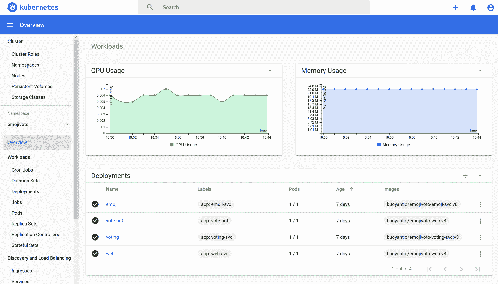

1.  在 Kubernetes 仪表板上，选择一个命名空间，然后在“概述”菜单中单击 Pods。此视图显示所选命名空间中工作负载的整体 CPU 和内存利用率：


1.  在集群菜单下选择节点。此视图显示集群中的节点以及 CPU 和内存的利用率：

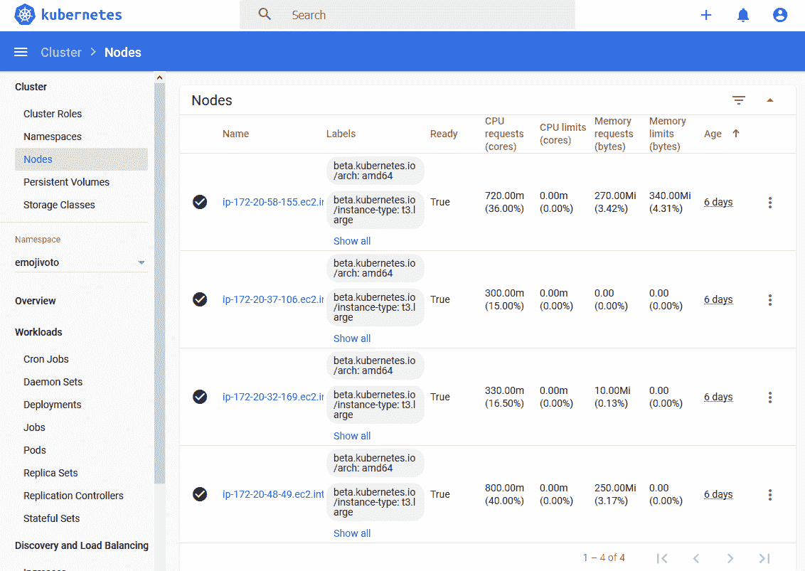

如果请求和限制设置得非常高，那么它们可能会占用集群超出预期的份额。

### 监控节点健康

在本教程中，我们将学习如何在 Kubernetes 集群中创建一个 DaemonSet 来监视节点健康。节点问题检测器将从守护程序收集节点问题，并将其报告给 API 服务器作为 NodeCondition 和 Event：

1.  首先，从`/src/chapter8`文件夹中检查`node-problem-detector.yaml`文件的内容，并创建 DaemonSet 来运行节点问题检测器：

```
$ cat debug/node-problem-detector.yaml
$ kubectl apply -f debug/node-problem-detector.yaml
```

1.  获取集群中节点的列表。此命令将返回工作节点和主节点：

```
$ kubectl get nodes
NAME                          STATUS ROLES  AGE   VERSION
ip-172-20-32-169.ec2.internal Ready  node   6d23h v1.14.6
ip-172-20-37-106.ec2.internal Ready  node   6d23h v1.14.6
ip-172-20-48-49.ec2.internal  Ready  master 6d23h v1.14.6
ip-172-20-58-155.ec2.internal Ready  node   6d23h v1.14.6
```

1.  通过将以下命令中的节点名称替换为您的节点名称并运行它来描述节点的状态。在输出中，检查`Conditions`部分是否有错误消息。以下是输出的示例：

```
$ kubectl describe node ip-172-20-32-169.ec2.internal | grep -i condition -A 20 | grep Ready -B 20
Conditions:
 Type Status LastHeartbeatTime LastTransitionTime Reason Message
 ---- ------ ----------------- ------------------ ------ -------
 NetworkUnavailable False Sat, 12 Oct 2019 00:06:46 +0000 Sat, 12 Oct 2019 00:06:46 +0000 RouteCreated RouteController created a route
 MemoryPressure False Fri, 18 Oct 2019 23:43:37 +0000 Sat, 12 Oct 2019 00:06:37 +0000 KubeletHasSufficientMemory kubelet has sufficient memory available
 DiskPressure False Fri, 18 Oct 2019 23:43:37 +0000 Sat, 12 Oct 2019 00:06:37 +0000 KubeletHasNoDiskPressure kubelet has no disk pressure
 PIDPressure False Fri, 18 Oct 2019 23:43:37 +0000 Sat, 12 Oct 2019 00:06:37 +0000 KubeletHasSufficientPID kubelet has sufficient PID available
 Ready True Fri, 18 Oct 2019 23:43:37 +0000 Sat, 12 Oct 2019 00:06:37 +0000 KubeletReady kubelet is posting ready status
```

1.  此外，您可以通过将命令的最后一部分替换为其中一个条件来检查`KernelDeadlock`、`MemoryPressure`和`DiskPressure`条件。以下是`KernelDeadlock`的示例：

```
$ kubectl get node ip-172-20-32-169.ec2.internal -o yaml | grep -B5 KernelDeadlock
 - lastHeartbeatTime: "2019-10-18T23:58:53Z"
 lastTransitionTime: "2019-10-18T23:49:46Z"
 message: kernel has no deadlock
 reason: KernelHasNoDeadlock
 status: "False"
 type: KernelDeadlock
```

节点问题检测器可以检测无响应的运行时守护程序；硬件问题，如坏的 CPU、内存或磁盘；内核问题，包括内核死锁条件；损坏的文件系统；无响应的运行时守护程序；以及基础设施守护程序问题，如 NTP 服务中断。

## 另请参阅

+   Kubernetes Metrics Server 设计文档：[`github.com/kubernetes/community/blob/master/contributors/design-proposals/instrumentation/metrics-server.md`](https://github.com/kubernetes/community/blob/master/contributors/design-proposals/instrumentation/metrics-server.md)

+   在 OpenShift 容器平台中配置和使用监控堆栈：[`access.redhat.com/documentation/en-us/openshift_container_platform/4.2/html/monitoring/index`](https://access.redhat.com/documentation/en-us/openshift_container_platform/4.2/html/monitoring/index)

+   Krex，一个 Kubernetes 资源浏览器：[`github.com/kris-nova/krex`](https://github.com/kris-nova/krex)

# 检查容器

在本节中，我们将解决与 pod 卡在 Pending、ImagePullBackOff 或 CrashLoopBackOff 状态相关的问题。您将学习如何检查和调试在 Kubernetes 中遇到部署问题的 pod。

## 准备工作

确保您已准备好一个 Kubernetes 集群，并配置了`kubectl`以管理集群资源。

## 如何操作…

该部分进一步分为以下子部分，以使过程更加简单：

+   检查处于 Pending 状态的 pod

+   检查处于 ImagePullBackOff 状态的 pod

+   检查处于 CrashLoopBackOff 状态的 pod

### 检查处于 Pending 状态的 pod

当您在 Kubernetes 上部署应用程序时，不可避免地会需要获取有关应用程序的更多信息。在这个示例中，我们将学习检查常见的 pod 问题，即 pod 卡在 Pending 状态：

1.  在`/src/chapter8`文件夹中，检查`mongo-sc.yaml`文件的内容，并运行以下命令部署它。部署清单包括具有三个副本的 MongoDB Statefulset，Service，并且由于参数错误而卡在 Pending 状态，我们将对其进行检查以找到问题的根源：

```
$ cat debug/mongo-sc.yaml
$ kubectl apply -f debug/mongo-sc.yaml
```

1.  通过运行以下命令列出 pod。您会注意到`mongo-0` pod 的状态是`Pending`：

```
$ kubectl get pods
NAME    READY STATUS  RESTARTS AGE
mongo-0 0/2   Pending 0        3m
```

1.  使用`kubectl describe pod`命令获取有关 pod 的其他信息，并查找`Events`部分。在这种情况下，`Warning`指向未绑定的`PersistentVolumeClaim`：

```
$ kubectl describe pod mongo-0
...
Events:
 Type    Reason           Age    From          Message
 ----    ------           ----   ----          -------
 Warning FailedScheduling 2m34s (x34 over 48m) default-scheduler pod has unbound immediate PersistentVolumeClaims (repeated 3 times)

```

1.  现在我们知道需要查看 PVC 状态，这要归功于上一步的结果，让我们获取 PVC 列表以检查问题。您会看到 PVC 也处于`Pending`状态：

```
$ kubectl get pvc
NAME              STATUS  VOLUME CAPACITY ACCESS MODES STORAGECLASS AGE
mongo-pvc-mongo-0 Pending                              storageclass 53m
```

1.  使用`kubectl describe pvc`命令获取有关 PVC 的其他信息，并查看事件的描述位置。在这种情况下，`Warning`指向一个名为`storageclass`的缺失存储类：

```
$ kubectl describe pvc mongo-pvc-mongo-0
...
Events:
 Type    Reason             Age  From           Message
 ----    ------             ---- ----           -------
 Warning ProvisioningFailed 70s  (x33 over 58m) persistentvolume-controller storageclass.storage.k8s.io "storageclass" not found

```

1.  列出存储类。您会注意到没有名为`storageclass`的存储类：

```
$ kubectl get sc
NAME                            PROVISIONER AGE
default                         kubernetes.io/aws-ebs 16d
gp2                             kubernetes.io/aws-ebs 16d
openebs-cstor-default (default) openebs.io/provisioner-iscsi 8d
openebs-device                  openebs.io/local 15d
openebs-hostpath                openebs.io/local 15d
openebs-jiva-default            openebs.io/provisioner-iscsi 15d
openebs-snapshot-promoter       volumesnapshot.external-storage.k8s.io/snapshot-promoter 15d
```

1.  现在我们知道我们在*步骤 1*中应用的清单文件使用了一个不存在的存储类。在这种情况下，您可以创建缺失的存储类，或者编辑清单以包含现有的存储类来解决问题。

让我们创建一个缺失的存储类，从现有的默认存储类中创建，就像下面的示例中所示`gp2`：

```
$ kubectl create -f sc-gp2.yaml
```

1.  通过运行以下命令列出 pod。您会注意到在*步骤 2*中先前处于`Pending`状态的所有 pod 现在的状态为`Running`：

```
$ kubectl get pods
NAME    READY STATUS  RESTARTS AGE
mongo-0 2/2   Running 0        2m18s
mongo-1 2/2   Running 0        88s
mongo-2 2/2   Running 0        50s
```

您已成功学会了如何检查为什么 pod 处于挂起状态并修复它。

### 检查处于 ImagePullBackOff 状态的 pod

有时您的清单文件可能会在图像名称中出现拼写错误，或者图像位置可能已更改。因此，当您部署应用程序时，容器图像将无法找到，并且部署将被卡住。在这个教程中，我们将学习如何检查处于`ImagePullBackOff`状态的 pod 的常见问题：

1.  在`/src/chapter8`文件夹中，检查`mongo-image.yaml`文件的内容，并通过运行以下命令部署它。部署清单包括具有三个副本的 MongoDB Statefulset，Service，并且由于容器图像名称中的拼写错误而被卡住在 ImagePullBackOff 状态，我们将对其进行检查以找到源：

```
$ cat debug/mongo-image.yaml
$ kubectl apply -f debug/mongo-image.yaml
```

1.  通过运行以下命令列出 pod。您会注意到`mongo-0` pod 的状态为`ImagePullBackOff`：

```
$ kubectl get pods
NAME    READY STATUS           RESTARTS AGE
mongo-0 0/2   ImagePullBackOff 0        32s
```

1.  使用`kubectl describe pod`命令获取有关 pod 的其他信息，并查找`Events`部分。在这种情况下，`Warning`指向未能拉取`mongi`图像的失败：

```
$ kubectl describe pod mongo-0
...
Events:
 Type    Reason           Age    From          Message
 ----    ------           ----   ----          -------
 Warning Failed 25s (x3 over 68s) kubelet, ip-172-20-32-169.ec2.internal Error: ErrImagePull
 Warning Failed 25s (x3 over 68s) kubelet, ip-172-20-32-169.ec2.internal Failed to pull image "mongi": rpc error: code = Unknown desc = Error response from daemon: pull access denied for mongi, repository does not exist or may require 'docker login'
 Normal Pulling 25s (x3 over 68s) kubelet, ip-172-20-32-169.ec2.internal Pulling image "mongi"
 Normal BackOff 14s (x4 over 67s) kubelet, ip-172-20-32-169.ec2.internal Back-off pulling image "mongi"
 Warning Failed 14s (x4 over 67s) kubelet, ip-172-20-32-169.ec2.internal Error: ImagePullBackOff
```

1.  现在我们知道需要确认容器图像名称。正确的名称应该是`mongo`。让我们编辑清单文件`mongo-image.yaml`，并将图像名称更改为`mongo`，如下所示：

```
... 
spec:
 terminationGracePeriodSeconds: 10
 containers:
 - name: mongo
 image: mongo
 command:
...
```

1.  通过运行以下命令删除并重新部署资源：

```
$ kubectl delete -f mongo-image.yaml
$ kubectl apply -f mongo-image.yaml
```

1.  通过运行以下命令列出 pod。您会注意到在*步骤 2*中先前处于`ImagePullBackOff`状态的所有 pod 现在的状态为`Running`：

```
$ kubectl get pods
NAME    READY STATUS  RESTARTS AGE
mongo-0 2/2   Running 0        4m55s
mongo-1 2/2   Running 0        4m55s
mongo-2 2/2   Running 0        4m55s
```

您已成功学会了检查状态为`ImagePullBackOff`的 pod 并进行故障排除。

### 检查处于 CrashLoopBackOff 状态的 pod

检查处于`CrashLoopBackOff`状态的 Pod 与检查处于挂起状态的 Pod 基本类似，但可能还需要更多关于您正在创建的容器工作负载的知识。当容器内的应用程序不断崩溃、Pod 的参数配置不正确、存活探针失败或在 Kubernetes 上部署时发生错误时，就会发生`CrashLoopBackOff`。

在这个教程中，我们将学习如何检查 Pod 陷入`CrashLoopBackOff`状态的常见问题：

1.  在`/src/chapter8`文件夹中，检查`mongo-config.yaml`文件的内容，并运行以下命令部署它。部署清单包括一个具有三个副本的 MongoDB 有状态集，Service，并由于缺少配置文件而陷入`CrashLoopBackOff`状态，我们将对其进行检查以找到源：

```
$ cat debug/mongo-config.yaml
$ kubectl apply -f debug/mongo-config.yaml
```

1.  通过运行以下命令列出 Pod。您会注意到`mongo-0` Pod 的状态为`CrashLoopBackOff`或`Error`：

```
$ kubectl get pods
NAME READY STATUS RESTARTS AGE
mongo-0 1/2 CrashLoopBackOff 3 58s
```

1.  使用`kubectl describe pod`命令获取有关 Pod 的附加信息，并查找`Events`部分。在这种情况下，`Warning`显示容器已重新启动，但没有指向任何有用的信息：

```
$ kubectl describe pod mongo-0
...
Events:
 Type    Reason           Age    From          Message
 ----    ------           ----   ----          -------
...
 Normal Pulled 44s (x4 over 89s) kubelet, ip-172-20-32-169.ec2.internal Successfully pulled image "mongo"
 Warning BackOff 43s (x5 over 87s) kubelet, ip-172-20-32-169.ec2.internal Back-off restarting failed container

```

1.  当来自 Pod 的事件不够用时，您可以使用`kubectl logs`命令从 Pod 获取附加信息。使用以下命令检查 Pod 日志中的消息。日志消息指向一个丢失的文件；需要进一步检查清单：

```
$ kubectl logs mongo-0 mongo
/bin/sh: 1: cannot open : No such file
```

1.  检查并仔细查看应用程序清单文件`mongo-config.yaml`，您会发现在这种情况下缺少环境变量`MYFILE`：

```
...
 spec:
 terminationGracePeriodSeconds: 10
 containers:
 - name: mongo
 image: mongo
 command: ["/bin/sh"]
 args: ["-c", "sed \"s/foo/bar/\" < $MYFILE"]
...
```

1.  要解决此问题，您可以向部署中添加`ConfigMap`。编辑`mongo-config.yaml`文件，并通过在文件开头添加`MYFILE`参数与`ConfigMap`资源来添加缺失的文件，类似于以下内容：

```
$ cat <<EOF | kubectl apply -f -
apiVersion: v1
kind: ConfigMap
metadata:
 name: app-env
data:
 MYFILE: "/etc/profile"
EOF
```

1.  通过运行以下命令删除并重新部署资源：

```
$ kubectl delete -f mongo-image.yaml
$ kubectl apply -f mongo-image.yaml
```

1.  通过运行以下命令列出 Pod。您会注意到之前处于 CrashLoopBackOff 状态的所有 Pod 现在状态为`Running`。

```
$ kubectl get pods
NAME    READY STATUS  RESTARTS AGE
mongo-0 2/2   Running 0        4m15s
mongo-1 2/2   Running 0        4m15s
mongo-2 2/2   Running 0        4m15s
```

您已成功学会了如何检查 Pod 的 CrashLoopBackOff 问题并修复它。

## 另请参阅

+   调试 init 容器：[`kubernetes.io/docs/tasks/debug-application-cluster/debug-init-containers/`](https://kubernetes.io/docs/tasks/debug-application-cluster/debug-init-containers/)

+   调试 pods 和 ReplicationControllers [`kubernetes.io/docs/tasks/debug-application-cluster/debug-pod-replication-controller/`](https://kubernetes.io/docs/tasks/debug-application-cluster/debug-pod-replication-controller/)

+   调试 statefulset：[`kubernetes.io/docs/tasks/debug-application-cluster/debug-stateful-set/`](https://kubernetes.io/docs/tasks/debug-application-cluster/debug-stateful-set/)

+   确定 pod 失败的原因：[`kubernetes.io/docs/tasks/debug-application-cluster/determine-reason-pod-failure/`](https://kubernetes.io/docs/tasks/debug-application-cluster/determine-reason-pod-failure/)

+   Squash，用于微服务的调试器：[`github.com/solo-io/squash`](https://github.com/solo-io/squash)

# 使用 Amazon CloudWatch 进行监控

在本节中，我们将使用 Amazon CloudWatch Container Insights 来监视、隔离和诊断您的容器化应用程序和微服务环境。作为一名 DevOps 或系统工程师，您将学习如何使用 Amazon ECS CloudWatch 指标来监视服务健康状态和当前警报，使用自动化仪表板总结您的 Amazon EKS 集群的性能和健康状态，包括 pod、节点、命名空间和服务。

## 准备工作

将`k8sdevopscookbook/src`存储库克隆到您的工作站，以使用`chapter8`目录中的清单文件：

```
$ git clone https://github.com/k8sdevopscookbook/src.git
$ cd src/chapter8/
```

确保您有一个准备好的 Amazon EKS Kubernetes 集群，并且已配置`kubectl`来管理集群资源。如果您还没有，可以按照第一章中的说明*构建生产就绪的 Kubernetes 集群*在*在 Amazon Web Services 上配置 Kubernetes 集群*部分。

## 如何做…

本节进一步分为以下小节，以使流程更加简单：

+   启用 Webhook 授权模式

+   为 Amazon EKS 安装 Container Insights 代理程序

+   查看 Container Insights 指标

### 启用 Webhook 授权模式

如果您使用`kops`选项在 AWS EC2 实例上部署了 Kubernetes 集群，而不是使用 Amazon EKS，则您的 kubelet 需要启用 Webhook 授权模式。

让我们按照以下步骤进行：

1.  使用以下两个标志启用`webhook`授权模式。第一个标志允许使用 ServiceAccount 令牌对 kubelet 进行身份验证。第二个标志允许 kubelet 执行 RBAC 请求并决定请求资源（在本例中为 Amazon CloudWatch）是否被允许访问资源端点：

```
--authentication-token-webhook=true 
--authorization-mode=Webhook 
```

1.  您还需要为 Kubernetes 工作节点的 IAM 角色添加必要的策略。在[`console.aws.amazon.com/ec2/`](https://console.aws.amazon.com/ec2/)上打开 Amazon EC2 控制台。

1.  在资源下，点击“运行实例”：

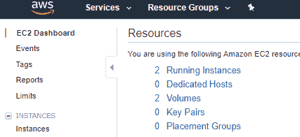

1.  从列表中选择一个工作节点实例，并在“描述”选项卡上选择 IAM 角色。在我们的示例中，eksctl-adorable-rainbow-157155665-NodeInstanceRole-MOT7WBCOOOHE 是 IAM 角色：

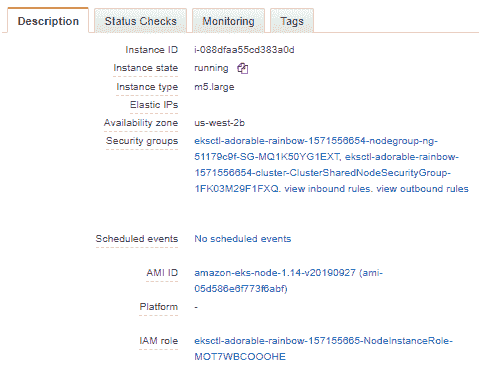

1.  在“权限”选项卡上，点击“附加策略”按钮：

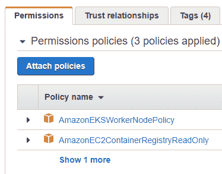

1.  在搜索框中，键入`CloudWatchAgentServerPolicy`并选择该策略：

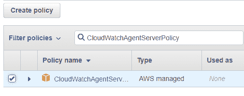

1.  点击“附加策略”按钮将策略附加到您的 IAM 角色：

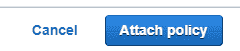

现在，您已成功启用了 Webhook 授权模式并向 IAM 角色添加了所需的策略。

### 为 Amazon EKS 安装容器洞察代理

在这个教程中，我们将启用 CloudWatch 代理来收集我们的 EKS Kubernetes 集群的集群指标：

1.  使用以下命令在您的集群上创建名为`amazon-cloudwatch`的命名空间：

```
$ cat <<EOF | kubectl apply -f -
apiVersion: v1
kind: Namespace
metadata:
 name: amazon-cloudwatch
 labels:
 name: amazon-cloudwatch
EOF
```

1.  为您在*步骤 1*中创建的`amazon-cloudwatch`命名空间创建 CloudWatch 代理的服务帐户。以下命令还将创建`cloudwatch-agent-role` ClusterRole 和 ClusterRoleBinding：

```
$ kubectl apply -f cloudwatch/cwagent-serviceaccount.yaml
```

1.  使用`eksctl`命令或从 Amazon 容器服务仪表板获取您的 EKS 集群名称。在这里，我们将使用`eksctl`获取集群名称。在我们的示例中，集群名称是`adorable-rainbow-1571556654`：

```
$ eksctl get cluster
NAME                        REGION
adorable-rainbow-1571556654 us-west-2
```

1.  为 CloudWatch 代理创建 ConfigMap。在运行以下命令之前，请用您在*步骤 3*中的集群名称替换`"cluster_name": "adorable-rainbow-1571556654"`：

```
$ cat <<EOF | kubectl apply -f -
apiVersion: v1
kind: ConfigMap
metadata:
 name: cwagentconfig
 namespace: amazon-cloudwatch
data:
 cwagentconfig.json: |
 {
 "logs": {
 "metrics_collected": {
 "kubernetes": {
 "cluster_name": "{{cluster_name}}",
 "metrics_collection_interval": 60
 }
 },
 "force_flush_interval": 5
 }
 }
EOF
```

1.  部署 CloudWatch 代理作为 DaemonSet。上述命令将使用 StatsD，这是一个监听通过 UDP 或 TCP 发送的统计信息（如计数器和计时器）的网络守护程序，并将聚合发送到 CloudWatch，如果可用还会使用可插拔的后端服务：

```
$ kubectl apply -f cloudwatch/cwagent.yaml
```

1.  通过运行以下命令来验证 CloudWatch 代理 Pod 是否已创建。由于代理作为 DaemonSets 运行，您应该能够看到每个工作节点列出的一个 Pod。在我们的示例中，我们有两个工作节点和两个代理 Pod 正在运行：

```
$ kubectl get pods -n amazon-cloudwatch
NAME                   READY STATUS  RESTARTS AGE
cloudwatch-agent-dtpxt 1/1   Running 0        67s
cloudwatch-agent-j7frt 1/1   Running 0        67s
```

完成后，CloudWatch 代理将开始向 CloudWatch 容器洞察服务发送性能日志事件。

### 查看容器洞察指标

在这个教程中，我们将学习如何使用 CloudWatch 来监视我们的 Kubernetes 集群中的节点和 Pod 指标：

1.  在[`console.aws.amazon.com/cloudwatch/`](https://console.aws.amazon.com/cloudwatch/)上打开 CloudWatch 控制台：

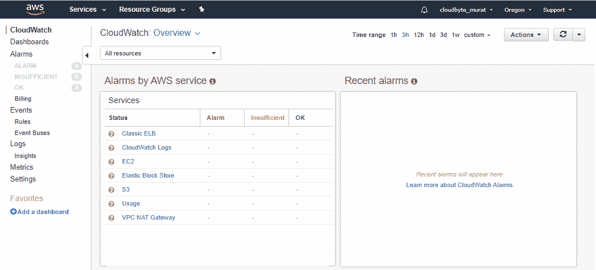

1.  单击“概览”选项旁边的向下箭头按钮，然后从列表中选择“容器洞察”：

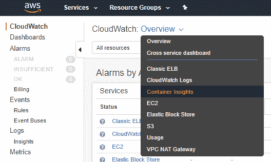

1.  要查看 EKS 节点的健康状况和统计信息，请在左上角切换到 EKS 节点。新视图上的图表将显示资源利用率、集群故障和节点数量，类似于以下截图的历史视图：

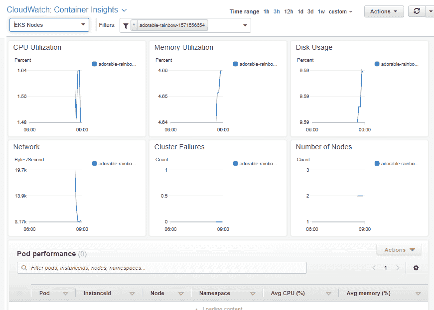

1.  要查看容器性能统计信息，请在左上角切换到 EKS Pod。新视图上的图表将显示 Pod 的总资源利用率，并列出 Pod 的各自 CPU 和内存消耗百分比，类似于以下截图：

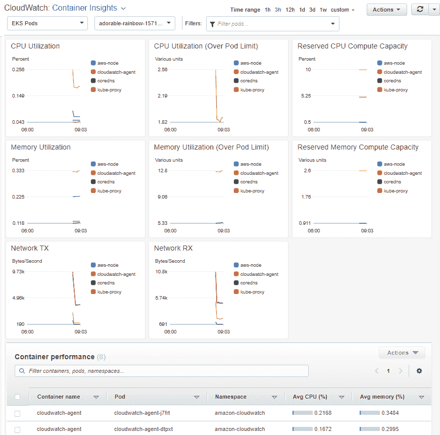

1.  要查看任何资源的详细日志或 AWS X-Ray 跟踪，请从列表中选择资源名称，然后单击“操作”按钮。从下拉菜单中，您可以选择要查看的日志。选择后，日志将在新窗口中打开：

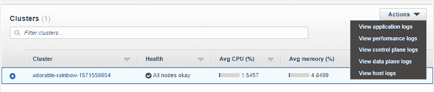

现在您已经学会了如何使用容器洞察来监视您的 Kubernetes 集群中的节点和 Pod 指标。 

## 另请参阅

+   使用容器洞察[`docs.aws.amazon.com/AmazonCloudWatch/latest/monitoring/ContainerInsights.html`](https://docs.aws.amazon.com/AmazonCloudWatch/latest/monitoring/ContainerInsights.html)

+   使用 CloudWatch 异常检测 [`docs.aws.amazon.com/AmazonCloudWatch/latest/monitoring/CloudWatch_Anomaly_Detection.html`](https://docs.aws.amazon.com/AmazonCloudWatch/latest/monitoring/CloudWatch_Anomaly_Detection.html)

+   Container Insights 收集的指标列表：[`docs.aws.amazon.com/AmazonCloudWatch/latest/monitoring/Container-Insights-metrics-EKS.html`](https://docs.aws.amazon.com/AmazonCloudWatch/latest/monitoring/Container-Insights-metrics-EKS.html)

# 使用 Google Stackdriver 进行监控

在本节中，我们将使用 Google Stackdriver Kubernetes Engine 监控来监视、隔离和诊断您的容器化应用程序和微服务环境。您将学习如何使用 Stackdriver Kubernetes Engine 监控来聚合来自**Google Kubernetes Engine**（**GKE**）的 Kubernetes 环境的日志、事件和指标，以帮助您了解您的应用在生产环境中的行为。

## 准备工作

确保您已准备好一个 GKE 集群，并配置了`kubectl`来管理集群资源。如果您还没有，请按照第一章，*构建生产就绪的 Kubernetes 集群*中的*在 Google 云平台上配置 Kubernetes 集群*的说明进行操作。

## 如何做…

本节进一步分为以下子节，以使流程更加简单：

+   安装 GKE 的 Stackdriver Kubernetes Engine 监控支持

+   在 Stackdriver 上配置工作空间

+   使用 Stackdriver 监控 GKE 指标

### 安装 GKE 的 Stackdriver Kubernetes Engine 监控支持

安装 Stackdriver 监控支持可以让您轻松监控 GKE 集群，调试日志，并使用高级分析和跟踪功能分析您的集群性能。在这个示例中，我们将启用 Stackdriver Kubernetes Engine 监控支持，以从我们的 GKE 集群中收集集群指标：

1.  在[`console.cloud.google.com/kubernetes`](https://console.cloud.google.com/kubernetes)上打开 Google Kubernetes Engine 控制台。在这个控制台上，您将看到您的 GKE 集群列表。在我们的示例中，我们只有一个集群，它被称为 k8s-devops-cookbook-1：


1.  单击集群旁边的小笔形编辑图标：


1.  在集群配置页面上，确保“传统 Stackdriver 日志记录”和“传统 Stackdriver 监控”已禁用，并且“Stackdriver Kubernetes Engine 监控”选项已设置为启用：


1.  单击保存按钮以应用对集群的更改。

### 在 Stackdriver 上配置工作区

Stackdriver 监控帮助您更深入地了解您的公共云。Stackdriver 的监控功能包括监控、日志记录、跟踪、错误报告和警报，以收集您的公共云服务的性能和诊断数据。Kubernetes 监控是完整解决方案的一小部分。在本教程中，您将学习如何在首次访问后配置 Stackdriver 工作区：

1.  在[`app.google.stackdriver.com`](https://app.google.stackdriver.com)上打开 Stackdriver 控制台。第一次访问控制台时，您需要将工作区添加到控制台，否则您将看到一个空的仪表板，类似于以下内容：

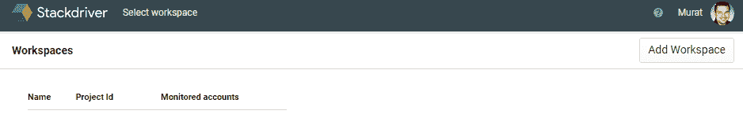

1.  单击“添加工作区”按钮以包括您现有的工作区。您将被要求输入您的 Google Cloud Platform 项目名称。单击空的“选择项目”字段，并从列表中选择您的项目。在我们的示例中，它是 DevOpsCookBook。选择项目后，单击“创建工作区”按钮：

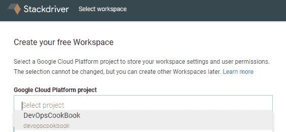

1.  Stackdriver 还允许您监控 AWS 账户。对于本教程，我们将跳过此选项。单击“跳过 AWS 设置”以进行下一步：

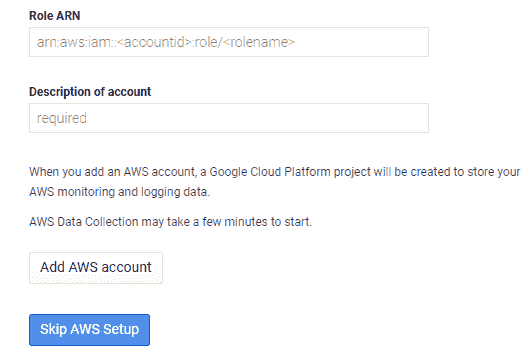

1.  在“安装 Stackdriver 代理”窗口中，单击“继续”按钮。

1.  在“通过电子邮件获取报告”窗口中，选择要通过电子邮件发送报告的频率。选择每周报告。请注意，您始终可以选择不发送报告，并稍后启用此功能：

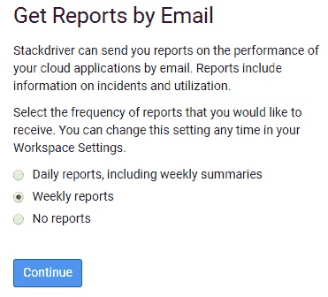

1.  最后，单击“启动监控”按钮以访问 Stackdriver 控制台：

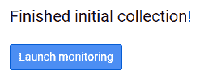

现在您已经配置了 Stackdriver 工作区，以收集来自您的公共云服务的诊断数据。

### 使用 Stackdriver 监控 GKE 指标

安装 Stackdriver 监控支持可以让您轻松监视 GKE 集群，调试日志，并使用高级分析和跟踪功能分析集群性能。在本示例中，我们将启用 Stackdriver Kubernetes Engine 监控支持，以从我们的 GKE 集群收集集群指标：

1.  在按照*在 Stackdriver 上配置工作空间*的步骤后，打开 Stackdriver 控制台[`app.google.stackdriver.com`](https://app.google.stackdriver.com)：

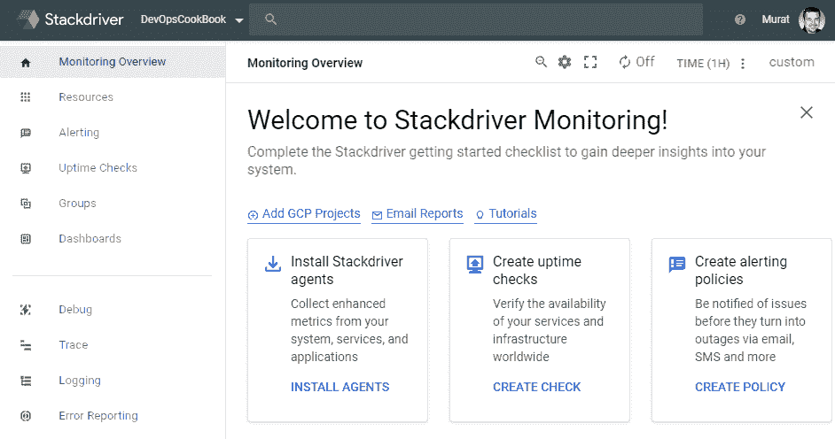

1.  从资源菜单中，点击“Kubernetes Engine”选项：

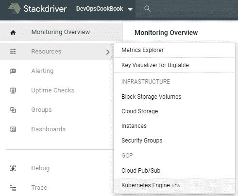

1.  Kubernetes Engine 视图将显示启用了 Stackdriver Kubernetes Engine 监控的集群列表。在我们的示例中，您可以看到我们有一个可用的集群：

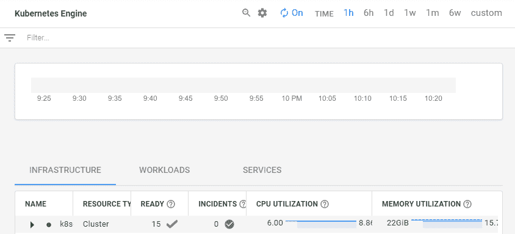

1.  在基础设施选项卡上，点击集群名称旁边的展开图标。Stackdriver 将展开列表，显示各个工作节点。在“就绪”列中，您可以看到每个节点上部署并处于就绪状态的 pod 数量。在“CPU 利用率”列中，左侧的值显示总可用 CPU 数，右侧的值显示当前利用率百分比。类似地，在“内存利用率”列中，左侧的值显示总可用内存（GiB），右侧的值显示当前利用率百分比：


1.  点击节点名称旁边的展开图标，列表将展开以显示部署在该特定节点上的 pod：

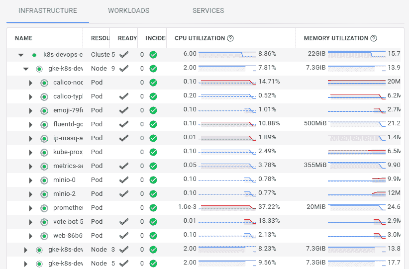

1.  点击集群中的一个 pod。Stackdriver 将显示 pod 指标的详细视图，包括 pod 重启、CPU、内存、存储和网络利用率。在我们的示例中，我们可以看到 Prometheus pod 的指标：

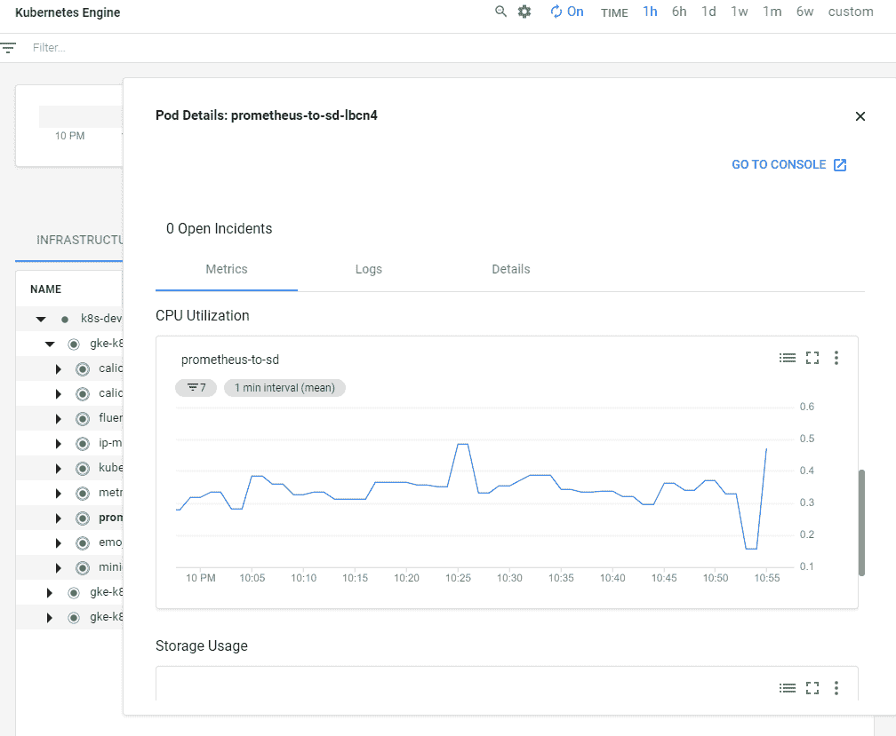

1.  点击“日志”选项卡切换到日志摘要视图。此视图将只显示最近的日志：

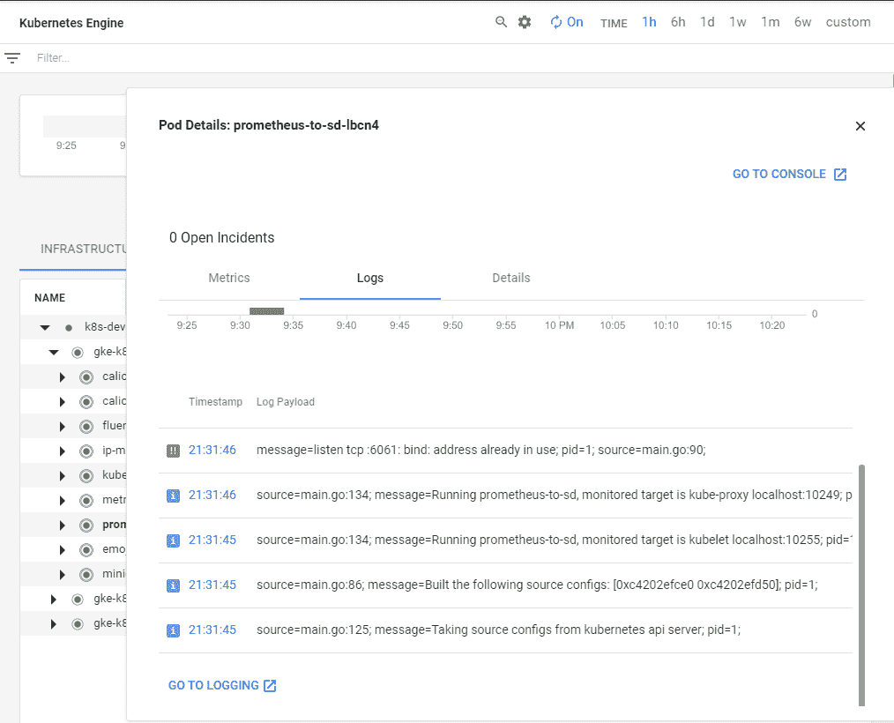

1.  点击“转到控制台”按钮，打开详细的日志视图，您可以在其中查看旧日志并使用过滤器创建指标：

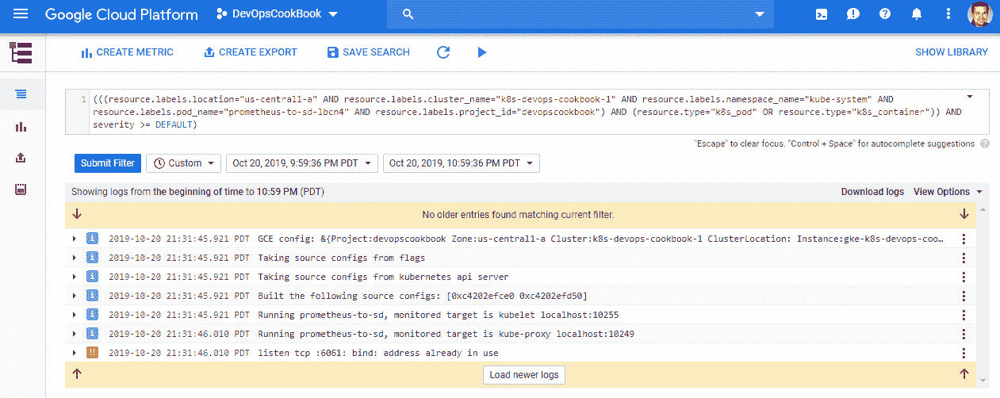

现在您知道如何使用 Stackdriver 来监视 GKE 集群和部署在 GKE 集群上的资源的健康状况、性能指标和日志。

## 另请参阅

+   Google Stackdriver 文档：[`cloud.google.com/stackdriver/docs/`](https://cloud.google.com/stackdriver/docs/)

+   使用 Prometheus 与 Stackdriver Kubernetes Engine 监控：[`cloud.google.com/monitoring/kubernetes-engine/prometheus`](https://cloud.google.com/monitoring/kubernetes-engine/prometheus)

+   Stackdriver Prometheus sidecar: [`github.com/Stackdriver/stackdriver-prometheus-sidecar`](https://github.com/Stackdriver/stackdriver-prometheus-sidecar)

+   GCP 倡导者在 Stackdriver 上发布的技术文章集合：[`medium.com/google-cloud/tagged/stackdriver`](https://medium.com/google-cloud/tagged/stackdriver)

# 使用 Azure Monitor 进行监控

在本节中，我们将使用 Azure Monitor 来监视、隔离和诊断您的容器化应用程序和微服务环境。您将学习如何使用 Azure Monitor 来聚合来自**Azure Kubernetes Service**（**AKS**）上的 Kubernetes 环境的日志、事件和指标，以帮助您了解应用程序在生产环境中的行为。

## 做好准备

确保您已经准备好一个 AKS 集群，并且已经配置好`kubectl`来管理集群资源。如果您还没有，您可以按照《第一章》中的说明进行操作，即《构建生产就绪的 Kubernetes 集群》，在《在 Google Cloud Platform 上配置 Kubernetes 集群》的教程中。

## 如何做…

本节进一步分为以下子节，以使流程更加简单：

+   使用 CLI 为 AKS 集群启用 Azure Monitor 支持

+   使用 Azure Monitor 监控 AKS 性能指标

+   使用 Azure Monitor 查看实时日志

### 使用 CLI 为 AKS 启用 Azure Monitor 支持

启用 Azure Monitor 以便从控制器、节点和容器中收集内存和处理器指标，这些指标通过 Kubernetes Metrics API 在 Kubernetes 中可用。

在这个教程中，我们将启用从 AKS Kubernetes 集群收集指标和日志的监控，通过 Log Analytics 代理的容器化版本：

1.  如果您按照第一章中的*在 AKS 上部署托管的 Kubernetes 集群*配方部署了您的 AKS 集群，您可以使用以下命令为您的集群启用 Azure Monitor。在运行以下命令之前，将名称`AKSCluster`替换为您的 AKS 集群名称，并将资源组`k8sdevopscookbook`替换为您在创建集群时使用的 Azure 资源组名称：

```
$ az aks enable-addons -a monitoring \
--name AKSCluster --resource-group k8sdevopscookbook
```

如果您正在部署新的集群，可以在 CLI 命令中添加`--enable-addons monitoring`参数，以在集群创建期间为您的 AKS 集群启用 Azure Monitor 功能，如下所示：**`$ az aks create --resource-group k8sdevopscookbook \`**

**`--name AKSCluster \`**

**`--node-count 3 \`**

**`--service-principal <appId> \`**

**`--client-secret <password> \`**

**`--enable-addons monitoring  \`**

**`--generate-ssh-keys`**

完成后，此命令将为您的 AKS 集群启用 Azure Monitor 和日志记录。

### 使用 Azure Monitor 监视 AKS 性能指标

可以直接从 AKS 集群管理仪表板和 Azure Monitor 仪表板查看 AKS 集群的性能指标。在此配方中，我们将通过 Azure Monitor 监视 AKS 性能指标：

1.  按照*使用 CLI 为 AKS 启用 Azure Monitor 支持*的配方后，打开 Azure 门户网站[`portal.azure.com`](https://portal.azure.com)，单击“Kubernetes 服务”按钮，转到 AKS 管理仪表板：

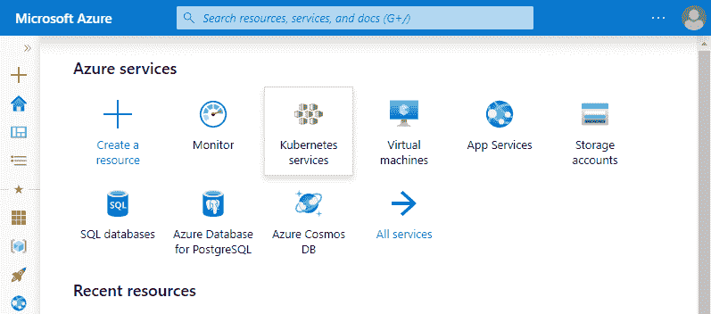

1.  在 Kubernetes 服务视图中，单击您的集群名称。在我们的示例中，它是 AKSCluster：

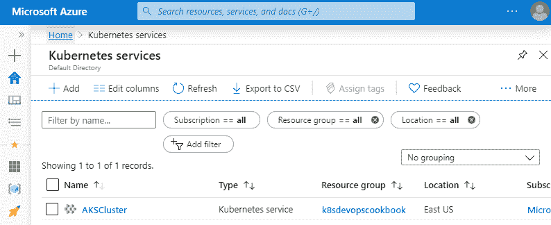

1.  单击“监视容器”菜单，打开您的 AKS 集群的 Azure Monitor Insights 视图：

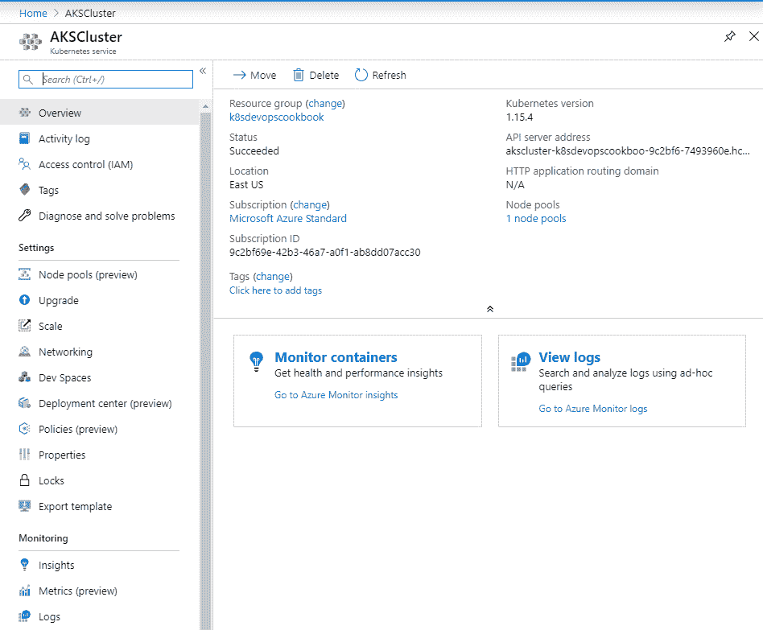

1.  有关您的 AKS 集群的监视信息分为五个类别：集群、节点、控制器、容器和部署。在此视图中，在集群选项卡上，您将能够查看节点 CPU 和内存利用率、AKS 节点计数和活动 pod 计数，就像这样：

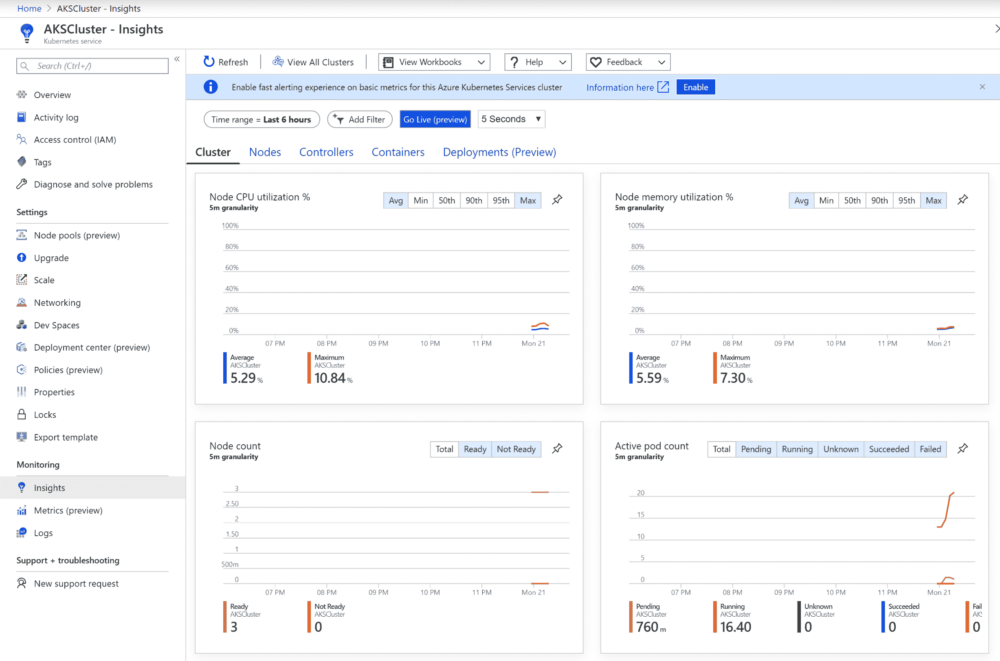

1.  单击“节点”选项卡，切换到节点性能指标视图。默认情况下，CPU 使用数据显示为过去 6 小时的 95th 百分位数。可以使用页面上的下拉菜单调整这些选项：

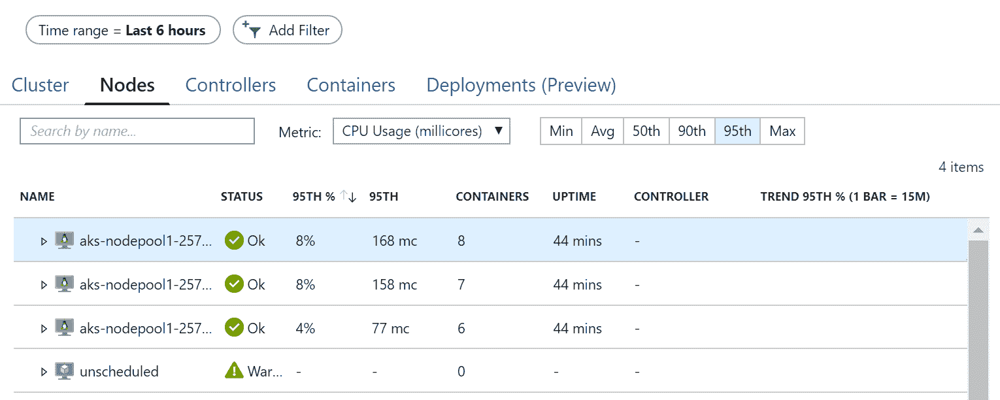

1.  单击节点名称旁边的展开图标，列表将展开显示部署在该特定节点上的 Pod 和容器。在此视图中，可以查看每个资源的 CPU 利用率和正常运行时间：

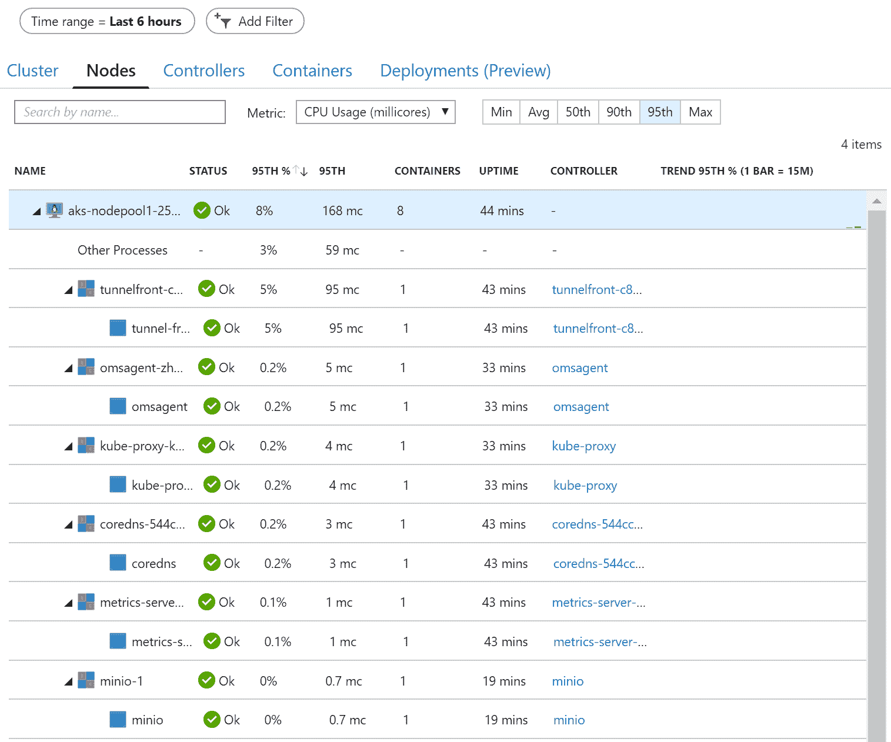

现在你知道如何通过 Azure Monitor insights 监视 AKS 性能指标了。

### 使用 Azure Monitor 查看实时日志

除了性能指标，Azure Monitor 还可以帮助查看 AKS 集群资源的日志。在本教程中，我们将学习如何使用 Azure Monitor 访问事件和日志：

1.  在你的集群中，要显示 Pod 事件和实时指标，你需要应用`ClusterRoleBinding`。通过在你的 AKS 集群上运行以下命令来创建`ClusterRole`：

```
$ cat <<EOF | kubectl apply -f -
apiVersion: rbac.authorization.k8s.io/v1 
kind: ClusterRole 
metadata: 
 name: containerHealth-log-reader 
rules: 
 - apiGroups: [""] 
 resources: ["pods/log", "events"] 
 verbs: ["get", "list"] 
EOF
```

1.  通过在你的 AKS 集群上运行以下命令来创建`ClusterRoleBinding`：

```
$ cat <<EOF | kubectl apply -f -
apiVersion: rbac.authorization.k8s.io/v1 
kind: ClusterRoleBinding 
metadata: 
 name: containerHealth-read-logs-global 
roleRef: 
 kind: ClusterRole 
 name: containerHealth-log-reader 
 apiGroup: rbac.authorization.k8s.io 
subjects: 
 - kind: User 
 name: clusterUser 
 apiGroup: rbac.authorization.k8s.io
EOF
```

1.  单击“监视容器”菜单，打开你的 AKS 集群的 Azure Monitor insights 视图。

1.  单击节点名称旁边的展开图标，列表将展开显示部署在该特定节点上的 Pod 和容器：


1.  单击你的集群中的一个 Pod。Insights 将在右侧面板上显示 Pod 指标的详细视图：

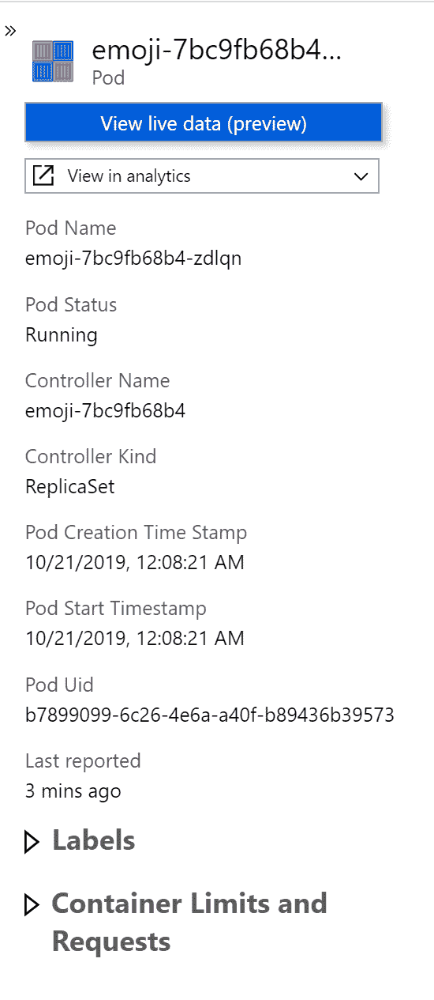

1.  在右侧窗格中，单击“查看实时数据”按钮。此选项将展开视图，显示来自 Pod 的实时事件和实时指标，如下图所示。事件可用于排除本章“检查容器”部分中讨论的 Pod 问题：

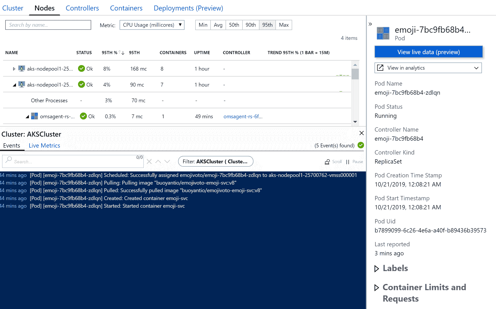

1.  你在视图中看到的日志和事件消息取决于所选的资源类型。单击“在分析中查看”按钮以切换到 Kubernetes 事件日志：

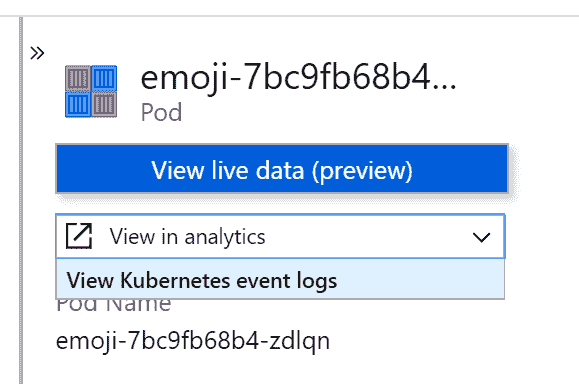

1.  在此视图中，您将能够查看和过滤 Pod 事件：


1.  这次，单击 Pod 内的一个容器。Insights 将在右侧面板中显示容器信息和性能指标的详细视图：

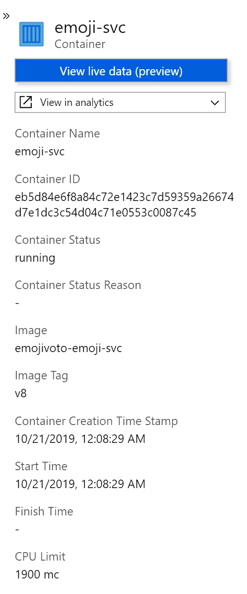

1.  在右侧窗格中，单击“在分析中查看”按钮以切换到“查看容器日志”：

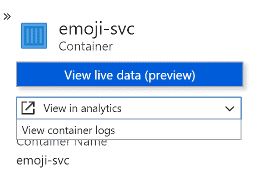

1.  在此视图中，您将能够查看和过滤容器日志：

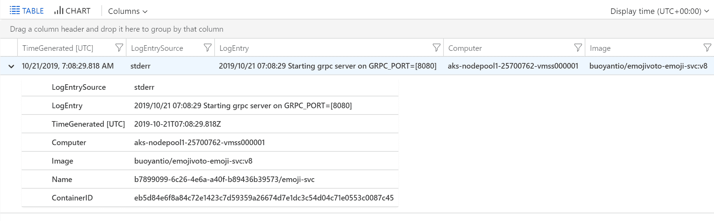

现在您知道如何使用 Azure 监视来监视 AKS 集群的健康状况、性能指标和日志，以及在 AKS 集群上部署的资源。

## 另请参阅

+   Azure 容器监视文档：[`docs.microsoft.com/en-us/azure/azure-monitor/insights/container-insights-overview`](https://docs.microsoft.com/en-us/azure/azure-monitor/insights/container-insights-overview)

+   使用 Azure 监视与 Prometheus：[`azure.microsoft.com/en-us/blog/azure-monitor-for-containers-with-prometheus-now-in-preview/`](https://azure.microsoft.com/en-us/blog/azure-monitor-for-containers-with-prometheus-now-in-preview/)

# 使用 Prometheus 和 Grafana 监视 Kubernetes

在本节中，我们将在 Kubernetes 集群上部署 Prometheus 和 Grafana。您将学习如何使用 Prometheus 监视 Kubernetes 服务，并使用 Grafana 仪表板可视化集群和应用程序指标。

## 准备就绪

将`k8sdevopscookbook/src`存储库克隆到您的工作站，以便在`chapter8`目录中使用清单文件：

```
$ git clone https://github.com/k8sdevopscookbook/src.git
$ cd /src/chapter8
```

确保您已准备好 Kubernetes 集群，并配置了`kubectl`以管理集群资源。

## 如何做…

本节进一步分为以下子节，以使流程更加简单：

+   使用 Helm 图表部署 Prometheus Operator

+   使用 Grafana 仪表板监视指标

+   将 Grafana 仪表板添加到监视应用程序

### 使用 Helm 图表部署 Prometheus

Prometheus 是一个流行的开源解决方案，用于事件监视和警报。Prometheus 记录实时指标在时间序列数据库中，它是 Kubernetes 集群中最受欢迎的组件之一。几乎所有新的托管 Kubernetes 解决方案都会在集群部署的某种方式上安装 Prometheus。在本教程中，您将学习如何使用 Helm 图表在 Kubernetes 集群上部署 Prometheus：

1.  更新 Helm 存储库。此命令将从公共图表存储库本地获取最新的图表：

```
$ helm repo update
```

1.  使用`helm install`命令在`monitoring`命名空间中部署 Prometheus Operator。此命令将部署 Prometheus 以及 Alertmanager、Grafana、node-exporter 和 kube-state-metrics 附加组件；基本上，这是一组在 Kubernetes 集群上使用 Prometheus 所需的组件：

```
$ helm install stable/prometheus-operator --name prometheus \
 --namespace monitoring
```

1.  验证在监视命名空间中部署的 Pod 的状态：

```
$ kubectl get pods -n monitoring
NAME READY STATUS RESTARTS AGE
alertmanager-prometheus-prometheus-oper-alertmanager-0 2/2 Running 0 88s
prometheus-grafana-6c6f7586b6-f9jbr 2/2 Running 0 98s
prometheus-kube-state-metrics-57d6c55b56-wf4mc 1/1 Running 0 98s
prometheus-prometheus-node-exporter-8drg7 1/1 Running 0 98s
prometheus-prometheus-node-exporter-lb7l5 1/1 Running 0 98s
prometheus-prometheus-node-exporter-vx7w2 1/1 Running 0 98s
prometheus-prometheus-oper-operator-86c9c956dd-88p82 2/2 Running 0 98s
prometheus-prometheus-prometheus-oper-prometheus-0 3/3 Running 1 78s
```

现在您已经安装了 Prometheus，并且具备在 Kubernetes 环境中操作所需的组件包。

### 使用 Grafana 仪表板监视指标

Grafana 是一个开源的分析和监控解决方案。默认情况下，Grafana 用于查询 Prometheus。按照以下说明来公开包含的 Grafana 服务实例并通过 Web 浏览器访问它：

1.  获取`monitoring`命名空间中的服务列表：

```
$ kubectl get svc -n monitoring
NAME                                    TYPE      CLUSTER-IP   EXTERNAL-IP PORT(S)                    AGE
alertmanager-operated                   ClusterIP None         <none>      9093/TCP,9094/TCP,9094/UDP 33m
prometheus-grafana                      ClusterIP 10.0.1.132   <none>      80/TCP                     33m
prometheus-kube-state-metrics           ClusterIP 10.0.69.144  <none>      8080/TCP                   33m
prometheus-operated                     ClusterIP None         <none>      9090/TCP                   33m
prometheus-prometheus-node-exporter     ClusterIP 10.0.100.183 <none>      9100/TCP                   33m
prometheus-prometheus-oper-alertmanager ClusterIP 10.0.202.140 <none>      9093/TCP                   33m
prometheus-prometheus-oper-operator     ClusterIP 10.0.174.214 <none>      8080/TCP,443/TCP           33m
prometheus-prometheus-oper-prometheus   ClusterIP 10.0.243.177 <none>      9090/TCP                   33m
```

1.  创建端口转发以使用`kubectl port-forward`命令访问 Grafana UI。此命令将本地端口`8000`转发到运行中的 Grafana pod 的端口`3000`：

```
$ kubectl port-forward -n monitoring prometheus-grafana 8000:80
```

作为替代方案，您可以使用`kubectl edit svc prometheus-grafana -n monitoring`命令来修补`prometheus-grafana`服务，并将服务类型`ClusterIP`更改为`LoadBalancer`，以使用云负载均衡器在外部公开服务。

1.  在 Web 浏览器中转到`http://localhost:8000`（或者如果使用 LoadBalancer，则是外部 IP）。您应该看到 Grafana 登录页面：

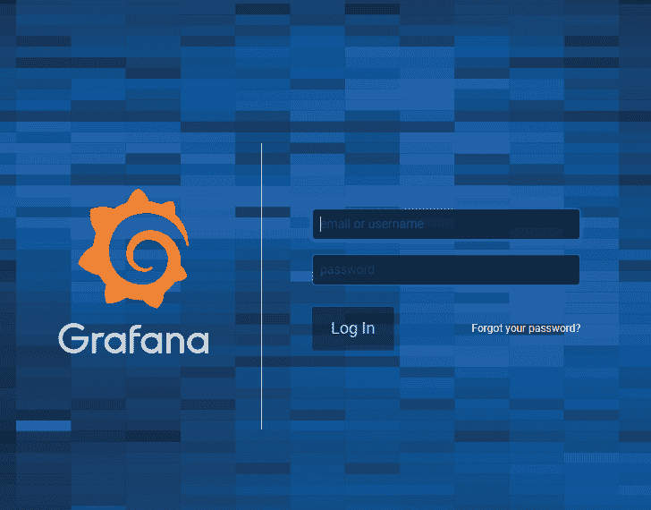

1.  使用`admin`作为用户名和`prom-operator`作为密码登录：

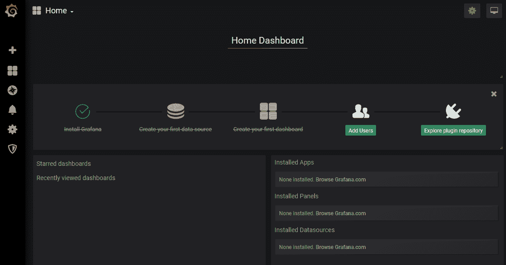

1.  单击仪表板左上角的主页按钮，列出可用的内置仪表板：

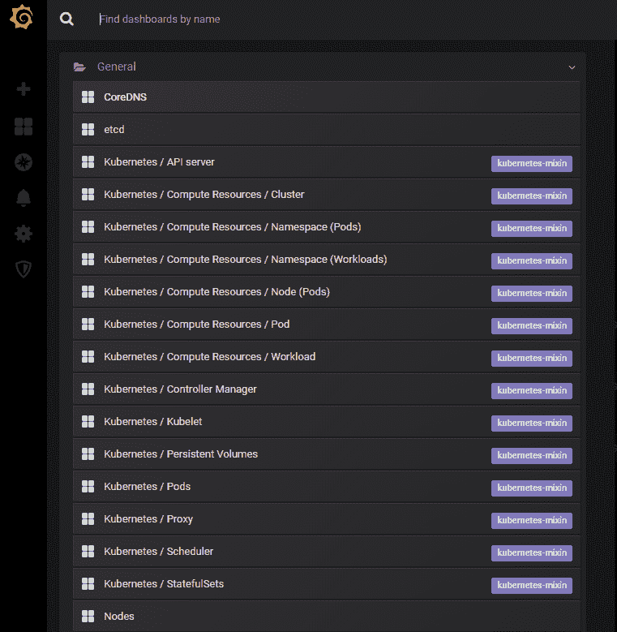

1.  例如，从列表中选择`Nodes`仪表板以显示 Kubernetes 节点指标。在此视图中，您将看到节点资源的图形表示，包括 CPU、内存、磁盘和网络利用率：

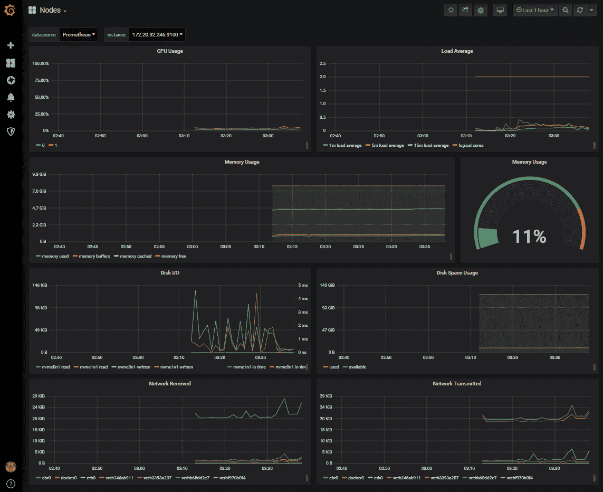

现在您知道如何在 Grafana 中浏览仪表板。您可以使用 Grafana 来可视化 Kubernetes 指标和其他为 Prometheus 提供指标的工作负载指标，方法是按照下一个步骤。

### 添加 Grafana 仪表板以监视应用程序

Grafana 用于可视化存储在 Prometheus 上的指标。它提供具有模板变量的动态和可重用的仪表板。在本教程中，我们将学习如何从预构建的仪表板库中添加一个新的仪表板，以监视部署在 Kubernetes 上的应用程序：

1.  每个应用程序都有不同的与应用程序的连续性相关的指标。首先，应用程序需要向 Prometheus 公开指标（有关编写 Prometheus 导出器的其他信息，请参阅“另请参阅”部分），并且必须将 Prometheus 添加为 Grafana 的数据源。对于此示例，我们将使用我们在第三章“构建 CI/CD 流水线”中部署的 Jenkins，在“在 Jenkins X 中设置 CI/CD 流水线”食谱中。

1.  单击仪表板左上角的“主页”按钮，然后单击“在 Grafana.com 上查找仪表板”：

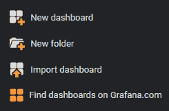

1.  在搜索字段中，键入`Jenkins`。您将看到一些特定于 Jenkins 的仪表板：

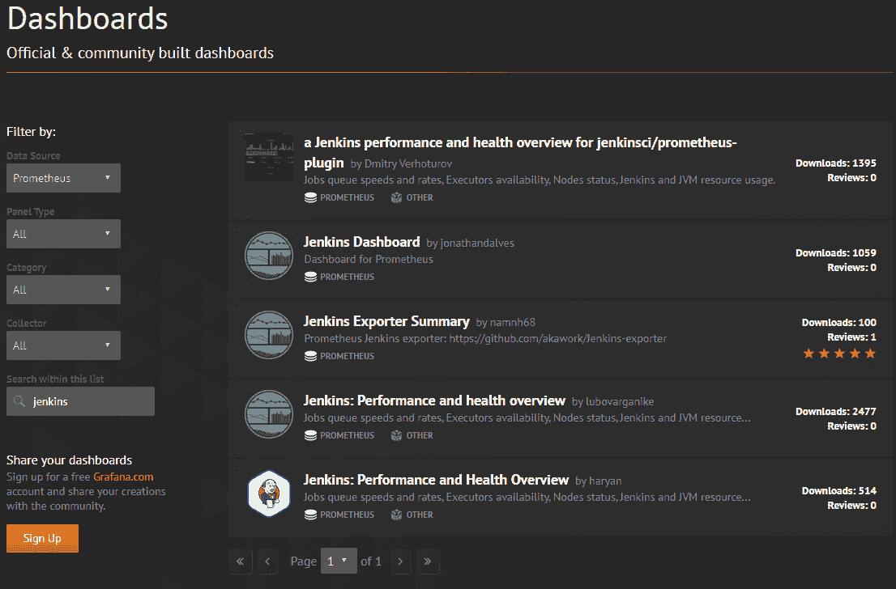

1.  单击“Jenkins：性能和健康概述”，并将 ID 复制到剪贴板。此时，仪表板 ID 306 是您添加此预构建仪表板到 Grafana 实例所需的全部内容：

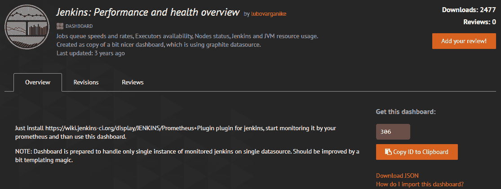

1.  如果未启用仪表板，请按照“概述”部分中的说明操作。

1.  在 Grafana 界面中，单击导入仪表板。将仪表板 ID 306 粘贴到 Grafana.com 仪表板字段中。Grafana 将自动检测仪表板并显示详细信息：

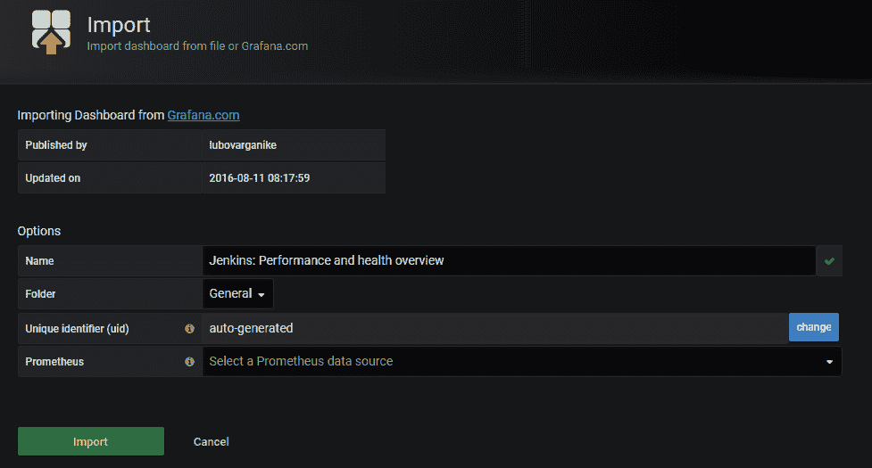

1.  选择 Prometheus 作为数据源名称，然后单击导入：

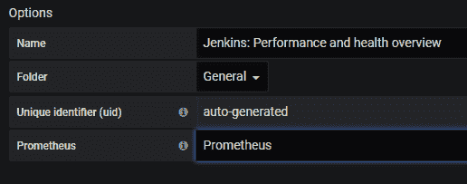

1.  单击“主页”按钮以再次列出仪表板，您将在最近的仪表板列表中找到新的仪表板：

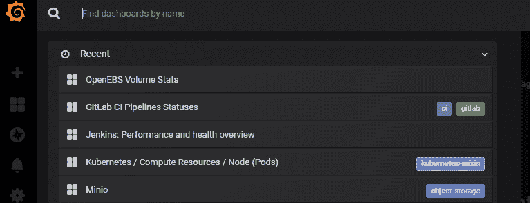

同样，您可以在 Grafana 上找到预构建的仪表板，用于我们在之前章节中使用的应用程序，例如云提供商服务监控（AWS、GCP、Azure、阿里巴巴）、GitLab CI、Minio、OpenEBS 以及许多其他 Kubernetes 集群指标。

## 另请参阅

+   Prometheus 文档：[`prometheus.io/docs/introduction/overview/`](https://prometheus.io/docs/introduction/overview/)

+   编写 Prometheus 导出器：[`prometheus.io/docs/instrumenting/writing_exporters/`](https://prometheus.io/docs/instrumenting/writing_exporters/)

+   Prometheus-Operator 的 GitHub 存储库：[`github.com/coreos/prometheus-operator`](https://github.com/coreos/prometheus-operator)

+   Grafana 文档：[`grafana.com/docs/`](https://grafana.com/docs/)

+   Grafana 社区仪表板：[`grafana.com/grafana/dashboards`](https://grafana.com/grafana/dashboards)

+   Grafana 插件：[`grafana.com/grafana/plugins`](https://grafana.com/grafana/plugins)

+   启用 Jenkins Prometheus 插件：[`wiki.jenkins.io/display/JENKINS/Prometheus+Plugin`](https://wiki.jenkins.io/display/JENKINS/Prometheus+Plugin)

+   将 Stackdriver 添加为数据源：[`grafana.com/grafana/plugins/stackdriver`](https://grafana.com/grafana/plugins/stackdriver)

+   将 Azure Monitor 添加为数据源：[`grafana.com/grafana/plugins/grafana-azure-monitor-datasource`](https://grafana.com/grafana/plugins/grafana-azure-monitor-datasource)

+   Prometheus 替代方案：

+   DataDog：[`www.datadoghq.com`](https://www.datadoghq.com)

+   New Relic：[`newrelic.com`](https://newrelic.com)

+   Open Falcon：[`open-falcon.org`](http://open-falcon.org)

# 使用 Sysdig 进行监控和性能分析

在这一部分，我们将使用 Sysdig Monitor 来监控和简化 Kubernetes 故障排除。您将学习如何安装 Sysdig Monitor 并扩展 Prometheus 功能，以满足更高级的企业需求。

## 准备工作

这里提到的所有操作都需要一个 Sysdig 账户。如果您还没有账户，请转到[`sysdig.com/sign-up/`](https://sysdig.com/sign-up/)并创建一个试用或完整账户。

对于这个教程，我们需要准备好一个 Kubernetes 集群，并安装 Kubernetes 命令行工具`kubectl`和`helm`来管理集群资源。

## 如何做…

这一部分进一步分为以下子部分，以使流程更加简单：

+   安装 Sysdig 代理

+   分析应用程序性能

### 安装 Sysdig 代理

Sysdig Monitor 是一种用于监视和故障排除应用程序的工具，作为 Sysdig Cloud Native Visibility and Security Platform 的一部分。在这个教程中，您将学习如何部署 Sysdig Monitor 并利用 Prometheus 指标：

1.  如果您还没有准备好您的 Sysdig Monitor 访问密钥，请转到[`app.sysdigcloud.com/#/settings/agentInstallation`](https://app.sysdigcloud.com/#/settings/agentInstallation)的账户设置，并检索您的访问密钥：

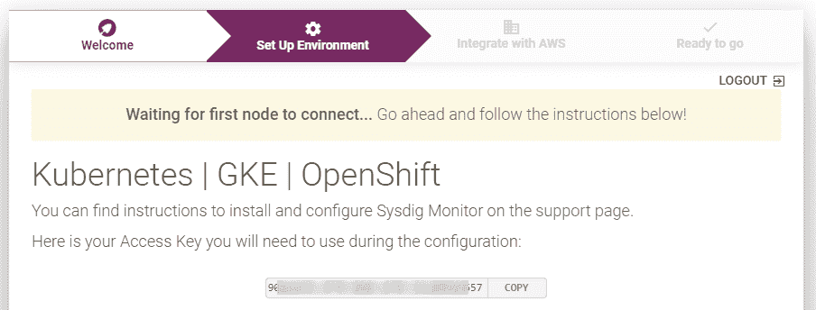

1.  使用 Helm 图表安装 Sysdig 代理，将以下命令中的`YourAccessKey`替换为*步骤 1*中的 Sysdig Monitor 访问密钥。此命令将在集群中的所有 Kubernetes 工作节点上安装 Sysdig Monitor 和 Sysdig Secure 所需的 Sysdig 代理作为 DaemonSet：

```
$ helm install --name sysdig-agent --set sysdig.accessKey=YourAccessKey, \ sysdig.settings.tags='linux:ubuntu, dept:dev,local:ca' \
--set sysdig.settings.k8s_cluster_name='my_cluster' stable/sysdig
```

1.  安装 Sysdig 代理后，节点将被 Sysdig Monitor 检测到。在这个视图中，所有节点都应该被检测到。在我们的示例中，我们检测到了四个节点。单击“转到下一步”按钮继续：

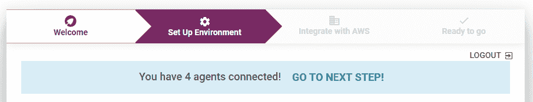

1.  Sysdig Monitor 与 AWS 深度集成。如果您的 Kubernetes 集群部署在 AWS 上，您可以选择输入 AWS 访问密钥 ID 和密钥来启用集成；否则，单击“跳过”按钮跳过 AWS 集成：


1.  单击“让我们开始”来探索 Sysdig Monitor：

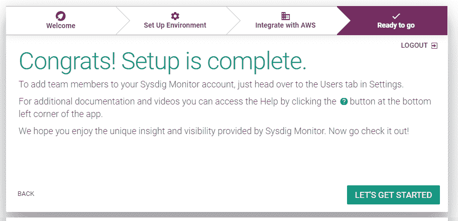

现在你知道如何部署 Sysdig Monitor 并利用 Prometheus 指标了。

### 分析应用程序性能

延迟、流量、错误和饱和度被谷歌 SRE 团队视为黄金信号。

让我们按照这些说明来学习如何在 Kubernetes 上的应用程序中导航 Sysdig Monitor 界面以找到黄金信号：

1.  登录到您的 Sysdig 云原生可见性和安全平台仪表板，网址为[`app.sysdigcloud.com`](https://app.sysdigcloud.com)：

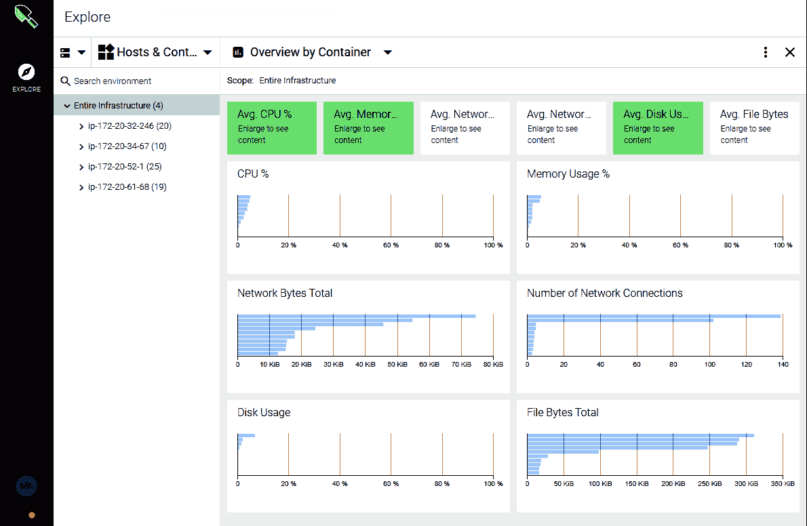

1.  资源会自动分组到主机和容器组中。单击组下拉菜单，然后选择部署和 pod：

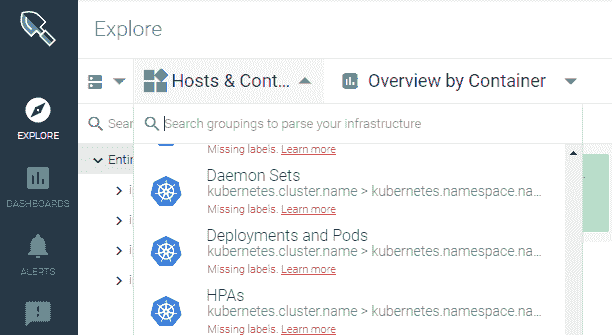

1.  单击仪表板和指标下拉菜单，然后在默认仪表板 | 应用程序下选择 HTTP 仪表板：

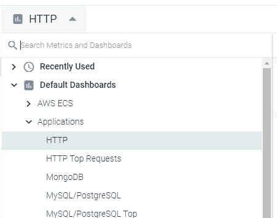

1.  Sysdig 可以识别和解码诸如 HTTP 之类的应用程序协议，并为您提供详细的指标。在这个视图中，您可以看到请求的数量，最常请求的 URL 或端点，最慢的 URL，以及整个基础架构的 HTTP 响应代码和请求类型：

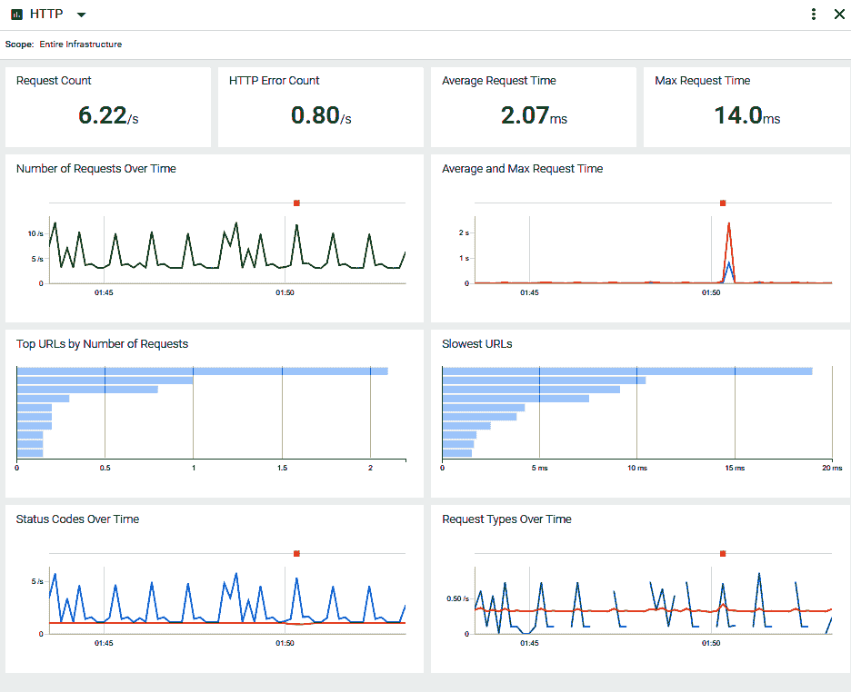

1.  作为性能故障排除的示例，将鼠标移动到*最慢的 URL*图表上，以识别问题和响应时间慢的应用程序。在我们的示例中，我们看到我们之前部署的 Kubecost Prometheus 服务器的响应时间慢，为 48 毫秒：

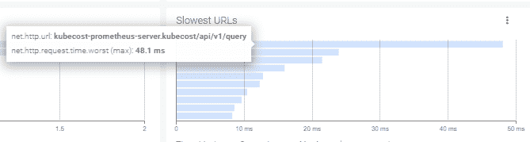

现在您已经对如何浏览 Sysdig 仪表板有了基本了解。Sysdig 提供了深度跟踪功能，可在监视多个容器时使用。我们将在第九章中了解更多关于 Sysdig 的安全功能和异常检测用法。您可以在*另请参阅*部分的*Sysdig 示例*链接中找到其他用例。

## 另请参阅

+   Sysdig Falco - 行为活动监控工具：[`github.com/draios/oss-falco`](https://github.com/draios/oss-falco)

+   Sysdig Inspect - 容器故障排除和安全调查工具：[`github.com/draios/sysdig-inspect`](https://github.com/draios/sysdig-inspect)

+   监控分布式系统（Golden Signals）：[`landing.google.com/sre/sre-book/chapters/monitoring-distributed-systems/`](https://landing.google.com/sre/sre-book/chapters/monitoring-distributed-systems/)

+   Sysdig 示例：[`github.com/draios/sysdig/wiki/sysdig-examples`](https://github.com/draios/sysdig/wiki/sysdig-examples)

# 使用 Kubecost 管理资源成本

在本节中，我们将安装和配置开源 Kubecost 项目，该项目可以让您了解 Kubernetes 资源的成本相关可见性。您将学习如何监视资源成本以减少支出，并可能防止基于资源的停机。

## 准备就绪

此配方需要在 AWS 或 GCP 上部署的功能性 Kubernetes 集群。目前，不支持其他云提供商。

在执行以下配方中的命令之前，您需要安装`kubectl`和`helm`。您可以在第二章的*在 Kubernetes 上操作应用程序*中找到安装 Helm 的说明，*使用 Helm 图表部署工作负载*部分。

## 如何做…

本节进一步分为以下小节，以便简化流程：

+   安装 Kubecost

+   访问 Kubecost 仪表板

+   监控 Kubernetes 资源成本分配

### 安装 Kubecost

Kubecost 创建了当前和历史 Kubernetes 支出的 Kubernetes 资源粒度模型。这些模型可用于在支持多个应用程序、团队和部门的 Kubernetes 环境中提供资源分配和成本透明度的监控。在本教程中，我们将看一下使 Kubecost 运行起来的基本步骤：

1.  将 Kubecost 图表存储库添加到本地 Helm 图表存储库列表中：

```
$ helm repo add kubecost https://kubecost.github.io/cost-analyzer/
```

1.  使用`Helm install`命令将 Kubecost 安装到`kubecost`命名空间中：

```
$ helm install kubecost/cost-analyzer --namespace kubecost --name kubecost --set kubecostToken="dGVzdEB0ZXN0LmNvbQ==xm343yadf98"
```

1.  验证所有的 pod 都在运行。正如您所看到的，该项目还部署了自己的 Prometheus 和 Grafana 实例：

```
$ kubectl get pods -nkubecost
NAME READY STATUS RESTARTS AGE
cost-analyzer-checks-1571781600-6mhwh 0/1 Completed 0 7m1s
kubecost-cost-analyzer-54bc969689-8rznl 3/3 Running 0 9m7s
kubecost-grafana-844d4b9844-dkdvn 3/3 Running 0 9m7s
kubecost-prometheus-alertmanager-85bbbd6b7b-fpmqr 2/2 Running 0 9m7s
kubecost-prometheus-kube-state-metrics-857c5d4b4f-gxmgj 1/1 Running 0 9m7s
kubecost-prometheus-node-exporter-6bsp2 1/1 Running 0 9m7s
kubecost-prometheus-node-exporter-jtw2h 1/1 Running 0 9m7s
kubecost-prometheus-node-exporter-k69fh 1/1 Running 0 9m7s
kubecost-prometheus-pushgateway-7689458dc9-rx5jj 1/1 Running 0 9m7s
kubecost-prometheus-server-7b8b759d74-vww8c 2/2 Running 0 9m7s
```

如果您有现有的 Prometheus 部署，`node-exporter` pod 可能会卡在 Pending 模式。在这种情况下，您需要使用不同的端口来部署 Kubecost；否则，pod 将无法获取所请求的 pod 端口。

现在您已经安装了 Kubecost 成本分析器，并且具有在 Kubernetes 环境中操作所需的一系列组件。

### 访问 Kubecost 仪表板

让我们按照这些说明来访问 Kubecost 仪表板，在那里您可以实时监视您的 Kubernetes 资源及其成本：

1.  获取`kubecost`命名空间中服务的列表：

```
$ kubectl get svc -nkubecost
NAME TYPE CLUSTER-IP EXTERNAL-IP PORT(S) AGE
kubecost-cost-analyzer ClusterIP 100.65.53.41 <none> 9001/TCP,9003/TCP,9090/TCP 13m
kubecost-grafana ClusterIP 100.69.52.23 <none> 80/TCP 13m
kubecost-prometheus-alertmanager ClusterIP 100.71.217.248 <none> 80/TCP 13m
kubecost-prometheus-kube-state-metrics ClusterIP None <none> 80/TCP 13m
kubecost-prometheus-node-exporter ClusterIP None <none> 9100/TCP 13m
kubecost-prometheus-pushgateway ClusterIP 100.69.137.163 <none> 9091/TCP 13m
kubecost-prometheus-server ClusterIP 100.64.7.82 <none> 80/TCP 13m
```

1.  创建一个端口转发以使用`kubectl port-forward`命令访问 Kubecost UI。该命令将本地端口`9090`转发到 Kubecost 成本分析器 pod：

```
$ kubectl port-forward --namespace kubecost deployment/kubecost-cost-analyzer 9090
```

作为替代方案，您可以使用`kubectl edit svc kubecost-cost-analyzer -nkubecost`命令对`kubecost-cost-analyzer`服务进行修补，并将服务类型`ClusterIP`更改为`LoadBalancer`，以使用云负载均衡器在外部公开服务。

1.  在您的 Web 浏览器中打开地址`http://localhost:9090`（或者如果使用 LoadBalancer，则是外部 IP）。您应该看到 Kubecost 登录页面：

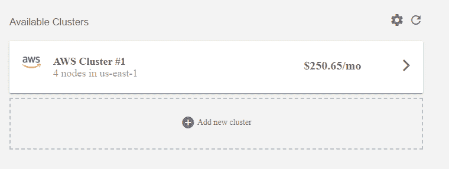

1.  通过将额外的 Kubecost 端点添加到一个中并用于监视单个仪表板上的多个集群来扩展仪表板。如果您有多个集群，请单击添加新集群图标，并添加来自其他集群的端点 URL：

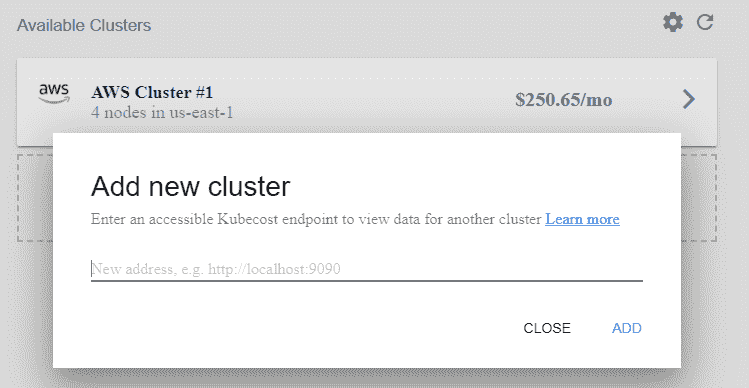

### 监控 Kubernetes 资源成本分配

让我们按照这些说明来学习如何使用 Kubecost 监视与 Kubernetes 相关的云支出，并找到可能的节省建议：

1.  通过按照前面的步骤“访问 Kubecost 仪表板”访问您的 Kubecost 仪表板。在仪表板上点击您的集群名称以访问详细摘要。此视图将显示月度成本和闲置资源的集群效率：

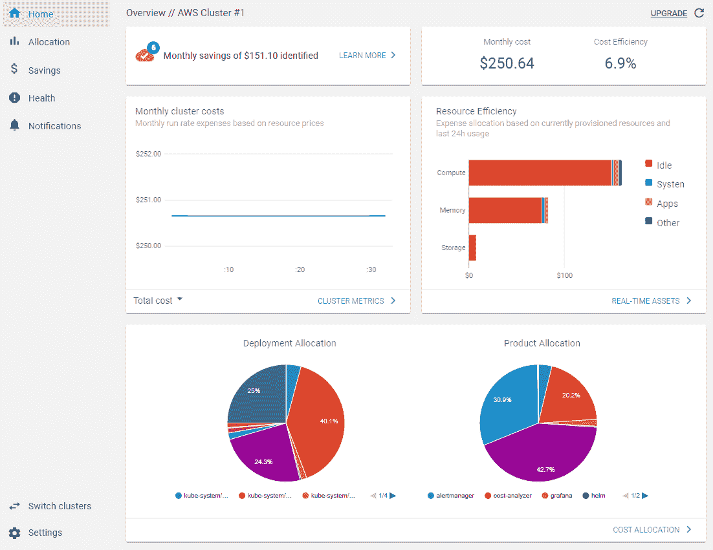

1.  点击“实时资产”按钮。此视图显示与当前云提供商相关的实时成本。在我们的示例中，有一个主节点，三个使用`kops`在 AWS 集群上部署的工作节点 Kubernetes 集群，自创建以来每个节点的账单大约为 60 美元：

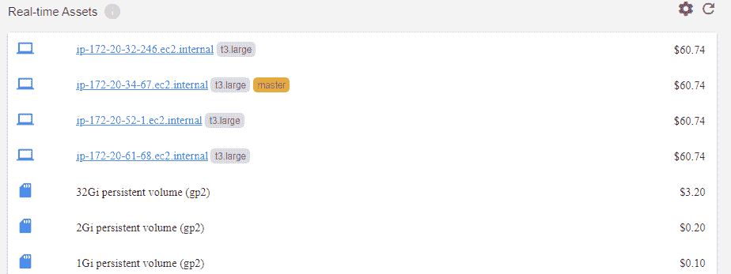

1.  点击“分配”菜单。此视图显示当前命名空间中的累积成本。您可以应用范围过滤器，以获取所选命名空间中资源的每日、每周、每月或自定义范围成本：

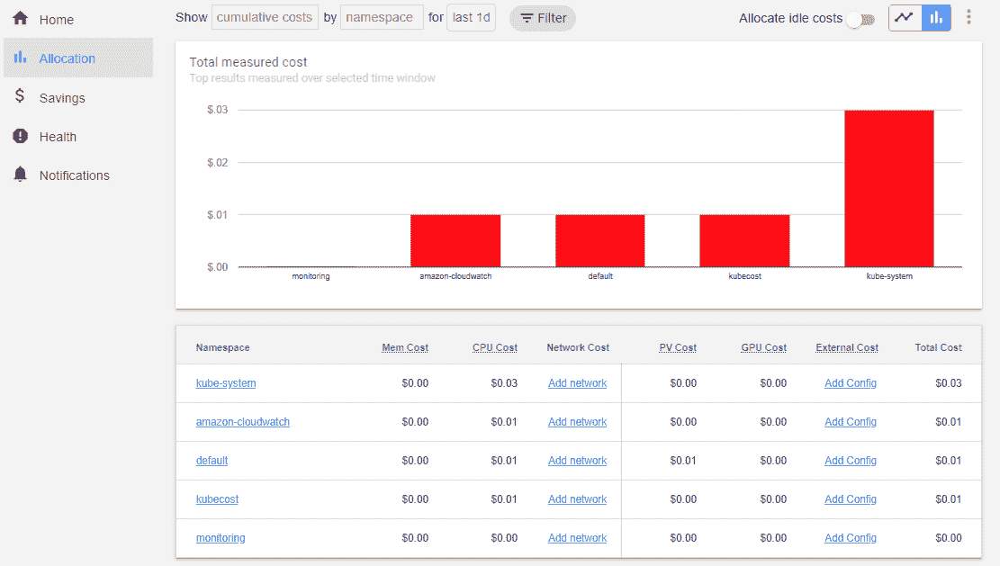

1.  点击“节省”菜单。此菜单中的信息非常重要，并指向您可以采取的可能的优化步骤。例如，以下视图显示我们有两个利用率不足的节点（利用率低于 60%），如果我们缩减集群，可以节省成本。在这种情况下，我们可以排空节点并缩减集群。点击每个节省类别，了解如何采取行动以实现此处显示的节省率：

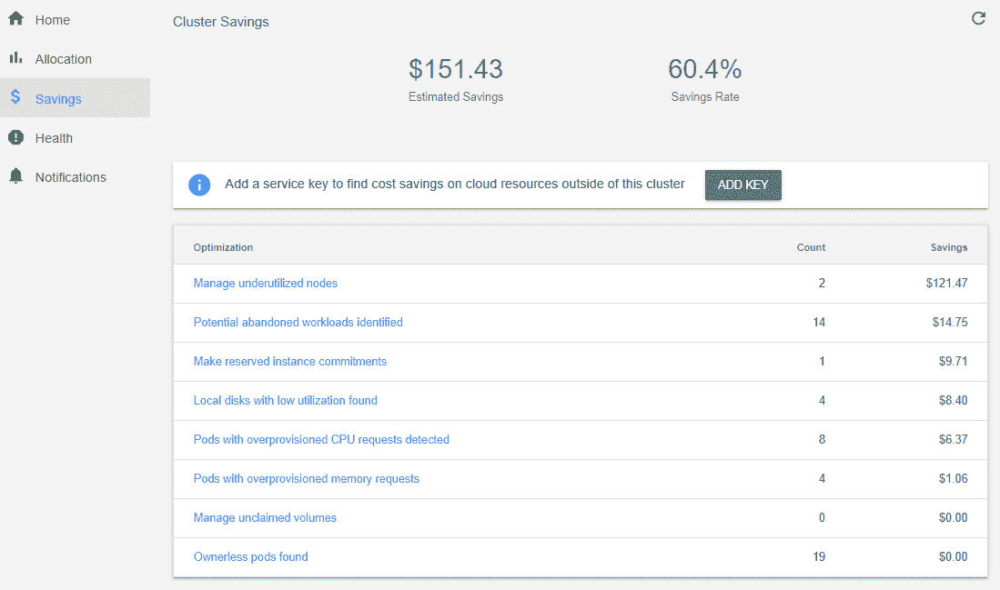

1.  点击“健康”菜单。此视图显示可靠性评估和集群健康风险：

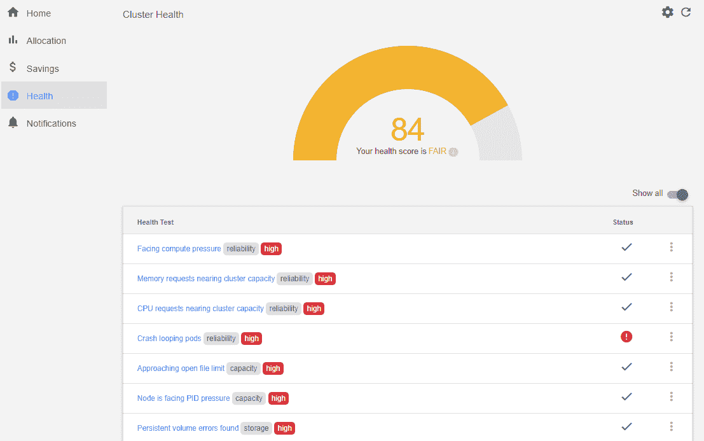

1.  禁用“显示全部”选项以列出需要您关注的问题。在我们的示例中，我们看到一个高优先级指向 Crash looping pods。您可以按照本章节中“检查容器”部分的说明进一步识别问题：

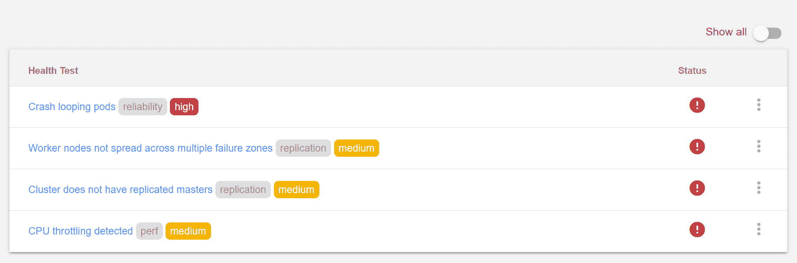

1.  点击“通知”菜单。从此菜单，您可以指定如何处理通知。如果您有 Slack 频道，可以在此处点击“添加”按钮将通知转发到该频道；否则，电子邮件通知可作为选项：

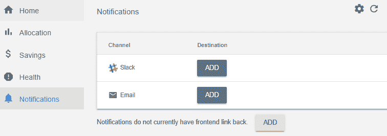

现在您已经了解如何监控项目成本，并更好地了解了如何采取行动来增加 DevOps 环境的投资回报。

## 另请参阅

+   Kubecost 文档：[`docs.kubecost.com/`](http://docs.kubecost.com/)

+   将 Kubecost 部署为一个 pod：[`github.com/kubecost/cost-model/blob/master/deploying-as-a-pod.md`](https://github.com/kubecost/cost-model/blob/master/deploying-as-a-pod.md)
