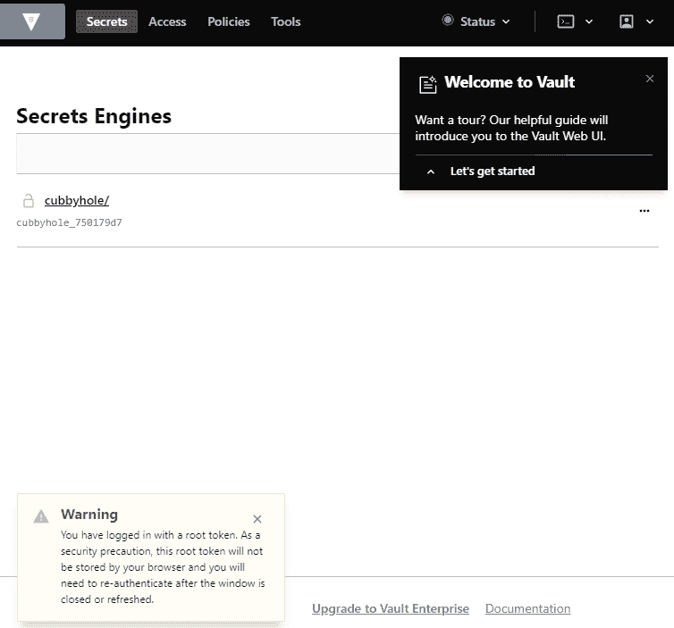

保护应用程序和集群

00000000000000 在本章中，我们将讨论在从测试到生产的过程中，减少攻击面和保护 Kubernetes 集群的基本步骤。我们将讨论安全审计，将 DevSecOps 构建到 CI/CD 流水线中，检测性能分析的指标，以及如何安全地管理秘密和凭据。

在本章中，我们将介绍以下配方：

+   使用 RBAC 加固集群安全

+   配置 Pod 安全策略

+   使用 Kubernetes CIS 基准进行安全审计

+   将 DevSecOps 构建到流水线中，使用 Aqua Security

+   使用 Falco 监视可疑的应用程序活动

+   使用 HashiCorp Vault 安全保护凭据

# 技术要求

本章中的配方要求您通过遵循第一章中描述的建议方法之一部署了功能齐全的 Kubernetes 集群，*构建生产就绪的 Kubernetes 集群*。

Kubernetes 命令行工具`kubectl`将用于本章中其余的配方，因为它是针对 Kubernetes 集群运行命令的主要命令行界面。我们还将使用`helm`，在那里 Helm 图表可用于部署解决方案。

# 使用 RBAC 加固集群安全

在诸如 Kubernetes 之类的复杂系统中，授权机制用于设置谁被允许对集群资源进行何种更改并操纵它们。**基于角色的访问控制**（**RBAC**）是一种高度集成到 Kubernetes 中的机制，它授予用户和应用程序对 Kubernetes API 的细粒度访问权限。

作为良好的实践，您应该与`NodeRestriction`准入插件一起使用 Node 和 RBAC 授权器。

在本节中，我们将介绍如何启用 RBAC 并创建角色和角色绑定，以授予应用程序和用户对集群资源的访问权限。

## 准备工作

确保您已准备好启用 RBAC 的 Kubernetes 集群（自 Kubernetes 1.6 以来，默认情况下已启用 RBAC），并且已配置`kubectl`和`helm`，以便您可以管理集群资源。在尝试为用户创建密钥之前，还需要确保您拥有`openssl`工具来创建私钥。

将`k8sdevopscookbook/src`存储库克隆到您的工作站，以便在`chapter9`目录中使用清单文件，如下所示：

```
$ git clone https://github.com/k8sdevopscookbook/src.git
$ cd src/chapter9/rbac
```

RBAC 从 Kubernetes 1.6 版本开始默认启用。如果由于任何原因禁用了 RBAC，请使用`--authorization-mode=RBAC`启动 API 服务器以启用 RBAC。

## 如何做…

本节进一步分为以下子节，以使此过程更容易：

+   查看默认角色

+   创建用户帐户

+   创建角色和角色绑定

+   测试 RBAC 规则

### 查看默认角色

RBAC 是 Kubernetes 集群的核心组件，允许我们创建和授予对象角色，并控制对集群内资源的访问。这个步骤将帮助您了解角色和角色绑定的内容。

让我们执行以下步骤来查看我们集群中的默认角色和角色绑定：

1.  使用以下命令查看默认的集群角色。您将看到一个长长的混合列表，其中包括`system:`、`system:controller:`和一些其他带有前缀的角色。`system:*`角色由基础设施使用，`system:controller`角色由 Kubernetes 控制器管理器使用，它是一个监视集群共享状态的控制循环。一般来说，当您需要解决权限问题时，了解它们都是很好的，但我们不会经常使用它们：

```
$ kubectl get clusterroles
$ kubectl get clusterrolebindings
```

1.  查看由 Kubernetes 拥有的系统角色之一，以了解它们的目的和限制。在下面的示例中，我们正在查看`system:node`，它定义了 kubelet 的权限。在规则的输出中，`apiGroups:`表示核心 API 组，`resources`表示 Kubernetes 资源类型，`verbs`表示角色上允许的 API 操作：

```
$ kubectl get clusterroles system:node -oyaml
```

1.  让我们查看默认的用户角色，因为它们是我们更感兴趣的角色。没有`system:`前缀的角色是面向用户的角色。以下命令将仅列出非`system:`前缀的角色。通过 RoleBindings 在特定命名空间中授予的主要角色是`admin`、`edit`和`view`角色：

```
$ kubectl get clusterroles | grep -v '^system'
NAME AGE
admin 8d #gives read-write access
 to all resources
cluster-admin 8d #super-user, gives read-write access
 to all resources
edit 8d #allows create/update/delete on resources except RBAC permissions
kops:dns-controller 8d
kube-dns-autoscaler 8d
view 8d #read-only access to resources
```

1.  现在，使用以下命令查看默认的集群绑定，即`cluster-admin`。您将看到此绑定使用`cluster-admin`角色为`system:masters`组提供了集群范围的超级用户权限：

```
$ kubectl get clusterrolebindings/cluster-admin -o yaml
apiVersion: rbac.authorization.k8s.io/v1
kind: ClusterRoleBinding
metadata:
...
roleRef:
 apiGroup: rbac.authorization.k8s.io
 kind: ClusterRole
 name: cluster-admin
subjects:
- apiGroup: rbac.authorization.k8s.io
 kind: Group
 name: system:masters
```

自 Kubernetes 1.6 版本发布以来，默认情况下启用了 RBAC，并且新用户可以创建并在管理员用户将权限分配给特定资源之前不具备任何权限。现在，您已经了解了可用的默认角色。

在接下来的教程中，您将学习如何创建新的角色和角色绑定，并授予帐户所需的权限。

### 创建用户帐户

正如 Kubernetes 文档中所解释的，Kubernetes 没有用于表示普通用户帐户的对象。因此，它们需要在外部进行管理（查看*参见*部分的*Kubernetes 身份验证*文档，以获取更多详细信息）。本教程将向您展示如何使用私钥创建和管理用户帐户。

让我们执行以下步骤来创建一个用户帐户：

1.  为示例用户创建一个私钥。在我们的示例中，密钥文件是`user3445.key`：

```
$ openssl genrsa -out user3445.key 2048
```

1.  创建一个名为`user3445.csr`的**证书签名请求**（**CSR**），使用我们在*步骤 1*中创建的私钥。在`-subj`参数中设置用户名（`/CN`）和组名（`/O`）。在以下示例中，用户名是`john.geek`，而组名是`development`：

```
$ openssl req -new -key user3445.key \
-out user3445.csr \
-subj "/CN=john.geek/O=development"
```

1.  要使用内置签名者，您需要定位集群的集群签名证书。默认情况下，`ca.crt`和`ca.key`文件应位于`/etc/kubernetes/pki/`目录中。如果您正在使用 kops 进行部署，您可以从`s3://$BUCKET_NAME/$KOPS_CLUSTER_NAME/pki/private/ca/*.key`和`s3://$BUCKET_NAME/$KOPS_CLUSTER_NAME/pki/issued/ca/*.crt`下载集群签名密钥。一旦您找到了密钥，将以下代码中提到的`CERT_LOCATION`更改为文件的当前位置，并生成最终签名证书：

```
$ openssl x509 -req -in user3445.csr \
-CA CERT_LOCATION/ca.crt \
-CAkey CERT_LOCATION/ca.key \
-CAcreateserial -out user3445.crt \
-days 500
```

1.  如果所有文件都已找到，*步骤 3*中的命令应返回类似以下的输出：

```
Signature ok
subject=CN = john.geek, O = development
Getting CA Private Key
```

在我们继续之前，请确保将签名密钥存储在安全的目录中。作为行业最佳实践，建议使用秘密引擎或 Vault 存储。您将在本章后面的*使用 HashiCorp Vault 保护凭据*中了解有关 Vault 存储的更多信息。

1.  使用新用户凭据创建一个新的上下文：

```
$ kubectl config set-credentials user3445 --client-certificate=user3445.crt --client-key=user3445.key
$ kubectl config set-context user3445-context --cluster=local --namespace=secureapp --user=user3445
```

1.  使用以下命令列出现有上下文。您将看到已创建新的`user3445-context`：

```
$ kubectl config get-contexts
CURRENT NAME                    CLUSTER AUTHINFO NAMESPACE
*       service-account-context local   kubecfg
 user3445-context        local   user3445 secureapp
```

1.  现在，尝试使用新用户上下文列出 pod。由于新用户没有任何角色，并且新用户默认情况下没有分配任何角色，因此您将收到访问被拒绝的错误：

```
$ kubectl --context=user3445-context get pods
Error from server (Forbidden): pods is forbidden: User "john.geek" cannot list resource "pods" in API group "" in the namespace "secureapps"
```

1.  可选地，您可以使用`openssl base64 -in <infile> -out <outfile>`命令对所有三个文件（`user3445.crt`，`user3445.csr`和`user3445.key`）进行`base64`编码，并将填充的`config-user3445.yml`文件分发给您的开发人员。示例文件可以在本书的 GitHub 存储库的`src/chapter9/rbac`目录中找到。有许多方法可以分发用户凭据。使用文本编辑器查看示例：

```
$ cat config-user3445.yaml
```

通过这样，您已经学会了如何创建新用户。接下来，您将创建角色并将其分配给用户。

### 创建角色和 RoleBindings

角色和 RoleBindings 始终在定义的命名空间中使用，这意味着权限只能授予与角色和 RoleBindings 本身相同命名空间中的资源，而不是用于授予集群范围资源（如节点）权限的 ClusterRoles 和 ClusterRoleBindings。

让我们执行以下步骤在我们的集群中创建一个示例角色和 RoleBinding：

1.  首先，创建一个我们将创建角色和 RoleBinding 的命名空间。在我们的示例中，命名空间是`secureapp`：

```
$ kubectl create ns secureapp
```

1.  使用以下规则创建一个角色。该角色基本上允许在我们在*步骤 1.*中创建的`secureapp`命名空间中对部署、副本集和 Pod 执行所有操作。请注意，授予的任何权限都只是增量的，没有拒绝规则：

```
$ cat <<EOF | kubectl apply -f -
apiVersion: rbac.authorization.k8s.io/v1
kind: Role
metadata:
 namespace: secureapp
 name: deployer
rules:
- apiGroups: ["", "extensions", "apps"]
 resources: ["deployments", "replicasets", "pods"]
 verbs: ["get", "list", "watch", "create", "update", "patch", "delete"]
EOF
```

1.  使用`deployer`角色为用户名`john.geek`在`secureapp`命名空间中创建一个 RoleBinding。我们这样做是因为 RoleBinding 只能引用同一命名空间中存在的角色：

```
$ cat <<EOF | kubectl apply -f -
kind: RoleBinding
apiVersion: rbac.authorization.k8s.io/v1
metadata:
 name: deployer-binding
 namespace: secureapp
subjects:
- kind: User
 name: john.geek
 apiGroup: ""
roleRef:
 kind: Role
 name: deployer
 apiGroup: ""
EOF
```

通过这样，您已经学会了如何创建一个新的角色，并使用 RoleBindings 授予用户权限。

### 测试 RBAC 规则

让我们执行以下步骤来测试我们之前创建的角色和 RoleBinding：

1.  在用户有权限访问的`secureapp`命名空间中部署一个测试 Pod：

```
$ cat <<EOF | kubectl --context=user3445-context apply -f -
apiVersion: v1
kind: Pod
metadata:
 name: busybox
 namespace: secureapp
spec:
 containers:
 - image: busybox
 command:
 - sleep
 - "3600"
 imagePullPolicy: IfNotPresent
 name: busybox
 restartPolicy: Always
EOF
```

列出新用户上下文中的 Pod。在*创建用户帐户*中失败的相同命令在*步骤 7*中现在应该能够成功执行：

```
$ kubectl --context=user3445-context get pods 
NAME    READY STATUS  RESTARTS AGE
busybox 1/1   Running 1        2m
```

如果您尝试在不同的命名空间中创建相同的 Pod，您将看到该命令将无法执行。

## 工作原理...

这个示例向您展示了如何在 Kubernetes 中创建新用户，并快速创建角色和 RoleBindings 以授予用户帐户对 Kubernetes 的权限。

Kubernetes 集群有两种类型的用户：

+   **用户帐户**：用户帐户是外部管理的普通用户。

+   **服务账户**：服务账户是与 Kubernetes 服务相关联并由 Kubernetes API 管理其自己资源的用户。

您可以通过查看*另请参阅*部分中的*管理服务账户*链接来了解更多关于服务账户的信息。

在*创建角色和 RoleBindings*配方中，在*步骤 1*中，我们创建了一个名为`deployer`的角色。然后，在*步骤 2*中，我们将与 deployer 角色关联的规则授予了用户账户`john.geek`。

RBAC 使用`rbac.authorization.k8s.io` API 来做出授权决策。这允许管理员使用 Kubernetes API 动态配置策略。如果您想要使用现有的角色并给予某人集群范围的超级用户权限，您可以使用`cluster-admin` ClusterRole 和 ClusterRoleBinding。ClusterRoles 没有命名空间限制，并且可以在任何命名空间中执行具有授予的权限的命令。总的来说，在分配`cluster-admin` ClusterRole 给用户时应该小心。ClusterRoles 也可以像 Roles 一样限制到命名空间，如果它们与 RoleBindings 一起使用来授予权限。

## 另请参阅

+   Kubernetes 中的 RBAC 授权文档：[`kubernetes.io/docs/reference/access-authn-authz/rbac/#rolebinding-and-clusterrolebinding`](https://kubernetes.io/docs/reference/access-authn-authz/rbac/#rolebinding-and-clusterrolebinding)

+   有关默认角色和角色绑定的更多信息：[`kubernetes.io/docs/reference/access-authn-authz/rbac/#default-roles-and-role-bindings`](https://kubernetes.io/docs/reference/access-authn-authz/rbac/#default-roles-and-role-bindings)

+   基于 Kubernetes 审计日志自动生成 RBAC 策略：[`github.com/liggitt/audit2rbac`](https://github.com/liggitt/audit2rbac)

+   Kubernetes 认证：[`kubernetes.io/docs/reference/access-authn-authz/authentication/`](https://kubernetes.io/docs/reference/access-authn-authz/authentication/)

+   管理服务账户：[`kubernetes.io/docs/reference/access-authn-authz/service-accounts-admin/`](https://kubernetes.io/docs/reference/access-authn-authz/service-accounts-admin/)

+   kubectl-bindrole 工具用于查找绑定到指定 ServiceAccount 的 Kubernetes 角色：[`github.com/Ladicle/kubectl-bindrole`](https://github.com/Ladicle/kubectl-bindrole)

# 配置 Pod 安全策略

Pod 安全策略（PSP）在 Kubernetes 集群上用于启用对 Pod 创建的细粒度授权，并控制 Pod 的安全方面。PodSecurityPolicy 对象定义了接受 Pod 进入集群并按预期运行的条件。

在本节中，我们将介绍在 Kubernetes 上重新创建和配置 PSP。

## 准备工作

确保您已准备好启用 RBAC 的 Kubernetes 集群（自 Kubernetes 1.6 以来，RBAC 默认已启用），并配置`kubectl`和`helm`来管理集群资源。

将`k8sdevopscookbook/src`存储库克隆到您的工作站，以便使用`chapter9`目录中的清单文件，如下所示：

```
$ git clone https://github.com/k8sdevopscookbook/src.git
$ cd src/chapter9/psp
```

通过运行`kubectl get psp`命令来验证集群是否需要启用 PodSecurityPolicy。如果收到消息说明`服务器没有资源类型"podSecurityPolicies"。`，则需要在集群上启用 PSP。

## 操作步骤：

本节进一步分为以下子节，以使此过程更加简单：

+   在 EKS 上启用 PSP

+   在 GKE 上启用 PSP

+   在 AKS 上启用 PSP

+   创建受限制的 PSP

### 在 EKS 上启用 PSP

作为最佳实践，在创建自己的策略之前，不应该启用 PSP。本文将带您了解如何在 Amazon EKS 上启用 PSP 以及如何审查默认策略。

让我们执行以下步骤：

1.  部署 Kubernetes 版本 1.13 或更高版本。PSP 将默认启用。默认配置带有一个名为`eks.privileged`的非破坏性策略，没有限制。使用以下命令查看默认策略：

```
$ kubectl get psp eks.privileged
NAME           PRIV CAPS SELINUX  RUNASUSER FSGROUP  SUPGROUP READONLYROOTFS VOLUMES
eks.privileged true *    RunAsAny RunAsAny  RunAsAny RunAsAny false          *
```

1.  描述策略以查看其完整详情，如下所示：

```
$ kubectl describe psp eks.privileged
```

1.  要审查、恢复或删除默认 PSP，请使用示例存储库中`src/chapter9/psp`目录中名为`eks-privileged-psp.yaml`的 YAML 清单。

### 在 GKE 上启用 PSP

作为最佳实践，在创建自己的策略之前，不应该启用 PSP。本文将带您了解如何在 Google Kubernetes Engine（GKE）上启用 PSP 以及如何审查默认策略。

让我们执行以下步骤：

1.  您可以通过运行以下命令在部署的集群上启用 PSP，按照第一章中的说明，*构建生产就绪的 Kubernetes 集群*，在*在 GKE 上配置托管的 Kubernetes 集群*中。将`k8s-devops-cookbook-1`替换为您自己的集群名称：

```
$ gcloud beta container clusters update k8s-devops-cookbook-1 --enable-pod-security-policy
```

1.  默认配置带有一个名为`gce.privileged`的非破坏性策略，没有限制，还有其他几个策略。使用以下命令查看默认策略：

```
$ kubectl get psp
NAME                         PRIV  CAPS SELINUX  RUNASUSER FSGROUP  SUPGROUP READONLYROOTFS VOLUMES
gce.event-exporter           false      RunAsAny RunAsAny  RunAsAny RunAsAny false          hostPath,secret
gce.fluentd-gcp              false      RunAsAny RunAsAny  RunAsAny RunAsAny false          configMap,hostPath,secret
gce.persistent-volume-binder false      RunAsAny RunAsAny  RunAsAny RunAsAny false          nfs,secret,projected
gce.privileged               true  *    RunAsAny RunAsAny  RunAsAny RunAsAny false          *
gce.unprivileged-addon       false SETPCAP,MKNOD,AUDIT_WRITE,CHOWN,NET_RAW,DAC_OVERRIDE,FOWNER,FSETID,KILL,SETGID,SETUID,NET_BIND_SERVICE,SYS_CHROOT,SETFCAP RunAsAny RunAsAny RunAsAny RunAsAny false emptyDir,configMap,secret,projected
```

1.  描述策略以查看其完整详情，如下所示：

```
$ kubectl describe psp gce.privileged
```

1.  要查看、恢复或删除默认 PSP，请使用示例存储库中的 YAML 清单，在`src/chapter9/psp`中命名为`gce-privileged-psp.yaml`。

### 在 AKS 上启用 PodSecurityPolicy

作为最佳实践，在创建自己的策略之前，不应启用 PodSecurityPolicy。本教程将带您了解如何在**Azure Kubernetes Service**（**AKS**）上启用 PSP 以及如何查看默认策略。

让我们执行以下步骤：

1.  您可以按照第一章 *构建生产就绪的 Kubernetes 集群*中给出的说明，在*在 AKS 上配置托管的 Kubernetes 集群*教程中运行以下命令来在部署的集群上启用 PSP。将`k8sdevopscookbook`替换为您自己的资源组，将`AKSCluster`替换为您的集群名称：

```
$ az aks create --resource-group k8sdevopscookbook \
--name AKSCluster \
--enable-pod-security-policy
```

1.  默认配置带有一个名为`privileged`的非破坏性策略，没有限制。使用以下命令查看默认策略：

```
$ kubectl get psp
NAME PRIV CAPS SELINUX RUNASUSER FSGROUP SUPGROUP READONLYROOTFS VOLUMES
privileged true * RunAsAny RunAsAny RunAsAny RunAsAny false * configMap,emptyDir,projected,secret,downwardAPI,persistentVolumeClaim
```

1.  描述策略以查看其完整详情，如下所示：

```
$ kubectl describe psp privileged
```

1.  要查看、恢复或删除默认 PSP，请使用示例存储库中的 YAML 清单，在`src/chapter9/psp`中命名为`aks-privileged-psp.yaml`。

### 创建受限的 PSPs

作为安全最佳实践，建议限制容器在 Pod 中以 root 用户特权运行，以限制任何可能的风险。在特权模式下运行时，容器内运行的进程具有与容器外进程相同的特权和访问权限，这可能会增加攻击者访问一些管理能力的风险。

让我们执行以下步骤来创建一个受限的 PodSecurityPolicy：

1.  部署一个新的受限`PodSecurityPolicy`：

```
$ cat <<EOF | kubectl apply -f -
apiVersion: extensions/v1beta1
kind: PodSecurityPolicy
metadata:
 name: restricted-psp
spec:
 privileged: false
 runAsUser:
 rule: MustRunAsNonRoot
 seLinux:
 rule: RunAsAny
 fsGroup:
 rule: RunAsAny
 supplementalGroups:
 rule: RunAsAny
 volumes:
 - '*'
EOF
```

1.  确认策略已创建。您会注意到`RUNASUSER`列显示`MustRunAsNonRoot`，这表示不允许使用 root 权限：

```
$ kubectl get psp restricted-psp
NAME           PRIV  CAPS     SELINUX  RUNASUSER        FSGROUP   SUPGROUP READONLYROOTFS VOLUMES
restricted-psp false          RunAsAny MustRunAsNonRoot RunAsAny  RunAsAny false          *
```

1.  通过运行需要 root 访问权限的 pod 来验证 PSP。部署将失败，并显示一条消息，指出`container has runAsNonRoot and image will run as root`，如下代码所示：

```
$ kubectl run --image=mariadb:10.4.8 mariadb --port=3306 --env="MYSQL_ROOT_PASSWORD=my-secret-pw"
$ kubectl get pods
NAME                     READY STATUS                                                RESTARTS AGE
mariadb-5584b4f9d8-q6whd 0/1   container has runAsNonRoot and image will run as root 0        46s
```

通过这样，您已经学会了如何创建一个受限的 PodSecurityPolicy。

## 还有更多...

此部分进一步分为以下子部分，以使此过程更加简单：

+   限制 Pod 访问特定卷类型

+   使用 Kubernetes PSPs 顾问

### 限制 Pod 访问特定卷类型

作为 PodSecurityPolicy 规则的一部分，您可能希望限制使用特定类型的卷。在本教程中，您将学习如何限制容器访问卷类型。

让我们执行以下步骤来创建 PodSecurityPolicy：

1.  创建新的受限`PodSecurityPolicy`。此策略仅限制卷类型为`nfs`：

```
$ cat <<EOF | kubectl apply -f -
kind: PodSecurityPolicy
metadata:
 name: restricted-vol-psp
spec:
 privileged: false
 runAsUser:
 rule: RunAsAny
 seLinux:
 rule: RunAsAny
 fsGroup:
 rule: RunAsAny
 supplementalGroups:
 rule: RunAsAny
 volumes:
 - 'nfs'
EOF
```

1.  通过部署需要持久存储的应用程序来验证策略。在这里，我们将使用前几章的 MinIO 示例。部署应该失败，并显示消息“不允许使用 persistentVolumeClaim 卷”。

```
$ kubectl create -f \
https://raw.githubusercontent.com/k8sdevopscookbook/src/master/chapter6/minio/minio.yaml
```

1.  删除 PSP 和部署：

```
$ kubectl delete psp restricted-vol-psp
$ kubectl delete -f \
https://raw.githubusercontent.com/k8sdevopscookbook/src/master/chapter6/minio/minio.yaml
```

1.  新 PSP 允许的卷集包括`configMap`、`downwardAPI`、`emptyDir`、`persistentVolumeClaim`、`secret`和`projected`。您可以通过转到*支持的卷类型*链接在*另请参阅*部分找到卷类型的完整列表。使用以下内容创建新的受限 PodSecurityPolicy。此策略仅限制卷类型为`persistentVolumeClaim`：

```
$ cat <<EOF | kubectl apply -f -
kind: PodSecurityPolicy
metadata:
 name: permit-pvc-psp
spec:
 privileged: false
 runAsUser:
 rule: RunAsAny
 seLinux:
 rule: RunAsAny
 fsGroup:
 rule: RunAsAny
 supplementalGroups:
 rule: RunAsAny
 volumes:
 - 'persistentVolumeClaim'
EOF
```

1.  重复*步骤 2*以部署应用程序。这次，将允许创建`persistentVolumeClaim`，并将创建 Pod 请求的 PVC。

### 使用 Kubernetes PodSecurityPolicy 顾问

Kubernetes PodSecurityPolicy Advisor 是 Sysdig 的一个简单工具，用于强制执行 Kubernetes 中的最佳安全实践。`kube-psp-advisor`扫描 Kubernetes 资源的现有安全上下文，并为集群中的资源生成 PSP，以删除不必要的特权。

让我们执行以下步骤在我们的集群上启用`kube-psp-advisor`：

1.  克隆存储库并使用以下命令构建项目：

```
$ git clone https://github.com/sysdiglabs/kube-psp-advisor
$ cd kube-psp-advisor && make build
```

1.  通过执行二进制文件运行扫描过程。如果要将扫描限制为命名空间，可以通过向命令添加`--namespace=`参数来指定，类似于以下代码中所示。如果不这样做，它将扫描整个集群。这样做后，将生成一个`PodSecurityPolicy`：

```
$ ./kube-psp-advisor --namespace=secureapp > psp-advisor.yaml
```

1.  审查`psp-advisor.yaml`文件的内容，并应用生成的 PSP：

```
$ cat psp-advisor.yaml
$ kubectl apply -f psp-advisor.yaml
```

通过这样，您已经学会了如何以更简单的方式生成 PSP，以减少可能增加攻击面的不必要权限。

## 另请参阅

+   Kubernetes 文档-PodSecurityPolicy：[`kubernetes.io/docs/concepts/policy/pod-security-policy/`](https://kubernetes.io/docs/concepts/policy/pod-security-policy/)

+   支持的卷类型：[`kubernetes.io/docs/concepts/storage/volumes/#types-of-volumes`](https://kubernetes.io/docs/concepts/storage/volumes/#types-of-volumes)

# 使用 Kubernetes CIS 基准进行安全审计

Kubernetes CIS 基准是业界专家接受的安全配置最佳实践。CIS 基准指南可以从**互联网安全中心**（**CIS**）网站[`www.cisecurity.org/`](https://www.cisecurity.org/)下载为 PDF 文件。`kube-bench`是一个自动化记录检查的应用程序。

在本节中，我们将介绍安装和使用开源的`kube-bench`工具，以运行 Kubernetes CIS 基准，对 Kubernetes 集群进行安全审计。

## 做好准备

对于这个配方，我们需要准备好一个 Kubernetes 集群，并安装 Kubernetes 命令行工具`kubectl`。

将`k8sdevopscookbook/src`存储库克隆到您的工作站，以使用`chapter9`目录中的清单文件，如下所示：

```
$ git clone https://github.com/k8sdevopscookbook/src.git
$ cd src/chapter9/cis
```

一些测试针对 Kubernetes 节点，只能在完全自我管理的集群上执行，您可以控制主节点。因此，托管集群（如 EKS、GKE、AKS 等）将无法执行所有测试，并需要不同的作业描述或参数来执行测试。在必要时会提到这些。

## 如何操作…

本节进一步分为以下子节，以使此过程更加简单：

+   在 Kubernetes 上运行 kube-bench

+   在托管的 Kubernetes 服务上运行 kube-bench

+   在 OpenShift 上运行 kube-bench

+   运行 kube-hunter

### 在 Kubernetes 上运行 kube-bench

CIS 基准对主节点和工作节点都有测试。因此，只有在您可以控制主节点的自我管理集群上才能完成测试的全部范围。在这个配方中，您将学习如何直接在主节点和工作节点上运行 kube-bench。

让我们执行以下步骤来运行 CIS 推荐的测试：

1.  下载并安装`kube-bench`命令行界面到您的一个主节点和一个工作节点：

```
$ curl --silent --location "https://github.com/aquasecurity/kube-bench/releases/download/v0.1.0/kube-bench_0.1.0_linux_amd64.tar.gz" | tar xz -C /tmp
$ sudo mv /tmp/kube-bench /usr/local/bin
```

1.  SSH 登录到您的 Kubernetes 主节点并运行以下命令。它将快速返回测试结果，并附有解释和建议在之后运行的其他手动测试的列表。在这里，您可以看到`31`个检查通过，`36`个测试失败：

```
$ kube-bench master
...
== Summary ==
31 checks PASS
36 checks FAIL
24 checks WARN
1 checks INFO
```

1.  要保存结果，请使用以下命令。测试完成后，将`kube-bench-master.txt`文件移动到本地主机进行进一步审查：

```
$ kube-bench master > kube-bench-master.txt
```

1.  审查`kube-bench-master.txt`文件的内容。您将看到与以下类似的内容，这是来自 Kubernetes 指南的 CIS 基准检查的状态：

```
[INFO] 1 Master Node Security Configuration
[INFO] 1.1 API Server
[PASS] 1.1.1 Ensure that the --anonymous-auth argument is set to false (Not Scored)
[FAIL] 1.1.2 Ensure that the --basic-auth-file argument is not set (Scored)
[PASS] 1.1.3 Ensure that the --insecure-allow-any-token argument is not set (Not Scored)
[PASS] 1.1.4 Ensure that the --kubelet-https argument is set to true (Scored)
[FAIL] 1.1.5 Ensure that the --insecure-bind-address argument is not set (Scored)
[FAIL] 1.1.6 Ensure that the --insecure-port argument is set to 0 (Scored)
[PASS] 1.1.7 Ensure that the --secure-port argument is not set to 0 (Scored)
[FAIL] 1.1.8 Ensure that the --profiling argument is set to false (Scored)
[FAIL] 1.1.9 Ensure that the --repair-malformed-updates argument is set to false (Scored)
[PASS] 1.1.10 Ensure that the admission control plugin AlwaysAdmit is not set (Scored)
...
```

测试被分成了几个类别，这些类别是根据 CIS 基准指南中建议的，比如 API 服务器、调度器、控制器管理器、配置管理器、etcd、一般安全原语和 PodSecurityPolicies。

1.  按照报告中*修复*部分建议的方法来修复失败的问题，并重新运行测试以确认已进行修正。您可以在先前报告中建议的一些修复措施如下：

```
== Remediations ==
1.1.2 Follow the documentation and configure alternate mechanisms for authentication. Then,
edit the API server pod specification file /etc/kubernetes/manifests/kube-apiserver.manifest
on the master node and remove the --basic-auth-file=<filename>
parameter.

1.1.5 Edit the API server pod specification file /etc/kubernetes/manifests/kube-apiserver.manife$
on the master node and remove the --insecure-bind-address
parameter.

1.1.6 Edit the API server pod specification file /etc/kubernetes/manifests/kube-apiserver.manife$
apiserver.yaml on the master node and set the below parameter.
--insecure-port=0

1.1.8 Edit the API server pod specification file /etc/kubernetes/manifests/kube-apiserver.manife$
on the master node and set the below parameter.
--profiling=false

1.2.1 Edit the Scheduler pod specification file /etc/kubernetes/manifests/kube-scheduler.manifest
file on the master node and set the below parameter.
--profiling=false
...
```

1.  让我们从先前的列表中选取一个问题。`1.2.1`建议我们禁用分析 API 端点。原因是通过分析数据可以揭示高度敏感的系统信息，并且通过对集群进行分析可能会产生大量数据和负载，从而使该功能使集群无法服务（拒绝服务攻击）。编辑`kube-scheduler.manifest`文件，并在`kube-schedule`命令之后添加`--profiling=false`，如下所示：

```
...
spec:
 containers:
 - command:
 - /bin/sh
 - -c
 - mkfifo /tmp/pipe; (tee -a /var/log/kube-scheduler.log < /tmp/pipe & ) ; exec
 /usr/local/bin/kube-scheduler --profiling=False --kubeconfig=/var/lib/kube-scheduler/kubeconfig
 --leader-elect=true --v=2 > /tmp/pipe 2>&1
...
```

1.  再次运行测试并确认`1.2.1`上的问题已经得到纠正。在这里，您可以看到通过的测试数量从`31`增加到`32`。还有一个检查已经通过：

```
$ kube-bench master
...
== Summary ==
32 checks PASS
35 checks FAIL
24 checks WARN
1 checks INFO
```

1.  在工作节点上运行以下命令进行测试：

```
$ kube-bench node
...
== Summary ==
9 checks PASS
12 checks FAIL
2 checks WARN
1 checks INFO
```

1.  要保存结果，请使用以下命令。测试完成后，将`kube-bench-worker.txt`文件移动到本地主机进行进一步审查：

```
$ kube-bench node > kube-bench-worker.txt
```

1.  审查`kube-bench-worker.txt`文件的内容。您将看到与以下类似的内容，这是来自 Kubernetes 指南的 CIS 基准检查的状态：

```
[INFO] 2 Worker Node Security Configuration
[INFO] 2.1 Kubelet
[PASS] 2.1.1 Ensure that the --anonymous-auth argument is set to false (Scored)
[FAIL] 2.1.2 Ensure that the --authorization-mode argument is not set to AlwaysAllow (Scored)
[PASS] 2.1.3 Ensure that the --client-ca-file argument is set as appropriate (Scored)
...
```

同样，按照所有的修复措施，直到您清除了主节点和工作节点上的所有失败测试。

### 在托管的 Kubernetes 服务上运行 kube-bench

托管的 Kubernetes 服务（如 EKS、GKE、AKS 等）与您无法在主节点上运行检查的区别在于，您要么只能遵循上一个教程中的工作节点检查，要么运行一个 Kubernetes 作业来验证您的环境。在本教程中，您将学习如何在托管的 Kubernetes 服务节点上运行 kube-bench，以及在您没有直接 SSH 访问节点的情况下运行 kube-bench 的情况。

让我们执行以下步骤来运行 CIS 推荐的测试：

1.  对于本教程，我们将使用 EKS 作为我们的 Kubernetes 服务，但如果您愿意，您可以将 Kubernetes 和容器注册服务更改为其他云提供商。首先，创建一个 ECR 存储库，我们将在其中托管 kube-bench 镜像：

```
$ aws ecr create-repository --repository-name k8sdevopscookbook/kube-bench --image-tag-mutability MUTABLE
```

1.  将`kube-bench`存储库克隆到本地主机：

```
$ git clone https://github.com/aquasecurity/kube-bench.git
```

1.  登录到您的**弹性容器注册表**（**ECR**）帐户。在将图像推送到注册表之前，您需要进行身份验证：

```
$ $(aws ecr get-login --no-include-email --region us-west-2)
```

1.  通过运行以下命令构建 kube-bench 镜像：

```
$ docker build -t k8sdevopscookbook/kube-bench 
```

1.  用您的 AWS 帐户号替换`<AWS_ACCT_NUMBER>`并执行它以将其推送到 ECR 存储库。第一个命令将创建一个标签，而第二个命令将推送图像：

```
$ docker tag k8sdevopscookbook/kube-bench:latest <AWS_ACCT_NUMBER>.dkr.ecr.us-west-2.amazonaws.com/k8s/kube-bench:latest
# docker push <AWS_ACCT_NUMBER>.dkr.ecr.us-west-2.amazonaws.com/k8s/kube-bench:latest
```

1.  编辑`job-eks.yaml`文件，并将第 12 行的图像名称替换为您在*步骤 5*中推送的图像的 URI。它应该看起来类似于以下内容，除了您应该在图像 URI 中使用您的 AWS 帐户号：

```
apiVersion: batch/v1
kind: Job
metadata:
 name: kube-bench
spec:
 template:
 spec:
 hostPID: true
 containers:
 - name: kube-bench
 # Push the image to your ECR and then refer to it here
 image: 316621595343.dkr.ecr.us-west-2.amazonaws.com/k8sdevopscookbook/kube-bench:latest
...
```

1.  使用以下命令运行作业。它将很快被执行和完成：

```
$ kubectl apply -f job-eks.yaml
```

1.  列出在您的集群中创建的 kube-bench pod。它应该显示`Completed`作为状态，类似于以下示例：

```
$ kubectl get pods |grep kube-bench
kube-bench-7lxzn 0/1 Completed 0 5m
```

1.  用上一个命令的输出替换 pod 名称，并查看 pod 日志以检索`kube-bench`的结果。在我们的示例中，pod 名称是`kube-bench-7lxzn`：

```
$ kubectl logs kube-bench-7lxzn
```

现在，您可以在任何托管的 Kubernetes 集群上运行 kube-bench。获取日志后，按照所有的修复建议，直到清除工作节点上的失败测试。

### 在 OpenShift 上运行 kube-bench

OpenShift 有不同的命令行工具，因此，如果我们运行默认的测试作业，我们将无法在我们的集群上收集所需的信息，除非另有说明。在本教程中，您将学习如何在 OpenShift 上运行`kube-bench`。

让我们执行以下步骤来运行 CIS 推荐的测试：

1.  SSH 进入您的 OpenShift 主节点，并使用`--version ocp-3.10`或`ocp-3.11`运行以下命令，根据您的 OpenShift 版本。目前，只支持 3.10 和 3.11：

```
$ kube-bench master --version ocp-3.11
```

1.  要保存结果，请使用以下命令。测试完成后，将`kube-bench-master.txt`文件移动到本地主机以进行进一步审查：

```
$ kube-bench master --version ocp-3.11 > kube-bench-master.txt
```

1.  SSH 进入您的 OpenShift 工作节点，并重复此配方的前两步，但这次使用您正在运行的 OpenShift 版本的`node`参数。在我们的示例中，这是 OCP 3.11：

```
$ kube-bench node --version ocp-3.11 > kube-bench-node.txt
```

按照*在 Kubernetes 上运行 kube-bench*的配方说明来修补建议的安全问题。

## 它是如何工作的...

这个配方向您展示了如何快速在您的集群上使用 kube-bench 运行 CIS Kubernetes 基准。

在*在 Kubernetes 上运行 kube-bench*的配方中，在*步骤 1*中，执行完检查后，kube-bench 访问了保存在以下目录中的配置文件：`/var/lib/etcd`、`/var/lib/kubelet`、`/etc/systemd`、`/etc/kubernetes`和`/usr/bin`。因此，运行检查的用户需要为所有配置文件提供 root/sudo 访问权限。

如果配置文件无法在其默认目录中找到，则检查将失败。最常见的问题是在`/usr/bin`目录中缺少`kubectl`二进制文件。kubectl 用于检测 Kubernetes 版本。您可以通过在命令的一部分中使用`--version`来跳过此目录，从而指定 Kubernetes 版本，类似于以下内容：

```
$ kube-bench master --version 1.14
```

*步骤 1*将返回四种不同的状态。`PASS`和`FAIL`状态是不言自明的，因为它们指示测试是否成功运行或失败。`WARN`表示测试需要手动验证，这意味着需要注意。最后，`INFO`表示不需要进一步操作。

## 另请参阅

+   CIS Kubernetes 基准：[`www.cisecurity.org/benchmark/kubernetes/`](https://www.cisecurity.org/benchmark/kubernetes/)

+   kube-bench 存储库：[`github.com/aquasecurity/kube-bench`](https://github.com/aquasecurity/kube-bench)

+   如何自定义默认配置：[`github.com/aquasecurity/kube-bench/blob/master/docs/README.md#configuration-and-variables`](https://github.com/aquasecurity/kube-bench/blob/master/docs/README.md#configuration-and-variables)

+   为基于 Kubernetes 的应用程序自动执行合规性检查：[`github.com/cds-snc/security-goals`](https://github.com/cds-snc/security-goals)

+   从头开始加固 Kubernetes：[`github.com/hardening-kubernetes/from-scratch`](https://github.com/hardening-kubernetes/from-scratch)

+   CNCF 博客上的 9 个 Kubernetes 安全最佳实践：[`www.cncf.io/blog/2019/01/14/9-kubernetes-security-best-practices-everyone-must-follow/`](https://www.cncf.io/blog/2019/01/14/9-kubernetes-security-best-practices-everyone-must-follow/)

+   Rancher 的加固指南[`rancher.com/docs/rancher/v2.x/en/security/hardening-2.2/`](https://rancher.com/docs/rancher/v2.x/en/security/hardening-2.2/)

+   必备的 Kubernetes 安全审计工具：

+   Kube-bench: [`github.com/aquasecurity/kube-bench`](https://github.com/aquasecurity/kube-bench)

+   Kube-hunter: [`kube-hunter.aquasec.com/`](https://kube-hunter.aquasec.com/)

+   Kubeaudit: [`github.com/Shopify/kubeaudit`](https://github.com/Shopify/kubeaudit)

+   Kubesec: [`github.com/controlplaneio/kubesec`](https://github.com/controlplaneio/kubesec)

+   Open Policy Agent: [`www.openpolicyagent.org/`](https://www.openpolicyagent.org/)

+   K8Guard: [`k8guard.github.io/`](https://k8guard.github.io/)

# 将 DevSecOps 构建到流水线中，使用 Aqua Security

“左移”方法逐渐变得越来越受欢迎，这意味着安全必须内置到流程和流水线中。缩短流水线的最大问题之一是它们通常留下很少的空间进行适当的安全检查。因此，另一种称为“尽快部署更改”的方法被引入，这对 DevOps 的成功至关重要。

在本节中，我们将介绍使用 Aqua Security 自动化容器镜像中的漏洞检查，以减少应用程序的攻击面。

## 准备工作

确保您已经使用您喜欢的 CI/CD 工具配置了现有的 CI/CD 流水线。如果没有，请按照第三章中的说明，*构建 CI/CD 流水线*，配置 GitLab 或 CircleCI。

将`k8sdevopscookbook/src`存储库克隆到您的工作站，以便使用`chapter9`目录中的清单文件，方法如下：

```
$ git clone https://github.com/k8sdevopscookbook/src.git
$ cd src/chapter9
```

确保您有一个准备好的 Kubernetes 集群，并配置`kubectl`来管理集群资源。

## 操作步骤

本节将向您展示如何将 Aqua 集成到您的 CI/CD 平台。本节进一步分为以下子节，以使此过程更加简单：

+   使用 Aqua Security Trivy 扫描镜像

+   将漏洞扫描构建到 GitLab 中

+   将漏洞扫描构建到 CircleCI 中

### 使用 Trivy 扫描镜像

Trivy 是一个用于识别容器漏洞的开源容器扫描工具。它是市场上最简单和最准确的扫描工具之一。在这个示例中，我们将学习如何安装和扫描使用 Trivy 的容器映像。

让我们执行以下步骤来运行 Trivy：

1.  获取最新的 Trivy 发布号并将其保存在一个变量中：

```
$ VERSION=$(curl --silent "https://api.github.com/repos/aquasecurity/trivy/releases/latest" | \
grep '"tag_name":' | \
sed -E 's/.*"v([^"]+)".*/\1/')
```

下载并安装`trivy`命令行界面：

```
$ curl --silent --location "https://github.com/aquasecurity/trivy/releases/download/v${VERSION}/trivy_${VERSION}_Linux-64bit.tar.gz" | tar xz -C /tmp
$ sudo mv /trivy /usr/local/bin
```

1.  通过运行以下命令验证`trivy`是否正常工作。它将返回其当前版本：

```
$ trivy --version
trivy version 0.1.7
```

1.  通过用目标映像替换容器映像名称来执行`trivy`检查。在我们的示例中，我们扫描了来自 Docker Hub 存储库的`postgres:12.0`映像：

```
$ trivy postgres:12.0
2019-11-12T04:08:02.013Z INFO Updating vulnerability database...
2019-11-12T04:08:07.088Z INFO Detecting Debian vulnerabilities...

postgres:12.0 (debian 10.1)
===========================
Total: 164 (UNKNOWN: 1, LOW: 26, MEDIUM: 122, HIGH: 14, CRITICAL: 1)
...
```

1.  测试摘要将显示已检测到的漏洞数量，并将包括漏洞的详细列表，以及它们的 ID 和每个漏洞的解释：

```
+-----------+---------------+----------+----------+-----------+------+
| LIBRARY   | V ID          | SEVERITY | INST VER | FIXED VER | TITLE|
+-----------+------------------+-------+----------+-----------+------+
| apt       | CVE-2011-3374 | LOW      | 1.8.2    |           |      |
+-----------+---------------+          +----------+-----------+------+
| bash      | TEMP-0841856  |          | 5.0-4    |           |      |
+-----------+---------------+          +----------+-----------+------+
| coreutils | CVE-2016-2781 |          | 8.30-3   |           |      |
+           +---------------+          +          +-----------+------+
|           | CVE-2017-18018|          |          |           |      |
+-----------+---------------+----------+----------+-----------+------+
| file      | CVE-2019-18218| HIGH     | 1:5.35-4 | 1:5.35-4+d| file:|
...
```

通过这样，您已经学会了如何快速扫描您的容器映像。Trivy 支持各种容器基础映像（CentOS，Ubuntu，Alpine，Distorless 等），并原生支持 Docker Hub、Amazon ECR 和 Google Container Registry GCR 等容器注册表。Trivy 完全适用于 CI。在接下来的两个示例中，您将学习如何将 Trivy 添加到 CI 流水线中。

### 将漏洞扫描构建到 GitLab 中

使用 GitLab Auto DevOps，容器扫描作业使用 CoreOS Clair 来分析 Docker 映像的漏洞。然而，它并不是针对基于 Alpine 的映像的所有安全问题的完整数据库。Aqua Trivy 几乎有两倍的漏洞数量，更适合于 CI。有关详细比较，请参阅*Trivy Comparison*链接中的*另请参阅*部分。本示例将带您完成在 GitLab CI 流水线中添加测试阶段的过程。

让我们执行以下步骤来在 GitLab 中添加 Trivy 漏洞检查：

1.  编辑项目中的 CI/CD 流水线配置`.gitlab-ci.yml`文件：

```
$ vim .gitlab-ci.yml
```

1.  在您的流水线中添加一个新的阶段并定义该阶段。您可以在`src/chapter9/devsecops`目录中找到一个示例。在我们的示例中，我们使用了`vulTest`阶段名称：

```
stages:
 - build
 - vulTest
 - staging
 - production
#Add the Step 3 here
```

1.  添加新的阶段，即`vulTest`。当您定义一个新的阶段时，您需要指定一个阶段名称父键。在我们的示例中，父键是`trivy`。`before_script`部分的命令将下载`trivy`二进制文件：

```
trivy:
 stage: vulTest
 image: docker:stable-git
 before_script:
 - docker build -t trivy-ci-test:${CI_COMMIT_REF_NAME} .
 - export VERSION=$(curl --silent "https://api.github.com/repos/aquasecurity/trivy/releases/latest" | grep '"tag_name":' | sed -E 's/.*"v([^"]+)".*/\1/')
 - wget https://github.com/aquasecurity/trivy/releases/download/v${VERSION}/trivy_${VERSION}_Linux-64bit.tar.gz
 - tar zxvf trivy_${VERSION}_Linux-64bit.tar.gz
 variables:
 DOCKER_DRIVER: overlay2
 allow_failure: true
 services:
 - docker:stable-dind
#Add the Step 4 here
```

1.  最后，审查并添加 Trivy 扫描脚本，并完成`vulTest`阶段。以下脚本将对关键严重性漏洞返回`--exit-code 1`，如下所示：

```
 script:
 - ./trivy --exit-code 0 --severity HIGH --no-progress --auto-refresh trivy-ci-test:${CI_COMMIT_REF_NAME}
 - ./trivy --exit-code 1 --severity CRITICAL --no-progress --auto-refresh trivy-ci-test:${CI_COMMIT_REF_NAME}
 cache:
 directories:
 - $HOME/.cache/trivy
```

现在，您可以运行您的流水线，新阶段将包含在您的流水线中。如果检测到关键漏洞，流水线将失败。如果您不希望该阶段使您的流水线失败，您还可以为关键漏洞指定`--exit-code 0`。

### 将漏洞扫描构建到 CircleCI 中

CircleCI 使用 Orbs 来包装预定义的示例，以加快项目配置的速度。目前，Trivy 没有 CircleCI Orb，但是仍然很容易使用 CircleCI 配置 Trivy。本示例将带您完成向 CircleCI 流水线添加测试阶段的过程。

让我们执行以下步骤来在 CircleCI 中添加 Trivy 漏洞检查：

1.  编辑位于我们项目存储库中的`.circleci/config.yml`的 CircleCI 配置文件。您可以在`src/chapter9/devsecops`目录中找到我们的示例：

```
$ vim .circleci/config.yml
```

1.  首先添加作业和镜像。在这个示例中，作业名称是`build`：

```
jobs:
 build:
 docker:
 - image: docker:18.09-git
#Add the Step 3 here
```

1.  开始添加构建图像的步骤。`checkout`步骤将从其代码存储库中检出项目。由于我们的作业将需要 docker 命令，因此添加`setup_remote_docker`。执行此步骤时，将创建远程环境，并且将适当地配置您当前的主要容器：

```
 steps:
 - checkout
 - setup_remote_docker
 - restore_cache:
 key: vulnerability-db
 - run:
 name: Build image
 command: docker build -t trivy-ci-test:${CIRCLE_SHA1} .
#Add the Step 4 here
```

1.  添加必要的步骤来安装 Trivy：

```
 - run:
 name: Install trivy
 command: |
 apk add --update curl
 VERSION=$(
 curl --silent "https://api.github.com/repos/aquasecurity/trivy/releases/latest" | \
 grep '"tag_name":' | \
 sed -E 's/.*"v([^"]+)".*/\1/'
 )

 wget https://github.com/aquasecurity/trivy/releases/download/v${VERSION}/trivy_${VERSION}_Linux-64bit.tar.gz
 tar zxvf trivy_${VERSION}_Linux-64bit.tar.gz
 mv trivy /usr/local/bin
#Add the Step 5 here
```

1.  添加使用 Trivy 扫描本地镜像的步骤。根据需要修改`trivy`参数和首选退出代码。在这里，`trivy`仅检查关键漏洞（`--severity CRITICAL`），如果发现漏洞，则失败（`--exit-code 1`）。它抑制进度条（`--no-progress`），并在更新版本时自动刷新数据库（`--auto-refresh`）：

```
 - run:
 name: Scan the local image with trivy
 command: trivy --exit-code 1 --severity CRITICAL --no-progress --auto-refresh trivy-ci-test:${CIRCLE_SHA1}
 - save_cache:
 key: vulnerability-db
 paths:
 - $HOME/.cache/trivy
#Add the Step 6 here
```

1.  最后，更新工作流以触发漏洞扫描：

```
workflows:
 version: 2
 release:
 jobs:
 - build
```

现在，您可以在 CircleCI 中运行您的流水线，新阶段将包含在您的流水线中。

## 请参阅

+   Aqua Security Trivy 比较：[`github.com/aquasecurity/trivy#comparison-with-other-scanners`](https://github.com/aquasecurity/trivy#comparison-with-other-scanners)

+   Aqua Security Trivy CI 示例：[`github.com/aquasecurity/trivy#comparison-with-other-scanners`](https://github.com/aquasecurity/trivy#comparison-with-other-scanners)

+   Aqua Security Trivy 替代品用于图像漏洞测试：

+   Aqua Security Microscanner: [`github.com/aquasecurity/microscanner`](https://github.com/aquasecurity/microscanner)

+   Clair: [`github.com/coreos/clair`](https://github.com/coreos/clair)

+   Docker Hub: [`beta.docs.docker.com/v17.12/docker-cloud/builds/image-scan/`](https://beta.docs.docker.com/v17.12/docker-cloud/builds/image-scan/)

+   GCR: [`cloud.google.com/container-registry/docs/container-analysis`](https://cloud.google.com/container-registry/docs/container-analysis)

+   Layered Insight: [`layeredinsight.com/`](https://layeredinsight.com/)

+   NeuVector: [`neuvector.com/vulnerability-scanning/`](https://neuvector.com/vulnerability-scanning/)

+   Sysdig Secure: [`sysdig.com/products/secure/`](https://sysdig.com/products/secure/)

+   Quay: [`coreos.com/quay-enterprise/docs/latest/security-scanning.html`](https://coreos.com/quay-enterprise/docs/latest/security-scanning.html)

+   Twistlock: [`www.twistlock.com/platform/vulnerability-management-tools/`](https://www.twistlock.com/platform/vulnerability-management-tools/)

# 使用 Falco 监视可疑的应用程序活动

Falco 是一个云原生的运行时安全工具集。Falco 通过其运行时规则引擎深入了解系统行为。它用于检测应用程序、容器、主机和 Kubernetes 编排器中的入侵和异常。

在本节中，我们将介绍在 Kubernetes 上安装和基本使用 Falco。

## 准备工作

将`k8sdevopscookbook/src`存储库克隆到您的工作站，以使用`chapter9`目录中的清单文件，如下所示：

```
$ git clone https://github.com/k8sdevopscookbook/src.git
$ cd src/chapter9
```

确保您已准备好一个 Kubernetes 集群，并配置好`kubectl`和`helm`来管理集群资源。

## 如何做…

本节将向您展示如何配置和运行 Falco。本节进一步分为以下子节，以使此过程更加简单：

+   在 Kubernetes 上安装 Falco

+   使用 Falco 检测异常

+   定义自定义规则

### 在 Kubernetes 上安装 Falco

Falco 可以通过多种方式安装，包括直接在 Linux 主机上部署 Falco 作为 DaemonSet，或者使用 Helm。本教程将向您展示如何将 Falco 安装为 DaemonSet。

让我们执行以下步骤，在我们的集群上部署 Falco：

1.  将 Falco 存储库克隆到您当前的工作目录：

```
$ git clone https://github.com/falcosecurity/falco.git
$ cd falco/integrations/k8s-using-daemonset/k8s-with-rbac
```

1.  为 Falco 创建一个服务账户。以下命令还将为其创建 ClusterRole 和 ClusterRoleBinding：

```
$ kubectl create -f falco-account.yaml
```

1.  使用从克隆存储库位置的以下命令创建一个服务：

```
$ kubectl create -f falco-service.yaml
```

1.  创建一个`config`目录并将部署配置文件和规则文件复制到`config`目录中。稍后我们需要编辑这些文件：

```
$ mkdir config
$ cp ../../../falco.yaml config/
$ cp ../../../rules/falco_rules.* config/
$ cp ../../../rules/k8s_audit_rules.yaml config/
```

1.  使用`config/`目录中的配置文件创建一个 ConfigMap。稍后，DaemonSet 将使用 ConfigMap 使配置对 Falco pods 可用：

```
$ kubectl create configmap falco-config --from-file=config
```

1.  最后，使用以下命令部署 Falco：

```
$ kubectl create -f falco-daemonset-configmap.yaml
```

1.  验证 DaemonSet pods 已成功创建。您应该在集群上的每个可调度的工作节点上看到一个 pod。在我们的示例中，我们使用了一个具有四个工作节点的 Kubernetes 集群：

```
$ kubectl get pods | grep falco-daemonset
falco-daemonset-94p8w 1/1 Running 0 2m34s
falco-daemonset-c49v5 1/1 Running 0 2m34s
falco-daemonset-htrxw 1/1 Running 0 2m34s
falco-daemonset-kwms5 1/1 Running 0 2m34s
```

有了这个，Falco 已经部署并开始监视行为活动，以检测我们节点上应用程序中的异常活动。

### 使用 Falco 检测异常

Falco 检测到各种可疑行为。在这个教程中，我们将产生一些在正常生产集群中可能会引起怀疑的活动。

让我们执行以下步骤来产生可能触发系统调用事件丢弃的活动：

1.  首先，我们需要在测试一些行为之前审查完整的规则。Falco 有两个规则文件。默认规则位于`/etc/falco/falco_rules.yaml`，而本地规则文件位于`/etc/falco/falco_rules.local.yaml`。您的自定义规则和修改应该在`falco_rules.local.yaml`文件中：

```
$ cat config/falco_rules.yaml
$ cat config/falco_rules.local.yaml
```

1.  您将看到一长串的默认规则和宏。其中一些如下所示：

```
- rule: Disallowed SSH Connection
- rule: Launch Disallowed Container
- rule: Contact K8S API Server From Container
- rule: Unexpected K8s NodePort Connection
- rule: Launch Suspicious Network Tool in Container
- rule: Create Symlink Over Sensitive Files
- rule: Detect crypto miners using the Stratum protocol
```

1.  通过获取一个 bash shell 进入其中一个 Falco pods 并查看日志来测试 Falco 是否正常工作。列出 Falco pods：

```
$ kubectl get pods | grep falco-daemonset
falco-daemonset-94p8w 1/1 Running 0 2m34s
falco-daemonset-c49v5 1/1 Running 0 2m34s
falco-daemonset-htrxw 1/1 Running 0 2m34s
falco-daemonset-kwms5 1/1 Running 0 2m34s
```

1.  从上述命令的输出中获取对一个 Falco pod 的 bash shell 访问并查看日志：

```
$ kubectl exec -it falco-daemonset-94p8w bash
$ kubectl logs falco-daemonset-94p8w  
```

1.  在日志中，您将看到 Falco 检测到我们对 pods 的 shell 访问：

```
{"output":"00:58:23.798345403: Notice A shell was spawned in a container with an attached terminal (user=root k8s.ns=default k8s.pod=falco-daemonset-94p8w container=0fcbc74d1b4c shell=bash parent=docker-runc cmdline=bash terminal=34816 container_id=0fcbc74d1b4c image=falcosecurity/falco) k8s.ns=default k8s.pod=falco-daemonset-94p8w container=0fcbc74d1b4c k8s.ns=default k8s.pod=falco-daemonset-94p8w container=0fcbc74d1b4c","priority":"Notice","rule":"Terminal shell in container","time":"2019-11-13T00:58:23.798345403Z", "output_fields": {"container.id":"0fcbc74d1b4c","container.image.repository":"falcosecurity/falco","evt.time":1573606703798345403,"k8s.ns.name":"default","k8s.pod.name":"falco-daemonset-94p8w","proc.cmdline":"bash","proc.name":"bash","proc.pname":"docker-runc","proc.tty":34816,"user.name":"root"}}
```

通过这样，您已经学会了如何使用 Falco 来检测异常和可疑行为。

### 定义自定义规则

Falco 规则可以通过添加我们自己的规则来扩展。在这个教程中，我们将部署一个简单的应用程序，并创建一个新规则来检测恶意应用程序访问我们的数据库。

执行以下步骤来创建一个应用程序并为 Falco 定义自定义规则：

1.  切换到`src/chapter9/falco`目录，这是我们示例所在的位置：

```
$ cd src/chapter9/falco
```

1.  创建一个新的`falcotest`命名空间：

```
$ kubectl create ns falcotest
```

1.  审查 YAML 清单并使用以下命令部署它们。这些命令将创建一个 MySQL pod，Web 应用程序，我们将用来 ping 应用程序的客户端，以及它的服务：

```
$ kubectl create -f mysql.yaml
$ kubectl create -f ping.yaml
$ kubectl create -f client.yaml
```

1.  现在，使用默认凭据`bob/foobar`的客户端 pod 发送 ping 到我们的应用程序。预期地，我们将能够进行身份验证并成功完成任务：

```
$ kubectl exec client -n falcotest -- curl -F "s=OK" -F "user=bob" -F "passwd=foobar" -F "ipaddr=localhost" -X POST http://ping/ping.php
```

1.  编辑`falco_rules.local.yaml`文件：

```
$ vim config/falco_rules.local.yaml
```

1.  将以下规则添加到文件末尾并保存：

```
 - rule: Unauthorized process
 desc: There is a running process not described in the base template
 condition: spawned_process and container and k8s.ns.name=falcotest and k8s.deployment.name=ping and not proc.name in (apache2, sh, ping)
 output: Unauthorized process (%proc.cmdline) running in (%container.id)
 priority: ERROR
 tags: [process]
```

1.  更新用于 DaemonSet 的 ConfigMap 并通过运行以下命令删除 pod 以获得新的配置：

```
$ kubectl delete -f falco-daemonset-configmap.yaml
$ kubectl create configmap falco-config --from-file=config --dry-run --save-config -o yaml | kubectl apply -f -
$ kubectl apply -f falco-daemonset-configmap.yaml
```

1.  我们将执行 SQL 注入攻击并访问存储我们的 MySQL 凭据的文件。我们的新自定义规则应该能够检测到它：

```
$ kubectl exec client -n falcotest -- curl -F "s=OK" -F "user=bad" -F "passwd=wrongpasswd' OR 'a'='a" -F "ipaddr=localhost; cat /var/www/html/ping.php" -X POST http://ping/ping.php
```

1.  上述命令将返回 PHP 文件的内容。您将能够在那里找到 MySQL 凭据：

```
3 packets transmitted, 3 received, 0% packet loss, time 2044ms
rtt min/avg/max/mdev = 0.028/0.035/0.045/0.007 ms
<?php
$link = mysqli_connect("mysql", "root", "foobar", "employees");
?>
```

1.  列出 Falco pod：

```
$ kubectl get pods | grep falco-daemonset
falco-daemonset-5785b 1/1 Running 0 9m52s
falco-daemonset-brjs7 1/1 Running 0 9m52s
falco-daemonset-mqcjq 1/1 Running 0 9m52s
falco-daemonset-pdx45 1/1 Running 0 9m52s
```

1.  查看来自 Falco pod 的日志：

```
$ kubectl exec -it falco-daemonset-94p8w bash
**$ kubectl logs falco-daemonset-94p8w** 
```

1.  在日志中，您将看到 Falco 检测到我们对 pod 的 shell 访问：

```
05:41:59.9275580001: Error Unauthorized process (cat /var/www/html/ping.php) running in (5f1b6d304f99) k8s.ns=falcotest k8s.pod=ping-74dbb488b6-6hwp6 container=5f1b6d304f99
```

有了这个，您就知道如何使用 Kubernetes 元数据（如`k8s.ns.name`和`k8s.deployment.name`）添加自定义规则。您还可以使用其他过滤器。这在*参见*部分的*支持的过滤器*链接中有更详细的描述。

## 工作原理...

本教程向您展示了如何在 Kubernetes 上运行应用程序时，基于预定义和自定义规则来检测异常。

在*Kubernetes 上安装 Falco*的步骤中，在*第 5 步*，我们创建了一个 ConfigMap 供 Falco pod 使用。Falco 有两种类型的规则文件。

在第 6 步中，当我们创建了 DaemonSet 时，所有默认规则都是通过 ConfigMap 中的`falco_rules.yaml`文件提供的。这些放置在 pod 内的`/etc/falco/falco_rules.yaml`中，而本地规则文件`falco_rules.local.yaml`可以在`/etc/falco/falco_rules.local.yaml`中找到。

默认规则文件包含许多常见异常和威胁的规则。所有定制的部分都必须添加到`falco_rules.local.yaml`文件中，我们在*定义自定义规则*教程中已经做到了。

在*定义自定义规则*教程中，在*第 6 步*，我们创建了一个包含`rules`元素的自定义规则文件。Falco 规则文件是一个使用三种元素的 YAML 文件：`rules`，`macros`和`lists`。

规则定义了发送有关特定条件的警报。规则是一个包含至少以下键的文件：

+   `rule`：规则的名称

+   `condition`：应用于事件的表达式，用于检查它们是否匹配规则

+   `desc`：规则用途的详细描述

+   `output`：显示给用户的消息

+   `priority`：紧急、警报、关键、错误、警告、通知、信息或调试

您可以通过转到“了解 Falco 规则”链接来了解更多关于这些规则的信息，该链接提供在“另请参阅”部分中。

## 另请参阅

+   Falco 文档：[`falco.org/docs/`](https://falco.org/docs/)

+   Falco 存储库和集成示例：[`github.com/falcosecurity/falco`](https://github.com/falcosecurity/falco)

+   了解 Falco 规则：[`falco.org/dochttps://falco.org/docs/rules/s/rules/`](https://falco.org/dochttps://falco.org/docs/rules/s/rules/)

+   将 Falco 与其他工具进行比较：[`sysdig.com/blog/selinux-seccomp-falco-technical-discussion/`](https://sysdig.com/blog/selinux-seccomp-falco-technical-discussion/)

+   支持的过滤器：[`github.com/draios/sysdig/wiki/Sysdig-User-Guide#all-supported-filters`](https://github.com/draios/sysdig/wiki/Sysdig-User-Guide#all-supported-filters)

# 使用 HashiCorp Vault 保护凭据

HashiCorp Vault 是一个流行的工具，用于安全存储和访问诸如凭据、API 密钥和证书之类的秘密。 Vault 提供安全的秘密存储，按需动态秘密，数据加密以及支持秘密吊销。

在本节中，我们将介绍访问和存储 Kubernetes 秘密的安装和基本用例。

## 准备就绪

将`k8sdevopscookbook/src`存储库克隆到您的工作站，以便在`chapter9`目录中使用清单文件，方法如下：

```
$ git clone https://github.com/k8sdevopscookbook/src.git
$ cd src/chapter9
```

确保您已准备好 Kubernetes 集群，并配置了`kubectl`和`helm`以管理集群资源。

## 操作步骤…

本节进一步分为以下小节，以使此过程更加简单：

+   在 Kubernetes 上安装 Vault

+   访问 Vault UI

+   在 Vault 上存储凭据

### 在 Kubernetes 上安装 Vault

此教程将向您展示如何在 Kubernetes 上获取 Vault 服务。 让我们执行以下步骤，使用 Helm 图表安装 Vault：

1.  克隆图表存储库：

```
$ git clone https://github.com/hashicorp/vault-helm.git
$ cd vault-helm
```

1.  检查最新的稳定版本：

```
$ git checkout v$(curl --silent "https://api.github.com/repos/hashicorp/vault-helm/releases/latest" | \
grep '"tag_name":' | \
sed -E 's/.*"v([^"]+)".*/\1/')
```

1.  如果您想要安装高可用的 Vault，请跳至*步骤 4*；否则，请使用此处显示的 Helm 图表参数安装独立版本：

```
$ helm install --name vault --namespace vault ./
```

1.  要部署使用 HA 存储后端（如 Consul）的高可用版本，请使用以下 Helm 图表参数。 这将使用具有三个副本的 StatefulSet 部署 Vault：

```
$ helm install --name vault --namespace vault --set='server.ha.enabled=true' ./
```

1.  验证 pod 的状态。您会注意到 pod 尚未准备就绪，因为就绪探针要求首先初始化 Vault：

```
$ $ kubectl get pods -nvault
NAME                                  READY STATUS  RESTARTS AGE
vault-0                               0/1   Running 0        83s
vault-agent-injector-5fb898d6cd-rct82 1/1   Running 0        84s
```

1.  检查初始化状态。它应该是`false`：

```
$ kubectl exec -it vault-0 -nvault -- vault status
Key             Value
---             -----
Seal Type       shamir
Initialized     false
Sealed          true
Total Shares    0
Threshold       0
Unseal Progress 0/0
Unseal Nonce    n/a
Version         n/a
HA Enabled      false
```

1.  初始化 Vault 实例。以下命令将返回一个解封密钥和根令牌：

```
$ kubectl exec -it vault-0 -nvault -- vault operator init -n 1 -t 1

Unseal Key 1: lhLeU6SRdUNQgfpWAqWknwSxns1tfWP57iZQbbYtFSE=
Initial Root Token: s.CzcefEkOYmCt70fGSbHgSZl4
Vault initialized with 1 key shares and a key threshold of 1\. Please securely
distribute the key shares printed above. When the Vault is re-sealed,
restarted, or stopped, you must supply at least 1 of these keys to unseal it
before it can start servicing requests.
```

1.  使用以下命令的输出中的解封密钥解封 Vault：

```
$ kubectl exec -it vault-0 -nvault -- vault operator unseal lhLeU6SRdUNQgfpWAqWknwSxns1tfWP57iZQbbYtFSE=
Key          Value
---          -----
Seal Type    shamir
Initialized  true
Sealed       false
Total Shares 1
Threshold    1
Version      1.3.1
Cluster Name vault-cluster-6970c528
Cluster ID   dd88cca8-20bb-326c-acb3-2d924bb1805c
HA Enabled   false
```

1.  验证 pod 的状态。您将看到就绪探针已经验证，并且 pod 已准备就绪：

```
$ kubectl get pods -nvault
NAME                                  READY STATUS  RESTARTS AGE
vault-0                               1/1   Running 0        6m29s
vault-agent-injector-5fb898d6cd-rct82 1/1   Running 0        6m30s
```

Vault 在初始化后即可使用。现在，您知道如何在 Kubernetes 上运行 Vault 了。

### 访问 Vault UI

默认情况下，在使用 Helm 图表安装时，启用 Vault UI。让我们执行以下步骤来访问 Vault UI：

1.  由于访问 Vault 是一个安全问题，不建议使用服务暴露它。使用端口转发来访问 Vault UI，使用以下命令：

```
$ kubectl port-forward vault-0 -nvault 8200:8200
```

1.  一旦转发完成，您可以在`http://localhost:8200`上访问 UI：



现在，您可以访问 Web UI。参加 Vault Web UI 之旅，熟悉其功能。

### 在 Vault 中存储凭据

此教程将向您展示如何在 Kubernetes 中使用 Vault，并从 Vault 中检索秘密。

让我们执行以下步骤来在 Vault 中启用 Kubernetes 认证方法：

1.  使用您的令牌登录 Vault：

```
$ vault login <root-token-here>
```

1.  向 Vault 写入一个秘密：

```
$ vault write secret/foo value=bar
Success! Data written to: secret/foo
$ vault read secret/foo
Key              Value
---              -----
refresh_interval 768h
value            bar
```

1.  让我们配置 Vault 的 Kubernetes 认证后端。首先，创建一个 ServiceAccount：

```
$ kubectl -n vault create serviceaccount vault-k8s
```

1.  为`vault-k8s` ServiceAccount 创建一个 RoleBinding：

```
$ cat <<EOF | kubectl apply -f -
apiVersion: rbac.authorization.k8s.io/v1beta1
kind: ClusterRoleBinding
metadata:
 name: role-tokenreview-binding
 namespace: default
roleRef:
 apiGroup: rbac.authorization.k8s.io
 kind: ClusterRole
 name: system:auth-delegator
subjects:
- kind: ServiceAccount
 name: vault-k8s
 namespace: default
EOF
```

1.  获取令牌：

```
$ SECRET_NAME=$(kubectl -n vault get serviceaccount vault-k8s -o jsonpath={.secrets[0].name})
$ ACCOUNT_TOKEN=$(kubectl -n vault get secret ${SECRET_NAME} -o jsonpath={.data.token} | base64 --decode; echo)
$ export VAULT_SA_NAME=$(kubectl get sa -n vault vault-k8s -o jsonpath=”{.secrets[*].name}”)
$ export SA_CA_CRT=$(kubectl get secret $VAULT_SA_NAME -n vault -o jsonpath={.data.'ca\.crt'} | base64 --decode; echo)
```

1.  在 vault 中启用 Kubernetes 认证后端：

```
$ vault auth enable kubernetes
$ vault write auth/kubernetes/config kubernetes_host=”https://MASTER_IP:6443" kubernetes_ca_cert=”$SA_CA_CRT” token_reviewer_jwt=$TR_ACCOUNT_TOKEN
```

1.  使用`policy.hcl`文件从示例存储库创建一个名为`vault-policy`的新策略：

```
$ vault write sys/policy/vault-policy policy=@policy.hcl
```

1.  接下来，为 ServiceAccount 创建一个角色：

```
$ vault write auth/kubernetes/role/demo-role \
 bound_service_account_names=vault-coreos-test \
 bound_service_account_namespaces=default \
 policies=demo-policy \
 ttl=1h
```

1.  通过运行以下命令使用角色进行身份验证：

```
$ DEFAULT_ACCOUNT_TOKEN=$(kubectl get secret $VAULT_SA_NAME -n vault -o jsonpath={.data.token} | base64 — decode; echo )
```

1.  通过运行以下命令使用令牌登录 Vault：

```
$ vault write auth/kubernetes/login role=demo-role jwt=${DEFAULT_ACCOUNT_TOKEN}
```

1.  在`secret/demo`路径下创建一个秘密：

```
$ vault write secret/demo/foo value=bar
```

通过这样，您已经学会了如何在 Vault 中创建 Kubernetes 认证后端，并使用 Vault 存储 Kubernetes 秘密。

## 另请参阅

+   Hashicorp Vault 文档：[`www.vaultproject.io/docs/`](https://www.vaultproject.io/docs/)

+   Hashicorp Vault 存储库：[`github.com/hashicorp/vault-helm`](https://github.com/hashicorp/vault-helm)

+   在 Kubernetes 上使用 Vault 的实践：[`github.com/hashicorp/hands-on-with-vault-on-kubernetes`](https://github.com/hashicorp/hands-on-with-vault-on-kubernetes)
