# 第十章：使用 Kubernetes 记录日志

在本章中，我们将讨论 Kubernetes 集群的集群日志记录。我们将讨论如何设置集群以摄取日志，以及如何使用自管理和托管解决方案查看日志。

在本章中，我们将涵盖以下配方：

+   在本地访问 Kubernetes 日志

+   访问特定应用程序的日志

+   在 Kubernetes 中使用 EFK 堆栈构建集中式日志记录

+   使用 Google Stackdriver 在 Kubernetes 中记录日志

+   使用托管的 Kubernetes 日志记录服务

+   为您的 Jenkins CI/CD 环境记录日志

# 技术要求

本章中的配方期望您已通过遵循第一章中描述的建议方法之一部署了功能齐全的 Kubernetes 集群，*构建生产就绪的 Kubernetes 集群*。

本章中的*为您的 Jenkins CI/CD 环境记录日志*配方期望您已通过遵循第三章中描述的建议方法之一创建了具有现有 CI 流水线的功能齐全的 Jenkins 服务器，*构建 CI/CD 流水线*。

剩余的本章配方将使用 Kubernetes 命令行工具`kubectl`，因为它是针对 Kubernetes 集群运行命令的主要命令行界面。我们还将使用`helm`，在部署解决方案时提供 Helm 图表。

# 在本地访问 Kubernetes 日志

在 Kubernetes 中，日志可用于调试和监视活动到一定程度。基本日志记录可用于检测配置问题，但对于集群级别的日志记录，需要外部后端来存储和查询日志。集群级别的日志记录将在*使用 EFK 堆栈构建 Kubernetes 中的集中式日志记录*和*使用 Google Stackdriver 记录 Kubernetes*配方中进行介绍。

在本节中，我们将学习如何根据 Kubernetes 中可用的选项访问基本日志。

## 准备工作

将`k8sdevopscookbook/src`存储库克隆到您的工作站，以便在`chapter10`目录中使用清单文件，方法如下：

```
$ git clone https://github.com/k8sdevopscookbook/src.git
$ cd src/chapter10
```

确保您已准备好 Kubernetes 集群，并配置了`kubectl`和`helm`来管理集群资源。

## 如何做…

本节进一步分为以下子节，以使此过程更加简单：

+   通过 Kubernetes 访问日志

+   使用 Telepresence 在本地调试服务

### 通过 Kubernetes 访问日志

这个步骤将带你了解如何访问 Kubernetes 日志并在本地调试服务。

让我们通过使用 Kubernetes 中提供的各种选项来执行以下步骤来查看日志：

1.  获取在`kube-system`命名空间中运行的 pod 列表。在这个命名空间中运行的 pod，特别是`kube-apiserver`、`kube-controller-manager`、`kube-dns`和`kube-scheduler`，在 Kubernetes 控制平面中扮演着关键的角色。

```
$ kubectl get pods -n kube-system
NAME                                             READY STATUS  RST AGE
dns-controller-6577fb57f7-hx9wz                  1/1   Running 0   16d
etcd-manager-events-ip-172-20-8-2.ec2.internal   1/1   Running 0   16d
etcd-manager-main-ip-172-20-8-2.ec2.internal     1/1   Running 0   16d
kube-apiserver-ip-172-20-8-2.ec2.internal        1/1   Running 2   16d
kube-controller-manager-ip-172-20-8-2.ec2.int... 1/1   Running 0   16d
kube-dns-66d58c65d5-mw6n5                        3/3   Running 0   16d
kube-dns-66d58c65d5-rntmj                        3/3   Running 0   16d
kube-dns-autoscaler-6567f59ccb-c9rmv             1/1   Running 0   16d
kube-proxy-ip-172-20-32-123.ec2.internal         1/1   Running 0   16d
kube-proxy-ip-172-20-38-218.ec2.internal         1/1   Running 1   16d
kube-proxy-ip-172-20-45-93.ec2.internal          1/1   Running 0   16d
kube-scheduler-ip-172-20-58-244.ec2.internal     1/1   Running 0  3d6h
```

1.  查看在`kube-system`命名空间中具有单个容器的 pod 的日志。在这个例子中，这个 pod 是`kube-apiserver`。替换 pod 的名称，并根据需要重复这个步骤。

```
$ kubectl logs kube-apiserver-ip-172-20-58-244.ec2.internal -n kube-system
...
E1112 08:11:05.662027 1 authentication.go:65] Unable to authenticate the request due to an error: [invalid bearer token, Token has been invalidated]
I1112 09:09:39.448428 1 log.go:172] http: TLS handshake error from 124.84.242.10:49016: tls: first record does not look like a TLS handshake
I1112 09:30:00.726871 1 trace.go:81] Trace[76921086]: "GuaranteedUpdate etcd3: *coordination.Lease" (started: 2019-11-12 09:30:00.177607414 +0000 UTC m=+1250671.527180434) (total time: 549.223921ms):
```

如前面的输出所示，你可以在日志中找到事件的时间、来源和简短的解释。

日志的输出可能会变得很长，尽管大多数情况下你只需要查看日志中的最后几个事件。如果你不想获取所有的日志，而只需要查看日志中的最后几个事件，你可以在命令的末尾添加`-tail`，并指定你想要查看的行数。例如，`kubectl logs <podname> -n <namespace> -tail 10`将返回最后 10 行。根据需要更改数字以限制输出。

1.  Pods 可以包含多个容器。当你列出 pod 时，`Ready`列下的数字显示了 pod 内的容器数量。让我们从`kube-system`命名空间中的一个包含多个容器的 pod 中查看特定容器的日志。在这里，我们要查看的 pod 叫做`kube-dns`。替换 pod 的名称，并根据需要重复这个步骤。

```
$ kubectl -n kube-system logs kube-dns-66d58c65d5-mw6n5
Error from server (BadRequest): a container name must be specified for pod kube-dns-66d58c65d5-mw6n5, choose one of: [kubedns dnsmasq sidecar]
$ kubectl -n kube-system logs kube-dns-66d58c65d5-mw6n5 kubedns
```

1.  要查看特定时间之后的日志，请使用`--since-time`参数加上一个日期，类似于下面的代码中所示。你可以使用绝对时间或请求一个持续时间。只有在指定时间之后或在持续时间内的日志才会被显示。

```
$ kubectl -n kube-system logs kube-dns-66d58c65d5-mw6n5 kubedns --since-time="2019-11-14T04:59:40.417Z"
...
I1114 05:09:13.309614 1 dns.go:601] Could not find endpoints for service "minio" in namespace "default". DNS records will be created once endpoints show up.
```

1.  除了 pod 名称，你还可以按标签查看日志。在这里，我们使用`k8s-app=kube-dns`标签列出 pod。由于 pod 包含多个容器，我们可以使用`-c kubedns`参数来设置目标容器。

```
$ kubectl -n kube-system logs -l k8s-app=kube-dns -c kubedns
```

1.  如果容器崩溃或重新启动，我们可以使用`-p`标志来从容器的先前实例中检索日志，如下所示：

```
$ kubectl -n kube-system logs -l k8s-app=kube-dns -c kubedns -p
```

现在你知道如何通过 Kubernetes 访问 pod 日志了。

### 使用 Telepresence 在本地调试服务

当 CI 流水线中的构建失败或在暂存集群中运行的服务包含错误时，您可能需要在本地运行服务以正确排除故障。但是，应用程序依赖于集群中的其他应用程序和服务；例如，数据库。Telepresence 帮助您在本地运行代码，作为正常的本地进程，然后将请求转发到 Kubernetes 集群。本教程将向您展示如何在本地运行本地 Kubernetes 集群时调试服务。

让我们执行以下步骤，通过 Kubernetes 中可用的各种选项查看日志：

1.  在**OSX**上，使用以下命令安装 Telepresence 二进制文件：

```
$ brew cask install osxfuse
$ brew install datawire/blackbird/telepresence
```

在**Windows**上，使用**Windows 子系统 Linux**（**WSL**）上的 Ubuntu。然后，在**Ubuntu**上，使用以下命令下载并安装 Telepresence 二进制文件：

```
$ curl -s https://packagecloud.io/install/repositories/datawireio/telepresence/script.deb.sh | sudo bash
$ sudo apt install --no-install-recommends telepresence
```

1.  现在，创建您的应用程序的部署。在这里，我们使用一个`hello-world`示例：

```
$ kubectl run hello-world --image=datawire/hello-world --port=8000
```

1.  使用外部`LoadBalancer`公开服务并获取服务 IP：

```
$ kubectl expose deployment hello-world --type=LoadBalancer --name=hello-world
$ kubectl get service hello-world
NAME        TYPE         CLUSTER-IP     EXTERNAL-IP                                   PORT(S)        AGE
hello-world LoadBalancer 100.71.246.234 a643ea7bc0f0311ea.us-east-1.elb.amazonaws.com 8000:30744/TCP 8s
```

1.  要能够查询地址，请使用以下命令将地址存储在变量中：

```
$ export HELLOWORLD=http://$(kubectl get svc hello-world -o jsonpath='{.status.loadBalancer.ingress[0].hostname}'):8000
```

1.  向服务发送查询。这将返回类似于以下内容的`Hello, world!`消息：

```
$ curl $HELLOWORLD/
Hello, world!
```

1.  接下来，我们将创建一个本地 Web 服务，并将 Kubernetes 服务`hello-world`的消息替换为本地 Web 服务器服务。首先，创建一个目录和一个文件，以便使用 HTTP 服务器共享：

```
$ mkdir /tmp/local-test && cd /tmp/local-test
$ echo "hello this server runs locally on my laptop" > index.html
```

1.  创建一个 Web 服务器，并使用以下命令通过端口`8000`公开服务：

```
$ telepresence --swap-deployment hello-world --expose 8000 \
--run python3 -m http.server 8000 &

...
T: Forwarding remote port 8000 to local port 8000.
T: Guessing that Services IP range is 100.64.0.0/13\. Services started after this point will be inaccessible if are outside
T: this range; restart telepresence if you can't access a new Service.
T: Setup complete. Launching your command.
Serving HTTP on 0.0.0.0 port 8000 (http://0.0.0.0:8000/) ...
```

上述命令将使用`vpn-tcp`方法启动代理。其他方法可以在*参见*部分的*Telepresence 方法完整列表*链接中找到。

当服务通过网络公开时，请记住您的计算机面临运行 Web 服务器的所有风险。当您使用此处描述的命令公开 Web 服务时，请确保您的`/tmp/local-test`目录中没有任何重要文件不希望外部公开。

1.  向服务发送查询。您将看到对`hello-world`服务的查询将被转发到您的本地 Web 服务器：

```
$ curl $HELLOWORLD/
hello this server runs locally on my laptop
```

1.  要结束本地服务，请使用`fg`命令将当前 shell 环境中的后台 Telepresence 作业移到前台。然后，使用*Ctrl* + *C*键退出它。

## 工作原理...

在本教程中，您学会了如何在本地访问日志并调试服务问题。

在*使用 Telepresence 在本地调试服务*食谱中，在*步骤 7*中，我们运行了`telepresence --swap-deployment`命令，用本地 web 服务替换了服务。

Telepresence 通过构建双向网络代理来工作。`--swap-deployment`标志用于定义将在集群上用代理 pod 替换的 pod。Telepresence 启动`vpn-tcp`进程将所有请求发送到本地公开的端口，即`8000`。`--run python3 -m http.server 8000 &`标志告诉 Telepresence 在后台通过端口`8000`运行 Python 3 中的`http.server`。

在同一食谱中，在*步骤 9*中，使用`fg`命令将后台服务移至前台。当您退出服务时，旧的 pod 将被恢复。您可以通过查看*查看*部分中的*Telepresence 工作原理*链接来了解 Telepresence 的功能。

## 另请参阅

+   `kubectl`日志命令：[`kubernetes.io/docs/reference/generated/kubectl/kubectl-commands#logs`](https://kubernetes.io/docs/reference/generated/kubectl/kubectl-commands#logs)

+   远程呈现源代码存储库：[`github.com/telepresenceio/telepresence`](https://github.com/telepresenceio/telepresence)

+   Telepresence 方法的完整列表：[`telepresence.io/reference/methods.html`](https://telepresence.io/reference/methods.html)

+   Telepresence 的工作原理：[`www.telepresence.io/discussion/how-it-works`](https://www.telepresence.io/discussion/how-it-works)

+   如何使用 Telepresence 支持卷访问：[`telepresence.io/howto/volumes.html`](https://telepresence.io/howto/volumes.html)

# 访问特定应用程序的日志

在 Kubernetes 中，与调度 pod 和容器相关的日志可以通过`kubectl logs`命令访问，但并非所有应用程序日志和命令都通过 Kubernetes API 公开。可能需要访问容器内部的这些日志和 shell 命令。

在本节中，我们将学习如何访问容器 shell，提取日志和更新二进制文件以进行故障排除。

## 准备工作

将`k8sdevopscookbook/src`存储库克隆到您的工作站，以便在`chapter10`目录下使用清单文件，如下所示：

```
$ git clone https://github.com/k8sdevopscookbook/src.git
$ cd src/chapter10
```

确保您已准备好 Kubernetes 集群，并配置了`kubectl`以管理集群资源。

## 操作步骤…

本节进一步分为以下小节，以使此过程更加简单：

+   在容器中获取 shell 访问权限

+   在容器内访问 PostgreSQL 日志

### 在容器中获取 shell 访问权限

让我们执行以下步骤来创建一个具有多个容器的部署，并进入正在运行的容器的 shell：

1.  在本教程中，我们将在 OpenEBS 持久卷上部署 PostgreSQL，以演示 shell 访问。将目录更改为`src/chapter10/postgres`中的示例文件目录，其中存储了此教程的所有 YAML 清单。创建一个`ConfigMap`，其中包含与以下类似的数据库名称和凭据，或者查看它们并使用`cm-postgres.yaml`文件：

```
$ cd postgres
$ cat <<EOF | kubectl apply -f -
apiVersion: v1
kind: ConfigMap
metadata:
 name: postgres-config
 labels:
 app: postgres
data:
 POSTGRES_DB: postgresdb
 POSTGRES_USER: testuser
 POSTGRES_PASSWORD: testpassword123
EOF
```

1.  为`postgres`创建服务：

```
$ cat <<EOF | kubectl apply -f -
apiVersion: v1
kind: Service
metadata:
 name: postgres
 labels:
 app: postgres
spec:
 type: NodePort
 ports:
 - port: 5432
 selector:
 app: postgres
EOF
```

1.  查看`postgres.yaml`文件并应用它以创建 PostgreSQL StatefulSet。我们可以使用它来部署 pod 并自动创建 PV/PVC：

```
$ kubectl apply -f postgres.yaml
```

1.  获取具有`postgres`标签的 pod：

```
$ kubectl get pods -l app=postgres
NAME READY STATUS RESTARTS AGE
postgres-0 1/1 Running 0 7m5s
postgres-1 1/1 Running 0 6m58s
```

1.  进入`postgres-0`容器的 shell：

```
$ kubectl exec -it postgres-0 -- /bin/bash
```

上述命令将使您可以访问正在运行的容器的 shell。

### 在容器内访问 PostgreSQL 日志

让我们执行以下步骤来从容器内运行的应用程序获取日志：

1.  当您在 shell 中时，使用用户名`testuser`连接到名为`postgresdb`的 PostgreSQL 数据库。您将看到以下内容的 PostgreSQL 提示：

```
$ psql --username testuser postgresdb
psql (12.1 (Debian 12.1-1.pgdg100+1))
Type "help" for help.
```

1.  在 PostgreSQL 提示符上，使用以下命令创建一个表并向其中添加一些数据：

```
CREATE TABLE test (
   id int GENERATED BY DEFAULT AS IDENTITY PRIMARY KEY,
   a int NOT NULL,
   created_at timestamptz NOT NULL DEFAULT CURRENT_TIMESTAMP
);
INSERT INTO test (a) SELECT * FROM generate_series(-1, -1000, -1);
```

1.  从`postgresql.conf`获取日志配置详细信息。您将看到日志存储在`/var/log/postgresql`目录中：

```
$ cat /var/lib/postgresql/data/postgresql.conf |grep log
```

1.  列出并访问`/var/log/postgresql`目录中的日志：

```
$ ls /var/log/postgresql
```

1.  在容器内部，您可以选择在`tmp`目录中创建我们示例的`postgresdb`数据库的备份，使用以下命令：

```
$ pg_dump --username testuser postgresdb > /tmp/backup.sql
```

通过这样，您已经学会了如何在容器中获取 shell 访问权限以及如何访问容器内部的本地存储的日志和文件。

# 使用 EFK 堆栈在 Kubernetes 中构建集中式日志记录

如*在本地访问 Kubernetes 日志*部分所述，基本日志记录可用于检测配置问题，但对于集群级别的日志记录，需要外部后端来存储和查询日志。集群级别的日志记录堆栈可以帮助您快速整理和分析 Kubernetes 集群中应用程序产生的大量生产日志数据。Kubernetes 生态系统中最受欢迎的集中式日志记录解决方案之一是**Elasticsearch，Logstash 和 Kibana**（**ELK**）堆栈。

在 ELK 堆栈中，Logstash 用作日志收集器。Logstash 使用的内存略多于 Fluent Bit，后者是 Fluentd 的低内存版本。因此，在本教程中，我们将使用 Elasticsearch、Fluent-bit 和 Kibana (EFK)堆栈。如果您的应用程序具有 Logstash 依赖项，您可以随时用 Logstash 替换 Fluentd/Fluent Bit。

在本节中，我们将学习如何使用 EFK 堆栈构建集群级别的日志系统来管理 Kubernetes 日志。

## 准备工作

将 k8sdevopscookbook/src 存储库克隆到您的工作站，以便在 chapter10 目录中使用清单文件：

```
$ git clone https://github.com/k8sdevopscookbook/src.git
$ cd src/chapter10
```

确保您已准备好一个 Kubernetes 集群，并配置了 kubectl 和 helm 来管理集群资源。

## 操作步骤…

本节将向您展示如何在 Kubernetes 集群上配置 EFK 堆栈。本节进一步分为以下子节，以使此过程更加简单：

+   部署 Elasticsearch Operator

+   请求 Elasticsearch 端点

+   部署 Kibana

+   使用 Fluent Bit 聚合日志

+   访问 Kibana 上的 Kubernetes 日志

### 部署 Elasticsearch Operator

Elasticsearch 是一个高度可扩展的开源全文搜索和分析引擎。Elasticsearch 允许您快速存储、搜索和分析大量数据。在本教程中，我们将使用它来存储 Kubernetes 日志。

让我们执行以下步骤来部署 Elastic Cloud on Kubernetes (ECK)：

1.  使用以下命令部署 Elasticsearch Operator 及其 CRD： 

```
$ kubectl apply -f https://download.elastic.co/downloads/eck/1.0.0/all-in-one.yaml
```

1.  Elasticsearch Operator 将创建自己的 CustomResourceDefinition (CRD)。我们将在后面使用此 CRD 来在 Kubernetes 上部署和管理 Elasticsearch 实例。使用以下命令列出新的 CRD：

```
$ kubectl get crds |grep elastic.co
apmservers.apm.k8s.elastic.co                2019-11-25T07:52:16Z
elasticsearches.elasticsearch.k8s.elastic.co 2019-11-25T07:52:17Z
kibanas.kibana.k8s.elastic.co                2019-11-25T07:52:17Z
```

1.  创建一个名为 logging 的新命名空间：

```
$ kubectl create ns logging
```

1.  使用以下命令在 logging 命名空间中使用默认参数创建 Elasticsearch：

```
$ cat <<EOF | kubectl apply -f -
apiVersion: elasticsearch.k8s.elastic.co/v1beta1
kind: Elasticsearch
metadata:
 name: elasticsearch
 namespace: logging
spec:
 version: 7.4.2
 nodeSets:
 - name: default
 count: 3
 config:
 node.master: true
 node.data: true
 node.ingest: true
 node.store.allow_mmap: false
EOF
```

1.  获取 Elasticsearch 节点的状态：

```
$ kubectl get elasticsearch -n logging
NAME HEALTH NODES VERSION PHASE AGE
elasticsearch green 3 7.4.2 Ready 86s
```

1.  您还可以使用以下命令确认 logging 命名空间中 pod 的状态：

```
$ kubectl get pods -n logging
NAME                       READY STATUS  RESTARTS AGE
elasticsearch-es-default-0 1/1   Running 0        2m24s
elasticsearch-es-default-1 1/1   Running 0        2m24s
elasticsearch-es-default-2 1/1   Running 0        2m24s
```

将创建一个三节点的 Elasticsearch 集群。默认情况下，我们在这里创建的节点都是以下类型：可选主节点、数据节点和摄取节点。随着 Elasticsearch 集群的增长，建议创建专用的可选主节点、数据节点和摄取节点。

### 请求 Elasticsearch 端点

创建 Elasticsearch 集群时，将生成并存储默认用户密码在 Kubernetes 秘密中。您需要完整的凭据来请求 Elasticsearch 端点。

让我们执行以下步骤来请求 Elasticsearch 访问：

1.  获取为默认`elastic`用户生成的密码：

```
$ PASSWORD=$(kubectl get secret elasticsearch-es-elastic-user \
-n logging -o=jsonpath='{.data.elastic}' | base64 --decode)
```

1.  请求 Elasticsearch 端点地址：

```
$ curl -u "elastic:$PASSWORD" -k "https://elasticsearch-es-http:9200"
{
 "name" : "elasticsearch-es-default-2",
 "cluster_name" : "elasticsearch",
 "cluster_uuid" : "E_ATzAz8Th6oMvd4D_QocA",
 "version" : {...},
 "tagline" : "You Know, for Search"
}
```

如果您远程访问 Kubernetes 集群，可以创建一个端口转发服务，并使用 localhost，类似于以下代码中所示：

```
$ kubectl port-forward service/quickstart-es-http 9200
$ curl -u "elastic:$PASSWORD" -k "https://localhost:9200"
```

现在，我们可以访问我们在 Kubernetes 上部署的三节点小型 Elasticsearch 集群。接下来，我们需要部署 Kibana 以完成堆栈。

### 部署 Kibana

Kibana 是一个开源的数据可视化仪表板，可以让您可视化您的 Elasticsearch 数据。

让我们执行以下步骤来部署 Kibana：

1.  创建一个与我们之前创建的 Elasticsearch 集群相关联的 Kibana 实例：

```
$ cat <<EOF | kubectl apply -f -
apiVersion: kibana.k8s.elastic.co/v1beta1
kind: Kibana
metadata:
 name: mykibana
 namespace: logging
spec:
 version: 7.4.2
 count: 1
 elasticsearchRef:
 name: elasticsearch
EOF
```

1.  获取 Kibana 节点的状态：

```
$ kubectl get elasticsearch -n logging
NAME     HEALTH NODES VERSION AGE
mykibana green  1     7.4.2   2m27s
```

1.  您还可以使用以下命令确认 logging 命名空间中 pod 的状态：

```
$ kubectl get pods -n logging
NAME                         READY STATUS  RESTARTS AGE
elasticsearch-es-default-0   1/1   Running 0        37m
elasticsearch-es-default-1   1/1   Running 0        37m
elasticsearch-es-default-2   1/1   Running 0        37m
mykibana-kb-7864bfdb45-26lpq 1/1   Running 0        3m36s
```

有了这个，您已经部署了 Elasticsearch 和 Kibana 节点。接下来，我们将部署 fluent-bit 以将容器日志转发到我们的 Elasticsearch 部署。

### 使用 Fluent Bit 聚合日志

让我们执行以下步骤来部署 fluent-bit：

1.  获取默认`elastic`用户的密码：

```
$ kubectl get secret elasticsearch-es-elastic-user \
-n logging -o=jsonpath='{.data.elastic}' | base64 --decode; echo
```

1.  复制*步骤 1*的输出，并编辑`fluent-bit-values.yaml`文件在`/src/chapter10/efk`目录中。用*步骤 1*的输出替换`http_passwd`的值，并保存文件：

```
backend:
 type: es
 es:
 host: elasticsearch-es-http
 port: 9200
 http_user: elastic
 http_passwd: m2zr9fz49zqbkbpksprf4r76
 # Optional TLS encryption to ElasticSearch instance
 tls: "on"
 tls_verify: "off"
```

1.  使用 Helm 图表部署 fluent-bit：

```
$ helm install stable/fluent-bit --name=fluent-bit --namespace=logging -f fluent-bit-values.yaml
```

1.  使用以下命令确认`logging`命名空间中 pod 的状态：

```
$ kubectl get pods -n logging
NAME                         READY STATUS  RESTARTS AGE
elasticsearch-es-default-0   1/1   Running 0        158m
elasticsearch-es-default-1   1/1   Running 0        158m
elasticsearch-es-default-2   1/1   Running 0        158m
fluent-bit-249ct             1/1   Running 0        2m11s
fluent-bit-4nb9k             1/1   Running 0        2m11s
fluent-bit-fqtz9             1/1   Running 0        2m11s
fluent-bit-lg9hn             1/1   Running 0        2m11s
mykibana-kb-5596b888b5-qv8wn 1/1   Running 0        115m
```

有了这个，您已经部署了 EFK 堆栈的所有组件。接下来，我们将连接到 Kibana 仪表板。

### 在 Kibana 上访问 Kubernetes 日志

让我们执行以下步骤来连接到 Kibana 仪表板：

1.  确认 Kibana 服务已创建。默认情况下，将创建一个`ClusterIP`服务：

```
$ kubectl get service mykibana-kb-http -n logging
```

1.  在连接到仪表板之前，获取默认`elastic`用户的密码：

```
$ kubectl get secret elasticsearch-es-elastic-user \
-n logging -o=jsonpath='{.data.elastic}' | base64 --decode; echo
```

1.  创建一个端口转发服务，以从您的工作站访问 Kibana 仪表板：

```
$ kubectl port-forward service/mykibana-kb-http 5601
```

1.  在浏览器中打开`https://localhost:5601`的 Kibana 仪表板。输入`elastic`作为用户名和*步骤 2*的输出中的密码：

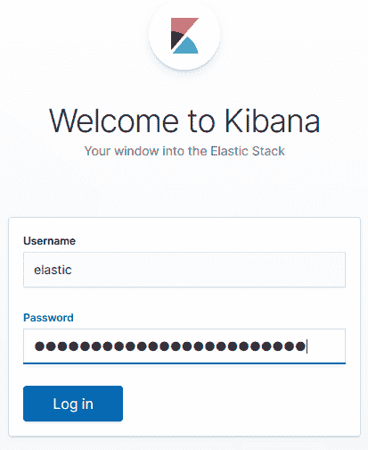

1.  在主页上，点击“连接到您的 Elasticsarch 索引”按钮，如下截图所示：

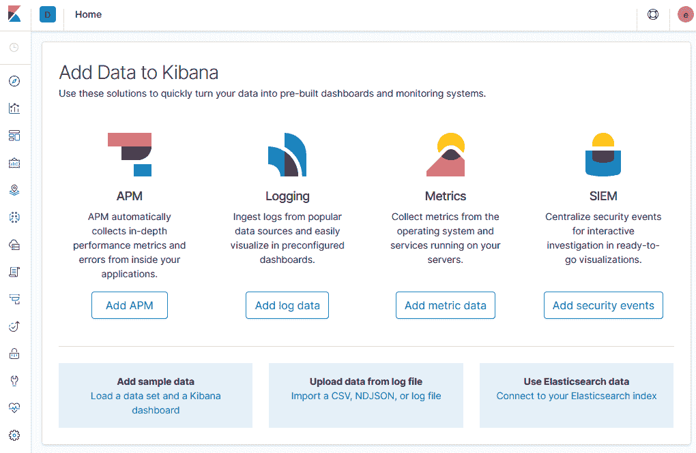

1.  Kibana 将搜索 Elasticsearch 索引模式。定义与您的结果匹配的索引模式。在我们的示例中，我们使用了`kubernetes_cluster-*`。点击“下一步”继续：

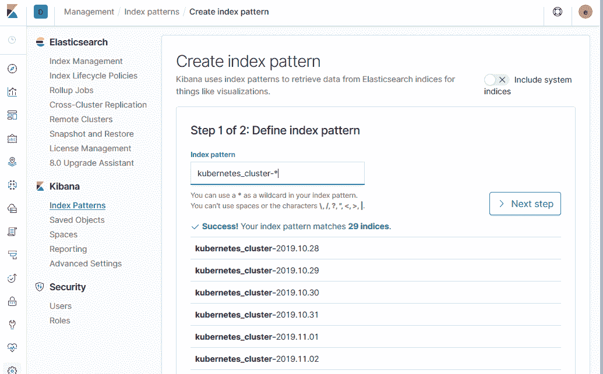

1.  将时间过滤器字段名称指定为`@timestamp`，然后点击“创建索引模式”按钮，如下面的屏幕截图所示：

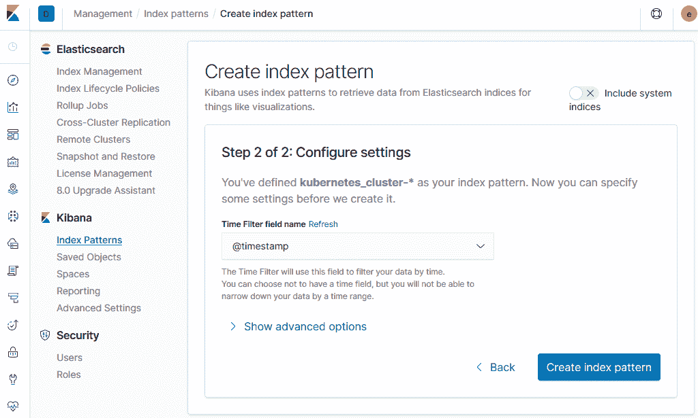

1.  点击“发现”菜单。这是从顶部开始的第一个图标：

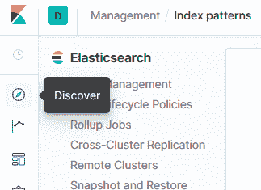

1.  在“发现”页面上，使用搜索字段查找关键字和过滤器：

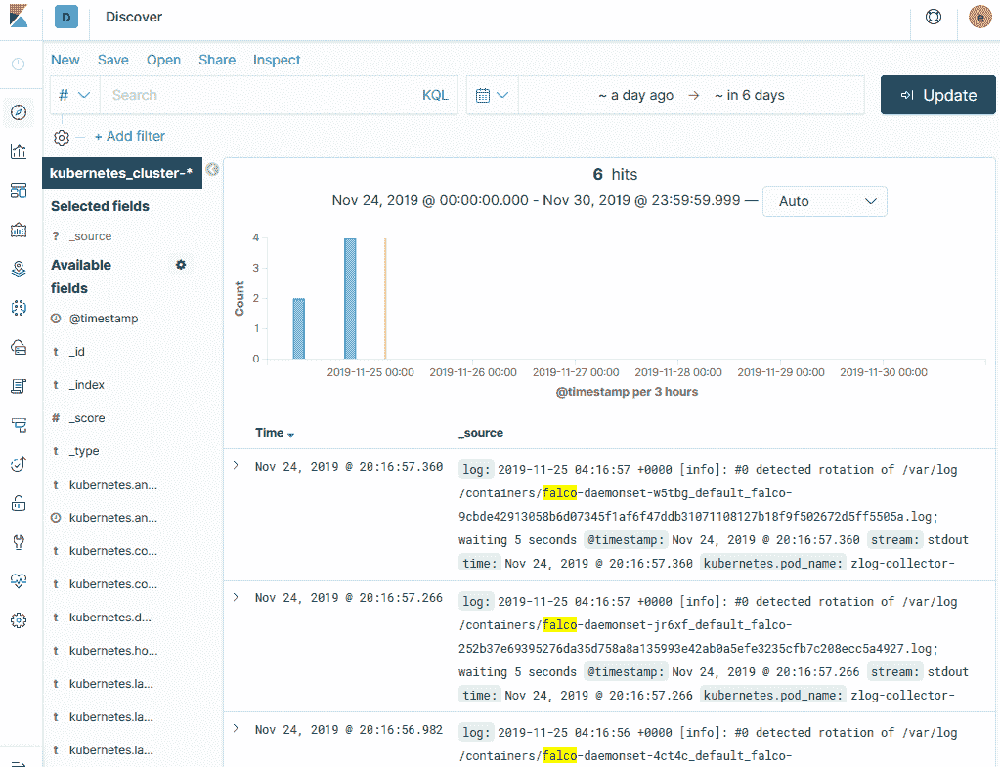

1.  如果您要查找的关键字在当前时间范围内找不到，您需要通过点击搜索字段旁边的日历图标并在选择新范围后点击“应用”按钮来更改日期范围：

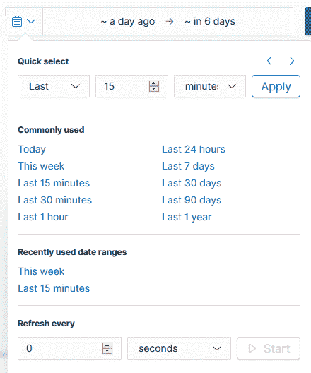

有了这个，您已经学会了如何在 Kubernetes 集群上配置 EFK 堆栈，以便管理和可视化整个集群的日志。

## 另请参阅

+   **Kubernetes 上的 Elastic Cloud**（**ECK**）：[`github.com/elastic/cloud-on-k8s`](https://github.com/elastic/cloud-on-k8s)

+   在 Red Hat OpenShift 上的部署说明：[`www.elastic.co/guide/en/cloud-on-k8s/0.9/k8s-openshift.html`](https://www.elastic.co/guide/en/cloud-on-k8s/0.9/k8s-openshift.html)

+   Elasticsearch 服务文档：[`www.elastic.co/guide/en/cloud/current/index.html`](https://www.elastic.co/guide/en/cloud/current/index.html)

+   Kibana 简介：[`www.elastic.co/guide/en/kibana/7.4/introduction.html#introduction`](https://www.elastic.co/guide/en/kibana/7.4/introduction.html#introduction)

+   Fluentd 文档：[`docs.fluentd.org/`](https://docs.fluentd.org/)

+   Fluent Bit 文档：[`docs.fluentbit.io/manual/`](https://docs.fluentbit.io/manual/)

+   Rancher 弹性堆栈 Kubernetes Helm 图表：[`github.com/rancher/charts/tree/master/charts/efk/v7.3.0`](https://github.com/rancher/charts/tree/master/charts/efk/v7.3.0)

+   Kudo 弹性运算符：[`github.com/kudobuilder/operators/tree/master/repository/elastic`](https://github.com/kudobuilder/operators/tree/master/repository/elastic)

# 使用 Google Stackdriver 记录 Kubernetes

在这一部分，我们将使用 Google Stackdriver Kubernetes Engine 监控来监视，隔离和诊断我们的容器化应用程序和微服务环境。您将学习如何使用 Stackdriver Kubernetes Engine 监控来聚合来自 GKE 上 Kubernetes 环境的日志，事件和指标，以帮助您了解您的应用在生产环境中的行为。

## 准备就绪

确保您有一个准备好的**Google Kubernetes Engine**（**GKE**）集群，并且已经配置了`kubectl`来管理集群资源。如果没有，您可以按照第一章中的说明，*构建生产就绪的 Kubernetes 集群*，在*在 Google 云平台上配置 Kubernetes 集群*教程中进行操作。

## 如何操作…

这一部分进一步分为以下小节，以使这个过程更容易：

+   为 GKE 安装 Stackdriver Kubernetes Engine 监控支持

+   在 Stackdriver 上配置工作空间

+   使用 Stackdriver 查看 GKE 日志

### 为 GKE 安装 Stackdriver Kubernetes Engine 监控支持

启用 Stackdriver 监控支持可以轻松监控 GKE 集群，调试日志，并使用高级分析和跟踪功能分析集群的性能。在这个教程中，我们将启用 Stackdriver Kubernetes Engine 监控支持，以从我们的 GKE 集群收集集群指标。按照以下步骤进行：

1.  在 Google Kubernetes Engine 控制台上打开[`console.cloud.google.com/kubernetes`](https://console.cloud.google.com/kubernetes)。在这个控制台上，您将看到您的 GKE 集群列表。在这里，我们有一个名为`k8s-devops-cookbook-1`的集群：

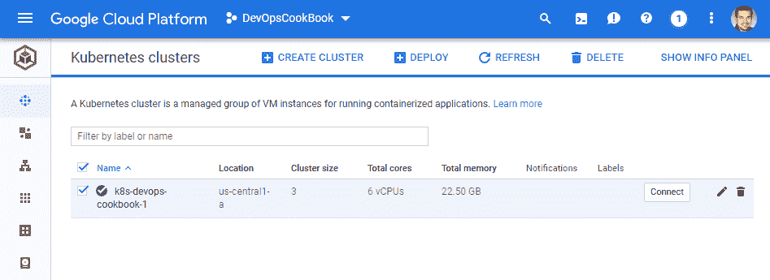

1.  单击集群旁边的小铅笔形状的编辑图标：

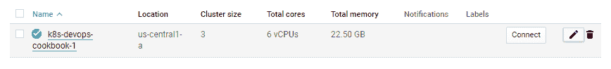

1.  在集群配置页面上，确保*Legacy Stackdriver Logging*和*Legacy Stackdriver Monitoring*都为*Disabled*，并且*Stackdriver Kubernetes Engine Monitoring*选项设置为*Enabled*：

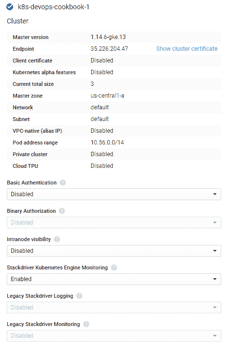

1.  单击*保存*按钮以将这些更改应用到您的集群上。

### 使用 Stackdriver 查看 GKE 日志

启用 Stackdriver 监控支持可以轻松监控 GKE 集群，调试日志，并使用高级分析和跟踪功能分析集群性能。在这个教程中，我们将学习如何访问我们在 GKE 上的 Kubernetes 集群的日志。按照以下步骤进行：

1.  从 Google Cloud 控制台，通过访问[`console.cloud.google.com/logs/viewer`](https://console.cloud.google.com/logs/viewer)来打开 Stackdriver 日志查看器：

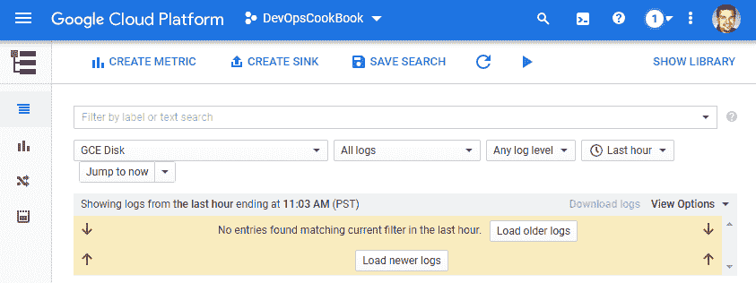

1.  从“资源”菜单中，点击“Kubernetes 容器”选项：

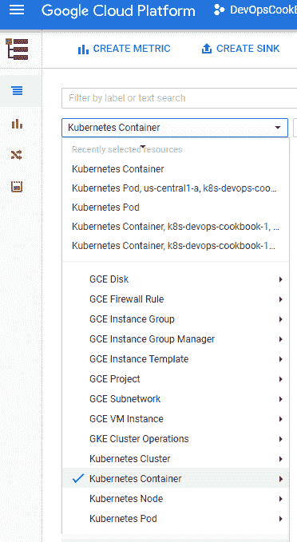

1.  Stackdriver 日志视图将显示所选 GKE 集群中容器的日志列表。在这里，您可以看到最近 7 天的容器日志被显示：

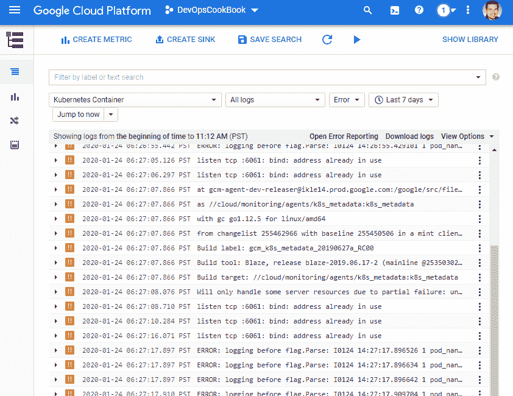

1.  将日志级别筛选为关键，并将时间范围设置为“最近 24 小时”，以查看最近的关键容器日志。可以在以下截图中看到一个示例结果：

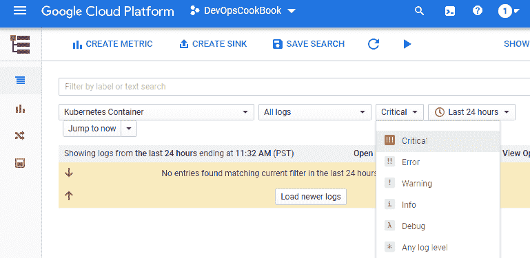

有了这个，您就知道如何使用 Stackdriver 查看 GKE 集群和资源的日志，比如部署在 GKE 集群上的容器。

## 另请参阅

+   Google Stackdriver 日志记录文档：[`cloud.google.com/logging/docs`](https://cloud.google.com/logging/docs)

+   Stackdriver 的基本查询示例：[`cloud.google.com/logging/docs/view/basic-queries`](https://cloud.google.com/logging/docs/view/basic-queries)

+   使用日志记录工具的快速入门：[`cloud.google.com/logging/docs/quickstart-sdk`](https://cloud.google.com/logging/docs/quickstart-sdk)

+   Stackdriver 日志路由器概述：[`cloud.google.com/logging/docs/routing/overview`](https://cloud.google.com/logging/docs/routing/overview)

# 使用托管的 Kubernetes 日志记录服务

在集群中运行 EFK 堆栈以存储和维护 Kubernetes 日志在您的集群中是有用的，直到集群出现问题。建议您将日志管理系统和生产集群分开，以便在集群故障时可以访问。

在本节中，我们将学习如何使用一些免费的 SaaS 解决方案，即使您的集群不可用，也可以保持集群日志的可访问性。

## 准备工作

确保您有一个准备好的 Kubernetes 集群，并配置了`kubectl`来管理集群资源。

## 如何做…

本节进一步分为以下子节，以使这个过程更容易：

+   将集群添加到 Director Online

+   使用 Director Online 访问日志

### 将集群连接到 Director Online

OpenEBS Director 提供了一个免费的托管 EFK 堆栈作为 SaaS 解决方案，这样您就可以存储和管理您的 Kubernetes 集群日志。在这个教程中，我们将把我们的 Kubernetes 集群添加到 Director SaaS 平台，以便在云中存储我们的日志：

1.  转到[www.mayadata.io](http://www.mayadata.io)以登录到您的 OpenEBS 企业平台，网址为[`portal.mayadata.io/home`](https://portal.mayadata.io/home)：


1.  单击 Connect your Cluster 按钮：

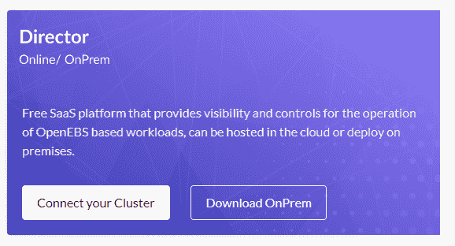

1.  从主菜单中，选择 Clusters 并单击 Connect a new Cluster 按钮。

1.  选择您的 Kubernetes 集群位置并命名您的项目。在这里，我们使用了一个 AWS 集群，并将`AWSCluster`设置为我们的集群名称：

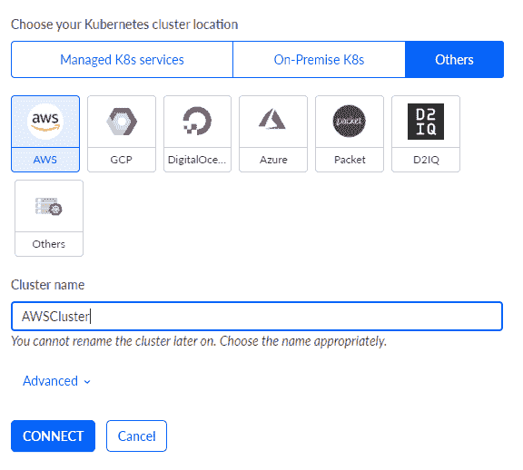

1.  在您的第一个集群上复制并执行以下命令：

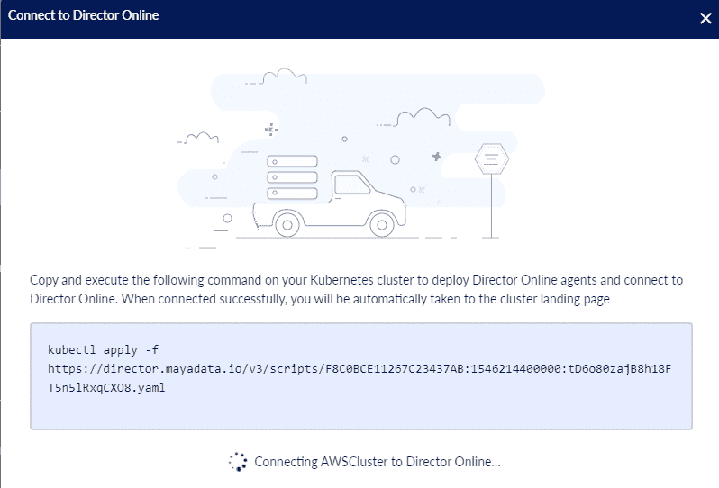

在这样做后不久，Director Online 将在您的集群上部署一个 fluentd 转发器和聚合器，以便在其平台上收集日志。

### 使用 Director Online 访问日志

OpenEBS Director 的免费计划可存储集群日志长达 1 周。额外的存储空间可通过高级计划获得。在这个教程中，我们将学习如何使用 Director Online 提供的托管 EFK 堆栈来访问日志：

1.  转到[www.mayadata.io](http://www.mayadata.io)以登录到您的 OpenEBS 企业平台，网址为[`portal.mayadata.io/home`](https://portal.mayadata.io/home)。

1.  从主菜单中，选择 Clusters 并选择您的活动集群。

1.  从左侧菜单中，单击 Logs：

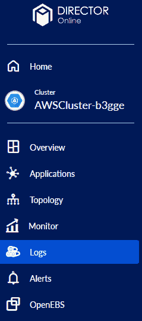

1.  在 Kibana Discover 仪表板上将打开一个日志视图。在这里，您可以使用 Elasticsearch 和 Kibana 的搜索和过滤功能来管理您的 Kubernetes 日志：

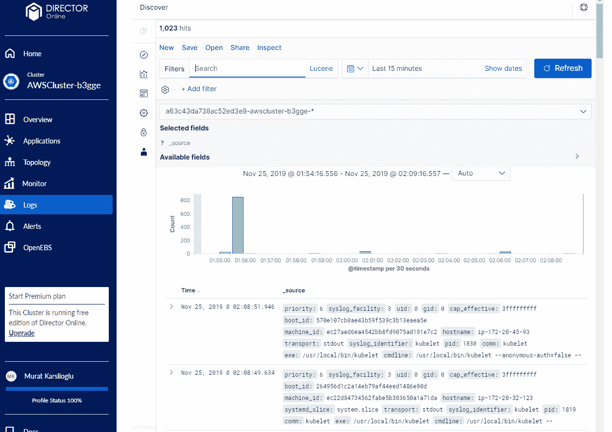

通过这样，您已经学会了如何简单地使用托管的 Kubernetes 日志解决方案保持日志可访问。您可以在多个集群上使用 Director Online，并从单个界面管理日志。

# 为您的 Jenkins CI/CD 环境记录日志

在繁忙的构建环境中，CI/CD 流水线每天都会产生大量的元数据。Elasticsearch 是从 Jenkins 获取这种数据的完美平台。

在本节中，我们将学习如何启用和访问我们的 Jenkins 实例的日志，并分析团队的效率。

## 准备工作

本教程中提到的所有操作都需要一个完全功能的 Jenkins 部署，如第三章中所述，“构建 CI/CD 流水线”，在“在 Jenkins X 中设置 CI/CD 流水线”部分。

将`k8sdevopscookbook/src`存储库克隆到您的工作站，以使用`chapter10`目录中的清单文件：

```
$ git clone https://github.com/k8sdevopscookbook/src.git
$ cd src/chapter10
```

确保您有一个 Kubernetes 集群，Jenkins X 和 EFK 堆栈已准备就绪，并且`kubectl`已配置，以便您可以管理集群资源。

## 如何操作…

本节将向您展示如何将 Jenkins 日志馈送到 Elasticsearch。本节进一步分为以下子节，以使此过程更容易：

+   安装 Fluentd 插件

+   使用 Fluentd 将 Jenkins 日志流式传输到 Elasticsearch

### 安装 Fluentd 插件

Fluentd 是 EFK 堆栈的一部分，与 Elasticsearch 和 Kibana 一起。它是一个用于构建统一日志层的开源数据收集器。这个教程将向您展示如何为 Jenkins 安装 Fluentd 插件，它将把 Jenkins 日志转发到您的 Fluentd 记录器。

让我们执行以下步骤在 Jenkins 上安装 Fluentd 插件：

1.  访问您的 Jenkins 服务仪表板，然后点击“管理 Jenkins”菜单：

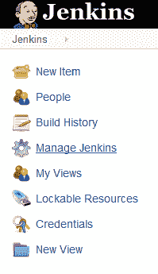

1.  在“管理 Jenkins”菜单中，点击“管理插件”按钮：

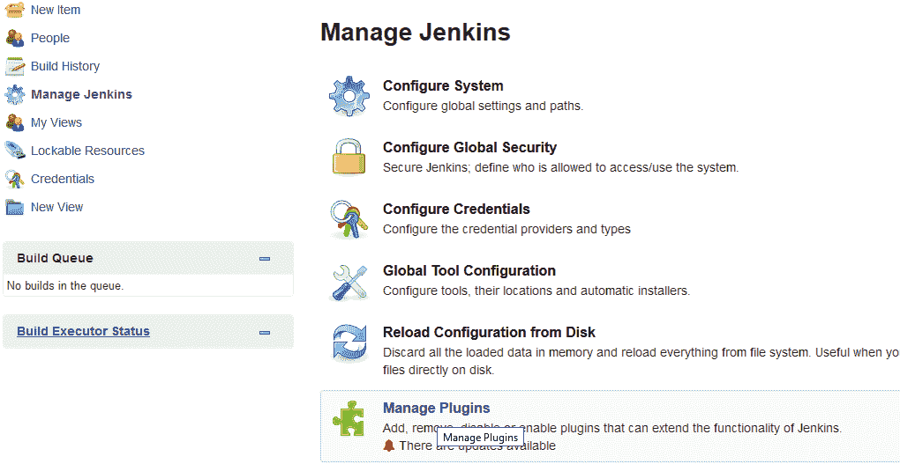

1.  点击“可用”选项卡，并在过滤字段中搜索`fluentd`。结果应该类似于以下内容。点击“无需重启安装”按钮来安装 Fluentd 插件：

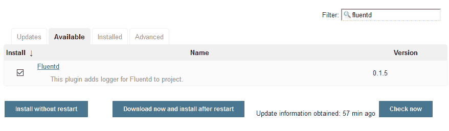

Fluentd 插件将在无需重新启动 Jenkins 实例的情况下安装。

### 使用 Fluentd 将 Jenkins 日志流式传输到 Elasticsearch

在这个教程中，我们将学习如何配置我们在 Jenkins 上安装的 Fluentd 插件。

让我们执行以下步骤将 Jenkins 日志馈送到 Elasticsearch：

1.  在“管理 Jenkins”菜单中，点击“配置系统”按钮。

1.  浏览设置。在 Fluentd 设置日志记录器下，输入日志记录器名称。日志记录器名称用作 Fluentd 的前缀。在主机字段中，输入您的 Fluentd 服务的服务名称和暴露的端口号。在我们的示例中，在我们的 Kubernetes 集群中，我们使用稳定的/fluentd Helm 图表来安装 Fluentd。服务名称是`fluentd`。这通过端口`24220`暴露。保存更改：

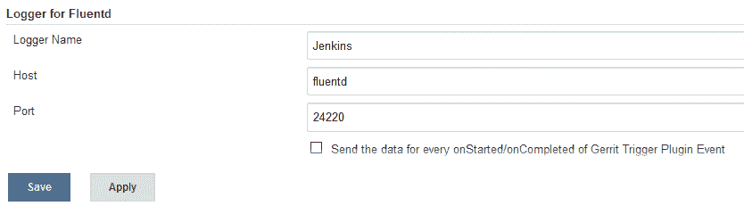

1.  在管道配置下选择一个作业。

1.  单击“添加后构建操作”按钮，并从下拉菜单中选择“发送到 Fluentd”选项。

现在，Fluentd 插件将通过日志收集器将日志推送到 Elasticsearch。

## 还有更多…

如果您在 EFK 堆栈中使用 ELK 堆栈而不是 Fluentd，则请按照此处给出的教程。本节进一步分为以下子节，以使此过程更加简单：

+   安装 Logstash 插件

+   使用 Logstash 将 Jenkins 日志流式传输到 Elasticsearch

### 安装 Logstash 插件

Logstash 是 Elastic Stack 的一部分，与 Beats、Elasticsearch 和 Kibana 一起。它是一个具有实时流水线功能的开源数据收集引擎。在这个教程中，您将学习如何为 Jenkins 安装 Logstash 插件。

让我们执行以下步骤为 Jenkins 安装 Logstash 插件：

1.  访问您的 Jenkins 服务仪表板，单击“管理 Jenkins”菜单：

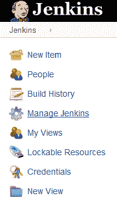

1.  在“管理 Jenkins”菜单中，单击“管理插件”按钮：


1.  单击“可用”选项卡，并在“筛选”字段中搜索`logstash`。结果应该类似于以下内容。单击“安装后无需重启”按钮以安装 Logstash 插件：

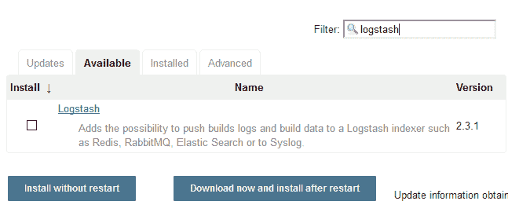

Logstash 插件将安装，而无需重新启动 Jenkins 实例。

### 使用 Logstash 将 Jenkins 日志流式传输到 Elasticsearch

在这个教程中，我们将向您展示如何配置您之前在 Jenkins 上安装的 Logstash 插件。

让我们执行以下步骤将 Jenkins 日志馈送到 Elasticsearch：

1.  在“管理 Jenkins”菜单中，单击“配置系统”按钮。

1.  滚动查看设置。在 Logstash 设置下，选中“启用发送日志到索引器”复选框。启用此设置后，将打开四个新字段。

1.  在 URI 字段中，输入服务名称，然后是索引器名称；例如，`http://elasticsearch-es-http:9200/logstash/jenkins`。输入您的`elastic`用户名和密码，保存更改：

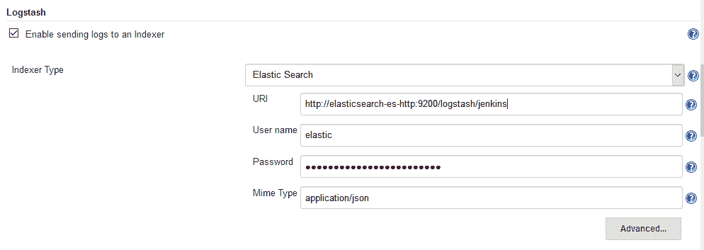

现在，Logstash 插件将通过日志收集器将日志推送到 Elasticsearch。

## 另请参阅

+   Jenkins Logstash 插件文档：[`wiki.jenkins.io/display/JENKINS/Logstash+Plugin`](https://wiki.jenkins.io/display/JENKINS/Logstash+Plugin)

+   Jenkins FluentD 插件文档：[`github.com/jenkinsci/fluentd-plugin`](https://github.com/jenkinsci/fluentd-plugin)

+   在 Jenkins 中进行调试日志记录：[`wiki.jenkins.io/display/JENKINS/Logging`](https://wiki.jenkins.io/display/JENKINS/Logging)
