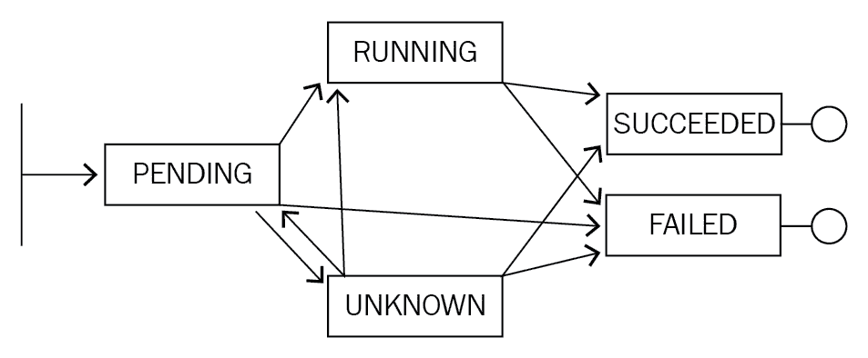
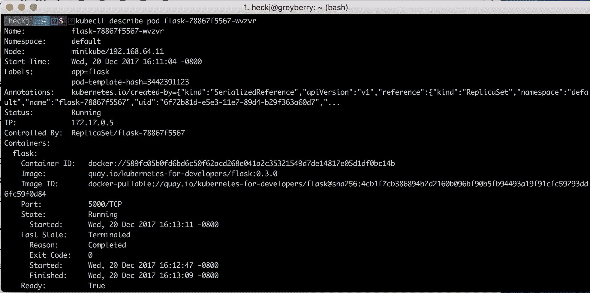
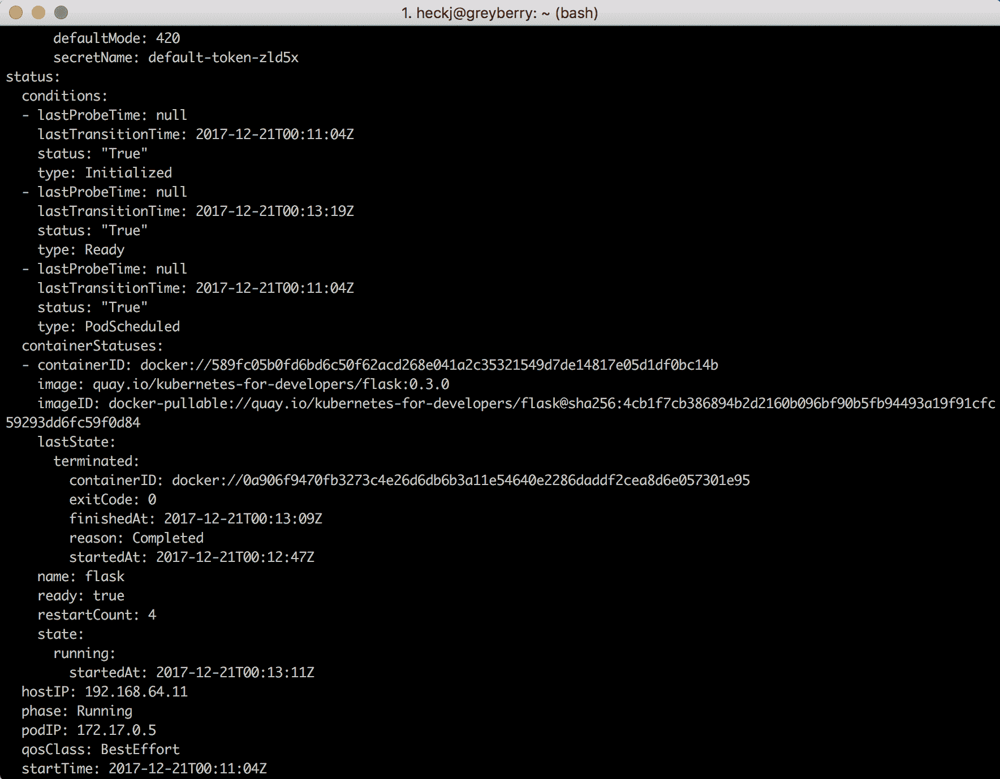
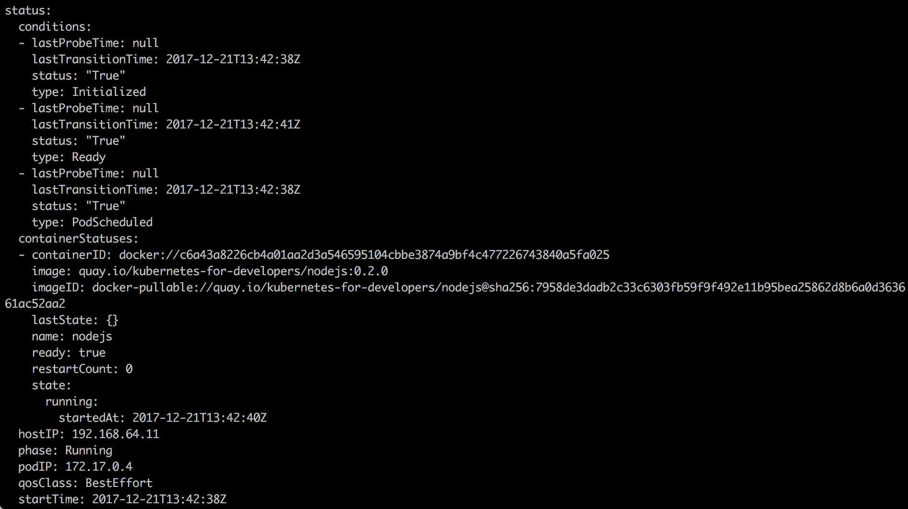
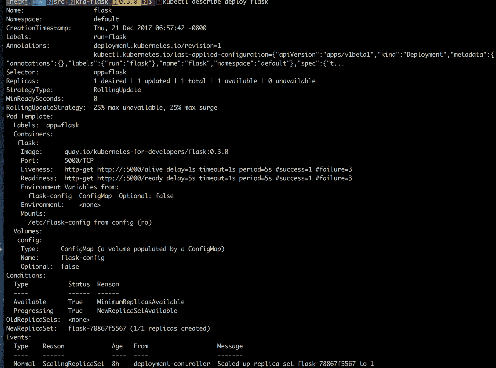
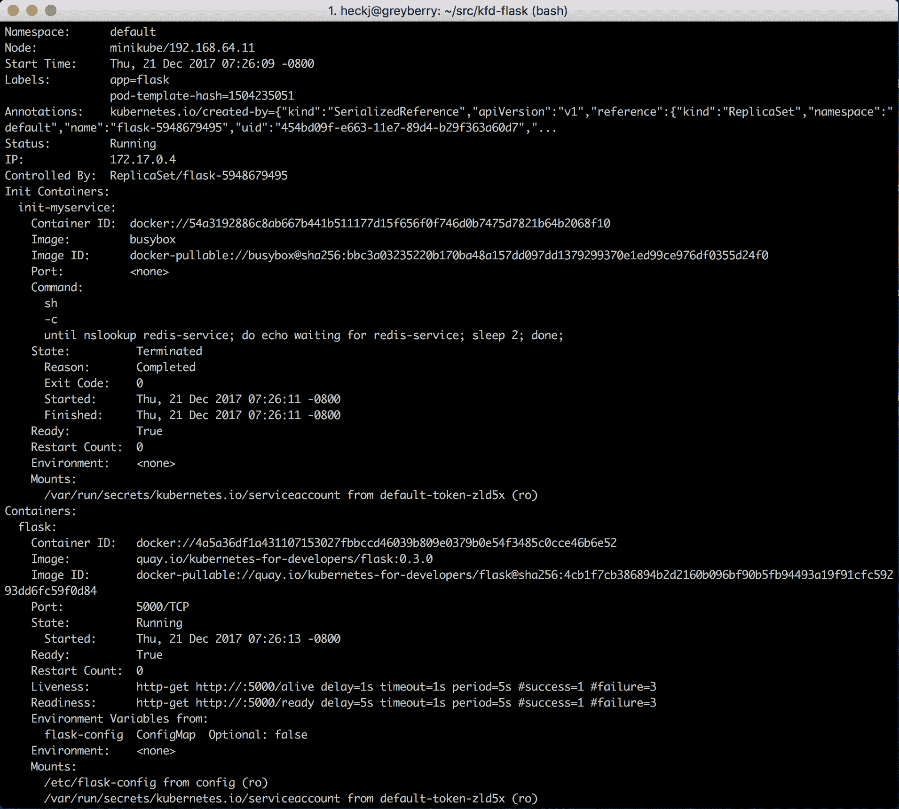

# 吊舱和容器的生命周期

由于 Kubernetes 是一个声明性系统，为 Pods 和 Containers 提供的生命周期和钩子是您的代码可以采取行动的地方。Pods 和容器一样都有生命周期，Kubernetes 提供了许多地方，您可以向系统提供明确的反馈，让它按照您的意愿运行。在本章中，我们将深入探讨预期的生命周期、可用的钩子以及如何使用它们的示例。

主题将包括:

*   Pod 生命周期
*   容器生命周期
*   探针
*   容器挂钩:启动后和停止前
*   初始化容器
*   如何处理正常关机

# Pod 生命周期

Pod 的生命周期是几个组件的集合，因为 Pod 有许多移动部件，在运行时可以处于各种状态。生命周期的表示是 Kubernetes 如何为您管理运行代码，以及各种控制器的控制和反馈循环。



Pod 生命周期的状态是:

*   **待定**:Pod 已经通过 API 创建，正在其中一个节点上进行调度、加载和运行
*   **运行**:Pod 完全运行，软件在集群内运行
*   **成功(或)失败**:吊舱已完成操作(正常或崩溃)
*   **还有第四种状态**:未知，这是一种相当罕见的情况，通常只有当 Kubernetes 内部出现问题时才会出现，因为它不知道容器的当前状态，或者无法与其底层系统通信来确定该状态

如果您在容器中处理长时间运行的代码，那么大部分时间将花费在运行上。如果您在 Kubernetes 中使用 Job 或 CronJob 使用较短的、面向批处理的代码，那么最终状态(成功或失败)可能就是您感兴趣的。

# 容器生命周期

容器也有一个单独管理的状态，因为每个 Pod 可以有一个或多个容器。容器状态更简单、更直接:

*   等待
*   运转
*   终止的


容器状态都有一个与之关联的时间戳，指示集群何时记录了处于该状态的容器。如果处理了多个状态，还会有一个最后状态字段。由于容器是相当短暂的，所以通常会看到一个终止的前一个状态，它包括关于容器何时开始、何时结束、退出代码的信息，以及一个关于它为什么终止的名为“原因”的字符串条目。

以下是您的 Pod 处理了一段时间后(在本例中，在更新了几次后)容器状态的示例:



您可以在`kubectl describe pod`命令的输出中以人类可读的格式看到额外的细节，这对于快速理解 Pod 中发生的事情通常是最方便的。

各州都有额外的信息来提供正在发生的事情的细节。通过应用编程接口有一个正式的 PodStatus 对象。每个状态都有可用的附加详细信息，更一般地说，状态对象包括一个条件列表，这些条件通常在 description 或原始 YAML 的输出中公开和可见。

使用`kubectl get pod ... -o yaml`命令，您可以看到机器可解析形式的数据，并看到还有一个额外的细节没有在`describe`命令中公开。在下面的截图中，您可以看到与 Pod 和容器状态相关的输出，包括条件、容器状态和相关时间戳:



随着对象经历其生命周期，条件被添加到 Kubernetes 对象的状态中。


在 Pod 状态挂起中，通常会添加两个条件:`Initialized`和`PodScheduled`。如果集群无法运行请求的 Pod，那么您可能会看到条件`Unschedulable`而不是`PodScheduled`。当 Pod 处于运行状态时，还有一个条件**就绪**是相关的，并且会影响 Kubernetes 对您的代码的管理。

# 部署、复制集和单元

豆荚不是唯一利用和暴露条件的Kubernetes资源。部署还使用条件来表示细节，例如代码更新的部署进度以及部署的整体可用性。

使用部署时，您将看到两种情况:

*   发展
*   有空的

当底层 Pods 的最小副本数可用时(默认值为 1)，可用将为真。当副本集及其相关的 Pods 被创建并可用时，进度将被设置。

Kubernetes 在内部资源如何相互关联方面使用一致的模式。正如我们在前面一章中所讨论的，部署将有关联的复制集，而复制集将有关联的 Pods。你可以把它想象成一串对象，上级负责监视和维护下一级的状态:


我们一直关注 Pod 状态及其生命周期，因为这是代码被表示和实际运行的地方。在大多数情况下，您将创建一个部署，该部署又有自己的状态和条件。这将反过来创建一个复制集，而复制集将创建一个或多个 Pod。

创建 Pod 时，系统将尝试首先创建 API 资源本身，然后尝试在集群中找到运行它的位置。创建资源后，初始化条件会添加到状态中。当集群确定在哪里运行 Pod 时，将添加 PodScheduled 条件。如果集群找不到您所描述的运行 Pod 的位置，那么`Unschedulable`条件将被添加到状态中。

# 获取当前状态的快照

使用`kubectl describe`或`kubectl get`命令，您可以看到 Kubernetes 对您的代码状态的了解的当前快照。如果你只是想互动地看自己的状态，那么`kubectl describe`命令是最有价值的。请记住，Kubernetes 管理着一个与运行代码相关的对象链，因此，如果您想要查看完整的快照，您需要查看每个对象的状态:部署、复制集和 Pods。在实践中，查看部署状态，然后跳到 Pods 通常会为您提供任何想要的细节。

通过使用`kubectl get pod`查看 Pod 的原始数据，或者使用`describe`命令，您可以看到 Kubernetes 如何处理您的代码的这些细节。你要找`Status`和`Conditions`。例如，当我们先前创建`nodejs`应用部署时，对象链创建了:

```
kubectl get deploy
NAME   DESIRED CURRENT UP-TO-DATE AVAILABLE AGE
nodejs 1       1       1          1         8h
kubectl get rs
NAME              DESIRED CURRENT READY AGE
nodejs-6b9b87d48b 1       1       1     8h
kubectl get pod
NAME                    READY STATUS  RESTARTS AGE
nodejs-6b9b87d48b-ddhjf 1/1   Running 0        8h
```

您可以使用`kubectl describe`命令查看其当前状态的快照，以查看部署:

```
kubectl describe deploy nodejs
```

这将呈现如下信息:


您可以通过查看复制集来使用`kubectl describe`获取更多详细信息:

```
kubectl describe rs nodejskubectl describe deploy nodejs 
```


最后，再用一次它来查看由部署和复制集创建的 Pods:

```
kubectl describe pod nodejs
```


`kubectl describe`输出底部列出的事件将向您显示与 Pod 相关的事件顺序。

如果您想要在脚本中使用状态，或者使用程序来解析输出，那么您可以使用`kubectl get`命令，为输出指定数据格式，例如 YAML。例如，可以使用以下命令检索 YAML 的相同 Pod 输出:

```
 kubectl get pod nodejs-6b9b87d48b-lcgvd -o yaml
```

关键状态下输出的下部将保存状态快照信息:



虽然在`kubectl describe`的输出中没有显示，但是每个条件都用最后更新的时间、最后改变的时间、类型和状态来跟踪。此外，每个容器都列出了自己的状态。

您可以看到的 Pod 条件列表可能会随着 Kubernetes 的未来版本而增长，今天包括以下内容:

*   **PodScheduled** :当 Pod 已经在节点上被调度并且开始将其加载到节点的过程已经开始时，转换为 true。
*   **初始化**:当 Pod 的所有容器都已加载，并且定义的任何初始化容器都已运行完成后，初始化将被标记为真。
*   **准备好**:吊舱已经按照规格装载并启动。在就绪探测和活动探测成功完成之前(如果定义了其中一个或两个)，该值不会被标记为 true。
*   **不可分解**:只有当 Kubernetes 集群无法将可用资源与 Pod 的需求相匹配时，才会列出并声明该条件。

有时状态(如`Succeeded`或`Failed`)还会包含一个`Reason`，它包含一些文本输出，旨在更容易理解发生了什么。从前面的输出中可以看出，所有状态变化都包含时间戳。由于这是一个时间快照，时间戳可以提供面包屑线索来了解发生的事情的顺序，以及它发生在多久之前。

最后，与 Pod 相关的事件通常会提供有用的描述性注释，说明在 Pod 启动时发生了什么(或没有发生什么)。利用描述、Pod 状态、条件和事件提供的所有详细信息，在 Pod 日志本身之外提供最佳的状态更新。

Pods 的生命周期还包括钩子或反馈机制，您可以指定这些机制来允许您的应用提供关于它如何工作的反馈。其中一个机制，条件`Ready`，你以前见过。Kubernetes 让您的应用提供关于它是否准备好接受流量以及它是否健康的具体反馈。这些反馈机制被称为**探针**，可以在您的 Pod 规范中随意定义。

# 探针

在 Kubernetes 中启用的两个探测器是活动探测器和就绪探测器。它们是互补的，但是在意图和用法上有所不同，并且可以为 Pod 中的每个容器进行定义。在这两种情况下，它们都为您的代码提供了一种影响 Kubernetes 如何管理容器的方法。

# 活性探针

最基本的探测器是 Liveness 探测器。如果定义了，它会提供一个命令或 URL，Kubernetes 可以使用它来确定 Pod 是否仍在运行。如果调用成功，Kubernetes 将假设容器是健康的；如果它没有响应，那么可以按照`restartPolicy`的定义来处理 Pod。结果是二元的:要么探测器成功了，库本内斯认为你的吊舱在运行，要么它失败了，所以库本内斯认为你的吊舱不再起作用了。在后一种情况下，它将检查定义的 RestartPolicy 以选择要做什么。

`restartPolicy`的默认值是`Always`，这意味着如果 Pod 中的容器出现故障，Kubernetes 将始终尝试重新启动它。您可以定义的其他值包括`OnFailure`和`Never`。当容器重新启动时，Kubernetes 将跟踪这种情况发生的频率，如果重新启动是快速连续发生的，它将降低重新启动的频率，两次重新启动之间最多间隔五分钟。在`kubectl describe`的输出中，重启次数被跟踪并显示为`restartcount`，在`kubectl get.`的数据输出中，按键`restartCount`

如果活跃度探测器没有被明确定义，那么探测器被认为是成功的，并且容器被自动设置为活的。如果容器本身崩溃或退出，Kubernetes 会做出反应，并按照`restartPolicy`重新启动它，但不会进行其他主动检查。这允许您处理代码已经冻结或死锁并且不再响应的情况，即使进程继续运行。

可以定义活性探测器，通过以下三种方法之一检查 Pod 的运行状况:

*   `ExecAction`:这将调用 Pod 中的一个命令来获得响应，该命令调用的退出代码的结果就是活跃度检查中使用的结果。除`0`以外的任何结果都代表失败。
*   `TCPSocketAction`:这将尝试打开一个套接字，但除了尝试打开它之外，不会操纵或与套接字交互。如果套接字打开，则探测成功，如果探测失败或超时后失败，则探测失败。
*   `HTTPGetAction`:类似于 socket 选项，这使得到您的 Pod 的 HTTP 连接成为 URI 指定的，并且 HTTP 请求的响应代码是用来确定活跃度探测成功/失败的代码。

有许多变量也可以配置该探测器的细节:

*   `activeDeadlineSeconds`(默认情况下不设置):该值最常用于作业，而不是长时间运行的 Pods，以对作业允许运行的时间设置最大限制。这个数字将包括初始化容器所花费的时间，这将在本章后面进一步讨论。
*   `initialDelaySeconds`(默认不设置):这允许您指定开始探头检查前的秒数。这不是默认设置，因此实际上默认为 0 秒。
*   `timeoutSeconds`(默认为 1):这提供了一个超时，以防命令或 URL 请求需要很长时间才能返回。如果超时在命令返回之前到期，则认为它失败了。
*   `periodSeconds`(默认值为 10):这定义了 Kubernetes 运行探测的频率——调用命令、检查套接字可用性或发出 URL 请求。
*   `successThreshold`(默认为 1):这是探头需要返回成功才能将容器的状态设置为`active`的次数。
*   `failureThreshold`(默认为 3):这是触发将容器标记为不健康的探针连续故障的最小次数。

如果您定义了一个 URL 来请求，并将其他一切都保留为默认值，那么正常模式将需要三个失败响应——一个超时或非 200 响应代码——然后才会考虑容器`dead`并应用`restartPolicy`。默认情况下，每次检查间隔 10 秒，因此在系统应用`restartPolicy`之前，您的容器可能会在这些默认值下停止运行 30 秒。

如果您使用的是基于 HTTP 的探测器，那么在发出 HTTP 请求时，您可以定义许多额外的变量:

*   `host`:默认为 Pod 的 IP 地址。
*   `scheme` : HTTP 或 https。Kubernetes 1.8 默认为 HTTP
*   `path`:URI 请求的路径。
*   `HttpHeaders`:请求中包含的任何自定义标题。
*   `port`:发出 HTTP 请求的端口。

# 就绪探测器

第二个可用的探测器是就绪探测器，通常与活动探测器并行使用。只有当您的应用准备就绪并能够服务于正常请求时，就绪探测器才会做出积极响应。例如，如果您想等到数据库完全运行，或者预加载一些可能需要几秒钟的缓存，那么在这些操作完成之前，您可能不想返回就绪探测的肯定响应。

与活跃度探测器一样，如果没有定义活跃度探测器，系统会假设只要您的代码正在运行，它也准备好接受请求。如果您的代码需要几秒钟才能完全运行，那么定义和利用就绪性探测是非常值得的，因为这将与任何服务一起工作来自动更新端点，以便当流量无法服务于某个实例时，流量不会被路由到该实例。

相同的选项可用于配置就绪探测器，即`ExecAction`、`TCPSocketAction`或`HTTPGetAction`之一。与活性探测一样，相同的变量可用于调整探测请求、超时的频率，以及触发状态变化的成功和/或失败的次数。如果您修改了活动探测中的值，那么您可能不想将就绪探测设置得比活动探测更频繁。

提醒一下，当就绪探测失败时，容器不会自动重启。如果你想要这个功能，你应该使用活性探测器。准备就绪探测器是专门设置的，允许 Pod 指示它还不能处理流量，但它预计很快就能处理。随着探头的更新，Pod 状态将更新为设置“就绪”为正或负，相关的“就绪”条件也将更新。当这种情况发生时，任何使用这个 pod 的服务都将收到这些更新的通知，并将根据就绪值改变发送流量(或不发送流量)。

您可以将就绪探测器视为断路器模式的一种实现，也是一种减载手段。在运行一个 Pod 的多个副本时，如果一个实例过载或出现某种临时情况，它会对就绪探测做出负面响应，Kubernetes 中的服务机制会将任何进一步的请求定向到其他 Pod。

# 向我们的 Python 示例添加一个探测器

像前面的例子一样，代码可以在 https://github.com/kubernetes-for-developers/kfd-flask项目的 GitHub 中找到。[我不会显示所有的变化，但是您可以使用以下命令从分支`0.3.0`查看代码:`git checkout 0.3.0`。根据该代码构建的 Docker 映像同样可以在`quay.io`存储库中的`0.3.0`标签下获得。](https://github.com/kubernetes-for-developers/kfd-flask)

在本次更新中，该项目包括 Redis 的二次部署，以匹配前一章中的一些概念。部署规范也进行了更新，专门添加了活跃度探测器和就绪度探测器。更新后的部署规范现在为:

```
apiVersion: apps/v1beta1
kind: Deployment
metadata:
 name: flask
 labels:
 run: flask
spec:
 template:
 metadata:
 labels:
 app: flask
 spec:
 containers:
 - name: flask
 image: quay.io/kubernetes-for-developers/flask:0.3.0
 imagePullPolicy: Always
 ports:
 - containerPort: 5000
 envFrom:
 - configMapRef:
 name: flask-config
 volumeMounts:
 - name: config
 mountPath: /etc/flask-config
 readOnly: true
 livenessProbe:
 httpGet:
 path: /alive
 port: 5000
 initialDelaySeconds: 1
 periodSeconds: 5
 readinessProbe:
 httpGet:
 path: /ready
 port: 5000
 initialDelaySeconds: 5
 periodSeconds: 5
 volumes:
 - name: config
 configMap:
 name: flask-config
```

探测器是粗体的。两个探测器都使用与应用其余部分相同的端口(`5000`)和各自的端点。活跃度探测器被设置为在开始检查前延迟一秒，准备就绪探测器被设置为在开始检查前延迟五秒，并且两者都被设置为稍微更紧密的五秒频率。

Python 代码也进行了更新，主要是实现分别响应活跃度和就绪性探测的`/alive`和`/ready`方法。

liveness 探测是最简单的，用静态响应进行回复，只保留底层 flask 代码响应 HTTP 请求的验证:

```
@app.route('/alive')
def alive():
 return "Yes"
```

就绪探测器在这种模式下进行了扩展，但是在肯定答复之前，它会验证底层服务(在这种情况下是 Redis)是否可用并做出响应。这段代码实际上并不依赖于 Redis，但是在您自己的代码中，您可能依赖于一个可用的远程服务，并且有一些方法来指示该服务是否可用和响应。如前所述，这实际上是断路器模式的一种实现，与服务构造一起，允许 Kubernetes 帮助将负载导向可以响应的实例。

在这种情况下，我们利用了 Python 库中公开的`redis ping()`功能:

```
@app.route('/ready')
def ready():
 if redis_store.ping():
 return "Yes"
 else:
 flask.abort(500)
```

代码中的其他更新初始化代码中的`redis_store`变量，并将匹配服务的 DNS 条目添加到`configMap`中，以便应用代码可以使用它。

# 运行 Python 探测器示例

如果您查看`0.3.0`分支，您可以研究这段代码，并在您自己的 Minikube 实例或另一个 Kubernetes 集群中本地运行它。要检查代码:

```
git clone https://github.com/kubernetes-for-developers/kfd-flask

cd kfd-flask

git checkout 0.3.0

kubectl apply -f deploy/
```

最终的命令将为 Python/flask 代码创建服务和部署`redis-master`，以及服务`configmap`和部署。如果使用`kubectl describe`命令，可以看到定义的探头及其值:

```
kubectl describe deployment flask
```



您还可以查看运行中的单瓶 Pod 的日志，并查看正在处理的请求:

```
kubectl log deployment/flask
 * Running on http://0.0.0.0:5000/ (Press CTRL+C to quit)
 * Restarting with stat
 * Debugger is active!
 * Debugger PIN: 177-760-948
172.17.0.1 - - [21/Dec/2017 14:57:50] "GET /alive HTTP/1.1" 200 -
172.17.0.1 - - [21/Dec/2017 14:57:53] "GET /ready HTTP/1.1" 200 -
172.17.0.1 - - [21/Dec/2017 14:57:55] "GET /alive HTTP/1.1" 200 -
172.17.0.1 - - [21/Dec/2017 14:57:58] "GET /ready HTTP/1.1" 200 -
172.17.0.1 - - [21/Dec/2017 14:58:00] "GET /alive HTTP/1.1" 200 -
172.17.0.1 - - [21/Dec/2017 14:58:03] "GET /ready HTTP/1.1" 200 -
172.17.0.1 - - [21/Dec/2017 14:58:05] "GET /alive HTTP/1.1" 200 -
172.17.0.1 - - [21/Dec/2017 14:58:08] "GET /ready HTTP/1.1" 200 -
172.17.0.1 - - [21/Dec/2017 14:58:10] "GET /alive HTTP/1.1" 200 -
172.17.0.1 - - [21/Dec/2017 14:58:13] "GET /ready HTTP/1.1" 200 -
172.17.0.1 - - [21/Dec/2017 14:58:15] "GET /alive HTTP/1.1" 200 -
172.17.0.1 - - [21/Dec/2017 14:58:18] "GET /ready HTTP/1.1" 200 -
172.17.0.1 - - [21/Dec/2017 14:58:20] "GET /alive HTTP/1.1" 200 -
172.17.0.1 - - [21/Dec/2017 14:58:23] "GET /ready HTTP/1.1" 200 -
172.17.0.1 - - [21/Dec/2017 14:58:25] "GET /alive HTTP/1.1" 200 -
172.17.0.1 - - [21/Dec/2017 14:58:28] "GET /ready HTTP/1.1" 200 -
172.17.0.1 - - [21/Dec/2017 14:58:30] "GET /alive HTTP/1.1" 200 -
172.17.0.1 - - [21/Dec/2017 14:58:33] "GET /ready HTTP/1.1" 200 -
172.17.0.1 - - [21/Dec/2017 14:58:35] "GET /alive HTTP/1.1" 200 -
172.17.0.1 - - [21/Dec/2017 14:58:38] "GET /ready HTTP/1.1" 200 -
172.17.0.1 - - [21/Dec/2017 14:58:40] "GET /alive HTTP/1.1" 200 -
172.17.0.1 - - [21/Dec/2017 14:58:43] "GET /ready HTTP/1.1" 200 -
172.17.0.1 - - [21/Dec/2017 14:58:45] "GET /alive HTTP/1.1" 200 -
172.17.0.1 - - [21/Dec/2017 14:58:48] "GET /ready HTTP/1.1" 200 -
...
```

# 向我们的 Node.js 示例添加一个探测器

向 Node.js/express-based 应用添加示例探测器遵循与 Python 应用完全相同的模式。和 Python 例子一样，这方面的代码和规范可以在 GitHub 的[https://github.com/kubernetes-for-developers/kfd-nodejs](https://github.com/kubernetes-for-developers/kfd-nodejs)项目下获得，与分支`0.3.0`相关联。

探测器向 Node.js 部署添加了几乎相同的规范:

```
livenessProbe:
  httpGet:
    path: /probes/alive
    port: 3000
  initialDelaySeconds: 1
  periodSeconds: 5
readinessProbe: 
  httpGet:
    path: /probes/ready
    port: 3000
  initialDelaySeconds: 5
  periodSeconds: 5
```

在这种情况下，探测器请求的是应用提供的相同的 HTTP 响应和相同的端口。URI 路径更长，利用了应用的结构，该结构对特定 URI 下的路由使用一位代码，因此我们能够将就绪性和活性探测捆绑到单个新的`probes.js`路由器中。

主应用被更新，以创建一个探测路由器，并在应用启动时将其绑定，然后路由器本身内的代码提供响应。

`probes.js`的代码如下:

```
var express = require('express');
var router = express.Router();
var util = require('util');
var db = require('../db');

/* GET liveness probe response. */
router.get('/alive', function(req, res, next) {
 res.send('yes');
});

/* GET readiness probe response. */
router.get('/ready', async function(req, res, next) {
 try {
 let pingval = await db.ping()
 if (pingval) {
 res.send('yes');
 } else {
 res.status(500).json({ error: "redis.ping was false" })
 }
 } catch (error) {
 res.status(500).json({ error: error.toString() })
 }
});

module.exports = router;
```

像前面的 Python 例子一样，liveness 探测器返回一个静态响应，只是用来验证`express`仍然在响应 HTTP 请求。准备情况探测器更复杂，它将`db.ping()`包装在异步等待/捕获中，并检查值。如果是否定的，或者发生了错误，那么我们返回一个`500`响应。如果它是正的，那么我们返回一个静态的正结果。

使用`kubectl describe deployment nodejs`将显示探针可操作的配置，非常类似于 Python 示例，并且`kubectl log nodejs-65498dfb6f-5v7nc`将显示来自被响应的探针的请求:

```
GET /probes/alive 200 1.379 ms - 3
Thu, 21 Dec 2017 17:43:51 GMT express:router dispatching GET /probes/ready
Thu, 21 Dec 2017 17:43:51 GMT express:router query : /probes/ready
Thu, 21 Dec 2017 17:43:51 GMT express:router expressInit : /probes/ready
Thu, 21 Dec 2017 17:43:51 GMT express:router logger : /probes/ready
Thu, 21 Dec 2017 17:43:51 GMT express:router jsonParser : /probes/ready
Thu, 21 Dec 2017 17:43:51 GMT express:router urlencodedParser : /probes/ready
Thu, 21 Dec 2017 17:43:51 GMT express:router cookieParser : /probes/ready
Thu, 21 Dec 2017 17:43:51 GMT express:router serveStatic : /probes/ready
Thu, 21 Dec 2017 17:43:51 GMT express:router router : /probes/ready
Thu, 21 Dec 2017 17:43:51 GMT express:router dispatching GET /probes/ready
Thu, 21 Dec 2017 17:43:51 GMT express:router trim prefix (/probes) from url /probes/ready
Thu, 21 Dec 2017 17:43:51 GMT express:router router /probes : /probes/ready
Thu, 21 Dec 2017 17:43:51 GMT express:router dispatching GET /ready
GET /probes/ready 200 1.239 ms - 3
Thu, 21 Dec 2017 17:43:54 GMT express:router dispatching GET /probes/alive
Thu, 21 Dec 2017 17:43:54 GMT express:router query : /probes/alive
Thu, 21 Dec 2017 17:43:54 GMT express:router expressInit : /probes/alive
Thu, 21 Dec 2017 17:43:54 GMT express:router logger : /probes/alive
Thu, 21 Dec 2017 17:43:54 GMT express:router jsonParser : /probes/alive
Thu, 21 Dec 2017 17:43:54 GMT express:router urlencodedParser : /probes/alive
Thu, 21 Dec 2017 17:43:54 GMT express:router cookieParser : /probes/alive
Thu, 21 Dec 2017 17:43:54 GMT express:router serveStatic : /probes/alive
Thu, 21 Dec 2017 17:43:54 GMT express:router router : /probes/alive
Thu, 21 Dec 2017 17:43:54 GMT express:router dispatching GET /probes/alive
Thu, 21 Dec 2017 17:43:54 GMT express:router trim prefix (/probes) from url /probes/alive
Thu, 21 Dec 2017 17:43:54 GMT express:router router /probes : /probes/alive
Thu, 21 Dec 2017 17:43:54 GMT express:router dispatching GET /alive
GET /probes/alive 200 1.361 ms - 3
```

我们可以通过终止 Redis 服务来测试就绪探测器的操作。如果我们调用以下命令:

```
kubectl delete deployment redis-master
```

相当短的时间内，`kubectl get pods`的结果将显示 Pod 还活着，但`ready`不会:

```
kubectl get pods
NAME                         READY STATUS      RESTARTS AGE
nodejs-65498dfb6f-5v7nc      0/1   Running     0        8h
redis-master-b6b8774f9-sjl4w 0/1   Terminating 0        10h
```

当`redis-master`部署关闭时，您可以从 Node.js 部署中获得一些有趣的细节。使用`kubectl describe`显示部署:

```
kubectl describe deploy nodejs
```


并使用`kubectl describe`查看相关的 Pods:

```
kubectl describe pod nodejs
```


注意`Condition Ready`现在是`false`，Node.js 容器的状态是`Running, but Ready of False`状态。

如果重新创建或恢复 Redis 部署，那么服务将如您所期望的那样全部恢复在线。

# 容器生命周期挂钩

Kubernetes 还在每个容器的生命周期中提供了一些钩子，可以在容器的安装和拆卸时使用。这些被称为容器生命周期挂钩，是为每个容器定义的，而不是为整个 Pod 定义的。当您想要在每个 Pod 有多个容器的情况下配置一些特定于容器的附加功能时，这些功能会非常有用。

可以为每个容器定义的两个钩子是启动后钩子和停止前钩子。启动后和停止前的钩子至少要被调用一次，但是 Kubernetes 并不保证这些钩子只被调用一次。这意味着尽管这种情况很少发生，但启动后或停止前挂钩可能会被调用不止一次。

这两个钩子都不接受参数，并且以与容器的运行命令相同的方式定义。使用时，它们应该是独立的、相对较短的运行命令，并且总是返回。当调用这些钩子时，Kubernetes 暂停容器的管理，直到钩子完成并返回。因此，为这些钩子调用的可执行文件不要挂起或无限期运行是非常重要的，因为 Kubernetes 没有办法监视这种情况并响应完成或返回值的失败。

在启动后的情况下，容器状态不会移动到运行状态，直到启动后挂钩。启动后挂钩也不能保证在调用容器的主命令之前或之后调用。在预停止的情况下，容器不会被终止，直到预停止钩子完成并返回。

这两个钩子可以使用两个处理程序之一来调用:Exec 和 HTTP。Exec 在容器内部和与容器相同的进程空间中运行特定的命令，很像使用`kubectl exec`调用。HTTP 处理程序针对容器设置 HTTP 请求。在任一种情况下，如果钩子返回一个失败代码，容器就会被终止。

这些挂钩的日志不会在 Pod 事件或日志记录中公开。如果处理程序失败，它会广播一个可以用`kubectl describe`命令看到的事件。这两个事件分别是`FailedPostStartHook`和`FailedPreStopHook`。

当您希望调用外部命令来干净地关闭正在运行的进程时，例如调用`nginx -s quit`，预停止挂钩会非常有用。如果您正在使用其他人的代码，这可能特别有用，尤其是如果它有比正确响应 SIGTERM 信号更复杂的关闭过程。我们将在本章稍后讨论如何优雅地关闭 Kubernetes。

当您想要在容器内创建一个信号量文件，或者在容器启动时调用一个 HTTP 请求调用时，启动后挂钩通常很有用。更常见的情况是，需要在您的主代码开始之前进行初始化或前置条件验证，还有另一个用于该功能的选项:初始化容器。

# 初始化容器

初始化容器是可以在您的 Pod 上定义的容器，并且将在您的主容器(或多个容器)启动之前以它们被定义的特定顺序被调用。在 Kubernetes 版本中，初始化容器成为 Pod 规范的一个正常部分。

这些容器可以使用同一个容器映像，并且简单地具有备用命令，但是它们也可以使用完全不同的映像，利用 Kubernetes Pod 对共享网络和文件系统装载的保证，在主容器运行之前进行初始化和设置工作。这些容器也使用名称空间，因此它们可以被赋予主容器没有的特定访问权限；因此，他们可以访问主容器无法访问的 Kubernetes Secrets。

初始化容器应该具有运行到完成并以成功响应退出的代码。如前所述，这些容器也是按顺序调用的，不会并行运行；每一个都必须在下一个开始之前完成。当容器全部完成时，Kubernetes 初始化 Pod 并运行定义的容器。如果初始化容器失败，则认为 Pod 失败，整个套件终止(或更具体地说，按照`restartPolicy`处理)。

初始化容器允许您在主进程运行之前进行各种设置。您可以做的一些例子包括编写主 Pod 容器需要的配置文件，在启动主容器之前验证服务是否可用和活动，检索和初始化内容，例如从 Git 存储库或文件服务中提取数据，供主容器使用，或者甚至在启动主容器之前强制延迟。

当初始化容器正在运行时，Pod 状态将显示`Init:`，随后是一些特定于初始化容器的状态。如果一切进展顺利，如预期的那样，它将报告列出的初始化容器的数量，以及有多少已经运行到完成。如果初始化容器失败，那么`Init:`之后将是`Error`或`CrashLoopBackOff`。

初始化容器在 Pod 规范中与一个或多个主容器处于同一级别，并以列表的形式指定，每个容器都有自己的名称、映像和要调用的命令。例如，我们可以在 Python 烧瓶规范中添加一个`init`容器，该容器只有在 Redis 启动并可用时才会返回。这方面的一个例子可能如下:

```
spec:
 template:
 metadata:
 labels:
 app: flask
 spec:
 containers:
 - name: flask
 image: quay.io/kubernetes-for-developers/flask:0.2.0
 ports:
 - containerPort: 5000
 envFrom:
 - configMapRef:
 name: flask-config
 volumeMounts:
 - name: config
 mountPath: /etc/flask-config
 readOnly: true
 volumes:
 - name: config
 configMap:
 name: flask-config
 initContainers:
      - name: init-myservice
 image: busybox
 command: ['sh', '-c', 'until nslookup redis-master; do echo waiting for redis; sleep 2; done;']
```

在这种情况下，初始化容器代码只是一个写在 shell 中的循环，检查是否有对 DNS 条目`redis-master`的响应，并且它会无限期运行，直到成功。如果您在`redis-master`服务建立并拥有相关的域名系统条目之前查看 Pod，您会看到该 Pod 的状态列在`Init:0/1`中。

例如`kubectl get pods`:

```
NAME                  READY STATUS   RESTARTS AGE
flask-f48f89687-8p8nj 0/1   Init:0/1 0        8h
kubectl describe deploy/flask
```


您可能会注意到，此输出与前面的示例不匹配；前面输出中的命令正在寻找对`redis`的 DNS 响应，在这里我们将服务命名为`redis-service`。

在这种情况下，初始化容器将永远不会完成，Pod 将无限期地保持在`pending`状态。在这种情况下，您将需要手动删除部署，或者如果您进行了允许其工作的修改，您将需要手动删除停滞初始化的 Pods，因为它们不会被清理。

一旦初始化容器成功完成，您可以在 Pod 的`kubectl describe`输出中看到结果，或者通过`kubectl get`命令暴露的数据再次看到结果。

以下是您将从`kubectl describe`看到的输出的扩展示例。



`describe`的输出超出单个终端页面；您应该继续向下滚动以查看以下内容:


# 快速交互式测试

如果您试图制作一个快速的单行初始化容器，那么交互式地尝试一个命令通常是有用的，尤其是如果您使用的是一个非常小的容器，比如`busybox`。您想要的命令可能不可用，所以最好快速尝试一下，以验证它是否能像您预期的那样工作。

要交互式运行一个`busybox`容器，并在容器完成时将其全部删除，可以使用如下命令:

```
kubectl run tempinteractive -it --rm --restart=Never --image=busybox -- /bin/sh
```

然后在容器中尝试这个命令:


# 处理正常关机

对于生命周期挂钩，我们提到了可以定义和启用的预停止挂钩，但是如果您正在编写自己的代码，那么您可能会发现尊重 Kubernetes 用来告诉容器关闭的 SIGTERM 信号也同样容易。

如果你不熟悉 SIGTERM，它是 Linux 从内核支持的功能之一——一种向正在运行的进程发送中断的方法。这个过程可以监听这些信号，你可以选择当它们被接收时如何响应。有两个信号是你不能`ignore`的，不管你实现什么，操作系统都会强制执行:SIGKILL 和 SIGSTOP。Kubernetes 想要关闭容器时使用的信号是 SIGTERM。

您将接收到这种信号的事件不仅仅是错误或用户调用的删除，还包括您利用部署使用的滚动更新机制推出代码更新时的事件。如果您利用任何自动缩放功能，也可能发生这种情况，该功能可以动态增加(和减少)一个`replicaSet`内的副本数量。

当您响应信号时，您通常会希望保存任何需要的状态，关闭任何连接，然后终止应用。

如果您正在创建一个其他人也将通过 Kubernetes 使用的服务，那么您可能想做的第一件事是更改一个内部变量，该变量将触发任何就绪探测器以`false`响应，休眠几秒钟，然后执行任何终结和终止。这将允许 Kubernetes 中的服务构造重定向任何进一步的连接，并且所有活动的连接都可以被完成、清空和礼貌地关闭。

一旦 Kubernetes 发送信号，它就会启动一个计时器。该定时器的默认值是 30 秒，如果您需要或想要更长的值，可以在您的 Pod 规格上用值`terminateGracePeriodSeconds`定义。如果容器在计时器到期时还没有退出，Kubernetes 将尝试使用 SIGKILL 信号强制它退出。

例如，如果你调用了`kubectl delete deploy nodejs`，然后看到 Pods 以`Terminating`状态停留了一会儿，那就是正在发生的事情。

# Python 中的 SIGTERM

例如，如果您想在 Python 中处理 SIGTERM，那么您可以导入信号模块并引用一个处理程序来做您想做的任何事情。例如，一个简单的立即关闭并退出的代码位可能是:

```
import signal
import sys

def sigterm_handler(_signo, _stack_frame):
    sys.exit(0)

signal.signal(signal.SIGTERM, sigterm_handler)
```

信号处理器逻辑可以像代码要求的那样复杂或简单。

# Node.js 中的 SIGTERM

例如，如果您想在 Node.js 中处理 SIGTERM，那么您可以使用在每个 Node.js 进程中隐式创建的进程模块来处理信号并退出应用。为了与前面的 Python 示例相匹配，一个简单的立即关闭并退出的代码可能如下所示:

```
/**
 * SIGTERM handler to terminate (semi) gracefully
 */
process.on(process.SIGTERM, function() {
    console.log('Received SIGTERM signal, now shutting down...');
    process.exit(0);
})
```

# 摘要

在这一章中，我们从深入查看 Pod 生命周期和状态细节开始，扩展到展示揭示相关细节的多种方式，并描述了 Kubernetes 在运行软件时在幕后所做的事情。然后，我们查看了您的程序可以为活跃度和就绪性探测器提供的反馈循环，并回顾了在 Python 和 Node.js 中启用这些探测器的示例。根据探测器以及您的代码如何与 Kubernetes 干净地交互，我们查看了启动和初始化以及正常关闭的常见情况。

在下一章中，我们将了解如何使用 Kubernetes 和开源来为您的应用提供基本的可观察性，特别是监控和日志记录。