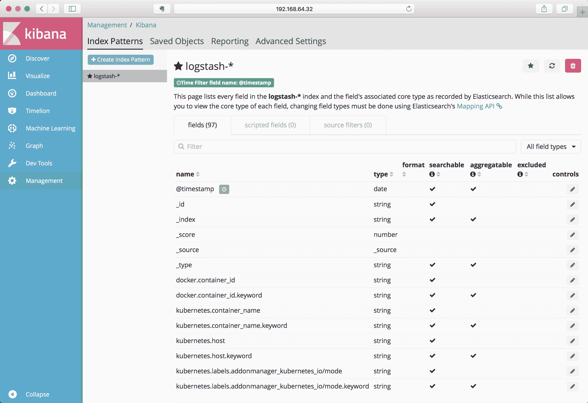
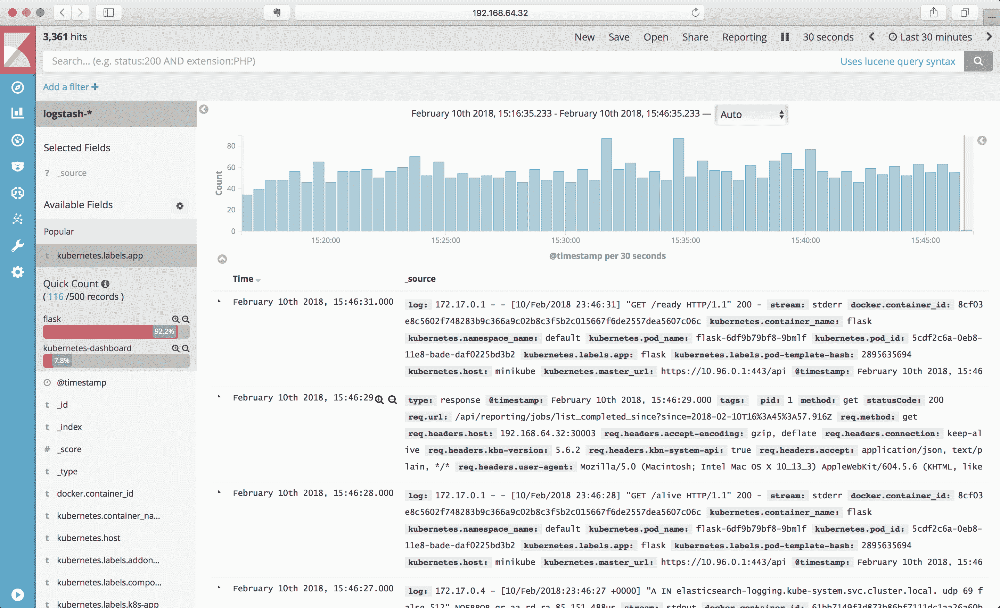
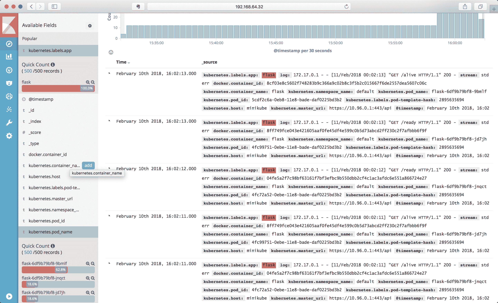
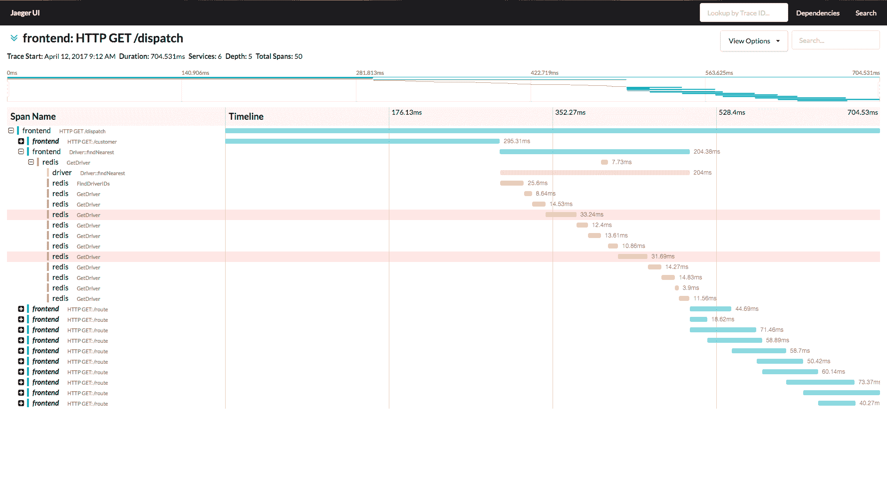
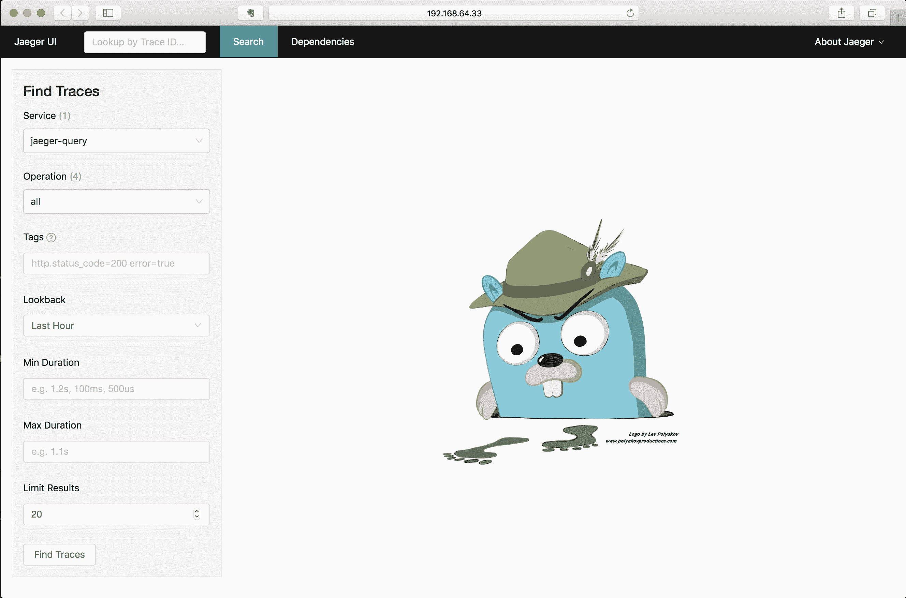
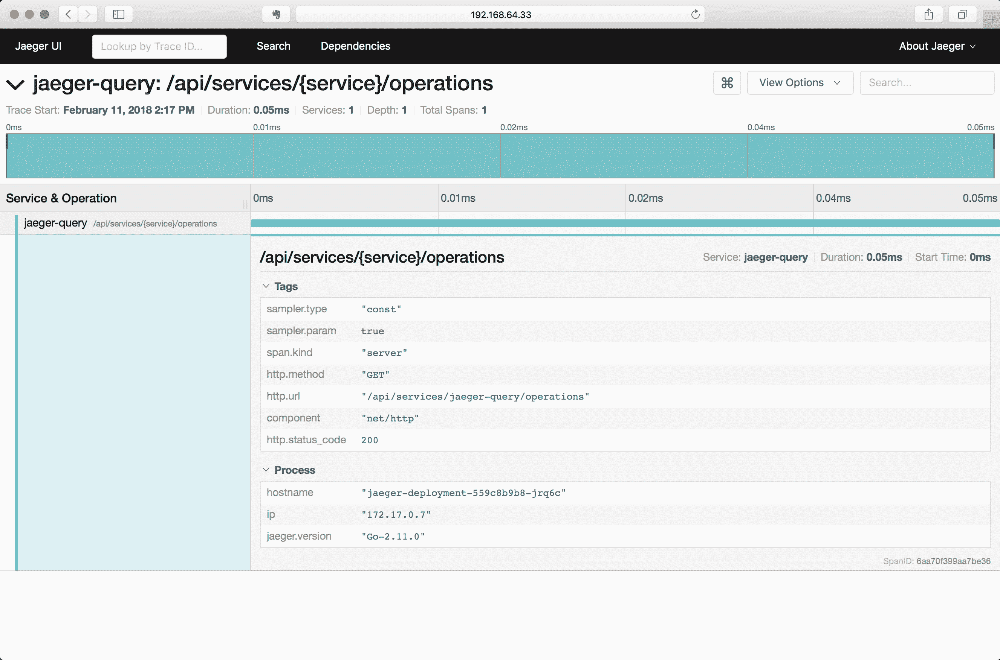
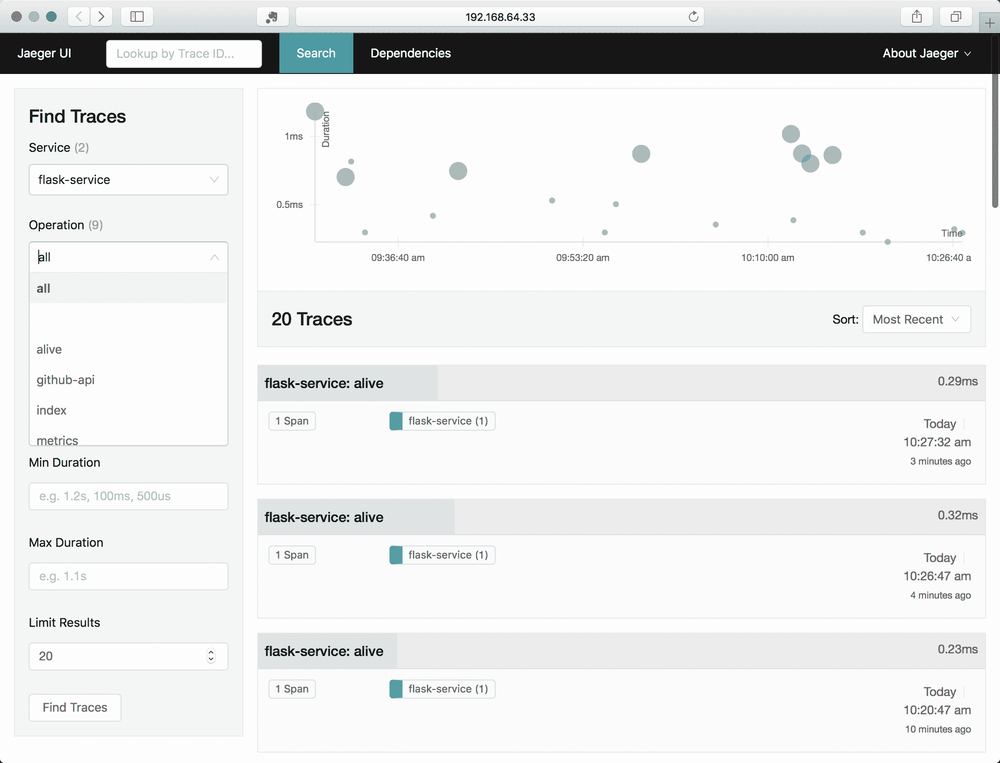

# 日志记录和跟踪

当我们第一次开始使用容器和 Kubernetes 时，我们展示了如何使用`kubectl log`命令从任何单个容器中获取日志输出。随着我们扩展希望从中获取信息的容器数量，轻松找到相关日志的能力变得越来越困难。在前一章中，我们研究了如何聚合和收集度量，在这一章中，我们扩展了相同的概念，研究了如何聚合日志记录，并更好地理解容器如何与分布式跟踪一起工作。

本章的主题包括:

*   一个永恒的概念
*   安装弹性搜索、Fluentd 和 Kibana
*   使用 Kibana 查看日志
*   用 Jeager 进行分布式跟踪
*   向应用添加跟踪的示例

# 一个永恒的概念

我们现在(通过 Helm)使用的一个 Kubernetes 资源是 DaemonSet。这个资源是一个包装器，包装器与 ReplicaSet 非常相似，但是目的是在集群中的每个节点上运行一个包装器。当我们使用 Helm 安装 Prometheus 时，它创建了一个 DaemonSet，在 Kubernetes 集群中的每个节点上运行节点收集器。

在应用中以支持角色运行软件有两种常见模式:第一种是使用侧车模式，第二种是使用 DaemonSet。侧车是指在你的吊舱中包含一个容器，它的唯一目的是与主应用一起运行，并提供一些支持性的外部角色。有用的边车的一个例子可能是缓存，或者某种形式的代理服务。运行侧车应用显然会增加 pod 所需的资源，如果 pod 的数量相对较少，或者与集群的大小相比很少，这将是提供支持软件的最有效方式。

当您正在运行的支持软件可能会在单个节点上被复制多次，并且它提供的服务相当通用(例如日志聚合或度量收集)时，那么在集群中的每个节点上运行单个 pod 会显著提高效率。这正是 DaemonSet 的用武之地。

我们之前使用 DaemonSet 的例子是在集群中的每个节点上运行一个节点收集器实例。节点收集器 DaemonSet 的目的是收集关于每个节点操作的统计数据和指标。Kubernetes 还使用 DaemonSet 来运行自己的服务，例如 kube-proxy，它在集群中的每个节点上运行。如果您正在使用覆盖网络来连接 Kubernetes 集群，例如 Weave 或法兰绒，它也经常使用 DaemonSet 运行。另一个常见的用例是我们将在本章中详细探讨的，收集和转发日志。

DaemonSet 规范的必填字段类似于部署或作业；除了`apiVersion`、`kind`和`metadata`之外，DaemonSet 还需要一个规范，其中包括一个用于在每个节点上创建 pods 的模板。此外，模板可以有一个`nodeSelector`来匹配可用节点的集合或子集。

看看赫尔姆在安装`prometheus`时创造的 YAML。您可以了解 DaemonSet 的数据是如何布局的。以下输出来自命令:

```
helm template prometheus -n monitor --namespace monitoring
```

Helm 生成的 DaemonSet 规范如下:

```
apiVersion: extensions/v1beta1
kind: DaemonSet
metadata:
  labels:
    app: prometheus
    chart: prometheus-4.6.17
    component: "node-exporter"
    heritage: Tiller
    release: monitor
  name: monitor-prometheus-node-exporter
spec:
  updateStrategy:
    type: OnDelete
  template:
    metadata:
      labels:
        app: prometheus
        component: "node-exporter"
        release: monitor
    spec:
      serviceAccountName: "default"
      containers:
      - name: prometheus-node-exporter
        image: "prom/node-exporter:v0.15.0"
        imagePullPolicy: "IfNotPresent"
        args:
          - --path.procfs=/host/proc
          - --path.sysfs=/host/sys
        ports:
          - name: metrics
            containerPort: 9100
            hostPort: 9100
        resources:
          {}

        volumeMounts:
          - name: proc
            mountPath: /host/proc
            readOnly: true
          - name: sys
            mountPath: /host/sys
            readOnly: true
        hostNetwork: true
        hostPID: true
        volumes:
          - name: proc
            hostPath:
              path: /proc
          - name: sys
            hostPath:
              path: /sys
```

这个 DaemonSet 运行一个容器，每个节点上都有一个 pod，即映像`prom/node-exporter:0.15`，它从卷挂载点(`/proc`和`/sys`收集指标，这些指标是非常特定于 Linux 的)，并在端口`9100`上公开它们，供`prometheus`通过 HTTP 请求进行抓取。

# 安装和使用弹性搜索、Fluentd 和 Kibana

Fluentd 是常用于收集和聚合日志的软件。在[https://www.fluentd.org](https://www.fluentd.org)托管，就像普罗米修斯一样，它是在**云原生计算基金会** ( **CNCF** )的保护伞下管理的开源软件。说到聚合日志，这个问题早在容器出现之前就已经存在了，ELK 是一个常用的缩写词，用来表示一个解决方案，是 Elasticsearch、Logstash 和 Kibana 的组合。当使用容器时，日志源的数量会增加，使得收集所有日志的问题变得更大，Fluentd 发展到支持与 Logstash 相同的空间，专注于 JSON 格式的结构化日志记录，对其进行路由，并支持插件来处理日志。Fluentd 是用 Ruby 和 C 编写的，旨在比 LogStash 更快更高效，同样的模式也在继续使用 Fluent Bit([http://fluentbit . io](http://fluentbit.io))，它的内存占用甚至更小。你甚至可以看到对 EFK 的引用，它代表弹性搜索、Fluentd 和 Kibana 的组合。

在 Kubernetes 社区中，捕获和聚合日志的一个更常见的解决方案是 Fluentd，它甚至被内置到 Minikube 的最新版本中，作为您可以使用的附加组件之一。

如果您正在使用 Minikube，您可以通过启用 Minikube 插件非常容易地在 EFK 进行实验。虽然 Fluentd 和 Kibana 在资源需求方面相当小，但 Elasticsearch 有更高的资源需求，即使是一个小的演示实例。Minikube 用于创建单节点 Kubernetes 集群的默认虚拟机分配了 2 GB 内存，这不足以运行 EFK 和任何其他工作负载，因为 ElasticSearch 本身希望在初始化和启动时利用 2 GB 内存。

幸运的是，您可以要求 Minikube 启动并为它创建的虚拟机分配更多内存。要了解 Elasticsearch、Kibana 和 Fluentd 是如何协同工作的，您应该在分配了至少 5gb RAM 的情况下启动 Minikube，可以使用以下命令:

```
minikube start --memory 5120
```

然后，您可以使用 Minikube 加载项命令查看 Minikube 启用和禁用了哪些加载项。例如:

```
minikube addons list
- addon-manager: enabled
- coredns: enabled
- dashboard: enabled
- default-storageclass: enabled
- efk: disabled
- freshpod: disabled
- heapster: disabled
- ingress: disabled
- kube-dns: disabled
- registry: disabled
- registry-creds: disabled
- storage-provisioner: enabled
```

启用 EFK 只需使用以下命令:

```
 minikube addons enable efk
efk was successfully enabled
```

`enabled`不代表瞬间奔跑。FluentD 和 Kibana 将很快开始，但弹性搜索确实需要更长的时间。作为一个附加组件意味着 Kubernetes 中的软件将管理 kube-system 命名空间中的容器，因此获取这些服务的当前状态信息不会像`kubectl get pods`那么简单。您需要参考`-n kube-system`或使用选项`--all-namespaces`:

```
kubectl get all --all-namespaces
NAMESPACE NAME DESIRED CURRENT UP-TO-DATE AVAILABLE AGE
kube-system deploy/coredns 1 1 1 1 5h
kube-system deploy/kubernetes-dashboard 1 1 1 1 5h
```

```
NAMESPACE NAME DESIRED CURRENT READY AGE
kube-system rs/coredns-599474b9f4 1 1 1 5h
kube-system rs/kubernetes-dashboard-77d8b98585 1 1 1 5h
```

```
NAMESPACE NAME DESIRED CURRENT UP-TO-DATE AVAILABLE AGE
kube-system deploy/coredns 1 1 1 1 5h
kube-system deploy/kubernetes-dashboard 1 1 1 1 5h
```

```
NAMESPACE NAME DESIRED CURRENT READY AGE
kube-system rs/coredns-599474b9f4 1 1 1 5h
kube-system rs/kubernetes-dashboard-77d8b98585 1 1 1 5h
```

```
NAMESPACE NAME READY STATUS RESTARTS AGE
kube-system po/coredns-599474b9f4-6fp8z 1/1 Running 0 5h
kube-system po/elasticsearch-logging-4zbpd 0/1 PodInitializing 0 3s
kube-system po/fluentd-es-hcngp 1/1 Running 0 3s
kube-system po/kibana-logging-stlzf 1/1 Running 0 3s
kube-system po/kube-addon-manager-minikube 1/1 Running 0 5h
kube-system po/kubernetes-dashboard-77d8b98585-qvwlv 1/1 Running 0 5h
kube-system po/storage-provisioner 1/1 Running 0 5h
```

```
NAMESPACE NAME DESIRED CURRENT READY AGE
kube-system rc/elasticsearch-logging 1 1 0 3s
kube-system rc/fluentd-es 1 1 1 3s
kube-system rc/kibana-logging 1 1 1 3s
```

```
NAMESPACE NAME TYPE CLUSTER-IP EXTERNAL-IP PORT(S) AGE
default svc/kubernetes ClusterIP 10.96.0.1 <none> 443/TCP 5h
kube-system svc/elasticsearch-logging ClusterIP 10.109.100.36 <none> 9200/TCP 3s
kube-system svc/kibana-logging NodePort 10.99.88.146 <none> 5601:30003/TCP 3s
kube-system svc/kube-dns ClusterIP 10.96.0.10 <none> 53/UDP,53/TCP,9153/TCP 5h
kube-system svc/kubernetes-dashboard NodePort 10.98.230.226 <none> 80:30000/TCP 5h
```

您可以看到 Minikube 插件管理器将 EFK 加载为三个复制集，每个复制集运行一个 pod，并以一个服务作为前端，该服务作为节点端口从虚拟机公开。使用 Minikube，您还可以看到使用此命令的服务列表:

```
minikube service list
|-------------|-----------------------|----------------------------|
| NAMESPACE   | NAME                  | URL                        |
|-------------|-----------------------|----------------------------|
| default     | kubernetes            | No node port               |
| kube-system | elasticsearch-logging | No node port               |
| kube-system | kibana-logging        | http://192.168.64.32:30003 |
| kube-system | kube-dns              | No node port               |
| kube-system | kubernetes-dashboard  | http://192.168.64.32:30000 |
|-------------|-----------------------|----------------------------|
```

# 与 EFK 的对数聚合

Fluentd 开始作为从所有容器收集日志的来源。它使用与命令`kubectl logs`相同的底层资源。在集群中，每个正在运行的容器都在生成日志，这些日志由容器运行时以某种方式处理，其中最常见的是 Docker，它为每个主机上的每个容器维护日志文件。

设置 Fluentd 的 Minikube 加载项使用`ConfigMap`对其进行配置，它引用了加载这些日志文件的位置，并包含了使用 Kubernetes 的信息来注释日志数据的附加规则。当 Fluentd 运行时，它会跟踪这些日志文件，从每个容器中读取更新后的数据，将日志文件输出解析为 JSON 格式的数据结构，并添加特定于 Kubernetes 的信息。相同的配置还详细说明了如何处理输出，在 Minikube 插件的情况下，它指定了一个端点，即`elasticsearch-logging`服务，在这里它发送这个结构化的 JSON 数据。

弹性搜索是一个受欢迎的开源数据和搜索索引，得到了来自 Elasticsearch 的企业支持。尽管它需要相当多的资源来运行，但它的扩展性非常好，并且具有非常灵活的结构来添加各种数据源并为这些数据提供搜索界面。您可以在 GitHub 资源库[https://github.com/elastic/elasticsearch](https://github.com/elastic/elasticsearch)获得更多关于弹性搜索如何工作的详细信息。

Kibana 是这三个部分的最后一部分，它提供了基于网络的用户界面来搜索存储在 Elasticsearch 中的内容。同样由[Elastic.co](https://www.elastic.co/)维护，它为 Elasticsearch 提供了一些仪表盘功能和一个交互式查询界面。你可以在[https://www.elastic.co/products/kibana](https://www.elastic.co/products/kibana)找到更多关于基巴纳的信息。

使用 Minikube 时，集群中的所有东西都在单个节点上，因此在更大的集群中使用相同类型的框架既有限制，也有区别。如果您正在使用一个有几个节点的远程集群，您可能想看看像 Helm 这样的东西来安装 Elasticsearch、Fluentd 和 Kibana。许多支持 Kubernetes 的服务提供商也设置了一些东西来聚合、存储和提供容器日志的可搜索索引。谷歌 Stackdriver、Datadog 和 Azure 就是提供类似机制和服务的例子，具体到它们的托管解决方案。

# 使用 Kibana 查看日志

对于这本书，我们将探索如何使用 Kibana，利用它作为 Minikube 的附加组件。启用后，当吊舱完全可用并报告为就绪时，您可以使用以下命令访问基巴纳:

```
minikube service kibana-logging -n kube-system
```

这将调出一个由`kibana-logging`服务支持的网页。首次访问时，网页会要求您指定一个默认索引，Elasticsearch 会使用该索引来构建其搜索索引:


使用提供的默认值，单击创建。`logstash-*`的默认索引模式并不意味着它必须来自`logstash`作为来源，已经从 Fluentd 发送到 ElasticSearch 的数据都将可以直接访问。

定义了默认索引后，显示的下一页将显示所有已添加到弹性搜索中的字段，因为 Fluentd 已从容器日志和 Kubernetes 元数据中获取数据:



您可以浏览该列表，查看通过字段名捕获的内容，这将让您稍微了解哪些内容可供浏览和搜索。

要查看从系统流出的日志，网页左上角的“发现”按钮会将您带到一个视图，该视图是根据我们刚刚创建的这些索引构建的，默认情况下，它会反映 Fluentd 正在收集的所有日志:


您看到的日志记录主要来自 Kubernetes 基础设施本身。为了更好地了解如何使用日志记录，让我们前面创建的例子旋转起来，我们将这些例子放大到多个实例来查看输出。

我们将从[https://github.com/kubernetes-for-developers/kfd-flask](https://github.com/kubernetes-for-developers/kfd-flask)抓取 Flask 和 Redis 两层示例应用:

```
git clone https://github.com/kubernetes-for-developers/kfd-flask -b 0.5.0
kubectl apply -f kfd-flask/deploy/
```

这将部署我们早期的 Python 和 Redis 示例，每个示例都有一个实例。一旦这些豆荚被激活，返回并刷新浏览器，其中有激活的 Kibana，它应该会更新以向您显示最新的日志记录。您可以在窗口顶部设置基巴纳正在汇总的时间段，并根据需要将其设置为定期自动刷新。

最后，让我们扩展我们的 Flask 部署以拥有多个实例，这将使学习如何使用 Kibana 变得更加容易:

```
kubectl scale deploy/flask --replicas=3
```

# 按应用过滤

有效使用 Kibana 的关键是过滤出你感兴趣的数据。默认的发现视图设置为让您了解特定来源的日志有多大，我们可以使用过滤来缩小到我们想要看到的范围。

查看数据时，向下滚动左侧的字段列表，每个字段都可以用作过滤器。例如，如果你点击一个，Kubernetes.labels.app，Kibana 会给你一个摘要，说明这个字段为你正在查看的时间跨度收集了哪些不同的值。



在前面的例子中，可以看到时间跨度内的两个`app`标签分别是`flask`和`kubernetes-dashboard`。我们可以通过单击带有加号的放大镜图标将其限制在 Flask 应用中。结果只限于包含这些值的日志项目:


带有带减号放大镜的图标用于设置排除过滤器。由于我们之前使用了`kubectl scale`命令来创建多个实例，因此您可以在字段列表中向下滚动到`kubernetes.pod_name`，并查看列出的和报告为匹配第一个过滤器的窗格:



现在，您可以细化过滤器，使其只包含一个或排除其中一个窗格，以查看所有剩余的日志。当您添加过滤器时，它们将出现在屏幕顶部，通过单击该引用，您可以删除、锁定或暂时禁用过滤器。

# Lucene 查询语言

您还可以使用 Lucene 查询语言(默认情况下，弹性搜索使用这种语言)来将搜索细化到字段中的数据，进行更复杂的筛选，或者以更精确的方式跟踪数据。Lucene 查询语言超出了我们将在本书中介绍的内容，但您可以在[https://www . elastic . co/guide/en/Kibana/current/Lucene-query . html .](https://www.elastic.co/guide/en/kibana/current/lucene-query.html)上的 Kibana 文档中获得出色的概述

Lucene 的搜索语言面向搜索非结构化文本数据，因此基本的单词搜索就像输入单词一样简单。多个单词被视为单个搜索，因此如果您正在搜索特定的短语，请将该短语放在引号中。搜索解析器还将理解简单布尔搜索的显式“或”和“与”。

查询语法的默认值是搜索所有字段，您可以指定要搜索的字段。为此，请命名字段，后跟冒号，然后是搜索词。例如，要在字段`log`中搜索`error`，可以使用以下搜索查询:

```
log:error
```

该搜索查询还支持通配符搜索，使用字符`?`表示任何单个未知字符，使用`*`表示零个或多个字符。您也可以在查询中使用正则表达式，通过用`/`字符包装查询，例如:

```
log:/*error*/
```

这将在日志字段中搜索`error`或`errors`。

NOTE: Because Lucene breaks down the fields, regular expressions are applied to each word in a string, and not the string as a whole. Because of this, regular expressions are best used when you want to hunt for a composed word, and not a phrase or string that includes whitespaces.

Lucene 查询语言还包括一些高级搜索选项，可以容纳拼写错误和轻微的变化，这非常有用。语法包括支持使用`~`字符作为通配符的模糊搜索，这允许在拼写、换位等方面有细微的变化。短语也支持使用~作为变化指示器，它用于进行邻近搜索，即短语中两个单词之间的最大距离。要获得关于这些特定技术如何工作以及如何使用它们的更多信息，请深入查看[弹性搜索查询 DSL 文档](https://www.elastic.co/guide/en/elasticsearch/reference/6.2/query-dsl-query-string-query.html#_fuzziness)。

# 在生产中运行基巴纳

Kibana 还有许多其他功能，包括设置仪表板、使数据可视化，甚至使用简单的机器学习来寻找日志数据中的异常。这些特征超出了本书的范围。你可以在 https://www.elastic.co/guide/en/kibana/current/的《基巴纳用户指南》中了解更多。

运行更复杂的开发人员支持工具，如 Elasticsearch、Fluentd 和 Kibana，是一项比我们在本书中所能涵盖的更复杂的任务。有一些关于使用 Fluentd 和 Elasticsearch 作为附加组件的文档，正如您之前在 Minikube 示例中看到的那样。EFK 有自己复杂的应用需要管理。有几个 Helm 图表可能适合您的需求，或者您可能希望考虑利用云提供商的解决方案，而不是自己管理这些组件。

# 耶格的分布式跟踪

当您将服务分解成多个容器时，最难理解的事情之一是请求的流程和路径，以及容器是如何交互的。当您扩展并使用更多容器来支持系统中的组件时，了解哪些容器是哪些容器以及它们如何对请求的性能做出贡献就成为一项重大挑战。对于简单的系统，您通常可以添加日志记录并查看日志文件。当你进入几十个，甚至几百个组成一个服务的不同容器时，这个过程就变得不那么可行了。

这个问题的一个解决方案叫做分布式跟踪，这是一种跟踪容器之间请求路径的方法，很像一个分析器可以跟踪单个应用中的请求。这包括使用支持跟踪库的库或框架来创建和传递信息，以及使用应用外部的系统来收集这些信息并以可用的形式呈现。这方面最早的例子记录在一个名为 Dapper 的谷歌系统的研究论文中，一个由 Dapper 启发的早期开源实现被称为 Zipkin，由在推特工作的人制作。同样的概念已经重复了几次，2016 年，一个小组开始聚集在一起，就各种追踪尝试进行合作。他们成立了 OpenTracing，现在是云原生计算基金会的一部分，以指定跨各种系统和语言共享跟踪的格式。

Jaeger 是 OpenTracing 标准的实现，灵感来自 Dapper 和 Zipkin，由在优步工作的工程师创建，并捐赠给云原生计算基金会。耶格的完整文档可在 http://jaeger.readthedocs.io/获得。Jaeger 于 2017 年发布，目前正在积极开发和使用中。

There are other tracing platforms, notably OpenZipkin ([https://zipkin.io](https://zipkin.io)), also available, so Jaeger isn't the only option in this space.

# 跨度和轨迹

在查看分布式跟踪时，有两个常见的术语会反复出现:span 和 trace。span 是分布式跟踪中被跟踪的最小单元，它代表获得请求并返回响应的单个进程。当流程向其他服务发出请求以完成其工作时，它会将信息与请求一起传递，以便被请求的服务可以创建自己的跨度并引用请求的跨度。这些跨度中的每一个都是从每个流程中收集和导出的，收集起来，然后可以进行分析。所有一起工作的跨度的完整集合称为跟踪。

添加、收集和传输所有这些附加信息是每个服务的额外开销。虽然这些信息很有价值，但它也可能产生大量的信息，如果每个交互的服务总是创建和发布每个跟踪，处理跟踪系统所需的数据处理量将成倍地超出服务本身。为了给跟踪提供价值，跟踪系统已经实现了采样，以便不是每个请求都被跟踪，而是一个合理的量，您仍然有足够的信息来很好地表示系统的整体操作。

不同的跟踪系统对此的处理方式不同，服务之间传递的数据量和数据内容仍在不断变化。此外，不遵循请求/响应模式的服务(如后台队列或扇出处理)不容易被当前的跟踪系统所代表。仍然可以捕获数据，但是呈现处理的一致视图可能要复杂得多。

当您查看跟踪的详细信息时，您通常会看到一个火焰图样式的输出，它显示了每个跟踪花费的时间以及哪个服务正在处理它。例如，以下是 Jaeger 文档中的跟踪详细信息视图示例:



# 耶格尔分布式跟踪体系结构

像( **Elasticsearch、Fluentd 和 Kibana** ( **EFK** )一样，Jaeger 是一个收集和处理大量信息的复杂系统。如下所示:


这是耶格 2017 年在优步工作的架构。该配置使用我们前面提到的边车模式，每个容器运行一个附近的容器，该容器使用 UDP 从仪器收集跨度，然后将这些跨度转发到基于 Cassandra 的存储系统中。设置一个 Cassandra 集群，以及单个收集器和查询引擎，远远超出了在本地开发环境中可以轻松创建的范围。

幸运的是，耶格也有一个多合一的选项，用于实验和学习如何使用耶格以及它能做什么。一体化选项将代理、收集器、查询引擎和用户界面放在一个容器映像中，该映像不会永久存储任何信息。

耶格项目有一对一的选项，以及利用弹性搜索实现持久性的赫尔姆图表和变体，记录并存储在 https://github.com/jaegertracing/jaeger-kubernetes 的 GitHub 上。事实上，耶格项目通过利用 Kubernetes 来测试他们对耶格和每个组件的开发。

# 试用耶格

你可以通过使用他们的一体化开发设置来试用 Jaeger 的当前版本。因为他们在 GitHub 上维护这个，所以您可以使用以下命令直接从那里运行它:

```
kubectl create -f https://raw.githubusercontent.com/jaegertracing/jaeger-kubernetes/master/all-in-one/jaeger-all-in-one-template.yml
```

这将创建一个部署和多个服务前端:

```
deployment "jaeger-deployment" created
service "jaeger-query" created
service "jaeger-collector" created
service "jaeger-agent" created
service "zipkin" created
```

当`jaeger-deployment`吊舱准备报告时，您可以使用以下命令访问 Jaeger 查询界面:

```
minikube service jaeger-query
```

产生的网页应该会出现:



默认情况下，耶格系统会报告自己的操作，所以当您使用查询界面时，它也会生成自己的跟踪，您可以开始进行调查。窗口左侧的“查找踪迹”面板应该显示在 jaeger-query 服务中，如果您单击底部的“查找踪迹”按钮，它将根据默认参数进行搜索:


此页面显示了所有找到的跟踪的时间以及它们花费的时间，允许您通过 API 端点(在此用户界面中称为操作)深入挖掘它们，限制了时间跨度，并提供了查询处理时间的粗略表示。

这些痕迹都是由单个跨度组成的，所以相当简单。您可以选择其中一个跨度并查看跟踪详细信息，包括扩展它捕获并随这些跟踪一起传递的信息。查看完全展开的细节应该会显示如下内容:



让我们看看如何将跟踪添加到您自己的应用中。

# 示例–向应用添加跟踪

要从示例应用中启用跟踪，我们需要做几件事:

*   添加库和代码以生成跟踪
*   将追踪收集器侧车添加到您的吊舱中

让我们先来看看启用跟踪侧车，我们将使用本书前面构建的 Python Flask 示例。

这个例子的代码在线上位于[https://github.com/kubernetes-for-developers/kfd-flask](https://github.com/kubernetes-for-developers/kfd-flask)的 GitHub 项目，这个添加的分支是`0.6.0`。您可以使用以下命令在本地获取此项目的代码:

```
git clone https://github.com/kubernetes-for-developers/kfd-flask -b 0.6.0
```

# 向您的 pod 添加跟踪收集器

实现开放跟踪的库通常使用非常轻量级的网络连接，在本例中是 UDP，从我们的代码发送跟踪。UDP 不能保证连接，因此这也意味着如果网络过于拥塞，跟踪信息可能会丢失。OpenTracing 和 Jaeger 通过利用 Kubernetes 的一个保证将这种情况降到最低:同一个 pod 中的两个容器将被放在同一个节点上，共享同一个网络空间。如果我们在 pod 中的另一个容器中运行捕获 UDP 数据包的进程，网络连接将全部在同一个节点上，并且干扰的可能性非常小。

Jaeger 项目有一个映像，可以监听各种端口来捕获这些踪迹，并将它们转发到其存储和查询系统。容器`jaegertracing/jaeger-agent`被发布到 DockerHub，并被维护为非常小的映像大小(1.2 版本为 5 MB)。这种小尺寸和靠近我们的应用的好处使它非常适合作为一个边车运行:我们的吊舱中的另一个容器，支持主进程。

我们可以通过向我们的烧瓶部署(`deploy/flask.yaml`)中定义的容器中添加另一个容器来实现这一点:

```
 - name: jaeger-agent
   image: jaegertracing/jaeger-agent
   ports:
   - containerPort: 5775
     protocol: UDP
   - containerPort: 5778
   - containerPort: 6831
     protocol: UDP
   - containerPort: 6832
     protocol: UDP
   command:
   - "/go/bin/agent-linux"
   - "--collector.host-port=jaeger-collector:14267"
```

这个例子基于 Jaeger [部署文档](https://jaeger.readthedocs.io/en/latest/deployment/)，它提供了一个如何使用 Docker 的例子，但不是直接使用 Kubernetes。

注意我们在这个容器中的命令是很重要的。默认情况下，容器运行`/go/bin/agent-linux`，但没有任何选项。为了将数据发送到我们本地安装的 Jaeger，我们需要告诉收集器将数据发送到哪里。目的地由选项`--collector.host-port`定义。

在这种情况下，我们将 Jaeger 一体机安装到了默认的名称空间中，它包含了一个名为`jaeger-collector`的服务，这样这个 pod 就可以直接使用了。如果您的集群中安装了更健壮的 Jaeger，您也可以在不同的名称空间中定义它。例如，Jaeger 的 Helm 安装安装到一个名称空间`jaeger-infra`中，在这些情况下，`collector.host-port`选项的值需要改变以反映这一点:`jaeger-collector.jaeger-infra.svc:14267`。

Jaeger 在这里也使用了多个端口，有意允许代理从替代语言使用的许多传统机制中收集信息。我们将使用`python jaeger-tracing`客户端库的 UDP 端口`6382`。

# 添加库和代码以生成跟踪

我们从添加两个库来跟踪我们的项目开始:`jaeger-client`和`flask_opentracing`。`flask-opentracing`将跟踪添加到 Flask 项目中，这样您就可以轻松地自动跟踪所有 HTTP 端点。OpenTracing 项目不包括任何收集器，因此我们还需要一个库来收集跟踪数据并将其发送到某个地方，在本例中是 jaeger-client。

该示例还添加了请求库，因为在本例中，我们将添加一个发出远程请求、处理响应并返回值的 HTTP 端点，并向该序列添加跟踪。

导入库和初始化跟踪器非常简单:

```
import opentracing
from jaeger_client import Config
from flask_opentracing import FlaskTracer

# defaults to reporting via UDP, port 6831, to localhost
def initialize_tracer():
    config = Config(
        config={
            'sampler': {
                'type': 'const',
                'param': 1
            },
            'logging': True
        },
        service_name='flask-service'
    )
    # also sets opentracing.tracer
    return config.initialize_tracer() 

```

Jeager 建议您使用一种方法来间接初始化跟踪程序，如前所示。这种情况下的配置设置采样器转发所有请求；当您在生产中使用它时，您希望将它作为一个配置选项来仔细考虑，因为在大容量服务中跟踪每个请求可能会非常困难。

跟踪器在我们创建 Flask 应用后立即初始化:

```
app = Flask(__name__)flask_tracer = FlaskTracer(initialize_tracer, True, app, ["url_rule"])
```

这与 Flask 一起工作，对所有`@app.routes`进行跟踪，每条路线将被标记为基于 Python 函数名称的操作。您也可以使用不同的配置设置仅跟踪特定的路线，并在要跟踪的烧瓶路线上添加跟踪注释。

重建 Flask 映像并部署它将立即开始生成跟踪，随着 jaeger 代理在侧车中运行，本地`jaeger dev`实例将立即开始显示跟踪。您应该会看到一个名为`flask-service`的服务，基于我们的应用名称，并且它应该包含多个操作:



活动操作、就绪操作和度量是 Flask 路由，支持活动和就绪探测以及`prometheus`度量。在我们的示例 pod 上已经定义了这一点，他们获得了一致的连接，这又生成了与请求相关联的跟踪。

这本身是有用的，但是还不能告诉你这个方法花了多少时间。您可以使用与`flask-opentracing`一起安装的`opentracing`库，将跨度添加到您感兴趣的方法或代码部分的跟踪中。下面的代码片段显示了如何用跟踪跨度包装我们在就绪探测中使用的对 Redis 的调用，这样它将单独显示:

```
@app.route('/ready')
def ready():
  parent_span = flask_tracer.get_span()
  with opentracing.tracer.start_span('redis-ping', child_of=parent_span) as span:
    result = redis_store.ping()
    span.set_tag("redis-ping", result)
  if result:
    return "Yes"
  else:
    abort(500)
```

这里的关键是获取我们用`flask_tracer.get_span()`为每个请求生成的当前跟踪跨度，然后在`with`语句中使用该跨度，该语句将跨度添加到在该上下文中执行的一段离散代码中。我们还可以在 span 上使用方法，这在代码块中是可用的。我们使用方法`set_tag`添加一个带有 ping 结果值的标签，这样它将在特定的跟踪输出中可用。

我们将继续添加名为`/remote`的`@app.route`向 GitHub 发出远程 HTTP 请求，并在此基础上添加跟踪，将其视为子跨度:

```
@app.route('/remote')
def pull_requests():
    parent_span = flask_tracer.get_span()
    github_url = "https://api.github.com/repos/opentracing/opentracing-python/pulls"

    with opentracing.tracer.start_span('github-api', child_of=parent_span) as span:
        span.set_tag("http.url",github_url)
        r = requests.get(github_url)
        span.set_tag("http.status_code", r.status_code)

    with opentracing.tracer.start_span('parse-json', child_of=parent_span) as span:
        json = r.json()
        span.set_tag("pull_requests", len(json))
        pull_request_titles = map(lambda item: item['title'], json)
    return 'PRs: ' + ', '.join(pull_request_titles)
```

这个例子类似于就绪探测器，只是我们将代码的不同部分包装在不同的跨度中，并显式地命名它们:`github-api`和`parse-json`。

添加代码时，您可以使用`kubectl delete`和`kubectl apply`等命令来重新创建部署，构建部署并将其推送到您的容器注册表中。对于这些示例，我的模式是从项目的主目录运行以下命令:

```
kubectl delete deploy/flask
docker build -t quay.io/kubernetes-for-developers/flask:0.6.0 .
docker push quay.io/kubernetes-for-developers/flask
kubectl apply -f deploy/
```

您将希望用项目中的值替换映像注册表引用和 Docker 标记。

然后，使用以下命令检查部署状态:

```
kubectl get pods 
NAME                              READY STATUS RESTARTS AGE
flask-76f8c9767-56z4f             0/2   Init:0/1 0 6s
jaeger-deployment-559c8b9b8-jrq6c 1/1   Running 0 5d
redis-master-75c798658b-cxnmp     1/1   Running 0 5d
```

一旦它完全上线，您将看到它报告为就绪:

```
NAME                              READY STATUS RESTARTS AGE
flask-76f8c9767-56z4f             2/2   Running 0 1m
jaeger-deployment-559c8b9b8-jrq6c 1/1   Running 0 5d
redis-master-75c798658b-cxnmp     1/1   Running 0 5d
```

2/2 显示了两个容器正在运行，分别是我们的主代码 Flask pod 和 jaeger-agent 副车。

如果您使用的是 Minikube，还可以使用服务命令在浏览器中轻松打开这些端点:

```
minikube service list

|-------------|----------------------|----------------------------|
| NAMESPACE   | NAME                 | URL                        |
|-------------|----------------------|----------------------------|
| default     | flask-service        | http://192.168.64.33:30676 |
| default     | jaeger-agent         | No node port               |
| default     | jaeger-collector     | No node port               |
| default     | jaeger-query         | http://192.168.64.33:30854 |
| default     | kubernetes           | No node port               |
| default     | redis-service        | No node port               |
| default     | zipkin               | No node port               |
| kube-system | kube-dns             | No node port               |
| kube-system | kubernetes-dashboard | http://192.168.64.33:30000 |
| kube-system | tiller-deploy        | No node port               |
|-------------|----------------------|----------------------------|
```

任何带有节点端口设置的服务都可以通过以下命令轻松地在本地打开:

```
minikube service flask-service
minikube service jaeger-query
```

随着这些代码的添加、构建和部署，您可以在 Jaeger 中看到这些痕迹。指导您的浏览器向`/remote`发出一些请求，以从请求中生成跨度，在 Jaeger 查询浏览器中，您应该会看到如下内容:


耶格查询窗口的顶部将显示点，指示查询的时间和相对持续时间，您将看到下面列出的各种痕迹，在我们的例子中有四个。如果选择一个跟踪，您可以进入详细视图，其中将包括子跨度。单击跨度以获得每个跨度的更多详细信息:


使用跨度详细视图，您在代码中的跨度上设置的任何标签都将是可见的，并且您可以看到`github-api`调用花费了大部分时间(266 毫秒中的 265 毫秒)来响应对`/remote`的请求。

# 添加跟踪的注意事项

追踪是一个非常强大的工具，但也是有代价的。每个跟踪都是(尽管很小)一些处理和管理的开销。您可能会兴奋地将跟踪添加到应用中的每个方法，或者将其构建到一个库中，将跟踪和跨度创建附加到每个方法调用。这是可以做到的，您会很快发现您的基础架构被跟踪信息淹没了。

当与运行代码的责任直接联系在一起时，跟踪也是最有好处的工具。请注意，当您添加跟踪时，您也添加了许多捕获、存储和查询跟踪创建的数据所需的辅助处理。

处理权衡行为的一个好方法是有意识地、迭代地、缓慢地添加跟踪——根据需要构建以获得可见性。

OpenTracing 作为一种标准得到了许多供应商的支持。OpenTracing 也是一个不断发展的标准。在写这本书的时候，有很多关于如何最好地共享和处理流程之间的请求所携带的 span 数据(通常称为“包袱”)的对话。像跟踪本身一样，添加数据可以增加价值，但它会带来更大的请求和捕获和处理信息所需的更多处理的成本。

# 摘要

在本章中，我们介绍了 Fluentd 和 Jaeger 的日志记录和跟踪。我们展示了如何部署和使用它，当它大规模运行时，从您的代码中捕获和聚合数据。我们介绍了如何使用弹性搜索查询来查找数据。我们还研究了如何查看 Jaeger 跟踪以及如何将跟踪添加到您的代码中。

在下一章中，我们将研究使用 Kubernetes 来支持和运行集成测试的方法，以及在持续集成中使用它的方法。