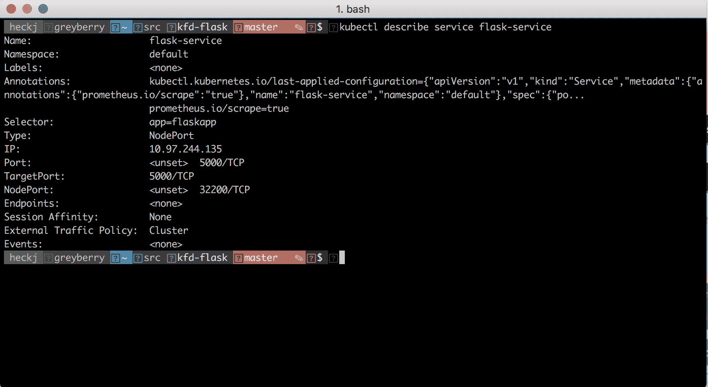
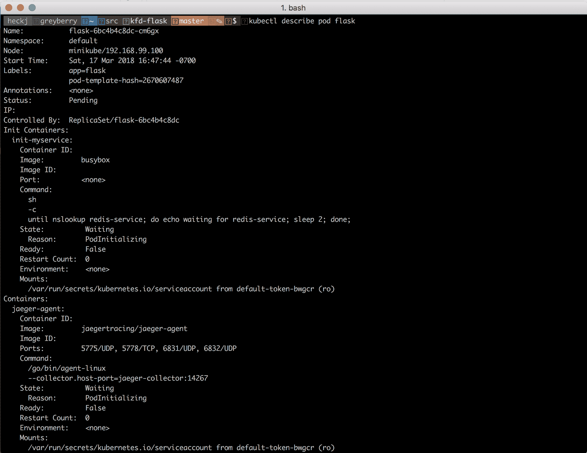
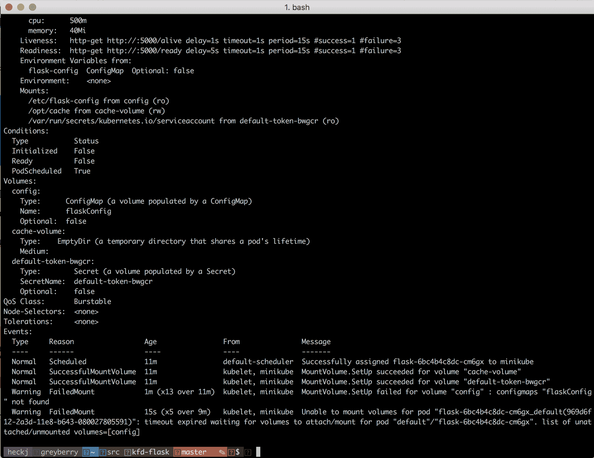
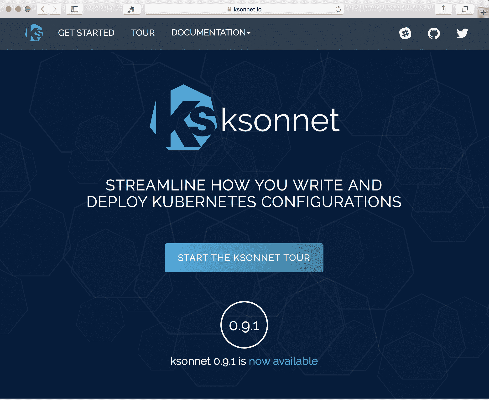
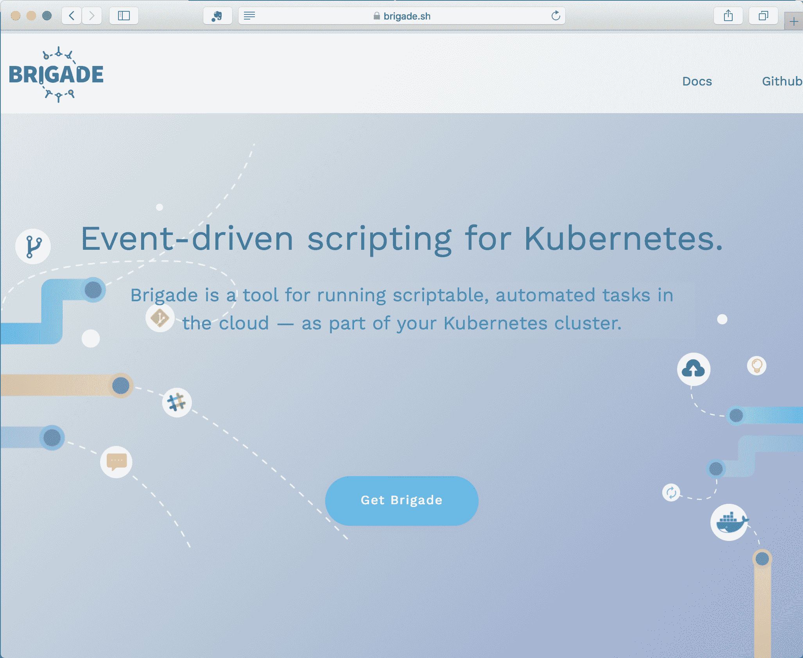

# 十、常见问题的故障排除和后续步骤

前面几章已经探讨了如何在开发过程中使用 Kubernetes。在本章中，我们通过查看您可能会遇到的一些常见错误来总结这些示例。我们关注如何理解它们，诊断问题的技术以及如何解决它们。本章还回顾了一些正在形成的新兴项目，以帮助开发人员使用 Kubernetes。

本章的主题包括:

*   常见错误及其解决方法
*   开发者的新兴项目
*   与 Kubernetes 项目互动

# 常见错误及其解决方法

在整本书中，我们提供了一些例子来说明如何使用 Kubernetes。在开发这些示例的过程中，我们遇到了您可能会遇到的所有相同问题，其中一些令人困惑，并且不总是清楚如何确定问题是什么以及如何解决问题以使系统正常工作。本节将详细介绍您可能会看到的一些错误，讨论如何诊断它们，并提供一些技巧来帮助您了解自己是否也遇到了同样的问题。

# 验证数据时出错

当您为 Kubernetes 编写自己的清单并直接使用它们时，很容易犯一些简单的错误，导致错误消息:`error validating ...`。

幸运的是，这些非常容易理解，尽管非常不方便。为了说明这个例子，我创建了一个稍微有点混乱的部署清单:


使用该清单运行`kubectl apply`时，您将收到一个错误:

```
error: error validating "test.yml": error validating data: [ValidationError(Deployment.spec.template.spec.containers[0]): unknown field "named" in io.k8s.api.core.v1.Container, ValidationError(Deployment.spec.template.spec.containers[0]): missing required field "name" in io.k8s.api.core.v1.Container]; if you choose to ignore these errors, turn validation off with --validate=false
```

在这种情况下，我犯了一个微妙的错别字，错误命名了一个必填字段`name`，该字段由错误中的消息`missing required field`突出显示。

如果您包含一个系统确实知道的额外字段，您也会收到一个错误，但略有不同:

```
error: error validating "test.yml": error validating data: ValidationError(Deployment.spec.template.spec.containers[0]): unknown field "color" in io.k8s.api.core.v1.Container; if you choose to ignore these errors, turn validation off with --validate=false
```

在这种情况下，理解消息的关键是`unknown field`部分。这些消息还引用了一条通过数据结构的路径，该路径正好指向错误发生的位置。在前面的例子中，这是`Deployment`(在`kind`键中定义的对象)并且在其中`spec`->`template`->`spec`->`container`。该错误消息还确切定义了 Kubernetes API 试图验证的对象:`io.k8s.api.core.v1.Container`。如果您对它需要什么感到困惑，您可以使用这些信息在 Kubernetes 网站上查找文档。这些对象是版本化的(注意对象名称中的`v1`)，在这种情况下，您可以在 Kubernetes 的参考文档中找到完整的定义。

参考文档是根据 Kubernetes 版本发布的，对于 1.9 版本，该文档位于[https://Kubernetes . io/docs/reference/generated/Kubernetes-API/v 1.9/](https://kubernetes.io/docs/reference/generated/kubernetes-api/v1.9/)。文档包括一些示例细节以及三列视图中的定义:


# 浏览文档

文档遵循我们从 Kubernetes 对象本身看到的相同模式:它们由更小的原语组成。当您浏览文档时，例如查看屏幕截图中显示的部署，您通常会看到对封装的对象的引用，为了深入了解细节，您可能需要引用其中的一些对象区域。例如，部署示例封装了 Pod，因此为了正确定义模板中的所有属性，您可能需要参考 Pod v1 核心文档。

# ErrImagePull

ErrImagePull 很可能是最常见的，幸运的是调试和诊断非常简单。出现这种情况时，您将看到`ErrImagePull`作为状态消息，表明 Kubernetes 无法检索您在清单中指定的映像。最常见的是简单地请求 pod 状态:

```
kubectl get pods

NAME                  READY STATUS       RESTARTS AGE
flask-659c86495-vlplb 0/1   ErrImagePull 0        4s
```

使用`kubectl describe`命令，您可以立即获得有关为什么会出现此错误的更多详细信息。这并不完全是一个错误情况，因为 Kubernetes 在技术上处于等待状态，希望映像可用。

在本例中，我们通过以下命令获得更多详细信息:

```
kubectl describe pod flask-659c86495-vlplb
```

这提供了如下信息:

```
Name: flask-659c86495-vlplb
Namespace: default
Node: minikube/192.168.99.100
Start Time: Sat, 17 Mar 2018 14:56:09 -0700
Labels: app=flask
 pod-template-hash=215742051
Annotations: <none>
Status: Pending
IP: 172.17.0.4
Controlled By: ReplicaSet/flask-659c86495
Containers:
 flask:
 Container ID:
 Image: quay.io/kubernetes-for-developers/flask:0.2.1
 Image ID:
 Port: 5000/TCP
 State: Waiting
   Reason: ImagePullBackOff
 Ready: False
 Restart Count: 0
 Environment: <none>
 Mounts:
 /var/run/secrets/kubernetes.io/serviceaccount from default-token-bwgcr (ro)
Conditions:
 Type Status
 Initialized True
 Ready False
 PodScheduled True
Volumes:
 default-token-bwgcr:
 Type: Secret (a volume populated by a Secret)
 SecretName: default-token-bwgcr
 Optional: false
QoS Class: BestEffort
Node-Selectors: <none>
Tolerations: <none>
```

从这个细节中可以看到容器处于等待状态，通常是与 pod 相关的事件提供了最有用的信息。信息非常密集，因此调用此命令时通常有一个更宽的终端窗口，这使得解析更加容易:


您可以看到 Kubernetes 采取的流程步骤:

1.  Kubernetes安排了豆荚
2.  计划 pod 的节点尝试检索请求的映像
3.  它报告了一个未找到映像的警告，将状态设置为`ErrImagePull`，并开始用后退重试

首先要做的是验证您请求的映像确实是您想要请求的映像。在这种情况下，我故意打了一个错别字来请求一个不存在的映像。

另一个常见的问题可能是，映像确实存在，但由于某种原因不允许拉出。例如，当您第一次创建一个容器并将其推送到`quay.io`时，它会保持该容器构建的私有性，直到您显式地访问该网站并将其公开。

如果您从私有存储库提取，但使用的凭据无效(或在更新过程中变得无效)，也会出现同样的错误消息。

验证访问权限(至少是对公共映像的访问权限)的最佳调试技术之一是尝试自己检索映像。如果您在本地安装了 Docker，这就像调用 Docker `pull`命令一样简单。在这种情况下，我们可以验证映像:

```
docker pull quay.io/kubernetes-for-developers/flask:0.2.1
```

错误响应相当直接地来自 Docker 命令行:

```
Error response from daemon: manifest for quay.io/kubernetes-for-developers/flask:0.2.1 not found
```

# CrashLoopBackOff

您可能会发现您的 pod 报告状态为`CrashLoopBackOff`，这是另一个难以置信的常见错误状态。

这是一种只有在调用容器后才会发生的错误情况，因此它可能会延迟出现。您通常会在调用`kubectl get pods`时看到它:

```
NAME                          READY STATUS           RESTARTS AGE
flask-6587cb9b66-zzw8v        1/2   CrashLoopBackOff 2        1m
redis-master-75c798658b-4x9h5 1/1   Running          0        1m
```

这明确意味着容器中的一个容器意外退出，并且可能带有非零错误代码。了解发生了什么的第一步是使用`kubectl describe`命令获取更多细节。在这种情况下:

```
kubectl describe pod flask-6587cb9b66-zzw8v
```

浏览结果内容，查看容器内每个容器的状态:


在上例中，您可以看到耶格收集器容器处于`Running`状态，`Ready`正在报告`True`。但是烧瓶容器处于`Terminated`状态，原因只有`Error`，出口代码为`2`。

通常至少提供一些关于容器退出原因的信息的步骤是利用`kubectl logs`命令，查看我们在`STDOUT`和`STDERR`中报告的内容。

如果调用`kubectl logs`和 pod 名称，您可能还会看到以下错误:

```
kubectl logs flask-6587cb9b66-zzw8v

Error from server (BadRequest): a container name must be specified for pod flask-6587cb9b66-zzw8v, choose one of: [jaeger-agent flask] or one of the init containers: [init-myservice]
```

这只是要求您在识别容器时更加具体。在这个例子中，我们使用了一个 pod，它有一个 init 容器和两个容器:main 和 Jaeger 收集器侧车。只需将容器附加到命令的末尾，或者使用带有容器名称的`-c`选项，就可以完成您想要的操作:

```
kubectl logs flask-6587cb9b66-zzw8v -c flask

python3: can't open file '/opt/exampleapp/exampleapp': [Errno 2] No such file or directory
```

返回什么以及它有多有用，将取决于您如何创建容器以及 Kubernetes 集群正在使用什么容器运行时。

As a reminder, `kubectl logs` also has the `-p` flag, which is exceptionally useful in retrieving the logs from the previous run of the container. 

如果出于某种原因，您不完全确定容器中设置了什么，我们可以使用一些 Docker 命令来检索并直接在本地检查容器映像，这通常可以揭示问题所在。

提醒一下，拉一下图片:

```
docker pull quay.io/kubernetes-for-developers/flask:latest
```

然后，检查它:

```
docker inspect quay.io/kubernetes-for-developers/flask:latest
```

向下滚动到内容，您可以看到容器将尝试运行什么以及它是如何设置的:


在这个特殊的例子中，我故意在被调用的 Python 文件名中引入了一个错别字，去掉了`.py`扩展名。当您查看该输出时，这可能并不明显，但请具体查找`EntryPoint`和`Cmd`，并尝试验证这些是期望值。在这种情况下，入口点是`python3`，命令是用它调用的:`/opt/exampleapp/exampleapp`。

# 启动并检查映像

由于在没有实际检查映像的情况下，这可能是不清楚的，所以诊断这种情况的常见方法是使用替代命令(如`/bin/sh`)运行映像，并使用交互式会话四处查看并进行验证和调试。如果您安装了 Docker，则可以在本地执行此操作；执行此操作时，请确保您显式覆盖了`entrypoint`和命令，以交互方式运行命令:

```
docker run -it --entrypoint=/bin/sh \
quay.io/kubernetes-for-developers/flask:latest -i
```

然后，您可以手动调用容器应该运行的内容`python3 /opt/exampleapp/exampleapp`，并在那里进行任何额外的调试。

如果本地没有安装 Docker，您可以在 Kubernetes 集群中做同样的事情。如果POD已经存在，您可以像我们之前所做的那样使用`kubectl exec`，但是当容器崩溃时，这通常是不可用的，因为容器还没有运行来使用。

在这些情况下，用`kubectl run`创建一个全新的、短暂的部署是一个很好的继续方式:

```
kubectl run -i --tty interactive-pod \
--image=quay.io/kubernetes-for-developers/flask:latest \
--restart=Never --command=true /bin/sh
```

如果您想要覆盖容器的入口点(否则将被设置为`python3`，您将需要注意在您的选项中有`--command=true`。如果没有这个选项，`kubectl run`命令将假定您正在尝试传递不同的参数来与默认入口点一起使用。

您可能还会发现，当您尝试调用这样的命令时，会收到以下消息:

```
Error from server (AlreadyExists): pods "interactive-pod" already exists
```

当您像这样创建一个裸部署时，容器退出(或出错)后 pod 不会被删除。使用`-a`选项调用`kubectl get pods`应该会显示存在的豆荚:

```
kubectl get pods -a

NAME                          READY STATUS           RESTARTS AGE
flask-6587cb9b66-zzw8v        1/2   CrashLoopBackOff 14       49m
interactive-pod               0/1   Completed        0        5m
redis-master-75c798658b-4x9h5 1/1   Running          0        49m
```

您可以删除它，以便再次尝试运行它:

```
kubectl delete pod interactive-test
```

# 向容器中添加您自己的设置

当您使用包含您没有创建的代码和系统的容器时，您可能会发现自己想要在容器中的任何进程运行之前设置一些环境变量或建立一些配置文件。当使用其他预构建的开源软件时，这是非常常见的，尤其是那些还没有一个你可以利用的完善的容器的软件。

处理这种情况的一种常见技术是向容器中添加一个 shell 脚本，然后设置入口点和参数来运行该脚本。如果这样做，请确保包含调用脚本的适当选项。

一个常见的例子是用`/bin/bash -c /some/script`调用脚本。很容易错过`-c`参数，这会导致非常混乱的错误信息:

```
/bin/sh: can't open '/some/script'
```

当引用的脚本没有设置为可执行，并且您没有包含`-c`选项来让 shell 尝试读取和解释您指定的文件时，就会出现这种情况。

# 没有可用于服务的端点

需要追查的最微妙的问题之一是，为什么我的服务没有按照我的预期运行？在这些情况下，常见的错误是以下消息:

```
no endpoints available for service
```

如果您一起创建了一个部署和一个服务，并且一切似乎都在运行，但是当您访问服务端点时，您会看到以下输出:

```
{
  "kind": "Status",
  "apiVersion": "v1",
  "metadata": {

  },
  "status": "Failure",
  "message": "no endpoints available for service \"flask-service\"",
  "reason": "ServiceUnavailable",
  "code": 503
}
```

在这种情况下，我在使用`kubectl proxy`通过代理访问服务端点`flask-service`时收到了这条消息，使用的网址是:

```
http://localhost:8001/api/v1/proxy/namespaces/default/services/flask-service
```

在这些情况下，使用命令`kubectl describe`获取服务如何设置的详细信息:

```
kubectl describe service flask-service
```



密切注意为服务设置的选择器，然后将其与您认为应该匹配的部署进行比较。在这种情况下，选择器是`app=flaskapp`，查看我们部署的细节:

```
kubectl describe deploy flask
```


您应该立即验证的是容器是否正在运行和操作，在本例中就是这样。接下来要做的是查看部署上的标签，在这种情况下，您会看到它们被设置为`app=flask`，而不是`app=flaskapp`，这就是为什么该服务没有响应。

另一种查看 pods 支持服务的方式是使用通过`kubectl get`命令选择的标签专门请求 pods。例如，我们可以使用以下命令:

```
kubectl get pods -l app=flaskapp -o wide
```

因为我们没有设置任何带有相关标签的豆荚，所以我们会收到以下回复:

```
No resources found.
```

标签和选择器是 Kubernetes 中许多元素松散耦合在一起的方式。由于松散耦合，Kubernetes 无法验证您是否正确设置了将 pods 绑定到服务的正确值。不确定标签和选择器是否正确是一个容易犯的错误，除了不像你预期的那样响应之外，不会显示为错误。

# 陷入 PoD 初始化

您可能会看到这样一种情况，在初始化时，您的 pod 似乎处于挂起状态，尤其是当您第一次设置涉及卷装载和配置映射的配置时。

`kubectl get pods`的状态会是这样的:

```
NAME                          READY STATUS   RESTARTS AGE
flask-6bc4b4c8dc-cm6gx        0/2   Init:0/1 0        7m
redis-master-75c798658b-p4t7c 1/1   Running  0        7m
```

地位不会改变。尝试获取正在发生的事情的日志，例如:

```
kubectl logs flask-6bc4b4c8dc-cm6gx init-myservice
```

此消息的结果:

```
Error from server (BadRequest): container "init-myservice" in pod "flask-6bc4b4c8dc-cm6gx" is waiting to start: PodInitializing
```

这里最好的方法是使用`kubectl describe`获取POD上设置的内容和最近事件的详细信息:

```
kubectl describe pod flask
```

这里你会看到输出显示容器都处于`Waiting`状态，原因为`PodInitializing`:



真正显示发生了什么的事件可能需要几分钟才能出现，但几分钟后它们应该会出现:



您看到警告`FailedMount`，以及相关信息:

```
MountVolume.SetUp failed for volume "config" : configmaps "flaskConfig" not found
```

这需要一些时间才能出现，因为 Kubernetes 在尝试装载卷时提供了一些更长的超时时间，以及重试时间。在这种情况下，错误是 pod 规范中的输入错误，引用了不存在的配置映射:`flaskConfig`。

# 缺少资源

在许多方面，我们刚刚描述的这个问题非常类似于标签和选择器的错误，但是表现出完全不同。底层系统尽最大努力寻找卷、配置映射、机密等，并允许您以任何顺序创建它们。如果您输入了错误，或者配置映射、机密或卷没有被正确引用或丢失，那么 pod 最终将失败。

这些资源都是动态引用的。在进行这种引用时，Kubernetes 提供了重试和超时，但是在实际寻找相关资源并最终失败之前，不能显式地验证失败。这可能会使调试这些问题更加耗时。当您第一次寻找问题失败的原因时，并非所有信息都是可见的(失败的卷装载、丢失的配置映射或机密等)。最好的选择是从`kubectl describe`命令开始关注事件，并在事件中明确寻找警告，这些问题最终会出现在这些事件中。

一些开发团队正在通过生成清单来解决这个 C *类 A* 的问题，使用他们已经验证过的程序来创建适当的链接，并确保它们是正确的。

# 开发者的新兴项目

寻找替代方法来帮助使用 Kubernetes 的开发过程开始暴露大量开发中的项目。在写这本书的时候，Kubernetes 从 1.7 版本推进到了 Kubernetes v1.10 的测试版，与此同时，大量的项目已经开始围绕 Kubernetes 建立自己，致力于帮助在开发工作流中积极使用 Kubernetes 来抚平一些粗糙的边缘。

# 棉短绒

在前一节中，我们讨论了无法由 Kubernetes 预先验证但我们可以自己寻找的缺失组件。与验证相关的三个项目是 kubeval、kube-lint 和 kubetest，如下所述:

*   kubi eval:t0]https://github . com/garthr/kubi eval

kubeval 由 Gareth Rushgrove 创建，用于在尝试应用清单和配置文件之前验证它们。当您从自己的代码或使用另一个项目创建清单时，这个工具可以非常方便地对您的工作进行双重检查。它不能检查所有的东西，但它是一个很好的首次通过检查。

*   kube-lint:https://github . com/vigilance/kube-lint

由维克·伊格莱西亚斯创建的 kube-lint 与其说是一个成长中的项目，不如说是一个早期的实验或功能原型。它旨在根据一组通用规则验证一组 Kubernetes 清单。维克广泛参与的赫尔姆项目形成了许多最佳实践和通用模式，Kubernetes项目内部正在进行对话，讨论通过`lint`命令帮助进行更多验证的可能方法。

*   kube test:https://github . com/garthr/kube test

同样是由 Gareth Rushgrove 创建的，kubetest 是为了在 Kubernetes 配置文件中运行一系列测试而构建的。它不是显式封装最佳实践和规则，而是以单元测试的形式编写，允许针对文件集的断言，并允许您指定自己的约束。

# 舵

我们在前面的章节中提到并使用了 Helm，使用它在 Kubernetes 中安装软件，这样我们就可以利用它。可在 [https://helm.sh](https://helm.sh) 获得，helm 在版本 2 已经稳定了相当长的一段时间，被多个开发团队积极使用。代表收集的最佳实践的图表可在[https://github.com/kubernetes/charts](https://github.com/kubernetes/charts)获得，并随着它们封装的软件和Kubernetes的进步而更新:


Helm 版本 3 是 Helm 向前迈出的下一大步，打破了他们在版本 2 中一直保持的一些向后兼容性保证。随着过渡，项目团队已经非常清楚，将有一个明确的迁移路径，当前的图表和示例都将是有用的，并且随着项目的发展而更新。Helm v3 愿景的细节仍在形成中，这个项目无疑将是更大的 Kubernetes 生态系统中的关键项目。

在版本 2 中，它将自己设置为 Kubernetes 的包管理器，主要关注如何以一致的方式(和示例)将多组 pods、部署、服务、配置映射等打包在一起，并在 Kubernetes 中作为一个整体进行部署。许多团队创建了自己的图表，并将 Helm 集成到他们的持续集成管道中，在底层软件更新时使用 Helm 呈现清单，并作为该过程的一部分进行部署。

Helm 的缺点之一可能是为自己的软件创建模板相当复杂。Helm 使用的模板系统叫做 sprig，可能很多开发团队都不熟悉。《Helm》的下一个主要修订版(被定义为本书即将出版)希望解决广泛的挑战，包括让开发人员更容易编写和发布图表。这个项目确实值得关注。

# 十四行诗

ksonnet([https://ksonnet . io](https://ksonnet.io))也是前面提到的另一种为 Kubernetes 模板化和呈现清单的方法。ksonnet 以不同的方式对待 Helm 的任务，专注于模板化清单的方法，并使这些模板非常容易编写:



ksonnet 使用用户的凭据，不尝试管理它呈现的发布状态，而是专注于模板。它建立在一个名为 Jsonnet 的库之上，该库为 JSON 模板添加了一些编程方面。

ksonnet 是一个相当新的项目，并且开始看到其他项目采用它的一些吸引力。他们表示，他们也在积极与 Helm 社区合作，并希望将 ksonnet 作为创建图表的替代方式。

# 旅

旅级，可在[https://旅级. sh](https://brigade.sh) 获得，采取稍微不同的策略来解决部署到 Kubernetes 的问题。与其关注模板和哪种 DSL 可以用于以编程方式生成 Kubernetes 清单，不如更倾向于将脚本和编程与 Kubernetes 及其事件一起作为一流公民:



来自 Azure 的微软团队构建了旅来扩展 JavaScript，将 Kubernetes 对象和事件公开为要组合到工作流和管道中的元素。如果您的开发团队熟悉 JavaScript，那么旅可能是一种特别吸引人的与 Kubernetes 协调和交互的方式。

# 脚手架

Skaffold is available at [https://github.com/GoogleCloudPlatform/skaffold](https://github.com/GoogleCloudPlatform/skaffold) and is developed by a team from Google:


它是这些以开发人员为中心的项目中最新的一个，并且特别关注作为一个命令行工具来支持从代码签入到源代码控制的过程，通过构建容器到更新和部署 Kubernetes 清单。它还被设置为更大的工具链中的一个组件，并与其他项目挂钩，最著名的是 Helm，用于它所做工作的部署部分。

# img

将工具和项目视为组件时，img 项目确实值得注意，该项目托管在[genuinetools.org](https://genuinetools.org)下，可在位于[https://github.com/genuinetools/img](https://github.com/genuinetools/img)的 GitHub 上获得。本书中的示例都使用了 Docker 来构建容器映像，而 img 构建在 Docker 团队从他们的产品发展而来的支持创建容器的底层工具包之上。最重要的是，img 项目允许创建 Docker 映像，而无需 Daemon 或以很高的权限运行。这使得创建容器更适合在 Kubernetes 集群中构建，或者更一般地说，无需向进程授予托管它的系统的广泛权限。

genuinetools 项目托管了许多其他有用的组件，其中大多数专注于替代的容器运行时。

# 起草

微软团队的另一个工具 Draft 可以在 [https://draft.sh](https://draft.sh) 上找到，它是一个致力于优化从源代码管理变更到在 Kubernetes 中部署以及看到这些变更的时间的工具:


Draft 专注于简单的命令和本地配置文件，为您的应用创建一个本地 Helm 图表，并简化让它在 Kubernetes 集群上运行，封装构建容器的重复过程，将其推送到容器注册表，然后部署更新的清单进行升级。

像其他一些工具一样，Draft 构建并使用 Helm。

# ksync

ksync 在[https://vapor-ware.github.io/ksync/](https://vapor-ware.github.io/ksync/)上市，对于开发工具采取了非常不同的策略。它没有优化构建和部署到 Kubernetes 集群中的时间，而是将重点放在扩展代理功能，以扩展到集群中，并在特定的容器中操作代码:


用 Docker 开发的一个常见模式是挂载一个包含解释代码的本地目录(比如本书中的 Python 和 JavaScript 示例)，并让容器运行该代码，这样您就可以动态编辑它，并快速重启和重试。ksync 通过在您的本地开发机器上和集群内运行来模仿这种能力，在本地观察变化并将其反映到 Kubernetes 中。

ksync 专注于单个 pod 内的软件开发过程。因此，虽然它无助于部署所有支持应用，但它可能会使 Kubernetes 中的单个组件的开发过程更快。

# 远程呈现

远程呈现可在[https://www . telesence . io](https://www.telepresence.io)上获得，是另一个专注于为开发人员提供从他们的本地机器到 Kubernetes 集群的更紧密访问的项目:


远程呈现由 Datawire 创建，它为开发人员与 Kubernetes 一起工作提供了额外的项目，它创建了一个双向代理，将 Kubernetes 中 pod 内的进程的连接和响应转发到本地开发机器上运行的进程。

在 ksync 复制您的代码并在 Kubernetes 中运行的地方，远程呈现允许您在自己的机器上运行代码，透明地连接它，就像它是在 Kubernetes 中运行的 pod 一样。

# 与 Kubernetes 项目互动

在讨论所有这些项目时，您可以获得最多关于如何使用 Kubernetes 的信息的是 Kubernetes 本身。该项目在 https://kubernetes.io/主办了一个网站，包括正式文档、博客、社区日历、教程等:


这个网站是获取更多信息的一个很好的起点，但肯定不是唯一可用的资源。

Kubernetes 项目真的非常大，大到任何一个人都几乎不可能跟踪项目中正在进行的所有努力、进化、项目和兴趣。为了提供指导，Kubernetes 项目成立了许多小组，以特殊兴趣小组的形式关注这些兴趣。这些小组是 Kubernetes 的半正式子项目，每个小组都专注于 Kubernetes 的某些特定子集。毫不奇怪，许多这样的信号在细节上是重叠的，并且在Kubernetes人中发现一个贡献者同时活跃在许多信号中并不罕见。

SIGs 的完整列表可在线获取，并保存在[https://github . com/kubernetes/community/blob/master/SIG-list . MD](https://github.com/kubernetes/community/blob/master/sig-list.md)。每个 SIG 都有特定的人被称为领导者，主持定期会议，他们中的许多人保持在线笔记，甚至他们在线会议的录音。这些 SIG 都松散地协调推进 Kubernetes，并依次由 Kubernetes 指导委员会和一些社区经理协调。

也有一些不太正式的工作组突然出现，专注于特定的或短暂的兴趣，没有任何特定的领导或出席。总之，SIGs 和工作组可以创建大量可供浏览的信息和深度，以及一个非常开放的关于项目的人员交流社区。

该社区还管理 SIG 会议和活动日历，可在[https://kubernetes.io/community/](https://kubernetes.io/community/)获得，并定期在[的 Kubernetes 博客上发布。](http://blog.kubernetes.io)

# 松弛的

Kubernetes 贡献者合作的一种常见的互动方式是在 Slack 使用在线聊天渠道。Kubernetes 在 Kubernetes 内部拥有大量致力于 SIGs、工作组和项目的互动渠道。任何人都可以加入，您可以在 [http://slack.k8s.io](http://slack.k8s.io) 注册访问。

如果你是 Slack 或 Kubernetes 的新手，那么频道`#kubernetes-users`和`#kubernetes-novices`可能会特别感兴趣。整个社区团队还主持他们称之为“办公时间”的节目，这是一个在 YouTube 和 Slack 频道`#office-hours`上进行的直播。

# 油管（国外视频网站）

如果你更喜欢视频流，Kubernetes 社区提供了一个 YouTube 频道，可在[https://www.youtube.com/c/KubernetesCommunity/](https://www.youtube.com/c/KubernetesCommunity/)获得。这些包括来自社区会议的录制视频，以及来自 Kubernetes 常规会议的会议。大量的 SIG 也记录他们的定期会议，并在 YouTube 上发布这些会议，尽管它们并没有通过这个渠道得到一致的协调。如果你想找到相关的内容，最好通过每个单独的 SIG 进行追踪，尽管你可以在[频道的播放列表中找到你想要的内容:](https://www.youtube.com/channel/UCZ2bu0qutTOM0tHYa_jkIwg/playlists)


# 堆栈溢出

Kubernetes 社区的成员也观看并提供堆栈溢出问题的答案。前面提到的办公时间鼓励人们在 Stack Overflow 上发布他们的问题，并将这些问题带到办公时间以获得交互式帮助。你可以在[https://stackoverflow.com/questions/tagged/kubernetes](https://stackoverflow.com/questions/tagged/kubernetes)找到与 Kubernetes 相关的问题。如果你在谷歌上搜索与 Kubernetes 相关的话题，你也可以在 Stack Overflow 上找到已经提出和回答的问题的结果。

# 邮件列表和论坛

Kubernetes 有一个通用的邮件列表/论坛，以及每个 SIG 和每个工作组的邮件列表。常见论坛包括:

*   [https://groups.google.com/forum/#!forum/kubernetes-users](https://groups.google.com/forum/#!forum/kubernetes-users)
*   [https://groups.google.com/forum/#!forum/kubernetes-dev](https://groups.google.com/forum/#!forum/kubernetes-dev)

位于[https://github . com/kubernetes/community/blob/master/sig-list . MD](https://github.com/kubernetes/community/blob/master/sig-list.md)的 SIG 列表还包括每个 SIG 的个人邮件列表参考。

Kubernetes 上的信息没有一条路，社区非常努力地适应多种获取信息、提问和鼓励参与的方式。

# 摘要

在这一章中，我们谈到了在开发和部署到 Kubernetes 时可能会遇到的一些问题，然后谈到了一些可能有助于您或您的团队在利用 Kubernetes 的同时加快开发过程的项目。本章的最后一部分讨论了 Kubernetes 项目本身，您可以如何与它进行交互，以及在哪里可以找到更多信息来利用这套令人惊叹的工具。