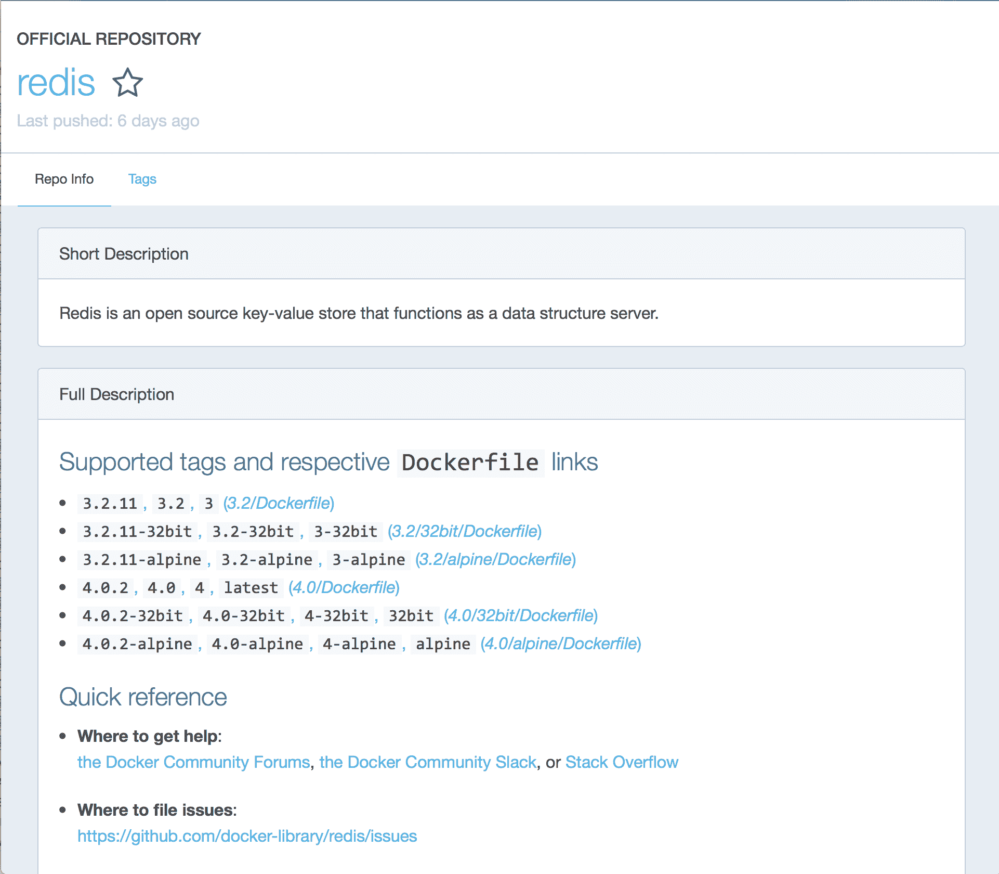

# 在 Kubernetes 中与您的代码交互

在上一章中，我们介绍了制作容器镜像，并使用 Python 和 Node.js 创建了简单的示例。在本章中，我们将扩展与正在运行的代码交互的简要介绍，并深入了解如何查看代码的运行情况，运行其他命令，并从这些 Pod 中进行调试的更多细节。

本章的各节包括：

+   编写软件以在 Pod 中运行的实用注释

+   从您的容器和 Pod 中获取日志

+   与正在运行的 Pod 交互

+   Kubernetes 概念—标签和选择器

+   Kubernetes 资源—服务

+   从您的 Pod 中发现服务

# 编写软件以在容器中运行的实用注释

要在开发过程中使用 Kubernetes，其中一个基本要求是在容器中运行代码。正如您所见，这为您的开发过程增加了一些步骤。它还在如何构造代码和与之交互方面增加了一些约束，主要是为了让您能够利用这些约束，让 Kubernetes 来运行进程、连接它们，并协调任何输出。这与许多开发人员习惯的在本地开发机器上运行一个或多个进程，甚至需要额外服务来运行应用程序（如数据库或缓存）的习惯非常不同。

本节提供了一些有关如何更有效地使用容器的提示和建议。

# 获取可执行代码的选项

除了在创建容器时定义的`ENTRYPOINT`和`CMD`之外，容器镜像还可以通过`ENV`命令定义环境变量。`ENTRYPOINT`、`CMD`和环境变量可以在执行时或在定义部署时被覆盖或更新。因此，环境变量成为向容器传递配置的最常见方式之一。

编写软件以利用这些环境变量将是重要的。在创建软件时，请确保您可以利用环境变量以及代码中的命令行参数。大多数语言都有一个库，可以支持选项作为命令行参数或环境变量。

在下一章中，我们将看到如何设置配置并在部署时将其传递给您的容器。

# 构建容器镜像的实用注释

以下是维护容器镜像的建议和实用建议：

+   在源代码存储库中保留一个 Dockerfile。如果您的应用程序源代码本身位于 Git 存储库中，那么在存储库中包含一个 Dockerfile 是非常合理的。您可以引用要从相对目录复制或添加的文件，该目录是您的源代码所在的位置。在存储库的根目录中看到 Dockerfile 是很常见的，或者如果您正在从一个包含许多项目的 monorepo 中工作，可以考虑在与项目源代码相同的目录中创建一个 Docker 目录：

+   如果您想利用 Docker Hub、Quay 或其他容器存储库上的自动 Docker 构建，自动化系统期望 Dockerfile 位于 Git 存储库的根目录中。

+   保持一个单独的脚本（如果需要）用于创建容器镜像。更具体地说，不要将创建容器镜像的过程与代码生成、编译、测试或验证混在一起。这将清晰地区分出您可能需要的开发任务，具体取决于您的语言和框架。这将允许您在自动化流水线中在需要时包含它。

+   在基础镜像中添加额外工具可能非常诱人，以便进行调试、支持新的或额外的诊断工作等。明确和有意识地选择要在镜像中包含的额外工具。我建议最小化额外工具的使用，不仅因为它们会使镜像变得更大，而且通常那些在调试中非常有效的工具也会给黑客提供更容易利用的选项：

+   如果您发现必须在镜像中添加调试工具，请考虑在子目录中创建第二个 Dockerfile，该文件添加到第一个文件中，并且只包含您想要添加的调试工具。如果这样做，我建议您在镜像的名称中添加一个`-debug`以明确表明该镜像已安装额外的工具。

+   构建容器镜像时，要考虑其生产使用，并将其作为默认设置。对于容器来说，这通常表示容器中提供的环境变量的默认值。一般来说，尽量不要在容器镜像中包含单元测试、开发任务等所需的依赖项：

+   在 Node.js 的情况下，使用环境变量`ENV=PROD`，这样`npm`就不会包含开发依赖项，或者使用命令行`npm install —production`明确地将它们剥离。

+   在创建容器后，将整个容器视为只读文件系统。如果您想要有某个地方来写入本地文件，请明确标识该位置并在容器中设置一个卷。

# 发送程序输出

`kubectl logs`（以及 Docker 的等效命令：`docker logs`）默认将`stdout`和`stderr`组合在一起，并将任何显示为日志的内容传递给容器。您可能也有过在代码中创建特定的日志记录功能，将日志写入磁盘上的文件位置的经验。一般来说，将日志写入文件系统位置不鼓励在容器内运行的软件中，因为要将其包含在一般日志记录中意味着必须再次读取它，这会不必要地增加磁盘 I/O。

如果您希望在应用程序中支持聚合日志记录的方法，那么通常希望在容器和/或 Pod 之外定义一些内容来帮助捕获、传输和处理这些日志。

一般来说，如果您编写程序将日志记录到`stdout`和`stderr`，那么运行这些容器的容器和 Kubernetes 通常会帮助您更轻松地访问这些细节。

# 日志

获取有关代码运行情况的最常见方法通常是通过日志。每种语言和开发环境都有自己的模式来公开这些细节，但基本上，它可以简单地通过打印语句发送一行文本到`stdout`，这对于快速和简单的调试无疑是最一致的方法。当您在 Kubernetes 中部署和运行代码时，它可以访问来自每个 Pod 和容器的日志，其中日志在这种情况下是将数据发送到`stdout`和`stderr`。

如果您现有的开发模式将输出写入特定的文件位置，也许您的框架包括在文件增长时旋转这些日志文件的功能，您可能希望考虑只是将数据发送到`stdout`和/或`stderr`，以便 Kubernetes 可以使这种协调工作。

# 具有多个容器的 Pod

到目前为止，我们的示例都很简单，一个 Pod 中只有一个容器。一个 Pod 可以同时拥有多个容器，获取日志的命令可以指定使用哪个容器。如果只有一个容器，就不需要指定要使用哪个容器。

如果需要指定特定的容器，可以使用`-c`选项，或者将其添加到`logs`命令中。例如，如果有一个名为`webapp`的 Pod，其中包含两个容器`flask`和`background`，你想要查看`background`容器的日志，可以使用`kubectl logs webapp background`或`kubectl logs webapp -c background`命令。

同样，定义部署中的 Pod 和容器也有一个快捷方式。与其通过 Kubernetes 分配的名称来指定完整的 Pod 名称，你可以只用部署名称作为 Pod 名称的前缀。例如，如果我们之前使用`kubectl run flask image=…`命令创建了一个部署，我们可以使用以下命令：

```
kubectl logs deployment/flask
```

这样就不需要查找特定的 Pod 名称，然后根据该名称请求日志了。

# 流式传输日志

通常希望能够连续查看容器的日志，随着容器提供信息而更新。你可以使用`-f`选项来实现这一点。例如，要查看与`flask`部署相关的 Pod 的更新日志，可以运行以下命令：

```
kubectl logs deployment/flask -f
```

当你与该服务交互，或者该服务写入`stdout`并进行正常日志记录时，你会看到输出流到你的控制台。

# 之前的日志

日志通常是特定于活动容器的。然而，通常需要查看如果容器失败时日志中可能包含的内容，或者如果你部署更新后出现了意外情况。Kubernetes 会保留对任何 Pod 的先前容器的引用（如果存在），这样你在需要时就可以获取这些信息。只要日志对 Kubernetes 可用，你可以使用`-p`选项来实现这一点。

# 时间戳

日志输出也可以包含时间戳，尽管默认情况下不会。你可以通过添加`--timestamps`选项来获取带有时间戳前缀的日志消息。例如：

```
kubectl logs deployment/flask --timestamps
```

然后你可能会看到以下内容：

```
2017-09-16T03:54:20.851827407Z  * Running on http://0.0.0.0:5000/ (Press CTRL+C to quit)
2017-09-16T03:54:20.852424207Z  * Restarting with stat
2017-09-16T03:54:21.163624707Z  * Debugger is active!
2017-09-16T03:54:21.165358607Z  * Debugger PIN: 996-805-904
```

值得注意的是，时间戳来自运行容器的主机，而不是您的本地机器，因此这些日志中的时区通常不是您所在的时区。所有时间戳都包括完整的时区细节（通常设置为 UTC-0 时区），因此值可以很容易地转换。

# 更多的调试技术

有几种调试技术可以处理部署到现有集群中的代码。这些包括：

+   容器镜像的交互式部署

+   附加到运行中的 Pod

+   在现有 Pod 中运行第二个命令

# 镜像的交互式部署

您还可以使用 `kubectl run` 命令启动与 Pod 的交互会话。这对于登录并查看容器镜像中可用的内容，或者在您复制到容器镜像中的软件的上下文中非常有用。

例如，如果您想运行一个 shell 来查看我用于 Python 示例的基本 Alpine 容器镜像内部，您可以运行以下命令：

```
kubectl run -i -t alpine-interactive --image=alpine -- sh
```

-i` 选项是告诉它使会话交互，并且 `-t` 选项（几乎总是与 `-i` 选项一起使用）表示它应为交互式输出分配一个 TTY 会话（终端会话）。结尾的 `-- sh` 是一个覆盖，提供一个特定的命令来调用这个会话，在这种情况下是 `sh`，要求执行 shell。

当您调用此命令时，它仍然设置一个部署，当您退出交互式 shell 时，输出将告诉您如何重新连接到相同的交互式 shell。输出将看起来像下面这样：

```
Session ended, resume using 'kubectl attach alpine-interactive-1535083360-4nxj8 -c alpine-interactive -i -t' command when the pod is running
```

如果您想要终止该部署，您需要运行以下命令：

```
kubectl delete deployment alpine-interactive
```

这种技术对于在 Kubernetes 集群中启动和运行容器镜像，并让您与之交互的 shell 访问非常有用。如果您习惯使用 Python、Node.js 或类似的动态语言，那么能够加载所有库并激活 REPL 以便与之交互或交互式地查看运行环境，将会非常有用。

例如，我们可以使用相同的 Python 镜像来为我们的 Flask 应用程序做这个。要将其作为一个可以稍后删除的交互式会话启动，使用以下命令：

```
kubectl run -i -t python-interactive --image=quay.io/kubernetes-for-developers/flask:latest --command -- /bin/sh 
```

此命令可能需要一些时间才能完成，因为它将等待 Kubernetes 下载映像并启动它，使用我们最初放置的命令(`/bin/sh`)，而不是我们为其定义的入口点。不久之后，您应该在终端窗口中看到类似以下的一些输出：

```
If you don't see a command prompt, try pressing enter.
/ #
```

在这一点上，您可以调用 Python 并直接与 Python REPL 交互，加载代码并执行所需的操作。以下是一些示例命令，以显示这可能如何工作：

```
cd /opt/exampleapp
/opt/exampleapp # python3
Python 3.6.1 (default, May 2 2017, 15:16:41)
[GCC 6.3.0] on linux
Type "help", "copyright", "credits" or "license" for more information.
>>> import os
>>> os.environ
environ({'KUBERNETES_PORT': 'tcp://10.0.0.1:443', 'KUBERNETES_SERVICE_PORT': '443', 'HOSTNAME': 'python-interactive-666665880-hwvvp', 'SHLVL': '1', 'OLDPWD': '/', 'HOME': '/root', 'TERM': 'xterm', 'KUBERNETES_PORT_443_TCP_ADDR': '10.0.0.1', 'PATH': '/usr/local/sbin:/usr/local/bin:/usr/sbin:/usr/bin:/sbin:/bin', 'KUBERNETES_PORT_443_TCP_PORT': '443', 'KUBERNETES_PORT_443_TCP_PROTO': 'tcp', 'KUBERNETES_PORT_443_TCP': 'tcp://10.0.0.1:443', 'KUBERNETES_SERVICE_PORT_HTTPS': '443', 'PWD': '/opt/exampleapp', 'KUBERNETES_SERVICE_HOST': '10.0.0.1'})
>>> import flask
>>> help(flask.app)
Help on module flask.app in flask:
NAME
 flask.app
DESCRIPTION
 flask.app
 ~~~~~~~~~
This module implements the central WSGI application object.
:copyright: (c) 2015 by Armin Ronacher.
 :license: BSD, see LICENSE for more details.
CLASSES
 flask.helpers._PackageBoundObject(builtins.object)
 Flask
class Flask(flask.helpers._PackageBoundObject)
 | The flask object implements a WSGI application and acts as the central
 | object. It is passed the name of the module or package of the
 | application. Once it is created it will act as a central registry for
 | the view functions, the URL rules, template configuration and much more.
 |
 | The name of the package is used to resolve resources from inside the
 | package or the folder the module is contained in depending on if the
 | package parameter resolves to an actual python package (a folder with
>>> exit()
/opt/exampleapp #
```

与部署交互完成后，您可以通过按下*Ctrl* + *D*或输入`exit`来退出 shell。

```
Session ended, resume using 'kubectl attach python-interactive-666665880-hwvvp -c python-interactive -i -t' command when the pod is running
```

这将保持部署运行，因此您可以使用上述命令重新附加到它，或者在需要时删除部署并重新创建它。要删除它，您将使用以下命令：

```
kubectl delete deployment python-interactive
deployment "python-interactive" deleted
```

# 连接到正在运行的 Pod

如果您的 Pod 正在运行，并且您想从该容器映像的上下文中运行一些命令，您可以附加一个交互式会话。您可以通过`kubectl attach`命令来执行此操作。Pod 必须处于活动状态才能使用此命令，因此如果您试图弄清楚为什么 Pod 未正确启动，此命令可能不会有帮助。

附加到 Pod 将连接`stdin`到您的进程，并将`stdout`和`stderr`的任何内容呈现在屏幕上，因此它更像是`kubectl logs -f`命令的交互版本。为了使其有用，您指定的容器还需要接受`stdin`。您还需要显式启用 TTY 才能连接到它。如果不这样做，您经常会看到以下内容作为输出的第一行：

```
Unable to use a TTY - container flask did not allocate one
```

如果您之前使用以下命令从`nodejs`示例创建了一个部署：

```
kubectl run nodejs --image=quay.io/kubernetes-for-developers/nodejs:latest —-port=3000
```

您可以使用以下命令附加到此 Pod：

```
kubectl attach deployment/express -i -t
```

这将返回一个警告消息：

```
Unable to use a TTY - container flask did not allocate one
If you don't see a command prompt, try pressing enter.
```

此后，当您与服务交互时，您将在终端窗口中看到`stdout`流。

如果您的应用程序将其日志打印到`stdout`并且您希望在与代码交互时观看这些日志，例如使用 Web 浏览器，这将非常有效。要使用 Web 浏览器与正在运行的 Pod 进行交互，请记住使用`kubectl proxy`或`kubectl port-forward`命令，通常从另一个终端窗口，将访问从您的笔记本电脑路由到集群中的 Pod。

在许多情况下，您最好使用我们之前描述的带有`-f`选项的`kubectl logs`命令。主要区别在于，如果您已经启用了应用程序以对来自`stdin`的输入做出反应，并且使用了定义了`stdin`和 TTY 的命令运行它，那么您可以直接使用`kubectl attach`命令与其交互。

# 在容器中运行第二个进程

我经常发现在 Pod 中运行额外的命令比尝试附加到 Pod 更有用。您可以使用`kubectl exec`命令来实现这一点。

截至 Kubernetes 1.8，`kubectl exec`不支持我们用于日志或附加命令的部署/名称快捷方式，因此您需要指定要与之交互的特定 Pod 名称。如果您只想在 Pod 中打开交互式 shell，可以运行以下命令：

```
kubectl get pods
NAME                   READY STATUS  RESTARTS AGE
flask-1908233635-d6stj 1/1   Running 0        1m
```

使用运行中的 Pod 的名称，调用`kubectl exec`在其中打开交互式 shell：

```
kubectl exec flask-1908233635-d6stj -it -- /bin/sh # ps aux
PID USER TIME COMMAND
 1 root 0:00 python3 /opt/exampleapp/exampleapp.py
 12 root 0:00 /bin/sh
 17 root 0:00 ps aux
```

您还可以使用此功能调用内置于容器中的任何命令。例如，如果您有一个收集和导出诊断数据的脚本或进程，您可以调用该命令。或者，您可以使用`killall -HUP python3`这样的命令，它将向所有正在运行的`python3`进程发送`HUP`信号。

# Kubernetes 概念-标签

在第一个示例中，您看到创建部署还创建了一个 ReplicaSet 和相关的 Pod，以便运行您的软件。

Kubernetes 具有非常灵活的机制，用于连接和引用其管理的对象。 Kubernetes 项目使用资源上的一组标签，称为标签，而不是具有非常严格的可以连接的层次结构。有一个匹配机制来查询和找到相关的标签，称为选择器。

标签在格式上相当严格定义，并且旨在将 Kubernetes 中的资源分组在一起。它们不打算标识单个或唯一的资源。它们可用于描述一组 Kubernetes 资源的相关信息，无论是 Pod、ReplicaSet、Deployment 等。

正如我们之前提到的，标签是键-值结构。标签中的键大小受限，并且可能包括一个可选的前缀，后跟一个/字符，然后是键的其余部分。如果提供了前缀，则预期使用 DNS 域。Kubernetes 的内部组件和插件预期使用前缀来分组和隔离它们的标签，前缀`kubernetes.io`保留用于 Kubernetes 内部标签。如果未定义前缀，则被认为完全由用户控制，并且你需要维护自己关于非前缀标签意义一致性的规则。

如果你想使用前缀，它需要少于 253 个字符。前缀之外的键的最大长度为 63 个字符。键也只能由字母数字字符、`-`、`_`和`.`指定。Unicode 和非字母数字字符不支持作为标签。

标签旨在表示关于资源的语义信息，拥有多个标签不仅可以接受，而且是预期的。你会看到标签在 Kubernetes 示例中被广泛使用，用于各种目的。最常见的是感兴趣的维度，例如：

+   环境

+   版本

+   应用程序名称

+   服务层级

它们也可以用来跟踪你感兴趣的任何基于你的组织或开发需求的分组。团队、责任领域或其他语义属性都是相当常见的。

# 标签的组织

当你拥有超过“只是一点点”的资源时，对资源进行分组对于维护对系统的理解至关重要，同时也让你能够根据其责任而不是个体名称或 ID 来思考资源。

你应该考虑创建并维护一个包含你使用的标签及其含义和意图的实时文档。我更喜欢在部署目录中的`README.md`中进行这项工作，我会在那里保存 Kubernetes 声明，我发现你设置的任何约定都对理解至关重要，特别是当你作为团队的一部分工作时。即使你是独自工作，这也是一个很好的实践：今天对你来说很明显的东西，也许在六个月甚至更长时间内对*未来的你*来说完全晦涩难懂。

您还有责任清楚地了解自己标签的含义。Kubernetes 不会阻止您混淆或重复使用简单的标签。我们将在本章后面讨论的一种资源称为服务，专门使用标签来协调对 Pods 的访问，因此保持清晰地使用这些标签非常重要。在不同的 Pods 之间重用标签键可能会导致非常意外的结果。

# Kubernetes 概念-选择器

在 Kubernetes 中，选择器用于基于它们具有（或不具有）的标签将资源连接在一起。选择器旨在提供一种在 Kubernetes 中检索一组资源的方法。

大多数`kubectl`命令支持`-l`选项，允许您提供选择器以过滤其查找的内容。

选择器可以基于相等性表示特定值，也可以基于集合表示允许基于多个值进行过滤和选择。相等选择器使用`=`或`!=`。集合选择器使用`in`，`notin`和`exists`。您可以将这些组合在一个选择器中，通过在它们之间添加`,`来创建更复杂的过滤器和选择条件。

例如，您可以使用标签`app`来表示提供特定应用程序服务的 Pods 分组-在这种情况下，使用值`flask`和`tier`来表示`front-end`，`cache`和`back-end`层的值。可能返回与该应用相关的所有资源的选择器可能是：

```
app=flask
```

并且刚刚返回支持此应用程序的前端资源的选择器：

```
app=flask,tier in (front-end)
```

如果您想列出所有与选择`app=flask`匹配的 Pods，您可以使用以下命令：

```
kubectl get pods -l app=flask
```

# 查看标签

我们之前通过`kubectl run`命令创建的部署放置了标签并将它们用作选择器。正如您之前看到的，您可以使用`kubectl get -o json`命令获取 Kubernetes 资源的所有底层详细信息。

类似的命令是`kubectl describe`，旨在提供资源及其最近历史的人类可读概述：

```
kubectl describe deployment flask
```

这将提供类似以下的输出：

```
Name: flask
Namespace: default
CreationTimestamp: Sat, 16 Sep 2017 08:31:00 -0700
Labels: pod-template-hash=866287979
 run=flask
Annotations: deployment.kubernetes.io/revision=1
kubectl.kubernetes.io/last-applied-configuration={"apiVersion":"apps/v1beta1","kind":"Deployment","metadata":{"annotations":{},"labels":{"run":"flask"},"name":"flask","namespace":"default"},"spec":{"t...
Selector: app=flask
Replicas: 1 desired | 1 updated | 1 total | 1 available | 0 unavailable
StrategyType: RollingUpdate
MinReadySeconds: 0
RollingUpdateStrategy: 25% max unavailable, 25% max surge
Pod Template:
 Labels: app=flask
 Containers:
 flask:
 Image: quay.io/kubernetes-for-developers/flask:latest
 Port: 5000/TCP
 Environment: <none>
 Mounts: <none>
 Volumes: <none>
Conditions:
 Type Status Reason
 ---- ------ ------
 Available True MinimumReplicasAvailable
 Progressing True NewReplicaSetAvailable
OldReplicaSets: <none>
NewReplicaSet: flask-866287979 (1/1 replicas created)
Events:
 FirstSeen LastSeen Count From SubObjectPath Type Reason Message
 --------- -------- ----- ---- ------------- -------- ------ -------
 2d 2d 1 deployment-controller Normal ScalingReplicaSet Scaled up replica set flask-866287979 to 1
```

您会注意到其中有两个标签，`run`和`pod-template-hash`，以及一个选择器，`app=flask`。例如，您可以使用`kubectl get`命令行查询这些确切的标签：

```
kubectl get deployment -l run=flask
```

这将返回匹配该选择器的部署：

```
NAME      DESIRED   CURRENT   UP-TO-DATE   AVAILABLE   AGE
flask     1         1         1            1           2d
```

以及对 Pods 的等效请求选择器

```
kubectl get pods -l app=flask
```

这将返回匹配`app=flask`选择器的 Pods：

```
NAME                    READY     STATUS    RESTARTS   AGE
flask-866287979-bqg5w   1/1       Running   0          2d
```

在这个部署中，Pod 是使用选择器`app=flask`从部署中引用的。

**注意**：您可以与`kubectl get`一起使用选择器来一次请求多种资源。例如，如果您使用`app=flask`标记了所有相关资源，那么您可以使用诸如`kubectl get deployment,pod -l app=flask`的命令来查看部署和 Pod。

正如您所看到的，当您交互式地创建和运行资源时，通常会隐式使用一些常见的标签结构。`kubectl run`创建部署时，使用`run`、`pod-template-hash`和`app`键具有特定的含义。

标签也可以在资源已经存在后，使用`kubectl label`命令进行交互式应用。例如，要为 Pod 应用一个名为 enabled 的标签，您可以使用以下命令：

```
kubectl label pods your-pod-name enable=true
```

这使您可以交互式地将资源分组在一起，或者提供一种一致的方式来推出、更新，甚至移除一组资源。

# 使用 kubectl 列出带有标签的资源

`kubectl get`命令默认会显示基本信息，通常是您要查找的资源的名称和状态。您可以扩展它显示的列，以包括特定的标签，这通常可以使在处理大量不同的 Pods、部署和 ReplicaSets 时更容易找到您要查找的内容。`kubectl`使用`-L`选项和逗号分隔的标签键列表作为标题显示。

如果您想显示 Pods 以及标签键`run`和`pod-template-hash`，命令将是：

```
kubectl get pods -L run,pod-template-hash
```

然后您可能会看到以下输出：

```
NAME READY STATUS RESTARTS AGE RUN POD-TEMPLATE-HASH
flask-1908233635-d6stj 1/1 Running 1 20h flask 1908233635
```

# 自动标签和选择器

Kubernetes 包括许多命令，可以自动为您创建许多资源。当这些命令创建资源时，它们还会应用自己的约定标签，并使用这些标签将资源联系在一起。一个完美的例子就是我们现在已经使用了好几次的命令：`kubectl run`。

例如，当我们使用：

```
kubectl run flask --image=quay.io/kubernetes-for-developers/flask:latest
```

这创建了一个名为`flask`的部署。当部署的控制器被创建时，这反过来导致了为该部署创建一个 ReplicaSet，而 ReplicaSet 控制器又创建了一个 Pod。我们之前看到这些资源的名称都是相关的，它们之间也有相关的标签。

部署`flask`是使用`run=flask`标签创建的，使用`kubectl`命令的名称作为键，并且我们在命令行上提供的名称作为值。部署还具有选择器`run=flask`，以便它可以将其控制器规则应用于为其创建的相关 ReplicaSets 和 Pods。

查看创建的 ReplicaSet，您将看到`run=flask`标签以及与使用`pod-template-hash`键为 ReplicaSet 创建的名称相对应的标签。这个 ReplicaSet 还包括相同的选择器来引用为其创建的 Pods。

最后，Pod 具有相同的选择器，这就是当需要时 ReplicaSet 和部署如何知道与 Kubernetes 中的哪些资源进行交互。

以下是总结了前面示例中自动创建的标签和选择器的表格：

|  | 部署 | ReplicaSet | Pod |
| --- | --- | --- | --- |
| 名称 | `flask` | `flask-1908233635` | `flask-1908233635-d6stj` |
| 标签 | `run=flask` | `pod-template-hash=1908233635` `run=flask` | `pod-template-hash=1908233635` `run=flask` |
| 选择器 | `run=flask` | `pod-template-hash=1908233635,run=flask` |  |

# Kubernetes 资源 - 服务

到目前为止，我们探讨的所有细节都与在 Kubernetes 中运行的单个容器相关。当一起运行多个容器时，利用 Kubernetes 的重大好处开始发挥作用。能够将一组做同样事情的 Pods 组合在一起，以便我们可以对它们进行扩展和访问，这就是 Kubernetes 资源服务的全部内容。

服务是 Kubernetes 资源，用于提供对 Pod（或 Pods）的抽象，不考虑正在运行的特定实例。在一个容器（或一组容器）提供的内容与另一层，比如数据库之间提供一个层，允许 Kubernetes 独立扩展它们，更新它们，处理扩展问题等。服务还可以包含数据传输的策略，因此您可以将其视为 Kubernetes 中的软件负载均衡器。

服务也是用于将 Pod 公开给彼此或将容器公开给 Kubernetes 集群外部的关键抽象。服务是 Kubernetes 管理 Pod 组之间以及进出它们的流量的核心。

服务的高级用法还允许您为集群之外的资源定义服务。这可以让您以一致的方式使用服务，无论您需要运行的端点是来自 Kubernetes 内部还是集群外部。

Kubernetes 包括一个`expose`命令，可以基于集群内已经运行的资源创建服务。例如，我们可以使用以下命令暴露我们之前使用的`flask`部署示例：

```
kubectl expose deploy flask --port 5000
service "flask" exposed
```

大多数服务将定义一个 ClusterIP，Kubernetes 将处理所有动态链接资源的工作，当匹配相关选择器的 Pod 被创建和销毁时。您可以将其视为 Kubernetes 内部的简单负载均衡器构造，并且它将在 Pod 可用时内部转发流量，并停止向失败或不可用的 Pod 发送流量。

如果您使用`expose`命令请求我们刚刚创建的服务的详细信息，您将看到列出了 ClusterIP：

```
kubectl get service flask
```

```

NAME TYPE CLUSTER-IP EXTERNAL-IP PORT(S) AGE
flask ClusterIP 10.0.0.168 <none> 5000/TCP 20h
```

# 定义服务资源

服务规范在版本 1.8 的文档中非常简单，可以在[`kubernetes.io/docs/api-reference/v1.8/#service-v1-core`](https://kubernetes.io/docs/api-reference/v1.8/#service-v1-core)找到。Kubernetes 中的所有资源都可以以声明方式定义，我们将在第四章“声明式基础设施”中更深入地研究这一点。资源也可以使用 YAML 和 JSON 来定义。为了查看可以包含在服务资源中的细节，我们将查看其 YAML 规范。规范的核心包括名称、为提供服务的 Pod 选择器以及与服务相关的端口。

例如，我们的`flask` Pod 的简单服务声明可能是：

```
kind: Service
apiVersion: v1
metadata:
 name: service
spec:
 selector:
 run: flask
 ports:
 - protocol: TCP
 port: 80
    targetPort: 5000
```

这定义了一个服务，使用选择器`run: flask`选择要前置的 Pod，并在 TCP 端口`80`上接受任何请求，并将其转发到所选 Pod 的端口`5000`。服务支持 TCP 和 UDP。默认是 TCP，所以我们严格来说不需要包含它。此外，targetPort 可以是一个字符串，指的是端口的名称，而不仅仅是端口号，这允许服务之间具有更大的灵活性，并且可以根据开发团队的需求移动特定的后端端口，而无需进行太多的仔细协调以保持整个系统的运行。

服务可以定义（和重定向）多个端口 - 例如，如果您想要支持端口`80`和`443`的访问，可以在服务上定义它。

# 端点

服务不需要选择器，没有选择器的服务是 Kubernetes 用来表示集群外部服务的方式。为了实现这一点，您创建一个没有选择器的服务，以及一个新的资源，即端点，它定义了远程服务的网络位置。

如果您正在将服务迁移到 Kubernetes，并且其中一些服务是集群外部的，这提供了一种将远程系统表示为内部服务的方式，如果以后将其移入 Kubernetes，则无需更改内部 Pod 连接或利用该资源的方式。这是服务的高级功能，也不考虑授权。另一个选择是不将外部服务表示为服务资源，而是在 Secrets 中简单地引用它们，这是我们将在下一章中更深入地研究的功能。

例如，如果您在互联网上以 IP 地址`1.2.3.4`的端口`1976`上运行远程 TCP 服务，则可以定义一个服务和端点来引用`Kubernetes 外部`系统：

```
kind: Service
apiVersion: v1
metadata:
 name: some-remote-service
spec:
 ports:
 - protocol: TCP
 port: 1976
 targetPort: 1976
```

这将与以下`Endpoints`定义一起工作：

```
kind: Endpoints
apiVersion: v1
metadata:
 name: some-remote-service
subsets:
 - addresses:
 - ip: 1.2.3.4
 ports:
 - port: 1976
```

# 服务类型 - ExternalName

前面的 Endpoint 定义有一个变体，它只提供 DNS 引用，称为`ExternalName`服务。像`Endpoint`定向服务一样，它不包括选择器，但也不包括任何端口引用。相反，它只定义了一个外部 DNS 条目，可以用作服务定义。

以下示例为 Kubernetes 内部提供了一个服务接口，用于外部 DNS 条目`my.rest.api.example.com`：

```
kind: Service
apiVersion: v1
metadata:
 name: another-remote-service
 namespace: default
spec:
 type: ExternalName
 externalName: my.rest.api.example.com
```

与其他服务不同，其他服务提供 TCP 和 UDP（ISO 网络堆栈上的第 4 层）转发，`ExternalName`只提供 DNS 响应，不管理任何端口转发或重定向。

# 无头服务

如果有理由要明确控制您连接和通信的特定 Pod，可以创建一个不分配 IP 地址或转发流量的服务分组。这种服务称为无头服务。您可以通过在服务定义中明确设置 ClusterIP 为`None`来请求此设置：

例如，无头服务可能是：

```
kind: Service
apiVersion: v1
metadata:
 name: flask-service
spec:
 ClusterIP: None
 selector:
 app: flask
```

对于这些服务，将创建指向支持服务的 Pod 的 DNS 条目，并且该 DNS 将在与选择器匹配的 Pod 上线（或消失）时自动更新。

**注意**：要注意 DNS 缓存可能会妨碍无头服务的使用。在建立连接之前，您应该始终检查 DNS 记录。

# 从 Pod 内部发现服务

有两种方式可以从 Pod 内部看到服务。第一种是通过环境变量添加到与服务相同命名空间中的所有 Pod。

当您添加服务（使用`kubectl create`或`kubectl apply`）时，该服务将在 Kubernetes 中注册，此后启动的任何 Pod 都将设置引用该服务的环境变量。例如，如果我们创建了前面的第一个示例服务，然后运行：

```
kubectl get services
```

我们会看到列出的服务：

```
NAME            CLUSTER-IP   EXTERNAL-IP   PORT(S)   AGE
flask           10.0.0.61    <none>        80/TCP    2d
kubernetes      10.0.0.1     <none>        443/TCP   5d
```

如果您查看容器内部，您会看到与先前列出的两个服务相关联的环境变量。这些环境变量是：

```
env
```

```
KUBERNETES_PORT=tcp://10.0.0.1:443
KUBERNETES_SERVICE_PORT=443
KUBERNETES_PORT_443_TCP_ADDR=10.0.0.1
KUBERNETES_PORT_443_TCP_PORT=443
KUBERNETES_PORT_443_TCP_PROTO=tcp
KUBERNETES_PORT_443_TCP=tcp://10.0.0.1:443
KUBERNETES_SERVICE_PORT_HTTPS=443
KUBERNETES_SERVICE_HOST=10.0.0.1
FLASK_SERVICE_PORT_80_TCP_ADDR=10.0.0.61
FLASK_SERVICE_PORT_80_TCP_PORT=80
FLASK_SERVICE_PORT_80_TCP_PROTO=tcp
FLASK_SERVICE_PORT_80_TCP=tcp://10.0.0.61:80
FLASK_SERVICE_SERVICE_HOST=10.0.0.61
FLASK_SERVICE_SERVICE_PORT=80
FLASK_SERVICE_PORT=tcp://10.0.0.61:80
```

（前面的输出已经重新排序，以便更容易看到值，并删除了一些多余的环境变量。）

对于每个服务，都定义了环境变量，提供了 IP 地址、端口和协议，还有一些名称变体。请注意，这个 IP 地址不是任何底层 Pod 的 IP 地址，而是 Kubernetes 集群中的 IP 地址，服务将其作为访问所选 Pod 的单个端点进行管理。

**警告**：服务的顺序很重要！如果 Pod 在定义服务之前存在，那么该服务的环境变量将不会存在于这些 Pod 中。重新启动 Pods，或将其缩减到`0`然后再次启动（强制容器被杀死和重新创建）将解决此问题，但通常最好始终首先定义和应用您的服务声明。

# 服务的 DNS

最初并不是核心分发的一部分，现在在 1.3 版（以及更高版本）的所有集群中都包含了一个集群附加组件，为 Kubernetes 提供了内部 DNS 服务。例如，Minikube 包括了这个附加组件，并且很可能已经在您的集群中运行。

将创建一个 DNS 条目，并与定义的每个服务协调，以便您可以请求`<service>`或`<service>.<namespace>`的 DNS 条目，并且内部 DNS 服务将为您提供正确的内部 IP 地址。

例如，如果我们使用`expose`命令公开`flask`部署，该服务将在我们的容器中列出 DNS。我们可以打开一个交互式终端到现有的 Pod，并检查 DNS：

```
kubectl exec flask-1908233635-d6stj -it -- /bin/sh
```

```
/ # nslookup flask
nslookup: can't resolve '(null)': Name does not resolve
Name: flask
Address 1: 10.0.0.168 flask.default.svc.cluster.local
```

每个服务在 DNS 中都会获得一个内部 A 记录（地址记录）`<servicename>.<namespace>.svc.cluster.local`，作为快捷方式，它们通常可以在 Pods 中被引用为`<servicename>.<namespace>.svc`，或者更简单地为所有在同一命名空间中的 Pods 的`<servicename>`。

**注意**：只有在您明确尝试引用另一个命名空间中的服务时，才应该添加命名空间。不带命名空间会使您的清单本质上更具重用性，因为您可以将整个服务堆栈与静态路由配置放入任意命名空间。

# 在集群外部公开服务

到目前为止，我们讨论的一切都是关于在 Kubernetes 集群内部表示服务。服务概念也是将应用程序暴露在集群外部的方式。

默认服务类型是 ClusterIP，我们简要介绍了类型`ExternalName`，它是在 Kubernetes 1.7 中添加的，用于提供外部 DNS 引用。还有另外两种非常常见的类型，`NodePort`和`LoadBalancer`，它们专门用于在 Kubernetes 集群之外公开服务。

# 服务类型 - LoadBalancer

`LoadBalancer`服务类型在所有 Kubernetes 集群中都不受支持。它最常用于云提供商，如亚马逊、谷歌或微软，并与云提供商的基础设施协调，以设置一个外部`LoadBalancer`，将流量转发到服务中。

定义这些服务的方式是特定于您的云提供商的，并且在 AWS、Azure 和 Google 之间略有不同。 `LoadBalancer`服务定义还可能包括推荐的注释，以帮助定义如何处理和处理 SSL 流量。有关每个提供程序的具体信息，可以在 Kubernetes 文档中找到。有关 LoadBalancer 定义的文档可在[`kubernetes.io/docs/concepts/services-networking/service/#type-loadbalancer`](https://kubernetes.io/docs/concepts/services-networking/service/#type-loadbalancer)上找到。

# 服务类型 - NodePort

当您在本地使用 Kubernetes 集群，或者在我们的情况下，在 Minikube 上的虚拟机上使用开发机器时，NodePort 是一种常用的服务类型，用于暴露您的服务。NodePort 依赖于运行 Kubernetes 的基础主机在您的本地网络上可访问，并通过所有 Kubernetes 集群节点上的高端口公开服务定义。

这些服务与默认的 ClusterIP 服务完全相同，唯一的区别是它们的类型是`NodePort`。如果我们想要使用`expose`命令创建这样一个服务，我们可以在之前的命令中添加一个`--type=Nodeport`选项，例如：

```
kubectl delete service flask
```

```
kubectl expose deploy flask --port 5000 --type=NodePort
```

这将导致一个定义看起来像以下的东西：

```
kubectl get service flask -o yaml

apiVersion: v1
kind: Service
metadata:
 creationTimestamp: 2017-10-14T18:19:07Z
 labels:
 run: flask
 name: flask
 namespace: default
 resourceVersion: "19788"
 selfLink: /api/v1/namespaces/default/services/flask
 uid: 2afdd3aa-b10c-11e7-b586-080027768e7d
spec:
 clusterIP: 10.0.0.39
 externalTrafficPolicy: Cluster
 ports:
 - nodePort: 31501
 port: 5000
 protocol: TCP
 targetPort: 5000
 selector:
 run: flask
 sessionAffinity: None
 type: NodePort
status:
 loadBalancer: {}
```

注意`nodePort: 31501`。这是服务暴露的端口。启用了这个选项后，以前我们必须使用端口转发或代理来访问我们的服务，现在可以直接通过服务来做。

# Minikube 服务

Minikube 有一个服务命令，可以非常容易地获取和访问这个服务。虽然您可以使用`minikube ip`获取您的`minikube`主机的 IP 地址，并将其与先前的端口组合在一起，但您也可以使用`minikube service`命令在一个命令中创建一个组合的 URL：

```
minikube service flask --url
```

这应该返回一个像这样的值：

```
http://192.168.64.100:31505
```

而且`minikube`有一个有用的选项，如果你使用以下命令，可以打开一个浏览器窗口：

```
minikube service flask
```

```
Opening kubernetes service default/flask in default browser...
```

如果您启用了一个服务，但没有 Pod 支持该服务，那么您将看到一个连接被拒绝的消息。

您可以使用以下命令列出从您的`minikube`实例暴露的所有服务：

```
minikube service list
```

然后您将看到类似以下的输出：

```
|-------------|----------------------|-----------------------------|
| NAMESPACE   |       NAME           |           URL               |
|-------------|----------------------|-----------------------------|
| default     | flask                | http://192.168.99.100:31501 |
| default     | kubernetes           | No node port                |
| kube-system | kube-dns             | No node port                |
| kube-system | kubernetes-dashboard | http://192.168.99.100:30000 |
|-------------|----------------------|-----------------------------|
```

# 示例服务 - Redis

我们将在 Kubernetes 中创建一个示例服务，向您展示如何连接服务，并使用它们来设计您的代码。Redis（[`redis.io`](https://redis.io)）是一个超级灵活的数据存储，您可能已经很熟悉了，它很容易从 Python 和 Node.js 中使用。

Redis 已经作为一个容器可用，并且很容易在 Docker Hub（[`hub.docker.com/`](https://hub.docker.com/)）上找到作为一个容器镜像。有几个选项可用，相关标签在 Docker Hub 网页上列出：



我们可以使用`kubectl run`命令使用这个镜像创建一个部署，然后使用`kubectl expose`命令创建一个服务来映射到部署中的 Pod：

```
kubectl run redis --image=docker.io/redis:alpine
```

我们将创建一个名为`redis`的部署，并通过该部署下载镜像并开始运行它。我们可以看到 Pod 正在运行：

```
kubectl get pods
```

```
NAME                     READY     STATUS    RESTARTS   AGE
flask-1908233635-d6stj   1/1       Running   1          1d
redis-438047616-3c9kt    1/1       Running   0          21s
```

您可以使用`kubectl exec`命令在此 Pod 中运行交互式 shell，并直接查询运行中的`redis`实例：

```
kubectl exec -it redis-438047616-3c9kt -- /bin/sh
```

```
/data # ps aux
PID   USER     TIME   COMMAND
    1 redis      0:22 redis-server
   24 root       0:00 /bin/sh
   32 root       0:00 ps aux
/data # which redis-server
/usr/local/bin/redis-server
/data # /usr/local/bin/redis-server --version
Redis server v=4.0.2 sha=00000000:0 malloc=jemalloc-4.0.3 bits=64
build=7f502971648182f2
/data # exit
```

我们可以使用`NodePort`在我们的集群实例内部和`minikube`外部暴露这个服务。`redis`的默认端口是`6379`，所以我们需要确保在我们的服务中包含这个端口：

```
kubectl expose deploy redis --port=6379 --type=NodePort
```

```
service "redis" exposed
```

如果我们列出可用的服务：

```
kubectl get services
```

```
NAME         TYPE        CLUSTER-IP   EXTERNAL-IP   PORT(S)          AGE
flask        NodePort    10.0.0.39    <none>        5000:31501/TCP   3h
kubernetes   ClusterIP   10.0.0.1     <none>        443/TCP          1d
redis        NodePort    10.0.0.119   <none>        6379:30336/TCP   15s
```

我们将看到`redis`在端口`30336`上使用`NodePort`暴露。`minikube service`命令在这里不会立即有帮助，因为 redis 不是基于 HTTP 的 API，但是使用`minikube ip`，我们可以组合一个命令来通过其命令行界面与`redis`交互：

```
minikube ip
```

```
**192.168.99.100** 
```

要与`redis`交互，我们可以使用`redis-cli`命令行工具。如果您没有这个工具，您可以从[`redis.io/download`](https://redis.io/download)下载并按照本例进行操作：

```
redis-cli -h 192.168.99.100 -p 30336
```

```
192.168.99.100:30336>
192.168.99.100:30336> ping
PONG  
```

# 查找 Redis 服务

有了 Redis 服务正在运行，我们现在可以从我们自己的 Pod 中使用它。正如我们之前提到的，有两种方法可以定位服务：基于服务名称的环境变量将设置为主机 IP 和端口，或者您可以使用基于服务名称的 DNS 条目。

环境变量只会在服务之后创建的 Pod 上设置。如果您仍然像我们之前的示例那样运行`flask` Pod，那么它将不会显示环境变量。如果我们创建一个新的 Pod，甚至是一个临时的 Pod，那么它将包括环境变量中的服务。这是因为环境变量是根据 Pod 创建时的 Kubernetes 状态设置的，并且在 Pod 的生命周期内不会更新。

然而，DNS 会根据集群的状态动态更新。虽然不是即时的，但这意味着在服务创建后，DNS 请求将开始返回预期的结果。而且因为 DNS 条目是根据命名空间和服务名称可预测的，它们可以很容易地包含在配置数据中。

**注意：**使用 DNS 进行服务发现，而不是环境变量，因为 DNS 会随着您的环境更新，但环境变量不会。

如果您仍在运行 Flask 或 Node.js Pod，请获取 Pod 名称并在其中打开一个 shell：

```
kubectl get pods
```

```
NAME                     READY     STATUS    RESTARTS   AGE
flask-1908233635-d6stj   1/1       Running   1          2d
redis-438047616-3c9kt    1/1       Running   0          1d
```

```
kubectl exec flask-1908233635-d6stj -it -- sh 
```

然后，我们可以查找我们刚刚在默认命名空间中创建的 Redis 服务，它应该被列为`redis.default`：

```
/ # nslookup redis.default
nslookup: can't resolve '(null)': Name does not resolve
Name:      redis.default
Address 1: 10.0.0.119 redis.default.svc.cluster.local
```

# 从 Python 中使用 Redis

一旦我们可以访问我们的 Python Pod，我们可以调用 Python 进行交互并访问 Redis。请记住，当我们创建这个 Pod 时，我们没有包含任何用于 Redis 的 Python 库。在这个示例中，我们可以即时安装它们，但这种更改只对这个单独的 Pod 有效，并且只在这个 Pod 的生命周期内有效。如果 Pod 死掉，任何更改（比如添加 Redis 库）都将丢失。

这是一个很好的工具，可以交互式地动态尝试各种操作，但请记住，您需要将任何所需的更改合并到创建容器的过程中。

在`flask` Pod 中，转到我们设置的代码目录，我们可以使用 PIP 添加 Redis 库：

```
# cd /opt/exampleapp/
/opt/exampleapp # pip3 install redis
Collecting redis
  Downloading redis-2.10.6-py2.py3-none-any.whl (64kB)
    100% |████████████████████████████████| 71kB 803kB/s
Installing collected packages: redis
Successfully installed redis-2.10.6
```

现在，我们可以交互式地尝试从 Python 中使用 Redis：

```
/opt/exampleapp # python3
Python 3.6.1 (default, May  2 2017, 15:16:41)
[GCC 6.3.0] on linux
Type "help", "copyright", "credits" or "license" for more information.
>>> import redis
>>> redis_db = redis.StrictRedis(host="redis.default", port=6379, db=0)
>>> redis_db.ping()
True
>>> redis_db.set("hello", "world")
True
>>> redis_db.get("hello")
b'world'
```

为了匹配这一点并为我们的 Python 代码启用这个库，我们需要将它添加到 Docker 构建过程中使用的`requirements.txt`文件中，以安装所有依赖项。然后我们需要重新构建容器并将其推送到注册表，然后重新创建 Pods，以便使用新的镜像。

# 更新 Flask 部署

此更新过程的步骤如下：

+   在源代码控制中更新代码或依赖项

+   构建并标记一个新的 Docker 镜像

+   将 Docker 镜像推送到容器存储库

+   更新 Kubernetes 中的部署资源以使用这个新镜像

通过逐步进行这个示例，可以突出显示您可以开始推出代码更新，直接或通过添加其他服务到您的应用程序。

在这个示例中，我们不会立即更改任何代码，我们只是想包含 Redis Python 库，以便它可用。为了做到这一点，我们通常会使用 PIP 来安装我们想要的库。通过我们的 Python 示例，我们通过依赖项列表`requirements.txt`使用 PIP 安装所有所需的库，这在 Docker 构建过程中被调用：

+   更新`requirements.txt`文件以包括 Redis：

```
Flask==0.12.2
redis
```

不指定特定版本是向 PIP 表明您希望它找到最新版本并安装它。如果您已经知道 `redis` 库的版本，或者想要明确地固定它，您可以添加它，比如 `==2.10.6`（类似于之前添加的 Flask）。

+   重新构建 `docker` 镜像：

```
docker build .
Sending build context to Docker daemon  162.8kB
Step 1/9 : FROM alpine
…
Removing intermediate container d3ee8e22a095
Successfully built 63635b37136a
```

在这个例子中，我明确地重新构建了一个没有标签的镜像，打算在第二步中添加标签：

+   给 `build` 打标签

要给一个 `build` 打标签，使用以下命令：

```
docker tag <image_id> <container_repository>/<group_name>/<container_name>:<tag>
```

我在这个例子中使用的命令是：

```
docker tag 63635b37136a quay.io/kubernetes-for-developers/flask:0.1.1 
```

一旦构建的镜像有您想要关联的标签（在本例中，我们使用了 `0.1.1`），您可以为其添加多个值的标签，以便以不同的方式引用该镜像。一旦标记完成，您需要使这些镜像可用于您的集群。

+   推送容器镜像：

```
docker push quay.io/kubernetes-for-developers/flask:0.1.1
```

```
The push refers to a repository [quay.io/kubernetes-for-developers/flask]
34f306a8fb12: Pushed
801c9c3c42e7: Pushed
e94771c57351: Pushed
9c99a7f27402: Pushed
993056b64287: Pushed
439786010e37: Pushed
5bef08742407: Layer already exists
0.1.1: digest: sha256:dc734fc37d927c6074b32de73cd19eb2a279c3932a06235d0a91eb66153110ff size: 5824
```

容器标签不需要以点版本格式。在这种情况下，我选择了一个简单和有上下文的标签，但也是明确的，而不是重复使用 `latest`，这可能会导致对我们正在运行的 `latest` 产生一些混淆。

**注意**：使用有意义的标签，并且在运行 Kubernetes 时避免使用 `latest` 作为标签。如果一开始就使用明确的标签，您将节省大量时间来调试确切运行的版本。甚至像 Git 哈希或非常明确的时间戳都可以用作标签。

现在，我们可以更新部署，指示 Kubernetes 使用我们创建的新镜像。Kubernetes 支持几个命令来实现我们想要的效果，比如 `kubectl replace`，它将采用 YAML 或 JSON 格式的更改规范，您可以更改任何值。还有一个较旧的命令 `kubectl rolling-update`，但它只适用于复制控制器。

**注意**：复制控制器是 ReplicaSet 的早期版本，并已被 ReplicaSets 和 Deployments 所取代。

`kubectl rolling-update` 命令已被 `kubectl set` 和 `kubectl rollout` 命令的组合所取代，这适用于部署以及一些其他资源。`kubectl set` 命令有助于频繁更新一些常见更改，比如更改部署中的镜像、在部署中定义的环境变量等等。

`kubectl apply`命令类似于`kubectl replace`，它接受一个文件（或一组文件）并动态应用到所有引用的 kubernetes 资源的差异。我们将在下一章更深入地研究使用`kubectl apply`命令，我们还将研究如何在声明文件中维护应用程序及其结构的定义，而不是依赖于交互式命令的顺序和调用。

正如你所看到的，有很多选择可以进行; 所有这些都归结为更改在 Kubernetes 中定义的资源，以便让它执行某些操作。

让我们选择最一般的选项，并使用`kubectl replace`命令，逐步进行过程，以清楚地说明我们正在改变什么。

首先，获取我们正在更改的部署：

```
kubectl get deploy flask -o yaml --export > flask_deployment.yaml
```

现在，在文本编辑器中打开`flask_deployment.yaml`文件，并找到指定图像的行。当前图像版本可以在文件中的`template -> spec -> containers`下找到，并应该读取类似以下内容：

```
- image: quay.io/kubernetes-for-developers/flask:latest
```

编辑文件并更改为引用我们更新的标签：

```
- image: quay.io/kubernetes-for-developers/flask:0.1.1
```

现在，我们可以使用`kubectl replace`命令告诉 Kubernetes 更新它：

```
kubectl replace -f flask_deployment.yaml
deployment "flask" replaced
```

此更改将启动与部署相关的资源的更新，这种情况下进行滚动更新或部署。部署控制器将自动为部署创建新的 ReplicaSet 和 Pod，并在可用后终止旧的。在此过程中，该过程还将维护规模或运行的副本数量，并可能需要一些时间。

**注意**：你还应该知道`kubectl edit`命令，它允许你指定一个资源，比如一个部署/flask，并直接编辑它的 YAML 声明。当你保存用`kubectl edit`打开的编辑器窗口时，它会执行之前`kubectl replace`命令的操作。

你可以使用`kubectl get pods`来查看这个过程：

```
kubectl get pods
```

```
NAME                     READY     STATUS              RESTARTS   AGE
flask-1082750864-nf99q   0/1       ContainerCreating   0          27s
flask-1908233635-d6stj   1/1       Terminating         1          2d
redis-438047616-3c9kt    1/1       Running             0          1d
```

由于只有一个具有单个容器的 Pod，完成时间不会太长，完成后你会看到类似以下的内容：

```
kubectl get pods
```

```
NAME                     READY     STATUS    RESTARTS   AGE
flask-1082750864-nf99q   1/1       Running   0          1m
redis-438047616-3c9kt    1/1       Running   0          1d
```

你可能会注意到副本集哈希已经改变，以及 Pod 的唯一标识符。如果我们现在使用交互式会话访问此 Pod，我们可以看到库已加载。这一次，我们将直接使用 Python 的交互式 REPL：

```
kubectl exec flask-1082750864-nf99q -it -- python3
```

```
Python 3.6.1 (default, Oct  2 2017, 20:46:59)
[GCC 6.3.0] on linux
Type "help", "copyright", "credits" or "license" for more information.
>>> import redis
>>> redis_db = redis.StrictRedis(host="redis.default", port=6379, db=0)
>>> redis_db.ping()
True
>>> redis_db.get('hello')
b'world'
>>> exit()
```

# 部署和滚动

更改部署中的镜像会启动一个部署。部署的滚动更新是一个异步过程，需要时间来完成，并由部署中定义的值控制。如果您查看我们转储到 YAML 并更新的资源文件，您将看到我们使用`kubectl run`命令创建部署时创建的默认值。

在`spec -> strategy`下，您将看到如何处理更新的默认规范：

```
 strategy:
    rollingUpdate:
      maxSurge: 1
      maxUnavailable: 1 **type: RollingUpdate** 
```

截至 Kubernetes 1.8，有两种可用的策略：`Recreate`和`RollingUpdate`。`RollingUpdate`是默认值，旨在用于在进行代码更新时保持服务可用性的主要用例。Recreate 的操作方式不同：在创建新的具有更新版本的 pod 之前，杀死所有现有的 pod，这可能会导致短暂的中断。

`RollingUpdate`由两个值控制：`maxUnavailable`和`maxSurge`，它们提供了一些控制，以便在更新进行时您可以拥有最少数量的可用 pod 来处理您的服务。您可以在[`kubernetes.io/docs/concepts/workloads/controllers/deployment/`](https://kubernetes.io/docs/concepts/workloads/controllers/deployment/)的文档中找到有关这两个控制选项的详细信息，以及一些其他影响部署过程的选项。

# 部署历史

Kubernetes 还维护着一个历史记录（其长度也可以受到控制）用于部署。您可以通过`kubectl rollout`命令查看部署的状态以及其历史记录。

例如，要查看我们刚刚执行的部署状态：

```
kubectl rollout status deployment/flask
```

```
deployment "flask" successfully rolled out
```

您可以使用以下命令查看部署更改的历史记录：

```
kubectl rollout history deployment/flask
```

```
deployments "flask"
REVISION  CHANGE-CAUSE
1         <none>
2         <none>
```

`change-cause`作为部署资源的注释进行跟踪，（截至 Kubernetes 1.8）由于我们使用默认的`kubectl run`命令创建了部署，因此它不存在。有一个`--record=true`选项，可以与`kubectl run`、`kubectl set`和其他一些明确设置这些注释的命令一起使用。我们将在下一章节中详细讨论注释。

我们可以继续创建一个注释，以匹配我们刚刚执行的操作，使用以下命令：

```
kubectl annotate deployment flask kubernetes.io/change-cause='deploying image 0.1.1'
```

```
deployment "flask" annotated
```

现在，如果我们查看历史记录，您将看到以下内容显示：

```
kubectl rollout history deployment/flask
```

```
deployments "flask"
REVISION  CHANGE-CAUSE
1         <none>
2         deploying image 0.1.1
```

您可以使用`history`命令的`--revision`选项获取更详细的信息。例如：

```
kubectl rollout history deployment flask --revision=2
```

这将返回类似以下内容：

```
deployments "flask" with revision #2
Pod Template:
  Labels:  pod-template-hash=1082750864
  run=flask
  Annotations:  kubernetes.io/change-cause=deploying image 0.1.1
  Containers:
   flask:
    Image:  quay.io/kubernetes-for-developers/flask:0.1.1
    Port:  <none>
   Environment:  <none>
    Mounts:  <none>
  Volumes:  <none>
```

您可以看到我们刚刚创建的注释，以及我们更改的容器镜像版本。

# 回滚

部署资源包括回滚到先前版本的能力。最简单的形式是`kubectl rollout undo`命令。如果您想要回滚到先前镜像运行的 Pods，您可以使用以下命令：

```
kubectl rollout undo deployment/flask
```

这将逆转该过程，执行相同的步骤，只是回到先前的部署资源配置。

如果您有多个版本，您可以使用`--revision`选项回滚到特定版本。您还可以使用`rollout status`命令和`-w`选项观察过程更新。例如，如果您刚刚调用了`undo`命令，您可以使用以下命令观察进度：

```
kubectl rollout status deployment/flask -w
```

```
Waiting for rollout to finish: 0 of 1 updated replicas are available...
deployment "flask" successfully rolled out
```

即使您撤消或回滚到先前版本，部署历史记录仍会不断向前滚动版本号。如果您熟悉使用 Git 进行源代码控制，这与使用`git revert`命令非常相似。如果您在撤消后查看历史记录，您可能会看到以下内容：

```
kubectl rollout history deployment/flask
```

```
deployments "flask"
REVISION  CHANGE-CAUSE
2         <none>
3         <none>
```

# 使用 kubectl set 命令进行更新

更新容器镜像是一个非常常见的任务。您也可以直接使用`kubectl set`命令更新该值，就像我们之前提到的那样。如果部署资源已添加`change-cause`注释，那么使用`kubectl set`命令将在您进行更改时更新该注释。例如：

```
# delete the deployment entirely
kubectl delete deployment flask
deployment "flask" deleted
```

```
# create a new deployment with the run command
kubectl run flask --image=quay.io/kubernetes-for-developers/flask:latest
deployment "flask" created
```

```
# add the initial annotation for change-cause
kubectl annotate deployment/flask kubernetes.io/change-cause='initial deployment'
deployment "flask" annotated
```

```
# update the container version with kubectl set
kubectl set image deployment/flask flask=quay.io/kubernetes-for-developers/flask:0.1.1
deployment "flask" image updated
```

如果您现在查看历史记录，它将包括使用`set`命令进行的更改：

```
kubectl rollout history deployment/flask
```

```
deployments "flask"
REVISION  CHANGE-CAUSE
1         initial deployment
2         kubectl set image deployment/flask flask=quay.io/kubernetes-for-developers/flask:0.1.1
```

当您使用代码创建服务和部署时，您可能会发现使用这些命令快速创建部署并更新它们非常方便。

**注意**：避免在引用容器镜像时使用`latest`标签的另一个原因：更新部署需要更改部署规范。如果您只是在部署后面更新镜像，部署将永远不知道何时更新它。

到目前为止，我们描述的升级都是幂等的，并且期望您可以无缝地向前或向后更改容器。这期望您创建和部署的容器镜像是无状态的，并且不必管理现有的持久数据。这并不总是如此，Kubernetes 正在积极添加对处理这些更复杂需求的支持，这个功能称为 StatefulSets，我们将在未来的章节中进一步讨论。

# 总结

在本章中，我们首先回顾了一些关于如何开发代码以在容器中运行的实用注意事项。我们讨论了从程序中获取日志的选项，以及在代码运行时访问 Pods 的一些技术。然后，我们回顾了 Kubernetes 的标签和选择器的概念，展示了它们在我们迄今为止使用的命令中的用法，然后看了一下 Kubernetes 服务概念，以公开一组 Pods（例如在部署中）给彼此，或者对 Kubernetes 集群外部。最后，我们结束了本章，看了一下部署的推出，以及您如何推出更改，以及查看这些更改的历史记录。
