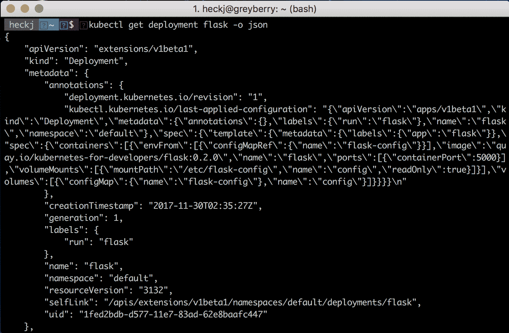

# 声明式基础设施

Kubernetes 本质上是一个声明性系统。在之前的章节中，我们已经使用诸如`kubectl run`和`kubectl expose`之类的命令探讨了 Kubernetes 及其一些关键概念。这些命令都是命令式的：现在就做这件事。Kubernetes 通过将这些资源作为对象本身来管理这些资源。`kubectl`和 API 服务器将这些请求转换为资源表示，然后存储它们，各种控制器的工作是了解当前状态并按照请求进行操作。

我们可以直接利用声明性结构-所有服务、Pod 和更多内容都可以用 JSON 或 YAML 文件表示。在本章中，我们将转而将您的应用程序定义为声明性基础设施。我们将把现有的简单 Kubernetes Pod 放入您可以与代码一起管理的声明中；存储在源代码控制中并部署以运行您的软件。我们还将介绍 ConfigMaps 和 Secrets，以允许您定义配置以及应用程序结构，并探讨如何使用它们。

本章的部分包括：

+   命令式与声明式

+   声明您的第一个应用程序

+   Kubernetes 资源-注释

+   Kubernetes 资源-ConfigMap

+   Kubernetes 资源-秘密

+   使用 ConfigMap 的 Python 示例

# 命令式与声明式命令

到目前为止，我们的示例主要集中在快速和命令式的命令，例如`kubectl run`来创建一个部署，然后运行我们的软件。这对于一些快速操作很方便，但不容易暴露 API 的全部灵活性。要利用 Kubernetes 提供的所有选项，通常更有效的方法是管理描述您想要的部署的文件。

在使用这些文件时，您可以使用`kubectl create`、`kubectl delete`和`kubectl replace`命令，以及`-f`选项来指定要使用的文件。命令式命令对于简单的设置很容易有效，但您很快就需要一系列重复使用的命令，以充分利用所有功能。您可能会将这些命令集存储在一个备忘单中，但这可能会变得繁琐，而且并不总是清晰明了。

Kubernetes 还提供了一种声明性机制，利用`kubectl apply`命令，该命令接受文件，审查当前状态，并根据需要管理更新-创建、删除等，同时保持更改的简单审计日志。

我建议对于任何比运行单个进程更复杂的事情使用`kubectl apply`命令，这可能是您开发的大多数服务。您在开发中可能不需要审计跟踪。但在暂存/金丝雀环境或生产环境中可能需要，因此熟悉并熟悉它们对于理解它们是有利的。

最重要的是，通过将应用程序的描述放在文件中，您可以将它们包含在源代码控制中，将它们视为代码。这为您提供了一种一致的方式来在团队成员之间共享该应用程序结构，所有这些成员都可以使用它来提供一致的环境。

`kubectl apply`命令有一个`-f`选项，用于指定文件或文件目录，以及一个`-R`选项，如果您正在建立一个复杂的部署，它将递归地遍历目录。

随着我们在本书中的进展，我将使用 YAML 格式（带有注释）的声明性命令和配置来描述和操作 Kubernetes 资源。如果您有强烈的偏好，也可以使用 JSON。

注意：如果您想要一个命令行工具来解析 YAML，那么有一个等价于`jq`用于 JSON 的工具：`yq`。我们的示例不会详细介绍，但如果您想使用该工具，可以在[`yq.readthedocs.io`](https://yq.readthedocs.io)找到更多信息。

# 一堵墙的 YAML

这些配置看起来是什么样子的？其中绝大多数是以 YAML 格式进行管理，选项和配置可能看起来令人不知所措。Kubernetes 中的每个资源都有自己的格式，其中一些格式正在发生变化并处于积极开发中。您会注意到一些 API 和对象结构将积极引用`alpha`或`beta`，以指示项目中这些资源的成熟状态。该项目倾向于以非常保守的方式使用这些术语：

+   `alpha`倾向于意味着这是一个早期实验，数据格式可能会发生变化，但很可能会存在实现最终目标的东西

+   `beta`比纯粹的实验更加可靠，很可能可以用于生产负载，尽管特定的资源格式尚未完全确定，并且可能会在 Kubernetes 发布过程中略微更改

请注意，随着 Kubernetes 的新版本发布，alpha 和 beta API 会不断发展。如果您使用较早版本，它可能会变得不推荐使用，并最终不可用。您需要跟踪这些更新与您正在使用的 Kubernetes 版本。

资源的正式文档、选项和格式托管在[`kubernetes.io`](https://kubernetes.io)的参考文档下。在我写这篇文章时，当前发布的版本是 1.8，该版本的参考文档可在[`kubernetes.io/docs/api-reference/v1.8/`](https://kubernetes.io/docs/api-reference/v1.8/)上找到。该文档是从 Kubernetes 项目源代码生成的，并在每次发布时更新，通常每三个月左右发布一次。

除了浏览参考文档之外，您还可以从现有的 Kubernetes 对象中获取声明。当您使用`kubectl get`命令请求 Kubernetes 资源时，可以添加`-o yaml --export`选项。

如果您更喜欢该格式，`-o yaml`选项可以改为`-o json`。`--export`将剥离一些与 Kubernetes 内部资源的当前状态和身份相关的多余信息，并且不会对您在外部存储时有所帮助。

尽管在 1.8 版本中，这种能力还不完全，但您应该能够要求在一个命名空间中的所有资源，存储这些配置，并使用这些文件来精确地复制它。在实践中，会有一些小问题，因为导出的版本并不总是完全符合您的要求。在这一点上，更好的做法是管理自己的声明文件。

最后，我建议使用 YAML 作为这些声明的格式。您可以使用 JSON，但 YAML 允许您在声明中添加注释，这对于其他人阅读这些文件非常有用——这是 JSON 格式所没有的功能。

# 创建一个简单的部署

让我们首先看看`kubectl run`为我们创建了什么，然后从那里开始。我们使用以下命令创建了之前的简单部署：

```
kubectl run flask --image=quay.io/kubernetes-for-developers/flask:0.1.1 --port=5000
```

在示例中，我们使用`kubectl get deployment flask -o json`命令转储了声明的状态。让我们重复一下，只是使用`-o yaml --export`选项：

```
kubectl get deployment flask -o yaml --export
```

输出应该看起来像下面这样：

```
apiVersion: extensions/v1beta1
kind: Deployment
metadata:
 annotations:
 deployment.kubernetes.io/revision: "1"
 creationTimestamp: null
 generation: 1
 labels:
 run: flask
 name: flask
 selfLink: /apis/extensions/v1beta1/namespaces/default/deployments/flask
spec:
 replicas: 1
 selector:
 matchLabels:
 run: flask
 strategy:
 rollingUpdate:
 maxSurge: 1
 maxUnavailable: 1
 type: RollingUpdate
 template:
 metadata:
 creationTimestamp: null
 labels:
 run: flask
 spec:
 containers:
 - image: quay.io/kubernetes-for-developers/flask:latest
 imagePullPolicy: Always
 name: flask
 ports:
 - containerPort: 5000
 protocol: TCP
 resources: {}
 terminationMessagePath: /dev/termination-log
 terminationMessagePolicy: File
 dnsPolicy: ClusterFirst
 restartPolicy: Always
 schedulerName: default-scheduler
      securityContext: {}
 terminationGracePeriodSeconds: 30
status: {}
```

任何 Kubernetes 资源的一般格式都将具有相同的顶部四个对象：

+   `apiVersion`

+   `kind`

+   `metadata`

+   `spec`

如果您从 Kubernetes 检索信息，您将看到第五个键：`status`。状态不需要由用户定义，并且在检索对象以共享其当前状态时由 Kubernetes 提供。如果您在`kubectl get`命令上错过了`--export`选项，它将包括状态。

您会看到对象中散布着元数据，因为这些对象彼此相关，并在概念上相互构建。尽管它们可能被合并（如前面所示）成单个引用，但元数据被包含在每个资源中。对于我们创建的部署，它使用了部署的声明性引用，它包装了一个 ReplicaSet，该 ReplicaSet 又包装了一个 Pod。

您可以在以下 URL 中查看每个的正式定义：

+   Deployment：[`kubernetes.io/docs/api-reference/v1.8/#deployment-v1beta2-apps`](https://kubernetes.io/docs/api-reference/v1.8/#deployment-v1beta2-apps)

+   ReplicaSet：[`kubernetes.io/docs/api-reference/v1.8/#replicaset-v1beta2-apps`](https://kubernetes.io/docs/api-reference/v1.8/#replicaset-v1beta2-apps)

+   Pod：[`kubernetes.io/docs/api-reference/v1.8/#pod-v1-core`](https://kubernetes.io/docs/api-reference/v1.8/#pod-v1-core)

您可能会注意到 ReplicaSet 和 Deployment 几乎是相同的。部署扩展了 ReplicaSet，并且每个部署实例都至少有一个 ReplicaSet。部署包括声明性选项（以及责任），用于如何在运行软件上执行更新。Kubernetes 建议在部署代码时，使用部署而不是直接使用 ReplicaSet，以便精确指定您希望它在更新时如何反应。

在部署`spec`（[`kubernetes.io/docs/api-reference/v1.8/#deploymentspec-v1beta2-apps`](https://kubernetes.io/docs/api-reference/v1.8/#deploymentspec-v1beta2-apps)）中，所有在模板键下的项目都是从 Pod 模板规范中定义的。您可以在[`kubernetes.io/docs/api-reference/v1.8/#podtemplatespec-v1-core`](https://kubernetes.io/docs/api-reference/v1.8/#podtemplate-v1-core)查看 Pod 模板规范的详细信息。

如果您查看在线文档，您会看到许多我们没有指定的选项。当它们没有被指定时，Kubernetes 仍会使用规范中定义的默认值填充这些值。

您可以根据需要指定完整或轻量级的选项。所需字段的数量非常少。通常只有在您想要不同于默认值的值时，才需要定义可选字段。例如，对于一个部署，必需字段是名称和要部署的镜像。

在为自己的代码创建声明时，我建议保持一组最小的 YAML 声明。这将有助于更容易理解您的资源声明，并且与大量使用注释一起，应该使得生成的文件易于理解。

# 声明您的第一个应用程序

继续选择一个示例并创建一个部署声明，然后尝试使用该声明创建一个。

我建议创建一个名为 `deploy` 的目录，并将您的声明文件放在其中。这是使用 `flask` 示例：

```
flask.yml
```

```
apiVersion: apps/v1beta1
kind: Deployment
metadata:
 name: flask
 labels:
 run: flask
spec:
 template:
 metadata:
 labels:
 app: flask
 spec:
 containers:
 - name: flask
 image: quay.io/kubernetes-for-developers/flask:0.1.1
 ports: 
 - containerPort: 5000
```

在尝试您的文件之前，请删除现有的部署：

```
kubectl delete deployment flask
```

使用 `--validate` 选项是一个很好的做法，可以让 `kubectl` 检查文件，并且您可以将其与 `--dry-run` 一起使用，将文件与 Kubernetes 中的任何现有内容进行比较，以便让您明确知道它将要执行的操作。 YAML 很容易阅读，但不幸的是，由于其使用空格来定义结构，很容易出现格式错误。使用 `--validate` 选项，`kubectl` 将警告您缺少字段或其他问题。如果没有它，`kubectl` 通常会悄悄地失败，只是简单地忽略它不理解的内容：

```
kubectl apply -f deploy/flask.yml --dry-run --validate
```

您应该看到以下结果：

```
deployment "flask" created (dry run)
```

如果您不小心打了错字，您将在输出中看到报告的错误。我在一个键中故意打了错字，`metadata`，结果如下：

```
error: error validating "deploy/flask.yml": error validating data: found invalid field metdata for v1.PodTemplateSpec; if you choose to ignore these errors, turn validation off with --validate=false
```

一旦您确信数据经过验证并且将按预期工作，您可以使用以下命令创建对象：

```
kubectl apply -f deploy/flask.yml
```

即使在尝试运行代码时，仍然很容易犯一些不明显的小错误，但在尝试运行代码时会变得清晰。您可以使用 `kubectl get` 命令来检查特定资源。我建议您还使用 `kubectl describe` 命令来查看有关 Kubernetes 的所有相关事件，而不仅仅是资源的状态：

```
kubectl describe deployment/flask
```

```
 Name: flask
Namespace: default
CreationTimestamp: Sun, 22 Oct 2017 14:03:27 -0700
Labels: run=flask
Annotations: deployment.kubernetes.io/revision=1
 kubectl.kubernetes.io/last-applied-configuration={"apiVersion":"apps/v1beta1","kind":"Deployment","metadata":{"annotations":{},"labels":{"run":"flask"},"name":"flask","namespace":"default"},"spec":{"t...
Selector: app=flask
Replicas: 1 desired | 1 updated | 1 total | 1 available | 0 unavailable
StrategyType: RollingUpdate
MinReadySeconds: 0
RollingUpdateStrategy: 25% max unavailable, 25% max surge
Pod Template:
 Labels: app=flask
 Containers:
 flask:
 Image: quay.io/kubernetes-for-developers/flask:0.1.1
 Port: 5000/TCP
 Environment: <none>
 Mounts: <none>
 Volumes: <none>
Conditions:
 Type Status Reason
 ---- ------ ------
 Available True MinimumReplicasAvailable
 Progressing True NewReplicaSetAvailable
OldReplicaSets: <none>
NewReplicaSet: flask-2003485262 (1/1 replicas created)
Events:
 Type Reason Age From Message
 ---- ------ ---- ---- -------
 Normal ScalingReplicaSet 5s deployment-controller Scaled up replica set flask-2003485262 to 1
```

一旦您对声明的工作原理感到满意，请将其与您的代码一起存储在源代码控制中。本书的示例部分将转移到使用存储的配置，并且本章和以后的章节将更新 Python 和 Node.js 示例。

如果要创建 Kubernetes 资源，然后使用`kubectl apply`命令对其进行管理，应在运行`kubectl run`或`kubectl create`命令时使用`--save-config`选项。这将明确添加`kubectl apply`在运行时期望存在的注释。如果它们不存在，命令仍将正常运行，但会收到警告：

```
Warning: kubectl apply should be used on resource created by either kubectl create --save-config or kubectl apply
```

# ImagePullPolicy

如果在尝试事物时在代码中使用`:latest`标签，您可能已经注意到`imagePullPolicy`的值被设置为`Always`：

```
imagePullPolicy: Always
```

这告诉 Kubernetes 始终尝试从容器存储库加载新的 Docker 镜像。如果使用的标签不是`:latest`，那么默认值(`IfNotPresent`)只会在本地缓存中找不到容器镜像时尝试重新加载它们。

这是一种在频繁更新代码时非常有用的技术。我建议只在独自工作时使用这种技术，因为分享`：latest`的确切含义可能很困难，并且会导致很多混乱。

在任何暂存或生产部署中使用`:latest`标签通常被认为是一种不好的做法，仅仅是因为它引用的内容不确定。

# 审计跟踪

当您使用`kubectl apply`命令时，它会自动在 Kubernetes 资源中的注释中为您维护审计跟踪。如果使用以下命令：

```
kubectl describe deployment flask
```

您将看到类似以下的相当可读的输出：

```
Name: flask
Namespace: default
CreationTimestamp: Sat, 16 Sep 2017 08:31:00 -0700
Labels: run=flask
Annotations: deployment.kubernetes.io/revision=1
kubectl.kubernetes.io/last-applied-configuration={"apiVersion":"apps/v1beta1","kind":"Deployment","metadata":{"annotations":{},"labels":{"run":"flask"},"name":"flask","namespace":"default"},"spec":{"t...
Selector: app=flask
Replicas: 1 desired | 1 updated | 1 total | 1 available | 0 unavailable
StrategyType: RollingUpdate
MinReadySeconds: 0
RollingUpdateStrategy: 25% max unavailable, 25% max surge
Pod Template:
 Labels: app=flask
 Containers:
 flask:
 Image: quay.io/kubernetes-for-developers/flask:0.1.1
 Port: 5000/TCP
 Environment: <none>
 Mounts: <none>
 Volumes: <none>
Conditions:
 Type Status Reason
 ---- ------ ------
 Available True MinimumReplicasAvailable
 Progressing True NewReplicaSetAvailable
OldReplicaSets: <none>
NewReplicaSet: flask-866287979 (1/1 replicas created)
Events:
 FirstSeen LastSeen Count From SubObjectPath Type Reason Message
 --------- -------- ----- ---- ------------- -------- ------ ------
 2d 2d 1 deployment-controller Normal ScalingReplicaSetScaled up replica set flask-866287979 to 1
```

我提到的审计跟踪包含在注释`kubectl.kubernetes.io/last-applied-configuration`中，其中包括最后应用的配置。由于该注释相当长，因此在此输出中对其进行了修剪。如果要转储整个对象，可以查看完整的详细信息，如下所示：

```
kubectl get deployment flask -o json
```

我们感兴趣的信息是`metadata` | `annotations` `kubectl.kubernetes.io/last-applied-configuration`。该注释中的完整细节可能如下所示：



# Kubernetes 资源-注释

标签和选择器用于对 Kubernetes 资源进行分组和选择，而注释提供了一种添加特定于资源的元数据的方法，这些元数据可以被 Kubernetes 或其运行的容器访问。

正如您刚才看到的，`kubectl apply`在调用时会自动应用一个注释，以跟踪资源的最后应用配置状态。在上一章中，您可能已经注意到部署控制器用于跟踪修订版本的注释`deployment.kubernetes.io/revision`，我们还谈到了`kubernetes.io/change-cause`注释，该注释被`kubectl`用于显示部署发布的更改历史。

注释可以是简单的值或复杂的块（如`kubectl.kubernetes.io/last-applied-configuration`的情况）。到目前为止的示例是 Kubernetes 工具使用注释共享信息，尽管注释也用于在容器中共享信息供应用程序使用。

您可以使用它们来包含诸如添加版本控制修订信息、构建编号、相关的可读联系信息等信息。

与标签一样，注释可以使用命令`kubectl annotate`来添加。一般来说，注释使用与标签相同的键机制，因此任何包含`kubernetes.io`前缀的注释都是来自 Kubernetes 项目的内容。

标签旨在对 Kubernetes 对象（Pod、部署、服务等）进行分组和组织。注释旨在为实例（或一对实例）提供特定的附加信息，通常作为注释本身的附加数据。

# 在 Pod 中公开标签和注释

Kubernetes 可以直接在容器中公开有关 Pod 的数据，通常作为特定文件系统中的文件，您的代码可以读取和使用。标签、注释等可以通过容器规范作为文件在您的容器中提供，并使用 Kubernetes 所谓的`downwardAPI`。

这可以是一种方便的方式，可以在容器中公开注释信息，例如构建时间，源代码引用哈希等，以便您的运行时代码可以读取和引用这些信息。

为了使 Pod 的标签和注释可用，您需要为容器定义一个卷挂载，然后指定`downwardAPI`和卷挂载点中的项目。

更新`flask`部署文件：

```
apiVersion: apps/v1beta1
kind: Deployment
metadata:
 name: flask
 labels:
 run: flask
 annotations:
 example-key: example-data
spec:
 template:
 metadata:
 labels:
 app: flask
 spec:
 containers:
 - name: flask
 image: quay.io/kubernetes-for-developers/flask:0.1.1
 ports:
 - containerPort: 5000
 volumeMounts:
          - name: podinfo
 mountPath: /podinfo
 readOnly: false
 volumes:
 - name: podinfo
 downwardAPI:
 items:
 - path: "labels"
 fieldRef:
 fieldPath: metadata.labels
 - path: "annotations"
 fieldRef:
 fieldPath: metadata.annotations
```

下面部分的细节标识了一个挂载点——将在容器内创建的目录结构。它还指定卷应该使用`downwardAPI`与特定的元数据；在这种情况下，是标签和注释。

当您指定卷挂载位置时，请注意不要指定已经存在并且有文件的位置（例如/等），否则容器可能无法按预期运行。挂载点不会抛出错误-它只是覆盖容器中该位置可能已经存在的任何内容。

您可以使用以下命令应用此更新的声明：

```
kubectl apply -f ./flask.yml
```

现在我们可以打开一个 shell 到正在运行的 Pod，使用以下命令：

```
kubectl exec flask-463137380-d4bfx -it -- sh
```

然后在活动的 shell 中运行以下命令：

```
ls -l /podinfo
```

```
total 0
lrwxrwxrwx    1 root     root            18 Sep 16 18:14 annotations -> ..data/annotations
lrwxrwxrwx    1 root     root            13 Sep 16 18:14 labels -> ..data/labels
```

```
cat /podinfo/annotations
```

```
kubernetes.io/config.seen="2017-09-16T18:14:04.024412807Z"
kubernetes.io/config.source="api"
kubernetes.io/created-by="{\"kind\":\"SerializedReference\",\"apiVersion\":\"v1\",\"reference\":{\"kind\":\"ReplicaSet\",\"namespace\":\"default\",\"name\":\"flask-463137380\",\"uid\":\"d262ca60-9b0a-11e7-884c-0aef48c812e4\",\"apiVersion\":\"extensions\",\"resourceVersion\":\"121204\"}}\n"
```

```
cat /podinfo/labels
```

```
app="flask"
pod-template-hash="463137380"
```

您可以通过以下方式将其与 Pod 本身的注释进行比较：

```
kubectl describe pod flask-463137380-d4bfx
```

```
Name: flask-463137380-d4bfx
Namespace: default
Node: minikube/192.168.64.3
Start Time: Sat, 16 Sep 2017 11:14:04 -0700
Labels: app=flask
pod-template-hash=463137380
Annotations: kubernetes.io/created-by={"kind":"SerializedReference","apiVersion":"v1","reference":{"kind":"ReplicaSet","namespace":"default","name":"flask-463137380","uid":"d262ca60-9b0a-11e7-884c-0aef48c812e4","a...
Status: Running
IP: 172.17.0.5
Created By: ReplicaSet/flask-463137380
Controlled By: ReplicaSet/flask-463137380
```

有关 Pod 的各种数据可以在 Pod 中公开，并且可以通过环境变量将相同的数据公开给 Pod。可以公开的完整数据集在 Kubernetes 文档中有详细说明（[`kubernetes.io/docs/tasks/inject-data-application/downward-api-volume-expose-pod-information/`](https://kubernetes.io/docs/tasks/inject-data-application/downward-api-volume-expose-pod-information/)）。

尽管使用这种机制来提供传递配置数据的方法可能看起来方便和明显，但 Kubernetes 提供了额外的功能，专门用于为容器内的代码提供配置，包括密码、访问令牌和其他机密信息所需的私有配置。

# Kubernetes 资源 - ConfigMap

当您将容器创建为代码的只读实例时，您很快就会需要一种方式来提供标志或配置的小改变。也许更重要的是，您不希望在容器映像中包含诸如 API 密钥、密码或身份验证令牌等私人详细信息。

Kubernetes 支持两种资源来帮助并链接这种类型的信息。第一种是 ConfigMap，可以单独使用或跨 Pod 用于应用部署，为应用程序提供更新和传播配置的单一位置。Kubernetes 还支持 Secret 的概念，这是一种更加严格控制和仅在需要时才公开的配置类型。

例如，一个人可能会使用 ConfigMap 来控制示例 Redis 部署的基本配置，并使用 Secret 来分发敏感的身份验证凭据，以供客户端连接。

# 创建 ConfigMap

您可以使用`kubectl create configmap`命令创建 ConfigMap，其中配置的数据可以在命令行上设置，也可以来自您存储的一个或多个文件。它还支持加载文件目录以方便使用。

从命令行创建单个键/值对非常简单，但可能是管理配置的最不方便的方式。例如，运行以下命令：

```
kubectl create configmap example-config --from-literal=log.level=err
```

这将创建一个名为`example-config`的 ConfigMap，其中包含一个键/值对。您可以使用以下命令查看加载的所有配置列表：

```
kubectl get configmap
```

```
NAME             DATA      AGE
example-config   0         2d
```

并使用以下命令查看 ConfigMap：

```
kubectl describe configmap example-config
```

```
Name: example-config
Namespace: default
Labels: <none>
Annotations: <none>
Data
====
log.level:
----
err
Events: <none>
```

您还可以请求以 YAML 格式获取原始数据：

```
kubectl get configmap example-config -o yaml --export apiVersion: v1
data:
 log.level: err
kind: ConfigMap
metadata:
 creationTimestamp: null
 name: example-config
 selfLink: /api/v1/namespaces/default/configmaps/example-config
```

您还可以请求以 JSON 格式获取原始数据：

```
kubectl get configmap example-config -o json --export {
 "apiVersion": "v1",
 "data": {
 "log.level": "err"
 },
 "kind": "ConfigMap",
 "metadata": {
 "creationTimestamp": null,
 "name": "example-config",
 "selfLink": "/api/v1/namespaces/default/configmaps/example-config"
 }
}
```

从字面值创建的配置的值通常是字符串。

如果您想创建代码可以解析为不同类型（数字、布尔值等）的配置值，则需要将这些配置指定为文件，或者在 YAML 或 JSON 格式的 ConfigMap 对象中定义它们为块。

如果您希望将配置分开存储在不同的文件中，它们可以以简单的`key=value`格式具有多行，每行一个配置。`kubectl create configmap <name> --from-file <filename>`命令将加载这些文件，创建一个基于文件名的`configmap`名称，其中包含来自文件的所有相关数据。如果您已经有要处理的配置文件，可以使用此选项基于这些文件创建 ConfigMaps。

例如，如果您想要一个名为`config.ini`的配置文件加载到 ConfigMap 中：

```
[unusual]
greeting=hello
onoff=true
anumber=3
```

您可以使用以下命令创建一个`iniconfig` ConfigMap：

```
kubectl create configmap iniconfig --from-file config.ini --save-config
```

将数据转储回 ConfigMap：

```
kubectl get configmap iniconfig -o yaml --export
```

应该返回类似以下的内容：

```
apiVersion: v1
data:
 config.ini: |
 [unusual]
 greeting=hello
 onoff=true
 anumber=3
kind: ConfigMap
metadata:
 name: iniconfig
 selfLink: /api/v1/namespaces/default/configmaps/iniconfig
```

YAML 输出中的管道符号（`|`）定义了多行输入。这些类型的配置不会直接作为环境变量可用，因为它们对于该格式是无效的。一旦将它们添加到 Pod 规范中，它们可以作为文件提供。将它们添加到 Pod 规范中与使用向下 API 在 Pod 的容器中公开标签或注释的方式非常相似。

# 管理 ConfigMaps

一旦您创建了一个 ConfigMap，就不能使用`kubectl create`命令用另一个 ConfigMap 覆盖它。您可以删除它并重新创建，尽管更有效的选项是像其他 Kubernetes 资源一样管理配置声明，使用`kubectl apply`命令进行更新。

如果您在尝试一些想法时使用`kubectl create`命令创建了初始的 ConfigMap，您可以开始使用`kubectl apply`命令来管理该配置，方式与我们之前在部署中使用的方式相同：导出 YAML，然后从该文件中使用`kubectl apply`。

例如，要获取并存储我们之前在 deploy 目录中创建的配置，您可以使用以下命令：

```
kubectl get configmap example-config -o yaml --export > deploy/example-config.yml
```

在 Kubernetes 的 1.7 版本中，导出中添加了一些字段，这些字段并不是严格需要的，但如果您将它们留在那里也不会有任何问题。查看文件时，您应该看到类似以下内容：

```
apiVersion: v1
data:
 log.level: err
kind: ConfigMap
metadata:
 creationTimestamp: null
 name: example-config
 selfLink: /api/v1/namespaces/default/configmaps/example-config
```

`data`、`apiVersion`、`kind`和 metadata 的键都是关键的，但 metadata 下的一些子键并不是必需的。例如，您可以删除`metadata.creationTimestamp`和`metadata.selfLink`。

现在您在 Kubernetes 中仍然有 ConfigMap 资源，因此第一次运行`kubectl apply`时，它会警告您正在做一些有点意外的事情：

```
kubectl apply -f deploy/example-config.yml
```

```
Warning: kubectl apply should be used on resource created by either kubectl create --save-config or kubectl apply
configmap "example-config" configured
```

您可以通过在`kubectl create`命令中使用`--save-config`选项来摆脱此警告，这将包括`kubectl apply`期望存在的注释。

此时，`kubectl apply`已应用了其差异并进行了相关更新。如果您现在从 Kubernetes 中检索数据，它将具有`kubectl apply`在更新资源时添加的注释。

```
kubectl get configmap example-config -o yaml --export
```

```
apiVersion: v1
data:
 log.level: err
kind: ConfigMap
metadata:
 annotations:
 kubectl.kubernetes.io/last-applied-configuration: |
 {"apiVersion":"v1","data":{"log.level":"err"},"kind":"ConfigMap","metadata":{"annotations":{},"name":"example-config","namespace":"default"}}
 creationTimestamp: null
 name: example-config
 selfLink: /api/v1/namespaces/default/configmaps/example-config
```

# 将配置暴露到您的容器映像中

有两种主要方法可以将配置数据暴露到您的容器中：

+   将一个或多个 ConfigMaps 的键连接到为您的 Pod 设置的环境变量中

+   Kubernetes 可以将一个或多个 ConfigMaps 中的数据映射到挂载在 Pod 中的卷中。

主要区别在于环境变量通常在调用容器启动时设置一次，并且通常是简单的字符串值，而作为卷中数据挂载的 ConfigMaps 可以更复杂，并且如果更新 ConfigMap 资源，它们将被更新。

请注意，目前不存在明确告知容器 ConfigMap 值已更新的机制。截至 1.9 版本，Kubernetes 不包括任何方式来向 Pod 和容器发出更新的信号。

此外，作为文件挂载公开的配置数据不会立即更新。更新 ConfigMap 资源和在相关 Pod 中看到更改反映之间存在延迟。

# 环境变量

在定义 Pod 规范时，除了强制的名称和镜像键之外，您还可以指定一个 `env` 键。环境键需要一个名称，并且您可以添加一个使用 `valueFrom:` 引用 ConfigMap 中的数据的键。

例如，要将我们的示例配置公开为环境变量，您可以将以下段添加到 Pod 规范中：

```
env:
 - name: LOG_LEVEL_KEY
 valueFrom:
 configMapKeyRef:
 name: example-config
 Key: log.level
```

在 Pod 规范中，您可以包含多个环境变量，并且每个环境变量可以引用不同的 ConfigMap，如果您的配置分成多个部分，以便更容易（或更合理）进行管理。

您还可以将整个 ConfigMap 映射为环境变量作为单个块的所有键/值。

您可以使用 `envFrom` 而不是在 `env` 下使用单独的键，并指定 ConfigMap，例如：

```
envFrom:
 - configMapRef:
 name: example-config
```

使用此设置，每当 Pod 启动时，所有配置数据键/值都将作为环境变量加载。

您可以在 ConfigMap 中创建不适合作为环境变量的键，例如以数字开头的键。在这些情况下，Kubernetes 将加载所有其他键，并在事件日志中记录失败的键，但不会抛出错误。您可以使用 `kubectl get events` 查看失败的消息，其中将显示因为无效而跳过的每个键。

如果您想要使用 ConfigMap 值中的一个作为在容器内运行的命令传递的参数，也可以这样做。当您通过 `env` 和名称指定环境变量时，您可以在 Pod 规范中的其他地方引用该变量使用 `$(ENVIRONMENT_VARIABLE_NAME)`。

例如，以下 `spec` 片段在容器调用中使用了环境变量：

```
spec:
 containers:
 - name: test-container
 image: gcr.io/google_containers/busybox
 command: [ "/bin/sh", "-c", "echo $(LOG_LEVEL_KEY)" ]
 env:
 - name: LOG_LEVEL_KEY
 valueFrom:
 configMapKeyRef:
 name: example-config
 key: log.level
```

# 在容器内部将 ConfigMap 暴露为文件

将 ConfigMap 数据暴露到容器中的文件中，与如何将注释和标签暴露到容器中非常相似。Pod 规范有两个部分。第一部分是为容器定义一个卷，包括名称和应该挂载的位置：

```
 volumeMounts:
 - name: config
 mountPath: /etc/kconfig
 readOnly: true
```

第二部分是一个卷描述，引用了相同的卷名称，并将 ConfigMap 列为属性，指示从哪里获取这些值：

```
 volumes:
 - name: config
 configMap:
 name: example-config
```

一旦应用了该规范，这些值将作为容器内的文件可用：

```
ls -al /etc/kconfig/
```

```
total 12
drwxrwxrwx    3 root     root          4096 Sep 17 00:57 .
drwxr-xr-x    1 root     root          4096 Sep 17 00:57 ..
drwxr-xr-x    2 root     root          4096 Sep 17 00:57 ..9989_17_09_00_57_49.704362876
lrwxrwxrwx    1 root     root            31 Sep 17 00:57 ..data -> ..9989_17_09_00_57_49.704362876
lrwxrwxrwx    1 root     root            16 Sep 17 00:57 log.level -> ..data/log.level
```

```
cat /etc/kconfig/log.level
```

```
Err
```

您可以使用环境变量或配置文件来为应用程序提供配置数据，只需取决于哪种方式更容易或更符合您的需求。我们将更新示例，使用 ConfigMaps 并将 ConfigMaps 添加到部署中，并在示例应用程序的代码中引用这些值。

# 对 ConfigMaps 的依赖

如果您开始在 Pod 规范中引用 ConfigMap，那么您正在为资源创建对该 ConfigMap 的依赖。例如，如果您添加了一些前面的示例来将`example-data`暴露为环境变量，但尚未将`example-config` ConfigMap 添加到 Kubernetes 中，当您尝试部署或更新 Pod 时，它将报告错误。

如果发生这种情况，错误通常会在`kubectl get pods`中报告，或者在事件日志中可见：

```
kubectl get pods
```

```
NAME                     READY     STATUS                                  RESTARTS   AGE
flask-4207440730-xpq8t   0/1       configmaps "example-config" not found   0          2d
```

```
kubectl get events
```

```
LASTSEEN   FIRSTSEEN   COUNT     NAME                     KIND         SUBOBJECT                TYPE      REASON                  SOURCE                  MESSAGE
2d         2d          1         flask-4207440730-30vn0   Pod                                   Normal    Scheduled               default-scheduler       Successfully assigned flask-4207440730-30vn0 to minikube
2d         2d          1         flask-4207440730-30vn0   Pod                                   Normal    SuccessfulMountVolume   kubelet, minikube       MountVolume.SetUp succeeded for volume "podinfo"
2d         2d          1         flask-4207440730-30vn0   Pod                                   Normal    SuccessfulMountVolume   kubelet, minikube       MountVolume.SetUp succeeded for volume "default-token-s40w4"
2d         2d          2         flask-4207440730-30vn0   Pod          spec.containers{flask}   Normal    Pulling                 kubelet, minikube       pulling image "quay.io/kubernetes-for-developers/flask:latest"
2d         2d          2         flask-4207440730-30vn0   Pod          spec.containers{flask}   Normal    Pulled                  kubelet, minikube       Successfully pulled image "quay.io/kubernetes-for-developers/flask:latest"
2d         2d          2         flask-4207440730-30vn0   Pod          spec.containers{flask}   Warning   Failed                  kubelet, minikube       Error: configmaps "example-config" not found
2d         2d          2         flask-4207440730-30vn0   Pod                                   Warning   FailedSync              kubelet, minikube       Error syncing pod
2d         2d          1         flask-4207440730         ReplicaSet                            Normal    SuccessfulCreate        replicaset-controller   Created pod: flask-4207440730-30vn0
2d         2d          1         flask                    Deployment                            Normal    ScalingReplicaSet       deployment-controller   Scaled up replica set flask-4207440730 to 1
```

如果在事后添加 ConfigMap，当 Pod 需要的资源可用时，Pod 将启动。

# Kubernetes 资源 - Secrets

ConfigMaps 非常适用于一般配置，但很容易被看到，这可能不是期望的。对于一些配置，例如密码、授权令牌或 API 密钥，通常希望有一种更受控制的机制来保护这些值。这就是资源 Secrets 旨在解决的问题。

Secrets 通常是单独创建（和管理）的，并且在内部 Kubernetes 使用`base64`编码存储这些数据。

您可以通过首先将值写入一个或多个文件，然后在`create`命令中指定这些文件来在命令行上创建一个 secret。Kubernetes 将负责进行所有相关的`base64`编码并将其存储起来。例如，如果您想要存储数据库用户名和密码，您可以执行以下操作：

```
echo -n “admin” > username.txt
echo -n “sdgp63lkhsgd” > password.txt
kubectl create secret generic database-creds --from-file=username.txt --from-file=password.txt
```

请注意，在命名 secret 的名称时，您可以使用任何字母数字字符，`-`或`.`，但不允许使用下划线。

如果您使用以下命令：

```
kubectl get secrets
```

您可以看到我们刚刚创建的秘密：

```
NAME                  TYPE                                  DATA      AGE
database-creds        Opaque                                2         2d
default-token-s40w4   kubernetes.io/service-account-token   3         5d
```

通过使用以下方式：

```
kubectl describe secret database-creds
```

```
Name: database-creds
Namespace: default
Labels: <none>
Annotations: <none>
Type: Opaque
Data
====
password.txt: 18 bytes
username.txt: 11 bytes
```

您会看到秘密报告为类型`Opaque`，并且与数据关联的字节数。

您仍然可以使用以下方式获取秘密：

```
kubectl get secret database-creds -o yaml --export
```

这将显示`base64`编码的值：

```
apiVersion: v1
data:
  password.txt: 4oCcc2RncDYzbGtoc2dk4oCd
  username.txt: 4oCcYWRtaW7igJ0=
kind: Secret
metadata:
  creationTimestamp: null
  name: database-creds
  selfLink: /api/v1/namespaces/default/secrets/database-creds
type: Opaque
```

如果您`base64`解码该值，您将看到原始版本：

```
echo "4oCcc2RncDYzbGtoc2dk4oCd" | base64 --decode
```

```
“sdgp63lkhsgd”
```

请注意，任何可以访问您的 Kubernetes 集群资源的人都可以检索和查看这些秘密。此外，我不建议您像其他声明一样管理秘密，存储在源代码控制中。这样做会在您的源代码控制系统中暴露这些秘密（以`base64`形式）。

# 将秘密暴露到容器中

我们可以以与暴露 ConfigMaps 非常相似的方式将秘密暴露给 Pod。与 ConfigMaps 一样，您可以选择将秘密作为环境变量或作为卷中的文件暴露，由 Pod 指定。

暴露秘密的格式看起来与暴露 ConfigMap 值的格式相同，只是在规范中使用`secretKeyRef`而不是`configMapRef`。

例如，要将前面的示例秘密密码作为环境变量暴露，您可以在 Pod 规范中使用以下内容：

```
 env:
 - name: DB_PASSWORD
 valueFrom:
 secretKeyRef:
 name: database-creds
 key: password.txt
```

然后在容器内查看，环境变量容器`DB_PASSWORD`：

```
kubectl exec flask-509298146-ql1t9 -it -- sh
```

```
env | grep DB
```

```
DB_PASSWORD=“sdgp63lkhsgd”
```

更好的方法是利用 Kubernetes 包含的将秘密挂载为容器内文件的能力。配置与暴露 ConfigMap 值非常相似，只是在规范中将 Secret 定义为卷属性，而不是 ConfigMap。

在规范中，您需要为容器定义一个`volumeMount`，指示其在容器中的位置：

```
 volumeMounts:
 - name: secrets
 mountPath: "/secrets"
```

然后定义如何从秘密中填充该卷的内容：

```
 volumes:
 - name: secrets
 secret:
 secretName: database-creds
 items:
 - key: password.txt
 path: db_password
```

部署使用此配置后，容器中将有一个`/secrets/db_password`文件，其中包含来自我们秘密的内容：

```
/ # ls -l /secrets/
total 0
lrwxrwxrwx    1 root     root            18 Sep 17 00:49 db_password -> ..data/db_password
```

```
/ # ls -l /secrets/db_password
lrwxrwxrwx    1 root     root            18 Sep 17 00:49 /secrets/db_password -> ..data/db_password
```

```
/ # cat /secrets/db_password
“sdgp63lkhsgd”
```

# 秘密和安全性-秘密有多秘密？

合理地说，但在 Kubernetes 1.8 中至少不是密码学安全的。如果您从安全的角度看待秘密，那么对秘密的约束要比将值留在 ConfigMap 中好，但安全配置文件有显着的限制。

在本质上，密钥的数据以明文（尽管编码文本）存储在 etcd 3.0 中，etcd 3.0 是 Kubernetes 1.8 的基础。它不使用静态密钥来保留（和访问）密钥。如果您正在运行自己的 Kubernetes 集群，请注意，未经保护的 etcd 代表集群整体安全性的一个重大弱点。

对于许多应用程序和用例，这是完全可以接受的，但如果您需要在开发和生产环境中适应更高的安全配置文件，那么您将需要查看与 Kubernetes 配合使用的工具。最常讨论的替代/扩展是 Vault，这是 HashiCorp 的一个开源项目。您可以在[`www.vaultproject.io`](https://www.vaultproject.io)找到有关 Vault 的更多详细信息。

Kubernetes 项目在秘密和秘密管理方面也在不断发展。在 1.7 版本中，Kubernetes 包括**基于角色的访问控制**（**RBAC**），该项目正在根据路线图维护和开发，以改进 Kubernetes 的功能，提高其安全配置文件的能力，并在未来支持更容易与外部秘密管理源（如 Vault）协调。

# 示例-使用 ConfigMap 的 Python/Flask 部署

这个示例建立在我们之前的 Python/Flask 示例之上。此扩展将添加一个使用环境变量和结构化文件的 ConfigMap，以及用于消耗和使用这些值的代码更新。

首先，添加一个包含顶级值和更深层配置的 ConfigMap。顶级值将公开为环境变量，多行 YAML 将公开为容器内的文件：

```
# CONFIGURATION FOR THE FLASK APP
kind: ConfigMap
apiVersion: v1
metadata:
 name: flask-config
data:
 CONFIG_FILE: “/etc/flask-config/feature.flags“
 feature.flags: |
 [features]
 greeting=hello
 debug=true
```

这个 ConfigMap 与部署的 Pod 规范映射，使用`envFrom`键，并作为卷提供文件映射：

```
 spec:
 containers:
 - name: flask
 image: quay.io/kubernetes-for-developers/flask:latest
 ports:
 - containerPort: 5000
 envFrom:
 - configMapRef:
 name: flask-config
 volumeMounts:
 - name: config
 mountPath: /etc/flask-config
 volumes:
 - name: config
 configMap:
 name: flask-config
```

此更新对部署有一个名为`flask-config`的 ConfigMap 的依赖。如果 ConfigMap 没有加载，并且我们尝试加载更新的部署，它将不会更新部署，直到该 ConfigMap 可用。为了避免意外丢失文件的情况，您可以将 ConfigMap 和部署规范放在同一个 YAML 文件中，用新行上的`---`分隔。然后，您可以在使用`kubectl apply`命令时按照指定的顺序部署多个资源。

您还可以将每个资源保存在单独的文件中，如果这样更容易理解或管理，主要取决于您的偏好。`kubectl apply`命令包括选项来引用目录中的所有文件，包括递归地 - 因此，对文件进行排序和结构化；但是，最好自己管理它们。

为了匹配这个示例，[`github.com/kubernetes-for-developers/kfd-flask`](https://github.com/kubernetes-for-developers/kfd-flask)上的代码有一个标签，您可以使用它来一次更新所有文件：

```
git checkout 0.2.0
```

（如果您跳过了之前的示例，您可能需要首先克隆存储库：`git clone https://github.com/kubernetes-for-developers/kfd-flask`）

更新代码后，部署更新：

```
kubectl apply -f deploy/
```

部署后，您可以使用`kubectl exec`在 Pod 中运行交互式 shell，并检查部署和已暴露的内容。

# 侧边栏 - JSONPATH

我们可以使用类似以下命令查找特定的 Pod：

```
kubectl get pods -l app=flask
```

这将仅查找与`app=flask`选择器匹配的 Pod，并打印出类似以下的人类可读输出：

```
NAME                     READY     STATUS    RESTARTS   AGE
flask-2376258259-p1cwb   1/1       Running   0          8m
```

这些相同的数据以结构化形式（JSON、YAML 等）可用，我们可以使用诸如`jq`之类的工具进行解析。Kubectl 包括两个额外的选项，使其成为一个更方便的工具 - 您可以使用`JSONPATH 或 GO_TEMPLATE`来挖掘特定的值。使用内置到`kubectl`客户端的`JSONPATH`，而不是执行前面的两步骤来获取 Pod 名称，您可以直接获取我们想要使用的特定细节，即名称：

```
kubectl get pods -l app=flask -o jsonpath='{.items[*].metadata.name}'
```

这应该返回以下内容：

```
flask-2376258259-p1cwb
```

这可以很容易地嵌入到一个 shell 命令中，使用`$()`来内联执行它。这最终会成为一个更复杂的命令，但它会处理我们询问 Kubernetes 相关 Pod 名称的步骤，这对于许多交互命令来说至关重要。

例如，我们可以使用以下命令在与此部署相关联的 Pod 中打开交互式 shell：

```
kubectl exec $(kubectl get pods -l app=flask \
-o jsonpath='{.items[*].metadata.name}') \
-it -- /bin/sh
```

这获取了 Pod 的名称，并将其嵌入到`kubectl exec`中，以使用`/bin/sh`命令运行交互式会话。

一旦您打开了这个会话，您可以查看已设置的环境变量，如下所示：

```
env
```

这将显示设置的所有环境变量，其中之一应该是以下内容：

```
CONFIG_FILE=/etc/flask-config/feature.flags
```

您可以查看更复杂的配置数据：

```
cat $CONFIG_FILE
[features]
greeting=hello
debug=true
```

我们精心制作了 ConfigMap，根据我们放入部署规范的内容，为该文件的正确位置。如果我们更改部署规范，但不更改 ConfigMap，则嵌入在环境变量`CONFIG_FILE`中的位置将不正确。

使用 Kubernetes 部署、ConfigMap 和服务规范的 YAML，存在许多未抽象出的重复数据。从开发人员的角度来看，这将感到尴尬，违反了常见的不要重复自己的口头禅。有很多重复和小改变的地方，不幸地影响了部署规范。

Kubernetes 项目正在发展与这些文件交互的方式，努力使生成相关配置更加与仍处于早期开发阶段的项目相匹配。随着 Kubernetes 的不断成熟，在定义资源声明时，这应该会演变为更具有代码样式的特质。

# 在 Python/Flask 中使用 ConfigMap

在 Python 中，您可以使用 os.environ 查看环境变量，例如：

```
import os
os.environ.get('CONFIG_FILE’)
```

在代码中使用`os.environ.get`时，您可以设置默认值来处理环境变量未设置的情况：

```
import os
os.environ.get('CONFIG_FILE’,’./feature.flags’)
```

我们在这里设置`CONFIG_FILE`环境变量，以向您展示如何完成此操作，但严格来说，不一定需要读取配置文件-更多是为了方便您在需要时覆盖该值。

Python 还包括一个模块来解析和读取 INI 风格的配置文件，就像我们在 ConfigMap 中添加的那样。继续使用示例：

```
from configparser import SafeConfigParser
from pathlib import Path
# initialize the configuration parser with all the existing environment variables
parser = SafeConfigParser(os.environ)
```

从这里开始，ConfigParser 已加载了名为`DEFAULT`的部分，其中包含所有环境变量，我们可以检索其中的一个：

```
Python 3.6.1 (default, May  2 2017, 15:16:41)
[GCC 6.3.0] on linux
Type "help", "copyright", "credits" or "license" for more information.
>>> import os
>>> from configparser import SafeConfigParser
>>> from pathlib import Path
>>> # initialize the configuration parser with all the existing environment variables
... parser = SafeConfigParser(os.environ)
>>> parser.get('DEFAULT','CONFIG_FILE')
'/etc/flask-config/feature.flags'
```

我们可以使用基于存储在 ConfigMap 中的 INI 文件的部分来扩展解析器，该文件在文件系统上公开为`/etc/flask-config/feature.flags`，代码如下：

```
# default location of ./feature.flags is used if the environment variable isn’t set
config_file = Path(os.environ.get('CONFIG_FILE','/opt/feature.flags'))
# verify file exists before attempting to read and extend the configuration
if config_file.is_file():
 parser.read(os.environ.get('CONFIG_FILE'))
```

现在解析器将加载来自环境变量的`DEFAULT`部分和来自 ConfigMap 数据的`'features'`部分：

```
>>> parser.sections()
['features']
>>> parser.getboolean('features','debug')
True
```

ConfigParser 还可以使您在代码中包含默认值：

```
>>> parser.getboolean('features','something-else’,fallback=False)
False
```

然后我们使用这种代码来根据 ConfigMap 设置调试启用或禁用：

```
if __name__ == '__main__':
 debug_enable = parser.getboolean('features','debug',fallback=False)
 app.run(debug=debug_enable,host='0.0.0.0')
```

您可以在[`docs.python.org/3/library/configparser.html`](https://docs.python.org/3/library/configparser.html)找到有关如何利用 Python 3 的 ConfigParser 的更多详细信息。

# 摘要

在本章中，我们详细讨论了如何充分利用 Kubernetes 的声明性特性，并通过规范文件来管理我们的应用程序。我们还讨论了 Annotations、ConfigMap 和 Secrets 以及如何创建并在 Pods 内部使用它们。我们在本章中还更新了我们的 Python 和 Node.js 应用程序，以使用 ConfigMaps 来运行我们之前设置的示例代码，并简要介绍了如何利用 kubectl 中内置的`JSONPATH`来使该工具更具即时提供所需特定信息的强大功能。
