# 第五章：Pod 和容器的生命周期

由于 Kubernetes 是一个声明性系统，为 Pod 和容器提供的生命周期和钩子是代码可以采取行动的地方。Pod 有一个生命周期，容器也有一个生命周期，Kubernetes 提供了许多地方，您可以向系统提供明确的反馈，以便它按照您的意愿运行。在本章中，我们将深入探讨预期的生命周期，可用的钩子以及如何使用它们的示例。

主题将包括：

+   Pod 生命周期

+   容器生命周期

+   探针

+   容器钩子：post-start 和 pre-stop

+   初始化容器

+   如何处理优雅关闭

# Pod 生命周期

Pod 的生命周期是几个组件的聚合，因为 Pod 有许多移动部分，可以处于各种状态，它的表示是 Kubernetes 如何管理你的代码运行，与各种控制器一起工作的控制和反馈循环。

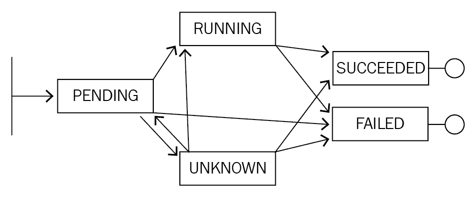

Pod 生命周期的状态有：

+   **挂起**：Pod 已通过 API 创建，并正在被调度，加载并在其中一个节点上运行的过程中

+   **运行**：Pod 完全运行，并且软件在集群中运行

+   **成功（或）失败**：Pod 已完成操作（正常或崩溃）

+   **还有第四种状态**：未知，这是一个相当罕见的情况，通常只在 Kubernetes 内部出现问题时才会出现，它不知道容器的当前状态，或者无法与其底层系统通信以确定该状态。

如果您在容器中运行长时间运行的代码，那么大部分时间将花在运行中。如果您在 Kubernetes 中使用 Job 或 CronJob 运行较短的批处理代码，则最终状态（成功或失败）可能是您感兴趣的。

# 容器生命周期

由于每个 Pod 可以有一个或多个容器，因此容器也有一个由它们单独管理的状态。容器的状态更简单，而且非常直接：

+   等待

+   运行

+   终止

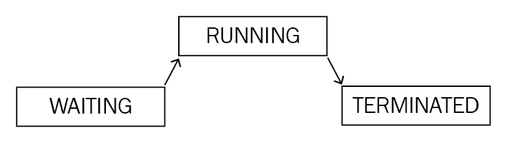

容器状态都有与之关联的时间戳，指示集群记录容器处于该状态的时间。如果经过了多个状态的处理，还会有一个最后状态字段。由于容器相当短暂，因此通常会看到先前状态为 Terminated，其中包括容器启动时间、完成时间、退出代码以及有关其终止原因的字符串条目。

以下是在您的 Pod 处理一段时间后容器状态的示例（在此示例中，经过多次更新后）：

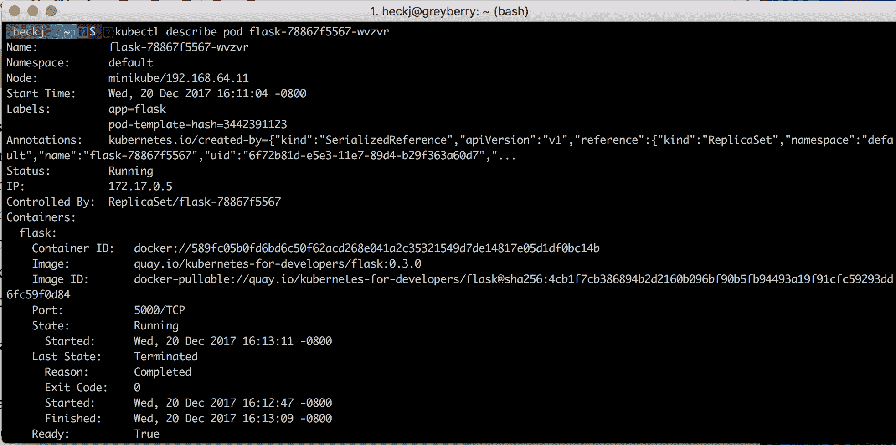

您可以在 `kubectl describe pod` 命令的输出中以人类可读的格式看到额外的详细信息，这通常是快速了解 Pod 内发生的情况最方便的方法。

所有状态都包含额外的信息，以提供正在发生的详细信息。API 中有一个正式的 PodStatus 对象可用。每个状态都有可用的额外详细信息，而且通常状态对象包括一系列常见的条件，这些条件通常在描述或原始 YAML 的输出中是可见的。

使用 `kubectl get pod ... -o yaml` 命令，您可以以机器可解析的形式看到数据，并且可以看到在 `describe` 命令中未公开的额外详细信息。在以下截图中，您可以看到与 Pod 和容器状态相关的输出，包括条件、容器状态和相关时间戳：

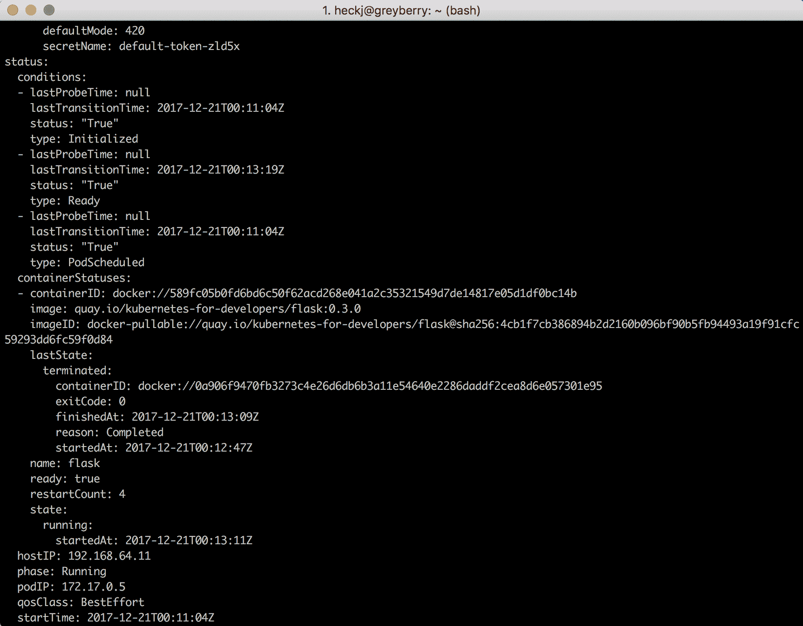

随着 Kubernetes 对象经历其生命周期，条件被添加到其状态中。

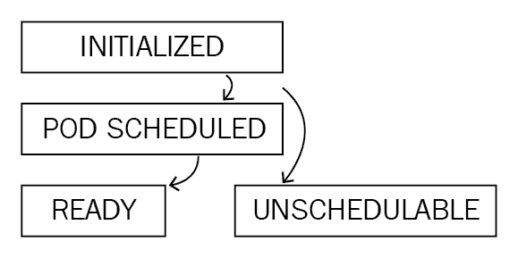

在 Pod 状态 pending 中，通常会添加两个条件：`Initialized` 和 `PodScheduled`。如果集群无法运行请求的 Pod，则可能会看到条件 `Unschedulable` 而不是 `PodScheduled`。当 Pod 处于 Running 状态时，还有一个与之相关的条件 **Ready**，它会影响 Kubernetes 对代码的管理。

# 部署、ReplicaSets 和 Pods

Pods 不是唯一利用和暴露条件的 Kubernetes 资源。部署也使用条件来表示详细信息，例如代码更新的部署进度以及部署的整体可用性。

在使用部署时，您将看到的两个条件是：

+   进展中

+   可用

当底层 Pod 的最小副本数可用时（默认为 1）时，Available 将为 true。当 ReplicaSets 及其相关的 Pods 被创建并且可用时，将设置 Progressing。

Kubernetes 在其内部资源之间的关系上使用了一致的模式。正如我们在前一章中讨论的那样，部署将有关联的副本集，而副本集将有关联的 Pod。您可以将此可视化为一系列对象，其中较高级别负责监视和维护下一级别的状态：

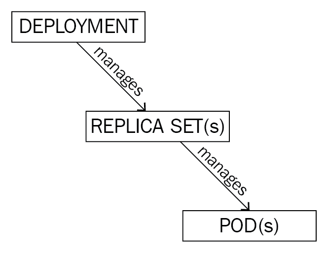

我们一直在关注 Pod 的状态及其生命周期，因为那里代表了代码并且实际在运行。在大多数情况下，您将创建一个部署，然后该部署将有自己的状态和条件。这将进而创建一个 ReplicaSet，而 ReplicaSet 将创建 Pod 或 Pods。

当正在创建一个 Pod 时，系统将首先尝试创建 API 资源本身，然后它将尝试在集群中找到一个运行它的位置。当资源已创建时，将向状态添加 Initialized 条件。当集群已确定在哪里运行 Pod 时，将添加 PodScheduled 条件。如果集群无法找到一个可以按照您描述的方式运行 Pod 的位置，则将向状态添加`Unschedulable`条件。

# 获取当前状态的快照

您可以使用`kubectl describe`或`kubectl get`命令查看 Kubernetes 对代码状态的当前快照。如果您只是想要交互式地查看状态，那么`kubectl describe`命令是最有价值的。请记住，Kubernetes 管理与运行代码相关的一系列对象，因此如果您想要查看完整的快照，您将需要查看每个对象的状态：部署、ReplicaSet 和 Pods。实际上，查看部署的状态，然后跳转到 Pods 通常会为您提供所需的任何细节。

您可以通过使用`kubectl get pod`查看 Pod 的原始数据，或者使用`describe`命令来查看 Kubernetes 对您的代码正在做什么。您需要查找`Status`和`Conditions`。例如，当我们之前创建了一个`nodejs`应用程序部署时，创建了一系列对象：

```
kubectl get deploy
NAME   DESIRED CURRENT UP-TO-DATE AVAILABLE AGE
nodejs 1       1       1          1         8h
```

```
kubectl get rs
NAME              DESIRED CURRENT READY AGE
nodejs-6b9b87d48b 1       1       1     8h
```

```
kubectl get pod
NAME                    READY STATUS  RESTARTS AGE
nodejs-6b9b87d48b-ddhjf 1/1   Running 0        8h
```

您可以使用`kubectl describe`命令查看部署的当前状态快照：

```
kubectl describe deploy nodejs
```

这将呈现类似于以下信息：

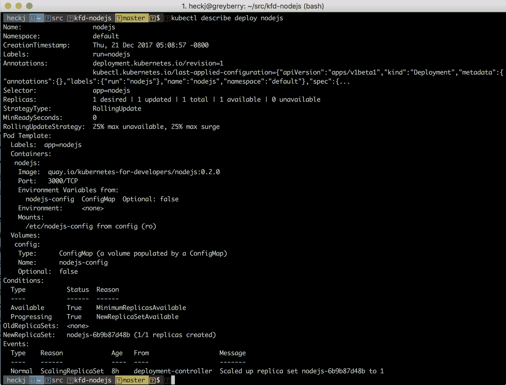

您可以使用`kubectl describe`通过查看 ReplicaSet 获取其他详细信息：

```
kubectl describe rs nodejskubectl describe deploy nodejs 
```

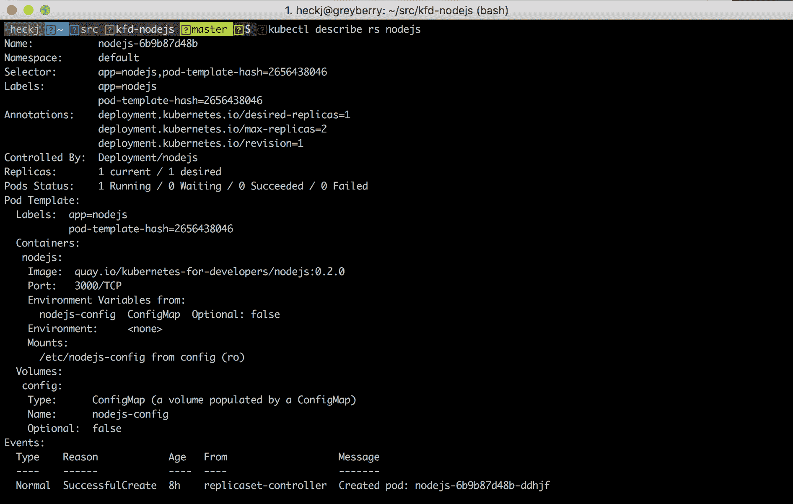

最后，再次使用它来查看部署和 ReplicaSet 创建的 Pod：

```
kubectl describe pod nodejs
```

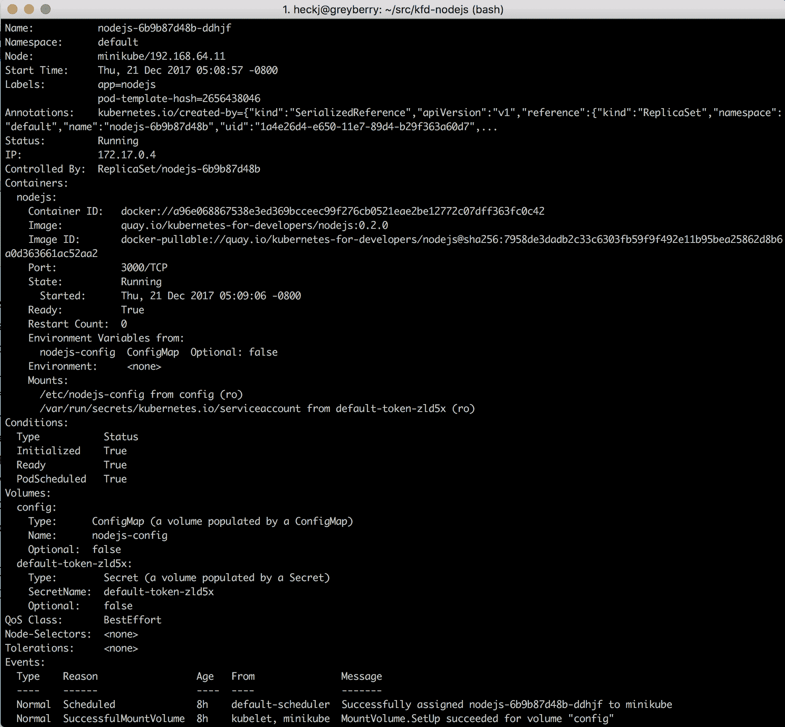

从`kubectl describe`输出底部列出的事件将显示与 Pod 相关的发生的顺序。

如果您想在脚本中使用状态，或者以其他方式使用程序解析输出，那么可以使用`kubectl get`命令，指定输出的数据格式，如 YAML。例如，可以使用以下命令检索 YAML 中的相同 Pod 输出：

```
 kubectl get pod nodejs-6b9b87d48b-lcgvd -o yaml
```

输出底部的状态键下将保存状态快照信息：

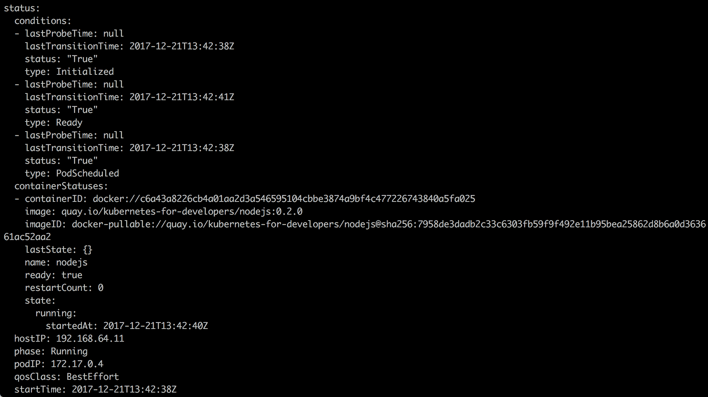

虽然在`kubectl describe`的输出中没有显示，但每个条件都有最后更新时间、上次更改时间、类型和状态。此外，每个容器都列有其自己的状态。

您可以在未来的 Kubernetes 版本中看到的 Pod 条件列表可能会增加，今天包括以下内容：

+   **PodScheduled**：当 Pod 已在节点上调度并且开始将其加载到节点上的过程时转换为 true。

+   已初始化：当 Pod 的所有容器已加载，并且定义的任何初始化容器已运行完成时，将标记为 true。

+   **Ready**：Pod 已根据规范加载和启动。在就绪探测和存活探测成功完成（如果定义了任一或两者），此值不会标记为 true。

+   **Unschedulable**：当 Kubernetes 集群无法将可用资源与 Pod 的需求匹配时，将列出并断言此条件。

有时状态（例如`Succeeded`或`Failed`）还会包括一个`Reason`，其中包括一些文本输出，旨在使理解发生了什么变得更容易。正如您可以从前面的输出中看到的那样，所有状态更改都包括时间戳。由于这是一个时间点的快照，时间戳可以提供线索，以了解发生的顺序以及多久之前发生的。

最后需要注意的是，与 Pod 相关的事件通常会提供有用的描述性注释，说明在启动 Pod 时发生了什么（或者未发生什么）。利用从描述、Pod 状态、条件和事件中提供的所有细节，可以提供最佳的状态更新，这些更新是 Pod 日志之外的外部状态更新。

Pod 的生命周期还包括您可以指定的钩子或反馈机制，以允许您的应用程序提供有关其运行情况的反馈。其中一个机制是`Ready`条件，您之前已经见过。Kubernetes 允许您的应用程序提供特定的反馈，以确定它是否准备好接受流量，以及它的健康状况。这些反馈机制称为**探针**，可以选择在 Pod 规范中定义。

# 探针

Kubernetes 中启用的两种探针是存活探针和就绪探针。它们是互补的，但在意图和用法上有所不同，并且可以为 Pod 中的每个容器定义。

# 存活探针

最基本的探针是存活探针。如果定义了存活探针，它将提供一个命令或 URL，Kubernetes 可以使用它来确定 Pod 是否仍在运行。如果调用成功，Kubernetes 将假定容器是健康的；如果未能响应，则可以根据定义的`restartPolicy`来处理 Pod。结果是二进制的：要么探针成功，Kubernetes 认为您的 Pod 正在运行，要么失败，Kubernetes 认为您的 Pod 不再可用。在后一种情况下，它将根据定义的 RestartPolicy 来选择要执行的操作。

`restartPolicy`的默认值为`Always`，这意味着如果 Pod 中的容器失败，Kubernetes 将始终尝试重新启动它。您可以定义的其他值包括`OnFailure`和`Never`。当容器重新启动时，Kubernetes 将跟踪重新启动发生的频率，并且如果它们在快速连续发生，则会减慢重新启动的频率，最多在重新启动尝试之间间隔五分钟。重新启动次数在`kubectl describe`的输出中作为`restartcount`进行跟踪和可见，并且在`kubectl get`的数据输出中作为`restartCount`键进行跟踪。

如果未明确定义存活探针，则假定探针将成功，并且容器将自动设置为活动状态。如果容器本身崩溃或退出，Kubernetes 将做出反应并根据`restartPolicy`重新启动它，但不会进行其他活动检查。这允许您处理代码已经冻结或死锁并且不再响应的情况，即使进程仍在运行。

可以定义存活探针来通过以下三种方法检查 Pod 的健康状况：

+   `ExecAction`：这在 Pod 内部调用命令以获取响应，并且该命令调用的退出代码的结果用于存活检查。除`0`之外的任何结果都表示失败。

+   `TCPSocketAction`：这尝试打开一个套接字，但除了尝试打开它之外，不会操作或与套接字交互。如果套接字打开，则探针成功，如果失败或在超时后失败，则探针失败。

+   `HTTPGetAction`：类似于套接字选项，这将作为指定的 URI 对您的 Pod 进行 HTTP 连接，并且 HTTP 请求的响应代码用于确定存活探针的成功/失败。

还有许多变量可以配置此探针的具体内容：

+   `activeDeadlineSeconds`（默认情况下未设置）：此值通常与作业一起使用，而不是长时间运行的 Pod，以对作业的最长运行时间设置最大限制。此数字将包括初始化容器所花费的任何时间，稍后在本章中将进一步讨论这一点。

+   `initialDelaySeconds`（默认情况下未设置）：这允许您指定在开始探测检查之前的秒数。默认情况下未设置，因此实际上默认为 0 秒。

+   `timeoutSeconds`（默认为 1）：如果命令或 URL 请求需要很长时间才能返回，这提供了一个超时。如果超时在命令返回之前到期，则假定它已失败。

+   `periodSeconds`（默认为 10）：这定义了 Kubernetes 运行探测的频率——无论是调用命令、检查套接字可用性还是进行 URL 请求。

+   `successThreshold`（默认为 1）：这是探测需要返回成功的次数，以便将容器的状态设置为“活动”。

+   `failureThreshold`（默认为 3）：这是触发将容器标记为不健康的探测的最小连续失败次数。

如果您定义一个 URL 来请求并将其他所有内容保持默认状态，正常模式将需要三个失败响应——超时或非 200 响应代码——然后才会考虑将容器标记为“死亡”并应用`restartPolicy`。默认情况下，每次检查间隔为 10 秒，因此在这些默认情况下，您的容器在系统应用`restartPolicy`之前可能会死亡长达 30 秒。

如果您正在使用基于 HTTP 的探测，可以在进行 HTTP 请求时定义许多其他变量。

+   `host`：默认为 Pod IP 地址。

+   `scheme`：HTTP 或 https。Kubernetes 1.8 默认为 HTTP

+   `path`：URI 请求的路径。

+   `HttpHeaders`：要包含在请求中的任何自定义标头。

+   `port`：进行 HTTP 请求的端口。

# 就绪探测

第二个可用的探测是就绪探测，通常与活跃探测并行使用。就绪探测只有在应用程序准备好并能够处理正常请求时才会做出积极响应。例如，如果您希望等待直到数据库完全可操作，或者预加载一些可能需要几秒钟的缓存，您可能不希望在这些操作完成之前对就绪探测返回积极响应。

与活跃探测一样，如果未定义，则系统会假定一旦您的代码运行，它也准备好接受请求。如果您的代码需要几秒钟才能完全运行，那么定义和利用就绪探测是非常值得的，因为这将与任何服务一起自动更新端点，以便在无法处理流量时不会将流量路由到实例。

配置就绪探针的相同选项可用，其中之一是 `ExecAction`、`TCPSocketAction` 或 `HTTPGetAction`。与存活探针一样，可以使用相同的变量来调整探针请求的频率、超时以及触发状态更改的成功和/或失败次数。如果您修改了存活探针中的值，那么您可能不希望将就绪探针设置为比存活探针更频繁。

作为提醒，当就绪探针失败时，容器不会自动重新启动。如果您需要该功能，您应该使用存活探针。就绪探针专门设置为允许 Pod 指示它尚不能处理流量，但它预计很快就能够。随着探针的更新，Pod 状态将被更新为设置 Ready 为正或负，并且相关的 Ready 条件也将被更新。随着这一过程的发生，使用此 Pod 的任何服务都将收到这些更新的通知，并将根据就绪值更改发送流量（或不发送）。

您可以将就绪探针视为断路器模式的实现，以及负载分担的一种手段。在运行多个 Pod 的情况下，如果一个实例过载或出现一些临时条件，它可以对就绪探针做出负面响应，Kubernetes 中的服务机制将把任何进一步的请求转发到其他 Pod。

# 向我们的 Python 示例添加探针

与以前的示例一样，代码在 GitHub 中可用在 [`github.com/kubernetes-for-developers/kfd-flask`](https://github.com/kubernetes-for-developers/kfd-flask) 项目中。[我不会展示所有更改，但您可以使用此命令从分支 `0.3.0` 检出代码：`git checkout 0.3.0`。从该代码构建的 Docker 镜像同样可以在 `quay.io` 仓库的 `0.3.0` 标签下找到。](https://github.com/kubernetes-for-developers/kfd-flask)

在此更新中，该项目包括了 Redis 的辅助部署，以匹配上一章中的一些概念。部署的规范也已更新，特别添加了存活探针和就绪探针。更新后的部署规范现在如下：

```
apiVersion: apps/v1beta1
kind: Deployment
metadata:
 name: flask
 labels:
 run: flask
spec:
 template:
 metadata:
 labels:
 app: flask
 spec:
 containers:
 - name: flask
 image: quay.io/kubernetes-for-developers/flask:0.3.0
 imagePullPolicy: Always
 ports:
 - containerPort: 5000
 envFrom:
 - configMapRef:
 name: flask-config
 volumeMounts:
 - name: config
 mountPath: /etc/flask-config
 readOnly: true
 livenessProbe:
 httpGet:
 path: /alive
 port: 5000
 initialDelaySeconds: 1
 periodSeconds: 5
 readinessProbe:
 httpGet:
 path: /ready
 port: 5000
 initialDelaySeconds: 5
 periodSeconds: 5
 volumes:
 - name: config
 configMap:
 name: flask-config
```

探针以粗体显示。两个探针都使用与应用程序的其余部分相同的端口（`5000`），以及它们自己各自的端点。就绪探针设置为延迟一秒开始检查，就绪探针设置为延迟五秒开始检查，两者都设置为稍微更紧密的频率，为五秒。

Python 代码也已经更新，主要是为了实现响应于就绪和活动探针的`/alive`和`/ready`方法。

就绪探针是最简单的，只是回复一个静态响应，仅保留底层 flask 代码对 HTTP 请求的响应验证：

```
@app.route('/alive')
def alive():
 return "Yes"
```

就绪探针扩展了这种模式，但在回复肯定之前验证了底层服务（在本例中为 Redis）是否可用和响应。这段代码实际上并不依赖于 Redis，但在您自己的代码中，您可能依赖于远程服务可用，并且有一些方法可以指示该服务是否可用和响应。如前所述，这实际上是断路器模式的一种实现，并且与服务构造一起，允许 Kubernetes 帮助将负载定向到可以响应的实例。

在这种情况下，我们利用了 Python 库中公开的`redis ping()`功能：

```
@app.route('/ready')
def ready():
 if redis_store.ping():
 return "Yes"
 else:
 flask.abort(500)
```

代码中的其他更新初始化了代码中的`redis_store`变量，并将 DNS 条目添加到`configMap`中，以便应用程序代码可以使用它。

# 运行 Python 探针示例

如果您查看`0.3.0`分支，您可以调查此代码并在您自己的 Minikube 实例或另一个 Kubernetes 集群中本地运行它。要查看代码：

```
git clone https://github.com/kubernetes-for-developers/kfd-flask

cd kfd-flask

git checkout 0.3.0

kubectl apply -f deploy/
```

最后一个命令将创建`redis-master`的服务和部署，以及 Python/flask 代码的服务、configmap 和部署。然后，您可以使用`kubectl describe`命令查看定义的探针及其值：

```
kubectl describe deployment flask
```

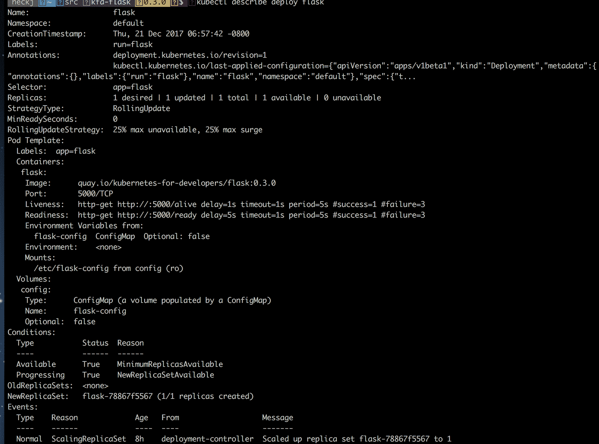

您还可以查看正在运行的单个 flask Pod 的日志，并查看正在处理的请求：

```
kubectl log deployment/flask
```

```
 * Running on http://0.0.0.0:5000/ (Press CTRL+C to quit)
 * Restarting with stat
 * Debugger is active!
 * Debugger PIN: 177-760-948
172.17.0.1 - - [21/Dec/2017 14:57:50] "GET /alive HTTP/1.1" 200 -
172.17.0.1 - - [21/Dec/2017 14:57:53] "GET /ready HTTP/1.1" 200 -
172.17.0.1 - - [21/Dec/2017 14:57:55] "GET /alive HTTP/1.1" 200 -
172.17.0.1 - - [21/Dec/2017 14:57:58] "GET /ready HTTP/1.1" 200 -
172.17.0.1 - - [21/Dec/2017 14:58:00] "GET /alive HTTP/1.1" 200 -
172.17.0.1 - - [21/Dec/2017 14:58:03] "GET /ready HTTP/1.1" 200 -
172.17.0.1 - - [21/Dec/2017 14:58:05] "GET /alive HTTP/1.1" 200 -
172.17.0.1 - - [21/Dec/2017 14:58:08] "GET /ready HTTP/1.1" 200 -
172.17.0.1 - - [21/Dec/2017 14:58:10] "GET /alive HTTP/1.1" 200 -
172.17.0.1 - - [21/Dec/2017 14:58:13] "GET /ready HTTP/1.1" 200 -
172.17.0.1 - - [21/Dec/2017 14:58:15] "GET /alive HTTP/1.1" 200 -
172.17.0.1 - - [21/Dec/2017 14:58:18] "GET /ready HTTP/1.1" 200 -
172.17.0.1 - - [21/Dec/2017 14:58:20] "GET /alive HTTP/1.1" 200 -
172.17.0.1 - - [21/Dec/2017 14:58:23] "GET /ready HTTP/1.1" 200 -
172.17.0.1 - - [21/Dec/2017 14:58:25] "GET /alive HTTP/1.1" 200 -
172.17.0.1 - - [21/Dec/2017 14:58:28] "GET /ready HTTP/1.1" 200 -
172.17.0.1 - - [21/Dec/2017 14:58:30] "GET /alive HTTP/1.1" 200 -
172.17.0.1 - - [21/Dec/2017 14:58:33] "GET /ready HTTP/1.1" 200 -
172.17.0.1 - - [21/Dec/2017 14:58:35] "GET /alive HTTP/1.1" 200 -
172.17.0.1 - - [21/Dec/2017 14:58:38] "GET /ready HTTP/1.1" 200 -
172.17.0.1 - - [21/Dec/2017 14:58:40] "GET /alive HTTP/1.1" 200 -
172.17.0.1 - - [21/Dec/2017 14:58:43] "GET /ready HTTP/1.1" 200 -
172.17.0.1 - - [21/Dec/2017 14:58:45] "GET /alive HTTP/1.1" 200 -
172.17.0.1 - - [21/Dec/2017 14:58:48] "GET /ready HTTP/1.1" 200 -
...
```

# 向我们的 Node.js 示例添加探针

向基于 Node.js/express 的应用程序添加示例探测与 Python 应用程序完全相同的模式。与 Python 示例一样，此代码和规范可在 GitHub 的[`github.com/kubernetes-for-developers/kfd-nodejs`](https://github.com/kubernetes-for-developers/kfd-nodejs)项目下的分支`0.3.0`中找到。

探测器向 Node.js 部署添加了几乎相同的规范：

```
livenessProbe:
  httpGet:
  path: /probes/alive
  port: 3000
  initialDelaySeconds: 1
  periodSeconds: 5 readinessProbe:   httpGet:
  path: /probes/ready
  port: 3000
  initialDelaySeconds: 5
  periodSeconds: 5
```

在这种情况下，探测器请求与应用程序提供的相同的 HTTP 响应和相同的端口。URI 路径更长，利用了应用程序的结构，该结构使用单个代码段用于特定 URI 下的路由，因此我们能够将就绪性和存活性探测器捆绑到一个新的`probes.js`路由中。

主应用程序已更新以创建一个探测器路由并在应用程序启动时绑定它，然后路由本身的代码提供响应。

`probes.js`的代码如下：

```
var express = require('express');
var router = express.Router();
var util = require('util');
var db = require('../db');

/* GET liveness probe response. */
router.get('/alive', function(req, res, next) {
 res.send('yes');
});

/* GET readiness probe response. */
router.get('/ready', async function(req, res, next) {
 try {
 let pingval = await db.ping()
 if (pingval) {
 res.send('yes');
 } else {
 res.status(500).json({ error: "redis.ping was false" })
 }
 } catch (error) {
 res.status(500).json({ error: error.toString() })
 }
});

module.exports = router;
```

与前面的 Python 示例一样，存活性探测返回静态响应，仅用于验证`express`是否仍然响应 HTTP 请求。就绪性探测更为复杂，它在异步等待/捕获中包装了`db.ping()`并检查其值。如果为负，或发生错误，则返回`500`响应。如果为正，则返回静态的积极结果。

使用`kubectl describe deployment nodejs`将显示配置，其中包含操作探测器，非常类似于 Python 示例，而`kubectl log nodejs-65498dfb6f-5v7nc`将显示来自探测器的请求得到了响应：

```
GET /probes/alive 200 1.379 ms - 3
Thu, 21 Dec 2017 17:43:51 GMT express:router dispatching GET /probes/ready
Thu, 21 Dec 2017 17:43:51 GMT express:router query : /probes/ready
Thu, 21 Dec 2017 17:43:51 GMT express:router expressInit : /probes/ready
Thu, 21 Dec 2017 17:43:51 GMT express:router logger : /probes/ready
Thu, 21 Dec 2017 17:43:51 GMT express:router jsonParser : /probes/ready
Thu, 21 Dec 2017 17:43:51 GMT express:router urlencodedParser : /probes/ready
Thu, 21 Dec 2017 17:43:51 GMT express:router cookieParser : /probes/ready
Thu, 21 Dec 2017 17:43:51 GMT express:router serveStatic : /probes/ready
Thu, 21 Dec 2017 17:43:51 GMT express:router router : /probes/ready
Thu, 21 Dec 2017 17:43:51 GMT express:router dispatching GET /probes/ready
Thu, 21 Dec 2017 17:43:51 GMT express:router trim prefix (/probes) from url /probes/ready
Thu, 21 Dec 2017 17:43:51 GMT express:router router /probes : /probes/ready
Thu, 21 Dec 2017 17:43:51 GMT express:router dispatching GET /ready
GET /probes/ready 200 1.239 ms - 3
Thu, 21 Dec 2017 17:43:54 GMT express:router dispatching GET /probes/alive
Thu, 21 Dec 2017 17:43:54 GMT express:router query : /probes/alive
Thu, 21 Dec 2017 17:43:54 GMT express:router expressInit : /probes/alive
Thu, 21 Dec 2017 17:43:54 GMT express:router logger : /probes/alive
Thu, 21 Dec 2017 17:43:54 GMT express:router jsonParser : /probes/alive
Thu, 21 Dec 2017 17:43:54 GMT express:router urlencodedParser : /probes/alive
Thu, 21 Dec 2017 17:43:54 GMT express:router cookieParser : /probes/alive
Thu, 21 Dec 2017 17:43:54 GMT express:router serveStatic : /probes/alive
Thu, 21 Dec 2017 17:43:54 GMT express:router router : /probes/alive
Thu, 21 Dec 2017 17:43:54 GMT express:router dispatching GET /probes/alive
Thu, 21 Dec 2017 17:43:54 GMT express:router trim prefix (/probes) from url /probes/alive
Thu, 21 Dec 2017 17:43:54 GMT express:router router /probes : /probes/alive
Thu, 21 Dec 2017 17:43:54 GMT express:router dispatching GET /alive
GET /probes/alive 200 1.361 ms - 3
```

我们可以通过终止 Redis 服务来测试就绪性探测的操作。如果我们调用以下命令：

```
kubectl delete deployment redis-master
```

`kubectl get pods`的结果很快就会显示 Pod 是活动的，但不是`ready`的：

```
kubectl get pods
NAME                         READY STATUS      RESTARTS AGE
nodejs-65498dfb6f-5v7nc      0/1   Running     0        8h
redis-master-b6b8774f9-sjl4w 0/1   Terminating 0        10h
```

当`redis-master`部署关闭时，您可以从 Node.js 部署中获取一些有趣的细节。使用`kubectl describe`来显示部署：

```
kubectl describe deploy nodejs
```

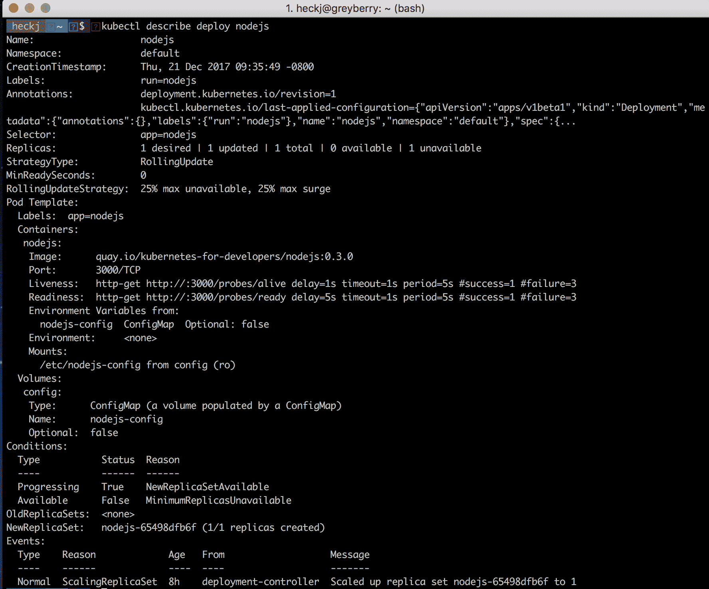

并使用`kubectl describe`来查看相关的 Pods：

```
kubectl describe pod nodejs
```

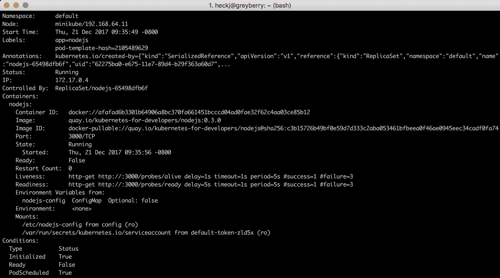

请注意，`Condition Ready`现在是`false`，而 Node.js 容器的状态为`Running`，但`Ready`为`False`。

如果重新创建或恢复 Redis 部署，则服务将像您期望的那样全部恢复在线。

# 容器生命周期钩子

Kubernetes 还提供了一些在每个容器的生命周期中可以在容器的设置和拆卸时间使用的钩子。这些称为容器生命周期钩子，为每个容器定义，而不是为整个 Pod 定义。当您想要为 Pod 中的多个容器配置一些特定于容器的附加功能时，这些钩子非常有用。

每个容器可以定义两个钩子：post-start 和 pre-stop。post-start 和 pre-stop 钩子预期至少被调用一次，但 Kubernetes 不保证这些钩子只会被调用一次。这意味着虽然可能很少见，post-start 或 pre-stop 钩子可能会被调用多次。

这些钩子都不接受参数，并且以与容器运行命令相同的方式定义。当使用时，它们预期是自包含的、相对短暂的命令，总是返回。当这些钩子被调用时，Kubernetes 暂停对容器的管理，直到钩子完成并返回。因此，对于这些钩子调用的可执行文件不要挂起或无限运行至关重要，因为 Kubernetes 没有一种方式来监视这种情况并响应无法完成或返回值的失败。

在 post-start 的情况下，容器状态直到 post-start 钩子完成之前不会转移到运行状态。post-start 钩子也不能保证在容器的主要命令之前或之后被调用。在 pre-stop 的情况下，容器直到 pre-stop 钩子完成并返回后才会被终止。

这两个钩子可以使用 Exec 和 HTTP 两种处理程序之一来调用：Exec 在容器内部以及与容器相同的进程空间中运行特定命令，就像使用`kubectl exec`一样。HTTP 处理程序设置用于针对容器的 HTTP 请求。在任何情况下，如果钩子返回失败代码，容器将被终止。

这些钩子的日志不会在 Pod 事件或日志中公开。如果处理程序失败，它会广播一个事件，可以使用`kubectl describe`命令查看。这两个事件分别是`FailedPostStartHook`和`FailedPreStopHook`。

预停钩子在你想要外部命令被调用来干净地关闭运行中的进程时非常有用，比如调用 `nginx -s quit`。如果你正在使用别人的代码，尤其是它有一个比正确响应 SIGTERM 信号更复杂的关闭过程，这将特别有用。我们将在本章稍后讨论如何优雅地关闭 Kubernetes。

后启动钩子在你想要在容器内创建一个信号文件，或者在容器启动时调用 HTTP 请求时经常有用。更常见的情况是在主代码启动之前进行初始化或前置条件验证，而有另一个选项可用于该功能：初始化容器。

# 初始化容器

初始化容器是可以在你的 Pod 上定义的容器，并且将在定义它们之前的特定顺序中被调用，然后才会启动你的主容器（或容器）。初始化容器在 Kubernetes 1.6 版本中成为 Pod 规范的正常部分。

这些容器可以使用相同的容器镜像并简单地具有替代命令，但它们也可以使用完全不同的镜像，利用 Kubernetes Pod 共享网络和文件系统挂载的保证来进行初始化和设置工作，以便在主容器运行之前进行。这些容器还使用命名空间，因此它们可以获得主容器没有的特定访问权限；因此，它们可以访问主容器无法访问的 Kubernetes Secrets。

初始化容器预期具有可以运行到完成并以成功响应退出的代码。正如之前提到的，这些容器也按顺序调用，并不会并行运行；每个容器都必须在下一个容器启动之前完成。当所有容器都完成时，Kubernetes 初始化 Pod 并运行定义的容器（或容器）。如果初始化容器失败，那么 Pod 被认为已经失败，并且整个套件被终止（或更具体地说，根据 `restartPolicy` 处理）。

初始化容器允许您在运行主进程之前进行各种设置。您可能要做的一些例子包括编写主 Pod 容器需要的配置文件，验证服务在启动主容器之前是否可用和活动，检索和初始化内容，比如从 Git 存储库或文件服务中拉取数据供主容器使用，或者在启动主容器之前强制延迟。

在初始化容器运行时，Pod 状态将显示`Init:`，后面跟着一些初始化容器特定的状态。如果一切顺利，符合预期，它将报告列出的初始化容器数量以及已经完成运行的数量。如果初始化容器失败，那么`Init:`后面将跟着`Error`或`CrashLoopBackOff`。

初始化容器在 Pod 规范中被指定在与主容器相同级别的位置，并且作为一个列表，每个初始化容器都有自己的名称、镜像和要调用的命令。例如，我们可以在 Python flask 规范中添加一个`init`容器，它只会在 Redis 可用时才返回。一个例子可能是以下内容：

```
spec:
 template:
 metadata:
 labels:
 app: flask
 spec:
 containers:
 - name: flask
 image: quay.io/kubernetes-for-developers/flask:0.2.0
 ports:
 - containerPort: 5000
 envFrom:
 - configMapRef:
 name: flask-config
 volumeMounts:
 - name: config
 mountPath: /etc/flask-config
 readOnly: true
 volumes:
 - name: config
 configMap:
 name: flask-config
 initContainers:
      - name: init-myservice
 image: busybox
 command: ['sh', '-c', 'until nslookup redis-master; do echo waiting for redis; sleep 2; done;']
```

在这种情况下，初始化容器的代码只是一个在 shell 中编写的循环，检查是否有对`redis-master`的 DNS 条目的响应，并且会一直运行直到成功。如果在`redis-master`服务建立并具有相关的 DNS 条目之前查看 Pod，您将看到该 Pod 的状态列出为`Init:0/1`。

例如，`kubectl get pods`:

```
NAME                  READY STATUS   RESTARTS AGE
flask-f48f89687-8p8nj 0/1   Init:0/1 0        8h
```

```
kubectl describe deploy/flask
```

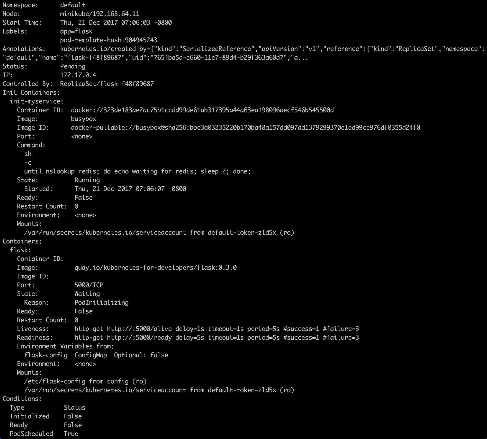

您可能会注意到，这个输出与之前的例子不匹配；在前面的输出中，命令是在寻找对`redis`的 DNS 响应，而我们将服务命名为`redis-service`。

在这种情况下，初始化容器将永远无法完成，Pod 将无限期地保持在`pending`状态。在这种情况下，您需要手动删除部署，或者如果您进行了修改以使其工作，您需要手动删除那些卡在初始化状态的 Pod，否则它们将无法被清理。

一旦初始化容器成功完成，您可以通过 Pod 的`kubectl describe`输出或者再次通过`kubectl get`命令暴露的数据来查看结果。

以下是你将从`kubectl describe`中看到的输出的扩展示例。

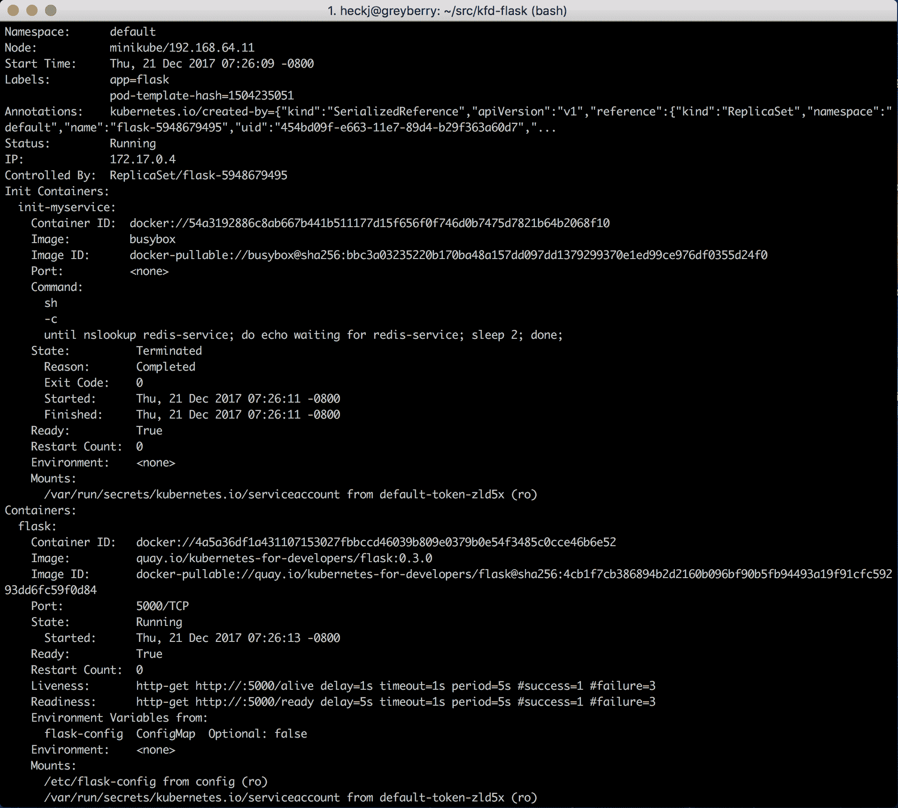

`describe`的输出超出了单个终端页面；你应该继续向下滚动以查看以下内容：

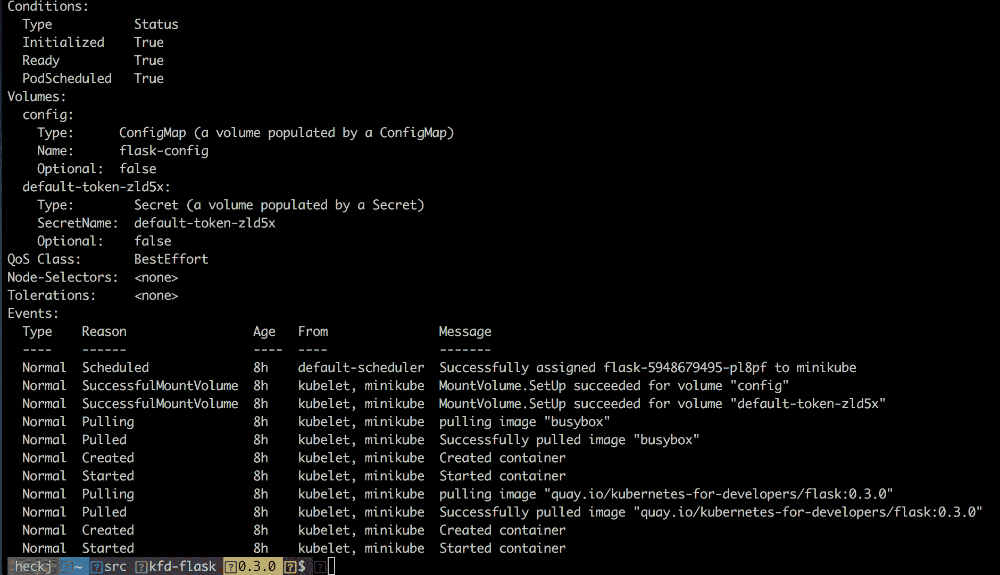

# 快速交互式测试

如果你试图创建一个快速的一行初始化容器，尤其是当你使用非常简化的容器比如`busybox`时，交互式地尝试命令通常是很有用的。你想要的命令可能不可用，所以最好快速尝试一下，以验证它是否能按你的期望工作。

要交互式地运行一个`busybox`容器，并在完成后删除它，你可以使用以下命令：

```
kubectl run tempinteractive -it --rm --restart=Never --image=busybox -- /bin/sh
```

然后在容器内尝试这个命令：

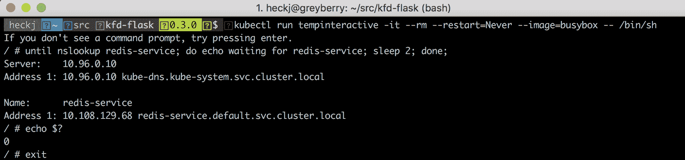

# 处理优雅的关闭

在生命周期钩子中，我们提到了可以定义和启用的 pre-stop 钩子，但如果你正在编写自己的代码，那么尊重 Kubernetes 用于告诉容器关闭的 SIGTERM 信号可能同样容易。

如果你不熟悉 SIGTERM，它是 Linux 内核支持的功能之一——用于向运行中的进程发送中断的一种方式。进程可以监听这些信号，你可以选择它们在接收到时如何响应。有两个信号是你不能“忽略”的，无论你实现了什么，操作系统都会强制执行：SIGKILL 和 SIGSTOP。Kubernetes 在想要关闭容器时使用的信号是 SIGTERM。

你将收到这个信号的事件类型不仅仅是错误或用户触发的删除，还包括当你使用部署所使用的滚动更新机制进行代码更新时。如果你利用了任何自动扩展功能，它也可能发生，这些功能可以动态增加（和减少）`replicaSet`中的副本数量。

当你响应这个信号时，通常会想要保存任何需要的状态，关闭任何连接，然后终止你的应用程序。

如果您正在创建一个其他人也会通过 Kubernetes 使用的服务，那么您可能想要做的第一件事之一是更改一个内部变量，以触发任何就绪探针以响应`false`，然后休眠几秒钟，然后进行任何最终操作和终止。这将允许 Kubernetes 中的服务构造重定向任何进一步的连接，并且所有活动连接都可以完成、排空并礼貌地关闭。

一旦 Kubernetes 发送信号，它就会启动一个计时器。该计时器的默认值为 30 秒，如果您需要或希望更长的值，可以在 Pod 规范中使用`terminateGracePeriodSeconds`的值进行定义。如果容器在计时器到期时尚未退出，Kubernetes 将尝试使用 SIGKILL 信号强制退出。

例如，如果您调用了`kubectl delete deploy nodejs`，然后看到 Pods 保持一段时间处于`Terminating`状态，那就是发生了这种情况。

# Python 中的 SIGTERM

例如，如果您想在 Python 中处理 SIGTERM，那么您可以导入 signal 模块并引用一个处理程序来执行任何您想要的操作。例如，一个简单的立即关闭并退出的代码可能是：

```
import signal
import sys

def sigterm_handler(_signo, _stack_frame):
    sys.exit(0)

signal.signal(signal.SIGTERM, sigterm_handler)
```

信号处理程序的逻辑可以像您的代码要求的那样复杂或简单。

# Node.js 中的 SIGTERM

例如，如果您想在 Node.js 中处理 SIGTERM，那么您可以使用在每个 Node.js 进程中隐式创建的 process 模块来处理信号并退出应用程序。与之前的 Python 示例相匹配，一个简单的关闭立即并退出的代码可能如下所示：

```
/**
 * SIGTERM handler to terminate (semi) gracefully
 */
process.on(process.SIGTERM, function() {
    console.log('Received SIGTERM signal, now shutting down...');
    process.exit(0);
})
```

# 总结

在这一章中，我们首先深入了解了 Pod 的生命周期和状态细节，展示了多种揭示相关细节的方式，并描述了 Kubernetes 在运行软件时的内部操作。然后，我们看了一下您的程序可以通过活跃性和就绪性探针提供的反馈循环，并回顾了在 Python 和 Node.js 中启用这些探针的示例。在探针和代码如何与 Kubernetes 清洁地交互之后，我们看了一下启动和初始化以及优雅关闭的常见情况。

在下一章中，我们将看一下如何使用 Kubernetes 和开源提供应用程序的基本可观察性，特别是监控和日志记录。
