# Kubernetes 中的后台处理

Kubernetes 包括对一次性（也称为批处理）计算工作的支持，以及支持异步后台工作的常见用例。在本章中，我们将介绍 Kubernetes 的作业概念及其邻居 CronJob。我们还将介绍 Kubernetes 如何处理和支持持久性，以及 Kubernetes 中可用的一些选项。然后，我们将介绍 Kubernetes 如何支持异步后台任务以及 Kubernetes 可以如何表示、操作和跟踪这些任务的方式。我们还将介绍如何设置从消息队列操作的工作代码。

本章涵盖的主题包括：

+   工作

+   CronJob

+   使用 Python 和 Celery 的工作队列示例

+   Kubernetes 中的持久性

+   有状态集

+   **自定义资源定义**（**CRD**）

# 工作

到目前为止，我们所涵盖的大部分内容都集中在持续运行的长期进程上。Kubernetes 还支持较短的、离散的软件运行。Kubernetes 中的作业专注于在一定时间内结束并报告成功或失败的离散运行，并构建在与长期运行软件相同的构造之上，因此它们在其核心使用 pod 规范，并添加了跟踪成功完成数量的概念。

最简单的用例是运行一个单独的 pod，让 Kubernetes 处理由于节点故障或重启而导致的任何故障。您可以在作业中使用的两个可选设置是并行性和完成。如果不指定并行性，默认值为`1`，一次只会安排一个作业。您可以将这两个值都指定为整数，以并行运行多个作业以实现多个完成，并且如果作业是从某种工作队列中工作，则可以不设置完成。

重要的是要知道，完成和并行设置并不是保证 - 因此 Pod 内的代码需要能够容忍多个实例运行。同样，作业需要能够容忍容器在容器失败时重新启动（例如，在使用`restartPolicy OnFailure`时），以及处理任何初始化或设置，如果在重新启动时发现自己在新的 Pod 上运行（这可能发生在节点故障的情况下）。如果作业使用临时文件、锁定或从本地文件进行工作，它应该在启动时验证状态，并且不应该假定文件始终存在，以防在处理过程中发生故障。

当作业运行完成时，系统不会创建更多的 Pod，但也不会删除 Pod。这样可以让您查询成功或失败的 Pod 状态，并查看 Pod 内容器的任何日志。已经完成的 Pod 不会出现在`kubectl get pods`的简单运行中，但如果您使用`-a`选项，它们将会出现。您需要删除已完成的作业，当您使用`kubectl delete`删除作业时，相关的 Pod 也将被删除和清理。

例如，让我们运行一个示例作业来看看它是如何工作的。一个简单的作业，只需打印`hello world`，可以使用以下 YAML 指定：

```
apiVersion: batch/v1 kind: Job metadata:
 name: helloworld spec:
 template: metadata: name: helloworld spec: containers: - name: simple image: busybox command: ["/bin/echo", "'hello world'"] restartPolicy: Never
```

然后，您可以使用`kubectl create`或`kubectl apply`来运行此作业：

```
kubectl apply -f simplejob.yaml
```

预期的`kubectl get jobs`命令将显示存在的作业及其当前状态。由于这个作业非常简单，它可能会在您运行命令查看其当前状态之前完成：

```
kubectl get jobs
```

```
NAME         DESIRED   SUCCESSFUL   AGE helloworld   1         1            3d
```

与 Pod 一样，您可以使用`kubectl describe`命令获取更详细的状态和输出：

```
kubectl describe job helloworld
```

```
Name:           helloworld Namespace:      default Selector:       controller-uid=cdafeb57-e7c4-11e7-89d4-b29f363a60d7 Labels:         controller-uid=cdafeb57-e7c4-11e7-89d4-b29f363a60d7
 job-name=helloworld Annotations:    kubectl.kubernetes.io/last-applied-configuration={"apiVersion":"batch/v1","kind":"Job","metadata":{"annotations":{},"name":"helloworld","namespace":"default"},"spec":{"backoffLimit":4,"template":{"met... Parallelism:    1 Completions:    1 Start Time:     Sat, 23 Dec 2017 01:36:50 -0800 Pods Statuses:  0 Running / 1 Succeeded / 0 Failed Pod Template:
 Labels:  controller-uid=cdafeb57-e7c4-11e7-89d4-b29f363a60d7 job-name=helloworld Containers: simple: Image:  busybox Port:   <none> Command: /bin/echo 'hello world' Environment:  <none> Mounts:       <none> Volumes:        <none> Events:
 Type    Reason            Age   From            Message ----    ------            ----  ----            ------- Normal  SuccessfulCreate  3d    job-controller  Created pod: helloworld-2b2xt
```

如果您运行`kubectl get pods`命令，您将看不到 Pod`helloworld-2b2xt`在 Pod 列表中，但运行`kubectl get pods -a`将显示 Pod，包括仍然存在的已完成或失败的 Pod：

```
NAME                           READY     STATUS      RESTARTS   AGE
```

```
helloworld-2b2xt               0/1       Completed   0          3d
```

如果您只是想亲自查看 Pod 的状态，可以使用`kubectl describe`获取详细信息，以人类可读的形式显示信息：

```
kubectl describe pod helloworld-2b2xt
```

这是一个示例：

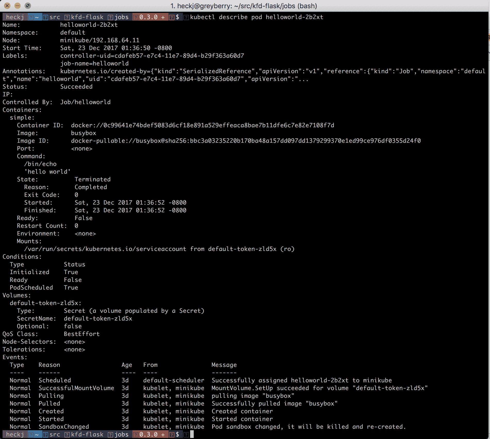

如果您像在此示例中一样使用 shell 脚本创建一个简单的作业，很容易出错。在这些情况下，默认情况是 Kubernetes 会重试运行 pod，使得 pod 在系统中处于失败状态供您查看。在这种情况下，设置一个退避限制可以限制系统重试作业的次数。如果您不指定此值，它将使用默认值为六次。

一个命令中的简单错误可能看起来像下面这样：

```
kubectl describe job helloworld
```

```
Name:           helloworld Namespace:      default Selector:       controller-uid=6693f83a-e7c7-11e7-89d4-b29f363a60d7 Labels:         controller-uid=6693f83a-e7c7-11e7-89d4-b29f363a60d7
 job-name=helloworld Annotations:    kubectl.kubernetes.io/last-applied-configuration={"apiVersion":"batch/v1","kind":"Job","metadata":{"annotations":{},"name":"helloworld","namespace":"default"},"spec":{"template":{"metadata":{"name":"h... Parallelism:    1 Completions:    1 Start Time:     Sat, 23 Dec 2017 01:55:26 -0800 Pods Statuses:  0 Running / 0 Succeeded / 6 Failed Pod Template:
 Labels:  controller-uid=6693f83a-e7c7-11e7-89d4-b29f363a60d7 job-name=helloworld Containers: simple: Image:  busybox Port:   <none> Command: /bin/sh echo 'hello world' Environment:  <none> Mounts:       <none> Volumes:        <none> Events:
 Type     Reason                Age   From           Message ----     ------                ----  ----            ------- Normal   SuccessfulCreate      3d    job-controller  Created pod: helloworld-sz6zj Normal   SuccessfulCreate      3d    job-controller  Created pod: helloworld-vtzh7 Normal   SuccessfulCreate      3d    job-controller  Created pod: helloworld-2gh74 Normal   SuccessfulCreate      3d    job-controller  Created pod: helloworld-dfggg Normal   SuccessfulCreate      3d    job-controller  Created pod: helloworld-z2llj Normal   SuccessfulCreate      3d    job-controller  Created pod: helloworld-69d4t Warning  BackoffLimitExceeded  3d    job-controller  Job has reach the specified backoff limit
```

并查看`pods`：

```
kubectl get pods -a
```

```
NAME               READY     STATUS    RESTARTS   AGE helloworld-2gh74   0/1       Error     0          3d helloworld-69d4t   0/1       Error     0          3d helloworld-dfggg   0/1       Error     0          3d helloworld-sz6zj   0/1       Error     0          3d helloworld-vtzh7   0/1       Error     0          3d helloworld-z2llj   0/1       Error     0          3d
```

每个 pod 的日志都将可用，因此您可以诊断出了什么问题。

如果您犯了一个错误，那么您可能会想要快速修改作业规范，并使用`kubectl apply`来修复错误。系统认为作业是不可变的，因此如果您尝试快速修复并应用它，将会收到错误。在处理作业时，最好删除作业并创建一个新的。

作业与 Kubernetes 中其他对象的生命周期无关，因此，如果您考虑使用作业来初始化持久性存储中的数据，请记住您需要协调运行该作业。在您希望在服务启动之前每次检查一些逻辑以预加载数据的情况下，最好使用初始化容器，就像我们在上一章中探讨的那样。

一些常见的适合作业的情况包括将备份加载到数据库中、创建备份、进行一些更深入的系统内省或诊断，或者运行超出带宽清理逻辑。在所有这些情况下，您希望知道您编写的函数已经完成，并且成功运行。在失败的情况下，您可能希望重试，或者仅仅通过日志了解发生了什么。

# CronJob

CronJobs 是建立在作业基础上的扩展，允许您指定它们运行的重复计划。该名称源自一个用于调度重复脚本的常见 Linux 实用程序`cron`。CronJobs 在 Kubernetes 版本 1.7 中是 alpha 版本，在版本 1.8 中转为 beta 版本，并且在版本 1.9 中仍然是 beta 版本。请记住，Kubernetes 规范可能会发生变化，但往往相当稳定，并且具有预期的 beta 实用性，因此 CronJobs 的 v1 版本可能会有所不同，但您可以期望它与本文提供的内容非常接近。

规范与作业密切相关，主要区别在于种类是 CronJob，并且有一个必需的字段 schedule，它接受一个表示运行此作业的时间的字符串。

此字符串的格式是五个数字，可以使用通配符。这些字段表示：

+   分钟（0-59）

+   小时（0-23）

+   月份的日期（1-31）

+   月份（1-12）

+   星期几（0-6）

`*`或？字符可以在这些字段中的任何一个中使用，表示任何值都可以接受。字段还可以包括`*/`和一个数字，这表示在一些间隔内定期发生的实例，由相关数字指定。这种格式的一些例子是：

+   `12 * * * *`：每小时在整点后 12 分钟运行

+   `*/5 * * * *`：每 5 分钟运行

+   每周六午夜运行

还有一些特殊的字符串可以用于一些更容易阅读的常见事件：

+   `@yearly`

+   `@monthly`

+   `@weekly`

+   `@daily`

+   ``@hourly``

CronJob 有五个额外的字段，可以指定，但不是必需的。与作业不同，CronJobs 是可变的（就像 pod、部署等一样），因此这些值可以在创建 CronJob 后更改或更新。

第一个是`startingDeadlineSeconds`，如果指定，将限制作业在 Kubernetes 未满足其指定的启动作业时间限制时可以启动的时间。如果时间超过`startingDeadlineSeconds`，该迭代将标记为失败。

第二个是`concurrencyPolicy`，它控制 Kubernetes 是否允许多个相同作业的实例同时运行。默认值为`Allow`，这将允许多个作业同时运行，备用值为`Forbid`和`Replace`。`Forbid`将在第一个作业仍在运行时将以下作业标记为失败，而`Replace`将取消第一个作业并尝试再次运行相同的代码。

第三个字段是`suspended`，默认值为`False`，可以用于暂停计划中作业的任何进一步调用。如果作业已经在运行，并且将`suspend`添加到 CronJob 规范中，那么当前作业将运行到完成，但不会安排任何进一步的作业。

第四和第五个字段是`successfulJobsHistoryLimit`和`failedJobsHistoryLimit`，默认值分别为`3`和`1`。默认情况下，Kubernetes 将清理超出这些值的旧作业，但保留最近的成功和失败，包括日志，以便根据需要进行检查。

创建 CronJob 时，您还需要选择（并在规范中定义）`restartPolicy`。CronJob 不允许`Always`的默认值，因此您需要在`OnFailure`和`Never`之间进行选择。

每分钟打印`hello world`的简单 CronJob 可能如下所示：

```
apiVersion: batch/v1beta1 kind: CronJob metadata:
 name: helloworld spec:
 schedule: "*/1 * * * *" jobTemplate: spec: template: spec: containers: - name: simple image: busybox command: ["/bin/sh", "-c", "echo", "'hello world'"] restartPolicy: OnFailure
```

使用`kubectl apply -f cronjob.yaml`创建此作业后，您可以使用`kubectl get cronjob`查看摘要输出：

```
NAME         SCHEDULE      SUSPEND   ACTIVE    LAST SCHEDULE   AGE helloworld   */1 * * * *   False     1         3d              3d
```

或者，使用`kubectl describe cronjob helloworld`查看更详细的输出：

```
Name:                       helloworld Namespace:                  default Labels:                     <none> Annotations:                kubectl.kubernetes.io/last-applied-configuration={"apiVersion":"batch/v1beta1","kind":"CronJob","metadata":{"annotations":{},"name":"helloworld","namespace":"default"},"spec":{"jobTemplate":{"spec":{"... Schedule:                   */1 * * * * Concurrency Policy:         Allow Suspend:                    False Starting Deadline Seconds:  <unset> Selector:                   <unset> Parallelism:                <unset> Completions:                <unset> Pod Template:
 Labels:  <none> Containers: simple: Image:  busybox Port:   <none> Command: /bin/sh -c echo 'hello world' Environment:     <none> Mounts:          <none> Volumes:           <none> Last Schedule Time:  Sat, 23 Dec 2017 02:46:00 -0800 Active Jobs:         <none> Events:
 Type    Reason            Age   From                Message ----    ------            ----  ----                ------- Normal  SuccessfulCreate  3d    cronjob-controller  Created job helloworld-1514025900 Normal  SawCompletedJob   3d    cronjob-controller  Saw completed job: helloworld-1514025900 Normal  SuccessfulCreate  3d    cronjob-controller  Created job helloworld-1514025960 Normal  SawCompletedJob   3d    cronjob-controller  Saw completed job: helloworld-1514025960
```

从此输出中，您可能会猜到 CronJob 实际上是根据您定义的时间表和规范中的模板创建作业。每个作业都基于 CronJob 的名称获得自己的名称，并且可以独立查看：

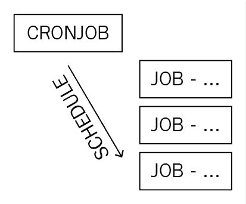

您可以使用`kubectl get jobs`命令查看从前面的 CronJob 定义的时间表创建的作业：

```
kubectl get jobs
```

```
NAME                    DESIRED   SUCCESSFUL   AGE helloworld-1514025900   1         1            3d helloworld-1514025960   1         1            3d **helloworld-1514026020   1         1            3d** 
```

您还可以使用`kubectl get pods`的`-a`选项查看从这些作业中创建并运行到完成的 Pod：

```
kubectl get pods -a
```

```
NAME                          READY     STATUS      RESTARTS   AGE helloworld-1514025900-5pj4r   0/1       Completed   0          3d helloworld-1514025960-ckshh   0/1       Completed   0          3d helloworld-1514026020-gjrfh   0/1       Completed   0          3d
```

# 使用 Python 和 Celery 的工作队列示例

CronJob 很适合在特定时间表上运行重复任务，但另一个常见的需求是更多或更少地不断处理一系列工作项。作业很适合运行单个任务直到完成，但如果需要处理的事务量足够大，保持不断的处理过程可能更有效。

适应这种工作的常见模式使用消息队列，如下所示：

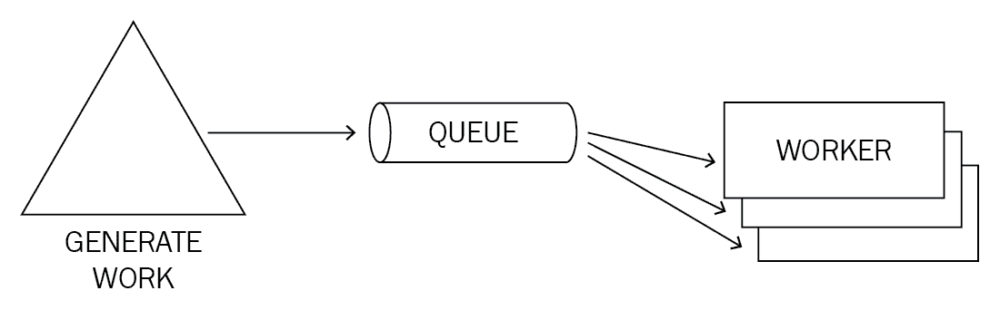

通过消息队列，您可以拥有一个 API 前端，用于异步创建要运行的工作，将其移动到队列中，然后有多个工作进程从队列中拉取相关工作。亚马逊有一个支持这种处理模式的基于 Web 的服务，称为**简单队列服务**（**SQS**）。这种模式的巨大好处是将工作人员与请求解耦，因此您可以根据需要独立扩展每个部分。

您可以在 Kubernetes 中做完全相同的事情，将队列作为服务运行，并将连接到该队列的工作程序作为部署。Python 有一个流行的框架 Celery，它可以从消息中进行后台处理，支持多种队列机制。我们将看看如何设置一个示例队列和工作进程，以及如何在 Kubernetes 中利用 Celery 这样的框架。

# Celery worker example

Celery 自 2009 年以来一直在开发和使用，早于 Kubernetes 存在。它是为了部署在多台机器上而编写的。这在我们的示例中可以很好地转化为容器。您可以在[`docs.celeryproject.org/en/latest/`](http://docs.celeryproject.org/en/latest/)获取有关 Celery 的更多详细信息。

在这个例子中，我们将设置一个包含 RabbitMQ 部署和我们自己的容器**celery-worker**的部署，用来处理来自该队列的作业：

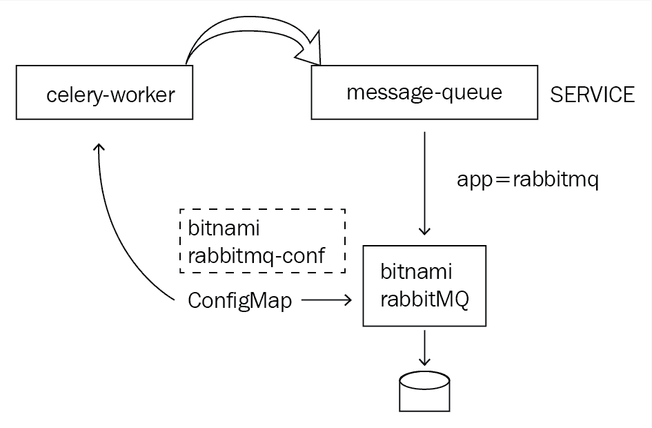

此示例的部署和源代码可在 GitHub 上找到[`github.com/kubernetes-for-developers/kfd-celery/`](https://github.com/kubernetes-for-developers/kfd-celery/)。您可以使用以下命令获取此代码：

```
git clone https://github.com/kubernetes-for-developers/kfd-celery -b 0.4.0 cd kfd-celery
```

# RabbitMQ 和配置

此示例使用了一个包含 Bitnami 的 RabbitMQ 的容器。该镜像的源代码可在[`github.com/bitnami/bitnami-docker-rabbitmq`](https://github.com/bitnami/bitnami-docker-rabbitmq)找到，并且容器镜像公开托管在 DockerHub 上[`hub.docker.com/r/bitnami/rabbitmq/`](https://hub.docker.com/r/bitnami/rabbitmq/)。

RabbitMQ 有大量可用的选项，以及多种部署方式，包括集群支持 HA。在这个例子中，我们使用了一个单一的 RabbitMQ 副本在部署中支持名为`message-queue`的服务。我们还设置了一个`ConfigMap`，其中包含一些我们可能想要调整的变量，尽管在这个例子中，这些值与容器内的默认值相同。该部署确实使用了持久卷，以便在发生故障时为队列启用持久性。我们将在本章后面详细介绍持久卷以及如何使用它们。

我们创建的`ConfigMap`将被 RabbitMQ 容器和我们的工作程序部署使用。`ConfigMap`名为`queue-config.yaml`，内容如下：

```
--- apiVersion: v1 kind: ConfigMap metadata:
  name: bitnami-rabbitmq-config data:
  RABBITMQ_USERNAME: "user"
  RABBITMQ_PASSWORD: "bitnami"
  RABBITMQ_VHOST: "/"
  RABBITMQ_NODE_PORT_NUMBER: "5672"
  RABBITMQ_MANAGER_PORT_NUMBER: "15672"
  WORKER_DEBUG_LEVEL: "info"
```

要部署它，您可以使用以下命令：

```
kubectl apply -f deploy/queue-config.yaml
```

```
configmap "bitnami-rabbitmq-config" created
```

`ConfigMap`是基于 Bitnami RabbitMQ 容器的文档创建的，该容器支持通过环境变量设置许多配置项。您可以在 Docker Hub 网页或 GitHub 源中查看容器可以接受的所有细节。在我们的情况下，我们设置了一些最常见的值。

**注意**：您可能希望使用密钥而不是在`ConfigMap`中包含值来更正确地设置用户名和密码。

您可以查看部署的规范：

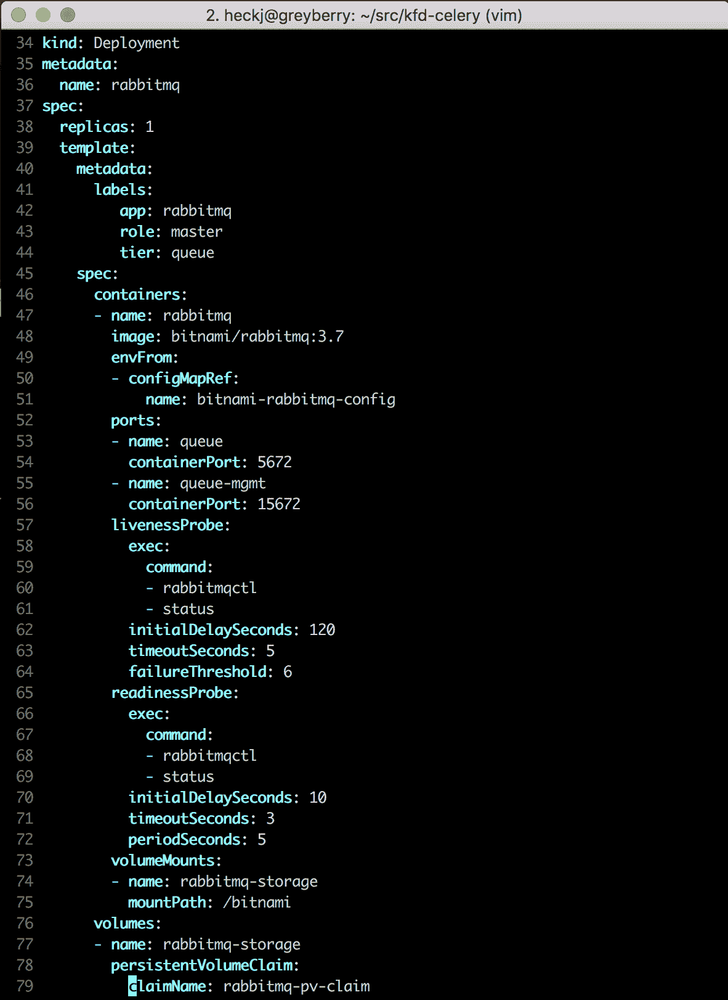

这是如何部署实例的：

```
kubectl apply -f deploy/rabbitmq.yml service "message-queue" created persistentvolumeclaim "rabbitmq-pv-claim" created deployment "rabbitmq" created
```

# Celery worker

为了创建一个 worker，我们制作了一个非常类似于 Flask 容器的自己的容器镜像。Dockerfile 使用 Alpine Linux，并明确将 Python 3 加载到该镜像中，然后从`requirements.txt`文件安装要求，并添加了两个 Python 文件。第一个`celery_conf.py`是直接从 Celery 文档中获取的一些任务的 Python 定义。第二个`submit_tasks.py`是一个简短的示例，旨在交互式运行以创建工作并将其发送到队列中。容器还包括两个 shell 脚本：`run.sh`和`celery_status.sh`。

在所有这些情况下，我们使用了从前面的`ConfigMap`中获取的环境变量来设置 worker 的日志输出，以及与 Kubernetes 内的 RabbitMQ 通信的主机、用户名和密码。

Dockerfile 使用`run.sh`脚本作为其命令，因此我们可以使用此 shell 脚本设置任何环境变量并调用 Celery。因为 Celery 最初是作为一个命令行工具编写的，所以使用 shell 脚本来设置和调用您想要的内容非常方便。以下是对`run.sh`的更详细介绍：

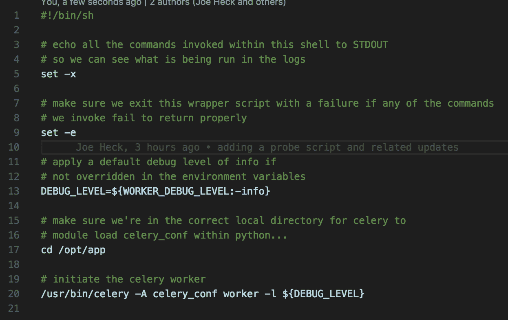

该脚本设置了两个 shell 脚本选项，`-e`和`-x`。第一个（`-e`）是为了确保如果我们在脚本中犯了拼写错误或命令返回错误，脚本本身将返回错误。第二个（`-x`）将在`STDOUT`中回显脚本中调用的命令，因此我们可以在容器日志输出中看到它。

下一行中的`DEBUG_LEVEL`使用 shell 查找默认环境变量：`WORKER_DEBUG_LEVEL`。如果设置了，它将使用它，而`WORKER_DEBUG_LEVEL`是早期添加到`ConfigMap`中的。如果值未设置，它将使用默认值`info`，因此如果`ConfigMap`中缺少该值，我们仍将在此处有一个合理的值。

如前所述，Celery 是作为命令行实用程序编写的，并利用 Python 的模块加载来完成其工作。 Python 模块加载包括从当前目录工作，因此我们明确更改为包含 Python 代码的目录。最后，脚本调用命令启动 Celery worker。

我们在脚本`celery_status.sh`中使用类似的结构，该脚本用于提供用于 worker 容器的活动性和可用性探针的 exec 命令，其关键思想是如果命令`celery status`返回而不出现错误，则容器正在有效地与 RabbitMQ 通信，并且应完全能够处理任务。

包含将被调用的逻辑的代码都在`celery_conf.py`中：

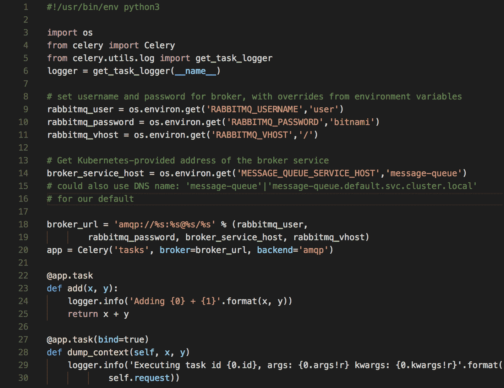

您可以看到，我们再次利用环境变量来获取与 RabbitMQ 通信所需的值（主机名、用户名、密码和`vhost`），并从环境变量中组装这些默认值，如果未提供。主机名默认值（`message-queue`）也与我们的服务定义中的服务名称匹配，该服务定义了 RabbitMQ 的前端，为我们提供了一个稳定的默认值。代码的其余部分来自 Celery 文档，提供了两个示例任务，我们也可以分别导入和使用。

您可以使用以下命令部署 worker：

```
kubectl apply -f deploy/celery-worker.yaml
```

这应该报告已创建的部署，例如：

```
deployment "celery-worker" created
```

现在，您应该有两个部署一起运行。您可以使用`kubectl get pods`来验证这一点：

```
NAME                            READY     STATUS    RESTARTS   AGE celery-worker-7c59b58df-qptlc   1/1       Running   0          11m rabbitmq-6c656f667f-rp2zm       1/1       Running   0          14m
```

要更加交互地观察系统，请运行此命令：

```
kubectl log deploy/celery-worker -f
```

这将从`celery-worker`流式传输日志，例如：

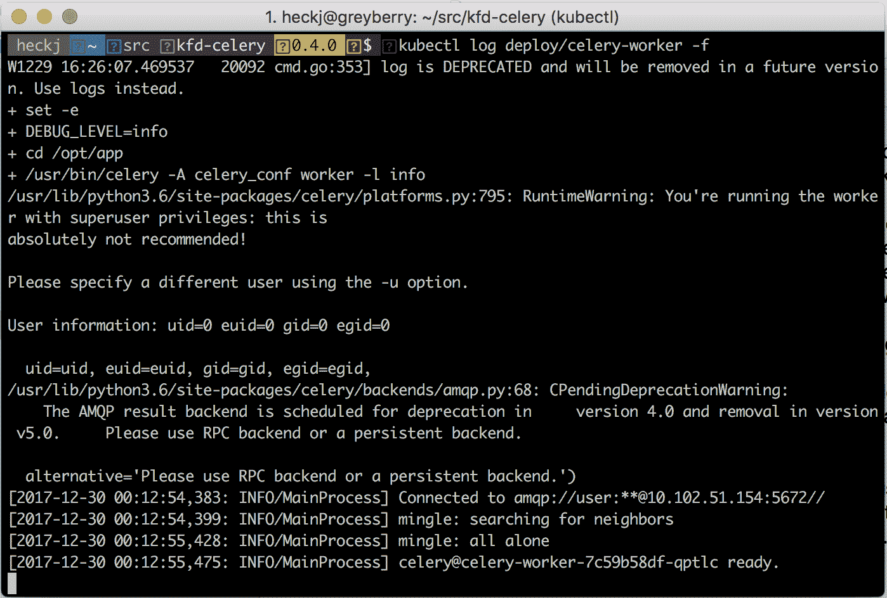

这将显示`celery-worker`部署的日志，因为它们发生。打开第二个终端窗口并调用以下命令以运行一个临时 pod 并获得交互式 shell：

```
kubectl run -i --tty \ --image quay.io/kubernetes-for-developers/celery-worker:0.4.0 \ --restart=Never --image-pull-policy=Always --rm testing /bin/sh
```

在 shell 中，您现在可以运行脚本来生成一些任务供 worker 处理：

```
python3 submit_tasks.py
```

这个脚本的一个例子是：

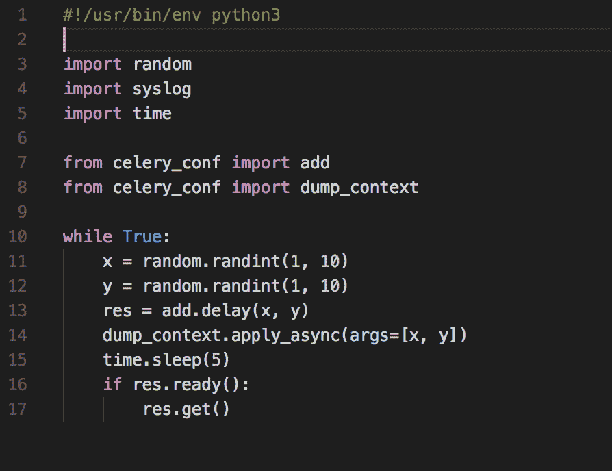

这个脚本将无限期地运行，大约每五秒调用一次 worker 中的两个示例任务，在显示日志的窗口中，您应该看到输出更新，显示来自 Celery worker 的记录结果：

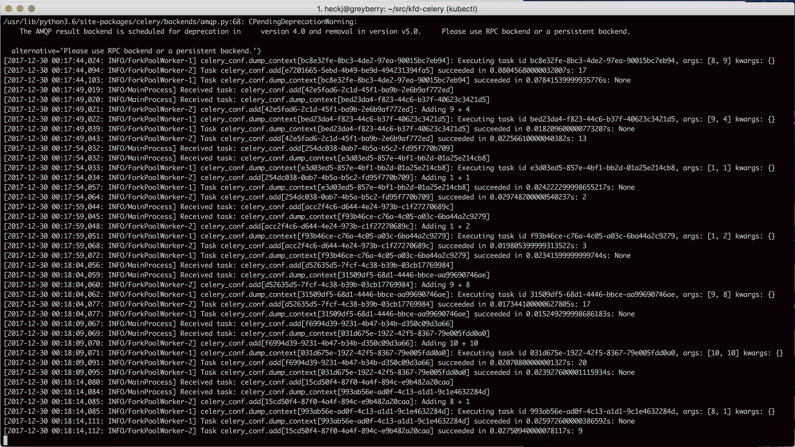

# Kubernetes 的持久性

到目前为止，我们所有的例子，甚至代码，都基本上是无状态的。在上一章中，我们介绍了使用 Redis 的容器，但没有为它指定任何特殊的东西。默认情况下，Kubernetes 将假定与 pod 关联的任何资源都是临时的，如果节点失败或部署被删除，所有关联的资源都可以并且将被删除。

也就是说，我们所做的几乎所有工作都需要在某个地方存储和维护状态——数据库、对象存储，甚至是持久的内存队列。Kubernetes 包括对持久性的支持，截至目前为止，它仍在快速变化和发展。

# 卷

Kubernetes 最早的支持是卷，可以由集群管理员定义，并且我们已经看到了一些这种构造的变体，配置被暴露到容器中使用 Downward API 在第四章中，*声明式基础设施*。

另一种可以轻松使用的卷是`emptyDir`，您可以在 pod 规范中使用它来创建一个空目录，并将其挂载到一个或多个容器中。这通常在本地节点可用的存储上创建，但包括一个选项来指定*memory*的介质，您可以使用它来创建一个临时的内存支持文件系统。这会占用节点上更多的内存，但为您的 pod 创建一个非常快速的临时文件系统。如果您的代码想要在磁盘上使用一些临时空间，保持定期的检查点，或者加载临时内容，这可能是一个非常好的管理空间的方法。

正如我们在配置中指定的那样，当您使用卷时，您将其指定在卷下，并在`volumeMounts`下进行相关条目，指示您在每个容器上使用它的位置。

我们可以修改我们的 Flask 示例应用程序，使其具有一个内存支持的临时空间：

```
 spec: containers: - name: flask image: quay.io/kubernetes-for-developers/flask:0.3.0 imagePullPolicy: Always ports: - containerPort: 5000 volumeMounts: - name: config mountPath: /etc/flask-config readOnly: true - name: cache-volume mountPath: /opt/cache volumes: - name: config configMap: name: flask-config - name: cache-volume emptyDir: medium: Memory
```

如果我们部署规范的这个版本并在容器中打开一个交互式 shell，你可以看到`/opt/cache`被列为`tmpfs`类型的卷：

```
df -h Filesystem                Size      Used Available Use% Mounted on overlay                  15.3G      1.7G     12.7G  12% / tmpfs                  1000.1M         0   1000.1M   0% /dev tmpfs                  1000.1M         0   1000.1M   0% /sys/fs/cgroup tmpfs                  1000.1M         0   1000.1M   0% /opt/cache /dev/vda1                15.3G      1.7G     12.7G  12% /dev/termination-log /dev/vda1                15.3G      1.7G     12.7G  12% /etc/flask-config /dev/vda1                15.3G      1.7G     12.7G  12% /etc/resolv.conf /dev/vda1                15.3G      1.7G     12.7G  12% /etc/hostname /dev/vda1                15.3G      1.7G     12.7G  12% /etc/hosts shm                      64.0M         0     64.0M   0% /dev/shm tmpfs                  1000.1M     12.0K   1000.1M   0% /run/secrets/kubernetes.io/serviceaccount tmpfs                  1000.1M         0   1000.1M   0% /proc/kcore tmpfs                  1000.1M         0   1000.1M   0% /proc/timer_list tmpfs                  1000.1M         0   1000.1M   0% /proc/timer_stats tmpfs                  1000.1M         0   1000.1M   0% /sys/firmware
```

如果我们没有指定类型为`Memory`的介质，那么该目录将显示在本地磁盘上：

```
df -h Filesystem                Size      Used Available Use% Mounted on overlay                  15.3G      1.7G     12.7G  12% / tmpfs                  1000.1M         0   1000.1M   0% /dev tmpfs                  1000.1M         0   1000.1M   0% /sys/fs/cgroup /dev/vda1                15.3G      1.7G     12.7G  12% /dev/termination-log /dev/vda1                15.3G      1.7G     12.7G  12% /etc/flask-config /dev/vda1                15.3G      1.7G     12.7G  12% /opt/cache /dev/vda1                15.3G      1.7G     12.7G  12% /etc/resolv.conf /dev/vda1                15.3G      1.7G     12.7G  12% /etc/hostname /dev/vda1                15.3G      1.7G     12.7G  12% /etc/hosts shm                      64.0M         0     64.0M   0% /dev/shm tmpfs                  1000.1M     12.0K   1000.1M   0% /run/secrets/kubernetes.io/serviceaccount tmpfs                  1000.1M         0   1000.1M   0% /proc/kcore tmpfs                  1000.1M         0   1000.1M   0% /proc/timer_list tmpfs                  1000.1M         0   1000.1M   0% /proc/timer_stats tmpfs                  1000.1M         0   1000.1M   0% /sys/firmware
```

如果您在云服务提供商上使用卷，那么您可以使用他们的持久卷之一。在这些情况下，您需要在云服务提供商那里创建一个持久磁盘，该磁盘对您的 Kubernetes 集群中的节点是可访问的，但这样可以使数据存在于任何 pod 或节点的生命周期之外。每个云提供商的卷都是特定于该提供商的，例如`awsElasticBlockStore`、`azureDisk`或`gcePersistentDisk`。

还有许多其他类型的卷可用，大多数取决于您的集群是如何设置的以及该设置中可能有什么可用的。您可以从卷的正式文档[`kubernetes.io/docs/concepts/storage/volumes/`](https://kubernetes.io/docs/concepts/storage/volumes/)中了解所有支持的卷。

# 持久卷和持久卷索赔

如果您想要使用持久卷，而不受构建集群的特定位置的限制，您可能想要利用两个较新的 Kubernetes 资源：`PersistentVolume`和`PersistentVolumeClaim`。这些资源将提供卷的具体细节与您期望使用这些卷的方式分开，两者都属于动态卷分配的概念，这意味着当您将代码部署到 Kubernetes 时，系统应该从已经识别的磁盘中提供任何持久卷。Kubernetes 管理员将需要指定至少一个，可能更多的存储类，用于定义可供集群使用的持久卷的一般行为和后备存储。如果您在亚马逊网络服务、谷歌计算引擎或微软的 Azure 上使用 Kubernetes，这些公共服务都预定义了存储类可供使用。您可以在文档[`kubernetes.io/docs/concepts/storage/storage-classes/`](https://kubernetes.io/docs/concepts/storage/storage-classes/)中查看默认的存储类及其定义。如果您在本地使用 Minikube 进行尝试，它也有一个默认的存储类定义，使用的卷类型是`HostPath`。

定义`PersistentVolumeClaim`以与部署中的代码一起使用非常类似于使用`EmptyDir`定义配置卷或缓存，唯一的区别是您需要在引用它之前创建`persistentVolumeClaim`资源。

我们可能用于 Redis 存储的`persistentVolumeClaim`示例可能是：

```
apiVersion: v1 kind: PersistentVolumeClaim metadata:
 name: redis-pv-claim labels: app: redis-master spec:
 accessModes: - ReadWriteOnce resources: requests: storage: 1Gi
```

这将创建一个可供我们容器使用的 1GB 卷。我们可以将其添加到 Redis 容器中，通过名称引用这个`persistentVolumeClaim`来给它提供持久存储：

```
apiVersion: apps/v1beta1 kind: Deployment metadata:
 name: redis-master spec:
 replicas: 1 template: metadata: labels: app: redis role: master tier: backend spec: containers: - name: redis-master image: redis:4 ports: - containerPort: 6379 volumeMounts: - name: redis-persistent-storage mountPath: /data volumes: - name: redis-persistent-storage persistentVolumeClaim: claimName: redis-pv-claim
```

选择`/data`的`mountPath`是为了与 Redis 容器的构建方式相匹配。如果我们查看该容器的文档（来自[`hub.docker.com/_/redis/`](https://hub.docker.com/_/redis/)），我们可以看到内置配置期望所有数据都从`/data`路径使用，因此我们可以用我们自己的`persistentVolumeClaim`覆盖该路径，以便用一些能够在部署的生命周期之外存在的东西来支持该空间。

如果您将这些更改部署到 Minikube，您可以看到集群中反映出的结果资源：

```
kubectl get persistentvolumeclaims NAME             STATUS    VOLUME                                     CAPACITY   ACCESS MODES   STORAGECLASS   AGE redis-pv-claim   Bound     pvc-f745c6f1-e7d8-11e7-89d4-b29f363a60d7   1Gi        RWO            standard       3d kubectl get persistentvolumes NAME                                       CAPACITY   ACCESS MODES   RECLAIM POLICY   STATUS    CLAIM                    STORAGECLASS   REASON    AGE pvc-f745c6f1-e7d8-11e7-89d4-b29f363a60d7   1Gi        RWO            Delete           Bound     default/redis-pv-claim   standard                 3d
```

我们还可以打开一个交互式终端进入 Redis 实例，看看它是如何设置的：

```
kubectl exec -it redis-master-6f944f6c8b-gm2cb -- /bin/sh # df -h Filesystem      Size  Used Avail Use% Mounted on overlay          16G  1.8G   13G  12% / tmpfs          1001M     0 1001M   0% /dev tmpfs          1001M     0 1001M   0% /sys/fs/cgroup /dev/vda1        16G  1.8G   13G  12% /data shm              64M     0   64M   0% /dev/shm tmpfs          1001M   12K 1001M   1% /run/secrets/kubernetes.io/serviceaccount tmpfs          1001M     0 1001M   0% /sys/firmware
```

# 有状态集

在动态配置之后，当您考虑持久性系统时，无论它们是经典数据库、键值数据存储、内存缓存还是基于文档的数据存储，通常希望具有某种冗余和故障转移的方式。 ReplicaSets 和部署在支持某些功能方面走得相当远，特别是对于持久卷，但是将它们更完全地集成到 Kubernetes 中将极大地有利于这些系统，以便我们可以利用 Kubernetes 来处理这些系统的生命周期和协调。这项工作的起点是 Stateful Sets，它们的工作方式类似于部署和 ReplicaSet，因为它们管理一组 pod。

Stateful Sets 与其他系统不同，它们还支持每个 pod 具有稳定的、唯一的标识和特定的有序扩展，无论是向上还是向下。 Stateful Sets 在 Kubernetes 中相对较新，首次出现在 Kubernetes 1.5 中，并在 1.9 版本中进入 beta。 Stateful Sets 还与我们之前提到的特定服务密切合作，即无头服务，需要在 Stateful Set 之前创建，并负责 pod 的网络标识。

作为提醒，无头服务是一种没有特定集群 IP 的服务，而是为与其关联的所有 pods 提供独特的服务标识作为单独的端点。这意味着任何使用该服务的系统都需要知道该服务具有特定标识的端点，并且需要能够与其想要通信的端点进行通信。当创建一个与无头服务相匹配的 Stateful Set 时，pods 将根据 Stateful Set 的名称和序号获得一个标识。例如，如果我们创建了一个名为 datastore 的 Stateful Set 并请求了三个副本，那么 pods 将被创建为 `datastore-0`、`datastore-1` 和 `datastore-2`。Stateful Sets 还有一个 `serviceName` 字段，该字段包含在服务的域名中。以完成这个示例，如果我们将 `serviceName` 设置为 `db`，那么为 pods 创建的关联 DNS 条目将是：

+   `datastore-0.db.[namespace].svc.cluster.local`

+   `datastore-1.db.[namespace].svc.cluster.local`

+   `datastore-2.db.[namespace].svc.cluster.local`

随着副本数量的变化，Stateful Set 也会明确而谨慎地添加和删除 pods。它会按照从最高编号开始顺序终止 pods，并且不会在较低编号的 pods 报告`Ready`和`Running`之前终止较高编号的 pods。从 Kubernetes 1.7 开始，Stateful Sets 引入了一个可选字段 `podManagementPolicy` 来改变这一行为。默认值 `OrderedReady` 的操作如上所述，另一个选项 `Parallel` 则不会按顺序操作，也不需要较低编号的 pods 处于`Running`或`Ready`状态才能终止一个 pod。

滚动更新，类似于部署，对于 Stateful Sets 也略有不同。它由`updateStrategy`可选字段定义，如果未明确设置，则使用`OnDelete`设置。使用此设置，Kubernetes 不会删除旧的 pod，即使在规范更新后，需要您手动删除这些 pod。当您这样做时，系统将根据更新后的规范自动重新创建 pod。另一个值是`RollingUpdate`，它更类似于部署，会自动终止和重新创建 pod，但会明确遵循顺序，并验证 pod 在继续更新下一个 pod 之前是否*准备就绪和运行*。`RollingUpdate`还有一个额外的（可选）字段，`partition`，如果指定了一个数字，将使`RollingUpdate`自动在一部分 pod 上操作。例如，如果分区设置为`3`，并且有`6`个副本，则只有 pod `3`，`4`和`5`会在规范更新时自动更新。Pod `0`，`1`和`2`将被保留，即使它们被手动删除，它们也将以先前的版本重新创建。分区功能可用于分阶段更新或执行分阶段部署。

# 使用 Stateful Set 的 Node.js 示例

应用程序内的代码不需要 Stateful Set 机制，但让我们将其用作易于理解的更新，以展示您可能如何使用 Stateful Set 以及如何观察其运行。

此更新的代码可在 GitHub 上的项目中找到：[`github.com/kubernetes-for-developers/kfd-nodejs`](https://github.com/kubernetes-for-developers/kfd-nodejs)，分支为 0.4.0。该项目的代码没有更改，只是将部署规范更改为 Stateful Set。您可以使用以下命令获取此版本的代码：

```
git clone https://github.com/kubernetes-for-developers/kfd-nodejs -b 0.4.0 cd kfd-nodejs
```

服务定义已更改，删除了`Nodeport`类型，并将`clusterIP`设置为`None`。现在`nodejs-service`的新定义如下：

```
kind: Service apiVersion: v1 metadata:
 name: nodejs-service spec:
 ports: - port: 3000 name: web clusterIP: None selector: app: nodejs
```

这将设置一个无头服务，用于与 Stateful Set 一起使用。从部署到 Stateful Set 的更改同样简单，将类型`Deployment`替换为类型`StatefulSet`，并添加`serviceName`、副本和设置选择器的值。我还添加了一个带有持久卷索赔的数据存储挂载，以展示它如何与您现有的规范集成。现有的`ConfigMap`、`livenessProbe`和`readinessProbe`设置都得到了保留。最终的`StatefulSet`规范现在如下所示：

```
apiVersion: apps/v1beta1 kind: StatefulSet metadata:
 name: nodejs spec:
 serviceName: "nodejs" replicas: 5 selector: matchLabels: app: nodejs template: metadata: labels: app: nodejs spec: containers: - name: nodejs image: quay.io/kubernetes-for-developers/nodejs:0.3.0 imagePullPolicy: Always ports: - containerPort: 3000 name: web envFrom: - configMapRef: name: nodejs-config volumeMounts: - name: config mountPath: /etc/nodejs-config readOnly: true - name: datastore mountPath: /opt/data livenessProbe: httpGet: path: /probes/alive port: 3000 initialDelaySeconds: 1 periodSeconds: 5 readinessProbe: httpGet: path: /probes/ready port: 3000 initialDelaySeconds: 5 periodSeconds: 5 volumes: - name: config configMap: name: nodejs-config updateStrategy: type: RollingUpdate volumeClaimTemplates: - metadata: name: datastore spec: accessModes: [ "ReadWriteOnce" ] resources: requests: storage: 1Gi
```

自上一章中更新了代码以使用带有就绪探针的 Redis 后，我们将希望确保我们的 Redis 已经运行起来，以便这个 Stateful Set 能够继续进行。您可以使用以下命令部署更新后的 Redis 服务定义集：

```
kubectl apply -f deploy/redis.yaml
```

现在，我们可以利用`kubectl get`的观察选项（`-w`）来观察 Kubernetes 如何设置 Stateful Set 并进行仔细的进展。打开一个额外的终端窗口并运行以下命令：

```
kubectl get pods -w -l app=nodejs
```

起初，您不应该看到任何输出，但随着 Kubernetes 在 Stateful Set 中的进展，更新将会出现。

在您原始的终端窗口中，使用以下命令部署我们已更新为`StatefulSet`的规范：

```
kubectl apply -f deploy/nodejs.yaml
```

您应该会看到`service`、`configmap`和`statefulset`对象都已创建的响应：

```
service "nodejs-service" unchanged configmap "nodejs-config" unchanged statefulset "nodejs" created
```

在您观看 pod 的窗口中，当第一个容器上线时，您应该会看到输出开始出现。每当观察触发器发现我们设置的描述符（`-l app=nodejs`）中的一个 pod 有更新时，输出中会出现一行：

```
NAME       READY     STATUS    RESTARTS   AGE nodejs-0   0/1       Pending   0          2h nodejs-0   0/1       Pending   0         2h nodejs-0   0/1       ContainerCreating   0         2h nodejs-0   0/1       Running   0         2h nodejs-0   1/1       Running   0         2h nodejs-1   0/1       Pending   0         2h nodejs-1   0/1       Pending   0         2h nodejs-1   0/1       ContainerCreating   0         2h nodejs-1   0/1       Running   0         2h nodejs-1   1/1       Running   0         2h nodejs-2   0/1       Pending   0         2h nodejs-2   0/1       Pending   0         2h nodejs-2   0/1       ContainerCreating   0         2h nodejs-2   0/1       Running   0         2h nodejs-2   1/1       Running   0         2h nodejs-3   0/1       Pending   0         2h nodejs-3   0/1       Pending   0         2h
```

我们设置的定义有五个副本，因此总共会生成五个 pod。您可以使用以下命令查看该部署的状态：

```
kubectl get sts nodejs
```

```
NAME      DESIRED   CURRENT   AGE nodejs    5         5         2h
```

在上述命令中，`sts`是`statefulset`的缩写。您还可以使用以下命令以人类可读的形式获得当前状态的更详细视图：

```
kubectl describe sts nodejs
```

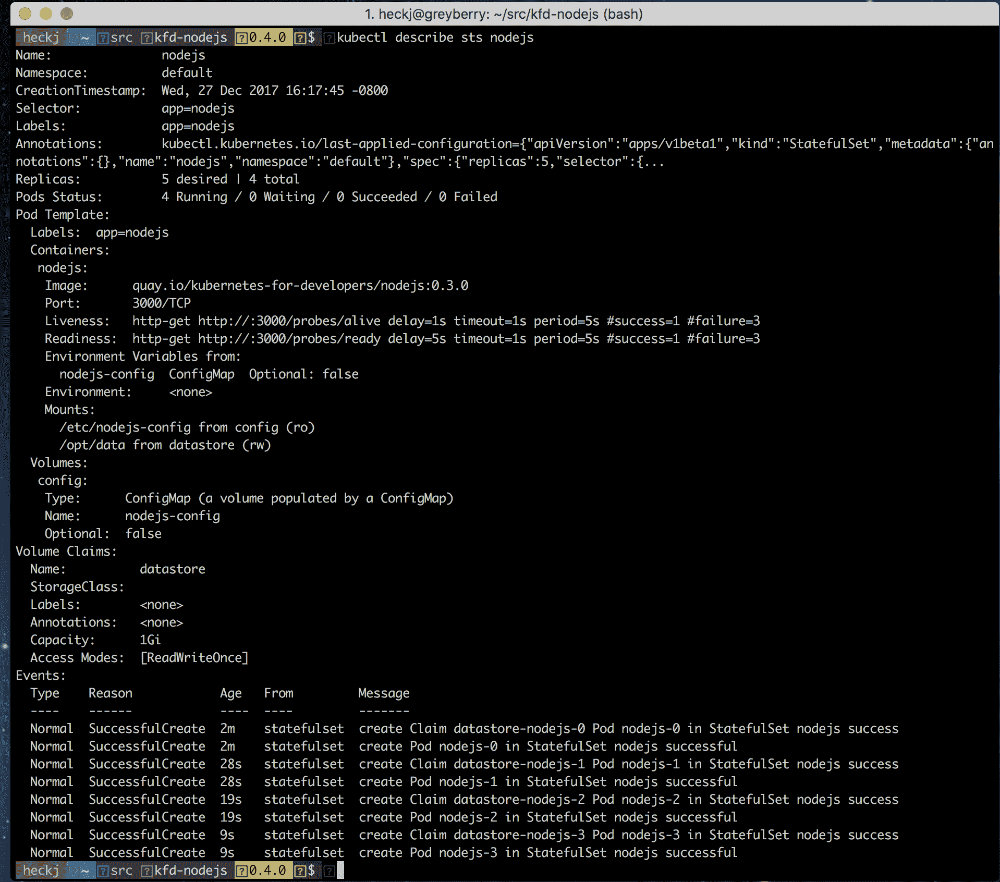

如果您编辑规范，将副本更改为两个，然后应用更改，您将看到 pod 按照设置的相反顺序被拆除，最高序数号先。以下命令：

```
kubectl apply -f deploy/nodejs.yml
```

应该报告：

```
service "nodejs-service" unchanged configmap "nodejs-config" unchanged statefulset "nodejs" configured
```

在观看 pod 的窗口中，您将看到`nodejs-4`开始终止，并且会一直持续到`nodejs-3`，然后是`nodejs-2`终止。

如果您运行一个临时的`pod`来查看 DNS：

```
kubectl run -i --tty --image busybox dns-test --restart=Never --rm /bin/sh
```

您可以使用`nslookup`命令验证`pods`的 DNS 值：

```
/ # nslookup nodejs-1.nodejs-service
Server: 10.96.0.10
Address 1: 10.96.0.10 kube-dns.kube-system.svc.cluster.local

Name: nodejs-1.nodejs-service
Address 1: 172.17.0.6 nodejs-1.nodejs-service.default.svc.cluster.local

/ # nslookup nodejs-0.nodejs-service
Server: 10.96.0.10
Address 1: 10.96.0.10 kube-dns.kube-system.svc.cluster.local

Name: nodejs-0.nodejs-service
Address 1: 172.17.0.4 nodejs-0.nodejs-service.default.svc.cluster.local
```

# 自定义资源定义

Stateful Sets 并不自动匹配所有可用的持久存储，其中一些甚至对管理应用程序的生命周期有更复杂的逻辑要求。随着 Kubernetes 考虑如何支持扩展其控制器以支持更复杂的逻辑，该项目从 Operators 的概念开始，即可以包含在 Kubernetes 项目中的外部代码，并且截至 Kubernetes 1.8 版本已经发展为更明确地使用`CustomResourceDefinitions`。自定义资源扩展了 Kubernetes API，并允许创建自定义 API 对象，并与自定义控制器匹配，您还可以将其加载到 Kubernetes 中以处理这些对象的生命周期。

自定义资源定义超出了我们在本书中将涵盖的范围，尽管您应该意识到它们的存在。您可以在项目的文档站点上获取有关自定义资源定义以及如何扩展 Kubernetes 的更多详细信息：[`kubernetes.io/docs/concepts/api-extension/custom-resources/.`](https://kubernetes.io/docs/concepts/api-extension/custom-resources/)

有许多通过开源项目提供的 Operators 可利用自定义资源定义来管理 Kubernetes 中特定的应用程序。CoreOS 团队支持用于管理 Prometheus 和`etcd`的 Operators 和自定义资源。还有一个名为 Rook 的开源存储资源和相关技术，它使用自定义资源定义来运行。

截至目前，如何最好地在 Kubernetes 中运行持久存储的广泛集合仍在不断发展。有许多示例可以演示如何在 Kubernetes 中运行您选择的数据库或 NoSQL 数据存储，同时还支持冗余和故障转移。这些系统大多是通过各种机制来支持其管理，其中很少有系统对自动扩展和冗余提供了很多支持。有许多支持各种数据存储的技术可作为示例。一些更复杂的系统使用 Operators 和这些自定义资源定义；其他系统使用一组 Pod 和容器以更简单的复制集来实现其目标。

# 总结

在本章中，我们回顾了 Kubernetes 提供的作业和 CronJobs，以支持批处理和定期批处理处理。我们还通过一个 Python 示例来了解如何使用 RabbitMQ 设置 Celery 工作队列，并配置这两个部署以共同工作。然后，我们看了一下 Kubernetes 如何通过卷、`PersistentVolume`和其自动创建部署所需卷的`PersistentVolumeClaims`的概念来提供持久性。Kubernetes 还支持 Stateful Sets，用于需要稳定标识和持久卷的部署变体，我们看了一个简单的 Node.js 示例，将我们之前的部署示例转换为 Stateful Set。最后，我们通过查看用于扩展 Kubernetes 的自定义资源定义来结束本章。

在下一章中，我们开始研究如何利用 Kubernetes 获取所有这些结构的信息。我们将回顾如何捕获和查看指标，利用 Kubernetes 和其他开源项目，以及从 Kubernetes 鼓励的水平扩展系统中整理日志的示例。
