# 第七章：监控和指标

在之前的章节中，我们调查了 Kubernetes 对象和资源中使用的声明性结构。以 Kubernetes 帮助我们运行软件为最终目标，在本章中，我们将看看在更大规模运行应用程序时，如何获取更多信息，以及我们可以用于此目的的一些开源工具。Kubernetes 已经在收集和使用有关集群节点利用情况的一些信息，并且在 Kubernetes 内部有越来越多的能力开始收集特定于应用程序的指标，甚至使用这些指标作为管理软件的控制点。

在本章中，我们将深入探讨基本可观察性的这些方面，并介绍如何为您的本地开发使用设置它们，以及如何利用它们来收集、聚合和公开软件运行的详细信息，当您扩展它时。本章的主题将包括：

+   内置指标与 Kubernetes

+   Kubernetes 概念-服务质量

+   使用 Prometheus 捕获指标

+   安装和使用 Grafana

+   使用 Prometheus 查看应用程序指标

# 内置指标与 Kubernetes

Kubernetes 内置了一些基本的仪表来了解集群中每个节点消耗了多少 CPU 和内存。确切地捕获了什么以及如何捕获它在最近的 Kubernetes 版本（1.5 到 1.9）中正在迅速发展。许多 Kubernetes 安装将捕获有关底层容器使用的资源的信息，使用一个名为 cAdvisor 的程序。这段代码是由 Google 创建的，用于收集、聚合和公开容器的操作指标，作为能够知道最佳放置新容器的关键步骤，基于节点的资源和资源可用性。

Kubernetes 集群中的每个节点都将运行并收集信息的 cAdvisor，并且这反过来又被*kubelet*使用，这是每个节点上负责启动、停止和管理运行容器所需的各种资源的本地代理。

cAdvisor 提供了一个简单的基于 Web 的 UI，您可以手动查看任何节点的详细信息。如果您可以访问节点的端口`4194`，那么这是默认位置，可以公开 cAdvisor 的详细信息。根据您的集群设置，这可能不容易访问。在使用 Minikube 的情况下，它很容易直接可用。

如果您已安装并运行 Minikube，可以使用以下命令：

```
minikube ip
```

获取运行单节点 Kubernetes 集群的开发机器上虚拟机的 IP 地址，可以访问运行的 cAdvisor，然后在浏览器中导航到该 IP 地址的`4194`端口。例如，在运行 Minikube 的 macOS 上，您可以使用以下命令：

```
open http://$(minikube ip):4194/
```

然后您将看到一个简单的 UI，显示类似于这样的页面：

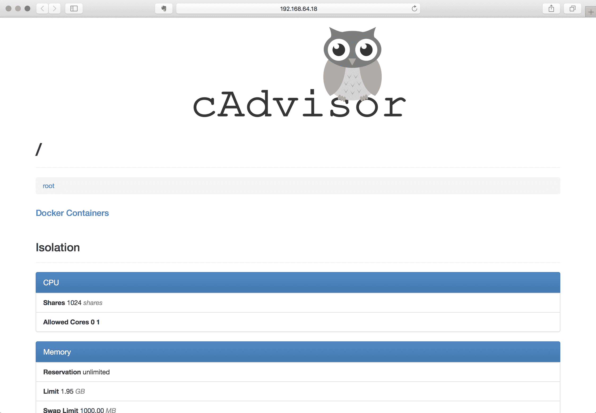

向下滚动一点，您将看到一些仪表和信息表：

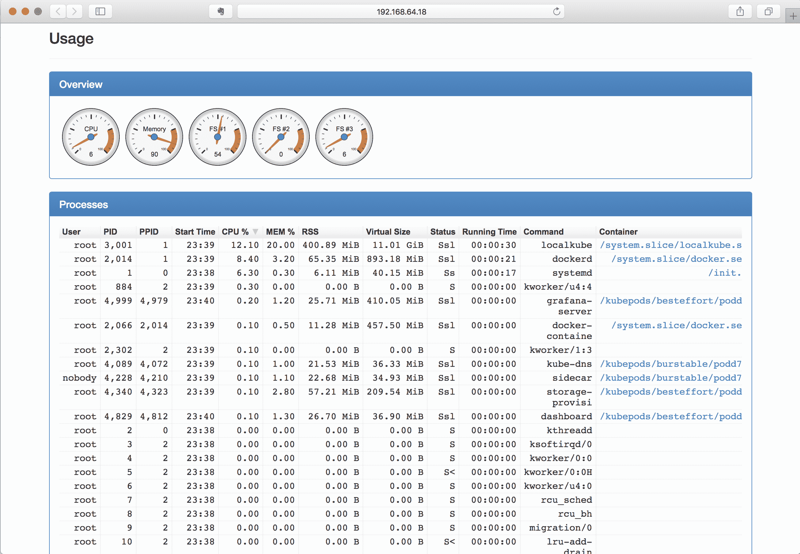

下面是一组简单的图表，显示了 CPU、内存、网络和文件系统的使用情况。这些图表和表格将在您观看时更新和自动刷新，并代表了 Kubernetes 正在捕获的有关集群的基本信息。

Kubernetes 还通过其自己的 API 提供有关自身（其 API 服务器和相关组件）的指标。在通过`kubectl`代理使 API 可用后，您可以使用`curl`命令直接查看这些指标：

```
kubectl proxy
```

并在单独的终端窗口中：

```
curl http://127.0.0.1:8001/metrics
```

许多 Kubernetes 的安装都使用一个叫做 Heapster 的程序来从 Kubernetes 和每个节点的 cAdvisor 实例中收集指标，并将它们存储在诸如 InfluxDB 之类的时间序列数据库中。从 Kubernetes 1.9 开始，这个开源项目正在从 Heapster 进一步转向可插拔的解决方案，常见的替代方案是 Prometheus，它经常用于短期指标捕获。

如果您正在使用 Minikube，可以使用`minikube`插件轻松将 Heapster 添加到本地环境中。与仪表板一样，这将在其自己的基础设施上运行 Kubernetes 的软件，这种情况下是 Heapster、InfluxDB 和 Grafana。

这将在 Minikube 中启用插件，您可以使用以下命令：

```
minikube addons enable heapster
heapster was successfully enabled
```

在后台，Minikube 将启动并配置 Heapster、InfluxDB 和 Grafana，并将其创建为一个服务。您可以使用以下命令：

```
minikube addons open heapster
```

这将打开一个到 Grafana 的浏览器窗口。该命令将在设置容器时等待，但当服务端点可用时，它将打开一个浏览器窗口：

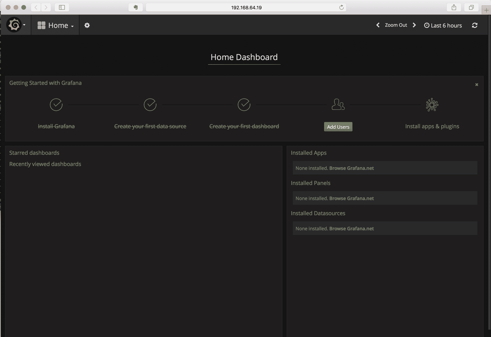

Grafana 是一个用于显示图表和从常见数据源构建仪表板的单页面应用程序。在 Minikube Heapster 附加组件创建的版本中，Grafana 配置了两个仪表板：集群和 Pods。如果在默认视图中选择标记为“主页”的下拉菜单，您可以选择其他仪表板进行查看。

在 Heapster、InfluxDB 和 Grafana 协调收集和捕获环境的一些基本指标之前，可能需要一两分钟，但相当快地，您可以转到其他仪表板查看正在运行的信息。例如，我在本书的前几章中部署了所有示例应用程序，并转到了集群仪表板，大约 10 分钟后，视图看起来像这样：

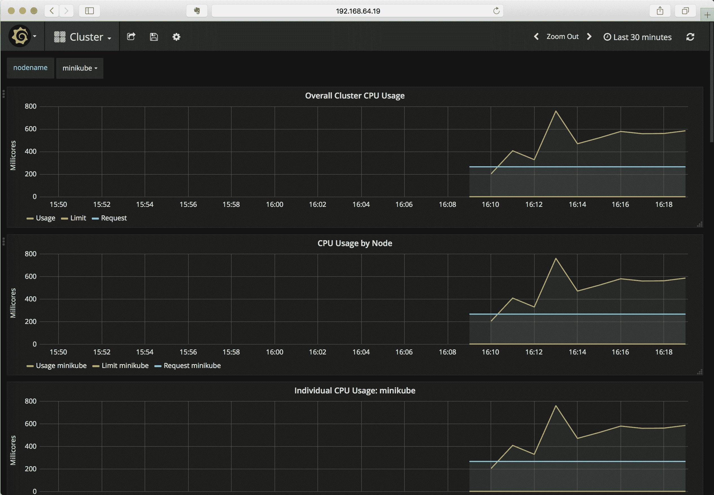

通过仪表板向下滚动，您将看到节点的 CPU、内存、文件系统和网络使用情况，以及整个集群的视图。您可能会注意到 CPU 图表有三条线被跟踪——使用情况、限制和请求——它们与实际使用的资源、请求的数量以及对 pod 和容器设置的任何限制相匹配。

如果切换到 Pods 仪表板，您将看到该仪表板中有当前在集群中运行的所有 pod 的选择，并提供每个 pod 的详细视图。在这里显示的示例中，我选择了我们部署的`flask`示例应用程序的 pod：

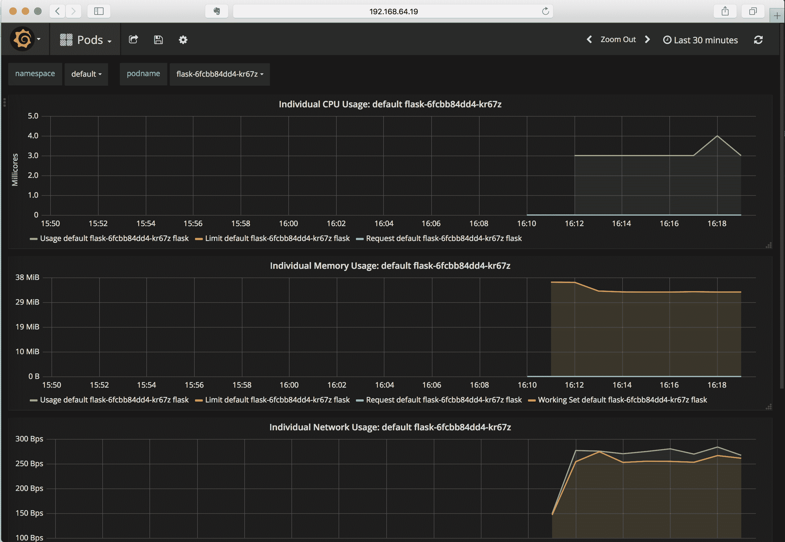

向下滚动，您可以看到包括内存、CPU、网络和磁盘利用率在内的图表。Heapster、Grafana 和 InfluxDB 的集合将自动记录您创建的新 pod，并且您可以在 Pods 仪表板中选择命名空间和 pod 名称。

# Kubernetes 概念-服务质量

当在 Kubernetes 中创建一个 pod 时，它也被分配了一个服务质量类，这是基于请求时提供的有关 pod 的数据。这在调度过程中提供了一些前期保证，并在后续管理 pod 本身时使用。支持的三种类别是：

+   `保证`

+   `可突发`

+   `最佳努力`

分配给您的 Pod 的类别是基于您在 Pod 内的容器中报告的 CPU 和内存利用率的资源限制和请求。在先前的示例中，没有一个容器被分配请求或限制，因此当它们运行时，所有这些 Pod 都被分类为`BestEffort`。

资源请求和限制在 Pod 内的每个容器上进行定义。如果我们为容器添加请求，我们要求 Kubernetes 确保集群具有足够的资源来运行我们的 Pod（内存、CPU 或两者），并且它将作为调度的一部分验证可用性。如果我们添加限制，我们要求 Kubernetes 监视 Pod，并在容器超出我们设置的限制时做出反应。对于限制，如果容器尝试超出 CPU 限制，容器将被简单地限制到定义的 CPU 限制。如果超出了内存限制，容器将经常被终止，并且您可能会在终止的容器的`reason`描述中看到错误消息`OOM killed`。

如果设置了请求，Pod 通常被设置为“可突发”的服务类别，但有一个例外，即当同时设置了限制，并且该限制的值与请求相同时，将分配“保证”服务类别。作为调度的一部分，如果 Pod 被认为属于“保证”服务类别，Kubernetes 将在集群内保留资源，并且在超载时，会倾向于首先终止和驱逐`BestEffort`容器，然后是“可突发”容器。集群通常需要预期会失去资源容量（例如，一个或多个节点失败）。在这些情况下，一旦将“保证”类别的 Pod 调度到集群中，它将在面对此类故障时具有最长的寿命。

我们可以更新我们的`flask`示例 Pod，以便它将以“保证”的服务质量运行，方法是为 CPU 和内存都添加请求和限制：

```
 spec: containers: - name: flask image: quay.io/kubernetes-for-developers/flask:0.4.0 resources: limits: memory: "100Mi" cpu: "500m" requests: memory: "100Mi" cpu: "500m"
```

这为 CPU 和内存都设置了相同值的请求和限制，例如，100 MB 的内存和大约半个核心的 CPU 利用率。

通常认为，在生产模式下运行的所有容器和 Pod，至少应该定义请求，并在最理想的情况下也定义限制，这被认为是最佳实践。

# 为您的容器选择请求和限制

如果您不确定要使用哪些值来设置容器的请求和/或限制，确定这些值的最佳方法是观察它们。使用 Heapster、Prometheus 和 Grafana，您可以看到每个 pod 消耗了多少资源。

有一个三步过程，您可以使用您的代码来查看它所占用的资源：

1.  运行您的代码并查看空闲时消耗了多少资源

1.  为您的代码添加负载并验证负载下的资源消耗

1.  设置了约束条件后，再运行一个持续一段时间的负载测试，以确保您的代码符合定义的边界

第一步（空闲时审查）将为您提供一个良好的起点。利用 Grafana，或者利用您集群节点上可用的 cAdvisor，并简单地部署相关的 pod。在前面的示例中，我们在本书的早期示例中使用 `flask` 示例进行了这样的操作，您可以看到一个空闲的 flask 应用程序大约消耗了 3 毫核（.003% 的核心）和大约 35 MB 的 RAM。这为请求 CPU 和内存提供了一个预期值。

第二步通常最好通过运行**逐渐增加的负载测试**（也称为**坡道负载测试**）来查看您的 pod 在负载下的反应。通常，您会看到负载随请求线性增加，然后产生一个弯曲或拐点，开始变得瓶颈。您可以查看相同的 Grafana 或 cAdvisor 面板，以显示负载期间的利用率。

如果您想生成一些简单的负载，可以使用诸如 Apache benchmark（[`httpd.apache.org/docs/2.4/programs/ab.html`](https://httpd.apache.org/docs/2.4/programs/ab.html)）之类的工具生成一些特定的负载点。例如，要运行一个与 Flask 应用程序配合使用的交互式容器，可以使用以下命令：

```
kubectl run -it --rm --restart=Never \
--image=quay.io/kubernetes-for-developers/ab quicktest -- sh
```

此镜像已安装了 `curl` 和 `ab`，因此您可以使用此命令验证您是否可以与我们在早期示例中创建的 Flask 服务进行通信：

```
curl -v http://flask-service.default:5000/
```

这应该返回一些冗长的输出，显示连接和基本请求如下：

```
* Trying 10.104.90.234...
* TCP_NODELAY set
* Connected to flask-service.default (10.104.90.234) port 5000 (#0)
> GET / HTTP/1.1
> Host: flask-service.default:5000
> User-Agent: curl/7.57.0
> Accept: */*
>
* HTTP 1.0, assume close after body
< HTTP/1.0 200 OK
< Content-Type: text/html; charset=utf-8
< Content-Length: 10
< Server: Werkzeug/0.13 Python/3.6.3
< Date: Mon, 08 Jan 2018 02:22:26 GMT
<
* Closing connection 0
```

一旦您验证了一切都按您的预期运行，您可以使用 `ab` 运行一些负载：

```
ab -c 100 -n 5000 http://flask-service.default:5000/ 
This is ApacheBench, Version 2.3 <$Revision: 1807734 $>
Copyright 1996 Adam Twiss, Zeus Technology Ltd, http://www.zeustech.net/
Licensed to The Apache Software Foundation, http://www.apache.org/

Benchmarking flask-service.default (be patient)
Completed 500 requests
Completed 1000 requests
Completed 1500 requests
Completed 2000 requests
Completed 2500 requests
Completed 3000 requests
Completed 3500 requests
Completed 4000 requests
Completed 4500 requests
Completed 5000 requests
Finished 5000 requests
Server Software: Werkzeug/0.13 Server Hostname: flask-service.default
Server Port: 5000
Document Path: /
Document Length: 10 bytes
Concurrency Level: 100
Time taken for tests: 3.454 seconds
Complete requests: 5000
Failed requests: 0
Total transferred: 810000 bytes
HTML transferred: 50000 bytes
Requests per second: 1447.75 [#/sec] (mean)
Time per request: 69.072 [ms] (mean)
Time per request: 0.691 [ms] (mean, across all concurrent requests)
Transfer rate: 229.04 [Kbytes/sec] received

Connection Times (ms)
 min mean[+/-sd] median max
Connect: 0 0 0.3 0 3
Processing: 4 68 7.4 67 90
Waiting: 4 68 7.4 67 90
Total: 7 68 7.2 67 90

Percentage of the requests served within a certain time (ms)
 50% 67
 66% 69
 75% 71
 80% 72
 90% 77
 95% 82
 98% 86
 99% 89
 100% 90 (longest request)
```

您将看到 cAdvisor 中资源使用量的相应增加，或者大约一分钟后，在 Heapster 中看到 Grafana。为了在 Heapster 和 Grafana 中获得有用的值，您将希望运行更长时间的负载测试，因为这些数据正在被聚合——最好是在几分钟内运行负载测试，因为一分钟是 Grafana 与 Heapster 聚合的基本级别。

cAdvisor 将更快地更新，如果您正在查看交互式图表，您将会看到它们随着负载测试的进行而更新：

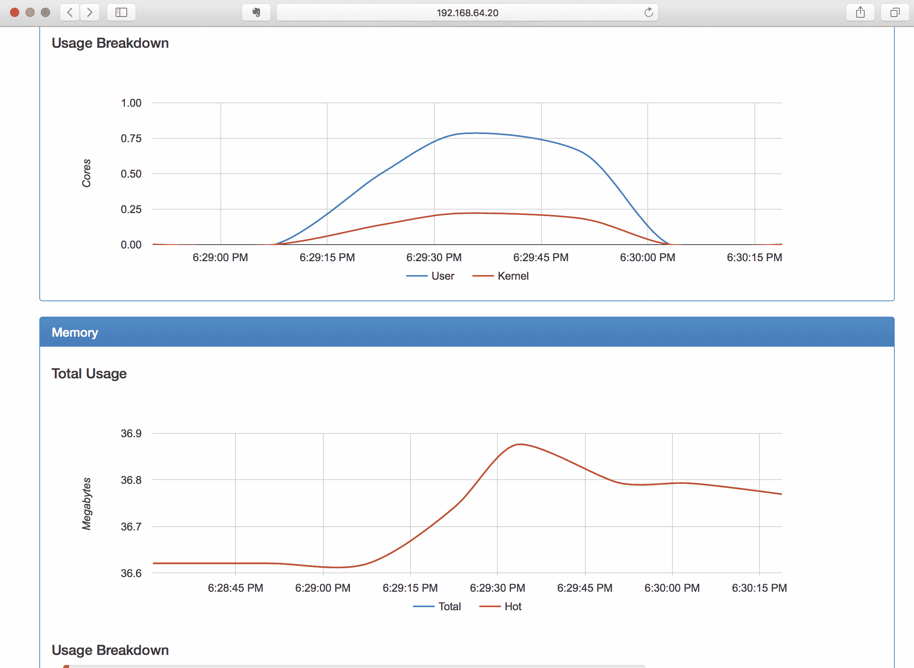

在这种情况下，您会看到我们的内存使用量基本保持在 36 MB 左右，而我们的 CPU 在负载测试期间达到峰值（这是您可能会预期到的应用程序行为）。

如果我们应用了前面的请求和限制示例，并更新了 flask 部署，那么当 CPU 达到大约 1/2 核心 CPU 限制时，您会看到负载趋于平稳。

这个过程的第三步主要是验证您对 CPU 和内存需求的评估是否符合长时间运行的负载测试。通常情况下，您会运行一个较长时间的负载（至少几分钟），并设置请求和限制来验证容器是否能够提供预期的流量。这种评估中最常见的缺陷是在进行长时间负载测试时看到内存缓慢增加，导致容器被 OOM 杀死（因超出内存限制而被终止）。

我们在示例中使用的 100 MiB RAM 比这个容器实际需要的内存要多得多，因此我们可以将其减少到 40 MiB 并进行最终验证步骤。

在设置请求和限制时，您希望选择最有效地描述您的需求的值，但不要浪费保留的资源。要运行更长时间的负载测试，请输入：

```
ab -c 100 -n 50000 http://flask-service.default:5000/
```

Grafana 的输出如下：

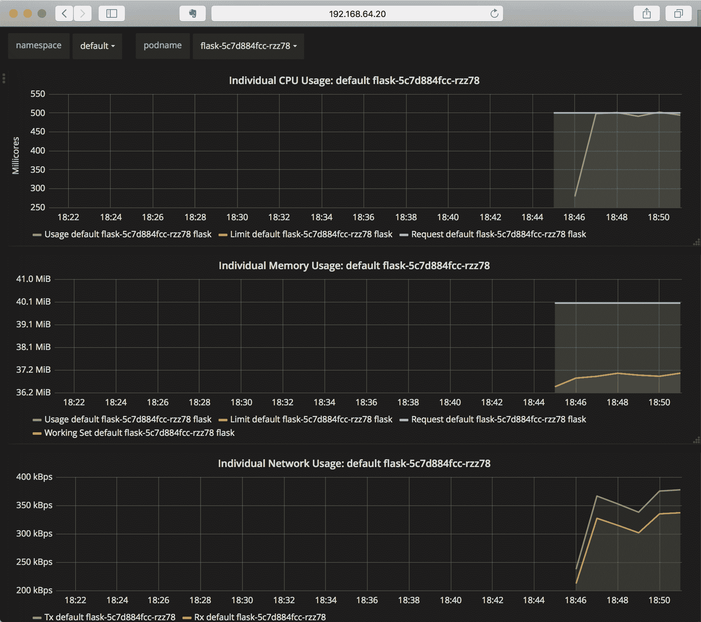

# 使用 Prometheus 捕获指标

Prometheus 是一个用于监控的知名开源工具，它与 Kubernetes 社区之间正在进行相当多的共生工作。Kubernetes 应用程序指标以 Prometheus 格式公开。该格式包括*counter*、*gauge*、*histogram*和*summary*的数据类型，以及一种指定与特定指标相关联的标签的方法。随着 Prometheus 和 Kubernetes 的发展，Prometheus 的指标格式似乎正在成为该项目及其各个组件中的事实标准。

有关此格式的更多信息可在 Prometheus 项目的文档中在线获取：

+   [`prometheus.io/docs/concepts/data_model/`](https://prometheus.io/docs/concepts/data_model/)

+   [`prometheus.io/docs/concepts/metric_types/`](https://prometheus.io/docs/concepts/metric_types/)

+   [`prometheus.io/docs/instrumenting/exposition_formats/`](https://prometheus.io/docs/instrumenting/exposition_formats/)

除了指标格式外，Prometheus 作为自己的开源项目提供了相当多样的功能，并且在 Kubernetes 之外也被使用。该项目的架构合理地展示了其主要组件：

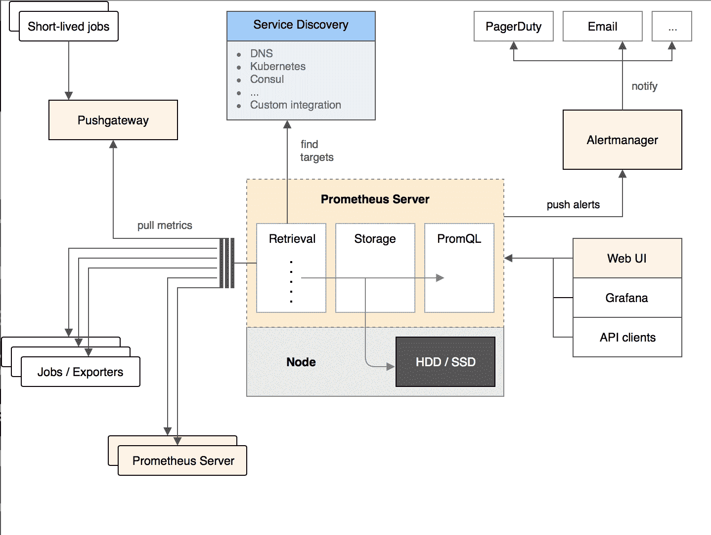

Prometheus 服务器本身是我们将在本章中研究的内容。在其核心，它定期地扫描多个远程位置，从这些位置收集数据，将其存储在短期时间序列数据库中，并提供一种查询该数据库的方法。Prometheus 的扩展允许系统将这些时间序列指标导出到其他系统以进行长期存储。此外，Prometheus 还包括一个警报管理器，可以配置为根据从时间序列指标中捕获和派生的信息发送警报，或更一般地调用操作。

Prometheus 并不打算成为指标的长期存储，并且可以与各种其他系统一起工作，以在长期内捕获和管理数据。常见的 Prometheus 安装保留数据 6 至 24 小时，可根据安装进行配置。

Prometheus 的最小安装包括 Prometheus 服务器本身和服务的配置。但是，为了充分利用 Prometheus，安装通常更加广泛和复杂，为 Alertmanager 和 Prometheus 服务器分别部署，可选地为推送网关部署（允许其他系统主动向 Prometheus 发送指标），以及一个 DaemonSet 来从集群中的每个节点捕获数据，将信息暴露和导出到 Prometheus 中，利用 cAdvisor。

更复杂的软件安装可以通过管理一组 YAML 文件来完成，就像我们在本书中之前所探讨的那样。有其他选项可以管理和安装一组部署、服务、配置等等。我们将利用这类工作中更常见的工具之一，Helm，而不是记录所有的部分，Helm 与 Kubernetes 项目密切相关，通常被称为*Kubernetes 的包管理器*。

您可以在项目的文档网站[`helm.sh`](https://helm.sh)上找到有关 Helm 的更多信息。

# 安装 Helm

Helm 是一个由命令行工具和在 Kubernetes 集群中运行的软件组成的双重系统，命令行工具与之交互。通常，您需要的是本地的命令行工具，然后再用它来安装所需的组件到您的集群中。

有关安装 Helm 命令行工具的文档可在项目网站上找到：[`github.com/kubernetes/helm/blob/master/docs/install.md.`](https://github.com/kubernetes/helm/blob/master/docs/install.md)

如果您在本地使用 macOS，则可以通过 Homebrew 获得，并且可以使用以下命令进行安装：

```
brew install kubernetes-helm
```

或者，如果您是从 Linux 主机工作，Helm 项目提供了一个脚本，您可以使用它来安装 Helm：

```
curl https://raw.githubusercontent.com/kubernetes/helm/master/scripts/get > get_helm.sh
chmod 700 get_helm.sh
./get_helm.sh
```

安装 Helm 后，您可以使用`helm init`命令在集群中安装运行的组件（称为 Tiller）。您应该会看到如下输出：

```
$HELM_HOME has been configured at /Users/heckj/.helm.

Tiller (the Helm server-side component) has been installed into your Kubernetes Cluster.
Happy Helming!
```

除了为其使用设置一些本地配置文件之外，这还在`kube-system`命名空间中为其集群端组件**Tiller**进行了部署。如果您想更详细地查看它，可以查看该部署：

```
kubectl describe deployment tiller-deploy -n kube-system
```

此时，您已经安装了 Helm，并且可以使用命令 Helm version 验证安装的版本（包括命令行和集群上的版本）。这与`kubectl` version 非常相似，报告了其版本以及与之通信的系统的版本。

```
helm version 
Client: &amp;version.Version{SemVer:"v2.7.2", GitCommit:"8478fb4fc723885b155c924d1c8c410b7a9444e6", GitTreeState:"clean"}
Server: &amp;version.Version{SemVer:"v2.7.2", GitCommit:"8478fb4fc723885b155c924d1c8c410b7a9444e6", GitTreeState:"clean"}
```

现在，我们可以继续设置 Helm 的原因：安装 Prometheus。

# 使用 Helm 安装 Prometheus

Helm 使用一组配置文件来描述安装需要什么，以什么顺序以及使用什么参数。这些配置称为图表，并在 GitHub 中维护，其中维护了默认的 Helm 存储库。

您可以使用命令`helm repo list`查看 Helm 正在使用的存储库。

```
helm repo list 
NAME URL
stable https://kubernetes-charts.storage.googleapis.com
local http://127.0.0.1:8879/charts
```

此默认值是围绕 GitHub 存储库的包装器，您可以在[`github.com/kubernetes/charts`](https://github.com/kubernetes/charts)上查看存储库的内容。查看所有可用于使用的图表的另一种方法是使用命令`helm search`。

确保您拥有存储库的最新缓存是个好主意。您可以使用命令`helm repo update`将缓存更新到最新状态，以在 GitHub 中镜像图表。

更新后的结果应该报告成功，并输出类似于：

```
help repo update

Hang tight while we grab the latest from your chart repositories...
...Skip local chart repository
...Successfully got an update from the "stable" chart repository
Update Complete.  Happy Helming!
```

我们将使用 stable/Prometheus 图表（托管在[`github.com/kubernetes/charts/tree/master/stable/prometheus`](https://github.com/kubernetes/charts/tree/master/stable/prometheus)）。我们可以使用 Helm 将该图表拉取到本地，以便更详细地查看它。

```
helm fetch --untar stable/prometheus 
```

此命令从默认存储库下载图表并在名为 Prometheus 的目录中本地解压缩。查看目录，您应该会看到几个文件和一个名为`templates`的目录：

```
.helmignore
Chart.yaml
README.md
templates
values.yaml
```

这是图表的常见模式，其中`Chart.yaml`描述了将由图表安装的软件。`values.yaml`是一组默认配置值，这些值在将要创建的各种 Kubernetes 资源中都会使用，并且模板目录包含了将被渲染出来以安装集群中所需的所有 Kubernetes 资源的模板文件集合。通常，`README.md`将包括`values.yaml`中所有值的描述，它们的用途以及安装建议。

现在，我们可以安装`prometheus`，我们将利用 Helm 的一些选项来设置一个发布名称并使用命名空间来进行安装。

```
helm install prometheus -n monitor --namespace monitoring
```

这将安装`prometheus`目录中包含的图表，将所有组件安装到命名空间`monitoring`中，并使用发布名称`monitor`为所有对象添加前缀。如果我们没有指定这些值中的任何一个，Helm 将使用默认命名空间，并生成一个随机的发布名称来唯一标识安装。

调用此命令时，您将看到相当多的输出，描述了在过程开始时创建的内容及其状态，然后是提供有关如何访问刚刚安装的软件的信息的注释部分：

```
NAME: monitor
LAST DEPLOYED: Sun Jan 14 15:00:40 2018
NAMESPACE: monitoring
STATUS: DEPLOYED
RESOURCES:
==> v1/ConfigMap
NAME DATA AGE
monitor-prometheus-alertmanager 1 1s
monitor-prometheus-server 3 1s

==> v1/PersistentVolumeClaim
NAME STATUS VOLUME CAPACITY ACCESS MODES STORAGECLASS AGE
monitor-prometheus-alertmanager Bound pvc-be6b3367-f97e-11e7-92ab-e697d60b4f2f 2Gi RWO standard 1s
monitor-prometheus-server Bound pvc-be6b8693-f97e-11e7-92ab-e697d60b4f2f 8Gi RWO standard 1s

==> v1/Service
NAME TYPE CLUSTER-IP EXTERNAL-IP PORT(S) AGE
monitor-prometheus-alertmanager ClusterIP 10.100.246.164 <none> 80/TCP 1s
monitor-prometheus-kube-state-metrics ClusterIP None <none> 80/TCP 1s
monitor-prometheus-node-exporter ClusterIP None <none> 9100/TCP 1s
monitor-prometheus-pushgateway ClusterIP 10.97.187.101 <none> 9091/TCP 1s
monitor-prometheus-server ClusterIP 10.110.247.151 <none> 80/TCP 1s

==> v1beta1/DaemonSet
NAME DESIRED CURRENT READY UP-TO-DATE AVAILABLE NODE SELECTOR AGE
monitor-prometheus-node-exporter 1 1 0 1 0 <none> 1s

==> v1beta1/Deployment
NAME DESIRED CURRENT UP-TO-DATE AVAILABLE AGE
monitor-prometheus-alertmanager 1 1 1 0 1s
monitor-prometheus-kube-state-metrics 1 1 1 0 1s
monitor-prometheus-pushgateway 1 1 1 0 1s
monitor-prometheus-server 1 1 1 0 1s

==> v1/Pod(related)
NAME READY STATUS RESTARTS AGE
monitor-prometheus-node-exporter-bc9jp 0/1 ContainerCreating 0 1s
monitor-prometheus-alertmanager-6c59f855d-bsp7t 0/2 ContainerCreating 0 1s
monitor-prometheus-kube-state-metrics-57747bc8b6-l7pzw 0/1 ContainerCreating 0 1s
monitor-prometheus-pushgateway-5b99967d9c-zd7gc 0/1 ContainerCreating 0 1s
monitor-prometheus-server-7895457f9f-jdvch 0/2 Pending 0 1s

NOTES:
The prometheus server can be accessed via port 80 on the following DNS name from within your cluster:
monitor-prometheus-server.monitoring.svc.cluster.local

Get the prometheus server URL by running these commands in the same shell:
 export POD_NAME=$(kubectl get pods --namespace monitoring -l "app=prometheus,component=server" -o jsonpath="{.items[0].metadata.name}")
 kubectl --namespace monitoring port-forward $POD_NAME 9090

The prometheus alertmanager can be accessed via port 80 on the following DNS name from within your cluster:
monitor-prometheus-alertmanager.monitoring.svc.cluster.local

Get the Alertmanager URL by running these commands in the same shell:
 export POD_NAME=$(kubectl get pods --namespace monitoring -l "app=prometheus,component=alertmanager" -o jsonpath="{.items[0].metadata.name}")
 kubectl --namespace monitoring port-forward $POD_NAME 9093

The prometheus PushGateway can be accessed via port 9091 on the following DNS name from within your cluster:
monitor-prometheus-pushgateway.monitoring.svc.cluster.local

Get the PushGateway URL by running these commands in the same shell:
 export POD_NAME=$(kubectl get pods --namespace monitoring -l "app=prometheus,component=pushgateway" -o jsonpath="{.items[0].metadata.name}")
 kubectl --namespace monitoring port-forward $POD_NAME 9093

For more information on running prometheus, visit:
https://prometheus.io/
```

`helm list`将显示您已安装的当前发布：

```
NAME REVISION UPDATED STATUS CHART NAMESPACE
monitor 1 Sun Jan 14 15:00:40 2018 DEPLOYED prometheus-4.6.15 monitoring
```

您可以使用`helm status`命令，以及发布的名称，来获取图表创建的所有 Kubernetes 资源的当前状态：

```
helm status monitor
```

注释部分包含在模板中，并在每次状态调用时重新呈现，通常编写以包括有关如何访问软件的说明。

您可以安装图表而无需显式先检索它。Helm 首先使用任何本地图表，但会回退到搜索其可用存储库，因此我们可以只使用以下命令安装相同的图表：

`**helm install stable/prometheus -n monitor --namespace monitoring**`

您还可以让 Helm 混合`values.yaml`和其模板，以呈现出它将创建的所有对象并简单显示它们，这对于查看所有部件将如何组合在一起很有用。执行此操作的命令是`helm template`，要呈现用于创建 Kubernetes 资源的 YAML，命令将是：

```
helm template prometheus -n monitor --namespace monitoring
```

`helm template`命令确实需要图表在本地文件系统上可用，因此，虽然`helm install`可以从远程存储库中工作，但您需要使用`helm fetch`将图表本地化，以便利用`helm template`命令。

# 使用 Prometheus 查看指标

使用注释中提供的详细信息，您可以设置端口转发，就像我们在本书中之前所做的那样，并直接访问 Prometheus。从注释中显示的信息如下：

```
export POD_NAME=$(kubectl get pods --namespace monitoring -l "app=prometheus,component=server" -o jsonpath="{.items[0].metadata.name}")

kubectl --namespace monitoring port-forward $POD_NAME 9090
```

这将允许您直接使用浏览器访问 Prometheus 服务器。在终端中运行这些命令，然后打开浏览器并导航到`http://localhost:9090/`。

您可以通过查看`http://localhost:9090/targets`上的目标列表来查看 Prometheus 正在监视的当前状态：

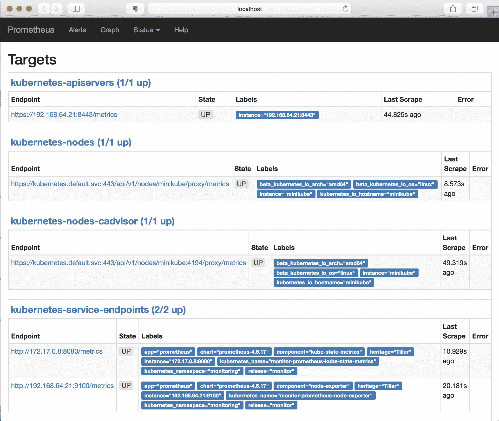

切换到 Prometheus 查询/浏览器，网址为`http://localhost:9090/graph`，以查看 Prometheus 收集的指标。收集了大量的指标，我们特别感兴趣的是与之前在 cAdvisor 和 Heapster 中看到的信息匹配的指标。在 Kubernetes 1.7 版本及更高版本的集群中，这些指标已经移动，并且是由我们在屏幕截图中看到的`kubernetes-nodes-cadvisor`作业专门收集的。

在查询浏览器中，您可以开始输入指标名称，它将尝试自动完成，或者您可以使用下拉菜单查看所有可能的指标列表。输入指标名称`container_memory_usage_bytes`，然后按*Enter*以以表格形式查看这些指标的列表。

良好指标的一般形式将具有一些指标的标识符，并且通常以单位标识符结尾，在本例中为字节。查看表格，您可以看到收集的指标以及每个指标的相当密集的键值对。

这些键值对是指标上的标签，并且在整体上类似于 Kubernetes 中的标签和选择器的工作方式。

一个示例指标，重新格式化以便更容易阅读，如下所示：

```
container_memory_usage_bytes{
  beta_kubernetes_io_arch="amd64",
  beta_kubernetes_io_os="linux",
  container_name="POD",
  id="/kubepods/podf887aff9-f981-11e7-92ab-e697d60b4f2f/25fa74ef205599036eaeafa7e0a07462865f822cf364031966ff56a9931e161d",
  image="gcr.io/google_containers/pause-amd64:3.0",
  instance="minikube",
  job="kubernetes-nodes-cadvisor",
  kubernetes_io_hostname="minikube",
  name="k8s_POD_flask-5c7d884fcc-2l7g9_default_f887aff9-f981-11e7-92ab-e697d60b4f2f_0",
  namespace="default",
  pod_name="flask-5c7d884fcc-2l7g9"
}  249856
```

在查询中，我们可以通过在查询中包含与这些标签匹配的内容来过滤我们感兴趣的指标。例如，与特定容器相关联的所有指标都将具有`image`标签，因此我们可以仅过滤这些指标：

```
container_memory_usage_bytes{image!=""}
```

您可能已经注意到，命名空间和 pod 名称也包括在内，我们也可以进行匹配。例如，只查看与我们部署示例应用程序的默认命名空间相关的指标，我们可以添加`namespace="default"`：

```
container_memory_usage_bytes{image!="",namespace="default"}
```

这开始变得更合理了。虽然表格将向您显示最近的值，但我们感兴趣的是这些值的历史记录。如果您选择当前查询上的图形按钮，它将尝试呈现出您选择的指标的单个图形，例如：

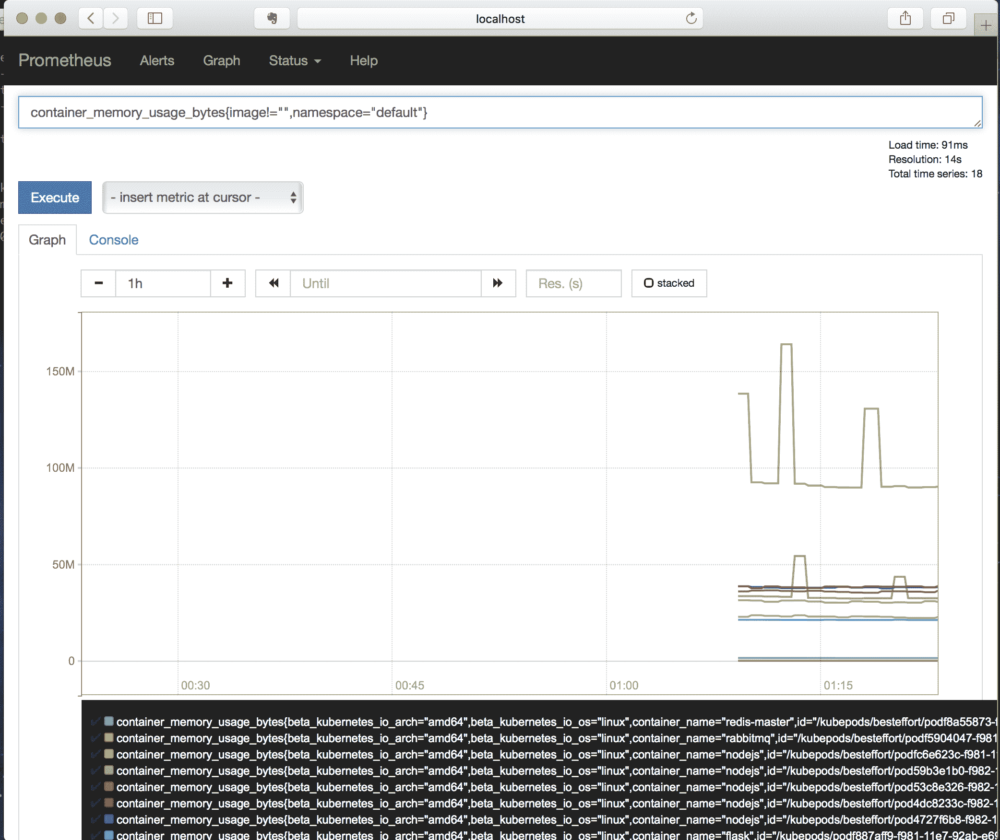

由于指标还包括`container_name`以匹配部署，您可以将其调整为单个容器。例如，查看与我们的`flask`部署相关的内存使用情况：

```
container_memory_usage_bytes{image!="",namespace="default",container_name="flask"}
```

如果我们增加`flask`部署中副本的数量，它将为每个容器创建新的指标，因此为了不仅查看单个容器而且一次查看多个集合，我们可以利用 Prometheus 查询语言中的聚合运算符。一些最有用的运算符包括`sum`、`count`、`count_values`和`topk`。

我们还可以使用这些相同的聚合运算符将指标分组在一起，其中聚合集合具有不同的标签值。例如，在将`flask`部署的副本增加到三个后，我们可以查看部署的总内存使用情况：

```
sum(container_memory_usage_bytes{image!="",
namespace="default",container_name="flask"})
```

然后再次按照 Pod 名称将其分解为每个容器：

```
sum(container_memory_usage_bytes{image!="",
namespace="default",container_name="flask"}) by (name)
```

图形功能可以为您提供一个良好的视觉概览，包括堆叠值，如下所示：

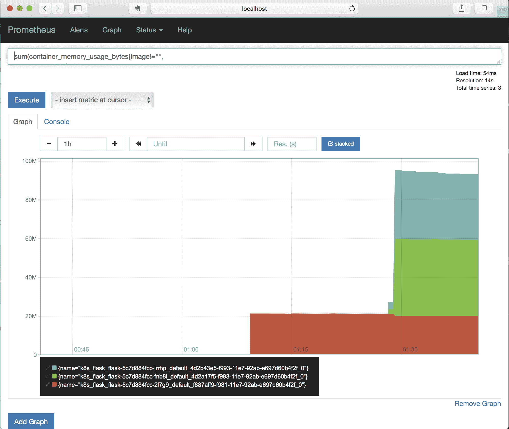

随着图形变得更加复杂，您可能希望开始收集您认为最有趣的查询，以及组合这些图形的仪表板，以便能够使用它们。这将引导我们进入另一个开源项目 Grafana，它可以很容易地在 Kubernetes 上托管，提供仪表板和图形。

# 安装 Grafana

Grafana 本身并不是一个复杂的安装，但配置它可能会很复杂。Grafana 可以插入多种不同的后端系统，并为它们提供仪表板和图形。在我们的示例中，我们希望它从 Prometheus 提供仪表板。我们将设置一个安装，然后通过其用户界面进行配置。

我们可以再次使用 Helm 来安装 Grafana，由于我们已经将 Prometheus 放在监控命名空间中，我们将用相同的方式处理 Grafana。我们可以使用`helm fetch`并安装来查看图表。在这种情况下，我们将直接安装它们：

```
helm install stable/grafana -n viz --namespace monitoring
```

在生成的输出中，您将看到一个秘密、ConfigMap 和部署等资源被创建，并且在注释中会有类似以下内容：

```
NOTES:
1\. Get your 'admin' user password by running:

kubectl get secret --namespace monitoring viz-grafana -o jsonpath="{.data.grafana-admin-password}" | base64 --decode ; echo

2\. The Grafana server can be accessed via port 80 on the following DNS name from within your cluster:

viz-grafana.monitoring.svc.cluster.local

Get the Grafana URL to visit by running these commands in the same shell:

export POD_NAME=$(kubectl get pods --namespace monitoring -l "app=viz-grafana,component=grafana" -o jsonpath="{.items[0].metadata.name}")
 kubectl --namespace monitoring port-forward $POD_NAME 3000

3\. Login with the password from step 1 and the username: admin
```

注释首先包括有关检索秘密的信息。这突出了一个功能，您将看到在几个图表中使用：当它需要一个机密密码时，它将生成一个唯一的密码并将其保存为秘密。这个秘密直接可供访问命名空间和`kubectl`的人使用。

使用提供的命令检索 Grafana 界面的密码：

```
kubectl get secret --namespace monitoring viz-grafana -o jsonpath="{.data.grafana-admin-password}" | base64 --decode ; echo
```

然后打开终端并运行这些命令以访问仪表板：

```
export POD_NAME=$(kubectl get pods --namespace monitoring -l "app=viz-grafana,component=grafana" -o jsonpath="{.items[0].metadata.name}")

kubectl --namespace monitoring port-forward $POD_NAME 3000
```

然后，打开浏览器窗口，导航至`https://localhost:3000/`，这将显示 Grafana 登录窗口：

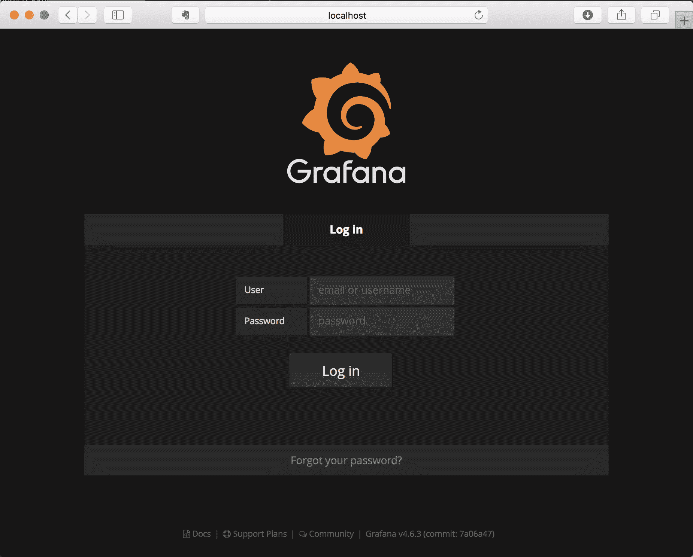

现在，使用用户名`admin`登录；密码是您之前检索到的秘密。这将带您进入 Grafana 中的主页仪表板，您可以在那里配置数据源并将图形组合成仪表板：

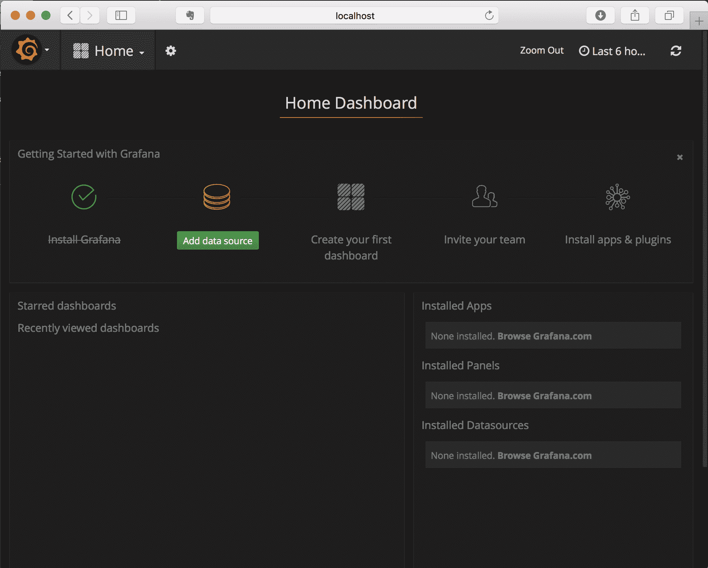

点击“添加数据源”，您将看到一个带有两个选项卡的窗口：配置允许您设置数据源的位置，仪表板允许您导入仪表板配置。

在配置下，将数据源的类型设置为 Prometheus，在名称处，您可以输入`prometheus`。在类型之后命名数据源有点多余，如果您的集群上有多个 Prometheus 实例，您会希望为它们分别命名，并且特定于它们的目的。在 URL 中添加我们的 Prometheus 实例的 DNS 名称，以便 Grafana 可以访问它：`http://monitor-prometheus-server.monitoring.svc.cluster.local`。在使用 Helm 安装 Prometheus 时，这个相同的名称在注释中列出了。

点击“仪表板”选项卡，并导入 Prometheus 统计信息和 Grafana 指标，这将为 Prometheus 和 Grafana 本身提供内置仪表板。点击返回到“配置”选项卡，向下滚动，并点击“添加”按钮设置 Prometheus 数据源。当您添加时，您应该会看到“数据源正在工作”。

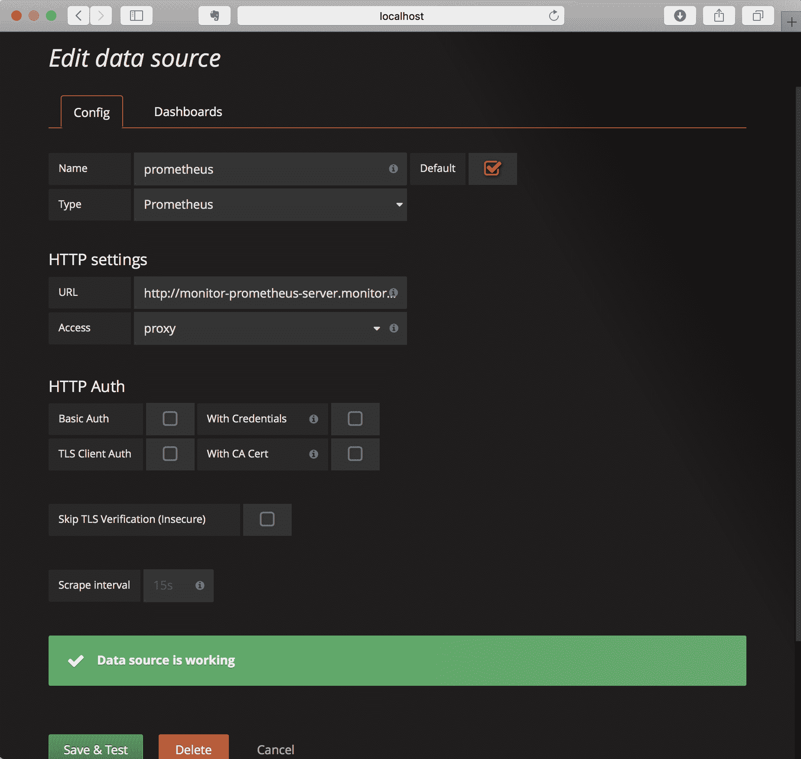

现在，您可以导航到内置仪表板并查看一些信息。网页用户界面的顶部由下拉菜单组成，左上角导航到整体 Grafana 配置，下一个列出了您设置的仪表板，通常从主页仪表板开始。选择我们刚刚导入的 Prometheus Stats 仪表板，您应该会看到有关 Prometheus 的一些初始信息：

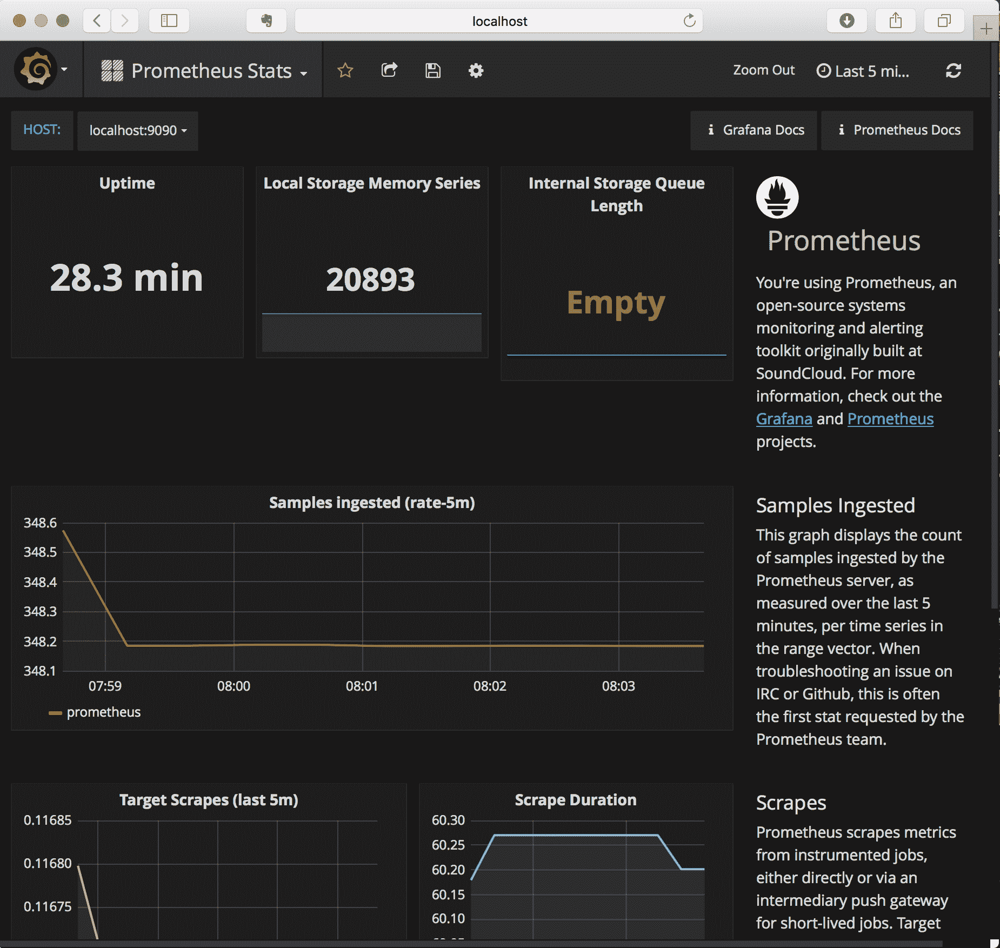

Grafana 项目维护了一系列仪表板，您可以搜索并直接使用，或者用作灵感来修改和创建自己的仪表板。您可以搜索已共享的仪表板，例如，将其限制为来自 Prometheus 并与 Kubernetes 相关的仪表板。您将看到各种各样的仪表板可供浏览，其中一些包括屏幕截图，网址为[`grafana.com/dashboards?dataSource=prometheus&amp;search=kubernetes`](https://grafana.com/dashboards?dataSource=prometheus&search=kubernetes)。

您可以使用仪表板编号将其导入到 Grafana 的实例中。例如，仪表板 1621 和 162 是用于监视整个集群健康状况的常见仪表板：

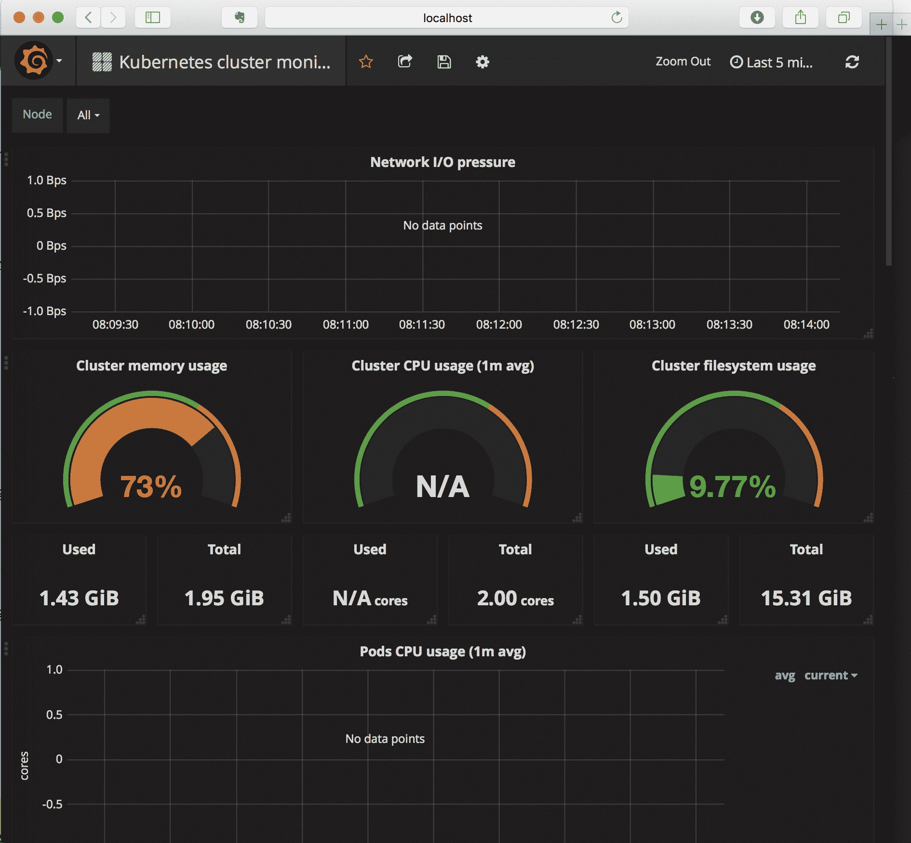

这些仪表板的最佳价值在于向您展示如何配置自己的图形并制作自己的仪表板。在每个仪表板中，您可以选择图形并选择编辑以查看使用的查询和显示选择，并根据您的值进行微调。每个仪表板也可以共享回 Grafana 托管站点，或者您可以查看配置的 JSON 并将其保存在本地。

Prometheus 运营商正在努力使启动 Prometheus 和 Grafana 变得更容易，预先配置并运行以监视您的集群和集群内的应用程序。如果您有兴趣尝试一下，请参阅 CoreOS 托管的项目 README [`github.com/coreos/prometheus-operator/tree/master/helm`](https://github.com/coreos/prometheus-operator/tree/master/helm)，也可以使用 Helm 进行安装。

现在您已经安装了 Grafana 和 Prometheus，您可以使用它们来遵循类似的过程，以确定您自己软件的 CPU 和内存利用率，同时运行负载测试。在本地运行 Prometheus 的一个好处是它提供了收集有关您的应用程序的指标的能力。

# 使用 Prometheus 查看应用程序指标

虽然您可以在 Prometheus 中添加作业以包括从特定端点抓取 Prometheus 指标的配置，但我们之前进行的安装包括一个将根据 Pod 上的注释动态更新其查看内容的配置。 Prometheus 的一个好处是它支持根据注释自动检测集群中的更改，并且可以查找支持服务的 Pod 的端点。

由于我们使用 Helm 部署了 Prometheus，您可以在`values.yaml`文件中找到相关的配置。查找 Prometheus 作业`kubernetes-service-endpoints`，您将找到配置和一些关于如何使用它的文档。如果您没有本地文件，可以在[`github.com/kubernetes/charts/blob/master/stable/prometheus/values.yaml#L747-L776`](https://github.com/kubernetes/charts/blob/master/stable/prometheus/values.yaml#L747-L776)上查看此配置。

此配置查找集群中具有注释`prometheus.io/scrape`的服务。如果设置为`true`，那么 Prometheus 将自动尝试将该端点添加到其正在监视的目标列表中。默认情况下，它将尝试访问 URI`/metrics`上的指标，并使用与服务相同的端口。您可以使用其他注释来更改这些默认值，例如，`prometheus.io/path = "/alternatemetrics"`将尝试从路径`/alternatemetrics`读取指标。

通过使用服务作为组织指标收集的手段，我们有一个机制，它将根据 Pod 的数量自动扩展。而在其他环境中，您可能需要每次添加或删除实例时重新配置监控，Prometheus 和 Kubernetes 无缝协作捕获这些数据。

这种能力使我们能够轻松地从我们的应用程序中公开自定义指标，并让 Prometheus 捕获这些指标。这可以有几种用途，但最明显的是更好地了解应用程序的运行情况。有了 Prometheus 收集指标和 Grafana 作为仪表板工具，您还可以使用这种组合来创建自己的应用程序仪表板。

Prometheus 项目支持多种语言的客户端库，使其更容易收集和公开指标。我们将使用其中一些库来向您展示如何为我们的 Python 和 Node.js 示例进行仪器化。在直接使用这些库之前，非常值得阅读 Prometheus 项目提供的有关如何编写指标导出器以及其对指标名称的预期约定的文档。您可以在项目网站找到这些文档：[`prometheus.io/docs/instrumenting/writing_exporters/`](https://prometheus.io/docs/instrumenting/writing_exporters/)。

# 使用 Prometheus 的 Flask 指标

您可以在[`github.com/prometheus/client_python`](https://github.com/prometheus/client_python)找到从 Python 公开指标的库，并可以使用以下命令使用`pip`进行安装：

```
pip install prometheus_client
```

根据您的设置，您可能需要使用`**sudo pip install prometheus_client**`使用`pip`安装客户端。

对于我们的`flask`示例，您可以从[`github.com/kubernetes-for-developers/kfd-flask`](https://github.com/kubernetes-for-developers/kfd-flask)的 0.5.0 分支下载完整的示例代码。获取此更新示例的命令如下：

```
git clone https://github.com/kubernetes-for-developers/kfd-flask -b 0.5.0
```

如果您查看`exampleapp.py`，您可以看到我们使用两个指标的代码，即直方图和计数器，并使用 flask 框架在请求开始和请求结束时添加回调，并捕获该时间差：

```
FLASK_REQUEST_LATENCY = Histogram('flask_request_latency_seconds', 'Flask Request Latency',
 ['method', 'endpoint'])
FLASK_REQUEST_COUNT = Counter('flask_request_count', 'Flask Request Count',
 ['method', 'endpoint', 'http_status'])

def before_request():
   request.start_time = time.time()

def after_request(response):
   request_latency = time.time() - request.start_time
   FLASK_REQUEST_LATENCY.labels(request.method, request.path).observe(request_latency)
   FLASK_REQUEST_COUNT.labels(request.method, request.path, response.status_code).inc()
   return response
```

该库还包括一个辅助应用程序，使得生成 Prometheus 要抓取的指标非常容易：

```
@app.route('/metrics')
def metrics():
   return make_response(generate_latest())
```

该代码已制作成容器映像`quay.io/kubernetes-for-developers/flask:0.5.0`。有了这些添加，我们只需要将注释添加到`flask-service`：

```
kind: Service
apiVersion: v1
metadata:
   name: flask-service
   annotations:
       prometheus.io/scrape: "true"
spec:
  type: NodePort
  ports:
  - port: 5000
  selector:
      app: flask
```

从示例目录中使用`kubectl apply -f deploy/`部署后，该服务将由单个 pod 支持，并且 Prometheus 将开始将其作为目标。如果您使用`kubectl proxy`命令，您可以查看此生成的特定指标响应。在我们的情况下，pod 的名称是`flask-6596b895b-nqqqz`，因此可以轻松查询指标`http://localhost:8001/api/v1/proxy/namespaces/default/pods/flask-6596b895b-nqqqz/metrics`。

这些指标的示例如下：

```
flask_request_latency_seconds_bucket{endpoint="/",le="0.005",method="GET"} 13.0 flask_request_latency_seconds_bucket{endpoint="/",le="0.01",method="GET"} 13.0 flask_request_latency_seconds_bucket{endpoint="/",le="0.025",method="GET"} 13.0 flask_request_latency_seconds_bucket{endpoint="/",le="0.05",method="GET"} 13.0 flask_request_latency_seconds_bucket{endpoint="/",le="0.075",method="GET"} 13.0 flask_request_latency_seconds_bucket{endpoint="/",le="0.1",method="GET"} 13.0 flask_request_latency_seconds_bucket{endpoint="/",le="0.25",method="GET"} 13.0 flask_request_latency_seconds_bucket{endpoint="/",le="0.5",method="GET"} 13.0 flask_request_latency_seconds_bucket{endpoint="/",le="0.75",method="GET"} 13.0 flask_request_latency_seconds_bucket{endpoint="/",le="1.0",method="GET"} 13.0 flask_request_latency_seconds_bucket{endpoint="/",le="2.5",method="GET"} 13.0 flask_request_latency_seconds_bucket{endpoint="/",le="5.0",method="GET"} 13.0 flask_request_latency_seconds_bucket{endpoint="/",le="7.5",method="GET"} 13.0 flask_request_latency_seconds_bucket{endpoint="/",le="10.0",method="GET"} 13.0 flask_request_latency_seconds_bucket{endpoint="/",le="+Inf",method="GET"} 13.0 flask_request_latency_seconds_count{endpoint="/",method="GET"} 13.0 flask_request_latency_seconds_sum{endpoint="/",method="GET"} 0.0012879371643066406 
# HELP flask_request_count Flask Request Count 
# TYPE flask_request_count counter flask_request_count{endpoint="/alive",http_status="200",method="GET"} 645.0 flask_request_count{endpoint="/ready",http_status="200",method="GET"} 644.0 flask_request_count{endpoint="/metrics",http_status="200",method="GET"} 65.0 flask_request_count{endpoint="/",http_status="200",method="GET"} 13.0
```

您可以在此示例中看到名为`flask_request_latency_seconds`和`flask_request_count`的指标，并且您可以在 Prometheus 浏览器界面中查询相同的指标。

# 使用 Prometheus 的 Node.js 指标

JavaScript 具有与 Python 类似的客户端库。实际上，使用`express-prom-bundle`来为 Node.js express 应用程序提供仪表板甚至更容易，该库反过来使用`prom-client`。您可以使用以下命令安装此库以供您使用：

```
npm install express-prom-bundle --save
```

然后您可以在您的代码中使用它。以下内容将为 express 设置一个中间件：

```
const promBundle = require("express-prom-bundle");
const metricsMiddleware = promBundle({includeMethod: true});
```

然后，您只需包含中间件，就像您正在设置此应用程序一样：

```
app.use(metricsMiddleware)
```

[`github.com/kubernetes-for-developers/kfd-nodejs`](https://github.com/kubernetes-for-developers/kfd-nodejs)上的示例代码已经更新，您可以使用以下命令从 0.5.0 分支检查此代码：

```
git clone https://github.com/kubernetes-for-developers/kfd-nodejs -b 0.5.0
```

与 Python 代码一样，Node.js 示例包括使用注释`prometheus.io/scrape: "true"`更新服务：

```
kind: Service
apiVersion: v1
metadata:
 name: nodejs-service
 annotations:
   prometheus.io/scrape: "true"
spec:
 ports:
 - port: 3000
   name: web
 clusterIP: None
 selector:
   app: nodejs
```

# Prometheus 中的服务信号

您可以通过三个关键指标来了解您服务的健康和状态。服务仪表板通常会基于这些指标进行仪表化和构建，作为了解您的服务运行情况的基线，这已经相对普遍。

这些网络服务的关键指标是：

+   错误率

+   响应时间

+   吞吐量

错误率可以通过使用`http_request_duration_seconds_count`指标中的标签来收集，该指标包含在`express-prom-bundle`中。我们可以在 Prometheus 中使用的查询。我们可以匹配响应代码的格式，并计算 500 个响应与所有响应的增加数量。

Prometheus 查询可以是：

```
sum(increase(http_request_duration_seconds_count{status_code=~"⁵..$"}[5m])) / sum(increase(http_request_duration_seconds_count[5m]))
```

在我们自己的示例服务上几乎没有负载，可能没有错误，这个查询不太可能返回任何数据点，但你可以用它作为一个示例来探索构建你自己的错误响应查询。

响应时间很难测量和理解，特别是对于繁忙的服务。我们通常包括一个用于处理请求所需时间的直方图指标的原因是为了能够查看这些请求随时间的分布。使用直方图，我们可以在一个窗口内聚合请求，然后查看这些请求的速率。在我们之前的 Python 示例中，`flask_request_latency_seconds`是一个直方图，每个请求都带有它在直方图桶中的位置标签，使用的 HTTP 方法和 URI 端点。我们可以使用这些标签聚合这些请求的速率，并使用以下 Prometheus 查询查看中位数、95^(th)和 99^(th)百分位数：

中位数:

```
histogram_quantile(0.5, sum(rate(flask_request_latency_seconds_bucket[5m])) by (le, method, endpoint))
```

95^(th)百分位数：

```
histogram_quantile(0.95, sum(rate(flask_request_latency_seconds_bucket[5m])) by (le, method, endpoint))
```

99^(th)百分位数：

```
histogram_quantile(0.99, sum(rate(flask_request_latency_seconds_bucket[5m])) by (le, method, endpoint))
```

吞吐量是关于在给定时间范围内测量请求总数的，可以直接从`flask_request_latency_seconds_count`中派生，并针对端点和方法进行查看：

```
sum(rate(flask_request_latency_seconds_count[5m])) by (method, endpoint)
```

# 总结

在本章中，我们介绍了 Prometheus，并展示了如何安装它，使用它从您的 Kubernetes 集群中捕获指标，并展示了如何安装和使用 Grafana 来提供仪表板，使用在 Prometheus 中临时存储的指标。然后，我们看了一下如何从您自己的代码中暴露自定义指标，并利用 Prometheus 来捕获它们，以及一些您可能有兴趣跟踪的指标的示例，如错误率、响应时间和吞吐量。

在下一章中，我们将继续使用工具来帮助我们捕获日志和跟踪，以便观察我们的应用程序。
