# 日志和跟踪

当我们最初开始使用容器和 Kubernetes 时，我们展示了如何使用`kubectl log`命令从任何一个容器中获取日志输出。随着我们希望获取信息的容器数量增加，轻松找到相关日志的能力变得越来越困难。在上一章中，我们看了如何聚合和收集指标，在本章中，我们扩展了相同的概念，看看如何聚合日志并更好地了解容器如何与分布式跟踪一起工作。

本章的主题包括：

+   一个 Kubernetes 概念- DaemonSet

+   安装 Elasticsearch，Fluentd 和 Kibana

+   使用 Kibana 查看日志

+   使用 Jeager 进行分布式跟踪

+   将跟踪添加到您的应用程序的一个例子

# 一个 Kubernetes 概念- DaemonSet

我们现在使用的一个 Kubernetes 资源（通过 Helm）是 DaemonSet。这个资源是围绕 pod 的一个包装，与 ReplicaSet 非常相似，但其目的是在集群中的每个节点上运行一个 pod。当我们使用 Helm 安装 Prometheus 时，它创建了一个 DaemonSet，在 Kubernetes 集群中的每个节点上运行 node-collector。

在应用程序中运行支持软件有两种常见模式：第一种是使用 side-car 模式，第二种是使用 DaemonSet。side-car 是指在您的 pod 中包含一个容器，其唯一目的是与主要应用程序一起运行并提供一些支持，但是外部的角色。一个有用的 side-car 的例子可能是缓存，或某种形式的代理服务。运行 side-car 应用程序显然会增加 pod 所需的资源，如果 pod 的数量相对较低，或者与集群的规模相比它们是稀疏的，那么这将是提供支持软件的最有效方式。

当您运行的支持软件在单个节点上可能被复制多次，并且提供的服务相当通用（例如日志聚合或指标收集）时，在集群中的每个节点上运行一个单独的 pod 可能会更有效。这正是 DaemonSet 的用武之地。

我们之前使用 DaemonSet 的示例是在集群中的每个节点上运行一个 node-collector 实例。node-collector DaemonSet 的目的是收集有关每个节点操作的统计数据和指标。Kubernetes 还使用 DaemonSet 来运行自己的服务，例如在集群中的每个节点上运行的 kube-proxy。如果您正在使用覆盖网络连接您的 Kubernetes 集群，例如 Weave 或 Flannel，它也经常使用 DaemonSet 运行。另一个常见的用例是我们将在本章中更多地探讨的用例，即收集和转发日志。

DaemonSet 规范的必需字段与部署或作业类似；除了`apiVersion`、`kind`和`metadata`之外，DaemonSet 还需要一个包含模板的 spec，该模板用于在每个节点上创建 pod。此外，模板可以具有`nodeSelector`来匹配一组或子集可用的节点。

查看 Helm 在安装`prometheus`时创建的 YAML。您可以了解到 DaemonSet 的数据是如何布局的。以下输出来自命令：

```
helm template prometheus -n monitor --namespace monitoring
```

Helm 生成的 DaemonSet 规范如下：

```
apiVersion: extensions/v1beta1 kind: DaemonSet metadata:
  labels:
  app: prometheus
  chart: prometheus-4.6.17
  component: "node-exporter"
  heritage: Tiller
  release: monitor
  name: monitor-prometheus-node-exporter spec:
  updateStrategy:
  type: OnDelete   template:
  metadata:
  labels:
  app: prometheus
  component: "node-exporter"
  release: monitor
  spec:
  serviceAccountName: "default"
  containers:
 - name: prometheus-node-exporter
  image: "prom/node-exporter:v0.15.0"
  imagePullPolicy: "IfNotPresent"
  args:
 - --path.procfs=/host/proc
 - --path.sysfs=/host/sys
  ports:
 - name: metrics
  containerPort: 9100
  hostPort: 9100
  resources:
 {}  volumeMounts:
 - name: proc
  mountPath: /host/proc
  readOnly: true
 - name: sys
  mountPath: /host/sys
  readOnly: true
  hostNetwork: true
  hostPID: true
  volumes:
 - name: proc
  hostPath:
  path: /proc
 - name: sys
  hostPath:
  path: /sys
```

这个 DaemonSet 在每个节点上运行一个单一的容器，使用镜像`prom/node-exporter:0.15`，从卷挂载点（`/proc`和`/sys`非常特定于 Linux）收集指标，并在端口`9100`上公开它们，以便`prometheus`通过 HTTP 请求进行抓取。

# 安装和使用 Elasticsearch、Fluentd 和 Kibana

Fluentd 是经常用于收集和聚合日志的软件。托管在[`www.fluentd.org`](https://www.fluentd.org)，就像 prometheus 一样，它是由**Cloud Native Computing Foundation** (**CNCF**)管理的开源软件。在谈论聚合日志时，问题早在容器出现之前就存在，ELK 是一个常用的缩写，代表了一个解决方案，即 Elasticsearch、Logstash 和 Kibana 的组合。在使用容器时，日志来源的数量增加，使得收集所有日志的问题变得更加复杂，Fluentd 发展成为支持与 Logstash 相同领域的软件，专注于使用 JSON 格式的结构化日志，路由和支持处理日志的插件。Fluentd 是用 Ruby 和 C 编写的，旨在比 LogStash 更快，更高效，而 Fluent Bit ([`fluentbit.io`](http://fluentbit.io))也延续了相同的模式，具有更小的内存占用。您甚至可能会看到 EFK 的引用，它代表 Elasticsearch、Fluentd 和 Kibana 的组合。

在 Kubernetes 社区中，捕获和聚合日志的常见解决方案之一是 Fluentd，甚至在 Minikube 的最新版本中作为可以使用的插件之一内置。

如果您正在使用 Minikube，可以通过启用 Minikube 插件来轻松尝试 EFK。尽管 Fluentd 和 Kibana 在资源需求方面相对较小，但 Elasticsearch 的资源需求较高，即使是用于小型演示实例。Minikube 使用的默认 VM 用于创建单节点 Kubernetes 集群，分配了 2GB 的内存，这对于运行 EFK 和任何其他工作负载是不够的，因为 ElasticSearch 在初始化和启动时需要使用 2GB 的内存。

幸运的是，您可以要求 Minikube 启动并为其创建的 VM 分配更多内存。要了解 Elasticsearch、Kibana 和 Fluentd 如何协同工作，您应该至少为 Minikube 分配 5GB 的 RAM 启动，可以使用以下命令完成：

```
minikube start --memory 5120
```

然后，您可以使用 Minikube add-ons 命令查看 Minikube 启用和禁用的插件。例如：

```
minikube addons list
```

```
- addon-manager: enabled
- coredns: enabled
- dashboard: enabled
- default-storageclass: enabled
- efk: disabled
- freshpod: disabled
- heapster: disabled
- ingress: disabled
- kube-dns: disabled
- registry: disabled
- registry-creds: disabled
- storage-provisioner: enabled
```

启用 EFK 只需使用以下命令即可：

```
 minikube addons enable efk
```

```
efk was successfully enabled
```

`enabled`并不意味着立即运行。FluentD 和 Kibana 会很快启动，但 ElasticSearch 需要更长的时间。作为附加组件意味着 Kubernetes 内的软件将管理 kube-system 命名空间内的容器，因此获取有关这些服务当前状态的信息不会像`kubectl get pods`那样简单。您需要引用`-n kube-system`或使用选项`--all-namespaces`：

```
kubectl get all --all-namespaces
```

```
NAMESPACE NAME DESIRED CURRENT UP-TO-DATE AVAILABLE AGE
kube-system deploy/coredns 1 1 1 1 5h
kube-system deploy/kubernetes-dashboard 1 1 1 1 5h
```

```
NAMESPACE NAME DESIRED CURRENT READY AGE
kube-system rs/coredns-599474b9f4 1 1 1 5h
kube-system rs/kubernetes-dashboard-77d8b98585 1 1 1 5h
```

```
NAMESPACE NAME DESIRED CURRENT UP-TO-DATE AVAILABLE AGE
kube-system deploy/coredns 1 1 1 1 5h
kube-system deploy/kubernetes-dashboard 1 1 1 1 5h
```

```
NAMESPACE NAME DESIRED CURRENT READY AGE
kube-system rs/coredns-599474b9f4 1 1 1 5h
kube-system rs/kubernetes-dashboard-77d8b98585 1 1 1 5h
```

```
NAMESPACE NAME READY STATUS RESTARTS AGE
kube-system po/coredns-599474b9f4-6fp8z 1/1 Running 0 5h
kube-system po/elasticsearch-logging-4zbpd 0/1 PodInitializing 0 3s
kube-system po/fluentd-es-hcngp 1/1 Running 0 3s
kube-system po/kibana-logging-stlzf 1/1 Running 0 3s
kube-system po/kube-addon-manager-minikube 1/1 Running 0 5h
kube-system po/kubernetes-dashboard-77d8b98585-qvwlv 1/1 Running 0 5h
kube-system po/storage-provisioner 1/1 Running 0 5h
```

```
NAMESPACE NAME DESIRED CURRENT READY AGE
kube-system rc/elasticsearch-logging 1 1 0 3s
kube-system rc/fluentd-es 1 1 1 3s
kube-system rc/kibana-logging 1 1 1 3s
```

```
NAMESPACE NAME TYPE CLUSTER-IP EXTERNAL-IP PORT(S) AGE
default svc/kubernetes ClusterIP 10.96.0.1 <none> 443/TCP 5h
kube-system svc/elasticsearch-logging ClusterIP 10.109.100.36 <none> 9200/TCP 3s
kube-system svc/kibana-logging NodePort 10.99.88.146 <none> 5601:30003/TCP 3s
kube-system svc/kube-dns ClusterIP 10.96.0.10 <none> 53/UDP,53/TCP,9153/TCP 5h
kube-system svc/kubernetes-dashboard NodePort 10.98.230.226 <none> 80:30000/TCP 5h
```

你可以看到 Minikube 附加管理器将 EFK 作为三个 ReplicaSets 加载，每个运行一个单独的 pod，并且使用从虚拟机暴露为 NodePort 的服务进行前端。使用 Minikube，您还可以使用以下命令查看服务列表：

```
minikube service list
```

```
|-------------|-----------------------|----------------------------|
| NAMESPACE   | NAME                  | URL                        |
|-------------|-----------------------|----------------------------|
| default     | kubernetes            | No node port               |
| kube-system | elasticsearch-logging | No node port               |
| kube-system | kibana-logging        | http://192.168.64.32:30003 |
| kube-system | kube-dns              | No node port               |
| kube-system | kubernetes-dashboard  | http://192.168.64.32:30000 |
|-------------|-----------------------|----------------------------|
```

# 使用 EFK 进行日志聚合。

Fluentd 作为从所有容器收集日志的源开始。它使用与命令`kubectl logs`相同的底层来源。在集群内，每个正在运行的容器都会生成日志，这些日志以某种方式由容器运行时处理，其中最常见的是 Docker，它在每个主机上为每个容器维护日志文件。

设置 Fluentd 的 Minikube 附加组件使用`ConfigMap`，它引用了加载这些日志文件的位置，并包含了用于注释来自 Kubernetes 的信息的附加规则。当 Fluentd 运行时，它会跟踪这些日志文件，从每个容器中读取更新的数据，将日志文件输出解析为 JSON 格式的数据结构，并添加 Kubernetes 特定的信息。相同的配置还详细说明了输出的处理方式，在 Minikube 附加组件的情况下，它指定了一个端点，即`elasticsearch-logging`服务，用于发送这些结构化的 JSON 数据。

Elasticsearch 是一个流行的开源数据和搜索索引，得到了[Elastic.co](https://www.elastic.co/)的企业支持。虽然它需要相当多的资源来运行，但它的扩展性非常好，并且对于添加各种数据源并为这些数据提供搜索界面具有非常灵活的结构。您可以在[`github.com/elastic/elasticsearch`](https://github.com/elastic/elasticsearch)的 GitHub 存储库中获取有关 ElasticSearch 工作原理的更多详细信息。

Kibana 是这个三部曲的最后一部分，为搜索存储在 Elasticsearch 中的内容提供了基于 Web 的用户界面。由[Elastic.co](https://www.elastic.co/)维护，它提供了一些仪表板功能和 Elasticsearch 的交互式查询界面。您可以在[`www.elastic.co/products/kibana`](https://www.elastic.co/products/kibana)上找到更多关于 Kibana 的信息。

在使用 Minikube 时，集群中的所有内容都在单个节点上，因此在较大的集群中使用相同类型的框架会有限制和差异。如果您正在使用具有多个节点的远程集群，您可能需要查看类似 Helm 这样的工具来安装 Elasticsearch、Fluentd 和 Kibana。许多支持 Kubernetes 的服务提供商也已经设置了类似的机制和服务，用于聚合、存储和提供容器日志的可搜索索引。Google Stackdriver、Datadog 和 Azure 都提供了类似的机制和服务，专门针对其托管解决方案。

# 使用 Kibana 查看日志

在本书中，我们将探讨如何使用 Kibana，并将其作为 Minikube 的附加组件。启用后，当 pod 完全可用并报告为“就绪”时，您可以使用以下命令访问 Kibana：

```
minikube service kibana-logging -n kube-system
```

这将打开一个由`kibana-logging`服务支持的网页。首次访问时，网页将要求您指定一个默认索引，该索引将用于 Elasticsearch 构建其搜索索引：

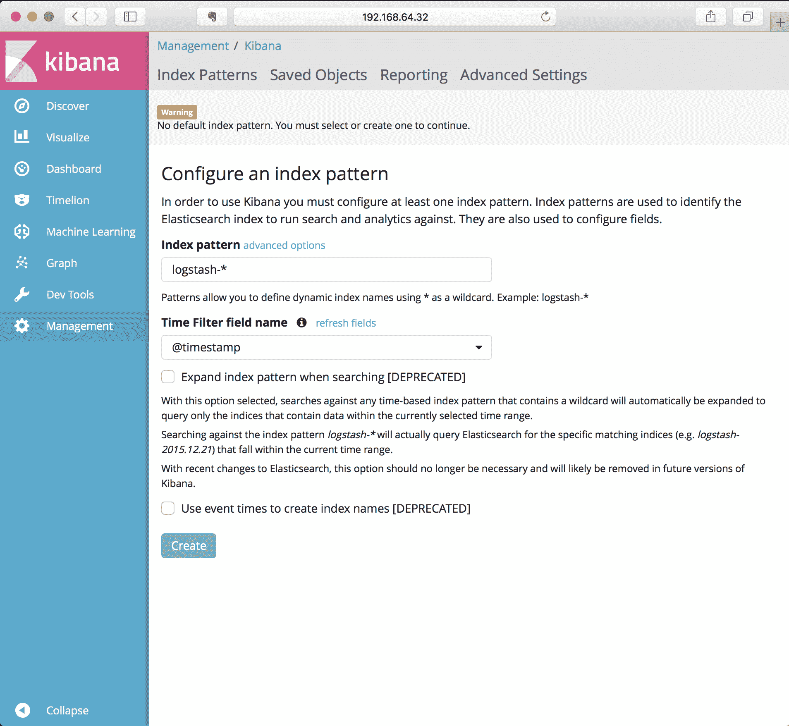

点击“创建”，采用提供的默认设置。`logstash-*`的默认索引模式并不意味着它必须来自`logstash`作为数据源，而已经从 Fluentd 发送到 ElasticSearch 的数据将直接可访问。

一旦您定义了默认索引，下一个显示的页面将向您展示已添加到 Elasticsearch 中的所有字段，因为 Fluentd 已经从容器日志和 Kubernetes 元数据中获取了数据：

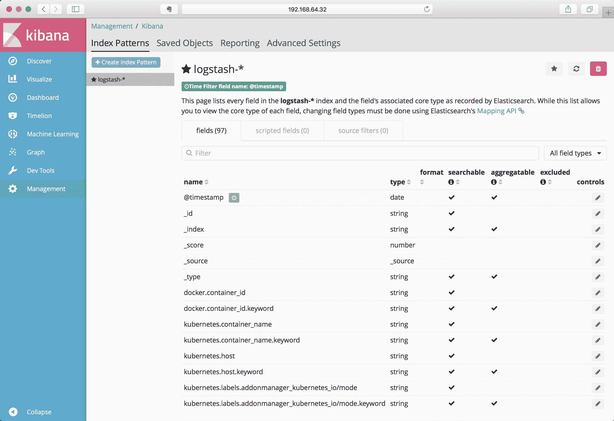

您可以浏览此列表，查看按字段名称捕获的内容，这将让您对可供浏览和搜索的内容有一点了解。

要查看从系统流出的日志，网页左上角的“发现”按钮将带您进入一个由我们刚刚创建的这些索引构建的视图，默认情况下将反映 Fluentd 正在收集的所有日志：

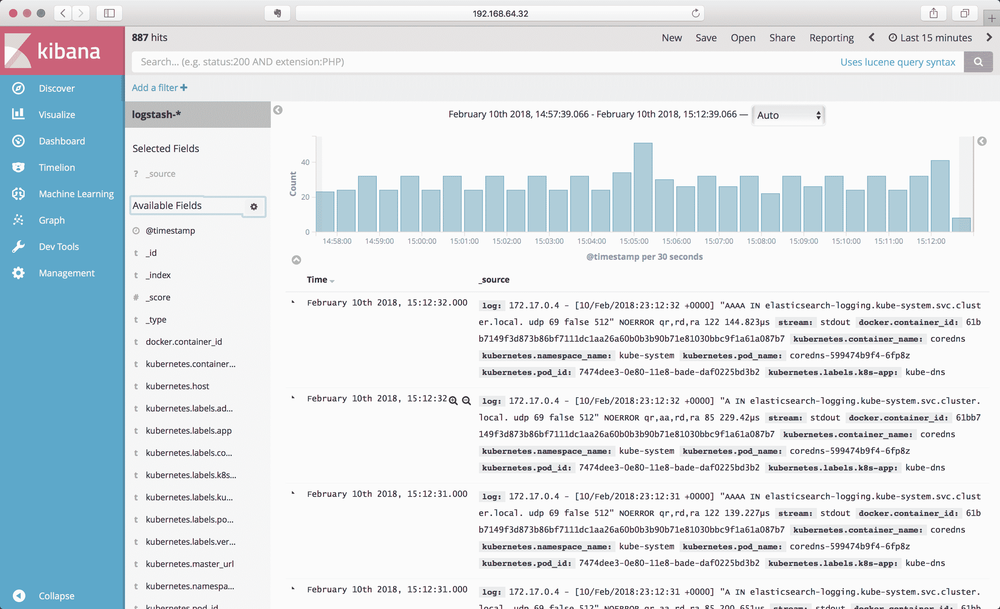

您看到的日志主要来自 Kubernetes 基础架构本身。为了更好地了解如何使用日志记录，启动我们之前创建的示例，并将它们扩展到多个实例以查看输出。

我们将从[`github.com/kubernetes-for-developers/kfd-flask`](https://github.com/kubernetes-for-developers/kfd-flask)获取 Flask 和 Redis 的两层示例应用程序。

```
git clone https://github.com/kubernetes-for-developers/kfd-flask -b 0.5.0
```

```
kubectl apply -f kfd-flask/deploy/
```

这将部署我们之前的 Python 和 Redis 示例，每个示例只有一个实例。一旦这些 pod 处于活动状态，返回并刷新带有 Kibana 的浏览器，它应该会更新以显示最新的日志。您可以在窗口顶部设置 Kibana 正在总结的时间段，并且如果需要，可以将其设置为定期自动刷新。

最后，让我们将 Flask 部署扩展到多个实例，这将使学习如何使用 Kibana 变得更容易：

```
kubectl scale deploy/flask --replicas=3
```

# 按应用程序筛选

有效使用 Kibana 的关键是筛选出您感兴趣的数据。默认的发现视图设置为让您了解特定来源的日志有多大，我们可以使用筛选来缩小我们想要查看的范围。

在查看数据时，从左侧滚动列表中滚动下去，每个字段都可以用作筛选器。如果您点击其中一个，例如 Kubernetes.labels.app，Kibana 将为您总结此字段在您正在查看的时间跨度内收集了哪些不同的值。

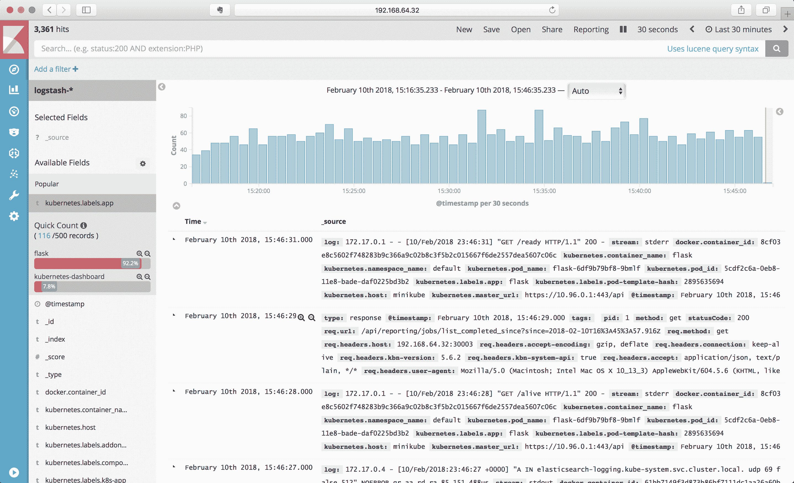

在前面的示例中，您可以看到在时间跨度内的两个`app`标签是`flask`和`kubernetes-dashboard`。我们可以通过点击带有加号的放大镜图标来将其限制为仅包含这些值的日志项：

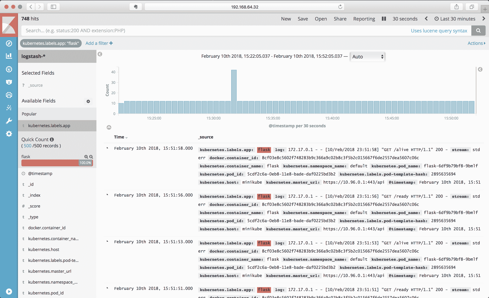

带有减号符号的放大镜图标用于设置排除筛选器。由于我们之前使用`kubectl scale`命令创建了多个实例，您可以在字段列表中向下滚动到`kubernetes.pod_name`，并查看列出的并报告与第一个筛选器匹配的 pod：

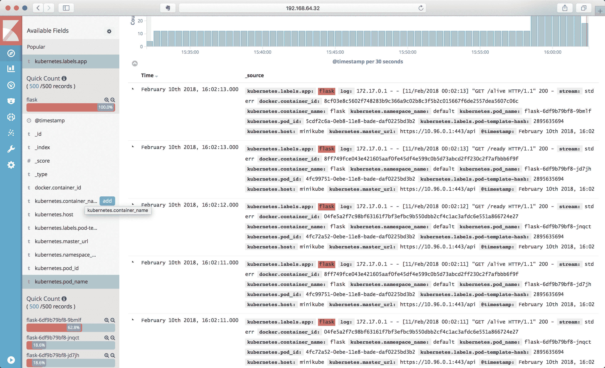

您现在可以将过滤器细化为仅包括其中一个，或排除其中一个 pod，以查看所有剩余的日志。随着您添加过滤器，它们将出现在屏幕顶部，通过单击该引用，您可以删除、固定或暂时禁用该过滤器。

# Lucene 查询语言

您还可以使用 Lucene 查询语言，这是 ElasticSearch 默认使用的语言，以便将搜索细化到字段内的数据，制作更复杂的过滤器，或以更精确的方式跟踪数据。Lucene 查询语言超出了本书的范围，但您可以在 Kibana 文档中获得很好的概述。

Lucene 的搜索语言是围绕搜索非结构化文本数据而设计的，因此搜索单词就像输入一个单词那样简单。多个单词被视为单独的搜索，因此如果您要搜索特定短语，请将短语放在引号中。搜索解析器还将理解简单布尔搜索的显式 OR 和 AND。

查询语法的默认设置是搜索所有字段，您可以指定要搜索的字段。要这样做，命名字段，后跟冒号，然后是搜索词。例如，要在字段`log`中搜索`error`，您可以使用此搜索查询：

```
log:error
```

此搜索查询还支持通配符搜索，使用字符`?`表示任何单个未知字符，`*`表示零个或多个字符。您还可以在查询中使用正则表达式，通过用`/`字符包装查询，例如：

```
log:/*error*/
```

这将在日志字段中搜索`error`或`errors`。

注意：因为 Lucene 会分解字段，正则表达式会应用于字符串中的每个单词，而不是整个字符串。因此，当您想要搜索组合词而不是包含空格的短语或字符串时，最好使用正则表达式。

Lucene 查询语言还包括一些高级搜索选项，可以容纳拼写错误和轻微变化，这可能非常有用。语法包括使用`~`字符作为通配符进行模糊搜索，允许拼写的轻微变化，转置等。短语还支持使用~作为变体指示符，并用于进行接近搜索，即短语中两个单词之间的最大距离。要了解这些特定技术的工作原理以及如何使用它们，请查阅[ElasticSearch 查询 DSL 文档](https://www.elastic.co/guide/en/elasticsearch/reference/6.2/query-dsl-query-string-query.html#_fuzziness)。

# 在生产环境中运行 Kibana

Kibana 还有各种其他功能，包括设置仪表板，制作数据可视化，甚至使用简单的机器学习来搜索日志数据中的异常。这些功能超出了本书的范围。您可以在 Kibana 用户指南中了解更多信息[`www.elastic.co/guide/en/kibana/current/`](https://www.elastic.co/guide/en/kibana/current/)。

运行更复杂的开发者支持工具，如 Elasticsearch，Fluentd 和 Kibana，是一项比我们在本书中所涵盖的更复杂的任务。有一些关于使用 Fluentd 和 Elasticsearch 作为附加组件的文档，就像你之前在 Minikube 示例中看到的那样。EFK 是一个需要管理的复杂应用程序。有几个 Helm 图表可能适合您的需求，或者您可能希望考虑利用云提供商的解决方案，而不是自己管理这些组件。

# 使用 Jaeger 进行分布式跟踪

当您将服务分解为多个容器时，最难理解的是请求的流动和路径，以及容器之间的交互方式。随着您扩展并使用更多容器来支持系统中的组件，了解哪些容器是哪些以及它们如何影响请求的性能将成为一个重大挑战。对于简单的系统，您通常可以添加日志记录并通过日志文件查看。当您进入由数十甚至数百个不同容器组成的服务时，这个过程变得不太可行。

这个问题的一个解决方案被称为分布式跟踪，它是一种追踪容器之间请求路径的方法，就像性能分析器可以追踪单个应用程序内的请求一样。这涉及使用支持跟踪库的库或框架来创建和传递信息，以及一个外部系统来收集这些信息并以可用的形式呈现出来。最早的例子可以在谷歌系统 Dapper 的研究论文中找到，受 Dapper 启发的早期开源实现被称为 Zipkin，由 Twitter 的工作人员制作。相同的概念已经重复出现多次，2016 年，一群人开始合作进行各种跟踪尝试。他们成立了 OpenTracing，现在是 Cloud Native Compute Foundation 的一部分，用于指定在各种系统和语言之间共享跟踪的格式。

Jaeger 是 OpenTracing 标准的一个实现，受 Dapper 和 Zipkin 启发，由 Uber 的工程师创建，并捐赠给 Cloud Native Compute Foundation。Jaeger 的完整文档可在[`jaeger.readthedocs.io/`](http://jaeger.readthedocs.io/)上找到。Jaeger 于 2017 年发布，目前正在积极开发和使用中。

还有其他跟踪平台，特别是 OpenZipkin（[`zipkin.io`](https://zipkin.io)），也可用，因此 Jaeger 并不是这个领域的唯一选择。

# 跨度和跟踪

在分布式跟踪中，有两个常见的术语，你会反复看到：跨度和跟踪。跨度是在分布式跟踪中被追踪的最小单位，代表一个接收请求并返回响应的单个过程。当该过程向其他服务发出请求以完成其工作时，它会将信息与请求一起传递，以便被请求的服务可以创建自己的跨度并引用请求的跨度。这些跨度中的每一个都被收集并从每个过程中导出，然后可以进行分析。所有共同工作的跨度的完整集合被称为跟踪。

添加、收集和传输所有这些额外信息对每个服务都是额外的开销。虽然这些信息很有价值，但它也可能产生大量信息，如果每个交互的服务都创建并发布每个跟踪，处理跟踪系统所需的数据处理量将呈指数级增长。为了为跟踪提供价值，跟踪系统已经实施了抽样，以便不是每个请求都被跟踪，但是有一个合理的数量，仍然有足够的信息来获得系统整体操作的良好表示。

不同的跟踪系统处理方式不同，服务之间传递的数据量和数据类型仍然在不断变化。此外，不遵循请求/响应模式的服务（如后台队列或扇出处理）并不容易被当前的跟踪系统所表示。数据仍然可以被捕获，但呈现处理的一致视图可能会更加复杂。

当您查看跟踪的详细信息时，通常会看到一个火焰图样式的输出，显示了每个跟踪花费的时间以及正在处理它的服务。例如，这是 Jaeger 文档中的一个跟踪详细视图示例：

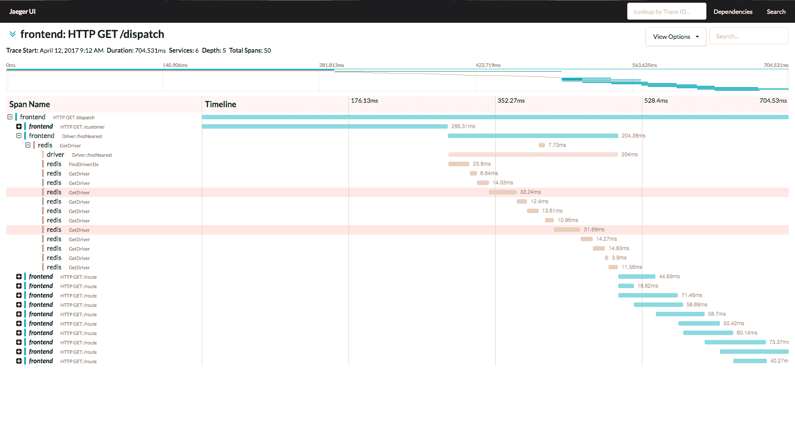

# Jaeger 分布式跟踪的架构

与 Elasticsearch、Fluentd 和 Kibana（EFK）类似，Jaeger 是一个收集和处理大量信息的复杂系统。它在这里展示：

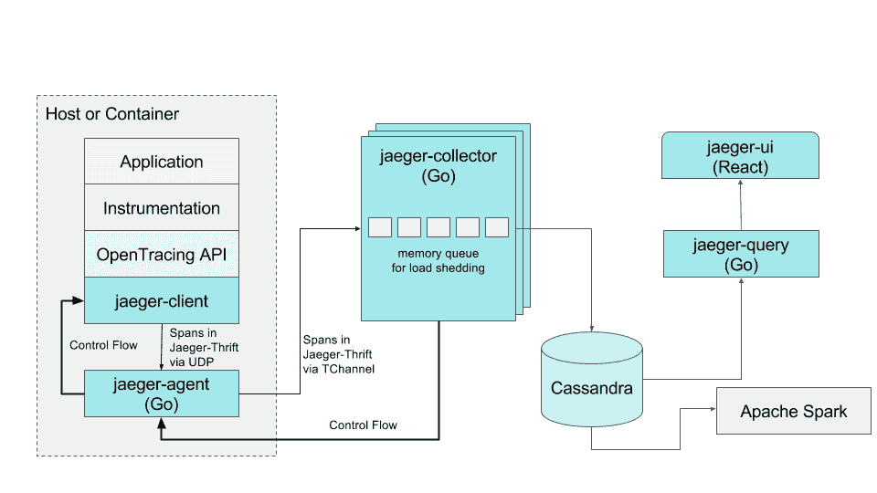

这是 Jaeger 在 2017 年在 Uber 工作的架构。配置使用了我们之前提到的 side-car 模式，每个容器都运行一个附近的容器，使用 UDP 收集来自仪器的跨度，然后将这些跨度转发到基于 Cassandra 的存储系统。设置 Cassandra 集群以及单独的收集器和查询引擎远比在本地开发环境中容易创建的要多得多。

幸运的是，Jaeger 还有一个全包选项，可以用来尝试和学习如何使用 Jaeger 以及它的功能。全包选项将代理、收集器、查询引擎和 UI 放在一个单一的容器映像中，不会持久存储任何信息。

Jaeger 项目有一体化选项，以及利用 Elasticsearch 进行持久化的 Helm 图表和变体，这些都在 GitHub 上进行了记录和存储，网址为[`github.com/jaegertracing/jaeger-kubernetes`](https://github.com/jaegertracing/jaeger-kubernetes)。事实上，Jaeger 项目通过利用 Kubernetes 来测试他们对 Jaeger 和每个组件的开发。

# 尝试 Jaeger

您可以通过使用 Jaeger 的一体化开发设置来尝试当前版本。由于他们在 GitHub 上维护这个版本，您可以直接使用以下命令从那里运行：

```
kubectl create -f https://raw.githubusercontent.com/jaegertracing/jaeger-kubernetes/master/all-in-one/jaeger-all-in-one-template.yml
```

这将创建一个部署和一些服务前端：

```
deployment "jaeger-deployment" created
service "jaeger-query" created
service "jaeger-collector" created
service "jaeger-agent" created
service "zipkin" created
```

当`jaeger-deployment` pod 报告准备就绪时，您可以使用以下命令访问 Jaeger 查询界面：

```
minikube service jaeger-query
```

生成的网页应该如下所示：

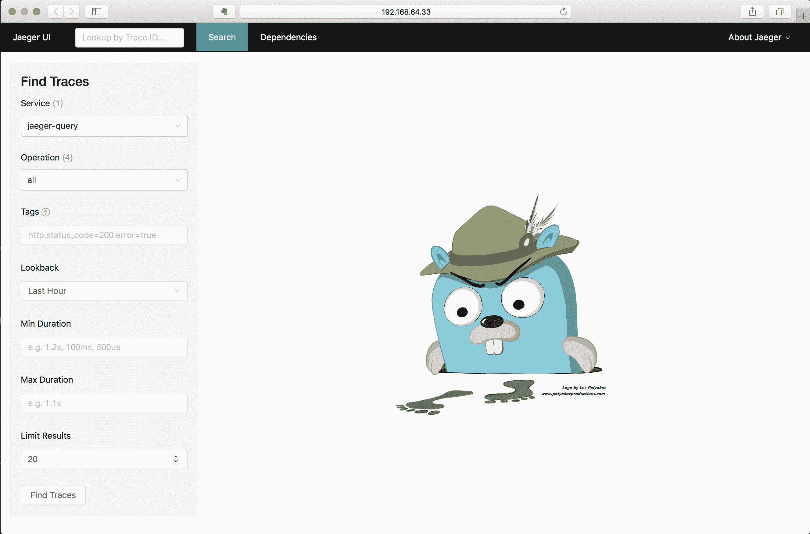

默认情况下，Jaeger 系统正在报告自己的操作，因此当您使用查询界面时，它也会生成自己的跟踪，您可以开始调查。窗口左侧的“查找跟踪”面板应该显示在服务 jaeger-query 上，如果您点击底部的“查找跟踪”按钮，它将根据默认参数进行搜索：

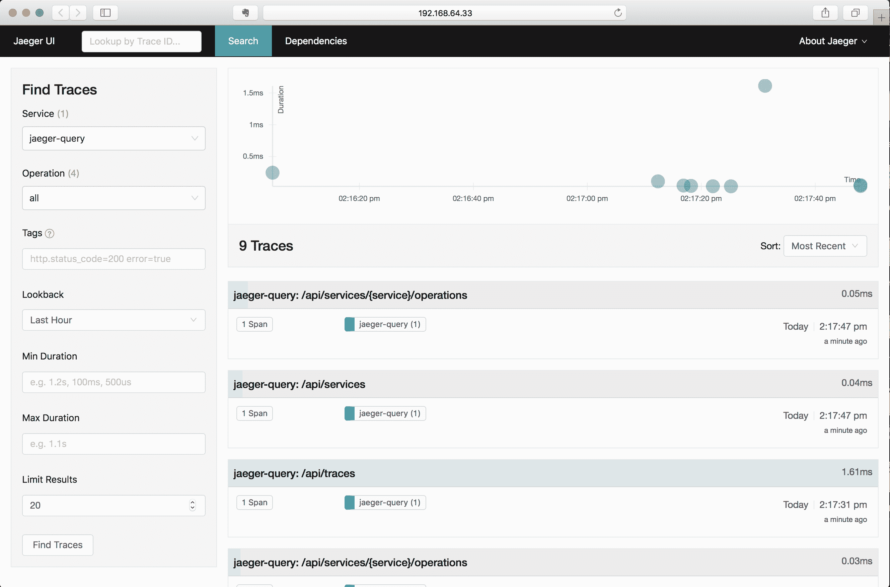

此页面显示了找到的所有跟踪的时间以及它们所花费的时间，允许您通过 API 端点（在此用户界面中称为操作）深入挖掘它们，限制时间跨度，并提供了一个大致表示查询处理时间的粗略表示。

这些跟踪都由单个 span 组成，因此非常简单。您可以选择其中一个 span 并查看跟踪详细信息，包括展开它捕获和传递的信息以及这些跟踪。查看完全展开的详细信息应该显示如下：

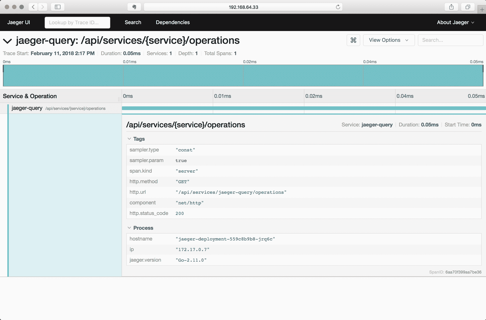

让我们看看如何向您自己的应用程序添加追踪。

# 示例-向您的应用程序添加追踪

我们需要做几件事情来启用我们示例应用程序的追踪：

+   添加库和代码以生成跟踪

+   向您的 pod 添加一个追踪收集器边车

让我们先看看如何启用追踪边车，我们将使用之前在本书中构建的 Python Flask 示例。

这个例子的代码在线上的 GitHub 项目中[`github.com/kubernetes-for-developers/kfd-flask`](https://github.com/kubernetes-for-developers/kfd-flask)，这个添加的分支是`0.6.0`。您可以使用以下命令在本地获取此项目的代码：

```
git clone https://github.com/kubernetes-for-developers/kfd-flask -b 0.6.0
```

# 向您的 pod 添加跟踪收集器

实现 open-tracing 的库通常使用非常轻量级的网络连接，比如 UDP，来从我们的代码发送跟踪信息。UDP 不能保证连接，这也意味着如果网络过于拥挤，跟踪信息可能会丢失。OpenTracing 和 Jaeger 通过利用 Kubernetes 的一个保证来最小化这种情况：同一个 pod 中的两个容器将被放置在同一个节点上，共享相同的网络空间。如果我们在 pod 中的另一个容器中运行一个捕获 UDP 数据包的进程，网络连接将全部在同一个节点上，并且干扰的可能性非常小。

Jaeger 项目有一个镜像，它监听各种端口以捕获这些跟踪信息，并将其转发到存储和查询系统。容器`jaegertracing/jaeger-agent`发布到 DockerHub，并保持非常小的镜像大小（版本 1.2 为 5 MB）。这个小尺寸和靠近我们应用程序的好处使它非常适合作为一个辅助容器运行：在我们的 pod 中支持主要进程的另一个容器。

我们可以通过向我们 flask 部署（`deploy/flask.yaml`）中定义的 pod 添加另一个容器来实现这一点：

```
 - name: jaeger-agent
   image: jaegertracing/jaeger-agent
   ports:
   - containerPort: 5775
     protocol: UDP
   - containerPort: 5778
   - containerPort: 6831
     protocol: UDP
   - containerPort: 6832
     protocol: UDP
   command:
   - "/go/bin/agent-linux"
   - "--collector.host-port=jaeger-collector:14267"
```

这个例子是基于 Jaeger [部署文档](https://jaeger.readthedocs.io/en/latest/deployment/)，它提供了如何在 Docker 中使用它的示例，但不是直接在 Kubernetes 中使用。

重要的是要注意我们在这个容器中的命令。默认情况下，容器运行`/go/bin/agent-linux`，但没有任何选项。为了将数据发送到我们本地安装的 Jaeger，我们需要告诉收集器要发送到哪里。目的地由选项`--collector.host-port`定义。

在这种情况下，我们将 Jaeger all-in-one 安装到默认命名空间中，并包括一个名为`jaeger-collector`的服务，因此该服务将直接可用于此 pod。如果您在集群中安装了更强大的 Jaeger，您可能还将其定义在不同的命名空间中。例如，Jaeger 的 Helm 安装将安装到一个名为`jaeger-infra`的命名空间中，在这种情况下，`collector.host-port`选项的值需要更改以反映这一点：`jaeger-collector.jaeger-infra.svc:14267`。

这里 Jaeger 还使用了多个端口，故意允许代理从备用语言使用的多种传统机制中收集。我们将使用 UDP 端口`6382`用于`python jaeger-tracing`客户端库。

# 添加生成跟踪的库和代码

我们首先为跟踪添加了两个库到我们的项目中：`jaeger-client`和`flask_opentracing`。`flask-opentracing`将跟踪添加到 Flask 项目中，以便您可以轻松地自动跟踪所有 HTTP 端点。OpenTracing 项目不包括任何收集器，因此我们还需要一个库来收集和发送跟踪数据到某个地方，这里是 jaeger-client。

该示例还添加了 requests 库，因为在这个示例中，我们将添加一个进行远程请求、处理响应并返回值的 HTTP 端点，并对该序列进行跟踪。

导入库并初始化跟踪器非常简单：

```
import opentracing
from jaeger_client import Config
from flask_opentracing import FlaskTracer

# defaults to reporting via UDP, port 6831, to localhost
def initialize_tracer():
    config = Config(
        config={
            'sampler': {
                'type': 'const',
                'param': 1
            },
            'logging': True
        },
        service_name='flask-service'
    )
    # also sets opentracing.tracer
    return config.initialize_tracer() 

```

Jeager 建议您间接使用一种方法来初始化跟踪器，如前所示。在这种情况下，配置将采样器设置为转发所有请求；在生产中使用时，您需要仔细考虑这一配置选项，因为在高负载服务中跟踪每个请求可能会很繁重。

在创建 Flask 应用程序后立即初始化跟踪器：

```
app = Flask(__name__)flask_tracer = FlaskTracer(initialize_tracer, True, app, ["url_rule"])
```

这将与 Flask 一起使用，为所有`@app.routes`添加跟踪，每个路由将被标记为基于 Python 函数名称的操作。您还可以使用不同的配置设置仅跟踪特定路由，并在 Flask 路由上添加跟踪注释。

重建 Flask 图像并部署它将立即开始生成跟踪，并且在侧车中运行 jaeger-agent 的情况下，本地`jaeger dev`实例将立即显示跟踪。您应该看到一个名为`flask-service`的服务，基于我们的应用程序名称，并且它应该在其中列出多个操作：

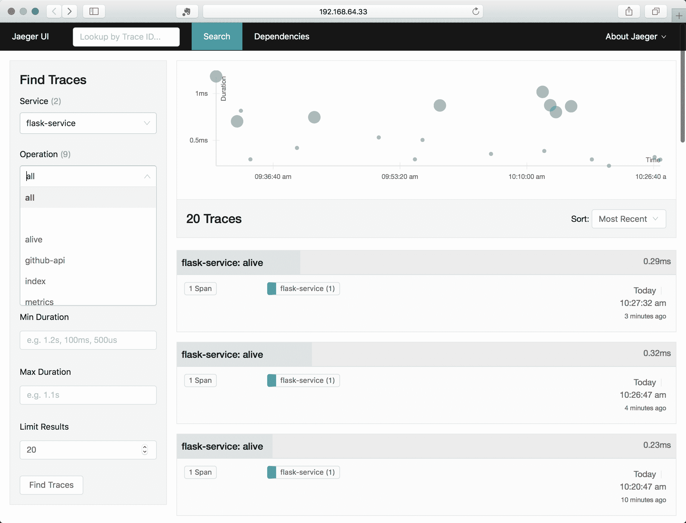

活动，就绪和指标操作是启用以支持活动性和就绪性探针以及`prometheus`指标的 Flask 路由，这已在我们的示例 pod 上定义，它们正在获得一致的连接，从而生成与请求相关的跟踪。

这本身就很有用，但尚未告诉您方法中的哪个部分花费了更多或更少的时间。您可以使用`flask-opentracing`安装的`opentracing`库在您感兴趣的方法或代码段周围添加跟踪 span，以下代码片段显示了如何使用跟踪 span 包装我们在就绪探针中使用的对 Redis 的调用，以便它将单独显示出来：

```
@app.route('/ready')
def ready():
  parent_span = flask_tracer.get_span()
  with opentracing.tracer.start_span('redis-ping', child_of=parent_span) as span:
    result = redis_store.ping()
    span.set_tag("redis-ping", result)
  if result:
    return "Yes"
  else:
    abort(500)
```

关键在于获取我们为每个请求生成的当前跟踪 span，使用`flask_tracer.get_span()`，然后在`with`语句中使用它，这将在该上下文中执行的代码块中添加 span。我们还可以在 span 上使用方法，该方法在该代码块中可用。我们使用`set_tag`方法添加一个带有 ping 结果值的标签，以便在特定的跟踪输出中可用。

我们将继续添加一个`@app.route`称为`/remote`，以进行对 GitHub 的远程 HTTP 请求，并在其周围添加跟踪以将其显示为子 span：

```
@app.route('/remote')
def pull_requests():
    parent_span = flask_tracer.get_span()
    github_url = "https://api.github.com/repos/opentracing/opentracing-python/pulls"

    with opentracing.tracer.start_span('github-api', child_of=parent_span) as span:
        span.set_tag("http.url",github_url)
        r = requests.get(github_url)
        span.set_tag("http.status_code", r.status_code)

    with opentracing.tracer.start_span('parse-json', child_of=parent_span) as span:
        json = r.json()
        span.set_tag("pull_requests", len(json))
        pull_request_titles = map(lambda item: item['title'], json)
    return 'PRs: ' + ', '.join(pull_request_titles)
```

这个例子类似于就绪探针，只是我们在不同的代码段中包装不同的部分，并明确命名它们：`github-api` 和 `parse-json`。

在添加代码时，您可以使用`kubectl delete`和`kubectl apply`等命令来重新创建部署并将其构建并推送到您的容器注册表。对于这些示例，我的模式是从项目的主目录运行以下命令：

```
kubectl delete deploy/flask
docker build -t quay.io/kubernetes-for-developers/flask:0.6.0 .
docker push quay.io/kubernetes-for-developers/flask
kubectl apply -f deploy/
```

您将需要用项目中的值替换图像注册表引用和 Docker 标记。

然后，使用以下命令检查部署的状态：

```
kubectl get pods 
```

```
NAME                              READY STATUS RESTARTS AGE
flask-76f8c9767-56z4f             0/2   Init:0/1 0 6s
jaeger-deployment-559c8b9b8-jrq6c 1/1   Running 0 5d
redis-master-75c798658b-cxnmp     1/1   Running 0 5d
```

一旦它完全在线，您将看到它报告为就绪：

```
NAME                              READY STATUS RESTARTS AGE
flask-76f8c9767-56z4f             2/2   Running 0 1m
jaeger-deployment-559c8b9b8-jrq6c 1/1   Running 0 5d
redis-master-75c798658b-cxnmp     1/1   Running 0 5d
```

2/2 显示有两个容器正在运行 Flask pod，我们的主要代码和 jaeger-agent side-car。

如果您使用 Minikube，还可以使用服务命令轻松在浏览器中打开这些端点：

```
minikube service list
```

```

|-------------|----------------------|----------------------------|
| NAMESPACE   | NAME                 | URL                        |
|-------------|----------------------|----------------------------|
| default     | flask-service        | http://192.168.64.33:30676 |
| default     | jaeger-agent         | No node port               |
| default     | jaeger-collector     | No node port               |
| default     | jaeger-query         | http://192.168.64.33:30854 |
| default     | kubernetes           | No node port               |
| default     | redis-service        | No node port               |
| default     | zipkin               | No node port               |
| kube-system | kube-dns             | No node port               |
| kube-system | kubernetes-dashboard | http://192.168.64.33:30000 |
| kube-system | tiller-deploy        | No node port               |
|-------------|----------------------|----------------------------|
```

任何具有节点端口设置的服务都可以通过诸如以下命令轻松在本地打开：

```
minikube service flask-service
```

```
minikube service jaeger-query
```

添加、构建和部署此代码后，您可以在 Jaeger 中看到跟踪。将浏览器定向到`/remote`发出一些请求以从请求生成跨度，并且在 Jaeger 查询浏览器中，您应该看到类似以下内容：

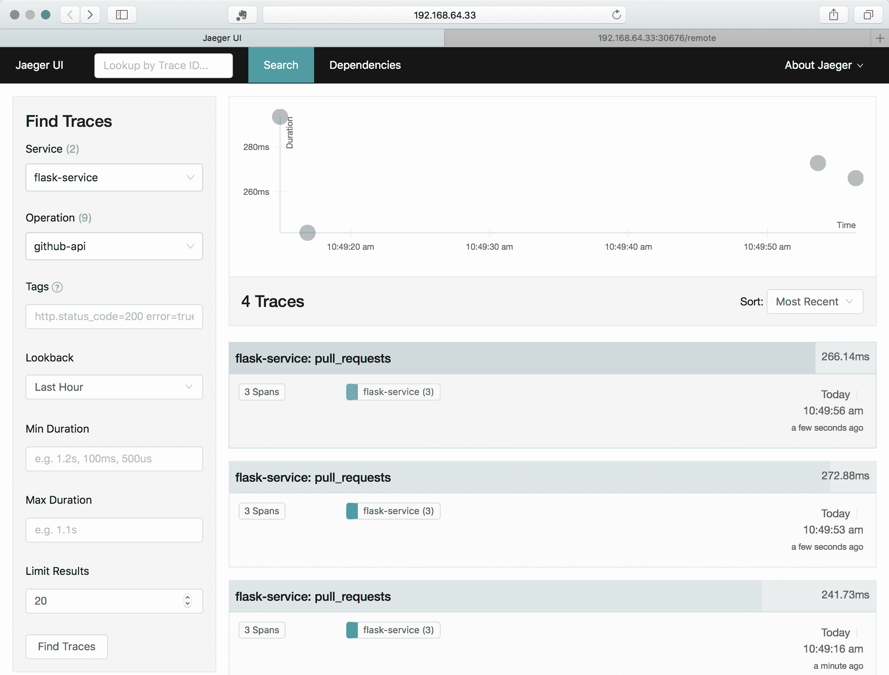

Jaeger 查询窗口的顶部将显示表示查询时间和相对持续时间的点，您将看到它找到的各种跟踪列表-在我们的情况下有四个。如果选择一个跟踪，您可以进入详细视图，其中将包括子跨度。单击跨度以从中获取更多详细信息：

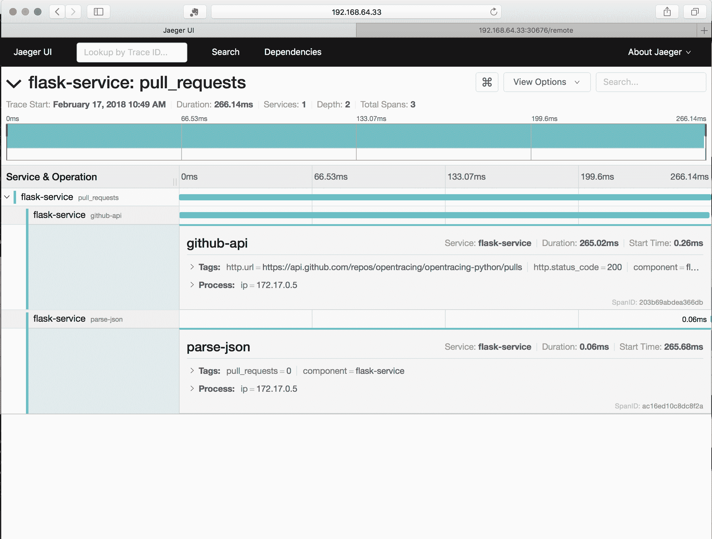

通过跨度详细视图，您可以查看在代码中设置的任何标签，并且您可以看到`github-api`调用在响应`/remote`请求时花费了大部分时间（265/266 毫秒）。

# 添加跟踪的考虑事项

跟踪是一个非常强大的工具，但也伴随着成本。每个跟踪都会（虽然很小）增加一些处理和管理的开销。您可能会很兴奋地将跟踪添加到应用程序中的每个方法，或者将其构建到一个库中，该库会将跟踪和跨度创建附加到每个方法调用中。这是可以做到的，但您很快会发现您的基础设施被跟踪信息所淹没。

跟踪也是一个工具，当直接与运行代码的责任直接相关时，它具有最大的好处。请注意，随着您添加跟踪，还会添加许多辅助处理，以捕获、存储和查询跟踪生成的数据。

处理权衡的一个好方法是有意识地、迭代地和缓慢地添加跟踪-以获得您需要的可见性。

OpenTracing 作为一个标准得到了许多供应商的支持。OpenTracing 也是一个不断发展的标准。在撰写本书时，人们正在讨论如何最好地共享和处理跨进程请求中携带的跨度数据（通常称为“行李”）。像追踪本身一样，添加数据可以增加价值，但这也带来了更大的请求成本和更多的处理需求来捕获和处理信息。

# 总结

在本章中，我们介绍了使用 Fluentd 和 Jaeger 进行日志记录和跟踪。我们展示了如何部署它并使用它，在代码运行时捕获和聚合数据。我们演示了如何使用 Elasticsearch 查询数据。我们还看了如何查看 Jaeger 跟踪以及如何向代码添加跟踪。

在下一章中，我们将探讨如何使用 Kubernetes 来支持和运行集成测试，以及如何将其与持续集成一起使用。
