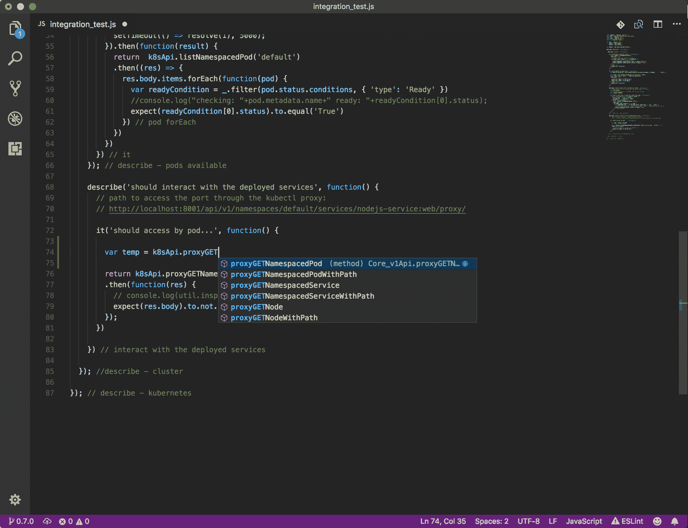
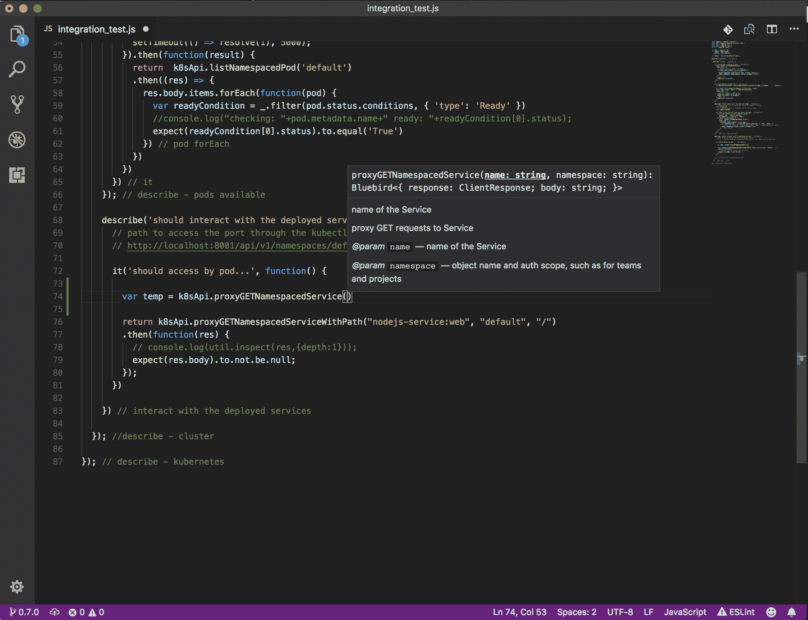
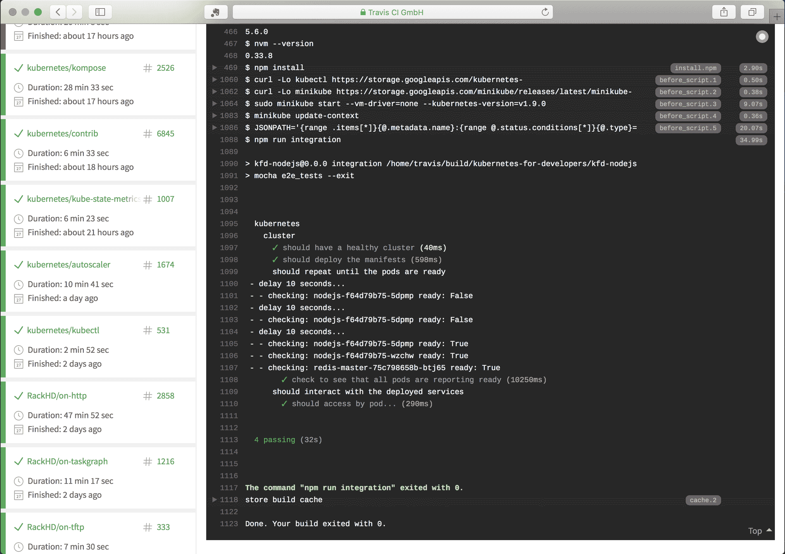
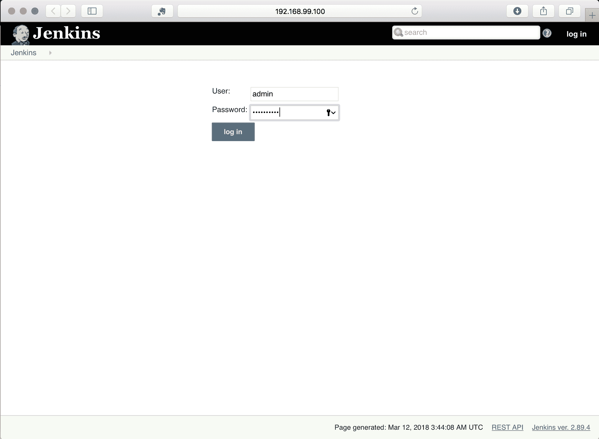
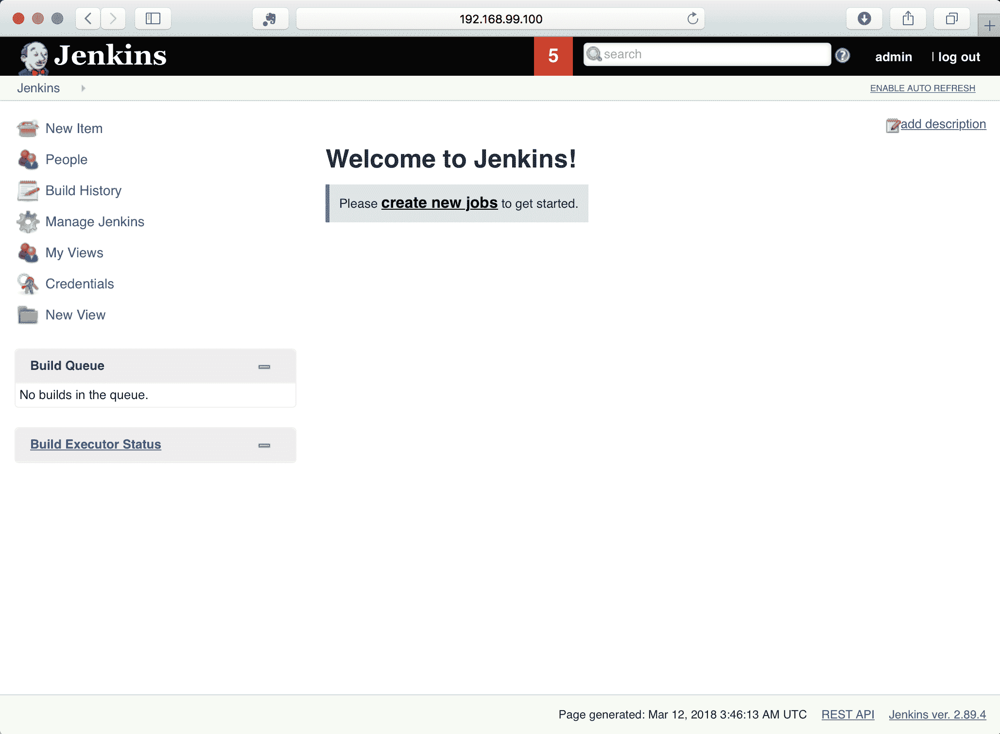
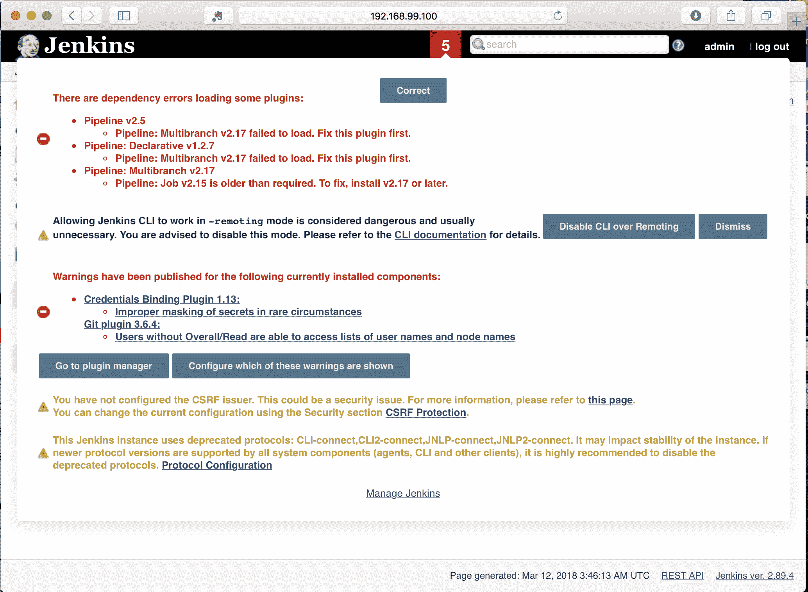
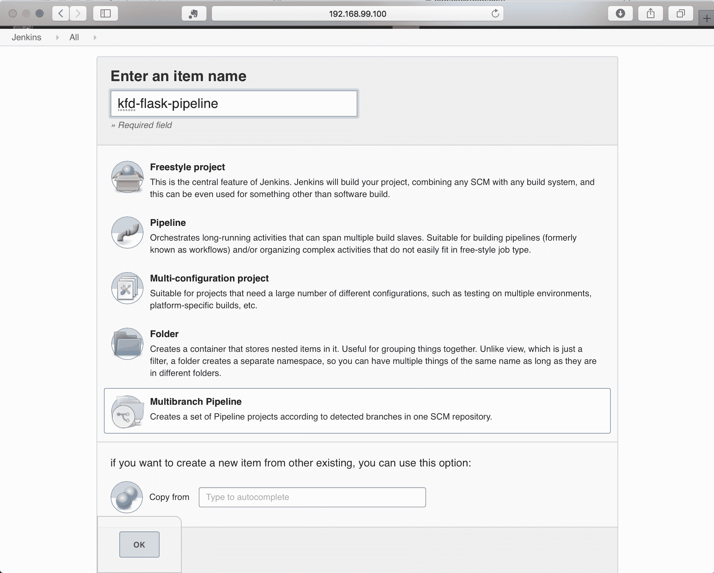
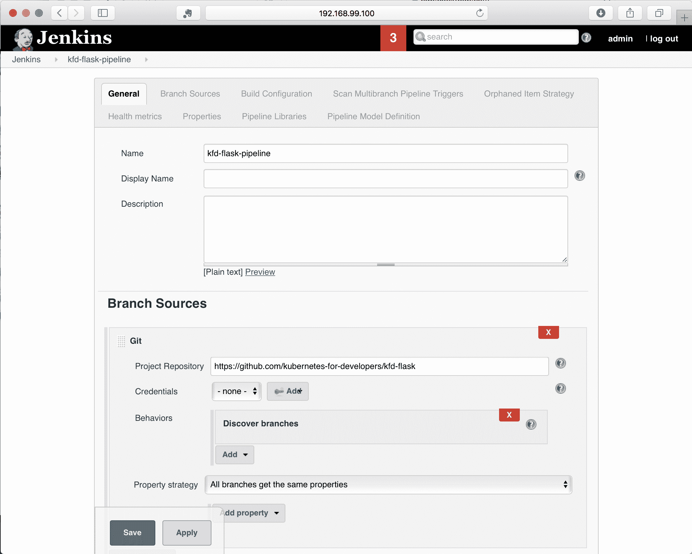
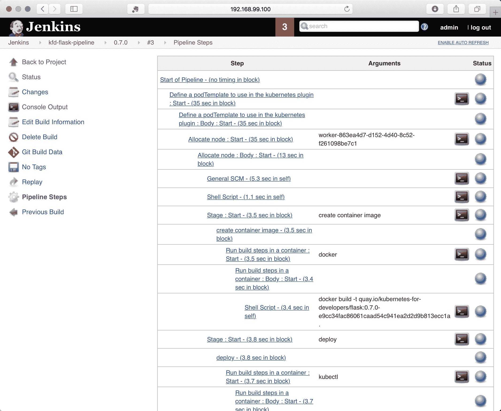

# 集成测试

到目前为止，我们已经了解了如何在 Kubernetes 中运行代码并描述服务。我们还研究了如何利用其他工具来获取有关代码在每个 pod 和整体上运行情况的信息。本章将在此基础上，探讨如何使用 Kubernetes 来验证代码，以及不同验证测试的示例，以及如何利用 Kubernetes 进行验证测试的建议。

本章的主题包括：

+   使用 Kubernetes 的测试策略

+   使用 Bats 进行简单验证

+   示例 - 使用 Python 测试代码

+   示例 - 使用 Node.js 测试代码

+   使用 Kubernetes 进行持续集成

# 使用 Kubernetes 的测试策略

在软件工程中，开发和验证过程中使用了各种测试。在这个分类中，有一些测试类型非常适合利用 Kubernetes 的优势。与测试相关的术语可能含糊不清，令人困惑，因此为了清晰起见，我们将简要回顾我将使用的术语以及这些测试类型之间的区别。这里没有详细介绍这些主题的更多变体，但为了描述 Kubernetes 最有效的地方，这个列表已经足够：

+   单元测试：单元测试是测试的最低级别；它侧重于应用程序中的接口、实现和模块。单元测试通常意味着仅对测试重点的组件进行隔离测试。这些测试通常旨在非常快速，可以直接在开发人员的系统上运行，并且通常不需要访问相关代码可能依赖的外部服务。这些测试通常不涉及状态或持久性，主要关注业务逻辑和接口验证。

+   功能测试：功能测试是从单元测试中提升的下一步，意味着代码库针对其基础系统进行测试，而无需伪装、模拟或其他层，否则会假装像远程依赖一样运行。这种测试通常应用于服务的子集，测试和验证完整的服务，并使用即时依赖项（通常是数据库或持久性存储）。功能测试通常意味着对持久性存储中的状态进行验证，以及在代码运行过程中如何改变。

+   **集成测试**：集成测试将软件的所有必需部分组合在一起，并验证各个组件以及组件之间的工作和交互。系统的状态通常在集成测试中被定义或设置为关键设置，因为状态在系统中被表示和验证，所以测试往往是有序和更线性的，通常使用组合交互来验证代码的工作方式（以及失败方式）。

功能测试和集成测试之间存在模糊的界限，前者通常专注于验证整体服务的子集，而后者代表着服务的大部分或整个系统。

+   **端到端测试**：集成测试可能意味着测试系统的一部分，而端到端测试则特指测试和验证整个系统及其所有依赖关系。通常，端到端测试和集成测试是可以互换使用的。

+   **性能测试**：在先前的术语中，重点是代码和任何相关依赖项之间的验证范围，性能测试侧重于验证类型而不是范围。这些测试意在衡量代码和服务的效率或利用率；它们利用了多少 CPU 和内存，以及在给定一组基础资源的情况下它们的响应速度。它们不是专注于代码的正确性，而是专注于规模和基础服务需求的验证。性能测试通常需要依赖系统不仅正常运行，而且需要充分资源以提供准确的结果，并且在某种程度上具有期望隔离，以防止外部资源限制人为地限制结果。

+   **交互/探索性测试**：交互测试，有时也被称为探索性测试，再次不是关于范围的术语，而是意味着一种意图。这些测试通常需要系统的至少一部分处于运行状态，并且通常意味着整个系统处于运行状态，如果不是为了支持高水平的请求。这些测试侧重于让人们与系统进行交互，而不需要预定义或结构化的事件流，这种设置通常也用于接受验证或其他测试类型的改进，作为验证测试本身的手段。

# 审查测试所需的资源

当我们遍历测试的分类时，运行测试所需的计算资源和时间通常会增长并变得更加重要。根据正在开发的软件的范围，很可能需要比单台机器可以容纳的资源更多。而低级别的测试通常可以优化以利用计算机内的所有可能资源，端到端测试的串行性质往往效率较低，并且在验证过程中需要更多时间。

在建立测试时，您需要意识到验证软件所需的计算资源的大小。这可能对应于确定给定 pod 需要多少内存和 CPU 的过程，并且需要意识到基于您正在测试和想要实现的内容，所有依赖项的所有资源。

在大多数示例中，我们一直在使用 Minikube，但是现代开发和依赖关系很容易超出 Minikube 单节点集群所能提供的资源量。

在测试中使用 Kubernetes 最有效的地方是，您希望设置和使用与集成测试和测试场景相对应的环境的大部分内容，并且期望具有所有依赖项运行的完整系统。

当您专注于集成、端到端以及先前概述的分类的后续部分时，您当然可以在开发过程中使用 Kubernetes 运行诸如单元测试或功能测试之类的测试，尽管您可能会发现，在集成、端到端以及先前概述的分类的后续部分时，从 Kubernetes 中获得更多的好处。

由于 Kubernetes 擅长描述服务的期望状态并保持其运行，因此在您希望设置大部分或许多服务相互交互的地方，它可以被非常有效地使用。此外，如果您期望测试需要更多时间和资源，Kubernetes 也是一个很好的选择，因为它要求您将代码锁定到离散的、有版本的容器中，这也可能需要大量的时间和处理。

# 使用 Kubernetes 进行测试的模式

有很多种方式可以使用 Kubernetes 进行测试，而您需要确定的第一件事情之一是，您正在运行被测试系统的位置，以及您正在运行将验证该系统的测试的位置。

# 在 Kubernetes 中测试本地和系统测试

最常见的模式，特别是在开发测试时，是从开发机器上运行测试，针对在 Kubernetes 中运行的代码。创建测试后，可以使用相同的模式来针对托管代码的 Kubernetes 集群运行测试，从而实现持续集成服务。当您开始进行开发时，您可能能够在本地开发机器上运行所有这些操作，使用 Minikube。总的来说，这种模式是一个很好的开始方式，并解决了通过在您想要获得反馈的地方运行测试来获得反馈的问题——无论是在您自己的开发系统上，还是在代表您运行的 CI 系统上。

# 在之前的模式中，以及本书中大多数示例中，我们使用了默认命名空间，但所有命令都可以通过简单地在 kubectl 命令中添加`-n <namespace>`来包括一个命名空间作为选项。

如果您测试的系统超出了 Minikube 的支持范围，常见的解决方案是开始使用远程集群，无论是由您、您的 IT 团队还是云提供商管理。当您开始使用远程计算时，共享和隔离变得重要，特别是对于依赖于系统状态的测试，其中对该状态的控制对于理解验证是否正确非常关键。Kubernetes 通常具有良好的隔离性，并且利用命名空间的工作方式可以使代码的设置和测试变得更加容易。您可以通过在单个命名空间中运行相关的 pod 和服务，并通过利用每个服务的短 DNS 名称在它们之间进行一致引用来利用命名空间。这可以被视为一个堆栈，您可以有效地并行部署许多这样的堆栈。

命名空间支持各种资源的配额，您会想要查看定义的内容并验证您是否设置了足够的配额。特别是在共享环境中，使用配额来限制消耗是常见的。

# Kubernetes 中的测试和 Kubernetes 命名空间中的系统

主题的一个变化是在 Kubernetes 中打包和运行您的测试 - 无论是在相同的命名空间中，还是在与您的被测系统不同的命名空间中。这比在本地运行测试要慢，因为它要求您将测试打包到容器中，就像您对代码所做的那样。权衡是拥有非常一致的方式来运行这些测试并与被测系统进行交互。

如果您在一个非常多样化的开发环境中工作，每个人的设置都略有不同，那么这种模式可以整合测试，以便每个人都有相同的体验。此外，当本地测试需要通过暴露的服务（例如使用 Minikube 的 NodePort，或者在提供程序上使用`LoadBalancer`）访问远程 Kubernetes 时，您可以通过使用服务名称来简化访问，无论是在相同的命名空间中还是在包含命名空间的较长的服务名称中。

在 Kubernetes 中运行测试的另一个挑战是获取结果。虽然完全可以收集结果并将其发布到远程位置，但这种模式并不常见。使用这种模式时更常见的解决方案是拥有一个专门用于测试的集群，其中还包括一些持续集成基础设施，可以作为集群的一部分，或者与集群并行并具有专用访问权限，然后运行测试并捕获结果作为测试自动化的一部分。我们将在本章后面更深入地研究持续集成。

# 使用 Bats 进行简单验证

一个相当普遍的愿望是简单地部署所有内容并进行一些查询，以验证生成的系统是否可操作。当您执行这些操作时，它们经常被捕获在 Makefiles 或 shell 脚本中，作为验证功能基线的简单程序。几年前，开发了一个名为 Bats 的系统，它代表 Bash 自动化测试系统，旨在使使用 shell 脚本运行测试变得更加方便。

有几个示例使用 Bats 来测试部署在 Kubernetes 中的系统。这些测试通常很简单易懂，易于扩展和使用。您可以在其 GitHub 主页[`github.com/sstephenson/bats`](https://github.com/sstephenson/bats)上找到更多关于 Bats 的信息。您可能也会在一些与 Kubernetes 相关的项目中看到 Bats 的使用，用于简单验证。

Bitnami 已经建立了一个示例 GitHub 存储库，用作使用 Bats 和 Minikube 的起点，并且设计为与 Travis.CI 等外部 CI 系统一起使用。您可以在[`github.com/bitnami/kubernetes-travis`](https://github.com/bitnami/kubernetes-travis)找到示例。

如果您使用 Bats，您将需要有辅助脚本来设置您的部署，并等待相关部署报告就绪，或者在设置时失败测试。在 Bitnami 示例中，脚本`cluster_common.bash`和`libtest.bash`具有这些辅助函数。如果您想使用这条路径，可以从他们的存储库中开始，并更新和扩展它们以匹配您的需求。

集成测试从加载库和创建本地集群开始，然后部署正在测试的系统：

```
# __main__ () {
. scripts/cluster_common.bash
. scripts/libtest.bash
# Create the 'minikube' or 'dind' cluster
create_k8s_cluster ${TEST_CONTEXT}
# Deploy our stack
bats tests/deploy-stack.bats
```

`deploy-stacks.bats`可以表示为一个 Bats 测试，在 Bitnami 示例中，它验证了 Kubernetes 工具在本地是否都已定义，然后将部署本身封装为一个测试：

这是来自示例[`github.com/bitnami/kubernetes-travis/blob/master/tests/deploy-stack.bats`](https://github.com/bitnami/kubernetes-travis/blob/master/tests/deploy-stack.bats)：

```
# Bit of sanity
@test "Verify needed kubernetes tools installed" {
 verify_k8s_tools
}
@test "Deploy stack" {
# Deploy the stack we want to test
./scripts/deploy.sh delete >& /dev/null || true
./scripts/deploy.sh create
   k8s_wait_for_pod_running --namespace=kube-system -lname=traefik-ingress-lb
   k8s_wait_for_pod_running -lapp=my-nginx
}
```

脚本`deploy.sh`设置为删除或创建和加载清单，就像我们在本书中早些时候所做的那样，使用`kubectl create`，`kubectl delete`或`kubectl apply`命令。

完成后，集成测试继续获取对集群的访问。在 Bitnami 示例中，他们使用 Kubernetes Ingress 来一致地访问集群，并设置脚本来捕获和返回访问底层系统的 IP 地址和 URL 路径通过`Ingress`。您也可以使用`kubectl port-forward`或`kubectl proxy`，就像我们在本书中早些时候展示的那样：

```
# Set env vars for our test suite
# INGRESS_IP: depend on the deployed cluster (dind or minikube)
INGRESS_IP=$(get_ingress_ip ${TEST_CONTEXT})
# URL_PATH: Dynamically find it from 1st ingress rule
URL_PATH=$(kubectl get ing -ojsonpath='{.items[0].spec.rules[0].http.paths[0].path}')
# Verify no empty vars:
: ${INGRESS_IP:?} ${URL_PATH:?}
```

设置完成后，再次使用 Bats 调用集成测试，并捕获整个过程的退出代码，并用于反映测试是否成功或失败：

```
# With the stack ready, now run the tests thru bats:
export SVC_URL="http://my-nginx.default.svc${URL_PATH:?}"
export ING_URL="${INGRESS_IP:?}${URL_PATH:?}"
bats tests/integration-tests.bats
exit_code=$?

[[ ${exit_code} == 0 ]] && echo "TESTS: PASS" || echo "TESTS: FAIL"
exit ${exit_code}
# }
```

虽然这很容易入门，但在 bash 中编程很快就成为了自己的专业领域，而基本的 bash 使用频繁且易于理解，但在该示例中的一些更复杂的辅助功能可能需要一些挖掘才能完全理解。

如果您在使用 shell 脚本时遇到问题，常见的调试解决方案是在脚本顶部附近添加`set -x`。在 bash 中，这会打开命令回显，以便将脚本中的所有命令回显到标准输出，以便您可以看到发生了什么。

一个很好的模式是使用您熟悉的语言编写测试。您经常可以利用这些语言的测试框架来帮助您。您可能仍然希望使用像 Bitnami 示例那样的 shell 脚本来设置和部署代码到您的集群，并且对于测试，使用您更熟悉的语言的逻辑和结构。

# 示例 - 使用 Python 进行集成测试

在 Python 的情况下，这里的示例代码使用 PyTest 作为测试框架。示例代码可以在 GitHub 上找到，位于存储库的 0.7.0 分支中[`github.com/kubernetes-for-developers/kfd-flask/`](https://github.com/kubernetes-for-developers/kfd-flask/)。

您可以使用以下命令下载示例：

```
git clone https://github.com/kubernetes-for-developers/kfd-flask/ -b 0.7.0
```

在这个示例中，我改变了代码结构，将应用程序本身的所有 Python 代码移动到`src`目录下，遵循了 PyTest 的推荐模式。如果您以前没有使用过 PyTest，请查看他们的最佳实践[`docs.pytest.org/en/latest/goodpractices.html`](https://docs.pytest.org/en/latest/goodpractices.html)，这是非常值得的。

如果您查看代码或下载它，您还会注意到一个新文件`test-dependencies.txt`，其中定义了一些特定于测试的依赖项。Python 没有一个将生产环境的依赖项与开发或测试中使用的依赖项分开的清单，所以我自己分开了这些依赖项：

```
pytest
pytest-dependency
kubernetes
requests
```

实际的集成测试存放在`e2e_tests`目录下，主要作为一个模式，让您在正常开发过程中可以有一个本地目录用于创建任何单元测试或功能测试。

我在这个示例中使用的模式是利用我们在 Kubernetes 中的代码，并在集群外部访问它，利用 Minikube。如果您的环境需要比您本地开发机器上可用的资源更多，同样的模式也可以很好地与托管在 AWS、Google 或 Azure 中的集群配合使用。

`e2e_tests`中的`README`文件显示了如何运行测试的示例。我利用`pip`和`virtualenv`来设置本地环境，安装依赖项，然后使用 PyTest 直接运行测试：

```
virtualenv .venv
source .venv/bin/activate
pip3 install -r test-requirements.txt
pytest -v
```

如果你运行这些测试，你应该会看到类似以下的输出：

```
======= test session starts =======
platform darwin -- Python 3.6.4, pytest-3.4.2, py-1.5.2, pluggy-0.6.0 -- /Users/heckj/src/kfd-flask/e2e_tests/.venv/bin/python3.6
cachedir: .pytest_cache
rootdir: /Users/heckj/src/kfd-flask/e2e_tests, inifile:
plugins: dependency-0.3.2
collected 7 items

tests/test_smoke.py::test_kubernetes_components_healthy PASSED [ 14%]
tests/test_smoke.py::test_deployment PASSED [ 28%]
tests/test_smoke.py::test_list_pods PASSED [ 42%]
tests/test_smoke.py::test_deployment_ready PASSED [ 57%]
tests/test_smoke.py::test_pods_running PASSED [ 71%]
tests/test_smoke.py::test_service_response PASSED [ 85%]
tests/test_smoke.py::test_python_client_service_response PASSED [100%]

======= 7 passed in 1.27 seconds =======
```

PyTest 包括大量的插件，包括一种以 JUnit XML 格式导出测试结果的方法。您可以通过使用`--junitxml`选项调用 PyTest 来获得这样的报告：

```
pytest --junitxml=results.xml
```

这些测试中的代码利用了我们迄今为止构建的示例：我们的部署 YAML 和我们用代码在存储库中制作的图像。测试对集群的可用性和健康进行了简单的验证（以及我们是否可以与其通信），然后使用`kubectl`来部署我们的代码。然后等待代码部署，定义了最大超时时间，然后继续与服务交互并获得简单的响应。

这个例子主要是为了向您展示如何与远程 Kubernetes 集群交互，包括使用`python-kubernetes`客户端库。

# PyTest 和 pytest-dependency

PyTest 首先是一个单元测试框架。单元测试框架通常对集成测试有不同的需求，幸运的是，PyTest 有一种方法允许开发人员指定一个测试需要在另一个测试之前运行和完成。这是通过`pytest-dependency`插件完成的。在代码中，您会看到一些测试用例被标记为依赖标记。要使用这个插件，您需要定义哪些测试可以成为依赖目标，以及任何需要在其后运行的测试，您需要定义它们依赖的测试：

```
@pytest.mark.dependency()
def test_kubernetes_components_healthy(kube_v1_client):
    # iterates through the core kuberneters components to verify the cluster is reporting healthy
    ret = kube_v1_client.list_component_status()
    for item in ret.items:
        assert item.conditions[0].type == "Healthy"
        print("%s: %s" % (item.metadata.name, item.conditions[0].type))
```

这个测试检查集群是否可访问并且响应正常。这个测试不依赖于其他任何测试，所以它只有基本的注释，而下面的测试将指定这个测试需要在运行之前完成，使用这个注释：

```
@pytest.mark.dependency(depends=["test_kubernetes_components_healthy"])
```

这可能会使测试注释非常冗长，但允许您明确定义执行顺序。默认情况下，大多数单元测试框架不保证特定的执行顺序，当您测试包含状态和对该状态的更改的系统时，这可能是至关重要的——这正是我们进行集成测试的内容。

# PyTest 固定装置和 python-kubernetes 客户端

前面的示例还利用了一个简单的文本 fixture，为我们提供了一个 Python Kubernetes 客户端的实例，以便与集群进行交互。Python 客户端可能难以使用，因为它是从 OpenAPI 规范生成的，并且对于每个 API 端点都有类设置，而这些端点有好几个。特别是，随着 Kubernetes API 的各个部分通过 alpha、beta 和最终发布阶段的演变，这些 API 端点将移动，这意味着您使用的客户端代码可能需要随着您与之交互的 Kubernetes 集群版本的升级而更改。

`python-kubernetes`客户端确实带有现成的源代码和所有方法的生成索引，我建议如果您要使用客户端，最好随时准备好这些。代码存放在[`github.com/kubernetes-client/python`](https://github.com/kubernetes-client/python)，发布版本存储在分支中。我使用的版本是 5.0，与 Kubernetes 版本 1.9 配对，并支持早期版本。包含所有 OpenAPI 生成方法文档的`README`可在[`github.com/kubernetes-client/python/blob/release-5.0/kubernetes/README.md`](https://github.com/kubernetes-client/python/blob/release-5.0/kubernetes/README.md)找到。

一个 PyTest fixture 为其他测试设置了客户端：

```
@pytest.fixture
def kube_v1_client():
    kubernetes.config.load_kube_config()
    v1 = kubernetes.client.CoreV1Api()
    return v1
```

在这种情况下，客户端加载本地可用的`kubeconfig`以访问集群。根据您的开发环境，您可能需要调查其他身份验证到集群的替代方法。

虽然可以使用 python-kubernetes 客户端进行部署，但示例还展示了如何使用本地`kubectl`命令行与集群进行交互。在这种情况下，与在 Python 中定义要部署的完整定义相比，代码行数要少得多：

```
@pytest.mark.dependency(depends=["test_kubernetes_components_healthy"])
def test_deployment():
    # https://docs.python.org/3/library/subprocess.html#subprocess.run
    # using check=True will throw an exception if a non-zero exit code is returned, saving us the need to assert
    # using timeout=10 will throw an exception if the process doesn't return within 10 seconds
    # Enables the deployment
    process_result = subprocess.run('kubectl apply -f ../deploy/', check=True, shell=True, timeout=10)
```

如果您想利用其他工具部署您的代码，这种机制可能非常有价值，并且在编写集成测试时始终是一个有用的后备。还要注意，这个测试依赖于我们之前提到的测试，强制它在集群健康验证测试之后运行。

请注意，当系统失败时调试这些命令可能会更加困难，因为很多事情都发生在实际测试之外，比如这样的命令。您需要了解调用测试的进程，它相对于您的环境的权限等。

# 等待状态变化

部署后，我们期望部署和服务都变为活动状态，但这并不是瞬间发生的。根据您的环境，它可能会发生得非常快，也可能会发生得相当慢。集成测试的问题在于无法知道何时完成某些操作，并通过调用`sleep()`来解决问题，等待更长时间。在这个例子中，我们明确检查状态，而不是只等待任意时间，希望系统已准备就绪：

```
@pytest.mark.dependency(depends=["test_deployment_ready"])
def test_pods_running(kube_v1_client):
    TOTAL_TIMEOUT_SECONDS = 300
    DELAY_BETWEEN_REQUESTS_SECONDS = 5
    now = time.time()
    while (time.time() < now+TOTAL_TIMEOUT_SECONDS):
        pod_list = kube_v1_client.list_namespaced_pod("default")
        print("name\tphase\tcondition\tstatus")
        for pod in pod_list.items:
            for condition in pod.status.conditions:
                print("%s\t%s\t%s\t%s" % (pod.metadata.name, pod.status.phase, condition.type, condition.status))
                if condition.type == 'Ready' and condition.status == 'True':
                    return
        time.sleep(DELAY_BETWEEN_REQUESTS_SECONDS)
    assert False
```

此示例的部署最大超时时间为`300`秒，包括在继续之前请求环境状态的短暂延迟。如果超过总超时时间，测试将报告失败，并且通过使用`pytest-dependency`，所有依赖于此的后续测试都不会运行，从而中断测试过程以报告失败。

# 访问部署

最后两个测试突出了与集群内运行的代码交互的两种方式。

第一个示例期望设置并运行提供对测试之外的集群的访问，并简单地使用 Python 的`requests`库直接发出 HTTP 请求：

```
@pytest.mark.dependency(depends=["test_deployment_ready"])
def test_service_response(kubectl_proxy):
    NAMESPACE="default"
    SERVICE_NAME="flask-service"
    URI = "http://localhost:8001/api/v1/namespaces/%s/services/%s/proxy/" % (NAMESPACE, SERVICE_NAME)
    print("requesting %s" % (URI))
    r = requests.get(URI)
    assert r.status_code == 200
```

这是一个非常基本的测试，而且相当脆弱。它使用了代码中早期定义的 PyTest 夹具来设置`kubectl proxy`的调用，以提供对集群的访问：

```
@pytest.fixture(scope="module")
def kubectl_proxy():
    # establish proxy for kubectl communications
    # https://docs.python.org/3/library/subprocess.html#subprocess-replacements
    proxy = subprocess.Popen("kubectl proxy &", stdout=subprocess.PIPE, shell=True)
    yield
    # terminate the proxy
    proxy.kill()
```

虽然这通常有效，但当事情失败时，要追踪问题就更难了，而且在设置（和拆除）分叉 shell 命令中，夹具机制并不完全可靠。

第二个示例使用 python-kubernetes 客户端通过一系列方法访问服务，这些方法允许您通过 Kubernetes 附带的代理轻松调用 HTTP 请求。客户端配置负责对集群进行身份验证，并且您可以通过直接利用客户端而不是使用外部代理来访问代码，通过代理访问：

```
@pytest.mark.dependency(depends=["test_deployment_ready"]) def test_python_client_service_response(kube_v1_client):
    from pprint import pprint
    from kubernetes.client.rest import ApiException
    NAMESPACE="default"
    SERVICE_NAME="flask-service"
    try:
        api_response = kube_v1_client.proxy_get_namespaced_service(SERVICE_NAME, NAMESPACE)
        pprint(api_response)
        api_response = kube_v1_client.proxy_get_namespaced_service_with_path(SERVICE_NAME, NAMESPACE, "/metrics")
        pprint(api_response)
    except ApiException as e:
        print("Exception when calling CoreV1Api->proxy_get_namespaced_service: %s\n" % e)
```

如果您不需要在 HTTP 请求中操纵标头或以其他方式复杂化，这种机制非常适用，当使用通用的 Python 客户端（如`requests`）时更易于访问。有一整套支持各种 HTTP/REST 风格调用的方法，所有这些方法都以`proxy`为前缀：

+   `proxy_get`

+   `proxy_delete`

+   `proxy_head`

+   `proxy_options`

+   `proxy_patch`

+   ``proxy_put``

每个都映射到以下端点：

+   `namespaced_pod`

+   `namespaced_pod_with_path`

+   `namespaced_service`

+   `namespaced_service_with_path`

这使您可以在标准的 REST 命令中发送命令，直接发送到 pod 或服务端点。`with_path`选项允许您定义与 pod 或服务上交互的特定 URI。

# 示例-使用 Node.js 进行集成测试

Node.js 示例与 Python 示例类似，使用了 mocha、chai、supertest 和 JavaScript kubernetes 客户端。示例代码可以在 GitHub 上找到，位于存储库的 0.7.0 分支中[`github.com/kubernetes-for-developers/kfd-nodejs/`](https://github.com/kubernetes-for-developers/kfd-nodejs/)。

您可以使用以下命令下载示例：

```
git clone https://github.com/kubernetes-for-developers/kfd-nodejs/ -b 0.7.0
```

我利用了 Node.js 的机制，将开发依赖项与生产依赖项分开，并将大部分这些依赖项添加到了`package.json`中。我还继续在`test`目录中直接设置了一个简单的单元测试，并在`e2e-tests`目录中设置了一个单独的集成测试。我还设置了命令，以便您可以通过`npm`运行这些测试：

```
npm test
```

对于单元测试，代码在本地运行，并利用`supertest`来访问本地计算机上的 JavaScript 运行时中的所有内容。这不包括任何远程服务或系统（例如与依赖于 Redis 的端点进行交互）：

```
> kfd-nodejs@0.0.0 test /Users/heckj/src/kfd-nodejs
> mocha --exit

express app
GET / 200 283.466 ms - 170
 ✓ should respond at the root (302ms)
GET /probes/alive 200 0.930 ms - 3
 ✓ should respond at the liveness probe point

 2 passing (323ms)
```

在`e2e_tests`目录中，有一个类似于 Python 测试的模拟，用于验证集群是否正常运行，设置部署，然后访问该代码。可以使用以下命令调用此模拟：

```
npm run integration
```

调用测试将显示类似以下内容：

```
> kfd-nodejs@0.0.0 integration /Users/heckj/src/kfd-nodejs
> mocha e2e_tests --exit

kubernetes
 cluster
 ✓ should have a healthy cluster
 ✓ should deploy the manifests (273ms)
 should repeat until the pods are ready
 - delay 5 seconds...
 ✓ check to see that all pods are reporting ready (5016ms)
 should interact with the deployed services
 ✓ should access by pod...

 4 passing (5s)
```

# 使用 mocha 和 chai 的 Node.js 测试和依赖项

测试代码本身位于`e2e_tests/integration_test.js`，我利用 mocha 和 chai 以 BDD 风格的结构布置了测试。使用 mocha 和 chai 的 BDD 结构的一个便利的副作用是，测试可以由`describe`和`it`包装，这样结构化了测试的运行方式。`describe`块内的任何内容都没有保证的顺序，但您可以嵌套`describe`块以获得所需的结构。

# 验证集群健康

JavaScript Kubernetes 客户端与 Python 客户端以类似的方式生成，从 OpenAPI 定义中映射到 Kubernetes 的发布版本。你可以在[`github.com/kubernetes-client/javascript`](https://github.com/kubernetes-client/javascript)找到客户端，尽管这个存储库没有与 Python 客户端相同级别的生成文档。相反，开发人员已经花了一些精力用 TypeScript 反映了客户端中的类型，这导致编辑器和 IDE 在编写测试时能够做一定程度的自动代码补全：

```
const k8s = require('@kubernetes/client-node');
var chai = require('chai')
 , expect = chai.expect
 , should = chai.should();

var k8sApi = k8s.Config.defaultClient();

describe('kubernetes', function() {
  describe('cluster', function() {
    it('should have a healthy cluster', function() {
       return k8sApi.listComponentStatus()
       .then((res) => {
         // console.log(util.inspect(res.body));
         res.body.items.forEach(function(component) {
         // console.log(util.inspect(value));
         expect(component.conditions[0].type).to.equal("Healthy");
         expect(component.conditions[0].status).to.equal("True");
       })
     }, (err) => {
        expect(err).to.be.null;
     });
   }) // it
```

代码的嵌套可能会使缩进和跟踪正确级别变得相当棘手，因此测试代码利用 promise 来简化回调结构。前面的示例使用了一个 Kubernetes 客户端，它会自动从运行它的环境中获取凭据，这是几个这些客户端的特性，因此如果你希望安排特定的访问，要注意这一点。

Python 客户端有一个方法`list_component_status`，而 JavaScript 模式则使用 CamelCase 格式将名称紧凑在一起，因此这里的调用是`listComponentStatus`。然后结果通过一个 promise 传递，我们遍历各种元素来验证集群组件是否都报告为健康状态。

示例中留下了一些被注释掉的代码，用于检查返回的对象。由于外部文档很少，我发现在开发测试时查看返回的内容很方便，常见的技巧是使用`util.inspect`函数并将结果记录到`STDOUT`中：

```
const util = require('util');
console.log(util.inspect(res.body));
```

# 使用 kubectl 部署

在 Python 示例之后，我在命令行上使用`kubectl`部署代码，从集成测试中调用它：

```
it('should deploy the manifests', function() {
  var manifest_directory = path.normalize(path.join(path.dirname(__filename), '..', '/deploy'))
  const exec = util.promisify(require('child_process').exec);
  return exec('kubectl apply -f '+manifest_directory)
  .then((res) => {
    // console.log(util.inspect(res));
    expect(res.stdout).to.not.be.null;
    expect(res.stderr).to.be.empty;
  }, (err) => {
    expect(err).to.be.null;
  })
})
```

这段特定的代码取决于你在哪里有这个测试用例，以及它相对于存储清单的部署目录的位置，就像前面的示例一样，它使用 promises 来链接调用的执行的验证。

# 等待 pod 变得可用

等待和重试的过程在 Node.js、promises 和 callbacks 中更加棘手。在这种情况下，我利用了 mocha 测试库的一个功能，允许对测试进行重试，并操纵测试结构的整体超时，以获得相同的结果：

```
describe('should repeat until the pods are ready', function() {
  // Mocha supports a retry mechanism limited by number of retries...
  this.retries(30);
  // an a default timeout of 20,000ms that we can increase
  this.timeout(300000);

it('check to see that all pods are reporting ready', function() {
   return new Promise(function(resolve, reject) {
       console.log(' - delay 5 seconds...')
       setTimeout(() => resolve(1), 5000);
   }).then(function(result) {
       return k8sApi.listNamespacedPod('default')
      .then((res) => {
         res.body.items.forEach(function(pod) {
           var readyCondition = _.filter(pod.status.conditions, { 'type': 'Ready' })
          //console.log("checking: "+pod.metadata.name+" ready: "+readyCondition[0].status);
          expect(readyCondition[0].status).to.equal('True')
        }) // pod forEach
    })
  })
}) // it

}) // describe pods available
```

通过在测试中返回 promises，每个测试已经是异步的，并且具有 mocha 提供的预设超时为`20`秒。在每个`describe`中，您可以调整 mocha 运行测试的方式，例如将整体超时设置为五分钟，并断言测试最多可以重试`30`次。为了减慢检查迭代，我还包括了一个超时 promise，它在调用集群检查之前引入了五秒的延迟。

# 与部署进行交互

与 Python 示例相比，与部署进行交互的代码更简单，利用了 Kubernetes 客户端和代理：

```
describe('should interact with the deployed services', function() {
  // path to access the port through the kubectl proxy:
  // http://localhost:8001/api/v1/namespaces/default/services/nodejs-service:web/proxy/
 it('should access by pod...', function() {
   return k8sApi.proxyGETNamespacedServiceWithPath("nodejs-service:web", "default", "/")
   .then(function(res) {
      // console.log(util.inspect(res,{depth:1}));
      expect(res.body).to.not.be.null;
    });
  })
}) // interact with the deployed services
```

在这个分支中，我将运行的代码从有状态集更改为部署，因为获取对无头端点的代理访问证明很复杂。有状态集可以通过 DNS 轻松从集群内部访问，但在当前客户端代码中似乎不容易支持映射到外部。

与 Python 代码一样，有一系列调用可以通过客户端进行 REST 风格的请求：

+   `proxyGET`

+   `proxyDELETE`

+   `proxyHEAD`

+   `proxyOPTIONS`

+   `proxyPATCH`

+   `proxyPUT`

并且每个都映射到端点：

+   `namespacedPod`

+   `namespacedPodWithPath`

+   `namespacedService`

+   `namespacedServiceWithPath`

这为您提供了一些灵活性，可以将标准的 REST 命令发送到 Pod 直接或服务端点。与 Python 代码一样，`withPath`选项允许您定义与 Pod 或服务上交互的特定 URI。

如果您在诸如 Visual Studio Code 之类的编辑器中编写这些测试，代码完成将帮助提供一些在文档中否则缺失的细节。以下是代码完成显示`method`选项的示例：



当您选择一种方法时，TypeScript 注释也可用于显示 JavaScript 方法期望的选项：



# 与 Kubernetes 的持续集成

一旦您有集成测试，获取一些操作来验证这些测试非常重要。如果您不运行测试，它们实际上是无用的-因此在开发过程中始终调用测试的方法非常重要。通常会看到持续集成为开发做了大量自动化工作。

开发团队有许多选项可帮助您进行持续集成，甚至是更高级的持续部署。以下工具是在撰写时可用的概述，并且由使用容器和/或 Kubernetes 中的代码的开发人员使用：

+   Travis.CI：Travis.CI（[`travis-ci.org/`](https://travis-ci.org/)）是一个托管的持续集成服务，因为该公司提供了免费服务，并且可以轻松地与 GitHub 对接以用于公共和开源存储库。相当多的开源项目利用 Travis.CI 进行基本测试验证。

+   Drone.IO：Drone.IO（[`drone.io/`](https://drone.io/)）是一个托管或本地的持续集成选项，也是开源软件本身，托管在[`github.com/drone/drone`](https://github.com/drone/drone)。Drone 拥有广泛的插件库，包括一个 Helm 插件（[`github.com/ipedrazas/drone-helm`](https://github.com/ipedrazas/drone-helm)），这使得它对一些使用 Helm 部署软件的开发团队很有吸引力。

+   Gitlab：Gitlab（[`about.gitlab.com/`](https://about.gitlab.com/)）是一个开源的源代码控制解决方案，包括持续集成。与 Drone 一样，它可以在您的本地环境中使用，或者您可以使用托管版本。之前的选项对源代码控制机制是不可知的，Gitlab CI 与 Gitlab 紧密绑定，有效地使其只有在您愿意使用 Gitlab 时才有用。

+   Jenkins：Jenkins（[`jenkins.io/`](https://jenkins.io/)）是 CI 解决方案的鼻祖，最初被称为 Hudson，并且在各种环境中被广泛使用。一些提供商提供了 Jenkins 的托管版本，但它主要是一个您需要自己部署和管理的开源解决方案。它有大量（也许是压倒性的）插件和选项可供选择，特别是一个 Kubernetes 插件（[`github.com/jenkinsci/kubernetes-plugin`](https://github.com/jenkinsci/kubernetes-plugin)），可以让 Jenkins 实例在 Kubernetes 集群中运行其测试。

+   **Concourse**：Concourse（[`concourse-ci.org/`](https://concourse-ci.org/)），类似于 Jenkins，是一个开源项目，而不是一个托管解决方案，它是在 CloudFoundry 项目中构建的，专注于部署管道作为一种第一类概念（对于一些较老的项目，如 Jenkins，它相对较新）。与 Drone 一样，它被设置为一个持续交付管道，并且是您开发过程的一个重要部分。

# 示例-在 Travis.CI 中使用 Minikube

之前的示例展示了使用 Bats 运行测试，是由 Bitnami 团队创建的，并且他们还利用了相同的示例存储库来构建和部署代码到托管在 Travis.CI 上的 Minikube 实例。他们的示例存储库在线上[`github.com/bitnami/kubernetes-travis`](https://github.com/bitnami/kubernetes-travis)，它安装了 Minikube 以及其他工具来构建和部署到一个小的 Kubernetes 实例。

Travis.CI 通过一个`.travis.yml`文件进行配置，有关如何配置以及可用选项的文档托管在[`docs.travis-ci.com`](https://docs.travis-ci.com)上。Travis.CI 默认情况下会尝试理解正在使用的语言，并将其构建脚本定位到该语言，主要专注于对每个拉取请求和合并到存储库的构建进行运行。

Node.js 示例添加了一个示例`.travis.yml`，用于设置和运行当前的集成测试：

```
language: node_js
node_js:
 - lts/*
cache:
 directories:

 - "node_modules"
sudo: required
services:
 - docker
env:
- CHANGE_MINIKUBE_NONE_USER=true

before_script:
- curl -Lo kubectl https://storage.googleapis.com/kubernetes-release/release/v1.9.0/bin/linux/amd64/kubectl && chmod +x kubectl && sudo mv kubectl /usr/local/bin/
- curl -Lo minikube https://storage.googleapis.com/minikube/releases/latest/minikube-linux-amd64 && chmod +x minikube && sudo mv minikube /usr/local/bin/
- sudo minikube start --vm-driver=none --kubernetes-version=v1.9.0
- minikube update-context
- JSONPATH='{range .items[*]}{@.metadata.name}:{range @.status.conditions[*]}{@.type}={@.status};{end}{end}'; until kubectl get nodes -o jsonpath="$JSONPATH" 2>&1 | grep -q "Ready=True"; do sleep 1; done

script:
- npm run integration
```

键`language`在我们的示例中设置为`nodejs`，它定义了 Travis 的运行方式的很大一部分。我们定义了使用哪些版本的 Node.js（`lts/*`），默认情况下系统会使用`npm`，运行`npm test`来验证我们的构建。这将运行我们的单元测试，但不会调用我们的集成测试。

您可以通过操纵键`before_script`和`script`下的值来扩展测试之前发生的事情以及测试使用的内容。在前面的示例中，我们通过从它们的发布位置下载它们来预加载`minikube`和`kubectl`，然后启动 Minikube 并等待直到命令`kubectl get nodes`返回正面结果。

通过在关键脚本下添加`npm run integration`，我们覆盖了默认的 Node.js 行为，而是运行我们的集成测试。当示例被开发时，更新被推送到了 0.7.0 分支，该分支作为主存储库的拉取请求是开放的。这些更新的结果被发布到托管解决方案，可在[`travis-ci.org/kubernetes-for-developers/kfd-nodejs`](https://travis-ci.org/kubernetes-for-developers/kfd-nodejs)上找到。例如，以下是一个显示成功构建的构建页面：



# 下一步

这个示例构建并不涵盖从源代码到容器再到部署的整个过程。相反，它依赖于在源代码控制中管理的预构建镜像，并在部署清单中设置了标签。Travis.CI 确实包括使用 Docker 构建镜像的能力，并有关于如何利用 Docker 测试单个容器的文档，网址为[`docs.travis-ci.com/user/docker/`](https://docs.travis-ci.com/user/docker/)。

Travis 还具有存储凭据以构建和推送 Docker 镜像到镜像存储库的能力，并最近增加了分阶段构建的能力，这样您就可以在容器构建中进行流水线处理，然后在集成测试中利用它。

您需要更新 Kubernetes 声明以使用相关镜像，而这个示例并没有展示这个过程。启用这种功能的常见模式涉及对我们在示例中存储在 deploy 目录中的清单进行模板化，并使用传入的特定变量进行渲染。

Helm ([`docs.helm.sh/`](https://docs.helm.sh/)) 是实现这一需求的一种方式：我们可以有一个`charts`目录，而不是一个带有清单的`deploy`目录，并将清单编写为模板。 Helm 使用`values`文件，可以根据需要创建，以提供用于渲染模板的变量，并在创建带有标签的 Docker 镜像后，该标签值可以添加到`values`文件中并用于部署。

另一个选择是一个名为 ksonnet 的新项目([`ksonnet.io`](https://ksonnet.io))，它构建在一个开源库[`jsonnet.org/`](http://jsonnet.org/)上，以提供一个基于原型的可组合模板样式语言，用于构建 Kubernetes。ksonnet 相对较新，仍在建立中。使用 Helm，您可以利用 Go 模板，并且在创建图表时需要对该格式有一定的了解。ksonnet 有自己的模板编写风格，您可以在项目网站上找到教程和示例：[`ksonnet.io/tour/welcome`](https://ksonnet.io/tour/welcome)。

# 示例-使用 Jenkins 和 Kubernetes 插件

虽然不是托管解决方案，但 Jenkins 是最常用的持续集成工具之一。在 Kubernetes 集群上运行 Jenkins 实例非常简单，并且由于 Kubernetes 特定插件的存在，它还可以在 Kubernetes 集群中进行所有构建。

以这种方式安装 Jenkins 的最快方法之一是使用 Helm。默认的 Helm 存储库包括一个维护的图表，用于运行 Jenkins，以及使用 Jenkins Kubernetes 插件的配置。我们将使用的图表可在 GitHub 上找到[`github.com/kubernetes/charts/tree/master/stable/jenkins`](https://github.com/kubernetes/charts/tree/master/stable/jenkins)。您还可以在该图表安装的 Jenkins Kubernetes 插件的详细信息[`wiki.jenkins.io/display/JENKINS/Kubernetes+Plugin`](https://wiki.jenkins.io/display/JENKINS/Kubernetes+Plugin)。

# 使用 Helm 安装 Jenkins

在这个示例中，我将演示如何在 Minikube 集群上设置和安装 Jenkins 到您的本地机器，以便进行实验。您可以使用非常类似的过程安装到任何 Kubernetes 集群，但是您需要根据目标集群进行一些修改。

如果您的笔记本电脑上尚未安装 Helm，可以按照项目网站上的说明进行安装：[`docs.helm.sh/using_helm/#installing-helm`](https://docs.helm.sh/using_helm/#installing-helm)。一旦在本地系统上安装了命令行客户端，您就可以启动其余的工作。

第一步是将 Helm 安装到您的集群并更新存储库。这可以通过运行两个命令来完成：

```
helm init
```

输出将非常简洁，类似于以下内容：

```
$HELM_HOME has been configured at /Users/heckj/.helm.

Tiller (the Helm server-side component) has been installed into your Kubernetes Cluster.

Please note: by default, Tiller is deployed with an insecure 'allow unauthenticated users' policy.
For more information on securing your installation see: https://docs.helm.sh/using_helm/#securing-your-helm-installation
Happy Helming!
```

正如它提到的那样，Tiller 是 Helm 的服务器端组件，负责协调从`helm`命令行工具调用的安装。默认情况下，`helm init`将 Tiller 安装到`kube-system`命名空间中，因此您可以使用以下命令在集群中查看它：

```
kubectl get pods -n kube-system
```

```
NAME READY STATUS RESTARTS AGE
coredns-599474b9f4-gh99f 1/1 Running 0 3m
kube-addon-manager-minikube 1/1 Running 0 3m
kubernetes-dashboard-77d8b98585-f4qh9 1/1 Running 0 3m
storage-provisioner 1/1 Running 0 3m
tiller-deploy-865dd6c794-5b9g5 1/1 Running 0 3m
```

一旦处于`Running`状态，最好加载最新的存储库索引。它已经安装了许多图表，但是图表会定期更新，这将确保您拥有最新的图表：

```
helm repo update
```

更新过程通常非常快，返回类似以下内容：

```
Hang tight while we grab the latest from your chart repositories...
...Skip local chart repository
...Successfully got an update from the "stable" chart repository
Update Complete. ⎈ Happy Helming!⎈
```

它提到的`stable`图表存储库是托管在 GitHub 上的 Kubernetes 项目的一个：[`github.com/kubernetes/charts`](https://github.com/kubernetes/charts)。在该存储库中，有一个包含所有图表的`stable`目录。如果您使用`helm search`命令，它将显示图表和相关版本的列表，与 GitHub 存储库匹配。

使用`helm search jenkins`命令将显示我们将要使用的目标：

```
NAME CHART VERSION APP VERSION DESCRIPTION
stable/jenkins 0.14.1 2.73 Open source continuous integration server. It s...
```

请注意，图表除了报告的*应用程序版本*外，还有图表版本。许多图表包装现有的开源项目，并且图表与它们部署的系统分开维护。Kubernetes 项目中的`stable`存储库中的图表力求成为构建图表的示例，并且对整个社区有用。在这种情况下，图表版本是`0.14.1`，并且报告部署 Jenkins 版本为`2.73`。

您可以使用`helm inspect`命令获取有关特定图表的更多详细信息，例如：

```
 helm inspect stable/jenkins
```

这将向您显示大量的输出，从以下内容开始：

```
appVersion: "2.73"
description: Open source continuous integration server. It supports multiple SCM tools
 including CVS, Subversion and Git. It can execute Apache Ant and Apache Maven-based
 projects as well as arbitrary scripts.
home: https://jenkins.io/
icon: https://wiki.jenkins-ci.org/download/attachments/2916393/logo.png
maintainers:
- email: lachlan.evenson@microsoft.com
 name: lachie83
- email: viglesias@google.com
 name: viglesiasce
name: jenkins
sources:
- https://github.com/jenkinsci/jenkins
- https://github.com/jenkinsci/docker-jnlp-slave
version: 0.14.1

---
# Default values for jenkins.
# This is a YAML-formatted file.
# Declare name/value pairs to be passed into your templates.
# name: value

## Overrides for generated resource names
# See templates/_helpers.tpl
# nameOverride:
# fullnameOverride:

Master:
 Name: jenkins-master
 Image: "jenkins/jenkins"
 ImageTag: "lts"
 ImagePullPolicy: "Always"
# ImagePullSecret: jenkins
 Component: "jenkins-master"
 UseSecurity: true
```

顶部是输入图表存储库索引的信息，用于提供`helm search`命令的结果，之后的部分是图表支持的配置选项。

大多数图表都力求具有并使用良好的默认值，但是预期您可能会在适当的地方提供覆盖的值。在将 Jenkins 部署到 Minikube 的情况下，我们将要这样做，因为图表使用的默认`values.yaml`期望使用`LoadBalancer`，而 Minikube 不支持。

您可以在`helm inspect`的扩展输出中查看`values.yaml`的完整详细信息。在使用 Helm 安装任何内容之前，最好看看它代表您做了什么，以及它提供了哪些配置值。

我们将创建一个小的`yaml`文件来覆盖默认值之一：`Master.ServiceType`。如果您扫描`helm inspect`命令的输出，您将看到将其更改以在 Minikube 上安装的引用。

创建一个名为`jenkins.yaml`的文件，内容如下：

```
Master:
  ServiceType: NodePort
```

现在，我们可以看到当我们要求其安装时 Helm 将创建什么，使用`--dry-run`和`--debug`选项获取详细输出：

```
helm install stable/jenkins --name j \
-f jenkins.yaml --dry-run --debug
```

运行此命令将向您的终端屏幕转储大量信息，即 Helm 将代表您安装的所有内容的呈现清单。您可以看到部署、秘密、配置映射和服务。

您可以通过运行完全相同的命令来开始安装过程，减去`--dry-run`和`--debug`选项：

```
helm install stable/jenkins --name j -f jenkins.yaml
```

这将为您提供它创建的所有 Kubernetes 对象的列表，然后是一些注释：

```
NAME: j
LAST DEPLOYED: Sun Mar 11 20:33:34 2018
NAMESPACE: default
STATUS: DEPLOYED

RESOURCES:
==> v1/Pod(related)
NAME READY STATUS RESTARTS AGE
j-jenkins-6ff797cc8d-qlhbk 0/1 Init:0/1 0 0s
==> v1/Secret
NAME TYPE DATA AGE
j-jenkins Opaque 2 0s
==> v1/ConfigMap
NAME DATA AGE
j-jenkins 3 0s
j-jenkins-tests 1 0s
==> v1/PersistentVolumeClaim
NAME STATUS VOLUME CAPACITY ACCESS MODES STORAGECLASS AGE
j-jenkins Bound pvc-24a90c2c-25a6-11e8-9548-0800272e7159 8Gi RWO standard 0s
==> v1/Service
NAME TYPE CLUSTER-IP EXTERNAL-IP PORT(S) AGE
j-jenkins-agent ClusterIP 10.107.112.29 <none> 50000/TCP 0s
j-jenkins NodePort 10.106.245.61 <none> 8080:30061/TCP 0s
==> v1beta1/Deployment
NAME DESIRED CURRENT UP-TO-DATE AVAILABLE AGE
j-jenkins 1 1 1 0 0s

NOTES:
1\. Get your 'admin' user password by running:
 printf $(kubectl get secret --namespace default j-jenkins -o jsonpath="{.data.jenkins-admin-password}" | base64 --decode);echo
2\. Get the Jenkins URL to visit by running these commands in the same shell:
 export NODE_PORT=$(kubectl get --namespace default -o jsonpath="{.spec.ports[0].nodePort}" services j-jenkins)
 export NODE_IP=$(kubectl get nodes --namespace default -o jsonpath="{.items[0].status.addresses[0].address}")
 echo http://$NODE_IP:$NODE_PORT/login

3\. Login with the password from step 1 and the username: admin

For more information on running Jenkins on Kubernetes, visit:
https://cloud.google.com/solutions/jenkins-on-container-engine
```

生成的注释被呈现为模板，并通常提供有关如何访问服务的说明。您始终可以使用`helm status`命令重复获取相同的信息。

当我们调用 Helm 时，我们将此命名为`release j`以使其简短和简单。要获取有关此版本当前状态的信息，请使用以下命令：

```
helm status j
```

这是一个相当大的安装，安装需要一段时间。您可以使用诸如`kubectl get events -w`之类的命令观看从此安装中滚出的事件。这将随着部署的进行而更新事件，输出看起来类似于以下内容：

```
2018-03-11 20:08:23 -0700 PDT 2018-03-11 20:08:23 -0700 PDT 1 minikube.151b0d76e3a375e1 Node Normal NodeReady kubelet, minikube Node minikube status is now: NodeReady

2018-03-11 20:38:28 -0700 PDT 2018-03-11 20:38:28 -0700 PDT 1 j-jenkins-6ff797cc8d-qlhbk.151b0f1b339a1485 Pod spec.containers{j-jenkins} Normal Pulling kubelet, minikube pulling image "jenkins/jenkins:lts"

2018-03-11 20:38:29 -0700 PDT 2018-03-11 20:38:29 -0700 PDT 1 j-jenkins-6ff797cc8d-qlhbk.151b0f1b7a153b09 Pod spec.containers{j-jenkins} Normal Pulled kubelet, minikube Successfully pulled image "jenkins/jenkins:lts"

2018-03-11 20:38:29 -0700 PDT 2018-03-11 20:38:29 -0700 PDT 1 j-jenkins-6ff797cc8d-qlhbk.151b0f1b7d270e5e Pod spec.containers{j-jenkins} Normal Created kubelet, minikube Created container

2018-03-11 20:38:30 -0700 PDT 2018-03-11 20:38:30 -0700 PDT 1 j-jenkins-6ff797cc8d-qlhbk.151b0f1b8359a5e4 Pod spec.containers{j-jenkins} Normal Started kubelet, minikube Started container
```

一旦部署完全可用，您可以开始使用注释中的说明访问它。

# 访问 Jenkins

图表和图像一起制作一些秘密，因为部署正在进行中，以保存诸如访问 Jenkins 的密码之类的东西。注释包括一个命令，用于从 Kubernetes 获取此密码并在您的终端上显示它：

```
printf $(kubectl get secret --namespace default j-jenkins -o jsonpath="{.data.jenkins-admin-password}" | base64 --decode);echo
```

运行该命令并复制输出，因为我们需要它来登录到您的 Jenkins 实例。接下来的命令告诉您如何获取访问 Jenkins 的 URL。您可以使用这些命令获取信息并打开浏览器访问 Jenkins。如果您将其部署到 Minikube，还可以使用 Minikube 打开相关服务的浏览器窗口：

```
minikube service j-jenkins
```

第一页将为您提供凭据请求。使用`admin`作为用户名和您在前面命令中读取的密码：



然后，登录应该为您提供对 Jenkins 的管理访问权限：



# 更新 Jenkins

当您连接时，在前面的示例中，您可能会看到一个红色菜单项和一个数字。这是 Jenkins 提醒您应立即考虑更新的方式。我强烈建议您单击该数字并查看它所呈现的内容：



虽然图表和基本图像是维护的，但无法提前确定的更新或考虑因素可能会变得可用。特别是，Jenkins 的插件可能会得到更新，并且 Jenkins 会审查现有的插件以进行可能的更新。您可以单击此页面上的按钮来运行更新，重新启动 Jenkins，或了解更多关于其建议的信息。

Jenkins 图表包括一个`persistent-volume-claim`，用于存储插件更新，因此，除非您禁用它，您可以安全地加载 Jenkins 插件的更新，并告诉它重新启动以使这些插件更新生效。

# 示例管道

安装的一个好处是，您创建的作业可以运行完全在 Kubernetes 集群内构建和运行的管道。管道可以被定义为您在 Jenkins 内部使用工具构建的东西，您可以直接输入它们，或者您可以从源代码控制中加载它们。

Python/Flask 应用程序的示例代码具有基本的 Jenkinsfile，以向您展示这如何工作。 Jenkinsfile 已添加到 0.7.0 分支，您可以在[`github.com/kubernetes-for-developers/kfd-flask/blob/0.7.0/Jenkinsfile`](https://github.com/kubernetes-for-developers/kfd-flask/blob/0.7.0/Jenkinsfile)上在线查看。

管道设置为从源代码控制中使用，构建 Docker 镜像，并与 Kubernetes 交互。示例不会将图像推送到存储库或部署图像，与之前的 Travis.CI 示例遵循相同的模式。

要在 Jenkins 的实例中启用此示例，您需要导航到 Jenkins 的首页并选择 New Item。然后，选择 Multibranch Pipeline 并将作业命名为`kfd-flask-pipeline`：



创建后，输入的关键项目是来自源代码控制的内容位置。您可以输入`https://github.com/kubernetes-for-developers/kfd-flask`来使用此示例：



保存配置，它应该构建示例，连接到 GitHub，获取管道，然后配置并运行它。

加载各种图像可能需要相当长的时间，一旦完成，结果将在 Jenkins 中可用：



在管道示例中，它从源代码控制中检出，使用基于分支和`git commit`的标签名称构建新的 Docker 镜像，然后与 Kubernetes 交互，向您显示正在运行的集群中当前活动的 Pod 的列表。

Jenkins 与我们的 Travis.CI 示例有相同的需求，例如更改清单以运行完整的序列，您可以通过使用 Helm 或者 ksonnet 来构建前面的示例来解决这个问题。

# 管道的下一步

您可以使用 Jenkins 管道做的事情远远超出了我们在这里可以涵盖的范围，但是管道和 Kubernetes 插件附加功能的完整文档都可以在线获得：

+   [`jenkins.io/doc/book/pipeline/syntax/`](https://jenkins.io/doc/book/pipeline/syntax/)提供了有关管道语法、如何编写管道以及默认内置选项的文档。

+   [`github.com/jenkinsci/kubernetes-plugin`](https://github.com/jenkinsci/kubernetes-plugin)提供了 Jenkins Kubernetes 插件的详细信息以及其操作方式，还包括如何在 GitHub 存储库中使用一些示例管道的示例：[`github.com/jenkinsci/kubernetes-plugin/tree/master/examples`](https://github.com/jenkinsci/kubernetes-plugin/tree/master/examples)。

+   一般的 Jenkins 文档非常广泛，可在[`jenkins.io/doc/`](https://jenkins.io/doc/)找到，以及有关如何创建和使用 Jenkinsfile 的更多详细信息[`jenkins.io/doc/book/pipeline/jenkinsfile/`](https://jenkins.io/doc/book/pipeline/jenkinsfile/)。使用 Jenkinsfile 的一个重要好处是，您可以将管道应该执行的声明与源代码一起存储在源代码控制中。

+   [`jenkins.io/doc/pipeline/steps/credentials-binding/`](https://jenkins.io/doc/pipeline/steps/credentials-binding/)详细介绍了一种公开秘密和凭据的方法，以便您可以在流水线中使用它们，例如，将图像更新推送到 DockerHub、Quay 或您自己的私有图像存储库。

# 总结

在本章中，我们深入探讨了在测试代码时如何使用 Kubernetes。我们研究了您可能在集成测试中探索的模式。我们指出了使用 shell 脚本在 Kubernetes 中运行集成测试的简单示例，然后更深入地探讨了使用 Python 和 Node.js 的示例，这些示例使用 Kubernetes 运行集成测试。最后，我们总结了本章，概述了可以使用集群的持续集成的可用选项，并探讨了两个选项：使用 Travis.CI 作为托管解决方案以及如何在自己的 Kubernetes 集群上使用 Jenkins。

在下一章中，我们将看看如何将我们探索过的多个部分汇集在一起，并展示如何在 Kubernetes 上运行代码的基准测试。
