# 故障排除常见问题和下一步

之前的章节探讨了如何在开发过程中使用 Kubernetes。在本章中，我们通过查看一些您可能遇到的常见错误来总结示例。我们将看看如何理解它们，诊断问题的技术以及如何解决它们。本章还回顾了一些新兴项目，这些项目正在形成以帮助开发人员使用 Kubernetes。

本章主题包括：

+   常见错误及其解决方法

+   开发人员的新兴项目

+   与 Kubernetes 项目交互

# 常见错误及其解决方法

在整本书中，我们提供了一些示例，说明了如何使用 Kubernetes。在开发这些示例时，我们遇到了您可能会遇到的所有相同问题，其中一些令人困惑，而且并不总是清楚如何确定问题所在以及如何解决它，使系统正常工作。本节将介绍您可能会看到的一些错误，讨论如何诊断它们，并为您提供一些技术，以帮助您了解如果您自己遇到这些问题。

# 数据验证错误

当您为 Kubernetes 编写自己的清单并直接使用它们时，很容易犯一些简单的错误，导致错误消息：`error validating ...`。

幸运的是，这些错误非常容易理解，但非常不方便。为了说明这个例子，我创建了一个略有问题的部署清单：

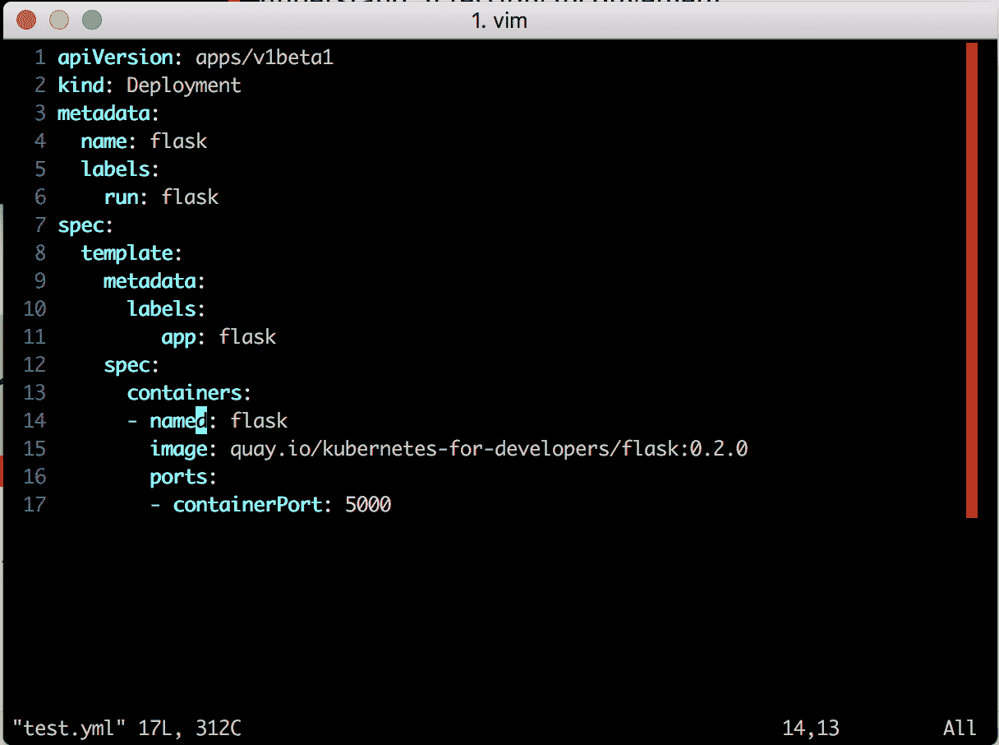

使用此清单运行`kubectl apply`时，您将收到一个错误：

```
error: error validating "test.yml": error validating data: [ValidationError(Deployment.spec.template.spec.containers[0]): unknown field "named" in io.k8s.api.core.v1.Container, ValidationError(Deployment.spec.template.spec.containers[0]): missing required field "name" in io.k8s.api.core.v1.Container]; if you choose to ignore these errors, turn validation off with --validate=false
```

在这种情况下，我犯了一个细微的拼写错误，错误地命名了一个必需字段`name`，这在错误中被突出显示为`missing required field`。

如果您包含了系统不知道的额外字段，您也会收到一个错误，但是稍有不同：

```
error: error validating "test.yml": error validating data: ValidationError(Deployment.spec.template.spec.containers[0]): unknown field "color" in io.k8s.api.core.v1.Container; if you choose to ignore these errors, turn validation off with --validate=false
```

在这种情况下，理解消息的关键是`unknown field`部分。这些消息还引用了通过数据结构到确切发生错误的路径。在前面的示例中，这是`Deployment`（在`kind`键中定义的对象）以及其中的`spec` -> `template` -> `spec` -> `container`。错误消息还确切定义了 Kubernetes API 尝试根据的对象：`io.k8s.api.core.v1.Container`。如果您对所需内容感到困惑，您可以使用此信息在 Kubernetes 网站上查找文档。这些对象是有版本的（请注意对象名称中的`v1`），在这种情况下，您可以在 Kubernetes 的参考文档中找到完整的定义。

参考文档是根据 Kubernetes 的每个版本发布的，对于 1.9 版本，该文档位于[`kubernetes.io/docs/reference/generated/kubernetes-api/v1.9/`](https://kubernetes.io/docs/reference/generated/kubernetes-api/v1.9/)。文档还包括一些示例细节以及三列视图中的定义：

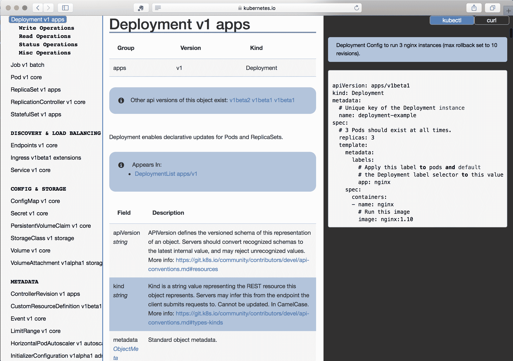

# 导航文档

文档遵循我们从 Kubernetes 对象本身看到的相同模式：它们由较小的基元组成。当您浏览文档时，例如查看屏幕截图中显示的部署，您经常会看到对封装的对象的引用，并且要深入了解细节，您可能需要引用其中一些对象区域。例如，部署示例封装了 Pods，因此为了正确定义模板中的所有属性，您可能需要参考 Pod v1 核心文档。

# ErrImagePull

ErrImagePull 可能是最常见的问题，幸运的是很容易调试和诊断。当发生这种情况时，您将看到`ErrImagePull`作为状态消息，表明 Kubernetes 无法检索您在清单中指定的图像。当简单地请求 pod 状态时，最常见的情况是：

```
kubectl get pods

NAME                  READY STATUS       RESTARTS AGE
flask-659c86495-vlplb 0/1   ErrImagePull 0        4s
```

您可以立即使用`kubectl describe`命令获取有关为什么发生此错误的更详细信息。从技术上讲，这并不完全是一个错误条件，因为 Kubernetes 在等待状态下，希望图像变得可用。

在此示例中，我们可以使用以下命令获得更多详细信息：

```
kubectl describe pod flask-659c86495-vlplb
```

这提供了诸如此类的信息：

```
Name: flask-659c86495-vlplb
Namespace: default
Node: minikube/192.168.99.100
Start Time: Sat, 17 Mar 2018 14:56:09 -0700
Labels: app=flask
 pod-template-hash=215742051
Annotations: <none>
Status: Pending
IP: 172.17.0.4
Controlled By: ReplicaSet/flask-659c86495
Containers:
 flask:
 Container ID:
 Image: quay.io/kubernetes-for-developers/flask:0.2.1
 Image ID:
 Port: 5000/TCP
 State: Waiting
   Reason: ImagePullBackOff
 Ready: False
 Restart Count: 0
 Environment: <none>
 Mounts:
 /var/run/secrets/kubernetes.io/serviceaccount from default-token-bwgcr (ro)
Conditions:
 Type Status
 Initialized True
 Ready False
 PodScheduled True
Volumes:
 default-token-bwgcr:
 Type: Secret (a volume populated by a Secret)
 SecretName: default-token-bwgcr
 Optional: false
QoS Class: BestEffort
Node-Selectors: <none>
Tolerations: <none>
```

从这个细节中可以看出容器处于等待状态，通常与 pod 相关的事件提供了最有用的信息。信息很密集，因此通常在调用此命令时有一个更宽的终端窗口可用，这样更容易解析：

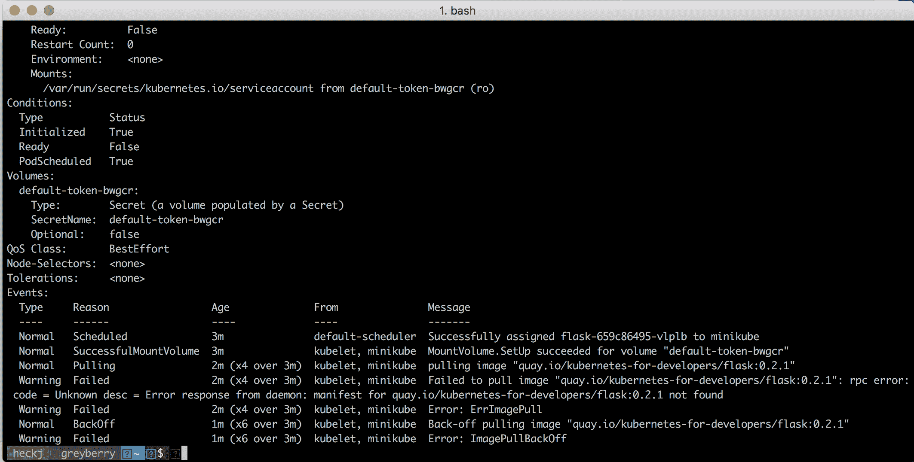

您可以看到 Kubernetes 已经采取的处理步骤：

1.  Kubernetes 安排了 pod

1.  安排 pod 的节点尝试检索请求的图像

1.  它报告了一个警告，说找不到图像，将状态设置为`ErrImagePull`，并开始使用回退重试

首先要做的是验证您请求的图像是否确实是您打算请求的图像。在这种情况下，我故意打了一个错字，请求了一个不存在的图像。

另一个常见的问题可能是图像确实存在，但由于某种原因不允许被拉取。例如，当您首次创建一个容器并将其推送到`quay.io`时，它会保持该容器构建为私有，直到您明确访问网站并将其公开为止。

如果您从私有存储库中拉取图像，但使用的凭据无效（或在更新过程中变得无效），则可能会出现相同的错误消息。

验证访问权限的最佳调试技术之一，至少对于公共图像，是尝试自己检索图像。如果您在本地安装了 Docker，只需调用 Docker 的`pull`命令即可。在这种情况下，我们可以验证图像：

```
docker pull quay.io/kubernetes-for-developers/flask:0.2.1
```

来自 Docker 命令行的错误响应相当直接：

```
Error response from daemon: manifest for quay.io/kubernetes-for-developers/flask:0.2.1 not found
```

# CrashLoopBackOff

您可能会发现您的 pod 报告状态为`CrashLoopBackOff`，这是另一个非常常见的错误状态。

这是一个仅在调用容器后发生的错误条件，因此可能会延迟出现。通常在调用`kubectl get pods`时会看到它：

```
NAME                          READY STATUS           RESTARTS AGE
flask-6587cb9b66-zzw8v        1/2   CrashLoopBackOff 2        1m
redis-master-75c798658b-4x9h5 1/1   Running          0        1m
```

这明确意味着 pod 中的一个容器意外退出，可能是以非零错误代码退出。了解发生了什么的第一步是利用`kubectl describe`命令获取更多细节。在这种情况下：

```
kubectl describe pod flask-6587cb9b66-zzw8v
```

浏览生成的内容，查看 pod 中每个容器的状态：

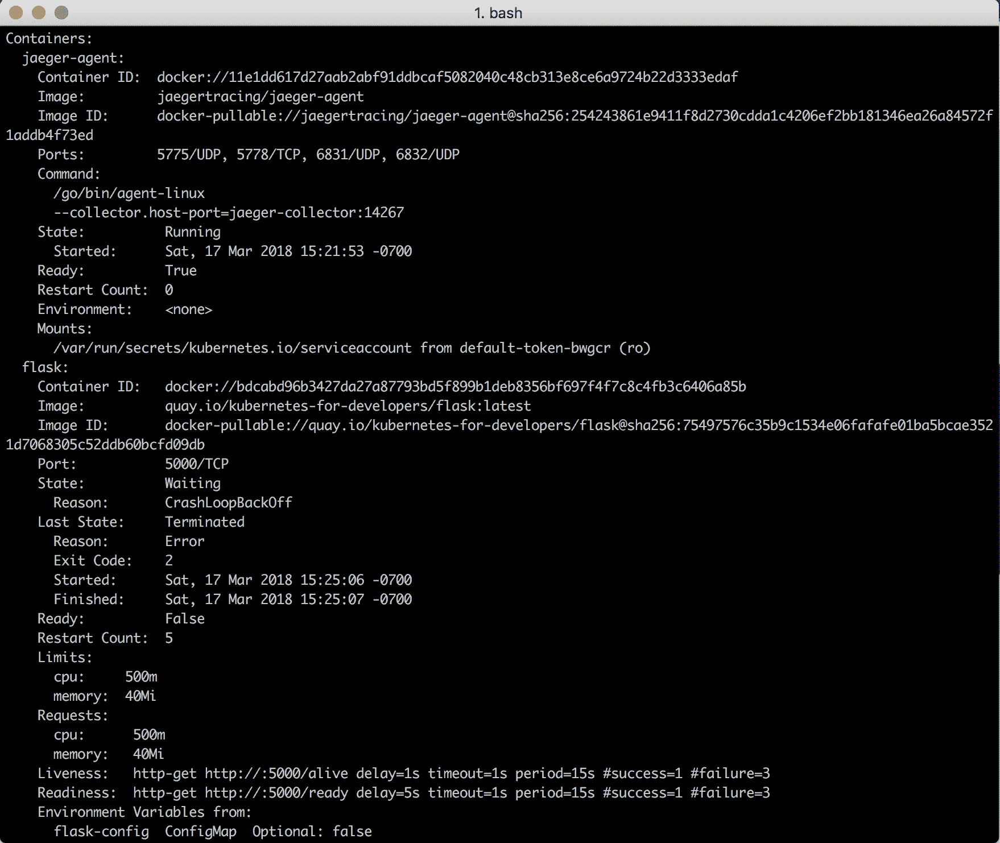

在前面的例子中，您可以看到 Jaeger 收集器容器处于 `Running` 状态，而 `Ready` 报告为 `True`。然而，flask 容器处于 `Terminated` 状态，原因只有 `Error`，退出代码为 `2`。

通常提供关于容器退出原因的至少一些信息的步骤是利用 `kubectl logs` 命令，查看我们在 `STDOUT` 和 `STDERR` 中报告的内容。

如果您调用 `kubectl logs` 和 pod 名称，您可能还会看到此错误：

```
kubectl logs flask-6587cb9b66-zzw8v

Error from server (BadRequest): a container name must be specified for pod flask-6587cb9b66-zzw8v, choose one of: [jaeger-agent flask] or one of the init containers: [init-myservice]
```

这只是要求您在识别容器时更具体。在这个例子中，我们使用了一个具有初始化容器以及两个容器的 pod：主容器和 Jaeger 收集器 side-car。简单地将容器附加到命令的末尾，或者使用 `-c` 选项与容器名称，就可以实现您想要的效果：

```
kubectl logs flask-6587cb9b66-zzw8v -c flask

python3: can't open file '/opt/exampleapp/exampleapp': [Errno 2] No such file or directory
```

返回的内容以及其有多大用处，将取决于您如何创建容器以及您的 Kubernetes 集群使用的容器运行时。

提醒一下，`kubectl logs` 还有 `-p` 标志，这在检索容器的上一次运行日志时非常有用。

如果出于某种原因，您并不完全确定容器中设置了什么，我们可以使用一些 Docker 命令直接在本地检索并检查容器镜像，这通常可以阐明问题所在。

提醒一下，拉取镜像：

```
docker pull quay.io/kubernetes-for-developers/flask:latest
```

然后，进行检查：

```
docker inspect quay.io/kubernetes-for-developers/flask:latest
```

向下滚动到内容，您可以看到容器将尝试运行的内容以及它的设置方式：

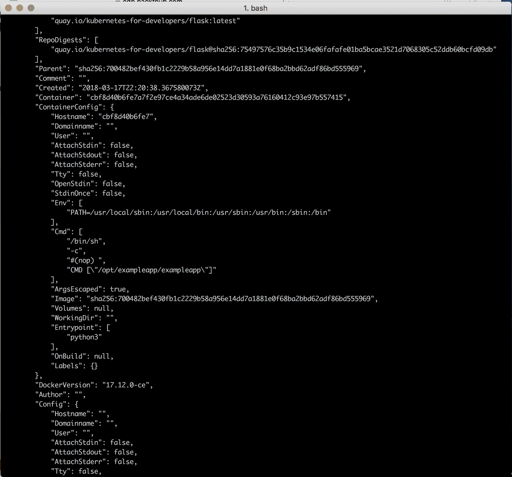

在这个特定的例子中，我故意在被调用的 Python 文件名中引入了一个拼写错误，省略了 `.py` 扩展名。当您查看此输出时，这可能并不明显，但请特别查找 `EntryPoint` 和 `Cmd`，并尝试验证这些是否是预期的值。在这种情况下，入口点是 `python3`，命令是随之被调用的：`/opt/exampleapp/exampleapp`。

# 开始并检查镜像

由于这可能不太清楚，除了实际检查镜像之外，诊断此类问题的常见方法是使用替代命令运行镜像，例如 `/bin/sh`，并使用交互式会话来查看并进行验证和调试。如果您安装了 Docker，可以在本地执行此操作；在这样做时，请确保明确覆盖 `entrypoint` 和命令以交互式运行命令：

```
docker run -it --entrypoint=/bin/sh \
quay.io/kubernetes-for-developers/flask:latest -i
```

然后，您可以手动调用容器将要运行的内容，`python3 /opt/exampleapp/exampleapp`，并在那里进行任何额外的调试。

如果您没有在本地安装 Docker，您也可以在 Kubernetes 集群中执行相同的操作。如果 Pod 已经存在，您可以像之前一样使用`kubectl exec`，但是当容器崩溃时，通常是不可用的，因为容器尚未运行。

在这些情况下，使用`kubectl run`创建一个全新的、短暂的、临时的部署是一个不错的选择：

```
kubectl run -i --tty interactive-pod \
--image=quay.io/kubernetes-for-developers/flask:latest \
--restart=Never --command=true /bin/sh
```

如果您想要覆盖容器的入口点，您将需要在选项中小心使用`--command=true`，否则入口点将被设置为`python3`。如果没有该选项，`kubectl run`命令将假定您正在尝试传递不同的参数以与默认入口点一起使用。

您可能还会发现，当您尝试调用这样的命令时，会收到以下消息：

```
Error from server (AlreadyExists): pods "interactive-pod" already exists
```

当您创建一个类似的裸部署时，容器退出（或出现错误）后，Pod 不会被删除。使用`kubectl get pods`命令加上`-a`选项应该会显示存在的 Pod：

```
kubectl get pods -a

NAME                          READY STATUS           RESTARTS AGE
flask-6587cb9b66-zzw8v        1/2   CrashLoopBackOff 14       49m
interactive-pod               0/1   Completed        0        5m
redis-master-75c798658b-4x9h5 1/1   Running          0        49m
```

您可以删除它以再次尝试运行它：

```
kubectl delete pod interactive-test
```

# 向容器添加自己的设置

当您使用包含您没有创建的代码和系统的容器时，您可能会希望在容器中运行任何进程之前设置一些环境变量或者建立一些配置文件。这在使用其他预构建的开源软件时非常常见，特别是那些没有已经建立好的容器可以利用的软件。

处理这种情况的一种常见技术是将一个 shell 脚本添加到容器中，然后将入口点和参数设置为运行该脚本。如果这样做，请确保包括适当的选项来调用脚本。

一个常见的例子是使用`/bin/bash -c /some/script`来调用脚本。很容易忽略`-c`参数，这可能会导致一个非常令人困惑的错误消息：

```
/bin/sh: can't open '/some/script'
```

当引用的脚本没有设置为可执行时，且您没有包括`-c`选项来让 shell 尝试读取和解释您指定的文件时，就会发生这种情况。

# 服务没有可用的端点

最难以发现的问题之一是为什么我的服务没有按照我期望的那样工作？在这些情况下常见的错误是这样的消息：

```
no endpoints available for service
```

如果您已经一起创建了部署和服务，并且一切似乎都在运行，但当您访问服务端点时看到这个输出：

```
{
  "kind": "Status",
  "apiVersion": "v1",
  "metadata": {

  },
  "status": "Failure",
  "message": "no endpoints available for service \"flask-service\"",
  "reason": "ServiceUnavailable",
  "code": 503
}
```

在这种情况下，当使用`kubectl proxy`通过代理使用 URL 访问服务端点`flask-service`时，我收到了这条消息：

```
http://localhost:8001/api/v1/proxy/namespaces/default/services/flask-service
```

在这些情况下，使用`kubectl describe`命令获取有关服务设置的详细信息：

```
kubectl describe service flask-service
```

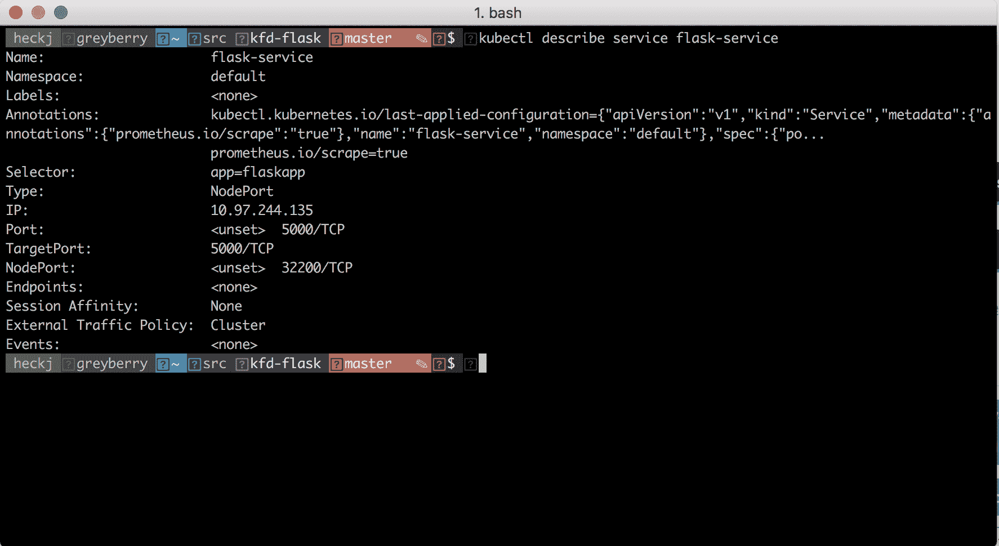

密切注意为服务设置的选择器，然后将其与您认为应该匹配的部署进行比较。在这种情况下，选择器是`app=flaskapp`，看看我们的部署的详细信息：

```
kubectl describe deploy flask
```

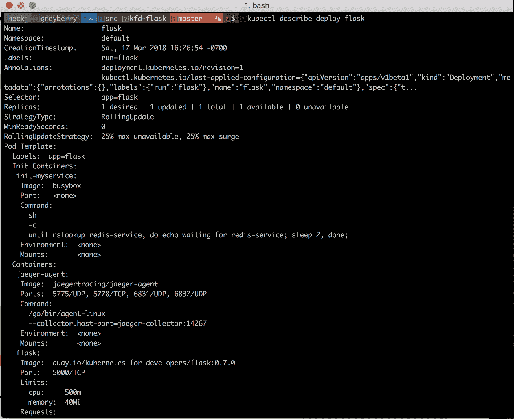

您应该立即验证的是容器是否正在运行和正常运行，而在这种情况下是的。接下来要做的事情是查看部署的标签，在这种情况下，您会看到它们设置为`app=flask`，而不是`app=flaskapp`，这就是为什么该服务没有响应的原因。

查看支持服务的 pod 发生的情况的另一种方法是使用`kubectl get`命令具体请求 pod。例如，我们可以使用这个命令：

```
kubectl get pods -l app=flaskapp -o wide
```

由于我们还没有使用相关标签设置任何 pod，我们会收到这样的响应：

```
No resources found.
```

标签和选择器是 Kubernetes 中许多元素松散耦合在一起的方式。由于松散耦合，Kubernetes 不会验证您是否正确设置了将 pod 绑定到服务的正确值。不确保标签和选择器是正确的是一个容易犯的错误，除了没有按预期响应外，不会显示为错误。

# 卡在 PodInitializing

您可能会遇到一种情况，您的 pod 似乎在初始化时出现挂起的情况，特别是当您首次设置涉及卷挂载和 ConfigMaps 的配置时。

从`kubectl get pods`的状态看起来是这样的：

```
NAME                          READY STATUS   RESTARTS AGE
flask-6bc4b4c8dc-cm6gx        0/2   Init:0/1 0        7m
redis-master-75c798658b-p4t7c 1/1   Running  0        7m
```

而且状态没有改变。尝试获取正在发生的日志，比如：

```
kubectl logs flask-6bc4b4c8dc-cm6gx init-myservice
```

导致这个消息的结果是：

```
Error from server (BadRequest): container "init-myservice" in pod "flask-6bc4b4c8dc-cm6gx" is waiting to start: PodInitializing
```

在这种情况下，最好的做法是使用`kubectl describe`来获取 pod 和最近事件的详细信息：

```
kubectl describe pod flask
```

在这里，您将看到输出显示所有容器都处于“等待”状态，原因是`PodInitializing`：

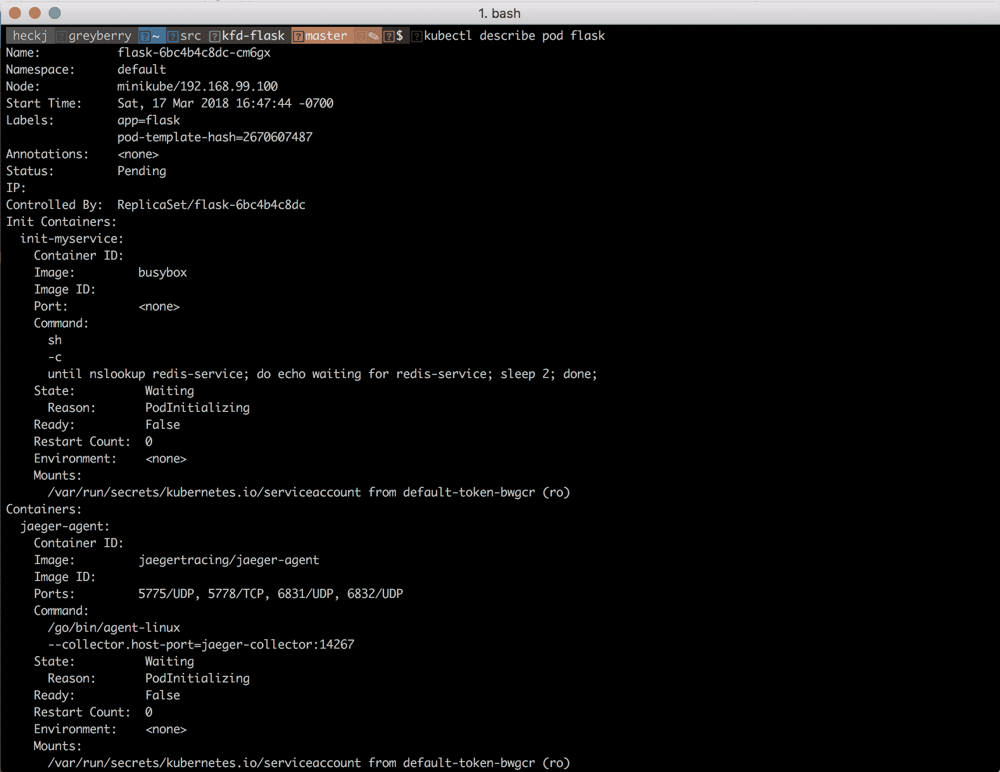

事件可能需要几分钟的时间才能真正显示出发生了什么，但几分钟后它们应该会出现：

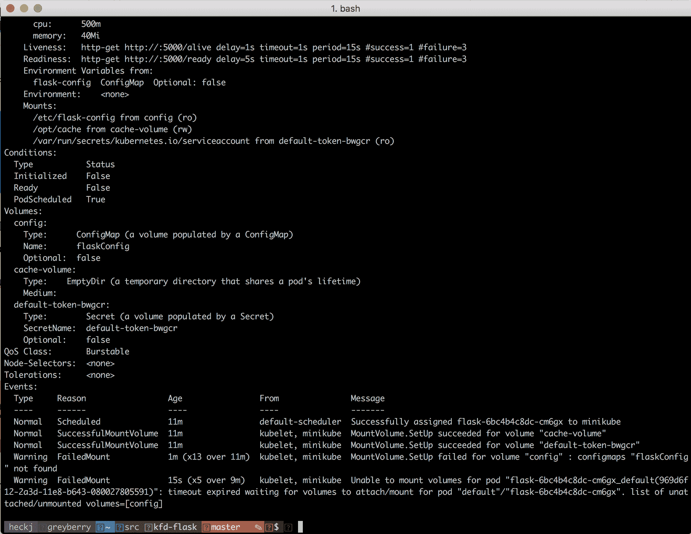

您会看到警告`FailedMount`，以及相关的信息：

```
MountVolume.SetUp failed for volume "config" : configmaps "flaskConfig" not found
```

这需要一些时间才能出现，因为 Kubernetes 在尝试挂载卷时提供了一些较长的超时时间，以及重试。在这种情况下，错误是 Pod 规范中引用了一个不存在的 ConfigMap：`flaskConfig`。

# 缺失的资源

在许多方面，我们刚刚描述的这个问题与标签和选择器的错误非常相似，但表现出来的方式完全不同。底层系统会尽力寻找卷、ConfigMaps、秘钥等，并允许您以任何顺序创建它们。如果您打错字，或者 ConfigMap、秘钥或卷的引用不正确或者丢失，那么 Pod 最终将失败。

这些资源都是动态引用的。在进行引用时，Kubernetes 提供了重试和超时，但在实际寻找相关资源并最终失败之前，无法明确验证故障。这可能会使调试这些问题变得更加耗时。当您首次寻找问题失败的原因时，可能不是所有的信息都是可见的（例如卷挂载失败、缺失的 ConfigMap 或秘钥等）。最佳选择是密切关注`kubectl describe`命令中的事件，并明确寻找事件中的警告，这些问题最终会出现在那里。

一些开发团队正在通过生成清单来解决这个问题，使用他们自己验证过的程序来创建适当的链接并确保它们是正确的。

# 开发人员的新兴项目

寻找替代方案来帮助使用 Kubernetes 的开发过程开始暴露出大量的开发中项目。在编写本书时，Kubernetes 从版本 1.7 进化到 Kubernetes v1.10 的 beta 版本。与此同时，大量的项目已经开始在 Kubernetes 周围建立自己，努力帮助消除在开发工作流程中积极使用 Kubernetes 时的一些问题。

# Linters

在上一节中，我们谈到了 Kubernetes 无法预先验证的缺失组件，但我们可以自己查找。与验证相关的三个项目是 kubeval、kube-lint 和 kubetest，这里进行了描述：

+   kubeval：[`github.com/garethr/kubeval`](https://github.com/garethr/kubeval)

kubeval 由 Gareth Rushgrove 创建，用于在尝试应用之前验证清单和配置文件。当您从自己的代码创建清单或使用另一个项目时，此工具非常有用。它无法检查所有内容，但是可以进行出色的首次检查。

+   kube-lint：[`github.com/viglesiasce/kube-lint`](https://github.com/viglesiasce/kube-lint)

由 Vic Iglesias 创建，kube-lint 更像是一个早期实验或功能原型，而不是一个不断发展的项目。它旨在根据一组常见规则验证一组 Kubernetes 清单。其中许多最佳实践和常见模式来自 Helm 项目，Vic 在其中积极参与，并且 Kubernetes 项目内正在讨论可能的方式来使用`lint`命令进行更多此类验证。

+   kubetest：[`github.com/garethr/kubetest`](https://github.com/garethr/kubetest)

Gareth Rushgrove 也开发了 kubetest，用于在 Kubernetes 配置文件上运行测试。与明确封装最佳实践和规则不同，它更多地以单元测试的形式编写，允许对文件集进行断言，并让您指定自己的约束。

# Helm

我们在前几章中提到并使用了 Helm，用它在 Kubernetes 中安装软件，以便我们可以利用它。Helm 可在[`helm.sh`](https://helm.sh)找到，版本 2 已经相当稳定，并且被许多开发团队积极使用。代表收集的最佳实践的图表可在[`github.com/kubernetes/charts`](https://github.com/kubernetes/charts)找到，并且随着它们封装的软件和 Kubernetes 的进步而更新：

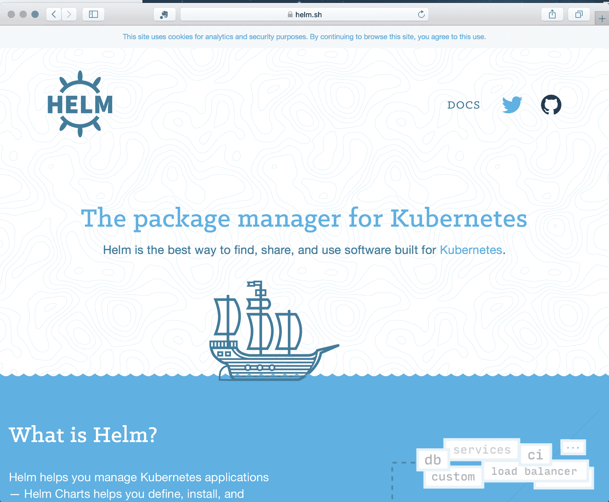

Helm 版本 3 是 Helm 的下一个重大进步，打破了他们在版本 2 中一直保持的一些向后兼容性保证。随着过渡，项目团队非常清楚地表示将有明确的迁移路径，并且当前的图表和示例将在项目发展过程中保持有用。Helm v3 的愿景细节仍在形成，这个项目无疑将是更大的 Kubernetes 生态系统中的关键项目。

在第 2 版中，它将自己定位为 Kubernetes 的软件包管理器，主要专注于成为一种一致的方式（和示例）来打包一组 pod、部署、服务、ConfigMaps 等，并将它们作为一个整体在 Kubernetes 中部署。许多团队创建了他们自己的图表，并将 Helm 集成到他们的持续集成流水线中，使用 Helm 来渲染清单，随着基础软件的更新并作为该过程的一部分进行部署。

Helm 的一个缺点可能是为自己的软件创建模板相当复杂。Helm 使用的模板系统称为 sprig，可能对许多开发团队来说并不熟悉。Helm 的下一个主要修订版，正在本书出版时被定义，希望解决许多挑战，包括使开发人员更容易编写和发布图表。这个项目真的值得关注。

# ksonnet

ksonnet ([`ksonnet.io`](https://ksonnet.io)) 也被提及为另一种用于模板化和渲染 Kubernetes 清单的手段。ksonnet 以不同的方式处理任务，专注于模板化清单，并使这些模板非常容易组合：

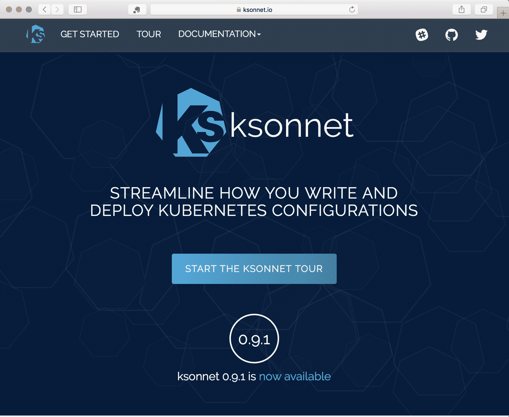

ksonnet 使用用户的凭据，并不尝试管理其渲染的发布状态，而是专注于模板化。它建立在一个名为 Jsonnet 的库之上，为 JSON 模板添加了一些编程方面的内容。

ksonnet 是一个相当新的项目，开始受到其他项目的关注。他们表示他们也在积极与 Helm 社区合作，并希望将 ksonnet 作为创建图表的替代方式。

# Brigade

Brigade，可在[`brigade.sh`](https://brigade.sh)找到，采取了一种略有不同的方法来解决部署到 Kubernetes 的问题。它不是专注于模板化和用于以编程方式生成 Kubernetes 清单的 DSL，而是更倾向于使用 Kubernetes 及其事件作为一流公民进行脚本编写和编程：

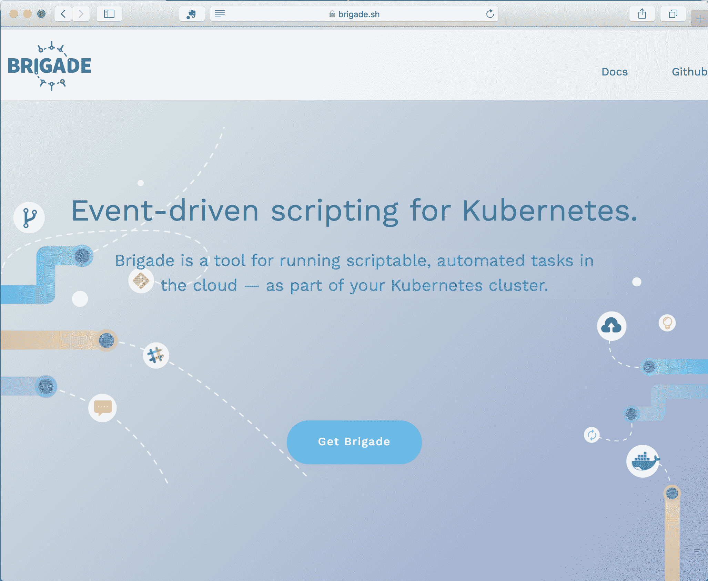

来自 Azure 的微软团队构建了 Brigade 来扩展 JavaScript，将 Kubernetes 对象和事件公开为可以组合成工作流程和管道的元素。如果您的开发团队熟悉 JavaScript，那么 Brigade 可能是一种特别吸引人的协调和与 Kubernetes 交互的手段。

# skaffold

Skaffold 可以在[`github.com/GoogleCloudPlatform/skaffold`](https://github.com/GoogleCloudPlatform/skaffold)找到，由 Google 团队开发！

它是这些面向开发人员的项目中最新的一个，专注于成为一个命令行工具，以实现从检入代码到源代码控制，通过构建容器到更新和部署 Kubernetes 清单的过程。它还被设置为一个更大工具链中的一个组件，并已连接到其他项目，特别是 Helm，用于部署部分。

# img

在将工具和项目视为组件时，值得注意的是托管在[genuinetools.org](https://genuinetools.org)下的 img 项目，可以在 GitHub 上找到[`github.com/genuinetools/img`](https://github.com/genuinetools/img)。本书中的示例都使用 Docker 构建容器映像，而 img 则构建在 Docker 团队从其产品演变出来的基础工具包上，以支持创建容器。最重要的是，img 项目允许在没有守护程序或以显着权限运行的情况下创建 Docker 映像。这使得在 Kubernetes 集群内构建容器或更一般地而言，无需赋予该过程对托管它的系统具有广泛权限的过程更加容易。

genuinetools 项目托管了许多其他有用的组件，其中大多数都专注于替代容器运行时。

# Draft

微软团队的另一个工具 Draft 可以在[`draft.sh`](https://draft.sh)找到，它是一个专注于优化从源代码更改到在 Kubernetes 中部署并查看这些更改的工具：

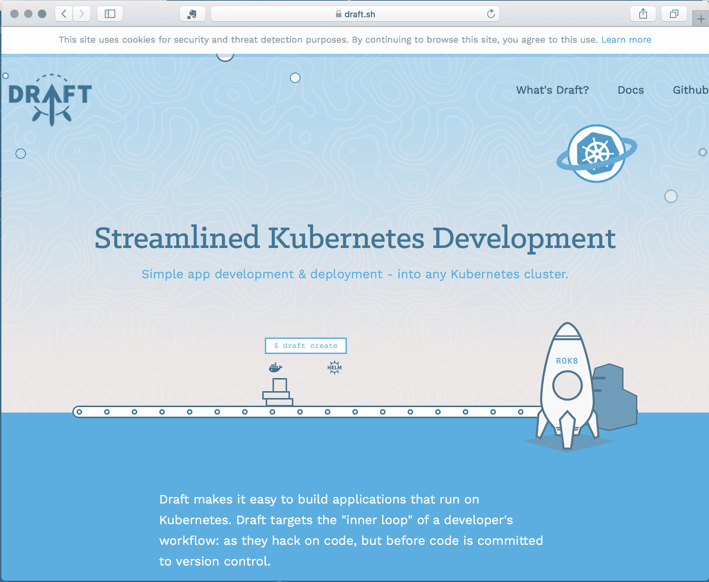

Draft 专注于简单的命令和本地配置文件，用于为您的应用程序创建本地 Helm 图表，并简化在 Kubernetes 集群上运行它的过程，封装了构建容器、将其推送到容器注册表，然后部署更新的清单以进行升级的重复过程。

与其他一些工具一样，Draft 建立在 Helm 的基础上并使用 Helm。

# ksync

ksync，可在[`vapor-ware.github.io/ksync/`](https://vapor-ware.github.io/ksync/)找到，采用了一种非常不同的开发工具策略。与其优化构建和部署到 Kubernetes 集群的时间不同，它专注于扩展代理功能，以便进入集群并操纵特定容器内的代码：

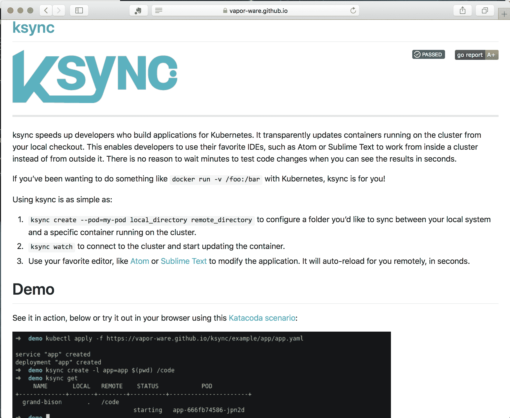

使用 Docker 进行开发的常见模式是挂载包含解释代码的本地目录（例如本书中的 Python 和 JavaScript 示例），并让容器运行该代码，以便您可以即时编辑并快速重新启动和重试。 ksync 通过在本地开发机器和集群内同时运行来模拟此功能，监视本地更改并将其反映到 Kubernetes 中。

ksync 专注于单个 pod 内软件的开发过程。因此，虽然它无法帮助部署所有支持的应用程序，但它可能会加快 Kubernetes 中单个组件的开发过程。

# 远程呈现

Telepresence，可在[`www.telepresence.io`](https://www.telepresence.io)找到，是另一个专注于为开发人员提供从本地机器到 Kubernetes 集群的更紧密访问的项目：

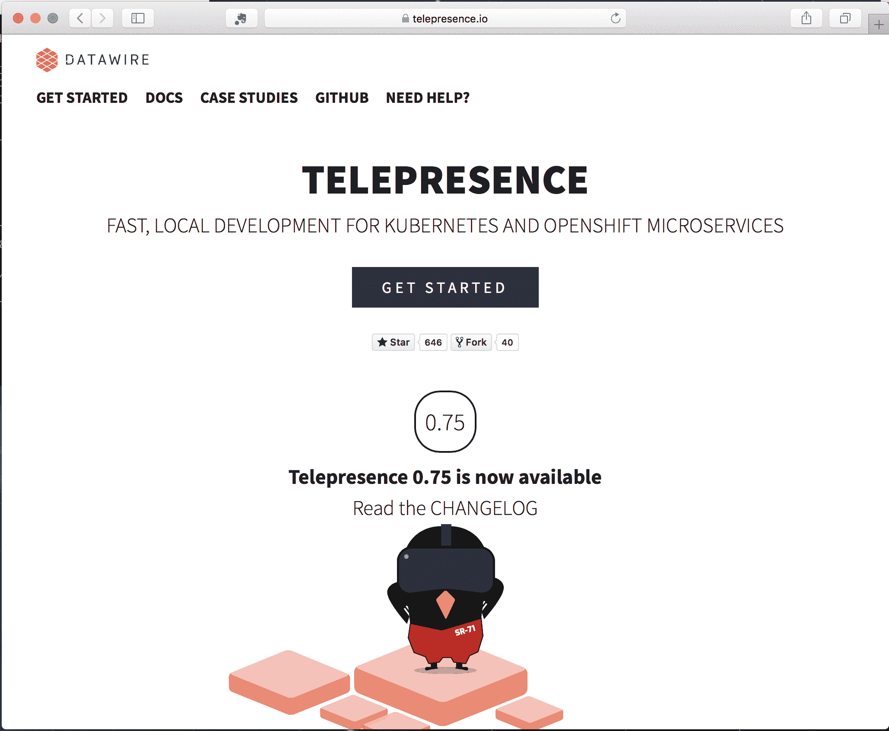

由 Datawire 创建，该公司还为开发人员提供其他与 Kubernetes 一起使用的项目。Telepresence 创建了一个双向代理，将连接和响应转发到 Kubernetes 中 pod 内的进程，该进程在您本地的开发机器上运行。

ksync 复制您的代码并在 Kubernetes 内运行，而 Telepresence 则允许您在自己的机器上运行代码，并将其透明地连接，就像它是在 Kubernetes 内运行的 pod 一样。

# 与 Kubernetes 项目交互

在讨论所有这些项目时，你可以获得关于如何与 Kubernetes 一起工作的最多信息的项目就是 Kubernetes 本身。该项目托管了一个网站，其中包括正式文档、博客、社区日历、教程等，网址为[`kubernetes.io/`](https://kubernetes.io)：

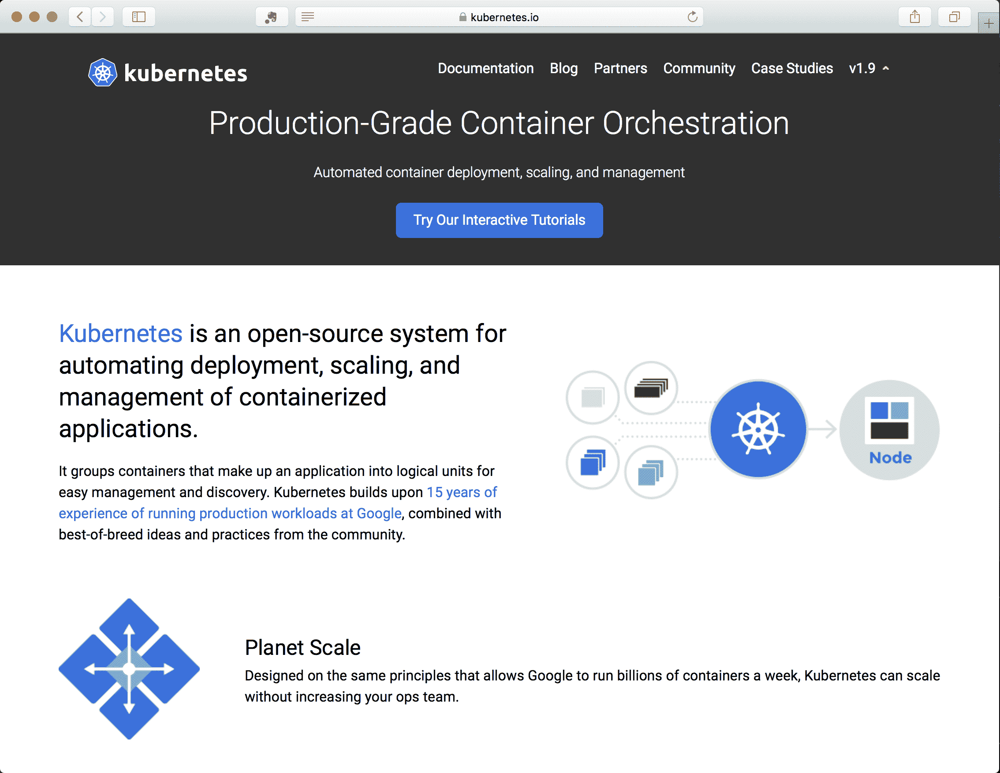

这个网站是获取更多信息的绝佳起点，但当然不是唯一的资源。

Kubernetes 项目实际上非常庞大，以至于几乎不可能有任何单个人来跟踪项目内正在进行的所有努力、发展、项目和兴趣。为了提供指导，Kubernetes 项目已经建立了一些专门关注这些兴趣的小组，即特别兴趣小组或 SIG。这些小组是 Kubernetes 的半正式子项目，每个小组都专注于 Kubernetes 的某个特定子集。毫不奇怪，许多这些 SIG 在具体方面有重叠，并且在 Kubernetes 中发现一个贡献者同时活跃于多个 SIG 是很常见的。

SIG 的完整列表可在线获取，并在[`github.com/kubernetes/community/blob/master/sig-list.md`](https://github.com/kubernetes/community/blob/master/sig-list.md)上进行维护。每个 SIG 都有特定的人被指定为领导者，定期举行会议，其中许多人维护在线笔记，甚至记录他们的在线会议。这些 SIG 都松散协调以推进 Kubernetes，并由 Kubernetes 指导委员会和许多社区经理进行协调。

还有一些不太正式的工作小组，专注于特定或短暂的兴趣，没有特定的领导或出席。所有这些 SIG 和工作小组一起，可以创造大量的信息和深度，可供查阅，并且有一个非常开放的社区，可以与项目相关的人进行互动。

社区还管理着 SIG 会议和活动的日历，可在[`kubernetes.io/community/`](https://kubernetes.io/community/)上获取，并定期在 Kubernetes 博客上发布文章，网址为[`blog.kubernetes.io`](http://blog.kubernetes.io)。

# Slack

Kubernetes 贡献者之间常见的互动方式是使用 Slack 的在线聊天频道。Kubernetes 拥有大量专门用于 SIGs、工作组和项目的互动频道。任何人都可以加入，您可以在[`slack.k8s.io`](http://slack.k8s.io)注册以获取访问权限。

如果您是 Slack 或 Kubernetes 的新手，那么`#kubernetes-users`和`#kubernetes-novices`频道可能会特别感兴趣。整个社区团队还举办他们所谓的办公时间，这是在 YouTube 上直播的直播，以及 Slack 频道`#office-hours`。

# YouTube

如果您喜欢视频流，Kubernetes 社区提供了一个 YouTube 频道，网址为[`www.youtube.com/c/KubernetesCommunity/`](https://www.youtube.com/c/KubernetesCommunity/)。这些视频包括社区会议的录像，以及定期 Kubernetes 会议的会议内容。许多 SIGs 也记录他们的定期会议并在 YouTube 上发布，尽管它们并不是通过这个频道进行一致协调的。如果您想找到相关内容，最好通过每个单独的 SIG 来追踪，尽管您可能能够在该频道的播放列表下找到您想要的内容，网址为[`www.youtube.com/channel/UCZ2bu0qutTOM0tHYa_jkIwg/playlists`](https://www.youtube.com/channel/UCZ2bu0qutTOM0tHYa_jkIwg/playlists)：

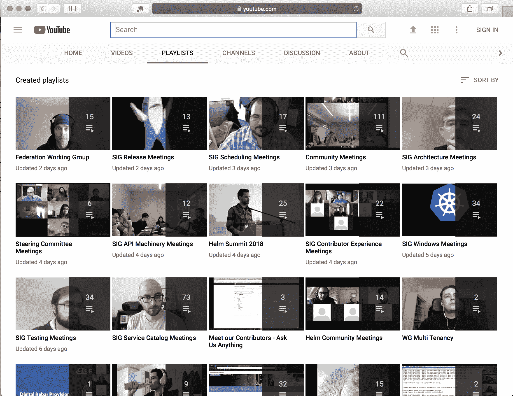

# Stack Overflow

Kubernetes 社区的成员也在 Stack Overflow 上观看并回答问题。前面提到的办公时间鼓励人们在 Stack Overflow 上发布问题，并在办公时间上寻求互动帮助。您可以在[`stackoverflow.com/questions/tagged/kubernetes`](https://stackoverflow.com/questions/tagged/kubernetes)找到与 Kubernetes 相关的问题。如果您在 Google 上搜索与 Kubernetes 相关的主题，您可能也会在 Stack Overflow 上找到已经提出和回答的问题的结果。

# 邮件列表和论坛

Kubernetes 有一个通用的邮件列表/论坛，以及每个 SIG 和经常为每个工作组的邮件列表。常见的论坛包括：

+   [`groups.google.com/forum/#!forum/kubernetes-users`](https://groups.google.com/forum/#!forum/kubernetes-users)

+   [`groups.google.com/forum/#!forum/kubernetes-dev`](https://groups.google.com/forum/#!forum/kubernetes-dev)

[`github.com/kubernetes/community/blob/master/sig-list.md`](https://github.com/kubernetes/community/blob/master/sig-list.md)上的 SIG 列表还包括了每个 SIG 的个人邮件列表的参考链接。

关于 Kubernetes 的信息并非只有一种途径，社区非常努力地提供多种获取信息、提问和鼓励参与的方式。

# 摘要

在本章中，我们涉及了在开发和部署到 Kubernetes 时可能遇到的一些问题，然后介绍了一些项目，这些项目可能会对帮助您或您的团队加快开发过程并利用 Kubernetes 提供帮助。本章的最后部分讨论了 Kubernetes 项目本身，您如何与之交互，以及在哪里找到更多信息来利用这一奇妙的工具集。
