# 无服务器景观

欢迎来到《用于无服务器应用的 Kubernetes》的第一章。在本章中，我们将讨论以下内容：

+   我们所说的无服务器和函数作为服务是什么意思？

+   有哪些服务？

+   亚马逊网络服务的 Lambda 的一个例子。

+   Azure Functions 的一个例子

+   使用无服务器工具包

+   我们可以使用无服务器和函数作为服务解决什么问题？

我认为重要的是我们首先要解决房间里的大象，那就是无服务器这个术语。

# 无服务器和函数作为服务

当你对某人说无服务器时，他们首先得出的结论是你在没有任何服务器的情况下运行你的代码。

如果你使用我们将在本章后面讨论的公共云服务之一，这可能是一个相当合理的结论。然而，当在你自己的环境中运行时，你无法避免必须在某种服务器上运行。

在我们讨论无服务器和函数作为服务的含义之前，我们应该讨论我们是如何到达这里的。和我一起工作的人无疑会告诉你，我经常使用“宠物与牛群”这个类比，因为这是一个很容易解释现代云基础设施与更传统方法之间差异的方式。

# 宠物、牛群、鸡、昆虫和雪花

我第一次接触“宠物与牛群”这个类比是在 2012 年，当时 Randy Bias 发布了一份幻灯片。这张幻灯片是在 Randy Bias 在云扩展会议上关于开放和可扩展云的架构的演讲中使用的。在演讲的最后，他介绍了宠物与牛群的概念，Randy 将其归因于当时在微软担任工程师的 Bill Baker。

幻灯片主要讨论的是扩展而不是升级；让我们更详细地讨论一下，并讨论自五年前首次进行演示以来所做的一些补充。

Randy 的幻灯片可以在[`www.slideshare.net/randybias/architectures-for-open-and-scalable-clouds`](https://www.slideshare.net/randybias/architectures-for-open-and-scalable-clouds)找到。

# 宠物

宠物通常是我们作为系统管理员花时间照顾的东西。它们是传统的裸金属服务器或虚拟机：

+   我们像给宠物起名字一样给每台服务器起名字。例如，`app-server01.domain.com`和`database-server01.domain.com`。

+   当我们的宠物生病时，你会把它们带到兽医那里。这很像你作为系统管理员重新启动服务器，检查日志，并更换服务器的故障组件，以确保它正常运行。

+   你多年来一直密切关注你的宠物，就像对待服务器一样。你监视问题，修补它们，备份它们，并确保它们有充分的文档记录。

运行宠物并没有太大问题。然而，你会发现你大部分的时间都花在照顾它们上——如果你有几十台服务器，这可能还可以接受，但如果你有几百台服务器，情况就开始变得难以管理了。

# 牛

牛更能代表你应该在公共云中运行的实例类型，比如**亚马逊网络服务**（**AWS**）或微软 Azure，在那里你启用了自动扩展。

+   你的牛群里有很多牛，你不给它们起名字；相反，它们被编号和标记，这样你就可以追踪它们。在你的实例集群中，你也可能有太多实例需要命名，所以像牛一样，你给它们编号和标记。例如，一个实例可以被称为`ip123067099123.domain.com`，并标记为`app-server`。

+   当你的牛群中的一头生病时，你会射杀它，如果你的牛群需要，你会替换它。同样地，如果你集群中的一个实例开始出现问题，它会被自动终止并替换为一个副本。

+   你不指望牛群中的牛能活得像宠物一样长久，同样地，你也不指望你的实例的正常运行时间能以年为单位。

+   你的牛群生活在一个牧场里，你从远处观察它，就像你不监视集群中的单个实例一样；相反，你监视集群的整体健康状况。如果你的集群需要额外的资源，你会启动更多的实例，当你不再需要资源时，实例会被自动终止，使你回到期望的状态。

# 鸡

2015 年，Bernard Golden 在一篇名为《云计算：宠物、牛和鸡？》的博客文章中，将鸡引入到宠物与牛的比喻中。Bernard 建议将鸡作为描述容器的一个好术语，与宠物和牛并列：

+   鸡比牛更有效率；你可以把更多的鸡放在你的牛群所占用的同样空间里。同样地，你可以在你的集群中放更多的容器，因为你可以在每个实例上启动多个容器。

+   每只鸡在饲养时需要的资源比你的牧群成员少。同样，容器比实例需要的资源更少，它们只需要几秒钟就可以启动，并且可以配置为消耗更少的 CPU 和 RAM。

+   鸡的寿命远低于你的牧群成员。虽然集群实例的正常运行时间可能是几小时到几天，但容器的寿命可能只有几分钟。

不幸的是，伯纳德的原始博客文章已经不再可用。然而，The New Stack 已经重新发布了一篇版本。你可以在[`thenewstack.io/pets-and-cattle-symbolize-servers-so-what-does-that-make-containers-chickens/`](https://thenewstack.io/pets-and-cattle-symbolize-servers-so-what-does-that-make-containers-chickens/)找到重新发布的版本。

# 昆虫

与动物主题保持一致，埃里克·约翰逊为 RackSpace 撰写了一篇介绍昆虫的博客文章。这个术语被用来描述无服务器和函数即服务。

昆虫的寿命远低于鸡；事实上，一些昆虫只有几小时的寿命。这符合无服务器和函数即服务的特点，因为它们的寿命只有几秒钟。

在本章的后面，我们将看一下来自 AWS 和微软 Azure 的公共云服务，这些服务的计费是以毫秒为单位，而不是小时或分钟。

埃里克的博客文章可以在[`blog.rackspace.com/pets-cattle-and-nowinsects/`](https://blog.rackspace.com/pets-cattle-and-nowinsects/)找到。

# 雪花

大约在兰迪·拜斯提到宠物与牛群的讲话时，马丁·福勒写了一篇名为*SnowflakeServer*的博客文章。这篇文章描述了每个系统管理员的噩梦：

+   每片雪花都是独一无二的，无法复制。就像办公室里那台由几年前离开的那个人建造而没有记录的服务器一样。

+   雪花是脆弱的。就像那台服务器一样——当你不得不登录诊断问题时，你会很害怕，你绝对不会想重新启动它，因为它可能永远不会再次启动。

马丁的帖子可以在[`martinfowler.com/bliki/SnowflakeServer.html`](https://martinfowler.com/bliki/SnowflakeServer.html)找到。

# 总结

一旦我解释了宠物、牛群、鸡、昆虫和雪花，我总结道：

“那些拥有**宠物**的组织正在慢慢将他们的基础设施变得更像**牛**。那些已经将他们的基础设施运行为**牛**的人正在向**鸡**转变，以充分利用他们的资源。那些运行**鸡**的人将会考虑将他们的应用程序转变为**昆虫**，通过将他们的应用程序完全解耦成可单独执行的组件来完成。”

最后我这样说：

“没有人想要或者应该运行**雪花**。”

在这本书中，我们将讨论昆虫，我会假设你对覆盖牛和鸡的服务和概念有一些了解。

# 无服务器和昆虫

如前所述，使用“无服务器”这个词会给人一种不需要服务器的印象。无服务器是用来描述一种执行模型的术语。

在执行这个模型时，作为最终用户的你不需要担心你的代码在哪台服务器上执行，因为所有的决策都是由抽象出来的，与你无关——这并不意味着你真的不需要任何服务器。

现在有一些公共云服务提供了如此多的服务器管理抽象，以至于可以编写一个不依赖于任何用户部署服务的应用程序，并且云提供商将管理执行代码所需的计算资源。

通常，这些服务，我们将在下一节中看到，是按每秒执行代码所使用的资源计费的。

那么这个解释如何与昆虫类比呢？

假设我有一个网站，允许用户上传照片。一旦照片上传，它们就会被裁剪，创建几种不同的尺寸，用于在网站上显示缩略图和移动优化版本。

在宠物和牛的世界中，这将由一个 24/7 开机等待用户上传图像的服务器来处理。现在这台服务器可能不只是执行这一个功能；然而，如果几个用户都决定上传十几张照片，那么这将在执行该功能的服务器上引起负载问题。

我们可以采用鸡的方法，跨多台主机运行多个容器来分发负载。然而，这些容器很可能也会全天候运行；它们将会监视上传以进行处理。这种方法可以让我们水平扩展容器的数量来处理请求的激增。

使用昆虫的方法，我们根本不需要运行任何服务。相反，函数应该由上传过程触发。一旦触发，函数将运行，保存处理过的图像，然后终止。作为开发人员，你不需要关心服务是如何被调用或在哪里执行的，只要最终得到处理过的图像即可。

# 公共云服务

在我们深入探讨本书的核心主题并开始使用 Kubernetes 之前，我们应该看看其他选择；毕竟，我们将在接下来的章节中涵盖的服务几乎都是基于这些服务的。

三大主要的公共云提供商都提供无服务器服务：

+   AWS 的 AWS Lambda（[`aws.amazon.com/lambda/`](https://aws.amazon.com/lambda/)）

+   微软的 Azure Functions（[`azure.microsoft.com/en-gb/services/functions/`](https://azure.microsoft.com/en-gb/services/functions/)）

+   谷歌的 Cloud Functions（[`cloud.google.com/functions/`](https://cloud.google.com/functions/)）

这些服务都支持几种不同的代码框架。对于本书的目的，我们不会过多地研究代码框架，因为使用这些框架是一个基于你的代码的设计决策。

我们将研究这两种服务，AWS 的 Lambda 和微软 Azure 的 Functions。

# AWS Lambda

我们要看的第一个服务是 AWS 的 AWS Lambda。该服务的标语非常简单：

“无需考虑服务器即可运行代码。”

现在，那些之前使用过 AWS 的人可能会认为这个标语听起来很像 AWS 的弹性 Beanstalk 服务。该服务会检查你的代码库，然后以高度可扩展和冗余的配置部署它。通常，这是大多数人从宠物到牲畜的第一步，因为它抽象了 AWS 服务的配置，提供了可扩展性和高可用性。

在我们开始启动一个 hello world 示例之前，我们将需要一个 AWS 账户和其命令行工具安装。

# 先决条件

首先，您需要一个 AWS 账户。如果您没有账户，可以在[`aws.amazon.com/`](https://aws.amazon.com/)注册一个账户：

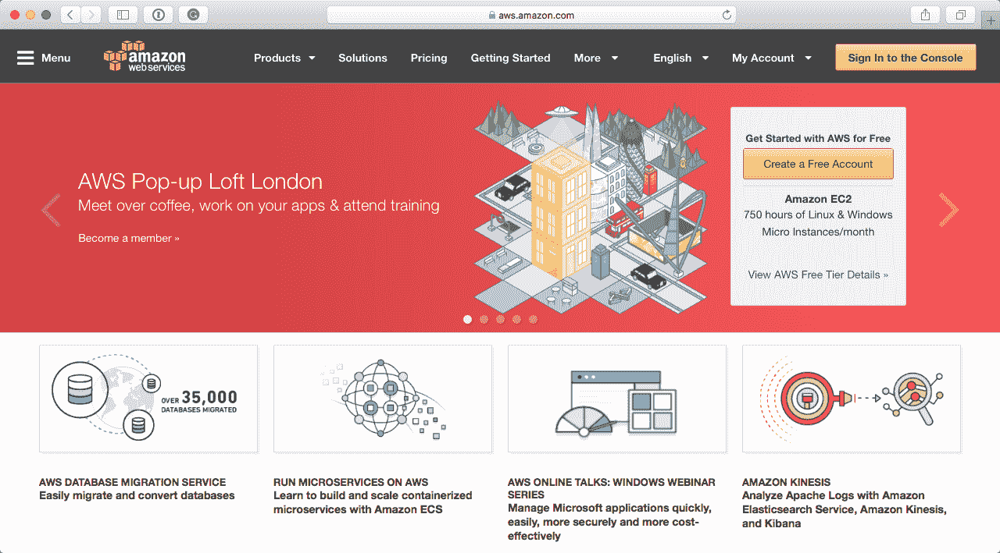

虽然单击“创建免费账户”，然后按照屏幕上的说明将为您提供 12 个月的免费访问多项服务，但您仍然需要提供信用卡或借记卡详细信息，并且可能会产生费用。

有关 AWS 免费套餐的更多信息，请参阅[`aws.amazon.com/free/`](https://aws.amazon.com/free/)。此页面让您了解 12 个月免费服务涵盖的实例大小和服务，以及其他服务的永久优惠，其中包括 AWS Lambda。

一旦您拥有 AWS 账户，您应该使用 AWS **身份和访问管理**（**IAM**）服务创建一个用户。该用户可以拥有管理员权限，您应该使用该用户访问 AWS 控制台和 API。

有关创建 IAM 用户的更多详细信息，请参阅以下页面：

+   **开始使用 IAM**：[`docs.aws.amazon.com/IAM/latest/UserGuide/getting-started.html`](http://docs.aws.amazon.com/IAM/latest/UserGuide/getting-started.html)

+   **IAM 最佳实践**：[`docs.aws.amazon.com/IAM/latest/UserGuide/best-practices.html`](http://docs.aws.amazon.com/IAM/latest/UserGuide/best-practices.html)

不建议使用 AWS 根账户启动服务和访问 API；如果凭据落入错误的手中，您可能会失去对账户的所有访问权限。使用 IAM 而不是您的根账户，并且您还应该使用多因素身份验证锁定根账户，这意味着您将始终可以访问您的 AWS 账户。

最后一个先决条件是您需要访问 AWS 命令行客户端，我将使用 macOS，但该客户端也适用于 Linux 和 Windows。有关如何安装和配置 AWS 命令行客户端的信息，请参阅：

+   **安装 AWS CLI**：[`docs.aws.amazon.com/cli/latest/userguide/installing.html`](http://docs.aws.amazon.com/cli/latest/userguide/installing.html)

+   **配置 AWS CLI**：[`docs.aws.amazon.com/cli/latest/userguide/cli-chap-getting-started.html`](http://docs.aws.amazon.com/cli/latest/userguide/cli-chap-getting-started.html)

在配置 AWS CLI 时，请确保将默认区域配置为您将在 AWS Web 控制台中访问的区域，因为没有比在 CLI 中运行命令然后在 Web 控制台中看不到结果更令人困惑的事情了。

安装后，您可以通过运行以下命令来测试您是否可以从命令行客户端访问 AWS Lambda：

```
$ aws lambda list-functions
```

这应该返回一个空的函数列表，就像下面的截图中所示：

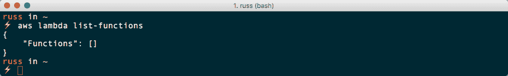

现在我们已经设置、创建并使用非根用户登录了帐户，并且已经安装和配置了 AWS CLI，我们可以开始启动我们的第一个无服务器函数了。

# 创建 Lambda 函数

在 AWS 控制台中，单击屏幕左上角的“服务”菜单，然后通过使用过滤框或单击列表中的服务来选择 Lambda。当您首次转到 AWS 控制台中的 Lambda 服务页面时，您将看到一个欢迎页面：

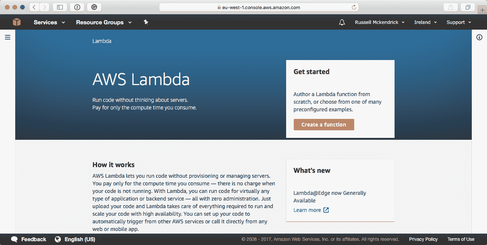

单击“创建函数”按钮将直接进入启动我们的第一个无服务器函数的过程。

创建函数有四个步骤；我们需要做的第一件事是选择一个蓝图：

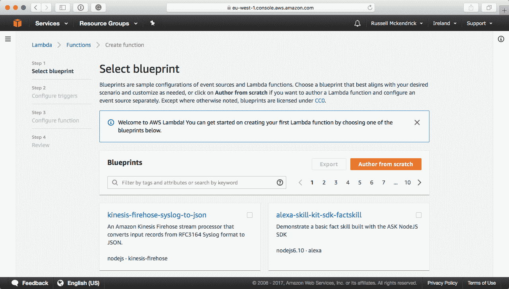

对于基本的 hello world 函数，我们将使用一个名为`hello-world-python`的预构建模板；将其输入到过滤器中，您将看到两个结果，一个是 Python 2.7，另一个使用 Python 3.6：

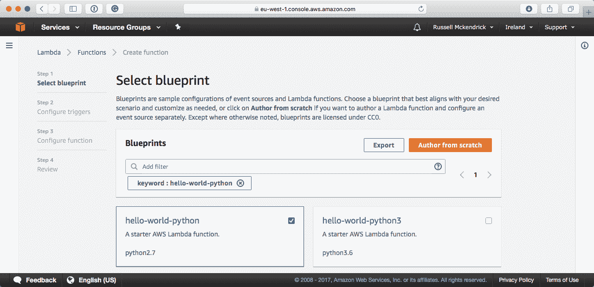

选择`hello-world-python`，然后单击“导出”将为您提供下载用于函数的代码的选项，该代码位于`lambda_function.py`文件中，以及 Lambda 在第 3 步中使用的模板。这可以在`template.yaml`文件中找到。

代码本身非常基本，就像你想象的那样。它除了返回传递给它的值之外什么也不做。如果您没有跟随，`lambda_function.py`文件的内容如下：

```
from __future__ import print_function

import json

print('Loading function')

def lambda_handler(event, context):
  #print("Received event: " + json.dumps(event, indent=2))
  print("value1 = " + event['key1'])
  print("value2 = " + event['key2'])
  print("value3 = " + event['key3'])
  return event['key1'] # Echo back the first key value
  #raise Exception('Something went wrong')
```

`template.yaml`文件包含以下内容：

```
AWSTemplateFormatVersion: '2010-09-09'
Transform: 'AWS::Serverless-2016-10-31'
Description: A starter AWS Lambda function.
Resources:
  helloworldpython:
    Type: 'AWS::Serverless::Function'
    Properties:
      Handler: lambda_function.lambda_handler
      Runtime: python2.7
      CodeUri: .
      Description: A starter AWS Lambda function.
      MemorySize: 128
      Timeout: 3
      Role: !<tag:yaml.org,2002:js/undefined> ''
```

正如您所看到的，模板文件配置了`Runtime`和一些合理的`MemorySize`和`Timeout`值。

要继续到第 2 步，请单击函数名称，对我们来说是`hello-world-python`，您将进入页面，可以选择如何触发函数：

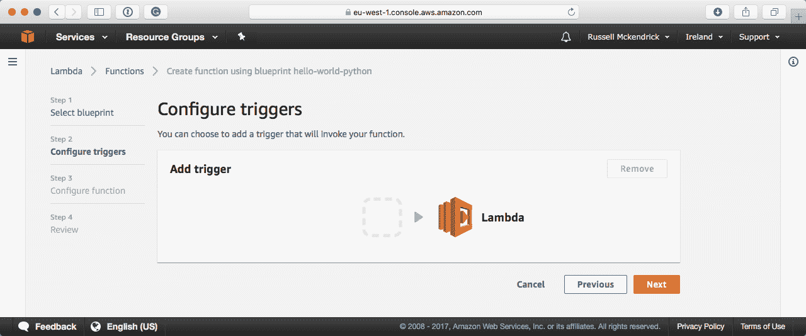

我们暂时不打算使用触发器，我们将在下一个启动的函数中更详细地了解这些内容；所以现在，请单击“下一步”。

第 3 步是我们配置函数的地方。这里有很多信息要输入，但幸运的是，我们需要输入的许多细节已经从我们之前查看的模板中预填充，如下截图所示：

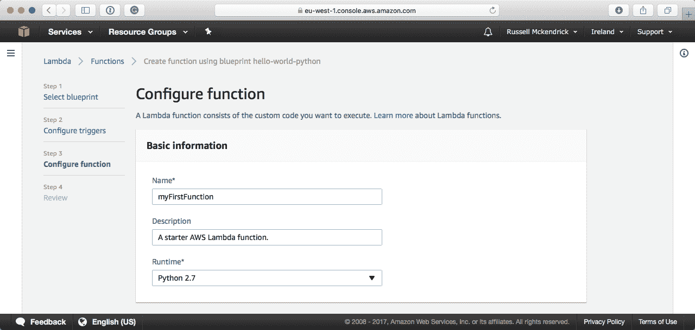我们需要输入的详细信息如下：带有*的是必填项，斜体中的*信息*是预填充的，可以保持不变。

以下列表显示了所有表单字段及其应输入的内容：

+   基本信息：

+   名称：myFirstFunction

+   描述：一个起始的 AWS Lambda 函数

+   运行时：Python 2.7

+   Lambda 函数代码：

+   代码输入类型：这包含了函数的代码，无需编辑

+   启用加密助手：不选中

+   环境变量：留空

+   Lambda 函数处理程序和角色：

+   处理程序：lambda_function.lambda_handler

+   角色：保持选择“从模板创建新角色”

+   角色名称：myFirstFunctionRole

+   策略模板：我们不需要为此函数使用策略模板，保持空白

将标签和高级设置保持默认值。输入前述信息后，单击“下一步”按钮，进入第 4 步，这是函数创建之前的最后一步。

查看页面上的详细信息。如果您确认所有信息都已正确输入，请单击页面底部的“创建函数”按钮；如果需要更改任何信息，请单击“上一步”按钮。

几秒钟后，您将收到一条消息，确认您的函数已创建：

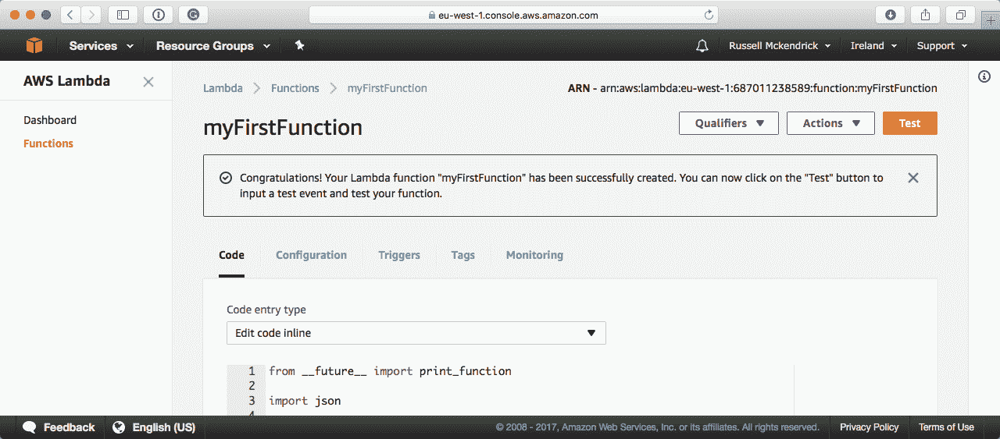

在上述截图中，有一个“测试”按钮。单击此按钮将允许您调用函数。在这里，您可以自定义发送到函数的值。如下截图所示，我已更改了`key1`和`key2`的值：

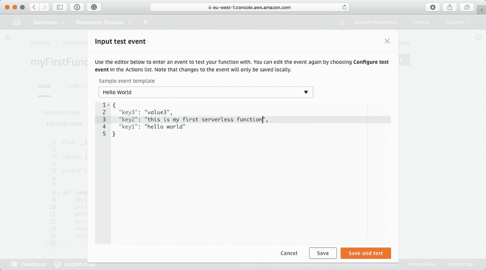

编辑完输入后，点击“保存并测试”将存储您更新的输入，然后调用该函数：

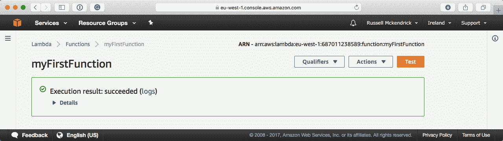

点击执行结果消息中的“详细信息”将显示函数被调用的结果以及使用的资源：

```
START RequestId: 36b2103a-90bc-11e7-a32a-171ef5562e33 Version: $LATEST
value1 = hello world
value2 = this is my first serverless function
value3 = value3
END RequestId: 36b2103a-90bc-11e7-a32a-171ef5562e33
```

具有`36b2103a-90bc-11e7-a32a-171ef5562e33` ID 的请求的报告如下：

+   `持续时间：0.26 毫秒`

+   `计费持续时间：100 毫秒`

+   `内存大小：128 MB`

+   `最大内存使用：19 MB`

如您所见，函数运行需要`0.26 毫秒`，我们被收取了最低持续时间`100 毫秒`。函数最多可以消耗`128 MB`的 RAM，但在执行过程中我们只使用了`19 MB`。

返回到命令行，再次运行以下命令会显示我们的函数现在已列出：

```
$ aws lambda list-functions
```

上述命令的输出如下：

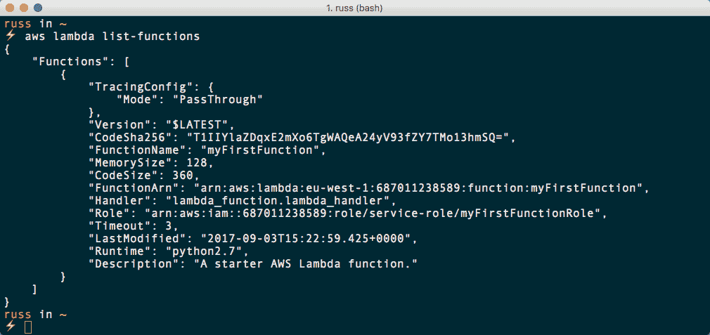

我们也可以通过运行以下命令从命令行调用我们的函数：

```
$ aws lambda invoke \
 --invocation-type RequestResponse \
 --function-name myFirstFunction \
 --log-type Tail \
 --payload '{"key1":"hello", "key2":"world", "key3":"again"}' \
 outputfile.txt 
```

如您从上述命令中所见，`aws lambda invoke`命令需要几个标志：

+   `--invocation-type`：有三种调用类型：

+   `RequestResponse`：这是默认选项；它发送请求，在我们的情况下在命令的`--payload`部分中定义。一旦请求被发出，客户端就会等待响应。

+   `事件`：这会发送请求并触发事件。客户端不等待响应，而是会收到一个事件 ID。

+   `DryRun`：这会调用函数，但实际上不执行它——这在测试用于调用函数的详细信息是否具有正确的权限时非常有用。

+   `--function-name`：这是我们要调用的函数的名称。

+   `--log-type`：目前只有一个选项，`Tail`。这返回`--payload`的结果，这是我们要发送给函数的数据；通常这将是 JSON。

+   `outputfile.txt`：命令的最后部分定义了我们要存储命令输出的位置；在我们的情况下，这是一个名为`outputfile.txt`的文件，它被存储在当前工作目录中。

在从命令行调用命令时，您应该会得到以下结果：

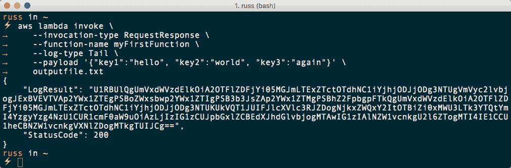

返回到 AWS 控制台并保持在`myFirstFunction`页面上，点击“监控”将呈现有关函数的一些基本统计信息：

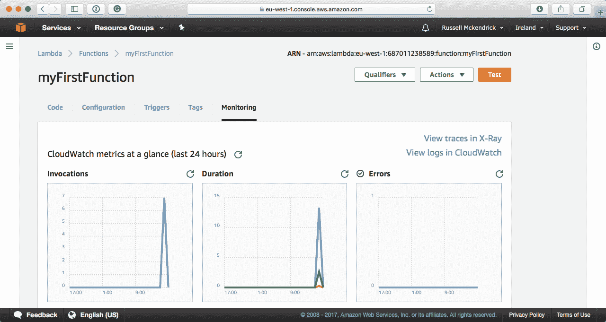

从前面的图表中可以看出，有关您的函数被调用的次数、所需时间以及是否存在任何错误的详细信息。

单击 CloudWatch 中的查看日志将打开一个列出`myFirstFunction`日志流的新标签页。单击日志流的名称将带您到一个页面，该页面会显示每次函数被调用的结果，包括在 AWS 控制台中进行测试以及从命令行客户端进行调用。

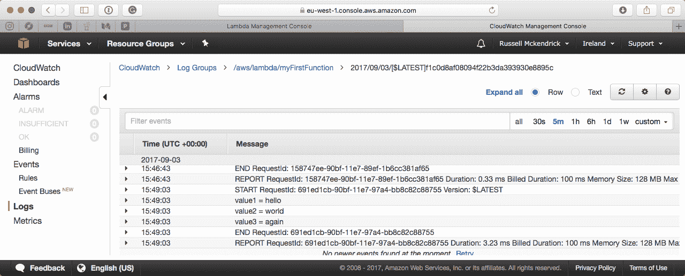

监控页面和日志在调试 Lambda 函数时非常有用。

# 微软 Azure Functions

接下来，我们将看一下微软的无服务器服务 Azure Functions。微软将这项服务描述为：

"Azure Functions 是一个解决方案，可以轻松在云中运行小段代码或“函数”。您可以仅编写您需要解决的问题的代码，而不必担心整个应用程序或运行它的基础架构。"

与 Lambda 一样，您的 Function 可以通过多种方式被调用。在这个快速演示中，我们将部署一个通过 HTTP 请求调用的 Function。

# 先决条件

您需要一个 Azure 账户来跟随这个示例。如果您没有账户，可以在[`azure.microsoft.com/`](https://azure.microsoft.com/)上注册一个免费账户：

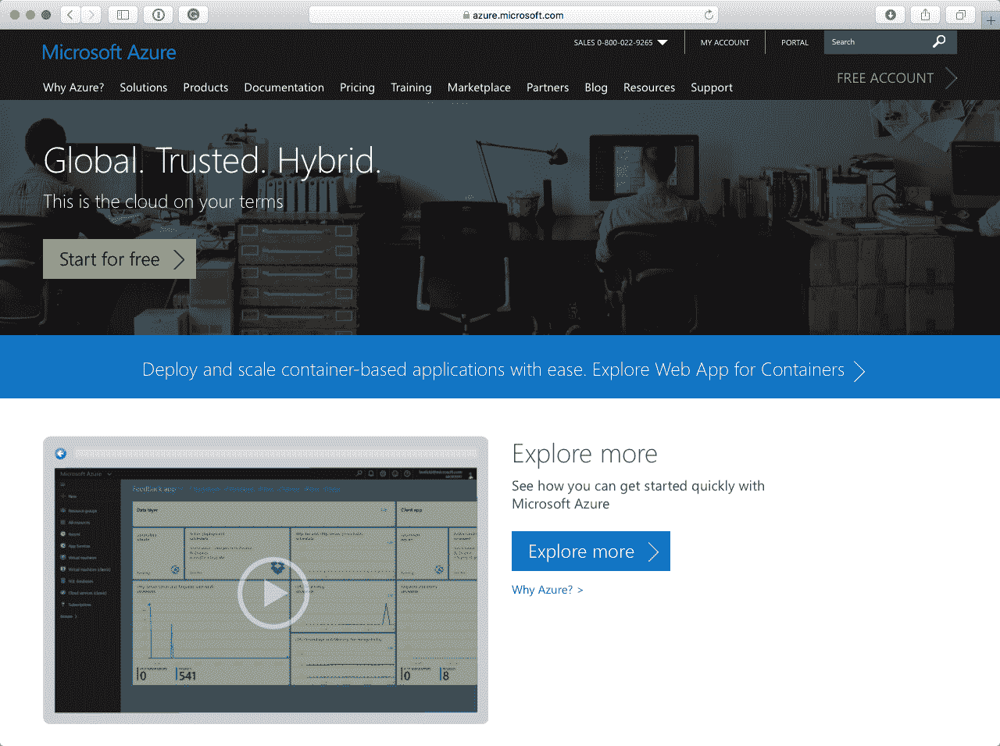

在撰写本文时，微软向所有新账户提供了 200 美元的 Azure 服务信用额度，就像 AWS 一样，有几项服务有免费套餐。

虽然您可以获得 200 美元的信用额度，但您仍需要提供信用卡详细信息以进行验证。有关免费套餐中的服务和限制的更多信息，请参阅[`azure.microsoft.com/en-gb/free/pricing-offers/`](https://azure.microsoft.com/en-gb/free/pricing-offers/)。

# 创建一个 Function 应用程序

我们将使用基于 Web 的控制面板来创建我们的第一个 Function 应用程序。一旦您拥有了账户，您应该会看到类似以下页面：

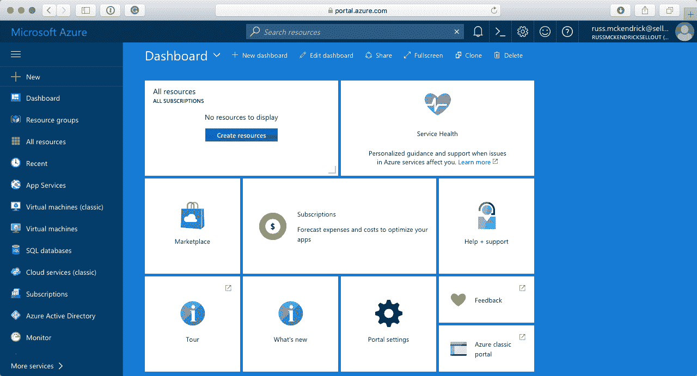关于微软 Azure 控制面板的一件事是，它可以水平滚动，因此如果您在页面上迷失了方向，通常可以通过向右滚动找回需要的位置。

如前面的屏幕截图所示，有相当多的选项。要开始创建您的第一个函数，您应该在左侧菜单顶部单击“+新建”。

从这里，您将进入 Azure 市场。单击计算，然后在特色市场项目列表中，您应该看到函数应用程序。单击此处，您将进入一个表单，询问您想要创建的函数的一些基本信息：

+   应用程序名称：随意命名；在我的案例中，我将其命名为`russ-test-version`。这必须是一个唯一的名称，如果您想要的应用程序名称已经被另一个用户使用，您将收到一条消息，告知您所选的应用程序名称不可用。

+   订阅：选择要在其中启动您的函数的 Azure 订阅。

+   资源组：在输入应用程序名称时，这将自动填充。

+   托管计划：将其保留为默认选项。

+   位置：选择离您最近的地区。

+   存储：这将根据您提供的应用程序名称自动填充，为了我们的目的，请保留选择“创建新”。

+   固定到仪表板：选中此项，因为这将使我们能够快速找到我们创建的函数。

如果您没有在您的帐户中跟随，我的完成表格看起来像下面的屏幕截图：

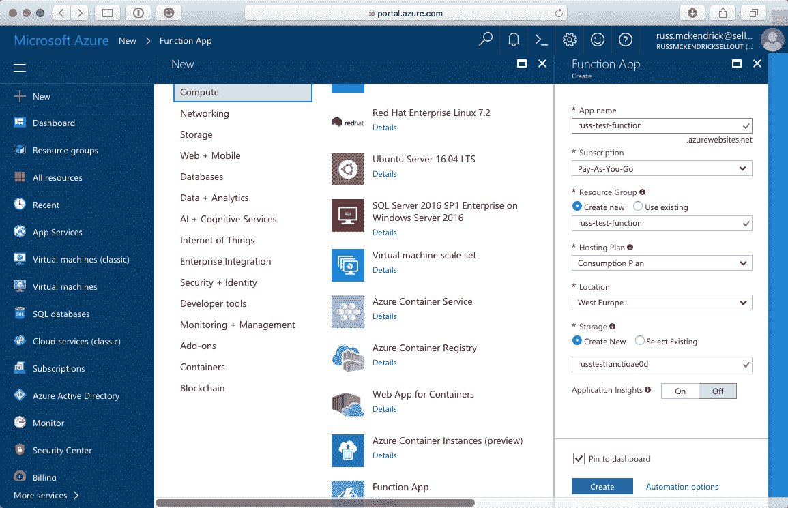

填写完表格后，单击表单底部的“创建”按钮，您将被带回到您的仪表板。您将收到一个通知，告知您的函数正在部署，如下图右侧的框中所示：

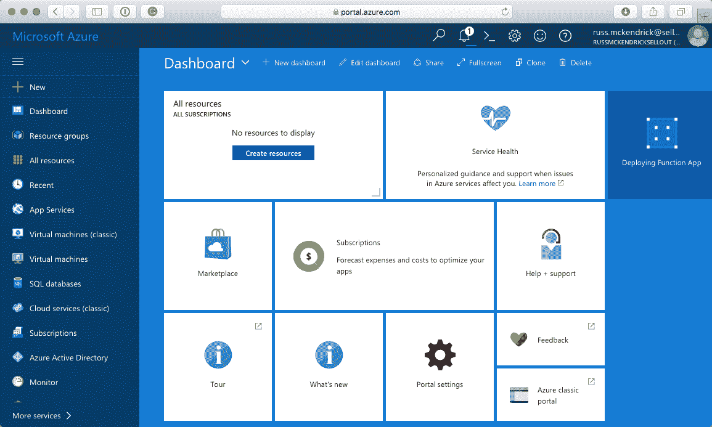

单击仪表板中的方框或顶部菜单中的通知（带有数字 1 的铃铛图标）将带您到概述页面；在这里，您可以查看部署的状态：

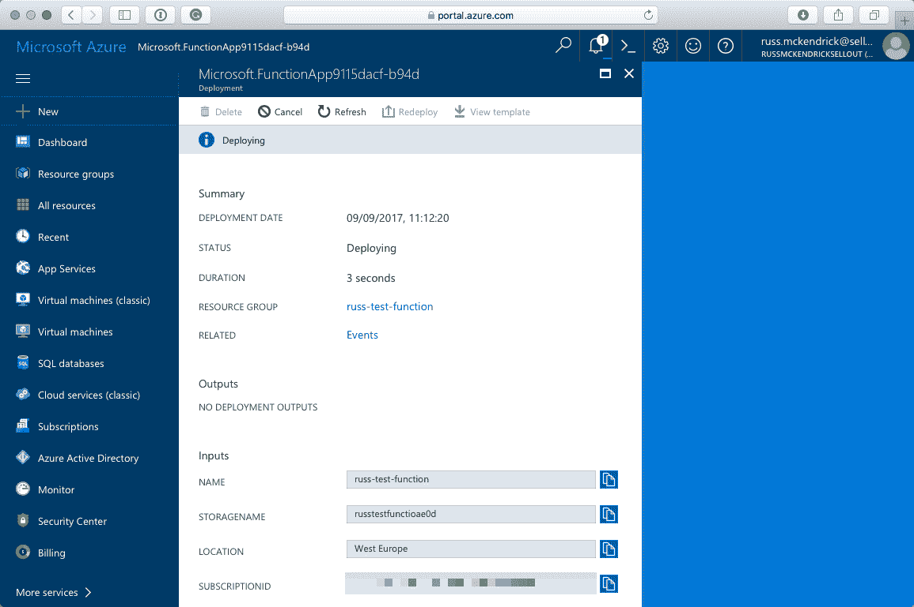

部署后，您应该有一个空的函数应用程序，可以准备将代码部署到其中：

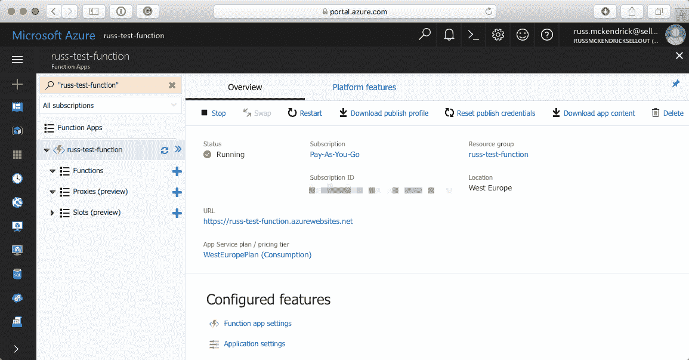

要部署一些测试代码，您需要在左侧菜单中的函数旁边单击“+”图标；这将带您到以下页面：

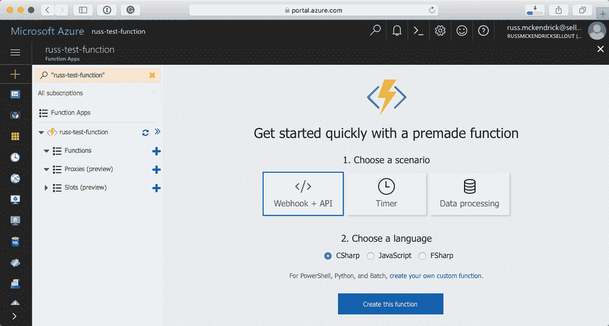

选择 Webhook + API 和 CSharp 后，单击“创建此函数”；这将向您的函数应用程序添加以下代码：

```
using System.Net;

public static async Task<HttpResponseMessage> Run(HttpRequestMessage req, TraceWriter log)
{
    log.Info("C# HTTP trigger function processed a request.");

    // parse query parameter
    string name = req.GetQueryNameValuePairs()
        .FirstOrDefault(q => string.Compare(q.Key, "name", true) == 0)
        .Value;

    // Get request body
    dynamic data = await req.Content.ReadAsAsync<object>();

    // Set name to query string or body data
    name = name ?? data?.name;

    return name == null
        ? req.CreateResponse(HttpStatusCode.BadRequest, "Please pass
        a name on the query string or in the request body")
        : req.CreateResponse(HttpStatusCode.OK, "Hello " + name);
}
```

这段代码简单地读取变量`name`，它通过 URL 传递，然后作为`Hello <name>`打印回给用户。

我们可以通过单击页面顶部的“运行”按钮来测试这一点。这将执行我们的函数，并为您提供输出和日志：

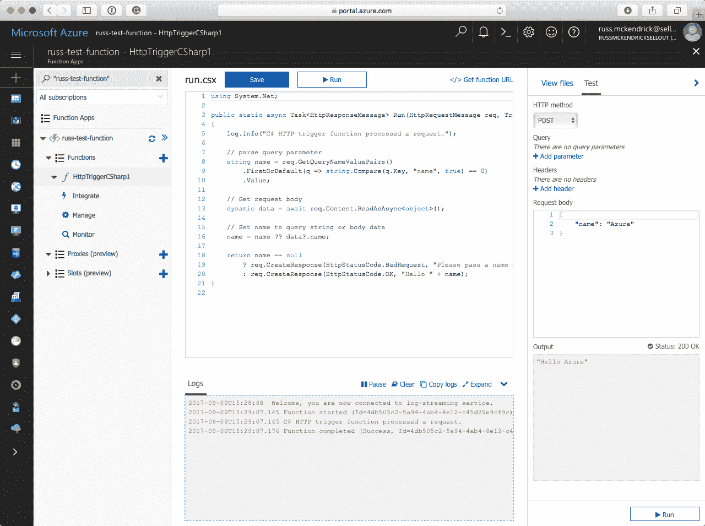

测试运行的日志如下：

```
2017-09-09T15:28:08 Welcome, you are now connected to log-streaming service.2017-09-09T15:29:07.145 Function started (Id=4db505c2-5a94-4ab4-8e12-c45d29e9cf9c)2017-09-09T15:29:07.145 C# HTTP trigger function processed a request.2017-09-09T15:29:07.176 Function completed (Success, Id=4db505c2-5a94-4ab4-8e12-c45d29e9cf9c, Duration=28ms)
```

您还可以通过单击左侧菜单中的“监视”来查看有关函数应用的更多信息。从以下屏幕截图中可以看出，我们有关于函数调用次数的详细信息，以及每次执行的状态和持续时间：

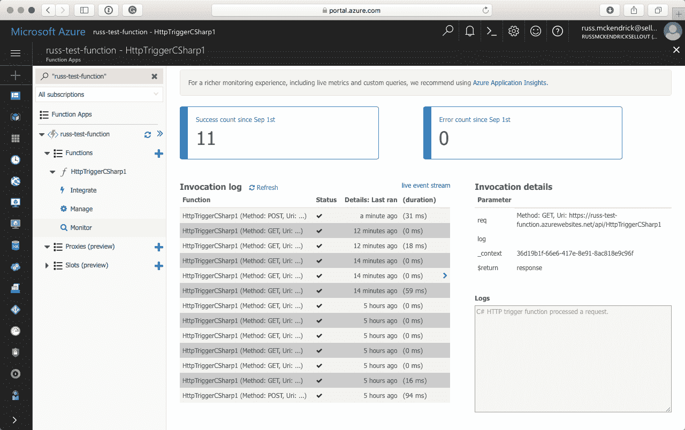有关函数应用调用的更详细信息，您可以启用 Azure 应用程序洞察，并且有关此服务的更多信息，请参阅[`azure.microsoft.com/en-gb/services/application-insights/`](https://azure.microsoft.com/en-gb/services/application-insights/)。

能够在 Azure 仪表板的安全环境中进行测试是很好的，但是如何直接访问您的函数应用呢？

如果单击 HttpTriggerCSharp1，它将带您回到您的代码，在代码块上方，您将有一个按钮，上面写着“获取函数 URL”，单击此按钮将弹出一个包含 URL 的覆盖框。复制这个：

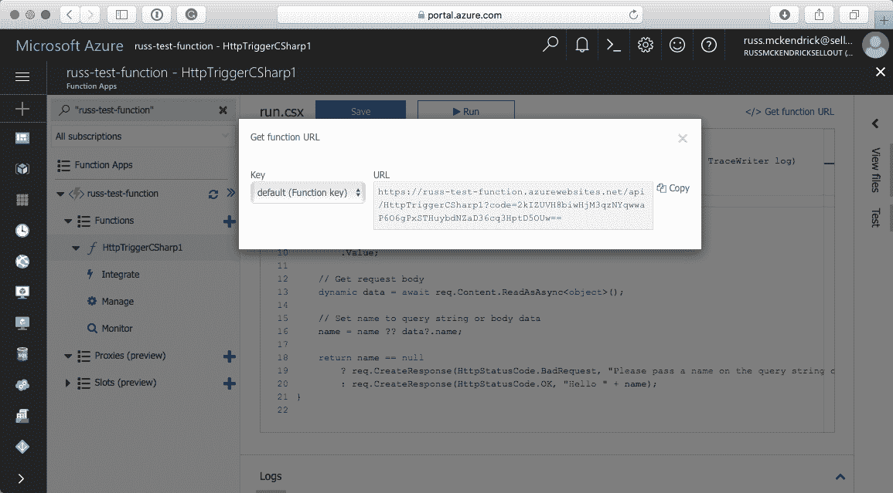

对我来说，URL 是：

`https://russ-test-function.azurewebsites.net/api/HttpTriggerCSharp1?code=2kIZUVH8biwHjM3qzNYqwwaP6O6gPxSTHuybdNZaD36cq3HptD5OUw==`

前面的 URL 将不再起作用，因为函数已被移除；它仅用于说明目的，您应该用您的 URL 替换它。

为了在命令行上与 URL 交互，我将使用 HTTPie，这是一个命令行 HTTP 客户端。有关 HTTPie 的更多详细信息，请参阅项目主页[`httpie.org/`](https://httpie.org/)。

使用以下命令在命令行上调用该 URL：

```
$ http "https://russ-test-function.azurewebsites.net/api/HttpTriggerCSharp1?code=2kIZUVH8biwHjM3qzNYqwwaP6O6gPxSTHuybdNZaD36cq3HptD5OUw=="
```

这给我们带来了以下结果：

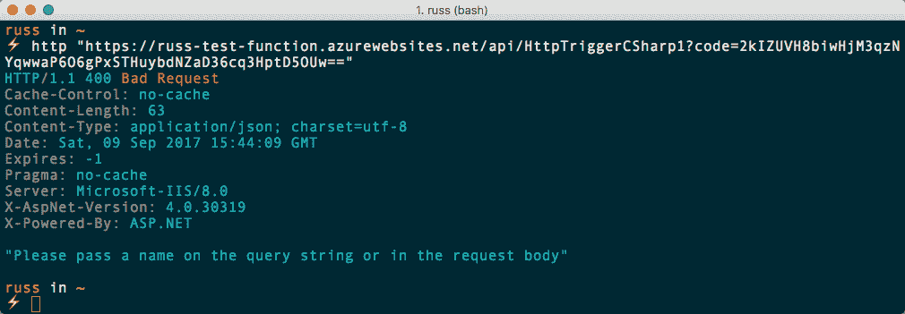

从返回的内容中可以看出，我们的函数应用返回了 HttpStatusCode BadRequest 消息。这是因为我们没有传递`name`变量。为了做到这一点，我们需要更新我们的命令为：

```
$ http "https://russ-test-function.azurewebsites.net/api/HttpTriggerCSharp1?code=2kIZUVH8biwHjM3qzNYqwwaP6O6gPxSTHuybdNZaD36cq3HptD5OUw==&name=kubernetes_for_serverless_applications"
```

正如您所期望的那样，这将返回正确的消息：

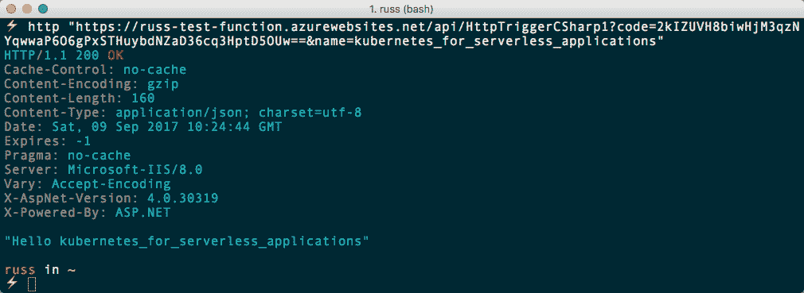

您还可以在浏览器中输入 URL 并查看消息：

！[](assets/22f9d26d-137f-4e5c-a743-6677c6e52752.png)

# 无服务器工具包

在完成本章之前，我们将看一下无服务器工具包。这是一个旨在在不同的云提供商之间部署无服务器函数时提供一致体验的应用程序。您可以在[`serverless.com/.`](https://serverless.com/)找到服务的主页。

从主页上可以看到，它支持 AWS 和 Microsoft Azure，以及 Google Cloud 平台和 IBM OpenWhisk。您还会注意到有一个注册按钮；单击此按钮并按照屏幕提示创建您的帐户。

注册后，您将收到一些非常简单的关于如何安装工具和部署第一个应用程序的说明；让我们现在遵循这些。首先，我们需要通过运行来安装命令行工具：

```
$ npm install serverless -g
```

安装将需要几分钟，一旦安装完成，您应该能够运行：

```
$ serverless version
```

这将确认上一个命令安装的版本：

！[](assets/f8a53f70-7d32-454b-9f85-a1af8a3a2a77.png)

现在命令行工具已安装并且我们已确认可以在没有任何错误的情况下获取版本号，我们需要登录。要做到这一点，请运行：

```
$ serverless login
```

此命令将打开一个浏览器窗口，并带您到登录页面，您需要选择要使用的帐户：

！[](assets/0a3f479e-2f81-4efa-b354-2b639b5048c0.png)

如前面的屏幕截图所示，它知道我上次使用 GitHub 帐户登录到无服务器，因此单击这将生成一个验证码：

！[](assets/9617b99a-c9b2-42ed-b3fd-e19630b3cd2d.png)

将代码粘贴到终端提示符中，然后按键盘上的*Enter*键将您登录：

！[](assets/98f434e4-34a5-4944-86b8-bb0e3fc183d3.png)

现在我们已经登录，我们可以创建我们的第一个项目，这将是另一个`hello-world`应用程序。

要在 AWS 中启动我们的`hello-world`函数，我们必须首先创建一个文件夹来保存无服务器工具包创建的工件，并切换到该文件夹；我在我的“桌面”上创建了一个文件夹，使用：

```
$ mkdir ~/Desktop/Serverless
$ cd ~/Desktop/Serverless
```

要生成启动我们的`hello-world`应用程序所需的文件，我们需要运行：

```
$ serverless create --template hello-world
```

这将返回以下消息：

！[](assets/95eebe4f-7ae4-44cb-a4fa-9fbbee44bb72.png)

在我的编辑器中打开`serverless.yml`，我可以看到以下内容（我已删除了注释）：

```
service: serverless-hello-world
provider:
  name: aws
  runtime: nodejs6.10
functions:
  helloWorld:
    handler: handler.helloWorld
    # The `events` block defines how to trigger the handler.helloWorld code
    events:
      - http:
          path: hello-world
          method: get
          cors: true
```

我将服务更新为`russ-test-serverless-hello-world`；您也应该选择一个独特的名称。一旦我保存了更新的`serverless.yml`文件，我就运行了：

```
$ serverless deploy
```

您可能已经猜到，这将`hello-world`应用程序部署到了 AWS：

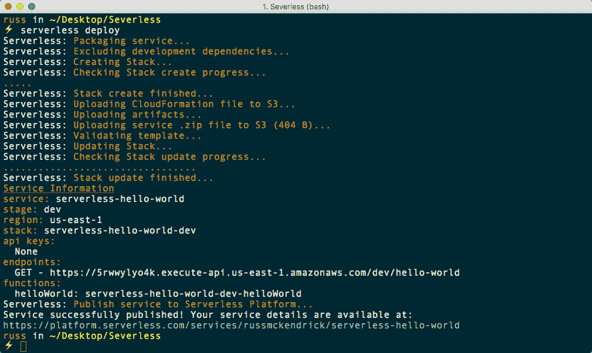

使用 HTTPie 访问终端 URL：

```
$ http --body "https://5rwwylyo4k.execute-api.us-east-1.amazonaws.com/dev/hello-world"
```

这将返回以下 JSON：

```
{
    "input": {
        "body": null,
        "headers": {
            "Accept": "*/*",
            "Accept-Encoding": "gzip, deflate",
            "CloudFront-Forwarded-Proto": "https",
            "CloudFront-Is-Desktop-Viewer": "true",
            "CloudFront-Is-Mobile-Viewer": "false",
            "CloudFront-Is-SmartTV-Viewer": "false",
            "CloudFront-Is-Tablet-Viewer": "false",
            "CloudFront-Viewer-Country": "GB",
            "Host": "5rwwylyo4k.execute-api.us-east-1.amazonaws.com",
            "User-Agent": "HTTPie/0.9.9",
            "Via": "1.1 dd12e7e803f596deb3908675a4e017be.cloudfront.net
             (CloudFront)",
            "X-Amz-Cf-Id": "bBd_ChGfOA2lEBz2YQDPPawOYlHQKYpA-
             XSsYvVonXzYAypQFuuBJw==",
            "X-Amzn-Trace-Id": "Root=1-59b417ff-5139be7f77b5b7a152750cc3",
            "X-Forwarded-For": "109.154.205.250, 54.240.147.50",
            "X-Forwarded-Port": "443",
            "X-Forwarded-Proto": "https"
        },
        "httpMethod": "GET",
        "isBase64Encoded": false,
        "path": "/hello-world",
        "pathParameters": null,
        "queryStringParameters": null,
        "requestContext": {
            "accountId": "687011238589",
            "apiId": "5rwwylyo4k",
            "httpMethod": "GET",
            "identity": {
                "accessKey": null,
                "accountId": null,
                "apiKey": "",
                "caller": null,
                "cognitoAuthenticationProvider": null,
                "cognitoAuthenticationType": null,
                "cognitoIdentityId": null,
                "cognitoIdentityPoolId": null,
                "sourceIp": "109.154.205.250",
                "user": null,
                "userAgent": "HTTPie/0.9.9",
                "userArn": null
            },
            "path": "/dev/hello-world",
            "requestId": "b3248e19-957c-11e7-b373-8baee2f1651c",
            "resourceId": "zusllt",
            "resourcePath": "/hello-world",
            "stage": "dev"
        },
        "resource": "/hello-world",
        "stageVariables": null
    },
    "message": "Go Serverless v1.0! Your function executed successfully!"
}
```

在浏览器中输入终端 URL（在我的情况下，我正在使用 Safari）会显示原始输出：

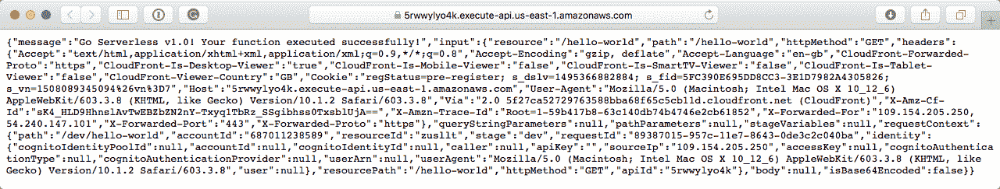

转到`serverless deploy`命令末尾提到的 URL，可以概览您使用 serverless 部署到 Lambda 的函数：

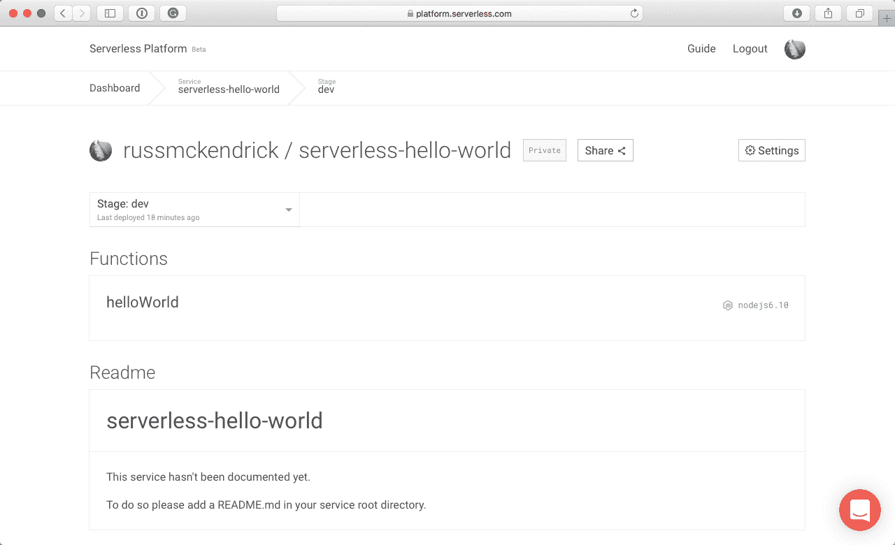

通过转到[`console.aws.amazon.com/`](https://console.aws.amazon.com/)打开 AWS 控制台，从服务菜单中选择 Lambda，然后切换到您的函数启动的区域；这应该会显示您的函数：

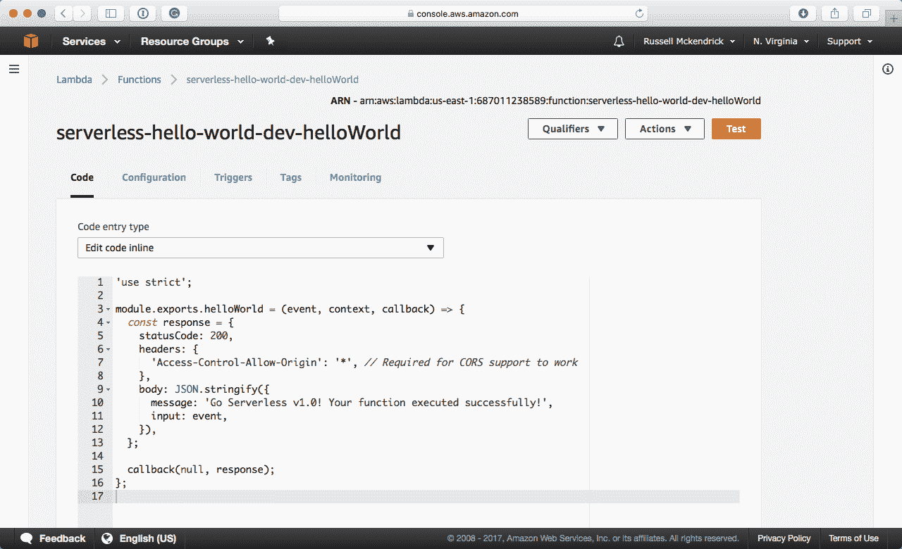

此时，您可能会想，“我的帐户是如何启动的？我没有提供任何凭据！” 无服务器工具旨在使用与我们在启动第一个 Lambda 函数之前安装的 AWS CLI 相同的凭据-这些凭据可以在您的计算机上的`~/.aws/credentials`找到。

要删除函数，只需运行：

```
$ serverless remove
```

这将删除无服务器工具包在您的 AWS 帐户中创建的所有内容。

有关如何使用无服务器工具包启动 Azure 函数的更多信息，请参阅快速入门指南，该指南可以在[`serverless.com/framework/docs/providers/azure/guide/quick-start/`](https://serverless.com/framework/docs/providers/azure/guide/quick-start/)找到。

# 无服务器和函数作为服务解决的问题

尽管到目前为止我们只启动了最基本的应用程序，但我希望您开始看到使用无服务器如何有助于开发您的应用程序。

想象一下，你有一个 JavaScript 应用程序，它托管在像亚马逊的 S3 服务这样的对象存储中。你的应用程序可以用 React（[`facebook.github.io/react/`](https://facebook.github.io/react/)）或 Angular（[`angular.io/`](https://angular.io/)）编写，这两种技术都允许你使用 JSON 加载外部数据。这些数据可以通过无服务器函数请求和传递 - 结合这些技术可以创建一个应用程序，不仅没有单点故障，而且在使用公共云服务时，是一个真正的*按需付费*应用程序。

由于无服务器函数被执行然后立即终止，你不应该担心它在哪里或者如何执行，只要它执行了。这意味着你的应用程序理论上应该是可伸缩的，也比传统的基于服务器的应用程序更容错。

例如，如果在调用你的一个函数时出现问题，例如，如果它崩溃了或者有资源问题，并且你知道下次调用函数时它将被重新启动，你不需要担心你的代码在有问题的服务器上执行。

# 总结

在本章中，我们快速了解了什么是无服务器，并在 AWS 和 Microsoft Azure 中启动和交互了无服务器函数，还使用了一个名为无服务器的第三方工具，在 AWS 中创建了一个无服务器函数。

到目前为止，你可能已经注意到我们还没有提到 Kubernetes，对于一本名为*用于无服务器应用程序的 Kubernetes*的书来说，这可能有点奇怪。不过不用担心，在下一章中我们将更详细地了解 Kubernetes，一切将变得清晰起来。
