# 第三章：本地安装 Kubernetes

在本章中，我们将看看如何使用 Minikube 快速搭建本地的 Kubernetes 安装。一旦我们的本地 Kubernetes 安装运行起来，我们将学习一些基本功能，并讨论在本地运行 Kubernetes 的局限性。我们将学习在以下平台上安装 Kubernetes：

+   macOS 10.13 High Sierra

+   Windows 10 专业版

+   Ubuntu 17.04

在我们开始安装之前，让我们快速看一下我们将使用的工具来部署我们的本地 Kubernetes 集群。

# 关于 Minikube

当你阅读上一章时，你可能会想到 Kubernetes 看起来很复杂。有很多组件需要配置，而且不仅需要配置，还需要监控和管理。

我记得当我最初看 Kubernetes 时，它刚发布不久，安装说明非常长，而且事情有点儿棘手。

在安装过程的开始阶段误读了一步，你可能会在安装过程的后期陷入麻烦——这让我想起了以前杂志上会包含游戏代码清单的情形。如果你在任何地方打错字，那么事情要么根本不起作用，要么会出现意外崩溃。

随着 Kubernetes 的成熟，安装过程也在不断改进。相当快地，一些辅助脚本被开发出来，以帮助在各种平台上启动 Kubernetes；Minikube 就是其中之一。

它的工作就是创建一个本地的 Kubernetes 节点。考虑到 Kubernetes 支持的功能范围，它有令人惊讶的多种功能，比如：

+   DNS，NodePorts 和 Ingress

+   ConfigMaps 和 Secrets

+   容器运行时的选择；你可以使用 Docker 或 rkt

+   通过`hostPath`持久卷

+   仪表板

通常需要公共云提供商（如 AWS，Microsoft Azure 或 Google Cloud）或多个主机的 Kubernetes 功能是不受支持的。其中一些功能包括：

+   负载均衡器

+   高级调度策略

这是因为 Minikube 只在本地 PC 上的虚拟机上启动单个节点。但这不应该限制你；请记住，你只会想要在 Minikube 上进行开发，并且不应该使用它构建生产服务。还有很多其他工具，将在第六章中介绍，*在云中安装 Kubernetes*，更适合在公共云或其他供应商中启动生产就绪的 Kubernetes 集群。

Minikube 由两个核心组件组成：

+   **libmachine**：这个来自 Docker 的库用于在主机上提供虚拟机。它是 Docker Machine 以及 Docker for macOS 和 Docker for Windows 的核心组件。

+   **localkube**：这个库是由 Redspread（现在是 CoreOS 的一部分）开发并捐赠给 Minikube 项目的，它负责在启动虚拟机后部署和维护 Kubernetes 节点。

不再讨论 Minikube 能做什么，我们应该看看如何安装它，然后讨论如何与它交互。

# 安装 Minikube

我们将看看如何在介绍中提到的三种不同操作系统上安装 Minikube。一旦安装完成，与 Minikube 交互的过程大部分是一致的，这意味着，虽然我在示例中使用的是 macOS，但相同的命令也适用于 Windows 和 Linux。考虑到早期 Kubernetes 安装和配置过程的复杂性，你会惊讶地发现现在的过程是多么简单。

# macOS 10.13 High Sierra

要在 macOS 上安装 Minikube，你首先必须安装 Homebrew 和 Cask。

Homebrew 是 macOS 的基于命令行的软件包管理器。Homebrew 用于安装命令行工具和 Cask，Cask 是一个用于管理桌面应用程序的附加组件。它非常有用，可以管理 macOS 应用商店中不可用的软件，同时也可以避免你在自己的机器上手动编译软件。

如果你还没有安装 Homebrew，你可以通过运行以下命令来安装它：

```
$ /usr/bin/ruby -e "$(curl -fsSL https://raw.githubusercontent.com/Homebrew/install/master/install)"
```

安装完成后，你需要通过运行以下命令来安装 Cask：

```
$ brew install cask
```

如果你已经安装了 Homebrew 和 Cask，那么你应该确保一切都是最新的，并且准备好使用以下命令运行：

```
$ brew update
$ brew doctor
```

一旦 Homebrew 和 Cask 准备好，你可以通过运行以下命令来安装 Minikube：

```
$ brew cask install minikube
```

首先会下载依赖项，然后安装 Minikube：

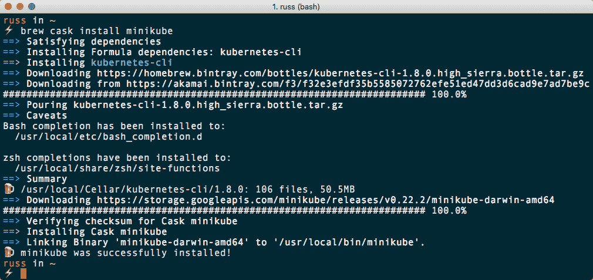

该过程不到一分钟，安装完成后，您应该能够执行以下操作：

```
$ minikube version
```

这将显示当前版本；在我的情况下，这是`v0.22.2`。我们现在已经安装并准备好使用 Minikube 了。

# Windows 10 专业版

与我们在 macOS 上安装 Minikube 的方式类似，我们将使用一个包管理器；这次叫做 Chocolatey。

Chocolatey 是 Windows 的一个包管理器，类似于 macOS 上的 Homebrew。它使您能够从命令行安装软件，并支持 PowerShell 和`cmd.exe`。我们将使用 PowerShell。

如果您没有安装 Chocolatey，可以在以管理员权限启动的 PowerShell 控制台中运行以下命令：

以下命令是一行，而不是多行。另外，由于我们使用`Set-ExecutionPolicy Bypass`来运行安装命令，您将被询问是否确定。由于我们直接从 Chocolatey 网站通过 HTTPS 运行脚本，您应该能够信任该脚本并回答是。

```
$ Set-ExecutionPolicy Bypass; iex ((New-Object System.Net.WebClient).DownloadString('https://chocolatey.org/install.ps1'))
```

安装了 Chocolatey 后，您可以通过运行以下命令来安装 Minikube：

```
$ choco install minikube
```

这将下载并安装依赖项，然后安装 Minikube。当您被要求确认是否要运行脚本时，请回答是：

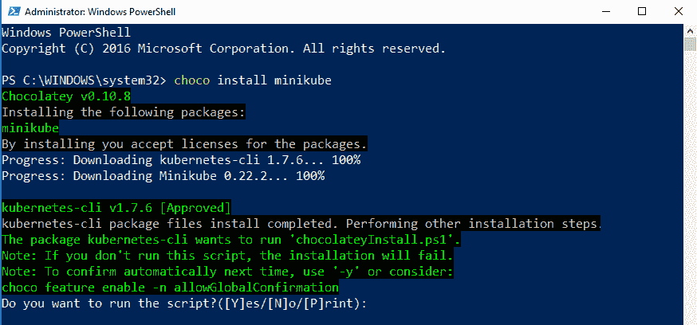

安装后，您将能够运行以下命令：

```
$ minikube version
```

这将返回安装的 Minikube 版本；对我来说，这是`v0.22.2`。

# Ubuntu 17.04

与 macOS 和 Windows 版本不同，我们将不会使用包管理器在 Ubuntu 17.04 上安装 Minikube。相反，我们将直接从项目页面下载二进制文件。要做到这一点，只需运行以下命令：

```
$ curl -Lo minikube https://storage.googleapis.com/minikube/releases/v0.22.2/minikube-linux-amd64 && chmod +x minikube && sudo mv minikube /usr/local/bin/
```

Minikube 将被下载，将设置执行权限，并将移动到`/usr/local/bin/`，以便在系统路径中。

现在 Minikube 已安装，我们需要下载`kubectl`。在 macOS 和 Windows 安装过程中，这是由包管理器处理的；幸运的是，这个过程与我们刚刚运行以安装 Minikube 的命令几乎相同：

```
$ curl -LO https://storage.googleapis.com/kubernetes-release/release/$(curl -s https://storage.googleapis.com/kubernetes-release/release/stable.txt)/bin/linux/amd64/kubectl && chmod +x ./kubectl && sudo mv ./kubectl /usr/local/bin/kubectl
```

安装后，您应该能够再次运行以下命令来确认安装的 Minikube 版本：

```
$ minikube version
```

当我运行该命令时，它返回`v0.22.2`，如下截图所示：

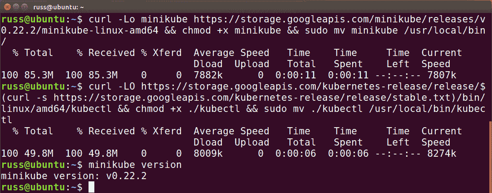

# Hypervisors

Minikube 支持多种不同的 hypervisors。 Hypervisor 是一个用于启动虚拟机的进程；它将虚拟机的操作系统与您自己的操作系统隔离开来，同时允许它共享 CPU、RAM 和磁盘空间等资源。

Minikube 默认支持以下 hypervisors：

+   **Hyper-V（Windows 10）**：这是本机 hypervisor；它适用于 Windows 10 专业版和 Windows 服务器

+   **KVM（Ubuntu 17.04）**：这是本机 Linux hypervisor，在大多数现代发行版的 Linux 内核中运行

+   **VirtualBox（macOS，Windows 10 和 Ubuntu 17.04）**：由 Oracle 发布，VirtualBox 是一个开源的 x86 hypervisor，可以在大量操作系统上运行

+   **VMware Fusion（macOS）**：Fusion 提供了一个经过优化的 macOS hypervisor，其最大优势是能够在 macOS 上运行和公开 Windows 应用程序

+   **xhyve（macOS）**：这是 macOS 上的本机 hypervisor；就像 Linux 上的 KVM 一样，它内置在内核中

从列表中可以看出，在本章中我们涵盖的三种操作系统中，只有 VirtualBox 得到支持。因此，它是 Minikube 支持的默认 hypervisor。如果您已经安装了 VirtualBox，可以运行以下与您选择的操作系统相关的命令。

对于 macOS，我们可以使用 Homebrew 和 Cask 来安装 VirtualBox：

```
$ brew cask install virtualbox
```

同样，对于 Windows 10，您可以使用 Chocolatey 来安装 VirtualBox：

如果启用了 Hyper-V，则无法在 Windows 10 上使用 VirtualBox。如果您希望跟随操作，请在继续之前禁用 Hyper-V。

```
$ choco install virtualbox
```

最后，对于 Ubuntu 17.04，您需要运行以下命令来添加存储库和密钥：

```
$ wget -q http://download.virtualbox.org/virtualbox/debian/oracle_vbox.asc -O- | sudo apt-key add -
$ sudo sh -c 'echo "deb http://download.virtualbox.org/virtualbox/debian $(lsb_release -sc) contrib" >> /etc/apt/sources.list'
```

然后运行以下命令来加载我们之前添加的存储库并安装软件包：

```
$ sudo apt-get update
$ sudo apt-get install virtualbox-5.1
```

现在您应该能够在列出的软件程序中看到 Virtualbox。

# 启动 Minikube

要完成我们的安装，我们需要启动 Minikube。要做到这一点，请运行以下命令：

```
$ minikube start
```

在 macOS 上，您应该看到类似于这样的东西：

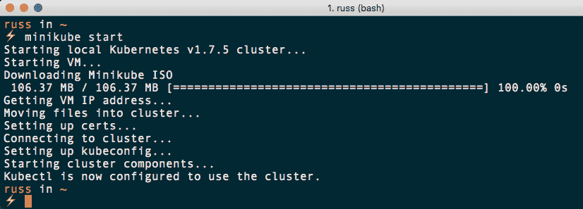

如您所见，用于创建虚拟机的 ISO 已经下载。虚拟机启动，我们将用于对我们的单节点集群进行身份验证的证书被生成，最后`kubectl`被配置为使用我们本地 Kubernetes 集群的详细信息。

在 Windows 10 上运行相同的命令将得到完全相同的步骤：

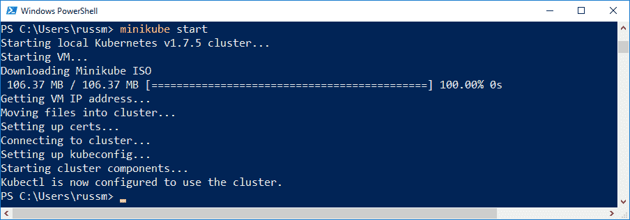

另外，正如您可能已经猜到的那样，在 Ubuntu 17.04 上运行会得到相同的结果。运行以下命令：

```
$ minikube status
```

您将收到一条消息，确认一切正常运行，并且 `kubectl` 已正确配置以与您的 Kubernetes 集群通信：

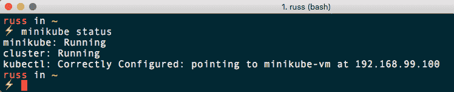

如果您打开 VirtualBox，您应该会看到您的 Minikube 虚拟机正在运行；例如，当我在 Windows 10 上打开 VirtualBox 时就是这种情况：

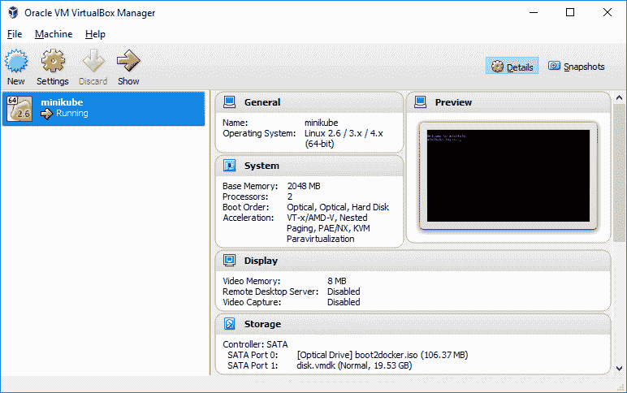

尽管我们在三种不同的操作系统上启动了 Minikube，除了初始安装之外，您已经可以体验我们在第二章中讨论的内容了：没有供应商锁定和一致的体验，而且这是在我们开始使用新安装的 Kubernetes 集群之前。

# Minikube 命令

到目前为止，我们已经使用了 `minikube start` 和 `minikube status` 命令来启动我们的单节点 Kubernetes 集群，并检查一切是否按预期运行。在我们开始与 Kubernetes 交互之前，我想介绍一些更基本的 Minikube 命令。

# 停止和删除

由于我们将我们的单节点 Kubernetes 集群作为虚拟机在您的主机上运行，您可能不希望它一直运行，占用资源。

有两种选项可以实现这一点，第一种是 `minikube stop`。这个命令将停止您的节点，并保持虚拟机完整。如果您计划在下次通过运行 `minikube start` 启动节点时继续之前的工作，您应该使用这个命令。

虽然 `minikube stop` 命令会停止您的虚拟机在主机上使用 CPU 和 RAM 资源，但用于托管虚拟机的硬盘映像仍将存在于您的机器上。虽然新启动的集群不会占用主机硬盘上太多空间，在我的 macOS 安装中大约为 650 MB；一旦您开始使用集群，您可能会发现这个空间至少会翻倍。

这就是我们下一个命令发挥作用的地方。`minikube delete` 命令将完全删除集群，包括所有虚拟机文件，释放主机机器上使用的空间。

在写作时，运行`minikube delete`将立即删除您的虚拟机，无论其是否正在运行。不会有提示询问您是否确定，也没有从该命令返回的方法（除非您有备份），因此请确保谨慎使用此命令。

当您再次运行`minikube start`时，您的集群将从头开始启动，就像我们在上一节中首次体验到的那样。

# 环境

接下来，我们有一些命令，显示有关虚拟机的信息，以及 Minikube 在您的设备上配置的环境。

首先，我们有一个非常简单的命令`minikube ip`。这个命令只是返回虚拟机的 IP 地址。如果您想通过脚本与集群交互，这将非常有用。您可以包含命令的输出，以引用集群的当前 IP 地址，而无需在脚本中硬编码实际的 IP 地址。

我们要看的下一个命令是`minikube docker-env`。运行此命令应该会在屏幕上打印出类似以下输出：

```
$ minikube docker-env
export DOCKER_TLS_VERIFY="1"
export DOCKER_HOST="tcp://192.168.99.101:2376"
export DOCKER_CERT_PATH="/Users/russ/.minikube/certs"
export DOCKER_API_VERSION="1.23"
# Run this command to configure your shell:
# eval $(minikube docker-env)
```

输出的作用是允许您（如果已安装）配置本地 Docker 客户端与 Minikube 虚拟机上的 Docker 安装进行通信。然而，这样做也有一个缺点。目前作为 Minikube 虚拟机镜像的一部分分发的 Docker 版本略落后于当前版本。您可以通过运行`eval $(minikube docker-env)`，然后`docker version`来查看这一点。当我运行这两个命令时，得到了以下结果：

```
$ eval $(minikube docker-env)
$ docker version
Client:
 Version: 17.06.2-ce
 API version: 1.23
 Go version: go1.8.3
 Git commit: cec0b72
 Built: Tue Sep 5 20:12:06 2017
 OS/Arch: darwin/amd64

Server:
 Version: 1.12.6
 API version: 1.24 (minimum version )
 Go version: go1.6.4
 Git commit: 78d1802
 Built: Wed Jan 11 00:23:16 2017
 OS/Arch: linux/amd64
 Experimental: false
```

从输出中可以看出，写作时 Minikube 使用的 Docker 版本比我在 macOS 上安装的最新稳定版本要落后两个版本。在本书涵盖的内容范围内，运行旧版本的 Docker 并不是问题，也不需要担心，因为我们不会直接与其交互。

# 虚拟机访问和日志

您可以通过 SSH 登录到 Minikube 虚拟机。在安装过程中，生成了一个 SSH 密钥，并在启动时与虚拟机共享。您可以通过运行`minikube ssh-key`来检查此密钥的位置。这将返回密钥的私钥部分的路径。您可以将其与其他命令结合使用，在 macOS 或 Ubuntu 上运行以下命令来 SSH 登录到虚拟机：

```
$ ssh docker@$(minikube ip) -i $(minikube ssh-key)
```

这将动态生成虚拟机的 IP 地址和私钥路径:

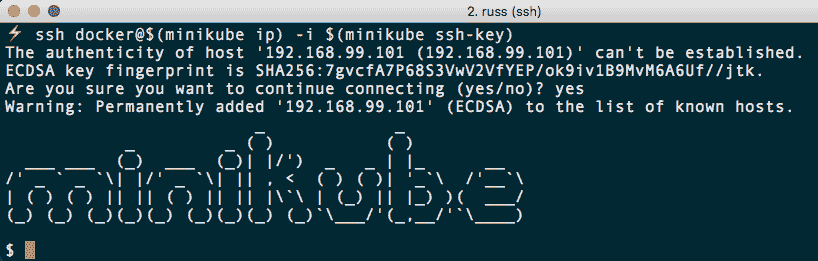

然而，Minikube 还有一个命令可以为您运行这个命令，并且在所有平台上都受支持。运行`minikube ssh`将直接将您登录到虚拟机作为 Docker 用户，如下面的终端输出所示:

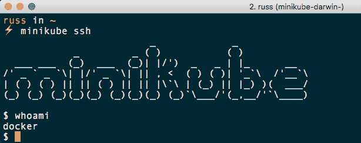

我们要快速查看的最后一个命令是`minikube logs`。这会显示`localkube`实例生成的所有日志:

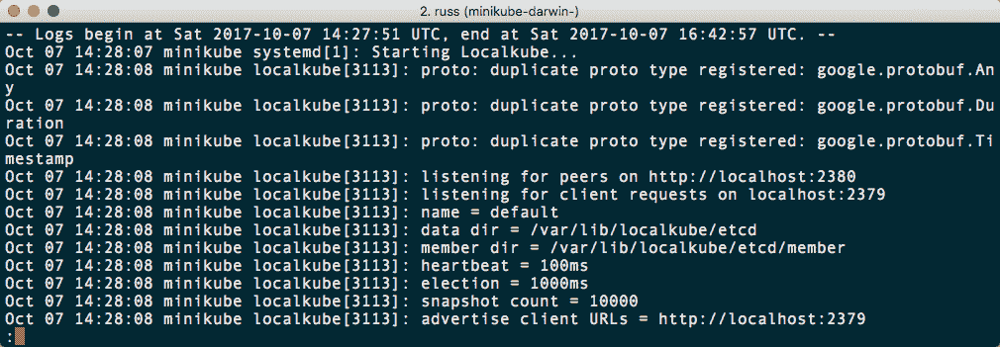

这些日志用于帮助调试您的 Minikube 安装中的问题。它们不包含任何用户数据，这意味着您不能使用它们来帮助跟踪您启动的服务或 pod 的任何问题。

# 你好世界

现在我们的单节点 Kubernetes 集群已经运行起来了，使用 Minikube，我们可以尝试启动一个服务。我们将首先使用仪表板，然后再转向命令行客户端。

# 仪表板

每个 Minikube 安装都带有一个基于 Web 的仪表板。这可以通过运行`minikube dashboard`来访问，它会立即在您的默认浏览器中打开仪表板:

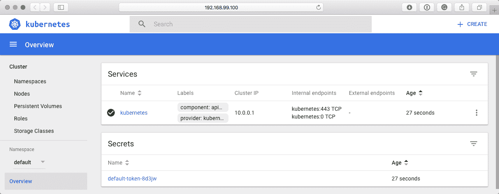

点击页面左上角的+创建按钮，将带您到一个表单，让您部署一个容器化应用程序。

在部署容器化应用页面上，您会找到几个选项。保持启用下面的指定应用程序详细信息选项，填写如下:

+   应用名称: `dashboard-hello-world`

+   容器镜像: `nginx:latest`

+   **Pod 数量**: `1`

+   **服务**: 外部

+   **端口**: `8080`

+   **目标端口**: `80`

+   **协议**: TCP

对于我们的目的，我们不需要填写在“显示高级选项”下找到的任何选项。只需点击表单底部的“部署”按钮。过一会儿，您的仪表板应该显示您有一个部署、pod、ReplicaSet 和服务，所有这些都带有`dashboard-hello-world`的名称:

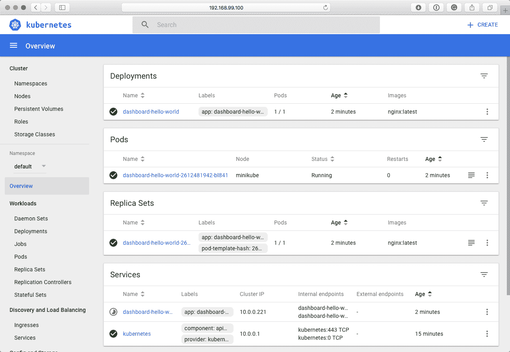

您可以通过运行以下命令查看服务:

```
$ minikube service dashboard-hello-world
```

这将返回以下消息:

```
Opening kubernetes service default/dashboard-hello-world in default browser...
```

打开您的浏览器，在那里您应该看到默认的 NGINX 页面:

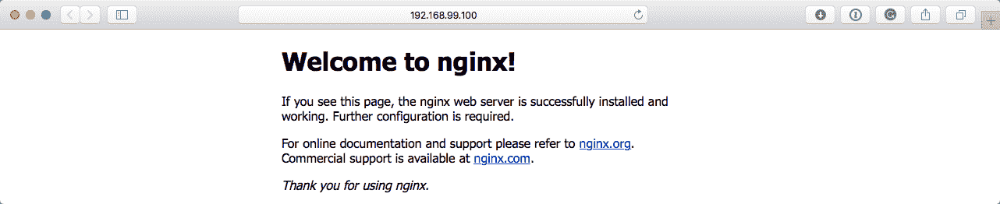

虽然这只是一个非常基本的例子，但它确实展示了使用仪表板启动简单应用程序有多简单。现在让我们看看如何转移到命令行。

# 命令行

在上一章中，我们简要介绍了如何使用 YAML 或 JSON 文件来定义您的 pod、ReplicaSets 和服务。让我们使用`kubectl`来启动一个与前一个应用程序相同的应用程序。

首先，我们需要一个要启动的文件；您可以在本书的代码包和 GitHub 存储库的`Chapter03`文件夹中找到名为`cli-hello-world.yml`的副本：

```
apiVersion: v1
kind: Service
metadata:
  name: cli-hello-world
spec:
  selector:
    app: cli-hello-world
  type: NodePort
  ports:
  - protocol: TCP
    port: 8000
    targetPort: 80
---
apiVersion: apps/v1beta1
kind: Deployment
metadata:
  name: cli-hello-world
  labels:
    app: nginx
spec:
  replicas: 1
  selector:
    matchLabels:
      app: cli-hello-world
  template:
    metadata:
      labels:
        app: cli-hello-world
    spec:
      containers:
      - name: nginx
        image: nginx:latest
        ports:
        - containerPort: 80
```

您可能已经注意到，虽然这是一个单独的文件，但实际上我们有两个不同的部分。第一个启动外部服务，在端口`8000`上公开它，以便与我们在上一节使用仪表板启动的外部服务不发生冲突。第二部分定义了 pod 和复制集；这与我们使用仪表板启动的内容非常相似。

要启动应用程序，我们只需要运行以下命令：

```
$ kubectl apply -f cli-hello-world.yml
```

您几乎立即会收到已创建服务和部署的确认：

```
service "cli-hello-world" created
deployment "cli-hello-world" created
```

创建后，您应该能够运行以下命令在浏览器中打开应用程序：

```
$ minikube service cli-hello-world
```

再次，您应该会看到默认的 NGINX 页面。

我相信当我们打开仪表板时，您点击了页面左侧可以找到的菜单项。所有这些信息也可以在命令行中找到，所以让我们简要地看一下我们可以使用的一些命令来了解有关我们集群的更多信息。

您将要运行的更常见的命令之一是`kubectl get`。这将获取 pod、ReplicaSets 和服务的列表，以及更多内容。运行以下命令应该给我们一个类似于仪表板概述的视图：

```
$ kubectl get pods
$ kubectl get replicasets
$ kubectl get services
$ kubectl get secrets
```

正如您从以下终端输出中所看到的，所有内容都列出了其当前状态：

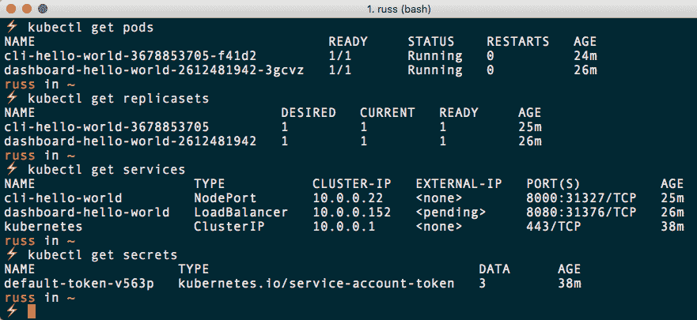

您可以获得很多选项；例如，尝试运行这个：

```
$ kubectl get endpoints
$ kubectl get events
$ kubectl get storageclasses
```

只运行`kubectl get`将列出您可以使用的所有不同参数。现在我们有了完整的 pod 名称，在我的情况下是`cli-hello-world-3678853705-f41d2`，我们可以通过运行`kubectl describe`命令来了解更多关于它的细节。例如，我运行了这个：

```
$ kubectl describe pods/cli-hello-world-3678853705-f41d2
```

当您在本地运行命令时，请更新 pod 名称以反映您自己的名称。Kubernetes 在启动时为每个 pod 添加一个唯一 ID，以确保您可以在任何给定的主机上运行多个相同的 pod。

我得到了以下信息：

```
Name: cli-hello-world-3678853705-f41d2
Namespace: default
Node: minikube/192.168.99.100
Start Time: Sun, 08 Oct 2017 10:41:06 +0100
Labels: app=cli-hello-world
 pod-template-hash=3678853705
Annotations: kubernetes.io/created-by={"kind":"SerializedReference","apiVersion":"v1","reference":{"kind":"ReplicaSet","namespace":"default","name":"cli-hello-world-3678853705","uid":"ce7b2030-ac0c-11e7-9136-08002...
Status: Running
IP: 172.17.0.5
Created By: ReplicaSet/cli-hello-world-3678853705
Controlled By: ReplicaSet/cli-hello-world-3678853705
Containers:
 nginx:
 Container ID: docker://0eec13c8340b7c206bc900a6e783122cf6210561072b286bda10d225ffb3c658
 Image: nginx:latest
 Image ID: docker-pullable://nginx@sha256:af32e714a9cc3157157374e68c818b05ebe9e0737aac06b55a09da374209a8f9
 Port: 80/TCP
 State: Running
 Started: Sun, 08 Oct 2017 10:41:09 +0100
 Ready: True
 Restart Count: 0
 Environment: <none>
 Mounts:
 /var/run/secrets/kubernetes.io/serviceaccount from default-token-v563p (ro)
Conditions:
 Type Status
 Initialized True
 Ready True
 PodScheduled True
Volumes:
 default-token-v563p:
 Type: Secret (a volume populated by a Secret)
 SecretName: default-token-v563p
 Optional: false
QoS Class: BestEffort
Node-Selectors: <none>
Tolerations: <none>
Events:
 Type Reason Age From Message
 ---- ------ ---- ---- -------
 Normal Scheduled 31m default-scheduler Successfully assigned cli-hello-world-3678853705-f41d2 to minikube
 Normal SuccessfulMountVolume 31m kubelet, minikube MountVolume.SetUp succeeded for volume "default-token-v563p"
 Normal Pulling 31m kubelet, minikube pulling image "nginx:latest"
 Normal Pulled 31m kubelet, minikube Successfully pulled image "nginx:latest"
 Normal Created 31m kubelet, minikube Created container
 Normal Started 31m kubelet, minikube Started container
```

您可以使用 `kubectl describe` 查找几乎可以使用 `kubectl get` 列出的所有信息，例如：

```
$ kubectl describe services/cli-hello-world
$ kubectl describe replicasets/cli-hello-world-3678853705
$ kubectl describe storageclasses/standard
```

同样，您可以通过仅运行`kubectl describe`来了解更多信息。在接下来的章节中，我们将介绍更多命令，以便在本书结束时，您将能够充分利用`kubectl`。

在完成本章之前，我希望我们能够快速看一下如何将存储从本地机器挂载到 Minikube 虚拟机内部，然后再挂载到我们的 pod 内部。

您将在`Chapter03`文件夹中找到一个名为`html`的文件夹。其中包含一个名为`index.html`的单个文件。在`Chapter03`文件夹中运行以下命令将挂载 HTML 到虚拟机内部：

```
$ minikube mount ./html:/data/html
```

您可以从运行命令后显示的消息中看到这一点：

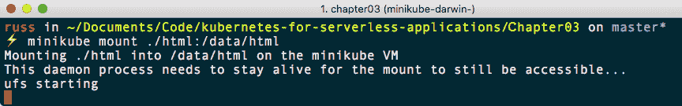在撰写本文时，已知在 Windows 10 主机上使用`minikube mount`命令存在一个已知的 bug，请参阅以下 GitHub 问题以获取更多信息[`github.com/kubernetes/minikube/issues/1473`](https://github.com/kubernetes/minikube/issues/1473)和[`github.com/kubernetes/minikube/issues/2072`](https://github.com/kubernetes/minikube/issues/2072)。

您需要保持此进程运行，因此在本节的其余部分中打开一个新的终端或 PowerShell 窗口以供使用。

运行以下命令：

```
$ minikube ssh
$ ls -lhat /data/html/
$ exit
```

这些命令将使您登录到 Minikube 虚拟机，获取`/data/html/`的目录列表，然后退出虚拟机：

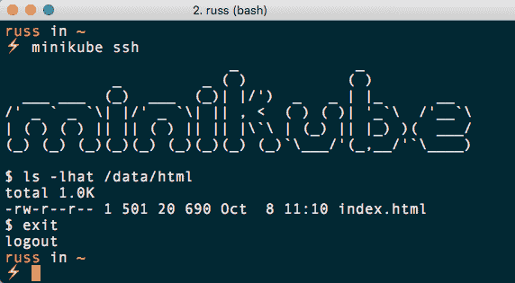

如您所见，我们的`index.html`文件在`/data/html/`中的集群节点上可用。返回到`Chapter03`文件夹，您应该会看到一个名为`cli-hello-world-storage.yml`的文件。其中包含使用此挂载文件夹的服务和部署信息。

服务部分看起来与本节中先前使用的很相似；但是，在部署部分有一个额外的内容：

```
apiVersion: apps/v1beta1
kind: Deployment
metadata:
  name: cli-hello-world-storage
  labels:
    app: nginx
spec:
  replicas: 1
  selector:
    matchLabels:
      app: cli-hello-world-storage
  template:
    metadata:
      labels:
        app: cli-hello-world-storage
    spec:
      volumes:
      - name: html
        hostPath:
          path: /data/html
      containers:
      - name: nginx
        image: nginx:latest
        ports:
        - containerPort: 80
        volumeMounts:
        - mountPath: /usr/share/nginx/html
          name: html
```

正如您所看到的，在部署的`spec`部分中，我们现在正在定义一个名为`html`的`volume`，然后在容器部分中，我们正在使用`mountPath`选项将名为`html`的卷挂载到`/usr/share/nginx/html`，这是我们在容器中使用的 NGINX 容器映像的默认网页根目录。

使用`kubectl apply`命令启动您的应用程序，然后使用`minikube service`命令在浏览器中打开服务：

```
$ kubectl apply -f cli-hello-world-storage.yml
$ minikube service cli-hello-world-storage
```

您应该看到以下页面：

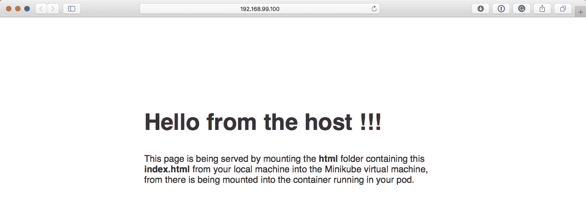

如果您在本地机器上的`html`文件夹中编辑`index.html`，当您刷新浏览器窗口时，更改将立即反映出来。

在我们进入下一章之前，我们应该删除本章中使用的 Minikube 虚拟机，以便我们从头开始。首先，我们有一个进程，它正在保持我们主机机器上的`html`文件夹挂载。要终止此进程，请返回到终端或 PowerShell 并按下*Ctrl* + *C*；这将向进程发送终止信号并将您返回到命令行。然后我们可以运行：

```
$ minikube delete
```

这将删除当前的虚拟机，这意味着当我们下次启动 Minikube 时，它将从头开始。

# 参考资料

有关本章中使用的工具的更多信息，请访问它们的项目页面：

+   **Minikube**: [`github.com/kubernetes/minikube`](https://github.com/kubernetes/minikube)

+   **kubectl**: [`kubernetes.io/docs/user-guide/kubectl-overview/`](https://kubernetes.io/docs/user-guide/kubectl-overview/)

+   **Homebrew**: [`brew.sh/`](https://brew.sh)

+   **Cask**: [`caskroom.github.io/`](https://caskroom.github.io/)

+   **Chocolatey**: [`chocolatey.org/`](https://chocolatey.org/)

+   **VirtualBox**: [`www.virtualbox.org/`](https://www.virtualbox.org/)

# 总结

在本章中，我们使用 Minikube 在本地机器上安装了单节点 Kubernetes 集群；我们看了如何在 macOS、Windows 10 和 Ubuntu Linux 上实现这一点。一旦安装完成，我们发现无论我们的本地机器运行哪个操作系统，我们都可以以完全相同的方式与我们的单节点 Kubernetes 集群进行交互。

然后，我们首次启动了 Pods、ReplicaSets 和服务，使用了 Kubernetes 仪表板和名为`kubectl`的 Kubernetes 命令行客户端。

在下一章中，我们将在我们目前在本地运行的单节点 Kubernetes 集群上启动我们的第一个无服务器工具，名为 Kubeless。
