# 第四章：介绍 Kubeless 功能

现在我们的 Kubernetes 安装已经运行起来了，我们可以开始运行我们的第一个无服务器应用程序；我们将通过一些示例来安装和运行 Kubeless。我们将涵盖以下主题：

+   安装 Kubeless

+   Kubeless 概述

+   使用 Kubeless 运行我们的第一个函数-“hello world”示例

+   更高级的示例-发布推文

+   无服务器插件

让我们开始在我们的三个目标操作系统上安装 Kubeless。

# 安装 Kubeless

Kubeless 有两个组件；第一个是在 Kubernetes 上运行的堆栈，第二部分是您用来与 Kubeless 集群交互的命令行客户端。

我们首先将看看如何让 Kubeless 在 Kubernetes 上运行起来。一旦运行起来，我们将看看如何在我们的三个目标操作系统上安装命令客户端。

# Kubeless Kubernetes 集群

我们将在上一章中安装和配置的单节点 Minikube 集群上安装 Kubeless。我们需要做的第一件事是确保我们从一个干净的 Kubernetes 安装开始。为此，我们只需要运行以下两个命令：

请记住，运行`minikube delete`命令将立即删除当前正在运行的虚拟机，而不会发出警告，这意味着您的 Minikube 单节点集群上当前活动的所有内容都将丢失。

```
$ minikube delete
$ minikube start
```

现在我们的新的单节点 Kubernetes 集群已经运行起来了，我们需要通过运行以下命令为 Kubeless 创建一个命名空间：

```
$ kubectl create ns kubeless
```

然后通过运行以下命令安装 Kubeless 本身：

在撰写本文时，Kubeless 的当前版本是 v0.2.3。您可以在项目的 GitHub 发布页面[`github.com/kubeless/kubeless/releases`](https://github.com/kubeless/kubeless/releases)上检查最新版本。要安装更新版本，只需在以下 URL 中使用更新的版本号，但请注意，不同版本之间的输出可能会有所不同。

```
$ kubectl create -f https://github.com/kubeless/kubeless/releases/download/v0.2.3/kubeless-v0.2.3.yaml
```

如您所见，这将创建并启动在您的单节点 Kubernetes 集群上运行 Kubeless 所需的所有组件：

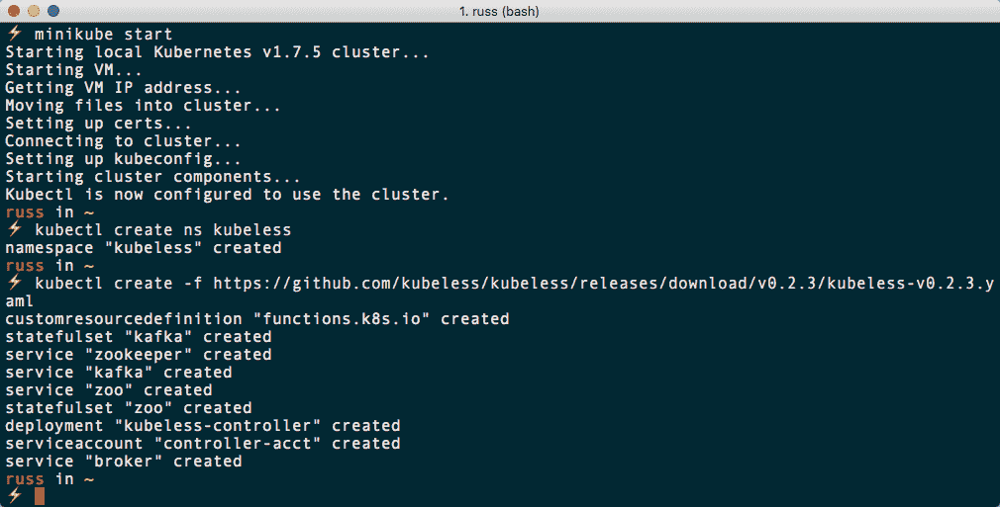

一切启动需要一些时间。您可以通过运行以下命令来检查每个组件的状态：

```
$ kubectl get pods -n kubeless
$ kubectl get deployment -n kubeless
$ kubectl get statefulset -n kubeless
```

这应该会显示类似以下输出：

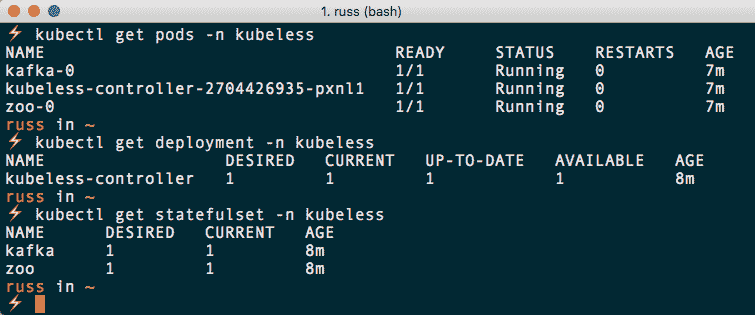

或者，您也可以使用 Kubernetes 仪表板来检查状态。要做到这一点，运行以下命令打开仪表板：

```
$ minikube dashboard
```

当仪表板首次打开时，它被配置为显示默认命名空间，因为我们执行的第一个命令创建了一个名为`kubeless`的新命名空间。我们需要切换到`kubeless`命名空间以查看其中部署的 Pods、Deployments 和 Stateful Sets。

一旦您更改了命名空间，您应该在以下页面上看到一些内容：

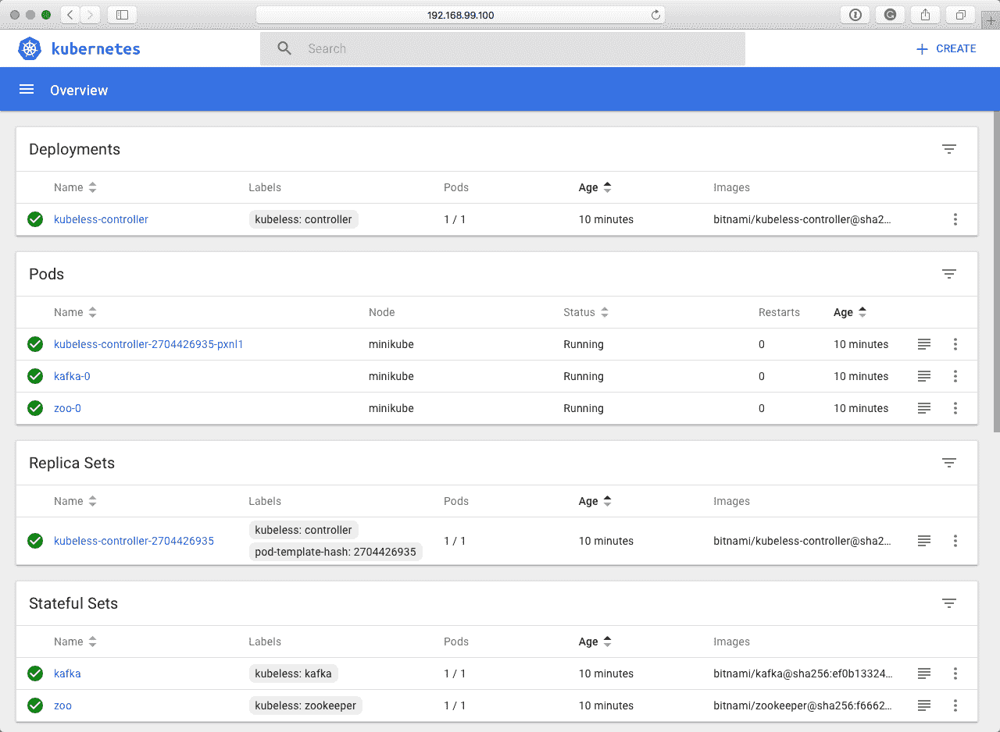

正如您所看到的，我们只用两个命令就部署了一组相当复杂的服务。所有繁重的工作和复杂性都已完全抽象化。

# 命令行客户端

现在 Kubeless 已经安装在我们的单节点 Kubernetes 集群上，我们可以考虑安装命令行客户端；这是我们将与我们的 Kubeless 集群进行交互的方式。

# macOS 10.13 High Sierra

由于我们已经在上一章安装了 Homebrew，我们将使用`brew`命令来安装 Kubeless。为此，我们需要添加 Kubeless tap；tap 是一个包含软件安装说明的第三方存储库。一旦 tap 被添加，我们就可以以与我们在第二章中安装 Minikube 相同的方式安装 Kubeless。

要安装 tap，然后安装 Kubeless 命令行客户端，请运行以下两个命令：

```
$ brew tap kubeless/tap
$ brew install kubeless
```

安装完成后，您可以通过运行以下命令来检查已安装的客户端的版本：

```
$ kubeless version
```

如果这返回的客户端版本与您安装的软件不同，不要太担心；这不应该是一个问题。

# Windows 10 专业版

不幸的是，Kubeless 没有可用的 Chocolatey 安装程序，因此我们必须手动下载和解压可执行文件。要在 PowerShell 中执行此操作，请运行以下命令：

```
$ Invoke-WebRequest -Uri https://github.com/kubeless/kubeless/releases/download/v0.2.3/kubeless_windows-amd64.zip -Outfile C:\Temp\kubeless_windows-amd64.zip
$ expand-archive -path 'C:\Temp\kubeless_windows-amd64.zip' -destinationpath 'C:\Temp\kubeless_windows-amd64'
$ Move-Item C:\Temp\kubeless_windows-amd64\bundles\kubeless_windows-amd64\kubeless.exe .\
```

或者，您可以从 Kubeless 发布页面下载`kubeless_windows-amd64.zip`文件。下载后，解压`.zip`文件，并将`kubeless.exe`文件放在我们可以执行它的位置。从包含您的`kubeless.exe`文件的文件夹运行以下命令：

```
$ ./kubeless version
```

这将返回命令行客户端的版本。

# Ubuntu 17.04

就像 Windows 10 版本的 Kubeless 命令行客户端一样，我们需要下载发布版本，解压缩并将可执行文件移动到指定位置。要做到这一点，请运行以下命令：

```
$ curl -Lo /tmp/kubeless.zip https://github.com/kubeless/kubeless/releases/download/v0.2.3/kubeless_linux-amd64.zip
$ unzip /tmp/kubeless.zip -d /tmp
$ chmod +x /tmp/bundles/kubeless_linux-amd64/kubeless
$ sudo mv /tmp/bundles/kubeless_linux-amd64/kubeless /usr/local/bin/
```

最后，为了检查可执行文件是否按预期工作，请运行：

```
$ kubeless version
```

我们已经准备好在我们的 Ubuntu Linux 主机上使用 Kubeless。

# Kubeless Web 界面

在我们继续之前，我们还可以安装 Kubeless 的 Web 界面。就像 Kubeless 本身一样，只需运行以下命令即可轻松安装：

```
$ kubectl create -f https://raw.githubusercontent.com/kubeless/kubeless-ui/master/k8s.yaml
```

然后，您可以使用 Minikube 运行以下命令在浏览器中打开服务：

```
$ minikube service ui --namespace kubeless
```

从上述命令中可以看出，由于`ui`服务已部署在`kubeless`命名空间中，我们需要通过传递`--namespace`标志来让 Minikube 知道这是服务的访问位置。Kubeless Web 界面可能需要几分钟才能启动，但当它启动时，您应该会看到一个类似以下内容的页面：

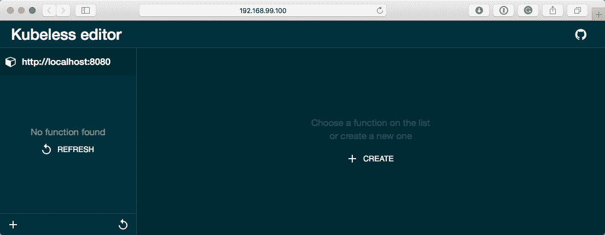

# Kubeless 概述

在开始使用 Kubeless 部署无服务器函数之前，我们应该花点时间来了解一下我们刚刚安装的内容，并查看在使用 Kubeless 命令行客户端时可用的命令。

正如我们已经提到的，安装过程非常简单——在我们的单节点 Kubernetes 集群上安装 Kubeless 时，安装过程基本上是一样的，即使我们在由多个节点组成的 Kubernetes 上安装它也是如此。

# 那么，什么是 Kubeless 呢？

Kubeless 是一个支持在 Kubernetes 集群上部署无服务器函数的框架，它允许您使用 HTTP 和事件触发器来执行 Python、Node.js 或 Ruby 代码。该框架是使用核心 Kubernetes 功能构建的，如部署、服务、ConfigMaps 等。这使得 Kubeless 的代码库很小，并且意味着开发人员不必重复大量的调度逻辑，因为它已经存在于 Kubernetes 核心中。

它通过利用 Kubernetes 控制器来工作。使用控制器，Kubeless 开发人员已扩展了 Kubernetes API，以在 Kubernetes 中添加一个函数对象。 Kubeless 控制器作为部署在 Kubernetes 集群中运行，其主要工作是监视函数端点的调用。当调用端点时，将执行包含函数代码的运行时；这些是预构建的 Docker 镜像，用于包装您的函数，使用 ConfigMaps 注入到 Kubernetes 集群中的 Apache Kafka 消费者或 HTTP 服务器中，您可以像调用任何其他网页一样调用它们。

Apache Kafka 是一个分布式流平台，让您可以发布和订阅信息流。在我们的情况下，这个信息流是触发的事件，Kubeless 控制器订阅了这个事件。

所有这些意味着我们可以在我们运行的单节点集群中获得与我们在第一章 *无服务器景观*中涵盖的 AWS 和 Microsoft Azure 的无服务器服务类似的体验，包括我们本地运行的 Kubernetes 集群。

# 谁创造了 Kubeless？

Kubeless 是由 Bitnami（[`bitnami.com/`](https://bitnami.com/)）创建的，它是他们编写并开源支持将应用程序轻松部署到 Kubernetes 集群的几个项目之一。

Bitnami 多年来一直是分发预打包的开源和商业支持许可应用的领导者，在撰写本文时有超过 140 个应用程序，以可预测和一致的方式跨多个不同平台和公共云进行分发和支持，因此支持和开发 Kubernetes 对他们来说是一个自然的选择。

他们是 Helm 的核心贡献者，与微软和谷歌一起，Helm 是由 Cloud Native Computing Foundation 论坛维护的 Kubernetes 的包管理器，我们知道来自第二章 *Kubernetes 简介*。

您可以在[`kubeless.io/`](http://kubeless.io/)找到 Kubeless 网站。

# Kubeless 命令

Kubeless 命令行客户端有几个命令。在我们使用 Kubeless 在 Kubernetes 上启动我们的第一个无服务器函数之前，我们应该快速讨论一些我们将要使用的命令。

我们将要使用的最常见的命令是`kubeless function`。这允许我们`部署`、`删除`、`编辑`和`列出`函数。此外，我们可以通过使用`call`执行我们的函数，并检查`日志`。

接下来，我们有`kubeless ingress`；使用此命令，我们可以`创建`、`删除`和`列出`到我们函数的路由。

最后，我们还将看一下`kubeless topic`；与`ingress`一样，它允许我们`创建`、`删除`和`列出`主题，以及向主题`发布`消息。

# Hello world

首先，我们将看一下部署两个非常简单的 hello world 函数。第一个简单地打印`Hello World!`，第二个接受输入，然后将其显示回给你。

# 基本示例

首先，我们需要我们的函数。静态的 hello-world 函数需要以下三行 Python 代码：

```
import json
def handler():
    return "Hello World!"
```

将前面的代码放在名为`hello.py`的文件中，该文件也可以在伴随本书的 GitHub 存储库的`Chapter04/hello-world`文件夹中找到。

现在我们有了我们的函数，我们可以通过运行以下命令将其部署到默认命名空间中：

```
$ kubeless function deploy hello \
 --from-file hello.py
 --handler hello.handler \
 --runtime python2.7 \
  --trigger-http
```

此命令创建一个名为`hello`的函数，使用文件`hello.py`。每当执行名为`hello.handler`的函数时，我们使用`python2.7`运行时，并且我们的函数被设置为由`http`请求触发。

您可能已经注意到，当您运行命令时，没有任何反馈，所以要检查函数是否已创建，您可以运行以下命令：

```
$ kubeless function ls
```

在前面的命令中有几列：

+   `名称`：这是函数的名称

+   `命名空间`：函数部署到的命名空间的名称

+   `处理程序`：要运行的处理程序的名称—在我们的情况下，处理程序只是处理程序，因此它正在调用`hello-world.handler`

+   `运行时`：Kubeless 支持的每种语言都有单独的运行时

+   `类型`：这是函数被调用的方式，在我们的情况下这是 HTTP

+   `主题`：如果我们订阅消息队列，这将是我们要观察消息的主题

另外，正如前一节中提到的，Kubeless 将函数对象添加到 Kubernetes 中。您可以运行以下命令来检查我们的函数是否被列在函数对象中：

```
$ kubectl get functions
```

通过这些命令运行应该会给您一些类似以下结果：

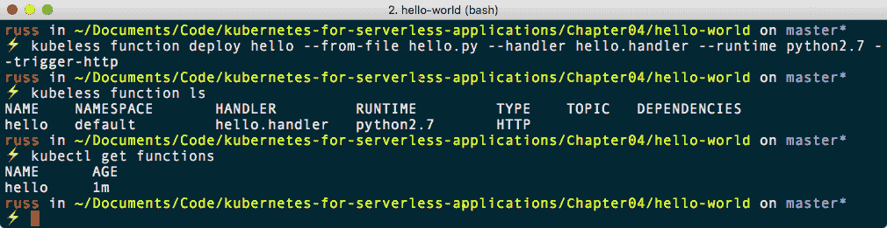

现在我们的函数已部署，我们可以执行它。要运行此操作，请运行：

```
$ kubeless function call hello
```

这将产生以下结果：

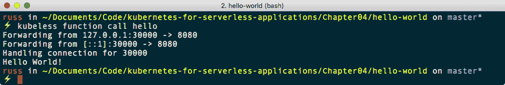

我们调用函数的另一种方式是使用 Kubeless Web 界面。通过运行以下命令打开它：

```
$ minikube service ui --namespace kubeless
```

打开后，您应该在左侧列出函数`hello`。单击`hello`将显示函数中的代码，并且右侧有一个标有 RUN FUNCTION 的按钮；单击此按钮将执行`hello`函数并返回`Hello World!`：

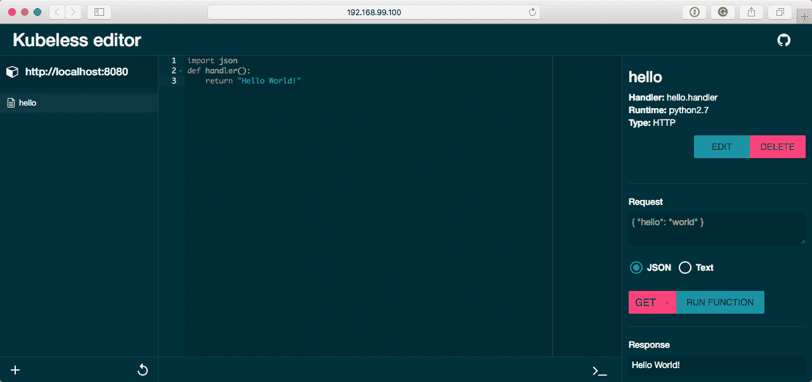

我们与函数交互的最终方式是创建 Ingress 规则；但是，在执行此操作之前，我们必须在 Minikube 中启用 Ingress 插件。要执行此操作，请运行以下命令：

```
$ minikube addons enable ingress
```

现在 Ingress 插件已启用，我们需要使用 Kubeless 创建 Ingress 路由。要执行此操作，我们只需要运行以下命令：

```
$ kubeless ingress create --function hello hello-ingress
```

我们需要知道 Kubeless 创建的主机，以便访问我们的服务。要执行此操作，请运行以下命令：

```
$ kubeless ingress ls
```

这将提供有关我们创建的 Ingress 路由的信息，包括我们将能够使用的主机来访问该服务。对我来说，这是`http://hello.192.168.99.100.nip.io/`。

`nip.io`是一个简单且免费的 DNS 服务，允许您创建 DNS 记录将您的主机映射到 IP 地址。Kubeless 使用此服务创建有效的主机以路由到您的服务。

在我的浏览器中打开此 URL 返回`Hello World!`，通过 HTTPie 运行它也是如此，我们在第一章中介绍了 HTTPie，您可以从以下终端输出中看到：

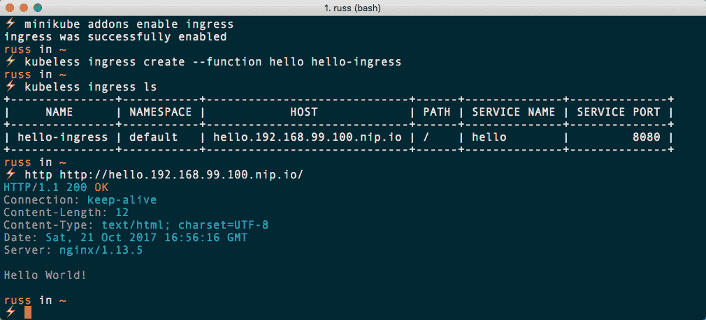

现在我们的第一个函数已经运行起来了，让我们看看如何创建一个可以传递并打印数据的函数。

# 读取数据的示例

我们的新函数代码仍然非常简单：

```
import json

def handler(context):
    print context.json
    return context.json
```

此代码的全部作用只是接收我们发布的 JSON 并将其显示给我们。将其放入名为`hello-name.py`的文件中，或者使用 GitHub 存储库中`Chapter04/hello-world/`文件夹中的文件。一旦有了文件，您可以通过运行以下命令创建函数：

```
$ kubeless function deploy hello-name \
 --from-file hello-name.py \
 --handler hello-name.handler \
 --runtime python2.7 \
 --trigger-http
```

部署函数后，通过运行以下命令检查是否已创建：

```
$ kubeless function ls
```

您应该看到列出了两个函数，`hello`和`hello-name`。现在我们已经创建了新函数，可以通过运行以下命令来调用它：

```
$ kubeless function call hello-name --data '{ "name": "Russ" }'
```

请注意，这次我们使用`--data`标志将数据传递给函数。运行所有命令后，您应该看到类似以下终端输出：

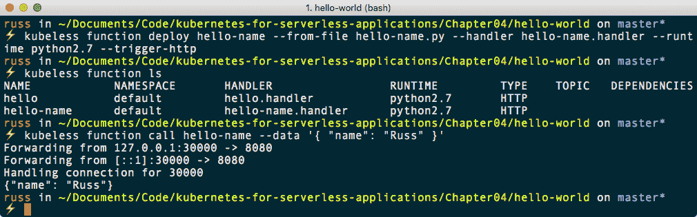

在使用 Web 界面调用函数时，我们还需要传递数据。要做到这一点，再次打开界面，运行：

```
$ minikube service ui --namespace kubeless
```

打开后，点击`hello-name`函数。在点击 RUN FUNCTION 按钮之前，使用下拉菜单将 GET 更改为 POST，并在请求表单中输入以下内容：

```
{ "name": "Russ" }
```

现在，点击 RUN FUNCTION 按钮。这将返回与`kubeless function call`命令相同的结果：

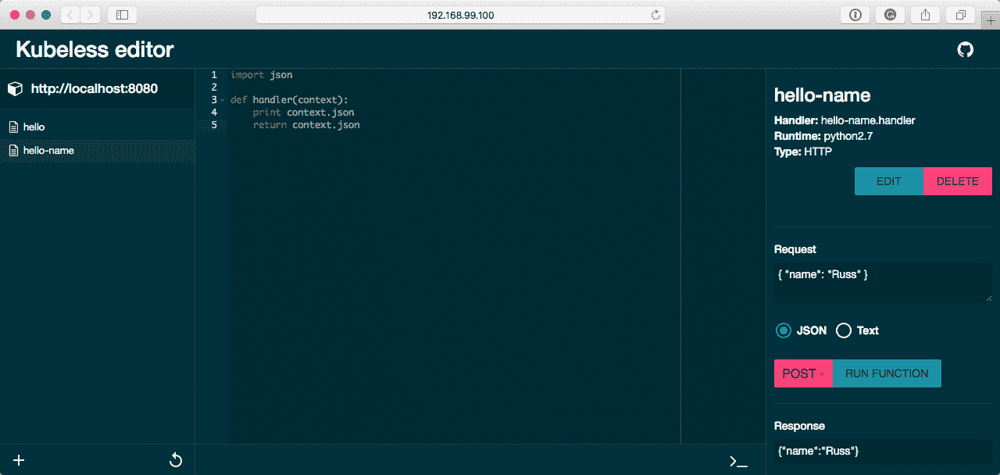

我们还可以通过配置 Ingress 路由直接与服务交互：

```
$ kubeless ingress create --function hello-name hello-name-ingress
$ kubeless ingress list
```

这将为我们的两个函数提供 URL：

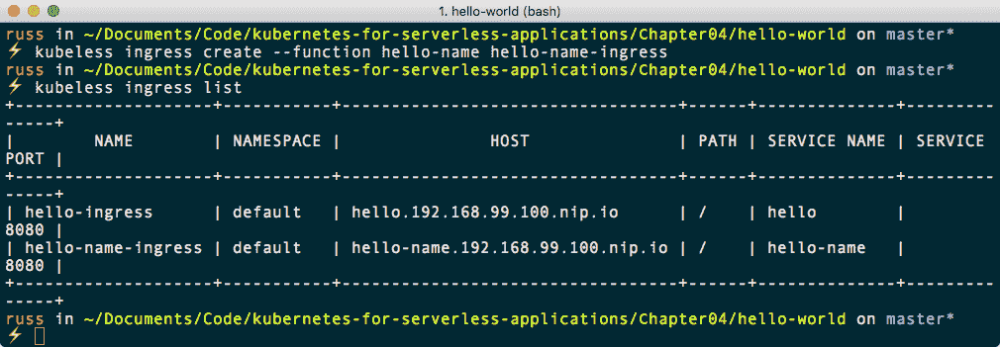

与我们的第一个示例不同，转到`hello-name`的 URL，对我来说是`http://hello-name.192.168.99.100.nip.io/`，将会显示错误：500 内部服务器错误（或在 Kubeless 的后续版本中，显示 504 网关超时）：

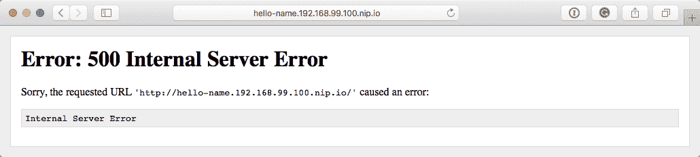

为什么会这样，尽管我们使用`kubeless function call`命令和 Kubeless Web 界面调用时都没有错误？

通过简单地将 URL 输入到浏览器中，我们没有发布任何数据供函数返回；这就是为什么会生成错误的原因。我们可以通过检查日志来确认这一点。要做到这一点，刷新浏览器中的页面几次，然后运行以下命令：

```
$ kubeless function logs hello-name
```

您应该看到类似以下的内容：

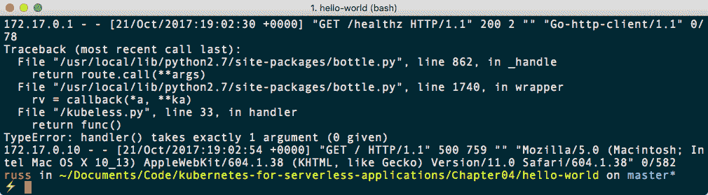

前面日志输出的第一行是内部健康检查，它是成功的，因为生成了`200`状态，您可以在`GET`之后看到。接下来的几行包含我们要查找的错误；正如您所看到的，我们得到了`Traceback`，然后是以下内容：`TypeError: handler() takes exactly 1 argument (0 given)`。这意味着函数期望传递数据，但没有传递。下一行是来自我们浏览器的请求；正如您在`GET`之后看到的，有一个`500`的状态。

那么，我们如何与需要 POST 数据而不是 GET 的函数进行交互呢？在 macOS 和 Linux 命令行上，您可以通过几种方式实现这一点，但在 Windows 上，您将不得不运行其他东西。与其通过不同的示例来工作，我要安装一个名为 Postman 的软件。这个桌面软件适用于我们在书中涵盖的所有三种操作系统，并且它将为我们与`hello-name`函数以及我们启动的任何其他函数进行交互提供一个很好的图形界面。

要在 macOS 10.13 High Sierra 上使用 Homebrew 安装 Postman，只需运行：

```
$ brew cask install postman
```

Postman 有一个 Chocolatey 软件包，因此如果您使用的是 Windows 10 专业版，可以运行：

```
$ choco install postman
```

要在 Ubuntu 17.04 上安装 Postman，我们需要运行一些额外的步骤。首先，我们需要下载、解压缩并移动文件到指定位置，确保清理和移动我们需要的文件。为此，请运行以下命令：

```
$ wget https://dl.pstmn.io/download/latest/linux64 -O postman.tar.gz
$ sudo tar -xzf postman.tar.gz -C /opt
$ rm postman.tar.gz
$ sudo ln -s /opt/Postman/Postman /usr/bin/postman
```

现在我们已经将文件放在了正确的位置，我们可以通过运行以下命令为它们创建一个桌面启动器：

```
$ cat > ~/.local/share/applications/postman.desktop <<EOL
[Desktop Entry]
Encoding=UTF-8
Name=Postman
Exec=postman
Icon=/opt/Postman/resources/app/assets/icon.png
Terminal=false
Type=Application 
Categories=Development;
EOL
```

创建了启动器后，您应该在已安装软件列表中看到一个 Postman 图标出现。

现在我们已经安装了 Postman，打开它，您将看到一个屏幕，询问您是否要注册。如果您愿意注册或不注册，完全取决于您；该服务是免费的，如果您需要测试向 API 发送数据，您会发现它非常有用。一旦您通过了注册或登录选项，您将看到一个类似以下的屏幕：

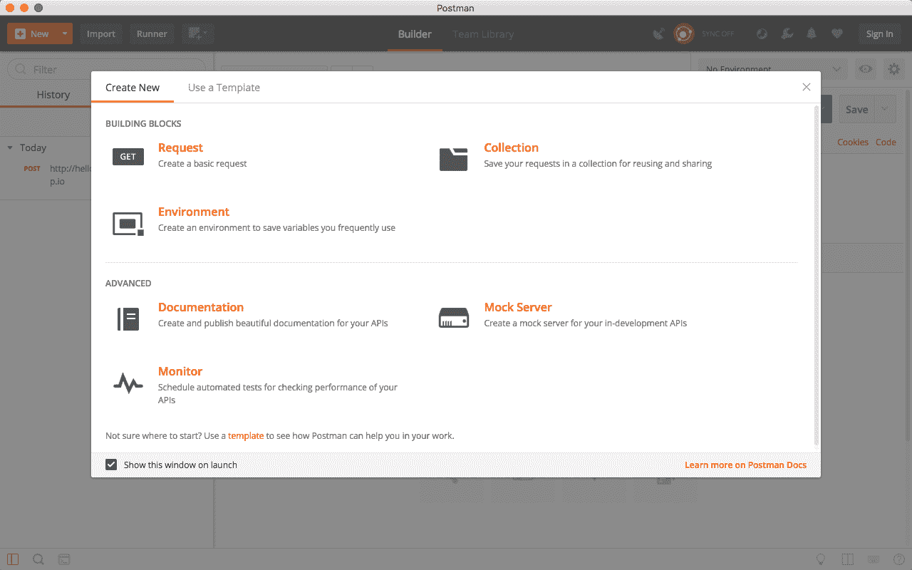

点击 BUILDING BLOCKS 下的 Request 选项；这将带您进入保存对话框。在这里，输入`hello-name`的请求名称，然后点击+Create Collection。在这里，创建一个名为`Kubeless`的集合，然后点击 Save to Kubeless 按钮。

首先，使用下拉菜单将 GET 更改为 POST，然后在标有输入请求 URL 的空格中输入`http://hello-name.192.168.99.100.nip.io`（或者如果不同的话，输入您的 URL）。现在我们已经定义了我们将要发布我们的数据，我们需要实际给 Postman 传递需要传递给我们的函数的数据。

要输入数据，请单击 Body，然后选择原始选项。当您选择原始选项时，输入字段将发生变化，您应该看到单词 Text 和旁边的下拉图标。单击这个图标，然后选中 JSON（application/json）选项。一旦更改，输入以下内容到主字段中：

```
{
  "name": "Russ" 
}
```

现在 Postman 已经配置为将 JSON 数据发送到我们的函数，您可以单击发送。这将发布我们定义的数据，然后在屏幕底部显示结果，以及 HTTP 状态和请求执行所需的时间，就像下面的截图一样：

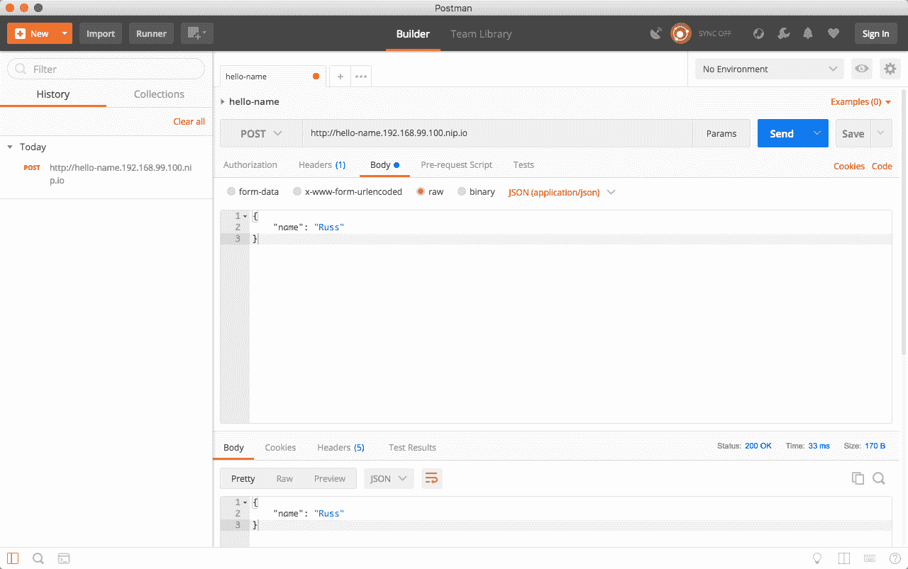

单击保存按钮将保存设置，如果您想重新运行它们的话。

在我们继续下一节之前，我们应该整理一下我们的函数。要做到这一点，我们只需要运行：

```
$ kubeless ingress delete hello
$ kubeless function delete hello
$ kubeless ingress delete hello-name
$ kubeless function delete hello-name
```

这将删除我们的两个 hello world 函数和 Ingress 路由。您还可以在 Kubeless web 界面和 Kubernetes 仪表板中再次检查是否已删除了所有内容；您可以通过运行以下命令打开它们：

```
$ minikube service ui --namespace kubeless
$ minikube dashboard
```

如果您发现任何剩余的内容，无论是`hello`还是`hello-name`，您都可以从仪表板中删除服务、pod，甚至 Ingress 路由。

# Twitter 示例

Kubeless GitHub 账户有一些更多的示例应用程序，这些应用程序不仅可以打印静态内容或转发您发送的数据。在这个例子中，我们将看看如何创建一个可以发布到 Twitter 账户的函数。

# Twitter API

在我们看如何启动函数之前，我们需要为我们的函数生成密钥，以便对 Twitter 进行身份验证，然后发布到您的账户。为此，您需要以下内容：

+   Twitter 账户

+   与账户注册的手机号码

如果您有它们，那么前往 Twitter 应用程序页面[`apps.twitter.com/`](https://apps.twitter.com/)将为您呈现一个表格（应用程序详情）-我使用了以下信息。然而，一些字段需要对您来说是唯一的；这些字段用*标记：

+   名称*：`MedialGlassesKubeless`

+   描述：`使用 Kubeless 测试发布到 Twitter`

+   网站*：`https://media-glass.es/`

+   回调 URL：留空

+   开发者协议：同意协议

填写完上述信息后，点击“创建 Twitter 应用”按钮。创建应用程序后，您将被带到一个页面，允许您管理您的应用程序。页面上的一个选项卡是“密钥和访问令牌”；点击这个选项卡将显示您的消费者密钥（API 密钥）和消费者秘钥（API 秘钥）—请记下这些信息。

在页面底部，您将有一个按钮，允许您为您的帐户创建访问令牌和访问令牌秘钥；点击按钮将生成这些令牌—再次，请记下这些信息。

虽然以下示例将包含我生成的密钥，但它们已被撤销，您应该使用您自己的密钥。此外，由于它们允许对您的 Twitter 帐户进行读写访问，将它们存储在 GitHub、Gists 或其他版本控制软件等公开可访问的地方可能导致第三方未经您的许可就完全访问您的 Twitter 帐户。

# 将秘密添加到 Kubernetes

现在我们已经配置了 Twitter 应用程序，并且拥有了发布推文所需的所有令牌，我们需要将它们添加到 Kubernetes 中。Kubernetes 允许您定义秘密；这些是您的应用程序需要使用的 API 密钥和令牌等变量。但是，您可能不希望将它们放在源代码控制下或嵌入到您的应用程序中，因为相同代码的各种部署使用不同的密钥与 API 进行交互—例如，代码的开发版本使用与生产版本不同的 API 凭据。

要添加前一节中记下的令牌，您只需要运行以下命令，用您的令牌和密钥替换大写的占位符：

```
$ kubectl create secret generic twitter \
 --from-literal=consumer_key=YOUR_CONSUMER_KEY \ 
 --from-literal=consumer_secret=YOUR_CONSUMER_SECRET \
 --from-literal=token_key=YOUR_TOKEN_KEY \
 --from-literal=token_secret=YOUR_TOKEN_SECRET
```

对我来说，命令看起来像下面这样：

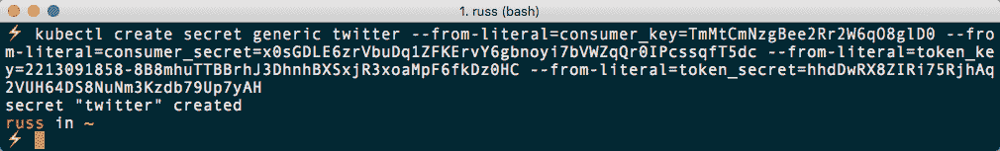

这样就创建了一个名为`twitter`的秘密，其中包含我们传递给命令的四个不同的键和令牌。您可以通过运行以下命令来列出这些秘密：

```
$ kubectl get secret
```

这将列出您的 Kubernetes 集群中的所有秘密，如下面终端输出所示：

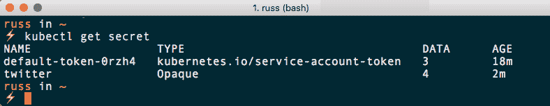

这里有默认的 Kubernetes 服务账户令牌，包含三个项目，以及我们的`twitter`秘密，其中包含四个键和令牌。您也可以在 Kubernetes 仪表板中查看秘密：

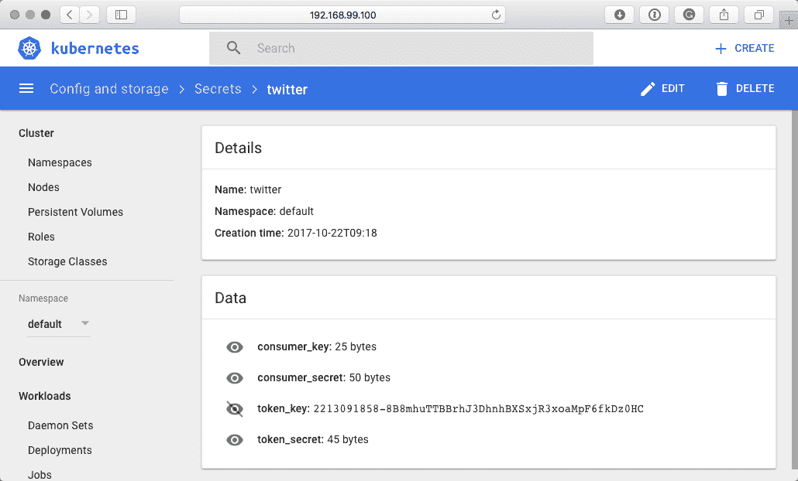

从前面的屏幕截图中可以看出，您还可以通过单击眼睛图标来显示秘密。

# Twitter 函数

现在我们的环境准备好了，我们可以部署函数了。为此，我们需要两个文件；第一个是`requirements.txt`文件，其中只包含两行：

```
python-twitter
kubernetes==2.0.0
```

`requirements.txt`文件让 Python 知道要与我们的代码一起部署的外部库。在我们的文件中，我们使用`twitter`库，以便可以轻松地发布推文，还使用`kubernetes`库来解码我们在上一节中创建的秘密。使用这些库意味着我们的代码非常简化，因为所有的繁重工作都发生在我们的核心函数之外。函数的代码如下：

```
import base64
import twitter

from kubernetes import client, config

config.load_incluster_config()

v1=client.CoreV1Api()

for secrets in v1.list_secret_for_all_namespaces().items:
    if secrets.metadata.name == 'twitter':
        consumer_key = base64.b64decode(secrets.data['consumer_key'])
        consumer_secret = base64.b64decode(secrets.data['consumer_secret'])
        token_key = base64.b64decode(secrets.data['token_key'])
        token_secret = base64.b64decode(secrets.data['token_secret'])

api = twitter.Api(consumer_key=consumer_key,
                  consumer_secret=consumer_secret,
                  access_token_key=token_key,
                  access_token_secret=token_secret)

def handler(context):
    msg = context.json
    status = api.PostUpdate(msg['tweet'])
```

将此内容放入名为`tweet.py`的文件中。与以前一样，`requirements.txt`和`tweet.py`文件都可以在 GitHub 存储库`Chapter04/twitter/`中找到。

部署函数的命令在部署命令中有一个附加项。由于我们现在正在加载外部库，我们需要让 Kubeless 知道我们想要使用`requirements.txt`文件，方法是添加`--dependencies`标志：

```
$ kubeless function deploy twitter \
 --from-file tweet.py \
 --handler tweet.handler \
 --runtime python2.7 \
 --trigger-http \
 --dependencies requirements.txt
```

从以下终端输出中可以看出，在运行`kubeless function list`命令时现在列出了依赖项：

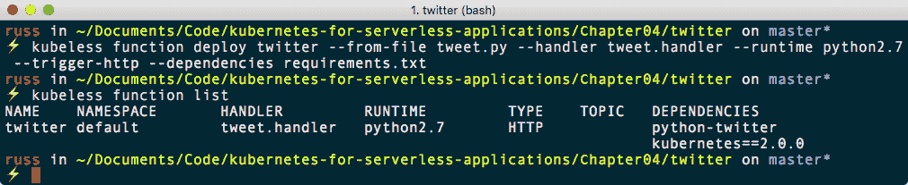

现在我们的函数已经部署，我们可以开始发推文了。要发送我们的第一条推文，您只需运行以下命令：

```
$ kubeless function call twitter --data '{"tweet": "Testing twitter function from Kubeless!"}'
```

您将不会收到任何反馈，但如果您转到您的 Twitter 帐户，您应该会看到这条推文：

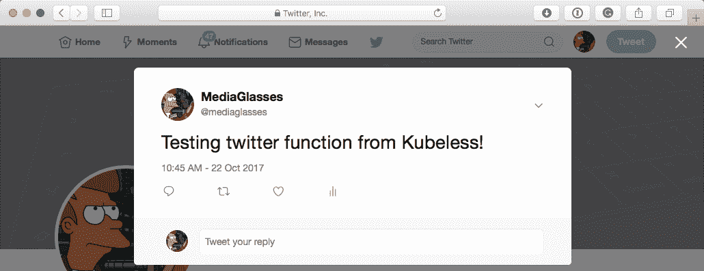

您还可以使用 Postman 发送推文。首先，通过运行以下命令创建一个 Ingress 路由：

```
$ kubeless ingress create --function twitter twitter-ingress
$ kubeless ingress list
```

这将创建路由并给我们提供访问函数所需的主机：

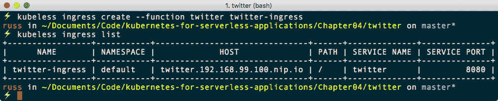

现在我们可以打开 Postman，并且像以前一样配置它，但是这个文件将以下内容作为发布内容：

```
{
  "tweet": "Testing twitter function from Kubeless using @postmanclient!"
}
```

单击发送将发布推文，并且与使用`kubeless function call`命令调用函数时一样，不会给我们任何反馈：

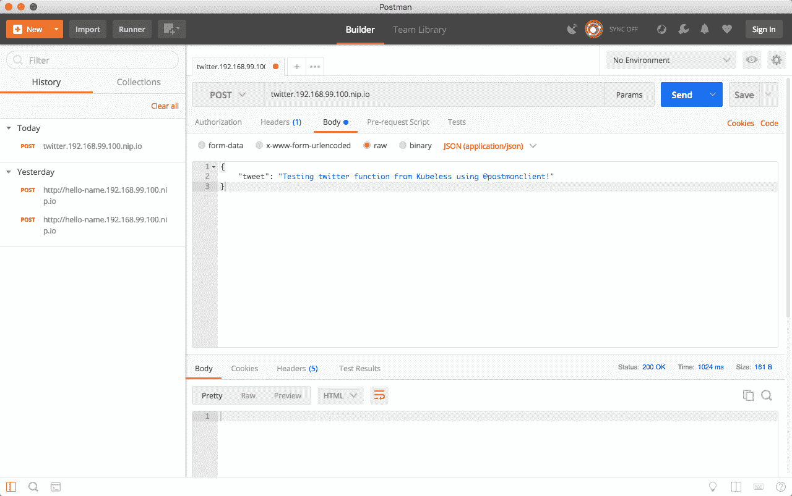

检查 Twitter 应该会显示第二条推文，这次提到了`@postmanclient`。您可以在以下 URL 查看我的两条测试推文：

+   命令行推文：[`twitter.com/mediaglasses/status/922036070954536960`](https://twitter.com/mediaglasses/status/922036070954536960)

+   Postman 推文：[`twitter.com/mediaglasses/status/922038490883346432`](https://twitter.com/mediaglasses/status/922038490883346432)

再次，在继续下一部分之前，我们应该删除我们的函数并整理一下：

```
$ kubeless function delete twitter
$ kubeless ingress delete twitter-ingress
$ kubectl delete secret twitter
```

另外，如果需要的话，你应该返回[`apps.twitter.com/`](https://apps.twitter.com/)并删除或撤销你的应用程序或令牌。

# Kubeless 无服务器插件

回到第一章，*无服务器景观*，我们安装了 Serverless 框架来部署 AWS Lambda 函数；无服务器也适用于 Kubeless。

如果你还没有安装无服务器，这里是如何在我们正在涵盖的三个操作系统上安装它的快速回顾。

尽管已经尽一切努力确保以下说明适用于所有支持的平台，但由于插件所需的一些依赖项的兼容性问题，Kubeless 无服务器插件在*基于 Windows 的*操作系统上的运行成功程度有所不同。

对于 macOS 10.13 High Sierra，运行以下命令使用 Homebrew 安装 Node.js：

```
$ brew install node
```

如果你正在使用 Windows 10 专业版，你可以通过运行 Chocolatey 来安装 Node.js：

```
$ choco install nodejs
```

最后，如果你使用的是 Ubuntu 17.04，你可以使用以下命令安装 Node.js：

```
$ curl -sL https://deb.nodesource.com/setup_8.x | sudo -E bash -
$ sudo apt-get install -y nodejs
```

现在最新版本的 Node.js 已安装，我们可以使用**Node Package Manager** (**NPM**)通过运行以下命令来安装无服务器：

```
$ npm install -g serverless
```

一旦无服务器安装完成，你可以使用以下命令登录：

```
$ serverless login
```

现在无服务器已安装，我们可以通过运行以下命令启动演示 Kubeless 函数：

```
$ serverless create --template kubeless-python --path new-project
$ cd new-project
$ npm install
```

如果你没有跟着做，运行这些命令会得到以下输出：

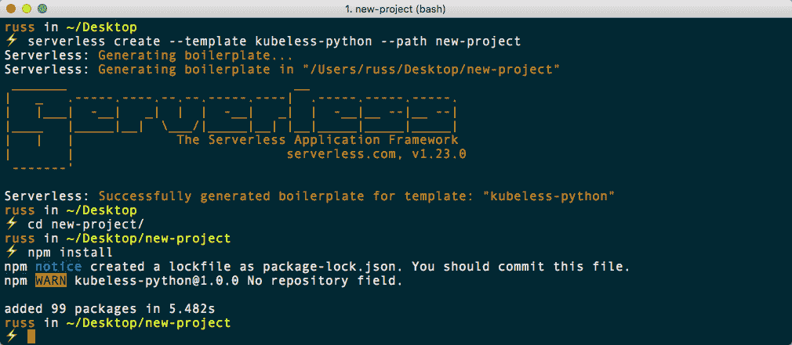

这安装了 Kubeless 无服务器插件并创建了定义我们函数的`serverless.yml`文件。其中包含以下内容：

```
service: new-project

provider:
  name: kubeless
  runtime: python2.7

plugins:
  - serverless-kubeless

functions:
  hello:
    handler: handler.hello
```

正如你所看到的，这段代码告诉无服务器我们正在使用 Kubeless，并且它应该使用 Kubeless 插件。它还定义了一个名为`hello`的函数和处理程序。该函数可以在`handler.py`文件中找到。这包含以下代码，与我们在本章前面看过的 hello-world 示例非常相似：

```
import json

def hello(request):
    body = {
        "message": "Go Serverless v1.0! Your function executed successfully!",
        "input": request.json
    }

    response = {
        "statusCode": 200,
        "body": json.dumps(body)
    }

    return response
```

现在我们有了示例函数，我们可以通过运行以下命令部署服务：

```
$ serverless deploy -v
```

服务部署完成后，最后一步是部署函数本身。要做到这一点，请运行：

```
$ serverless deploy function -f hello
```

使用无服务器本身来调用函数可能会导致以下错误，如果出现这种情况，不要担心：

```
$ serverless invoke --function hello --data '{"Kubeless": "Welcome!"}' -l
```

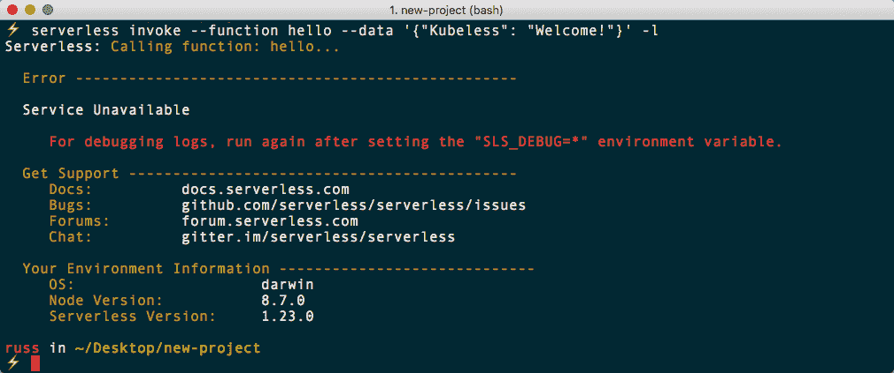

您仍然可以使用 Kubeless 访问该函数：

```
$ kubeless function list
$ kubeless function call hello --data '{"Kubeless": "Welcome!"}'
```

这将返回预期的结果：

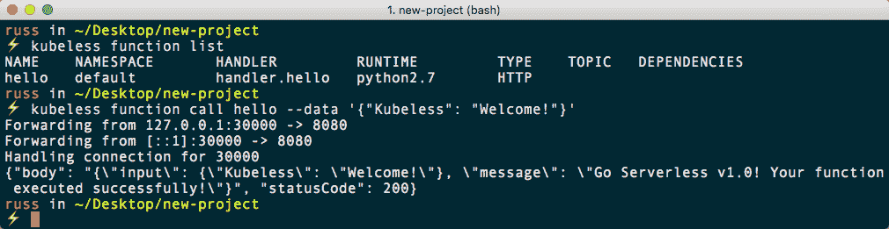

要删除示例函数，请运行以下命令：

```
$ serverless remove
```

在完成本章之前，让我们看一个使用事件而不是 HTTP 的示例。在 GitHub 存储库的`Chapter04/serverless-event/`文件夹中，有一个监听事件的示例应用程序。

`serverless.yml`文件与之前的 HTTP 示例不同，除了处理程序外，还添加了一个包含触发器/主题的事件部分：

```
service: events

provider:
  name: kubeless
  runtime: python2.7

plugins:
  - serverless-kubeless

functions:
  events:
    handler: handler.events
    events:
      - trigger: 'hello_topic'
```

`handler.py`文件可能包含迄今为止我们所看到的最简单的代码：

```
def events(context):
    return context
```

要启动示例，只需从`Chapter04/serverless-event/`文件夹中运行以下命令：

```
$ npm install
$ serverless deploy -v
$ kubeless function list
```

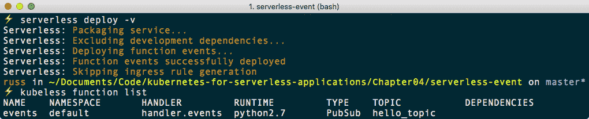

从前面的终端输出中可以看出，我们有一个`PubSub`类型和一个`hello_topic`主题。现在我们可以通过运行以下命令在`hello_topic`主题中发布事件：

```
$ kubeless topic publish --topic hello_topic --data 'testing an event!'
$ kubeless topic publish --topic hello_topic --data 'and another event!'
```

最后，我们可以通过运行日志来检查这两个事件是否已经被处理：

```
$ serverless logs -f events
```

从以下输出中可以看出，事件已成功发布并由我们的测试函数处理：

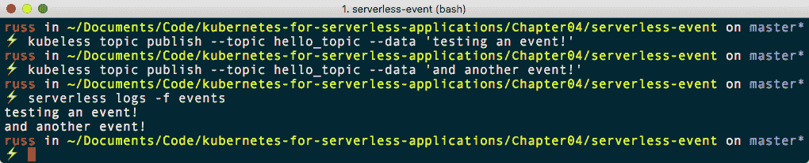

在进入下一章之前，我们可以通过运行以下命令删除我们的 Kubeless Kubernetes 单节点集群：

```
$ minikube delete
```

# 摘要

在本章中，我们已经将 Kubeless 部署到了我们使用 Minikube 启动的单节点 Kubernetes 上。我们安装了 Kubernetes 命令行客户端和基于 Web 的界面。一旦集群部署并安装了工具，我们就在 Kubeless 安装上部署和执行函数。

在安装一个更有用的发布推文的函数之前，我们先安装了两个基本的测试函数。然后，我们看了一下如何使用 Serverless 框架与 Kubeless 进行交互。

在下一章中，我们将看一下一个名为**Funktion**的基于事件的框架。
