# 使用 Funktion 进行无服务器应用程序

在我们继续在公共云中启动 Kubernetes 集群之前，我们将再看一个本地示例；这次我们将看一下 Funktion。我们将涵盖以下主题：

+   介绍 Funktion

+   安装和配置 Funktion

+   使用 Funktion 运行我们的第一个函数

+   Twitter 流

在我们开始安装和配置 Funktion 之前，我们应该花点时间讨论一下它的功能，因为它与本书中涵盖的其他框架有些不同。

# 介绍 Funktion

Funktion 的标语将其描述为基于事件的 Kubernetes Lambda 编程。从表面上看，Funktion 似乎与 Kubeless 和我们在前几章讨论过的其他无服务器框架非常接近。然而，它有自己的特色，使其与我们正在研究的其他框架有所不同。

我们正在研究的大多数无服务器函数都支持两种基本事件类型：

+   **HTTP**：这是通过标准 HTTP 请求将数据传递给框架的地方；通常数据将被发布为 JSON 对象

+   **订阅**：这是框架监听事件流中的主题的地方，例如，Kubeless 使用 Apache Kafka ([`kafka.apache.org/`](https://kafka.apache.org/))

Funktion 扩展了事件类型的数量 - 实际上，它支持大约 200 种不同类型的事件。这是一个相当大的飞跃！它使用 Apache Camel ([`camel.apache.org/`](https://camel.apache.org/)) 来实现这一点。Apache Camel 是一个开源的 Java 框架，作为开发人员的管道，允许他们摄取和发布数据。

为了让您了解 Apache Camel 和因此 Funktion 支持的一些事件流，以下是一些亮点：

+   AWS-SNS 支持与亚马逊的**简单通知服务**（**SNS**）一起使用

+   Braintree 允许与 Braintree 支付网关服务进行交互

+   etcd 允许您与 etcd 键值存储进行交互

+   Facebook 开放了完整的 Facebook API

+   GitHub 允许您监听来自 GitHub 的事件

+   Kafka - 像 Kubeless 一样，您可以订阅 Kafka 流

+   Twitter 让您能够监听标签、帖子等

还有许多其他服务，如 LinkedIn、Slack、各种 SQL 和 NoSQL 数据库、来自 AWS 的 S3 的文件服务、Dropbox 和 Box 等等。

所有这些选择使其与我们一直在研究和将要研究的其他框架相比，成为一个非常好的选择。

Funktion 部署由几个不同的组件组成。首先是一个**函数**；这就是代码本身，由 Kubernetes ConfigMap 管理。

单独的函数本身并不是很有用，因为它只存在于 ConfigMap 中。因此，我们需要一个**运行时**，一个在调用时执行函数的 Kubernetes 部署。当 Funktion 操作员（稍后会详细介绍）检测到添加了新函数时，将自动创建运行时。

接下来，我们有一个**连接器**；这是一个事件源的表示，就像我们在本节前面讨论的那些一样——它包含有关事件类型、配置（如 API 凭据）以及数据搜索参数的信息。

然后我们有**流程**；这是一系列步骤，可以从调用函数的连接器中消耗事件。

最后，我们有**Funktion**操作员。这是在 Kubernetes 中运行的一个 pod，监视构成我们的 Funktion 部署的所有组件，如函数、运行时、连接器和流程。它负责创建提供 Funktion 功能的 Kubernetes 服务。

Funktion 是开源的，根据 Apache 许可证 2.0 发布；它是由 fabric8 开发的，fabric8 是 Red Hat 的 JBoss 中间件平台的上游项目。fabric8 本身是一个基于 Docker、Kubernetes 和 Jenkins 的面向 Java 的微服务平台。它也与 Red Hat 自己的 OpenShift 平台很好地配合。

现在我们对 Funktion 与其他框架的区别有了一些背景了，我们可以看看如何在我们的单节点 Kubernetes 集群上安装它。

# 安装和配置 Funktion

使用 Funktion 有三个步骤。首先，我们需要安装命令行。这是大部分部署和管理我们的 Funktion 部署的命令将被输入的地方。一旦命令行客户端安装完成，我们可以使用 Minikube 启动我们的单节点 Kubernetes 集群，然后使用 Funktion CLI 引导我们的环境。

# 命令行客户端

与我们正在介绍的许多框架一样，Funktion 是用 Go 语言编写的。这意味着我们的三个平台都有独立的可执行文件。

然而，在撰写本文时，无论是在 macOS 上使用 Homebrew 还是在 Windows 10 专业版上使用 Chocolatey，都没有可用的安装程序，这意味着我们将在所有三个平台上进行手动安装。

可从 GitHub 项目的发布页面上获取可执行文件，网址为[`github.com/funktionio/funktion/releases/`](https://github.com/funktionio/funktion/releases/)。在撰写本文时，当前版本为 1.0.14，因此以下说明将涵盖该版本的安装；如果需要安装更新版本，请在以下命令中替换版本号。

让我们从如何在 macOS 上安装开始。

# macOS 10.13 High Sierra

在 macOS 上安装很简单，因为该项目已发布了未压缩的独立可执行文件。我们只需要下载正确的软件包并使其可执行。要做到这一点，请运行以下命令：

```
$ curl -L https://github.com/funktionio/funktion/releases/download/v1.0.14/funktion-darwin-amd64 > /usr/local/bin/funktion
$ chmod +x /usr/local/bin/funktion
```

现在，命令行工具已安装，我们可以通过运行以下命令来测试它：

```
$ funktion version
```

Funktion 版本将返回如下：

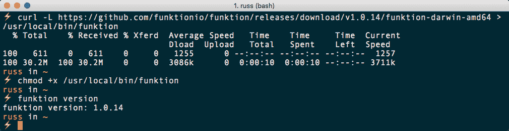

如您所见，虽然安装过程非常简单，但软件包不在 Homebrew 中可用也有一个缺点。如果在 Homebrew 中可用，那么更新到较新版本将更容易，因为 Homebrew 会在您运行时负责检查和安装升级：

```
$ brew update
$ brew upgrade
```

目前，如果需要升级，您将不得不删除当前版本并下载新版本来替换它。

# Windows 10 专业版

在 Windows 上安装 Funktion 命令行客户端的过程与 macOS 类似。首先，以管理员用户身份打开 PowerShell 窗口，方法是从任务栏中的 PowerShell 菜单中选择以管理员身份运行。一旦打开，您应该看到您在文件夹`C:\WINDOWS\system32`中；如果没有，请运行：

```
$ cd C:\WINDOWS\system32
```

一旦您在`C:\WINDOWS\system32`文件夹中，请运行以下命令：

```
$ Invoke-WebRequest -Uri https://github.com/funktionio/funktion/releases/download/v1.0.14/funktion-windows-amd64.exe -UseBasicParsing -OutFile funktion.exe
```

然后，您应该能够通过运行以下命令来检查已安装的 Funktion 命令行客户端的版本：

```
$ funktion version
```

Funktion 版本将返回如下：

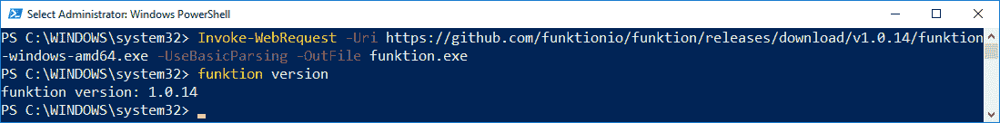

同样，由于我们没有使用软件包管理器来安装 Funktion，因此如果要升级，您将不得不删除旧的可执行文件，然后重复安装过程，并确保更新 URL 中的版本号以反映您所需的版本。

# Ubuntu 17.04

最后，我们有 Ubuntu 17.04。安装过程与我们为 macOS 执行的命令基本相同。但是，要确保我们下载正确的可执行文件，并且在`/usr/local/bin`文件夹的权限在操作系统之间略有不同时，我们还需要使用`sudo`命令：

```
$ sudo sh -c "curl -L https://github.com/funktionio/funktion/releases/download/v1.0.14/funktion-linux-amd64 > /usr/local/bin/funktion"
$ sudo chmod +x /usr/local/bin/funktion
```

下载并使其可执行后，您应该能够运行：

```
$ funktion version
```

你应该看到类似以下的内容：

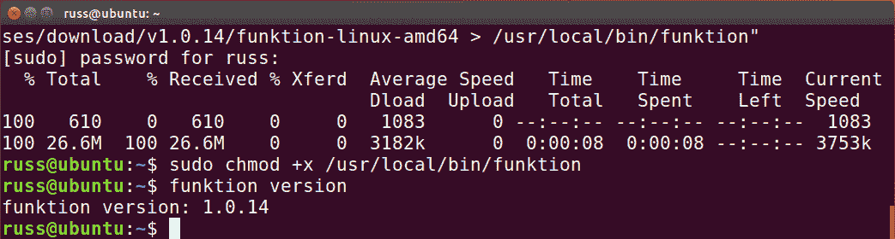

现在我们在三个操作系统上都安装了命令行客户端，我们可以继续部署。

# 启动单节点 Kubernetes 集群

你可能已经注意到，我们再次发现自己处于一个位置，现在可以在任何操作系统上使用相同的命令。这意味着本章剩余的命令将能够在我们的三个目标操作系统上运行。

在使用 Minikube 启动我们的单节点 Kubernetes 集群之前，可以通过运行以下命令检查是否有任何更新。macOS 10.13 High Sierra 用户可以运行：

```
$ brew update
$ brew upgrade
```

然后，要检查和更新 Minikube，请运行以下命令，从以下开始：

```
$ brew cask outdated
```

这将向您呈现可以更新的软件包列表。如果 Minikube 在列表中，请运行以下命令：

```
$ brew cask reinstall minikube
```

Windows 10 专业版用户可以运行：

```
$ choco upgrade all
```

Ubuntu 17.04 用户需要检查第三章中的发布页面详细信息，*在本地安装 Kubernetes*，删除旧的二进制文件，并使用更新的版本重复安装过程。

一旦您检查了 Minikube 的更新，可以通过运行以下命令启动您的集群：

```
$ minikube start
```

根据第三章，*在本地安装 Kubernetes*和第四章，*介绍 Kubeless 功能*，这将启动单节点 Kubernetes 集群，并配置您的本地 Kubernetes 客户端与其交互。如果您已经更新了 Minikube，您可能还会注意到下载并安装了一个更新版本的 Kubernetes：

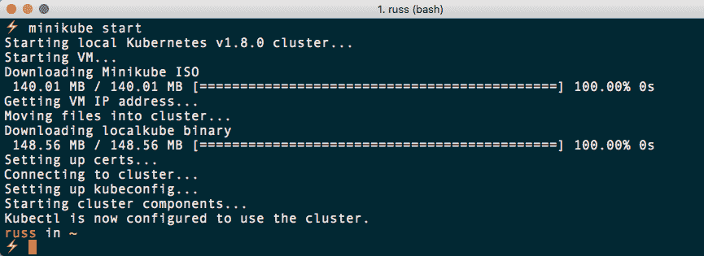

如果你已经升级了 Minikube，可以使用以下命令检查一切是否正常运行：

```
$ minikube status
$ kubectl get all
$ minikube dashboard
```

现在我们的单节点 Kubernetes 集群已经重新启动运行，Funktion 安装的最后阶段是引导部署。

# 引导 Funktion

安装 Funktion 非常简单，事实上，只需要一个命令：

```
$ funktion install platform
```

这将给出以下输出：

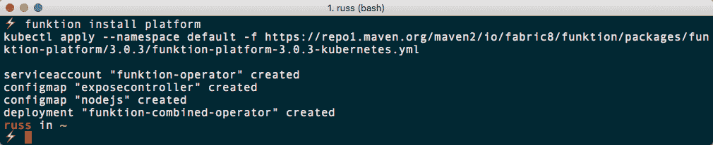

一两分钟后，您应该能够运行：

```
$ kubectl get pods
$ kubectl get deployments
```

上述命令将检查部署的状态：

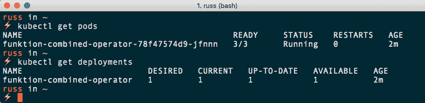

您还应该能够在 Kubernetes 仪表板中看到 Pods 和 Deployments：

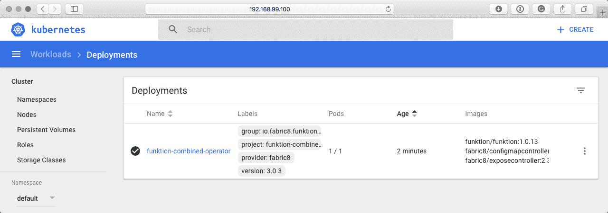

运行以下命令应该返回一个空列表：

```
$ funktion get function
```

这证明了 Funktion 命令行客户端可以连接到您新安装的 Funktion 部署并与其交互。

# 部署一个简单的函数

现在我们的 Funktion 部署已经运行起来了，我们可以看一下部署一个非常简单的 hello world 示例。在支持本书的 GitHub 存储库中的`/Chapter05/hello-world/src`文件夹中，您会找到一个名为`hello.js`的文件。这个文件包含以下代码：

```
module.exports = function(context, callback) {
  var name = context.request.query.name || context.request.body || "World";
  callback(200, "Hello " + name + "!!");
};
```

在`/Chapter05/hello-world/`文件夹中运行以下命令将使用上述代码创建我们的第一个函数：

```
$ funktion create fn -f src/hello.js
```

输出应该如下所示：


从终端输出中可以看出，这创建了一个名为`hello`的`function`。现在，我们运行以下命令：

```
$ funktion get function
```

这应该返回一些结果。从以下输出中可以看出，我们现在可以看到`NAME`，`PODS`和`URL`列出：

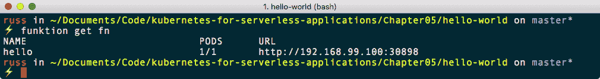

我们可以运行以下命令来仅返回函数的`URL`，或在浏览器中打开它：

```
$ funktion url fn hello
$ funktion url fn hello -o
```

您应该看到以下结果：

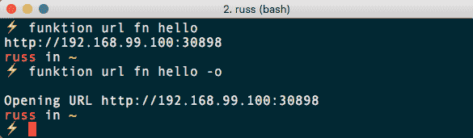

打开的浏览器窗口显示如下。我相信您会同意这不是最令人兴奋的页面：

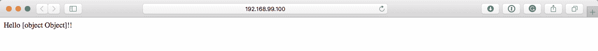

但它确实证明了我们的函数正在工作并显示内容。您可以通过运行以下命令来显示函数的日志：

```
$ funktion logs function hello
```

这将实时将日志内容流式传输到您的终端窗口。您可以通过刷新浏览器几次来查看，您应该看到您的页面请求与内部健康检查请求一起被记录。

现在我们已经创建了我们的第一个函数，我们可以安装一些连接器。要这样做，请运行以下命令：

```
$ funktion install connector http4 timer twitter
```

现在我们安装了一些连接器，我们可以创建一个流程。我们的第一个流程将使用定时器连接器：

```
$ funktion create flow timer://foo?period=5000 http://hello/
```

这将创建一个名为`foo`的流程，每`5000`毫秒执行一次，目标是我们称为`hello`的函数。要获取有关流程的信息，可以运行以下命令：

```
$ funktion get flow
```

您应该看到以下内容：

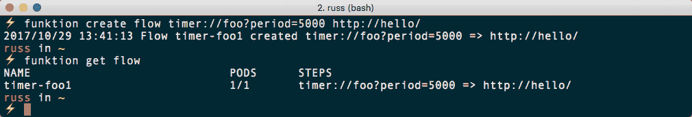

正如您所看到的，流程称为`timer-foo1`；我们在与其交互时需要使用此名称。例如，您可以通过运行以下命令来检查流程的日志：

```
$ funktion logs flow timer-foo1
```

或者在 Kubernetes 仪表板中，您可以找到名为`timer-foo1`的 pod，并在那里检查日志：

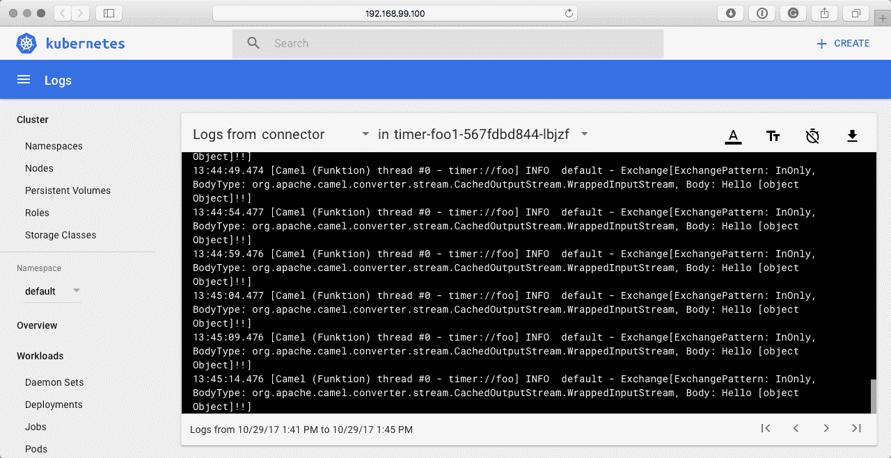

通过运行以下命令检查函数的日志：

```
$ funktion logs function hello
```

您应该看到每五秒有一个来自用户代理为`Apache-HttpClient/4.5.2`的客户端的页面请求。这是计时器流程：

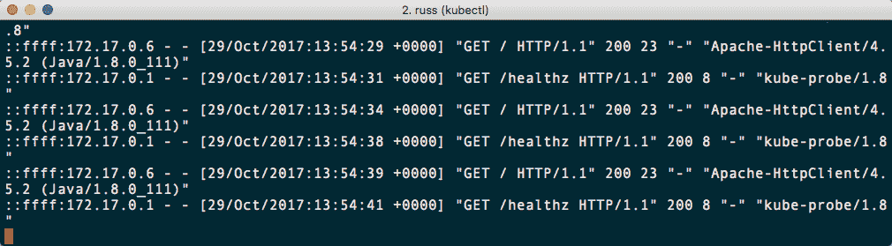

要删除流程，只需运行：

```
$ funktion delete flow timer-foo1
```

这将删除运行连接器的 pod，并且您的函数将停止接收自动请求。

返回 Kubernetes 仪表板，单击 Config Maps 应该显示 Funktion 创建的所有内容的列表。正如您所看到的，Funktion 的大部分部分都有一个 ConfigMap：

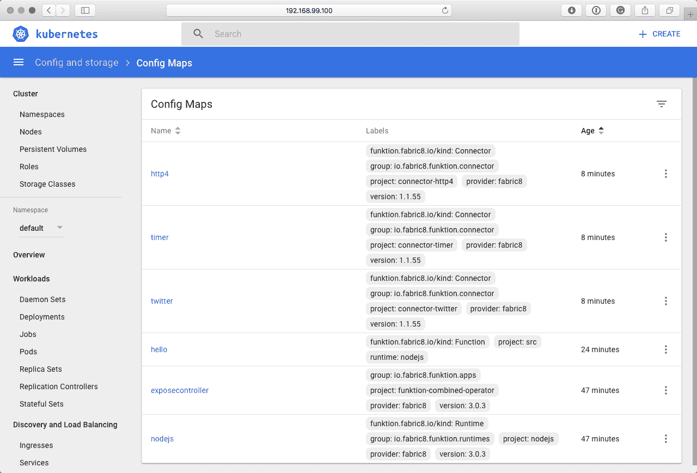

单击`hello`的 Config Maps 将显示类似以下页面的内容：

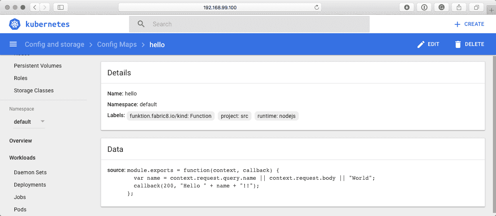

正如您所看到的，这包含了我们函数的代码，并且它已自动检测到它是用 Node.js 编写的，还有它是从`src`文件夹部署的。

在查看更高级示例之前，还有一件可能会让您感兴趣的事情，那就是与*Chrome Dev*工具的集成。要做到这一点，请运行以下命令：

```
$ funktion debug fn hello
```

这将在前台打开一个进程，并为您提供一个 URL 放入 Google Chrome 中：

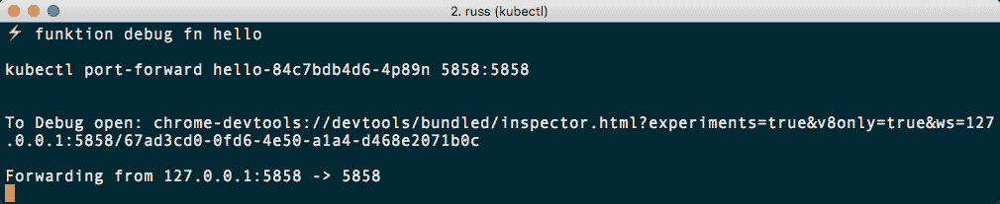

一旦您打开 Google Chrome 并指向您的函数，您可以执行诸如直接在浏览器中编辑代码之类的任务：

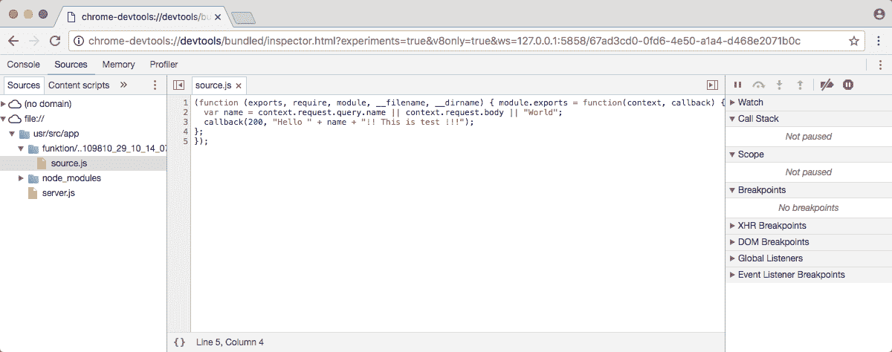使用 Chrome Dev 工具进行的任何更改都将直接在 pod 内进行，并且如果重新启动 pod，这些更改将不会持久保存；这应该纯粹用于测试。

要删除我们的`hello`函数，我们只需要运行：

```
$ funktion delete function hello
```

这应该让我们得到一个干净的安装，准备进行更高级的示例。

# Twitter 流

在上一节中我们安装了 Twitter 连接器，让我们看看如何配置它来拉取一些数据。首先，您可以通过运行以下命令查看连接器的所有可配置选项：

```
$ funktion edit connector twitter -l
```

你应该看到类似以下的终端输出：

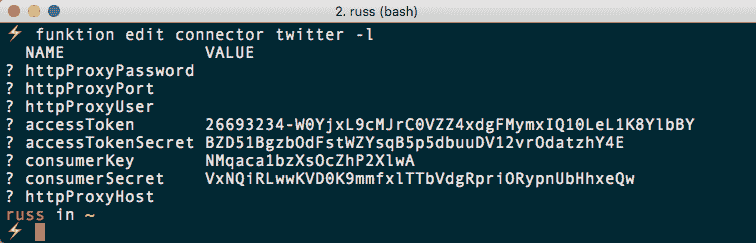

如您所见，您可以配置代理，并提供`accessToken`、`accessTokenSecret`、`consumerKey`和`consumerSecret`。您应该从上一章中获得这些信息。如果没有，那么请使用第四章中的说明重新生成它们，*介绍 Kubeless 功能*。

就像我将用来演示您需要运行的命令的令牌和密钥一样，前面截图中列出的详细信息是默认的虚拟占位符详细信息，不是有效的。

要使用您自己的详细信息更新连接器，请运行以下命令，并确保用您自己的详细信息替换它们：

```
$ funktion edit connector twitter \
 accessToken=1213091858-REJvMEEUeSoGA0WPKp7cv8BBTyTcDeRkHBr6Wpj \
 accessTokenSecret=WopER9tbSJtUtASEz62lI8HTCvhlYBvDHcuCIof5YzyGg \
 consumerKey=aKiWFB6Q7Ck5byHTWu3zHktDF \
 consumerSecret=uFPEszch9UuIlHt6nCxar8x1DSYqhWw8VELqp3pMPB571DwnDg
```

您应该收到连接器已更新的确认。现在，我们可以启动使用 Twitter 适配器的流程。为此，我们应该运行以下命令：

```
$ funktion create flow --name twitsearch "twitter://search?type=polling&keywords=kubernetes&delay=120s"
$ funktion get flows
```

我们将看到以下内容：

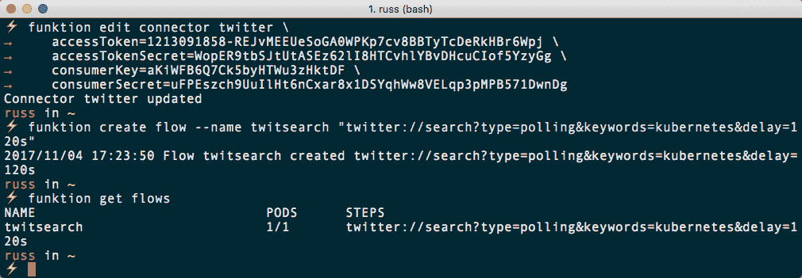

一旦您启动了 pod，您可以通过运行以下命令来检查日志：

```
$ funktion logs flow twitsearch
```

或者通过在仪表板中查看`twitsearch` pod 的日志：

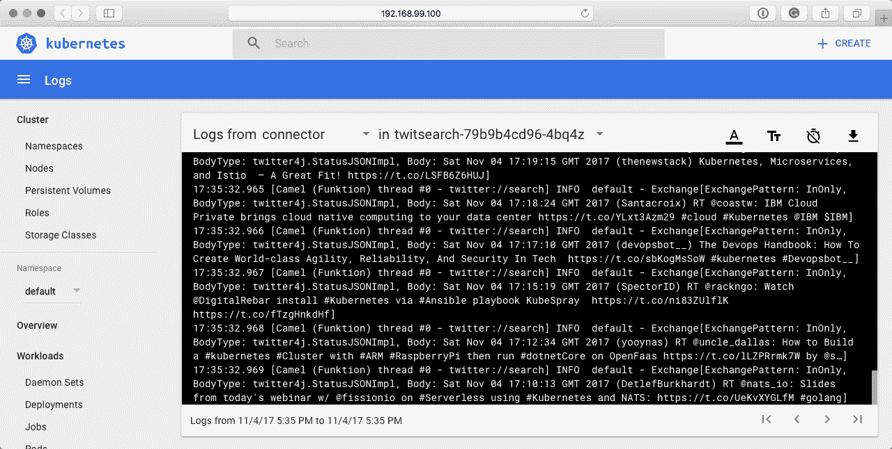

如您所见，Camel 正在打印包含单词 Kubernetes 的一系列推文。您的应用程序可以订阅此流，并对推文进行处理。最后，运行以下命令将删除流程：

```
$ funktion delete flow twitsearch
```

然后，您可以使用`minikube delete`命令删除您的 Minikube 机器。

# 总结

在本章中，我们简要介绍了 Funktion。我们安装了命令行客户端，然后将其安装在我们的单节点 Kubernetes 集群上。部署后，我们启动了一个测试函数，并与其交互，然后使用其中的一个事件流来搜索包含 Kubernetes 的推文。

Funktion 仍处于早期开发阶段，目前拥有一个小而活跃的社区，他们在项目的 GitHub 页面上做出贡献。因此，在撰写本文时，还没有太多利用 Funktion 支持的 Apache Camel 的许多流程的完整应用实例。如果您计划编写任何摄取数据然后处理数据的应用程序，我建议您密切关注 Funktion。

在下一章中，我们将讨论如何将我们的 Kubernetes 集群从本地单节点扩展到托管在公共云上的多节点集群。
