# 第六章：在云中安装 Kubernetes

到目前为止，我们一直在本地机器上运行 Kubernetes。这确实有一些缺点，其中之一是处理能力。我们将开始研究一些更复杂和强大的框架，因此我们需要一些额外的能力。因此，我们将尝试在几个不同的公共云上安装 Kubernetes，每次使用不同的工具：

+   在 DigitalOcean 上启动 Kubernetes

+   在 AWS 上启动 Kubernetes

+   在 Microsoft Azure 上启动 Kubernetes

+   在 Google 云平台上启动 Kubernetes

然后，我们将研究公共云提供商之间的差异，并尝试在其中一个平台上安装 Kubeless。

# 在 DigitalOcean 上启动 Kubernetes

我们将首先研究的公共云平台是 DigitalOcean。DigitalOcean 与我们将在接下来的章节中研究的三大云平台有所不同，因为它的功能较少。例如，在产品页面上，DigitalOcean 列出了八个功能，而 AWS 产品页面列出了十八个主要领域，每个领域又分为六个或更多的功能和服务。

不要因此而认为 DigitalOcean 比我们在本章中将要研究的其他公共云提供商差。

DigitalOcean 的优势在于它是一个非常简单易用的托管平台。通过其直观的 API 和命令行工具，支持服务和出色的管理界面，可以在不到一分钟内轻松启动功能强大但价格竞争力极强的虚拟机。

# 创建 Droplets

Droplets 是 DigitalOcean 对其计算资源的术语。对于我们的 Kubernetes，我们将启动三个 Ubuntu 17.04 Droplets，每个 Droplet 配备 1GB 的 RAM，1 个 CPU 和 30GB 的 SSD 存储。

在撰写本文时，这个由三个 Droplet 组成的集群每月大约需要花费 30 美元才能保持在线。如果您打算在需要时保持在线，那么这三个 Droplets 每小时的费用将是 0.045 美元。

在您创建任何 Droplets 之前，您需要一个帐户；您可以在[`cloud.digitalocean.com/registrations/new`](https://cloud.digitalocean.com/registrations/new)注册 DigitalOcean。注册后，在您进行任何其他操作之前，我建议您立即在您的帐户上启用双因素身份验证。您可以在帐户安全页面上启用此功能[`cloud.digitalocean.com/settings/security/`](https://cloud.digitalocean.com/settings/security/)。

启用双因素身份验证将为您提供额外的安全级别，并帮助保护您的帐户免受任何未经授权的访问以及意外费用的影响。毕竟，您不希望有人登录并使用您的帐户创建 25 个最昂贵的 Droplets，并由您来支付账单。

双因素身份验证通过向您的帐户引入第二级身份验证来工作；通常这是一个由应用程序（如 Google Authenticator）在您的移动设备上生成的四位或六位代码，或者是由您尝试登录的服务发送的短信。这意味着即使您的密码被泄露，攻击者仍然需要访问您的移动设备或号码。

接下来，我们需要生成一个 SSH 密钥并将其上传到 DigitalOcean。如果您已经有一个带有 SSH 密钥的帐户，可以跳过此任务。如果您没有密钥，请按照给定的说明操作。

如果您使用的是 macOS High Sierra 或 Ubuntu 17.04，则可以运行以下命令：

```
$ ssh-keygen -t rsa
```

这将要求您选择一个位置来存储您新生成的私钥和公钥，以及一个密码。密码是可选的，但如果您的 SSH 密钥的私有部分落入错误的手中，它确实会增加另一层安全性：

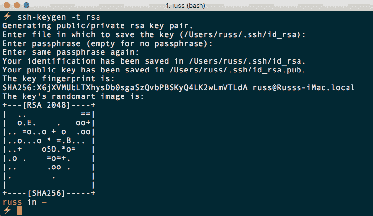

生成密钥后，您需要记下密钥的公共部分。为此，请运行以下命令，并确保更新密钥路径以匹配您自己的路径：

```
$ cat /Users/russ/.ssh/id_rsa.pub
```

您应该看到类似以下的内容：

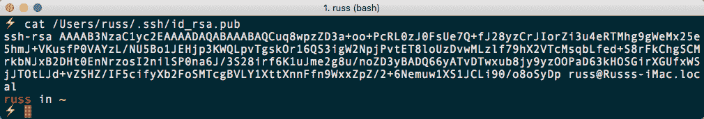请确保不要分享或发布您的 SSH 密钥的私有部分（文件名不包含`.pub`）。这用于对公钥的公共部分进行身份验证。如果这落入错误的手中，他们将能够访问您的服务器/服务。

对于 Windows 10 专业版用户来说，你很可能正在使用 PuTTY 作为你的 SSH 客户端。如果你没有 PuTTY，你可以通过运行以下命令来安装它：

```
$ choco install putty
```

一旦 PuTTY 安装完成，你可以通过运行以下命令打开 PuTTYgen 程序：

```
$ PUTTYGEN.exe
```

打开后，点击生成并按照提示在空白区域移动你的光标。一秒钟后，你应该会生成一个密钥：

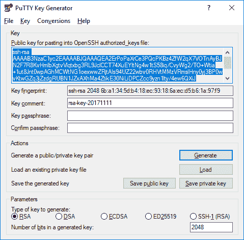

如前面的截图所示，你可以选择添加一个密码，这将用于解锁你的密钥的私有部分；再次强调，这是可选的。

点击保存公钥，也保存私钥，并记下公钥的内容。

现在你有了你的公钥，我们需要让 DigitalOcean 拥有一份副本。为此，转到安全页面，你可以在[`cloud.digitalocean.com/settings/security/`](https://cloud.digitalocean.com/settings/security/)找到它，然后点击添加 SSH 密钥。这将弹出一个对话框，要求你提供你的公钥内容并命名它。填写两个表单字段，然后点击添加 SSH 密钥按钮。

现在你已经为你的账户分配了一个 SSH 密钥，你可以使用它来创建你的 Droplets，并且无需密码即可访问它们。要创建你的 Droplets，点击屏幕右上角的创建按钮，然后从下拉菜单中选择 Droplets。

在 Droplet 创建页面上有几个选项：

+   选择一个镜像：选择 Ubuntu 16.04 镜像

+   选择一个大小：选择每月 10 美元的选项，其中包括 1GB、1CPU 和 30GB SSD

+   添加块存储：保持不变

+   选择数据中心区域：选择离你最近的区域；我选择了伦敦，因为我在英国

+   选择附加选项：选择私人网络连接。

+   添加你的 SSH 密钥：选择你的 SSH 密钥

+   完成并创建：将 Droplets 的数量增加到`3`，现在保持主机名不变

填写完前面的部分后，点击页面底部的创建按钮。这将启动你的三个 Droplets，并向你反馈它们创建过程的进度。一旦它们启动，你应该会看到类似以下页面的内容：

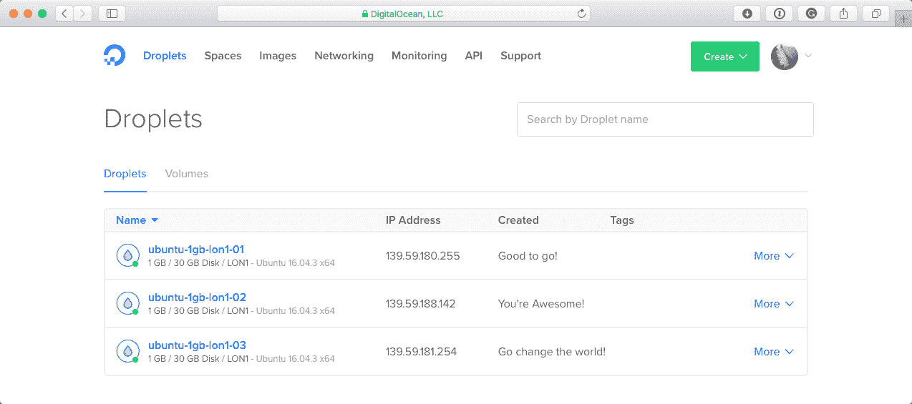

如你所见，我有三个 Droplets，它们的 IP 地址，还有一条很好的激励性信息。现在我们可以开始使用`kubeadm`部署我们的 Kubernetes 集群。

# 使用 kubeadm 部署 Kubernetes

首先，我们需要登录到我们的三个 Droplets 中的一个；我们登录的第一台机器将是我们的 Kubernetes 主节点。

```
$ ssh root@139.59.180.255
```

登录后，以下两个命令检查软件包是否有更新并应用它们：

```
$ apt-get update
$ apt-get upgrade
```

现在我们已经是最新的了，我们可以安装先决条件软件包。要做到这一点，请运行以下命令：

```
$ apt-get install docker.io curl apt-transport-https
```

您可能会注意到，我们使用的是作为核心 Ubuntu 16.04 软件包存储库的一部分分发的 Docker 版本，而不是官方的 Docker 发布版。这是因为`kubeadm`不支持更新版本的 Docker，并且推荐的版本是 1.12。目前，Ubuntu 16.04 支持的 Docker 版本是 1.12.6。

现在我们已经安装了先决条件，我们可以通过运行以下命令来添加 Kubernetes 存储库：

```
$ curl -s https://packages.cloud.google.com/apt/doc/apt-key.gpg | apt-key add -
$ cat <<EOF >/etc/apt/sources.list.d/kubernetes.list
deb http://apt.kubernetes.io/ kubernetes-xenial main
EOF
```

`curl`命令为存储库添加了 GPG 密钥，`cat`命令创建了存储库文件。现在存储库已经就位，我们需要通过运行以下命令更新我们的软件包列表并安装`kubeadm`、`kubelet`和`kubectl`：

```
$ apt-get update
$ apt-get install kubelet kubeadm kubectl
```

安装完成后，您可以通过运行以下命令来检查已安装的`kubeadm`的版本：

```
$ kubeadm version
```

现在我们已经安装了所需的一切，我们可以通过运行以下命令来引导我们的 Kubernetes 主节点：

```
$ kubeadm init
```

这将需要几分钟的时间运行，并且您将得到一些非常冗长的输出，让您知道`kubeadm`已经完成了哪些任务：

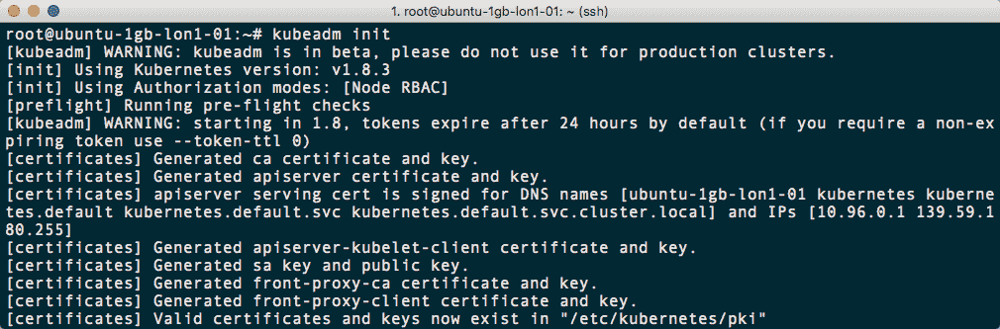

完成后，您应该看到以下消息，但是带有您的令牌等：

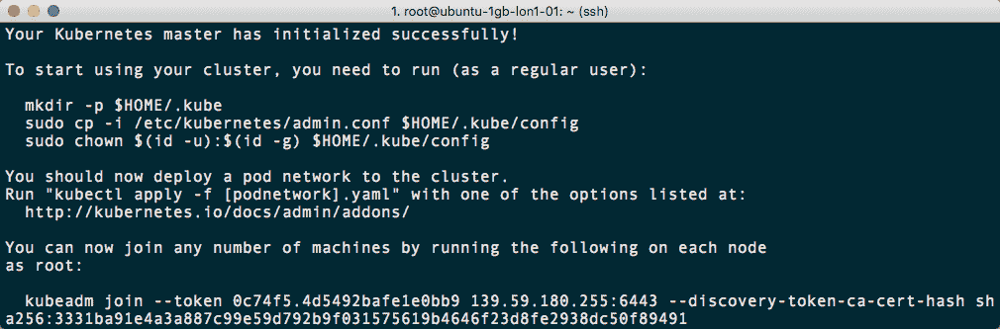

记下底部的`kubeadm join`命令，我们很快会看到它。我们应该运行消息中提到的命令：

```
$ mkdir -p $HOME/.kube
$ sudo cp -i /etc/kubernetes/admin.conf $HOME/.kube/config
$ sudo chown $(id -u):$(id -g) $HOME/.kube/config
```

接下来，我们需要启用 Pod 网络。您可以选择几种选项，所有这些选项都为您的 Kubernetes 集群提供了多主机容器网络：

+   Calico: [`www.projectcalico.org/`](https://www.projectcalico.org/)

+   Canal: [`github.com/projectcalico/canal`](https://github.com/projectcalico/canal)

+   flannel: [`coreos.com/flannel/docs/latest/`](https://coreos.com/flannel/docs/latest/)

+   Kube-router: [`github.com/cloudnativelabs/kube-router/`](https://github.com/cloudnativelabs/kube-router/)

+   Romana: [`github.com/romana/romana/`](https://github.com/romana/romana/)

+   Weave Net: [`www.weave.works/oss/net/`](https://www.weave.works/oss/net/)

对于我们的安装，我们将使用 Weave Net。要安装它，只需运行以下命令：

```
$ export kubever=$(kubectl version | base64 | tr -d '\n')
$ kubectl apply -f "https://cloud.weave.works/k8s/net?k8s-version=$kubever"
```

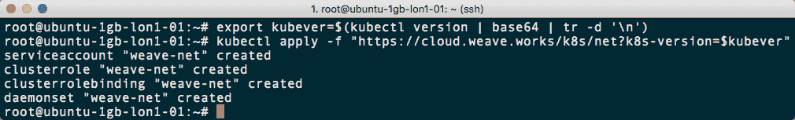

如您所见，这使用了`kubectl`命令来部署 pod 网络。这意味着我们的基本 Kubernetes 集群已经运行起来了，尽管只在单个节点上。

为了准备其他两个集群节点，打开两者的 SSH 会话，并在两者上运行以下命令：

```
$ apt-get update
$ apt-get upgrade
$ apt-get install docker.io curl apt-transport-https
$ curl -s https://packages.cloud.google.com/apt/doc/apt-key.gpg | apt-key add -
$ cat <<EOF >/etc/apt/sources.list.d/kubernetes.list
deb http://apt.kubernetes.io/ kubernetes-xenial main
EOF
$ apt-get update
$ apt-get install kubelet kubeadm kubectl
```

如您所见，这些是我们在主节点上执行的确切一组命令，使我们能够执行`kubeadm`命令的命令。您可能已经猜到，我们将运行我们初始化主节点时收到的`kubeadm join`命令，而不是运行`kubeadm init`。对我来说，该命令如下：

```
$ kubeadm join --token 0c74f5.4d5492bafe1e0bb9 139.59.180.255:6443 --discovery-token-ca-cert-hash sha256:3331ba91e4a3a887c99e59d792b9f031575619b4646f23d8fe2938dc50f89491
```

您需要运行收到的命令，因为令牌将绑定到您的主节点。在两个节点上运行该命令，您应该会看到类似以下终端输出的内容：

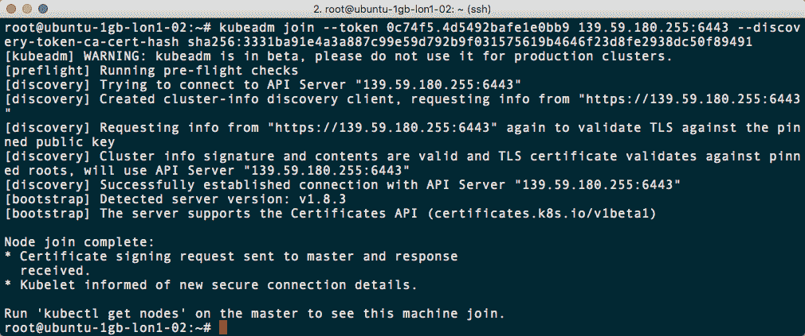

一旦您在剩余的两个节点上运行了该命令，请返回到您的主节点并运行以下命令：

```
$ kubectl get nodes
```

这应该返回您的 Kubernetes 集群中的节点列表：

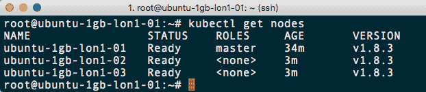

如您所见，我们有一个由三个 Droplets 组成的集群。唯一的缺点是，目前我们必须登录到我们的主节点才能与我们的集群交互。幸运的是，这很容易解决，我们只需要下载集群`admin.conf`文件的副本。

要在 macOS High Sierra 或 Ubuntu 17.04 上执行此操作，请运行以下命令，确保将 IP 地址替换为您的主节点的 IP 地址：

```
$ scp root@139.59.180.255:/etc/kubernetes/admin.conf 
```

如果您使用的是 Windows 10 专业版，您将需要使用诸如 WinSCP 之类的程序。要安装它，请运行以下命令：

```
$ choco install winscp
```

安装后，通过输入`WINSCP.exe`来启动它，然后按照屏幕提示连接到您的主节点并下载`admin.conf`文件，该文件位于`/etc/kubernetes/`中。

一旦您有了`admin.conf`文件的副本，您就可以在本地运行以下命令来查看您的三节点 Kubernetes 集群：

```
$ kubectl --kubeconfig ./admin.conf get nodes
```

一旦我们确认可以使用本地的`kubectl`副本连接，我们应该将配置文件放在适当的位置，这样我们就不必每次使用`--kubeconfig`标志。要做到这一点，请运行以下命令（仅适用于 macOS 和 Ubuntu）：

```
$ mv ~/.kube/config ~/.kube/config.mini
$mv admin.conf ~/.kube/config
```

现在运行以下命令：

```
$ kubectl get nodes
```

这应该显示您的三个 Droplets：

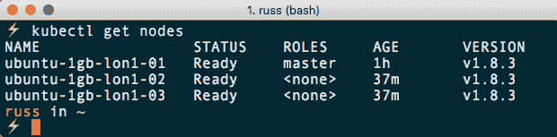

# 删除集群

要删除集群，只需登录到您的 DigitalOcean 控制面板，然后单击每个 Droplet 右侧的更多下拉菜单中的销毁链接。然后按照屏幕上的说明进行操作。确保销毁所有三个 Droplets，因为它们在线时会产生费用。

这是在低规格服务器上手动部署 Kubernetes。在接下来的几节中，我们将看看如何在其他公共云中部署 Kubernetes，首先是 AWS。

# 在 AWS 中启动 Kubernetes

我们可以使用几种工具在 AWS 上启动 Kubernetes 集群；我们将介绍一个叫做`kube-aws`的工具。不幸的是，`kube-aws`不支持基于 Windows 的机器，因此以下说明只适用于 macOS High Sierra 和 Ubuntu 17.04。

`kube-aws`是一个命令行工具，用于生成 AWS CloudFormation 模板，然后用于启动和管理 CoreOS 集群。然后将 Kubernetes 部署到 CoreOS 实例的集群中。

AWS CloudFormation 是亚马逊的本地脚本工具，允许您以编程方式启动 AWS 服务；它几乎涵盖了所有 AWS API。CoreOS 是一个专注于运行容器的操作系统。它的占用空间极小，并且设计为可以在云提供商上直接进行集群和配置。

# 设置

在第一章中，*无服务器景观*，我们看了一下创建 Lambda 函数。为了配置这个，我们安装了 AWS CLI。我假设您仍然配置了这个，并且您配置的 IAM 用户具有管理员权限。您可以通过运行以下命令来测试：

```
$ aws ec2 describe-instances
```

这应该返回类似以下内容：

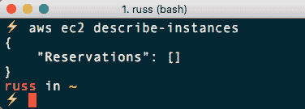

我们需要将我们的 SSH 密钥导入 AWS。要做到这一点，打开 AWS 控制台（[`console.aws.amazon.com/`](https://console.aws.amazon.com/)）。登录后，从页面顶部的服务菜单中选择 EC2。一旦您进入 EC2 页面，请确保使用页面右上角的区域下拉菜单选择了正确的区域。我将使用欧盟（爱尔兰）,也就是 eu-west-1。

现在我们在正确的区域，点击密钥对选项，在左侧菜单的 NETWORK & SECURITY 部分下可以找到。页面加载后，点击导入密钥对按钮，然后像 DigitalOcean 一样，输入您的密钥对的名称，并在其中输入您的`id_rsa.pub`文件的内容。

接下来，我们需要一个 AWS KMS 存储。要创建这个，运行以下命令，确保根据需要更新您的区域：

```
$ aws kms --region=eu-west-1 create-key --description="kube-aws assets"
```

这将返回几个信息，包括一个 Amazon 资源名称（ARN）。记下这个信息以及`KeyId`：

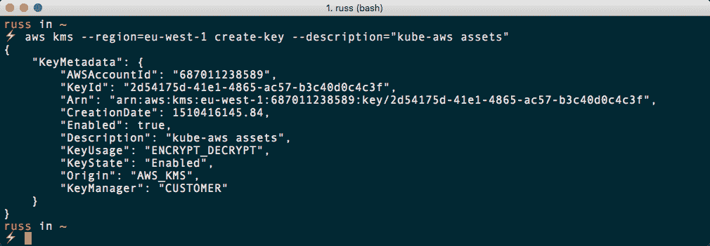

接下来，我们需要一个 Amazon S3 存储桶。使用 AWS CLI 运行以下命令来创建一个，确保更新区域，并且使存储桶名称对您来说是唯一的：

```
$ aws s3api --region=eu-west-1 create-bucket --bucket kube-aws-russ --create-bucket-configuration LocationConstraint=eu-west-1
```

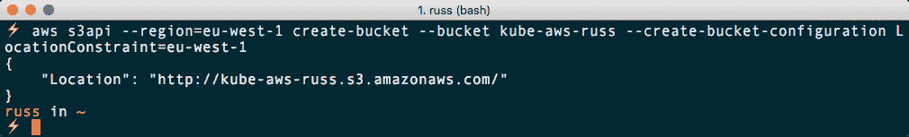

现在我们已经导入了我们的公共 SSH 密钥，有了 KMS ARN 和一个 S3 存储桶，我们只需要决定集群的 DNS 名称。

我将使用`kube.mckendrick.io`，因为我已经在 Amazon Route 53 DNS 服务上托管了`mckendrick.io`。您应该选择一个可以在其上配置 CNAME 的域或子域，或者一个托管在 Route 53 上的域。

现在我们已经掌握了基础知识，我们需要安装`kube-aws`二进制文件。要做到这一点，如果您正在运行 macOS High Sierra，您只需要运行以下命令：

```
$ brew install kube-aws
```

如果您正在运行 Ubuntu Linux 17.04，您应该运行以下命令：

```
$ cd /tmp
$ wget https://github.com/kubernetes-incubator/kube-aws/releases/download/v0.9.8/kube-aws-linux-amd64.tar.gz
$ tar zxvf kube-aws-linux-amd64.tar.gz
$ sudo mv linux-amd64/kube-aws /usr/local/bin
$ sudo chmod 755 /usr/local/bin/kube-aws
```

安装完成后，运行以下命令确认一切正常：

```
$ kube-aws version
```

在撰写本文时，当前版本为 0.9.8。您可以在发布页面上检查更新版本：[`github.com/kubernetes-incubator/kube-aws/releases/`](https://github.com/kubernetes-incubator/kube-aws/releases/)。

# 使用 kube-aws 启动集群

在我们开始创建集群配置之前，我们需要创建一个工作目录，因为将会创建一些工件。让我们创建一个名为`kube-aws-cluster`的文件夹并切换到它：

```
$ mkdir kube-aws-cluster
$ cd kube-aws-cluster
```

现在我们在我们的工作目录中，我们可以创建我们的集群配置文件。要做到这一点，运行以下命令，确保用之前部分收集的信息替换值：

如果您没有使用 Route 53 托管的域，删除`--hosted-zone-id`标志。

```
kube-aws init \
 --cluster-name=kube-aws-cluster \
 --external-dns-name=kube.mckendrick.io \
 --hosted-zone-id=Z2WSA56Y5ICKTT \
 --region=eu-west-1 \
 --availability-zone=eu-west-1a \
 --key-name=russ \
 --kms-key-arn="arn:aws:kms:eu-west-1:687011238589:key/2d54175d-41e1-4865-ac57-b3c40d0c4c3f"
```

这将创建一个名为`cluster.yaml`的文件，这将是我们配置的基础：

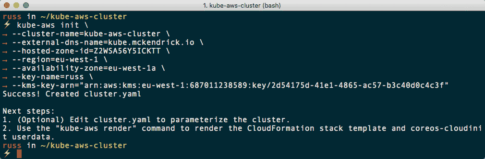

接下来，我们需要创建将被我们的 Kubernetes 集群使用的证书。要做到这一点，请运行以下命令：

```
$ kube-aws render credentials --generate-ca
```

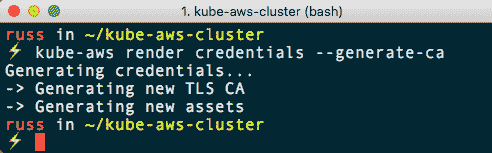

接下来，我们需要生成 AWS CloudFormation 模板。要做到这一点，请运行以下命令：

```
$ kube-aws render stack
```

这将在名为`stack-templates`的文件夹中创建模板：

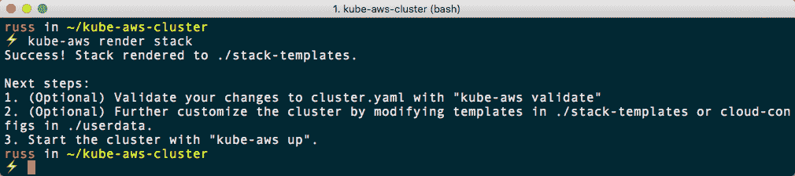

在您的工作目录中运行`ls`应该会显示已创建的几个文件和文件夹：

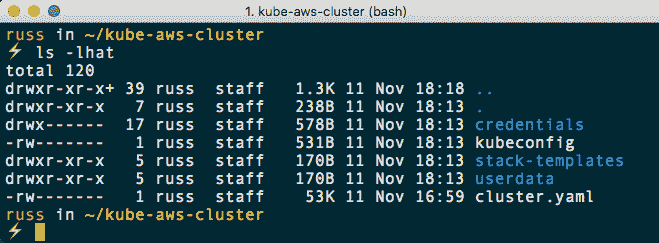

最后，我们可以运行以下命令来验证并上传文件到我们的 S3 存储桶，记得用您自己的存储桶名称更新命令：

```
$ kube-aws validate --s3-uri s3://kube-aws-russ/kube-aws-cluster
```

现在我们可以启动我们的集群。要做到这一点，只需运行以下命令，确保您更新存储桶名称：

```
$ kube-aws up --s3-uri s3://kube-aws-russ/kube-aws-cluster
```

这将开始使用 AWS CloudFormation 工具启动我们的集群：

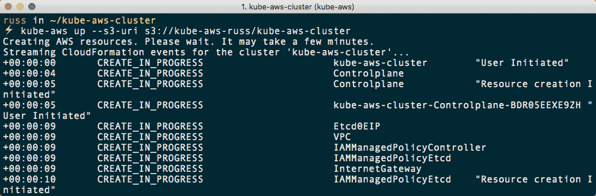

这个过程将需要几分钟；您可以在 AWS 控制台的命令行上查看其进度。要在控制台中查看它，请转到服务菜单并选择 CloudFormation。一旦打开，您应该会看到列出的一些堆栈；选择其中一个，然后单击事件选项卡：

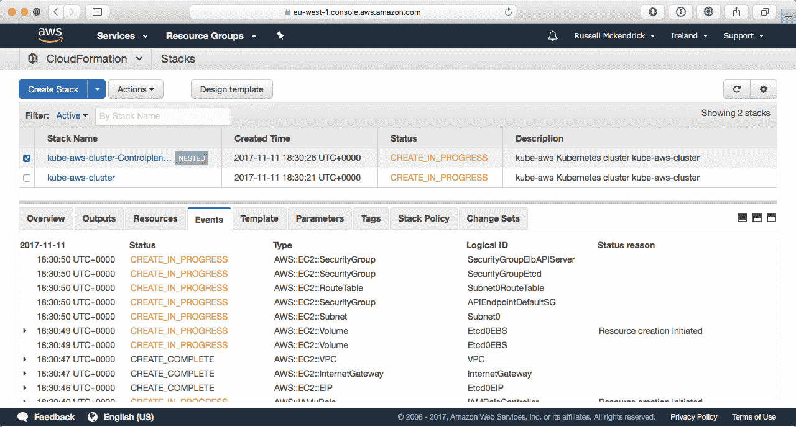

从事件和资源选项卡中可以看出，后台有很多事情正在进行。有：IAM 角色、VPC 和网络、EC2 实例、负载均衡器、DNS 更新、自动缩放组等正在创建。

一旦完成，您应该会看到三个 CloudFormation 堆栈，一个主要的称为`kube-aws-cluster`，另外两个嵌套堆栈，一个称为`kube-aws-cluster-Controlplane`，另一个称为`kube-aws-cluster-Nodepool1`。两个嵌套堆栈都将在其名称后附加一个唯一的 ID。您将在命令行上收到集群已启动的确认：

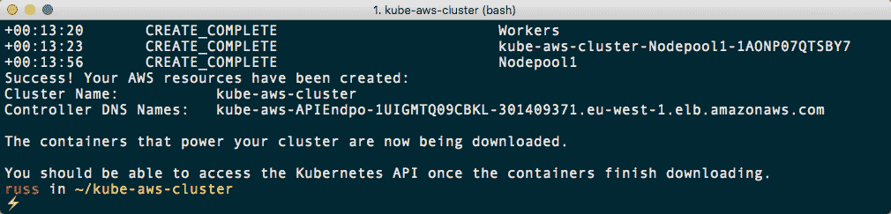

在我们的工作目录中运行以下命令将列出 AWS Kubernetes 集群中的节点：

```
$ kubectl --kubeconfig=kubeconfig get nodes
```

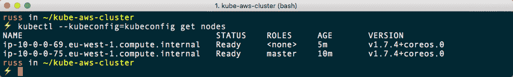

# Sock Shop

要测试我们的部署，我们可以启动 Sock Shop。这是由 Weave 编写的演示微服务应用程序。您可以在以下项目页面找到它：[`microservices-demo.github.io/`](https://microservices-demo.github.io/)。

要启动商店，我们需要从工作目录中运行以下命令：

```
$ kubectl --kubeconfig=kubeconfig create namespace sock-shop
$ kubectl --kubeconfig=kubeconfig apply -n sock-shop -f "https://github.com/microservices-demo/microservices-demo/blob/master/deploy/kubernetes/complete-demo.yaml?raw=true"
```

启动需要几分钟的时间；您可以通过运行以下命令来检查进度：

```
$ kubectl --kubeconfig=kubeconfig -n sock-shop get pods
```

等待每个 pod 获得运行状态，如下截图所示：

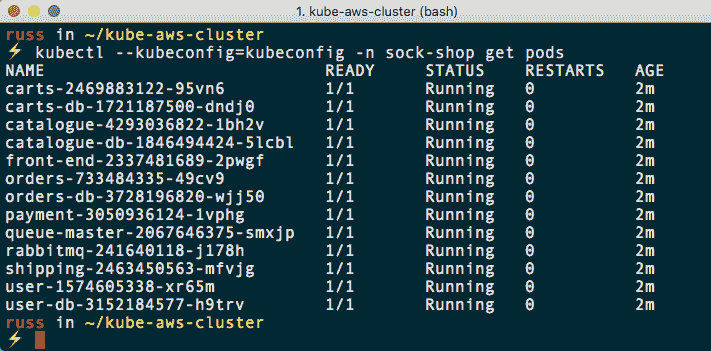

然后，我们应该能够访问我们的应用程序。要做到这一点，我们需要将其暴露给互联网。由于我们的集群在 AWS 中，我们可以使用以下命令启动一个弹性负载均衡器，并让它指向我们的应用程序：

```
$ kubectl --kubeconfig=kubeconfig -n sock-shop expose deployment front-end --type=LoadBalancer --name=front-end-lb
```

要获取有关我们的负载均衡器的信息，我们可以运行以下命令：

```
$ kubectl --kubeconfig=kubeconfig -n sock-shop get services front-end-lb
```

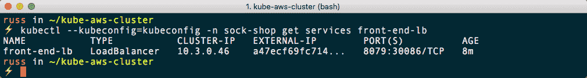

正如您所见，应用程序正在端口`8079`上暴露，但我们无法完全看到弹性负载均衡器的 URL。要获得这个，我们可以运行以下命令：

```
$ kubectl --kubeconfig=kubeconfig -n sock-shop describe services front-end-lb
```

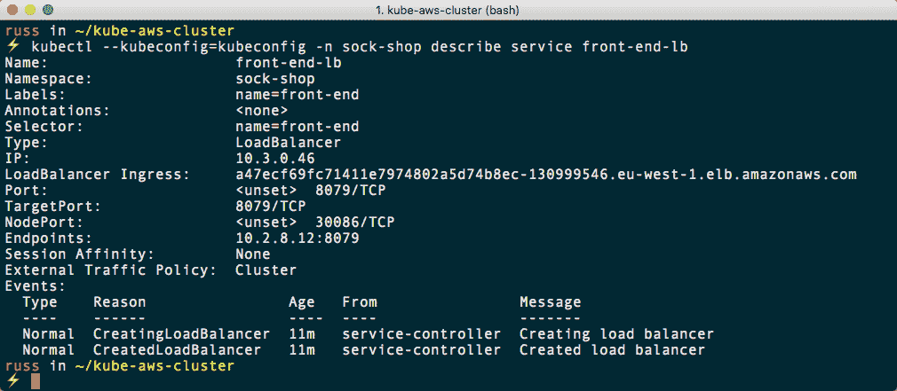

现在我们知道了弹性负载均衡器的 URL，我们可以将其输入到浏览器中，以及端口。对我来说，完整的 URL 是`http://a47ecf69fc71411e7974802a5d74b8ec-130999546.eu-west-1.elb.amazonaws.com:8079/`（此 URL 已不再有效）。

输入您的 URL 应该显示以下页面：

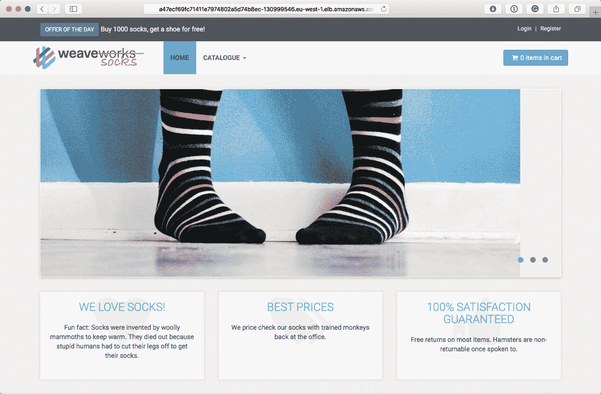

要删除 Sock Shop 应用程序，只需运行：

```
$ kubectl --kubeconfig=kubeconfig delete namespace sock-shop
```

这将删除我们创建的所有 pod、服务和弹性负载均衡器。

# 删除集群

让我们不要忘记，当集群正在运行时，它会花费我们的钱。要删除集群和 CloudFormation 脚本创建的所有服务，请运行以下命令：

```
$ kube-aws destroy
```

您将收到确认，CloudFormation 堆栈正在被移除，并且这将需要几分钟的时间。我建议您在 AWS 控制台上的 CloudFormation 页面上进行双重检查，以确保在移除堆栈过程中没有出现任何错误，因为任何仍在运行的资源可能会产生费用。

我们还需要删除我们创建的 S3 存储桶和 KMS；要做到这一点，请运行以下命令：

```
$ aws s3 rb s3://kube-aws-russ --force
$ aws kms --region=eu-west-1 disable-key --key-id 2d54175d-41e1-4865-ac57-b3c40d0c4c3f
```

您可以从您在本节早期创建 KMS 时所做的备注中找到`--key-id`。

虽然这次我们不必手动配置我们的集群，或者实际上登录到任何服务器，但启动我们的集群的过程仍然是非常手动的。对于我们的下一个公共云提供商 Microsoft Azure，我们将会看到更本地的部署。

# 在 Microsoft Azure 中启动 Kubernetes

在第一章中，《无服务器景观》，我们看了微软 Azure Functions；然而，我们没有进展到比 Azure web 界面更多的地方来启动我们的 Function。要使用**Azure 容器服务**（**AKS**），我们需要安装 Azure 命令行客户端。

值得一提的是，AKS 目前不支持 Windows 10 PowerShell Azure 工具。但是，如果您使用 Windows，不用担心，因为命令行客户端的 Linux 版本可以通过 Azure web 界面获得。

# 准备 Azure 命令行工具

Azure 命令行工具可以通过 macOS High Sierra 上的 Homebrew 获得，这样安装就像运行以下两个命令一样简单：

```
$ brew update
$ brew install azure-cli
```

Ubuntu 17.04 用户可以运行以下命令：

```
$ echo "deb [arch=amd64] https://packages.microsoft.com/repos/azure-cli/ wheezy main" | sudo tee /etc/apt/sources.list.d/azure-cli.list
$ sudo apt-key adv --keyserver packages.microsoft.com --recv-keys 52E16F86FEE04B979B07E28DB02C46DF417A0893
$ sudo apt-get install apt-transport-https
$ sudo apt-get update && sudo apt-get install azure-cli
```

安装完成后，您需要登录您的账户。要做到这一点，运行以下命令：

```
$ az login
```

当您运行该命令时，您将获得一个 URL，即[`aka.ms/devicelogin`](https://aka.ms/devicelogin)，[还有一个要输入的代码。在浏览器中打开 URL 并输入代码：](https://aka.ms/devicelogin)

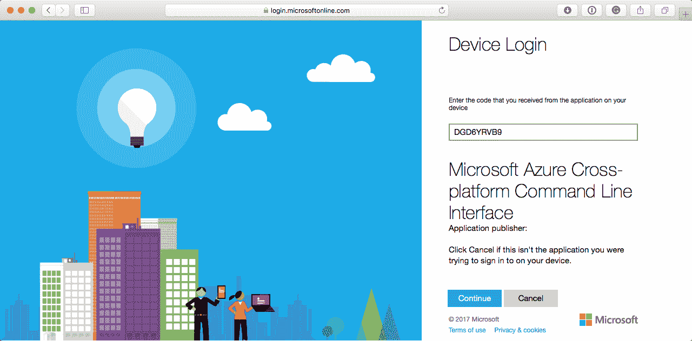

登录后，关闭浏览器窗口并返回到命令行，在几秒钟后，您将收到确认消息，说明您已经以您在浏览器中登录的用户身份登录。您可以通过运行以下命令来再次检查：

```
$ az account show
```

如前所述，Windows 用户可以使用 Azure web 界面访问他们自己的 bash shell。要做到这一点，登录并点击顶部菜单栏中的>_ 图标，选择 bash shell，然后按照屏幕提示操作。在设置结束时，您应该看到类似以下内容：

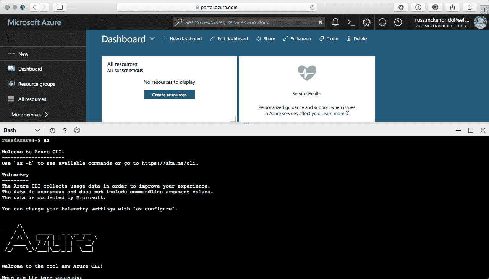

现在我们已经安装并连接到我们的账户的命令行工具，我们可以启动我们的 Kubernetes 集群。

# 启动 AKS 集群

首先，我们需要注册 AKS 服务。要做到这一点，运行以下命令：

```
$ az provider register -n Microsoft.ContainerService
```

注册需要几分钟的时间。您可以通过运行以下命令来检查注册的状态：

```
$ az provider show -n Microsoft.ContainerService
```

一旦看到`registrationState`为`Registered`，您就可以开始了。要启动集群，我们首先需要创建一个资源组，然后创建集群。目前，AKS 在`ukwest`或`westus2`都可用：

```
$ az group create --name KubeResourceGroup --location ukwest
$ az aks create --resource-group KubeResourceGroup --name AzureKubeCluster --agent-count 1 --generate-ssh-keys
```

一旦您的集群启动，您可以运行以下命令配置您的本地`kubectl`副本以对集群进行身份验证：

```
$ az aks get-credentials --resource-group KubeResourceGroup --name AzureKubeCluster
```

最后，您现在可以运行以下命令，开始与您的集群进行交互，就像与任何其他 Kubernetes 集群一样：

```
$ kubectl get nodes
```

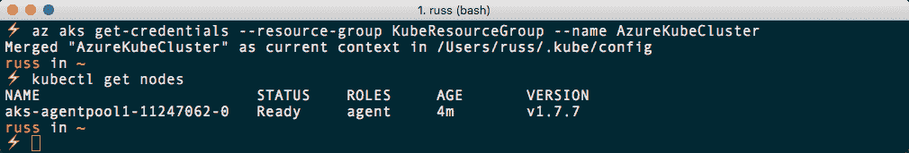

您会注意到我们只有一个节点；我们可以通过运行以下命令添加另外两个节点：

```
$ az aks scale --resource-group KubeResourceGroup --name AzureKubeCluster --agent-count 3
$ kubectl get nodes
```

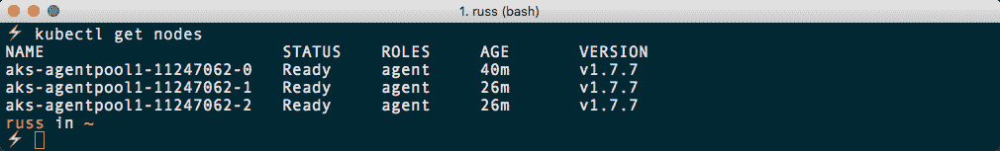

您应该能够在 Azure Web 界面中看到所有已启动的资源：

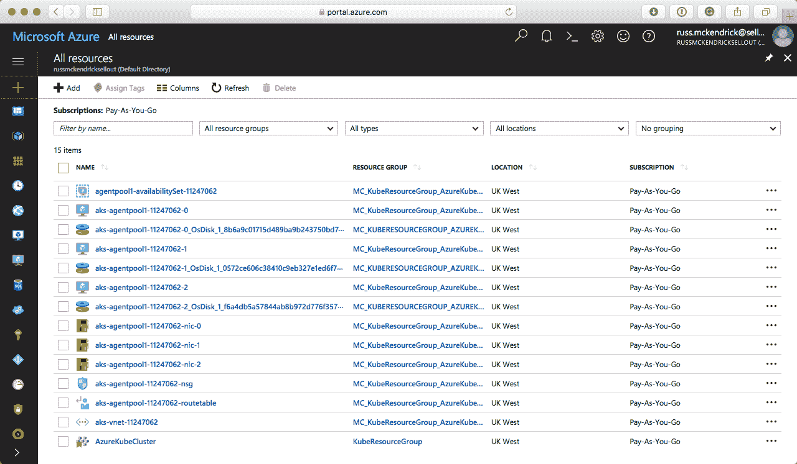

现在我们的集群中有三个节点，让我们启动*Sock Shop demo*应用程序。

# 袜店

这些命令与我们之前运行的命令略有不同，因为我们不必为`kubectl`提供配置文件：

```
$ kubectl create namespace sock-shop
$ kubectl apply -n sock-shop -f "https://github.com/microservices-demo/microservices-demo/blob/master/deploy/kubernetes/complete-demo.yaml?raw=true"
```

再次，您可以通过运行以下命令来检查 pod 的状态：

```
$ kubectl -n sock-shop get pods
```

一旦所有的 pod 都在运行，您可以通过运行以下命令暴露应用程序：

```
$ kubectl -n sock-shop expose deployment front-end --type=LoadBalancer --name=front-end-lb
$ kubectl -n sock-shop get services front-end-lb
$ kubectl -n sock-shop describe services front-end-lb
```

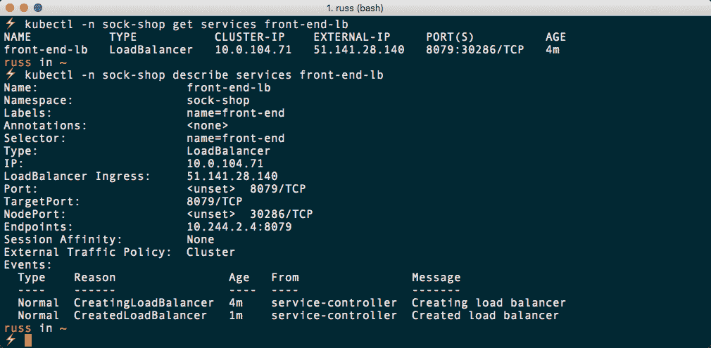

这应该给您一个端口和 IP 地址。从前面的输出中可以看出，这给了我一个 URL `http://51.141.28.140:8079/`，将其放入浏览器中显示了 Sock Shop 应用程序。

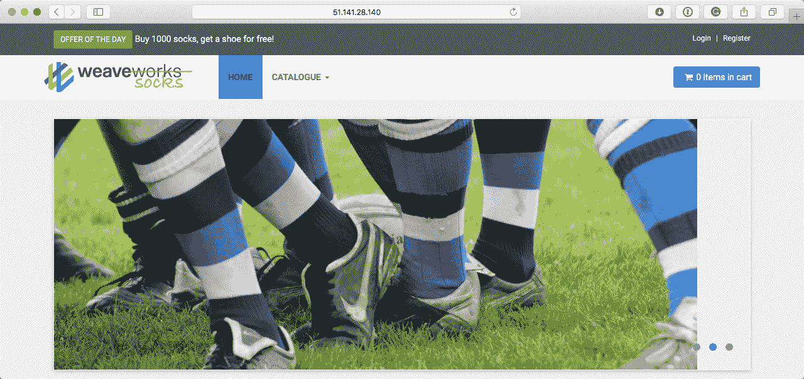

要删除应用程序，我只需要运行：

```
$ kubectl delete namespace sock-shop
```

# 删除集群

与其他云服务一样，当您的 AKS 节点在线时，将按小时收费。完成集群后，您只需删除资源组；这将删除所有相关的服务：

```
$ az aks delete --resource-group KubeResourceGroup --name AzureKubeCluster
$ az group delete --name KubeResourceGroup
```

删除后，转到 Azure Web 界面，并手动删除任何其他剩余的资源/服务。我们接下来要看的下一个和最后一个公共云是 Google Cloud。

# 在 Google Cloud 平台上启动 Kubernetes

正如您所期望的，Kubernetes 在 Google Cloud 上得到了原生支持。在继续之前，您需要一个帐户，您可以在[`cloud.google.com/`](http://cloud.google.com/)注册。一旦您设置好了您的帐户，类似于本章中我们一直在研究的其他公共云平台，我们需要配置命令行工具。

# 安装命令行工具

所有三个操作系统都有安装程序。如果您使用的是 macOS High Sierra，则可以使用 Homebrew 和 Cask 通过运行以下命令安装 Google Cloud SDK：

```
$ brew cask install google-cloud-sdk
```

Windows 10 专业版用户可以使用 Chocolatey 并运行以下命令：

```
$ choco install gcloudsdk
```

最后，Ubuntu 17.04 用户需要运行以下命令：

```
$ export CLOUD_SDK_REPO="cloud-sdk-$(lsb_release -c -s)"
$ echo "deb http://packages.cloud.google.com/apt $CLOUD_SDK_REPO main" | sudo tee -a /etc/apt/sources.list.d/google-cloud-sdk.list
$ curl https://packages.cloud.google.com/apt/doc/apt-key.gpg | sudo apt-key add -
$ sudo apt-get update && sudo apt-get install google-cloud-sdk
```

安装完成后，您需要通过运行以下命令登录到您的帐户：

```
$ gcloud init
```

这将打开您的浏览器，并要求您登录到您的 Google Cloud 帐户。登录后，您将被要求授予 Google Cloud SDK 访问您的帐户的权限。按照屏幕上的提示授予权限，您应该收到一条消息，确认您已经通过 Google Cloud SDK 进行了身份验证。

回到您的终端，现在应该会提示您创建一个项目。出于测试目的，请回答是（`y`）并输入一个项目名称。这个项目名称必须对您来说是唯一的，所以可能需要尝试几次。如果一开始失败，您可以使用以下命令：

```
$ gcloud projects create russ-kubernetes-cluster
```

如您所见，我的项目名为`russ-kubernetes-cluster`。您应该在命令中引用您自己的项目名称。最后的步骤是将我们的新项目设置为默认项目以及设置区域。我使用了以下命令：

```
$ gcloud config set project russ-kubernetes-cluster
$ gcloud config set compute/zone us-central1-b
```

现在我们已经安装了命令行工具，我们可以继续启动我们的集群。

# 启动 Google 容器集群

您可以使用单个命令启动集群。以下命令将启动一个名为`kube-cluster`的集群：

```
$ gcloud container clusters create kube-cluster
```

当您第一次运行该命令时，可能会遇到一个错误，指出您的项目未启用 Google 容器 API：

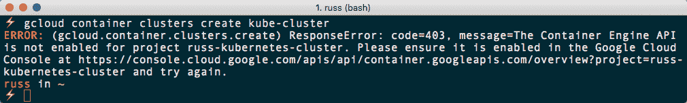

您可以通过按照错误中给出的链接并按照屏幕上的说明启用 API 来纠正此错误。如果您的项目没有与之关联的计费，您可能还会遇到错误：

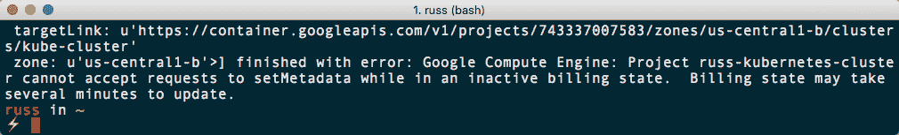

要解决这个问题，请登录到 Google Cloud 网页界面[`console.cloud.google.com/`](https://console.cloud.google.com/)，并从下拉列表中选择您的项目，该下拉列表位于 Google Cloud Platform 旁边。选择您的项目后，点击左侧菜单中的计费链接，并按照屏幕上的提示将您的项目链接到您的计费账户。

一旦您启用了 API 并将您的项目链接到一个计费账户，您应该能够重新运行以下命令：

```
$ gcloud container clusters create kube-cluster
```

这将需要几分钟的时间，但一旦完成，您应该会看到类似以下的内容：

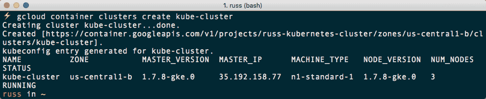

如您所见，`kubectl`的配置已经自动更新，这意味着我们可以运行以下命令来检查我们是否可以与新的集群通信：

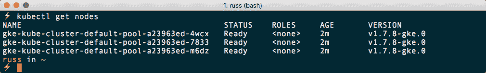在运行此命令之前，请确保您的本地机器直接连接到互联网，并且您没有通过代理服务器或受到严格防火墙限制的连接，否则您可能无法使用`kubectl proxy`命令遇到困难。

您还应该能够在 Google Cloud 网络界面的容器引擎部分看到您的集群：

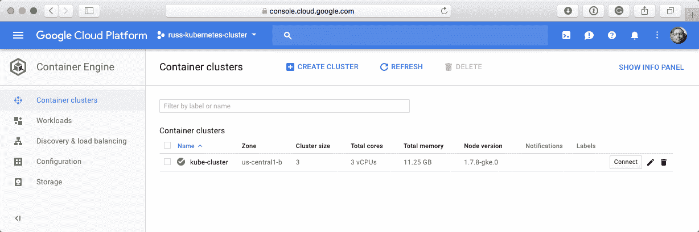

现在我们的集群已经运行起来了，让我们再次启动 Sock Shop 应用程序。

# 袜子店

与 Azure 一样，这次也不需要提供配置文件，所以我们只需要运行以下命令：

```
$ kubectl create namespace sock-shop
$ kubectl apply -n sock-shop -f "https://github.com/microservices-demo/microservices-demo/blob/master/deploy/kubernetes/complete-demo.yaml?raw=true"
$ kubectl -n sock-shop get pods
$ kubectl -n sock-shop expose deployment front-end --type=LoadBalancer --name=front-end-lb
$ kubectl -n sock-shop get services front-end-lb
$ kubectl -n sock-shop describe services front-end-lb
```

如您从以下截图中所见，IP 和端口给了我一个`http://104.155.191.39:8079`的 URL：

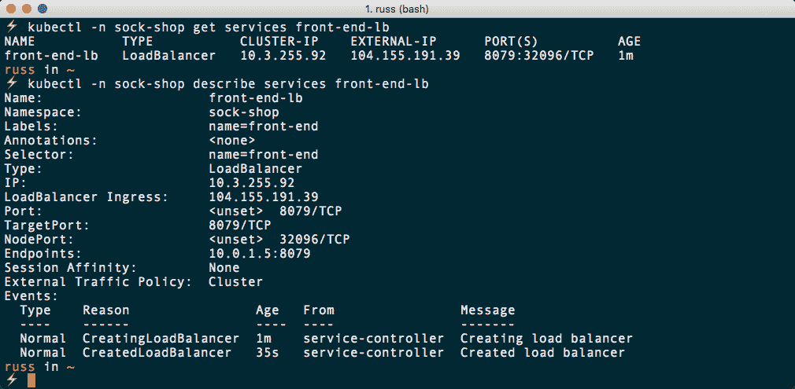

此外，在 Google Cloud 网络界面中，单击发现与负载平衡还应该显示我们创建的负载均衡器：

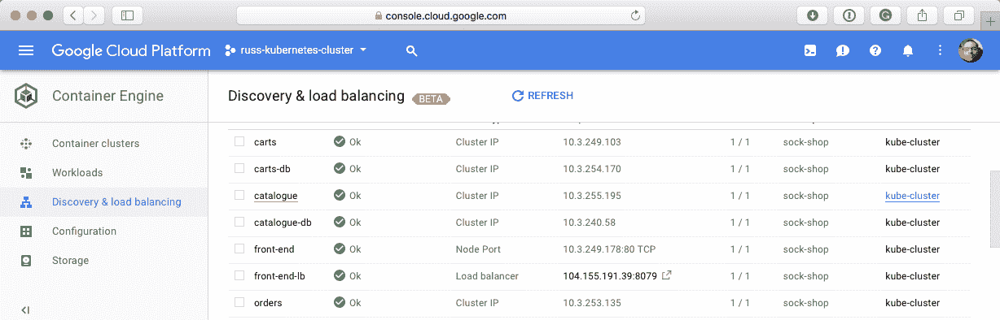

单击界面中的链接，或将您的 URL 粘贴到浏览器中，应该会显示您熟悉的商店前台：

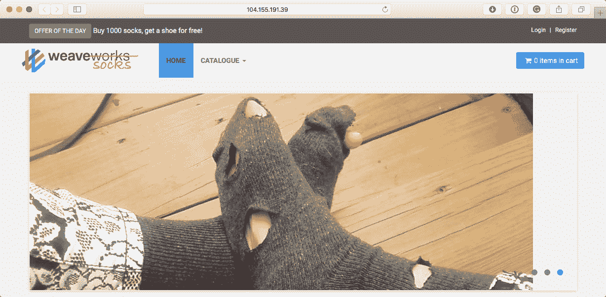

运行以下命令应该删除 Sock Shop 应用程序：

```
$ kubectl delete namespace sock-shop
```

# 运行 Kubeless

在删除 Google Cloud 三节点 Kubernetes 集群之前，让我们快速回顾一下 Kubeless。要部署 Kubeless，请运行以下命令：

```
$ kubectl create ns kubeless
$ kubectl create -f https://github.com/kubeless/kubeless/releases/download/v0.2.3/kubeless-v0.2.3.yaml
```

部署后，您可以通过运行以下命令来检查状态：

```
$ kubectl get pods -n kubeless
$ kubectl get deployment -n kubeless
$ kubectl get statefulset -n kubeless
```

您还可以在 Google Cloud 网络界面的 Google 容器引擎部分检查工作负载和发现与负载平衡。一旦 Kubeless 部署完成，返回到本书附带的存储库中的`/Chapter04/hello-world`文件夹，并运行以下命令部署测试函数：

```
**$ kubeless function deploy hello \**
 **--from-file hello.py \**
 **--handler hello.handler \**
 **--runtime python2.7 \**
 **--trigger-http** 
```

部署后，您可以通过运行以下命令查看该函数：

```
$ kubectl get functions
$ kubeless function ls
```

您可以通过运行以下命令调用该函数：

```
$ kubeless function call hello 
```

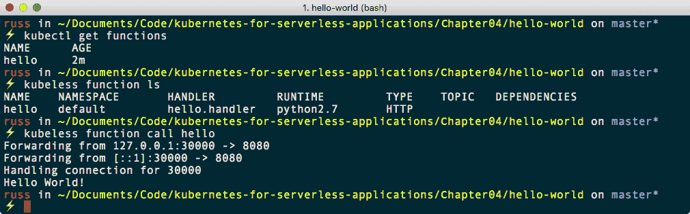

此外，您可以使用以下命令公开该函数：

```
$ kubectl expose deployment hello --type=LoadBalancer --name=hello-lb
```

一旦负载均衡器创建完成，您可以运行以下命令确认 IP 地址和端口：

```
$ kubectl get services hello-lb
```

一旦您知道 IP 地址和端口，您可以在浏览器中打开该函数，或者使用 curl 或 HTTPie 查看该函数：

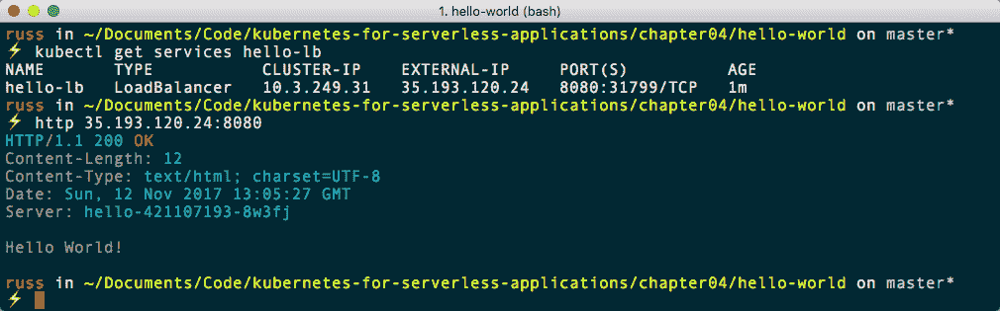

现在我们已经使用 Sock Shop 应用程序测试了我们的集群，并部署了一个 Kubeless 函数，我们应该考虑终止我们的集群。

# 删除集群

要删除集群，只需运行以下命令：

```
$ gcloud container clusters delete kube-cluster
```

它会问你是否确定，回答是，一两分钟后，您的集群将被删除。再次，您应该在 Google Cloud 网页界面上仔细检查您的集群是否已被正确删除，以免产生任何意外费用。

# 摘要

在本章中，我们看了四个云提供商。前两个，DigitalOcean 和 AWS，目前不支持原生的 Kubernetes，因此我们使用 `kubeadm` 和 `kube-aws` 来启动和配置我们的集群。对于 Microsoft Azure 和 Google Cloud，我们使用他们的命令行工具来启动他们原生支持的 Kubernetes 服务。我相信您会同意，在撰写本文时，这两项服务比我们看过的前两项要友好得多。

一旦集群运行起来，与 Kubernetes 交互是一个相当一致的体验。当我们发出诸如 `kubectl expose` 的命令时，我们实际上并不需要为集群运行的位置做出任何让步：Kubernetes 知道它在哪里运行，并使用提供商的原生服务来启动负载均衡器，而无需我们干预任何特殊设置或考虑。

您可能会想知道为什么我们没有在 DigitalOcean 上启动 Sock Shop 应用程序。由于机器的规格相当低，应用程序运行非常缓慢，并且 DigitalOcean 是我们看过的四个提供商中唯一一个不支持 Kubernetes 当前不支持提供商的原生负载均衡服务。我相信这将在未来几个月内得到纠正。

此外，您可能会感到惊讶，AWS 上没有原生的 Kubernetes 经验。在撰写本文时是这种情况；然而，有传言称自从 AWS 加入了云原生基金会后，他们正在努力开发原生的 Kubernetes 服务。

在下一章中，我们将介绍 Apache OpenWhisk，这是最初由 IBM 开发的开源无服务器云平台。
