# Apache OpenWhisk 和 Kubernetes

在本章中，我们将看看 Apache OpenWhisk。虽然不严格是一个仅限于 Kubernetes 的项目，比如 Kubeless 和 Fission（这些将在下一章中介绍），但它可以部署并利用 Kubernetes。

我们将看三个主要主题：

+   Apache OpenWhisk 概述

+   使用 Vagrant 在本地运行 Apache OpenWhisk

+   在 Kubernetes 上运行 Apache OpenWhisk

让我们首先了解更多关于 OpenWhisk。

# Apache OpenWhisk 概述

Apache OpenWhisk 是一个开源的无服务器云计算平台，旨在以与本书其他章节中涵盖的所有工具类似的方式工作。Apache OpenWhisk 最初是 IBM 公共云服务 Bluemix 的 Functions as a Service 部分，现在仍然是。

它在 2016 年 12 月发布了普遍可用版本。随着宣布的新闻稿中有一句来自 Santander 集团平台工程和架构负责人 Luis Enriquez 的引用，他是 IBM Cloud Functions 的一位客户，Luis 说：

“微服务和容器正在改变我们构建应用程序的方式，但由于无服务器，我们可以进一步推动这种转变，OpenWhisk 为我们提供了处理强烈任务和工作负载意外高峰的即时基础设施，并且是我们转向实时和事件驱动架构的关键构建块。”

你可能已经注意到，这听起来很像 AWS 和 Microsoft Azure Functions 的 Lambda——IBM 的服务与竞争对手的区别在于 IBM 已经将 OpenWhisk 提交给了 Apache 孵化器，这是所有外部开发项目成为 Apache 软件基金会努力的一部分的入口。

Apache 软件基金会成立于 1999 年，是一个慈善组织，负责监督和管理超过 350 个开源软件项目的开发和管理，这是为了公共利益。

那么为什么 IBM 要这样做呢？嗯，IBM 不仅是 Apache 软件基金会的金牌赞助商，将其 Functions as a Service 提供开源化对他们来说是有意义的，因为它是唯一一个可以避免供应商锁定的公共云提供商，因为你可以在本地或自己的硬件或虚拟机上运行 Apache OpenWhisk。

这使您可以自由地在任何地方运行和部署 Apache OpenWhisk。但是，如果您想像 Santander 集团一样进行规模化运行，那么您可以选择在 IBM 支持的企业级公共云上运行它。

# 在本地运行 Apache OpenWhisk

我们首先将研究在本地运行 Apache OpenWhisk。我们将通过使用 VirtualBox 和 Vagrant 来实现这一点。

# 安装 Vagrant

在启动本地 Apache OpenWhisk 服务器之前，我们需要安装由 HashiCorp 开发的 Vagrant。我能描述 Vagrant 的最好方式是作为一个开源的虚拟机管理器，您可以使用易于遵循的文本配置文件编写机器配置。

安装 Vagrant 非常简单。在 macOS 10.13 High Sierra 上，我们可以使用 Homebrew 和 Cask：

```
$ brew cask install vagrant
```

如果您正在运行 Windows 10 专业版，您可以使用 Chocolatey 并运行以下命令：

```
$ choco install vagrant
```

最后，如果您正在运行 Ubuntu 17.04，您可以通过运行以下命令直接从 Ubuntu 核心存储库安装 Vagrant：

```
$ sudo apt-get update
$ sudo apt-get install vagrant 
```

请注意，Ubuntu 提供的版本可能会比使用 Homebrew 和 Chocolatey 安装的版本稍微滞后；但是对于我们的目的，这不应该造成任何问题。

您可以通过运行以下命令测试 Vagrant 安装：

```
$ mkdir vagrant-test
$ cd vagrant-test
$ vagrant init ubuntu/xenial64
$ vagrant up
```

这些命令将在`vagrant-test`文件夹中创建一个基本的 Vagrantfile，该文件夹使用来自 Vagrant 网站（[`app.vagrantup.com/ubuntu/boxes/xenial64/`](https://app.vagrantup.com/ubuntu/boxes/xenial64/)）的官方 64 位 Ubuntu 16.04 LTS（Xenial）镜像，下载该镜像，使用 VirtualBox 启动虚拟机，配置网络，并在最终将当前文件夹挂载到虚拟机的`/vagrant`：

！[](assets/706d484d-29b9-4a27-821a-34156e2e7a80.png)

所有这些都是使用以下配置定义的：

```
Vagrant.configure("2") do |config|
 config.vm.box = "ubuntu/xenial64"
end
```

如果您打开 Vagrantfile，您会注意到有很多配置选项，比如 RAM 和 CPU 分配，网络和脚本，这些脚本在虚拟机成功启动后执行。您可以运行以下命令以 SSH 连接到 Vagrant 虚拟机：

```
$ vagrant ssh
```

如果您正在运行 Windows 10 专业版，则需要安装 SSH 客户端。当您执行上述命令时，Vagrant 将为您提供一些选项。

运行以下命令将关闭您的虚拟机并将其删除：

```
$ vagrant destroy
```

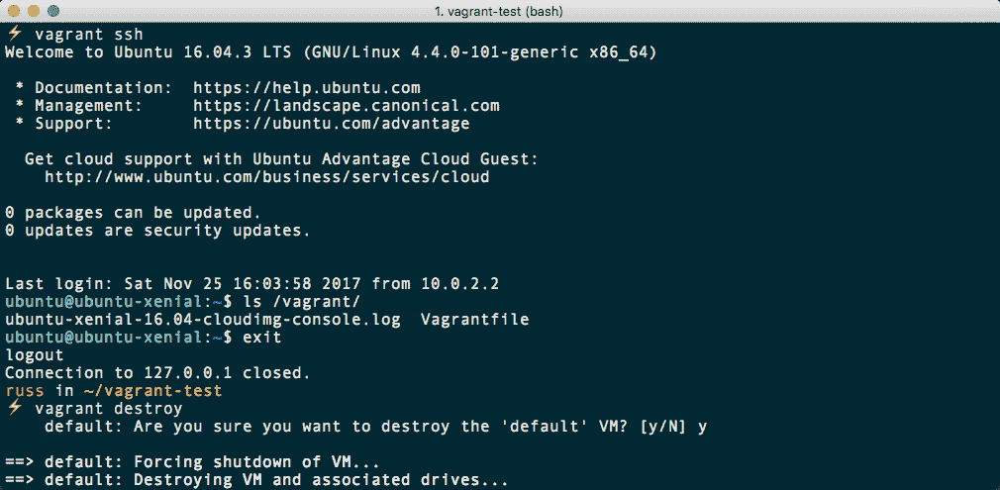

我还建议通过运行清除您的工作文件夹：

```
$ cd ../
$ rm -rf vagrant-test
```

现在我们已经安装了 Vagrant，并且快速查看了如何启动和与虚拟机交互，我们现在可以使用它来启动我们自己的本地安装 Apache OpenWhisk。

# 下载和配置 Apache OpenWhisk

正如我们已经提到的，Apache OpenWhisk 附带一个 Vagrantfile，其中包含从头开始部署本地 Apache OpenWhisk 安装的所有命令。要下载 Apache OpenWhisk 存储库并部署虚拟机，请运行以下命令：

```
$ git clone --depth=1 https://github.com/apache/incubator-openwhisk.git openwhisk
$ cd openwhisk/tools/vagrant
$ ./hello
```

这个过程将花费最多 30 分钟，具体取决于您的互联网连接速度；您可以在以下 URL 找到 Vagrantfile 的副本：[`github.com/apache/incubator-openwhisk/blob/master/tools/vagrant/Vagrantfile`](https://github.com/apache/incubator-openwhisk/blob/master/tools/vagrant/Vagrantfile)。

正如您所看到的，它只有将近 200 行，这与上一节中我们测试 Vagrantfile 的三行有很大不同。Vagrantfile 使用 bash 脚本和 Ansible 的组合来启动、安装和配置我们的 Apache OpenWhisk 虚拟机。

Ansible 是来自 Red Hat 的编排/配置工具。它允许您轻松地用人类可读的代码定义部署，无论是与 API 交互以启动基础设施，还是登录到服务器并执行任务来安装和配置软件堆栈。

在过程结束时，它将执行一个基本的 hello world 检查，如下控制台输出所示：

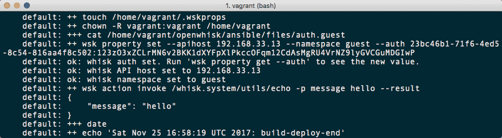

在我们继续之前，请注意以`wsk property set`命令开头的输出。我们将需要这个来配置本地客户端，接下来我们将看到如何安装。

# 安装 Apache OpenWhisk 客户端

每个 Apache OpenWhisk 都有一个用于 macOS、Windows 和 Linux 版本的 Apache OpenWhisk 客户端的下载页面。您可以从以下 URL 访问本地安装：[`192.168.33.13/cli/go/download/`](https://192.168.33.13/cli/go/download/) 或 IBM：[`openwhisk.ng.bluemix.net/cli/go/download/`](https://openwhisk.ng.bluemix.net/cli/go/download/)。

由于您的本地安装使用自签名 SSL 证书，当在浏览器中打开时，您可能会收到警告。您需要接受这些警告才能继续访问该网站。此过程因浏览器而异，因此您需要按照屏幕上的提示进行操作。

要在 macOS 10.13 High Sierra 上安装客户端，我们只需要运行以下命令：

```
$ curl -L --insecure https://192.168.33.13/cli/go/download/mac/amd64/wsk > /usr/local/bin/wsk
$ chmod +x /usr/local/bin/wsk
$ wsk help
```

这将使用`curl`下载二进制文件并忽略自签名证书。

要在 Windows 10 专业版上下载，请运行以下命令。我建议从 IBM 下载，以避免自签名 SSL 证书和 PowerShell 的问题。为此，首先以管理员用户身份打开 PowerShell 窗口。您可以通过从任务栏中的 PowerShell 菜单中选择以管理员身份运行来执行此操作。打开后，您应该看到您在`C:\WINDOWS\system32`文件夹中；如果不是，则运行以下命令：

```
$ cd C:\WINDOWS\system32
$ Invoke-WebRequest -Uri https://openwhisk.ng.bluemix.net/cli/go/download/windows/amd64/wsk.exe -UseBasicParsing -OutFile wsk.exe
```

与 macOS 版本一样，您可以通过运行以下命令来检查客户端是否已安装：

```
$ wsk help
```

最后，在 Ubuntu 17.04 上，您需要运行以下命令：

```
$ sudo sh -c "curl -L --insecure https://192.168.33.13/cli/go/download/linux/amd64/wsk > /usr/local/bin/wsk"
$ sudo chmod +x /usr/local/bin/wsk
```

一旦下载并设置为可执行，您应该能够运行：

```
$ wsk help
```

现在我们已经安装了客户端，我们需要对我们的安装进行身份验证。为此，请运行您在上一节末尾做的笔记中的命令，减去`--namespace guest`部分。对我来说，这个命令是这样的：

```
$ wsk property set --apihost 192.168.33.13 --auth 23bc46b1-71f6-4ed5-8c54-816aa4f8c502:123zO3xZCLrMN6v2BKK1dXYFpXlPkccOFqm12CdAsMgRU4VrNZ9lyGVCGuMDGIwP
```

如果您没有做笔记，那么您可以通过从启动 Vagrant 虚拟机的文件夹运行以下命令来动态传递授权令牌，如下所示：

```
$ wsk property set --apihost 192.168.33.13 --auth `vagrant ssh -- cat openwhisk/ansible/files/auth.guest`
```

如果您不是从启动机器的文件夹运行`vagrant ssh`命令，该命令将失败，因为它将无法找到您的机器配置。现在，您的本地客户端已对本地安装的 Apache OpenWhisk 进行了身份验证，我们可以通过运行以下命令执行与自动安装相同的 hello world 命令：

```
$ wsk -i action invoke /whisk.system/utils/echo -p message hello --result
```

这应该返回以下终端输出的消息`hello`：

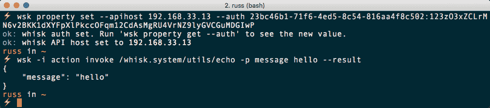

现在我们有了本地客户端，我们可以尝试下载和执行另一个示例。

# 你好世界

现在，我们可以部署一个更复杂的解决方案，而不仅仅是使用内置的`echo`实用程序返回消息。与我们之前使用的 hello world 脚本类似，我们将部署一个使用 Node.js 编写的函数，该函数接受输入并将其显示回给我们。

首先，让我们创建一个工作目录：

```
$ mkdir openwhisk-http
$ cd openwhisk-http
```

现在我们有了一个工作目录，创建一个包含以下代码的文件，并将其命名为`hello.js`：

```
function main(args) {
    var msg = "you didn't tell me who you are."
    if (args.name) {
        msg = `hello ${args.name}!`
    }
    return {body:
       `<html><body><h3><center>${msg}</center></h3></body></html>`}
}
```

现在我们有了要部署的函数，首先我们需要创建一个包，然后创建一个暴露给 Web 的操作：

```
$ wsk -i package create /guest/demo
$ wsk -i action create /guest/demo/hello hello.js --web true
```

现在我们已经创建了包和操作，您的终端应该看起来像以下内容：

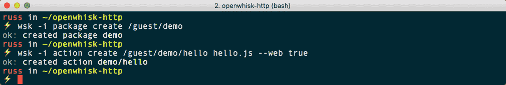

这意味着您可以使用浏览器在以下 URL 调用您的函数：

[`192.168.33.13/api/v1/web/guest/demo/hello.http?name=Kubernetes%20for%20Serverless%20Applications`](https://192.168.33.13/api/v1/web/guest/demo/hello.http?name=Kubernetes%20for%20Serverless%20Applications)

您应该会看到以下页面：


您可以通过在 macOS 或 Ubuntu 上使用 HTTPie 来查看更多信息，方法是运行以下命令：

```
$ http --verify=no https://192.168.33.13/api/v1/web/guest/demo/hello.http?name=Kubernetes%20for%20Serverless%20Applications
```

这将返回标头和输出：

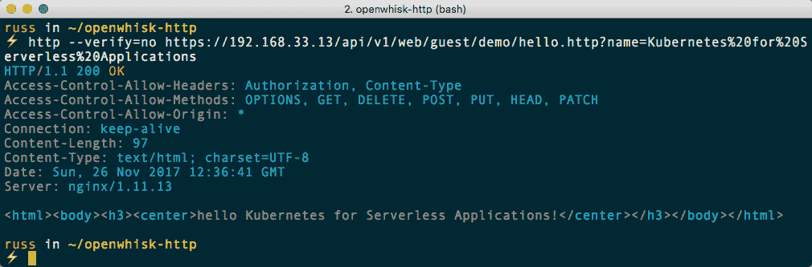

您可以通过运行以下命令列出软件包和操作，并删除它们：

```
$ wsk -i list
$ wsk -i action delete /guest/demo/hello
$ wsk -i package delete /guest/demo
```

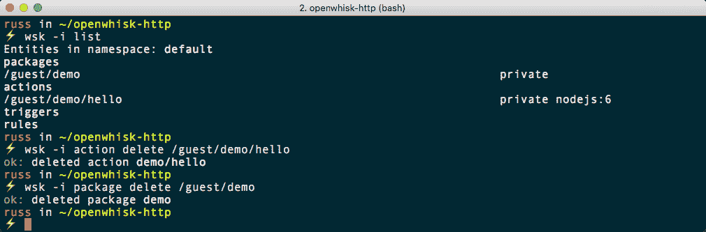

随意在本地安装 Apache OpenWhisk 上玩耍；您可以在 Awesome OpenWhisk 页面找到更多示例，网址为：[`github.com/apache/incubator-openwhisk-external-resources/`](https://github.com/apache/incubator-openwhisk-external-resources/)。

完成本地安装后，您可以运行以下命令来停止和销毁虚拟机：

```
$ vagrant destroy
```

请记住，您必须在`openwhisk/tools/vagrant/`文件夹中运行此命令，否则 Vagrant 将无法找到您的虚拟机配置。

现在我们已经在本地安装并与 Apache OpenWhisk 进行了交互，让我们看看如何在公共云中的 Kubernetes 上部署它。

# 在 Kubernetes 上运行 Apache OpenWhisk

现在我们知道如何与 Apache OpenWhisk 进行交互以及其基本概念，我们可以考虑在 Kubernetes 集群之上部署一个副本。为此，我将通过运行以下命令在 Google Cloud 中启动一个三节点集群：

```
$ gcloud container clusters create kube-cluster
```

一旦集群运行起来，您可以通过运行以下命令来检查是否可以看到三个节点：

```
$ kubectl get nodes
```

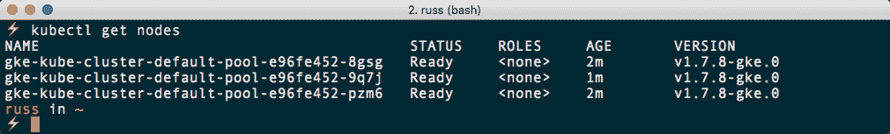

现在我们有了我们的 Kubernetes，我们可以继续进行 Apache OpenWhisk 的部署。

# 部署 OpenWhisk

在开始部署之前，所有在 Kubernetes 上部署 Apache OpenWhisk 所需的配置都可以在 GitHub 上找到，因此我们应该通过运行以下命令克隆存储库。

```
$ git clone --depth=1 https://github.com/apache/incubator-openwhisk-deploy-kube.git openwhisk-kube
$ cd openwhisk-kube
```

现在我们有了存储库的副本，我们可以开始部署运行 Apache OpenWhisk 所需的各个组件。首先，我们需要创建一个名为`openwhisk`的命名空间。要做到这一点，请运行以下命令：

```
$ kubectl create namespace openwhisk
```

现在我们可以通过启动 CouchDB 来开始我们的部署。

# CouchDB

要部署 CouchDB，请从`openwhisk-kube`文件夹内运行以下命令：

```
$ kubectl apply -f kubernetes/couchdb/couchdb.yml
```

这将启动一个使用`couchdb.yml`文件中定义的参数运行 CouchDB 的 pod。您可以通过获取 pod 的名称来检查部署是否正常。您可以通过运行以下命令来执行此操作：

```
$ kubectl -n openwhisk get pods
```

一旦您获得了名称，对我来说是`couchdb-1146267775-v0sdm`，然后您可以运行以下命令，确保更新 pod 的名称为您自己的：

```
$ kubectl -n openwhisk logs couchdb-1146267775-v0sdm
```

在日志输出的最后，您应该看到以下消息：

！[](assets/ed49833e-2e94-4ae7-929c-872715c616ee.png)

现在我们的 CouchDB pod 正在运行，我们可以继续下一个，即 Redis。

# Redis

要启动 Redis pod，我们只需要运行以下命令：

```
$ kubectl apply -f kubernetes/redis/redis.yml
```

# API 网关

接下来我们有 API 网关；通过运行以下命令来启动它：

```
$ kubectl apply -f kubernetes/apigateway/apigateway.yml
```

# ZooKeeper

现在我们可以使用以下命令启动 Apache ZooKeeper：

```
$ kubectl apply -f kubernetes/zookeeper/zookeeper.yml
```

# 卡夫卡

现在是时候启动另一个 Apache 项目，Kafka 了：

```
$ kubectl apply -f kubernetes/kafka/kafka.yml
```

此时，我们应该仔细检查我们启动的所有 pod 是否正在运行。要做到这一点，请运行以下命令：

```
$ kubectl -n openwhisk get pods
```

您应该看到`couchdb`，`redis`，`apigateway`，`zookeeper`和`kafka`的 pod，所有这些 pod 都在没有记录重启并且`READY`列中为`1/1`运行：

！[](assets/7fabbba6-2215-4fe1-b633-5967d8fdcc12.png)

# 控制器

接下来是控制器。这与我们部署的其他 pod 略有不同，因为它是以有状态的方式部署的：

```
$ kubectl apply -f kubernetes/controller/controller.yml
```

您应该看到已创建了一个 StatefulSet 而不是一个部署。

# 调用者

再次部署的下一个 pod 将是一个 StatefulSet 而不是一个部署。在部署 pod 之前，我们需要对`kubernetes/invoker/invoker.yml`文件进行轻微更改。这是因为，默认情况下，OpenWhisk 假定您正在运行 Ubuntu 作为基本操作系统，而 Google Cloud 不是。

要做到这一点，请在您选择的文本编辑器中打开`kubernetes/invoker/invoker.yml`并删除以下代码块：

```
      - name: apparmor
        hostPath:
          path: "/usr/lib/x86_64-linux-gnu/libapparmor.so.1"
```

还有另一个关于`apparmor`的参考资料需要删除。这次是在文件底部：

```
        - name: apparmor
          mountPath: "/usr/lib/x86_64-linux-gnu/libapparmor.so.1"
```

一旦删除了引用`apparmor`的两个代码块，您可以通过运行以下命令部署`invoker`：

```
$ kubectl apply -f kubernetes/invoker/invoker.yml
```

部署可能需要几分钟时间。

# NGINX

部署的最后一部分是 NGINX 容器。对于这个容器，我们需要做更多的工作，因为我们需要为我们的集群生成证书。为了生成证书，我们需要使用 OpenSSL。这在 Windows 机器上默认情况下不安装，因此您可以使用以下命令使用 Chocolatey 安装 OpenSSL：

```
$ choco install openssl.light
```

一旦安装了 OpenSSL，您可以通过运行以下命令生成证书：

```
$ mkdir -p certs
$ openssl req -x509 -newkey rsa:2048 -keyout certs/key.pem -out certs/cert.pem -nodes -subj "/CN=localhost" -days 365
```

一旦我们有了证书，我们需要使用`kubernetes/nginx`中的`nginx.conf`文件创建一个`configmap`。为此，请运行以下命令：

```
$ kubectl -n openwhisk create configmap nginx --from-file=kubernetes/nginx/nginx.conf
```

现在我们需要上传生成的证书和密钥作为`secret`：

```
$ kubectl -n openwhisk create secret tls nginx --cert=certs/cert.pem --key=certs/key.pem
```

一旦它们被上传，我们可以通过运行以下命令启动 NGINX pod：

```
$ kubectl apply -f kubernetes/nginx/nginx.yml
```

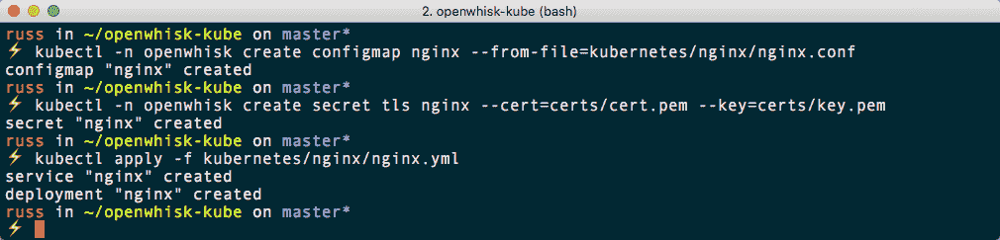

现在我们已经部署了所有的 pod，您应该使用以下命令再次检查它们是否都在运行：

```
$ kubectl -n openwhisk get pods
```

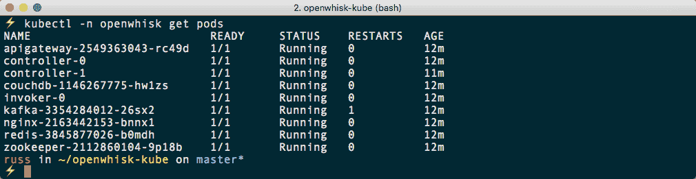

正如您所看到的，一切都在运行。只要数量不增加，您可以忽略任何重启。

# 配置 OpenWhisk

现在我们已经部署了所有的 pod，我们可以开始与我们的部署进行交互。首先，我们需要找出 NGINX pod 的外部 IP 地址。您可以通过运行以下命令找到有关 pod 的信息：

```
$ kubectl -n openwhisk describe service nginx
```

这是输出：

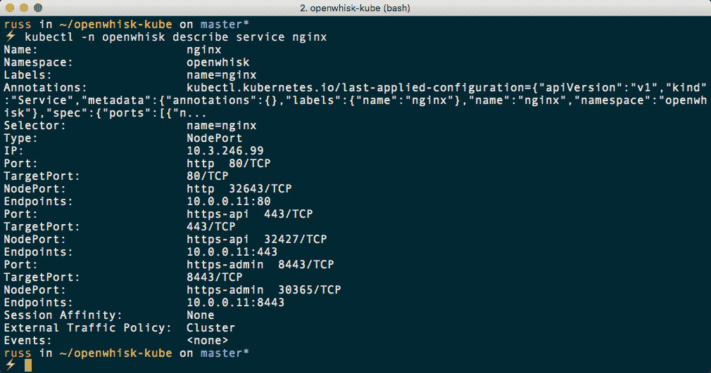

正如您所看到的，虽然端口是暴露的，但它们只在节点本身上暴露。由于节点位于私有地址上，我们将无法从本地客户端访问它们。要在外部暴露端口，我们需要创建一个负载均衡服务，运行以下命令来执行此操作：

```
$ kubectl -n openwhisk expose service nginx --type=LoadBalancer --name=front-end
```

这将启动一个负载均衡器并暴露三个端口：`80`、`443`和`8443`。您可以通过运行以下命令找到外部 IP 地址的详细信息：

```
$ kubectl -n openwhisk describe service front-end
```

在输出中，您会找到一行，上面写着 Load Balancer Ingress，后面跟着一个 IP 地址：

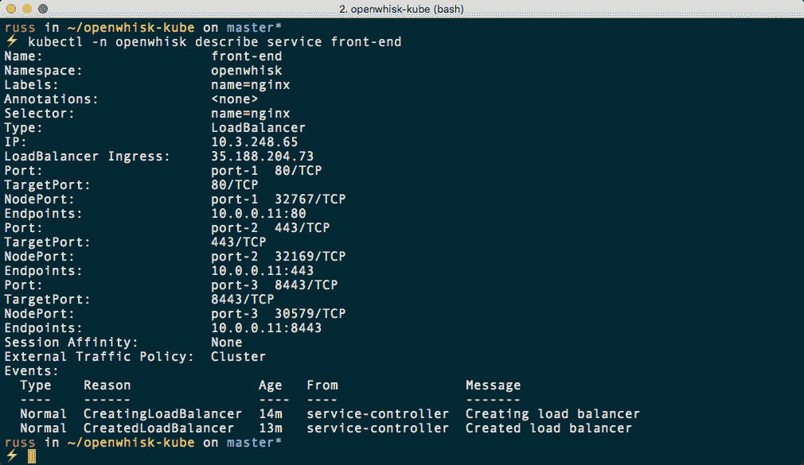

正如您从先前显示的示例输出中看到的，我有一个 IP 地址`35.188.204.73`。这将被用作我与之交互的 API 端点。

现在我们已经获得了安装的 IP 地址，我们可以继续通过运行以下命令来配置认证令牌，确保您使用自己安装的 IP 地址进行更新：

```
$ wsk -i property set --auth 23bc46b1-71f6-4ed5-8c54-816aa4f8c502:123zO3xZCLrMN6v2BKK1dXYFpXlPkccOFqm12CdAsMgRU4VrNZ9lyGVCGuMDGIwP --apihost https://35.188.204.73:443
```

配置完成后，我们可以运行我们的 hello-world 测试。

# 你好，世界

这与前一节中的 hello world 完全相同，所以我不会详细介绍。只需切换到您拥有`hello.js`文件的文件夹，并运行以下命令：

```
$ wsk -i package create /guest/demo
$ wsk -i action create /guest/demo/hello hello.js --web true
```

一旦您运行了创建包和操作的命令，您将能够访问 URL。对我来说，它是以下内容：

`https://35.188.204.73/api/v1/web/guest/demo/hello.http?name=Kubernetes%20for%20Serverless%20Applications`

这显示了我们期望看到的页面：


再次，我们可以通过运行 HTTPie 来看到更多：

```
$ http --verify=no https://35.188.204.73/api/v1/web/guest/demo/hello.http?name=Kubernetes%20for%20Serverless%20Applications
```

这显示了以下信息：

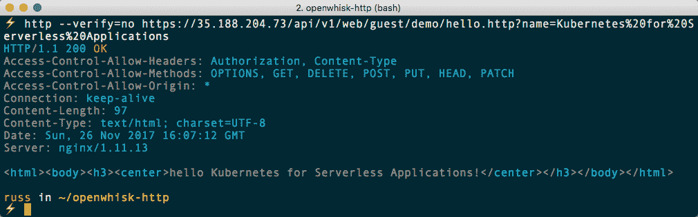

正如您所看到的，一旦您使用提供的文件部署了 Apache OpenWhisk，使用它是一个非常一致的体验。

在完成本章之前，我们应该删除我们的 Kubernetes 集群。要做到这一点，请运行以下命令：

```
$ gcloud container clusters delete kube-cluster
```

删除后，请务必检查您的 Google Cloud 控制面板[`console.cloud.google.com/`](https://console.cloud.google.com/)，以确保没有剩余的资源，这可能会产生意外的成本。

# 摘要

在本章中，我们稍微偏离了目标，看了一下 Apache OpenWhisk。我们使用标准虚拟机部署了一个本地副本，然后我们转向部署到在 Google Cloud 上运行的 Kubernetes 集群。

正如您所看到的，一旦部署完成，与 Apache OpenWhisk 的交互是一致的体验，我们能够在两个安装中部署我们简单的 hello-world 应用程序，而无需进行任何修改。

虽然 Kubernetes 对 Apache OpenWhisk 的支持仍处于起步阶段，但我们的偏离表明，不仅是为 Kubernetes 设计的框架，就像我们在前几章中看到的工具一样，它们将在 Kubernetes 之上运行，并提供一致的体验，而无需将您锁定在单一供应商或技术中。

在下一章中，我们将看到可能是最成熟的 Kubernetes 函数作为服务提供：Fission。
