# 第九章：查看 OpenFaaS

我们将要看的最后一个平台叫做 OpenFaaS。这是一个相对较新的项目，只支持 Kubernetes，所以我们不会详细介绍。然而，该项目正在获得很多关注和支持者，因此我认为我们有必要提到它。

在本章中，我们将看到：

+   什么是 OpenFaaS，由谁制作？

+   使用 Minikube 在本地安装 OpenFaaS

# OpenFaaS 简介

OpenFaaS 是由 Alex Ellis 于 2016 年 12 月开始的，就在我写这篇文章的一年多前。最初，它是设计用于与 Docker swarm 一起工作的。

Docker swarm 是 Docker 自己的集群技术；它允许您将运行 Docker Engine 的一些主机连接在一起。从表面上看，Docker swarm 与 Kubernetes 非常相似。然而，当你深入研究这两种技术的工作原理时，你会发现它们不仅工作方式不同，而且设计目的也不同。

自 2016 年 12 月的第一次提交以来，OpenFaaS 在 Docker 世界中引起了很多关注。Ellis 和其他 OpenFaaS 社区成员曾在 DockerCon Europe、Moby Summit、KubeCon 和 Gluecon 以及过去 12 个月的众多聚会上发表讲话。OpenFaaS 还被列入了 InfoWorld Bossie Awards 2017，被评为 2017 年最佳云计算软件项目之一。

OpenFaaS 可能是功能最丰富的函数即服务提供商，它支持 Docker swarm，因此很合理地，软件的 Kubernetes 版本最终会发布——这个 Kubernetes 版本被称为**faas-netes**，它在 2017 年 7 月进行了第一次提交。

# 在本地运行 OpenFaaS

与其查看 Docker swarm 上的 OpenFaaS 并对比在 Kubernetes 和 Docker swarm 上运行服务，我们将直接深入并在 Kubernetes 上安装 OpenFaaS。就像我们涵盖的所有工具一样，我们需要一个命令行客户端，所以我们将从安装它开始。

# OpenFaaS 命令行客户端

OpenFaaS 命令行客户端适用于我们的三个操作系统。让我们逐个安装它，从 macOS High Sierra 开始。

正如你可能已经猜到的那样，我们将使用 Homebrew 来完成这个任务。要安装客户端，只需运行以下命令：

```
$ brew install faas-cli
```

对于 Ubuntu 17.04，可以使用 OpenFaaS CLI 安装脚本来安装 CLI，您可以通过运行以下命令直接从 GitHub 运行：

```
$ curl -sL cli.openfaas.com | sudo sh
```

如果您运行的是旧版本，此脚本还将更新已安装的 faas-cli 版本。

要在 Windows 10 专业版上安装 CLI，首先以管理员用户身份打开 PowerShell 窗口；您可以通过从任务栏中的 PowerShell 菜单中选择以管理员身份运行来执行此操作。一旦打开，您应该看到您在`C:\WINDOWS\system32`文件夹中，如果没有，那么运行以下命令：

```
$ cd C:\WINDOWS\system32
```

一旦您在`C:\WINDOWS\system32`文件夹中，您可以通过运行以下命令下载 OpenFaaS CLI：

```
$ Invoke-WebRequest -Uri https://github.com/openfaas/faas-cli/releases/
download/0.5.1/faas-cli.exe -UseBasicParsing -OutFile faas-cli.exe
```

您可以在项目的 GitHub 发布页面上找到 OpenFaaS CLI 的最新版本详情，网址为[`github.com/openfaas/faas-cli/releases/`](https://github.com/openfaas/faas-cli/releases/)。

安装完成后，您应该能够运行以下命令来确认已安装的 CLI 的版本号：

```
$ faas-cli version
```

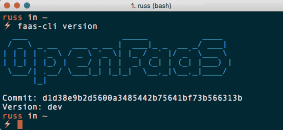

# Docker

接下来，我们需要在本地安装 Docker。虽然我在本节开头说我们不会在 Docker swarm 上安装，但 OpenFaaS 仍然使用 Docker Engine，所以我们需要在本地安装它。

如果您正在运行 Ubuntu 17.04，可以通过运行以下命令使用 Docker 的安装脚本来安装 Docker：

```
$ curl -fsSL get.docker.com -o get-docker.sh
$ sudo sh get-docker.sh
```

要在 macOS High Sierra 上安装 Docker，可以使用 Homebrew 和 Cask 进行安装，运行：

```
$ brew cask install docker
```

对于 Windows 10 专业版用户，您可以使用 Chocolatey 并运行：

```
$ choco install docker-for-windows
```

安装了 Docker for macOS 和 Docker for Windows 之后，您需要打开 Docker 应用程序来完成安装。如果不这样做，Docker 将无法启动，我们稍后在本章中将使用 Docker 的示例也将无法工作。首次启动需要几分钟，因为它需要下载和配置一个小型虚拟机。

# 启动 Minikube 集群

现在我们已经安装了 OpenFaaS CLI，我们可以继续使用 Minikube 启动单节点 Kubernetes 集群。要做到这一点，请运行以下命令：

```
$ minikube start
```

这将启动集群并配置我们的本地 Kubernetes CLI 与之通信，除非您安装了 Windows 10 专业版，然后您可能会看到以下消息：

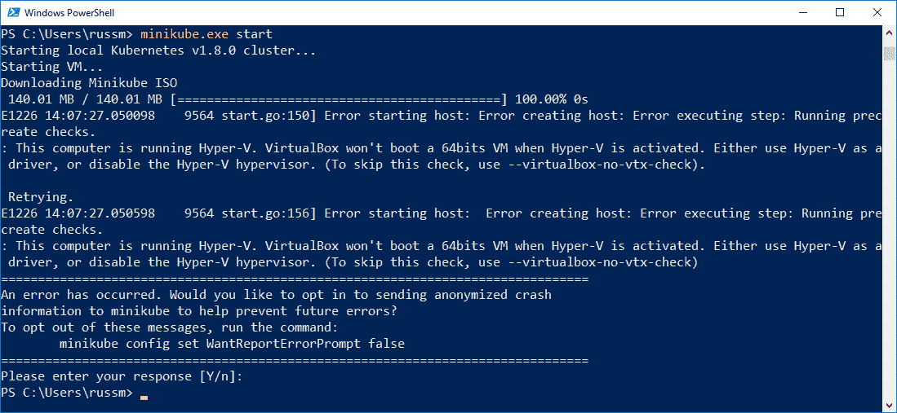

Docker for Windows 安装的一部分启用了 Hyper-V，正如我们在第三章中发现的，*本地安装 Kubernetes*，当我们最初安装 Minikube 时，您不能同时运行 VirtualBox 和 Hyper-V。为了解决这个问题，我们需要配置 Minikube 使用 Hyper-V 来支持虚拟化，而不是 VirtualBox。

为此，打开 Hyper-V Manager，选择 Virtual Switch Manager，然后创建一个新的外部虚拟交换机。如下截图中所示，将其命名为`minikube`，并确保选中“允许管理操作系统共享此网络适配器”复选框：

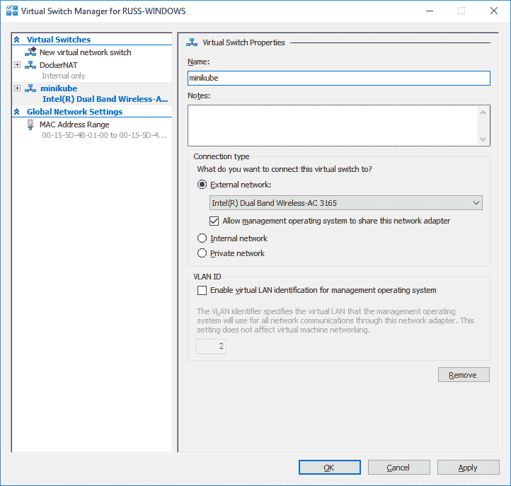

创建了虚拟交换机后，重新启动您的机器。一旦您的机器恢复在线，以管理员权限打开一个 PowerShell 窗口，并运行以下命令启动单节点 Kubernetes 集群：

```
$ minikube start --vm-driver=hyperv --hyperv-virtual-switch=minikube
```

在 Hyper-V Manager 中，您应该能够看到您的`minikube`虚拟机的状态为 Running，以及列为`MobyLinuxVM`的 Docker 虚拟机：

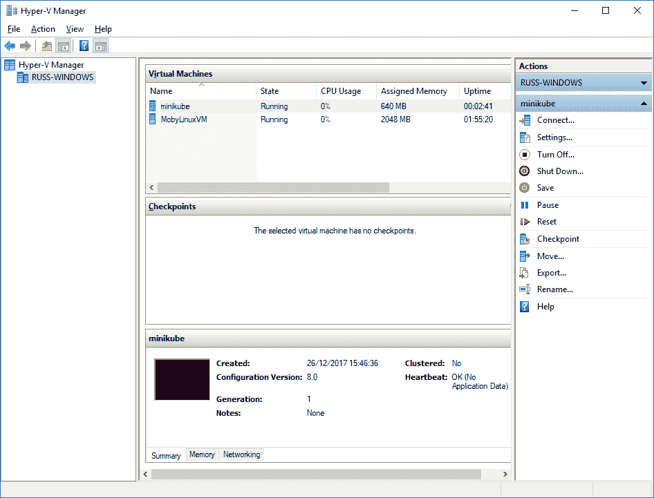

现在您应该可以继续进行其余的指令了。

# 使用 Helm 安装 OpenFaaS

现在我们已经启动了集群，我们需要安装 OpenFaaS 组件。我们将使用 Helm 来进行安装。如果您在上一章没有安装 Helm，请参考那里的安装说明。与 Helm 安装一样，我们需要初始化它，这将安装服务器端组件 Tiller。要做到这一点，请运行以下命令：

```
$ helm init
```

现在我们在本地单节点 Kubernetes 集群上配置了 Helm，我们需要从 GitHub 下载 faas-netes 代码库的副本。为此，请运行以下命令之一：

```
$ git clone https://github.com/openfaas/faas-netes
$ cd faas-netes
```

您还可以从[`github.com/openfaas/faas-netes`](https://github.com/openfaas/faas-netes)下载 ZIP 文件的副本。

下载后，我们可以使用以下命令使用 Helm 安装 OpenFaaS：

```
$ helm upgrade --install --debug --reset-values --set async=false --set rbac=false openfaas openfaas/
```

这将返回相当多的输出，但您真正需要关注的部分只有最后一行，其中应该包含类似于以下内容：

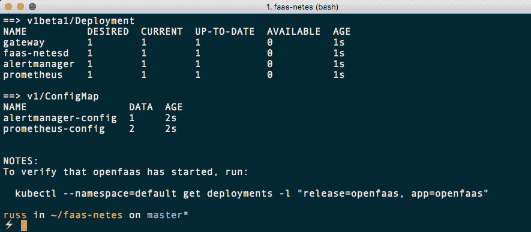

一两分钟后，您可以通过运行输出末尾的命令来检查安装的状态：

```
$ kubectl --namespace=default get deployments -l "release=openfaas, app=openfaas"
```

您应该看到类似以下终端输出的内容：

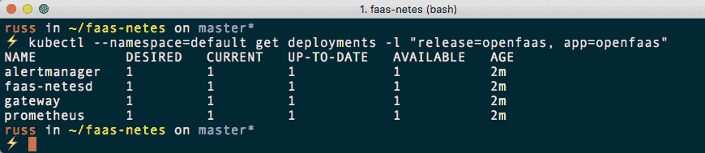

现在我们已经安装并可用 OpenFaaS，我们可以尝试启动一个 hello world 示例。

# 你好世界！

与我们涵盖的其他服务一样，我们将运行一个快速的 hello world 示例。这将让您了解 OpenFaaS 和其他工具之间的区别。我们还将找出为什么需要安装 Docker。首先，运行以下命令：

```
$ mkdir hello
$ cd hello
$ faas-cli new --lang python hello
```

这将创建一个名为`hello`的文件夹，然后在其中创建一个名为`hello.yml`的文件和一些文件夹：

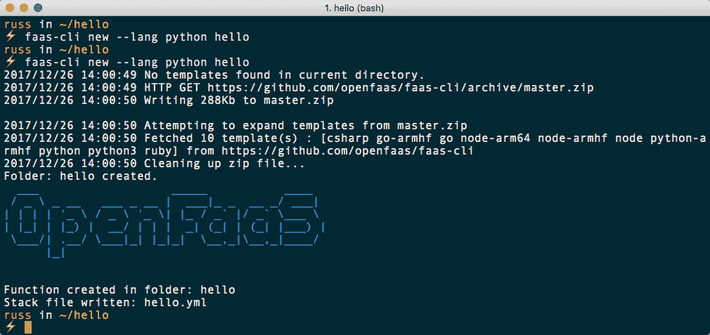

接下来，我们需要登录到 Docker Hub 帐户。要做到这一点，请运行以下命令：

```
$ docker login
```

如果您没有 Docker Hub 帐户，可以免费在[`hub.docker.com/`](https://hub.docker.com/)注册一个：

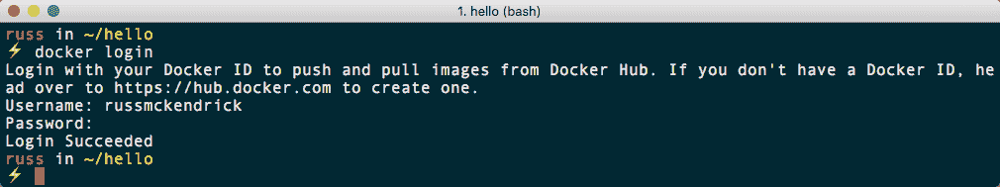

在文本编辑器中打开`hello.yml`将显示以下内容：

```
provider:
  name: faas
  gateway: http://localhost:8080

functions:
  hello:
    lang: python
    handler: ./hello
    image: hello
```

编辑文件，使`image`读取`your-dockerhub-username/hello`。在我的情况下，这是`russmckendrick/hello`。

编辑后，运行以下命令：

```
$ faas-cli build -f hello.yml
```

这将在本地构建一个包含`/hello`文件夹中代码的容器，使用您本地的 Docker Engine 安装：

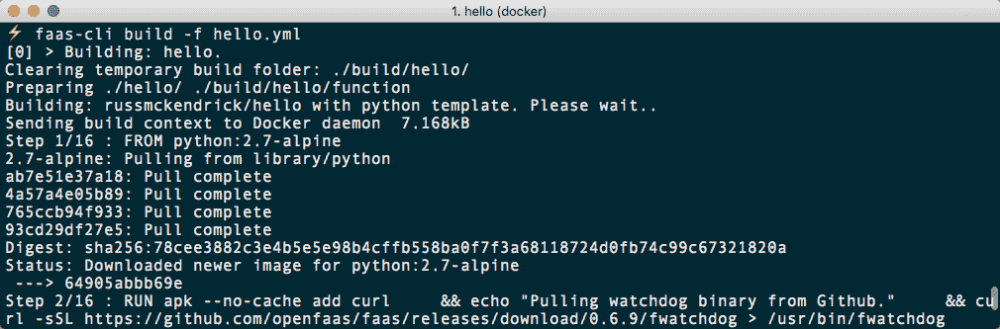

现在我们已经构建了容器镜像，您可以通过运行以下命令来查看：

```
$ docker image ls
```

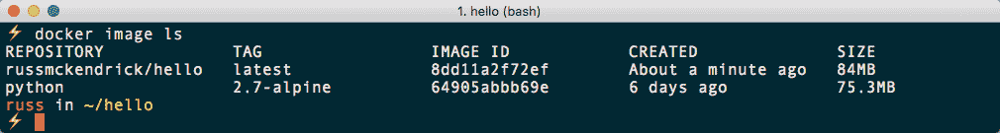

现在我们可以通过运行以下命令将图像推送到我们的 Docker Hub 帐户：

```
$ faas-cli push -f hello.yml
```

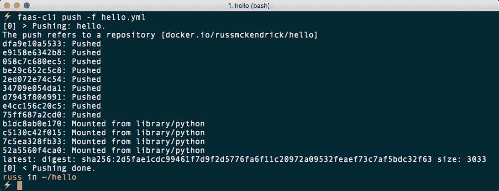

现在我们已经将包含我们函数的容器镜像上传到 Docker Hub，您可以在[`hub.docker.com/r/russmckendrick/hello/`](https://hub.docker.com/r/russmckendrick/hello/)上看到：

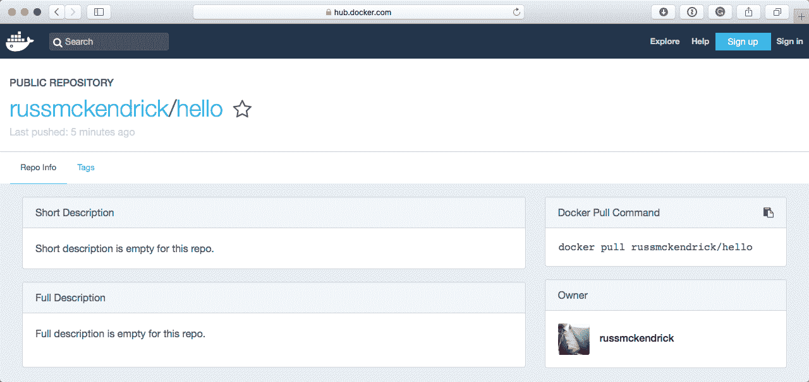

我们可以启动我们的函数，但是首先我们需要将 Minikube VM 的 IP 地址放入一个变量中，这样当我们运行 OpenFaaS CLI 时，它就知道要连接到哪里：

```
$ export gw=http://$(minikube ip):31112
```

现在我们可以使用以下命令启动我们的函数：

```
$ faas-cli deploy -f hello.yml --gateway $gw
```

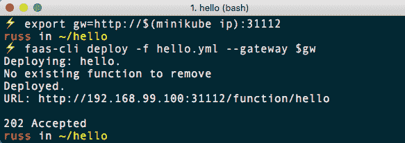

我们可以通过运行以下命令来调用该函数：

```
$ echo test | faas-cli invoke hello --gateway $gw
```

这应该返回单词`test`：

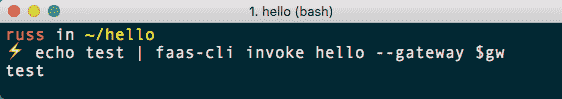

我们还可以通过运行以下命令来检查函数的状态：

```
$ faas-cli list --gateway $gw
```

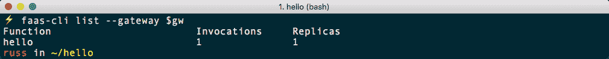

如您所见，我们有一个正在运行的函数副本，并且已被调用一次。在我们进入下一节之前，再运行几次该函数。

# OpenFaaS UI 和 store

OpenFaaS 带有基于 Web 的用户界面，可以通过在 macOS 和 Ubuntu 上运行以下命令来访问：

```
$ open http://$(minikube ip):31112/
```

Windows 用户可以运行：

```
$ minikube service gateway-external
```

这将打开 OpenFaaS Web UI，在那里您应该看到我们在上一节中创建的`hello`函数。选择该函数，在请求正文表单字段中输入一些文本，然后点击调用将调用该函数，如下截图所示：

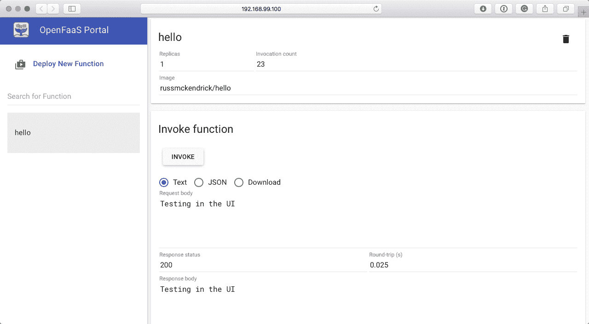

OpenFaaS UI 还包括一个商店，您可以直接将社区策划的函数部署到您的 OpenFaaS 安装中。要访问商店，请单击“部署新函数”按钮，然后您将看到可以部署的函数列表：

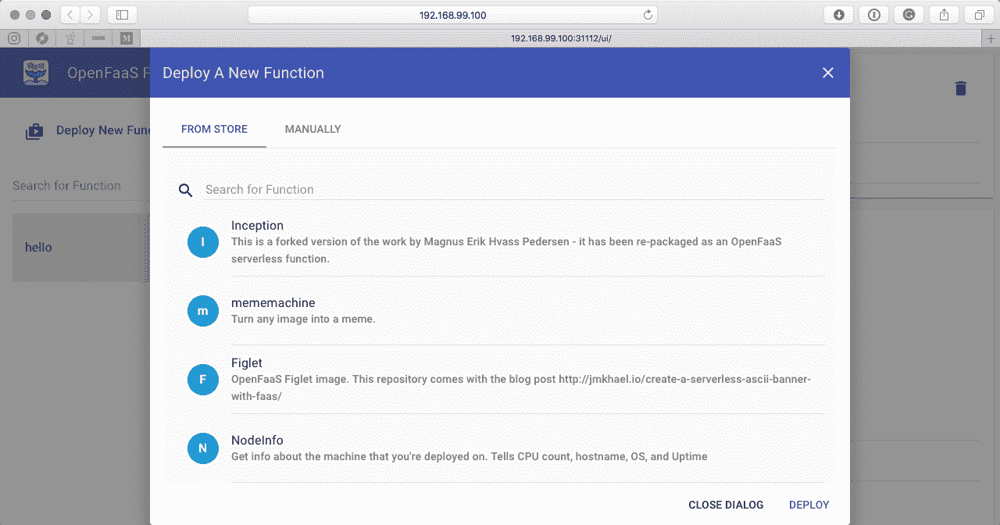

选择`mememachine`函数，然后点击 DEPLOY 按钮。部署后，您应该在`hello`函数下看到一个名为`mememachine`的函数，选择它，在请求正文表单字段中输入以下内容：

```
{"image": "http://i.imgflip.com/qiefv.jpg","top": "CREATING A MEME","bottom": "USING OPENFAAS"}
```

选择下载，然后点击调用：

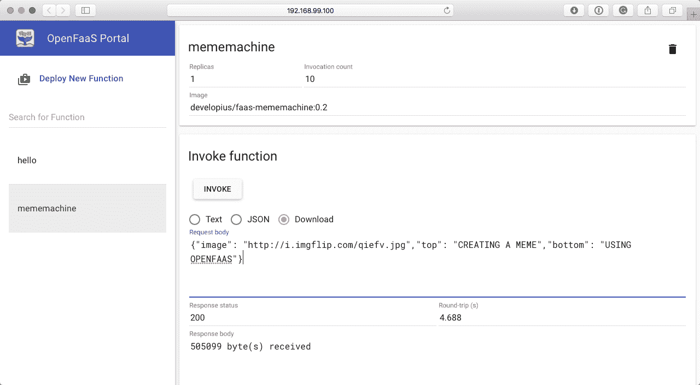

一两秒后，将下载一个文件，打开它后，您应该看到类似以下截图的内容：

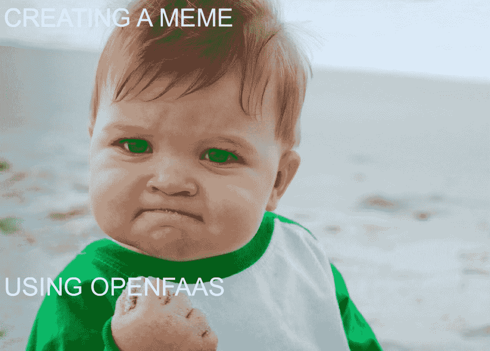

正如您所看到的，我们有成功宝宝的迷因，它在图像字段中以 URL [`i.imgflip.com/qiefv.jpg`](http://i.imgflip.com/qiefv.jpg)定义，并且我们传递给`top`和`bottom`变量的两行文本。

该函数的源代码可以在[`github.com/faas-and-furious/openfaas-mememachine/`](https://github.com/faas-and-furious/openfaas-mememachine/)找到。正如您所看到的，它是一个 Node.js 容器，用于下载图像，添加文本，然后返回新图像的内容。OpenFaaS 商店中大多数函数的源代码可以在*FaaS and Furious* GitHub 存储库中找到[`github.com/faas-and-furious/`](https://github.com/faas-and-furious/)。

# Prometheus

当我们第一次推出 OpenFaaS 时，您可能已经注意到其中一个部署被称为 Prometheus。

Prometheus 是我们在前几章中讨论过的云原生计算基金会项目之一。最初由 SoundCloud 构建，它迅速成为基于容器的安装收集指标的新标准-您可以在项目网站[`prometheus.io/`](https://prometheus.io/)上找到更多信息。

这是记录我们在整个章节中一直在调用的 OpenFaaS 网关的一些基本统计信息；您可以通过运行以下两个命令之一来打开 Prometheus（请记住，`open`在 Windows 上不起作用）：

```
$ open http://$(minikube ip):31119/
$ minikube service prometheus-external
```

打开后，您将看到一个空白页面。在文本框中输入以下内容：

```
gateway_function_invocation_total
```

单击“执行”按钮后，您将看到一个图表，其中详细说明了每个函数被调用的次数，以及每个函数调用的 HTTP 状态：

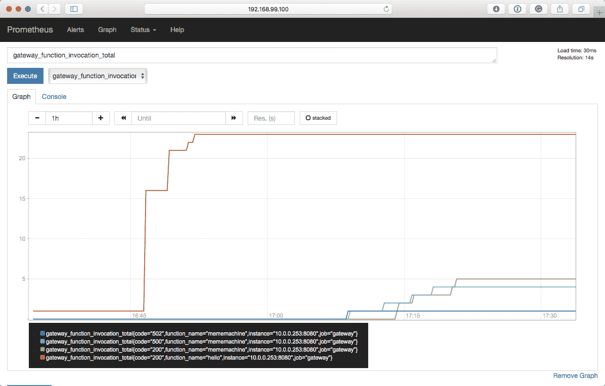

从上面的图表中可以看出，当我运行`mememachine`函数时出现了一些错误，因为镜像大小太大，导致函数崩溃。还有很多其他指标被捕获。我建议您点击一下，看看一些图表。

完成 OpenFaaS 安装后，可以通过运行以下命令来删除安装：

```
$ minikube stop
$ minikube delete
```

# 摘要

OpenFaaS 是一个快速增长的函数即服务平台，正如前面提到的，它得到了很多社区支持。它的独特之处在于它与 Docker 本地交互，用于构建和推送镜像到 Docker Hub，而我们之前使用的其他工具是使用 Kubernetes 将我们的函数注入到容器和运行时中。

这就是能够轻松分发容器镜像供 OpenFaaS 使用的优势，正如我们通过`mememachine`示例和 OpenFaaS 商店中的其他函数所演示的。

在本章中我们没有做的一件事是在公共云中启动 Kubernetes 集群并部署 OpenFaaS。其中一个原因是，为了能够访问它，我们必须通过公共 IP 地址使其对我们的主机机器可用，这将使我们的安装暴露给世界。在下一章中，我们将讨论在公共云中运行我们的 Kubernetes 集群时的安全考虑，以及其他事项。
