# 第十章：无服务器考虑

在上一章的最后，我们提到了保护我们的无服务器安装的问题，以及开箱即用的安全性可能存在的缺陷。在本章中，我们将直面这个问题，讨论在部署 Kubernetes 上的无服务器函数服务时应该注意的事项，以及如何最好地监视您的集群。

我们将研究：

+   安全最佳实践

+   您如何监视您的 Kubernetes 集群？

让我们从讨论安全性开始。

# 安全最佳实践

在谈论安全最佳实践时，我们的最终目标应该是确保任何未经授权的第三方都无法访问我们的应用程序或基础架构的任何部分。

例如，我希望最终用户能够运行一个脚本，通过直接的 HTTP 请求，由网页或移动应用程序调用我的无服务器函数之一。但是，我不希望同一用户能够访问我的 Kubernetes 仪表板，例如。

现在，这可能看起来是一个非常明显的例子，但是，正如我们在过去几年中所看到的，开箱即用的配置并不总是考虑到这个最基本的安全要求。MongoDB 就是一个很好的例子。

在 2017 年 1 月、6 月和 9 月，有几家主要新闻媒体报道，大约有 99,000 个 MongoDB 安装暴露在互联网上；这些安装要么没有打补丁，要么配置不当。这导致第三方访问、复制和删除了其中的数据。

在某些情况下，犯罪分子会复制数据，从源数据库中删除数据，然后向数据库所有者发送勒索要求，要求*安全*返回已删除的数据。其他攻击者只是删除了数据库，并用一个名为`PWNED_SECURE_YOUR_STUFF_SILLY`或`DELETED_BECAUSE_YOU_DIDNT_PASSWORD_PROTECT_YOUR_MONGODB`的空数据库替换它。您可以在以下推文中找到附加到赎金的示例：[`twitter.com/nmerrigan/status/818034565700849664`](https://twitter.com/nmerrigan/status/818034565700849664)。

之前发推文的研究人员 Niall Merrigan 在另一条推文中指出，在一个早晨，受损的 MongoDB 安装数量从 12,000 增加到了大约 27,000。

微软等公司开始推广他们自己的 NoSQL 数据库服务，比如 Azure DocumentDB，发布了标题为“首先，安全是我们的首要任务”的博客文章，以及以下链接中的图片：[`azure.microsoft.com/en-in/blog/dear-mongodb-users-we-welcome-you-in-azure-documentdb/`](https://azure.microsoft.com/en-in/blog/dear-mongodb-users-we-welcome-you-in-azure-documentdb/)，微软将他们自己的 DocumentDB 标志和 MongoDB 标志放在生锈的锁和现代保险门上。

那么，这与保护我们的无服务器函数有什么关系呢？嗯，要回答这个问题，我们必须首先看一下 MongoDB 问题的根本原因。

许多受攻击的 MongoDB 版本最初被配置为绑定到`0.0.0.0`，这意味着服务附加到服务器上的所有 IP 地址。如果您的 MongoDB 安装是在仅在私有网络上运行的服务器上启动，这就不是问题，但是被攻击的安装并非如此，它们是在公共云中托管的，其中一些只提供外部 IP 地址。

现在，你可能会想，访问数据库肯定需要某种身份验证吧？嗯，你错了；在 MongoDB 仍然在所有网络接口（`0.0.0.0`）上监听的时候，身份验证是一个额外的配置步骤。这意味着，根据网站 Shodan 在 2015 年 7 月的数据，公共互联网上共有 595.2 TB 的 MongoDB 数据暴露在外，并且没有进行身份验证。

此外，你读对了日期，这是 2015 年的一个问题，很多安装仍然没有修补和配置正确。

那么，我们如何避免在我们的 Kubernetes 和服务器功能服务安装中出现这些基本配置问题呢？让我们先看看 Kubernetes 本身。

# 保护 Kubernetes

Kubernetes 默认情况下是相当安全的。提供 Kubernetes 的两家云服务提供商，Google Cloud 和 Microsoft Azure，工作方式类似。

一个管理节点部署在您的节点旁边；这个管理节点控制整个集群，并且默认情况下暴露给公共互联网和云服务提供商。我们可以通过使用以下命令启动一个集群来测试未经身份验证的用户看到的内容：

```
$ gcloud container clusters create kube
```

现在，默认情况下，此命令将启动集群，包括管理节点。用于验证您的本地`kubectl`副本与集群的所有证书都是在云上生成的，一旦集群启动，它将配置`kubectl`以获取连接所需的所有信息。如果您查看配置文件，可以在`~/.kube/config`中找到，您应该会看到类似以下内容：

```
apiVersion: v1
clusters:
- cluster:
    certificate-authority-data: LS0tLS1CRUdJTiBDRVJUSUZJQ0FURS0tLS0tCk1JSURERENDQWZTZ0F3SUJBZ0lSQUpEbDRydFJWSENjSlNhL2lxcVN4d0V3RFFZSktvWklodmNOQVFFTEJRQXcKTHpFdE1Dc0dBMVVFQXhNa1pUTmtaRFZtT1dJdE1UVTBPUzAwTlRoa0xXRmxZV010Tnpkak9HTTBOalV5Wm1aaQpNQjRYRFRFM01USXlOekV4TXpRek0xb1hEVEl5TVRJeU5qRXlNelF6TTFvd0x6RXRNQ3NHQTFVRUF4TWtaVE5rClpEVm1PV0l0TVRVME9TMDBOVIhaveEditedThisDoNotW0rryT0dNME5qVXlabVppTUlJQklqQU5CZ2txaGtpRzl3MEIKQVFFRkFBT0NBUThBTUlJQkNnS0NBUUVBb21pdGF4eE9DMzJwRE5nY3RLQkFKRXZhVjVBL1ZEMnByU0xYcnpsYwpOL1h1UFI2NWpVR0Z3emVNbkcvMHNrZXZoUklEUncvK3B0elNDSnR5WFhtNnUysdfsdfsdfsd4LzdHZmxSCmtnRWNPY1pZd2NzS3dIU1lRTXBQVE5Lek51b0JqcDlla0ltcnFSNW5qWHRrNU1DS0ROS2lWbVlwTVBBV2dCL1MKakRDYWpNcUxwZU5FdDlRVkluQVI3aUNTeFRHQkN5cE5ZRHd3R0ZOaFhka3B6b01rcUg2dDhmeXlSTEV1dkZTMgpJVFNOUzJsRVFPc2x4L1MxaklVVEVlSVlXclFBRlJrRGs2M2VoTnRhVzNubU0rMU9FUCtqT2ZJR3hYWVdtR29FCkgwRERBRmttRjNrcVEvR3JnbThDb3o0UWdLMlIzMEh0OVlYeUkvckxNSTF5dVFJREFRQUJveU13SVRBT0JnTsdfsdfsdhxdVCQU1DQWdRd0R3WURWUjBUQVFIL0JBVXdBd0VCL3pBTkJna3Foa2lHOXcwQkFRc0ZBQU9DQVFFQQphSnRrdGYyZWFrcVFNQldSV2MrSGJZUzNKYjlzZktTNWFGSW14a2duVkNpMHBRVXJGWEwzNEt3dk5raG9SQUlkCklBRVpmRTUwT2p3WFdjMnluVW1XL1dMeVU4K0pQZDNWWDBML0w1SW9oMGdud1c1NU4xK0dQQTZNRWZmSnltenAKVGE3U1NmbUJaTFIyemFaSGNGWDZxeThzMEhVRHN0L2hTQ0E1WFo5bHp6U1B0WkwxUTVpanhVVUkxbjFsS1p4dwpXTndxaDhtTFBmME1xWE9sejdMT1g2YmJsQ1B6cUcxRTdRdG5leUpXNk5oL2FmQkY5V2tnT1d3TWlBMlRFMHZ3CmkrMktzdCtWQ1JkaDlRSVEzUzQvMlRTVHJhMlRCMk9WOWpYY2tYckRaeXJaTThxMzBQQjlnay8zR29pajA4N1EKOWdleUJUNGRxWXZlT3NyWmNNMWlxUT09Ci0tLS0tRU5EIENFUlRJRklDQVRFLS0tLS0K
    server: https://35.202.202.37
  name: gke_russ-kubernetes-cluster_us-central1-b_kube
contexts:
- context:
    cluster: gke_russ-kubernetes-cluster_us-central1-b_kube
    user: gke_russ-kubernetes-cluster_us-central1-b_kube
  name: gke_russ-kubernetes-cluster_us-central1-b_kube
current-context: gke_russ-kubernetes-cluster_us-central1-b_kube
kind: Config
preferences: {}
users:
- name: gke_russ-kubernetes-cluster_us-central1-b_kube
  user:
    auth-provider:
      config:
        cmd-args: config config-helper --format=json
        cmd-path: /usr/local/Caskroom/google-cloud-sdk/latest/google-cloud-sdk/bin/gcloud
        expiry-key: '{.credential.token_expiry}'
        token-key: '{.credential.access_token}'
      name: gcp
```

正如您所看到的，`certificate-authority-data`部分中有一个证书存储。此证书用于验证您的集群，这意味着无论何时您运行诸如以下命令之类的命令，它都会返回预期的节点列表：

```
$ kubectl get nodes
```

节点将显示如下：

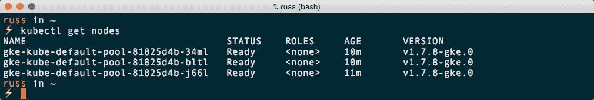

现在，打开您的`~/.kube/config`文件，并从`certificate-authority-data`部分中删除证书。这基本上会创建一个无效的证书，这意味着当您运行以下命令时，您将收到一个错误：

```
$ kubectl get nodes
```

错误将显示如下：

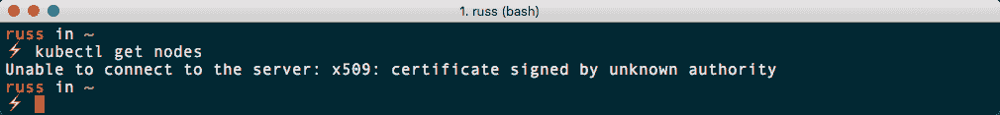

因此，除非您有正确证书的副本，否则无法连接到集群。不用担心，您仍然可以通过运行以下命令访问您的证书：

```
$ gcloud container clusters get-credentials kube
```

您将看到以下内容：

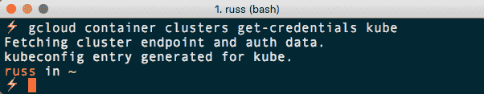

这个命令将连接到您的 Google Cloud 帐户，下载详细信息，并使用证书更新您的`~/.kube/config`文件。您可以通过运行以下命令测试新下载的凭据：

```
$ kubectl cluster-info
```

这将返回有关所有终端的详细信息：

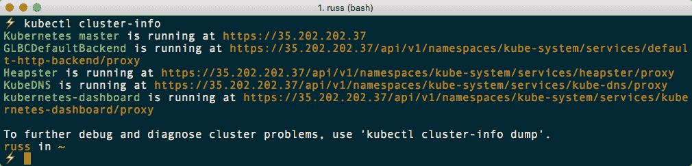

您可能会注意到列表中的最后一个 URL 是用于 Kubernetes 仪表板的。那么它是如何保护的呢？

让我们尝试将 URL 输入到浏览器中并查看。我输入了`https://35.202.202.37/api/v1/namespaces/kube-system/services/kubernetes-dashboard/proxy`（在您阅读此内容时，该 URL 将无法访问）到我的浏览器中，然后按回车键，立即收到一个证书警告；在接受了证书后，我看到了以下消息：

```
User "system:anonymous" cannot get services/proxy in the namespace "kube-system".: "No policy matched.\nUnknown user \"system:anonymous\""
```

这很好，因为这正是我们想要看到的——我们不希望未经身份验证的用户能够直接访问我们的仪表板。但是，我们如何访问它呢？我们没有用户名和密码，只有一个证书——即使我们有用户名和密码，我们会在哪里输入它们，考虑到我们从未被提示进行任何身份验证？

Kubernetes 有一个内置的代理服务器。启动时，代理服务器使用证书连接到您的 Kubernetes 集群。一旦连接，通过代理传递的所有流量都经过身份验证，您将能够使用服务。要启动代理，我们只需要运行以下命令：

```
$ kubectl proxy
```

您将看到代理启动如下：

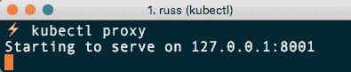

这将在前台启动代理进程。从前面的终端输出中可以看到，代理正在本地机器的`8001`端口上监听。我们只需要替换 URL 的公共部分并将其放入浏览器中。所以在我的情况下，我更新如下：

`https://35.202.202.37/api/v1/namespaces/kube-system/services/kubernetes-dashboard/proxy`

我改为如下所示：

`http://127.0.0.1:8001/api/v1/namespaces/kube-system/services/kubernetes-dashboard/proxy`

这将直接带您进入仪表板：

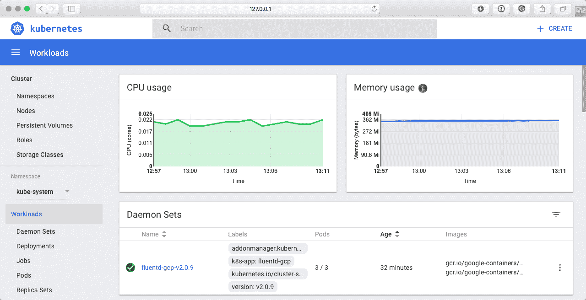

到目前为止，我们已经证明了 Google Cloud 上的 Kubernetes 配置是安全的。Microsoft Azure 集群以类似的方式工作，例如，我们运行以下命令来更新一旦集群部署完成后的本地凭据：

```
$ az aks get-credentials --resource-group KubeResourceGroup --name AzureKubeCluster
```

在使用`kubeadm`和`kube-aws`部署时，证书会生成并复制到我们的配置文件中。

因此，到目前为止，我们已经学到了，默认情况下 Kubernetes 强制执行基于证书的身份验证来保护您的安装，这意味着您必须付出相当大的努力来错误配置您的安装，以至于您的安装暴露给世界。然而，这有一个例外。这与您的安装无关；它更多地涉及您如何管理`kubectl`配置文件。

永远不要在任何地方发布它（例如，将其提交到 GitHub，或与同事共享）。如果它落入错误的手中，那么不仅有人拥有您的证书副本，他们还拥有您的集群其他信息，这意味着他们只需将其放置在本地机器上，就可以自由地开始启动应用程序。此外，由于大多数基于云的 Kubernetes 安装可以访问您的云提供商来启动支持服务，如负载均衡器、存储，以及可能的额外节点，您可能会发现自己面临相当大的账单，以及一个受损的集群。

我在本节前面分享的`kubectl`配置已被编辑，使其无效——还有它配置连接的集群已被终止。

所以，现在我们知道我们的 Kubernetes 集群应该是安全的，那么我们所看到的无服务器函数服务呢？

# 保护无服务器服务

我们已经在我们的本地 Kubernetes 集群和云上安装并连接了我们的每个服务。到目前为止，我们还没有真正考虑过如何保护它们——这是我们在上一章末提出的问题。

以下部分将讨论每个工具在其默认配置中的安全性以及此配置可能给您带来的潜在风险。我不会详细讨论如何保护每个工具，但在适当的情况下，我会提供链接到文档。

# OpenFaaS

让我们从 OpenFaaS 开始。我仍然在运行我的 Google Cloud 集群，所以我将使用前一章中克隆的`faas-netes`文件夹中的以下命令在那里部署 OpenFaaS：

```
$ kubectl apply -f ./faas.yml,monitoring.yml
```

如您所见，这次我只使用了`kubectl`而不是`helm`。我们可以通过运行以下命令来检查部署的服务：

```
$ kubectl get services
```

这将返回以下内容：

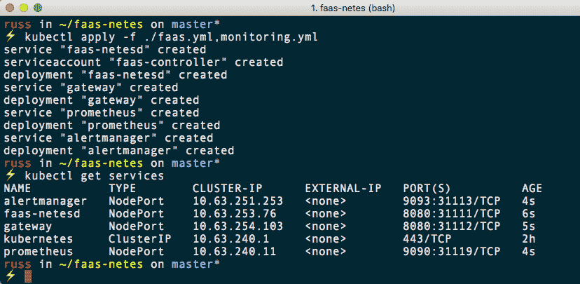

需要注意的一件事是，默认情况下 OpenFaaS 使用`NodePort`而不是负载均衡器来公开网关服务。没问题，你可能会想;我们可以使用以下命令来找到部署的名称并公开它：

```
$ kubectl get deployments
```

现在我们知道部署被称为网关，我们可以运行：

```
$ kubectl expose deployment gateway --type=LoadBalancer --name=gateway-lb
```

一两分钟后，运行以下命令应该给我们提供外部 IP 地址和端口：

```
$ kubectl get services
```

结果将如下所示：

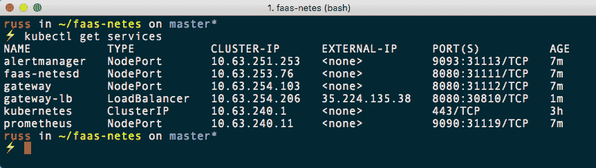

在浏览器中输入外部 IP 地址和端口`8080`——在我的情况下是`http://35.224.135.38:8080/ui/`——不幸的是，我们直接进入了 OpenFaaS UI，无需进行身份验证。使用命令行界面也是一样。那么，你如何保护你的 OpenFaaS 安装呢？

在 OpenFaaS GitHub 存储库上有关使用代理服务（如 Traefik 和 Kong）的说明。

Kong 是一个开源的 API 网关，它增加了诸如流量控制、日志记录、数据转换、分析以及最重要的身份验证等功能。有关 Kong 社区版的更多信息，请参阅[`konghq.com/kong-community-edition/`](https://konghq.com/kong-community-edition/)。

Traefik（发音为 Traffic）是一个反向 HTTP 代理，它从头开始设计，与 Kubernetes 等容器编排工具一起工作。它不仅提供负载平衡，还支持基本的 HTTP 身份验证和 SSL 终止。要了解有关 Traefik 的更多信息，请访问其网站[`traefik.io/`](https://traefik.io/)。

这两种工具都可以配置为位于 OpenFaaS 安装的前端并拦截请求，并在配置时向最终用户呈现登录提示。您可以通过使用公共云服务中的网络工具将 OpenFaaS 安装限制在您的 IP 地址上来保护 OpenFaaS 安装。这样做的缺点是，根据应用程序调用函数的方式，您可能无法完全将其限制。

因此，如果只是部署 OpenFaaS，将暴露 Kubernetes 集群的部分内容，这意味着第三方可能会潜在地访问您的资源，如果您不对其进行安全保护。有关保护 OpenFaaS 集群的更多信息，请参阅官方文档[`github.com/openfaas/faas/tree/master/guide`](https://github.com/openfaas/faas/tree/master/guide)。或者，您可以使用 Stefan Prodan 的 openfaas-gke 安装文件，该文件可以在[`github.com/stefanprodan/openfaas-gke/`](https://github.com/stefanprodan/openfaas-gke/)找到。还可以使用`kubectl proxy`命令访问 OpenFaaS 安装；但是，这可能会限制其实用性。

使用 OpenFaaS 还存在另一个潜在的安全问题，如果您已经是 Docker 用户，这应该是您熟悉的问题。由于 OpenFaaS 使用 Docker 镜像和 Docker Hub 作为其主要交付方法，因此在推送镜像时需要小心，因为镜像可能潜在地包含密码详细信息、API 凭据、自定义代码和其他您可能不希望通过公共容器镜像存储库访问的信息。解决此问题的方法是使用私有存储库或私有 Docker 注册表。

请不要将任何内容视为负面；OpenFaaS 是一款优秀的软件，我相信随着时间的推移，社区将引入变化，以确保之前详细介绍的步骤不会成为 Kubernetes 托管版本初始配置的一部分。

# Kubeless

接下来，让我们来看看 Kubeless。为了在我的 Google Cloud Kubernetes 集群中部署最新版本，我运行了以下命令：

```
$ export RELEASE=v0.3.0
$ kubectl create ns kubeless
$ kubectl create -f https://github.com/kubeless/kubeless/releases/download/$RELEASE/kubeless-$RELEASE.yaml
```

部署后，我运行了以下命令来查看哪些服务已经被暴露：

```
$ kubectl get services -n kubeless
```

如您从以下终端输出中所见，没有服务被公开暴露：

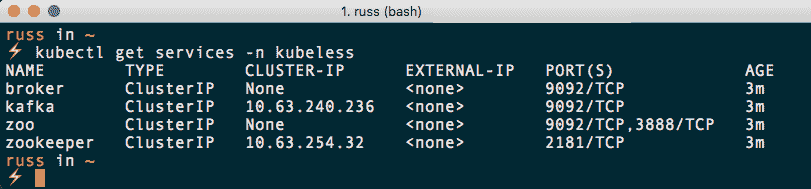

到目前为止，一切都很顺利。让我们快速启动一个测试函数并将其暴露出来。在`/Chapter04/hello-world/`文件夹中，我运行了以下命令：

```
$ kubeless function deploy hello --from-file hello.py --handler hello.handler --runtime python2.7 --trigger-http
```

这按预期创建了函数。运行以下命令确认函数可用且正在运行：

```
$ kubectl get function
$ kubeless function ls
$ kubeless function call hello
```

运行以下命令将该函数暴露给世界：

```
$ kubectl expose deployment hello --type=LoadBalancer --name=hello-lb
```

在短时间内，当`hello-lb`服务运行时，我可以看到一个 IP 地址：

```
$ kubectl get services
```

到目前为止，我们实际上并没有做任何事情来锁定我们的安装，那么它有多安全呢？对于这个问题的简短答案是非常安全，但是默认安装的 Kubeless 比默认安装的 OpenFaaS 更安全的原因是什么？

从表面上看，这两种技术在架构上是相似的；它们的服务器组件都部署在我们的 Kubernetes 集群上，并且我们使用本地机器上的命令行界面与这些组件进行交互。例如，我们为 Kubeless 使用了以下命令：

```
$ kubeless function deploy hello --from-file hello.py --handler hello.handler
--runtime python2.7 --trigger-http
```

在上一章中，我们使用以下命令来启动 OpenFaaS 中的函数：

```
$ export gw=http://$(minikube ip):31112
$ faas-cli deploy -f hello.yml --gateway $gw
```

正如您可能已经注意到的那样，在 Kubeless 的配置或使用过程中，我们从未不得不提供任何关于我们 Kubernetes 集群的详细信息，而在 OpenFaaS 中，我们必须明确告诉命令行界面我们 OpenFaaS 安装的 IP 地址和端口。

Kubeless 确切知道我们的集群在哪里，更重要的是，它在需要访问时进行身份验证。由于 Kubeless 是一个本地的 Kubernetes 框架，而不是安装在 Kubernetes 之上，它正在集成到我们的集群中，并添加额外的功能——在这种情况下是函数——并且正在使用其他 Kubernetes 技术，比如`kubectl`和自定义资源定义，来根据需要将我们函数的代码注入到运行时中，这意味着一切都包含在我们的 Kubernetes 集群中，与之的所有交互都是安全的。

这可以通过从`~/.kube/config`文件中删除证书，然后尝试列出函数来进行演示。您应该会看到以下错误：

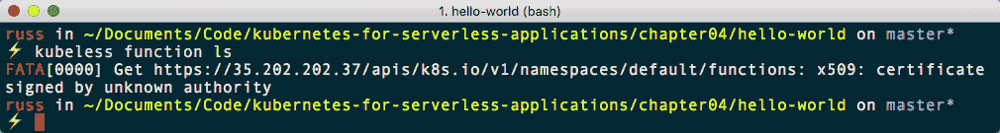

所有这些都意味着您的 Kubeless 安装默认情况下是安全的。

# 功能

Funktion，像 Kubeless 一样，默认情况下是安全的，因为它与您的 Kubernetes 集群紧密集成，并添加了额外的功能，其命令行界面在`kubectl`的基础上进行调用。

# Apache OpenWhisk

Apache OpenWhisk，像 OpenFaaS 一样，安装在您的 Kubernetes 集群之上，而不是完全集成自己。然而，正如我们在第七章中所介绍的那样，*Apache OpenWhisk 和 Kubernetes*，一旦服务暴露到公共互联网，CLI 需要配置以对安装进行身份验证。在那一章中，我们运行了以下命令来暴露服务并对客户端进行身份验证：

```
$ kubectl -n openwhisk expose service nginx --type=LoadBalancer --name=front-end
$ wsk -i property set --auth 23bc46b1-71f6-4ed5-8c54-816aa4f8c502:123zO3xZCLrMN6v2BKK1dXYFpXlPkccOFqm12CdAsMgRU4VrNZ9lyGVCGuMDGIwP --apihost https://35.188.204.73:443
```

因此，再次强调，默认情况下此服务是安全的，假设您不发布或分享身份验证密钥。

# Fission

在 Fission 安装期间，我们必须设置两个环境变量：

```
$ helm install --namespace fission https://github.com/fission/fission/releases/download/0.4.0/fission-all-0.4.0.tgz
$ export FISSION_URL=http://$(kubectl --namespace fission get svc controller -o=jsonpath='{..ip}')
$ export FISSION_ROUTER=$(kubectl --namespace fission get svc router -o=jsonpath='{..ip}')
$ fission env create --name nodejs --image fission/node-env
$ curl https://raw.githubusercontent.com/fission/fission/master/examples/nodejs/hello.js > hello.js
$ fission function create --name hello --env nodejs --code hello.js
$ fission route create --method GET --url /hello --function hello
$ curl http://$FISSION_ROUTER/hello
```

`FISSION_URL`和`FISSION_ROUTER`各有一个变量。这可能意味着不是所有的东西都是安全的。首先，让我们看看当我们访问`FISSION_URL`时我们得到了什么：

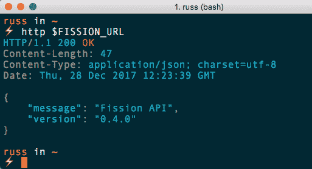

正如您所看到的，我们得到了一个标识 Fission API 和版本号的响应。从`~/.kube/config`文件中删除证书，并运行以下命令：

```
$ fission function list
```

我们仍然可以与我们的 Fission 安装进行交互；这意味着默认情况下 Fission 没有身份验证，并且当我们使用推荐的安装程序时，API 默认暴露在互联网上：

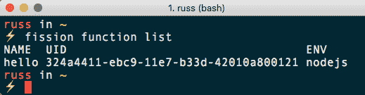

正在进行工作，以使用更安全的默认设置来发布 Fission；您可以在以下 GitHub 问题中跟踪其进展：[`github.com/fission/fission/issues/22/`](https://github.com/fission/fission/issues/22/)。

在那之前，建议您更新 Helm 图表，将控制器服务的`serviceType`设置为`ClusterIP`。从下面的输出中可以看到，它目前设置为`LoadBalancer`：

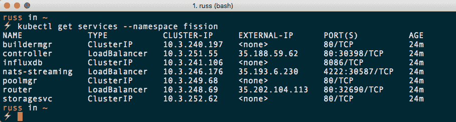

一旦您配置服务使用`ClusterIP`，您可以使用`kubectl`内置的代理配置从本地主机到控制器的端口转发。执行此操作的命令看起来类似于以下内容：

```
$ kubectl -n fission port-forward $(kubectl -n fission get pod -o name|grep controller|cut -f2 -d'/') 8888
```

这意味着您的`FISSION_URL`将类似于`http://localhost:1234`，而不是一个没有身份验证的外部可访问的 URL。Fission 开发人员正在将这个解决方案集成到 Fission 中，并且它应该成为 2018 年早期版本的默认配置之一。

# 结论

正如您所看到的，当涉及到保护我们的无服务器安装时，我们有一个相当混杂的情况——我们涵盖的一些解决方案是默认安全的，而另一些解决方案，比如旧的默认 MongoDB 配置，需要更多的工作来保护它们并使其达到生产就绪状态。在永久部署本书中涵盖的任何工具之前，请确保您已经审查了每个工具暴露的内容以及如何最好地将其锁定。

# 监控 Kubernetes

在我们开始研究各种监控 Kubernetes 集群的方法之前，我们应该快速谈谈当涉及到一个可能有很多移动部分的工具时，我们所说的监控是什么意思。

传统上，监控服务器意味着密切关注固定服务器上运行的应用程序的可用性。为了做到这一点，我们的监控工具将汇总有关 CPU、RAM 和磁盘利用率的信息，以及正在运行的服务、进程数量以及服务和服务器本身的可用性。

我们将在特定阈值处设置触发器，这样，例如，如果 CPU 负载增加，我们可以登录到服务器并在所述 CPU 负载开始影响我们应用程序性能之前进行一些调查。

正如您所能想象的，监控 Kubernetes 集群与此有很大不同。按设计，集群中运行的应用程序应具有容错性和高可用性——事实上，我们在之前章节中运行的函数有时只有执行函数所需的寿命。

这改变了我们监控集群的方式，因为我们相信许多我们传统上要监控的事情将由 Kubernetes 本身处理，而不需要我们登录并采取预防措施。

考虑到这一点，我们不需要深入了解监视 Kubernetes 集群的细节——这可能需要一本完全不同的书。相反，我们将快速查看一下使用仪表板、Google Cloud 和 Microsoft Azure 来审查我们 Kubernetes 集群的服务指标的一些选项，因为这两者都原生支持 Kubernetes 集群。

# 仪表板

Kubernetes 仪表板不仅是管理集群的重要资源；它还为您提供了一个很好的视觉概述，显示您正在运行的内容以及当前的性能。

例如，在命名空间下拉菜单中选择所有命名空间，然后在左侧菜单的工作负载部分点击 Pods，将为您提供所有正在运行的 Pod 的列表，以及每个 Pod 当前使用 CPU 和 RAM 的详细情况：

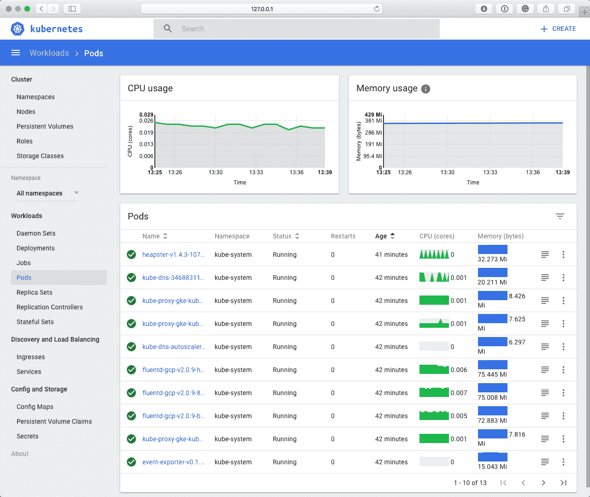

点击一个 Pod——在这种情况下是 heapster——将为您提供该 Pod 中组成容器正在使用的资源的更详细的分解：

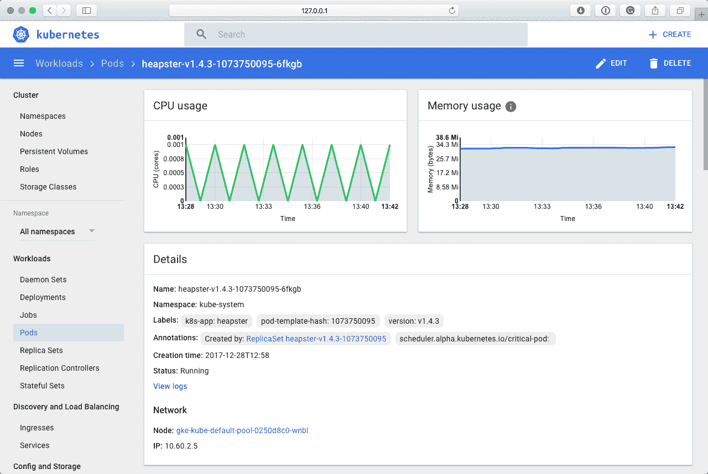

向下滚动将显示容器。在 heapster 的情况下，Pod 中有三个容器。从这里，您可以实时查看每个容器的日志：

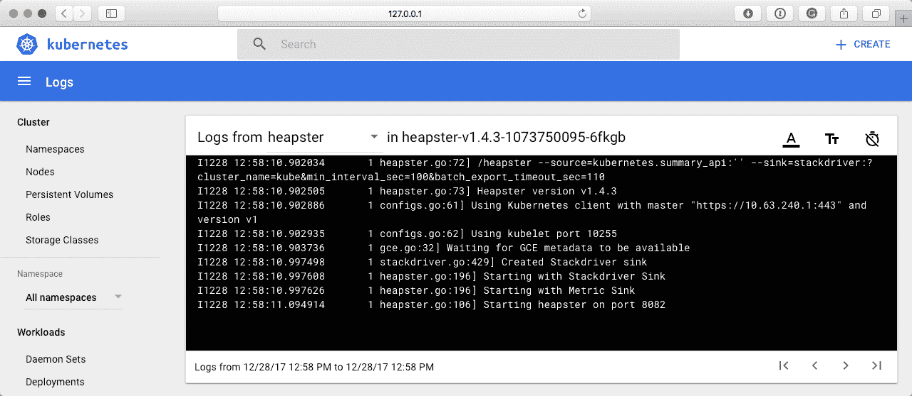

可以想象，这是一个非常有用的功能，当您需要调试正在运行的容器时。

然而，您可能已经注意到在查看仪表板时，显示的 CPU 和 RAM 利用率仅为过去 15 分钟的数据——您无法深入挖掘或查看更早的数据。因此，有关当前运行服务的信息可以通过仪表板获得。

这使得仪表板非常适合登录并快速了解集群的概况——而且仪表板已经默认包含在大多数 Kubernetes 集群中，非常方便。

# Google Cloud

接下来是 Google Cloud。从外表看，Google Cloud 控制台的 Kubernetes 部分看起来几乎与 Kubernetes 仪表板相似：

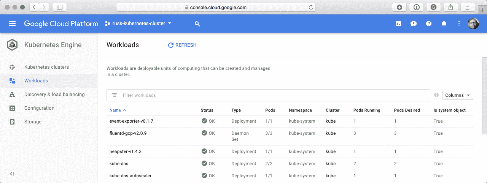

然而，正如您从前面的截图中所看到的，除了显示 OK 状态之外，它实际上并没有告诉您有关集群内部发生了什么。相反，您需要使用 Stackdriver，它可以从 Google Cloud 控制台的左侧菜单中访问。

Google Stackdriver 是一个 Google Cloud 服务，允许您记录来自多个来源的指标，包括 Google Cloud 服务、AWS，以及使用代理的个别服务器。该服务不是免费的；详细的成本分解可以在[`cloud.google.com/stackdriver/pricing`](https://cloud.google.com/stackdriver/pricing)找到。我们将使用免费试用版，但如果您已经使用过 Google Stackdriver，则以下步骤可能会产生费用。

当您首次进入 Stackdriver 时，将会被问到几个问题。通过这个过程，在结束时，您应该可以免费试用并收集来自您的 Kubernetes 集群的日志。几分钟后，您应该开始看到来自您的集群的信息显示在指标资源管理器中。从这里，您可以开始构建诸如以下仪表板之类的仪表板：

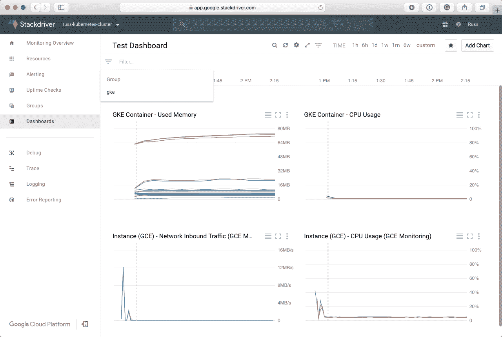

正如您从上述屏幕截图中所看到的，我们有选项查看超过 15 分钟的数据 - 实际上，仪表板显示了超过一个小时的数据，这就是集群的年龄。

Stackdriver 不仅可以让您访问有关您的集群的指标，还可以访问来自您的 Kubernetes 集群和容器本身的日志：

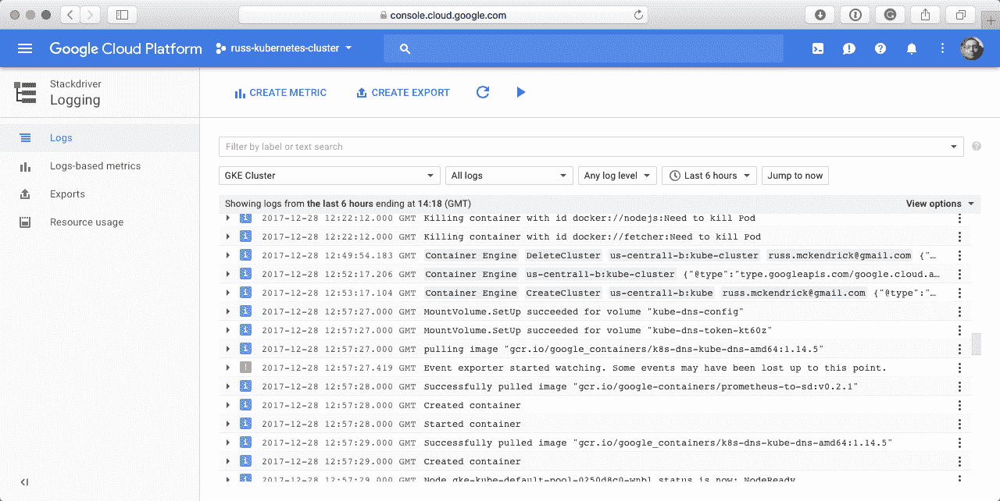

由于日志和指标被存储在集群之外，您还可以访问有关容器的历史信息。如果您在一个只活动几秒钟的容器中运行一个函数，您不仅可以看到该容器的 RAM 和 CPU 利用率，还可以访问整个容器的生命周期。

Stackdriver 的其他功能包括关于您整体使用情况的每日、每周和每月电子邮件报告，以及配置触发器的选项，用于当指标阈值被触发或日志文件中出现事件时通知您 - 您可以通过短信、电子邮件甚至聊天产品（如 Slack 或 Campfire）收到这些通知。

# Microsoft Azure

与 Google Cloud 相比，Microsoft Azure 对您的 Kubernetes 集群的开箱即用的洞察力并不是很好。您无法看到集群内部的运行情况，虽然有可用的指标，但它们只适用于主机机器 - 例如，您可以在以下屏幕截图中看到 CPU 利用率：

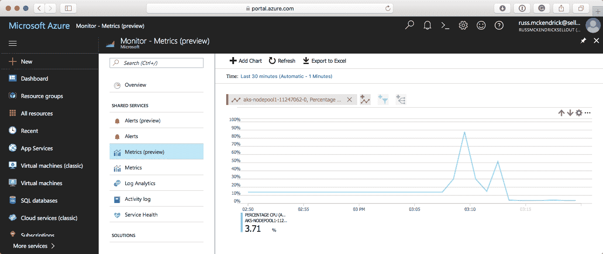

同样，您可以使用以下命令启动 Kubernetes 仪表板（确保用您自己的资源组和名称替换）：

```
$ az aks browse --resource-group KubeResourceGroup --name AzureKubeCluster
```

不过不用担心，还有容器监控解决方案；这是一个基于代理的系统，您可以部署在您的 Kubernetes 集群上，然后将信息反馈给 Azure 门户。

要部署它，您需要在 Azure 门户内搜索 Microsoft 的容器监控解决方案。单击“创建”按钮将要求您创建一个工作空间；我选择在与我的 Kubernetes 集群相同的资源组和区域中创建我的工作空间。确保选中“固定到仪表板”，然后单击“部署”。

这就有点复杂了，因为您需要获取工作空间 ID 和主密钥。这些信息深藏在一系列链接中。要获取它们，转到您的仪表板并选择您的工作空间—我的标记为 Containers(russ-monitor)。然后，单击“OMS 工作区”，然后单击“高级设置”。您应该看到类似以下屏幕截图的内容：

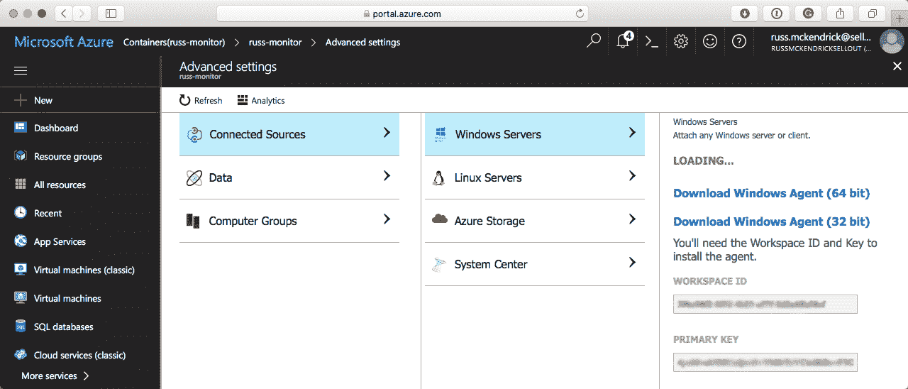

记下工作空间 ID 和主密钥（在上述屏幕截图中我的已模糊处理）。在本书附带的存储库的`Chapter10`文件夹中有一个名为`oms-daemonset.yaml`的文件；复制该文件并更新其中的`env`部分的值，以便使用您实际的工作空间 ID 和主密钥进行更新：

```
env:
  - name: WSID
    value: <WORKSPACE ID>
  - name: KEY
    value: <PRIMARY KEY>
```

更新文件后，从保存了更新后的`oms-daemonset.yaml`文件的同一文件夹中运行以下命令，将`daemonset`部署到您的集群中：

```
$ kubectl create -f oms-daemonset.yaml
```

部署后，您应该能够运行以下命令来确认一切是否按预期工作：

```
$ kubectl get daemonset
```

您应该在集群中的每个节点上看到一个`daemonset`。由于我的集群有三个节点，结果看起来像下面这样：

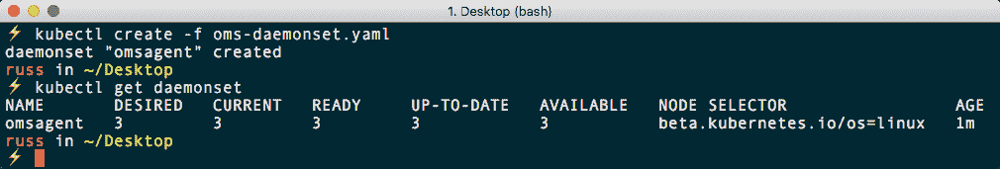

部署后，大约 15 分钟后，您应该能够重新访问您的工作空间并开始记录统计信息。以下屏幕截图给出了您对记录的信息的一个概念。

第一个屏幕显示了有关在您的 Kubernetes 集群中运行的容器数量的一些基本信息，以及 Kubernetes 记录的任何错误和事件：

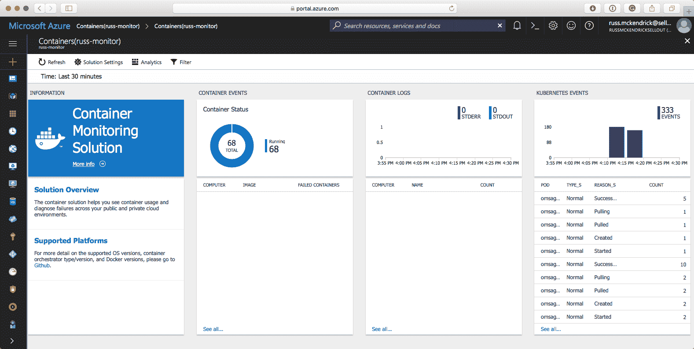

向右滚动将向您显示有关集群的更多详细信息：

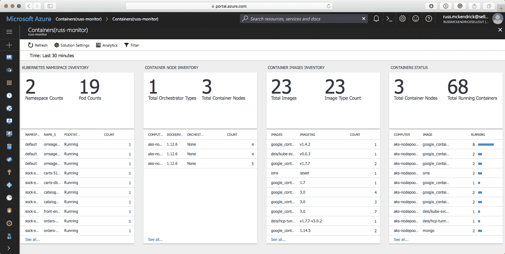

正如您所看到的，我们有信息在我集群中运行的两个命名空间中的 pod，然后我们有集群中的节点。在此之后，我们有所有已下载的映像，以及所有正在运行的容器的详细信息。

再次向右滚动将显示更多信息：

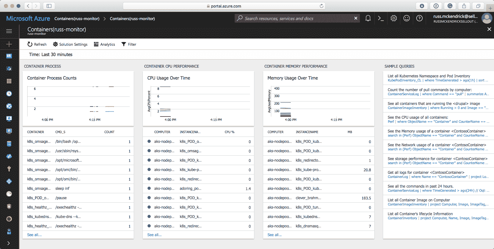

在这里，我们可以看到我们所有容器中的进程数量，我们选择的时间范围内的 CPU 和内存性能，最后，我们可以运行在我们收集的数据上的一些示例查询。单击链接将执行示例查询，然后，您将有选项将结果保存为 Microsoft Excel 文件或将数据导出到 Microsoft 的 Power BI 服务。

Power BI 是由 Microsoft 提供的业务分析服务。它允许您创建仪表板并对数据集进行一些相当复杂的计算，其中之一是将度量数据从 Kubernetes 集群导出到 Microsoft Azure 工作区。

正如您所看到的，我们已经从几乎没有信息到被我们集群的统计数据和日志所淹没。有关 Microsoft 的容器监视解决方案的更多信息，请参阅其产品页面[`docs.microsoft.com/en-us/azure/log-analytics/log-analytics-containers/`](https://docs.microsoft.com/en-us/azure/log-analytics/log-analytics-containers/)。

# 摘要

在本章中，我们讨论了我们的 Kubernetes 集群如何受到保护，以及如何保护我们在前几章中看到的每个无服务器工具的默认配置。我们已经看过三种方法，可以使用 Kubernetes 仪表板从我们的 Kubernetes 集群获取实时统计信息，并且还查看了 Google Cloud 和 Microsoft Azure 提供的监控工具，用于存储和查询来自您的集群的指标。

在下一章中，也是最后一章，我们将看看如何基于我们在前几章中学到的知识最好地在 Kubernetes 上运行无服务器工作负载。
