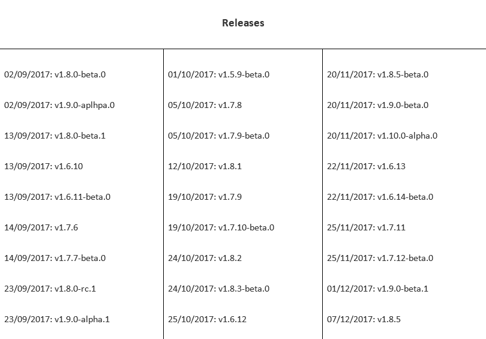

# 运行无服务器工作负载

在我们的最后一章中，我们将讨论一些不同的情景，您会希望在其中托管自己的无服务器工作负载，并在选择工具时要考虑什么。我们将从讨论使用一种仍处于萌芽阶段并且仍在积极开发中的技术的优缺点开始。

# 软件和平台的发展

我们在本书中看到的几乎所有技术目前都在开发中。正如我们已经讨论过的，一些项目正处于开发的早期阶段，而另一些则更加成熟。让我们先讨论 Kubernetes 本身。

# Kubernetes

Kubernetes 目前正在积极开发，尽管它已经相当成熟。我在 2017 年 9 月初开始写这本书，现在，当我写下最后一章时，已经是 2017 年 12 月底了。

在这段时间内，一共发布了 48 个版本，如下截图所示：



这些更新涵盖了从维护版本 v1.5、v1.6 和 v1.7 到实际版本 v.1.8 和 v1.9，以及随后的维护版本，一直到 v1.10 的第一个 alpha 版本。在如此活跃的发布周期中，保持对发布的掌握有多容易呢？

嗯，考虑到发布的频率，情况并不像你想象的那么糟糕，尽管可能会变得复杂。正如您从表中看到的，每个 Kubernetes 发布都有一个主要版本、一个次要版本和一个补丁版本。例如，我写作时的当前版本是：

+   v1.6.13（较旧版本）

+   v1.7.11（较旧版本）

+   v1.8.6（当前版本）

+   v1.9.0（开发版本）

截至 2017 年 12 月 12 日，同一主要版本有四个次要版本正在积极开发和修补。Kubernetes 本身支持同时三个次要版本；即当前版本（v1.8）和两个较旧的版本（v1.6 和 v1.7）。这意味着：

+   预计运行当前版本的主节点将与运行两个先前版本的节点一起工作。也就是说，您可以在集群中拥有一个 v1.8 主节点和混合的 v1.7 和 v1.6 节点。

+   运行当前版本的主节点预计可以与一个版本落后和一个版本领先于当前版本的客户端（如 kubectl）一起工作；这意味着我们可以将我们的 v1.8 主节点与 v1.9 和 v1.10 客户端进行交互。

+   建议无论您运行哪个版本，都始终运行最新的补丁版本，因为补丁通常包含关键的错误和安全修复程序。

这种支持模型意味着在 v1.6.13 版本中可能存在的功能在 v1.9.0 版本中可能不可用。每两个月左右发布一个新的次要版本，您有大约四个月的时间来计划更新，然后两个月的时间来执行它们——这可能意味着审查并可能更新已部署在您的集群中的现有应用程序，以确保它们没有使用最近版本中正在逐步淘汰的任何功能。

阅读发布说明变得非常宝贵，因为新的次要版本总是有一个*升级前*部分，确认自上一个版本发布以来可能存在的潜在破坏集群的变化。例如，当前的开发版本是 v1.9.0。我知道它将在大约两个月内成为当前版本，所以为了做好准备，我需要处理我的集群，并确保考虑到[`github.com/kubernetes/kubernetes/blob/master/CHANGELOG-1.9.md#before-upgrading`](https://github.com/kubernetes/kubernetes/blob/master/CHANGELOG-1.9.md#before-upgrading)中详细列出的所有变化。

功能只会在次要版本中添加、弃用和移除。补丁版本只是对现有功能的修补。我还建议阅读*Kubernetes Depreciation Policy*，其中解释了删除/禁用功能的规则。该政策可以在[`kubernetes.io/docs/reference/deprecation-policy/`](https://kubernetes.io/docs/reference/deprecation-policy/)找到。

您可以通过运行以下命令列出可以使用 Minikube 部署的 Kubernetes 版本：

```
$ minikube get-k8s-versions
```

Google Cloud 支持的 Kubernetes 版本发布可以在[`cloud.google.com/kubernetes-engine/supported-versions`](https://cloud.google.com/kubernetes-engine/supported-versions)找到。Microsoft Azure 支持所有当前版本；可以在 AKS 介绍博客文章中找到此支持的示例，网址为[`azure.microsoft.com/en-us/blog/introducing-azure-container-service-aks-managed-kubernetes-and-azure-container-registry-geo-replication/`](https://azure.microsoft.com/en-us/blog/introducing-azure-container-service-aks-managed-kubernetes-and-azure-container-registry-geo-replication/)，示例显示了从 v1.7.7 实时升级到 v1.8.1。

# 无服务器工具

那么，Kubernetes 的持续发展周期如何影响我们一直在关注的无服务器工具的开发，以及这如何影响它们自己的开发周期？

首先，让我们看看工具的类型。在上一章中，当我们研究安全性时，我们发现基本上有两种类型的工具。第一种是在 Kubernetes 内添加和扩展功能的工具，例如 Kubeless 和 Funktion。第二种类型的工具通过基本上位于 Kubernetes 之上并进行 API 调用来消耗 Kubernetes 服务，例如 Apache OpenWhisk，Fission 和 OpenFaaS。

与 Kubernetes 密切耦合的工具将不仅需要根据 Kubernetes 规划其发布，还需要密切关注 Kubernetes 的发展路径，因为 Kubernetes 特别兴趣小组的决定将直接影响它们自己的路线图。

例如，2017 年 9 月，Kubeless 发布了一个更新，从使用**ThirdPartyResources**（**TPR**）更改为**CustomResourceDefinitions**（**CRD**），因为 TPR 在 Kubernetes v.1.7 中已被弃用，并在 v1.8 中删除。

这意味着您选择的工具将需要一些研究。您应该问自己的问题是：

+   我正在评估的工具是否与我将在集群中部署的 Kubernetes 版本兼容？如果有疑问，您可以通过在 Minikube 上进行一些测试安装来进行检查。

+   是否有任何可能影响我的部署的未解决问题？在承诺使用该工具之前，我建议查看工具 GitHub 项目页面上的任何未解决问题；其中有没有问题听起来很熟悉，并且可能适用于您的安装？

+   我正在考虑部署的工具是否在积极开发中，新版本发布频率如何？是否有社区支持该工具？查看 GitHub 上的发布页面；发布频率如何，是否有任何破坏性的发布？

+   该工具有多安全？根据前一章，默认配置有多安全，使其安全会如何影响您使用该工具？

以下是一些有用的链接，应该可以帮助您回答之前的问题。

# Kubeless

Kubeless 的有用链接如下：

+   **项目主页**：[`kubeless.io/`](http://kubeless.io/)

+   **项目许可证**：[`github.com/kubeless/kubeless/blob/master/LICENSE`](https://github.com/kubeless/kubeless/blob/master/LICENSE)

+   **问题**：[`github.com/kubeless/kubeless/issues`](https://github.com/kubeless/kubeless/issues)

+   **发布版**：[`github.com/kubeless/kubeless/releases`](https://github.com/kubeless/kubeless/releases)

+   **贡献指南**：[`github.com/kubeless/kubeless/blob/master/CONTRIBUTING.md`](https://github.com/kubeless/kubeless/blob/master/CONTRIBUTING.md)

+   **文档**：[`github.com/kubeless/kubeless/tree/master/docs`](https://github.com/kubeless/kubeless/tree/master/docs)

# Apache OpenWhisk

OpenWhisk 的有用链接如下：

+   **项目主页**：[`openwhisk.apache.org`](https://openwhisk.apache.org)

+   **项目许可证**：[`github.com/apache/incubator-openwhisk/blob/master/LICENSE.txt`](https://github.com/apache/incubator-openwhisk/blob/master/LICENSE.txt)

+   **问题**：[`github.com/apache/incubator-openwhisk/issues`](https://github.com/apache/incubator-openwhisk/issues)

+   **贡献指南**：[`github.com/apache/incubator-openwhisk/blob/master/CONTRIBUTING.md`](https://github.com/apache/incubator-openwhisk/blob/master/CONTRIBUTING.md)

+   **文档**：[`cwiki.apache.org/confluence/display/OPENWHISK/OpenWhisk+Project+Wiki`](https://cwiki.apache.org/confluence/display/OPENWHISK/OpenWhisk+Project+Wiki)

# Fission

Fission 的有用链接如下：

+   **项目主页**：[`fission.io/`](http://fission.io/)

+   **项目许可证**：[`github.com/fission/fission/blob/master/LICENSE`](https://github.com/fission/fission/blob/master/LICENSE)

+   **问题**：[`github.com/fission/fission/issues`](https://github.com/fission/fission/issues)

+   发布：[`github.com/fission/fission/releases`](https://github.com/fission/fission/releases)

+   贡献指南：[`github.com/fission/fission/blob/master/CONTRIBUTING.md`](https://github.com/fission/fission/blob/master/CONTRIBUTING.md)

+   文档：[`github.com/fission/fission/tree/master/Documentation`](https://github.com/fission/fission/tree/master/Documentation)

# OpenFaaS

OpenFaaS 的有用链接如下：

+   项目主页：[`www.openfaas.com`](https://www.openfaas.com)

+   项目许可证：[`github.com/openfaas/faas/blob/master/LICENSE`](https://github.com/openfaas/faas/blob/master/LICENSE)

+   问题：[`github.com/openfaas/faas/issues`](https://github.com/openfaas/faas/issues)

+   发布：[`github.com/openfaas/faas/releases`](https://github.com/openfaas/faas/releases)

+   贡献指南：[`github.com/openfaas/faas/blob/master/CONTRIBUTING.md`](https://github.com/openfaas/faas/blob/master/CONTRIBUTING.md)

+   文档：[`github.com/openfaas/faas/tree/master/docs`](https://github.com/openfaas/faas/tree/master/docs)

# Funktion

Funktion 的有用链接如下：

自从这本书开始编写以来，Funktion 已经被沙箱化。源代码仍然可供任何人使用，或者分叉他们自己的版本以继续开发。作者建议两种替代方案：Kubeless 或 Apache OpenWhisk。

+   项目主页：[`funktion.fabric8.io`](https://funktion.fabric8.io)

+   项目许可证：[`github.com/funktionio/funktion/blob/master/LICENSE.md`](https://github.com/funktionio/funktion/blob/master/LICENSE.md)

+   问题：[`github.com/funktionio/funktion/issues`](https://github.com/funktionio/funktion/issues)

+   发布：[`github.com/funktionio/funktion/releases`](https://github.com/funktionio/funktion/releases)

+   贡献指南：[`cwiki.apache.org/confluence/display/OPENWHISK/OpenWhisk+Project+Wiki`](https://cwiki.apache.org/confluence/display/OPENWHISK/OpenWhisk+Project+Wiki)

+   文档：[`funktion.fabric8.io/docs/`](https://funktion.fabric8.io/docs/)

# 未来发展

在技术领域，三个月是很长的时间。自我开始写这本书以来，Kubernetes 生态系统发生了一些变化；最显著的两个目前处于私人测试阶段，预计将在 2018 年初向公众开放使用。

第一个是使用 Minikube 在本地运行 Kubernetes 的替代方案，这源自一个意想不到的来源：Docker。在 2017 年的 DockerCon Europe 上宣布，Docker 将在 Docker for macOS 和 Docker for Windows 的社区版和企业版中支持 Kubernetes 和 Docker swarm。

您可以在[`www.docker.com/kubernetes`](https://www.docker.com/kubernetes)找到有关即将发布的更多信息，或观看 Elton Stoneman 为该服务的介绍视频[`www.youtube.com/watch?v=jWupQjdjLN0`](https://www.youtube.com/watch?v=jWupQjdjLN0)。

第二项服务毫不意外地是引入了**Amazon 弹性容器服务 for Kubernetes**服务，简称**Amazon EKS**。亚马逊在他们每年的 re:Invent 大会上宣布了这一点，正如您所期望的那样，它与其他 AWS 服务（如 Amazon VPC、IAM、弹性负载均衡和 AWS CloudTrail 等）有深度集成。您可以在[`aws.amazon.com/eks/`](https://aws.amazon.com/eks/)找到有关该服务的更多信息，目前该服务处于私有测试阶段，也可以观看宣布视频[`www.youtube.com/watch?v=gUFtUU7qvSQ`](https://www.youtube.com/watch?v=gUFtUU7qvSQ)。

# 为什么在 Kubernetes 上使用函数作为服务

在前几章中，我们谈到了无服务器函数和 Kubernetes 以及使用它们的优势：

+   **Kubernetes**：使用 Kubernetes 部署应用程序的最大用例是，它允许您开发一次，然后以一致的方式在多个平台上部署，无论是自托管的裸机服务器，还是在 VMWare、OpenStack、KVM、Hyper-V 等上运行虚拟机的私有云。对于谷歌云、微软 Azure 和现在的 AWS 等公共云提供商也是一样，它们都提供自己的本地托管 Kubernetes 服务，包括 Minikube 或即将发布的 Docker for macOS 或 Docker for Windows 版本。

+   **无服务器**: 将应用程序的全部或部分部署为无服务器函数可以帮助它轻松扩展。突然间，你不需要担心你的虚拟机或容器是否有足够的资源来处理大量的传入连接，或者这些连接如何路由到你的应用程序。每个请求将被发送到一个个体或一组容器中，在那里你的请求将被处理——一旦完成，该容器将被终止或回收用于下一个请求。

+   **Kubernetes 加无服务器**: 正如前面提到的，应用程序的无服务器部分可以轻松扩展——这可以与 Kubernetes 结合，其中可以快速地手动或通过脚本添加额外的节点到你的集群中。一旦额外的资源成为集群的一部分，你的无服务器函数将自动安排在新资源上，而无需对应用程序路由或代码进行进一步的更改。

再加上你几乎可以在所有主要的公共云提供商中部署你的应用程序的知识，你将获得一致的体验，而不必调整你的代码以适应提供商自己的函数即服务提供，比如我们在第一章中讨论的那些。*无服务器景观*。

你选择无服务器工具很可能取决于两个因素，第一个是你的应用程序是用什么语言编写的，例如，你的应用程序是用 Python、Node.js、PHP、Java、.NET 还是 Go 编写的？

第二个因素将是个人偏好。在阅读本书的章节时，你可能已经对哪种工具最适合你以及哪种工具适合你的开发工作流程和自己的工作方式形成了看法。安全等问题总是一个影响因素，但正如在上一章中讨论的那样，有办法克服这些问题。

# 固定点

到目前为止，我们一直在讨论许多可能是小的移动部分。那么大的固定点，比如数据库和文件存储，该如何与 Kubernetes 上的 FaaS 服务结合呢？

# 数据库

关于是否应该在容器中运行数据库服务仍在进行讨论——这基本上自从 Docker 开始获得关注以来就一直存在，不幸的是，没有一个简单的是或不是的答案。

每当我开始一个项目，我倾向于查看数据库的使用情况以及对应用程序整体性能的影响，然后从那里开始工作。

Kubernetes 允许您运行 PetSet；回想一下本书开头的宠物与牛的比喻。在 Kubernetes v1.5 中，随着该功能退出 alpha 版，它被称为 StatefulSet。该功能在 Kubernetes v1.9 中退出 beta 版。

请参见以下 GitHub 问题，讨论从 PetSet 更名为 StatefulSet 的更改[`github.com/kubernetes/kubernetes/issues/27430`](https://github.com/kubernetes/kubernetes/issues/27430)。

StatefulSet 允许您运行传统上在 Kubernetes 等集群服务中运行起来相当困难的东西。通过使用 pod 和持久存储的组合，它基本上在 Kubernetes 集群中创建了一个固定点，其中：

+   具有稳定的唯一网络标识符，如果 StatefulSet 需要在主机之间移动或者由于错误需要重新启动 pod，它将持续存在

+   具有稳定的专用于 StatefulSet 的持久存储，用于存储数据库、配置等

+   具有有序和优雅的部署和扩展、删除和终止，以及自动滚动更新，所有这些意味着您可以控制需要在启动、移动或关闭时进行控制的软件。

所有这些意味着在 Kubernetes 集群中托管数据库是完全可能的。这样做意味着您将能够在相同的命名空间内连接到您的数据库，但这种解决方案可能并非适用于所有情况。

例如，如果您有一个大型数据集，或者您的数据库需要被 Kubernetes 集群外的其他应用程序访问，那么您最好使用公共云提供商提供的本地数据库服务。这些服务包括：

+   **Amazon 关系型数据库服务**（**Amazon RDS**）：该服务支持 MySQL、PostgreSQL、MariaDB、Oracle 和 Microsoft SQL。更多详情请参见[`aws.amazon.com/rds/`](https://aws.amazon.com/rds/)。

+   微软 Azure 数据库：有 Microsoft SQL、MySQL 和 PostgreSQL 选项；请参阅[`azure.microsoft.com/en-gb/services/sql-database/`](https://azure.microsoft.com/en-gb/services/sql-database/)、[`azure.microsoft.com/en-gb/services/mysql/`](https://azure.microsoft.com/en-gb/services/mysql/)和[`azure.microsoft.com/en-gb/services/postgresql/`](https://azure.microsoft.com/en-gb/services/postgresql/)获取更多详细信息。

+   谷歌云 SQL：支持 MySQL 和 PostgreSQL。有关更多信息，请参阅以下链接：[`cloud.google.com/sql/`](https://cloud.google.com/sql/)。

尽管使用这些服务会使您暴露于一定程度的供应商锁定，因为您的大部分数据将位于 Kubernetes 集群之外，但这三个服务都提供开源数据库引擎，从应用程序的角度来看，这意味着它们仍然在使用相同的数据库服务，无论是在您的集群内托管还是作为您的公共云提供商服务之一。

有关 StatefulSets 的更多信息，我建议阅读 Kubernetes 网站上的以下两个示例：

+   [`kubernetes.io/docs/tasks/run-application/run-single-instance-stateful-application/`](https://kubernetes.io/docs/tasks/run-application/run-single-instance-stateful-application/)

+   [`kubernetes.io/docs/tasks/run-application/run-replicated-stateful-application/`](https://kubernetes.io/docs/tasks/run-application/run-replicated-stateful-application/)

请记住，直到 Kubernetes v1.9 版本之前，此功能都处于测试阶段，因此如果您的集群运行的是旧版本，可能需要查看文档。

# 存储

大多数现代应用程序应该不再存储在本地驱动器上生成的文件，而是应该使用对象存储。通常，对象提供了一个 API，允许应用程序将文件写入服务，并查询服务以查找文件的元数据，包括检索文件可以通过 HTTP 访问的 URL。

三大公共云提供商都提供对象存储：

+   亚马逊 S3：[`aws.amazon.com/s3/`](https://aws.amazon.com/s3/)

+   微软 Azure Blob 存储：[`azure.microsoft.com/en-gb/services/storage/blobs/`](https://azure.microsoft.com/en-gb/services/storage/blobs/)

+   谷歌云存储：[`cloud.google.com/storage/`](https://cloud.google.com/storage/)

Amazon S3 是它们中的鼻祖；很可能在过去 48 小时内，您已经访问过直接从 Amazon S3 提供的文件，或者间接地使用内容传送网络，其中 Amazon S3 是文件的来源。

如果您希望将应用程序保留在 Kubernetes 中，包括对象存储，不用担心，可以运行自己的对象存储；事实上，您可以运行一个与 Amazon S3 具有高度兼容性的对象存储，这意味着您的应用程序应该可以继续工作，几乎不需要修改。

Minio 是一个多云对象存储，可以部署到 Kubernetes 以及其他云和服务提供商；甚至可以使用 Minikube 在本地运行它。

有关 Kubernetes 上的 Minio 的更多信息，请参阅以下链接：[`www.minio.io/kubernetes.html`](https://www.minio.io/kubernetes.html)。

# 总结

所以，我们到了书的结尾。我们已经解释了什么是无服务器，并解决了在服务器上运行无服务器函数的混乱。

我们已经了解了 Kubernetes 是如何起步以及一些核心概念，以及如何使用 Kubernetes 提供的工具在本地和公共云中部署集群，还有云服务提供商的原生解决方案。

使用这些集群，我们通过了几个工具，它们都提供了函数即服务功能，要么通过扩展 Kubernetes 的新功能，要么通过利用 Kubernetes 的平台即服务功能并在其上安装自己。

然后我们讨论了这些部署可能存在的安全问题以及如何监视它们，然后讨论了我们如何努力保持领先的不断发展的技术，并且在开始在 Kubernetes 上部署无服务器函数时需要考虑的事项。
