# 一、无服务器的概览

欢迎来到无服务器应用库本内特的第一章。在本章中，我们将研究和讨论以下内容:

*   我们所说的无服务器和功能即服务是什么意思？
*   有哪些服务？
*   亚马逊网络服务提供的 Lambda 示例
*   天蓝色函数的一个例子
*   使用无服务器工具包
*   使用无服务器和功能即服务，我们可以解决哪些问题？

我认为重要的是，我们从解决房间里的大象开始，这就是术语无服务器。

# 无服务器和功能即服务

当你对某人说无服务器时，他们首先得出的结论是你在没有任何服务器的情况下运行你的代码。

如果您使用的是我们将在本章后面讨论的公共云服务之一，这可能是一个相当有效的结论。然而，当涉及到在您自己的环境中运行时，您无法避免必须在某种服务器上运行。

在我们讨论无服务器和功能即服务的含义之前，我们应该先讨论一下我们是如何做到这一点的。和我一起工作的人无疑会告诉你，我喜欢经常使用*宠物与牛*的类比，因为这是解释现代云基础设施与更传统方法之间差异的一种非常简单的方法。

# 宠物、牛、鸡、昆虫和雪花

早在 2012 年，我第一次从兰迪·比思(Randy Bias)出版的幻灯片中看到了宠物与牛的类比。Randy Bias 在关于开放和可扩展云的架构的云扩展会议上的演讲中使用了幻灯片。在演讲快结束时，他介绍了宠物与牛的概念，兰迪把这个概念归功于比尔·贝克，他当时是微软的一名工程师。

幻灯片主要讨论横向扩展而不是纵向扩展；让我们更详细地讨论这个问题，并讨论自五年前首次演示以来所做的一些补充。

Randy's slide deck can be found at [https://www.slideshare.net/randybias/architectures-for-open-and-scalable-clouds](https://www.slideshare.net/randybias/architectures-for-open-and-scalable-clouds).

# 宠物

作为系统管理员，宠物通常是我们用来照看的东西。它们是传统的裸机服务器或虚拟机:

*   我们将每台服务器命名为宠物。例如`app-server01.domain.com`和`database-server01.domain.com`。
*   当我们的宠物生病时，你会带它们去看兽医。这很像您，作为系统管理员，会重新启动服务器，检查日志，并更换服务器的故障组件，以确保其健康运行。
*   你多年来密切关注你的宠物，就像一个服务器。您可以监控问题、修补问题、备份问题，并确保问题得到完整记录。

养宠物没什么大问题。然而，您会发现您的大部分时间都花在了照顾他们上——如果您有几十台服务器，这可能没问题，但是如果您有几百台服务器，这确实开始变得难以管理。

# 牛

牛更能代表您应该在公共云中运行的实例类型，例如**亚马逊网络服务** ( **AWS** )或微软 Azure，它们都启用了自动缩放。

*   你的牛群里有很多牛，你都不知道它们的名字；取而代之的是给它们编号和标记，这样你就可以跟踪它们。在您的实例集群中，您也可以有太多的名称，所以，像牛一样，您给它们编号并标记它们。例如，一个实例可以被称为`ip123067099123.domain.com`并被标记为`app-server`。
*   当你的牧群中的一个成员生病时，你开枪打它，如果你的牧群需要它，你就替换它。同样，如果集群中的某个实例开始出现问题，它会自动终止并被副本替换。
*   你不希望你的牛群像宠物一样长寿，同样，你也不希望你的实例有以年为单位的正常运行时间。
*   你的牧群生活在一个田野里，你从远处观察它，就像你没有监控集群内的个体实例一样；相反，您监控集群的整体运行状况。如果您的集群需要额外的资源，您可以启动更多的实例，当您不再需要资源时，这些实例会自动终止，使您返回到所需的状态。

# 鸡 8

2015 年，伯纳德·戈尔登在一篇名为*云计算:宠物、牛*和*鸡的博客文章中，将鸡引入组合，从而增加了宠物与牛的类比？*伯纳德认为鸡是描述宠物和牛旁边的容器的好词:

*   鸡比牛效率高；你可以把更多的它们放入你的牧群会使用的同一空间。同样，您可以在集群中容纳更多的容器，因为每个实例可以启动多个容器。
*   在饲养方面，每只鸡比你的同类需要更少的资源。同样，容器比实例占用的资源少，启动需要几秒钟，并且可以配置为消耗更少的 CPU 和 RAM。
*   鸡的预期寿命比你的同类要短得多。虽然集群实例的正常运行时间可以是几个小时到几天，但是容器的使用寿命很可能是几分钟。

Unfortunately, Bernard's original blog post is no longer available. However, The New Stack have republished a version of it. You can find the republished version at [https://thenewstack.io/pets-and-cattle-symbolize-servers-so-what-does-that-make-containers-chickens/](https://thenewstack.io/pets-and-cattle-symbolize-servers-so-what-does-that-make-containers-chickens/).

# 昆虫

为了与动物主题保持一致，埃里克·约翰逊为 RackSpace 写了一篇博客，介绍了昆虫。引入这个术语是为了描述无服务器和功能即服务。

昆虫的预期寿命比鸡低得多；事实上，有些昆虫的寿命只有几个小时。这适合无服务器和功能即服务，因为它们的生命周期为秒。

在本章的后面，我们将会看到来自 AWS 和微软 Azure 的公共云服务，它们是以毫秒为单位计费的，而不是以小时或分钟为单位。

Eric's blog post can be found at [https://blog.rackspace.com/pets-cattle-and-nowinsects/](https://blog.rackspace.com/pets-cattle-and-nowinsects/).

# 雪花

大约在兰迪·比思发表他的关于宠物与牛的演讲时，马丁·福勒写了一篇名为 *SnowflakeServer* 的博客文章。这篇文章描述了每个系统管理员最可怕的噩梦:

*   每一片雪花都是独一无二的，不可能复制。就像办公室里的那台服务器，是几年前离开的那个人建造的，没有记录在案。
*   雪花很细腻。同样，就像那台服务器一样，当您必须登录它来诊断问题时，您会害怕它，并且您永远不会想到重新启动它，因为它可能永远不会恢复。

Martin's post is available at [https://martinfowler.com/bliki/SnowflakeServer.html](https://martinfowler.com/bliki/SnowflakeServer.html).

# 总结

一旦我解释了宠物、牛、鸡、昆虫和雪花，我总结说:

*"Organizations who have **pets** are slowly moving their infrastructure to be more like **cattle**. Those who are already running their* *infrastructure as **cattle** are moving towards **chickens** to get the most out of their resources. Those running **chickens** are going to be looking at how much work is involved in moving their application to run as **insects** by completely decoupling their application into individually executable components."*

最后我说:

*"No one wants to or should be running **snowflakes***."

在这本书里，我们将讨论昆虫，我假设你对涵盖牛和鸡的服务和概念有所了解。

# 无服务器和昆虫

如前所述，使用无服务器这个词给人的印象是不需要服务器。无服务器是一个用来描述执行模型的术语。

在执行此模型时，作为最终用户，您不需要担心代码在哪个服务器上执行，因为所有关于放置、服务器管理和容量的决策都是从您那里抽象出来的，这并不意味着您真的不需要任何服务器。

现在有一些公共云产品将服务器的大部分管理从最终用户那里抽象出来，以至于可以编写一个不依赖于任何用户部署的服务的应用，并且云供应商将管理执行您的代码所需的计算资源。

通常，这些服务(我们将在下一节中讨论)是按照每秒执行代码的资源计费的。

那么，这种解释如何与昆虫的类比相吻合呢？

假设我有一个网站，允许用户上传照片。一旦照片上传，它们就会被裁剪，创建几种不同的大小，用于在网站上显示为缩略图和移动优化版本。

在宠物和牛的世界里，这将由一台 24/7 开机等待用户上传映像的服务器来处理。现在这个服务器可能不只是执行这一个功能；但是，存在这样的风险，如果几个用户都决定每个人上传十几张照片，那么这将导致执行该功能的服务器出现负载问题。

我们可以采用鸡的方法，让几个容器跨几个主机运行来分配负载。然而，这些容器也很可能全天候运行；他们将关注上传的过程。这种方法可以让我们横向扩展容器的数量来处理大量的请求。

使用昆虫方法，我们根本不会运行任何服务。相反，该功能应该由上传过程触发。一旦触发，该功能将运行，保存处理后的映像，然后终止。作为开发人员，您不应该关心服务是如何被调用的，或者服务是在哪里被执行的，只要您在它的末尾有处理过的映像。

# 公共云产品

在我们深入研究这本书的核心主题并开始与 Kubernetes 合作之前，我们应该先看看替代方案；毕竟，我们将在接下来的章节中介绍的服务几乎都是基于这些服务的。

三大公共云供应商都提供无服务器服务:

*   AWS Lambda 来自 AWS([https://aws.amazon.com/lambda/](https://aws.amazon.com/lambda/))
*   微软天青功能([https://azure.microsoft.com/en-gb/services/functions/](https://azure.microsoft.com/en-gb/services/functions/))
*   谷歌云功能([https://cloud.google.com/functions/](https://cloud.google.com/functions/))

这些服务中的每一个都支持几种不同的代码框架。出于本书的目的，我们不会过多地关注代码框架，因为使用这些框架是一个必须基于您的代码的设计决策。

我们将看到其中的两个服务，来自 AWS 的 Lambda 和微软 Azure 的 Functions。

# AWS Lambda

我们要看的第一个服务是 AWS 的 AWS Lambda。这项服务的口号很简单:

"Run code without thinking about servers."

现在，那些以前使用过 AWS 的人可能会想，这条标语让它听起来很像 AWS 弹性豆茎服务。该服务检查您的代码库，然后在高度可扩展和冗余的配置中部署它。通常，这是大多数人从宠物变成牛的第一步，因为它抽象出了提供可伸缩性和高可用性的 AWS 服务的配置。

在我们启动 hello world 示例之前，我们需要安装一个 AWS 帐户及其命令行工具，我们将为所有服务启动这个示例。

# 先决条件

首先，你需要一个 AWS 账号。如果没有账号，可以在[https://aws.amazon.com/](https://aws.amazon.com/):注册账号

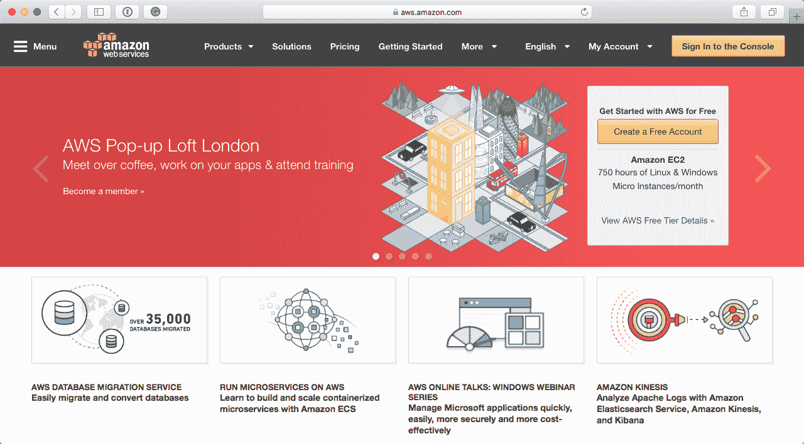

虽然点击“创建免费帐户”，然后按照屏幕上的说明操作，将为您提供 12 个月的免费服务，但您仍需要提供信用卡或借记卡的详细信息，并且您可能会产生费用。

For more information on the AWS free tier, please see [https://aws.amazon.com/free/](https://aws.amazon.com/free/). This page lets you know which instance sizes and services are covered by the 12 months of free service, as well as letting you know about non-expiring offers on other services, which include AWS Lambda.

一旦你有了你的 AWS 帐户，你应该使用 AWS **身份和访问管理** ( **IAM** )服务创建一个用户。该用户可以拥有管理员权限，您应该使用该用户来访问 AWS 控制台和应用编程接口。

有关创建 IAM 用户的更多详细信息，请参见以下页面:

*   **IAM 入门**:[http://docs . AWS . Amazon . com/IAM/latest/user guide/入门. html](http://docs.aws.amazon.com/IAM/latest/UserGuide/getting-started.html)T4】
*   **IAM 最佳实践**:[http://docs . AWS . Amazon . com/IAM/latest/user guide/best-practices . html](http://docs.aws.amazon.com/IAM/latest/UserGuide/best-practices.html)

Using your AWS root account to launch services and access the API is not recommended; if the credentials fall into the wrong hands you can lose all access to your account. Using an IAM rather than your root account, which you should also lock down using multi-factor authentication, means that you will always have access to your AWS account.

最后一个先决条件是您需要访问 AWS 命令行客户端，我将在这里使用 macOS，但是该客户端也适用于 Linux 和 Windows。有关如何安装和配置 AWS 命令行客户端的信息，请参见:

*   **安装 AWS 命令行界面** :
*   **配置 AWS 命令行界面** :

When configuring the AWS CLI, make sure you configure the default region as the one you will be accessing in the AWS web console, as there is nothing more confusing than running a command using the CLI and then not seeing the results in the web console.

安装后，您可以通过运行以下命令来测试是否可以从命令行客户端访问 AWS Lambda:

```
$ aws lambda list-functions
```

这将返回一个空的函数列表，如下图所示:


现在，我们已经使用非根用户设置、创建并登录了一个帐户，并且已经安装和配置了 AWS 命令行界面，我们可以考虑启动我们的第一个无服务器功能。

# 创建 Lambda 函数

在 AWS 控制台中，单击屏幕左上角的服务菜单，通过使用过滤器框或单击列表中的服务来选择 Lambda。当您第一次进入 AWS 控制台中的 Lambda 服务页面时，您将看到一个欢迎页面:


点击“创建函数”按钮，我们将直接进入第一个无服务器函数的启动过程。

创建函数有四个步骤；我们需要做的第一件事是选择蓝图:


对于基本的 hello world 函数，我们将使用一个名为`hello-world-python`的预建模板；将此输入过滤器，您应该会看到两个结果，一个是针对 Python 2.7，另一个是使用 Python 3.6:


选择`hello-world-python`然后点击【导出】会给你一个选项，在`lambda_function.py`文件中下载函数中使用的代码，以及 Lambda 在步骤 3 中使用的模板。这可以在`template.yaml`文件中找到。

正如你所想象的，代码本身是非常基本的。它除了返回一个被传递的值之外什么也不做。如果您没有跟上，则`lambda_function.py`文件的内容为:

```
from __future__ import print_function

import json

print('Loading function')

def lambda_handler(event, context):
  #print("Received event: " + json.dumps(event, indent=2))
  print("value1 = " + event['key1'])
  print("value2 = " + event['key2'])
  print("value3 = " + event['key3'])
  return event['key1'] # Echo back the first key value
  #raise Exception('Something went wrong')
```

`template.yaml`文件包含以下内容:

```
AWSTemplateFormatVersion: '2010-09-09'
Transform: 'AWS::Serverless-2016-10-31'
Description: A starter AWS Lambda function.
Resources:
  helloworldpython:
    Type: 'AWS::Serverless::Function'
    Properties:
      Handler: lambda_function.lambda_handler
      Runtime: python2.7
      CodeUri: .
      Description: A starter AWS Lambda function.
      MemorySize: 128
      Timeout: 3
      Role: !<tag:yaml.org,2002:js/undefined> ''
```

如您所见，模板文件既配置了`Runtime`，在我们的例子中是`python2.7`，也为`MemorySize`和`Timeout`值配置了一些合理的设置。

要继续第二步，点击功能名称，对我们来说是`hello-world-python`，您将进入我们可以选择功能触发方式的页面:


我们暂时不会使用触发器，我们将在下一次启动的函数中更详细地研究这些触发器；所以现在，点击下一步。

步骤 3 是我们配置功能的地方。这里有相当多的信息需要输入，但幸运的是，我们需要输入的许多细节已经从我们之前查看的模板中预先填充，您可以从下面的截图中看到:

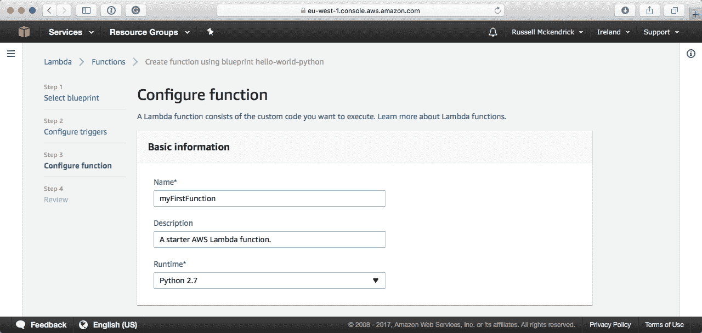

The details we need to enter are as follows: anything with a ***** is required and the *information* in italics was pre-populated and can be left as-is.

以下列表显示了所有表单字段以及应该输入的内容:

*   **基本信息**:
    *   **名称*** : `myFirstFunction`
    *   **说明** : *A 起动机 AWS Lambda 功能*
    *   **运行时** : *Python 2.7*
*   **λ功能码**:
    *   **代码输入类型**:包含功能的代码，无需编辑
    *   **启用加密助手**:保持未锁定
    *   **环境变量**:留空
*   **Lambda 函数处理程序和角色**:
    *   **处理程序***:*λ_ function .λ_ Handler*
    *   **角色*** :将*从模板创建新角色*保留为选中状态
    *   **角色名称***:*my FirstFunctionRole*
    *   **策略模板**:本功能不需要策略模板，留空

将“标签”和“高级”设置保留为默认值。输入上述信息后，点击“下一步”按钮，进入第 4 步，这是创建函数前的最后一步。

查看页面上的详细信息。如果您对所有内容都输入正确感到满意，请单击页面底部的创建功能按钮；如果您需要更改任何信息，请单击“上一步”按钮。

几秒钟后，您将收到一条消息，确认您的功能已经创建:


在前面的截图中，有一个测试按钮。点击这个将允许你调用你的函数。在这里，您可以自定义发布到函数的值。从下面的截图中可以看到，我已经更改了`key1`和`key2`的值:


编辑输入后，单击保存并测试将存储更新的输入，然后调用函数:


单击执行结果消息中的详细信息将向您显示正在调用的函数的结果以及使用的资源:

```
START RequestId: 36b2103a-90bc-11e7-a32a-171ef5562e33 Version: $LATEST
value1 = hello world
value2 = this is my first serverless function
value3 = value3
END RequestId: 36b2103a-90bc-11e7-a32a-171ef5562e33
```

带有`36b2103a-90bc-11e7-a32a-171ef5562e33`标识的请求报告如下:

*   `Duration: 0.26 ms`
*   `Billed Duration: 100 ms`
*   `Memory Size: 128 MB`
*   `Max Memory Used: 19 MB`

如您所见，该功能运行需要`0.26 ms`时间，为此我们被收取了`100 ms`的最短持续时间。该功能最多可以消耗`128 MB`内存，但我们在执行过程中只使用了`19 MB`。

返回到命令行，再次运行以下命令显示我们的函数现在已经列出:

```
$ aws lambda list-functions
```

前面命令的输出如下:

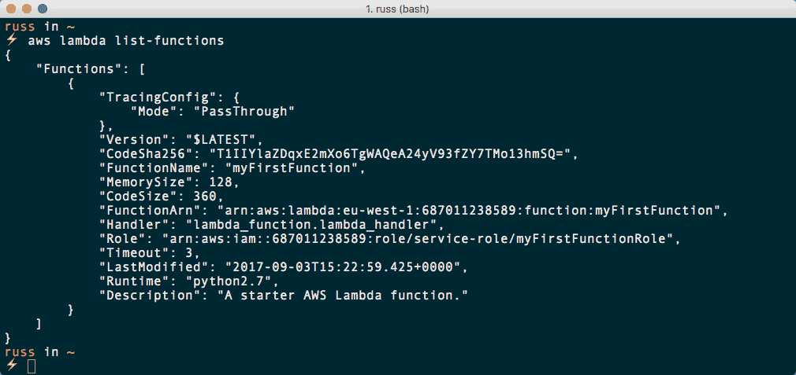

我们还可以通过运行以下命令从命令行调用我们的函数:

```
$ aws lambda invoke \
 --invocation-type RequestResponse \
 --function-name myFirstFunction \
 --log-type Tail \
 --payload '{"key1":"hello", "key2":"world", "key3":"again"}' \
 outputfile.txt 
```

从前面的命令可以看出，`aws lambda invoke`命令需要几个标志:

*   `--invocation-type`:调用有三种类型:
    *   `RequestResponse`:这是默认选项；它发送请求，在我们的例子中是在命令的`--payload`部分定义的。请求发出后，客户端等待响应。
    *   `Event`:这将发送请求并触发事件。客户端不会等待响应，相反，您会收到一个事件标识。
    *   `DryRun`:这调用了函数，但从未实际执行——这在测试用于调用函数的细节实际上具有正确的权限时非常有用。
*   `--function-name`:这是我们要调用的函数的名字。
*   `--log-type`:这里目前只有一个选项，`Tail`。这将返回`--payload`的结果，这是我们要发送给函数的数据；通常这将是 JSON。
*   `outputfile.txt`:命令的最后一部分定义了我们要将命令的输出存储在哪里；在我们的例子中，它是一个名为`outputfile.txt`的文件，存储在当前的工作目录中。

当从命令行调用该命令时，您应该会得到如下结果:


返回 AWS 控制台，停留在`myFirstFunction`页面，点击监控，您将看到一些关于您的功能的基本统计数据:

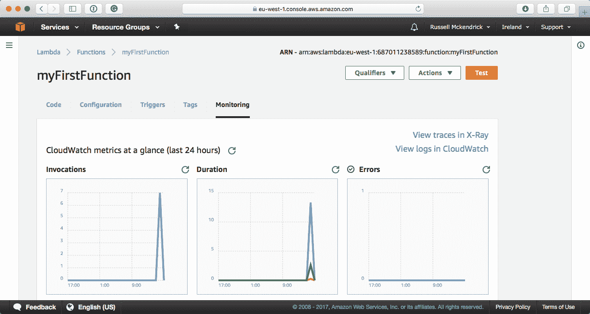

从前面的图表中可以看出，有关于函数被调用了多少次、花费了多长时间以及是否有任何错误的详细信息。

点击云观察中的查看日志将打开一个新的标签，列出`myFirstFunction`的日志流。单击日志流的名称，您将进入一个页面，该页面会显示每次在 AWS 控制台和命令行客户端中调用该函数时的结果:


当调试您的 Lambda 函数时，监视页面和日志都非常有用。

# 微软 Azure 函数

接下来，我们将看看微软的无服务器产品 Azure Functions。Microsoft 将此服务描述为:

"Azure Functions is a solution for easily running small pieces of code, or "functions," in the cloud. You can write just the code you need for the problem at hand, without worrying about a whole application or the infrastructure to run it."

像 Lambda 一样，有几种方法可以调用您的函数。在本快速演练中，我们将部署一个使用 HTTP 请求调用的函数。

# 先决条件

您将需要一个 Azure 帐户来完成这个示例。如果没有账号，可以在[https://azure.microsoft.com/](https://azure.microsoft.com/)注册免费账号:


在撰写本文时，微软正在向所有新账户发放 200 美元，用于购买 Azure 服务，与 AWS 一样，一些服务也有免费层。

While you are credited with $200, you will still need to provide credit card details for verification purposes. For more information on the services and limits in the free tier, please see [https://azure.microsoft.com/en-gb/free/pricing-offers/](https://azure.microsoft.com/en-gb/free/pricing-offers/).

# 创建函数应用

我们将要做的创建第一个功能应用的所有工作都将使用基于网络的控制面板。一旦您有了自己的帐户，您应该会看到如下页面:


One thing you should note about the Microsoft Azure control panel is that it scrolls horizontally, so if you lose where you are on a page you can typically find your way back to where you need to by scrolling to the right.

从前面的截图中可以看到，有相当多的选项。要开始创建您的第一个函数，您应该单击左侧菜单顶部的+ New。

从这里，您将被带到蔚蓝市场。单击计算，然后在特色市场项目列表中，您应该会看到功能应用。点击此处，您将进入一个表单，询问您想要创建的函数的一些基本信息:

*   App 名称:随你便；就我而言，我称之为`russ-test-version`。这必须是一个唯一的名称，如果您想要的应用名称已经被另一个用户使用，您将收到一条消息，表明您选择的应用名称不可用。
*   订阅:选择您希望在其中启动您的功能的 Azure 订阅。
*   资源组:这将在您键入应用名称时自动填充。
*   托管计划:保留默认选项。
*   地点:选择离你最近的地区。
*   存储:这将根据您给出的应用名称自动填充，出于我们的目的，请选择“新建”。
*   固定在仪表板上:勾选此项，因为一旦创建了我们的功能，它将允许我们快速找到它。

如果您没有在您的帐户中关注，我的完整表单看起来像下面的截图:

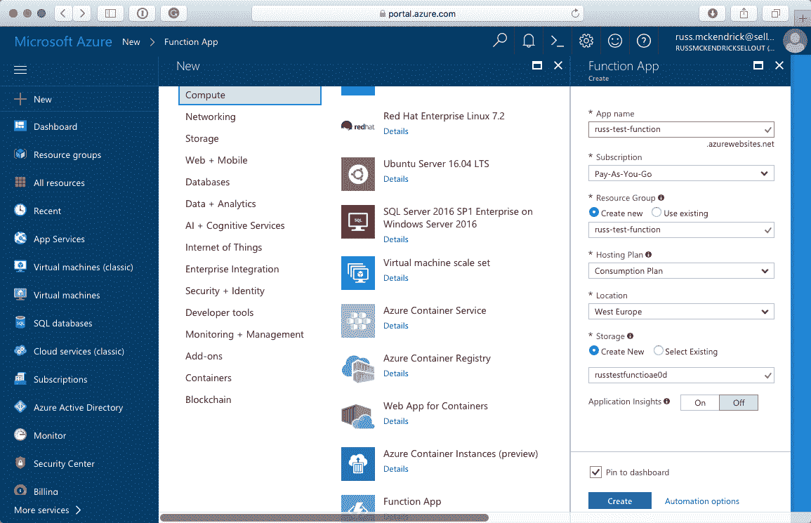

填写完表单后，单击表单底部的“创建”按钮，您将返回到仪表板。您将收到一个通知，告知您的功能正在部署中，如您在下面截图右侧的框中所见:

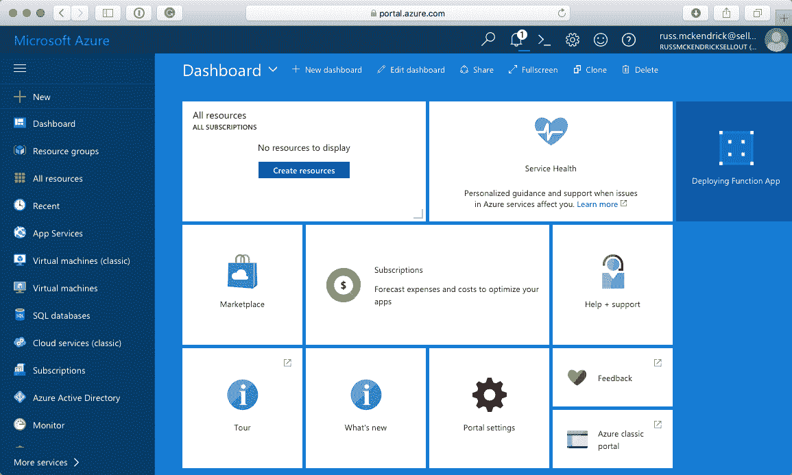

单击仪表板中的方块或顶部菜单中的通知(带有 1 的钟形图标)将带您进入概述页面；您可以在这里查看部署的状态:


部署后，您应该有一个空的函数应用，可以将代码部署到:


要部署一些测试代码，您需要单击左侧菜单中“函数”旁边的+图标；这将带您进入下一页:


选择 Webhook + API 和 CSharp，点击创建此功能；这将向您的函数应用添加以下代码:

```
using System.Net;

public static async Task<HttpResponseMessage> Run(HttpRequestMessage req, TraceWriter log)
{
    log.Info("C# HTTP trigger function processed a request.");

    // parse query parameter
    string name = req.GetQueryNameValuePairs()
        .FirstOrDefault(q => string.Compare(q.Key, "name", true) == 0)
        .Value;

    // Get request body
    dynamic data = await req.Content.ReadAsAsync<object>();

    // Set name to query string or body data
    name = name ?? data?.name;

    return name == null
        ? req.CreateResponse(HttpStatusCode.BadRequest, "Please pass
        a name on the query string or in the request body")
        : req.CreateResponse(HttpStatusCode.OK, "Hello " + name);
}
```

这段代码只是读入变量`name`，通过网址传递，然后作为`Hello <name>`打印回用户。

我们可以通过点击页面顶部的运行按钮来测试这一点。这将执行我们的功能，并为您提供输出和日志:

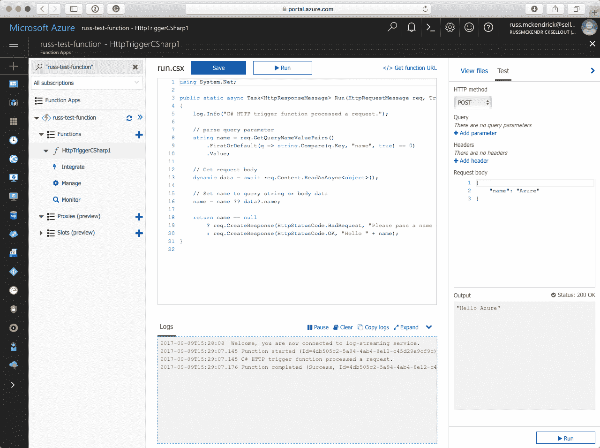

测试运行的日志如下所示:

```
2017-09-09T15:28:08 Welcome, you are now connected to log-streaming service.2017-09-09T15:29:07.145 Function started (Id=4db505c2-5a94-4ab4-8e12-c45d29e9cf9c)2017-09-09T15:29:07.145 C# HTTP trigger function processed a request.2017-09-09T15:29:07.176 Function completed (Success, Id=4db505c2-5a94-4ab4-8e12-c45d29e9cf9c, Duration=28ms)
```

您也可以通过点击左侧菜单中的监视器来查看您的函数应用的更多信息。从下面的截图中可以看到，我们有关于您的函数被调用了多少次的详细信息，以及每次执行的状态和每次调用的持续时间:


For more detailed information on the invocation of your Function app, you can enable Azure Application Insights, and for more information on this service, please see [https://azure.microsoft.com/en-gb/services/application-insights/](https://azure.microsoft.com/en-gb/services/application-insights/).

能够在 Azure Dashboard 的安全范围内进行测试是非常好的，但是如何直接访问您的 Function 应用呢？

如果你点击 HttpTriggerCSharp1，这将带你回到你的代码，在代码块上方，你会有一个按钮，上面写着获取函数的网址，点击这个将弹出一个覆盖框，其中有一个网址。复制这个:

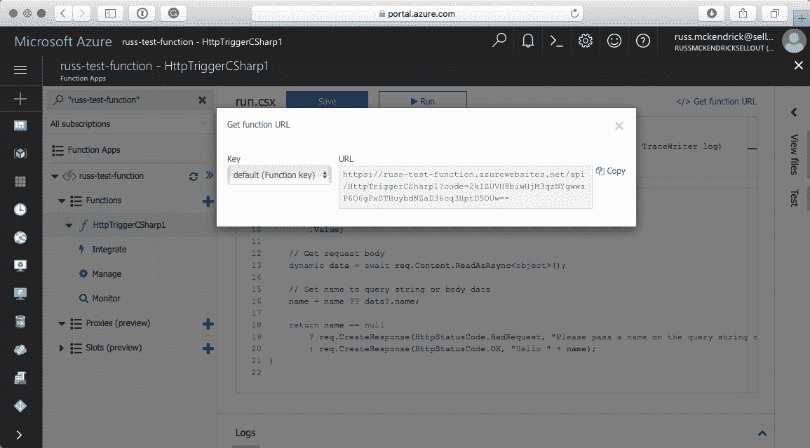

对我来说，网址是:

`https://russ-test-function.azurewebsites.net/api/HttpTriggerCSharp1?code=2kIZUVH8biwHjM3qzNYqwwaP6O6gPxSTHuybdNZaD36cq3HptD5OUw==`

The preceding URL will no longer work as the Function has been removed; it has been provided for illustration purposes only, and you should replace it with your URL.

To interact with URLs on the command line, I am going to be using HTTPie, which is a command-line HTTP client. For more detail on HTTPie, see the project's homepage at [https://httpie.org/](https://httpie.org/).

使用以下命令在命令行上调用该网址:

```
$ http "https://russ-test-function.azurewebsites.net/api/HttpTriggerCSharp1?code=2kIZUVH8biwHjM3qzNYqwwaP6O6gPxSTHuybdNZaD36cq3HptD5OUw=="
```

这给了我们以下结果:

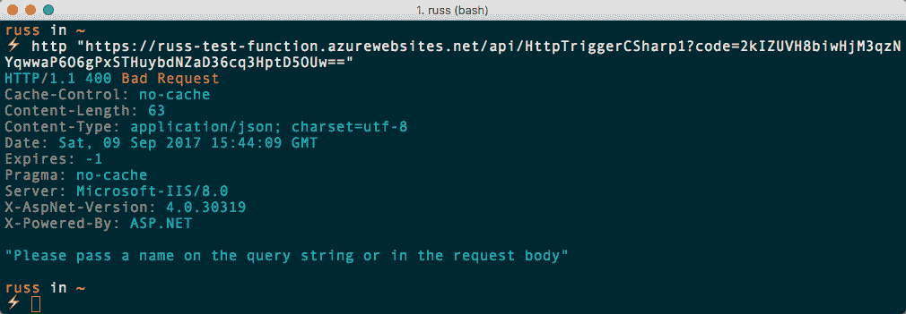

从返回的内容可以看出，我们的函数应用返回了 HttpStatusCode 错误请求消息。这是因为我们没有传递`name`变量。为此，我们需要将命令更新为:

```
$ http "https://russ-test-function.azurewebsites.net/api/HttpTriggerCSharp1?code=2kIZUVH8biwHjM3qzNYqwwaP6O6gPxSTHuybdNZaD36cq3HptD5OUw==&name=kubernetes_for_serverless_applications"
```

如您所料，这将返回正确的消息:

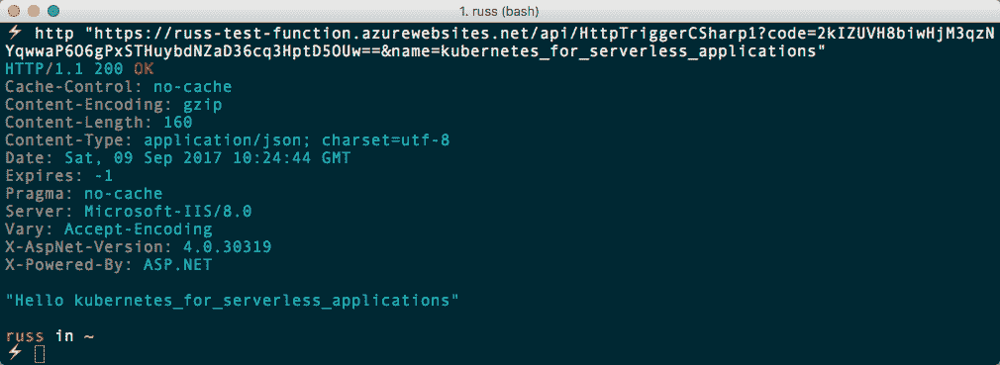

您也可以在浏览器中输入网址并看到消息:


# 无服务器工具包

在完成本章之前，我们将看一下无服务器工具包。这是一个旨在跨不同云供应商部署无服务器功能时提供一致体验的应用。您可以在[https://serverless.com/.](https://serverless.com/)找到该服务的主页

从主页可以看到，它同时支持 AWS 和微软 Azure，以及谷歌云平台和 IBMopen 晶须。您还会注意到有一个“注册”按钮；点击此处并按照屏幕提示创建您的帐户。

注册后，您将收到一些非常简单的说明，告诉您如何安装该工具，以及如何部署您的第一个应用；现在让我们跟随这些。首先，我们需要通过运行以下命令来安装命令行工具:

```
$ npm install serverless -g
```

安装将需要几分钟时间，安装完成后，您应该能够运行:

```
$ serverless version
```

这将确认之前命令安装的版本:


现在安装了命令行工具，并且我们已经确认可以毫无错误地获得版本号，我们需要登录。为此，请运行:

```
$ serverless login
```

此命令将打开一个浏览器窗口，并带您进入登录页面，您需要在其中选择要使用的帐户:


正如您在前面的截图中看到的，它知道我最后一次使用我的 GitHub 帐户登录无服务器，因此单击此处将生成一个验证码:


根据提示将代码粘贴到您的终端中，然后按键盘上的*进入*，您将登录:


现在我们已经登录，我们可以创建我们的第一个项目，这将是另一个`hello-world`应用。

要在 AWS 中启动我们的`hello-world`功能，我们必须首先创建一个文件夹来保存无服务器工具包创建的工件，并对其进行更改；我在我的`Desktop`上创建了我的，使用:

```
$ mkdir ~/Desktop/Serverless
$ cd ~/Desktop/Serverless
```

要生成启动我们的`hello-world`应用所需的文件，我们需要运行:

```
$ serverless create --template hello-world
```

这将返回以下消息:


在我的编辑器中打开`serverless.yml`，我可以看到以下内容(我已经删除了评论):

```
service: serverless-hello-world
provider:
  name: aws
  runtime: nodejs6.10
functions:
  helloWorld:
    handler: handler.helloWorld
    # The `events` block defines how to trigger the handler.helloWorld code
    events:
      - http:
          path: hello-world
          method: get
          cors: true
```

我把服务更新为`russ-test-serverless-hello-world`；你也应该选择一些独特的东西。一旦我保存了更新后的`serverless.yml`文件，我就运行:

```
$ serverless deploy
```

正如您可能已经猜到的，这将`hello-world`应用部署到了 AWS:

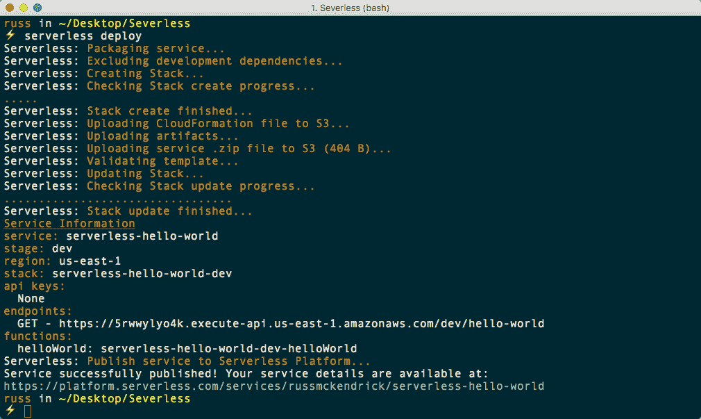

使用 HTTPie 访问端点网址:

```
$ http --body "https://5rwwylyo4k.execute-api.us-east-1.amazonaws.com/dev/hello-world"
```

这将返回以下 JSON:

```
{
    "input": {
        "body": null,
        "headers": {
            "Accept": "*/*",
            "Accept-Encoding": "gzip, deflate",
            "CloudFront-Forwarded-Proto": "https",
            "CloudFront-Is-Desktop-Viewer": "true",
            "CloudFront-Is-Mobile-Viewer": "false",
            "CloudFront-Is-SmartTV-Viewer": "false",
            "CloudFront-Is-Tablet-Viewer": "false",
            "CloudFront-Viewer-Country": "GB",
            "Host": "5rwwylyo4k.execute-api.us-east-1.amazonaws.com",
            "User-Agent": "HTTPie/0.9.9",
            "Via": "1.1 dd12e7e803f596deb3908675a4e017be.cloudfront.net
             (CloudFront)",
            "X-Amz-Cf-Id": "bBd_ChGfOA2lEBz2YQDPPawOYlHQKYpA-
             XSsYvVonXzYAypQFuuBJw==",
            "X-Amzn-Trace-Id": "Root=1-59b417ff-5139be7f77b5b7a152750cc3",
            "X-Forwarded-For": "109.154.205.250, 54.240.147.50",
            "X-Forwarded-Port": "443",
            "X-Forwarded-Proto": "https"
        },
        "httpMethod": "GET",
        "isBase64Encoded": false,
        "path": "/hello-world",
        "pathParameters": null,
        "queryStringParameters": null,
        "requestContext": {
            "accountId": "687011238589",
            "apiId": "5rwwylyo4k",
            "httpMethod": "GET",
            "identity": {
                "accessKey": null,
                "accountId": null,
                "apiKey": "",
                "caller": null,
                "cognitoAuthenticationProvider": null,
                "cognitoAuthenticationType": null,
                "cognitoIdentityId": null,
                "cognitoIdentityPoolId": null,
                "sourceIp": "109.154.205.250",
                "user": null,
                "userAgent": "HTTPie/0.9.9",
                "userArn": null
            },
            "path": "/dev/hello-world",
            "requestId": "b3248e19-957c-11e7-b373-8baee2f1651c",
            "resourceId": "zusllt",
            "resourcePath": "/hello-world",
            "stage": "dev"
        },
        "resource": "/hello-world",
        "stageVariables": null
    },
    "message": "Go Serverless v1.0! Your function executed successfully!"
}
```

在浏览器中输入端点网址(在我的例子中，我正在使用 Safari)会显示原始输出:


转到`serverless deploy`命令末尾提到的网址，可以让您大致了解使用无服务器部署到 Lambda 的功能:


进入[https://console.aws.amazon.com/](https://console.aws.amazon.com/)打开 AWS 控制台，从服务菜单中选择 Lambda，然后切换到您的功能启动所在的区域；这将向您展示您的功能:

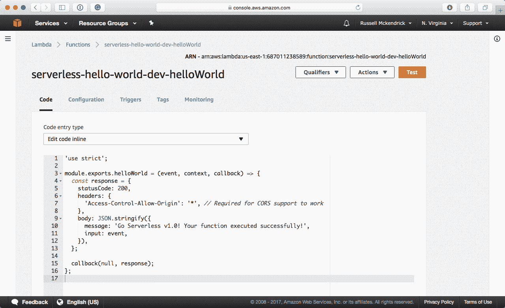

此时你可能会挠头想，*在我的账号里是怎么上线的？我没有提供任何凭据！*无服务器工具旨在使用与我们在启动第一个 Lambda 函数之前安装的 AWS CLI 相同的凭据—这些凭据可以在您的机器上的`~/.aws/credentials`找到。

要删除该功能，只需运行:

```
$ serverless remove
```

这将删除无服务器工具包创建的 AWS 帐户中的所有内容。

For more information on how to use the serverless toolkit to launch an Azure Function, please see the quick-start guide which can be found at [https://serverless.com/framework/docs/providers/azure/guide/quick-start/](https://serverless.com/framework/docs/providers/azure/guide/quick-start/).

# 无服务器和功能即服务解决的问题

尽管到目前为止，我们只启动了最基本的应用，但我希望您已经开始看到使用无服务器如何帮助开发您的应用。

假设您有一个 JavaScript 应用，它被托管在一个对象存储中，比如亚马逊的 S3 服务。您的应用可以用 React([https://facebook.github.io/react/](https://facebook.github.io/react/))或 Angular([https://angular.io/](https://angular.io/))编写，这两种技术都允许您使用 JSON 加载外部数据。可以使用无服务器功能请求和交付这些数据，结合这些技术，您可以创建一个应用，不仅没有单点故障，而且在使用公共云产品时，是一个真正的*您只需为您使用的*应用付费。

由于无服务器函数正在执行，然后被立即终止，您不应该担心它在哪里或如何执行，只需要担心它是什么。这意味着，理论上，您的应用应该是可扩展的，并且比传统的基于服务器的应用更容错。

例如，如果在调用您的某个函数时出现了问题，例如，如果它崩溃或存在资源问题，并且您知道下次调用您的函数时它将被重新启动，那么您就不需要担心您的代码在有问题的服务器上执行。

# 摘要

在这一章中，我们已经非常快速地了解了无服务器的含义，我们已经在 AWS 和微软 Azure 中启动了无服务器功能并与之交互，还使用了一个第三方工具(恰好称为无服务器)在 AWS 中创建了一个无服务器功能。

您会注意到，到目前为止，我们根本没有提到 Kubernetes，您可能会认为这是一本名为*Kubernetes for server less Applications*的书有点奇怪。不过，别担心。在下一章中，我们将更详细地了解 Kubernetes，一切都会变得清晰。