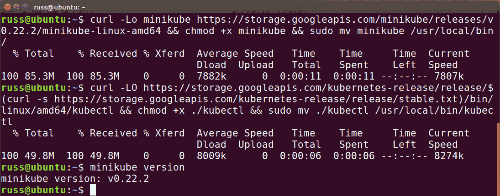
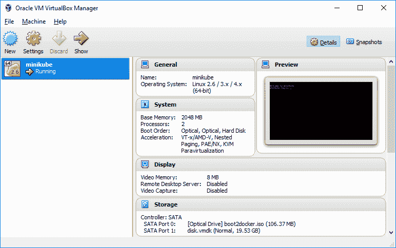
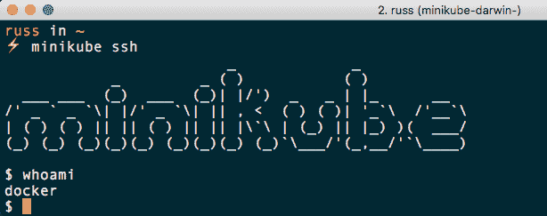
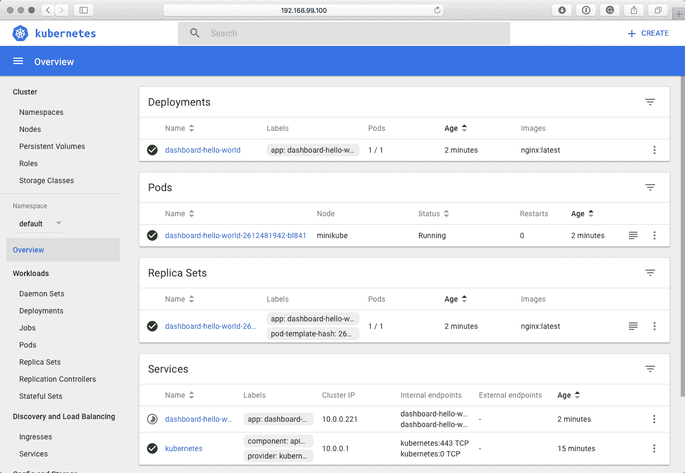

# 三、在本地安装 Kubernetes

在本章中，我们将了解如何使用 Minikube 启动并运行本地 Kubernetes 安装。一旦我们运行了本地 Kubernetes 安装，我们将完成一些基本功能，并讨论在本地运行 Kubernetes 的局限性。我们将在以下位置安装 Kubernetes:

*   macOS 10.13 高山区
*   Windows 10 专业版
*   Ubuntu 17.04

在开始安装之前，让我们快速了解一下我们将用来部署本地 Kubernetes 集群的工具。

# 关于 Minikube

在阅读前一章时，你可能一直在想的一件事是，Kubernetes 似乎很复杂。移动部件很多，不仅需要配置，还需要监控和管理。

我记得我最初看 Kubernetes 的时候，它是在稳定版本之前第一次发布的，安装说明很长，而且事情也有点微妙。

在安装过程开始时误读了一个步骤，你会发现自己在安装的后期陷入了很多麻烦——这让我想起了杂志曾经包含游戏列表中的文字。如果你在任何地方打了一个错别字，那么事情要么会完全不工作，要么会意外崩溃。

随着 Kubernetes 的成熟，安装过程也随之成熟。很快，许多助手脚本被开发出来，以帮助跨各种平台启动 KubernetesMinikube 就是这些工具之一。

它有一个任务，创建一个本地 Kubernetes 节点。考虑到 Kubernetes 支持的功能的广度，它具有数量惊人的功能，例如:

*   域名系统、节点端口和入口
*   配置映射和机密
*   容器运行时的选择；您可以使用 Docker 或 rkt
*   通过`hostPath`的持久卷
*   仪表盘

不支持通常需要公共云供应商(如 AWS、微软 Azure 或谷歌云)或多台主机的 Kubernetes 功能。其中一些功能是:

*   负载平衡器
*   高级调度策略

这是因为 Minikube 仅在本地 PC 上的虚拟机上启动单个节点。但这不应该限制你；请记住，您只会希望使用 Minikube 进行开发，您永远不应该使用它来构建生产服务。还有很多工具，将在[第 6 章](06.html)、*在云中安装 Kubernetes*中介绍，更适合在公共云中或其他厂商推出生产就绪的 Kubernetes 集群。

Minikube 由两个核心组件组成:

*   **libmachine**:Docker 的这个库是用来在你的主机上调配虚拟机的。它是 Docker Machine 的核心组件，也是 macOS 的 Docker 和 Windows 的 Docker。
*   **localkube** :这个库由 Redspread(现在是 CoreOS 的一部分)开发并捐赠给 Minikube 项目，负责在虚拟机启动后部署和维护 Kubernetes 节点。

与其谈论 Minikube 还能做什么，不如看看安装它，然后讨论如何与它交互。

# 安装 Minikube

我们将考虑在引言中提到的三种不同的操作系统上安装 Minikube。安装后，与 Minikube 交互的过程基本上是一致的，这意味着，虽然我将在示例中使用 macOS，但相同的命令将在 Windows 和 Linux 上工作。考虑到早期 Kubernetes 安装和配置过程的复杂性，您会惊喜地发现现在的过程是如此简单。

# macOS 10.13 高山区

要在 macOS 上安装 Minikube，首先必须安装家酿和木桶。

Homebrew is a command-line-based package manager for macOS. Homebrew is used to install both command-line tools and Cask, which is an add-on used to manage desktop applications. It is extremely useful for managing software that is not available in the macOS App Store, as well as saving you from having to manually compile software on your machine.

如果您尚未安装家酿，您可以通过运行以下命令来安装它:

```
$ /usr/bin/ruby -e "$(curl -fsSL https://raw.githubusercontent.com/Homebrew/install/master/install)"
```

安装后，您需要通过运行以下命令来安装木桶:

```
$ brew install cask
```

如果您已经安装了自制程序和木桶，那么您应该使用以下命令确保一切都是最新的，并准备好运行:

```
$ brew update
$ brew doctor
```

自制程序和木桶准备就绪后，您可以通过运行以下命令来安装 Minikube:

```
$ brew cask install minikube
```

这将首先下载依赖项，然后安装 Minikube:


该过程不到一分钟，安装后，您应该能够执行以下操作:

```
$ minikube version
```

这将显示当前版本；就我而言，这是`v0.22.2`。我们现在已经安装了 Minikube，并准备就绪。

# Windows 10 专业版

类似于我们如何在 macOS 上安装 Minikube，我们将使用包管理器；这次它被称为巧克力。

Chocolatey is a package manager for Windows, similar to Homebrew on macOS. It enables you to install software from the command line, and supports both PowerShell and `cmd.exe`. We will be using PowerShell.

如果没有安装巧克力糖，可以在以管理员权限启动的 PowerShell 控制台中运行以下命令:

The following command is a single line and not multiple lines. Also, as we are running the install command using `Set-ExecutionPolicy Bypass`, you will be asked if you are sure. As we are running the script directly from the Chocolatey site over HTTPS, you should be able to trust the script and answer yes.

```
$ Set-ExecutionPolicy Bypass; iex ((New-Object System.Net.WebClient).DownloadString('https://chocolatey.org/install.ps1'))
```

安装巧克力后，您可以通过运行以下命令来安装 Minikube:

```
$ choco install minikube
```

这将下载并安装依赖项，然后安装 Minikube。当系统要求您确认是否要运行脚本时，请回答“是”:


安装后，您将能够运行以下命令:

```
$ minikube version
```

这将返回已安装的 Minikube 版本；对我来说，这是`v0.22.2`。

# Ubuntu 17.04

与 macOS 和 Windows 版本不同，我们不会使用包管理器在 Ubuntu 17.04 上安装 Minikube。相反，我们将直接从项目页面下载二进制文件。为此，只需运行以下命令:

```
$ curl -Lo minikube https://storage.googleapis.com/minikube/releases/v0.22.2/minikube-linux-amd64 && chmod +x minikube && sudo mv minikube /usr/local/bin/
```

Minikube 会被下载，会有执行权限设置，会被移动到`/usr/local/bin/`所以是在系统路径中。

现在安装了 Minikube，我们需要下载`kubectl`。在 macOS 和 Windows 安装期间，这是由包管理器处理的；幸运的是，这个过程与我们刚刚运行的安装 Minikube 的命令非常相似:

```
$ curl -LO https://storage.googleapis.com/kubernetes-release/release/$(curl -s https://storage.googleapis.com/kubernetes-release/release/stable.txt)/bin/linux/amd64/kubectl && chmod +x ./kubectl && sudo mv ./kubectl /usr/local/bin/kubectl
```

安装后，您应该能够再次运行以下命令来确认 Minikube 的安装版本:

```
$ minikube version
```

当我运行命令时，它返回`v0.22.2`，如下图所示:



# 管理程序

Minikube 支持许多不同的虚拟机管理程序。虚拟机管理程序是用于启动虚拟机的进程；它将虚拟机的操作系统与您自己的操作系统隔离开来，同时允许它共享 CPU、RAM 和驱动器空间等资源。

Minikube 支持以下现成的虚拟机管理程序:

*   **Hyper-V (Windows 10)** :这是原生虚拟机管理程序；它在 Windows 10 专业版和 Windows 服务器中可用
*   **KVM (Ubuntu 17.04)** :这是原生的 Linux 虚拟机管理程序，它在大多数现代发行版上的 Linux 内核内部运行
*   **VirtualBox (macOS、Windows 10、Ubuntu 17.04)** :由 Oracle 发布，VirtualBox 是一款开源的 x86 虚拟机管理程序，可以在大量操作系统上运行
*   **VMware Fusion(macOS)**:Fusion 提供了一款针对 macOS 进行优化的虚拟机管理程序，其最大的优势在于能够在 macOS 上运行和公开 Windows 应用
*   **xyve(macOS)**:这是 macOS 上的原生虚拟机管理程序；就像 Linux 上的 KVM 一样，它内置在内核中

从列表中可以看出，我们在本章中介绍的三种操作系统都只支持 VirtualBox。正因为如此，它是 Minikube 支持的默认虚拟机管理程序。如果您已经安装了 VirtualBox，您可以运行以下命令，这些命令与您选择的操作系统相关。

对于 macOS，我们可以通过运行以下命令，使用自制程序和木桶来安装 VirtualBox:

```
$ brew cask install virtualbox
```

同样，对于 Windows 10，您可以使用巧克力来安装 VirtualBox:

You cannot use VirtualBox on Windows 10 if Hyper-V is enabled. If you wish to follow along, please disable Hyper-V before proceeding.

```
$ choco install virtualbox
```

最后，对于 Ubuntu 17.04，您需要运行以下命令来添加存储库和密钥:

```
$ wget -q http://download.virtualbox.org/virtualbox/debian/oracle_vbox.asc -O- | sudo apt-key add -
$ sudo sh -c 'echo "deb http://download.virtualbox.org/virtualbox/debian $(lsb_release -sc) contrib" >> /etc/apt/sources.list'
```

然后运行以下命令来加载我们之前添加的存储库并安装包:

```
$ sudo apt-get update
$ sudo apt-get install virtualbox-5.1
```

您现在应该能够在列出的软件程序中看到 Virtualbox。

# 开始 Minikube

为了完成我们的安装，我们需要启动 Minikube。为此，请运行以下命令:

```
$ minikube start
```

在 macOS 上，您应该会看到类似这样的内容:


如您所见，用于创建虚拟机的 ISO 已经下载。虚拟机启动，生成我们将用于针对单节点集群进行身份验证的证书，然后最后用我们本地 Kubernetes 集群的详细信息配置`kubectl`。

在 Windows 10 上运行相同的命令会产生完全相同的步骤集:


此外，正如您可能已经猜到的，在 Ubuntu 17.04 上运行会得到相同的结果。运行以下命令:

```
$ minikube status
```

您将收到一条消息，确认一切都在运行并且`kubectl`已被正确配置为与您的 Kubernetes 集群通信:


如果您要打开 VirtualBox，您应该看到您的 Minikube 虚拟机正在运行；例如，这是我在 Windows 10 上打开 VirtualBox 时看到的内容:



即使我们已经在三种不同的操作系统上启动了 Minikube，除了初始安装之外，您已经可以体验到我们在[第 2 章](02.html)、*Kubernetes 简介*中讨论的内容:没有供应商锁定和一致的体验，这是在我们开始使用新安装的 Kubernetes 集群之前。

# Minikube 命令

到目前为止，我们已经使用了`minikube start`和`minikube status`命令来启动我们的单节点 Kubernetes 集群，并检查一切是否按预期运行。在我们看与 Kubernetes 交互之前，我想介绍几个更基本的 Minikube 命令。

# 停止并删除

由于我们将单节点 Kubernetes 集群作为虚拟机在您的主机上运行，因此您可能不希望它一直使用资源运行。

实现这个有两个选择，第一个是`minikube stop`。此命令将停止您的节点并保持虚拟机完好无损。如果您计划在下一次运行`minikube start`启动节点时从您停止的地方继续，您应该使用此命令。

当`minikube stop`命令停止您的虚拟机使用主机上的 CPU 和 RAM 资源时，用于托管虚拟机的硬盘映像将仍然存在于您的机器上。虽然新启动的集群不会占用主机硬盘太多空间，但在我的 macOS 安装中，它大约为 650 MB 一旦你开始使用集群，你可能会发现这个空间至少会翻倍。

这就是我们下一个命令的来源。`minikube delete`命令将完全删除集群，包括所有虚拟机文件，释放主机上使用的空间。

At the time of writing, running `minikube delete` will immediately remove your machine, running or not. There is no prompt asking if you are sure, or any way back from the command (unless you have backups), so please ensure that you use this command with caution.

当您再次运行`minikube start`时，您的集群将再次从头开始，正如我们在上一节中首次体验到的那样。

# 环境

接下来，我们有几个命令显示关于虚拟机以及 Minikube 在您的设备上配置的环境的信息。

首先，我们有一个相当简单的命令，`minikube ip`。这个命令所做的只是返回虚拟机的 IP 地址。如果您想通过脚本与集群进行交互，这非常有用。您可以包含命令的输出来引用集群的当前 IP 地址，而不必将实际的 IP 地址硬编码到脚本中。

我们接下来要看的命令是`minikube docker-env`。运行此命令应该会在您的屏幕上打印如下输出:

```
$ minikube docker-env
export DOCKER_TLS_VERIFY="1"
export DOCKER_HOST="tcp://192.168.99.101:2376"
export DOCKER_CERT_PATH="/Users/russ/.minikube/certs"
export DOCKER_API_VERSION="1.23"
# Run this command to configure your shell:
# eval $(minikube docker-env)
```

该输出允许您(如果您已经安装了它)配置您的本地 Docker 客户端，以便与我们的 Minikube 虚拟机上的 Docker 安装进行通信。然而，这样做也有坏处。目前作为 Minikube 虚拟机映像的一部分分发的 Docker 版本稍微落后于当前版本。运行`eval $(minikube docker-env)`然后`docker version`可以看到这一点。当我运行这两个命令时，我得到了以下结果:

```
$ eval $(minikube docker-env)
$ docker version
Client:
 Version: 17.06.2-ce
 API version: 1.23
 Go version: go1.8.3
 Git commit: cec0b72
 Built: Tue Sep 5 20:12:06 2017
 OS/Arch: darwin/amd64

Server:
 Version: 1.12.6
 API version: 1.24 (minimum version )
 Go version: go1.6.4
 Git commit: 78d1802
 Built: Wed Jan 11 00:23:16 2017
 OS/Arch: linux/amd64
 Experimental: false
```

从输出中可以看到，在编写 Minikube 使用的 Docker 版本时，我本地安装的 macOS Docker 目前有两个版本，运行的是最新的稳定版本。在本书所涵盖的内容中，运行较旧版本的 Docker 不是问题，也没有什么可担心的，因为我们不会直接与之交互。

# 虚拟机访问和日志

您可以通过 SSH 进入 Minikube 虚拟机。作为安装的一部分，在虚拟机启动时会生成一个 SSH 密钥并与虚拟机共享。您可以通过运行`minikube ssh-key`来检查该键的位置。这将返回密钥私有部分的路径。通过在 macOS 或 Ubuntu 上运行以下命令，您可以将此命令与其他命令结合使用，以 SSH 到您的虚拟机中:

```
$ ssh docker@$(minikube ip) -i $(minikube ssh-key)
```

这会动态生成虚拟机的 IP 地址和私钥路径:


但是，Minikube 也有一个命令可以为您运行这个命令，并且它在所有平台上都受支持。运行`minikube ssh`将使您作为 Docker 用户直接登录虚拟机，如以下终端输出所示:



我们要快速看的最后一个命令是`minikube logs`。这将显示由`localkube`实例生成的所有日志:


这些日志用于帮助调试 Minikube 安装中的问题。它们不包含任何用户数据，这意味着您不能使用它们来帮助追踪您已经推出的服务或 pods 的任何问题。

# 你好世界

现在我们已经启动并运行了单节点 Kubernetes 集群，使用 Minikube，我们可以启动一个服务。在进入命令行客户端之前，我们将首先使用仪表板。

# 仪表板

Minikube 的每个安装都带有一个基于网络的仪表板。这可以通过运行`minikube dashboard`来访问，它会立即在您的默认浏览器中打开仪表板:


点击页面左上角的+ CREATE 按钮，您将看到一个表单，可以部署一个容器化的应用。

在“部署容器化应用”页面上，您会发现几个选项。保持“在下面指定应用详细信息”选项处于启用状态，按如下方式填写:

*   **应用名称** : `dashboard-hello-world`
*   **集装箱映像** : `nginx:latest`
*   **豆荚数量** : `1`
*   **服务**:外部
*   **港口** : `8080`
*   **目标港口** : `80`
*   **协议** : TCP

出于我们的目的，我们不需要填写“显示高级选项”下的任何选项。只需点击表单底部的 DEPLOY 按钮。过了一会儿，您的仪表板应该显示您有一个部署、pod、ReplicaSet 和服务，所有这些都在名称中有`dashboard-hello-world`:



您可以通过运行以下命令来查看服务:

```
$ minikube service dashboard-hello-world
```

这将返回以下消息:

```
Opening kubernetes service default/dashboard-hello-world in default browser...
```

打开浏览器，您应该会看到默认的 NGINX 页面:


虽然这是一个非常基本的例子，但它确实展示了使用仪表板启动一个简单的应用是多么简单。现在，让我们来看看如何进入命令行。

# 命令行

在前一章中，我们简要地讨论了如何使用 YAML 或 JSON 文件来定义您的荚、复制集和服务。让我们使用`kubectl`来启动前一个应用。

首先，我们需要一个文件来启动；您可以在这个标题附带的代码包和 GitHub 存储库的`Chapter03`文件夹中找到下面这个名为`cli-hello-world.yml`的副本:

```
apiVersion: v1
kind: Service
metadata:
  name: cli-hello-world
spec:
  selector:
    app: cli-hello-world
  type: NodePort
  ports:
  - protocol: TCP
    port: 8000
    targetPort: 80
---
apiVersion: apps/v1beta1
kind: Deployment
metadata:
  name: cli-hello-world
  labels:
    app: nginx
spec:
  replicas: 1
  selector:
    matchLabels:
      app: cli-hello-world
  template:
    metadata:
      labels:
        app: cli-hello-world
    spec:
      containers:
      - name: nginx
        image: nginx:latest
        ports:
        - containerPort: 80
```

您可能已经注意到，虽然这是一个单独的文件，但我们实际上有两个不同的部分。第一个启动外部服务，在端口`8000`上公开它，这样就不会与我们使用上一节中的仪表板启动的外部服务发生冲突。第二部分定义了 pod 和复制集；这与我们使用仪表板发布的内容非常相似。

要启动应用，我们只需要运行以下命令:

```
$ kubectl apply -f cli-hello-world.yml
```

您几乎会立即收到已创建服务和部署的确认:

```
service "cli-hello-world" created
deployment "cli-hello-world" created
```

创建后，您应该能够运行以下命令在浏览器中打开应用:

```
$ minikube service cli-hello-world
```

同样，您应该会看到默认的 NGINX 页面。

我确信当我们打开仪表板时，您点击了页面左侧的菜单项。所有这些信息也可以在命令行上找到，所以让我们简单地看一下一些命令，我们可以用它们来了解更多关于我们集群的信息。

您将运行的一个更常见的命令是`kubectl get`。这将获取吊舱、复制集和服务的列表，以及更多内容。运行以下命令将为我们提供类似于仪表板概述的视图:

```
$ kubectl get pods
$ kubectl get replicasets
$ kubectl get services
$ kubectl get secrets
```

从以下终端输出可以看出，所有内容都与其当前状态一起列出:


你可以有很多选择；例如，尝试运行以下命令:

```
$ kubectl get endpoints
$ kubectl get events
$ kubectl get storageclasses
```

只运行`kubectl get`会列出所有可以使用的不同参数。现在我们有了完整的 pod 名称，在我的例子中是`cli-hello-world-3678853705-f41d2`，我们可以通过运行`kubectl describe`命令找到更多关于它的细节。例如，我运行了这个:

```
$ kubectl describe pods/cli-hello-world-3678853705-f41d2
```

When you run the command locally, please update the pod name to reflect your own. Kubernetes adds a unique ID to each pod when launched to ensure that you can run multiples of the same pod on any given host.

我收到了以下信息:

```
Name: cli-hello-world-3678853705-f41d2
Namespace: default
Node: minikube/192.168.99.100
Start Time: Sun, 08 Oct 2017 10:41:06 +0100
Labels: app=cli-hello-world
 pod-template-hash=3678853705
Annotations: kubernetes.io/created-by={"kind":"SerializedReference","apiVersion":"v1","reference":{"kind":"ReplicaSet","namespace":"default","name":"cli-hello-world-3678853705","uid":"ce7b2030-ac0c-11e7-9136-08002...
Status: Running
IP: 172.17.0.5
Created By: ReplicaSet/cli-hello-world-3678853705
Controlled By: ReplicaSet/cli-hello-world-3678853705
Containers:
 nginx:
 Container ID: docker://0eec13c8340b7c206bc900a6e783122cf6210561072b286bda10d225ffb3c658
 Image: nginx:latest
 Image ID: docker-pullable://nginx@sha256:af32e714a9cc3157157374e68c818b05ebe9e0737aac06b55a09da374209a8f9
 Port: 80/TCP
 State: Running
 Started: Sun, 08 Oct 2017 10:41:09 +0100
 Ready: True
 Restart Count: 0
 Environment: <none>
 Mounts:
 /var/run/secrets/kubernetes.io/serviceaccount from default-token-v563p (ro)
Conditions:
 Type Status
 Initialized True
 Ready True
 PodScheduled True
Volumes:
 default-token-v563p:
 Type: Secret (a volume populated by a Secret)
 SecretName: default-token-v563p
 Optional: false
QoS Class: BestEffort
Node-Selectors: <none>
Tolerations: <none>
Events:
 Type Reason Age From Message
 ---- ------ ---- ---- -------
 Normal Scheduled 31m default-scheduler Successfully assigned cli-hello-world-3678853705-f41d2 to minikube
 Normal SuccessfulMountVolume 31m kubelet, minikube MountVolume.SetUp succeeded for volume "default-token-v563p"
 Normal Pulling 31m kubelet, minikube pulling image "nginx:latest"
 Normal Pulled 31m kubelet, minikube Successfully pulled image "nginx:latest"
 Normal Created 31m kubelet, minikube Created container
 Normal Started 31m kubelet, minikube Started container
```

您可以使用`kubectl describe`来查找几乎所有您可以使用`kubectl get`列出的信息，例如:

```
$ kubectl describe services/cli-hello-world
$ kubectl describe replicasets/cli-hello-world-3678853705
$ kubectl describe storageclasses/standard
```

同样，您可以通过单独运行`kubectl describe`来了解更多信息。我们将在接下来的章节中介绍更多的命令，以便在本书结束时，您能够最大限度地使用`kubectl`。

在我们完成本章之前，我想让我们快速了解一下如何从 Minikube 虚拟机内部的本地机器装载存储，然后再装载到我们的 pods 中。

你会在`Chapter03`文件夹中找到一个名为`html`的文件夹。这包含一个名为`index.html`的文件。在`Chapter03`文件夹中运行以下命令将在虚拟机内部挂载 HTML:

```
$ minikube mount ./html:/data/html
```

您可以从命令运行后显示的消息中看到这一点:


At the time of writing there was a known bug using the `minikube mount` command on Windows 10 hosts, please see the following GitHub issues for more information [https://github.com/kubernetes/minikube/issues/1473](https://github.com/kubernetes/minikube/issues/1473) and [https://github.com/kubernetes/minikube/issues/2072](https://github.com/kubernetes/minikube/issues/2072).

您需要保持此进程运行，因此请打开一个新的终端或 PowerShell 窗口，以便在本节的剩余部分中使用。

运行以下命令:

```
$ minikube ssh
$ ls -lhat /data/html/
$ exit
```

这些会让你登录到 Minikube 虚拟机，获得`/data/html/`的目录列表，然后`exit`退出虚拟机:


如您所见，我们的`index.html`文件在`/data/html/`中的集群节点上可用。回到`Chapter03`文件夹，你会看到一个名为`cli-hello-world-storage.yml`的文件。其中包含使用此装载文件夹的服务和部署信息。

服务部分看起来非常类似于我们在本节前面使用的部分；但是，部署部分增加了一项内容:

```
apiVersion: apps/v1beta1
kind: Deployment
metadata:
  name: cli-hello-world-storage
  labels:
    app: nginx
spec:
  replicas: 1
  selector:
    matchLabels:
      app: cli-hello-world-storage
  template:
    metadata:
      labels:
        app: cli-hello-world-storage
    spec:
      volumes:
      - name: html
        hostPath:
          path: /data/html
      containers:
      - name: nginx
        image: nginx:latest
        ports:
        - containerPort: 80
        volumeMounts:
        - mountPath: /usr/share/nginx/html
          name: html
```

如您所见，在部署的`spec`部分，我们现在定义了一个名为`html`的`volume`，然后在容器部分，我们获取名为`html`的卷，并使用`mountPath`选项告诉 Kubernetes，我们希望该卷安装在`/usr/share/nginx/html`处，这是我们在容器中使用的 NGINX 容器映像的默认 web 根目录。

使用`kubectl apply`命令启动应用，然后使用`minikube service`命令在浏览器中打开服务:

```
$ kubectl apply -f cli-hello-world-storage.yml
$ minikube service cli-hello-world-storage
```

您应该会看到以下页面:


如果您在本地机器上的`html`文件夹中编辑`index.html`，当您刷新浏览器窗口时，更改将立即反映出来。

在进入下一章之前，我们应该删除本章中使用的 Minikube 机器，这样我们就可以从头开始了。首先，我们有保持`html`文件夹从我们的主机挂载的过程。要终止此过程，请返回终端或 PowerShell 并按下*Ctrl*+*C*；这将向进程发送一个终止信号，并将您返回到命令行。然后我们可以运行:

```
$ minikube delete
```

这将删除当前的虚拟机，这意味着，当我们下一次启动 Minikube 时，它将从头开始。

# 参考

关于我们在本章中使用的工具的更多信息，可以在他们的项目页面中找到:

*   **迷你库布**:[https://github . com/kubrites/mini 库布](https://github.com/kubernetes/minikube)
*   **立方结构**:[https://立方结构. io/docs/user-guide/立方结构-overview/](https://kubernetes.io/docs/user-guide/kubectl-overview/)
*   **家酿**:[https://brew.sh/](https://brew.sh)T4】
*   **木桶**:[https://caskroom.github.io/](https://caskroom.github.io/)
*   巧克力:[https://chocolate . org/](https://chocolatey.org/)
*   **VirtualBox**:[https://www.virtualbox.org/](https://www.virtualbox.org/)

# 摘要

在本章中，我们使用 Minikube 在本地机器上安装了一个单节点 Kubernetes 集群；我们研究了如何在 macOS、Windows 10 和 Ubuntu Linux 上实现这一点。安装后，我们发现无论本地机器运行哪种操作系统，我们都可以以完全相同的方式与单节点 Kubernetes 集群进行交互。

然后，我们开始使用 Kubernetes 仪表板和名为`kubectl`的 Kubernetes 命令行客户端启动吊舱、复制集和服务。

在下一章中，我们将在我们现在本地运行的单节点 Kubernetes 集群的基础上，推出我们的第一个无服务器工具，称为 Kubeless。