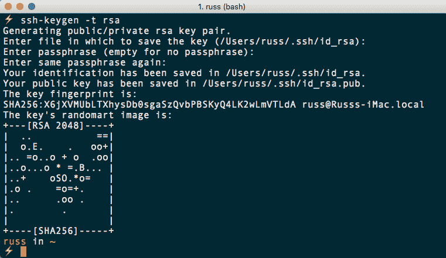
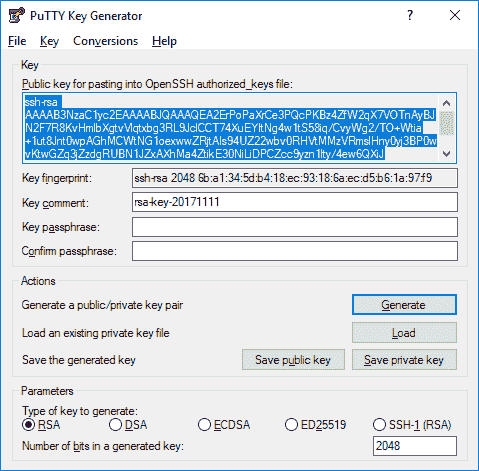
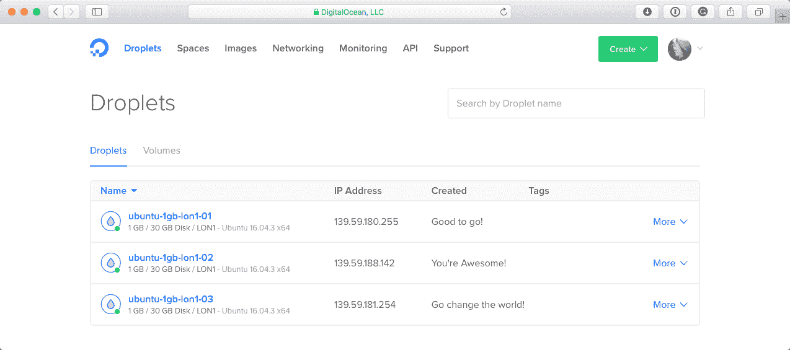
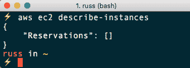
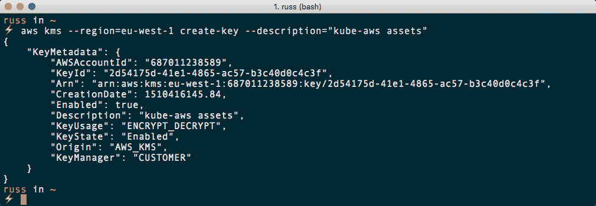
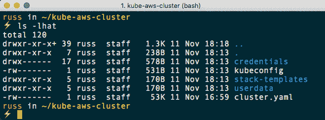
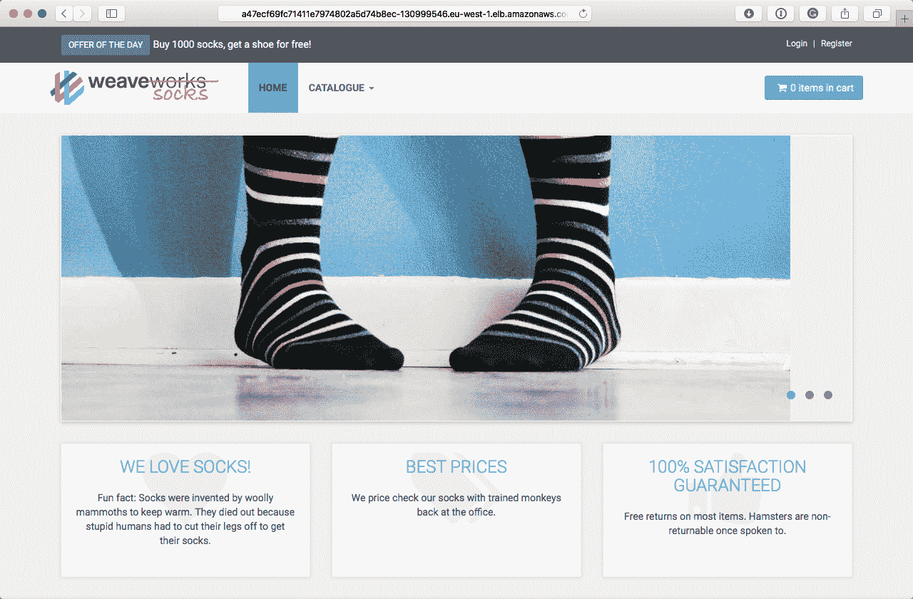
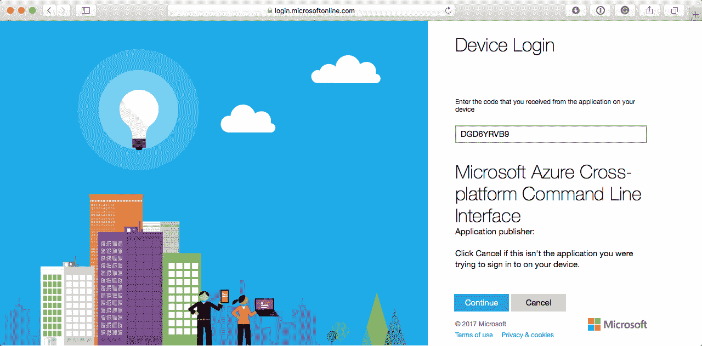
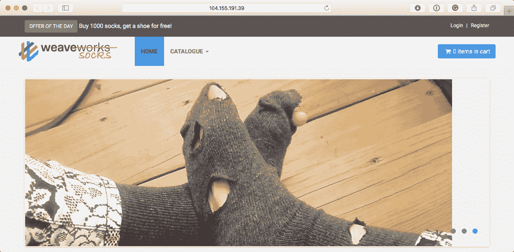

# 六、在云中安装 Kubernetes

到目前为止，我们一直在本地机器上运行 Kubernetes。这确实有一些缺点，其中之一就是处理能力。我们将开始考虑一些更复杂和强大的框架，因此我们需要一些额外的能力。正因为如此，我们将考虑在几个不同的公共云上安装 Kubernetes，每次使用不同的工具:

*   在数字海洋推出 Kubernetes
*   在 AWS 中启动 Kubernetes
*   在微软 Azure 中推出 Kubernetes
*   在谷歌云平台上推出 Kubernetes

然后，我们将研究公共云供应商之间的差异，并研究在其中一个平台上安装 Kubeless。

# 在数字海洋推出 Kubernetes

我们要看的第一个公共云平台是数字海洋。数字海洋与我们将在以下章节中看到的三大海洋略有不同，因为它的功能较少。例如，在产品页面上，DigitalOcean 列出了八个功能，而 AWS 产品页面列出了十八个主要领域，每个领域又分为六个或更多的功能和服务。

不要让这种情况欺骗你，让你认为数字海洋与我们将在本章中讨论的其他公共云供应商相比，不再是一项服务。

DigitalOcean 的强项是它是一个极其简单易用的托管平台。凭借其简单明了的应用编程接口和命令行工具、支持服务和出色的管理界面，可以在不到一分钟的时间内轻松调出功能强大但价格极具竞争力的虚拟机。

# 产生液滴

水滴是数字海洋对其计算资源的称呼。对于我们的 Kubernetes，我们将推出三款 Ubuntu 17.04 水滴，每款都有 1 GB 的内存、1 个 CPU 和 30 GB 的固态硬盘存储。

This three Droplet cluster, at the time of writing, will cost approximately $30 per month to keep online. If you are planning on keeping it online while you need it then it will cost $0.045 per hour for the three Droplets.

在创建任何水滴之前，您需要一个帐户；您可以在[https://cloud.digitalocean.com/registrations/new](https://cloud.digitalocean.com/registrations/new)注册数字海洋。一旦您注册，在您做任何其他事情之前，我建议您立即在您的帐户上启用双因素身份验证。您可以在[https://cloud.digitalocean.com/settings/security/](https://cloud.digitalocean.com/settings/security/)的账户安全页面上启用此功能。

启用双因素身份验证将为您提供额外的安全级别，并有助于保护您的帐户免受任何未经授权的访问以及意外的成本。毕竟，你不希望有人登录并使用你的账户创建 25 个最昂贵的水滴供他们使用，因为他们喜欢你买单。

Two-factor authentication works by introducing a second level of authentication to your account; typically this is a four- or six-digit code which is either generated by an application, such as Google Authenticator, on your mobile device or a text message sent by the service you are attempting to log in to. This means that even if your password is compromised an attacker still needs access to your mobile device or number.

接下来，我们需要生成一个 SSH 密钥，并将其上传到 DigitalOcean。如果您已经上传了带有 SSH 密钥的帐户，则可以跳过此任务。如果你没有钥匙，那就按照给定的说明去做。

如果您使用的是 macOS High Sierra 或 Ubuntu 17.04，则可以运行以下命令:

```
$ ssh-keygen -t rsa
```

这将要求您提供存储新生成的私钥和公钥的位置，以及密码。密码是可选的，但是如果 SSH 密钥的私有部分落入坏人之手，它确实会增加另一层安全性:



生成密钥后，您需要记下密钥的公共部分。为此，请运行以下命令，确保更新密钥的路径以匹配您自己的路径:

```
$ cat /Users/russ/.ssh/id_rsa.pub
```

您应该会看到如下内容:


Please make sure you do not share or publish the private portion of your SSH key (the file that does not contain `.pub` in the filename). This is used to authenticate you against the public portion of the key. If this falls into the wrong hands they will be able to access your server/services.

对于 Windows 10 专业版用户来说，你很可能使用 PuTTY 作为你的 SSH 客户端。如果您没有 PuTTY，您可以通过运行以下命令使用 Chocolatey 安装它:

```
$ choco install putty
```

安装 PuTTY 后，您可以通过运行以下命令打开 PuTTYgen 程序:

```
$ PUTTYGEN.exe
```

打开后，单击生成，并按照提示在空白区域移动光标。一秒钟后，您应该生成一个密钥:



从前面的截图中可以看到，您可以选择添加一个密码短语，该密码短语将用于解锁密钥的私有部分；同样，这是可选的。

单击保存公钥和保存私钥，并记下公钥的内容。

既然你有了你的公钥，我们需要让数字海洋有一个副本。为此，请转到安全页面，您可以在[https://cloud.digitalocean.com/settings/security/](https://cloud.digitalocean.com/settings/security/)找到该页面，然后单击添加 SSH 密钥。这将弹出一个对话框，要求您提供公钥的内容并命名。填写两个表单字段，然后单击添加 SSH 密钥按钮。

现在您已经为您的帐户分配了一个 SSH 密钥，您可以使用它来创建您的小滴，并对它们进行无密码访问。要创建液滴，请单击屏幕右上角的创建按钮，并从下拉菜单中选择液滴。

水滴创建页面上有几个选项:

*   选择映像:选择 Ubuntu 16.04 映像
*   选择大小:选择 10 美元/月选项，该选项有 1 GB、1 个 CPU 和 30 GB 固态硬盘
*   添加块存储:保持现状
*   选择数据中心区域:选择离您最近的区域；我选择了伦敦，因为我在英国
*   选择其他选项:选择专用网络
*   添加您的 SSH 密钥:选择您的 SSH 密钥
*   最终确定并创建:将水滴的数量增加到`3`，现在保持主机名不变

填写完前面的部分后，单击页面底部的创建按钮。这将启动你的三个小滴，并给你反馈他们在创作过程中走了多远。一旦它们启动，您应该会看到类似以下页面的内容:



如你所见，我有三个小滴，他们的 IP 地址，和一个很好的小激励信息。现在我们可以开始使用`kubeadm`部署我们的 Kubernetes 集群了。

# 使用 Kubernetes 部署 kubeadm

首先，我们需要登录我们的三个水滴中的一个；我们登录的第一台机器将是我们的 Kubernetes 主机:

```
$ ssh root@139.59.180.255
```

登录后，以下两个命令会检查软件包的任何更新并应用它们:

```
$ apt-get update
$ apt-get upgrade
```

现在我们是最新的，我们可以安装必备软件包。为此，请运行以下命令:

```
$ apt-get install docker.io curl apt-transport-https
```

您可能会注意到，我们使用的是作为核心 Ubuntu 16.04 包存储库的一部分分发的 Docker 版本，而不是正式的 Docker 版本。这是因为`kubeadm`没有对 Docker 较新版本的官方支持，推荐版本是 1.12。目前 Ubuntu 16.04 支持的 Docker 版本是 1.12.6。

现在我们已经安装了先决条件，我们可以通过运行以下命令来添加 Kubernetes 存储库:

```
$ curl -s https://packages.cloud.google.com/apt/doc/apt-key.gpg | apt-key add -
$ cat <<EOF >/etc/apt/sources.list.d/kubernetes.list
deb http://apt.kubernetes.io/ kubernetes-xenial main
EOF
```

`curl`命令为存储库添加 GPG 键，`cat`命令创建存储库文件。现在存储库已经就位，我们需要更新我们的包列表，并通过运行以下命令来安装`kubeadm`、`kubelet`和`kubectl`:

```
$ apt-get update
$ apt-get install kubelet kubeadm kubectl
```

安装后，您可以通过运行以下命令来检查安装的`kubeadm`版本:

```
$ kubeadm version
```

现在我们已经安装了所有需要的东西，我们可以通过运行以下命令来引导我们的 Kubernetes 主节点:

```
$ kubeadm init
```

这将需要几分钟来运行，您将获得一些相当详细的输出，让您知道`kubeadm`已经完成了哪些任务:


完成后，您应该会看到以下消息，但带有您的令牌等等:


记下底部的`kubeadm join`命令，我们很快就会看到。我们应该运行消息中提到的命令:

```
$ mkdir -p $HOME/.kube
$ sudo cp -i /etc/kubernetes/admin.conf $HOME/.kube/config
$ sudo chown $(id -u):$(id -g) $HOME/.kube/config
```

接下来，我们需要启用 pod 网络。有几个选项可供选择，它们都为 Kubernetes 集群提供了多主机容器网络:

*   **印花布**:[https://www.projectcalico.org/](https://www.projectcalico.org/)
*   **频道**:[https://github . com/project calico/channel](https://github.com/projectcalico/canal)
*   **法兰绒**:[https://coreos.com/flannel/docs/latest/](https://coreos.com/flannel/docs/latest/)
*   **Kube 路由器**:[https://github . com/cloudnatilabs/kube 路由器/](https://github.com/cloudnativelabs/kube-router/)
*   **罗马**:[https://github . com/Romana/Romana/](https://github.com/romana/romana/)
*   **织网**:[https://www.weave.works/oss/net/](https://www.weave.works/oss/net/)

对于我们的安装，我们将使用编织网。要安装它，只需运行以下命令:

```
$ export kubever=$(kubectl version | base64 | tr -d '\n')
$ kubectl apply -f "https://cloud.weave.works/k8s/net?k8s-version=$kubever"
```


如您所见，这使用了`kubectl`命令来部署 pod 网络。这意味着我们已经启动并运行了基本的 Kubernetes 集群，尽管是在单个节点上。

要准备其他两个集群节点，请为这两个节点打开 SSH 会话，并在这两个节点上运行以下命令:

```
$ apt-get update
$ apt-get upgrade
$ apt-get install docker.io curl apt-transport-https
$ curl -s https://packages.cloud.google.com/apt/doc/apt-key.gpg | apt-key add -
$ cat <<EOF >/etc/apt/sources.list.d/kubernetes.list
deb http://apt.kubernetes.io/ kubernetes-xenial main
EOF
$ apt-get update
$ apt-get install kubelet kubeadm kubectl
```

如您所见，这些是我们在主节点上执行的确切命令集，目的是让我们能够执行`kubeadm`命令。正如您可能已经猜到的，我们将运行初始化主节点时收到的`kubeadm join`命令，而不是运行`kubeadm init`。对我来说，命令如下:

```
$ kubeadm join --token 0c74f5.4d5492bafe1e0bb9 139.59.180.255:6443 --discovery-token-ca-cert-hash sha256:3331ba91e4a3a887c99e59d792b9f031575619b4646f23d8fe2938dc50f89491
```

您需要运行收到的命令，因为令牌将绑定到您的主节点。在两个节点上运行该命令，您应该会看到如下终端输出:


在其余两个节点上运行该命令后，返回主节点并运行以下命令:

```
$ kubectl get nodes
```

这将返回 Kubernetes 集群中的节点列表:


如你所见，我们有一个由三个水滴组成的星团。唯一的缺点是，目前我们必须登录到我们的主节点才能与我们的集群交互。幸运的是这很容易解决，我们只需要下载集群`admin.conf`文件的副本。

要在 macOS High Sierra 或 Ubuntu 17.04 上执行此操作，请运行以下命令，确保用主节点的 IP 地址替换该 IP 地址:

```
$ scp root@139.59.180.255:/etc/kubernetes/admin.conf 
```

如果您使用的是 Windows 10 Professional，则需要使用 WinSCP 之类的程序。要安装它，请运行以下命令:

```
$ choco install winscp
```

安装完成后，通过输入`WINSCP.exe`启动它，然后按照屏幕提示连接到您的主节点并下载`admin.conf`文件，该文件可以在`/etc/kubernetes/`中找到。

一旦您有了`admin.conf`文件的副本，您将能够在本地运行以下命令来查看您的三节点 Kubernetes 集群:

```
$ kubectl --kubeconfig ./admin.conf get nodes
```

一旦我们确认可以使用`kubectl`的本地副本进行连接，我们就应该将配置文件放在适当的位置，这样我们就不必每次都使用`--kubeconfig`标志。为此，请运行以下命令(仅限于 macOS 和 Ubuntu):

```
$ mv ~/.kube/config ~/.kube/config.mini
$mv admin.conf ~/.kube/config
```

现在运行以下命令:

```
$ kubectl get nodes
```

这应该显示你的三个水滴:


# 正在删除集群

要删除集群，只需登录到您的数字海洋控制面板，然后单击销毁链接，该链接可以在每个小滴右侧的更多下拉菜单中找到。请按照屏幕上的说明进行操作。请务必销毁所有三个飞沫，因为它们在线时会产生成本。

这是 Kubernetes 在低规格服务器上的手动部署。在接下来的几节中，我们将从 AWS 开始，了解如何在其他公共云中部署 Kubernetes。

# 在 AWS 中启动 Kubernetes

我们可以使用几种工具在 AWS 上启动 Kubernetes 集群；我们将报道一个叫做`kube-aws`的节目。遗憾的是，`kube-aws`不支持基于 Windows 的机器，因此以下说明仅适用于 macOS High Sierra 和 Ubuntu 17.04。

`kube-aws`是一个命令行工具，用于生成 AWS CloudFormation 模板，然后用于启动和管理 CoreOS 集群。然后，Kubernetes 被部署到 CoreOS 实例集群中。

AWS CloudFormation is Amazon's native scripting tool and allows you to programmatically launch AWS services; it covers pretty much all of the AWS API. CoreOS is an operating system that is focused on one thing, running containers. It has an extremely small footprint and is designed to be clustered and configured on cloud providers out-of-the-box.

# 正在设置

在[第 1 章](00.html#section_9)*无服务器场景*中，我们看到了创建一个 Lambda 函数。为此，我们安装了 AWS 命令行界面。我将假设您仍然配置了这个，并且您配置的 I am 用户具有管理员权限。您可以通过运行以下命令来测试这一点:

```
$ aws ec2 describe-instances
```

这应该会返回如下内容:



我们需要将 SSH 密钥导入到 AWS 中。为此，请打开 AWS 控制台([https://console.aws.amazon.com/](https://console.aws.amazon.com/))。登录后，从页面顶部的服务菜单中选择 EC2。进入 EC2 页面后，使用页面右上角的区域下拉菜单，确保选择了正确的区域。我将使用欧盟(爱尔兰)，也称为欧盟-西方-1。

现在我们已经进入了正确的区域，单击“密钥对”选项，该选项位于左侧菜单的“网络和安全”部分。一旦页面加载，点击导入密钥对按钮，然后像数字海洋一样，输入密钥对的名称，并在其中输入您的`id_rsa.pub`文件的内容。

接下来，我们需要一个 AWS KMS 店。要创建该区域，请运行以下命令，确保根据需要更新您的区域:

```
$ aws kms --region=eu-west-1 create-key --description="kube-aws assets"
```

这将返回几条信息，包括一个**亚马逊资源名称** ( **ARN** )。记下这一点以及`KeyId`:



接下来，我们需要一个亚马逊 S3 桶。要使用 AWS CLI 创建一个存储桶，请运行以下命令，确保更新该区域，并使存储桶名称对您来说是唯一的:

```
$ aws s3api --region=eu-west-1 create-bucket --bucket kube-aws-russ --create-bucket-configuration LocationConstraint=eu-west-1
```


现在我们已经导入了公共 SSH 密钥、一个 KMS ARN 和一个 S3 桶，我们只需要决定集群的 DNS 名称。

我将使用`kube.mckendrick.io`作为我的，因为我已经在亚马逊 53 号路线域名服务上托管了`mckendrick.io`。您应该选择一个可以配置 CNAME 的域或子域，或者选择一个托管在 53 号公路上的域或子域。

既然我们已经涵盖了基础知识，我们需要安装`kube-aws`二进制。为此，如果您正在运行 macOS High Sierra，只需运行以下命令:

```
$ brew install kube-aws
```

如果您运行的是 Ubuntu Linux 17.04，您应该运行以下命令:

```
$ cd /tmp
$ wget https://github.com/kubernetes-incubator/kube-aws/releases/download/v0.9.8/kube-aws-linux-amd64.tar.gz
$ tar zxvf kube-aws-linux-amd64.tar.gz
$ sudo mv linux-amd64/kube-aws /usr/local/bin
$ sudo chmod 755 /usr/local/bin/kube-aws
```

安装完成后，运行以下命令确认一切正常:

```
$ kube-aws version
```

在撰写本文时，当前版本是 0.9.8。您可以在发布页面上查看更新的版本，网址为:[https://github.com/kubernetes-incubator/kube-aws/releases/](https://github.com/kubernetes-incubator/kube-aws/releases/)。

# 使用 kube-aws 启动集群

在开始创建集群配置之前，我们需要创建一个工作目录，因为将会创建一些工件。让我们创建一个名为`kube-aws-cluster`的文件夹，并将其更改为:

```
$ mkdir kube-aws-cluster
$ cd kube-aws-cluster
```

现在我们在工作目录中，我们可以创建我们的集群配置文件。为此，请运行以下命令，确保用您在上一节中收集的信息替换这些值:

If you are not using a Route 53-hosted domain, remove the `--hosted-zone-id` flag.

```
kube-aws init \
 --cluster-name=kube-aws-cluster \
 --external-dns-name=kube.mckendrick.io \
 --hosted-zone-id=Z2WSA56Y5ICKTT \
 --region=eu-west-1 \
 --availability-zone=eu-west-1a \
 --key-name=russ \
 --kms-key-arn="arn:aws:kms:eu-west-1:687011238589:key/2d54175d-41e1-4865-ac57-b3c40d0c4c3f"
```

这将创建一个名为`cluster.yaml`的文件，它将是我们配置的基础:


接下来，我们需要创建我们的 Kubernetes 集群将使用的证书。为此，请运行以下命令:

```
$ kube-aws render credentials --generate-ca
```


接下来，我们需要生成 AWS 云信息模板。为此，请运行以下命令:

```
$ kube-aws render stack
```

这将在名为`stack-templates`的文件夹中创建模板:


在您的工作目录中运行`ls`应该会显示已经创建了几个文件和文件夹:



最后，我们可以运行以下命令来验证这些文件并将它们上传到我们的 S3 存储桶，记住用您自己的存储桶名称来更新存储桶名称:

```
$ kube-aws validate --s3-uri s3://kube-aws-russ/kube-aws-cluster
```

现在我们可以启动集群了。为此，只需运行以下命令，再次确保更新存储桶名称:

```
$ kube-aws up --s3-uri s3://kube-aws-russ/kube-aws-cluster
```

这将开始使用 AWS 云信息工具启动我们的集群:


此过程将需要几分钟；您可以在 AWS 控制台内的命令行上查看其进度。要在控制台中查看它，请转到服务菜单并选择云信息。一旦打开，您应该会看到列出了几个栈；选择其中一个，然后单击事件选项卡:


正如您从“事件”和“资源”选项卡中看到的，在后台发生了很多事情。其中包括:IAM 角色、VPCs 和网络、EC2 实例、负载平衡器、DNS 更新、自动扩展组等等。

一旦完成，您应该会看到三个云形成栈，一个主栈名为`kube-aws-cluster`，两个嵌套栈名为`kube-aws-cluster-Controlplane`，另一个名为`kube-aws-cluster-Nodepool1`。这两个嵌套栈的名称后面都有一个唯一的标识。您将在命令行上收到集群已启动的确认:


在我们的工作目录中运行以下命令将列出 AWS Kubernetes 集群中的节点:

```
$ kubectl --kubeconfig=kubeconfig get nodes
```


# 袜子店

为了测试我们的部署，我们可以启动袜子商店。这是一个由 Weave 编写的演示微服务应用。你可以在[https://microservices-demo.github.io/](https://microservices-demo.github.io/)找到它的项目页面。

要启动商店，我们需要从工作目录中运行以下命令:

```
$ kubectl --kubeconfig=kubeconfig create namespace sock-shop
$ kubectl --kubeconfig=kubeconfig apply -n sock-shop -f "https://github.com/microservices-demo/microservices-demo/blob/master/deploy/kubernetes/complete-demo.yaml?raw=true"
```

启动需要几分钟；您可以通过运行以下命令来检查进度:

```
$ kubectl --kubeconfig=kubeconfig -n sock-shop get pods
```

等待每个 pod 获得运行状态，如下图所示:


然后，我们应该能够访问我们的应用。要做到这一点，我们需要把它暴露在互联网上。由于我们的集群在 AWS 中，我们可以使用以下命令启动弹性负载平衡器，并让它指向我们的应用:

```
$ kubectl --kubeconfig=kubeconfig -n sock-shop expose deployment front-end --type=LoadBalancer --name=front-end-lb
```

要获得负载平衡器的信息，我们可以运行以下命令:

```
$ kubectl --kubeconfig=kubeconfig -n sock-shop get services front-end-lb
```


如您所见，应用正在端口`8079`上公开，但是我们不能完全看到弹性负载平衡器的网址。为此，我们可以运行以下命令:

```
$ kubectl --kubeconfig=kubeconfig -n sock-shop describe services front-end-lb
```


现在我们知道了弹性负载平衡器的网址，我们可以将它和端口一起输入到我们的浏览器中。对我来说，完整的网址是`http://a47ecf69fc71411e7974802a5d74b8ec-130999546.eu-west-1.elb.amazonaws.com:8079/`(这个网址不再有效)。

输入您的网址将显示以下页面:



要删除袜子商店应用，只需运行:

```
$ kubectl --kubeconfig=kubeconfig delete namespace sock-shop
```

这将删除我们创建的所有单元、服务和弹性负载平衡器。

# 正在删除集群

我们不要忘记，当集群启动并运行时，它会让我们付出代价。要删除集群和云信息脚本创建的所有服务，请运行以下命令:

```
$ kube-aws destroy
```

您将收到确认，云信息栈正在被删除，这将需要几分钟的时间。我建议您在云信息页面的 AWS 控制台中仔细检查，以确保在移除栈的过程中没有任何错误，因为任何保持运行的资源都可能会产生成本。

我们还需要移除我们创建的 S3 桶和 KMS；为此，请运行以下命令:

```
$ aws s3 rb s3://kube-aws-russ --force
$ aws kms --region=eu-west-1 disable-key --key-id 2d54175d-41e1-4865-ac57-b3c40d0c4c3f
```

您可以在本节前面我们首次创建 KMS 时所做的注释中找到`--key-id`。

虽然这次我们不必手动配置我们的集群，或者实际上登录到任何服务器，但是启动我们的集群的过程仍然是非常手动的。对于我们的下一个公共云供应商微软 Azure，我们将考虑一个更本机的部署。

# 在微软 Azure 中推出 Kubernetes

在[第 1 章](00.html#section_9)*无服务器景观*中，我们看了微软 Azure Functions 然而，我们并没有比 Azure web 界面更进一步来启动我们的函数。要使用 **Azure 容器服务** ( **AKS** )我们需要安装 Azure 命令行客户端。

此时还值得指出的是，AKS 目前不支持 Windows 10 PowerShell Azure 工具。但是，如果您使用的是 Windows，请不要担心，因为命令行客户端的 Linux 版本可以通过 Azure web 界面获得。

# 准备 Azure 命令行工具

Azure 命令行工具可通过 macOS High Sierra 上的自制程序获得，这使得安装像运行以下两个命令一样简单:

```
$ brew update
$ brew install azure-cli
```

Ubuntu 17.04 用户可以运行以下命令:

```
$ echo "deb [arch=amd64] https://packages.microsoft.com/repos/azure-cli/ wheezy main" | sudo tee /etc/apt/sources.list.d/azure-cli.list
$ sudo apt-key adv --keyserver packages.microsoft.com --recv-keys 52E16F86FEE04B979B07E28DB02C46DF417A0893
$ sudo apt-get install apt-transport-https
$ sudo apt-get update && sudo apt-get install azure-cli
```

安装后，您需要登录您的帐户。为此，请运行以下命令:

```
$ az login
```

当您运行该命令时，您将获得一个网址，即[https://aka.ms/devicelogin](https://aka.ms/devicelogin)、[，以及一个要输入的代码。在浏览器中打开网址，输入代码:](https://aka.ms/devicelogin)



登录后，关闭浏览器窗口并返回命令行，几秒钟后，您将收到确认信息，确认您是以登录浏览器的用户身份登录的。您可以通过运行以下命令对此进行仔细检查:

```
$ az account show
```

如上所述，Windows 用户可以使用 Azure web 界面访问自己的 bash shell。为此，请登录并单击顶部菜单栏中的> _ 图标，选择 bash shell，然后按照屏幕提示操作。在设置结束时，您应该会看到如下内容:


现在我们已经启动、安装了命令行工具，并连接到我们的帐户，我们可以启动我们的 Kubernetes 集群。

# 启动 AKS 集群

首先，我们需要注册 AKS 服务。为此，请运行以下命令:

```
$ az provider register -n Microsoft.ContainerService
```

注册需要几分钟才能完成。您可以通过运行以下命令来检查注册状态:

```
$ az provider show -n Microsoft.ContainerService
```

一旦看到`Registered`的`registrationState`，就可以出发了。要启动集群，我们需要首先创建一个资源组，然后创建集群。目前，`ukwest`或`westus2`均可提供 AKS:

```
$ az group create --name KubeResourceGroup --location ukwest
$ az aks create --resource-group KubeResourceGroup --name AzureKubeCluster --agent-count 1 --generate-ssh-keys
```

一旦您的集群启动，您可以运行以下命令来配置您的本地副本`kubectl`以针对集群进行身份验证:

```
$ az aks get-credentials --resource-group KubeResourceGroup --name AzureKubeCluster
```

最后，您现在可以像运行任何其他 Kubernetes 集群一样，运行以下命令来开始与您的集群交互:

```
$ kubectl get nodes
```


您会注意到我们只有一个节点；我们可以通过运行以下命令再添加两个节点:

```
$ az aks scale --resource-group KubeResourceGroup --name AzureKubeCluster --agent-count 3
$ kubectl get nodes
```


您应该能够看到在 Azure web 界面中启动的所有资源:


现在我们的集群中有三个节点，让我们启动*袜子店演示*应用。

# 袜子店

这些命令与我们之前运行的命令略有不同，因为我们不必为`kubectl`提供配置文件:

```
$ kubectl create namespace sock-shop
$ kubectl apply -n sock-shop -f "https://github.com/microservices-demo/microservices-demo/blob/master/deploy/kubernetes/complete-demo.yaml?raw=true"
```

同样，您可以通过运行以下命令来检查豆荚的状态:

```
$ kubectl -n sock-shop get pods
```

一旦所有 pods 都在运行，您就可以通过运行以下命令来公开应用:

```
$ kubectl -n sock-shop expose deployment front-end --type=LoadBalancer --name=front-end-lb
$ kubectl -n sock-shop get services front-end-lb
$ kubectl -n sock-shop describe services front-end-lb
```


这应该会给你一个端口和 IP 地址。从前面的输出中可以看到，这给了我一个`http://51.141.28.140:8079/`的网址，把这个放到我的浏览器中显示了袜子商店应用:


要删除我刚刚需要运行的应用:

```
$ kubectl delete namespace sock-shop
```

# 正在删除集群

根据其他云服务，当您的 AKS 节点在线时，您将按小时收费。完成集群后，只需删除资源组；这将删除所有关联的服务:

```
$ az aks delete --resource-group KubeResourceGroup --name AzureKubeCluster
$ az group delete --name KubeResourceGroup
```

删除后，转到 Azure web 界面，手动删除任何其他剩余的资源/服务。我们要看的下一个也是最后一个公共云是谷歌云。

# 在谷歌云平台上推出 Kubernetes

正如您所料，谷歌云支持库本内斯。在进行之前，你需要一个账户，可以在[http://cloud.google.com/](http://cloud.google.com/)注册。设置好帐户后，类似于我们在本章中看到的其他公共云平台，我们需要配置命令行工具。

# 安装命令行工具

这三种操作系统都有安装程序。如果您使用的是 macOS High Sierra，那么您可以通过运行以下命令来使用家酿和木桶安装谷歌云软件开发工具包:

```
$ brew cask install google-cloud-sdk
```

Windows 10 专业版用户可以使用巧克力并运行以下程序:

```
$ choco install gcloudsdk
```

最后，Ubuntu 17.04 用户将需要运行以下内容:

```
$ export CLOUD_SDK_REPO="cloud-sdk-$(lsb_release -c -s)"
$ echo "deb http://packages.cloud.google.com/apt $CLOUD_SDK_REPO main" | sudo tee -a /etc/apt/sources.list.d/google-cloud-sdk.list
$ curl https://packages.cloud.google.com/apt/doc/apt-key.gpg | sudo apt-key add -
$ sudo apt-get update && sudo apt-get install google-cloud-sdk
```

安装后，您需要通过运行以下命令登录您的帐户:

```
$ gcloud init
```

这将打开您的浏览器，并要求您登录您的谷歌云帐户。登录后，您将被要求授予谷歌云软件开发工具包访问您的帐户的权限。按照屏幕上的提示授予权限，您应该会收到一条消息，确认您已通过谷歌云软件开发工具包的身份验证。

回到您的终端，您现在应该有一个提示，要求您创建一个项目。出于测试目的，对该问题回答是(`y`)，并输入项目名称。此项目名称必须是您独有的，因此可能需要尝试几次。如果一开始失败，可以使用以下命令:

```
$ gcloud projects create russ-kubernetes-cluster
```

如你所见，我的项目叫做`russ-kubernetes-cluster`。您应该在命令中引用自己的项目名称。最后的步骤是将我们的新项目设置为默认项目和区域。我使用了以下命令:

```
$ gcloud config set project russ-kubernetes-cluster
$ gcloud config set compute/zone us-central1-b
```

现在我们已经安装了命令行工具，我们可以继续启动我们的集群了。

# 启动谷歌容器集群

您可以使用一个命令启动集群。以下命令将启动名为`kube-cluster`的集群:

```
$ gcloud container clusters create kube-cluster
```

当您第一次运行该命令时，您可能会遇到一个错误，指出没有为您的项目启用 Google 容器 API:


您可以按照错误中给出的链接并按照屏幕上的说明启用应用编程接口来纠正此错误。如果您的项目没有任何相关的账单，您可能还会发现您得到一个错误:


要解决这个问题，在[https://console.cloud.google.com/](https://console.cloud.google.com/)登录谷歌云网络界面，从显示谷歌云平台的下拉列表中选择您的项目。选择项目后，单击左侧菜单中的计费链接，并按照屏幕提示将项目链接到您的计费帐户。

一旦您启用了应用编程接口，并且您的项目链接到计费帐户，您应该能够重新运行以下内容:

```
$ gcloud container clusters create kube-cluster
```

这将需要几分钟的时间，但是一旦完成，您应该会看到如下内容:


如您所见，`kubectl`的配置已经自动更新，这意味着我们可以运行以下命令来检查我们是否可以与新集群通信:


Before running this command please ensure that your local machine has a direct route to the internet and that you are not running through a proxy server or connection which is heavily firewalled, you may not be able to run into difficulties with the `kubectl proxy` command if you are.

您还应该能够在谷歌云网络界面的容器引擎部分看到您的集群:


现在我们已经启动并运行了集群，让我们再次启动袜子商店应用。

# 袜子店

正如我们对 Azure 所做的那样，这次不需要提供配置文件，所以我们只需要运行以下命令:

```
$ kubectl create namespace sock-shop
$ kubectl apply -n sock-shop -f "https://github.com/microservices-demo/microservices-demo/blob/master/deploy/kubernetes/complete-demo.yaml?raw=true"
$ kubectl -n sock-shop get pods
$ kubectl -n sock-shop expose deployment front-end --type=LoadBalancer --name=front-end-lb
$ kubectl -n sock-shop get services front-end-lb
$ kubectl -n sock-shop describe services front-end-lb
```

从下面的截图可以看到，IP 和端口给了我一个`http://104.155.191.39:8079`的 URL:


此外，在谷歌云网络界面中，点击发现和负载平衡还会显示我们创建的负载平衡器:


点击界面中的链接，或者将你的网址粘贴到浏览器中，你会看到现在熟悉的商店前台:



运行以下命令应该会删除袜子商店应用:

```
$ kubectl delete namespace sock-shop
```

# 无内胎跑步

在我们移除我们的谷歌云，三节点 Kubernetes 集群之前，让我们快速重温 Kubeless。要部署 Kubeless，请运行以下命令:

```
$ kubectl create ns kubeless
$ kubectl create -f https://github.com/kubeless/kubeless/releases/download/v0.2.3/kubeless-v0.2.3.yaml
```

部署后，您可以通过运行以下命令来检查状态:

```
$ kubectl get pods -n kubeless
$ kubectl get deployment -n kubeless
$ kubectl get statefulset -n kubeless
```

您还可以在谷歌云网络界面的谷歌容器引擎部分查看工作负载和发现与负载平衡。一旦部署了 kumblesce，返回到本书附带的存储库中的`/Chapter04/hello-world`文件夹，并运行以下命令来部署测试功能:

```
$ kubeless function deploy hello \
 --from-file hello.py \
 --handler hello.handler \
 --runtime python2.7 \
 --trigger-http

```

部署后，您可以通过运行以下命令来查看该函数:

```
$ kubectl get functions
$ kubeless function ls
```

您可以通过运行以下命令来调用该函数:

```
$ kubeless function call hello 
```


此外，您可以使用以下命令公开该函数:

```
$ kubectl expose deployment hello --type=LoadBalancer --name=hello-lb
```

创建负载平衡器后，您可以运行以下命令来确认 IP 地址和端口:

```
$ kubectl get services hello-lb
```

一旦知道了 IP 地址和端口，就可以在浏览器中打开该功能，或者使用 curl 或 HTTPie 查看该功能:


现在，我们已经用 Sock Shop 应用测试了我们的集群，并部署了一个 Kubeless 函数，我们应该考虑终止我们的集群。

# 正在删除集群

要删除集群，只需运行以下命令:

```
$ gcloud container clusters delete kube-cluster
```

它会询问您是否确定，回答是，一两分钟后，您的集群将被删除。同样，您应该在谷歌云网络界面中再次检查您的集群是否已被正确删除，这样您就不会产生任何意外的成本。

# 摘要

在本章中，我们看了四个云供应商。前两个，DigitalOcean 和 AWS，目前不支持 Kubernetes，所以我们使用`kubeadm`和`kube-aws`来启动和配置我们的集群。借助微软 Azure 和谷歌云，我们使用他们的命令行工具来启动他们本地支持的 Kubernetes 服务。我相信您会同意，在撰写本文时，这两种服务都比我们之前看到的前两种更易于使用。

一旦集群启动并运行，与 Kubernetes 的交互就是一种相当一致的体验。当发出诸如`kubectl expose` : Kubernetes 这样的命令时，我们真的不需要考虑我们的集群在哪里运行，而是知道它在哪里运行，并使用提供者的本地服务来启动负载平衡器，而我们不必干预任何特殊的设置或考虑。

你可能想知道为什么我们没有在数字海洋上启动袜子商店应用。由于机器的规格相当低，应用的运行速度非常慢，在我们查看的四个供应商中，DigitalOcean 是唯一一个目前 Kubernetes 不支持该供应商的本地负载平衡服务的供应商。我相信这将在未来几个月得到纠正。

此外，您可能会惊讶于 AWS 上没有本地的 Kubernetes 体验。在撰写本报告时，情况就是这样；然而，有传言称，由于 AWS 已经加入了云原生基金会，他们正在开发原生的 Kubernetes 服务。

在下一章中，我们将看一下 Apacheopen 晶须，这是一个最初由 IBM 开发的开源无服务器云平台。