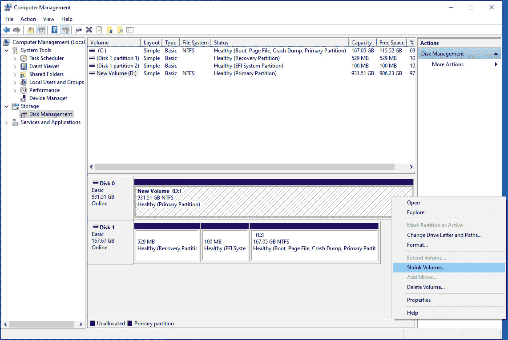
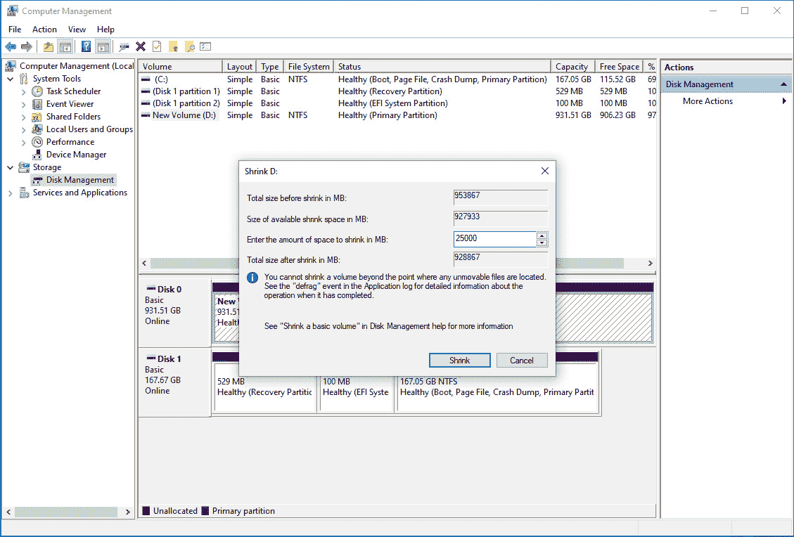

# 前言

# 关于书

由于其对管理数百个运行云原生应用程序的容器的广泛支持，Kubernetes 是最受欢迎的开源容器编排平台，使集群管理变得容易。本研讨会采用一种实用的方法来让您熟悉 Kubernetes 环境及其应用。

从介绍 Kubernetes 的基础知识开始，您将安装和设置您的 Kubernetes 环境。您将了解如何使用 Pod 编写 YAML 文件和部署您的第一个简单的 web 应用程序容器。然后，您将为 Pods 分配人性化的名称，探索各种 Kubernetes 实体和功能，并发现何时使用它们。当您完成这些章节时，这本书将向您展示如何通过应用各种技术来设计组件和部署集群来充分利用 Kubernetes。您还将掌握限制对集群内某些功能的访问的安全策略。在本书的最后，您将获得 Kubernetes 高级特性的概要，这些特性用于构建您自己的控制器并升级到 Kubernetes 集群而不会停机。

在本研讨会结束时，您将能够使用 Kubernetes 有效地管理容器和运行基于云的应用程序。

## 观众

无论您是 web 编程领域的新手，还是希望使用 Kubernetes 来管理和扩展容器化应用程序的经验丰富的开发人员或软件工程师，您都会发现这个研讨会非常有用。要充分利用这本书，对码头工人和集装箱运输有一个基本的了解是必要的。

## 关于章节

*第 1 章*、*Kubernetes 和 Containers* 简介，从容器化技术以及支持容器化的各种底层 Linux 技术开始。这一章以将 Kubernetes 引入图片结束，同时展示了它给桌面带来的优势。

*第 2 章*、*库本内斯概述*，为您提供了第一次对库本内斯的实际操作介绍，并提供了库本内斯架构的概述。

*第 3 章**kubectl–Kubernetes 指挥中心*，在强调声明式管理原则的同时，阐述了使用 kube CTL 的各种方式。

*第四章*、*如何与 Kubernetes (API Server)* 进行通信，深入探讨了 Kubernetes API server 的细节以及与其进行通信的各种方式。

*第 5 章*、 *Pods* ，介绍了用于部署任何应用程序的基本 Kubernetes 对象。

*第 6 章*、*标签和注释*，涵盖了 Kubernetes 中用于对不同对象进行分组、分类和链接的基本机制。

*第 7 章*、 *Kubernetes 控制器*介绍了各种 Kubernetes 控制器，例如 Deployments 和 StatefulSets 等，它们是声明式管理方法的一些关键使能因素。

*第 8 章*、*服务发现*描述了如何在集群内和集群外发现不同的 Kubernetes 对象。

*第 9 章*、*在磁盘上存储和读取数据*，解释了 Kubernetes 提供的各种数据存储抽象，使应用程序能够在磁盘上读取和存储数据。

*第 10 章*、*配置地图和秘密*，教你如何将应用程序配置数据与应用程序本身分离，同时看看采用这种方法的优势。

*第 11 章*、*构建自己的 HA 集群*，带领您在**亚马逊网络服务** ( **AWS** )平台上建立自己的高可用、多节点 Kubernetes 集群。

*第 12 章*、*您的应用程序和 HA* 阐述了使用 Kubernetes 进行持续集成背后的一些概念，并使用运行在**亚马逊弹性 Kubernetes 服务**上的高可用性、多节点、托管 Kubernetes 集群演示了其中的一些概念。

*第 13 章*、*Kubernetes 中的运行时和网络安全*，在介绍 Kubernetes 提供的访问控制和安全功能之前，向您概述了您的应用程序和集群可能遭受攻击的方式。

*第 14 章*、*在 Kubernetes* 中运行有状态组件，教你如何正确使用不同的 Kubernetes 抽象来可靠地部署有状态应用程序。

*第 15 章*、*Kubernetes 中的监视和自动缩放*介绍了监视不同 Kubernetes 对象，然后使用这些信息来缩放集群容量的方法。

*第 16 章*、 *Kubernetes 接纳控制器*描述了 Kubernetes 如何允许我们扩展 API 服务器提供的功能，以在 API 服务器接受请求之前实现自定义策略。

*第 17 章*、*库本内特斯*中的高级调度描述了调度器如何将吊舱放置在库本内特斯集群上。您将使用高级功能来影响吊舱的调度器放置决策。

*第 18 章**无停机升级集群*教你如何将 Kubernetes 平台升级到更新版本，而不会让你的平台或应用程序出现任何停机。

*第 19 章*、*库本内斯*中的自定义资源定义，向您展示了扩展库本内斯提供的功能的主要方式之一。您将看到自定义资源如何允许您在集群上实现特定于您自己的域的概念。

注意

章节中介绍的活动的解决方案可以在以下地址找到:[https://packt.live/304PEoD](https://packt.live/304PEoD)。

## 惯例

文本中的码字、数据库表名、文件夹名、文件名、文件扩展名、路径名、伪 URL 和用户输入如下所示:“在当前工作目录中创建一个名为`sample-pod.yaml`的文件。”

创建 YAML 文件的代码块、终端命令或文本设置如下:

```
kubectl -n webhooks create secret tls webhook-server-tls \
--cert "tls.crt" \
--key "tls.key"
```

新的重要词语是这样显示的:“Kubernetes 通过**准入控制器**提供这种能力。”

代码片段的关键部分突出显示如下:

```
kind: Pod
metadata:
 name: infra-libraries-application-staging
 namespace: metadata-activity
 labels:
 environment: staging
 team: infra-libraries
 annotations:
 team-link: "https://jira-link/team-link-2"
spec:
  containers:
```

你在屏幕上看到的单词，例如，在菜单或对话框中，出现在文本中，如下所示:“在左侧栏上，单击`Configuration`，然后单击`Data Sources`

长代码片段被截断，GitHub 上代码文件的对应名称被放在截断代码的顶部。到整个代码的永久链接被放在代码片段的下面。它应该如下所示:

变异控制器，开始

```
46 //create the response with patch bytes 
47 var admissionResponse *v1beta1.AdmissionResponse 
48 admissionResponse = &v1beta1.AdmissionResponse { 
49     allowed: true, 
50     Patch:   patchBytes, 
51     PatchType: func() *v1beta1.PatchType { 
52         pt := v1beta1.PatchTypeJSONPatch 
53         return &pt 
54     }(), 
55 } 
```

这个例子的完整代码可以在[https://packt.live/35ieNiX](https://packt.live/35ieNiX)找到。

## 设置您的环境

在详细探究本书之前，我们需要设置具体的软件和工具。在下一节中，我们将看到如何做到这一点。

### 硬件要求

您至少需要一个支持虚拟化的双核 CPU、4 GB 内存和 20 GB 可用磁盘空间。

### 操作系统要求

我们推荐的操作系统是 Ubuntu 20.04 LTS 或者 macOS 10.15。如果你用的是 Windows，可以双引导 Ubuntu。我们已经在本节的最后提供了相关说明。

### 虚拟化

您需要在硬件和操作系统上启用虚拟化功能。

在 Linux 中，您可以运行以下命令来检查虚拟化是否已启用:

```
grep -E --color 'vmx|svm' /proc/cpuinfo
```

您应该获得对该命令的非空响应。如果您得到一个空响应，那么您没有启用虚拟化。

在 macOS 中，运行以下命令:

```
sysctl -a | grep -E --color 'machdep.cpu.features|VMX'
```

如果启用了虚拟化，您应该能够在输出中看到`VMX`。

注意

如果您的主机环境被虚拟化，您将无法遵循书中的说明，因为 Minikube(默认情况下)在虚拟机中运行所有 Kubernetes 组件，如果主机环境本身被虚拟化，这将不起作用。在没有虚拟机管理程序的情况下使用 Minikube 是可能的，但是与我们在本书中的演示相比，您的结果有时可能会有所不同。因此，我们建议直接在您的机器上安装一个推荐的操作系统。

## 安装和设置

本节列出了本书所需的所有软件的安装说明。由于我们推荐的是 Ubuntu，所以我们将使用 APT 包管理器在 Ubuntu 中安装大多数所需的软件。

对于 macOS，为了方便起见，我们建议您使用家酿。您可以通过在终端中运行以下脚本来安装它:

```
/bin/bash -c "$(curl -fsSL https://raw.githubusercontent.com/Homebrew/install/master/install.sh)"
```

该脚本的终端输出将向您显示将应用哪些更改，然后要求您确认。一旦确认，安装即可完成。

### 更新您的套餐列表

在使用 APT 在 Ubuntu 中安装任何软件包之前，请确保您的软件包列表是最新的。使用以下命令:

```
sudo apt update
```

此外，您可以使用以下命令选择升级机器上的任何可升级软件包:

```
sudo apt upgrade
```

同样，在 macOS 的情况下，使用以下命令更新家酿的软件包列表:

```
brew update
```

### 安装 Git

这个研讨会的代码包可以在我们的 GitHub 存储库中找到。您可以使用 Git 克隆存储库来获取所有代码文件。

使用以下命令在 Ubuntu 上安装 Git:

```
sudo apt install git-all
```

如果你在 macOS 上使用 Xcode，很可能你已经安装了 Git。您可以通过运行以下命令来检查:

```
git --version
```

如果出现`Command not found`错误，则说明没有安装。您可以使用以下命令通过自制程序安装它:

```
brew install git
```

### jq

jq 是一个 JSON 解析器，对于从 JSON 格式的 API 响应中提取任何信息都很有用。您可以在 Ubuntu 上使用以下命令安装它:

```
sudo apt install jq
```

您可以使用以下命令在 macOS 上安装:

```
brew install jq
```

### 树

树是一个包，它允许你在终端中看到目录结构。您可以在 Ubuntu 上使用以下命令安装它:

```
sudo apt install tree
```

您可以使用以下命令在 macOS 上安装:

```
brew install tree
```

### 自动气象站命令行界面

AWS 命令行工具是一个命令行界面工具，您可以从终端使用它来管理您的 AWS 资源。您可以使用以下网址的安装说明进行安装:[https://docs . AWS . Amazon . com/CLI/latest/user guide/install-cliv 2 . html](https://docs.aws.amazon.com/cli/latest/userguide/install-cliv2.html)。

### 迷你立方和立方

Minikube 允许我们创建一个单节点 Kubernetes 集群，用于学习和测试。kubectl 是一个命令行界面工具，允许我们与集群进行通信。这些工具的详细安装说明见*第 2 章*、*库本内特斯概述*。

即使您已经安装了 Minikube，我们也建议您使用*第 2 章*、*Kubernetes 概述*中指定的版本，以保证本书所有说明的可再现性。

Minikube 要求您安装虚拟机管理程序。我们将使用 VirtualBox。

### 虚拟盒

VirtualBox 是一个开源虚拟机管理程序，Minikube 可以使用它来为我们的集群虚拟化一个节点。使用以下命令在 Ubuntu 上安装 VirtualBox:

```
sudo apt install virtualbox
```

要在 macOS 上安装，首先从以下链接获取适当的文件:

[https://www.virtualbox.org/wiki/Downloads](https://www.virtualbox.org/wiki/Downloads)。

然后，按照这里提到的安装说明进行操作:

[https://www . virtualbox . org/manual/ch02 . html # installation-MAC](https://www.virtualbox.org/manual/ch02.html#installation-mac)。

### 码头工人

Docker 是 Kubernetes 使用的默认容器化引擎。您将在*第 1 章*、*库本内特和容器介绍*中了解更多关于 Docker 的信息。

要安装 Docker，请遵循以下链接中的安装说明:

[https://docs.docker.com/engine/install/](https://docs.docker.com/engine/install/)。

要在 Mac 中安装 Docker，请遵循以下链接中的安装说明:

[https://docs . docker . com/docker-for-MAC/install/](https://docs.docker.com/docker-for-mac/install/)。

要在 Ubuntu 中安装 Docker，请遵循以下链接中的安装说明:

[https://docs . docker . com/engine/install/Ubuntu/](https://docs.docker.com/engine/install/ubuntu/)。

### 走

Go 是一种编程语言，用于构建本书中演示的应用程序。还有，Kubernetes 是用 Go 写的。要在您的机器上安装 Go，请对 Ubuntu 使用以下命令:

```
sudo apt install golang-go
```

要在 macOS 上安装，请使用以下说明:

1.  Use the following command to install Go:

    ```
    brew install golang
    ```

    注意

    该代码在 Go 版本 1.13 和 1.14 上进行了测试。请确保您有这些版本，尽管代码应该适用于所有 1.x 版本。

2.  现在，我们需要设置一些环境变量。使用以下命令:

    ```
    mkdir - p $HOME/go
    export GOPATH=$HOME/go
    export GOROOT="$(brew --prefix golang)/libexec"
    export PATH="$PATH:${GOPATH}/bin:${GOROOT}/bin"
    ```

### 肺

kops 是一个命令行界面工具，允许您在 AWS 上设置 Kubernetes 集群。使用 kops 安装 Kubernetes 的实际过程在*第 11 章*、*构建自己的 HA 集群*中有所介绍。为了确保本书中给出的说明的再现性，我们建议您安装 kops 版本 1.15.1。

要在 Ubuntu 上安装，请执行以下步骤:

1.  使用以下命令下载 kops 版本 1.15.1 的二进制文件:

    ```
    curl -LO https://github.com/kubernetes/kops/releases/download/1.15.0/kops-linux-amd64
    ```

2.  现在，使用以下命令使二进制文件可执行:

    ```
    chmod +x kops-linux-amd64
    ```

3.  将可执行文件添加到您的路径中:

    ```
    sudo mv kops-linux-amd64 /usr/local/bin/kops
    ```

4.  Check whether kops has been successfully installed by running the following command:

    ```
    kops version
    ```

    如果 kops 已经成功安装，您应该会收到一个响应，说明版本为 1.15.0。

要在 macOS 上安装，请执行以下步骤:

1.  使用以下命令下载 kops 版本 1.15.1 的二进制文件:

    ```
    curl -LO https://github.com/kubernetes/kops/releases/download/1.15.0/kops-darwin-amd64
    ```

2.  现在，使用以下命令使二进制文件可执行:

    ```
    chmod +x kops-darwin-amd64
    ```

3.  将可执行文件添加到您的路径中:

    ```
    sudo mv kops-darwin-amd64 /usr/local/bin/kops
    ```

4.  Check whether kops has been successfully installed by running the following command:

    ```
    kops version
    ```

    如果 kops 已经成功安装，您应该会收到一个响应，说明版本为 1.15.0。

## 【Windows 用户双引导 Ubuntu

在本节中，您将找到如何在运行 Windows 的情况下双引导 Ubuntu 的说明。

注意

在安装任何操作系统之前，强烈建议您备份系统状态以及所有数据。

### 调整分区大小

如果您的计算机上安装了 Windows，很可能您的硬盘已被完全利用，也就是说，所有可用空间都已分区并格式化。我们需要硬盘上有一些未分配的空间。因此，我们将调整一个有大量空闲空间的分区的大小，为我们的 Ubuntu 分区腾出空间:

1.  Open the Computer Management utility. Press `Win + R` and enter `compmgmt.msc`:

    

    图 0.1:Windows 上的计算机管理实用程序

2.  In the left side pane, go to the `Storage > Disk Management` option as shown here:

    

    图 0.2:磁盘管理

    您将在屏幕的下半部分看到所有分区的摘要。您还可以看到与所有分区相关联的驱动器号以及有关 Windows 启动驱动器的信息。如果你有一个有足够可用空间(20 GB +)的分区，既不是引导驱动器(`C:`)，也不是恢复分区，更不是电喷系统分区，这将是理想的选择。如果没有这样的分区，那么您可以调整`C:`驱动器的大小。

3.  In this example, we will choose the `D:` drive. You can right-click on any partition and open `Properties` to check the free space available:

    

    图 0.3:检查驱动器的属性

    现在，在我们调整分区大小之前，我们需要确保文件系统上没有错误或任何硬件故障。我们将通过使用 Windows 上的 **chkdsk** 实用程序来实现这一点。

4.  Open Command Prompt by pressing `Win + R` and entering `cmd.exe`. Now, run the following command:

    ```
    chkdsk D: /f
    ```

    将驱动器号替换为您想要使用的驱动器号。您应该会看到类似以下内容的响应:

    

    图 0.4:扫描驱动器中的任何文件系统错误

    请注意，在此屏幕截图中，Windows 报告它已经扫描了文件系统，没有发现任何问题。如果您的案例遇到任何问题，您应该首先修复它们，以防止数据丢失。

5.  Now, come back to the `Computer Management` window, right-click on the desired drive, and then click on `Shrink Volume`, as shown here:

    

    图 0.5:打开收缩体积对话框

6.  In the prompt window, enter the amount of space you want to clear in the only field that you can edit. In this example, we are clearing approximately 25 GB of disk space by shrinking our `D:` drive:

    

    图 0.6:通过缩小现有卷来清除 25 GB

7.  After you shrink your drive, you should be able to see unallocated space on your drive, as seen here:

    

图 0.7:缩小卷后未分配的空间

现在我们准备安装 Ubuntu。但是首先，我们需要下载它并创建一个可引导的 USB，这是最方便的安装介质之一。

### 创建一个可引导的 u 盘来安装 Ubuntu

您将需要最小容量为 4 GB 的闪存驱动器。请注意，这上面的所有数据都将被擦除:

1.  从这个链接下载 Ubuntu 桌面的 ISO 映像:[https://releases.ubuntu.com/20.04/](https://releases.ubuntu.com/20.04/)。
2.  接下来，我们需要将 ISO 映像刻录到 u 盘，并创建一个可引导的 u 盘。有许多工具可用于此，您可以使用其中的任何一个。在这个例子中，我们使用的是 Rufus，它是免费的开源软件。可以从这个链接获取:[https://www.fosshub.com/Rufus.html](https://www.fosshub.com/Rufus.html)。
3.  安装好 Rufus 后，插入 u 盘，打开 Rufus。确保选择了正确的`Device`选项，如下图所示。
4.  按下`Boot selection`下的`SELECT`按钮，然后打开你下载的 Ubuntu 18.04 图片。
5.  The choice for `Partition scheme` will depend on how your BIOS and your disk drive are configured. `GPT` will be the best option for most modern systems, while `MBR` will be compatible with older systems:

    

    图 0.8:鲁弗斯的配置

6.  您可以将所有其他选项保留为默认值，然后按`START`。完成后，关闭 Rufus。您现在有了一个可引导的 u 盘，可以安装 Ubuntu 了。

### 安装 Ubuntu

现在，我们将使用可引导的 u 盘来安装 Ubuntu:

1.  To install Ubuntu, boot using the bootable installation media that we just created. In most cases, you should be able to do that by simply having the USB drive plugged in while starting up your machine. If you don't automatically boot into the Ubuntu setup, go into your BIOS settings and ensure that your USB device is at the highest boot priority and that Secure Boot is turned off. The instructions for entering the BIOS setup are usually displayed on the splash screen (the screen with your PC manufacturer logo when you start up your computer) that is displayed during POST checks. You may also have the option to enter a boot menu while starting up. Usually, you have to hold down `Delete`, `F1`, `F2`, `F12`, or some other key while your PC boots up. It depends on your motherboard's BIOS.

    您应该会看到一个带有`Try Ubuntu`或`Install Ubuntu`选项的屏幕。如果您没有看到此屏幕，而是看到一个带有以`Minimal BASH Like Line Editing is Supported...`开头的消息的外壳，那么很可能在下载国际标准化组织文件或创建可引导的 u 盘时出现了一些数据损坏。通过计算下载文件的`MD5`、`SHA1`或`SHA256`哈希，并将其与前面提到的 Ubuntu 下载页面上名为`MD5SUMS`、`SHA1SUMS`或`SHA256SUMS`的文件进行比较，来检查下载的 ISO 文件的完整性。然后，重复上一节中的步骤，重新格式化并重新创建可引导的 USB 驱动器。

    如果您在 BIOS 中将最高引导优先级设置为正确的 USB 设备，但仍然无法使用 USB 设备进行引导(您的系统可能会忽略它，转而引导至 Windows)，那么最有可能出现两个问题:

    USB 驱动器未正确配置为可引导设备，或者 GRUB 引导加载程序未正确设置。在大多数情况下，验证下载映像的完整性并重新创建可引导的 u 盘应该可以解决这个问题。

    -您为系统配置选择了错误的`Partition scheme`选项。尝试另一个并重新创建 u 盘。

2.  使用 u 盘启动机器后，选择`Install Ubuntu`。
3.  选择您想要的语言，然后按`Continue`。
4.  在下一个屏幕上，选择合适的键盘布局并继续下一个屏幕。
5.  On the next screen, select `Normal installation`.

    检查`Download updates while installing Ubuntu`和`Install third-party software for graphics and Wi-Fi hardware and additional media formats`选项。

    然后，继续下一个屏幕。

6.  在下一屏，选择`Install Ubuntu alongside Windows Boot Manager`，然后点击`Install now`。您将看到一个提示，描述 Ubuntu 将对您的系统进行的更改，例如将创建的新分区。确认更改并进入下一个屏幕。
7.  在下一个屏幕上，选择您的地区并按`Continue`。
8.  On the next screen, set your name (optional), username, computer name, and password, and then press `Continue`.

    安装现在应该开始了。这将需要一段时间，具体取决于您的系统配置。安装完成后，将提示您重新启动计算机。拔下 u 盘，然后点击`Restart Now`。

    如果你忘记移除你的 u 盘，你可以重新启动进入 Ubuntu 安装。在这种情况下，只需退出设置。如果 Ubuntu 的一个活动实例已经启动，重新启动你的机器。记住这次要取出 u 盘。

    如果重启后直接引导到 Windows，没有选择操作系统的选项，可能的问题是 Ubuntu 安装的 GRUB 引导加载程序没有优先于 Windows 引导加载程序。在某些系统中，硬盘上引导加载程序的优先级是在 BIOS 中设置的。您需要浏览您的基本输入输出系统设置菜单来找到合适的设置。它可能被命名为类似`UEFI Hard Disk Drive Priorities`的东西。确保`GRUB` / `Ubuntu`设置为最高优先级。

## 其他要求

**Docker Hub 账号**:您可以在此链接创建一个免费的 Docker 账号:[https://hub.docker.com/](https://hub.docker.com/)。

**AWS 账号**:你会需要自己的 AWS 账号和一些使用 AWS 的基本知识。您可以在此创建账户:[https://aws.amazon.com/](https://aws.amazon.com/)。

注意

本书中练习和活动的要求超出了 AWS 免费层，因此您应该知道使用云服务会产生费用。您可以使用这里提供的定价信息:[https://aws.amazon.com/pricing/](https://aws.amazon.com/pricing/)。

## 访问代码文件

你可以在[https://packt.live/3bE3zWY](https://packt.live/3bE3zWY)找到这本书的完整代码文件。

安装 Git 后，您可以使用以下命令克隆存储库:

```
git clone https://github.com/PacktWorkshops/Kubernetes-Workshop
cd Kubernetes-Workshop
```

如果您对安装有任何问题或疑问，请发电子邮件至`workshops@packt.com`。