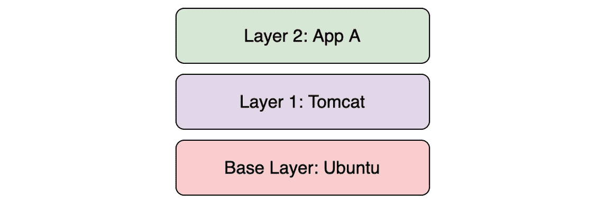
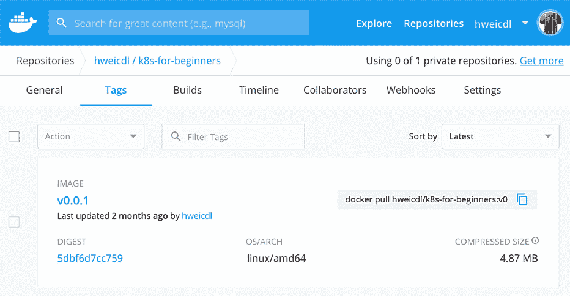
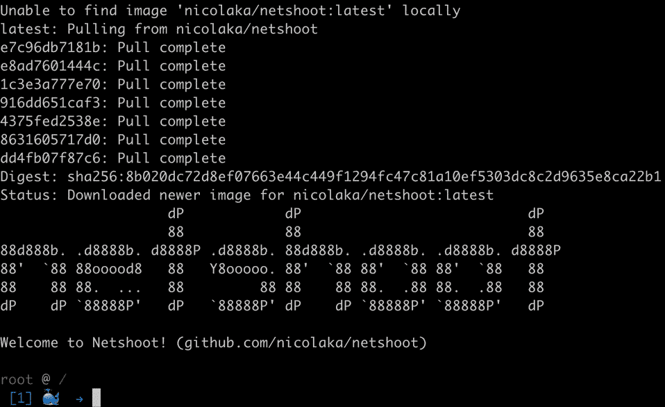
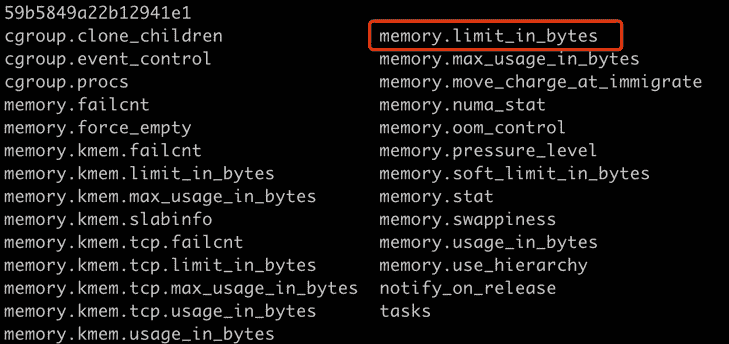

# 1。Kubernetes 和容器简介

概述

本章首先描述了软件开发和交付的演变，从在裸机上运行软件开始，一直到现代的容器化方法。我们还将研究支持容器化的底层 Linux 技术。到本章结束时，您将能够从图像运行一个基本的 Docker 容器。您还可以打包一个自定义应用程序来制作自己的 Docker 映像。接下来，我们将了解如何控制容器的资源限制和分组。最后，这一章的结尾描述了为什么我们需要像 Kubernetes 这样的工具，并简要介绍了它的优点。

# 简介

大约十年前，有很多关于软件开发范例的讨论，比如面向服务的架构、敏捷开发和软件设计模式。事后看来，这些都是伟大的想法，但其中只有少数在十年前被实际采用。

没有采用这些范例的一个主要原因是底层基础设施不能提供资源或能力来抽象细粒度的软件组件和管理最佳的软件开发生命周期。因此，仍然需要大量重复的工作来解决软件开发的一些常见问题，例如管理软件依赖关系和一致的环境、软件测试、打包、升级和扩展。

近年来，以 Docker 为前沿，容器化技术提供了一种新的封装机制，允许您捆绑应用程序、它的运行时和它的依赖关系，也带来了一个新的角度来看待软件的发展。通过使用容器化技术，底层基础设施被抽象出来，这样应用程序就可以在异构环境之间无缝移动。然而，随着容器数量的增加，您可能需要编排工具来帮助您管理它们之间的交互，以及优化底层硬件的利用率。

这就是库本内斯发挥作用的地方。Kubernetes 提供了多种选项来自动化容器化应用程序的部署、扩展和管理。近年来，它得到了爆炸性的采用，并已成为容器编排领域事实上的标准。

由于这是本书的第一章，我们将从过去几十年的软件开发简史开始，然后说明容器和 Kubernetes 的起源。我们将重点解释他们能解决什么问题，以及**为什么他们的采用近年来有了相当大的增长的三个关键原因**。

# 软件开发的演进

随着虚拟化技术的发展，公司通常使用**虚拟机** ( **虚拟机**)来管理其软件产品，无论是在公共云中还是在内部环境中。这带来了巨大的好处，例如自动机器配置、更好的硬件资源利用率、资源抽象等等。更关键的是，它第一次利用计算、网络和存储资源的分离，将软件开发的力量从硬件管理的枯燥中释放出来。虚拟化还带来了以编程方式操作底层基础架构的能力。因此，从系统管理员和开发人员的角度来看，他们可以更好地简化软件维护和开发的工作流程。这是软件发展史上的一大举措。

然而，在过去的十年里，软件开发的范围和生命周期发生了巨大的变化。早些时候，软件以大的整体块开发并不罕见，并且有一个缓慢的发布周期。如今，为了赶上业务需求的快速变化，一个软件可能需要分解成单独的细粒度子组件，每个组件可能需要有自己的发布周期，以便尽可能频繁地发布，从而更早地从市场获得反馈。此外，我们可能希望每个组件都具有可扩展性和成本效益。

那么，这对应用程序开发和部署有什么影响呢？与裸机时代相比，采用虚拟机帮助不大，因为虚拟机不会改变不同组件的管理粒度；整个软件仍然部署在一台机器上，只是它是虚拟的，而不是物理的。让许多相互依赖的组件协同工作仍然不是一件容易的事情。

这里一个简单的想法是添加一个抽象层来连接机器和运行在机器上的应用程序。这使得应用程序开发人员只需要关注业务逻辑来构建应用程序。这方面的例子有**谷歌应用引擎** ( **GAE** )和云代工。

这些解决方案的第一个问题是不同环境之间缺乏一致的开发经验。开发人员在他们的机器上开发和测试应用程序及其本地依赖关系(在编程语言和操作系统级别)；而在生产环境中，应用程序必须依赖下面的另一组依赖关系。而且我们还没有谈到需要不同团队中不同开发人员合作的软件组件。

第二个问题是应用程序和底层基础架构之间的硬边界会限制应用程序的高性能，尤其是当应用程序对存储、计算或网络资源敏感时。例如，您可能希望应用程序跨多个可用性区域(管理云资源的数据中心内的孤立地理位置)部署，或者您可能希望某些应用程序与其他特定应用程序共存或不共存。或者，您可能希望某些应用程序遵循特定的硬件(例如，固态硬盘)。在这种情况下，如果不向上层应用程序公开基础架构的拓扑特征，就很难专注于应用程序的功能。

事实上，在软件开发的生命周期中，基础设施和应用程序之间没有明确的界限。我们想要实现的是自动管理应用程序，同时优化基础架构的使用。

那么，我们如何实现这一点呢？Docker(我们将在本章后面介绍)通过利用 Linux 容器化技术封装应用程序及其依赖关系来解决第一个问题。它还引入了 Docker 映像的概念，使应用程序运行时环境的软件方面变得轻量级、可复制和可移植。

**第二期**比较复杂。这就是库本内特斯进来的地方。Kubernetes 利用一种经过实践检验的设计原理(称为声明式应用编程接口)来抽象基础架构以及应用交付的每个阶段，如部署、升级、冗余、扩展等。它还提供了一系列构件供用户选择、编排和组合到最终的应用程序中。在这一章的最后，我们将逐渐开始研究 Kubernetes，这是本书的核心。

注意

如果没有特别说明，术语“容器”可能在本书中与“Linux 容器”互换使用。

# 虚拟机与容器

一个**虚拟机** ( **VM** ，顾名思义，旨在模拟一个物理计算机系统。从技术上讲，虚拟机由虚拟机管理程序调配，虚拟机管理程序在主机操作系统上运行。下图说明了这一概念:


图 1.1:在虚拟机上运行应用程序

这里，虚拟机有完整的操作系统堆栈，运行在虚拟机上的操作系统(称为`Guest OS`)必须依赖底层虚拟机管理程序才能运行。应用程序和操作系统驻留并运行在虚拟机内部。它们的操作通过来宾操作系统的内核，然后由虚拟机管理程序转换为系统调用，最终在主机操作系统上执行。

另一方面，容器下面不需要虚拟机管理程序。通过利用一些 Linux 容器化技术，如名称空间和 cgroups(我们将在后面重新讨论)，每个容器都在主机操作系统上独立运行。下图以 Docker 容器为例说明了容器化:


图 1.2:在容器中运行应用程序

值得一提的是，我们将 Docker 放在容器旁边，而不是放在容器和主机 OS 之间。这是因为，从技术上讲，没有必要让 Docker Engine 托管这些容器。Do cker Engine 在管理容器的生命周期方面扮演了更多的管理者角色。将 Docker Engine 比作虚拟机管理程序也是不合适的，因为一旦容器启动并运行，我们就不需要额外的层来“翻译”应用程序操作，以便主机操作系统可以理解。从*图 1.2* 中，您还可以看出容器中的应用程序本质上是直接在主机操作系统上运行的。

当我们启动一个容器时，我们不需要启动整个操作系统；相反，它利用了主机操作系统上 Linux 内核的特性。因此，与虚拟机相比，容器启动更快，运行开销更少，所需空间更少。下表比较了虚拟机和容器:


图 1.3:虚拟机和容器的比较

看这个对比，除了孤立，容器似乎在各个方面都赢了。容器所利用的 Linux 容器技术并不新鲜。关键的 Linux 内核特性、命名空间和 cgroup(我们将在本章后面部分研究)已经存在了十多年。在 Docker 出现之前，有一些较旧的容器实现，如 LXC 和云铸造区长。现在，一个有趣的问题是:既然容器技术有这么多好处，为什么近几年而不是十年前才被采用？我们将在以下几节中找到这个问题的一些答案。

# 码头工人基础知识

到目前为止，我们已经看到了容器化与在虚拟机上运行应用程序相比所提供的不同优势。码头工人是最常用的容器化技术。在本节中，我们将从 Docker 的一些基础知识开始，并进行一些练习，让您获得使用 Docker 的第一手经验。

注意

除了 Docker，还有其他容器管理器，如 containerd 和 podman。它们在特性和用户体验方面表现不同，例如，containerd 和 podman 据称比 Docker 更轻量级，比 Kubernetes 更适合。但是，它们都符合**开放容器倡议** ( **OCI** )以保证容器图像兼容。

Alt 虽然 Docker 可以安装在任何 OS 上，但是你要知道，在 Windows 和 macOS 上，它实际上是创建了一个 Linux VM(或者在 macOS 中使用等价的虚拟化技术，比如 HyperKit)，并将 Docker 嵌入到 VM 中。在本章中，我们将使用 Ubuntu 18.04 LTS 作为操作系统，并使用 Docker 社区版 18.09.7。

继续之前，请确保 Docker 按照*前言*中的说明安装。您可以通过使用以下命令查询 Docker 的版本来确认是否安装了 Docker:

```
docker --version
```

您应该会看到以下输出:

```
Docker version 18.09.7, build 2d0083d
```

注意

以下各节中的所有命令均按`root`执行。在终端输入`sudo -s`，出现提示后输入管理员密码，即可获得 root 访问权限。

## 码头工人在跑什么？

安装 Docker 后，运行容器化的应用程序非常简单。出于演示目的，我们将使用 Nginx 网络服务器作为示例应用程序。我们可以简单地运行以下命令来启动 Nginx 服务器:

```
docker run -d nginx
```

您应该会看到类似的结果:


图 1.4:启动 Nginx

该命令涉及几个操作，描述如下:

1.  `docker run`告诉 Docker Engine 运行一个应用程序。
2.  The `-d` parameter (short for `--detach`) forces the application to run in the background so that you won't see the output of the application in the terminal. Instead, you have to run `docker logs <container ID>` to implicitly get the output.

    注意

    “分离”模式通常意味着应用程序是一个长期运行的服务。

3.  最后一个参数`nginx`表示应用程序所基于的图像名称。该图像封装了 Nginx 程序及其依赖项。

输出日志解释了一个简单的工作流程:首先，它试图在本地获取`nginx`图像，但失败了，因此它从公共图像存储库中检索图像(Docker Hub，我们将在后面重新访问)。一旦映像被本地下载，它就使用该映像启动一个实例，然后输出一个标识(在前面的例子中，这是`96c374…`)，标识正在运行的实例。如您所见，这是一个十六进制字符串，您可以在实践中使用开头的四个或更多唯一字符来引用任何实例。您应该看到，即使是`docker`命令的终端输出也会截断标识。

可以使用以下命令验证正在运行的实例:

```
docker ps
```

您应该会看到以下结果:


图 1.5:获取所有正在运行的 Docker 容器的列表

`docker ps`命令列出了所有正在运行的容器。在前面的例子中，只有一个容器在运行，那就是`nginx`。与在物理机器或虚拟机上本地运行的典型 Nginx 发行版不同，`nginx`容器以隔离的方式运行。默认情况下，`nginx`容器不会在主机端口上公开其服务。相反，它服务于其容器的端口，这是一个孤立的实体。我们可以通过呼叫容器 IP 的港口`80`来获得`nginx`服务。

首先，让我们通过运行以下命令来获取容器 IP:

```
docker inspect --format '{{.NetworkSettings.IPAddress}}' <Container ID or NAME>
```

您应该会看到以下输出(可能因您的本地环境而异):

```
172.17.0.2
```

可以看到，在这种情况下，`nginx`容器的 IP 地址为`172.17.0.2`。让我们检查 Nginx 是否通过访问端口`80`上的这个 IP 做出响应:

```
curl <container IP>:80
```

您应该会看到以下输出:


图 1.6:Nginx 容器的响应

在*图 1.6* 中可以看到，我们得到一个响应，作为默认主页的源 HTML 显示在终端中。

通常，我们不依赖内部 IP 来访问服务。更实用的方法是在主机的某个端口上公开服务。要将主机端口`8080`映射到容器端口`80`，请使用以下命令:

```
docker run -p 8080:80 -d nginx
```

您应该会看到类似的响应:

```
39bf70d02dcc5f038f62c276ada1675c25a06dd5fb772c5caa19f02edbb0622a
```

`-p 8080:80`参数告诉 Docker Engine 启动容器，并将主机端口 8080 上的流量映射到端口`80`的内部容器。现在，如果我们尝试进入`8080`港口的`localhost`，我们将能够进入容器化的`nginx`服务。让我们试一试:

```
curl localhost:8080
```

您应该会看到与图 1.6 中*相同的输出。*

Nginx 是一种没有固定终止时间的工作负载的例子，也就是说，它不仅仅显示输出，然后终止。这也被称为**长期服务**。另一种类型的工作负荷，只是运行到完成并退出，被称为**短期服务**，或简称为**工作**。对于运行作业的容器，我们可以省略`-d`参数。下面是一个工作的例子:

```
docker run hello-world
```

您应该会看到以下响应:


图 1.7:运行 hello-world 映像

现在，如果运行`docker ps`，意在列出正在运行的容器，它不会显示`hello-world`容器。这是意料之中的，因为容器已经完成了它的工作(也就是说，打印出了我们在前面截图中看到的响应文本)并退出了。为了能够找到退出的容器，您可以运行带有`-a`标志的相同命令，该标志将显示所有容器:

```
docker ps -a
```

您应该会看到以下输出:


图 1.8:检查我们退出的容器

对于已经停止的容器，可以使用`docker rm <container ID>`删除，或者使用`docker run <container ID>`重新运行。或者，如果您重新运行`docker run hello-world`，它将再次调出一个带有新标识的新容器，并在完成工作后退出。您可以自己尝试，如下所示:

```
docker run hello-world
docker ps -a
```

您应该会看到以下输出:


图 1.9:检查多个退出的容器

因此，您可以看到基于同一个底层图像运行多个容器非常简单。

到目前为止，您应该已经对容器是如何启动的以及如何检查其状态有了非常基本的了解。

## Dockerfil 是和 docker images

在虚拟机时代，没有标准或统一的方法来抽象和打包各种应用程序。传统的方法是使用一个工具，比如 Ansible，来管理每个应用程序的安装和更新过程。这在今天仍然被使用，但是它涉及大量的手动操作，并且由于不同环境之间的不一致而容易出错。从开发人员的角度来看，应用程序是在本地机器上开发的，这与试运行和最终生产环境有很大不同。

那么，Docker 如何解决这些问题呢？它带来的创新被称为`Dockerfile`和 Docker 形象。`Dockerfile`是一个文本文件，它抽象了一系列指令来构建一个可复制的环境，包括应用程序本身及其所有依赖项。

通过使用`docker build`命令，Docker 使用`Dockerfile`来生成一个被称为 Docker 映像的标准化实体，它几乎可以在任何操作系统上运行。通过利用 Docker 映像，开发人员可以在与生产环境相同的环境中开发和测试应用程序，因为依赖项被抽象并捆绑在同一个映像中。让我们后退一步，看看我们之前启动的`nginx`应用程序。使用以下命令列出所有本地下载的图像:

```
docker images
```

您应该会看到以下列表:


图 1.10:获取图像列表

与虚拟机映像不同，Docker 映像只捆绑必要的文件，如应用程序二进制文件、依赖项和 Linux 根文件系统。在内部，Docker 图像被分成不同的层，每一层都堆叠在另一层之上。这样，升级应用程序只需要更新相关的层。这减少了映像占用空间和升级时间。

下图显示了一个假想的 Docker 映像的分层结构，该映像由基本操作系统层(Ubuntu)、Java web 应用程序运行时层(Tomcat)和最顶层的用户应用层构建而成:



图 1.11:容器中堆叠层的示例

请注意，通常的做法是使用流行操作系统的映像作为构建 Docker 映像的起点(您将在下面的练习中看到)，因为它方便地包括开发应用程序所需的各种组件。在前面假设的容器中，应用程序将使用 Tomcat 以及 Ubuntu 中包含的一些依赖项来正常运行。这是 Ubuntu 被包含为基础层的唯一原因。如果我们愿意，我们可以捆绑所需的依赖项，而不包括整个 Ubuntu 基础映像。因此，不要将这种情况与虚拟机的情况相混淆，在虚拟机中包含来宾操作系统是必要的。

在下面的练习中，让我们看看如何为应用程序构建自己的 Docker 映像。

## 练习 1.01:创建码头工人映像并将其上传到码头工人中心

在本练习中，我们将为一个用 Go 编写的简单应用程序构建一个 Docker 映像。

我们将在本练习中使用 Go，这样源代码及其语言依赖项就可以编译成一个可执行的二进制文件。然而，你可以自由使用任何你喜欢的编程语言；如果要使用 Java、Python、Node.js 或任何其他语言，请记住绑定语言运行时依赖项:

1.  For this exercise, we will create a file named `Dockerfile`. Note that this filename has no extension. You can use your preferred text editor to create this file with the following content:

    ```
    FROM alpine:3.10
    COPY k8s-for-beginners /
    CMD ["/k8s-for-beginners"]
    ```

    注意

    从终端，每当你使用任何简单的文本编辑器如 vim 或 nano 或使用`cat`命令创建一个文件时，它将在任何 Linux 发行版甚至 macOS 的当前工作目录中创建。打开终端时的默认工作目录是`/home/`。如果您喜欢使用不同的目录，请在阅读本书的任何练习步骤时考虑这一点。

    第一行指定使用哪个基础图像作为基础。这个例子使用了 Alpine，这是一个流行的基本图像，只需要 5 MB 左右，并且基于 Alpine Linux。第二行将名为`k8s-for-beginners`的文件从`Dockerfile`所在的目录复制到图像的根文件夹。在这个例子中，我们将构建一个小型的网络服务器，并将其编译成一个名为`k8s-for-beginners`的二进制文件，该文件将被放置在与`Dockerfile`相同的目录中。第三行指定默认启动命令。在这种情况下，我们只需启动示例 web 服务器。

2.  Next, let's build our sample web server. Create a file named `main.go` with the following content:

    ```
    package main
    import (
            "fmt"
            "log"
            "net/http"
    )
    func main() {
            http.HandleFunc("/", handler)
            log.Fatal(http.ListenAndServe("0.0.0.0:8080", nil))
    }
    func handler(w http.ResponseWriter, r *http.Request) {
            log.Printf("Ping from %s", r.RemoteAddr)
            fmt.Fprintln(w, "Hello Kubernetes Beginners!")
    }
    ```

    从`func main()`可以看出，这个应用程序充当一个网络服务器，在根路径上的端口 8080 接受传入的 HTTP 请求，并以消息`Hello Kubernetes Beginners`进行响应。

3.  要验证这个程序是否有效，只需运行`go run main.go`，然后在浏览器上打开 [`http://localhost:8080`](http://localhost:8080) 。你有望获得“`Hello Kubernetes Beginners!`”的输出。
4.  Use `go build` to compile runtime dependencies along with the source code into one executable binary. Run the following command in the terminal:

    ```
    CGO_ENABLED=0 GOOS=linux GOARCH=amd64 go build -o k8s-for-beginners
    ```

    注意

    与*第 3 步*不同的是，参数`GOOS=linux GOARCH=amd64`告诉 Go 编译器在特定的平台上编译程序，这与我们将要构建这个问题的 Linux 发行版兼容。`CGO_ENABLED=0`旨在生成一个静态链接的二进制文件，以便它可以处理一些最小定制的图像(例如，阿尔卑斯)。

5.  Now, check whether the `k8s-for-beginners` file is created:

    ```
    ls
    ```

    您应该会看到以下响应:

    ```
    Dockerfile k8s-for-beginners  main.go
    ```

6.  Now we have both the `Dockerfile` and the runnable binary. Build the Docker image by using the following command:

    ```
    docker build -t k8s-for-beginners:v0.0.1 .
    ```

    不要错过这个命令末尾的点(`.`)。您应该会看到以下响应:

    

    图 1.12:docker 构建命令的输出

    我们使用的命令中有两个参数:`-t k8s-for-beginners:v0.0.1`在图像上提供一个格式为`<imagename:version>`的标签，而`.`(命令末尾的点)表示寻找`Dockerfile`的路径。在这种情况下，`.`指的是当前的工作目录。

    注意

    如果您克隆本章的 GitHub 存储库，您会发现我们已经在每个目录中提供了`Dockerfile`的副本，这样您就可以通过导航到该目录来方便地运行`docker build`命令。

7.  Now, we have the `k8s-for-beginners:v0.0.1` image available locally. You can confirm that by running the following command:

    ```
    docker images
    ```

    您应该会看到以下响应:

    

图 1.13:验证我们的 Docker 映像是否已经创建

观察到的一个有趣的事情是，该映像仅消耗 11.4 MB，其中包括 Linux 系统文件和我们的应用程序。这里的一个技巧是只在 Docker 映像中包含必要的文件，使其紧凑，以便于分发和管理。

现在我们已经建立了我们的图像，我们将在下一个练习中在一个容器中运行它。另一件需要注意的事情是，目前，这个映像驻留在我们的本地机器上，我们只能在我们的机器上使用它来构建一个容器。然而，用依赖项打包应用程序的好处是它可以很容易地在不同的机器上运行。为了方便起见，我们可以将图像上传到在线 Docker 图像存储库，如 Docker Hub([https://hub.docker.com/](https://hub.docker.com/))。

注意:

除了 Docker Hub，还有其他公共图像存储库，如 [quay.io](http://quay.io) 、 [gcr.io](http://gcr.io) 等。您可以参考相应存储库的文档，以便在 Docker 客户端中正确配置它。

## 练习 1.02 :在 Docker 中运行您的第一个应用程序

在*练习 1.01* 、*创建一个 Docker 映像并将其上传到 Docker Hub* 中，我们将 web 应用程序打包成一个 Docker 映像。在本练习中，我们将运行它并将其推送到 Docker Hub:

1.  First, we should clean up any leftover containers from the previous exercise by running the following command in the terminal:

    ```
    docker rm -f $(docker ps -aq)
    ```

    您应该会看到以下响应:

    ```
    43c01e2055cf
    286bc0c92b3a
    39bf70d02dcc
    96c374000f6f
    ```

    我们已经看到`docker ps -a`返回了所有容器的信息。`-aq`标志中多余的`q`表示“安静”，该标志将只显示数字标识。这些标识将被传递给`docker rm -f`，因此，所有容器将被强制移除。

2.  Run the following command to start the webserver:

    ```
    docker run -p 8080:8080 -d k8s-for-beginners:v0.0.1
    ```

    您应该会看到以下响应:

    ```
    9869e9b4ab1f3d5f7b2451a7086644c1cd7393ac9d78b6b4c1bef6d423fd25ac
    ```

    正如您在前面的命令中看到的，我们正在将容器的内部端口`8080`映射到主机的端口`8080`。以`-p`开头的`8080:8080`参数将容器的港口`8080`映射到主机上的港口`8080`。`-d`参数表示分离模式。默认情况下，Docker 首先检查本地注册表。因此，在这种情况下，本地 Docker 映像将用于启动容器。

3.  Now, let us check whether it works as expected by sending an HTTP request to `localhost` at port `8080`:

    ```
    curl localhost:8080
    ```

    `curl`命令检查来自指定地址的响应。您应该会看到以下响应:

    ```
    Hello Kubernetes Beginners!
    ```

4.  We can also observe the logs of the running container by using the following commands:

    ```
    docker logs <container ID>
    ```

    您应该会看到以下日志:

    ```
    2019/11/18  05:19:41 Ping from 172.17.0.1:41416
    ```

    注意

    在运行以下命令之前，您应该注册一个 Docker Hub 帐户，并准备好您的用户名和密码。

5.  Finally, we need to log in to Docker Hub, and then push the local image to the remote Docker Hub registry. Use the following command:

    ```
    docker login
    ```

    现在，当出现提示时，输入您的 Docker Hub 帐户的用户名和密码。您应该会看到以下响应:

    

    图 1.14:登录码头工人中心

6.  Next, we will push the local image, `k8s-for-beginners:v0.0.1`, to the remote Docker Hub registry. Run the following command:

    ```
    docker push k8s-for-beginners:v0.0.1
    ```

    您应该会看到以下响应:

    

    图 1.15:无法将图像推送到 Docker 集线器

    但是等等，为什么上面写着“`requested access to the resource is denied`”？这是因为`docker push`后面的参数必须符合`<username/imagename:version>`命名惯例。在前面的练习中，我们指定了一个本地图像标签`k8s-for-beginners:v0.0.1`，没有用户名。在`docker push`命令中，如果没有指定用户名，它将尝试使用默认用户名`library`推送至存储库，该存储库还托管一些知名库，如 Ubuntu、nginx 等。

7.  为了将我们的本地映像推送给我们自己的用户，我们需要通过运行`docker tag <imagename:version> <username/imagename:version>`为本地映像指定一个兼容的名称，如下命令所示:

    ```
    docker tag k8s-for-beginners:v0.0.1 <your_DockerHub_username>/k8s-for-beginners:v0.0.1
    ```

8.  You can verify that the image has been properly tagged using the following command:

    ```
    docker images
    ```

    您应该会看到以下输出:

    

    图 1.16:检查标记的 Docker 图像

    正确标记后，你可以看出新图像实际上与旧图像具有相同的`IMAGE ID`，这意味着它们是相同的图像。

9.  Now that we have the image tagged appropriately, we're ready to push this image to Docker Hub by running the following command:

    ```
    docker push <your_username>/k8s-for-beginners:v0.0.1
    ```

    您应该会看到类似这样的响应:

    

    图 1.17:图像成功推送到 Docker 集线器

10.  The image will be live after a short time on Docker Hub. You can verify it by replacing the `<username>` with your username in the following link: `https://hub.docker.com/repository/docker/<username>/k8s-for-beginners/tags`.

    您应该能够看到有关您的图像的一些信息，类似于下图:

    

图 1.18:我们图像的 Docker Hub 页面

现在，我们的 Docker 图像可供任何人使用，就像我们在本章开头使用的`nginx`图像一样。

在本节中，我们学习了如何构建 Docker 映像并将其推送到 Docker Hub。虽然看起来不显眼，但这是我们第一次有一个统一的机制来管理应用程序，以及它们在所有环境中的依赖关系。Docker 映像及其底层分层文件系统也是容器技术近年来被广泛采用的主要原因，而不是十年前。

在下一节中，我们将深入探讨 Docker，看看它如何利用 Linux 容器技术。

# 林 ux 容器技术的本质

从外表上看，所有的东西都显得优雅而直接。但是到底是什么魔力让一个容器如此强大呢？在这一部分，我们将尝试打开引擎盖看一看里面。让我们看一看为容器奠定基础的一些 Linux 技术。

## 命名空间

容器所依赖的第一个关键技术被称为“T4”Linux 命名空间“T5”。当一个 Linux 系统启动时，它会创建一个默认的命名空间(即`root`命名空间)。然后，默认情况下，稍后创建的进程加入相同的名称空间，因此，它们可以无限地相互交互。例如，两个进程可以查看同一文件夹中的文件，也可以通过`localhost`网络进行交互。这听起来很简单，但从技术上讲，这都归功于连接所有进程的`root`名称空间。

为了支持高级用例，Linux 提供了名称空间应用编程接口来支持将不同的进程分组到不同的名称空间中，这样只有属于同一个名称空间的进程才能知道彼此。换句话说，不同的进程组是孤立的。这也解释了为什么我们前面提到 Docker 的隔离是过程级的。以下是 Linux 内核中支持的命名空间类型列表:

*   装载命名空间
*   **PID** ( **进程标识**)名称空间
*   网络命名空间
*   **IPC** ( **进程间通信**)名称空间
*   **UTS** ( **Unix 分时系统**)名称空间
*   用户命名空间(从 Linux 内核 3.8 开始)
*   Cgroup 命名空间(从 Linux 内核 4.6 开始)
*   时间命名空间(将在 Linux 内核的未来版本中实现)

为了简洁起见，我们将选择两个简单的(UTS 和 PID)，并使用具体的例子来解释它们如何在稍后的 Docker 中得到反映。

注意

如果您运行的是 macOS，由于我们正在探索 Linux 特性，下面的一些命令将需要以不同的方式使用。macOS 上的 Docker 使用 HyperKit 在 Linux 虚拟机中运行。因此，您需要打开另一个终端会话并登录虚拟机:

`screen ~/Library/Containers/com.docker.docker/Data/vms/0/tty`

执行此命令后，您可能会看到一个空屏幕。按*进入*，你应该对运行 Docker 的虚拟机有根访问权限。退出会话，可以按*Ctrl**+**A**+**K*，当要求确认击杀窗口时，再按 *Y* 。

我们建议您使用不同的终端窗口来访问 Linux 虚拟机。如果您使用的是 macOS，我们将提到在这个终端会话中需要运行哪些命令。如果您正在使用任何 Linux 操作系统，您可以忽略这一点，只需在同一个终端会话中运行所有命令，除非说明中另有说明。

一旦创建了 Docker 容器，Docker 就会创建许多名称空间并将其与容器相关联。例如，让我们看一下我们在前一节中创建的示例容器。让我们使用以下命令:

```
docker inspect --format '{{.State.Pid}}' <container ID>
```

前面的命令检查在主机操作系统上运行的容器的 PID。您应该会看到类似以下内容的响应:

```
5897
```

在本例中，PID 为`5897`，如您在前面的响应中所见。现在，在 Linux 虚拟机中运行以下命令:

```
ps -ef | grep k8s-for-beginners
```

这应该会产生类似如下的输出:


图 1.19:检查我们流程的 PID

`ps -ef`命令列出主机操作系统上所有正在运行的进程，`| grep k8s-for-beginners`然后过滤该列表，以显示名称中有`k8s-for-beginners`的进程。我们可以看到流程也有 PID `5897`，与第一条命令一致。这揭示了一个重要的事实:容器只不过是直接在主机操作系统上运行的特定进程。

接下来，运行以下命令:

```
ls -l /proc/<PID>/ns
```

对于 macOS，在虚拟机终端运行此命令。您应该会看到以下输出:


图 1.20:列出了为我们的容器创建的不同名称空间

该命令检查`/proc`文件夹(这是一个 Linux 伪文件系统)以列出所有随着容器的开始而创建的名称空间。结果显示了一些众所周知的名称空间(看看突出显示的矩形)，如`uts`、`pid`、`net`等。让我们仔细看看它们。

创建`uts`命名空间是为了使容器能够拥有其主机名，而不是主机的主机名。默认情况下，容器被分配其容器标识作为主机名，并且可以在运行容器时使用`-h`参数进行更改，如下所示:

```
docker run -h k8s-for-beginners -d packtworkshops/the-kubernetes-workshop:k8s-for-beginners
```

这应给出以下响应:

```
df6a15a8e2481ec3e46dedf7850cb1fbef6efafcacc3c8a048752da24ad793dc
```

使用返回的容器标识，我们可以依次使用以下两个命令输入容器并检查其主机名:

```
docker exec -it <container ID> sh
hostname
```

您应该会看到以下响应:

```
k8s-for-beginners
```

`docker exec`命令尝试进入容器，执行`sh`命令，在容器内发射炮弹。一旦我们进入容器内部，我们运行`hostname`命令从容器内部检查主机名。从输出中，我们可以看出`-h`参数有效，因为我们可以看到`k8s-for-beginners`作为主机名。

除了`uts`命名空间之外，容器还被隔离在自己的`PID`命名空间中，因此它只能查看自己启动的进程，而我们在*练习 1.01* 、*创建 Docker 映像并将其上传到 Docker Hub* 中创建的`Dockerfile`中的启动进程(由`CMD`或`ENTRYPOINT`指定)被分配了`PID` `1`。让我们一个接一个地输入以下两个命令来看看这一点:

```
docker exec -it <container ID> sh
ps
```

您应该会看到以下响应:


图 1.21:我们容器中的进程列表

Docker 为一个容器提供了`--pid`选项，以加入另一个容器的 PID 命名空间。

除了`uts`和`pid`名称空间，Docker 还利用了其他一些名称空间。我们将在下一个练习中检查*图 1.20* 中的网络名称空间(“`net`”)。

## 练习 1.03:将一个容器加入另一个容器的网络命名空间

在本练习中，我们将重新创建没有主机映射的`k8s-for-beginners`容器，然后创建另一个容器来加入其网络命名空间:

1.  As with the previous exercise, remove all the existing containers by running the following command:

    ```
    docker rm -f $(docker ps -aq)
    ```

    您应该会看到类似如下的输出:

    ```
    43c01e2055cf
    286bc0c92b3a
    39bf70d02dcc
    96c374000f6f
    ```

2.  Now, begin by running our container using the following command:

    ```
    docker run -d packtworkshops/the-kubernetes-workshop:k8s-for-beginners
    ```

    您应该会看到以下响应:

    ```
    33003ddffdf4d85c5f77f2cae2528cb2035d37f0a7b7b46947206ca104bbbaa5
    ```

3.  Next, we will get the list of running containers so that we can see the container ID:

    ```
    docker ps
    ```

    您应该会看到以下响应:

    

    图 1.22:获取所有运行容器的列表

4.  Now, we will run an image called `netshoot` in the same network namespace as the container that we created in *step 1*, by using the `--net` parameter:

    ```
    docker run -it --net container:<container ID> nicolaka/netshoot
    ```

    使用我们在上一步中获得的上一个容器的容器标识。您应该会看到类似以下内容的响应:

    

    图 1.23:启动网络拍摄容器

    `nicolaka/netshoot`是用一些常用的网络库如`iproute2`、`curl`等打包的微小图像。

5.  Now, let's run the `curl` command inside `netshoot` to check whether we are able to access the `k8s-for-beginners` container:

    ```
    curl localhost:8080
    ```

    您应该会看到以下响应:

    ```
    Hello Kubernetes Beginners!
    ```

    前面的例子证明了`netshoot`容器是通过加入`k8s-for-beginners`的网络命名空间创建的；否则，访问`localhost`上的`8080`端口不会得到我们的响应。

6.  This can also be verified by double-checking the network namespace IDs of the two containers, which we will do in the following steps.

    为了确认我们的结果，让我们先打开另一个终端，不要退出`netshoot`容器。获取容器列表，确保两个容器都在运行:

    ```
    docker ps
    ```

    您应该会看到如下响应:

    

    图 1.24:检查适用于初学者的 k8s 和 netshoot 容器是否都在线

7.  Next, get the PID of the `k8s-for-beginners` container:

    ```
    docker inspect --format '{{.State.Pid}}' <container ID>
    ```

    您应该会看到以下响应:

    ```
    7311
    ```

    可以看到，这个例子的 PID 是`7311`。

8.  Now get the pseudo-filesystem of the process using the preceding PID:

    ```
    ls -l /proc/<PID>/ns/net
    ```

    如果您使用的是 macOS，请在另一个终端会话中的 Linux 虚拟机上运行此命令。在此命令中使用您在上一步中获得的 PID。您应该会看到以下响应:

    ```
    lrwxrwxrwx 1 root root 0 Nov 19 08:11 /proc/7311/ns/net -> 'net:[4026532247]'
    ```

9.  Similarly, get the PID of the `netshoot` container using the following command:

    ```
    docker inspect --format '{{.State.Pid}}' <container ID>
    ```

    在此命令中，从*第 6 步*开始使用适当的容器标识。您应该会看到以下响应:

    ```
    8143
    ```

    可以看到`netshoot`容器的 PID 是`8143`。

10.  Next, we can get its pseudo-filesystem using its PID or by using this command:

    ```
    ls -l /proc/<PID>/ns/net
    ```

    如果您正在使用 macOS，请在另一个会话中在 Linux 虚拟机上运行此命令。在此命令中使用上一步中的 PID。您应该会看到以下响应:

    ```
    lrwxrwxrwx 1 root root 0 Nov 19 09:15 /proc/8143/ns/net -> 'net:[4026532247]'
    ```

    从*第 8 步*和*第 10 步*的输出可以看出，这两个容器共享同一个网络名称空间(`4026532247`)。

11.  As a final cleanup step, let's remove all of the containers:

    ```
    docker rm -f $(docker ps -aq)
    ```

    您应该会看到类似以下内容的响应:

    ```
    61d0fa62bc49
    33003ddffdf4
    ```

12.  What if you want to join a container to the host's root namespace? Well, `--net host` is a good way of achieving that. To demonstrate this, we will start a container using the same image, but with the `--net host` parameter:

    ```
    docker run --net host -d packtworkshops/the-kubernetes-workshop:k8s-for-beginners
    ```

    您应该会看到以下响应:

    ```
    8bf56ca0c3dc69f09487be759f051574f291c77717b0f8bb5e1760c8e20aebd0
    ```

13.  Now, list all of the running containers:

    ```
    docker ps
    ```

    您应该会看到以下响应:

    

    图 1.25:列出所有容器

14.  Get the PID of the running container using the following command:

    ```
    docker inspect --format '{{.State.Pid}}' <container ID>
    ```

    在此命令中使用适当的容器标识。您应该会看到以下响应:

    ```
    8380
    ```

15.  Find the network namespace ID by looking up the PID:

    ```
    ls -l /proc/<PID>/ns/net
    ```

    如果您使用的是 macOS，请在 Linux 虚拟机上运行此命令。在此命令中使用适当的 PID。您应该会看到以下响应:

    ```
    lrwxrwxrwx 1 root root 0 Nov 19 09:20 /proc/8380/ns/net -> 'net:[4026531993]'
    ```

    您可能会被`4026531993`命名空间所迷惑。通过给出`--net host`参数，Docker 不应该绕过新名称空间的创建吗？答案是它不是一个新的名称空间；事实上，它是前面提到的 Linux 根命名空间。我们将在下一步确认这一点。

16.  Get the namespace of PID `1` of the host OS:

    ```
    ls -l /proc/1/ns/net
    ```

    如果您使用的是 macOS，请在 Linux 虚拟机上运行此命令。您应该会看到以下响应:

    ```
    lrwxrwxrwx 1 root root 0 Nov 19 09:20 /proc/1/ns/net -> 'net:[4026531993]'
    ```

    正如您在这个 ou tput 中看到的，主机的这个名称空间与我们在*步骤 15* 中看到的容器的名称空间相同。

从这个练习中，我们可以了解一个容器是如何被隔离到不同的名称空间中的，以及哪个 Docker 参数可以用来将其与其他名称空间相关联。

## 组

默认情况下，无论容器加入哪个命名空间，它都可以使用主机的所有可用资源。这肯定不是我们在一个系统上运行多个容器时想要的；否则，一些容器可能会占用所有容器之间共享的资源。

为了解决这个问题，在 Linux 内核版本 2.6.24 中引入了**组**(简称**控制组**)功能，以限制进程的资源使用。使用此功能，系统管理员可以控制最重要的资源，如内存、中央处理器、磁盘空间和网络带宽。

在 Ubuntu 18.04 LTS 中，默认情况下会创建路径`/sys/fs/cgroup/<cgroup type>`下的一系列 cgroups。

注意

您可以运行`mount -t cgroup`来查看 Ubuntu 中的所有用户组；不过，我们将它们排除在本书的范围之外，因为它们与我们没有太大关系。

现在，我们不太关心系统进程和它们的组；我们只想关注 Docker 在整个 cgroups 图片中是如何关联的。Docker 在路径`/sys/fs/cgroup/<resource kind>/docker`下有它的 cgroups 文件夹。使用`find`命令检索列表:

```
find /sys/fs/cgroup/* -name docker -type d
```

如果您正在使用 macOS，请在另一个会话中在 Linux 虚拟机上运行此命令。您应该会看到以下结果:


图 1.26:获取与 Docker 相关的所有组

每个文件夹都作为一个控制组读取，并且文件夹是分层的，这意味着每个 CG group 都有一个父组，它从父组继承属性，一直到根 CG group，根 CG group 是在系统启动时创建的。

为了说明一个 cgroup 如何在 Docker 中工作，我们将以*图 1.26* 中突出显示的`memory` cgroup 为例。

但是首先，让我们使用以下命令删除所有现有的容器:

```
docker rm -f $(docker ps -aq)
```

您应该会看到类似以下内容的响应:

```
61d0fa62bc49
```

让我们使用以下命令来确认这一点:

```
docker ps
```

您应该会看到一个空列表，如下所示:

```
CONTAINER ID     IMAGE       COMMAND          CREATED          STATUS
        PORTS          NAMES
```

我们来看看是否有`cgroup`内存文件夹:

```
find /sys/fs/cgroup/memory/docker/* -type d
```

如果您使用的是 macOS，请在 Linux 虚拟机上运行此命令。然后，您应该会看到以下响应:

```
root@ubuntu: ~# find /sys/fs/cgroup/memory/docker/* -type d
```

没有文件夹显示。现在，让我们运行一个容器:

```
docker run -d packtworkshops/the-kubernetes-workshop:k8s-for-beginners 
```

您应该会看到类似如下的输出:

```
8fe77332244b2ebecbda27a4496268264218c4e59614d59b5849a22b12941e1
```

再次检查`cgroup`文件夹:

```
find /sys/fs/cgroup/memory/docker/* -type d
```

如果您使用的是 macOS，请在 Linux 虚拟机上运行此命令。您应该会看到以下回应:

```
/sys/fs/cgroup/memory/docker/8fe77332244b2ebecbda27a4496268264218c4e59614d59b5849a22b12941e1
```

现在，您可以看到，一旦我们创建了一个容器，Docker 就会在特定的资源种类下创建它的 cgroup 文件夹(在我们的例子中，是内存)。现在，让我们看看在这个文件夹中创建了哪些文件:

```
ls /sys/fs/cgroup/memory/docker/8fe77332244b2ebecbd8a2704496268264218c4e59614d59b5849022b12941e1
```

如果您使用的是 macOS，请在 Linux 虚拟机上运行此命令。请为您的实例使用从上一个屏幕截图中获得的适当路径。您应该会看到以下文件列表:



图 1.27:探索 Docker 创建的内存组

我们不会仔细检查这里的每一个场景。我们感兴趣的设置是`memory.limit_in_bytes`，如前所述，它表示容器可以使用多少内存。让我们看看这个文件中写了什么值:

```
cat /sys/fs/cgroup/memory/docker/8fe77332244b2ebecbd8a2704496268264218c4e59614d59b5849022b12941e1/memory.limit_in_bytes
```

如果您使用的是 macOS，请在 Linux 虚拟机上运行此命令。您应该会看到以下响应:

```
9223372036854771712
```

值`9223372036854771712`是 64 位系统中最大的正有符号整数(263–1)，这意味着该容器可以使用无限的内存。

为了发现 Docker 如何处理过度使用内存的容器，我们将向您展示另一个消耗一定内存的程序。下面是一个 Golang 程序，用来增量消耗 50mb RAM，然后保持整个程序(休眠 1 小时)不退出:

```
package main
import (
        "fmt"
        "strings"
        "time"
)
func main() {
        var longStrs []string
        times := 50
        for i := 1; i <= times; i++ {
                fmt.Printf("===============%d===============\n", i)
                // each time we build a long string to consume 1MB                     (1000000 * 1byte) RAM
                longStrs = append(longStrs, buildString(1000000,                     byte(i)))
        }
        // hold the application to exit in 1 hour
        time.Sleep(3600 * time.Second)
}
// buildString build a long string with a length of `n`.
func buildString(n int, b byte) string {
        var builder strings.Builder
        builder.Grow(n)
        for i := 0; i < n; i++ {
                builder.WriteByte(b)
        }
        return builder.String()
}
```

您可以尝试使用此代码构建图像，如*练习 1.01* 、*创建码头工人图像并将其上传到码头工人中心*所示。该代码将用于代替该练习的*步骤 2* 中提供的代码，然后您可以用`<username>/memconsumer`标记图像。现在，我们可以测试资源限制。让我们使用 Docker 映像，并使用`--memory`(或`-m`)标志运行它，以指示 Docker 我们只想使用一定量的内存。

如果您正在使用 Ubuntu 或任何其他基于 Debian 的 Linux，要继续本章，如果您在运行此命令时看到以下警告消息，您可能需要手动启用 cgroup 内存和交换功能:

```
docker info > /dev/null
```

这是您可能会看到的警告消息:

```
WARNING: No swap limit support
```

启用组内存和交换功能的步骤如下:

注意

如果您正在使用 macOS，以下三个步骤不适用。

1.  编辑`/etc/default/grub`文件(您可能需要超级用户权限)。添加或编辑`GRUB_CMDLINE_LINUX`行，添加以下两个键值对:

    ```
    GRUB_CMDLINE_LINUX="cgroup_enable=memory swapaccount=1"
    ```

2.  使用 root 权限运行`update-grub`。
3.  重启机器。

接下来，我们应该能够通过运行以下命令将容器内存使用限制在 100 MB:

```
docker run --name memconsumer -d --memory=100m --memory-swap=100m packtworkshops/the-kubernetes-workshop:memconsumer
```

注意

这个命令提取我们为这个演示提供的图像。如果你已经建立了你的图像，你可以在前面的命令中使用`<your_username>/<tag_name>`来使用它。

您应该会看到以下响应:

```
WARNING: Your kernel does not support swap limit capabilities or the cgroup is not mounted. Memory limited without swap.
366bd13714cadb099c7ef6056e3b72853735473938b2e633a5cdbf9e94273143
```

此命令禁用交换内存的使用(因为我们在`--memory`和`--memory-swap`上指定了相同的值)，以便轻松测量内存消耗。

让我们检查一下容器的状态:

```
docker ps
```

您应该会看到以下响应:


图 1.28:获取容器列表

现在，让我们通过读取容器的`cgroup`文件来确认对容器的限制:

```
cat /sys/fs/cgroup/memory/docker/366bd13714cadb099c7ef6056e3b7285373547e9e8b2e633a5cdbf9e94273143/memory.limit_in_bytes
```

如果您使用的是 macOS，请在 Linux 虚拟机上运行此命令。请在此命令中使用适当的路径。您应该会看到以下响应:

```
104857600
```

该容器以 100 兆内存的请求启动，并且它运行没有任何问题，因为它在内部只消耗 50 兆内存。从 cgroup 设置中，您可以观察到该值已更新为`104857600`，正好是 100 MB。

但是，如果容器请求少于 50 MB，而在其中运行的程序需要超过 50 MB，该怎么办？Docker 和 Linux 会如何应对？让我们来看看。

首先，让我们移除所有正在运行的容器:

```
docker rm -f $(docker ps -aq)
```

您应该会看到以下响应:

```
366bd13714ca
```

接下来，我们将再次运行容器，但我们将只请求 20 MB 的内存:

```
docker run --name memconsumer -d --memory=20m --memory-swap=20m packtworkshops/the-kubernetes-workshop:memconsumer
```

您应该会看到以下回应:

```
298541bc46855a749f9f8944860a73f3f4f2799ebda7969a5eada60e3809539bab
```

现在，让我们检查一下容器的状态:

```
docker ps
```

您应该会看到这样一个空列表:

```
CONTAINER ID     IMAGE       COMMAND      CREATED        STATUS
       PORTS          NAMES
```

如你所见，我们看不到我们的容器。让我们列出各种容器:

```
docker ps -a
```

您应该会看到以下输出:


图 1.29:获取所有容器的列表

我们找到了我们的容器。它被强行杀死了。可以通过检查容器日志来验证:

```
docker logs memconsumer
```

您应该会看到以下输出:


图 1.30:我们终止的容器的日志

容器试图每次增加 1 MB 的内存消耗，当达到内存限制(20 MB)时，它被杀死。

从前面的例子中，我们已经看到了 Docker 如何向最终用户公开标志，以及这些标志如何与底层 Linux cgroups 交互以限制资源使用。

## 容器化:思维方式的改变

在前几节中，我们研究了 Linux 名称空间和 cgroups 的剖析。我们解释了容器本质上是在主机操作系统上本地运行的进程。这是一个特殊的进程，具有额外的限制，例如操作系统级与其他进程的隔离以及资源配额的控制。

从 Docker 1.11 开始，采用**container der**作为默认的容器运行时，而不是直接使用 Docker Daemon ( `dockerd`)来管理容器。让我们看看这个运行时。首先，正常重启我们的容器:

```
docker run -d packtworkshops/the-kubernetes-workshop:k8s-for-beginners
```

您应该会看到以下响应:

```
c7ee681ff8f73fa58cf0b37bc5ce08306913f27c5733c725f7fe97717025625d
```

我们可以使用`ps -aef --forest`列出一个层次中所有正在运行的进程，然后使用`| grep containerd`通过`containerd`关键字过滤输出。最后，我们可以使用`-A 1`输出一条额外的线(使用`-A 1`)以便至少显示一个正在运行的容器:

```
ps -aef --forest | grep containerd -A 1
```

如果您使用的是 macOS，请在没有`--forest`标志的 Linux 虚拟机上运行此命令。您应该会看到以下响应:


图 1.31:获取与容器相关的进程

在输出中，我们可以看到`containerd` (PID `1037`)作为顶级父进程，它管理`containerd-shim` (PID `19374`)，`containerd-shim`管理`k8s-for-beginners` (PID `19394`)的大部分子进程，这是我们启动的容器。

在将任何基于虚拟机的应用程序迁移到基于容器的应用程序时，牢记容器的核心思想会对您有所帮助。基本上，在容器中部署应用程序有两种模式:

### 在一个容器中的几种应用

这种实现需要一个监管应用程序来启动和保存容器。然后，我们可以将应用程序作为主管的子进程放入容器中。主管有几种变体:

*   定制的包装脚本:这需要复杂的脚本来控制托管应用程序的失败。
*   第三方工具，如 supervisord 或 systemd:在应用程序出现故障时，supervisor 负责让它重新启动。

### 一个容器中的一个应用

这种实现不像前面的情况那样需要任何监管人员。事实上，应用程序的生命周期与容器的生命周期紧密相连。

### 这些方法的比较

通过在一个容器中部署几个应用程序，我们实际上是把一个容器当作一个虚拟机。这种*容器作为轻量级 VM* 的方法曾经被用作容器技术的推广口号。然而，正如所解释的，它们在很多方面都有所不同。当然，这种方式可以节省从基于虚拟机的开发/部署模型到容器的迁移工作，但是它也在以下方面引入了几个缺点:

*   **应用生命周期控制**:从外部看，容器作为一个状态暴露出来，因为它本质上是一个单一的宿主进程。内部应用程序的生命周期由“主管”管理，因此不能从外部观察。因此，从外部看，您可能会观察到容器保持健康，但其中的一些应用程序可能会持续重启。由于其内部应用程序中的一个致命错误，它可能会继续重新启动，您可能无法指出该错误。
*   **版本升级**:如果你想升级一个容器中的任何一个不同的应用，你可能要拉下整个容器。这导致该容器中的其他应用程序不必要的停机，这些应用程序不需要版本升级。因此，如果应用程序需要由不同团队开发的组件，它们的发布周期必须紧密耦合。
*   **横向扩展**:如果只有一个应用需要横向扩展，那么除了横向扩展整个容器，你别无选择，这样也会复制所有其他应用。这导致在不需要扩展的应用程序上浪费资源。
*   **操作问题**:检查应用程序的日志变得更具挑战性，因为容器的标准输出(`stdout`)和错误(`stderr`)不代表容器内应用程序的日志。您必须付出额外的努力来管理这些日志，例如安装额外的监控工具来诊断每个应用程序的运行状况。

从技术上讲，在一个容器中拥有多个应用程序是可行的，从虚拟机的角度来看，它不需要很多思维方式的改变。然而，当我们采用容器技术来享受它的好处时，我们需要在迁移便利性和长期可维护性之间进行权衡。

第二种方式(也就是说，在一个容器中有一个应用程序)使容器能够自动管理其内部唯一应用程序的生命周期。这样，我们可以通过利用原生的 Linux 功能来统一容器管理，例如通过检查容器状态来获取应用程序状态，以及从容器的`stdout/stderr`获取应用程序日志。这使您能够在其自己的发布周期中管理每个应用程序。

然而，这不是一项容易的任务。它要求您重新思考不同组件的关系和依赖关系，以便将单一应用程序分解为微服务。这可能需要对架构设计进行一定程度的重构，以包括源代码和交付管道更改。

总而言之，采用容器技术是一个分解和重组的过程。这项技术的成熟不仅需要时间，更重要的是，它需要人们心态的改变。只有随着这种心态的改变，您才能重构应用程序以及底层基础架构，以释放容器的价值并享受其真正的好处。这是**第二个原因**容器技术是近几年才开始兴起的，而不是十年前。

# 容器运输的需求

我们在*练习 1.01**中构建的`k8s-for-beginners`容器创建了一个 Docker 映像并将其上传到 Docker Hub* ，这只是一个简单的演示。在生产环境中部署了大量工作负载的情况下，为了让成千上万的容器在集群中运行，我们还有很多事情要考虑。我们需要一个系统来管理以下问题:

## 容器相互作用

举个例子假设我们要构建一个 web 应用程序，它有一个显示信息和接受用户请求的前端容器，以及一个充当与前端容器交互的数据存储的后端容器。第一个挑战是找出如何将后端容器的地址指定给前端容器。硬编码 IP 不是一个好主意，因为容器 IP 不是静态的。在分布式系统中，容器或机器因意外问题而失败并不罕见。因此，任何两个容器之间的链接必须在所有机器上都是可发现且有效的。另一方面，第二个挑战是，我们可能想要限制哪种容器(例如，后端容器)可以被哪种容器(例如，它对应的前端容器)访问。

## 网络和存储

我们在前面几节中给出的所有例子都使用了在同一台机器上运行的容器。这非常简单，因为底层的 Linux 命名空间和 cgroup 技术是为在同一个操作系统实体中工作而设计的。如果我们想在生产环境中运行成千上万个容器(这很常见)，我们必须解决网络连接问题，以确保不同机器上的不同容器能够相互连接。另一方面，本地或临时磁盘存储并不总是适用于所有工作负载。应用程序可能需要远程存储数据，并且可以随意装载到运行容器的集群中的任何机器上，无论容器是首次启动还是在故障后重新启动。

## 资源管理和调度

我们已经看到一个容器利用 Linux cgroups 来管理它的资源使用。要成为一个现代的资源管理器，需要构建一个易于使用的资源模型来抽象 CPU、RAM、磁盘、GPU 等资源。我们需要高效地管理多个容器，并及时调配和释放资源，以实现高集群利用率。

调度包括在集群中为我们要运行的每个工作负载分配一台合适的机器。在本书中，我们将进一步深入了解时间安排。为了确保每个容器都有最好的机器运行，调度器(一个负责调度的 Kubernetes 组件)需要有集群中不同机器上所有容器分布的全局视图。此外，在大型数据中心，需要根据机器的物理位置或云服务的可用性区域来分配容器。例如，如果支持某项服务的所有容器都分配给了同一台物理机器，而该机器恰好发生故障，则无论您部署了多少个容器副本，该服务都将经历一段时间的中断。

## 故障转移和恢复

在分布式系统中，应用程序或机器错误是很常见的。因此，我们必须考虑容器和机器故障。当容器遇到致命错误并退出时，它们应该能够在相同或另一个可用的合适机器上重新启动。我们应该能够检测机器故障或网络分区，以便将容器从有问题的机器重新安排到健康的机器。此外，协调过程应该是自治的，以确保应用程序始终以其期望的状态运行。

## 可扩展性

随着需求的增加，您可能想要扩展应用程序。以 web 前端应用程序为例。我们可能需要运行它的几个副本，并使用负载平衡器在支持服务的容器的多个副本之间平均分配传入流量。要更进一步，根据传入请求的数量，您可能希望应用程序动态扩展，可以是水平扩展(通过拥有更多或更少的副本)，也可以是垂直扩展(通过分配更多或更少的资源)。这将系统设计的难度提升到了另一个层次。

## 服务暴露

假设我们已经解决了前面提到的所有挑战；也就是说，集群内的所有事情都在顺利进行。那么，又来了另一个挑战:如何从外部访问应用程序？一方面，外部端点需要与底层内部环境或云环境相关联，这样它就可以利用基础架构的应用编程接口使自己始终可以访问。另一方面，为了保持内部网络流量始终畅通，外部端点需要动态地与内部备份副本相关联—需要取出任何不健康的副本并自动回填，以确保应用程序保持在线。此外，L4 (TCP/UDP)和 L7 (HTTP，HTTPS)流量在数据包方面具有不同的特征，因此需要以略有不同的方式进行处理，以确保效率。例如，HTTP 头信息可以用于重用同一个公共 IP 来服务多个后端应用程序。

## 输送管道

从系统管理员的角度来看，一个健康的集群必须是可监控的、可操作的，并且能够自主响应故障。这要求部署到集群上的应用程序遵循标准化和可配置的交付管道，以便可以在不同阶段以及不同环境中对其进行良好的管理。

单个容器通常仅用于完成单个功能，这是不够的。我们需要提供几个构建块来将容器连接在一起，以完成一项复杂的任务。

## 指挥者:把所有的事情放在一起

我们无意压倒你，但是前面提到的问题非常严重，它们是由于需要自动管理大量容器而产生的。与虚拟机时代相比，容器确实为大型分布式集群中的应用程序管理打开了另一扇门。然而，这也将容器和集群管理的挑战带到了另一个层面。为了将容器相互连接，以可扩展、高性能和自恢复的方式实现所需的功能，我们需要一个设计良好的容器编排器。否则，我们将无法将应用程序从虚拟机迁移到容器。这是近年来容器化技术开始被大规模采用的第三个原因，尤其是库本内特公司的出现，它是当今事实上的容器指挥者。

# 欢迎来到库本内斯世界

与通常一点一点发展的典型软件不同，Kubernetes 获得了开门红，因为它是基于谷歌内部大规模集群管理软件(如博格和欧米茄)的多年经验而设计的。也就是说，Kubernetes 天生就具备了容器编排和管理领域的大量最佳实践。从第一天开始，背后的团队就了解了真正的痛点，并提出了解决这些痛点的适当设计。像 pods、每个 pods 一个 IP、声明性 API 和控制器模式等概念，以及其他由 Kubernetes 首先引入的概念，似乎有点“不切实际”，当时有些人可能会质疑它们的真正价值。然而，5 年后，这些设计原理仍然没有改变，并且已经被证明是区别于其他软件的关键。

Kubernetes 解决了前面提到的所有挑战。Kubernetes 提供的一些众所周知的功能包括:

*   **Native support for application life cycle management**

    这包括对应用程序复制、自动缩放、部署和回滚的内置支持。您可以描述应用程序的期望状态(例如，有多少副本、哪个映像版本等)，Kubernetes 将自动协调真实状态以满足其期望状态。此外，在部署和回滚时，Kubernetes 确保旧副本逐渐被新副本替换，以避免应用程序停机。

*   **Built-in health-checking support**

    通过实现一些“健康检查”挂钩，您可以定义容器何时可以被视为就绪、有效或失败。Kubernetes 只会在一个容器既健康又准备好的时候才开始引导交通。它还会自动重启不健康的容器。

*   **Service discovery and load balancing**

    Kubernetes 在工作负载的不同副本之间提供内部负载平衡。由于容器偶尔会出现故障，Kubernetes 不使用 IP 进行直接访问。相反，它使用内部域名系统，并为集群内的通信公开每个服务的域名系统记录。

*   **Configuration management**

    Kubernetes 使用标签来描述机器和工作负载。Kubernetes 的组件尊重它们，以松散耦合和灵活的方式管理容器和依赖关系。此外，简单但强大的标签可用于实现高级调度功能(例如，污点/容忍和亲和/反亲和)。

    在安全性方面，Kubernetes 提供了 Secret API，允许您存储和管理敏感信息。这可以帮助应用程序开发人员将凭据与您的应用程序安全地关联起来。从系统管理员的角度来看，Kubernetes 还提供了各种管理身份验证和授权的选项。

    此外，一些选项(如 ConfigMaps)旨在提供细粒度的机制来构建灵活的应用程序交付管道。

*   **Network and storage abstraction**

    Kubernetes 发起标准来抽象网络和存储规范，这些规范被称为 CNI(容器网络接口)和 CSI(容器存储接口)。每个网络和存储提供商都遵循该接口并提供其实施。这种机制分离了 Kubernetes 和异构提供者之间的接口。这样，最终用户可以使用标准的 Kubernetes APIs 以可移植的方式编排他们的工作负载。

在引擎盖下，有一些支持前面提到的功能的关键概念，更关键的是，Kubernetes 为最终用户提供了不同的扩展机制来构建定制的集群甚至他们自己的平台:

*   **The Declarative API**

    声明性应用编程接口是一种描述您想要做什么的方式。在这个契约下，我们只是指定期望的最终状态，而不是描述到达那里的步骤。

    声明性模型在 Kubernetes 中被广泛使用。它不仅使 Kubernetes 的核心功能能够以容错的方式运行，而且也是构建 Kubernetes 扩展解决方案的黄金法则。

*   **Concise Kubernetes core**

    软件项目随着时间的推移而变大是很常见的，尤其是对于著名的开源软件，比如 Kubernetes。越来越多的公司参与到 Kubernetes 的开发中。但幸运的是，从第一天开始，Kubernetes 的先驱们就设定了一些基线，以保持 Kubernetes 的核心简洁明了。例如，Kubernetes 不是绑定到特定的容器运行时(例如 Docker 或 Containerd)，而是将接口( **CRI** 或**容器运行时接口**)定义为技术不可知的，以便用户可以选择使用哪个运行时。此外，通过定义 **CNI** ( **容器网络接口**，它将 pod 和主机的网络路由实现委托给不同的项目，如 Calico 和 Weave Net。通过这种方式，Kubernetes 能够保持其核心的可管理性，并且还鼓励更多的供应商加入，因此最终用户可以有更多的选择来避免供应商锁定。

*   **Configurable, pluggable, and extensible design**

    所有 Kubernetes 的组件都提供配置文件和标志，供用户定制功能。并且每个核心组件都严格执行以坚持公共的 Kubernetes API 对于高级用户，您可以选择自己实现组件的一部分或整个组件来满足特殊要求，只要它服从 API。此外，Kubernetes 提供了一系列扩展点来扩展 Kubernetes 的功能，以及构建您的平台。

在本书的课程中，我们将带您了解高级 Kubernetes 体系结构、其核心概念、最佳实践和示例，以帮助您掌握 Kubernetes 的要点，这样您就可以在 Kubernetes 上构建应用程序，还可以扩展 Kubernetes 来完成复杂的需求。

## 活动 1.01:创建一个更简单的页面计数应用程序

在本活动中，我们将创建一个简单的 web 应用程序来统计访问者的数量。我们将容器化这个应用程序，将其推送到 Docker 映像注册表，然后运行容器化的应用程序。

**页面视图网络应用**

我们将首先构建一个简单的网络应用程序来显示特定网页的浏览量:

1.  Use your favorite programming language to write an HTTP server to listen on port `8080` at the root path (`/`). Once it receives a request, it adds `1` to its internal variable and responds with the message `Hello, you're visitor #i`, where `i` is the accumulated number. You should be able to run this application on your local development environment.

    注意

    如果您需要代码方面的帮助，我们提供了一段用 Go 编写的示例代码，它也用于本活动的解决方案。你可以从以下链接获得这个:[https://packt.live/2DcCQUH](https://packt.live/2DcCQUH)。

2.  编写一个`Dockerfile`来构建 HTTP 服务器，并将其及其依赖项打包到 Docker 映像中。在最后一行设置启动命令来运行 HTTP 服务器。
3.  构建`Dockerfile`并将图像推送到公共 Docker 图像注册表(例如，[https://hub.docker.com/](https://hub.docker.com/))。
4.  通过启动 Docker 容器来测试您的 Docker 映像。您应该使用 Docker 端口映射或内部容器 IP 来访问 HTTP 服务器。

您可以通过使用`curl`命令重复访问应用程序来测试它是否工作，如下所示:

```
root@ubuntu:~# curl localhost: 8080
Hello, you're visitor #1.
root@ubuntu:~# curl localhost: 8080
Hello, you're visitor #2.
root@ubuntu:~# curl localhost: 8080
Hello, you're visitor #3.
```

**奖励目标**

到目前为止，我们已经实现了本章中所学的 Docker 的基础知识。但是，我们可以通过扩展这个活动来演示链接不同容器的必要性。

对于一个应用程序，通常我们需要多个容器来关注不同的功能，然后将它们连接在一起作为一个功能齐全的应用程序。稍后，在本书中，您将学习如何使用 Kubernetes 实现这一点；但是，现在，让我们直接连接容器。

我们可以通过向该应用程序附加一个后端数据存储来增强它。这将允许它即使在容器终止后也能保持其状态，也就是说，它将保留访问者的数量。如果容器重新启动，它将继续计数，而不是重置计数。这里有一些在您已经构建的应用程序之上构建的指南。

**后端数据存储**

当容器死亡时，我们可能会丢失页面浏览量，因此我们需要将其保存到后端数据存储中:

1.  Run one of the three well-known datastores: Redis, MySQL, or MongoDB within a container.

    注意

    该活动的解决方案可在以下地址找到:[https://packt.live/304PEoD](https://packt.live/304PEoD)。我们已经为我们的数据存储实现了 Redis。

    您可以在此链接找到关于 Redis 容器使用的更多详细信息:[https://hub.docker.com/_/redis](https://hub.docker.com/_/redis)。

    如果你想使用 MySQL，你可以在这个链接找到它的使用细节:[https://hub.docker.com/_/mysql](https://hub.docker.com/_/mysql)。

    如果你想使用 MongoDB，你可以在这个链接找到它的使用细节:[https://hub.docker.com/_/mongo](https://hub.docker.com/_/mongo)。

2.  您可能需要使用`--name db`标志运行容器，使其可被发现。如果您正在使用 Redis，命令应该如下所示:

    ```
    docker run --name db -d redis
    ```

**修改网络应用程序以连接到后端数据存储**

1.  Every time a request comes in, you should modify the logic to read the pageview number from the backend, then add `1` to its internal variable, and respond with a message of `Hello, you're visitor #i`, where `i` is the accumulated number. At the same time, store the added pageview number in the datastore. You may need to use the datastore's specific SDK **Software Development Kit** (**SDK**) to connect to the datastore. You can put the connection URL as `db:<db port>` for now.

    注意

    你可以从以下链接使用源代码:[https://packt.live/3lBwOhJ](https://packt.live/3lBwOhJ)。

    如果您正在使用此链接中的代码，请确保您对其进行了修改，以映射到数据存储上的公开端口。

2.  用新的图像版本重建 web 应用程序。
3.  使用`--link db:db`标志运行网络应用程序容器。
4.  验证页面视图号是否正确返回。
5.  关闭 web 应用程序容器，然后重新启动它，看看页面浏览量是否恢复正常。

成功创建应用程序后，通过重复访问它来测试它。您应该看到它的工作原理如下:

```
root@ubuntu:~# curl localhost: 8080
Hello, you're visitor #1.
root@ubuntu:~# curl localhost: 8080
Hello, you're visitor #2.
root@ubuntu:~# curl localhost: 8080
Hello, you're visitor #3.
```

然后，杀死容器并重新启动。现在，尝试访问它。应用程序的状态应该保持不变，也就是说，计数必须从您重新启动容器之前的位置继续。您应该会看到如下结果:

```
root@ubuntu:~# curl localhost: 8080
Hello, you're visitor #4.
```

注意

该活动的解决方案可在以下地址找到:[https://packt.live/304PEoD](https://packt.live/304PEoD)。

# 总结

在本章中，我们向您介绍了软件开发的简史，并解释了虚拟机时代的一些挑战。随着 Docker 的出现，容器化技术在解决早期软件开发方法存在的问题方面打开了一扇新的大门。

我们向您介绍了 Docker 的基础知识，并详细介绍了 Linux 的底层特性，例如支持容器化的名称空间和 cgroups。然后，我们提出了容器编排的概念，并说明了它要解决的问题。最后，我们简要概述了 Kubernetes 的一些关键特性和方法。

在下一章中，我们将深入一点，看看 Kubernetes 的架构，了解它是如何工作的。