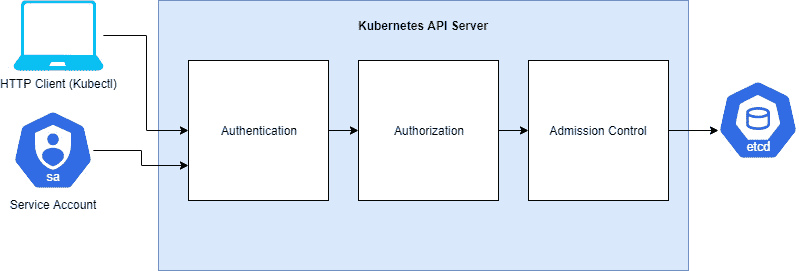
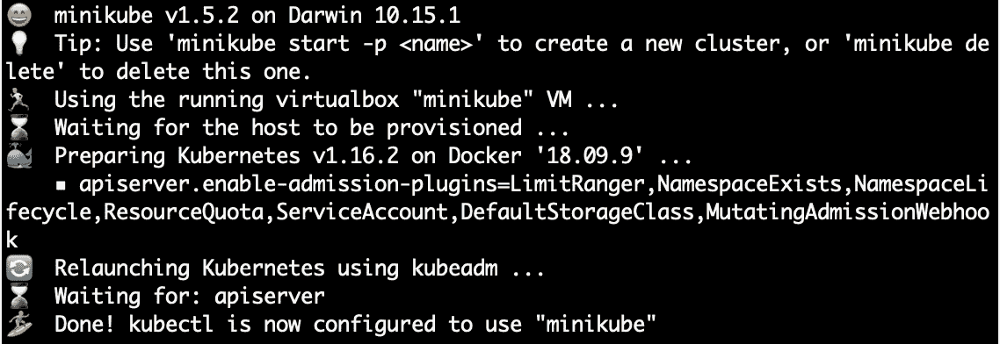
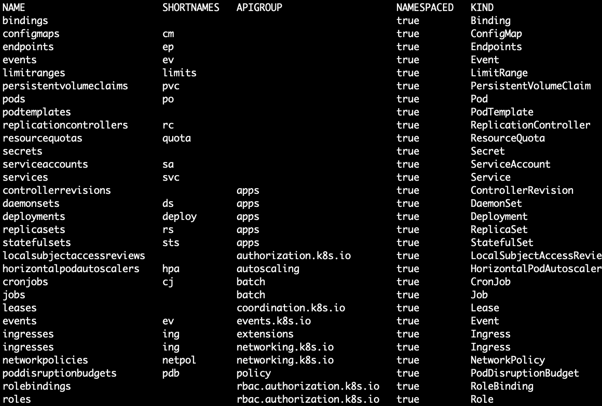
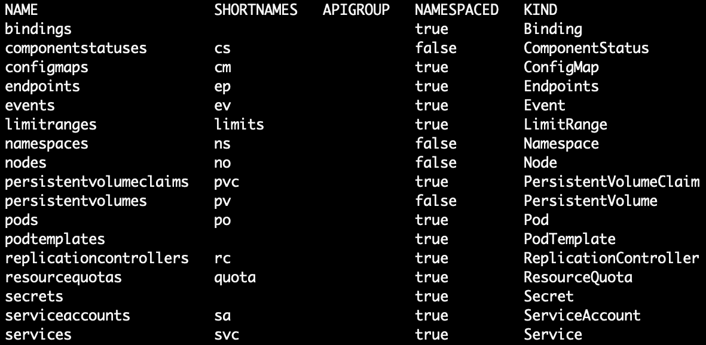
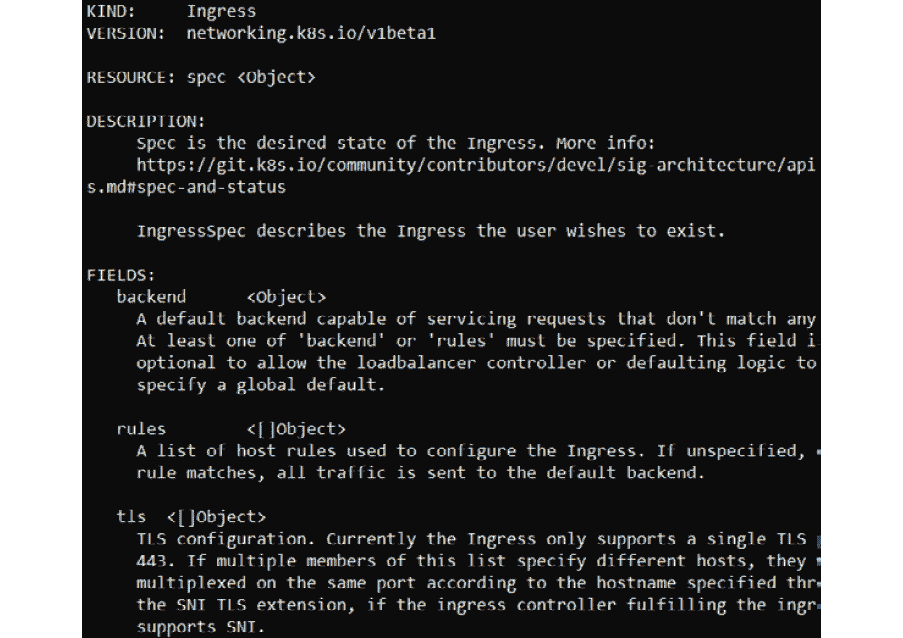
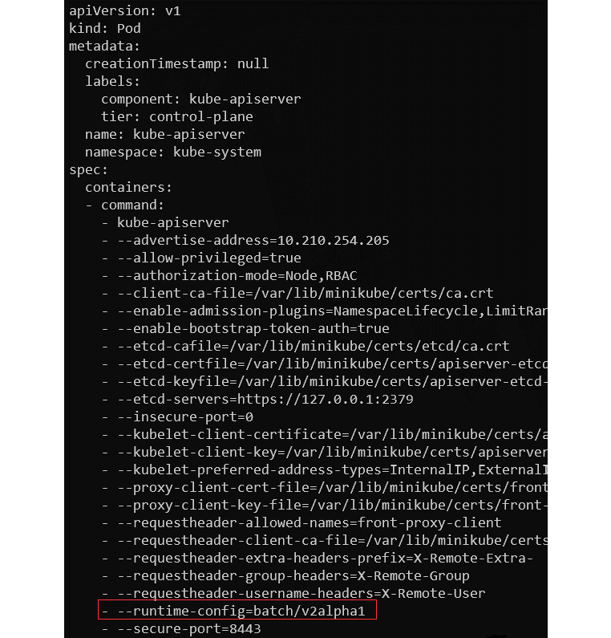
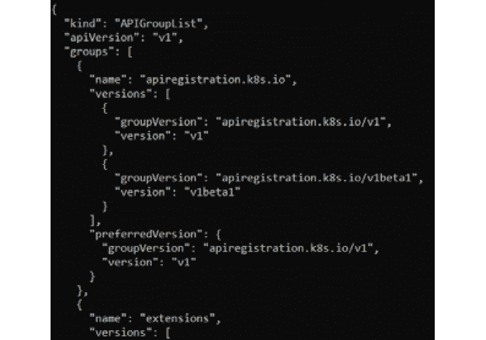
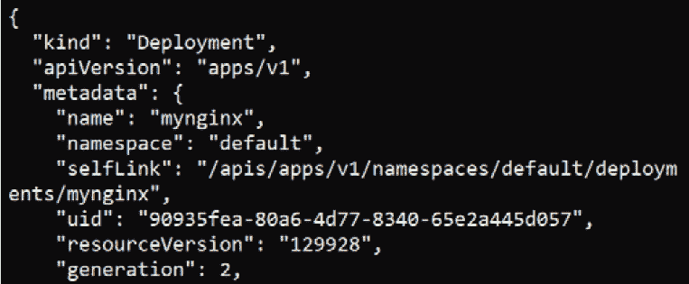
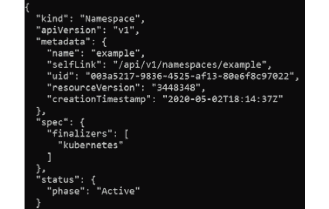
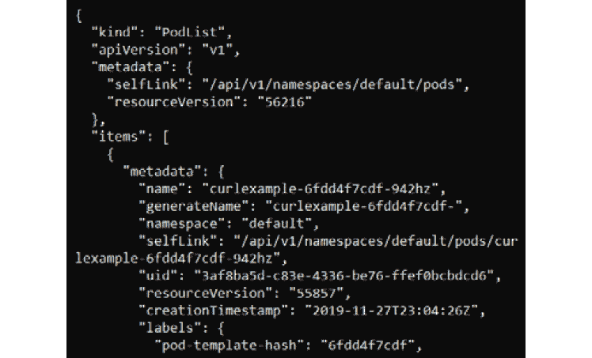

# 4。如何与库本内斯服务器通信

概述

在本章中，我们将对 Kubernetes API 服务器以及与它交互的各种方式有一个基本的了解。我们将学习 kubectl 和其他 HTTP 客户端如何与 Kubernetes API 服务器通信。我们将使用一些实际的演示来跟踪这些通信，并查看 HTTP 请求的细节。然后，我们还将看到如何查找 API 细节，以便您可以从头开始编写自己的 API 请求。到本章结束时，您将能够通过使用任何 HTTP 客户端(如 curl)直接与应用编程接口服务器通信来创建应用编程接口对象，从而对应用编程接口服务器进行 RESTful 应用编程接口调用。

# 简介

从*第 2 章*、*Kubernetes公司概述*中可以回忆起，API 服务器充当了与Kubernetes公司所有不同组件进行通信的中心枢纽。在上一章中，我们看了如何使用 kubectl 来指示 API 服务器做各种事情。

在本章中，我们将进一步研究组成 API 服务器的组件。由于 API 服务器是我们整个 Kubernetes 系统的中心，因此了解如何有效地与 API 服务器本身进行通信以及如何处理 API 请求非常重要。我们还将研究各种应用编程接口概念，例如资源、应用编程接口组和应用编程接口版本，这将有助于您理解对应用编程接口服务器的 HTTP 请求和响应。最后，我们将使用多个 REST 客户端与 Kubernetes API 进行交互，以获得与上一章中使用 kubectl 命令行工具相同的结果。

# 不灭 API 服务器

在 Kubernetes 中，控制平面组件和外部客户端(如 kubectl)之间的所有通信和操作都被翻译成由 API 服务器处理的 **RESTful API** 调用。实际上，应用编程接口服务器是一个 RESTful 网络应用，它通过 HTTP 处理 RESTful 应用编程接口调用，以存储和更新 etcd 数据存储中的应用编程接口对象。

API 服务器也是一个前端组件，充当通往和来自外部世界的网关，所有客户端都可以访问它，例如 kubectl 命令行工具。甚至控制平面中的集群组件也只通过 API 服务器相互交互。此外，它是唯一直接与 etcd 数据存储交互的组件。由于应用编程接口服务器是客户端访问群集的唯一方式，因此必须对其进行正确配置，以便客户端能够访问。您通常会看到应用编程接口服务器被实现为`kube-apiserver`。

注意

我们将在本章后面的*库本内斯应用编程接口*部分更详细地解释 RESTful 应用编程接口。

现在，让我们通过运行以下命令来回忆一下 API 服务器在 Minikube 集群中的样子:

```
kubectl get pods -n kube-system
```

您应该会看到以下响应:


图 4.1:观察 API 服务器是如何在 Minikube 中实现的

正如我们在前面章节中看到的，在 Minikube 环境中，API 服务器在`kube-system`命名空间中被称为`kube-apiserver-minikube`。正如您在前面的截图中看到的，我们有一个 API 服务器的实例:`kube-apiserver-minikube`。

应用编程接口服务器是无状态的(也就是说，无论集群的状态如何，它的行为都是一致的)，并且被设计为水平扩展。通常，为了集群的高可用性，建议至少有三个实例来更好地处理负载和容错。

# 不可压缩的 HTTP 请求流

正如我们在前面章节中了解到的，当我们运行任何`kubectl`命令时，该命令都会被转换为 JSON 格式的 HTTP API 请求，并被发送到 API 服务器。然后，应用编程接口服务器向客户端返回一个响应，以及任何请求的信息。下图显示了应用编程接口请求的生命周期，以及当应用编程接口服务器接收到请求时会发生什么:



图 4.2: API 服务器 HTTP 请求流

正如您在上图中看到的，HTTP 请求经历了身份验证、授权和准入控制阶段。我们将在下面的副主题中研究每一个。

## 认证

在 Kubernetes 中，每个 API 调用都需要向 API 服务器进行身份验证，而不管它是来自集群之外的进程，如 kubectl 所做的，还是集群内部的进程，如 kubelet 所做的。

当一个 HTTP 请求被发送到应用编程接口服务器时，应用编程接口服务器需要验证发送该请求的客户端。HTTP 请求将包含身份验证所需的信息，如用户名、用户标识和组。身份验证方法将由请求的标头或证书决定。为了处理这些不同的方法，API 服务器有不同的身份验证插件，例如用于验证 ServiceAccount 的 service account 令牌，以及至少一种验证用户的其他方法，例如 X.509 客户端证书。

注意

集群管理员通常在集群创建期间定义身份验证插件。您可以在[https://kubernetes . io/docs/reference/access-authn-authz/authentication/](https://kubernetes.io/docs/reference/access-authn-authz/authentication/)了解各种身份验证策略和身份验证插件的更多信息。

我们将在*第 11 章*、*构建自己的 HA 集群*中了解基于证书的认证的实现。

应用编程接口服务器将一个接一个地调用这些插件，直到其中一个验证请求。如果它们全部失败，则身份验证失败。如果身份验证成功，则身份验证阶段完成，请求进入授权阶段。

## 授权

身份验证成功后，来自 HTTP 请求的属性被发送到授权插件，以确定是否允许用户执行请求的操作。不同用户可能拥有不同级别的权限；例如，给定用户能否在请求的命名空间中创建 pod？用户能否删除部署？这类决策是在授权阶段做出的。

考虑一个有两个用户的例子。名为 **ReadOnlyUser** (只是一个假设名称)的用户应该被允许仅在`default`命名空间中列出 pods，而 **ClusterAdmin** (另一个假设名称)应该能够跨所有命名空间执行所有任务:


图 4.3:我们两个用户的权限

为了更好地理解这一点，请看下面的演示:

注意

关于如何创建用户，我们不会深入太多细节，因为这将在*第 13 章*、*运行时和 Kubernetes* 中讨论。对于这个演示，用户及其权限已经设置好了，并且通过切换上下文演示了他们权限的限制。


图 4.4:展示不同的用户权限

请注意，从前面的截图来看，`ReadOnlyUser`只能在默认名称空间中**列出**吊舱，但是当试图执行其他任务时，例如删除`default`名称空间中的吊舱或在其他名称空间中列出吊舱，用户将会得到一个`Forbidden`错误。该`Forbidden`错误由授权插件返回。

kubectl 提供了一个工具，您可以通过使用`kubectl auth can-i`调用该工具来检查当前用户是否允许某个操作。

让我们在前面演示的上下文中考虑以下示例。假设`ReadOnlyUser`运行以下命令:

```
kubectl auth can-i get pods --all-namespaces
kubectl auth can-i get pods -n default
```

用户应该会看到以下响应:


图 4.5:检查只读用户的权限

现在，在切换上下文之后，假设`ClusterAdmin`用户运行以下命令:

```
kubectl auth can-i delete pods
kubectl auth can-i get pods
kubectl auth can-i get pods --all-namespaces
```

用户应该会看到以下响应:


图 4.6:检查集群管理员的权限

与认证阶段模块不同，授权模块是按顺序检查的。如果配置了多个授权模块，并且如果任何授权人批准或拒绝请求，则该决定将立即返回，并且不会联系其他授权人。

## 准入控制

在请求被认证和授权后，它进入许可控制模块。这些模块可以修改或拒绝请求。如果请求只是试图执行一个 READ 操作，它会绕过这个阶段；但是如果它试图创建、修改或删除，它将被发送到接纳控制器插件。Kubernetes 附带了一组预定义的准入控制器，尽管您也可以定义自定义准入控制器。

这些插件可以修改传入的对象，在某些情况下应用系统配置的默认值，甚至拒绝请求。像授权模块一样，如果任何接纳控制器模块拒绝该请求，则该请求被丢弃，并且它将不会进一步处理。

一些例子如下:

*   如果我们配置一个自定义规则，即每个对象都应该有一个标签(您将在*第 16 章*、*Kubernetes接纳控制器*中学习如何操作)，那么任何创建没有标签的对象的请求都将被接纳控制器拒绝。
*   当您删除一个名称空间时，它会进入**终止**状态，在此状态下，Kubernetes 会尝试在删除它之前驱逐其中的所有资源。因此，我们不能在这个命名空间中创建任何新的对象。`NamespaceLifecycle` 是什么阻止了这一点。
*   当客户端试图在不存在的名称空间中创建资源时，`NamespaceExists`准入控制器拒绝该请求。

在 Kubernetes 中包含的不同模块中，并非所有的准入控制模块都是默认启用的，默认模块通常会根据 Kubernetes 版本而变化。基于云的 Kubernetes 解决方案提供商，如**亚马逊网络服务** ( **AWS** )、谷歌和 Azure，控制哪些插件可以默认启用。群集管理员还可以决定在初始化应用编程接口服务器时启用或禁用哪些模块。通过使用`--enable-admission-plugins`标志，管理员可以控制除默认模块之外还应该启用哪些模块。另一方面，`--disable-admission-plugins`标志控制默认模块中的哪些模块应该被禁用。

注意

您将在*第 16 章**库本内斯入场控制器*中了解更多入场控制器，包括创建自定义入场控制器。

从*第 2 章*、*库本内斯*概述中可以回忆起，当我们使用`minikube start`命令创建集群时，默认情况下，Minikube 为我们启用了几个模块。让我们在下一个练习中更仔细地看看这一点，在这个练习中，我们不仅将查看默认情况下为我们启用的不同的应用编程接口模块，而且还将使用一组自定义模块启动 Minikube。

## Exerci se 4.01:用一组自定义模块启动 Minikube

在本练习中，我们将了解如何查看为 Minikube 实例启用的不同 API 模块，然后使用一组自定义的 API 模块重新启动 Minikube:

1.  If Minikube is not already running on your machine, start it up by using the following command:

    ```
    minikube start
    ```

    您应该会看到以下响应:

    

    图 4.7:启动 Minikube

2.  Now, let's see which modules are enabled by default. Use the following command:

    ```
    kubectl describe pod kube-apiserver-minikube -n kube-system | grep enable-admission-plugins
    ```

    您应该会看到以下响应:

    

    图 4.8:Minikube 中启用的默认模块

    从进度条 g 输出可以看到，Minikube 为我们启用了以下模块:`NamespaceLifecycle`、`LimitRanger`、`ServiceAccount`、`DefaultStorageClass`、`DefaultTolerationSeconds`、`NodeRestriction`、`MutatingAdmissionWebhook`、`ValidatingAdmissionWebhook`和`ResourceQuota`。

    注意

    要了解更多模块，请参考以下链接:[https://kubernetes . io/docs/reference/access-authn-authz/入场-控制器/](https://kubernetes.io/docs/reference/access-authn-authz/admission-controllers/ )

3.  Another way to check the modules is to view the API server manifest by running the following command:

    ```
    kubectl exec -it kube-apiserver-minikube -n kube-system -- kube-apiserver -h | grep "enable-admission-plugins" | grep -vi deprecated
    ```

    注意

    我们使用`grep -vi deprecated`是因为有另一个标志`--admission-control`，我们正在从输出中丢弃它，因为这个标志在未来的版本中将被弃用。

    kubectl 有`exec`命令，它允许我们对运行的吊舱执行一个命令。该命令将在我们的`kube-apiserver-minikube`吊舱中执行`kube-apiserver -h`，并将输出返回给我们的外壳:

    

    图 4.9:检查 Minikube 中默认启用的模块

4.  Now, we will start Minikube with our desired configuration. Use the following command:

    ```
    minikube start --extra-config=apiserver.enable-admission-plugins="LimitRanger,NamespaceExists,NamespaceLifecycle,ResourceQuota,ServiceAccount,DefaultStorageClass,MutatingAdmissionWebhook"
    ```

    正如您在这里看到的那样，`minikube start`命令有`--extra-config`配置器标志，它允许我们向集群安装传递额外的配置。在我们的例子中，我们可以使用`--extra-config`标志和`--enable-admission-plugins`，并指定我们需要启用的插件。我们的命令应该产生这样的输出:

    

    图 4.10:使用一组自定义模块重新启动 Minikube

5.  Now, let's compare this instance of Minikube with our earlier one. Use the following command:

    ```
    kubectl describe pod kube-apiserver-minikube -n kube-system | grep enable-admission-plugins
    ```

    您应该会看到以下响应:

    

图 4.11:检查 Minikube 的一组定制模块

如果您将此处看到的模块集与*图 4.7* 中的模块集进行比较，您会注意到只有指定的插件被启用；而`DefaultTolerationSeconds`、`NodeRestriction`和`ValidatingAdmissionWebhook`模块不再启用。

注意

您可以通过再次运行`minikube start`恢复到 Minikube 中的默认配置。

## 验证

在让请求通过所有三个阶段之后，应用编程接口服务器然后验证对象——也就是说，它检查响应主体中以 JSON 格式携带的对象规范是否符合所需的格式和标准。

成功验证后，API 服务器将对象存储在 etcd 数据存储中，并向客户端返回响应。之后，正如您在*第 2 章*、*Kubernetes 概述*中所了解的，其他组件，如调度器和控制器管理器，会接管寻找合适的节点，并在您的集群上实际实现该对象。

# 不灭的蜜蜂

Kubernetes 应用编程接口通过 HTTP 使用 JSON 进行请求和响应。它遵循 REST 架构风格。可以使用 Kubernetes API 来读写 Kubernetes 资源对象。

注意

关于 RESTful API 的更多细节，请参考[https://restfulapi.net/](https://restfulapi.net/)。

Kubernetes API 允许客户端通过标准 HTTP 方法(或 HTTP 动词)创建、更新、删除或读取对象的描述，如下表中的示例:


图 4.12: HTTP 动词及其用法

在 Kubernetes API 调用的上下文中，理解这些 HTTP 方法如何映射到 API 请求动词是有帮助的。那么，让我们看看哪些动词是通过哪些方法发送的:

*   `GET`: `get`, `list`, and `watch`

    一些库贝斯克命令的例子是`kubectl get pod`、`kubectl describe pod <pod-name>`和`kubectl get pod -w`。

*   `POST`: `create`

    kubectl 命令的一个例子是`kubectl create -f <filename.yaml>`。

*   `PATCH`: `patch`

    kubectl 命令的一个例子是`kubectl set image deployment/kubeserve nginx=nginx:1.9.1`。

*   `DELETE`: `delete`

    kubectl 命令的一个例子是`kubectl delete pod <pod-name>`。

*   `PUT`: `update`

    kubectl 命令的一个例子是`kubectl apply -f <filename.yaml>`。

    注意

    如果您还没有遇到这些命令，您将在接下来的章节中遇到。请随意参考本章或下面的 Kubernetes 文档，了解每个 API 请求对于任何命令是如何工作的:[https://kubernetes.io/docs/reference/kubernetes-api/](https://kubernetes.io/docs/reference/kubernetes-api/)。

如前所述，这些 API 调用携带了 JSON 数据，它们都有一个由`Kind`和`apiVersion`字段标识的 JSON 模式。`Kind`是标识对象应该具有的 JSON 模式类型的字符串，`apiVersion`是标识对象应该具有的 JSON 模式版本的字符串。下一个练习应该会让你对此有更好的了解。

您可以参考Kubernetes应用编程接口参考文档，在[https://kubernetes.io/docs/reference/kubernetes-api/](https://kubernetes.io/docs/reference/kubernetes-api/)查看不同的 HTTP 方法。

例如，如果您需要在特定的名称空间中创建部署，在`WORKLOADS APIS`下，您可以导航到`Deployment v1 apps` > `Write Operations` > `Create`。您将看到 HTTP 请求和使用`kubectl`或`curl`的不同示例。API 参考文档的以下页面应该会让您了解如何使用该参考:


图 4.13:对 kubectl 创建命令的 HTTP 请求

当您参考前面提到的文档时，您需要记住您的 API 服务器的版本。你可以通过运行`kubectl version --short`命令并寻找`Server Version`来找到你的 Kubernetes API 服务器版本。例如，如果您的 Kubernetes API 服务器版本运行的是 1.14 版本，您应该导航到 Kubernetes 1.14 版本参考文档([https://v1-14 . docs . Kubernetes . io/docs/reference/generated/Kubernetes-API/v 1.14/](https://v1-14.docs.kubernetes.io/docs/reference/generated/kubernetes-api/v1.14/))来查找相关的 API 信息。

理解这一点的最好方法是跟踪一个`kubectl`命令。让我们在下一节中完全做到这一点。

## 跟踪库比特 HTTP 请求

让我们尝试跟踪 kubectl 发送给 API 服务器的 HTTP 请求，以便更好地理解它们。在开始之前，让我们使用以下命令获取`kube-system`命名空间中的所有豆荚:

```
kubectl get pods -n kube-system
```

该命令应该在表格视图中显示输出，如下图所示:


图 4.14:获取 kube 系统命名空间中的 pods 列表

在幕后，由于 kubectl 是一个 REST 客户端，它向 API 服务器端点调用一个 HTTP `GET`请求，并向`/api/v1/namespaces/kube-system/pods`请求信息。

我们可以通过在`kubectl`命令中添加`--v=8`来启用详细输出。`v`表示命令冗长。数字越高，我们在回应中得到的细节就越多。这个数字的范围可以从`0`到`10`。让我们看看`8`详细程度的输出:

```
kubectl get pods -n kube-system --v=8
```

这应该给出如下输出:


图 4.15:详细程度为 8 的 get pods 命令的输出

让我们一点一点地检查前面的输出，以便更好地理解它:

*   The first part of the output is as follows:

    

图 4.16:指示配置文件加载的部分输出

由此，我们可以看到 kubectl 从我们的 kubeconfig 文件中加载了配置，该文件包含 API 服务器端点、端口和凭据，如证书或身份验证令牌。

*   This is the next part of the output:

    

图 4.17:指示 HTTP GET 请求的部分输出

在这里，你可以看到提到的`HTTP GET`请求为`GET https://192.168.99.100:8443/api/v1/namespaces/kube-system/pods?limit=500`。这一行包含我们需要对 API 服务器执行的操作，`/api/v1/namespaces/kube-system/pods`是 API 路径。也可以在 URL 路径的末尾看到`limit=500`，就是块大小；kubectl 以块的形式获取大量资源，以改善延迟。在本章的后面，我们将看到一些与大块检索结果集相关的例子。

*   The next part of the output is as follows:

    

图 4.18:指示请求头的部分输出

正如您在输出的这一部分所看到的，`Request Headers`描述了要获取的资源或请求该资源的客户端。在我们的示例中，输出有两个内容协商部分:

a) `Accept`:这是 HTTP 客户端用来告诉服务器他们会接受什么内容类型的。在我们的示例中，我们可以看到 kubectl 向 API 服务器通知了`application/json`内容类型。如果请求头中不存在这种情况，服务器将返回默认的预配置表示类型，这与Kubernetes应用编程接口的`application/json`相同，因为它使用 JSON 模式。我们还可以看到，它正在以表视图的形式请求输出，这在这一行中由`as=Table`表示。

b) `User-Agent`:该报头包含请求该信息的客户端的信息。在这种情况下，我们可以看到 kubectl 正在提供关于它自己的信息。

*   Let's examine the next part:

    

图 4.19:指示响应状态的部分输出

这里我们可以看到 API 服务器返回`200 OK` HTTP 状态码，表示请求已经在 API 服务器上处理成功。我们还可以看到处理这个请求所花费的时间，是 10 毫秒。

*   Let's look at the next part:

    

图 4.20:指示响应头的部分输出

如您所见，这一部分显示了`Response Headers`，在我们的示例中，它包括请求的日期和时间等细节。

*   Now, let's come to the main response sent by the API server:

    

图 4.21:指示响应主体的部分输出

`Response Body`包含客户端请求的资源数据。在我们的例子中，这是关于`kube-system`命名空间中的荚的信息。在这里，这些信息是原始 JSON 格式的，然后 kubectl 才能将其显示为一个整洁的表。但是，上一个截图末尾突出显示的部分显示，响应体没有我们请求的所有 JSON 输出；`Response Body`的一部分被截断了。这是因为`--v=8`显示的是响应内容被截断的 HTTP 请求内容。

要查看完整的响应体，可以用`--v=10`运行相同的命令，这样根本不会截断输出。该命令如下所示:

```
kubectl get pods -n kube-system --v=10
```

为了简洁起见，我们将不详细检查该命令。

*   Now, we come to the final part of the output that we are examining:

    

图 4.22:表示最终结果的部分输出

这是作为表的最终输出，这是所请求的。kubectl 已经获取了原始的 JSON 数据，并为我们将其格式化为一个整洁的表。

注意

您可以在[https://kubernetes . io/docs/reference/kubectl/cheat sheet/# kube CTL-output-verbosity-and-debug](https://kubernetes.io/docs/reference/kubectl/cheatsheet/#kubectl-output-verbosity-and-debugging)了解更多关于 kube CTL 详细度和调试标志的信息。

## 原料药资源类型

在前一节中，我们看到 HTTP URL 是由 API 资源、API 组和 API 版本组成的。现在，让我们了解一下在 URL 中定义的资源类型，例如 pods、名称空间和服务。在 JSON 形式中，这被称为`Kind`:

*   **资源集合**:这代表了一个资源类型的实例集合，比如所有名称空间中的所有 pods。在网址中，如下所示:

    ```
    GET /api/v1/pods
    ```

*   **单个资源**:这表示资源类型的单个实例，例如检索给定命名空间中特定 pod 的详细信息。这种情况下的网址如下:

    ```
    GET /api/v1/namespaces/{namespace}/pods/{name}
    ```

既然我们已经了解了向 API 服务器发出的请求的各个方面，那么让我们在下一节中了解 API 资源的范围。

# 原料药资源范围

所有资源类型可以是群集范围的资源，也可以是命名空间范围的资源。资源的范围会影响对该资源的访问以及该资源的管理方式。让我们看看命名空间和集群范围之间的区别。

## 命名空间范围的资源

正如我们在*第 2 章*、*Kubernetes 概述*中看到的，Kubernetes 利用 Linux 名称空间来组织大多数 Kubernetes 资源。同一命名空间中的资源共享相同的控制访问策略和授权检查。删除命名空间时，该命名空间中的所有资源也会被删除。

让我们看看与命名空间范围的资源交互的请求路径是什么形式:

*   返回命名空间中特定 pod 的信息:

    ```
    GET /api/v1/namespaces/{my-namespace}/pods/{pod-name}
    ```

*   返回命名空间中所有部署集合的信息:

    ```
    GET /apis/apps/v1/namespaces/{my-namespace}/deployments
    ```

*   Return the information about all instances of the resource type (in this case, services) across all namespaces:

    ```
    GET /api/v1/services
    ```

    请注意，当我们针对所有名称空间查找信息时，它在网址中不会有`namespace`。

您可以使用以下命令获得命名空间范围的 API 资源的完整列表:

```
kubectl api-resources --namespaced=true
```

您应该会看到类似这样的响应:



图 4.23:列出所有命名空间范围的资源

## 集群范围的资源

大多数 Kubernetes 资源都是命名空间范围的，但是命名空间资源本身不是命名空间范围的。不在命名空间范围内的资源属于群集范围。集群范围的资源的其他例子是节点。因为节点是集群范围的，所以您可以在所需的节点上部署 pod，而不管您希望 pod 位于哪个命名空间中，并且节点可以托管来自不同命名空间的不同 pod。

让我们看看与集群范围的资源交互的请求路径是什么样子的:

*   返回集群中特定节点的信息:

    ```
    GET /api/v1/nodes/{node-name}
    ```

*   返回集群中资源类型(在本例中是节点)的所有实例的信息:

    ```
    GET /api/v1/nodes
    ```

*   You can get a full list of cluster-scoped API resources by using the following command:

    ```
    kubectl api-resources --namespaced=false
    ```

    您应该会看到类似如下的输出:

    

图 4.24:列出所有集群范围的资源

# 原料药组

应用编程接口组是逻辑上相互关联的资源的集合。例如，部署、复制集和后台应用都属于应用应用编程接口组:`apps/v1`。

注意

您将在*第 7 章*、*Kubernetes控制器*中详细了解部署、复制集和 DaemonSets。事实上，本章将讲述您在后面章节中会遇到的许多 API 资源。

`--api-group`标志可用于将输出范围限定到特定的应用编程接口组，我们将在以下章节中看到。让我们在接下来的部分中仔细看看各种 API 组。

## 核心组

这也称为遗留组。它包含诸如 pods、服务、节点和名称空间等对象。这些的网址路径是`/api/v1`，除了版本之外，在`apiVersion`字段中没有指定任何内容。例如，考虑下面的屏幕截图，其中我们获得了关于 pod 的信息:


图 4.25:吊舱的应用编程接口组

这里可以看到，`apiVersion: v1`字段表示该资源属于核心组。

在`kubectl api-resources`命令输出中显示空白条目的资源是核心组的一部分。您也可以指定一个空参数标志(`--api-group=''`)来仅显示核心组资源，如下所示:

```
kubectl api-resources --api-group=''
```

您应该会看到如下输出:



图 4.26:列出核心 API 组中的资源

## 命名组

该组包括请求网址为`/apis/$NAME/$VERSION`格式的对象。与核心组不同，命名组在 URL 中包含组名。例如，让我们考虑下面的屏幕截图，其中有关于部署的信息:


图 4.27:部署的应用编程接口组

如您所见，显示`apiVersion: apps/v1`的突出显示字段指示该资源属于`apps`应用编程接口组。

您也可以指定`--api-group='<NamedGroup Name>'`标志来显示指定命名组中的资源。例如，让我们使用以下命令列出`apps` API 组下的资源:

```
kubectl api-resources --api-group='apps'
```

这应给出以下响应:


图 4.28:列出了应用接口组中的资源

前面截图中的所有这些资源都被组合在一起，因为它们是我们在查询命令中指定的`apps`命名组的一部分。

作为另一个例子，让我们看看`rbac.authorization.k8s.io API group`，它有资源来确定授权策略。我们可以使用以下命令查看该组中的资源:

```
kubectl api-resources --api-group='rbac.authorization.k8s.io'
```

您应该会看到以下响应:


图 4.29:列出了 rbac.authorization.k8s.io API 组中的资源

## 全系统

该组由系统范围的 API 端点组成，如`/version`、`/healthz`、`/logs`和`/metrics`。例如，让我们考虑以下命令的输出:

```
kubectl version --short --v=6
```

这应该会产生类似如下的输出:


图 4.30:库比特版本命令的请求网址

正如你在这个截图中看到的，当你运行`kubectl --version`的时候，会转到`/version special entity`，就像在`GET`请求 URL 中看到的一样。

# 应用编程接口版本

在 Kubernetes API 中，有 API 版本化的概念；也就是说，Kubernetes API 支持一种资源类型的多个版本。这些不同的版本可能会有所不同。每个都有不同的 API 路径，如`/api/v1`或`/apis/extensions/v1beta1`。

不同的应用编程接口版本在稳定性和支持方面有所不同:

*   **阿尔法**:这个版本在`apiVersion`字段中用`alpha`表示，例如`/apis/batch/v1alpha1`。默认情况下，alpha 版本的资源是禁用的，因为它不是为生产集群设计的，但是早期采用者和开发人员可以使用它，他们愿意提供反馈和建议并报告错误。此外，在 Kubernetes 的最终稳定版本最终确定之前，对 alpha 资源的支持可能会在没有通知的情况下被放弃。
*   **测试版**:这个版本在`apiVersion`字段用`beta`表示，例如`/apis/certificates.k8s.io/v1beta1`。默认情况下，资源的测试版是启用的，其背后的代码经过了良好的测试。但是，建议在非关键业务场景中使用它，因为后续版本中的更改可能会降低不兼容性；也就是说，某些功能可能在很长一段时间内不受支持。
*   **稳定**:对于这些版本，`apiVersion`字段只包含版本号，没有提到`alpha`或者`beta`—比如`/apis/networking.k8s.io/v1`。Kubernetes 的许多后续版本都支持稳定版本的资源。因此，对于任何关键用例，都推荐使用这个版本的 API 资源。

您可以使用以下命令获得集群中启用的 API 版本的完整列表:

```
kubectl api-versions
```

您应该会看到类似这样的响应:


图 4.31:API 资源的启用版本列表

在这个截图中你可能会观察到一个有趣的事情，就是一些 API 资源，比如`autoscaling`，有多个版本；比如对于`autoscaling`，有`v1beta1`、`v1beta2`、`v1`。那么，它们之间的区别是什么，你应该使用哪一个？

我们再来考虑`autoscaling`的例子。此功能允许您根据特定指标扩展复制控制器中的单元数量，如部署、复制集或状态集。例如，如果平均 CPU 负载超过 50%，您可以将 pod 的数量从 3 个自动缩放到 10 个。

在这种情况下，版本的区别在于功能支持。自动缩放的稳定版本是`autoscaling/v1`，它只支持基于平均 CPU 度量来缩放豆荚的数量。自动缩放的测试版`autoscaling/v2beta1`支持基于 CPU 和内存利用率的缩放。测试版中的新版本是`autoscaling/v2beta2`，除了支持中央处理器和内存之外，它还支持根据自定义指标来扩展吊舱的数量。但是，由于测试版在创建自动缩放资源时仍然不打算用于关键业务场景，因此它将使用`autoscaling/v1`版本。但是，通过在 YAML 文件中指定测试版，您仍然可以使用其他版本来使用其他功能，直到所需的功能被添加到稳定版本中。

所有这些信息看起来都是压倒性的。但是，Kubernetes 提供了访问所有信息的方法，这些信息是您在 API 资源中导航所需的。您可以使用 kubectl 来访问 Kubernetes 文档，并获得关于各种 API 资源的必要信息。让我们在下面的练习中看看这是如何工作的。

## 练习 4.02:获取关于 API 资源的信息

假设我们想要创建一个入口对象。出于本练习的目的，您不需要太了解入口；我们将在接下来的章节中了解它。

我们将使用 kubectl 获得更多关于入口 API 资源的信息，确定哪些 API 版本可用，并找出它属于哪些组。如果您记得前面的部分，我们需要 YAML 货单的`apiVersion`字段的信息。然后，我们还获得清单文件其他字段所需的信息:

1.  Let's first ask our cluster for all the available API resources that match the `ingresses` keyword:

    ```
    kubectl api-resources | grep ingresses
    ```

    该命令将通过`ingresses`关键字过滤所有应用编程接口资源的列表。您应该会得到以下输出:

    ```
    ingresses     ing     extensions            true         Ingress
    ingresses     ing     networking.k8s.io     true         Ingress
    ```

    我们可以看到，我们在两个不同的 API 组上有入口资源— `extensions`和`networking.k8s.io`。

2.  We have also seen how we can get API resources belonging to specific groups. Let's check the API groups that we saw in the previous step:

    ```
    kubectl api-resources --api-group="extensions"
    ```

    您应该会得到以下输出:

    ```
    NAME       SHORTNAMES     APIGROUP     NAMESPACED      KIND
    ingresses  ing            extensions   true            Ingress
    ```

    现在，让我们检查另一组:

    ```
    kubectl api-resources --api-group="networking.k8s.io"
    ```

    您应该会看到以下输出:

    

    图 4.32:列出了网络应用编程接口组中的资源

    然而，如果我们使用入口资源，我们仍然不知道我们应该使用来自`extensions`组还是`networking.k8s.io`组的资源。在下一步中，我们将获得更多的信息来帮助我们做出决定。

3.  Use the following command to get more information:

    ```
    kubectl explain ingress
    ```

    你应该得到这样的回应:

    

    图 4.33:从扩展应用编程接口组获取入口资源的详细信息

    如您所见，`kubectl explain`命令描述了 API 资源，以及与之相关联的字段的详细信息。我们还可以看到，入口使用`extensions/v1beta1` API 版本，但是如果我们阅读`DESCRIPTION`，它提到这个入口的组版本被`networking.k8s.io/v1beta1`否决了。不推荐使用意味着该标准正在逐步淘汰，即使目前支持，也不建议使用。

    注意

    如果您将此与我们在本练习之前看到的不同版本的`autoscaling`进行比较，您可能会认为从`v1beta`开始的逻辑升级路径将是`v2beta`，这完全有意义。然而，入口资源从`extensions`组转移到了`networking.k8s.io`组，因此这与命名趋势背道而驰。

4.  It is not a good idea to use a deprecated version, so let's say that you want to use the `networking.k8s.io/v1beta1` version instead. However, we need to get more information about it first. We can add a flag to the `kubectl explain` command to get information about a specific version of an API resource, as follows:

    ```
    kubectl explain ingress --api-version=networking.k8s.io/v1beta1
    ```

    您应该会看到以下回应:

    

    图 4.34:从网络获取入口资源的详细信息

5.  We can also filter the output of the `kubectl explain` command by using the `JSONPath` identifier. This allows us to get information about the various fields that we need to specify while defining the YAML manifest. So, for example, if we would like to see the `spec` fields for Ingress, the command will be as follows:

    ```
    kubectl explain ingress.spec --api-version=networking.k8s.io/v1beta1
    ```

    这应该给出如下响应:

    

    图 4.35:过滤 kubectl 解释命令的输出以获得入口的规范字段

6.  We can dive deeper to get more details about the nested fields. For example, if you wanted to get more details about the `backend` field of ingress, we can specify `ingress.spec.backend` to get the required information:

    ```
    kubectl explain ingress.spec.backend --api-version=networking.k8s.io/v1beta1
    ```

    这将产生以下输出:

    

图 4.36:过滤 kubectl 解释命令的输出，以获得入口的规范后端字段

同样，我们可以对您需要信息的任何字段重复这一步骤，这对于构建或修改 YAML 清单很方便。因此，我们已经看到`kubectl explain`命令在您寻找关于应用编程接口资源的更多细节和文档时非常有用。当使用 YAML 清单文件创建或修改对象时，它也非常有用。

## 如何启用/禁用应用编程接口资源、组或版本

在典型的集群中，并非所有的应用编程接口组都是默认启用的。这取决于管理员确定的集群用例。例如，一些 Kubernetes 云提供商出于稳定性和安全性的原因禁用使用 alpha 级别的资源。但是，这些仍然可以通过使用`--runtime-config`标志在应用编程接口服务器上启用，该标志接受逗号分隔的列表。

为了能够创建任何资源，应该在集群中启用组和版本。例如，当您试图创建一个在其清单文件中使用`apiVersion: batch/v2alpha1`的`CronJob`时，如果组/版本未启用，您将获得类似于以下内容的错误:

```
No matches for kind "CronJob" in version "batch/v2alpha1".
```

要启用`batch/v2alpha1`，需要在 API 服务器上设置`--runtime-config=batch/v2alpha1`。这可以在创建集群期间完成，也可以通过更新`/etc/kubernetes/manifests/kube-apiserver.yaml`清单文件来完成。该标志还支持通过为特定版本设置`false`值来禁用应用编程接口组或版本，例如`--runtime-config=batch/v1=false`。

`--runtime-config`还支持`api/all`专用键，用于控制所有 API 版本。例如，要关闭除`v1`以外的所有 API 版本，可以通过`--runtime-config=api/all=false,api/v1=true`标志。在下面的练习中，让我们尝试自己动手创建和禁用 API 组和版本的例子。

## 练习 4.03:在 Minikube 集群上启用和禁用 API 组和版本

在本练习中，我们将在启动 Minikube 时创建特定的 API 版本，在运行的集群中禁用某些 API 版本，然后在整个 API 组中启用/禁用资源:

1.  Start Minikube with the flag shown in the following command:

    ```
    minikube start --extra-config=apiserver.runtime-config=batch/v2alpha1
    ```

    您应该会看到以下响应:

    

    图 4.37:使用额外的 API 资源组启动 Minikube

    注意

    您可以在[https://minikube.sigs.k8s.io/docs/handbook/config/](https://minikube.sigs.k8s.io/docs/handbook/config/)查阅`minikube start`文件，了解有关`--extra-config`旗帜的更多详情。

2.  You can confirm it is enabled by checking the details about the `kube-apiserver-minikube` pod. Use the `describe pod` command and filter the results by the `runtime` keyword:

    ```
    kubectl describe pod kube-apiserver-minikube -n kube-system | grep runtime
    ```

    您应该会看到以下响应:

    ```
    --runtime-config=batch/v2alpha1
    ```

3.  Another way to confirm this is by looking at the enabled API versions by using the following command:

    ```
    kubectl api-versions | grep batch/v2alpha1
    ```

    您应该会看到以下响应:

    ```
    batch/v2alpha1
    ```

4.  现在，让我们创建一个名为`CronJob`的资源，它使用`batch/v2alpha1`来确认我们的 API 服务器接受该 API。创建一个名为`sample-cronjob.yaml`的文件，内容如下:

    ```
    apiVersion: batch/v2alpha1
    kind: CronJob
    metadata:
      name: hello
    spec:
      schedule: "*/1 * * * *"
      jobTemplate:
        spec:
          template:
            spec:
              containers:
              - name: hello
                image: busybox
                args:
                - /bin/sh
                - -c
                - date; echo Hello from the Kubernetes cluster
              restartPolicy: OnFailure
    ```

5.  Now, create a `CronJob` by using this YAML file:

    ```
    kubectl create -f sample-cronjob.yaml
    ```

    您应该会看到以下输出:

    ```
    cronjob.batch/hello created
    ```

    可以看到，API 服务器接受了我们的 YAML 文件，`CronJob`创建成功。

6.  Now, let's disable `batch/v2alpha1` on our cluster. To do that, we need to access the Minikube virtual machine (VM) using SSH, as demonstrated in previous chapters:

    ```
    minikube ssh
    ```

    您应该会看到以下回应:

    

    图 4.38:通过 SSH 访问 Minikube 虚拟机

7.  Open the API server manifest file. This is the template Kubernetes uses for the API server pods. We will use vi to modify this file, although you can use any text editor of your preference:

    ```
    sudo vi /etc/kubernetes/manifests/kube-apiserver.yaml
    ```

    您应该会看到如下响应:

    

    图 4.39:应用编程接口服务器规范文件

    寻找包含`--runtime-config=batch/v2alpha1`的行，并将其更改为`--runtime-config=batch/v2alpha1=false`。然后，保存修改后的文件。

8.  使用以下命令结束 SSH 会话:

    ```
    exit
    ```

9.  For the changes in the API server manifest to take effect, we need to restart the API server and the controller manager. Since these are deployed as stateless pods, we can simply delete them and they will automatically get deployed again. First, let's delete the API server by running this command:

    ```
    kubectl delete pods -n kube-system -l component=kube-apiserver
    ```

    您应该会看到以下输出:

    ```
    pod "kube-apiserver-minikube" deleted
    ```

    现在，让我们删除控制器管理器:

    ```
    kubectl delete pods -n kube-system -l component=kube-controller-manager
    ```

    您应该会看到以下输出:

    ```
    pod "kube-controller-manager-minikube" deleted
    ```

    请注意，对于这两个命令，我们并没有根据它们的名称删除它们。`-l`标志寻找标签。这些命令删除了`kube-system`命名空间中所有标签与`-l`标志后指定的标签相匹配的豆荚。

10.  We can confirm that `batch/v2alpha1` is no longer shown in API versions by using the following command:

    ```
    kubectl api-versions | grep batch/v2alpha1
    ```

    该命令不会给你任何响应，表示我们已经禁用`batch/v2alpha1`。

因此，我们已经看到了如何启用或禁用特定的 API 资源组或版本。但这仍然是一个宽泛的方法。如果您想禁用特定的应用编程接口资源，该怎么办？

对于我们的示例，假设您想要禁用入口。我们在前面的练习中看到，我们在`extensions`和`networking.k8s.io`原料药组中都有成分。如果您的目标是特定的应用编程接口资源，您需要指定其组和版本。假设您想禁用来自`extensions`组的入口，因为它已被否决。在这组中，我们只有一个版本的 ingresses，那就是`v1beta`，从*图 4.33* 可以观察到。

为了实现这一点，我们所要做的就是修改`--runtime-config`标志来指定我们想要的资源。因此，如果我们想禁止从`extensions`组进入，标志如下:

```
--runtime-config=extensions/v1beta1/ingresses=false
```

要禁用资源，我们可以在启动 Minikube 时使用此标志，如本练习的*步骤 1* 所示，或者我们可以将此行添加到 API 服务器的清单文件中，如本练习的*步骤 7* 所示。回想一下这个练习，如果我们想启用资源，我们只需要从这个标志的末尾移除`=false`部分。

# 使用 Kubernetes API 与集群交互

到目前为止，我们一直在使用 Kubernetes kubectl 命令行工具，这使得与我们的集群交互非常方便。它是通过从客户端 kubeconfig 文件中提取 API 服务器地址和身份验证信息来实现的，默认情况下，该文件位于`~/.kube/config`中，正如我们在上一章中看到的那样。在本节中，我们将了解使用 HTTP 客户端(如 curl)直接访问 API 服务器的不同方法。

有两种可能的方法可以通过 REST API 直接访问 API 服务器——在代理模式下使用 kubectl，或者直接向 HTTP 客户端提供位置和身份验证凭据。我们将探索这两种方法，以了解每种方法的优缺点。

## 使用 Kubernetes API 服务器作为代理访问 Kubernetes

kubectl 有一个很棒的特性叫做 **kubectl 代理**，这是与 API 服务器交互的推荐方法。推荐这样做是因为它更容易使用，并且提供了一种更安全的方式，因为它通过使用自签名证书来验证 API 服务器的身份，这可以防止**中间人** ( **MITM** )攻击。

kubectl 代理将请求从我们的 HTTP 客户端路由到 API 服务器，同时自行处理身份验证。身份验证也通过使用 kubeconfig 文件中的当前配置来处理。

为了演示如何使用 kubectl 代理，让我们首先创建一个 NGINX Deployment，在默认命名空间中有两个副本，并使用`kubectl get pods`查看它:

```
kubectl create deployment mynginx --image=nginx:latest 
```

这应该会产生如下输出:

```
deployment.apps/mynginx created
```

现在，我们可以使用以下命令将部署扩展到两个副本:

```
kubectl scale deployment mynginx --replicas=2
```

您应该会看到类似如下的输出:

```
deployment.apps/mynginx scaled
```

现在让我们检查一下吊舱是否启动并运行:

```
kubectl get pods
```

这给出了类似如下的输出:

```
NAME                        READY    STATUS     RESTARTS   AGE
mynginx-565f67b548-gk5n2    1/1      Running    0          2m30s
mynginx-565f67b548-q6slz    1/1      Running    0          2m30s
```

要启动应用编程接口服务器的代理，运行`kubectl proxy`命令:

```
kubectl proxy
```

这应该给出如下输出:

```
Starting to serve on 127.0.0.1:8001
```

从前面的截图中注意到本地代理连接运行在`127.0.0.1:8001`上，这是默认的。我们还可以通过添加`--port=<YourCustomPort>`标志来指定一个自定义端口，同时在我们的命令末尾添加一个`&`(符号)来允许代理在终端后台运行，这样我们就可以继续在同一个终端窗口中工作。因此，命令如下所示:

```
kubectl proxy --port=8080 &
```

这应给出以下响应:

```
[1] 48285
AbuTalebMBP:~ mohammed$ Starting to serve on 127.0.0.1:8080
```

代理作为后台作业运行，在前面的截图中，`[1]`表示作业号，`48285`表示其进程 ID。要退出后台运行的代理，可以运行`fg`将作业带回前台:

```
fg
```

这将显示以下响应:

```
kubectl proxy --port=8080
^C
```

将代理拿到前台后，我们可以简单的使用 *Ctrl* + *C* 退出(如果没有其他作业运行)。

注意

如果不熟悉作业控制，可以在[https://www . GNU . org/software/bash/manual/html _ node/Job-Control-basics . html](https://www.gnu.org/software/bash/manual/html_node/Job-Control-Basics.html)了解。

我们现在可以开始使用 curl 探索 API 了:

```
curl http://127.0.0.1:8080/apis
```

回想一下，尽管我们主要是为了方便而使用 YAML，但数据是以 JSON 格式存储在 etcd 中的。你会看到一个长长的回复，开头是这样的:



图 4.40:来自 API 服务器的响应

但是我们如何找到确切的路径来查询我们之前创建的部署呢？此外，我们如何查询由该部署创建的容器？

你可以先问自己几个问题:

*   What are the API version and API group used by Deployments?

    在*图 4.27* 中，我们看到部署在`apps/v1`中，因此我们可以从将其添加到路径中开始:

    ```
    curl http://127.0.0.1:8080/apis/apps/v1
    ```

*   Is it a namespace-scoped resource or a cluster-scoped resource? If it is a namespace-scoped resource, what is the name of the namespace?

    我们还在 API 资源部分的范围中看到，部署是命名空间范围的资源。当我们创建部署时，由于我们没有指定不同的名称空间，它转到了`default`名称空间。因此，除了`apiVersion`字段，我们还需要将`namespaces/default/deployments`添加到我们的路径中:

    ```
    curl http://127.0.0.1:8080/apis/apps/v1/namespaces/default/deployments
    ```

    这将返回一个大的输出，其中包含存储在该路径上的 JSON 数据。这是响应的一部分，为我们提供了所需的信息:

    

图 4.41:使用 curl 获取所有部署的信息

正如您在这个输出中看到的，它列出了`default`命名空间中的所有部署。从`"kind": "DeploymentList"`可以推断。此外，请注意，响应是 JSON 格式的，并不是整齐地以表格形式呈现的。

现在，我们可以通过将其添加到我们的路径来指定特定的部署:

```
curl http://127.0.0.1:8080/apis/apps/v1/namespaces/default/deployments/mynginx
```

您应该会看到以下回应:



图 4.42:使用 curl 获取关于 NGINX 部署的信息

您也可以将此方法用于任何其他资源。

## 使用卷曲创建对象

当您使用任何 HTTP 客户端(如 curl)向 API 服务器发送创建对象的请求时，您需要更改三件事:

1.  将`HTTP`请求方式改为`POST`。默认情况下，curl 将使用`GET`方法。要创建对象，我们需要使用`POST`方法，正如我们在*库本内斯 API* 一节中所学的那样。你可以使用`-X`旗来改变这一点。
2.  更改 HTTP 请求头。我们需要修改头部来通知 API 服务器请求的意图是什么。我们可以使用`-H`标志修改标题。在这种情况下，我们需要将表头设置为`'Content-Type: application/yaml'`。
3.  包括要创建的对象的规格。正如您在前面两章中了解到的，每个 API 资源都作为 API 对象保存在 etcd 中，它是由 YAML 规范/清单文件定义的。要创建一个对象，您需要使用`--data`标志将 YAML 清单传递给应用编程接口服务器，这样它就可以将其作为一个对象保存在 etcd 中。

因此，我们将在下面的练习中实现的 curl 命令看起来如下所示:

```
curl -X POST <URL-path> -H 'Content-Type: application/yaml' --data <spec/manifest>
```

有时，您会手边有清单文件。然而，情况可能并非总是如此。此外，我们还没有看到名称空间的清单是什么样子的。

让我们考虑一个我们想要创建名称空间的情况。通常，您会创建如下命名空间:

```
kubectl create namespace my-namespace
```

这将给出以下响应:

```
namespace/my-namespace created
```

在这里，可以看到我们创建了一个名为`my-namespace`的命名空间。然而，为了在不使用 kubectl 的情况下传递请求，我们需要用于定义名称空间的规范。我们可以通过使用`--dry-run=client`和`-o`标志来实现:

```
kubectl create namespace my-second-namespace --dry-run=client -o yaml
```

这将给出以下响应:


图 4.43:使用模拟运行获取名称空间的规范

当您运行带有`--dry-run=client`标志的`kubectl`命令时，应用编程接口服务器会将它带到正常命令的所有阶段，除了它不会将更改保存到 etcd 中。因此，该命令经过了身份验证、授权和验证，但更改不是永久性的。这是测试某个命令是否有效的好方法，也是获取 API 服务器为这个命令创建的清单的好方法，正如您在前面的截图中看到的。让我们看看如何将其付诸实践，并使用 curl 创建一个部署。

## 练习 4.04:使用 kubectl 代理和 curl 创建和验证部署

在本练习中，我们将创建一个名为`nginx-example`的 NGINX 部署，在名为`example`的命名空间中有三个副本。我们将通过 kubectl 代理向带有 curl 的 API 服务器发送请求来实现这一点:

1.  First, let's start our proxy:

    ```
    kubectl proxy &
    ```

    这应给出以下响应:

    ```
    [1] 50034
    AbuTalebMBP:~ mohammed$ Starting to serve on 127.0.0.1:8080
    ```

    代理作为后台作业启动，正在端口`8001`监听本地主机。

2.  Since the `example` namespace does not exist, we should create that namespace before creating the Deployment. As we learned in the previous section, we need to get the spec that should be used to create the namespace. Let's use the following command:

    ```
    kubectl create namespace example --dry-run -o yaml
    ```

    注意

    对于 Kubernetes 版本，请使用`--dry-run=client`。

    这将产生以下输出:

    

    图 4.44:获取我们的名称空间所需的规范

    现在，我们有了创建名称空间所需的规范。

3.  Now, we need to send a request to the API server using curl. Namespaces belong to the core group and hence the path will be `/api/v1/namespaces`. The final `curl` command to create the namespace after adding all required parameters should look like the following:

    ```
    curl -X POST http://127.0.0.1:8001/api/v1/namespaces -H 'Content-    Type: application/yaml' --data "
    apiVersion: v1
    kind: Namespace
    metadata:
      creationTimestamp: null
      name: example
    spec: {}
    status: {}
    "
    ```

    注意

    您可以发现任何资源所需的路径，如前面的练习所示。在该命令中，`--data`后的双引号(`"`)允许您在 Bash 中输入多行输入，该输入由末尾的另一个双引号分隔。因此，您可以在分隔符之前复制上一步的输出。

    现在，如果我们的命令一切正确，您应该会得到如下响应:

    

    图 4.45:使用 curl 发送创建名称空间的请求

4.  The same procedure applies to Deployment. So, first, let's use the `kubectl create` command with `--dry-run=client` to get an idea of how our YAML data looks:

    ```
    kubectl create deployment nginx-example -n example --image=nginx:latest --dry-run -o yaml
    ```

    注意

    对于 Kubernetes 版本，请使用`--dry-run=client`。

    您应该会得到以下响应:

    

    图 4.46:使用 curl 发送创建部署的请求

    注意

    请注意，如果您使用`--dry-run=client`标志，命名空间将不会显示，因为我们需要在我们的 API 路径中指定它。

5.  Now, the command for creating the Deployment will be constructed similarly to the command for creating the namespace. Note that the namespace is specified in the API path:

    ```
    curl -X POST http://127.0.0.1:8001/apis/apps/v1/namespaces/example/    deployments -H 'Content-Type: application/yaml' --data "
    apiVersion: apps/v1
    kind: Deployment
    metadata:
      creationTimestamp: null
      labels:
        run: nginx-example
      name: nginx-example
    spec:
      replicas: 3
      selector:
        matchLabels:
          run: nginx-example
      strategy: {}
      template:
        metadata:
          creationTimestamp: null
          labels:
            run: nginx-example
        spec:
          containers:
          - image: nginx:latest
            name: nginx-example
            resources: {}
    status: {}
    "
    ```

    如果一切正常，您应该会从 API 服务器获得如下响应:

    

图 4.47:创建部署后来自应用编程接口服务器的响应

请注意，kubectl 代理进程仍在后台运行。如果您已经使用 kubectl 代理完成了与 API 服务器的交互，那么您可能希望停止代理在后台运行。为此，运行`fg`命令将 kubectl 代理进程带到前台，然后按 *Ctrl* + *C* 。

因此，我们已经看到了如何使用 kubectl 代理与 API 服务器交互，并且通过使用 curl，我们已经能够在一个新的名称空间中创建一个 NGINX Deployment。

# 使用授权证书直接访问Kubernetes应用编程接口

我们可以直接向 HTTP 客户端提供位置和凭据，而不是在代理模式下使用 kubectl。如果您使用的客户端可能会被代理混淆，可以使用这种方法，但是由于存在 MITM 攻击的风险，这种方法不如使用 kubectl 代理安全。为了降低这种风险，建议您在使用此方法时导入根证书并验证应用编程接口服务器的身份。

当考虑使用凭据访问集群时，我们需要了解如何配置身份验证，以及在我们的集群中启用了哪些身份验证插件。可以使用几个身份验证插件，它们允许不同的服务器身份验证方式:

*   客户端证书
*   ServiceAccount 不记名令牌
*   验证代理
*   HTTP basic auth

    注意

    请注意，前面的列表只包括一些身份验证插件。您可以在[https://kubernetes . io/docs/reference/access-authn-authz/authentication/](https://kubernetes.io/docs/reference/access-authn-authz/authentication/)了解更多关于身份验证的信息。

让我们通过使用以下命令查看 API 服务器运行过程并查看传递给 API 服务器的标志来检查集群中启用了哪些身份验证插件:

```
kubectl exec -it kube-apiserver-minikube -n kube-system -- /bin/sh -c "apt update ; apt -y install procps ; ps aux | grep kube-apiserver"
```

该命令将首先在 API 服务器内安装/更新`procps`(一个用于检查进程的工具)，该服务器在我们的 Minikube 服务器上作为 pod 运行。然后，它将获得进程列表，并使用`kube-apiserver`关键字对其进行过滤。你会得到一个很长的输出，但这是我们感兴趣的部分:


图 4.48:获取传递给应用编程接口服务器的详细标志

此截图中的以下两个标志告诉我们一些重要信息:

*   `--client-ca-file=/var/lib/minikube/certs/ca.crt`
*   `--service-account-key-file=/var/lib/minikube/certs/sa.pub`

这些标志告诉我们，我们配置了两个不同的身份验证插件——x . 509 客户端证书(基于第一个标志)和 ServiceAccount 令牌(基于第二个标志)。我们现在将学习如何使用这两种身份验证方法与应用编程接口服务器进行通信。

## 方法 1:使用客户端证书认证 n

X.509 证书用于验证外部请求，这是我们 kubeconfig 文件中的当前配置。`--client-ca-file=/var/lib/minikube/certs/ca.crt`标志指示用于验证客户端证书的证书颁发机构，该机构将通过应用编程接口服务器进行身份验证。X.509 证书定义了一个主题，即在 Kubernetes 中识别用户的内容。例如，[https://www.google.com/](https://www.google.com/)用于 SSL 的 X.509 证书有一个包含以下信息的主题:

```
Common Name = www.google.com
Organization = Google LLC
Locality = Mountain View
State = California
Country = US
```

当使用 X.509 证书验证 Kubernetes 用户时，主题的`Common Name`用作用户的用户名，`Organization`字段用作该用户的组成员身份。

Kubernetes 对其所有 API 调用都使用 TLS 协议作为安全措施。到目前为止，我们一直使用的 HTTP 客户端 curl 可以与 TLS 一起工作。之前，kubectl 代理为我们负责通过 TLS 进行通信，但是如果我们想直接使用 curl 进行通信，我们需要在所有 API 调用中增加三个细节:

*   `--cert`:客户端证书路径
*   `--key`:私钥路径
*   `--cacert`:证书颁发机构路径

因此，如果我们将它们组合起来，命令语法应该如下所示:

```
curl --cert <ClientCertificate> --key <PrivateKey> --cacert <CertificateAuthority> https://<APIServerAddress:port>/api
```

在本节中，我们将不会创建这些证书，而是使用在使用 Minikube 引导集群时创建的证书。所有相关信息都可以从我们的 kubeconfig 文件中获取，该文件是在初始化集群时由 Minikube 准备的。让我们看看那个文件:

```
kubectl config view
```

您应该会得到以下响应:


图 4.49:kube nfig 中的应用编程接口服务器 IP 和认证证书

最终的命令应该如下所示:您可以看到我们可以探索 API:

```
curl --cert ~/.minikube/client.crt --key ~/.minikube/client.key --cacert ~/.minikube/ca.crt https://192.168.99.110:8443/api
```

您应该会得到以下响应:


图 4.50:应用编程接口服务器的响应

因此，我们可以看到应用编程接口服务器正在响应我们的调用。您可以使用这个方法来实现我们在前面部分中使用 kubectl 代理所做的一切。

## 方法 2:使用服务帐户承载令牌

服务帐户旨在验证集群中运行的进程，如 pods，以允许与 API 服务器进行内部通信。他们使用签名承载 **JSON 网络令牌** ( **JWTs** )向应用编程接口服务器进行身份验证。这些令牌存储在名为**秘密**的 Kubernetes 对象中，这些对象是一种用于存储敏感信息的实体，例如前面提到的身份验证令牌。存储在秘密中的信息是 Base64 编码的。

因此，每个 ServiceAccount 都有一个与之关联的相应的秘密。当 pod 使用 ServiceAccount 向 API 服务器进行身份验证时，秘密被装载在 pod 上，承载令牌被解码，然后装载在 pod 内的以下位置:`/run/secrets/kubernetes.io/serviceaccount`。然后，pod 中的任何进程都可以使用它向应用编程接口服务器进行身份验证。通过使用 ServiceAccounts 进行身份验证是由一个称为准入控制器的内置模块启用的，默认情况下是启用的。

然而，仅有服务帐户是不够的；一旦通过身份验证，Kubernetes 还需要允许该 ServiceAccount 的任何操作(这是授权阶段)。这是由**基于角色的访问控制** ( **RBAC** )策略管理的。在 Kubernetes 中，您可以定义某些**角色**，然后使用**角色绑定**到*将这些角色绑定到某些用户或服务帐户。*

角色定义了允许哪些操作(应用编程接口动词)以及可以访问哪些应用编程接口组和资源。角色绑定定义了哪个用户或服务帐户可以承担该角色。集群角色类似于角色，只是角色是命名空间范围的，而集群角色是集群范围的策略。角色绑定和集群角色绑定也是如此。

注意

您将在*第 10 章*、*配置地图和*中了解更多关于秘密的信息；更多关于 RBAC 在*第 13 章*、*运行时和网络安全在 Kubernetes*；以及*第 16 章**中的入场控制员Kubernetes入场控制员*。

每个名称空间都包含一个名为`default`的 ServiceAccount。我们可以通过使用以下命令看到这一点:

```
kubectl get serviceaccounts --all-namespaces
```

您应该会看到以下响应:


图 4.51:检查每个名称空间的默认服务帐户

如前所述，服务帐户与包含应用编程接口服务器的证书颁发机构证书和承载令牌的秘密相关联。我们可以在`default`命名空间中查看与 ServiceAccount 相关的秘密，如下所示:

```
kubectl get secrets
```

您应该会得到以下响应:

```
NAME                 TYPE                                 DATA   AGE
default-token-wtkk5  kubernetes.io/service-account-token  3      10h
```

我们可以看到，在我们的默认命名空间中有一个名为`default-token-wtkk5`(其中`wtkk5`是一个随机字符串)的秘密。我们可以使用以下命令查看机密资源的内容:

```
kubectl get secrets default-token-wtkk5 -o yaml
```

该命令将获取存储在 etcd 中的对象定义，并以 YAML 格式显示，以便于阅读。这将产生如下输出:


图 4.52:显示存储在秘密中的信息

从前面的秘密中注意到`namespace`、`token`和 API 服务器(ca.crt)的 CA 证书是 Base64 编码的。您可以使用 Linux 终端中的`base64 --decode`对其进行解码，如下所示:

```
echo "<copied_value>" | base64 --decode
```

复制并粘贴前面命令中`ca.crt`或`token`的值。这将输出解码值，然后您可以将其写入文件或变量供以后使用。但是，在本演示中，我们将展示另一种获取值的方法。

让我们看一下我们的一个吊舱:

```
kubectl exec -it <pod-name> -- /bin/bash
```

该命令进入 pod，然后在其上运行一个 Bash shell。然后，一旦外壳在吊舱中运行，我们就可以探索吊舱中可用的各种挂载点:

```
df -h
```

这将产生类似如下的输出:


图 4.53:承载令牌的挂载点

可以进一步探索挂载点:

```
ls /var/run/secrets/kubernetes.io/serviceaccount
```

您应该会看到类似如下的输出:

```
ca.crt  namespace  token
```

正如您在这里看到的，装载点包含 API 服务器 CA 证书、该秘密所属的命名空间以及 JWT 承载令牌。如果您正在终端上尝试这些命令，您可以通过输入`exit`退出吊舱外壳。

如果我们试图从 pod 内部使用 curl 访问 API 服务器，我们将需要提供 CA 路径和令牌。让我们通过从容器内部访问 API 服务器来尝试列出容器名称空间中的所有容器。

我们可以创建一个新的部署，并通过以下步骤启动一个 Bash 终端:

```
kubectl run my-bash --rm --restart=Never -it --image=ubuntu -- bash
```

这可能需要几秒钟才能启动，然后您会得到类似以下内容的响应:

```
If you don't see a command prompt, try pressing enter.
root@my-bash: /#
```

这将启动一个运行 Ubuntu 的部署，并立即带我们进入吊舱，打开 Bash 外壳。该命令中的`--rm`标志将在 pod 内的所有进程终止后删除 pod，也就是说，在我们使用`exit`命令离开 pod 后。但是现在，让我们安装 curl:

```
apt update && apt -y install curl
```

这应该会产生类似以下的响应:


图 4.54:安装卷曲

现在我们已经安装了 curl，让我们通过访问 API 路径来尝试使用 curl 列出豆荚:

```
curl https://kubernetes/api/v1/namespaces/$NAMESPACE/pods
```

您应该会看到以下响应:


图 4.55:尝试在没有 TLS 的情况下访问 API

请注意，该命令已经失败。这是因为 Kubernetes 强制所有通信使用 TLS，TLS 通常拒绝不安全的连接(没有任何身份验证令牌)。让我们添加`--insecure`标志，它将允许与 curl 的不安全连接，并观察结果:

```
curl --insecure https://kubernetes/api/v1/namespaces/$NAMESPACE/pods
```

您应该会得到如下回复:


图 4.56:对应用编程接口服务器的匿名请求

我们可以看到，我们能够使用不安全的连接到达服务器。然而，应用编程接口服务器将我们的请求视为匿名的，因为没有向我们的命令提供身份。

现在，为了使命令更容易，我们可以将命名空间、CA 证书(`ca.crt`)和令牌添加到变量中，以便 API 服务器知道生成 API 请求的服务帐户的身份:

```
CACERT=/run/secrets/kubernetes.io/serviceaccount/ca.crt
TOKEN=$(cat /run/secrets/kubernetes.io/serviceaccount/token)
NAMESPACE=$(cat /run/secrets/kubernetes.io/serviceaccount/namespace)
```

请注意，在这里，当从 pod 内部查看时，我们可以直接使用明文(未编码)中的值，而不必从 Secret 中解码它们。现在，我们已经准备好了所有的参数。当使用承载令牌身份验证时，客户端应该在请求的报头(即授权报头)中发送该令牌。这个应该是这样的:`Authorization: Bearer <token>`。既然我们已经将令牌添加到变量中，我们可以简单地使用它。让我们运行`curl`命令，看看我们是否可以使用服务帐户的身份列出吊舱:

```
curl --cacert $CACERT -H "Authorization: Bearer $TOKEN" https://kubernetes/api/v1/namespaces/$NAMESPACE/pods
```

您应该会得到以下响应:


图 4.57:使用默认服务帐户向应用编程接口服务器请求

请注意，我们能够到达应用编程接口服务器，并且应用编程接口服务器验证了`"system:serviceaccount:default:default"`身份，该身份以以下格式表示:`system:<resource_type>:<namespace>:<resource_name>`但是，我们仍然收到一个`Forbidden`错误，因为默认情况下服务帐户没有任何权限。我们需要手动为我们的默认服务帐户分配权限，以便能够列出 pod。这可以通过创建角色绑定并将其链接到`view`集群角色来实现。

打开另一个终端窗口，确保不要关闭运行`my-bash` pod 的终端会话(因为 pod 会被删除，如果关闭会丢失进度)。现在，在第二个终端会话中，您可以运行以下命令来创建一个`rolebinding defaultSA`-视图，以将`view`集群角色附加到服务帐户:

```
kubectl create rolebinding defaultSA-view \
  --clusterrole=view \
  --serviceaccount=default:default \
  --namespace=default
```

注意

对于 Kubernetes 集群，视图集群角色应该已经存在，因为它是可用的默认集群角色之一。

正如您可能从上一章中回忆的那样，这是创建资源的一种势在必行的方法；您将在*第 13 章*、*运行时和库本内斯的网络安全*中学习如何为 RBAC 政策创建清单。请注意，我们必须将服务帐户指定为`<namespace>:<ServiceAccountName>`，并且我们有一个`--namespace`标志，因为角色绑定只能应用于该名称空间内的服务帐户。您应该会得到以下响应:

```
rolebinding.rbac.authorization.k8s.io/defaultSA-view created
```

现在，回到我们访问`my-bash`吊舱的终端窗口。设置好必要的权限后，让我们再次尝试 curl 命令:

```
curl --cacert $CACERT -H "Authorization: Bearer $TOKEN" https://kubernetes/api/v1/namespaces/$NAMESPACE/pods
```

您应该会得到以下响应:



图 4.58:来自应用编程接口服务器的成功响应

我们的服务帐户现在可以通过应用编程接口服务器进行身份验证，并且它被授权在默认名称空间中列出 pod。

在群集外使用 ServiceAccount 承载令牌也是有效的。您可能希望使用令牌而不是证书作为长期作业的标识，因为只要 ServiceAccount 存在，令牌就不会过期，而证书的过期日期由证书颁发机构设置。这方面的一个例子是 CI/CD 管道，其中外部服务通常使用 ServiceAccount 承载令牌进行身份验证。

## 活动 4.01:使用服务帐户标识创建部署

在本活动中，我们将把本章中所学的内容汇总起来。我们将在集群上使用各种操作，并使用不同的方法来访问应用编程接口服务器。

使用 kubectl 执行以下操作:

1.  创建一个名为`activity-example`的新命名空间。
2.  创建一个名为`activity-sa`的新服务帐户。
3.  创建一个名为`activity-sa-clusteradmin`的新角色绑定，将`activity-sa`服务帐户附加到`cluster-admin`集群角色(默认存在)。这一步是为了确保我们的服务帐户拥有作为集群管理员与应用编程接口服务器交互的必要权限。

使用带有承载令牌的 curl 进行身份验证，执行以下操作:

1.  以`activity-sa`服务帐户的身份创建一个新的 NGINX 部署。
2.  List the pods in your Deployment. Once you use curl to check the Deployment, if you have successfully gone through the previous steps, you should get a response that looks something like this:

    

    图 4.59:检查部署时的预期响应

3.  Finally, delete the namespace with all associated resources. When using curl to delete a namespace, you should see a response with `phase` set to `terminating` for the `status` field of the namespace resource, as in the following screenshot:

    ```
    "status": {
      "phase": "Terminating"
    ```

    注意

    该活动的解决方案可在以下地址找到:[https://packt.live/304PEoD](https://packt.live/304PEoD)。

# 总结

在这一章中，我们详细了解了 Kubernetes AP I 服务器，Kubernetes 使用 RESTful API 的方式，以及 API 资源是如何定义的。我们了解到，kubectl 命令行实用程序的所有命令都被转换为 RESTful HTTP API 调用，并被发送到 API 服务器。我们了解到，API 调用要经历多个阶段，包括身份验证、授权和准入控制。我们还仔细查看了每个阶段和涉及的一些模块。

然后，我们了解了一些 API 资源，它们如何被分类为命名空间范围或集群范围的资源，以及它们的 API 组和 API 版本。然后，我们学习了如何使用这些信息来构建与 Kubernetes API 交互的 API 路径。

我们还通过直接对应用编程接口服务器进行应用编程接口调用，使用 curl HTTP 客户端通过使用不同的身份验证方法与对象进行交互，例如服务帐户和 X.509 证书。

在接下来的几章中，我们将更仔细地检查大多数常用的 API 对象，主要关注这些对象提供的不同功能，以使我们能够在 Kubernetes 集群中部署和维护我们的应用。在下一章中，我们将通过查看 Kubernetes (pods)中的基本部署单元来开始这一系列的章节。