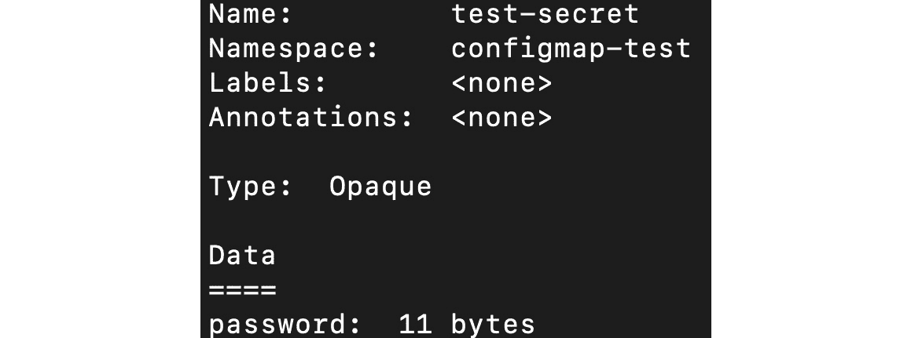
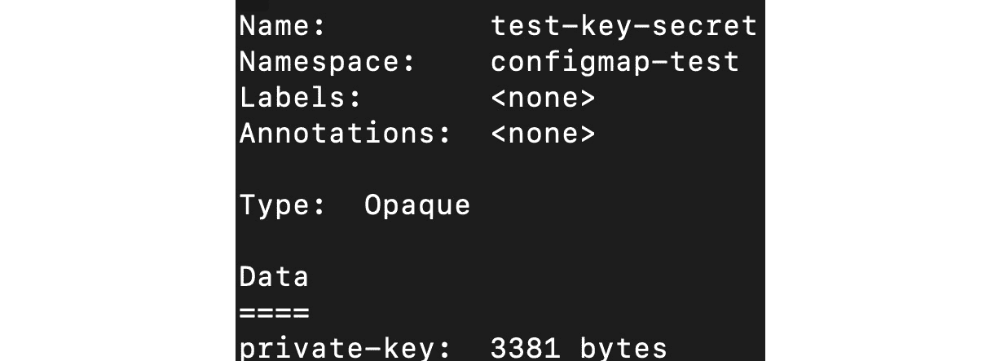
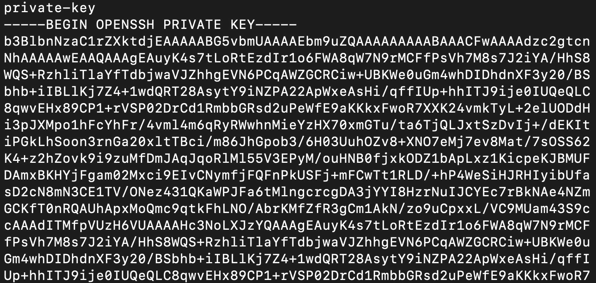

# 10。配置映射和机密

概观

在本章中，我们将学习如何将应用配置数据与应用本身分离，以及采用这种方法的优势。到本章结束时，您将能够定义 Kubernetes ConfigMap 和 Secret 对象，运行一个使用 ConfigMap 和 Secrets 数据的简单 Pod，描述将配置数据与应用分离的优点，并使用 config map 和 Secrets 将应用配置数据与应用容器分离。

# 简介

在*第 5 章*、*POD*中，我们了解到POD是Kubernetes部署的最小单位。Pods 可以有多个容器，每个容器可以有一个与之关联的容器映像。这个容器映像通常打包您计划运行的目标应用。一旦开发人员对代码按预期运行感到满意，下一步就是将代码提升到测试、集成和生产环境。

很简单，对吧？然而，一个问题是，当我们将打包的容器从一个环境移动到另一个环境时，尽管应用保持不变，但它需要特定于环境的数据，例如要连接的数据库 URL。为了克服这个问题，我们可以这样编写我们的应用:特定于环境的数据由应用被部署到的环境提供给应用。

在本章中，我们将发现 Kubernetes 提供了什么来将**特定于环境的数据**与我们的应用容器相关联，而不改变我们的容器映像。有多种方式向我们的应用提供**特定环境配置**数据:

1.  向 Pods 提供命令行参数。
2.  向 Pods 提供环境变量。
3.  在容器中装入配置文件。

首先，我们需要使用名为 **ConfigMap** 的对象来定义我们的配置数据。一旦数据被定义并加载到 Kubernetes 中，第二步就是向应用提供定义的数据。

但是，如果您有想要提供给应用容器的敏感数据，如数据库密码，该怎么办？Kubernetes **Secret** 提供了一种为应用定义敏感数据的方法。

配置映射和秘密对象都有类似的用途。两者都提供了一种方法来定义可以注入到应用中的数据，以便可以在不同的环境中使用同一个容器。它们之间没有什么区别，我们将在本章后面详细学习。作为一个快速规则，机密旨在保存机密数据(如密码、私钥等)，而配置映射更适合一般配置数据，如数据库位置。配置映射和机密位于创建它们的特定命名空间中。它们只能由驻留在同一命名空间中的 Pods 引用。

Kubernetes 使用名为 **etcd** 的内部键值存储作为其数据库来存储在 Kubernetes 中定义的所有对象。由于配置映射和机密是 Kubernetes 对象，它们存储在内部键值存储中。

让我们先深入了解一下配置地图。

# 什么是配置图？

配置图允许我们定义与应用相关的数据。配置映射将应用数据从应用中分离出来，以便相同的应用可以跨不同的环境移植。它还提供了一种将定制数据从同一个容器映像注入到正在运行的服务中的方法。

可以通过文字值或从文件或目录中的所有文件创建配置映射。请注意，我们存储在配置映射中的主要数据用于非敏感配置，例如配置文件或环境变量。

一旦定义了配置映射，它将通过环境变量或一组文件加载到应用中。然后，应用可以将文件视为本地文件，并可以从中读取。需要注意的是(从 Kubernetes 的 1.9.6 版本开始)，从 ConfigMaps 加载的文件是只读的。配置映射还可以保存系统应用(如操作员和控制器)的配置数据。

在下面的练习中，您将看到定义配置映射的不同方式，以及使配置映射数据对正在运行的 Pods 可用的不同方式。

让我们看看 Kubernetes 在配置映射创建方面为我们提供了什么。Kubernetes 帮助命令提供了一个很好的起点:

```
kubectl create configmap --help
```

您应该会看到以下响应:


图 10.1:用于创建配置图的 Kubernetes 内置帮助

从前面的输出可以看出，可以为单个值、值列表或整个文件或目录创建配置映射。在本章的练习中，我们将确切地学习如何做到这些。请注意，创建配置映射的命令具有以下格式:

```
kubectl create configmap <map-name> <data-source>
```

这里，`<map-name>`是要分配给配置图的名称，`<data-source>`是从中提取数据的目录、文件或文字值。

数据源对应于配置映射中的键值对，其中:

*   **键**是您在命令行中提供的文件名或键
*   **值**是您在命令行中提供的文件内容或文字值

在我们开始练习之前，让我们确保您已经运行了 Kubernetes，并且您可以向它发出命令。我们将使用 minikube 在您的本地计算机上轻松运行单节点集群。

使用以下命令启动 minikube:

```
minikube start
```

minikube 启动时，您应该会看到以下响应:


图 10.2:启动 minikube

对于本章中的所有练习，我们建议创建一个新的名称空间。回想一下第 5 章、 *Pods* ，名称空间是 Kubernetes 将解决方案的组件组合在一起的方式。名称空间可以用来应用策略、配额，如果不同的团队使用相同的 Kubernetes 资源，也可以用来分离资源。

在下面的练习中，我们将使用 kubectl 命令行界面命令从文字值创建一个配置映射。这个想法是，我们有一些配置数据(例如，主数据库名称)，我们可以注入到例如 MySQL Pod 中，它将根据给定的环境变量创建数据库。这组命令也可以用在负责跨多个环境部署应用的自动化代码管道中。

## 练习 10.01:从文字值创建配置图，并使用环境变量将其安装在 Pod 上

在本练习中，我们将在 Kubernetes 集群中创建一个配置映射。本练习展示了如何使用键值模式创建配置映射。请按照以下步骤完成练习:

1.  First, let's begin by creating a namespace for all of the exercises in this chapter.

    ```
    kubectl create namespace configmap-test
    ```

    您应该会看到这样的响应:

    ```
    namespace/configmap-test created
    ```

    注意

    除非另有说明，否则我们将在本章的所有练习中使用`configmap-test`名称空间。

2.  First, let's create a ConfigMap that contains a single name-value pair. Use the command shown here:

    ```
    kubectl create configmap singlevalue-map --from-literal=partner-url=https://www.auppost.com.au --namespace configmap-test 
    ```

    您应该会在终端中看到以下输出:

    ```
    configmap/singlevalue-map created
    ```

3.  Once we create the ConfigMap, let's confirm that it is created by issuing a command to get all the ConfigMaps in the namespace:

    ```
    kubectl get configmaps --namespace configmap-test
    ```

    由于`singlevalue-map`是`configmap-test`命名空间中唯一的配置映射，您应该会看到类似如下的输出:

    ```
    NAME                 DATA     AGE
    singlevalue-map      1        111s
    ```

4.  Let's see what the Kubernetes ConfigMap object looks like. Enter the Kubernetes `get` command as follows:

    ```
    kubectl get configmap singlevalue-map -o yaml --namespace configmap-test
    ```

    完整的对象应该这样描述:

    

    图 10.3:描述单值映射

    正如您在前面输出的第三行中看到的，配置映射被创建，我们输入的文字值在配置映射的`data`部分作为键值对可用。

5.  Now, we will create a YAML file named `configmap-as-env.yaml` to create a Pod into which we will inject fields from our ConfigMap as an environment variable. Using your favorite text editor, create a YAML file with the following content:

    ```
    apiVersion: v1
    kind: Pod
    metadata:
      name: configmap-env-pod
    spec:
      containers:
        - name: configmap-container
          image: k8s.gcr.io/busybox
          command: [ "/bin/sh", "-c", "env" ]
          envFrom:
          - configMapRef:
              name: singlevalue-map
    ```

    您可以看到前面文件中的`envFrom`部分正在从配置图中加载数据。

6.  Let's create a Pod from the preceding specification. This Pod is using the **busybox** container image, which runs the command specified in the `command` section of the YAML file mentioned in the previous step:

    ```
    kubectl create -f configmap-as-env.yaml --namespace configmap-test
    ```

    您应该会看到如下输出:

    ```
    pod/configmap-env-pod created
    ```

7.  Let's check the logs for this Pod using the following command:

    ```
    kubectl logs -f configmap-env-pod --namespace configmap-test
    ```

    您应该会看到如下所示的日志:

    

图 10.4:获取 configmap-env-pod 的日志

`[ "/bin/sh", "-c", "env" ]`命令将显示装载到 Pod 中的所有环境变量。在配置图中，我们将属性名定义为`partner-url`，这是输出的一部分。

在本练习中，环境变量`partner-url`的名称与我们的键值对中的键相同。我们还可以使环境变量的名称不同于密钥。例如，如果我们希望将`partner-server-location`作为环境变量的名称，我们可以用以下内容替换练习中 YAML 文件的内容:

```
apiVersion: v1
kind: Pod
metadata:
  name: configmap-multi-env-pod
spec:
  containers:
    - name: configmap-container
      image: k8s.gcr.io/busybox
      command: [ "/bin/sh", "-c", "echo $(partner-server-location)"         ]
      env:
        - name: partner-server-location
          valueFrom:
            configMapKeyRef:
              name: singlevalue-map
              key: partner-url
```

特别注意前面 YAML 文件中的`env`部分。`env`后的第一个`name`字段定义了环境变量的名称，`configMapKeyRef`下的`key`字段定义了配置图中键的名称。

## 从文件中定义阿宁配置图，并将其加载到 Pod 上

在本节中，我们将从一个文件创建一个配置映射，然后将该文件加载到应用窗格中。如前所述，这个新装载的文件将作为本地文件被运行在 Pod 内部的应用访问。

当应用将其配置数据存储在外部时，这种情况很常见，这样可以更容易地进行升级，并且可以跨不同环境对容器映像进行修补。我们的源代码管理存储库中可以有这样一个文件，我们使用 ConfigMap 将正确的文件加载到正确的容器中。

让我们通过一个例子来理解这一点。假设您已经编写了一个 web 应用，它连接到一个数据库来存储信息。当您在开发环境中部署应用时，您将希望连接到开发数据库。一旦您确信应用工作正常，您将希望将应用部署到测试环境中。由于应用被打包在一个容器中，所以您不希望更改容器来将应用部署到测试环境中。但是要在测试环境中运行应用，您需要连接到不同的数据库。一个简单的解决方案是，您将应用配置为从文件中读取数据库服务器 URL，并且可以通过 ConfigMap 装载该文件。这样，文件不会被打包为容器的一部分，而是通过 Kubernetes 从外部注入；因此，您不需要修改您的容器化应用。另一个用例是，外部软件供应商可以提供一个容器映像，任何特定的配置设置都可以根据特定客户端的要求安装在映像上。

## 练习 10.02:从文件创建配置图

在本练习中，我们将从一个文件创建一个配置映射，该文件可以在以后装载到任何 Pods 上:

1.  首先，创建一个名为`application.properties`的文件，其中包含以下配置细节。您可以使用您喜欢的文本编辑器:

    ```
    partner-url=https://www.fedex.com
    partner-key=1234
    ```

2.  Now, create a ConfigMap from the file using the following command:

    ```
    kubectl create configmap full-file-map --from-file=./application.properties --namespace configmap-test
    ```

    您应该会看到以下输出，表明已经创建了配置映射:

    ```
    configmap/full-file-map created
    ```

3.  Get the list of all ConfigMaps to confirm that our ConfigMap has been created:

    ```
    kubectl get configmaps --namespace configmap-test
    ```

    您应该会看到所有配置映射的列表，如下所示:

    ```
    NAME               DATA      AGE
    full-file-map      1         109m
    singlevalue-map    1         127m
    ```

    您可以看到配置映射的名称显示在它们拥有的键的数量旁边。

    你可能会想，为什么这个输出只显示一个键，即使我们已经添加了两个键？让我们在下一步中了解这一点。

4.  Let's see how the ConfigMap is being stored by using the following command:

    ```
    kubectl get configmap full-file-map -o yaml --namespace configmap-test
    ```

    您应该会看到以下输出:

    

    图 10.5:获取完整文件映射的细节

    请注意，文件名称`application.properties`成为`data`部分下的**键**，整个文件有效载荷是该键的**值**。

5.  Now that we have defined our ConfigMap, the next step is to mount it onto a container. Create a YAML file named `mount-configmap-as-volume.yaml` to be used as our Pod configuration using the following content:

    ```
    apiVersion: v1
    kind: Pod
    metadata:
      name: configmap-test-pod
    spec:
      containers:
        - name: configmap-container
          image: k8s.gcr.io/busybox
          command: [ "/bin/sh", "-c", "ls /etc/appconfig/" ]
          volumeMounts:
          - name: config-volume
            mountPath: /etc/appconfig
      volumes:
        - name: config-volume
          configMap:
            # Provide the name of the ConfigMap containing the           files you want
            # to add to the container
            name: full-file-map
      restartPolicy: Never
    ```

    首先，让我们关注前面文件中的`volumes`部分。在本节中，我们将指导 Kubernetes 从名为`full-file-map`的配置图中定义一个卷。

    其次，在`volumeMounts`部分，我们定义 Kubernetes 应该在`/etc/appconfig`目录中挂载卷。

    请注意，容器中的`command`字段允许我们配置希望容器在启动时执行什么命令。在这个例子中，我们正在运行`ls`命令，这是一个列出目录内容的 Linux 命令。这类似于 Windows 的`dir`命令。这将打印目录`/etc/appconfig`的内容，我们已经在其中安装了配置映射。

    注意

    `volume`和`volumeMounts`部分下的`name`字段必须相同，以便Kubernetes可以识别哪个`volume`与哪个`volumeMounts`相关联。

6.  Now, use the following command to start a Pod using the YAML file we just created:

    ```
    kubectl create -f mount-configmap-as-volume.yaml --namespace configmap-test
    ```

    您应该会得到一个回复，说 Pod 已经创建:

    ```
    pod/configmap-test-pod created
    ```

7.  The YAML file we used specifies the name of the Pod as `configmap-test-pod` and configures it to just display the content of the folder. To verify this, just issue the following command to get the output logs of the Pod:

    ```
    kubectl logs -f configmap-test-pod --namespace configmap-test
    ```

    这应该打印`application.properties`，这是我们放在文件夹里的文件:

    ```
    application.properties
    ```

    如您所见，我们得到了`/etc/appconfig`的内容，这是 Pod 中`ls`命令的输出。

您刚刚成功定义了一个配置映射，并将其作为一个文件装载到打印文件名的 Pod 中。

## 练习 10.03:从文件夹创建配置图

在本练习中，我们将把文件夹中的所有文件作为配置图加载。每个文件名都成为配置映射的一个键，当您挂载它时，所有文件都将挂载在`volumeMounts`位置(如容器的 YAML 文件中所定义的):

1.  Create two files in a new folder. Name one of them `fileone.txt`, with its contents as `file one`, and name the other `filetwo.txt`, with its contents as `file two`. The folder name can be anything for this exercise. You can confirm that the files have been created using the `ls` command:

    ```
    ls
    ```

    您将看到以下文件列表:

    ```
    fileone.txt     filetwo.txt
    ```

2.  Use the following command to create ConfigMap from a folder. Note that instead of specifying the filename, we just mentioned the name of the folder:

    ```
    kubectl create configmap map-from-folder --from-file=./ -n configmap-test
    ```

    您应该会看到以下响应:

    ```
    configmap/map-from-folder created
    ```

3.  Now, let's describe the ConfigMap to see what it contains:

    ```
    kubectl describe configmap map-from-folder -n configmap-test
    ```

    您应该会看到以下输出:

    

图 10.6:描述文件夹映射配置映射

请注意，配置图中有两个键——每个文件一个键，即`fileone.txt`和`filetwo.txt`。键值是文件的内容。因此，我们可以看到可以从一个文件夹中的所有文件创建一个配置映射。

# 什么是秘密？

配置映射提供了一种将应用配置数据与应用本身分离的方法。但是，ConfigMap 的问题在于，它将数据以纯文本形式存储为 Kubernetes 对象。如果我们想存储一些**敏感数据**比如数据库密码呢？Kubernetes Secret 提供了一种存储敏感数据的方法，这些数据可以提供给需要它的应用。

## 秘密对配置映射

您可以将秘密视为与配置映射相同，但有以下区别:

1.  与配置映射不同，机密旨在存储少量(1 兆字节为机密)敏感数据。一个秘密是 **base64** 编码的，所以我们不能认为它是安全的。它还可以存储二进制数据，如公钥或私钥。
2.  Kubernetes ensures that Secrets are passed only to the nodes that are running the Pods that need the respective Secrets.

    注意

    存储敏感数据的另一种方法是保管库解决方案，例如 HashiCorp 保管库。我们将此类实施排除在研讨会范围之外。

但是等待；如果 Kubernetes Secrets 由于 base64 编码不够安全，那么存储极其敏感数据的解决方案是什么？一种方法是将其加密，然后存储在 Secrets 中。数据可以在加载到 Pod 时被解密，尽管我们将这个实现排除在这个研讨会的范围之外。

一旦我们定义了我们的秘密，我们就需要向应用 Pods 公开它们。我们向正在运行的应用公开机密的方式与配置映射相同，即通过将它们作为环境变量或文件挂载。

至于配置地图，让我们使用`secret`的内置`help`命令来查看 Kubernetes 提供了哪些类型的机密:

```
kubectl create secret --help
```

`help`命令应显示以下内容:


图 10.7:秘密的内置帮助命令的输出

如您在前面的输出中所见，`Available Commands`部分列出了三种类型的秘密:

*   `generic`:通用密码保存任何自定义的键值对。
*   `tls`:TLS 秘密是一种特殊的秘密，用于保存使用 TLS 协议进行通信的公钥-私钥对。
*   `docker-registry`:这是一种特殊的秘密，存储用户名、密码和电子邮件地址以访问 Docker 注册表。

在接下来的练习中，我们将深入探讨这些秘密的实现和使用。

## 练习 10.04:从文字值定义一个秘密，并将该值作为环境变量加载到 Pod 上

在本练习中，我们将从文字值定义一个秘密，并将其作为环境变量加载到 Kubernetes 上运行的 Pod 中。这个文字值可能类似于内部数据库的密码。由于我们是从一个文字值创建这个秘密的，它将被归类为一个通用的秘密。按照以下步骤进行练习:

1.  First, create a Secret that will hold a simple password by using the following command:

    ```
    kubectl create secret generic test-secret --from-literal=password=secretvalue --namespace configmap-test
    ```

    您应该会得到如下回复:

    ```
    secret/test-secret created
    ```

2.  Once we define our Secret, we can use the Kubernetes `describe` command to obtain more details about it:

    ```
    kubectl describe secret test-secret --namespace configmap-test
    ```

    

    图 10.8:描述测试秘密

    你可以看到它根据`password`键存储了我们的值:

3.  Now that our Secret is created, we will mount it as an environment variable in a Pod. To create a Pod, make a YAML file named `mount-secret-as-env.yaml` with the following content:

    ```
    apiVersion: v1
    kind: Pod
    metadata:
      name: secret-env-pod
    spec:
      containers:
        - name: secret-container
          image: k8s.gcr.io/busybox
          command: [ "/bin/sh", "-c", "env" ]
          envFrom:
          - secretRef:
              name: test-secret
    ```

    请注意`envFrom`部分，其中提到了要加载的秘密。在容器的`command`部分，我们指定`env`命令，该命令将使容器显示加载到 Pod 中的所有环境变量。

4.  Now, let's use the YAML configuration to create a Pod and see it in action:

    ```
    kubectl create -f mount-secret-as-env.yaml --namespace=configmap-test
    ```

    您应该会看到如下响应:

    ```
    pod/secret-env-pod created
    ```

5.  Now, let's get the logs for the Pod to see all the environment variables displayed by our container:

    ```
    kubectl logs -f secret-env-pod --namespace=configmap-test
    ```

    您应该会看到类似于下面截图的日志:

    

图 10.9:从秘密环境舱获取日志

如您在前面输出的高亮行中所见，`password`键显示为`secretvalue`，这是我们指定的值。

下面的练习演示了如何使用公钥-私钥组合并将私钥文件装入 Pod。然后，连接到此 Pod 的任何其他服务都可以使用公钥，但这在本练习中没有演示。使用一个单独的文件作为秘密使我们能够使用任何类型的文件，而不是简单的键值字符串。这为使用像私钥存储这样的二进制文件提供了可能性。

## 练习 10.05:从文件中定义一个秘密，并将值作为文件加载到窗格中

在这个练习中，我们将创建一个私钥，将其存储在一个新的 Secret 中，然后将其作为文件加载到 Pod 上:

1.  First, let's create a private key. We will use a tool used to create SSH keys. Enter the following command in the terminal:

    ```
    ssh-keygen -f ~/test_rsa -t rsa -b 4096 -C "test@example.com"
    ```

    如果出现提示，请不要为密钥提供任何密码。

    注意

    如果您需要更多关于 SSH 协议及其使用的信息，请参考[https://www.ssh.com/ssh/protocol/](https://www.ssh.com/ssh/protocol/)。

    成功执行后，您将看到两个名为`test_rsa`和`test_rsa.pub`的文件。您应该会看到类似如下所示的输出:

    

    图 10.10:创建 SSH 密钥

    您的输出可能与此处显示的不完全相同，因为密钥是随机的。

    注意

    大多数 Linux 发行版都包含`ssh-keygen`工具。但是，如果您没有或不能使用`ssh-keygen`，您可以使用任何其他文件而不是私钥来继续本练习。

2.  Now, let's load the newly created private key as a Secret. This time, we will use the `from-file` argument of the `create secret` command:

    ```
    kubectl create secret generic test-key-secret --from-file=private-key=/Users/faisalmassod/test_rsa --namespace=configmap-test
    ```

    你应该得到这样的回答:

    ```
    secret/test-key-secret created
    ```

3.  Once the Secret is created, we can get its details using the `describe` command:

    ```
    kubectl describe secret test-key-secret --namespace=configmap-test
    ```

    秘密应该描述如下:

    

    图 10.11:描述测试密钥秘密

4.  Now that our Secret is created, let's mount it onto a Pod. The process is similar to mounting a ConfigMap. First, create a YAML file named `mount-secret-as-volume.yaml` with the following content:

    ```
    apiVersion: v1
    kind: Pod
    metadata:
      name: secret-test-pod
    spec:
      containers:
        - name: secret-container
          image: k8s.gcr.io/busybox
          command: [ "/bin/sh", "-c", "ls /etc/appconfig/; cat         /etc/appconfig/private-key" ]
          volumeMounts:
          - name: secret-volume
            mountPath: /etc/appconfig
      volumes:
        - name: secret-volume
          secret:
            # Provide the name of the Secret containing the files           you want
            # to add to the container
            secretName: test-key-secret
    ```

    在前面的 Pod 规范中，请注意`volumes`的安装方式与我们安装早期配置图的方式相同。在“卷”部分，我们指示 Kubernetes 从我们的“秘密”中定义一个卷。在`volumeMounts`部分，我们定义了 Kubernetes 应该挂载卷的具体路径。`"/bin/sh", "-c", "ls /etc/appconfig/; cat /etc/appconfig/private-key"`命令将把加载到它上面的文件内容打印为机密。

    注意

    `volume`和`volumeMounts`部分中的`name`字段必须相同，以便Kubernetes可以识别哪个`volume`与哪个`volumeMounts`相关联。对于这个例子，我们在两个地方都使用了`secret-volume`作为名称。

5.  Now, let's create a Pod using the YAML file as the Pod definition using the following command:

    ```
    kubectl create -f mount-secret-as-volume.yaml --namespace=configmap-test
    ```

    如果 Pod 创建成功，您应该会看到以下输出:

    ```
    pod/secret-test-pod created
    ```

6.  To check whether our Pod has the Secret loaded, we can get its logs and examine them. Use the following command:

    ```
    kubectl logs -f secret-test-pod --namespace=configmap-test
    ```

    日志应该显示私钥的内容，如下所示:

    

    图 10.12:获取秘密测试舱的日志

    从日志中可以看到，容器正在显示装载在 Pod 上的机密的内容。

    注意

    由于 SSH 密钥是随机的，您的输出可能看起来与这里显示的不完全相同。

7.  The SSH key is randomized, so each time you will get a different output. You can try this exercise multiple times and see for yourself. Make sure to either delete the Pod or change the name every time. You can delete the Pod using the following command:

    ```
    kubectl delete pod secret-test-pod --namespace=configmap-test
    ```

    如果成功删除 Pod，您将看到以下输出:

    ```
    pod "secret-test-pod" deleted
    ```

在本练习中，我们使用另一个工具创建了一个密钥对，并通过将其装载为二进制文件将私钥加载到我们的 Pod 中。然而，在 TLS 协议中，公钥-私钥对用于加密，TLS 协议是保护网络流量的加密标准。

注意

要了解更多关于 TLS 的信息，请参考[https://www . cloud flare . com/learning/SSL/transport-layer-security-TLS/](https://www.cloudflare.com/learning/ssl/transport-layer-security-tls/)。

Kubernetes 为 TLS 提供了自己的创建密钥对和存储密钥的方法。让我们看看如何在下面的练习中创建一个 TLS 秘密。

## 练习 10.06:创建一个 T LS 秘密

在本练习中，我们将了解如何创建一个可以存储顶级域名加密密钥的秘密:

1.  Use the following command to create a pair of private-public keys:

    ```
    openssl req -x509 -nodes -days 365 -newkey rsa:2048 -keyout tls.key -out tls.crt -subj "/CN=kube.example.com"
    ```

    该命令在名为`tls.key`的文件中创建私钥，在名为`tls.crt`的文件中创建公钥。

    注意

    更多关于 **openssl** 工具的使用细节，可以参考[https://www.openssl.org/docs/manmaster/man1/req.html](https://www.openssl.org/docs/manmaster/man1/req.html)。

    如果密钥成功生成，您应该会看到如下输出:

    

    图 10.13:创建 SSL 密钥

2.  Once it is successful, we can create a Secret to hold the files using the following command:

    ```
    kubectl create secret tls test-tls --key="tls.key" --cert="tls.crt" --namespace=configmap-test
    ```

    一旦秘密成功创建，您将看到以下输出:

    ```
    secret/test-tls created
    ```

3.  Verify that our Secret is created by listing down all Secrets in the `configmap-test` namespace using the following command:

    ```
    kubectl get secrets --namespace configmap-test
    ```

    我们的秘密必须在以下输出中列出:

    

    图 10.14:列出 configmap-test 中的所有秘密

4.  If we issue the `describe` command for the newly created Secret, you can see that it stores the two parts, the public and the private key, as two different keys of the Secret:

    ```
    kubectl describe secrets test-tls --namespace configmap-test
    ```

    您应该会看到以下响应:

    

图 10.15:描述测试 tls

因此，我们使用 Kubernetes 提供的一组特殊命令为 TLS 创建了一组公共-私有密钥。该秘密可以通过类似于*练习 10.05* 、*中演示的方式从文件中定义一个秘密并将值作为文件加载到 Pod 上*中。

另一个常见的任务是从外部 Docker 注册表中获取 Docker 映像。许多组织在其应用中使用**企业容器注册中心**(例如，Nexus)，然后可以根据需要获取和部署这些注册中心。Kubernetes 还提供了一种特殊类型的 Secret 来存储访问这些 Docker 注册表的身份验证信息。让我们看看如何在下面的练习中实现它。

## 练习 10.07: 创建码头工人-注册秘密

在本练习中，我们将创建一个 **docker-registry** Secret，该 Secret 可用于在从注册表中获取 docker 映像时进行身份验证:

1.  We can create the Secret directly using the following command:

    ```
    kubectl create secret docker-registry test-docker-registry-secret --docker-username=test --docker-password=testpassword --docker-email=example@a.com --namespace configmap-test
    ```

    正如您在命令参数中看到的，我们需要为 Docker 帐户指定用户名、密码和电子邮件地址。创建秘密后，您应该会看到以下响应:

    ```
    secret/test-docker-registry-secret created
    ```

2.  Verify that it is created by using this command:

    ```
    kubectl get secrets test-docker-registry-secret --namespace configmap-test
    ```

    您应该会看到`test-docker-registry-secret`，如下图所示:

    

    图 10.16:检查测试-摘要-注册表-机密

3.  Let's use the `describe` command and get more details about our Secret:

    ```
    kubectl describe secrets test-docker-registry-secret --namespace configmap-test
    ```

    该命令应返回以下详细信息:

    

图 10.17:描述测试-摘要-注册-秘密

正如您在前面输出的`Data`部分所看到的，已经创建了一个名为`.dockerconfigjson`的单键。

注意

这个练习只是一个加载`.dockerconfigjson`文件的简单方法。您可以使用其他方法手动创建和加载文件，并实现与本练习中相同的目标。

## 活动 10.01:使用配置图和秘密在不同阶段提升应用

让我们假设我们有一个应用，我们希望将其推广到不同的环境。您的任务是将应用从测试环境提升到生产环境，每个环境都有不同的配置数据。

在本练习中，我们将使用 ConfigMap 和 Secret 为应用生命周期的不同阶段轻松地重新配置应用。它还应该让您了解从应用中分离 ConfigMap 数据和 Secret 数据如何有助于应用在开发和部署的各个阶段更轻松地过渡。

这些指导方针应该有助于您完成活动:

1.  定义一个名为`my-app-test`的命名空间。
2.  在`my-app-test`命名空间中定义一个名为`my-app-data`的配置映射，其键值如下:

    ```
    external-system-location=https://testvendor.example.com
    external-system-basic-auth-username=user123
    ```

3.  在`my-app-test`命名空间中用以下键值定义一个名为`my-app-secret`的秘密:

    ```
    external-system-basic-auth-password=password123
    ```

4.  定义 Pod 规范，并在文件名为`application-data.properties`的`/etc/app-data`文件夹中部署配置图。
5.  定义 Pod 规范，并在文件名为`application-secure.properties`的`/etc/secure-data`文件夹中部署秘密。
6.  Run the Pod so that it displays all the contents from the ConfigMap and the Secret. You should see something like this:

    

    图 10.18:测试环境的关键值

7.  定义另一个名为`my-app-production`的命名空间。
8.  在`my-app-production`中定义一个名为`my-app-data`的配置图，其键值如下:

    ```
    external-system-location=https://vendor.example.com
    external-system-basic-auth-username=activityapplicationuser
    ```

9.  在`my-app-production`中定义一个名为`my-app-secret`的秘密，其键值如下:

    ```
    external-system-basic-auth-password=A#4b*(1=B88%tFr3
    ```

10.  使用与*步骤 5* 中定义的相同的 Pod 规范，并在`my-app-production`命名空间中运行 Pod。
11.  Check whether the application running in `my-app-production` displays the correct data. You should see output like this:

    

图 10.19:生产环境的关键值

注意

该活动的解决方案可在以下地址找到:[https://packt.live/304PEoD](https://packt.live/304PEoD)。GitHub 存储库还包括一个用于该活动的 Bash 脚本，它将自动执行所有这些解决方案步骤。但是，请查看解决方案中提供的详细步骤，以全面了解如何执行该活动。

# 总结

在这一章中，我们已经看到了 Kubernetes 提供的将特定于环境的数据与作为容器运行的应用相关联的不同方式。

Kubernetes 提供了将敏感数据存储为机密和将普通应用数据存储为配置映射的方法。我们还看到了如何创建配置映射和机密，并通过命令行界面将它们与我们的容器相关联。通过命令行运行一切将促进这些步骤的自动化，并提高应用的整体敏捷性。

将数据与容器相关联使我们能够在信息技术系统的不同环境中使用同一个容器(例如，在测试和生产中)。跨不同环境使用相同的容器为 IT 流程提供了一种安全可信的代码提升技术。每个团队可以使用一个容器作为部署单元，并对容器进行签名，以便其他各方可以信任该容器。这也提供了一种可信的方式，不仅在相同的 IT 组织之间，而且在多个组织之间分发代码。例如，软件供应商可以为您提供一个作为打包软件的容器。然后，可以使用配置映射和机密为在您的组织中使用打包软件提供特定的配置。

下一组章节是关于部署 Kubernetes 并在高可用性模式下运行它。这些章节将为您提供关于如何为 Kubernetes 运行稳定集群的基础和实用知识。