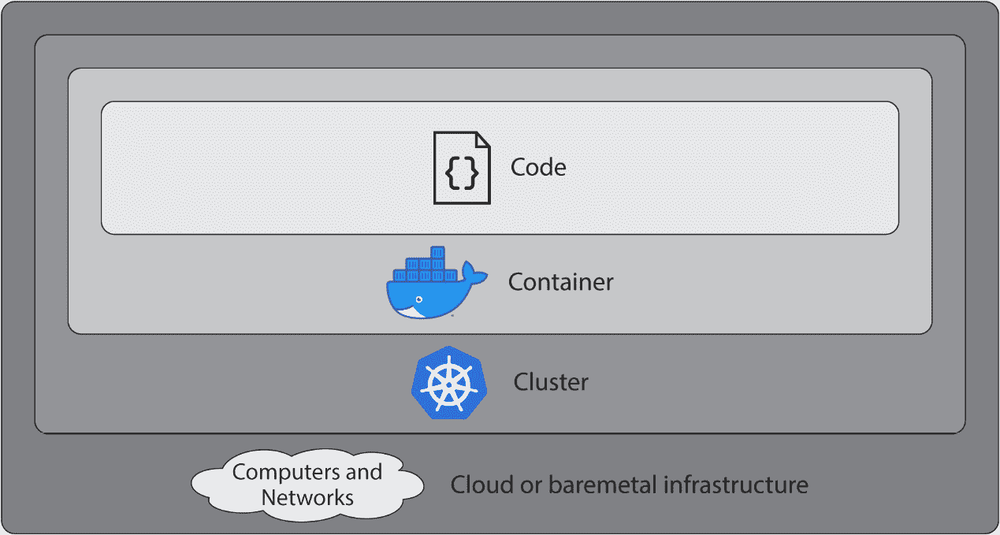
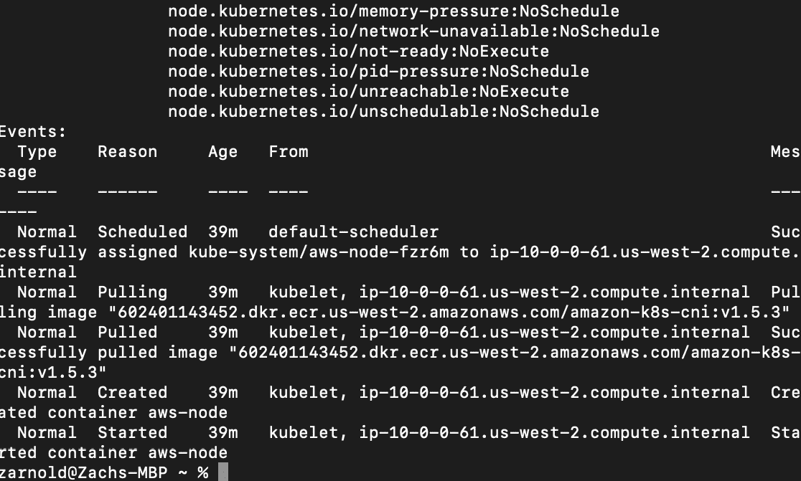
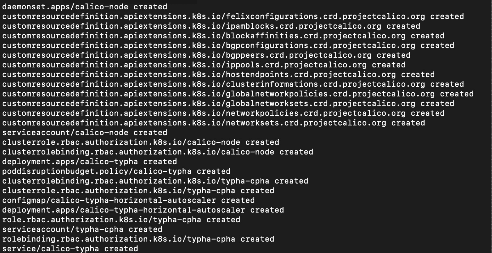

# 13。Kubernetes 中的运行时和网络安全

概观

在本章中，我们将了解各种可以用来保护集群中运行的工作负载的资源。我们还将了解一个粗略的威胁模型，并将其应用于构建一个安全的集群，这样我们就可以保护我们的集群和应用免受各种类型的威胁。到本章结束时，您将能够创建角色和集群角色，以及角色绑定和集群角色绑定，以控制任何进程或用户对 Kubernetes API 服务器和对象的访问。然后，您将学习如何创建网络策略来限制应用和数据库之间的通信。您还将学习如何创建一个 PodSecurityPolicy，以确保应用的运行组件符合定义的限制。

# 简介

在最后几章中，我们戴上了 DevOps 的帽子，学习了如何建立集群，以及如何在 Kubernetes 中安全、无停机地推出新的应用版本。

现在，是时候转换一下话题，摘掉我们的 DevOps 帽子，戴上我们的安全分析师帽子了。首先，我们将看看有人可能会在哪里攻击我们的 Kubernetes 集群，以及未经授权的用户可能会如何对我们的集群造成严重破坏。之后，我们将介绍 Kubernetes 的一些安全原语，以及如何对抗最常见的攻击形式。最后，我们将进一步修改我们的应用，并演示一些安全原语是如何工作的。

但是在开始之前，让我们先简单了解一下现代 web 应用中的各种安全问题，以及为我们的集群实现有效安全的基本范例。我们将从研究我们所说的“云原生安全的 4Cs”开始

# 威胁建模

充分教授许多必要的安全规程，以便您对现代工作负载安全应该如何实施和协调有一个严格的理解，这远远超出了本章的范围。然而，我们将简要地了解我们应该如何思考这个问题。威胁建模是一门研究我们的应用可能遭受攻击或未经授权使用的各个领域的学科。

例如，考虑一个 HTTP 网络服务器。它通常会暴露端口 80 和 443 来服务网络流量，但它也是任何潜在攻击者的入口点。它可能在某个端口暴露了一个 web 管理控制台。它可能会打开某些其他管理端口和应用编程接口访问，以允许其他软件出于自动化目的对其进行管理。应用运行时可能需要定期处理敏感数据。旨在创建和交付应用的整个端到端管道可能会暴露各种易受攻击的点。由于暴力攻击日益复杂，应用所依赖的加密算法可能会遭到破坏或过时。所有这些都代表了我们的应用可能遭受攻击的各个领域。

组织我们应用的一些攻击向量的一个简单方法是记住首字母缩略词 **STRIDE** 。它代表以下类型的攻击:

*   **S**pool ing:用户或应用将自己伪装成其他人。
*   **T** 警告:在未征得相关利益方同意或未向其提供信息的情况下，更改任何数据。
*   **R** 解释:能够否认你参与了自己的行为和/或缺乏追踪特定用户任何行为的能力。
*   **I** 信息泄露:泄露您不希望拥有的特权或敏感信息。
*   **D** 服务不足:用虚假请求淹没服务器，使其资源饱和，并拒绝其达到预期目的的能力。
*   **E** 特权相关:通过利用漏洞获得对受限资源或特权的访问。

黑客实施的许多攻击都是为了完成上述一项或多项任务，通常会危及我们数据的机密性、完整性和可用性。考虑到这一点，我们可以使用一个心理模型，来思考在现代云原生应用堆栈的各个部分中，我们的系统可能面临哪些威胁。这种心理模型被称为“云原生安全的 4Cs”，我们将使用它来组织我们对Kubernetes安全原语的探索。理想情况下，通过利用所有这些原语，这应该会让您对应用抵抗类似 STRIDE 的攻击有很好的信心，特别是在 Kubernetes 的环境中。

## 云原生安全的 4Cs

安全性可以而且应该被组织成层。这被认为是一种“深度防御”的安全方法，它被技术界广泛认为是防止任何单个组件泄露整个系统的最佳方法。谈到云原生应用，我们认为安全性分为四层:保护您的代码、容器、集群和云。下图显示了它们的组织方式。这有助于我们想象，如果妥协发生在较低的级别，它肯定会损害依赖于它的较高的级别:



图 13.1:云原生安全的 4Cs

由于本书关注的是 Kubernetes，我们将深入研究集群安全性，然后开始在示例应用中实现一些建议。

注意

其他 C 的建议，看看这个链接:[https://kubernetes.io/docs/concepts/security/overview/](https://kubernetes.io/docs/concepts/security/overview/)。

# C 光彩安全

考虑 Kubernetes 的一种方式是将其视为一个巨大的计算、网络和存储自我协调池。因此，在许多方面，Kubernetes*完全像一个云平台*。理解这种等价性是很重要的，因为这种精神抽象允许我们作为集群操作员和集群开发人员进行不同的推理。集群操作员希望确保集群的所有组件*都是安全的，并且能够抵御任何工作负载。集群开发人员会关心确保他们为 Kubernetes 定义的工作负载在集群中安全运行。*

 *在这里，您的工作变得简单了一点——Kubernetes 提供的大多数云提供商产品将为您确保 Kubernetes 控制平面的安全性。如果出于某种原因，您无法利用云提供商的产品，您可以通过以下链接阅读更多关于保护集群安全的文档:[https://kubernetes . io/docs/tasks/administrator-cluster/secure-a-cluster/](https://kubernetes.io/docs/tasks/administer-cluster/securing-a-cluster/)。

即使您正在使用云提供商的产品，仅仅因为他们保护您的控制平面并不意味着您的 Kubernetes 集群是安全的。您不能依赖云提供商安全性的原因是，您的应用、其容器或糟糕的策略实施可能会使您的基础架构非常容易受到攻击。因此，现在，我们需要讨论如何保护集群内的工作负载。

注意

Kubernetes 社区正在积极改进安全概念和实现。应该经常重新查看相关的 Kubernetes 文档，以确定是否已经进行了改进。

为了加强我们的内部集群安全性，我们需要了解以下三个概念:

*   **库本内斯 RBAC** :这是库本内斯的主要政策引擎。它定义了一个角色和权限系统，以及如何向这些角色授予权限。
*   **网络策略**:这些策略(取决于您的容器网络接口插件)充当 Pods 之间的“防火墙”。把它们想象成一个 Kubernetes 感知的网络访问控制列表。
*   **PodSecurityPolicies** :这些是在特定范围(命名空间、整个集群)定义的，并作为如何允许 Pod 在 Kubernetes 中运行的定义。

我们不会在 etcd 中涵盖加密 Kubernetes 机密，因为大多数云提供商要么为您处理，要么实现特定于该云提供商(如 AWS KMS)。

# 立方 RBC

在我们深入 RBAC 之前，回想一下*第 4 章*、*如何与Kubernetes(API 服务器)*通信，Kubernetes如何向 API 授权请求。我们了解到有三个阶段——身份验证、授权和授权控制。我们将在*第 16 章*、*库本内斯入场控制员*中了解更多入场控制员的信息。

Kubernetes 支持多种不同的集群身份验证方法，您可能希望参考云提供商的文档来获得关于其具体实现的更多细节。

授权逻辑是通过名为 **RBAC** 的东西来处理的。它代表**基于角色的访问控制**，它是我们如何将某些用户和组限制在执行其工作所需的最低权限的基础。这是基于软件安全中的一个概念，叫做“最小特权原则”例如，如果您是信用卡处理公司的软件工程师，**支付卡行业数据安全标准** ( **PCI DSS** )合规性要求您不应该访问生产集群和客户数据。因此，如果您对生产环境中的群集有访问权限，那么您应该拥有一个没有权限的角色。

RBAC 由集群管理员通过四个不同的 API 对象实现:**角色**、**角色绑定**、**集群角色**和**集群角色绑定**。让我们通过查看一个图表来看看它们是如何协同工作的:


图 13.2:不同的对象交互实现 RBAC

在这个图中，我们可以看到 Kubernetes `User` / `Group`和`ServiceAccount`对象通过绑定到一个`Role`或`ClusterRole`来获得权限。让我们分别理解这些对象。

## 角色

以下是角色的示例规格:

```
apiVersion: rbac.authorization.k8s.io/v1
kind: Role
metadata:
  namespace: default
  name: test-role
rules:
  - verbs:
      - "list"
    apiGroups:
      - ""
    resources:
      - "pods"
```

各个字段定义了角色应该拥有的权限:

*   `namespace`:角色的范围是在这个字段中定义的 Kubernetes 命名空间。这使得角色不同于集群角色，集群角色的权限适用于集群中的任何命名空间。
*   `verbs`:这些描述了我们允许哪些Kubernetes人的行为。常用动词的一些例子包括`get`、`list`、`watch`、`create`、`update`和`delete`。还有更多，但对于大多数用例来说，这些通常已经足够好了。关于这方面的复习，请参考*第四章**如何与库本内斯(API 服务器)*的*库本内斯 API* 部分。
*   `apiGroups`: These describe which Kubernetes API groups the Role will have access to. These are specified as `<group>/<version>` (such as `apps/v1`). If you use CustomResourceDefinitions, these API groups can be referenced here as well.

    注意

    与 Kubernetes 一起发货的 API 组的完整列表可以在这里找到(从 1.18 版本开始):[https://Kubernetes . io/docs/reference/generated/Kubernetes-API/v 1.18/](https://kubernetes.io/docs/reference/generated/kubernetes-api/v1.18/)。

*   `resources`:这些描述了我们正在谈论的是哪些 API 对象，由对象定义的`Kind`字段中的值定义；例如:`deployment`、`secret`、`configmap`、`pod`、`node`等。

## 卷接

如上图所示，角色绑定将角色绑定或关联到服务帐户、用户或用户组。以下是角色绑定的示例规范:

```
apiVersion: rbac.authorization.k8s.io/v1
kind: RoleBinding
metadata:
  name: test-role-binding
  namespace: default
roleRef:
  name: test-role
  kind: ClusterRole
  apiGroup: rbac.authorization.k8s.io
subjects:
  - kind: ServiceAccount
    name: test-sa
    namespace: default 
```

该规范定义了应该能够使用角色来执行在 Kubernetes 中需要授权的操作的主体:

*   `subjects`:这是指应该能够使用此角色的经过身份验证的服务帐户、用户或组。
*   `roleRef`:这是指他们可以承担的角色。

## 聚类角色

除了一个角色之外，集群角色在任何方面都与角色相同。它不是只在一个 Kubernetes 命名空间内授予权限，而是在集群范围内授予这组权限。

## 群集角色绑定

这与角色绑定相同，只是它必须绑定到集群角色，而不是角色。不能将集群角色绑定到角色，也不能将角色绑定到集群角色。

## 关于 RBAC 政策的一些重要注释

*   RBAC 政策文件只允许。这意味着，默认情况下，主体没有访问权限，只有通过角色绑定或集群角色绑定，它才能拥有相应角色或集群角色中规定的特定访问权限。
*   绑定是不可变的。这意味着，一旦将主体绑定到角色或集群角色，就不能再对其进行更改。这是为了防止权限升级。因此，实体可以被授予修改对象的权限(这对于许多用例来说已经足够好了)，同时防止它提升自己的特权。如果需要修改绑定，只需删除并重新创建即可。
*   可以创建其他集群角色的集群角色或角色最多只能授予相同的权限。否则，这将是一条清晰的权限提升路径。

## 服务帐户

在前面的章节中，当我们从 Minikube 和 Kops 的角度了解身份验证时，我们看到 Kubernetes 生成了我们使用的证书。在 EKS 的案例中，使用了 AWS IAM 角色和 AWS IAM 认证器。

事实证明，Kubernetes 有一种特殊的对象类型，允许集群内的资源通过 API 服务器进行身份验证。

我们可以使用 ServiceAccount 资源来允许 Pods 接收 Kubernetes 生成的令牌，它将传递给 API 服务器进行身份验证。所有官方的 Kubernetes 客户端库都支持这种类型的身份验证，因此它是从集群内部对 Kubernetes 集群进行编程访问的首选方法。

当您作为集群管理员运行时，您可以使用`kubectl`使用`--as`参数使用特定的服务帐户进行身份验证。对于前面显示的示例 ServiceAccount，它看起来像这样:

```
kubectl --as=system:serviceaccount:default:test-sa get pods
```

我们将学习这些对象如何协同工作，以便在下面的练习中控制访问。

## 练习 13.01:创建库本内斯·RBAC 集群角色

在本练习中，我们将创建一个集群角色和集群角色绑定。然后，我们将成为用户并继承他们的权限，如 ClusterRole 所定义的，并演示 Kubernetes 如何基于规则阻止对某些 API 的访问。让我们开始吧:

1.  To begin with, we will recreate the EKS cluster from the Terraform file we used in *Exercise 12.02*, *Creating a Cluster with EKS Using Terraform*. If you already have the `main.tf` file, you can work with it. Otherwise, you can run the following command to get it:

    ```
    curl -O https://raw.githubusercontent.com/PacktWorkshops/Kubernetes-Workshop/master/Chapter12/Exercise12.02/main.tf
    ```

    现在，依次使用以下两个命令来启动和运行集群资源:

    ```
    terraform init
    terraform apply
    ```

    注意

    执行这些练习后，如果您计划在很长一段时间后继续完成以下练习，最好取消分配集群资源以停止 AWS 计费。您可以使用`terraform destroy`命令来完成。然后，当您准备好进行锻炼或活动时，您可以运行这一步来使所有内容再次在线。

    如果任何练习或活动依赖于在前面练习中创建的对象，您也需要重新创建这些对象。

2.  现在，我们将为我们的 RBAC 资源创建三个 YAML 文件。第一个是 ServiceAccount，它允许我们拥有集群授予我们的身份和身份验证令牌。创建一个名为`sa.yaml`的文件，内容如下:

    ```
    apiVersion: v1
    kind: ServiceAccount
    metadata:
      name: test-sa
      namespace: default
    ```

3.  Next, we are going to create a ClusterRole object and assign it some permissions. Create a file called `cr.yaml` with the following content:

    ```
    apiVersion: rbac.authorization.k8s.io/v1
    kind: ClusterRole
    metadata:
      namespace: default
      name: test-sa-cluster-role
    rules:
      - verbs:
          - "list"
        apiGroups:
          - ""
        resources:
          - "pods"
    ```

    我们正在定义一个`ClusterRole`，它能够列出任何名称空间中的所有 Pods，但除此之外没有其他功能。

4.  Next, we are going to create a `ClusterRoleBinding` object that will bind the created ServiceAccount and ClusterRole. Create a file called `crb.yaml` with the following content:

    ```
    apiVersion: rbac.authorization.k8s.io/v1
    kind: ClusterRoleBinding
    metadata:
      name: test-sa-cluster-role-binding
      namespace: default
    roleRef:
      name: test-sa-cluster-role
      kind: ClusterRole
      apiGroup: rbac.authorization.k8s.io
    subjects:
      - kind: ServiceAccount
        name: test-sa
        namespace: default
    ```

    在这些文件中，我们定义了三个对象:一个`ServiceAccount`、一个`ClusterRole`和一个`ClusterRoleBinding`。

5.  Run the following command to create this RBAC policy, as well as our ServiceAccount:

    ```
    kubectl apply -f sa.yaml -f cr.yaml -f crb.yaml
    ```

    您应该会看到以下响应:

    

    图 13.3:创建服务帐户、集群角色和集群角色绑定

6.  In the following steps, we will demonstrate that using our service account's ClusterRole will prevent us from describing Pods. But before that, let's get a list of the Pods and prove that everything still works. Do this by running the following command:

    ```
    kubectl get pods --all-namespaces
    ```

    您应该会看到以下响应:

    

    图 13.4:获取 Pods 列表

7.  Now, let's describe the first Pod. The name of the first Pod here is `aws-node-fzr6m`. The `describe` command, in this case, would be as follows:

    ```
    kubectl describe pod -n kube-system aws-node-fzr6m
    ```

    请使用集群的 Pod 名称。您应该会看到类似以下内容的响应:

    

    图 13.5:描述 aws 节点 fzr6m POD

    前面的截图显示了`describe`命令输出的截断版本。

8.  Now, we will run the same commands we used previously, but this time pretending to be the user using the ServiceAccount that is currently bound to the ClusterRole and ClusterRoleBinding that we created. We'll do this by using the `--as` parameter with `kubectl`. Thus, the command will look like this:

    ```
    kubectl --as=system:serviceaccount:default:test-sa get pods --all-namespaces
    ```

    请注意，我们可以承担集群角色，因为我们是创建的集群中的管理员。您应该会看到以下响应:

    

    图 13.6:在假设测试服务帐户的情况下获取 Pods 列表

    果然，那还管用。大家可能还记得*第 3 步*中，我们提到了`list`作为一个允许动词，它是用来获取某一类所有资源的列表。

9.  Now, let's see what happens if a user with the ClusterRole we created attempts to describe a Pod:

    ```
    kubectl --as=system:serviceaccount:default:test-sa describe pod -n kube-system aws-node-fzr6m
    ```

    您应该会看到以下响应:

    

图 13.7:禁止的错误

kubectl `describe`命令使用`get`动词。回想一下*第 3 步*中，它不在我们集群角色的动词允许列表中。

如果这是一个用户(或黑客)试图使用任何不允许他们使用的命令，我们会成功阻止它。在 Kubernetes 文档网站上有许多实用的 RBAC 示例。在库本内斯谈论 RBAC 的所有设计模式超出了本章的范围。我们所能说的是:只要有可能，您应该实践“最小特权原则”来限制对 Kubernetes API 服务器的不必要的访问。也就是说，每个人都应该获得完成工作所需的最低访问级别；不是每个人都需要成为集群管理员。

虽然我们无法就贵公司的安全性提出具体建议，但我们可以说有几个很好的“经验法则”，可以陈述如下:

*   尽可能让集群贡献者/用户在一个角色中，而不是集群角色中。由于角色受限于一个命名空间，这将防止该用户获得对另一个命名空间的未授权访问。
*   只有集群管理员才能访问集群角色，集群角色的范围应该是有限的和临时的。例如，如果您进行随叫随到的轮换，其中工程师负责服务的可用性，那么他们应该只有一个随叫随到的管理集群角色。

# 网络策略

Kubernetes 中的网络策略对象本质上是网络访问控制列表，但在 Pod 和命名空间级别。它们通过使用标签选择(如服务)或指示特定端口/协议允许的 CIDR IP 地址范围来工作。

这对确保安全性非常有帮助，尤其是当集群上运行多个微服务时。现在，假设您有一个为您的公司托管许多应用的集群。它托管一个营销网站，该网站运行一个开源库、一个包含敏感数据的数据库服务器和一个控制对这些数据的访问的应用服务器。如果营销网站不需要访问数据库，那么应该没有理由允许它访问数据库。通过使用网络策略，我们可以防止营销网站中的漏洞或 bug 允许攻击者扩展攻击，这样他们就可以通过阻止营销网站 Pod 与数据库对话来访问您的业务数据。让我们看一下示例网络策略文档并解读它:

```
apiVersion: networking.k8s.io/v1
kind: NetworkPolicy
metadata:
  name: sample-network-policy
  namespace: my-namespace
spec:
  podSelector:
    matchLabels:
      role: db
  policyTypes:
  - Ingress
  - Egress
  ingress:
  - from:
    - ipBlock:
        cidr: 192.18.0.0/16
        except:
        - 192.18.1.0/24
    - namespaceSelector:
        matchLabels:
          project: sample-project
    - podSelector:
        matchLabels:
          role: frontend
    ports:
    - protocol: TCP
      port: 3257
  egress:
  - to:
    - ipBlock:
        cidr: 10.0.0.0/24
    ports:
    - protocol: TCP
      port: 5832
```

让我们检查一下这个网络策略的一些字段:

*   它包含我们在本章前面描述的标准`apiVersion`、`kind`和`metadata`字段。
*   `podSelector`:它应该在名称空间中寻找的标签，以应用策略。
*   `policyTypes`:可以是入口，也可以是出口，或者两者都有。这意味着网络策略适用于进入正在选择的 Pods、离开正在选择的 Pods 或两者的流量。
*   `Ingress`:这需要一个`from`块，该块定义了策略中流量的来源。这可以是命名空间、Pod 选择器或 IP 地址块和端口的组合。
*   `Egress`:这需要一个`to`块，并定义网络策略中允许流量到达的位置。这可以是命名空间、Pod 选择器或 IP 地址块和端口的组合。

您的 CNI 可能没有网络策略的成熟实施，因此请务必参考云提供商的文档以了解更多信息。就我们使用 EKS 建立的集群而言，它使用的是亚马逊 CNI。我们可以使用开源项目 **Calico** ，来扩充现有的 EKS CNI，并弥补在执行网络策略声明方面的不足。值得一提的是，Calico 也可以用作 CNI，但在下面的练习中，我们将只使用网络策略实施的补充功能。

## 练习 13.02:创建网络策略

在本练习中，我们将实施 Calico，以增强亚马逊 CNI 在 EKS 提供的网络策略声明的现成实施。让我们开始吧:

1.  Run the following command to install the Amazon CNI with Calico:

    ```
    kubectl apply -f https://raw.githubusercontent.com/aws/amazon-vpc-cni-k8s/release-1.5/config/v1.5/calico.yaml
    ```

    您应该会看到类似以下内容的响应:

    

    图 13.8:用 Calico 安装亚马逊 CNI

2.  To verify that you have deployed the DaemonSet corresponding to Calico successfully, use the following command:

    ```
    kubectl get daemonset calico-node --namespace kube-system
    ```

    您应该会看到`calico-node`daemmonset，如下所示:

    

    图 13.9:检查 calico 节点 DaemonSet

3.  Now, let's create our NetworkPolicy object. First, create a file named `net_pol_all_deny.yaml` with the following content:

    ```
    apiVersion: networking.k8s.io/v1
    kind: NetworkPolicy
    metadata:
      name: default-deny
    spec:
      podSelector: {}
      policyTypes:
        - Ingress
        - Egress
    ```

    这个策略是一个非常简单的网络策略。它说不允许进出 Pods 的流量进入或离开集群。这是我们继续扩展应用的安全基础。

4.  Let's apply our policy using the following command:

    ```
    kubectl apply -f net_pol_all_deny.yaml
    ```

    您应该会看到以下响应:

    ```
    networkpolicy.networking.k8s.io/default-deny created
    ```

    现在，没有流量流经我们的集群。我们可以通过部署我们的应用来证明这一点，因为它需要网络与自身通信。

5.  As a test application, we will use the same application we used in *Exercise 12.04*, *Deploying an Application Version Update*. If you already have the YAML file for that, you can use it. Otherwise, run the following command to get the file in your working directory:

    ```
    curl -O https://raw.githubusercontent.com/PacktWorkshops/Kubernetes-Workshop/master/Chapter12/Exercise12.04/with_redis.yaml
    ```

    然后，使用以下命令部署应用:

    ```
    kubectl apply -f with_redis.yaml
    ```

    您应该会看到以下响应:

    

    图 13.10:部署我们的应用

6.  Now, let's check the status of our deployment using the following command:

    ```
    kubectl describe deployment kubernetes-test-ha-application-with-redis-deployment
    ```

    您应该会看到以下响应:

    

    图 13.11:检查我们应用的状态

    这是一个截屏。如您所见，我们有一个问题，我们无法与 Redis 沟通。修复此问题将是*活动 13.01* 、*超越原语*的一部分。

7.  We are going to test network access now, so in a separate Terminal window, let's start our proxy:

    ```
    kubectl proxy
    ```

    您应该会看到以下回应:

    ```
    Starting to serve on 127.0.0.1:8001
    ```

    验证网络策略阻止流量的另一种方法是使用我们的`curl`命令:

    ```
    curl localhost:8001/api/v1/namespaces/default/services/kubernetes-test-ha-application-with-redis:/proxy/get-number
    ```

    您应该会看到类似这样的响应:

    ```
    Error: 'dial tcp 10.0.0.193:8080: i/o timeout'
    Trying to reach: 'http:10.0.0.193:8080/get-number'%
    ```

正如我们所看到的，我们能够防止 Kubernetes 集群中 Pods 之间未经授权的通信。通过利用网络策略，如果攻击者能够破坏我们的集群、容器或源代码的某些组件，我们可以防止他们造成进一步的损害。

# 亚急性胰腺炎

到目前为止，我们已经了解并测试了 Kubernetes RBAC，以防止未经授权的 API 服务器访问，并且还应用了一个网络策略来防止不必要的网络通信。网络之外的下一个最重要的安全领域是应用运行时。攻击者需要访问网络才能进出，但他们也需要一个易受攻击的运行时来做任何更严重的事情。这就是 Kubernetes PodSecurityPolicy 对象帮助防止这种情况发生的地方。

PodSecurityPolicy 对象与特定类型的 AdmissionController 重叠，并允许集群操作员动态定义已被允许在集群上进行调度的 Pod 的最低运行时要求。

为了准确理解 PodSecurityPolicies 是如何有用的，让我们考虑以下场景。您是一家大型金融机构的 Kubernetes 集群管理员。您的公司以符合 ITIL 标准的方式使用基于票证的变更管理软件(ITIL 是 IT 服务的标准化变更管理框架)，以确保对环境所做的变更是稳定的。这可以防止开发人员在生产中做任何灾难性的事情。为了跟上您的客户所要求的市场节奏的变化，您需要一种程序化的方式来使开发人员能够自主地进行更多的变更管理。但是您也需要以一种安全且符合某些标准的方式来这样做。PodSecurityPolicies 帮助我们做到这一点，因为它们允许管理员在软件中创建策略定义，当 Pod 被允许进入集群时，这些定义将被强制执行。这意味着开发人员可以更快地行动，集群管理员仍然可以证明他们的环境完全符合设定的标准。

进一步扩展这个场景，您可能希望阻止用户以根用户身份运行他们的容器，这样攻击者就不能利用 Docker 中的任何漏洞。通过应用 PodSecurityPolicy，您可以防止用户意外部署不安全的容器。

既然我们已经了解了它们是如何有用的，那么让我们考虑一个 PodSecurityPolicy 示例并对其进行检查:

```
apiVersion: policy/v1beta1
kind: PodSecurityPolicy
metadata:
  name: psp-example
  namespace: default
spec:
  privileged: true
  seLinux:
    rule: RunAsAny
  supplementalGroups:
    rule: MustRunAs
    ranges:
      - min: 1
        max: 2500
  runAsUser:
    rule: MustRunAsNonRoot
  fsGroup:
    rule: MustRunAs
    ranges:
      - min: 655
        max: 655
  volumes:
    - '*'
```

让我们在这里检查几个值得注意的领域:

*   `metadata.namespace`:这将在`default`命名空间中创建 PodSecurityPolicy，并将应用于同一命名空间中的 Pods。
*   `privileged`:这控制是否允许容器在节点上的特权执行上下文中运行，这有效地授予容器对主机的根级访问权限。你可以在这里找到更多关于特权容器的信息:[https://docs . docker . com/engine/reference/run/# runtime-privilege-and-Linux-capabilities](https://docs.docker.com/engine/reference/run/#runtime-privilege-and-linux-capabilities)。
*   `seLinux`:这定义了任何 SELinux 设置。一些 Kubernetes 集群运行在 SELinux 环境中，它在集群外部实现了所谓的“强制访问控制”。这允许将这些控件投影到集群中。通过声明`RunAsAny`，我们允许任何 SELinux 用户。
*   `supplementalGroups`:这是政策的必填字段。它本质上告诉我们，我们允许任何 Linux 用户组标识(GID)。在这个示例规范中，我们说允许来自任何具有 1 到 2500 个 id 的 Linux 用户组的用户。
*   `runAsUser`:这允许我们指定特定的 Linux 用户，允许他们运行 Pod 中的任何进程。通过陈述`MustRunAsNonRoot`，我们是在说 Pod 中的任何进程都不能以 root 权限运行。
*   `fsGroup`:这是容器进程必须运行的 Linux 组 ID，以便与集群上的某些卷进行交互。因此，即使 Pod 上存在卷，我们也可以限制该 Pod 中的某些进程访问它。在这个示例规范中，我们说只有 GID 为 655 的`devops`组中的 Linux 用户才能访问该卷。无论 Pod 在集群中的位置如何，也无论卷在哪里，都会应用这种方法。
*   `volumes`:这允许我们允许不同类型的体积可以安装到那个POD上，例如`configmap`或`persistentVolumeClaim`。在这个示例规范中，我们指定了`*`(星号)，这意味着所有类型的卷都允许被这个 Pod 中的进程使用。

既然我们已经理解了规范中不同字段的含义，我们将在下面的练习中创建一个 PodSecurityPolicy。

## 练习 13.03:创建和测试公共安全策略

在本练习中，我们将创建一个 PodSecurityPolicy，并将其应用于我们的集群，以演示我们应用 Pods 后，Pods 现在必须遵守的功能类型。让我们开始吧:

1.  创建一个名为`pod_security_policy_example.yaml`的文件，内容如下:

    ```
    apiVersion: policy/v1beta1
    kind: PodSecurityPolicy
    metadata:
      name: psp-example
      namespace: default
    spec:
      privileged: false
      seLinux:
        rule: RunAsAny
      supplementalGroups:
        rule: MustRunAs
        ranges:
          - min: 1
            max: 2500
      runAsUser:
     rule: MustRunAsNonRoot
      fsGroup:
        rule: MustRunAs
        ranges:
          - min: 655
            max: 655
      volumes:
        - '*'
    ```

2.  To apply this to the cluster, run the following command:

    ```
    kubectl apply -f pod_security_policy_example.yaml
    ```

    您应该会看到以下响应:

    ```
    podsecuritypolicy.policy/psp-example created
    ```

    为了检查我们的策略是否得到执行，让我们尝试创建一个不符合此策略的 Pod。现在我们有了一个名为`MustRunAsNonRoot`的策略，所以我们应该尝试以 root 身份运行一个容器，看看会发生什么。

3.  To create a Docker container that would violate this PodSecurityPolicy, first, create a file named `Dockerfile` with the following content:

    ```
    FROM debian:latest
    USER 0
    CMD echo $(whoami)
    ```

    这个`Dockerfile`的第二行切换到根用户(用`0`的 UID 表示)，然后`echo`命令应该告诉我们这个容器启动的时候运行的是什么用户。

4.  Build the Docker image by running the following command:

    ```
    docker build -t root .
    ```

    您应该会看到以下响应:

    

    图 13.12:构建我们的码头工人形象

5.  Let's run our Docker container:

    ```
    docker run root:latest
    ```

    您应该会看到以下响应:

    ```
    root
    ```

    正如我们所看到的，这个容器将作为根运行。

6.  Now, we need to create a Pod from this container. Create a file named `pod.yaml` with the following content:

    ```
    apiVersion: v1
    kind: Pod
    metadata:
      name: rooter
    spec:
      containers:
        - name: rooter
     image: packtworkshops/the-kubernetes-workshop:root-tester
    ```

    您可以将自己的映像推送到 Docker Hub 存储库中并替换此链接，或者您可以使用我们已经提供的容器来提供方便。作为一般的经验法则，当下载应该以 root 访问权限运行的东西时，您应该始终小心。

7.  By default, a PodSecurityPolicy does nothing until the `use` permission is installed on a user, group, or ServiceAccount that will be creating the Pod. To mimic this, we will quickly create a ServiceAccount:

    ```
    kubectl create serviceaccount fake-user
    ```

    您应该会看到以下响应:

    ```
    serviceaccount/fake-user created
    ```

8.  Now, let's create a Role that will be subject to this PodSecurityPolicy:

    ```
    kubectl create role psp:unprivileged --verb=use --resource=podsecuritypolicy --resource-name=psp-example
    ```

    请注意，这是另一种快速创建角色的方法。这里，`psp:unprivileged`对应的是角色的名字，而标志对应的是我们之前研究过的字段。我们使用`--resource-name`标志将该角色应用于我们特定的公共安全政策。您应该会得到以下响应:

    ```
    role.rbac.authorization.k8s.io/psp:unprivileged created
    ```

9.  Let's bind this role to our ServiceAccount using a RoleBinding:

    ```
    kubectl create rolebinding fake-user:psp:unprivileged --role=psp:unprivileged --serviceaccount=psp-example:fake-user
    ```

    这里，我们使用的命令类似于上一步中使用的命令。您应该会看到以下响应:

    ```
    rolebinding.rbac.authorization.k8s.io/fake-user: psp:unprivileged created
    ```

10.  Now, let's masquerade as this user and try to create this Pod:

    ```
    kubectl --as=system:serviceaccount:psp-example:fake-user apply -f pod.yaml
    ```

    您应该会看到以下响应:

    

图 13.13:在假设假用户服务帐户的情况下尝试创建 Pod

在这一章的开始，我们探讨了集群安全的 4Cs，然后在这一章中，我们看到了 Kubernetes 允许我们强化集群以抵御各种攻击的不同方式。我们了解到，RBAC 策略允许我们控制对我们的应用编程接口和对象的访问，网络策略允许我们强化网络拓扑，而 PodSecurityPolicy 帮助我们防止运行时受损。

现在，让我们在下面的活动中将这些概念结合起来。

## 活动 13.01:保护我们的应用

就目前情况而言，我们上一章的应用对于用例来说已经非常安全了。然而，我们需要做的是防止用户部署特权 Pods(这样他们就不能升级他们的权限)，并确保我们的应用可以与外部世界及其数据存储进行通信。此应用的正确解决方案是具有以下功能:

*   正如我们在上一章中演示的那样，应用应该无缝工作，但是现在，它应该防止任何不必要的网络流量。这里的不必要是指这样一个事实，即与 Redis 服务器通信的唯一 Pod 应该是应用，并且应用应该只与其他 IP 范围通信。
*   In *Exercise 13.02*, *Creating a NetworkPolicy*, we saw that our application did not work due to the highly restrictive NetworkPolicy. However, in this case, you should see the application running with an output similar to the following:

    

图 13.14:活动 13.01 的预期产出

以下是一些可以帮助您完成本活动的步骤:

1.  确保您拥有集群基础设施和练习 13.01“创建库本内斯·RBAC 集群角色”中的所有对象。
2.  创建一个名为`pod_security_policy.yaml`的文件(然后应用它)。创建此文件时，请记住上面第一个要点中描述的功能。您可能想再次访问*部分，我们在这里详细描述了此类文件中使用的每个字段。*
3.  创建名为`network_policy.yaml`的文件。创建此文件时，请记住上面第二个要点中列出的要求。您可能想再次访问*网络策略*部分，在这里我们详细描述了此类文件中使用的每个字段。一旦创建了此策略，请确保应用它。
4.  如果您的集群中仍然部署了练习 14.02【创建网络策略】中的应用，您可以继续下一步。否则，从该练习中重新运行*步骤 5* 和*步骤 6* 。
5.  Now, test the application.

    注意

    该活动的解决方案可在以下地址找到:[https://packt.live/304PEoD](https://packt.live/304PEoD)。

    此外，在完成本章后，请考虑删除网络策略和 PodSecurityPolicy，以避免对后续章节造成任何干扰。

# 总结

在我们构建生产就绪型 Kubernetes 环境的过程中，安全性是一个关键方面。考虑到这一点，在本章中，我们研究了威胁建模如何允许我们以对抗的方式思考我们的应用基础架构，以及它如何通知我们如何防御攻击。然后，我们查看了云原生安全的 4Cs，以了解我们的攻击面在哪里，接下来是 Kubernetes 如何帮助我们在集群中安全地运行工作负载。

Kubernetes 有几个安全特性，我们可以利用它们来保护我们的集群。我们了解了三种重要的安全措施:RBAC、网络策略和公共安全策略。我们还了解了它们在保护对集群的访问、保护容器网络以及保护容器运行时方面的各种应用。

在下一章中，我们将研究如何在 Kubernetes 中管理存储对象，并处理有状态的应用。*