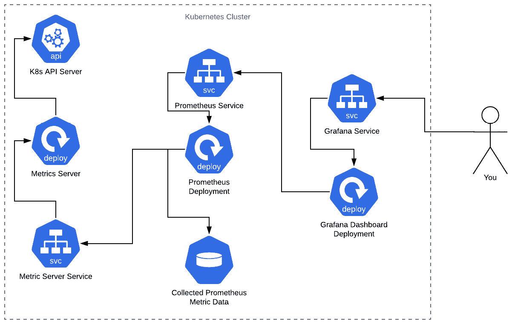
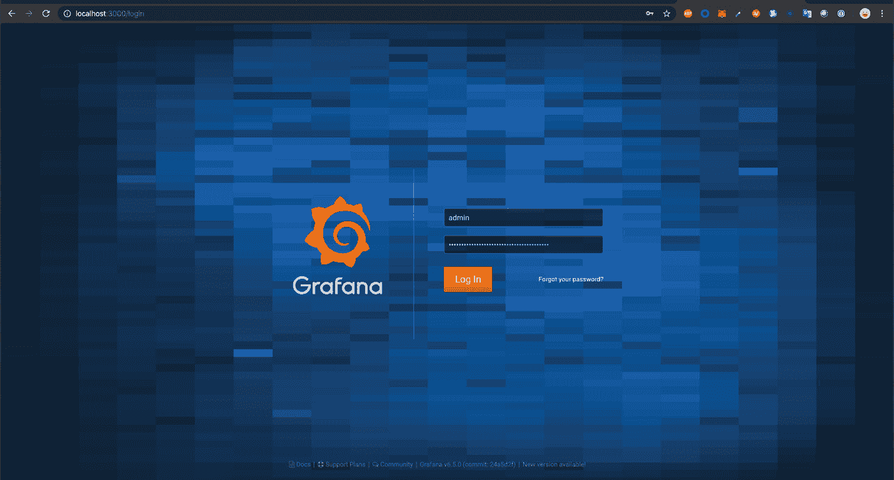
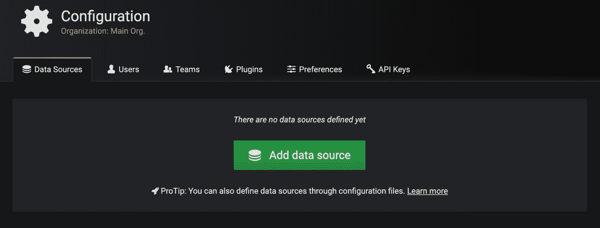
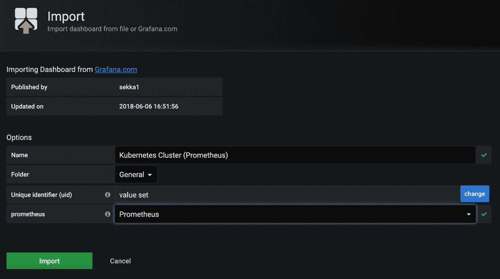
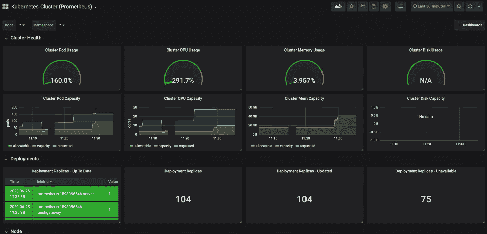
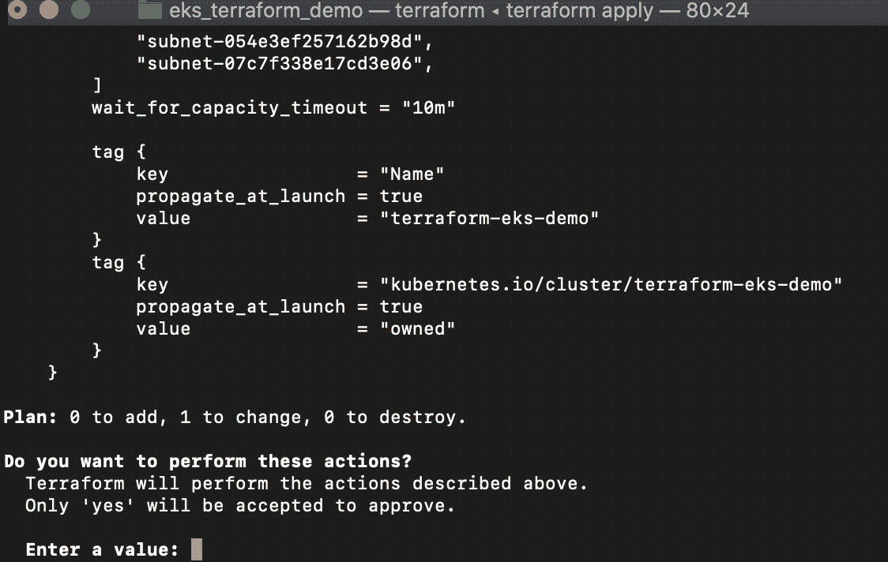

# 十五、Kubernetes集群的监控和自动缩放

概观

本章将向您介绍 Kubernetes 如何使您能够监控集群和工作负载，然后使用收集的数据自动做出某些决策。您将了解 Kubernetes 度量服务器，它聚合所有集群运行时信息，允许您使用这些信息来驱动应用运行时扩展决策。我们将引导您使用 Kubernetes Metrics 服务器和 Prometheus 设置监控，然后使用 Grafana 可视化这些指标。到本章结束时，您还将学习如何自动扩展应用，以完全利用调配的基础架构上的资源，以及根据需要自动扩展集群基础架构。

# 简介

让我们花一点时间来回顾一下我们从*第 11 章*、*开始的这一系列章节中构建自己的 HA 集群*的进展。我们首先使用 kops 建立一个 Kubernetes 集群，以高可用性的方式配置 AWS 基础设施。然后，我们使用 Terraform 和一些脚本来提高我们集群的稳定性，并部署我们简单的计数器应用。在此之后，我们开始使用 Kubernetes/云原生原则来强化安全性并提高应用的可用性。最后，我们学习了如何运行负责使用事务的有状态数据库，以确保我们总是从应用中获得一系列不断增加的数字。

在本章中，我们将探讨如何利用 Kubernetes 中已经存在的关于我们的应用的数据来驱动和自动化关于扩展它们的决策过程，以便它们总是适合我们的负载。因为从头开始观察应用指标、计划和启动容器以及引导节点需要时间，所以这种扩展不是瞬时的，而是最终(通常在几分钟内)平衡执行集群负载工作所需的 pod 和节点数量。为了实现这一点，我们需要一种方法来获取这些数据，理解/解释这些数据，并用这些数据向 Kubernetes 反馈指令。幸运的是，Kubernetes 中已经有工具可以帮助我们做到这一点。这些是 **Kubernetes 度量服务器**、**horizontalpoodautoscaler**(**HPAs**)和**集群自动缩放器**。

# 立方监控

Kubernetes 内置了对提供关于基础设施组件以及各种 Kubernetes 对象的有用监控信息的支持。Kubernetes Metrics 服务器是一个组件(没有内置)，它在 API 服务器上的 API 端点收集和公开度量数据。Kubernetes 使用这些数据来管理 Pods 的扩展，但这些数据也可以被第三方工具(如 Prometheus)抓取，供集群运营商使用。普罗米修斯有一些非常基本的数据可视化功能，主要用作度量收集和存储工具，因此您可以使用更强大和有用的数据可视化工具，如 Grafana。Grafana 允许集群管理员创建有用的仪表板来监控他们的集群。您可以通过以下链接了解更多关于 Kubernetes 中的监控是如何构建的:[https://github . com/Kubernetes/community/blob/master/contributor/design-propositions/instrumentation/monitoring _ architecture . MD](https://github.com/kubernetes/community/blob/master/contributors/design-proposals/instrumentation/monitoring_architecture.md)。

这就是我们在图表中看到的情况:



图 15.1:我们将在本章中实现的监控管道的概述

该图表示如何通过各种 Kubernetes 对象实现监控管道。总之，监控管道的工作方式如下:

1.  Kubernetes 的各种组件已经被装备起来以提供各种度量。Kubernetes 度量服务器将从组件中获取这些度量。
2.  然后，Kubernetes度量服务器将在应用编程接口端点上公开这些度量。
3.  普罗米修斯将访问这个 API 端点，刮取这些度量，并将其添加到其特殊的数据库中。
4.  格拉夫纳将查询普罗米修斯数据库，收集这些指标，并将其呈现在一个整洁的仪表板上，带有图形和其他视觉表示。

N 现在，让我们看看前面提到的每个组件，以便更好地理解它们。

## Kubernetes指标应用编程接口/指标服务器

Kubernetes Metrics 服务器(以前称为 Heapster)收集并公开关于 Kubernetes 中所有 Kubernetes 组件和对象运行状态的度量数据。节点、控制平面组件、运行POD以及任何Kubernetes对象都可以通过 Metrics 服务器观察到。它收集的度量标准的一些例子是在一个部署/复制集中所需的单元数量，在该部署中发布`Ready`状态的单元数量，以及每个容器的 CPU 和内存利用率。

我们将主要使用默认的公开指标，同时收集与我们正在编排应用的 Kubernetes 对象相关的信息。

## 普罗米修斯

普罗米修斯是一个度量收集器，一个时间序列数据库，也是任何事情的警报管理器。它利用抓取功能从正在运行的进程中提取度量，这些进程以定义的时间间隔以 Prometheus 格式公开这些度量。然后，这些指标被存储在它们自己的时间序列数据库中，您可以对这些数据运行查询，以获得正在运行的应用的状态快照。

它还带有一个警报管理器功能，允许您设置触发器来提醒您的随叫随到的管理员。例如，如果您的一个节点上的 CPU 利用率在 15 分钟内高于 90%，您可以将警报管理器配置为自动触发警报。警报管理器可以与多个第三方服务接口，通过各种方式发送警报，例如电子邮件、聊天消息或手机短信警报。

注意

如果你想了解更多关于普罗米修斯的知识，可以参考这本书:[https://www . packtpub . com/虚拟化与云/动手-基础设施-监控-普罗米修斯](https://www.packtpub.com/virtualization-and-cloud/hands-infrastructure-monitoring-prometheus)。

## Grafana

Grafana 是一个开源工具，可以用来可视化数据和创建有用的仪表板。格拉夫纳将在普罗米修斯数据库中查询度量标准，并将它们绘制在仪表板图表上，以便人类更容易理解和发现趋势或差异。这些工具在运行生产集群时是不可或缺的，因为它们帮助我们快速发现基础架构中的问题并解决问题。

## 监控您的应用

虽然应用监控超出了本书的范围，但我们将提供一些粗略的指南，以便您可以在这个主题上进行更多探索。我们建议您以普罗米修斯格式公开您的应用的度量，并使用普罗米修斯来清除它们；对于大多数语言来说，有许多库可以对此提供帮助。

另一种方法是使用普罗米修斯出口商，可用于各种应用。出口商从应用中收集指标，并将其暴露给一个应用编程接口端点，这样普罗米修斯就可以将其清除。你可以在这个链接找到几个常见应用的开源导出器:[https://prometheus.io/docs/instrumenting/exporters/](https://prometheus.io/docs/instrumenting/exporters/)。

对于您的定制应用和框架，您可以使用普罗米修斯提供的库创建自己的导出器。你可以在这个链接找到相关指南:[https://prometheus.io/docs/instrumenting/writing_exporters/](https://prometheus.io/docs/instrumenting/writing_exporters/)。

一旦您从您的应用中暴露并抓取了度量标准，您就可以在 Grafana 仪表板中呈现它们，类似于我们将为监视 Kubernetes 组件而创建的仪表板。

## 练习 15.01:设置度量服务器和观察 Kubernetes 对象

在本练习中，我们将为集群中的 Kubernetes 对象设置监控，并运行一些查询和创建可视化来查看发生了什么。我们将安装普罗米修斯、格拉夫纳和Kubernetes度量服务器:

1.  To begin with, we will recreate your EKS cluster from the Terraform file in *Exercise 12.02*, *Creating a Cluster with EKS Using Terraform*. If you already have the `main.tf` file, you can work with it. Otherwise, you can run the following command to get it:

    ```
    curl -O https://github.com/PacktWorkshops/Kubernetes-Workshop/blob/master/Chapter12/Exercise12.02/main.tf
    ```

    现在，依次使用以下两个命令来启动和运行集群资源:

    ```
    terraform init
    terraform apply
    ```

    注意

    以下命令需要`jq`。`jq`是操作 JSON 数据的简单工具。如果您还没有安装，您可以使用以下命令来安装:`sudo apt install jq`。

2.  To set up the Kubernetes Metrics server in our cluster, we need to run the following in sequence:

    ```
    curl -O https://raw.githubusercontent.com/PacktWorkshops/Kubernetes-Workshop/master/Chapter15/Exercise15.01/metrics_server.yaml
    kubectl apply -f metrics_server.yaml
    ```

    您应该会看到类似以下内容的响应:

    

    图 15.2:部署度量服务器所需的所有对象

3.  To test this, let's run the following command:

    ```
    kubectl get --raw "/apis/metrics.k8s.io/v1beta1/nodes"
    ```

    注意

    如果出现`ServiceUnavailable`错误，请检查您的防火墙规则是否允许应用编程接口服务器与运行度量服务器的节点通信。

    我们经常通过命名对象来使用`kubectl get`命令。我们已经在*第 4 章*、*如何与 Kubernetes (API Server)* 进行通信中看到，Kubectl 解释请求，将请求指向适当的端点，并将结果格式化为可读的格式。但是在这里，由于我们已经在我们的应用编程接口服务器上创建了一个自定义端点，我们必须使用`--raw`标志指向它。您应该会看到类似以下内容的响应:

    

    图 15.3:来自 Kubernetes 度量服务器的响应

    正如我们在这里看到的，响应包含定义度量名称空间、度量值和度量元数据的 JSON blobs，例如节点名称和可用性区域。然而，这些指标不是很可读。我们将使用普罗米修斯来聚合它们，然后使用格拉夫纳在一个简洁的仪表板中呈现聚合的指标。

4.  Now, we have metric data being aggregated. Let's start scraping and visualizing with Prometheus and Grafana. For this, we will install Prometheus and Grafana using Helm. Run the following command:

    ```
    helm install --generate-name stable/prometheus
    ```

    注意

    如果您是第一次安装和运行 helm，您将需要运行以下命令来获得稳定的回购:

    `help repo add stable https://kubernetes-charts.storage.googleapis.com/`

    您应该会看到类似如下的输出:

    

    图 15.4:为普罗米修斯安装舵轮图

5.  Now, let's install Grafana in a similar fashion:

    ```
    helm install --generate-name stable/grafana
    ```

    您应该会看到以下响应:

    

    图 15.5:安装格拉夫纳的舵图

    在这个截图中，请注意`NOTES:`部分，它列出了两个步骤。按照以下步骤获取您的 Grafana 管理员密码和您的端点以访问 Grafana。

6.  Here, we are running the first command that Grafana showed in the output of the previous step:

    ```
    kubectl get secret --namespace default grafana-1576397218 -o jsonpath="{.data.admin-password}" | base64 --decode ; echo
    ```

    请使用您获得的命令版本；该命令将针对您的实例进行自定义。该命令获取您的密码，存储在一个秘密中，对其进行解码，并在您的终端输出中对其进行回应，以便您可以复制该密码用于后续步骤。您应该会看到类似以下内容的响应:

    ```
    brM8aEVPCJtRtu0XgHVLWcBwJ76wBixUqkCmwUK)
    ```

7.  Now, let's run the next two commands that Grafana asked us to run, as seen in *Figure 15.5*:

    ```
    export POD_NAME=$(kubectl get pods --namespace default -l "app.kubernetes.io/name=grafana,app.kubernetes.io/instance=grafana-1576397218" -o jsonpath="{.items[0].metadata.name}")
    kubectl --namespace default port-forward $POD_NAME 3000
    ```

    同样，使用您为实例获得的命令，因为这将是自定义的。这些命令会找到 Grafana 运行的 Pod，然后将我们本地机器的一个端口映射到它，这样我们就可以轻松访问它。您应该会看到以下响应:

    ```
    Forwarding from 127.0.0.1:3000 -> 3000
    Forwarding from [::1]:3000 -> 3000
    ```

    注意

    在这一步，如果您在获取适当的 Pod 名称时遇到任何问题，您可以简单地运行`kubectl get pods`来找到运行 Grafana 的 Pod 的名称，并使用该名称代替 shell ( `$POD_NAME`)变量。因此，您的命令将类似于以下内容:

    `kubectl --namespace default port-forward grafana-1591658222-7cd4d8b7df-b2hlm 3000`。

8.  Now, open your browser and visit `http://localhost:3000` to access Grafana. You should see the following landing page:

    

    图 15.6:格拉夫纳仪表板的登录页面

    默认用户名为`admin`，密码为*第 6 步*输出中回显的值。用它来登录。

9.  After a successful login, you should see this page:

    

    图 15.7:格拉夫纳家庭仪表板

10.  Now, let's create a dashboard for Kubernetes metrics. To do so, we need to set up Prometheus as a data source for Grafana. On the left sidebar, click on `Configuration` and then on `Data Sources`:

    

    图 15.8:从配置菜单中选择数据源

11.  You will see this page:

    

    图 15.9:添加数据源选项

    现在，点击`Add data source`按钮。

12.  You should see this page with several database options. Prometheus should be on top. Click on that:

    

    图 15.10:选择普罗米修斯作为格拉夫纳仪表板的数据源

    现在，在我们进入下一个屏幕之前，我们需要获取 Grafana 将用来从集群内部访问普罗米修斯数据库的 URL。我们将在下一步中这样做。

13.  Open a new terminal window and run the following command:

    ```
    kubectl get svc --all-namespaces
    ```

    您应该会看到类似以下内容的响应:

    

    图 15.11:获取所有服务的列表

    复制以`prometheus`开始，以`server`结束的服务名称。

14.  After *step 12*, you will have arrived at the screen shown in the following screenshot:

    

    图 15.12:输入我们在格拉夫纳的普罗米修斯服务的地址

    在`HTTP`部分的`URL`字段中，输入以下值:

    ```
    http://<YOUR_PROMETHEUS_SERVICE_NAME>.default
    ```

    注意，应该会看到`Data source is working`，如前面截图所示。然后，点击底部的`Save and Test`按钮。我们将`.default`添加到我们的 URL 的原因是，我们将这个 Helm 图表部署到了`default` Kubernetes 名称空间。如果您将它部署到另一个名称空间，您应该用您的名称空间的名称替换`default`。

15.  Now, let's set up the dashboard. Back on the Grafana home page (`http://localhost:3000`), click on the `+` symbol on the left sidebar, and then click on `Import`, as shown here:

    

    图 15.13:导航到导入仪表板选项

16.  On the next page, you should see the `Grafana.com Dashboard` field, as shown here:

    

    图 15.14:输入导入仪表板的来源

    将以下链接粘贴到`Grafana.com Dashboard`字段:

    ```
    https://grafana.com/api/dashboards/6417/revisions/1/download
    ```

    这是官方支持的 Kubernetes 仪表板。单击文件外的任何位置后，您应该会自动前进到下一个屏幕。

17.  The previous step should lead you to this screen:

    

    图 15.15:将普罗米修斯设置为导入仪表板的数据源

    在看到`prometheus`的地方，点击旁边的下拉列表，选择`Prometheus`，点击`Import`。

18.  The result should look like this:

    

图 15.16:用于监控集群的格拉夫纳仪表盘

如您所见，我们在 Kubernetes 中有一个用于监控工作负载的简洁仪表板。在本练习中，我们部署了我们的度量服务器来收集和公开 Kubernetes 对象度量，然后我们部署了 Prometheus 来存储这些度量，Grafana 来帮助我们在 Prometheus 中可视化收集的度量，这将通知我们在任何时间点我们的集群中发生了什么。现在，是时候用这些信息来衡量事情了。

# 立方单位中的自动校准

Kubernetes 允许您自动扩展工作负载，以适应不断变化的应用需求。从 Kubernetes Metrics 服务器收集的信息是用于推动扩展决策的数据。在本书中，我们将介绍两种类型的扩展操作——一种影响部署中运行的单元数量，另一种影响集群中运行的节点数量。两者都是水平缩放的例子。让我们简单地获得一种直觉，即POD的水平缩放和节点的水平缩放都需要什么:

*   **容器**:假设您在 Kubernetes 中创建部署时填写了`podTemplate`的`resources:`部分，则该容器中的每个容器都将具有`requests`和`limits`字段，由相应的`cpu`和`memory`字段指定。当处理工作负载所需的资源超过您已分配的资源时，通过向部署添加 pod 的其他副本，您可以水平扩展以向部署添加容量。通过让软件流程根据负载为您决定部署中 Pod 的副本数量，您可以*自动缩放*您的部署，以保持副本数量与您为表示应用负载而定义的指标一致。应用负载的一个度量标准可能是当前消耗的已分配 CPU 的百分比。
*   **Nodes**: Every node has a certain amount of CPU (typically expressed by the number of cores) and memory (typically expressed in gigabytes) that it has available for consumption by Pods. When the total capacity of all worker nodes is exhausted by all running pods (meaning that the CPU and memory requests/limits for all the Pods are equal to or greater than that of the whole cluster), then we have saturated the resources of our cluster. In order to allow more Pods to be run on the cluster, or to allow more autoscaling to take place in the cluster, we need to add capacity in the form of additional worker nodes. When we allow a software process to make this decision for us, we are considered to be *autoscaling* the total capacity of our cluster. In Kubernetes, this is handled by the ClusterAutoscaler.

    注意

    当您增加应用的 pod 副本数量时，这称为水平缩放，由**水平 pod 自动缩放器**处理。相反，如果您要增加副本的资源限制，这将被称为垂直扩展。Kubernetes 也提供 **VerticalPodAutoscaler** ，但为了简洁起见，我们将它省略了，这是因为它在生产中还没有普遍可用和安全。

将高性能计算和集群自动缩放器结合使用，对于公司来说是一种有效的方法，可以确保他们始终为其负载部署适量的应用资源，同时不会为此付出太多。让我们在下面的小节中研究它们。

## 水平自动扶梯

高性能计算负责确保部署中应用的副本数量与度量标准所衡量的当前需求相匹配。这很有用，因为我们可以使用实时度量数据，这些数据已经由 Kubernetes 收集，以始终确保我们的应用满足我们在阈值中提出的要求。对于一些不习惯使用数据运行应用的应用所有者来说，这可能是一个新概念，但是一旦您开始利用可以调整部署规模的工具，您就再也不想回去了。

Kubernetes 在`autoscaling/v1`和`autoscaling/v2beta2`组中有一个应用编程接口资源，用于提供自动缩放触发器的定义，该触发器可以针对另一个 Kubernetes 资源运行，该资源通常是 Kubernetes 部署对象。在`autoscaling/v1`的情况下，唯一支持的指标是当前的 CPU 消耗，在`autoscaling/v2beta2`的情况下，支持任何自定义指标。

HPA 查询 Kubernetes 度量服务器来查看特定部署的度量。然后，自动缩放资源将确定当前观察到的度量是否超出缩放目标的阈值。如果是，那么它将根据负载将部署所需的 Pods 数量更改为更高或更低。

例如，考虑由电子商务公司托管的购物车微服务。购物车服务在优惠券代码输入过程中承受了很大的负载，因为它必须遍历购物车中的所有商品，并在验证优惠券代码之前搜索这些商品上的活动优惠券。在一个随机的周二早上，网上有许多购物者使用这项服务，他们都想使用优惠券。通常，服务会不堪重负，请求会开始失败。但是，如果您能够使用 HPA，Kubernetes 将使用集群的备用计算能力来确保有足够的购物车服务 Pods 来处理负载。

请注意，简单地自动扩展部署并不是解决应用性能问题的“一刀切”的解决方案。在现代应用中，有许多地方会出现速度变慢的情况，因此应该仔细考虑您的应用架构，看看您可以在哪里发现其他无法通过简单的自动缩放解决的瓶颈。一个这样的例子是数据库上的缓慢查询性能。然而，在这一章中，我们将重点关注可以通过在 Kubernetes 中自动缩放来解决的应用问题。

让我们看一下 HPA 的结构，以便更好地理解:

with_autoscaler.yaml

```
115 apiVersion: autoscaling/v1
116 kind: HorizontalPodAutoscaler
117 metadata:
118   name: shopping-cart-hpa
119 spec:
120   scaleTargetRef:
121     apiVersion: apps/v1
122     kind: Deployment
123     name: shopping-cart-deployment
124   minReplicas: 20
125   maxReplicas: 50
126   targetCPUUtilizationPercentage: 50
```

你可以在这个链接找到完整的代码:[https://packt.live/3bE9v28](https://packt.live/3bE9v28)。

在本规范中，观察以下字段:

*   `scaleTargetRef`:这是对正在缩放的对象的引用。在这种情况下，它是购物车微服务部署的指针。
*   `minReplicas`:部署中的最小副本数，不考虑扩展触发器。
*   `maxReplicas`:部署中副本的最大数量，不考虑扩展触发器。
*   `targetCPUUtilizationPercentage`:此部署中所有 Pods 的平均 CPU 利用率的目标百分比。Kubernetes 将不断重新评估该指标，并增加和减少豆荚数量，以便实际平均 CPU 利用率与该目标相匹配。

为了模拟我们应用的压力，我们将使用 **wrk** ，因为它配置简单，并且已经为我们制作了一个 Docker 容器。wrk 是一个 HTTP 负载测试工具。它使用简单，只有几个选项；但是，它将能够通过针对指定端点使用多个同时的 HTTP 连接一遍又一遍地发出请求来生成大量负载。

注意

你可以在这个链接找到更多关于 wrk 的信息:[https://github.com/wg/wrk](https://github.com/wg/wrk)。

在下面的练习中，我们将使用已经运行的应用的修改版本来帮助驱动缩放行为。在我们的应用的这个版本中，我们对它进行了修改，这样应用将以一种天真的方式执行斐波那契序列计算，直到第 10，000，000 个条目，这样它的计算成本会稍微高一点，并超过我们的 CPU 自动缩放触发。如果您检查源代码，您可以看到我们添加了这个函数:

main.go

```
74 func FibonacciLoop(n int) int { 
75   f := make([]int, n+1, n+2) 
76   if n < 2 { 
77         f = f[0:2] 
78   } 
79   f[0] = 0 
80   f[1] = 1 
81   for i := 2; i <= n; i++ { 
82         f[i] = f[i-1] + f[i-2] 
83   } 
84   return f[n] 
85 } 
```

你可以在这个链接找到完整的代码:[https://packt.live/3h5wCEd](https://packt.live/3h5wCEd)。

除此之外，我们将使用一个入口，这是我们在*第 12 章*、*您的应用和 HA* 中了解到的，以及我们在上一章中构建的相同的 SQL 数据库。

现在，说了这么多，让我们在下面的练习中深入研究这些自动缩放器的实现。

## 练习 15.02:在 Kubernetes 中扩展工作负载

在本练习中，我们将把之前的几个不同的片段放在一起。由于我们的应用在这一点上有几个活动部分，因此我们需要制定一些步骤，以便您了解我们的发展方向:

1.  我们需要建立我们的 EKS 集群，就像我们在*练习 12.02* 、*中使用地形*与 EKS 创建集群一样。
2.  We need to have the required components for the Kubernetes Metrics server set up.

    注意

    考虑到这两点，您需要成功完成前面的练习，以便能够执行本练习。

3.  我们需要使用一个修改来安装我们的计数器应用，这样获得序列中的下一个数字将是一个计算密集型的练习。
4.  我们需要安装 HPA，并为 CPU 百分比设置一个指标目标。
5.  我们需要安装集群自动缩放器，并授予它在 AWS 中更改**自动缩放组** ( **ASG** )大小的权限。
6.  我们需要通过生成足够的负载来对应用进行压力测试，以便能够横向扩展应用，并使 HPA 触发集群扩展操作。

我们将使用 Kubernetes Ingress 资源，使用集群外部的流量进行负载测试，这样我们就可以创建更真实的模拟。

完成这项工作后，您将成为Kubernetes船长，因此让我们深入了解:

1.  Now, let's deploy the `ingress-nginx` setup by running the following commands one after the other:

    ```
    kubectl apply -f https://raw.githubusercontent.com/kubernetes/ingress-nginx/nginx-0.30.0/deploy/static/mandatory.yaml 
    kubectl apply -f https://raw.githubusercontent.com/kubernetes/ingress-nginx/nginx-0.30.0/deploy/static/provider/aws/service-l4.yaml 
    kubectl apply -f https://raw.githubusercontent.com/kubernetes/ingress-nginx/nginx-0.30.0/deploy/static/provider/aws/patch-configmap-l4.yaml 
    ```

    您应该会看到以下响应:

    

    图 15.17:部署 nginx 入口控制器

2.  Now, let's fetch the manifest for our application with HA MySQL, Ingress, and an HPA:

    ```
    curl -O https://raw.githubusercontent.com/PacktWorkshops/Kubernetes-Workshop/master/Chapter15/Exercise15.02/with_autoscaler.yaml
    ```

    在我们应用它之前，让我们看看我们的自动缩放触发器:

    with_autoscaler.yaml

    ```
    115 apiVersion: autoscaling/v1 
    116 kind: HorizontalPodAutoscaler 
    117 metadata: 
    118   name: counter-hpa 
    119 spec: 
    120   scaleTargetRef: 
    121     apiVersion: apps/v1 
    122     kind: Deployment 
    123     name: kubernetes-test-ha-application-with-autoscaler-          deployment 
    124   minReplicas: 2 
    125   maxReplicas: 1000 
    126   targetCPUUtilizationPercentage: 10 
    ```

    完整代码可在此链接找到:[https://packt.live/3bE9v28](https://packt.live/3bE9v28)。

    在这里，我们从该部署的两个副本开始，允许我们自己增加到 1000 个副本，同时尝试将 CPU 保持在恒定的 10%利用率。回想一下我们的 Terraform 模板，我们正在使用 m4 .大型 EC2 实例来运行这些 Pods。

3.  Let's deploy this application by running the following command:

    ```
    kubectl apply -f with_autoscaler.yaml
    ```

    您应该会看到以下响应:

    

    图 15.18:部署我们的应用

4.  With that, we are ready to load test. Before we begin, let's check on the number of Pods in our deployment:

    ```
    kubectl describe hpa counter-hpa
    ```

    这可能需要 5 分钟来显示百分比，之后您应该会看到如下内容:

    

    图 15.19:获取我们的住房公积金的详细信息

    `Deployment pods:`字段显示`2 current / 2 desired`，这意味着我们的 HPA 已经将所需的副本数量从 3 更改为 2，因为我们的 CPU 利用率为 0%，低于 10%的目标。

    现在，我们需要一些负荷。我们将使用 wrk 作为 Docker 容器从我们的计算机到集群运行负载测试。但是首先，我们需要让入口端点访问我们的集群。

5.  Run the following command to first get your Ingress endpoint:

    ```
    kubectl get svc ingress-nginx -n ingress-nginx -o jsonpath='{.status.loadBalancer.ingress[0].hostname}'
    ```

    您应该会看到以下响应:

    

    图 15.20:检查我们的入口端点

6.  In another terminal session, run a `wrk` load test using the following command:

    ```
    docker run --rm skandyla/wrk -t10 -c1000 -d600 -H ‚Host: counter.com'  http://YOUR_HOSTNAME/get-number
    ```

    让我们快速了解这些参数:

    `-t10`:本次测试使用的线程数，本例中为 10。

    `-c1000`:保持打开的连接总数。在这种情况下，每个线程处理 1，000 个连接。

    `-d600`:运行该测试的秒数(在本例中为 600 秒或 10 分钟)。

    您应该得到如下输出:

    

    图 15.21:对我们的入口端点运行负载测试

7.  In another session, let's keep an eye on the pods for our application:

    ```
    kubectl get pods --watch
    ```

    您应该能够看到类似于以下内容的响应:

    

    图 15.22:观察支持我们应用的POD

    在这个终端窗口中，您应该会看到 Pods 的数量在增加。请注意，我们也可以在我们的 Grafana 仪表板中检查相同的内容。

    这里，增加 1；但很快，这些POD将超过所有可用的空间。

8.  In yet another terminal session, you can again set up port forwarding to Grafana to observe the dashboard:

    ```
    kubectl --namespace default port-forward $POD_NAME 3000
    ```

    您应该会看到以下响应:

    ```
    Forwarding from 127.0.0.1:3000 -> 3000
    Forwarding from [::1]:3000 -> 3000
    ```

9.  Now, access the dashboard on your browser at `localhost:3000`:

    

图 15.23:在格拉夫纳仪表盘中观察我们的集群

你应该可以看到这里的豆荚数量也在增加。因此，我们成功地部署了一个 HPA，随着应用负载的增加，它会自动增加 Pods 的数量。

## 集群自动扶梯

如果 HPA 确保在一个部署中始终有正确数量的 Pods 在运行，那么当集群上所有这些 Pods 的容量用完时会发生什么？我们需要更多，但我们也不想在不需要时为额外的集群容量付费。这就是集群自动缩放器的作用。

集群自动缩放器将在您的集群内工作，以确保在 ASG(在 AWS 的情况下)运行的节点数量始终有足够的容量来运行您的集群的当前部署的应用组件。因此，如果一个部署中的 10 个 Pod 可以容纳在 2 个节点上，那么当您需要第 11 个 Pod 时，集群自动缩放器将要求 AWS 向您的 Kubernetes 集群添加第 3 个节点，以安排该 Pod。当不再需要那个POD时，那个节点也会消失。让我们看一个简短的体系结构图来了解集群自动缩放器是如何工作的:


图 15.24:节点满负荷的集群

请注意，在本例中，我们有一个运行两个工作节点的 EKS 集群，所有可用的集群资源都被占用。这就是集群自动缩放器的作用。

当对不合适的POD的请求到达控制平面时，它保持在`Pending`状态。当集群自动缩放器观察到这一点时，它将与 AWS EC2 应用编程接口通信，并请求其中部署了我们的工作节点的 ASG 通过另一个节点进行扩展。这要求 ClusterAutoscaler 能够与它正在运行的云提供程序的 API 进行通信，以便更改工作节点数。在 AWS 的情况下，这也意味着我们要么必须为 ClusterAutoscaler 生成 IAM 凭证，要么允许它使用机器的 IAM 角色来访问 AWS APIs。

成功的缩放操作应该如下所示:


图 15.25:为运行额外的 pod 而调配的额外节点

我们将在下面的练习中实现 ClusterAutoscaler，然后在之后的活动中对其进行负载测试。

## 练习 15.03:配置集群自动缩放器

因此，现在我们已经看到了 Kubernetes 部署的规模，是时候看到它扩展到需要向集群添加更多节点容量的程度了。我们将继续上一课的内容，运行完全相同的应用和负载测试，但让它运行更长时间:

1.  要创建集群自动缩放器，首先，我们需要创建一个 AWS IAM 帐户，并授予它管理我们的 ASG 的权限。创建一个名为`permissions.json`的文件，内容如下:

    ```
    {
      "Version": "2012-10-17",
      "Statement": [
        {
          "Effect": "Allow",
          "Action": [
            "autoscaling:DescribeAutoScalingGroups",
            "autoscaling:DescribeAutoScalingInstances",
            "autoscaling:DescribeLaunchConfigurations",
            "autoscaling:SetDesiredCapacity",
            "autoscaling:TerminateInstanceInAutoScalingGroup",
            "autoscaling:DescribeLaunchConfigurations",
            "ec2:DescribeLaunchTemplateVersions",
            "autoscaling:DescribeTags"
          ],
          "Resource": "*"
        }
      ]
    }
    ```

2.  Now, let's run the following command to create an AWS IAM policy:

    ```
    aws iam create-policy --policy-name k8s-autoscaling-policy --policy-document file://permissions.json
    ```

    您应该会看到以下响应:

    

    图 15.26:创建 AWS IAM 策略

    从输出中记下`Arn:`字段的值。

3.  Now, we need to create an IAM user and then attach a policy to it. First, let's create the user:

    ```
    aws iam create-user --user-name k8s-autoscaler
    ```

    您应该会看到以下回应:

    

    图 15.27:创建一个 IAM 用户来使用我们的策略

4.  Now, let's attach the IAM policy to the user:

    ```
    aws iam attach-user-policy --policy-arn <ARN_VALUE> --user-name k8s-autoscaler
    ```

    使用您在*步骤 2* 中获得的 ARN 值。

5.  Now, we need the secret access key for this IAM user. Run the following command:

    ```
    aws iam create-access-key --user-name k8s-autoscaler
    ```

    你应该得到这样的回应:

    

    图 15.28:为创建的 IAM 用户获取秘密访问密钥

    在该命令的输出中，注意`AccessKeyId`和`SecretAccessKey`。

6.  现在，获取我们提供的集群自动缩放器的清单文件:

    ```
    curl -O https://raw.githubusercontent.com/PacktWorkshops/Kubernetes-Workshop/master/Chapter15/Exercise15.03/cluster_autoscaler.yaml
    ```

7.  We need to create a Kubernetes Secret to expose these credentials to the ClusterAutoscaler. Open the `cluster_autoscaler.yaml` file. In the first entry, you should see the following:

    cluster_autoscaler.yaml

    ```
    1  apiVersion: v1
    2  kind: Secret
    3  metadata:
    4    name: aws-secret
    5    namespace: kube-system
    6  type: Opaque
    7  data:
    8    aws_access_key_id: YOUR_AWS_ACCESS_KEY_ID
    9    aws_secret_access_key: YOUR_AWS_SECRET_ACCESS_KEY
    ```

    你可以在这个链接找到完整的代码:[https://packt.live/2DCDfzZ](https://packt.live/2DCDfzZ)。

    您需要在*步骤 5* 中用 AWS 返回的值的 Base64 编码版本替换`YOUR_AWS_ACCESS_KEY_ID`和`YOUR_AWS_SECRET_ACCESS_KEY`。

8.  To encode in Base64 format, run the following command:

    ```
    echo -n <YOUR_VALUE> | base64
    ```

    运行两次，用`AccessKeyID`和`SecretAccessKey`代替`<YOUR_VALUE>`，得到相应的 Base64 编码版本，你需要输入到秘密字段中。以下是完成后的样子:

    ```
    aws_access_key_id: QUtJQUlPU0ZPRE5ON0VYQU1QTEUK
    aws_secret_access_key: d0phbHJYVXRuRkVNSS9LN01ERU5HL2JQeFJmaUNZRVhBTVBMRUtFWQo=
    ```

9.  Now, in the same `cluster_autoscaler.yaml` file, go to line 188\. You will need to replace the value of `YOUR_AWS_REGION` with the value of the region you deployed your EKS cluster into, such as `us-east-1`:

    cluster_autoscaler.yaml

    ```
    176   env: 
    177   - name: AWS_ACCESS_KEY_ID 
    178     valueFrom: 
    179       secretKeyRef: 
    180         name: aws-secret 
    181         key: aws_access_key_id 
    182   - name: AWS_SECRET_ACCESS_KEY 
    183     valueFrom: 
    184       secretKeyRef: 
    185         name: aws-secret 
    186         key: aws_secret_access_key 
    187   - name: AWS_REGION 
    188     value: <YOUR_AWS_REGION>
    ```

    你可以在这个链接找到整个代码:[https://packt.live/2F8erkb](https://packt.live/2F8erkb)。

10.  Now, apply this file by running the following:

    ```
    kubectl apply -f cluster_autoscaler.yaml
    ```

    您应该会看到类似以下内容的响应:

    

    图 15.29:部署我们的集群自动缩放器

11.  Note that we need to now modify our ASG in AWS to allow for a scale-up; otherwise, the ClusterAutoscaler will not attempt to add any nodes. To do this, we have provided a modified `main.tf` file that has only one line changed: `max_size = 5` (*line 299*). This will allow the cluster to add up a maximum of five EC2 nodes to itself.

    导航到您下载前一个地形文件的相同位置，然后运行以下命令:

    ```
    curl -O https://raw.githubusercontent.com/PacktWorkshops/Kubernetes-Workshop/master/Chapter15/Exercise15.03/main.tf
    ```

    您应该会看到以下回应:

    

    图 15.30:下载修改后的地形文件

12.  Now, apply the modifications to the Terraform file:

    ```
    terraform apply
    ```

    确认更改仅适用于 ASG 最大容量，然后在出现提示时键入`yes`:

    

图 15.31:应用我们的地形修改

注意

我们将在下面的活动中测试这个集群自动缩放器。因此，现在不要删除集群和应用编程接口资源。

此时，我们已经部署了我们的集群自动缩放器，并将其配置为访问 AWS 应用编程接口。因此，我们应该能够根据需要扩展节点的数量。

让我们继续下面的活动，在这里我们将加载测试我们的集群。为了降低成本，你应该计划尽快进行这项活动。

## 活动 15.01:使用集群自动缩放器自动缩放我们的集群

在本练习中，我们将运行另一个负载测试，这一次，我们将运行更长时间，并观察随着集群扩展以满足需求，基础架构的变化。本活动应重复前面的步骤(如*练习 15.02“在 Kubernetes 中扩展工作负载”*所示)来运行负载测试，但这一次，应在安装 ClusterAutoscaler 的情况下进行，以便当您的集群耗尽 Pods 的容量时，它将扩展节点数量以适应新的 Pods。这样做的目的是让负载测试增加节点数量。

遵循以下准则完成您的活动:

1.  我们将使用 Grafana 仪表板观察集群指标，密切关注运行 Pods 的数量和节点数量。
2.  应该设置我们的 HPA，以便当我们的应用接收到更多负载时，我们可以扩展 Pods 的数量来满足需求。
3.  Ensure that your ClusterAutoscaler has been successfully set up.

    注意

    要满足上述三个要求，您需要成功完成本章中的所有练习。我们将使用这些练习中创建的资源。

4.  进行负荷测试，如*练习 15.02* 第 2 步所示。如果你愿意，你可以选择更长或更激烈的测试。

在本练习结束时，您应该能够通过这样描述 AWS ASG 来观察节点数量的增加:


图 15.32:通过描述 AWS 缩放组观察到的节点数量的增加

您还应该能够在您的 Grafana 仪表板中观察到同样的情况:


图 15.33:格拉夫纳仪表板中观察到的节点数量增加

注意

该活动的解决方案可在以下地址找到:[https://packt.live/304PEoD](https://packt.live/304PEoD)。通过运行命令`terraform destroy`，确保删除 EKS 集群。

## 删除您的集群资源

这是我们将使用 EKS 集群的最后一章。因此，我们建议您使用以下命令删除集群资源:

```
terraform destroy
```

这应该会停止我们使用 Terraform 创建的 EKS 集群的计费。

# 总结

让我们反思一下我们已经从*第 11 章*、*构建自己的 HA 集群*走了多远，那时我们开始谈论以高度可用的方式运行 Kubernetes。我们讲述了如何建立一个生产集群，该集群在云中是安全的，并使用 Terraform 等代码工具创建基础架构，以及如何保护它运行的工作负载。我们还研究了对应用的必要修改，以便很好地扩展它们——无论是应用的有状态版本还是无状态版本。

然后，在本章中，我们研究了如何使用数据扩展应用运行时的管理，特别是在介绍普罗米修斯、格拉夫纳和Kubernetes度量服务器时。然后，我们利用这些信息来利用 HPA 和 ClusterAutoscaler，这样我们就可以放心了，我们的集群总是有适当的规模，并且随时可以自动响应需求高峰，而不必为过度配置的硬件付费。

在接下来的一系列章节中，我们将探索 Kubernetes 中的一些高级概念，从下一章的入场控制器开始。