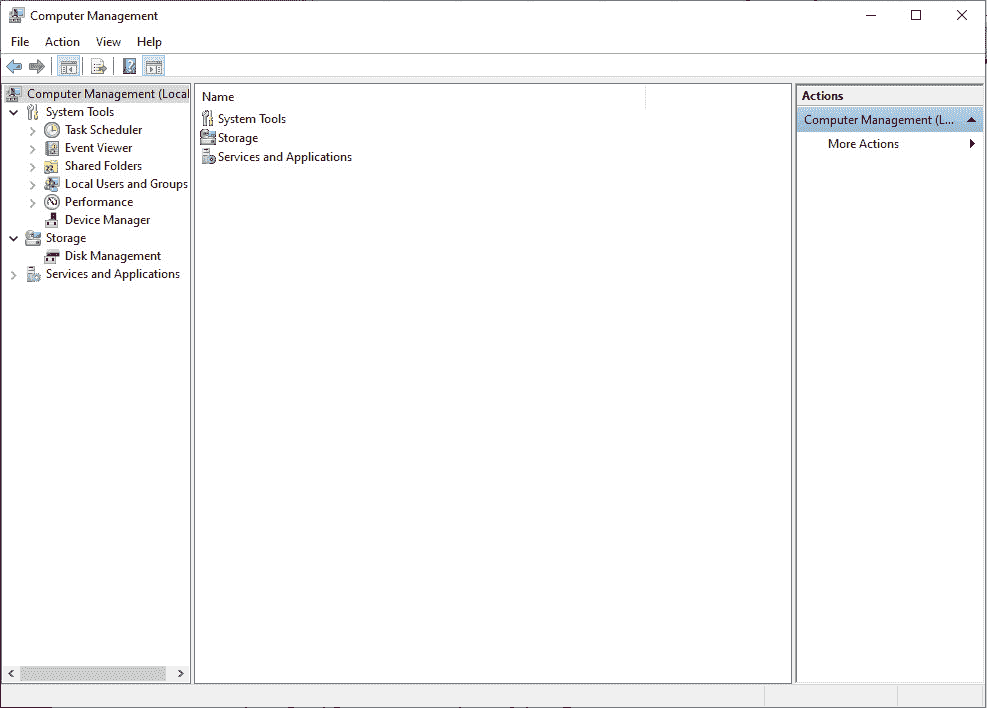
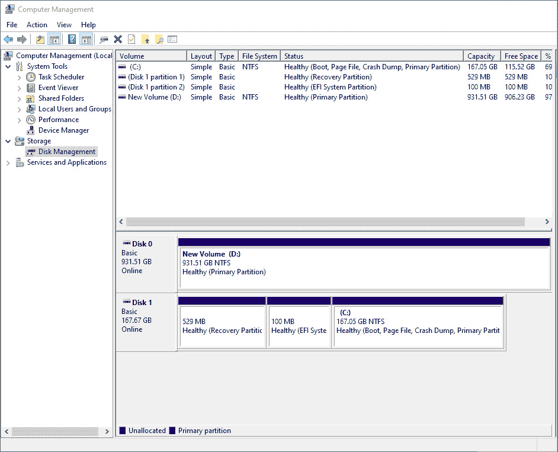
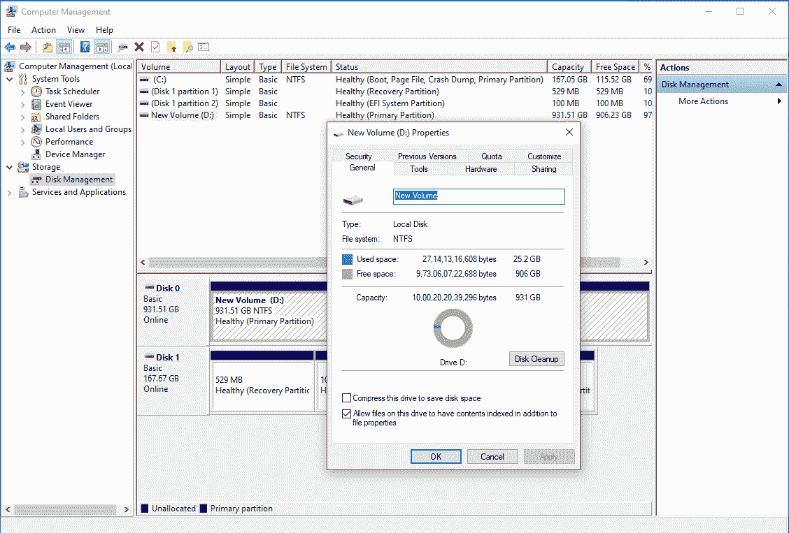
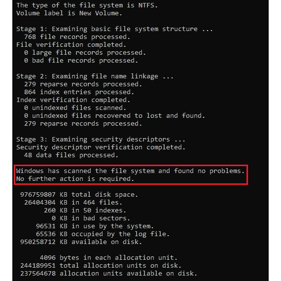
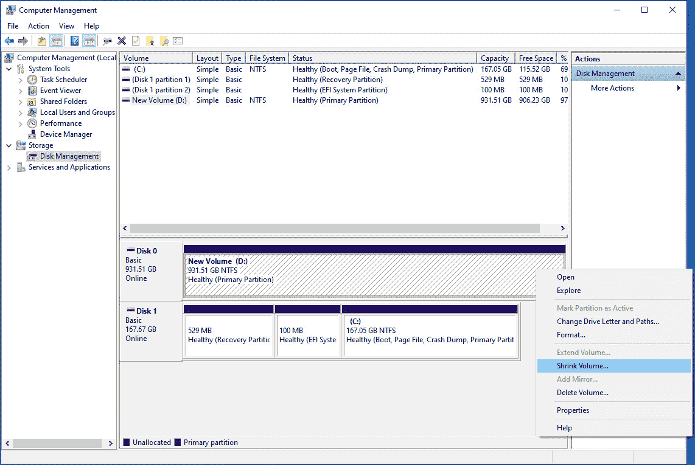
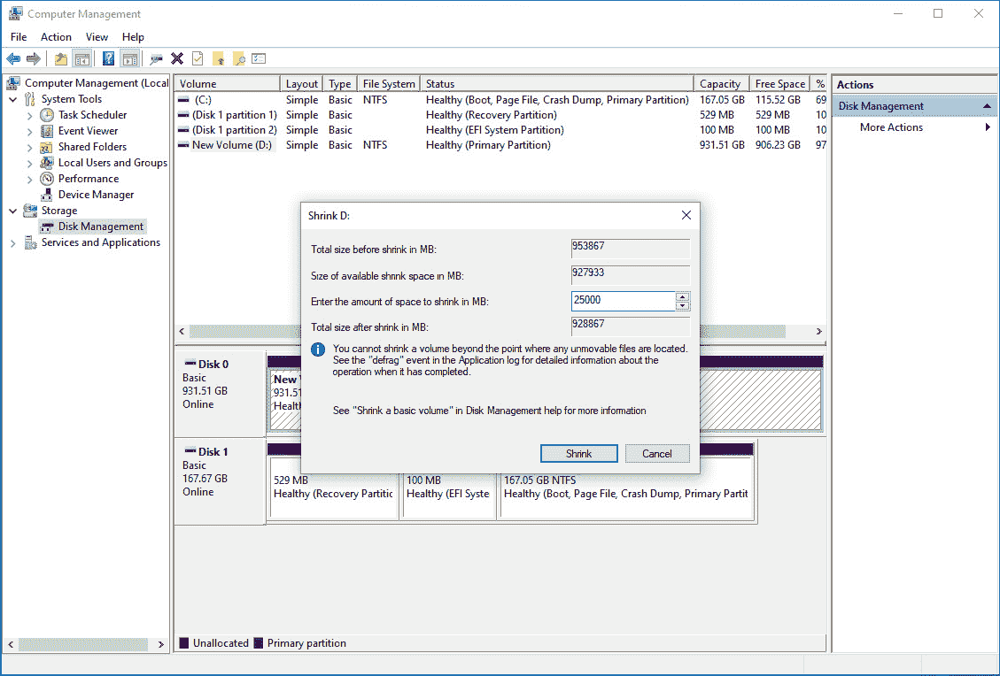
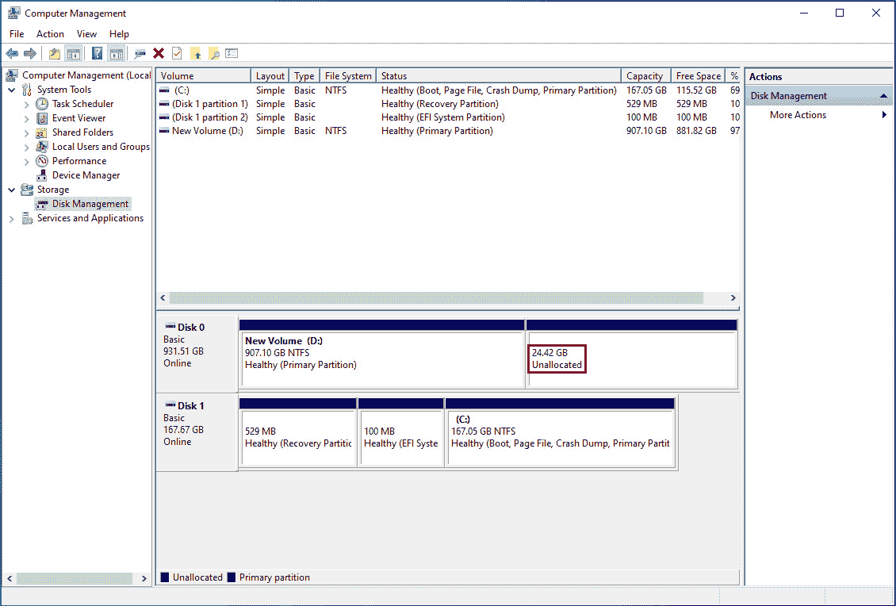
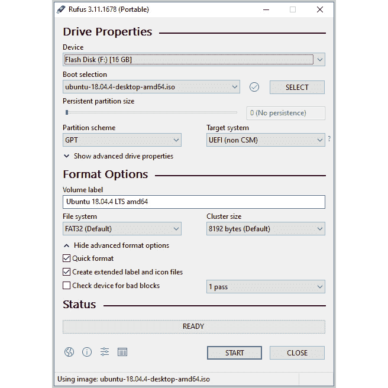

# 前言

# 关于本书

由于其广泛的支持，可以管理数百个运行云原生应用程序的容器，Kubernetes 是最受欢迎的开源容器编排平台，使集群管理变得简单。本研讨会采用实用方法，让您熟悉 Kubernetes 环境及其应用。

从介绍 Kubernetes 的基础知识开始，您将安装和设置 Kubernetes 环境。您将了解如何编写 YAML 文件并部署您的第一个简单的 Web 应用程序容器使用 Pod。然后，您将为 Pod 分配人性化的名称，探索各种 Kubernetes 实体和功能，并发现何时使用它们。随着您逐章阅读，这本 Kubernetes 书将向您展示如何通过应用各种技术来设计组件和部署集群，充分利用 Kubernetes。您还将掌握限制对集群内部某些功能访问的安全策略。在本书的最后，您将了解构建自己的控制器和升级到 Kubernetes 集群的高级功能，而无需停机。

通过本研讨会，您将能够使用 Kubernetes 高效地管理容器并运行基于云的应用程序。

## 受众

无论您是新手网页编程世界，还是经验丰富的开发人员或软件工程师，希望使用 Kubernetes 来管理和扩展容器化应用程序，您都会发现这个研讨会很有用。要充分利用本书，需要对 Docker 和容器化有基本的了解。

## 关于章节

*第一章*，*Kubernetes 和容器简介*，从容器化技术以及支持容器化的各种基础 Linux 技术开始。该章节介绍了 Kubernetes，并阐明了它带来的优势。

*第二章*，*Kubernetes 概述*，为您提供了对 Kubernetes 的第一次实际介绍，并概述了 Kubernetes 的架构。

*第三章*，*kubectl - Kubernetes 命令中心*，介绍了使用 kubectl 的各种方式，并强调了声明式管理的原则。

*第四章*，*如何与 Kubernetes（API 服务器）通信*，深入介绍了 Kubernetes API 服务器的细节以及与其通信的各种方式。

第五章，“Pods”，介绍了部署任何应用程序所使用的基本 Kubernetes 对象。

第六章，“标签和注释”，涵盖了 Kubernetes 中用于对不同对象进行分组、分类和链接的基本机制。

第七章，“Kubernetes 控制器”，介绍了各种 Kubernetes 控制器，如部署和有状态集等，它们是声明式管理方法的关键推动者之一。

第八章，“服务发现”，描述了如何使不同的 Kubernetes 对象在集群内以及集群外可被发现。

第九章，“存储和读取磁盘上的数据”，解释了 Kubernetes 提供的各种数据存储抽象，以使应用程序能够在磁盘上读取和存储数据。

第十章，“ConfigMaps 和 Secrets”，教会你如何将应用程序配置数据与应用程序本身分离开来，同时看到采取这种方法的优势。

第十一章，“构建您自己的 HA 集群”，指导您在**亚马逊网络服务**（**AWS**）平台上设置自己的高可用性、多节点 Kubernetes 集群。

第十二章，“您的应用程序和 HA”，阐述了使用 Kubernetes 进行持续集成的一些概念，并演示了在**亚马逊弹性 Kubernetes 服务**上运行的高可用性、多节点、托管 Kubernetes 集群的一些方法。

第十三章，“Kubernetes 中的运行时和网络安全性”，概述了应用程序和集群可能受到攻击的方式，然后介绍了 Kubernetes 提供的访问控制和安全功能。

第十四章，“在 Kubernetes 中运行有状态的组件”，教会你如何正确使用不同的 Kubernetes 抽象来可靠地部署有状态的应用程序。

第十五章，“Kubernetes 中的监控和自动扩展”，涵盖了您可以监视不同 Kubernetes 对象的方式，然后利用这些信息来扩展集群的容量。

第十六章，“Kubernetes Admission Controllers”，描述了 Kubernetes 如何允许我们扩展 API 服务器提供的功能，以在 API 服务器接受请求之前实施自定义策略。

第十七章，“Kubernetes 中的高级调度”，描述了调度器如何在 Kubernetes 集群上放置 pod。您将使用高级功能来影响 pod 的调度器放置决策。

第十八章，“无停机升级您的集群”，教会您如何将您的 Kubernetes 平台升级到新版本，而不会对您的平台或应用程序造成任何停机时间。

第十九章，“Kubernetes 中的自定义资源定义”，向您展示了扩展 Kubernetes 提供的功能的主要方式之一。您将看到自定义资源如何允许您在集群上实现特定于您自己领域的概念。

注意

章节中提出的活动的解决方案可以在此地址找到：[`packt.live/304PEoD`](https://packt.live/304PEoD)。

## 约定

文本中的代码单词、数据库表名、文件夹名、文件名、文件扩展名、路径名、虚拟 URL 和用户输入显示如下：“在当前工作目录中创建名为`sample-pod.yaml`的文件。”

代码块、终端命令或创建 YAML 文件的文本设置如下：

```
kubectl -n webhooks create secret tls webhook-server-tls \
--cert "tls.crt" \
--key "tls.key"
```

新的重要单词会显示为：“Kubernetes 通过**Admission Controllers**提供了这种能力。”

代码片段的关键部分如下所示：

```
kind: Pod
metadata:
  name: infra-libraries-application-staging
  namespace: metadata-activity
  labels:
    environment: staging
    team: infra-libraries
  annotations:
      team-link: "https://jira-link/team-link-2"
spec:
  containers:
```

您在屏幕上看到的文字，例如菜单或对话框中的文字，会以如下方式出现在文本中：“在左侧边栏上，点击`配置`，然后点击`数据源`。”

长代码片段已被截断，并且在截断的代码顶部放置了 GitHub 上代码文件的相应名称。完整代码的永久链接放置在代码片段下方。它应该如下所示：

mutatingcontroller.go

```
46 //create the response with patch bytes 
47 var admissionResponse *v1beta1.AdmissionResponse 
48 admissionResponse = &v1beta1.AdmissionResponse { 
49     allowed: true, 
50     Patch:   patchBytes, 
51     PatchType: func() *v1beta1.PatchType { 
52         pt := v1beta1.PatchTypeJSONPatch 
53         return &pt 
54     }(), 
55 } 
```

此示例的完整代码可以在[`packt.live/35ieNiX`](https://packt.live/35ieNiX)找到。

## 设置您的环境

在我们详细探讨本书之前，我们需要设置特定的软件和工具。在接下来的部分中，我们将看到如何做到这一点。

### 硬件要求

您需要至少具有虚拟化支持的双核 CPU、4GB 内存和 20GB 可用磁盘空间。

### 操作系统要求

我们推荐的操作系统是 Ubuntu 20.04 LTS 或 macOS 10.15。如果您使用 Windows，可以双启动 Ubuntu。我们已在本节末尾提供了相关说明。

### 虚拟化

您需要在硬件和操作系统上启用虚拟化功能。

在 Linux 中，您可以运行以下命令来检查虚拟化是否已启用：

```
grep -E --color 'vmx|svm' /proc/cpuinfo
```

您应该收到此命令的非空响应。如果您收到空响应，则表示您未启用虚拟化。

在 macOS 中，运行以下命令：

```
sysctl -a | grep -E --color 'machdep.cpu.features|VMX'
```

如果虚拟化已启用，你应该能够在输出中看到`VMX`。

注意

如果你的主机环境是虚拟化的，你将无法按照本书中的说明进行操作，因为 Minikube（默认情况下）在虚拟机中运行所有 Kubernetes 组件，如果主机环境本身是虚拟化的，则无法工作。虽然可以在没有虚拟化程序的情况下使用 Minikube，但你的结果有时可能与本书中的演示不同。因此，我们建议直接在你的机器上安装其中一个推荐的操作系统。

## 安装和设置

本节列出了本书所需软件的安装说明。由于我们推荐使用 Ubuntu，我们将使用 APT 软件包管理器在 Ubuntu 中安装大部分所需软件。

对于 macOS，我们建议你使用 Homebrew 来方便。你可以通过在终端中运行此脚本来安装它：

```
/bin/bash -c "$(curl -fsSL https://raw.githubusercontent.com/Homebrew/install/master/install.sh)"
```

此脚本的终端输出将显示将应用的更改，然后要求你确认。确认后，安装就可以完成了。

### 更新你的软件包列表

在 Ubuntu 中使用 APT 安装任何软件包之前，请确保你的软件包列表是最新的。使用以下命令：

```
sudo apt update
```

此外，你可以使用以下命令升级你机器上的任何可升级软件包：

```
sudo apt upgrade
```

同样，在 macOS 的情况下，使用以下命令更新 Homebrew 的软件包列表：

```
brew update
```

### 安装 Git

这个研讨会的代码包在我们的 GitHub 存储库中可用。你可以使用 Git 克隆存储库以获取所有代码文件。

在 Ubuntu 上安装 Git，请使用以下命令：

```
sudo apt install git-all
```

如果你在 macOS 上使用 Xcode，很可能已经安装了 Git。你可以通过运行此命令来检查：

```
git --version
```

如果出现“命令未找到”错误，则表示你没有安装它。你可以使用 Homebrew 来安装，使用以下命令：

```
brew install git
```

### jq

jq 是一个 JSON 解析器，对于从 JSON 格式的 API 响应中提取任何信息非常有用。你可以使用以下命令在 Ubuntu 上安装它：

```
sudo apt install jq
```

你可以使用以下命令在 macOS 上进行安装：

```
brew install jq
```

### Tree

Tree 是一个包，可以让你在终端中看到目录结构。你可以使用以下命令在 Ubuntu 上安装它：

```
sudo apt install tree
```

你可以使用以下命令在 macOS 上进行安装：

```
brew install tree
```

### AWS CLI

AWS 命令行工具是一个 CLI 工具，您可以从终端使用它来管理您的 AWS 资源。您可以使用此 URL 中的安装说明进行安装：[`docs.aws.amazon.com/cli/latest/userguide/install-cliv2.html`](https://docs.aws.amazon.com/cli/latest/userguide/install-cliv2.html)。

### Minikube 和 kubectl

Minikube 允许我们为学习和测试目的创建一个单节点 Kubernetes 集群。kubectl 是一个命令行接口工具，允许我们与我们的集群进行通信。您将在*第二章* *Kubernetes 概述*中找到这些工具的详细安装说明。

即使您已经安装了 Minikube，我们建议您使用*第二章* *Kubernetes 概述*中指定的版本，以确保本书中所有说明的可重复性。

Minikube 需要您安装一个 hypervisor。我们将使用 VirtualBox。

### VirtualBox

VirtualBox 是一个开源的 hypervisor，可以被 Minikube 用来为我们的集群虚拟化一个节点。使用以下命令在 Ubuntu 上安装 VirtualBox：

```
sudo apt install virtualbox
```

对于 macOS 的安装，请首先从此链接获取适当的文件：

[`www.virtualbox.org/wiki/Downloads`](https://www.virtualbox.org/wiki/Downloads).

然后，按照此处提到的安装说明进行操作：

[`www.virtualbox.org/manual/ch02.html#installation-mac`](https://www.virtualbox.org/manual/ch02.html#installation-mac).

### Docker

Docker 是 Kubernetes 使用的默认容器化引擎。您将在*第一章* *Kubernetes 和容器简介*中了解更多关于 Docker 的信息。

要安装 Docker，请按照此链接中的安装说明进行操作：

[`docs.docker.com/engine/install/`](https://docs.docker.com/engine/install/).

要在 Mac 中安装 Docker，请按照以下链接中的安装说明进行操作：

[`docs.docker.com/docker-for-mac/install/`](https://docs.docker.com/docker-for-mac/install/).

要在 Ubuntu 中安装 Docker，请按照以下链接中的安装说明进行操作：

[`docs.docker.com/engine/install/ubuntu/`](https://docs.docker.com/engine/install/ubuntu/).

### Go

Go 是一种用于构建本书中演示的应用程序的编程语言。此外，Kubernetes 也是用 Go 编写的。要在您的机器上安装 Go，请使用以下命令进行 Ubuntu 的安装：

```
sudo apt install golang-go
```

对于 macOS 的安装，请使用以下说明：

1.  使用以下命令安装 Go：

```
brew install golang
```

注意

该代码已经在 Go 版本 1.13 和 1.14 上进行了测试。请确保您拥有这些版本，尽管代码预计将适用于所有 1.x 版本。

1.  现在，我们需要设置一些环境变量。使用以下命令：

```
mkdir - p $HOME/go
export GOPATH=$HOME/go
export GOROOT="$(brew --prefix golang)/libexec"
export PATH="$PATH:${GOPATH}/bin:${GOROOT}/bin"
```

### kops

kops 是一个命令行接口工具，允许您在 AWS 上设置 Kubernetes 集群。使用 kops 安装 Kubernetes 的实际过程在*第十一章*“构建您自己的 HA 集群”中有所涵盖。为了确保本书中给出的说明的可重复性，我们建议您安装 kops 版本 1.15.1。

要在 Ubuntu 上安装，请按照以下步骤进行：

1.  使用以下命令下载 kops 版本 1.15.1 的二进制文件：

```
curl -LO https://github.com/kubernetes/kops/releases/download/1.15.0/kops-linux-amd64
```

1.  现在，使用以下命令使二进制文件可执行：

```
chmod +x kops-linux-amd64
```

1.  将可执行文件添加到您的路径：

```
sudo mv kops-linux-amd64 /usr/local/bin/kops
```

1.  通过运行以下命令检查 kops 是否已成功安装：

```
kops version
```

如果 kops 已成功安装，您应该会得到一个声明版本为 1.15.0 的响应。

要在 macOS 上安装，请按照以下步骤进行：

1.  使用以下命令下载 kops 版本 1.15.1 的二进制文件：

```
curl -LO https://github.com/kubernetes/kops/releases/download/1.15.0/kops-darwin-amd64
```

1.  现在，使用以下命令使二进制文件可执行：

```
chmod +x kops-darwin-amd64
```

1.  将可执行文件添加到您的路径：

```
sudo mv kops-darwin-amd64 /usr/local/bin/kops
```

1.  通过运行以下命令检查 kops 是否已成功安装：

```
kops version
```

如果 kops 已成功安装，您应该会得到一个声明版本为 1.15.0 的响应。

## 为 Windows 用户双引导 Ubuntu

在本节中，您将找到有关如何在运行 Windows 的计算机上双引导 Ubuntu 的说明。

注意

在安装任何操作系统之前，强烈建议您备份系统状态以及所有数据。

### 调整分区大小

如果您的计算机上安装了 Windows，那么您的硬盘很可能已完全被使用-也就是说，所有可用空间都已被分区和格式化。我们需要在硬盘上有一些未分配的空间。因此，我们将调整一个有大量空闲空间的分区的大小，以便为我们的 Ubuntu 分区腾出空间：

1.  打开计算机管理实用程序。按下`Win + R`并输入`compmgmt.msc`：

图 0.1：Windows 上的计算机管理实用程序

1.  在左侧窗格中，转到`存储 > 磁盘管理`选项，如下所示：

图 0.2：磁盘管理

您将在屏幕下半部分看到所有分区的摘要。您还可以看到与所有分区相关的驱动器号以及有关 Windows 引导驱动器的信息。如果您有一个有大量可用空间（20 GB +）的分区，既不是引导驱动器（`C:`），也不是恢复分区，也不是 EFI 系统分区，那么这将是选择的理想选项。如果没有这样的分区，那么您可以调整`C:`驱动器。

1.  在这个例子中，我们将选择`D:`驱动器。您可以右键单击任何分区并打开`属性`来检查可用的空间：

图 0.3：检查 D:驱动器的属性

现在，在我们调整分区大小之前，我们需要确保文件系统没有错误或任何硬件故障。我们将使用 Windows 上的**chkdsk**实用程序来做到这一点。

1.  通过按`Win + R`并输入`cmd.exe`来打开命令提示符。现在，运行以下命令：

```
chkdsk D: /f
```

用您想要使用的驱动器号替换驱动器号。您应该看到类似以下的响应：



图 0.4：扫描驱动器以查找任何文件系统错误

请注意，在此截图中，Windows 报告已扫描文件系统并未发现问题。如果您的情况遇到任何问题，您应该先解决这些问题，以防止数据丢失。

1.  现在，回到`计算机管理`窗口，右键单击所需的驱动器，然后单击`收缩卷`，如下所示：

图 0.5：打开收缩卷对话框

1.  在提示窗口中，输入您想要清除的空间量在唯一可以编辑的字段中。在这个例子中，我们通过收缩我们的`D:`驱动器来清除大约 25 GB 的磁盘空间：

图 0.6：通过收缩现有卷清除 25 GB

1.  收缩驱动器后，您应该能够在驱动器上看到未分配的空间，如下所示：

图 0.7：收缩卷后的未分配空间

现在我们准备安装 Ubuntu。但首先，我们需要下载它并创建一个可启动的 USB，这是最方便的安装介质之一。

### 创建一个可启动的 USB 驱动器来安装 Ubuntu

您需要一个至少容量为 4GB 的闪存驱动器。请注意，其中的所有数据将被删除：

1.  从这个链接下载 Ubuntu 桌面的 ISO 映像：[`releases.ubuntu.com/20.04/`](https://releases.ubuntu.com/20.04/)。

1.  接下来，我们需要将 ISO 映像烧录到 USB 闪存盘并创建一个可启动的 USB 驱动器。有许多可用的工具，您可以使用其中任何一个。在本例中，我们使用的是免费开源的 Rufus。您可以从这个链接获取它：[`www.fosshub.com/Rufus.html`](https://www.fosshub.com/Rufus.html)。

1.  安装了 Rufus 后，插入您的 USB 闪存盘并打开 Rufus。确保选择了正确的`Device`选项，如下面的屏幕截图所示。

1.  在`Boot selection`下按`SELECT`按钮，然后打开您下载的 Ubuntu 18.04 映像。

1.  `分区方案`的选择将取决于您的 BIOS 和磁盘驱动器的配置方式。对于大多数现代系统来说，`GPT`将是最佳选择，而`MBR`将兼容较旧的系统：

图 0.8：Rufus 的配置

1.  您可以将所有其他选项保持默认，然后按`START`。完成后，关闭 Rufus。您现在有一个可启动的 USB 驱动器，准备安装 Ubuntu。

### 安装 Ubuntu

现在，我们将使用可启动的 USB 驱动器来安装 Ubuntu：

1.  安装 Ubuntu，使用我们刚刚创建的可启动安装介质进行引导。在大多数情况下，您应该可以通过在启动机器时插入 USB 驱动器来实现这一点。如果您没有自动引导到 Ubuntu 设置，请进入 BIOS 设置，并确保您的 USB 设备处于最高的引导优先级，并且安全启动已关闭。输入 BIOS 设置的说明通常显示在启动计算机时显示的闪屏（即您的个人电脑制造商标志的屏幕）上。您也可以在启动时选择进入启动菜单的选项。通常情况下，您必须在 PC 启动时按住`Delete`、`F1`、`F2`、`F12`或其他一些键。这取决于您主板的 BIOS。

您应该看到一个带有“尝试 Ubuntu”或“安装 Ubuntu”选项的屏幕。如果您没有看到这个屏幕，而是看到一个以“最小的 BASH 类似行编辑支持…”开头的消息的 shell，那么很可能在下载 ISO 文件或创建可启动的 USB 驱动器时可能出现了一些数据损坏。通过计算您下载文件的`MD5`、`SHA1`或`SHA256`哈希值来检查下载的 ISO 文件的完整性，并将其与 Ubuntu 下载页面上的文件`MD5SUMS`、`SHA1SUMS`或`SHA256SUMS`中的哈希值进行比较。然后，重复上一节中的步骤重新格式化和重新创建可启动的 USB 驱动器。

如果您已经在 BIOS 中将最高启动优先级设置为正确的 USB 设备，但仍然无法使用 USB 设备启动（您的系统可能会忽略它而启动到 Windows），那么可能有两个最常见的问题：

- USB 驱动器未正确配置为可识别的可启动设备，或者 GRUB 引导加载程序未正确设置。验证您下载的镜像的完整性并重新创建可启动的 USB 驱动器应该在大多数情况下解决这个问题。

- 您选择了错误的“分区方案”选项适用于您的系统配置。尝试另一个选项并重新创建 USB 驱动器。

1.  使用 USB 驱动器启动计算机后，选择“安装 Ubuntu”。

1.  选择您想要的语言，然后按“继续”。

1.  在下一个屏幕上，选择适当的键盘布局，然后继续到下一个屏幕。

1.  在下一个屏幕上，选择“普通安装”。

勾选“在安装 Ubuntu 时下载更新”和“为图形和 Wi-Fi 硬件以及其他媒体格式安装第三方软件”选项。

然后，继续到下一个屏幕。

1.  在下一个屏幕上，选择“在 Windows 引导管理器旁边安装 Ubuntu”，然后点击“立即安装”。您将看到一个提示描述 Ubuntu 将对您的系统进行的更改，例如将创建的新分区。确认更改并继续到下一个屏幕。

1.  在下一个屏幕上，选择您的地区，然后按“继续”。

1.  在下一个屏幕上，设置您的姓名（可选）、用户名、计算机名和密码，然后按“继续”。

安装现在应该开始了。根据您的系统配置，这将需要一些时间。安装完成后，您将收到提示重新启动计算机。拔掉您的 USB 驱动器，然后点击“立即重启”。

如果您忘记拔掉 USB 驱动器，可能会重新启动到 Ubuntu 安装界面。在这种情况下，只需退出安装程序。如果已启动 Ubuntu 的实例，请重新启动您的机器。这次记得拔掉 USB 驱动器。

如果重新启动后，您直接进入 Windows 而没有选择操作系统的选项，可能的问题是 Ubuntu 安装的 GRUB 引导加载程序没有优先于 Windows 引导加载程序。在某些系统中，硬盘上引导加载程序的优先级是在 BIOS 中设置的。您需要在 BIOS 设置菜单中找到适当的设置。它可能被命名为类似于`UEFI 硬盘驱动器优先级`的内容。确保将`GRUB`/`Ubuntu`设置为最高优先级。

## 其他要求

**Docker Hub 账户**：您可以在此链接创建免费的 Docker 账户：[`hub.docker.com/`](https://hub.docker.com/)。

**AWS 账户**：您将需要自己的 AWS 账户以及一些关于使用 AWS 的基本知识。您可以在此处创建一个账户：[`aws.amazon.com/`](https://aws.amazon.com/)。

注意

本书中的练习和活动要求超出了 AWS 的免费套餐范围，因此您应该知道您将因使用云服务而产生费用。您可以在此处查看定价信息：[`aws.amazon.com/pricing/`](https://aws.amazon.com/pricing/)。

## 访问代码文件

您可以在[`packt.live/3bE3zWY`](https://packt.live/3bE3zWY)找到本书的完整代码文件。

安装 Git 后，您可以使用以下命令克隆存储库：

```
git clone https://github.com/PacktWorkshops/Kubernetes-Workshop
cd Kubernetes-Workshop
```

如果您在安装过程中遇到任何问题或有任何疑问，请发送电子邮件至`workshops@packt.com`。
