# 1. Kubernetes 和容器简介

概述

本章首先描述了软件开发和交付的演变，从在裸机上运行软件，到现代容器化方法。我们还将看一下支持容器化的底层 Linux 技术。在本章结束时，您将能够从镜像中运行基本的 Docker 容器。您还将能够打包自定义应用程序以制作自己的 Docker 镜像。接下来，我们将看一下如何控制容器的资源限制和分组。最后，本章结束时描述了为什么我们需要像 Kubernetes 这样的工具，以及对其优势的简短介绍。

# 介绍

大约十年前，关于服务导向架构、敏捷开发和软件设计模式等软件开发范式进行了大量讨论。回顾来看，这些都是很好的想法，但只有少数被实际采纳了十年前。

这些范式缺乏采纳的一个主要原因是底层基础设施无法提供资源或能力来抽象细粒度的软件组件，并管理最佳的软件开发生命周期。因此，仍然需要大量重复的工作来解决软件开发的一些常见问题，如管理软件依赖关系和一致的环境、软件测试、打包、升级和扩展。

近年来，以 Docker 为首的容器技术提供了一种新的封装机制，允许您捆绑应用程序、其运行时和其依赖项，并为软件开发带来了新的视角。通过使用容器技术，底层基础设施被抽象化，以便应用程序可以在异构环境中无缝移动。然而，随着容器数量的增加，您可能需要编排工具来帮助您管理它们之间的交互，以及优化底层硬件的利用率。

这就是 Kubernetes 发挥作用的地方。Kubernetes 提供了各种选项来自动化部署、扩展和管理容器化应用程序。它近年来得到了爆炸式的采用，并已成为容器编排领域的事实标准。

作为本书的第一章，我们将从过去几十年软件开发的简要历史开始，然后阐述容器和 Kubernetes 的起源。我们将重点解释它们可以解决什么问题，以及它们为什么在最近几年的采用率大幅上升的**三个关键原因**。

# 软件开发的演变

随着虚拟化技术的发展，公司通常使用**虚拟机**（**VMs**）来管理其软件产品，无论是在公共云还是本地环境中。这带来了诸如自动机器配置、更好的硬件资源利用、资源抽象等巨大好处。更为重要的是，它首次采用了计算、网络和存储资源的分离，使软件开发摆脱了硬件管理的繁琐。虚拟化还带来了以编程方式操纵底层基础设施的能力。因此，从系统管理员和开发人员的角度来看，他们可以更好地优化软件维护和开发的工作流程。这是软件开发历史上的一大进步。

然而，在过去的十年中，软件开发的范围和生命周期发生了巨大变化。以前，将软件开发成大型的单块是很常见的，发布周期很慢。如今，为了跟上业务需求的快速变化，一款软件可能需要被拆分成个别的细粒度子组件，并且每个组件可能需要有自己的发布周期，以便尽可能频繁地发布，以便更早地从市场获得反馈。此外，我们可能希望每个组件都具有可伸缩性和成本效益。

那么，这对应用程序开发和部署有什么影响呢？与裸机时代相比，采用虚拟机并没有太大帮助，因为虚拟机并没有改变不同组件管理的粒度；整个软件仍然部署在一台机器上，只不过是虚拟机而不是物理机。使一些相互依赖的组件共同工作仍然不是一件容易的事情。

这里的一个直接的想法是添加一个抽象层，将机器与运行在其上的应用程序连接起来。这样应用程序开发人员只需要专注于业务逻辑来构建应用程序。一些例子包括 Google App Engine（GAE）和 Cloud Foundry。

这些解决方案的第一个问题是不同环境之间缺乏一致的开发体验。开发人员在他们的机器上开发和测试应用程序，使用他们本地的依赖关系（无论是在编程语言还是操作系统级别）；而在生产环境中，应用程序必须依赖另一组底层依赖关系。而且我们还没有谈到需要不同团队中不同开发人员合作的软件组件。

第二个问题是应用程序和底层基础设施之间的硬性边界会限制应用程序的高性能，特别是如果应用程序对存储、计算或网络资源敏感。例如，您可能希望应用程序部署在多个可用区（数据中心内的隔离地理位置，云资源在其中管理），或者您可能希望一些应用程序共存，或者不与其他特定应用程序共存。或者，您可能希望一些应用程序遵循特定的硬件（例如固态驱动器）。在这种情况下，很难专注于应用程序的功能，而不向上层应用程序暴露基础设施的拓扑特征。

事实上，在软件开发的生命周期中，基础设施和应用程序之间没有明确的界限。我们想要实现的是自动管理应用程序，同时最大限度地利用基础设施。

那么，我们如何实现这一点呢？Docker（我们将在本章后面介绍）通过利用 Linux 容器化技术来解决第一个问题，封装应用程序及其依赖关系。它还引入了 Docker 镜像的概念，使应用程序运行时环境的软件方面变得轻量、可重现和可移植。

**第二个问题**更加复杂。这就是 Kubernetes 发挥作用的地方。Kubernetes 利用一种经过考验的设计理念，称为声明式 API，来抽象基础设施以及应用交付的每个阶段，如部署、升级、冗余、扩展等。它还为用户提供了一系列构建模块，供用户选择、编排并组合成最终的应用程序。我们将逐渐开始学习 Kubernetes，这是本书的核心内容，在本章末尾。

注意

如果没有特别指定，本书中可能会将术语“容器”与“Linux 容器”互换使用。

# 虚拟机与容器

**虚拟机**（**VM**），顾名思义，旨在模拟物理计算机系统。从技术上讲，虚拟机是由虚拟化监控程序提供的，并且虚拟化监控程序运行在主机操作系统上。下图说明了这个概念：

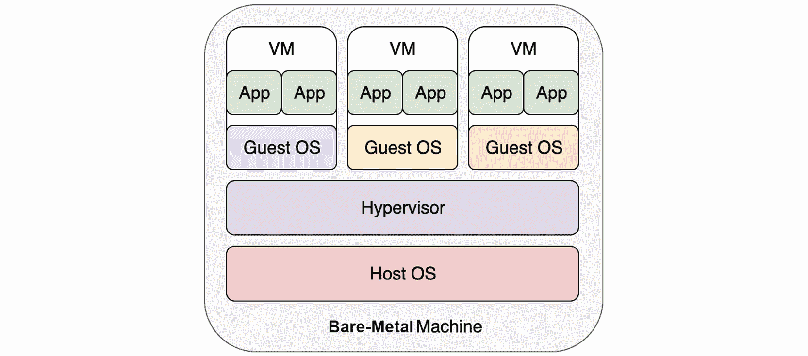

图 1.1：在虚拟机上运行应用程序

在这里，虚拟机具有完整的操作系统堆栈，虚拟机上运行的操作系统（称为“客户操作系统”）必须依赖底层的虚拟化监控程序才能运行。应用程序和操作系统驻留并在虚拟机内运行。它们的操作经过客户操作系统的内核，然后由虚拟化监控程序翻译成系统调用，最终在主机操作系统上执行。

另一方面，容器不需要底层的虚拟化监控程序。通过利用一些 Linux 容器化技术，如命名空间和 cgroups（我们稍后会重新讨论），每个容器都可以独立地在主机操作系统上运行。下图说明了容器化，以 Docker 容器为例：

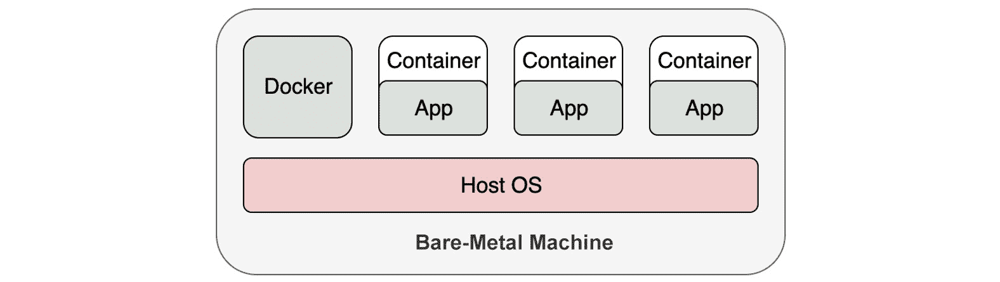

图 1.2：在容器中运行应用程序

值得一提的是，我们将 Docker 放在容器旁边，而不是在容器和主机操作系统之间。这是因为从技术上讲，没有必要让 Docker 引擎托管这些容器。Docker 引擎更多地扮演着一个管理者的角色，来管理容器的生命周期。将 Docker 引擎比作虚拟化监控程序也是不恰当的，因为一旦容器启动运行，我们就不需要额外的层来“翻译”应用程序操作，使其能够被主机操作系统理解。从*图 1.2*中，你也可以看出容器内的应用程序实质上是直接在主机操作系统上运行的。

当我们启动一个容器时，我们不需要启动整个操作系统；相反，它利用了主机操作系统上 Linux 内核的特性。因此，与虚拟机相比，容器启动更快，功能开销更小，占用的空间也要少得多。以下是一个比较虚拟机和容器的表格：

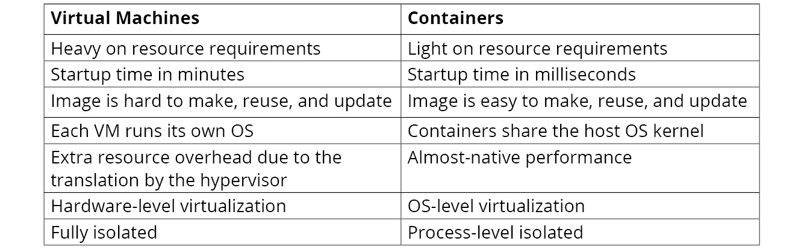

图 1.3：虚拟机和容器的比较

从这个比较来看，容器在所有方面都胜过虚拟机，除了隔离性。容器所利用的 Linux 容器技术并不新鲜。关键的 Linux 内核特性，命名空间和 cgroup（我们将在本章后面学习）已经存在了十多年。在 Docker 出现之前，还有一些旧的容器实现，如 LXC 和 Cloud Foundry Warden。现在，一个有趣的问题是：鉴于容器技术有这么多好处，为什么它在最近几年才被采用，而不是十年前？我们将在接下来的章节中找到这个问题的一些答案。

# Docker 基础知识

到目前为止，我们已经看到了容器化相对于在虚拟机上运行应用程序提供的不同优势。Docker 是目前最常用的容器化技术。在本节中，我们将从一些 Docker 基础知识开始，并进行一些练习，让您亲身体验使用 Docker 的工作。

注意

除了 Docker 之外，还有其他容器管理器，如 containerd 和 podman。它们在功能和用户体验方面表现不同，例如，containerd 和 podman 被称为比 Docker 更轻量级，比 Kubernetes 更合适。然而，它们都符合**Open Container Initiatives** (**OCI**)标准，以确保容器镜像兼容。

尽管 Docker 可以安装在任何操作系统上，但你应该知道，在 Windows 和 macOS 上，它实际上创建了一个 Linux 虚拟机（或者在 macOS 中使用类似的虚拟化技术，如 HyperKit），并将 Docker 嵌入到虚拟机中。在本章中，我们将使用 Ubuntu 18.04 LTS 作为操作系统，以及 Docker Community Edition 18.09.7。

在继续之前，请确保按照*前言*中的说明安装了 Docker。您可以通过使用以下命令查询 Docker 的版本来确认 Docker 是否已安装：

```
docker --version
```

您应该看到以下输出：

```
Docker version 18.09.7, build 2d0083d
```

注意

以下部分中的所有命令都是以`root`身份执行的。在终端中输入`sudo -s`，然后在提示时输入管理员密码，以获取 root 访问权限。

## docker run 背后是什么？

安装 Docker 后，运行容器化应用程序非常简单。为了演示目的，我们将使用 Nginx web 服务器作为示例应用程序。我们可以简单地运行以下命令来启动 Nginx 服务器：

```
docker run -d nginx
```

你应该看到类似的结果：

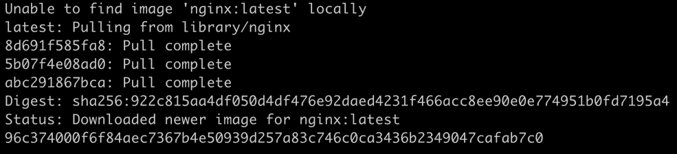

图 1.4：启动 Nginx

这个命令涉及几个动作，描述如下：

1.  `docker run`告诉 Docker 引擎运行一个应用程序。

1.  `-d`参数（`--detach`的缩写）强制应用程序在后台运行，这样你就看不到应用程序在终端的输出。相反，你必须运行`docker logs <container ID>`来隐式获取输出。

注意

“分离”模式通常意味着应用程序是一个长时间运行的服务。

1.  最后一个参数`nginx`表示应用程序所基于的镜像名称。该镜像封装了 Nginx 程序及其依赖项。

输出日志解释了一个简要的工作流程：首先，它尝试在本地获取`nginx`镜像，但失败了，所以它从公共镜像仓库（稍后我们将重新讨论的 Docker Hub）中检索了镜像。一旦镜像在本地下载完成，它就使用该镜像启动一个实例，然后输出一个 ID（在前面的示例中，这是`96c374…`），用于标识运行中的实例。正如你所看到的，这是一个十六进制字符串，你可以在实践中使用前四个或更多的唯一字符来引用任何实例。你应该看到，即使`docker`命令的终端输出也会截断 ID。

可以使用以下命令验证运行实例：

```
docker ps
```

你应该看到以下结果：

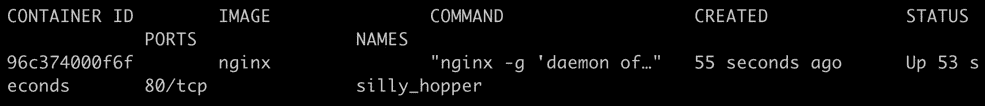

图 1.5：获取所有正在运行的 Docker 容器的列表

`docker ps`命令列出所有正在运行的容器。在前面的示例中，只有一个名为`nginx`的容器正在运行。与在物理机器或虚拟机上本地运行的典型 Nginx 发行版不同，`nginx`容器以隔离的方式运行。`nginx`容器默认不会在主机端口上公开其服务。相反，它在其容器的端口上提供服务，这是一个隔离的实体。我们可以通过调用容器 IP 的端口`80`来访问`nginx`服务。

首先，让我们通过运行以下命令获取容器 IP：

```
docker inspect --format '{{.NetworkSettings.IPAddress}}' <Container ID or NAME>
```

您应该看到以下输出（具体内容可能因您的本地环境而异）：

```
172.17.0.2
```

正如您所看到的，在这种情况下，`nginx`容器的 IP 地址为`172.17.0.2`。让我们通过在端口`80`上访问此 IP 来检查 Nginx 是否有响应：

```
curl <container IP>:80
```

您应该看到以下输出：

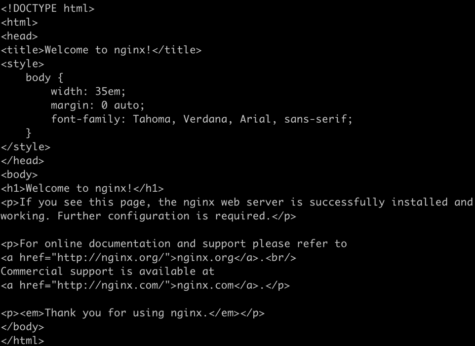

图 1.6：Nginx 容器的响应

正如您在*图 1.6*中所看到的，我们得到了一个响应，它显示在终端上作为默认主页的源 HTML。

通常，我们不依赖内部 IP 来访问服务。更实际的方法是在主机的某个端口上暴露服务。要将主机端口`8080`映射到容器端口`80`，请使用以下命令：

```
docker run -p 8080:80 -d nginx
```

您应该看到类似的响应：

```
39bf70d02dcc5f038f62c276ada1675c25a06dd5fb772c5caa19f02edbb0622a
```

`-p 8080:80`参数告诉 Docker Engine 启动容器并将主机端口 8080 上的流量映射到容器内部的端口`80`。现在，如果我们尝试在端口`8080`上访问`localhost`，我们将能够访问容器化的`nginx`服务。让我们试一试：

```
curl localhost:8080
```

您应该看到与*图 1.6*中相同的输出。

Nginx 是一种没有固定终止时间的工作负载的示例，也就是说，它不仅仅显示输出然后终止。这也被称为**长时间运行的服务**。另一种工作负载，只是运行到完成并退出的类型，称为**短时间服务**，或简称为**作业**。对于运行作业的容器，我们可以省略`-d`参数。以下是作业的一个示例：

```
docker run hello-world
```

您应该看到以下响应：

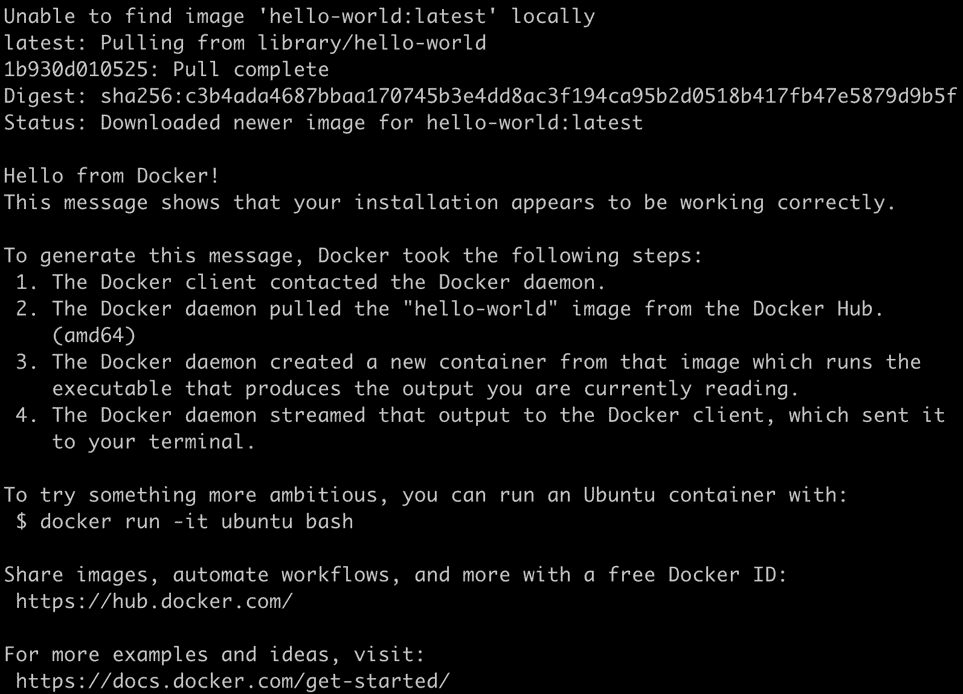

图 1.7：运行 hello-world 镜像

现在，如果您运行`docker ps`，这是用于列出运行中容器的命令，它不会显示`hello-world`容器。这是预期的，因为容器已经完成了它的工作（即，打印出我们在上一个截图中看到的响应文本）并退出了。为了能够找到已退出的容器，您可以使用相同的命令加上`-a`标志运行，这将显示所有容器：

```
docker ps -a
```

您应该看到以下输出：

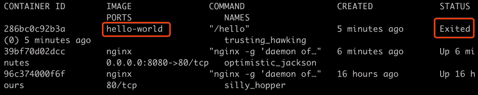

图 1.8：检查我们的已退出容器

对于已停止的容器，您可以使用`docker rm <container ID>`删除它，或者使用`docker run <container ID>`重新运行它。或者，如果您重新运行`docker run hello-world`，它将再次启动一个新的容器，并在完成工作后退出。您可以按照以下步骤自行尝试：

```
docker run hello-world
docker ps -a
```

您应该看到以下输出：

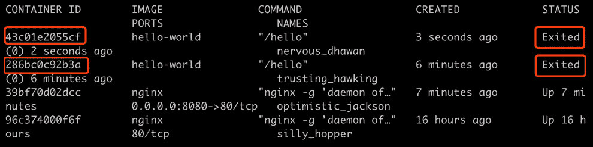

图 1.9：检查多个已退出的容器

因此，您可以看到基于相同基础镜像运行多个容器是非常简单的。

到目前为止，您应该对容器是如何启动以及如何检查其状态有了非常基本的了解。

## Dockerfile 和 Docker 镜像

在虚拟机时代，没有标准或统一的方式来抽象和打包各种类型的应用程序。传统的方法是使用工具，比如 Ansible，来管理每个应用程序的安装和更新过程。这种方法现在仍在使用，但它涉及大量的手动操作，并且由于不同环境之间的不一致性而容易出错。从开发人员的角度来看，应用程序是在本地机器上开发的，这与分级和最终生产环境大不相同。

那么，Docker 是如何解决这些问题的呢？它带来的创新被称为`Dockerfile`和 Docker 镜像。`Dockerfile`是一个文本文件，它抽象了一系列指令来构建一个可重现的环境，包括应用程序本身以及所有的依赖项。

通过使用`docker build`命令，Docker 使用`Dockerfile`生成一个名为 Docker 镜像的标准化实体，您可以在几乎任何操作系统上运行它。通过利用 Docker 镜像，开发人员可以在与生产环境相同的环境中开发和测试应用程序，因为依赖项被抽象化并捆绑在同一个镜像中。让我们退一步，看看我们之前启动的`nginx`应用程序。使用以下命令列出所有本地下载的镜像：

```
docker images
```

您应该看到以下列表：

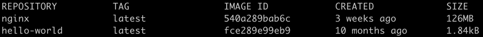

图 1.10：获取镜像列表

与虚拟机镜像不同，Docker 镜像只捆绑必要的文件，如应用程序二进制文件、依赖项和 Linux 根文件系统。在内部，Docker 镜像被分成不同的层，每个层都堆叠在另一个层上。这样，升级应用程序只需要更新相关的层。这既减少了镜像的占用空间，也减少了升级时间。

以下图显示了一个假想的 Docker 镜像的分层结构，该镜像是从基本操作系统层（Ubuntu）、Java Web 应用程序运行时层（Tomcat）和最顶层的用户应用程序层构建而成：


图 1.11：容器中堆叠层的示例

请注意，通常会使用流行操作系统的镜像作为构建 Docker 镜像的起点（正如您将在以下练习中看到的），因为它方便地包含了开发应用程序所需的各种组件。在上述假设的容器中，应用程序将使用 Tomcat 以及 Ubuntu 中包含的一些依赖项才能正常运行。这是将 Ubuntu 包含为基础层的唯一原因。如果我们愿意，我们可以在不包含整个 Ubuntu 基础镜像的情况下捆绑所需的依赖项。因此，不要将其与虚拟机的情况混淆，虚拟机需要包含一个客户操作系统的情况。

让我们看看如何在以下练习中为我们自己构建一个 Docker 镜像。

## 练习 1.01：创建 Docker 镜像并将其上传到 Docker Hub

在这个练习中，我们将为一个用 Go 语言编写的简单应用程序构建一个 Docker 镜像。

在这个练习中，我们将使用 Go，这样源代码和它的语言依赖可以编译成一个可执行的二进制文件。然而，你可以自由选择任何你喜欢的编程语言；只要记得如果你要使用 Java、Python、Node.js 或任何其他语言，就要捆绑语言运行时依赖。

1.  在这个练习中，我们将创建一个名为`Dockerfile`的文件。请注意，这个文件名没有扩展名。你可以使用你喜欢的文本编辑器创建这个文件，内容如下：

```
FROM alpine:3.10
COPY k8s-for-beginners /
CMD ["/k8s-for-beginners"]
```

注意

从终端，无论你是使用 vim 或 nano 这样的简单文本编辑器，还是使用`cat`命令创建文件，它都会被创建在当前工作目录中，无论是在任何 Linux 发行版还是 macOS 中。当你打开终端时，默认的工作目录是`/home/`。如果你想使用不同的目录，请在遵循本书中的任何练习步骤时考虑这一点。

第一行指定了要使用的基础镜像。这个示例使用了 Alpine，一个流行的基础镜像，只占用大约 5MB，基于 Alpine Linux。第二行将一个名为`k8s-for-beginners`的文件从`Dockerfile`所在的目录复制到镜像的根目录。在这个示例中，我们将构建一个微型网络服务器，并将其编译成一个名为`k8s-for-beginners`的二进制文件，该文件将放在与`Dockerfile`相同的目录中。第三行指定了默认的启动命令。在这种情况下，我们只是启动我们的示例网络服务器。

1.  接下来，让我们构建我们的示例网络服务器。创建一个名为`main.go`的文件，内容如下：

```
package main
import (
        "fmt"
        "log"
        "net/http"
)
func main() {
        http.HandleFunc("/", handler)
        log.Fatal(http.ListenAndServe("0.0.0.0:8080", nil))
}
func handler(w http.ResponseWriter, r *http.Request) {
        log.Printf("Ping from %s", r.RemoteAddr)
        fmt.Fprintln(w, "Hello Kubernetes Beginners!")
}
```

正如你可以从`func main()`中观察到的那样，这个应用程序充当一个网络服务器，在 8080 端口的根路径接受传入的 HTTP 请求，并用消息`Hello Kubernetes Beginners`做出响应。

1.  要验证这个程序是否有效，你可以运行`go run main.go`，然后在浏览器上打开[`http://localhost:8080`](http://localhost:8080)。你应该会得到"`Hello Kubernetes Beginners!`"的输出。

1.  使用`go build`将运行时依赖和源代码编译成一个可执行的二进制文件。在终端中运行以下命令：

```
CGO_ENABLED=0 GOOS=linux GOARCH=amd64 go build -o k8s-for-beginners
```

注意

与*步骤 3*不同，参数`GOOS=linux GOARCH=amd64`告诉 Go 编译器在特定平台上编译程序，这与我们将要构建的 Linux 发行版兼容。`CGO_ENABLED=0`旨在生成一个静态链接的二进制文件，以便它可以与一些最小定制的镜像一起工作（例如 alpine）。

1.  现在，检查`k8s-for-beginners`文件是否已创建：

```
ls
```

您应该会看到以下响应：

```
Dockerfile k8s-for-beginners  main.go
```

1.  现在我们有了`Dockerfile`和可运行的二进制文件。使用以下命令构建 Docker 镜像：

```
docker build -t k8s-for-beginners:v0.0.1 .
```

不要错过这个命令末尾的点（`.`）。您应该会看到以下响应：

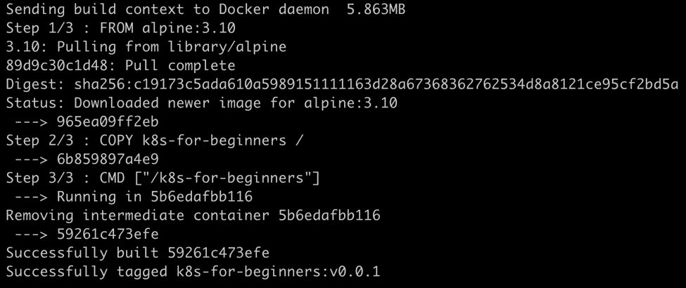

图 1.12：docker build 命令的输出

我们使用的命令中有两个参数：`-t k8s-for-beginners:v0.0.1`为镜像提供了一个格式为`<imagename:version>`的标签，而`.`（命令末尾的点）表示查找`Dockerfile`的路径。在这种情况下，`.`指的是当前工作目录。

注意

如果您克隆了本章的 GitHub 存储库，您会发现我们在每个目录中都提供了`Dockerfile`的副本，以便您可以方便地通过转到该目录运行`docker build`命令。

1.  现在，我们本地有了`k8s-for-beginners:v0.0.1`镜像。您可以通过运行以下命令来确认：

```
docker images
```

您应该会看到以下响应：

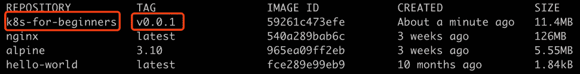

图 1.13：验证我们的 Docker 镜像是否已创建

一个有趣的观察是，该镜像仅占用 11.4 MB，其中包括 Linux 系统文件和我们的应用程序。这里的建议是只在 Docker 镜像中包含必要的文件，使其紧凑，以便易于分发和管理。

现在我们已经构建了我们的镜像，接下来我们将在容器中运行它。另一个需要注意的是，目前这个镜像驻留在我们的本地机器上，我们只能在本地机器上使用它构建一个容器。然而，将应用程序与其依赖项打包的优势在于它可以轻松地在不同的机器上运行。为了方便起见，我们可以将我们的镜像上传到在线 Docker 镜像仓库，如 Docker Hub（[`hub.docker.com/`](https://hub.docker.com/)）。

注意：

除了 Docker Hub，还有其他公共镜像仓库，如[quay.io](http://quay.io)，[gcr.io](http://gcr.io)等。您可以参考各自仓库的文档，以正确配置在您的 Docker 客户端中。

## 练习 1.02：在 Docker 中运行您的第一个应用程序

在*练习 1.01*中，*创建 Docker 镜像并将其上传到 Docker Hub*，我们将 Web 应用程序打包成 Docker 镜像。在这个练习中，我们将运行它并将其推送到 Docker Hub：

1.  首先，我们应该通过在终端中运行以下命令清理掉上一个练习中的任何残留容器：

```
docker rm -f $(docker ps -aq)
```

您应该看到以下响应：

```
43c01e2055cf
286bc0c92b3a
39bf70d02dcc
96c374000f6f
```

我们已经看到`docker ps -a`返回所有容器的信息。`-aq`标志中的额外`q`表示“安静”，该标志只会显示数字 ID。这些 ID 将被传递给`docker rm -f`，因此所有容器将被强制删除。

1.  运行以下命令启动 web 服务器：

```
docker run -p 8080:8080 -d k8s-for-beginners:v0.0.1
```

您应该看到以下响应：

```
9869e9b4ab1f3d5f7b2451a7086644c1cd7393ac9d78b6b4c1bef6d423fd25ac
```

如前述命令中所示，我们将容器的内部端口`8080`映射到主机的端口`8080`。由`-p`前置的`8080:8080`参数将容器的端口`8080`映射到主机上的端口`8080`。`-d`参数表示分离模式。默认情况下，Docker 首先检查本地注册表。因此，在这种情况下，将使用本地 Docker 镜像来启动容器。

1.  现在，让我们通过向`localhost`的端口`8080`发送 HTTP 请求来检查它是否按预期工作：

```
curl localhost:8080
```

`curl`命令检查来自指定地址的响应。您应该看到以下响应：

```
Hello Kubernetes Beginners!
```

1.  我们还可以使用以下命令观察运行容器的日志：

```
docker logs <container ID>
```

您应该看到以下日志：

```
2019/11/18  05:19:41 Ping from 172.17.0.1:41416
```

注意

在运行以下命令之前，您应该注册一个 Docker Hub 帐户，并准备好您的用户名和密码。

1.  最后，我们需要登录到 Docker Hub，然后将本地镜像推送到远程 Docker Hub 注册表。使用以下命令：

```
docker login
```

现在在提示时输入您的 Docker Hub 帐户的用户名和密码。您应该看到以下响应：

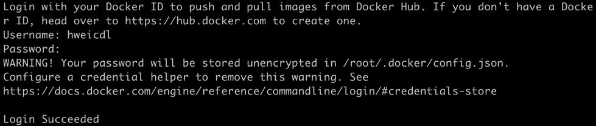

图 1.14：登录到 Docker Hub

1.  接下来，我们将把本地镜像`k8s-for-beginners:v0.0.1`推送到远程 Docker Hub 注册表。运行以下命令：

```
docker push k8s-for-beginners:v0.0.1
```

您应该看到以下响应：

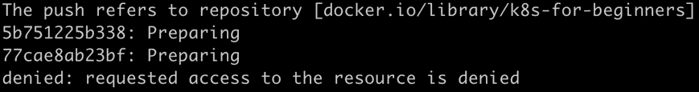

图 1.15：无法将图像推送到 Docker Hub

但是，等等，为什么它说“`请求访问被拒绝`”?那是因为`docker push`后面的参数必须符合`<username/imagename:version>`的命名约定。在上一个练习中，我们指定了一个本地图像标签，`k8s-for-beginners:v0.0.1`，没有用户名。在`docker push`命令中，如果没有指定用户名，它将尝试将其推送到默认用户名`library`的存储库，该存储库还托管一些知名库，如 Ubuntu、nginx 等。

1.  要将我们的本地图像推送到我们自己的用户，我们需要通过运行`docker tag <imagename:version> <username/imagename:version>`来为本地图像提供符合规范的名称，如下命令所示：

```
docker tag k8s-for-beginners:v0.0.1 <your_DockerHub_username>/k8s-for-beginners:v0.0.1
```

1.  您可以使用以下命令验证图像是否已正确标记：

```
docker images
```

您应该看到以下输出：

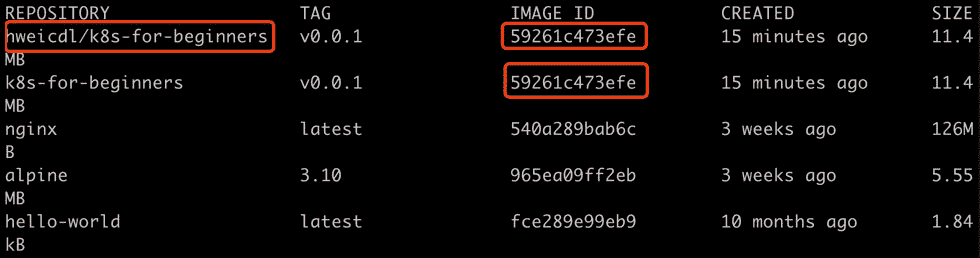

图 1.16：检查标记的 Docker 图像

标记正确后，您可以看到新图像实际上与旧图像具有相同的`IMAGE ID`，这意味着它们是相同的图像。

1.  现在我们已经适当地标记了图像，我们准备通过运行以下命令将此图像推送到 Docker Hub：

```
docker push <your_username>/k8s-for-beginners:v0.0.1
```

您应该看到类似于此的响应：

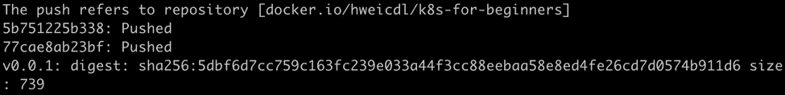

图 1.17：图像成功推送到 Docker Hub

1.  图像将在 Docker Hub 上短时间后上线。您可以通过在以下链接中用您的用户名替换`<username>`来验证它：`https://hub.docker.com/repository/docker/<username>/k8s-for-beginners/tags`。

您应该能够看到有关您的图像的一些信息，类似于以下图像：

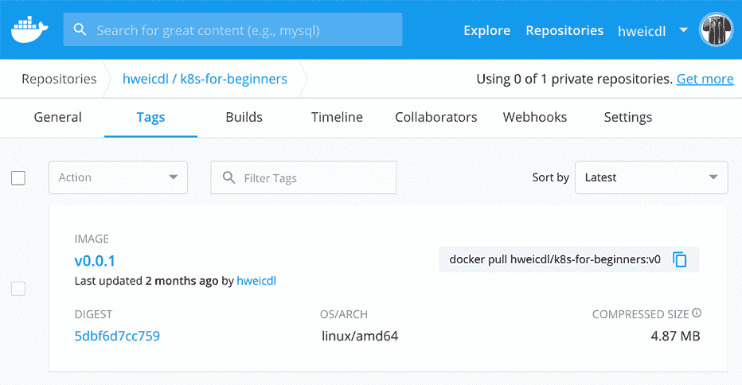

图 1.18：我们图像的 Docker Hub 页面

现在我们的 Docker 图像对任何人都是公开可访问的，就像我们在本章开头使用的`nginx`图像一样。

在这一部分，我们学习了如何构建 Docker 镜像并将其推送到 Docker Hub。尽管看起来不起眼，但这是我们第一次拥有一个统一的机制来一致地管理应用程序及其依赖项，跨所有环境。Docker 镜像及其底层分层文件系统也是容器技术近年来被广泛采用的**主要原因**，与十年前相比。

在下一节中，我们将深入了解 Docker，看看它如何利用 Linux 容器技术。

# Linux 容器技术的本质

所有事物从外表看起来都优雅而简单。但是在底层是如何运作的，让一个容器如此强大？在这一部分，我们将尝试打开引擎盖，看看里面。让我们来看看一些为容器奠定基础的 Linux 技术。

## 命名空间

容器依赖的第一个关键技术称为 Linux 命名空间。当 Linux 系统启动时，它会创建一个默认命名空间（`root`命名空间）。然后，默认情况下，稍后创建的进程将加入相同的命名空间，因此它们可以无限制地相互交互。例如，两个进程能够查看同一文件夹中的文件，并通过`localhost`网络进行交互。这听起来很简单，但从技术上讲，这都归功于连接所有进程的`root`命名空间。

为了支持高级用例，Linux 提供了命名空间 API，以便将不同的进程分组到不同的命名空间中，这样只有属于同一命名空间的进程才能相互感知。换句话说，不同组的进程被隔离。这也解释了为什么我们之前提到 Docker 的隔离是进程级别的。以下是 Linux 内核支持的命名空间类型列表：

+   挂载命名空间

+   PID（进程 ID）命名空间

+   网络命名空间

+   IPC（进程间通信）命名空间

+   UTS（Unix 时间共享系统）命名空间

+   用户命名空间（自 Linux 内核 3.8 以来）

+   Cgroup 命名空间（自 Linux 内核 4.6 以来）

+   时间命名空间（将在未来版本的 Linux 内核中实现）

为了简洁起见，我们将选择两个简单的（UTS 和 PID）并使用具体示例来解释它们如何在 Docker 中体现。

注意

如果你正在运行 macOS，一些以下命令将需要以不同的方式使用，因为我们正在探索 Linux 的特性。Docker 在 macOS 上使用 HyperKit 在 Linux VM 中运行。因此，你需要打开另一个终端会话并登录到 VM 中：

`screen ~/Library/Containers/com.docker.docker/Data/vms/0/tty`

运行此命令后，你可能会看到一个空屏幕。按 *Enter*，你应该获得运行 Docker 的 VM 的 root 访问权限。要退出会话，你可以按 *Ctrl* *+* *A* *+* *K*，然后在要求确认关闭窗口时按 *Y*。 

我们建议您使用另一个终端窗口访问 Linux VM。如果你使用 macOS，我们将提到需要在此终端会话中运行哪些命令。如果你使用任何 Linux 操作系统，你可以忽略这一点，并在同一个终端会话中运行所有命令，除非在说明中另有说明。

创建 Docker 容器后，Docker 会创建并关联一些命名空间到容器。例如，让我们看看在上一节中创建的示例容器。让我们使用以下命令：

```
docker inspect --format '{{.State.Pid}}' <container ID>
```

上述命令检查在主机操作系统上运行的容器的 PID。你应该看到类似以下的响应：

```
5897
```

在这个例子中，PID 是 `5897`，正如你在前面的响应中所看到的。现在，在 Linux VM 中运行以下命令：

```
ps -ef | grep k8s-for-beginners
```

这应该产生类似于以下内容的输出：

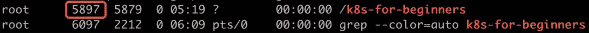

图 1.19：检查我们进程的 PID

`ps -ef` 命令列出主机操作系统上所有正在运行的进程，然后 `| grep k8s-for-beginners` 过滤此列表，以显示名称中包含 `k8s-for-beginners` 的进程。我们可以看到该进程还具有 PID `5897`，这与第一个命令一致。这揭示了一个重要的事实，即容器只是直接在主机操作系统上运行的特定进程。

接下来，运行此命令：

```
ls -l /proc/<PID>/ns
```

对于 macOS，在 VM 终端中运行此命令。你应该看到以下输出：

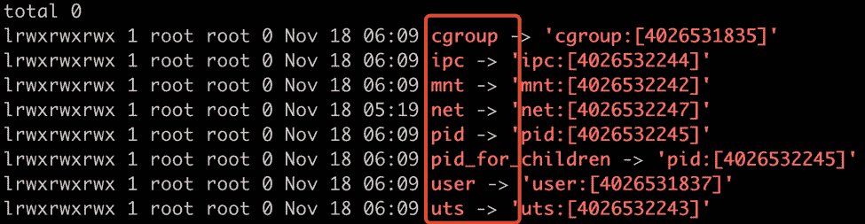

图 1.20：列出为我们的容器创建的不同命名空间

此命令检查`/proc`文件夹（这是一个 Linux 伪文件系统），列出了随着容器启动创建的所有命名空间。结果显示了一些众所周知的命名空间（看一下突出显示的矩形），如`uts`、`pid`、`net`等。让我们仔细看看它们。

`uts`命名空间被创建，以使容器具有其主机名，而不是主机的主机名。默认情况下，容器被分配其容器 ID 作为主机名，并且可以在运行容器时使用`-h`参数进行更改，如下所示：

```
docker run -h k8s-for-beginners -d packtworkshops/the-kubernetes-workshop:k8s-for-beginners
```

这应该给出以下响应：

```
df6a15a8e2481ec3e46dedf7850cb1fbef6efafcacc3c8a048752da24ad793dc
```

使用返回的容器 ID，我们可以进入容器并使用以下两个命令依次检查其主机名：

```
docker exec -it <container ID> sh
hostname
```

您应该看到以下响应：

```
k8s-for-beginners
```

`docker exec`命令尝试进入容器并执行`sh`命令，在容器内启动 shell。一旦我们进入容器，我们运行`hostname`命令来检查容器内的主机名。从输出中，我们可以看出`-h`参数正在生效，因为我们可以看到`k8s-for-beginners`作为主机名。

除了`uts`命名空间，容器还在其自己的`PID`命名空间中进行隔离，因此它只能查看由自己启动的进程，而启动进程（由我们在*练习 1.01*中创建的`Dockerfile`中的`CMD`或`ENTRYPOINT`指定）被分配为`PID` `1`。让我们通过依次输入以下两个命令来看一下这个：

```
docker exec -it <container ID> sh
ps
```

您应该看到以下响应：


图 1.21：容器内的进程列表

Docker 为容器提供了`--pid`选项，以加入另一个容器的 PID 命名空间。

除了`uts`和`pid`命名空间，Docker 还利用了一些其他命名空间。我们将在下一个练习中检查网络命名空间（*图 1.20*中的"`net`"）。

## 练习 1.03：将一个容器加入另一个容器的网络命名空间

在这个练习中，我们将重新创建`k8s-for-beginners`容器，而不进行主机映射，然后创建另一个容器加入其网络命名空间：

1.  与之前的练习一样，通过运行以下命令删除所有现有容器：

```
docker rm -f $(docker ps -aq)
```

您应该看到类似于这样的输出：

```
43c01e2055cf
286bc0c92b3a
39bf70d02dcc
96c374000f6f
```

1.  现在，开始使用以下命令运行我们的容器：

```
docker run -d packtworkshops/the-kubernetes-workshop:k8s-for-beginners
```

您应该会看到以下响应：

```
33003ddffdf4d85c5f77f2cae2528cb2035d37f0a7b7b46947206ca104bbbaa5
```

1.  接下来，我们将获取正在运行的容器列表，以便查看容器的 ID：

```
docker ps
```

您应该会看到以下响应：

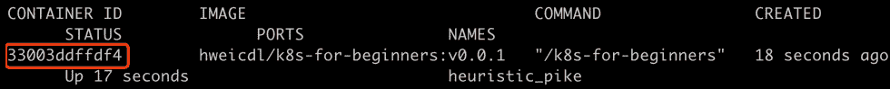

图 1.22：获取所有正在运行的容器列表

1.  现在，我们将在与我们在*步骤 1*中创建的容器相同的网络命名空间中运行一个名为`netshoot`的镜像，使用`--net`参数：

```
docker run -it --net container:<container ID> nicolaka/netshoot
```

使用我们在上一步中获得的先前容器的容器 ID。您应该会看到类似于以下响应：

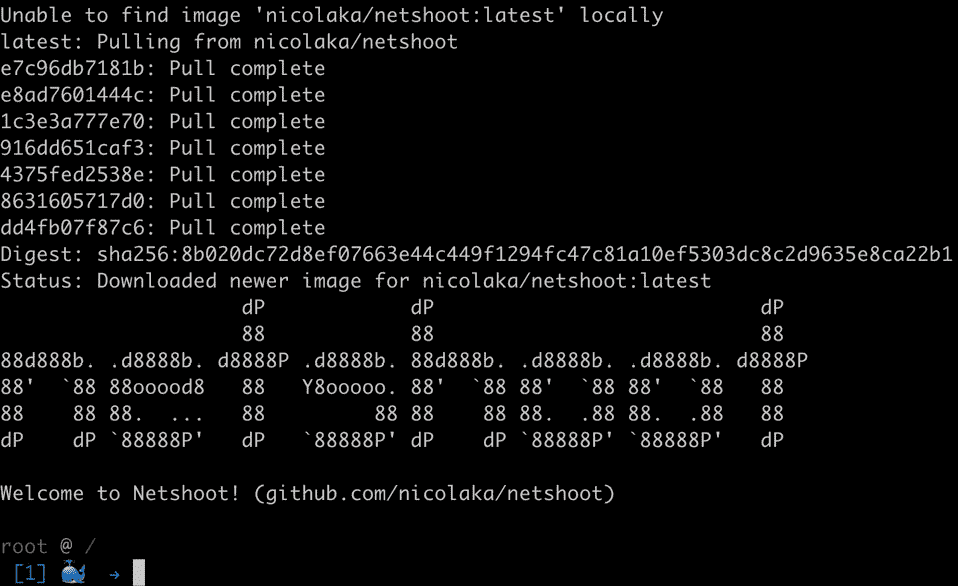

图 1.23：启动 netshoot 容器

`nicolaka/netshoot`是一个打包了一些常用网络库（如`iproute2`、`curl`等）的微型镜像。

1.  现在，让我们在`netshoot`内部运行`curl`命令，以检查我们是否能够访问`k8s-for-beginners`容器：

```
curl localhost:8080
```

您应该会看到以下响应：

```
Hello Kubernetes Beginners!
```

前面的示例证明了`netshoot`容器是通过加入`k8s-for-beginners`的网络命名空间而创建的；否则，在`localhost`上访问端口`8080`就不会得到响应。

1.  这也可以通过在接下来的步骤中验证两个容器的网络命名空间 ID 来进行验证。

为了确认我们的结果，让我们首先在不退出`netshoot`容器的情况下打开另一个终端。获取容器列表以确保两个容器都在运行：

```
docker ps
```

您应该会看到以下响应：

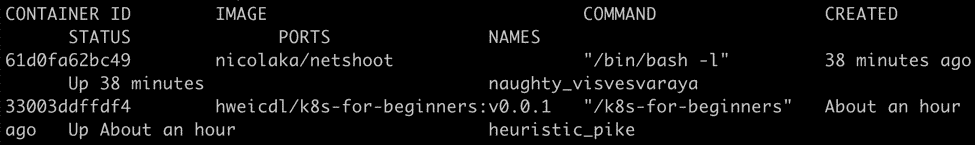

图 1.24：检查 k8s-for-beginners 和 netshoot 容器是否都在线

1.  接下来，获取`k8s-for-beginners`容器的 PID：

```
docker inspect --format '{{.State.Pid}}' <container ID>
```

您应该会看到以下响应：

```
7311
```

如您所见，此示例的 PID 为`7311`。

1.  现在使用前面的 PID 获取进程的伪文件系统：

```
ls -l /proc/<PID>/ns/net
```

如果您使用的是 macOS，请在另一个终端会话中在 Linux VM 上运行此命令。在此命令中使用您在上一步中获得的 PID。您应该会看到以下响应：

```
lrwxrwxrwx 1 root root 0 Nov 19 08:11 /proc/7311/ns/net -> 'net:[4026532247]'
```

1.  同样地，使用以下命令获取`netshoot`容器的 PID：

```
docker inspect --format '{{.State.Pid}}' <container ID>
```

在此命令中使用*步骤 6*中的适当容器 ID。您应该会看到以下响应：

```
8143
```

如您所见，`netshoot` 容器的 PID 是 `8143`。

1.  接下来，我们可以通过其 PID 或使用此命令获取其伪文件系统：

```
ls -l /proc/<PID>/ns/net
```

如果您使用 macOS，在另一个会话中在 Linux VM 上运行此命令。在此命令中使用上一步中的 PID。您应该会看到以下响应：

```
lrwxrwxrwx 1 root root 0 Nov 19 09:15 /proc/8143/ns/net -> 'net:[4026532247]'
```

正如您从 *步骤 8* 和 *步骤 10* 的输出中所观察到的，这两个容器共享相同的网络命名空间（`4026532247`）。

1.  作为最后的清理步骤，让我们删除所有的容器：

```
docker rm -f $(docker ps -aq)
```

您应该会看到类似以下的响应：

```
61d0fa62bc49
33003ddffdf4
```

1.  如果您想要将容器加入到主机的根命名空间中怎么办？嗯，`--net host` 是实现这一目标的好方法。为了演示这一点，我们将使用相同的镜像启动一个容器，但使用 `--net host` 参数：

```
docker run --net host -d packtworkshops/the-kubernetes-workshop:k8s-for-beginners
```

您应该会看到以下响应：

```
8bf56ca0c3dc69f09487be759f051574f291c77717b0f8bb5e1760c8e20aebd0
```

1.  现在，列出所有正在运行的容器：

```
docker ps
```

您应该会看到以下响应：

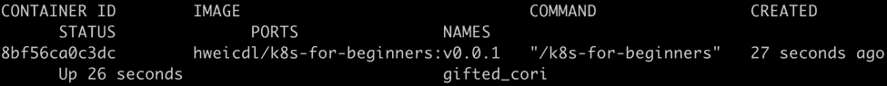

图 1.25：列出所有容器

1.  使用以下命令获取正在运行的容器的 PID：

```
docker inspect --format '{{.State.Pid}}' <container ID>
```

在此命令中使用适当的容器 ID。您应该会看到以下响应：

```
8380
```

1.  通过查找 PID 查找网络命名空间 ID：

```
ls -l /proc/<PID>/ns/net
```

如果您使用 macOS，在 Linux VM 上运行此命令。在此命令中使用适当的 PID。您应该会看到以下响应：

```
lrwxrwxrwx 1 root root 0 Nov 19 09:20 /proc/8380/ns/net -> 'net:[4026531993]'
```

您可能会对 `4026531993` 命名空间感到困惑。通过给出 `--net host` 参数，Docker 不应该绕过创建新的命名空间吗？答案是这不是一个新的命名空间；事实上，它就是前面提到的 Linux 根命名空间。我们将在下一步中确认这一点。

1.  获取主机操作系统的 PID `1` 的命名空间：

```
ls -l /proc/1/ns/net
```

如果您使用 macOS，在 Linux VM 上运行此命令。您应该会看到以下响应：

```
lrwxrwxrwx 1 root root 0 Nov 19 09:20 /proc/1/ns/net -> 'net:[4026531993]'
```

正如您在此输出中所看到的，主机的这个命名空间与我们在 *步骤 15* 中看到的容器的命名空间是相同的。

通过这个练习，我们可以对容器如何被隔离到不同的命名空间以及哪些 Docker 参数可以用来与其他命名空间相关联有所了解。

## Cgroups

默认情况下，无论容器加入哪个命名空间，它都可以使用主机的所有可用资源。这当然不是我们在系统上运行多个容器时想要的情况；否则，一些容器可能会独占所有容器共享的资源。

为了解决这个问题，Linux 内核版本 2.6.24 以后引入了 **cgroups**（**Control Groups** 的缩写）功能，用于限制进程的资源使用。使用这个功能，系统管理员可以控制最重要的资源，如内存、CPU、磁盘空间和网络带宽。

在 Ubuntu 18.04 LTS 中，默认情况下会在路径 `/sys/fs/cgroup/<cgroup type>` 下创建一系列 cgroups。

注意

您可以运行 `mount -t cgroup` 来查看 Ubuntu 中的所有 cgroups；尽管如此，我们不会在本书的范围内涉及它们，因为它们对我们来说并不是很相关。

现在，我们并不太关心系统进程及其 cgroups；我们只想关注 Docker 在整个 cgroups 图中的关系。Docker 在路径 `/sys/fs/cgroup/<resource kind>/docker` 下有其 cgroups 文件夹。使用 `find` 命令来检索列表：

```
find /sys/fs/cgroup/* -name docker -type d
```

如果您使用的是 macOS，在 Linux VM 的另一个会话中运行此命令。您应该会看到以下结果：

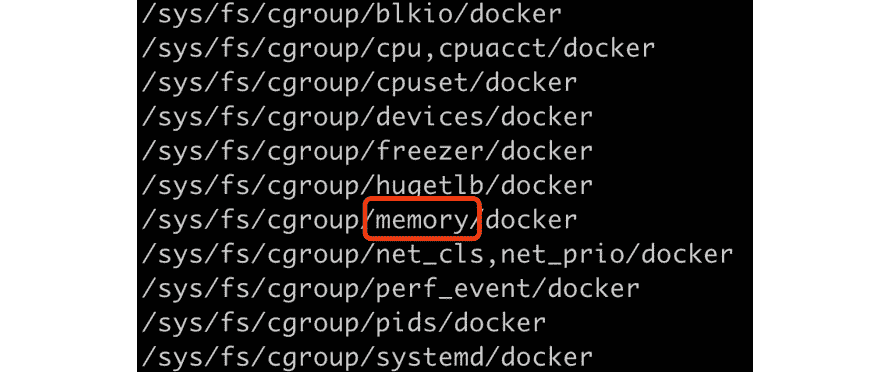

图 1.26：获取与 Docker 相关的所有 cgroups

每个文件夹都被视为一个控制组，这些文件夹是分层的，这意味着每个 cgroup 都有一个从其继承属性的父级，一直到在系统启动时创建的根 cgroup。

为了说明 cgroup 在 Docker 中的工作原理，我们将使用 *图 1.26* 中突出显示的 `memory` cgroup 作为示例。

但首先，让我们使用以下命令删除所有现有的容器：

```
docker rm -f $(docker ps -aq)
```

您应该会看到类似以下的响应：

```
61d0fa62bc49
```

让我们通过以下命令来确认：

```
docker ps
```

您应该会看到一个空列表，如下所示：

```
CONTAINER ID     IMAGE       COMMAND          CREATED          STATUS
        PORTS          NAMES
```

让我们看看是否有 `cgroup` 内存文件夹：

```
find /sys/fs/cgroup/memory/docker/* -type d
```

如果您使用的是 macOS，在 Linux VM 上运行此命令。然后您应该会看到以下响应：

```
root@ubuntu: ~# find /sys/fs/cgroup/memory/docker/* -type d
```

没有文件夹显示出来。现在，让我们运行一个容器：

```
docker run -d packtworkshops/the-kubernetes-workshop:k8s-for-beginners 
```

您应该会看到类似以下的输出：

```
8fe77332244b2ebecbda27a4496268264218c4e59614d59b5849a22b12941e1
```

再次检查 `cgroup` 文件夹：

```
find /sys/fs/cgroup/memory/docker/* -type d
```

如果您使用的是 macOS，在 Linux VM 上运行此命令。您应该会看到以下响应：

```
/sys/fs/cgroup/memory/docker/8fe77332244b2ebecbda27a4496268264218c4e59614d59b5849a22b12941e1
```

到目前为止，您可以看到一旦我们创建一个容器，Docker 就会在特定资源类型（在我们的示例中是内存）下创建其 cgroup 文件夹。现在，让我们看看在这个文件夹中创建了哪些文件：

```
ls /sys/fs/cgroup/memory/docker/8fe77332244b2ebecbd8a2704496268264218c4e59614d59b5849022b12941e1
```

如果您使用的是 macOS，在 Linux VM 上运行此命令。请使用您从上一张截图中获得的适当路径。您应该会看到以下文件列表：

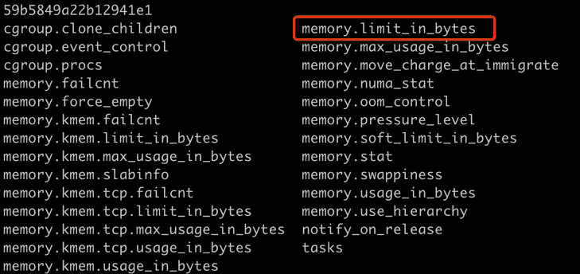

图 1.27：探索 Docker 创建的内存 cgroups

我们不会在这里介绍每个设置。 我们感兴趣的设置是`memory.limit_in_bytes`，如前所述，它表示容器可以使用多少内存。 让我们看看这个文件中写了什么值：

```
cat /sys/fs/cgroup/memory/docker/8fe77332244b2ebecbd8a2704496268264218c4e59614d59b5849022b12941e1/memory.limit_in_bytes
```

如果您使用的是 macOS，请在 Linux VM 上运行此命令。 您应该看到以下响应：

```
9223372036854771712
```

值`9223372036854771712`是 64 位系统中最大的正有符号整数（263-1），这意味着此容器可以使用无限的内存。

为了了解 Docker 如何处理过度使用声明内存的容器，我们将向您展示另一个程序，该程序消耗一定量的 RAM。 以下是一个用于逐步消耗 50 MB RAM 然后保持整个程序（休眠 1 小时）以防止退出的 Golang 程序：

```
package main
import (
        "fmt"
        "strings"
        "time"
)
func main() {
        var longStrs []string
        times := 50
        for i := 1; i <= times; i++ {
                fmt.Printf("===============%d===============\n", i)
                // each time we build a long string to consume 1MB                     (1000000 * 1byte) RAM
                longStrs = append(longStrs, buildString(1000000,                     byte(i)))
        }
        // hold the application to exit in 1 hour
        time.Sleep(3600 * time.Second)
}
// buildString build a long string with a length of `n`.
func buildString(n int, b byte) string {
        var builder strings.Builder
        builder.Grow(n)
        for i := 0; i < n; i++ {
                builder.WriteByte(b)
        }
        return builder.String()
}
```

您可以尝试使用此代码构建一个镜像，如*练习 1.01*中所示，*创建 Docker 镜像并将其上传到 Docker Hub*。 此代码将用于替换该练习中*步骤 2*中提供的代码，然后您可以使用`<username>/memconsumer`为镜像打标签。 现在，我们可以测试资源限制。 让我们使用 Docker 镜像并使用`--memory`（或`-m`）标志运行它，以指示 Docker 我们只想使用一定量的 RAM。

如果您使用的是 Ubuntu 或任何其他基于 Debian 的 Linux，在继续本章之前，如果在运行此命令时看到以下警告消息，则可能需要手动启用 cgroup 内存和交换功能：

```
docker info > /dev/null
```

这是您可能会看到的警告消息：

```
WARNING: No swap limit support
```

启用 cgroup 内存和交换功能的步骤如下：

注意

如果您使用的是 macOS，则以下三个步骤不适用。

1.  编辑`/etc/default/grub`文件（可能需要 root 权限）。 添加或编辑`GRUB_CMDLINE_LINUX`行以添加以下两个键值对：

```
GRUB_CMDLINE_LINUX="cgroup_enable=memory swapaccount=1"
```

1.  使用 root 权限运行`update-grub`。

1.  重新启动机器。

接下来，我们应该能够通过运行以下命令来限制容器的内存使用量为 100 MB：

```
docker run --name memconsumer -d --memory=100m --memory-swap=100m packtworkshops/the-kubernetes-workshop:memconsumer
```

注意

此命令拉取了我们为此演示提供的镜像。 如果您已构建了自己的镜像，可以在前面的命令中使用`<your_username>/<tag_name>`。

您应该看到以下响应：

```
WARNING: Your kernel does not support swap limit capabilities or the cgroup is not mounted. Memory limited without swap.
366bd13714cadb099c7ef6056e3b72853735473938b2e633a5cdbf9e94273143
```

这个命令禁用了交换内存的使用（因为我们在`--memory`和`--memory-swap`上指定了相同的值），以便轻松地衡量内存的消耗。

让我们检查一下我们的容器的状态：

```
docker ps
```

你应该看到以下响应：

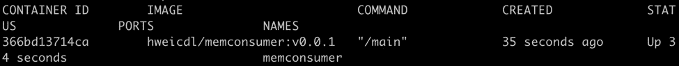

图 1.28：获取容器列表

现在，让我们通过读取容器的`cgroup`文件来确认对容器施加的限制：

```
cat /sys/fs/cgroup/memory/docker/366bd13714cadb099c7ef6056e3b7285373547e9e8b2e633a5cdbf9e94273143/memory.limit_in_bytes
```

如果您使用的是 macOS，请在 Linux VM 上运行此命令。请在此命令中使用适当的路径。你应该看到以下响应：

```
104857600
```

容器启动时请求了 100 MB 的 RAM，并且它在内部只消耗了 50 MB 的 RAM，因此可以正常运行。从 cgroup 设置中，您可以观察到该值已更新为`104857600`，这正好是 100 MB。

但是，如果容器请求少于 50 MB，而其中运行的程序需要超过 50 MB 呢？Docker 和 Linux 会如何响应？让我们来看看。

首先，让我们删除任何正在运行的容器：

```
docker rm -f $(docker ps -aq)
```

你应该看到以下响应：

```
366bd13714ca
```

接下来，我们将再次运行容器，但是我们只会请求 20 MB 的内存：

```
docker run --name memconsumer -d --memory=20m --memory-swap=20m packtworkshops/the-kubernetes-workshop:memconsumer
```

你应该看到这个响应：

```
298541bc46855a749f9f8944860a73f3f4f2799ebda7969a5eada60e3809539bab
```

现在，让我们检查一下我们的容器的状态：

```
docker ps
```

你应该看到一个空列表，就像这样：

```
CONTAINER ID     IMAGE       COMMAND      CREATED        STATUS
       PORTS          NAMES
```

如您所见，我们无法看到我们的容器。让我们列出所有类型的容器：

```
docker ps -a
```

你应该看到以下输出：

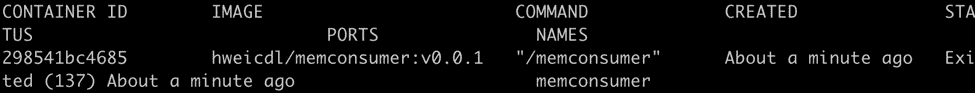

图 1.29：获取所有容器的列表

我们找到了我们的容器。它已被强制终止。可以通过检查容器日志来验证：

```
docker logs memconsumer
```

你应该看到以下输出：


图 1.30：我们终止的容器的日志

容器试图每次增加 1 MB 的内存消耗，当它达到内存限制（20 MB）时，它被杀死。

从前面的例子中，我们已经看到 Docker 如何向最终用户公开标志，以及这些标志如何与底层的 Linux cgroups 交互以限制资源使用。

## 容器化：思维方式的改变

在前面的章节中，我们看了 Linux 命名空间和 cgroups 的解剖。我们解释了容器本质上是在主机操作系统上本地运行的进程。它是一个特殊的进程，具有额外的限制，如与其他进程的操作系统级隔离和资源配额的控制。

自 Docker 1.11 以来，containerd 已被采用为默认的容器运行时，而不是直接使用 Docker Daemon（`dockerd`）来管理容器。让我们来看看这个运行时。首先，正常重启我们的容器：

```
docker run -d packtworkshops/the-kubernetes-workshop:k8s-for-beginners
```

您应该看到以下响应：

```
c7ee681ff8f73fa58cf0b37bc5ce08306913f27c5733c725f7fe97717025625d
```

我们可以使用`ps -aef --forest`来列出层次结构中所有运行的进程，然后使用`| grep containerd`来通过`containerd`关键字过滤输出。最后，我们可以使用`-A 1`来输出一行额外的内容（使用`-A 1`），以便至少有一个运行的容器显示出来：

```
ps -aef --forest | grep containerd -A 1
```

如果您正在使用 macOS，请在没有`--forest`标志的 Linux VM 上运行此命令。您应该看到以下响应：

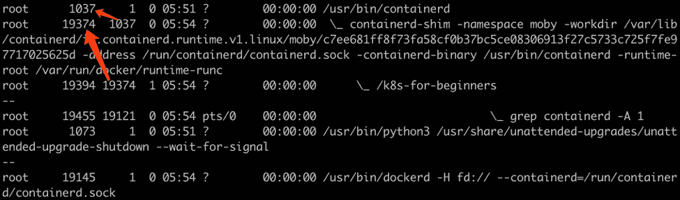

图 1.31：获取与 containerd 相关的进程

在输出中，我们可以看到`containerd`（PID `1037`）充当顶级父进程，并管理`containerd-shim`（PID `19374`），而`containerd-shim`管理`k8s-for-beginners`（PID `19394`）的大多数子进程，这是我们启动的容器。

牢记容器的核心思想可以帮助您将任何基于 VM 的应用程序迁移到基于容器的应用程序。基本上，有两种模式可以部署容器中的应用程序：

### 一个容器中的多个应用程序

这种实现需要一个监督者应用程序来启动和持有容器。然后，我们可以将应用程序放入容器作为监督者的子进程。监督者有几个变体：

+   自定义包装脚本：这需要复杂的脚本来控制受管应用程序的故障。

+   第三方工具，如 supervisord 或 systemd：在应用程序失败时，监督者负责重新启动它。

### 一个容器中的一个应用程序

这种实现不需要像之前那样的监督者。事实上，应用程序的生命周期与容器的生命周期相关联。

### 这些方法的比较

通过在单个容器中部署多个应用程序，我们实质上是将容器视为 VM。这种*容器作为轻量级 VM*的方法曾经被用作容器技术的宣传口号。然而，正如所解释的，它们在许多方面都有所不同。当然，这种方式可以节省从基于 VM 的开发/部署模型迁移到容器的工作，但它也在以下方面引入了一些缺点：

+   应用程序生命周期控制：从外部看，容器暴露为一个状态，因为它本质上是一个单一的主机进程。内部应用程序的生命周期由“监督者”管理，因此无法从外部观察。因此，从外部看，您可能会观察到容器保持健康，但其中一些应用程序可能会持续重启。它可能会因为内部应用程序的致命错误而持续重启，而您可能无法指出这一点。

+   版本升级：如果您想升级容器中的任何一个不同的应用程序，您可能需要拉下整个容器。这会导致容器中其他不需要版本升级的应用程序不必要的停机时间。因此，如果应用程序需要由不同团队开发的组件，它们的发布周期必须紧密耦合。

+   水平扩展：如果只有一个应用程序需要扩展，您别无选择，只能扩展整个容器，这也会复制所有其他应用程序。这会导致不需要扩展的应用程序浪费资源。

+   运行时的考虑：检查应用程序的日志变得更具挑战性，因为容器的标准输出（`stdout`）和错误（`stderr`）不代表容器内应用程序的日志。您必须额外努力来管理这些日志，比如安装额外的监控工具来诊断每个应用程序的健康状况。

从技术上讲，在单个容器中运行多个应用程序是可行的，并且不需要从虚拟机的角度进行太多思维转变。然而，当我们采用容器技术来享受其好处时，我们需要在迁移便利性和长期可维护性之间进行权衡。

第二种方式（即一个容器中只有一个应用程序）使容器能够自动管理其内部唯一应用程序的生命周期。通过利用原生的 Linux 功能，例如通过检查容器状态获取应用程序状态，并从容器的`stdout/stderr`获取应用程序日志，我们可以统一容器管理。这使您能够管理每个应用程序的发布周期。

然而，这并不是一件容易的事情。这需要你重新思考不同组件之间的关系和依赖，以将单片应用程序拆分为微服务。这可能需要对架构设计进行一定程度的重构，包括源代码和交付流程的改变。

总之，采用容器技术是一次分离和重组的旅程。这不仅需要技术成熟的时间，更重要的是，它需要改变人们的思维方式。只有通过这种思维方式的改变，你才能重构应用程序以及底层基础设施，释放容器的价值并享受它们的真正好处。正是这个**第二个原因**，容器技术才在最近几年开始崛起，而不是十年前。

# 容器编排的需求

我们在*练习 1.01*中构建的`k8s-for-beginners`容器只是一个简单的演示。在生产环境中部署严重工作负载，并在集群中运行数十万个容器时，我们需要考虑更多的事情。我们需要一个系统来解决以下问题：

## 容器交互

举个例子，假设我们要构建一个 Web 应用程序，其中前端容器显示信息并接受用户请求，后端容器作为与前端容器交互的数据存储。第一个挑战是如何指定后端容器的地址给前端容器。硬编码 IP 并不是一个好主意，因为容器 IP 不是静态的。在分布式系统中，由于意外问题，容器或机器可能会失败。因此，任何两个容器之间的链接必须是可发现的，并且在所有机器上都是有效的。另一方面，第二个挑战是我们可能希望限制哪些容器（例如后端容器）可以被哪种类型的容器（例如其对应的前端容器）访问。

## 网络和存储

在前面的部分中，我们给出的所有示例都是在同一台机器上运行的容器。这相当简单，因为底层的 Linux 命名空间和 cgroup 技术是设计为在同一操作系统实体内工作的。如果我们想在生产环境中运行数千个容器，这是非常常见的，我们必须解决网络连接问题，以确保不同机器上的不同容器能够相互连接。另一方面，本地或临时的磁盘存储并不总是适用于所有工作负载。应用程序可能需要将数据存储在远程位置，并且可以随时挂载到集群中任何一台机器上，无论容器是第一次启动还是在故障后重新启动。

## 资源管理和调度

我们已经看到，容器利用 Linux cgroups 来管理其资源使用情况。要成为现代资源管理器，它需要构建一个易于使用的资源模型，以抽象资源，如 CPU、RAM、磁盘和 GPU。我们需要有效地管理多个容器，并及时分配和释放资源，以实现高集群利用率。

调度涉及为集群中的每个工作负载分配适当的机器来运行。随着我们在本书中继续深入研究，我们将更仔细地研究调度。为了确保每个容器都有最佳的机器来运行，调度器（负责调度的 Kubernetes 组件）需要全局查看集群中不同机器上所有容器的分布情况。此外，在大型数据中心中，容器需要根据机器的物理位置或云服务的可用区进行分布。例如，如果支持某项服务的所有容器都分配给同一台物理机，而该机器发生故障，无论您部署了多少个容器的副本，该服务都将经历一段宕机期。

## 故障转移和恢复

在分布式系统中，应用程序或机器错误是相当常见的。因此，我们必须考虑容器和机器故障。当容器遇到致命错误并退出时，它们应该能够在同一台或另一台可用的机器上重新启动。我们应该能够检测机器故障或网络分区，以便将容器从有问题的机器重新调度到健康的机器上。此外，协调过程应该是自主的，以确保应用程序始终以其期望的状态运行。

## 可扩展性

随着需求的增加，您可能希望扩展应用程序。以 Web 前端应用程序为例。我们可能需要运行多个副本，并使用负载均衡器将传入的流量均匀分配到支持服务的容器的多个副本中。更进一步，根据传入请求的数量，您可能希望应用程序动态扩展，无论是水平扩展（增加或减少副本）还是垂直扩展（分配更多或更少的资源）。这使得系统设计的难度提升到了另一个层次。

## 服务暴露

假设我们已经解决了之前提到的所有挑战；也就是说，在集群内一切都运行良好。好吧，又来了另一个挑战：应用程序如何可以被外部访问？一方面，外部端点需要与基础的本地或云环境相关联，以便利用基础设施的 API 使其始终可访问。另一方面，为了保持内部网络流量始终通过，外部端点需要动态关联内部备份副本 - 任何不健康的副本都需要被自动取出并自动填充，以确保应用程序保持在线。此外，L4（TCP/UDP）和 L7（HTTP，HTTPS）流量在数据包方面具有不同的特征，因此需要以稍微不同的方式处理以确保效率。例如，HTTP 头信息可以用于重用相同的公共 IP 来为多个后端应用程序提供服务。

## 交付管道

从系统管理员的角度来看，一个健康的集群必须是可监控的、可操作的，并且能够自主应对故障。这要求部署在集群上的应用程序遵循标准化和可配置的交付流程，以便在不同阶段和不同环境中进行良好的管理。

一个单独的容器通常只用于完成单一功能，这是不够的。我们需要提供几个构建块来将所有容器连接在一起，以完成复杂的任务。

## 编排器：将所有事物整合在一起

我们并不是要压倒你，但上述问题非常严重，这是由于需要自动管理大量容器而产生的。与虚拟机时代相比，容器在大型分布式集群中为应用程序管理打开了另一扇门。然而，这也将容器和集群管理的挑战提升到了另一个层面。为了将容器连接在一起，以以可扩展、高性能和自我恢复的方式实现所需的功能，我们需要一个设计良好的容器编排器。否则，我们将无法将我们的应用程序从虚拟机迁移到容器中。这是**第三个原因**，为什么近年来容器化技术开始大规模采用，特别是在 Kubernetes 出现后 - 它现在是事实上的容器编排器。

# 欢迎来到 Kubernetes 世界

与通常逐步发展的典型软件不同，Kubernetes 是一个快速启动的项目，因为它是基于谷歌内部大规模集群管理软件（如 Borg 和 Omega）多年经验的设计而来。也就是说，Kubernetes 诞生时就装备了容器编排和管理领域的许多最佳实践。从一开始，团队就理解了真正的痛点，并提出了适当的设计来解决这些问题。像 Pod、每个 Pod 一个 IP、声明式 API 和控制器模式等概念，都是 Kubernetes 首次引入的，似乎有点“不切实际”，当时可能有人质疑它们的真正价值。然而，5 年后，这些设计原理仍然保持不变，并已被证明是与其他软件的关键区别。

Kubernetes 解决了前一节提到的所有挑战。Kubernetes 提供的一些众所周知的功能包括：

+   **本地支持应用程序生命周期管理**

这包括对应用程序复制、自动缩放、部署和回滚的内置支持。您可以描述应用程序的期望状态（例如，多少个副本，哪个镜像版本等），Kubernetes 将自动协调实际状态以满足其期望状态。此外，在部署和回滚方面，Kubernetes 确保旧副本逐渐被新副本替换，以避免应用程序的停机时间。

+   **内置健康检查支持**

通过实现一些“健康检查”钩子，您可以定义容器何时被视为就绪、存活或失败。只有当容器健康且就绪时，Kubernetes 才会开始将流量引导到容器，并且会自动重新启动不健康的容器。

+   **服务发现和负载均衡**

Kubernetes 在工作负载的不同副本之间提供内部负载均衡。由于容器偶尔会失败，Kubernetes 不使用 IP 进行直接访问。相反，它使用内部 DNS，并为集群内的通信为每个服务公开一个 DNS 记录。

+   **配置管理**

Kubernetes 使用标签来描述机器和工作负载。它们受 Kubernetes 组件的尊重，以松散耦合和灵活的方式管理容器和依赖关系。此外，简单但强大的标签可以用于实现高级调度功能（例如，污点/容忍和亲和性/反亲和性）。

在安全方面，Kubernetes 提供了 Secret API，允许您存储和管理敏感信息。这可以帮助应用程序开发人员安全地将凭据与应用程序关联起来。从系统管理员的角度来看，Kubernetes 还提供了各种选项来管理身份验证和授权。

此外，一些选项，如 ConfigMaps，旨在提供精细的机制来构建灵活的应用交付流水线。

+   **网络和存储抽象**

Kubernetes 启动了抽象网络和存储规范的标准，即 CNI（容器网络接口）和 CSI（容器存储接口）。每个网络和存储提供商都遵循接口并提供其实现。这种机制解耦了 Kubernetes 和异构提供商之间的接口。有了这个，最终用户可以使用标准的 Kubernetes API 以可移植的方式编排其工作负载。

在引擎盖下，有一些支持前面提到的功能的关键概念，更为关键的是，Kubernetes 为最终用户提供了不同的扩展机制，以构建定制的集群甚至他们自己的平台：

+   **声明式 API**

声明式 API 是描述您想要完成的方式。在这个约定下，我们只需指定期望的最终状态，而不是描述到达那里的步骤。

声明式模型在 Kubernetes 中被广泛使用。它不仅使 Kubernetes 的核心功能能够以容错的方式运行，而且还作为构建 Kubernetes 扩展解决方案的黄金法则。

+   **简洁的 Kubernetes 核心**

软件项目随着时间的推移往往会变得越来越庞大，尤其是像 Kubernetes 这样著名的开源软件。越来越多的公司参与了 Kubernetes 的开发。但幸运的是，自从第一天起，Kubernetes 的先驱者们就设定了一些基线，以保持 Kubernetes 的核心简洁整洁。例如，Kubernetes 并没有绑定到特定的容器运行时（例如 Docker 或 Containerd），而是定义了一个接口（**CRI**或**容器运行时接口**）以保持技术的中立性，使用户可以选择使用哪种运行时。此外，通过定义**CNI**（**容器网络接口**），它将 pod 和主机的网络路由实现委托给不同的项目，如 Calico 和 Weave Net。这样，Kubernetes 能够保持其核心的可管理性，并鼓励更多的供应商加入，以便最终用户可以有更多的选择，避免供应商锁定。

+   **可配置、可插拔和可扩展的设计**

所有 Kubernetes 组件都提供配置文件和标志，供用户自定义功能。每个核心组件都严格实现以符合公共 Kubernetes API；对于高级用户，您可以选择自己实现部分或整个组件，以满足特殊需求，只要它符合 API。此外，Kubernetes 提供了一系列扩展点来扩展 Kubernetes 的功能，以及构建您的平台。

在本书的过程中，我们将带您了解高级别的 Kubernetes 架构、其核心概念、最佳实践和示例，以帮助您掌握 Kubernetes 的基本知识，这样您就可以在 Kubernetes 上构建您的应用程序，并扩展 Kubernetes 以满足复杂的需求。

## 活动 1.01：创建一个简单的页面计数应用程序

在这个活动中，我们将创建一个简单的网络应用程序，用于统计访问者的数量。我们将把这个应用程序放入容器中，将其推送到 Docker 镜像注册表，然后运行容器化的应用程序。

**页面浏览网络应用**

我们将首先构建一个简单的网络应用程序，用于显示特定网页的页面浏览量：

1.  使用您喜欢的编程语言编写一个 HTTP 服务器，监听端口`8080`，在根路径(`/`)。一旦收到请求，它会将`1`添加到其内部变量，并以消息`Hello, you're visitor #i`做出响应，其中`i`是累积数字。您应该能够在本地开发环境中运行此应用程序。

注意

如果您需要代码帮助，我们提供了一个用 Go 编写的示例代码片段，也用于解决这个活动的问题。您可以从以下链接获取：[`packt.live/2DcCQUH`](https://packt.live/2DcCQUH)。

1.  编写一个`Dockerfile`来构建 HTTP 服务器，并将其与其依赖项打包到 Docker 镜像中。在最后一行设置启动命令以运行 HTTP 服务器。

1.  构建`Dockerfile`并将镜像推送到公共 Docker 镜像注册表（例如，[`hub.docker.com/`](https://hub.docker.com/)）。

1.  通过启动 Docker 容器来测试您的 Docker 镜像。您应该使用 Docker 端口映射或内部容器 IP 来访问 HTTP 服务器。

您可以通过重复使用`curl`命令来访问它，以测试您的应用程序是否正常工作。

```
root@ubuntu:~# curl localhost: 8080
Hello, you're visitor #1.
root@ubuntu:~# curl localhost: 8080
Hello, you're visitor #2.
root@ubuntu:~# curl localhost: 8080
Hello, you're visitor #3.
```

**奖励目标**

到目前为止，我们已经实现了本章学到的 Docker 的基础知识。然而，我们可以通过扩展这个活动来演示连接不同容器的需求。

对于一个应用程序，通常我们需要多个容器来专注于不同的功能，然后将它们连接在一起作为一个完全功能的应用程序。在本书的后面，您将学习如何使用 Kubernetes 来做到这一点；然而，现在让我们直接连接容器。

我们可以通过附加后端数据存储来增强此应用程序。这将使其能够在容器终止后保持其状态，即保留访问者数量。如果容器重新启动，它将继续计数，而不是重置计数。以下是构建到目前为止构建的应用程序的一些建议。

一个后端数据存储

当容器终止时，我们可能会丢失页面浏览次数，因此我们需要将其持久化到后端数据存储中：

1.  在容器中运行三种知名的数据存储之一：Redis、MySQL 或 MongoDB。

注意

此活动的解决方案可以在以下地址找到：[`packt.live/304PEoD`](https://packt.live/304PEoD)。我们已经为我们的数据存储实现了 Redis。

您可以在此链接找到有关 Redis 容器用法的更多详细信息：[`hub.docker.com/_/redis`](https://hub.docker.com/_/redis)。

如果您希望使用 MySQL，您可以在此链接找到有关其用法的详细信息：[`hub.docker.com/_/mysql`](https://hub.docker.com/_/mysql)。

如果您希望使用 MongoDB，您可以在此链接找到有关其用法的详细信息：[`hub.docker.com/_/mongo`](https://hub.docker.com/_/mongo)。

1.  您可能需要使用`--name db`标志运行容器以使其可发现。如果您使用 Redis，则命令应如下所示：

```
docker run --name db -d redis
```

修改 Web 应用程序以连接到后端数据存储

1.  每当有请求时，您应该修改逻辑以从后端读取页面浏览次数，然后将`1`添加到其内部变量，并响应消息`Hello, you're visitor #i`，其中`i`是累积数字。同时，将添加的页面浏览次数存储在数据存储中。您可能需要使用数据存储的特定 SDK（软件开发工具包）来连接到数据存储。您现在可以将连接 URL 设置为`db:<db 端口>`。

注意

您可以使用以下链接的源代码：[`packt.live/3lBwOhJ`](https://packt.live/3lBwOhJ)。

如果您正在使用此链接中的代码，请确保将其修改为映射到数据存储的公开端口。

1.  使用新的镜像版本重建网络应用程序。

1.  使用`--link db:db`标志运行网络应用程序容器。

1.  验证页面浏览次数是否正确返回。

1.  终止网络应用程序容器并重新启动，以查看页面浏览次数是否恢复正常。

创建应用程序成功后，通过重复访问来测试它。您应该看到它的工作如下：

```
root@ubuntu:~# curl localhost: 8080
Hello, you're visitor #1.
root@ubuntu:~# curl localhost: 8080
Hello, you're visitor #2.
root@ubuntu:~# curl localhost: 8080
Hello, you're visitor #3.
```

然后，终止容器并重新启动。现在，尝试访问它。应用程序的状态应该被保留，也就是说，计数必须从您重新启动容器之前的位置继续。您应该看到以下结果：

```
root@ubuntu:~# curl localhost: 8080
Hello, you're visitor #4.
```

注意

此活动的解决方案可以在以下地址找到：[`packt.live/304PEoD`](https://packt.live/304PEoD)。

# 摘要

在本章中，我们向您介绍了软件开发的简要历史，并解释了 VM 时代的一些挑战。随着 Docker 的出现，容器化技术在解决早期软件开发方法存在的问题方面开辟了新的大门。

我们向您介绍了 Docker 的基础知识，并详细介绍了 Linux 的基本特性，如命名空间和 cgroups，这些特性实现了容器化。然后，我们提出了容器编排的概念，并阐明了它旨在解决的问题。最后，我们对 Kubernetes 的一些关键特性和方法进行了非常简要的概述。

在下一章中，我们将深入了解 Kubernetes 的架构，以了解其工作原理。
