# 第二章：2. Kubernetes 概述

概述

在本章中，我们将首次介绍 Kubernetes。本章将为您简要介绍 Kubernetes 的不同组件以及它们如何协同工作。我们还将尝试使用一些基本的 Kubernetes 组件。

在本章结束时，您将拥有一个设置好的单节点 Minikube 环境，可以在其中运行本书中的许多练习和活动。您将能够理解 Kubernetes 的高层架构，并确定不同组件的角色。您还将学会将容器化应用程序迁移到 Kubernetes 环境所需的基础知识。

# 介绍

我们在上一章中通过提供简要和抽象的介绍以及一些优势来结束了对 Kubernetes 的介绍。在本章中，我们将为您提供对 Kubernetes 工作方式的更具体的高层次理解。首先，我们将带您了解如何安装 Minikube，这是一个方便的工具，可以创建单节点集群，并为 Kubernetes 提供便捷的学习环境。然后，我们将对所有组件进行一次总览，包括它们的职责以及它们如何相互交互。之后，我们将把我们在上一章中构建的 Docker 应用迁移到 Kubernetes，并说明它如何享受 Kubernetes 所提供的好处，比如创建多个副本和版本更新。最后，我们将解释应用程序如何响应外部和内部流量。

在我们深入了解 Kubernetes 的不同方面之前，了解 Kubernetes 的概述是很重要的，这样当我们学习更多关于不同方面的具体内容时，您将知道它们在整体中的位置。此外，当我们进一步探索如何使用 Kubernetes 在生产环境中部署应用程序时，您将了解到后台是如何处理一切的。这也将帮助您进行优化和故障排除。

# 设置 Kubernetes

如果三年前你问这样一个问题：“*如何轻松安装 Kubernetes？*”，那么很难给出一个令人信服的答案。尴尬但却是事实。Kubernetes 是一个复杂的系统，安装和有效管理它并不是一件容易的事。

然而，随着 Kubernetes 社区的扩大和成熟，出现了越来越多用户友好的工具。截至今天，根据您的需求，有很多选择：

+   如果您正在使用物理（裸机）服务器或虚拟机（VMs），Kubeadm 是一个很好的选择。

+   如果您在云环境中运行，Kops 和 Kubespray 可以简化 Kubernetes 的安装，以及与云提供商的集成。事实上，我们将教您如何在 AWS 上使用 Kops 部署 Kubernetes，*第十一章*，*构建您自己的 HA 集群*，我们将再次看看我们可以使用的各种选项来设置 Kubernetes。

+   如果您想摆脱管理 Kubernetes 控制平面的负担（我们将在本章后面学习），几乎所有的云提供商都有他们的 Kubernetes 托管服务，如 Google Kubernetes Engine（GKE）、Amazon Elastic Kubernetes Service（EKS）、Azure Kubernetes Service（AKS）和 IBM Kubernetes Service（IKS）。

+   如果您只是想要一个用来学习 Kubernetes 的游乐场，Minikube 和 Kind 可以帮助您在几分钟内建立一个 Kubernetes 集群。

在本书中，我们将广泛使用 Minikube 作为一个方便的学习环境。但在我们继续安装过程之前，让我们更仔细地看一下 Minikube 本身。

## Minikube 概述

Minikube 是一个用于设置单节点集群的工具，它提供了方便的命令和参数来配置集群。它的主要目标是提供一个本地测试环境。它打包了一个包含所有 Kubernetes 核心组件的虚拟机，一次性安装到您的主机上。这使得它能够支持任何操作系统，只要预先安装了虚拟化工具（也称为 Hypervisor）。以下是 Minikube 支持的最常见的 Hypervisors：

+   VirtualBox（适用于所有操作系统）

+   KVM（特定于 Linux）

+   Hyperkit（特定于 macOS）

+   Hyper-V（特定于 Windows）

关于所需的硬件资源，最低要求是 2GB RAM 和任何支持虚拟化的双核 CPU（Intel VT 或 AMD-V），但如果您要尝试更重的工作负载，当然需要一台更强大的机器。

就像任何其他现代软件一样，Kubernetes 提供了一个方便的命令行客户端，称为 kubectl，允许用户方便地与集群交互。在下一个练习中，我们将设置 Minikube 并使用一些基本的 kubectl 命令。我们将在下一章更详细地介绍 kubectl。

## 练习 2.01：开始使用 Minikube 和 Kubernetes 集群

在这个练习中，我们将使用 Ubuntu 20.04 作为基本操作系统来安装 Minikube，使用它可以轻松启动单节点 Kubernetes 集群。一旦 Kubernetes 集群设置好了，你应该能够检查它的状态并使用`kubectl`与之交互：

注意

由于这个练习涉及软件安装，你需要以 root/superuser 身份登录。切换到 root 用户的简单方法是运行以下命令：`sudo su -`。

在这个练习的第 9 步中，我们将创建一个普通用户，然后切换回该用户。

1.  首先确保 VirtualBox 已安装。你可以使用以下命令确认：

```
which VirtualBox
```

你应该看到以下输出：

```
/usr/bin/VirtualBox
```

如果 VirtualBox 已成功安装，`which`命令应该显示可执行文件的路径，就像前面的截图中显示的那样。如果没有，那么请确保你已按照*前言*中提供的说明安装了 VirtualBox。

1.  使用以下命令下载 Minikube 独立二进制文件：

```
curl -Lo minikube https://github.com/kubernetes/minikube/releases/download/<version>/minikube-<ostype-arch> && chmod +x minikube
```

在这个命令中，`<version>`应该被替换为一个特定的版本，比如`v1.5.2`（这是本章中我们将使用的版本）或者`latest`。根据你的主机操作系统，`<ostype-arch>`应该被替换为`linux-amd64`（对于 Ubuntu）或者`darwin-amd64`（对于 macOS）。

注意

为了确保与本书提供的命令兼容，我们建议安装 Minikube 版本`v1.5.2`。

你应该看到以下输出：

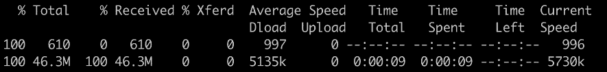

图 2.1：下载 Minikube 二进制文件

上述命令包含两部分：第一个命令`curl`下载 Minikube 二进制文件，而第二个命令`chmod`更改权限以使其可执行。

1.  将二进制文件移动到系统路径（在本例中是`/usr/local/bin`），这样我们可以直接运行 Minikube，而不管命令在哪个目录中运行：

```
mv minikube /usr/local/bin
```

当成功执行时，移动（`mv`）命令不会在终端中给出响应。

1.  运行移动命令后，我们需要确认 Minikube 可执行文件现在位于正确的位置：

```
which minikube
```

您应该看到以下输出：

```
/usr/local/bin/minikube
```

注意

如果`which minikube`命令没有给出预期的结果，您可能需要通过运行`export PATH=$PATH:/usr/local/bin`来显式将`/usr/local/bin`添加到系统路径。

1.  您可以使用以下命令检查 Minikube 的版本：

```
minikube version
```

您应该看到以下输出：

```
minikube version: v1.5.2
commit: 792dbf92a1de583fcee76f8791cff12e0c9440ad-dirty
```

1.  现在，让我们下载 kubectl 版本`v1.16.2`（以便与稍后我们的 Minikube 设置创建的 Kubernetes 版本兼容），并使用以下命令使其可执行：

```
curl -LO https://storage.googleapis.com/kubernetes-release/release/v1.16.2/bin/<ostype>/amd64/kubectl && chmod +x kubectl
```

如前所述，`<ostype>`应替换为`linux`（对于 Ubuntu）或`darwin`（对于 macOS）。

您应该看到以下输出：

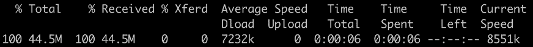

图 2.2：下载 kubectl 二进制文件

1.  然后，将其移动到系统路径，就像我们之前为 Minikube 的可执行文件所做的那样：

```
mv kubectl /usr/local/bin
```

1.  现在，让我们检查 kubectl 的可执行文件是否在正确的路径上：

```
which kubectl
```

您应该看到以下响应：

```
/usr/local/bin/kubectl
```

1.  由于我们当前以`root`用户登录，让我们通过运行以下命令创建一个名为`k8suser`的常规用户：

```
useradd k8suser
```

在提示时输入您想要的密码。您还将被提示输入其他详细信息，例如您的全名。您可以选择通过简单地按*Enter*来跳过这些细节。您应该看到类似于以下的输出：

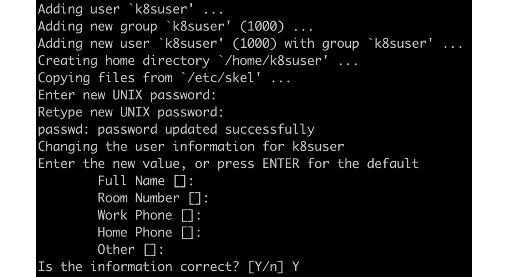

图 2.3：创建一个新的 Linux 用户

输入`Y`并按*Enter*确认创建用户的最终提示，如前一个屏幕截图的末尾所示。

1.  现在，从`root`切换用户到`k8suser`：

```
su - k8suser
```

您应该看到以下输出：

```
root@ubuntu:~# su – k8suser
k8suser@ubuntu:~$
```

1.  现在，我们可以使用`minikube start`创建一个 Kubernetes 集群：

```
minikube start --kubernetes-version=v1.16.2
```

注意

如果您想管理多个集群，Minikube 为每个集群提供了一个`--profile <profile name>`参数。

下载 VM 镜像并进行所有设置需要几分钟时间。Minikube 成功启动后，您应该看到类似于以下的响应：

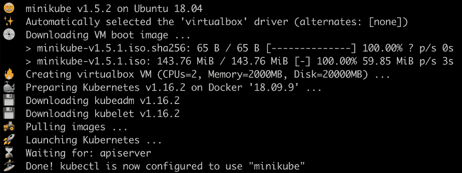

图 2.4：Minikube 首次启动

正如我们之前提到的，Minikube 在一个 VM 实例中启动了所有 Kubernetes 的组件。默认情况下，它使用 VirtualBox，并且您可以使用`--vm-driver`标志来指定特定的 hypervisor 驱动程序（例如`hyperkit`用于 macOS）。Minikube 还提供了`--kubernetes-version`标志，因此您可以指定要使用的 Kubernetes 版本。如果未指定，它将使用 Minikube 发布时可用的最新版本。在本章中，为了确保 Kubernetes 版本与 kubectl 版本的兼容性，我们明确指定了 Kubernetes 版本`v1.16.2`。

以下命令应该有助于建立 Minikube 启动的 Kubernetes 集群是否正常运行。

1.  使用以下命令获取集群各个组件的基本状态： 

```
minikube status
```

您应该看到以下响应：

```
host: Running
kubelet: Running
apiserver: Running
kubeconfig: Configured
```

1.  现在，让我们看一下 kubectl 客户端和 Kubernetes 服务器的版本：

```
kubectl version --short
```

您应该看到以下响应：

```
Client Version: v1.16.2
Server Version: v1.16.2
```

1.  让我们了解一下集群由多少台机器组成，并获取一些关于它们的基本信息：

```
kubectl get node
```

您应该看到类似以下的响应：

```
NAME          STATUS          ROLES          AGE          VERSION
minikube      Ready           master         2m41s        v1.16.2
```

完成这个练习后，您应该已经设置好了一个单节点的 Kubernetes 集群。在下一节中，我们将进入 Minikube 虚拟机，看看集群是如何组成的，以及使其工作的 Kubernetes 的各个组件。

# Kubernetes 组件概述

通过完成上一个练习，您已经拥有一个单节点的 Kubernetes 集群正在运行。在开始您的第一场音乐会之前，让我们等一下，拉开帷幕，看看 Kubernetes 在幕后是如何架构的，然后检查 Minikube 是如何在其虚拟机内将其各个组件粘合在一起的。

Kubernetes 有几个核心组件，使机器的轮子转动。它们如下：

+   API 服务器

+   etcd

+   控制器管理器

+   调度器

+   Kubelet

这些组件对于 Kubernetes 集群的运行至关重要。

除了这些核心组件，您将在容器中部署您的应用程序，这些应用程序被捆绑在一起作为 pod。我们将在*第五章* *Pods*中更多地了解 pod。这些 pod 和其他几个资源是由称为 API 对象的东西定义的。

**API 对象**描述了在 Kubernetes 中应该如何尊重某个资源。我们通常使用人类可读的清单文件来定义 API 对象，然后使用工具（如 kubectl）来解析它并将其交给 Kubernetes API 服务器。然后，Kubernetes 尝试创建对象中指定的资源，并将其状态与清单文件中指定的期望状态匹配。接下来，我们将带您了解 Minikube 创建的单节点集群中这些组件是如何组织和行为的。

Minikube 提供了一个名为`minikube ssh`的命令，用于从主机（在我们的机器上，它是运行 Ubuntu 20.04 的物理机）到`minikube`虚拟机的 SSH 访问，后者作为我们 Kubernetes 集群中唯一的节点。让我们看看它是如何工作的：

```
minikube ssh
```

您将看到以下输出：

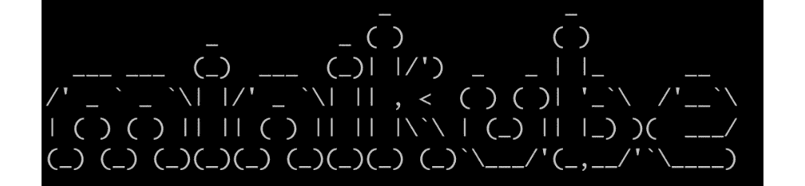

图 2.5：通过 SSH 访问 Minikube 虚拟机

注意

本节中将显示的所有命令都假定已在 Minikube 虚拟机内运行`minikube ssh`之后运行。

容器技术带来了封装应用程序的便利。Minikube 也不例外 - 它利用容器将 Kubernetes 组件粘合在一起。在 Minikube 虚拟机中，Docker 预先安装，以便它可以管理核心 Kubernetes 组件。您可以通过运行`docker ps`来查看这一点；但是，结果可能会让人不知所措，因为它包括所有正在运行的容器 - 包括核心 Kubernetes 组件和附加组件，以及所有列 - 这将输出一个非常大的表格。

为了简化输出并使其更易于阅读，我们将把`docker ps`的输出传输到另外两个 Bash 命令中：

1.  `grep -v pause`：这将通过不显示“沙盒”容器来过滤结果。

如果没有`grep -v pause`，您会发现每个容器都与一个“沙盒”容器（在 Kubernetes 中，它被实现为`pause`镜像）“配对”。这是因为，如前一章所述，Linux 容器可以通过加入相同（或不同）的 Linux 命名空间来关联（或隔离）。在 Kubernetes 中，“沙盒”容器用于引导 Linux 命名空间，然后运行真实应用程序的容器可以加入该命名空间。为了简洁起见，关于所有这些是如何在幕后工作的细节已被忽略。

注意

如果没有明确指定，本书中术语“命名空间”与“Kubernetes 命名空间”可以互换使用。在“Linux 命名空间”方面，“Linux”不会被省略以避免混淆。

1.  `awk '{print $NF}'`：这将只打印最后一列的容器名称。

因此，最终命令如下：

```
docker ps | grep -v pause | awk '{print $NF}'
```

您应该看到以下输出：

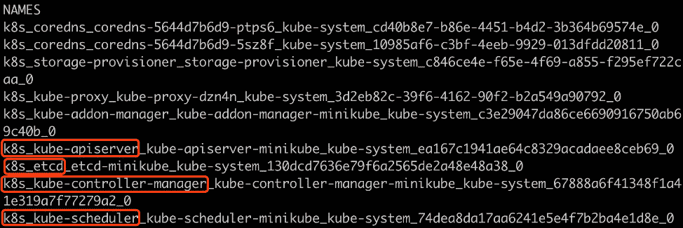

图 2.6：通过运行 Minikube VM 获取容器列表

在前面的截图中显示的突出显示的容器基本上是 Kubernetes 的核心组件。我们将在接下来的章节中详细讨论每一个。

## etcd

分布式系统可能在任何时刻面临各种故障（网络、存储等）。为了确保在出现故障时仍能正常工作，关键的集群元数据和状态必须以可靠的方式存储。

Kubernetes 将集群元数据和状态抽象为一系列 API 对象。例如，节点 API 对象代表了 Kubernetes 工作节点的规范，以及其最新状态。

Kubernetes 使用**etcd**作为后端键值数据库，在 Kubernetes 集群的生命周期中持久化 API 对象。重要的是要注意，没有任何东西（内部集群资源或外部客户端）被允许直接与 etcd 通信，而必须通过 API 服务器。对 etcd 的任何更新或请求都只能通过对 API 服务器的调用来进行。

实际上，etcd 通常部署多个实例，以确保数据以安全和容错的方式持久化。

## API 服务器

API 服务器允许标准 API 访问 Kubernetes API 对象。它是唯一与后端存储（etcd）通信的组件。

此外，通过利用它作为与 etcd 通信的唯一接触点，它为客户端提供了一个方便的接口，以“监视”它们可能感兴趣的任何 API 对象。一旦 API 对象被创建、更新或删除，正在“监视”的客户端将立即收到通知，以便他们可以对这些更改采取行动。正在“监视”的客户端也被称为“控制器”，它已经成为内置 Kubernetes 对象和 Kubernetes 扩展中广受欢迎的实体。

注意

您将在*第四章*“如何与 Kubernetes 通信”（API 服务器）中了解更多关于 API 服务器的信息，并在*第七章*“Kubernetes 控制器”中了解有关控制器的信息。

## 调度器

调度程序负责将传入的工作负载分配给最合适的节点。关于分配的决定是由调度程序对整个集群的理解以及一系列调度算法来做出的。

注意

您将在《第十七章》《Kubernetes 高级调度》中了解更多关于调度程序的信息。

## 控制器管理器

正如我们在《API 服务器》小节中提到的，API 服务器公开了几乎任何 API 对象的“监视”方式，并通知观察者有关正在观察的 API 对象的更改。

它的工作方式几乎与发布者-订阅者模式相似。控制器管理器充当典型的订阅者，监视它感兴趣的唯一 API 对象，然后尝试进行适当的更改，以将当前状态移向对象中描述的期望状态。

例如，如果它从 API 服务器那里得到一个更新，说一个应用程序要求两个副本，但是现在集群中只有一个副本，它将创建第二个副本，以使应用程序符合其期望的副本数量。协调过程在控制器管理器的生命周期中持续运行，以确保所有应用程序保持在预期状态。

控制器管理器聚合各种类型的控制器，以遵守 API 对象的语义，例如部署和服务，我们将在本章后面介绍。

## kubelet 在哪里？

请注意，etcd、API 服务器、调度程序和控制器管理器组成了 Kubernetes 的控制平面。运行这些组件的机器称为主节点。另一方面，kubelet 部署在每台工作节点上。

在我们的单节点 Minikube 集群中，kubelet 部署在携带控制平面组件的同一节点上。然而，在大多数生产环境中，它不会部署在任何主节点上。当我们在《第十一章》《构建您自己的 HA 集群》中部署多节点集群时，我们将了解更多关于生产环境的信息。

kubelet 主要是与底层容器运行时（例如 Docker、containerd 或 cri-o）进行通信，以启动容器并确保容器按预期运行。此外，它负责将状态更新发送回 API 服务器。

然而，如前面的屏幕截图所示，`docker ps`命令并没有显示任何名为`kubelet`的内容。通常，为了启动、停止或重新启动任何软件并使其在失败时自动重新启动，我们需要一个工具来管理其生命周期。在 Linux 中，systemd 负责这个责任。在 Minikube 中，kubelet 由 systemd 管理，并作为本地二进制文件而不是 Docker 容器运行。我们可以运行以下命令来检查其状态：

```
systemctl status kubelet
```

您应该看到类似以下的输出：

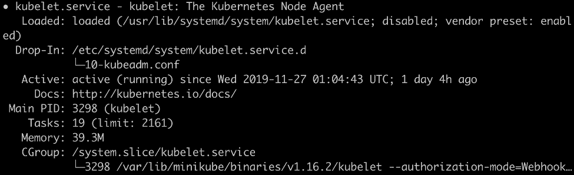

图 2.7：kubelet 的状态

默认情况下，kubelet 在其配置文件中（存储在`/var/lib/kubelet/config.yaml`）具有`staticPodPath`的配置。kubelet 被指示持续监视该路径下文件的更改，该路径下的每个文件代表一个 Kubernetes 组件。让我们首先找到 kubelet 的`config`文件中的`staticPodPath`，以了解这意味着什么：

```
grep "staticPodPath" /var/lib/kubelet/config.yaml
```

您应该看到以下输出：

```
staticPodPath: /etc/kubernetes/manifests
```

现在，让我们看看这个路径的内容：

```
ls /etc/kubernetes/manifests
```

您应该看到以下输出：

```
addon-manager.yaml.tmpl kube-apiserver.yaml      kube-scheduler.yaml
etcd.yaml               kube-controller-manager.yaml
```

如文件列表所示，Kubernetes 的核心组件由在 YAML 文件中指定定义的对象定义。在 Minikube 环境中，除了管理用户创建的 pod 之外，kubelet 还充当 systemd 的等效物，以管理 Kubernetes 系统级组件的生命周期，如 API 服务器、调度程序、控制器管理器和其他附加组件。一旦这些 YAML 文件中的任何一个发生变化，kubelet 会自动检测到并更新集群的状态，使其与更新后的 YAML 配置中定义的期望状态相匹配。

我们将在这里停下，不深入探讨 Minikube 的设计。除了“静态组件”之外，kubelet 还是“常规应用程序”的管理者，以确保它们在节点上按预期运行，并根据 API 规范或资源短缺驱逐 pod。

## kube-proxy

kube-proxy 出现在`docker ps`命令的输出中，但在我们在上一小节中探索该目录时，它并不存在于`/etc/kubernetes/manifests`中。这意味着它的角色——它更多地被定位为一个附加组件，而不是核心组件。

kube-proxy 被设计为在每个节点上运行的分布式网络路由器。它的最终目标是确保流入到 Service（这是我们稍后将介绍的一个 API 对象）端点的流量能够正确路由。此外，如果多个容器提供一个应用程序，它可以通过利用底层的 Linux iptables/IPVS 技术以循环方式平衡流量。

还有一些其他附加组件，比如 CoreDNS，但我们将跳过它们，以便我们可以专注于核心组件并获得高层次的图像。

注意

有时，kube-proxy 和 CoreDNS 也被认为是 Kubernetes 安装的核心组件。在某种程度上，从技术上讲，这是正确的，因为它们在大多数情况下是必需的；否则，Service API 对象将无法工作。然而，在本书中，我们更倾向于将它们归类为“附加组件”，因为它们侧重于实现特定的 Kubernetes API 资源，而不是一般的工作流程。此外，kube-proxy 和 CoreDNS 是在`addon-manager.yaml.tmpl`中定义的，而不是被描绘在与其他核心 Kubernetes 组件同一级别。

# Kubernetes 架构

在前一节中，我们对核心 Kubernetes 组件有了初步印象：etcd、API 服务器、调度器、控制器管理器和 kubelet。这些组件，加上其他附加组件，构成了 Kubernetes 架构，可以在以下图表中看到：

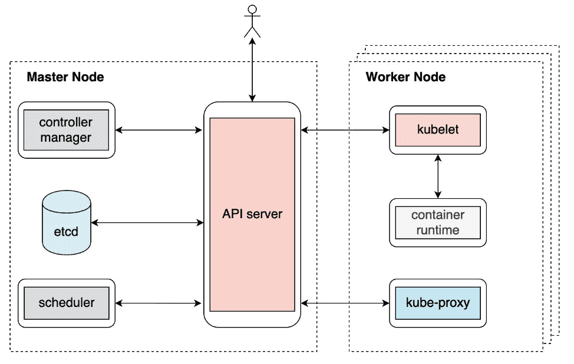

图 2.8：Kubernetes 架构

在这一点上，我们不会过多地查看每个组件。然而，在高层次上，理解组件如何相互通信以及它们为什么以这种方式设计是至关重要的。

首先要理解的是 API 服务器可以与哪些组件进行交互。从前面的图表中，我们可以很容易地看出 API 服务器几乎可以与每个其他组件进行通信（除了容器运行时，由 kubelet 处理），它还可以直接与最终用户进行交互。这种设计使 API 服务器充当 Kubernetes 的“心脏”。此外，API 服务器还会审查传入的请求，并将 API 对象写入后端存储（etcd）。换句话说，这使得 API 服务器成为安全控制措施（如身份验证、授权和审计）的节流阀。

理解的第二件事是不同的 Kubernetes 组件（除了 API 服务器）如何相互交互。事实证明它们之间没有明确的连接 - 控制器管理器不与调度程序交谈，kubelet 也不与 kube-proxy 交谈。

没错 - 他们确实需要协调工作来完成许多功能，但它们从不直接交谈。相反，它们通过 API 服务器隐式通信。更准确地说，它们通过观察、创建、更新或删除相应的 API 对象进行通信。这也被称为控制器/操作员模式。

## 容器网络接口

有几个网络方面需要考虑，比如一个 pod 如何与其主机的网络接口通信，一个节点如何与其他节点通信，最终一个 pod 如何与不同节点上的任何 pod 通信。由于云端或本地环境中的网络基础设施差异巨大，Kubernetes 选择通过定义一个称为**容器网络接口**（**CNI**）的规范来解决这些问题。不同的 CNI 提供者可以遵循相同的接口并实现符合 Kubernetes 标准的逻辑，以确保整个 Kubernetes 网络运行。我们将在*第十一章*，*构建您自己的 HA 集群*中重新讨论 CNI 的概念。现在，让我们回到讨论不同的 Kubernetes 组件如何工作。

在本章的后面，*练习 2.05*，*Kubernetes 如何管理 Pod 的生命周期*，将帮助您巩固对此的理解，并澄清一些问题，比如不同的 Kubernetes 组件如何同步或异步地操作，以确保典型的 Kubernetes 工作流程，以及如果其中一个或多个组件发生故障会发生什么。这个练习将帮助您更好地理解整体的 Kubernetes 架构。但在那之前，让我们把我们在上一章中介绍的容器化应用引入到 Kubernetes 世界中，并探索 Kubernetes 的一些好处。

# 将容器化应用迁移到 Kubernetes

在上一章中，我们构建了一个名为`k8s-for-beginners`的简单 HTTP 服务器，并且它作为一个 Docker 容器运行。对于一个示例应用程序来说，它运行得很完美。但是，如果你需要管理成千上万个容器，并且正确协调和调度它们，该怎么办？你如何在没有停机的情况下升级一个服务？在意外故障时如何保持服务的健康？这些问题超出了仅仅使用容器的系统的能力。我们需要的是一个可以编排和管理我们的容器的平台。

我们已经告诉过你，Kubernetes 是我们需要的解决方案。接下来，我们将带你进行一系列关于如何使用 Kubernetes 本地方法编排和运行容器的练习。

## Pod 规范

一个直观的想法是，我们希望看到在 Kubernetes 中运行容器的等效 API 调用或命令是什么。正如*第一章* *Kubernetes 和容器简介*中所解释的，一个容器可以加入另一个容器的命名空间，以便它们可以访问彼此的资源（例如网络、存储等），而无需额外的开销。在现实世界中，一些应用程序可能需要多个容器密切合作，无论是并行工作还是按特定顺序工作（一个的输出将由另一个处理）。此外，一些通用容器（例如日志代理、网络限速代理等）可能需要与它们的目标容器密切合作。

由于一个应用程序通常可能需要多个容器，容器不是 Kubernetes 中的最小操作单元；相反，它引入了一个称为**pods**的概念来捆绑一个或多个容器。Kubernetes 提供了一系列规范来描述这个 pod 应该是什么样的，包括诸如镜像、资源请求、启动命令等几个具体的内容。为了将这个 pod 规范发送给 Kubernetes，特别是 Kubernetes API 服务器，我们将使用 kubectl。

注意

我们将在*第五章* *Pods*中了解更多关于 Pods 的内容，但在本章中，我们将使用它们进行简单演示。您可以在此链接查看可用 Pod 规范的完整列表：[`godoc.org/k8s.io/api/core/v1#PodSpec`](https://godoc.org/k8s.io/api/core/v1#PodSpec)。

接下来，让我们学习如何通过编写 pod 规范文件（也称为规范、清单、配置或配置文件）在 Kubernetes 中运行单个容器。在 Kubernetes 中，您可以使用 YAML 或 JSON 来编写此规范文件，尽管 YAML 通常更常用，因为它更易读和可编辑。

考虑以下用于一个非常简单的 pod 的 YAML 规范：

```
kind: Pod
apiVersion: v1
metadata:
  name: k8s-for-beginners
spec:
  containers:
  - name: k8s-for-beginners
    image: packtworkshops/the-kubernetes-workshop:k8s-for-beginners
```

让我们简要地浏览一下不同的字段：

+   `kind` 告诉 Kubernetes 您想要创建哪种类型的对象。在这里，我们正在创建一个 `Pod`。在后面的章节中，您将看到许多其他类型，比如 Deployment、StatefulSet、ConfigMap 等等。

+   `apiVersion` 指定 API 对象的特定版本。不同版本可能会有一些不同的行为。

+   `metadata` 包括一些属性，可以用来唯一标识 pod，比如名称和命名空间。如果我们不指定命名空间，它就会放在 `default` 命名空间中。

+   `spec` 包含一系列描述 pod 的字段。在这个例子中，有一个容器，它有指定的镜像 URL 和名称。

Pod 是部署的最简单的 Kubernetes 对象之一，因此我们将使用它们来学习如何使用 YAML 清单部署对象。

## 应用 YAML 清单

一旦我们准备好一个 YAML 清单，我们可以使用 `kubectl apply -f <yaml file>` 或 `kubectl create -f <yaml file>` 来指示 API 服务器持久化在此清单中定义的 API 资源。当您首次从头开始创建一个 pod 时，您使用这两个命令之一并没有太大的区别。然而，我们经常需要修改 YAML（比如说，如果我们想要升级镜像版本），然后重新应用它。如果我们使用 `kubectl create` 命令，我们必须删除并重新创建它。但是，使用 `kubectl apply` 命令，我们可以重新运行相同的命令，Kubernetes 会自动计算并应用增量变化。

从运维的角度来看，这非常方便。例如，如果我们使用某种形式的自动化，重复相同的命令会更简单。因此，我们将在接下来的练习中使用 `kubectl apply`，无论是第一次应用还是不是。

注意

可以在 *第四章* *如何与 Kubernetes（API 服务器）通信* 中获取有关 kubectl 的详细信息。

## 练习 2.02：在 Kubernetes 中运行一个 Pod

在上一个练习中，我们启动了 Minikube，并查看了各种作为 pod 运行的 Kubernetes 组件。现在，在这个练习中，我们将部署我们的 pod。按照以下步骤完成这个练习：

注意

如果您一直在尝试*Kubernetes 组件概述*部分的命令，请不要忘记在开始这个练习之前使用`exit`命令离开 SSH 会话。除非另有说明，所有使用`kubectl`的命令应该在主机上运行，而不是在 Minikube VM 内部。

1.  在 Kubernetes 中，我们使用一个 spec 文件来描述一个 API 对象，比如一个 pod。如前所述，我们将坚持使用 YAML，因为它更易读和易编辑。创建一个名为`k8s-for-beginners-pod.yaml`的文件（使用你选择的任何文本编辑器），内容如下：

```
kind: Pod
apiVersion: v1
metadata:
  name: k8s-for-beginners
spec:
  containers:
  - name: k8s-for-beginners
    image: packtworkshops/the-kubernetes-workshop:k8s-for-      beginners
```

注意

请用前面 YAML 文件中最后一行的路径替换成您在上一章中创建的图像的路径。

1.  在主机上运行以下命令来创建这个 pod：

```
kubectl apply -f k8s-for-beginners-pod.yaml
```

您应该看到以下输出：

```
pod/k8s-for-beginners created
```

1.  现在，我们可以使用以下命令来检查 pod 的状态：

```
kubectl get pod
```

您应该看到以下响应：

```
NAME                   READY     STATUS      RESTARTS       AGE
k8s-for-beginners      1/1       Running     0              7s
```

默认情况下，`kubectl get pod`将以表格格式列出所有的 pod。在前面的输出中，我们可以看到`k8s-for-beginners` pod 正常运行，并且它有一个容器是就绪的（`1/1`）。此外，kubectl 提供了一个额外的标志叫做`-o`，这样我们可以调整输出格式。例如，`-o yaml`或`-o json`将分别以 YAML 或 JSON 格式返回 pod API 对象的完整输出，因为它存储在 Kubernetes 的后端存储（etcd）中。

1.  您可以使用以下命令获取有关 pod 的更多信息：

```
kubectl get pod -o wide
```

您应该看到以下输出：

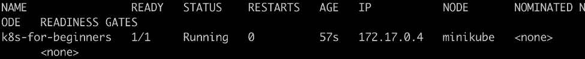

图 2.9：获取有关 pod 的更多信息

正如你所看到的，输出仍然是表格格式，我们得到了额外的信息，比如`IP`（内部 pod IP）和`NODE`（pod 所在的节点）。

1.  您可以通过运行以下命令来获取我们集群中节点的列表：

```
kubectl get node
```

您应该看到以下响应：

```
NAME          STATUS          ROLES          AGE          VERSION
minikube      Ready           master         30h          v1.16.2
```

1.  *图 2.9*中列出的 IP 是 Kubernetes 为此 pod 分配的内部 IP，用于 pod 之间的通信，而不是用于将外部流量路由到 pod。因此，如果您尝试从集群外部访问此 IP，您将得到空白。您可以尝试使用以下命令从主机上执行，但会失败：

```
curl 172.17.0.4:8080
```

注意

请记得将`172.17.0.4`更改为您在*步骤 4*中获得的值，如*图 2.9*所示。

`curl`命令将会挂起并返回空白，如下所示：

```
k8suser@ubuntu:~$ curl 172.17.0.4:8080
^C
```

您需要按下*Ctrl* + *C*来中止它。

1.  在大多数情况下，最终用户不需要与内部 pod IP 进行交互。但是，仅出于观察目的，让我们 SSH 进入 Minikube VM：

```
minikube ssh
```

您将在终端中看到以下响应：

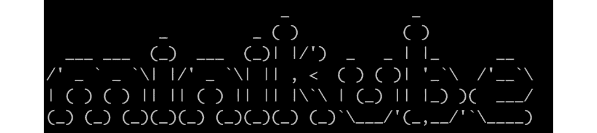

图 2.10：通过 SSH 访问 Minikube VM

1.  现在，尝试从 Minikube VM 内部调用 IP 以验证其是否有效：

```
curl 172.17.0.4:8080
```

您应该会收到一个成功的响应：

```
Hello Kubernetes Beginners!
```

有了这个，我们已经成功在 Kubernetes 集群上部署了我们的应用程序。我们可以确认它正在工作，因为当我们从集群内部调用应用程序时，我们会得到一个响应。现在，您可以使用`exit`命令结束 Minikube SSH 会话。

## Service 规范

前一节的最后部分证明了集群内不同组件之间的网络通信非常顺畅。但在现实世界中，您不希望应用程序的用户获得 SSH 访问权限来使用您的应用程序。因此，您希望您的应用程序可以从外部访问。

为了方便起见，Kubernetes 提供了一个称为**Service**的概念，用于抽象应用程序 pod 的网络访问。Service 充当网络代理，接受来自外部用户的网络流量，然后将其分发到内部 pod。但是，应该有一种方法来描述 Service 和相应 pod 之间的关联规则。Kubernetes 使用标签（在 pod 定义中定义）和标签选择器（在 Service 定义中定义）来描述这种关系。

注意

您将在*第六章*，*标签和注释*中了解更多关于标签和标签选择器的内容。

让我们考虑以下 Service 的样本规范：

```
kind: Service
apiVersion: v1
metadata:
  name: k8s-for-beginners
spec:
  selector:
    tier: frontend
  type: NodePort
  ports:
  - port: 80
    targetPort: 8080
```

与 Pod 规范类似，在这里，我们定义了 `kind` 和 `apiVersion`，而 `name` 是在 `metadata` 字段下定义的。在 `spec` 字段下，有几个关键字段需要注意：

+   `selector` 定义要选择的标签，以便与相应的 pod 匹配关系，正如您将在接下来的练习中看到的，这些标签应该被正确地标记。

+   `type` 定义了服务的类型。如果未指定，默认类型为 `ClusterIP`，这意味着它仅在集群内部使用。在这里，我们将其指定为 `NodePort`。这意味着服务将在集群的每个节点上公开一个端口，并将该端口与相应的 pod 关联起来。另一个众所周知的类型称为 `LoadBalancer`，通常不在原始的 Kubernetes 提供中实现。相反，Kubernetes 将实现委托给每个云提供商，例如 GKE、EKS 等。

+   `ports` 包括一系列 `port` 字段，每个字段都有一个 `targetPort` 字段。`targetPort` 字段是目标 pod 公开的实际端口。

因此，可以通过 `<service ip>:<port>` 内部访问服务。现在，例如，如果您有一个在内部运行并在端口 8080 上侦听的 NGINX pod，则应将 `targetPort` 定义为 `8080`。您可以在此案例中为 `port` 字段指定任意数字，例如 `80`。Kubernetes 将建立并维护 `<service IP>:<port>` 与 `<pod IP>:<targetPort>` 之间的映射。在接下来的练习中，我们将学习如何从集群外访问服务，并通过服务将外部流量带入集群。

在接下来的练习中，我们将定义服务清单并使用 `kubectl apply` 命令创建它们。您将了解到在 Kubernetes 中解决问题的常见模式是找到适当的 API 对象，然后使用 YAML 清单组合详细规范，最后创建对象以使其生效。

## 练习 2.03：通过服务访问 Pod

在之前的练习中，我们观察到内部 pod IP 对于集群外部的任何人都不起作用。在这个练习中，我们将创建服务，这些服务将充当连接器，将外部请求映射到目标 pod，以便我们可以在不进入集群的情况下外部访问 pod。按照以下步骤完成这个练习：

1.  首先，让我们调整来自 *练习 2.02*，*在 Kubernetes 中运行一个 Pod* 的 pod 规范，以应用一些标签。修改 `k8s-for-beginners-pod1.yaml` 文件的内容如下：

```
kind: Pod
apiVersion: v1
metadata:
  name: k8s-for-beginners
  labels:
    tier: frontend
spec:
  containers:
  - name: k8s-for-beginners
    image: packtworkshops/the-kubernetes-workshop:k8s-for-      beginners
```

在这里，我们在 `labels` 字段下添加了一个标签对，`tier: frontend`。

1.  因为 pod 名称保持不变，让我们重新运行 `apply` 命令，这样 Kubernetes 就知道我们正在尝试更新 pod 的规范，而不是创建一个新的 pod：

```
kubectl apply -f k8s-for-beginners-pod1.yaml
```

你应该看到以下响应：

```
pod/k8s-for-beginners configured
```

在 `kubectl apply` 命令背后，kubectl 生成指定 YAML 和 Kubernetes 服务器端存储（即 etcd）中存储版本的差异。如果请求有效（即，我们在规范格式或命令中没有出现任何错误），kubectl 将向 Kubernetes API 服务器发送 HTTP 补丁。因此，只会应用增量更改。如果查看返回的消息，你会看到它说 `pod/k8s-for-beginners configured` 而不是 `created`，所以我们可以确定它正在应用增量更改，而不是创建一个新的 pod。

1.  你可以使用以下命令显式显示已应用到现有 pod 的标签：

```
kubectl get pod --show-labels
```

你应该看到以下响应：

```
NAME              READY  STATUS   RESTARTS   AGE  LABELS
k8s-for-beginners 1/1    Running  0          16m  tier=frontend
```

现在，pod 具有 `tier: frontend` 属性，我们准备创建一个服务并将其链接到这些 pod。

1.  创建一个名为 `k8s-for-beginners-svc.yaml` 的文件，内容如下：

```
kind: Service
apiVersion: v1
metadata:
  name: k8s-for-beginners
spec:
  selector:
    tier: frontend
  type: NodePort
  ports:
  - port: 80
    targetPort: 8080
```

1.  现在，让我们使用以下命令创建服务：

```
kubectl apply -f k8s-for-beginners-svc.yaml
```

你应该看到以下响应：

```
service/k8s-for-beginners created
```

1.  使用 `get` 命令返回已创建服务的列表，并确认我们的服务是否在线：

```
kubectl get service
```

你应该看到以下响应：

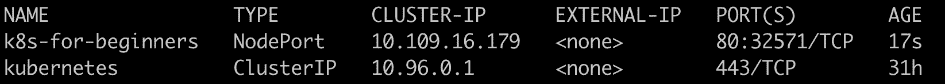

图 2.11：获取服务列表

所以，你可能已经注意到 `PORT(S)` 列输出 `80:32571/TCP`。端口 `32571` 是在每个节点上暴露的自动生成的端口，这是有意为之，以便外部用户可以访问它。现在，在进行下一步之前，退出 SSH 会话。

1.  现在，我们有了“外部端口”为 `32571`，但我们仍然需要找到外部 IP。Minikube 提供了一个实用程序，我们可以使用它轻松访问 `k8s-for-beginners` 服务：

```
minikube service k8s-for-beginners
```

应该看到类似以下的响应：

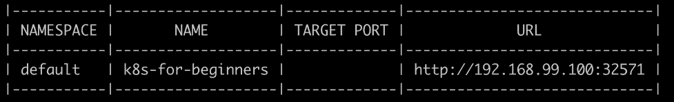

图 2.12：获取访问 NodePort 服务的 URL 和端口

根据您的环境，这可能还会自动打开一个浏览器页面，以便您可以访问服务。从 URL 中，您将能够看到服务端口是`32571`。外部 IP 实际上是 Minikube VM 的 IP。

1.  您还可以通过命令行从集群外部访问我们的应用：

```
curl http://192.168.99.100:32571
```

您应该看到以下响应：

```
Hello Kubernetes Beginners!
```

总之，在这个练习中，我们创建了一个`NodePort`服务，以便外部用户可以访问内部的 Pod，而不需要进入集群。在幕后，有几个层次的流量转换使这成为可能：

+   第一层是从外部用户到机器 IP 的自动生成的随机端口（3XXXX）。

+   第二层是从随机端口（3XXXX）到服务 IP（10.X.X.X）的端口`80`。

+   第三层是从服务 IP（10.X.X.X）最终到端口`8080`的 Pod IP。

以下是一个说明这些交互的图表：

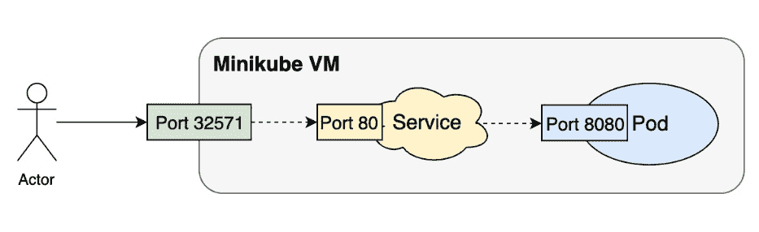

图 2.13：将来自集群外部用户的流量路由到运行我们应用的 Pod

## 服务和 Pod

在上一个练习的*步骤 3*中，您可能已经注意到服务尝试通过标签（`spec`部分下的`selector`字段）来匹配 Pod，而不是使用固定的 Pod 名称或类似的东西。从 Pod 的角度来看，它不需要知道哪个服务正在为其带来流量。（在一些罕见的情况下，它甚至可以映射到多个服务；也就是说，多个服务可能会向一个 Pod 发送流量。）

这种基于标签的匹配机制在 Kubernetes 中被广泛使用。它使 API 对象在运行时松散耦合。例如，您可以指定`tier: frontend`作为标签选择器，这将与被标记为`tier: frontend`的 Pod 相关联。

因此，一旦创建了 Service，备份 pod 是否存在都无关紧要。备份 pod 后来创建也是完全可以接受的，创建后，Service 对象将与正确的 pod 关联起来。在内部，整个映射逻辑是由服务控制器实现的，它是控制器管理器组件的一部分。Service 可能一次有两个匹配的 pod，并且后来创建了一个具有匹配标签的第三个 pod，或者其中一个现有的 pod 被删除。在任何一种情况下，服务控制器都可以检测到这些更改，并确保用户始终可以通过 Service 端点访问其应用程序。

在 Kubernetes 中使用不同类型的 API 对象来编排应用程序，然后通过使用标签或其他松散耦合的约定将它们粘合在一起是一个非常常见的模式。这也是容器编排的关键部分。

# 交付 Kubernetes 原生应用程序

在前面的部分中，我们将基于 Docker 的应用程序迁移到了 Kubernetes，并成功地从 Minikube VM 内部和外部访问了它。现在，让我们看看如果我们从头开始设计我们的应用程序，使其可以使用 Kubernetes 进行部署，Kubernetes 还可以提供哪些其他好处。

随着您的应用程序使用量增加，运行多个特定 pod 的副本以提供业务功能可能很常见。在这种情况下，仅仅将不同容器分组在一个 pod 中是不够的。我们需要继续创建一组共同工作的 pod。Kubernetes 为 pod 组提供了几种抽象，例如 Deployments、DaemonSets、Jobs、CronJobs 等。就像 Service 对象一样，这些对象也可以通过在 YAML 文件中定义的 spec 来创建。

要开始了解 Kubernetes 的好处，让我们使用 Deployment 来演示如何在多个 pod 中复制（扩展/缩减）应用程序。

使用 Kubernetes 对 pod 组进行抽象化给我们带来了以下优势：

+   **创建 pod 的副本以实现冗余**：这是使用 Deployments 等 pod 组抽象的主要优势。Deployment 可以根据给定的 spec 创建多个 pod。Deployment 将自动确保它创建的 pod 处于在线状态，并将自动替换任何失败的 pod。

+   **简单的升级和回滚**：Kubernetes 提供了不同的策略，你可以使用这些策略来升级你的应用程序，以及回滚版本。这很重要，因为在现代软件开发中，软件经常是迭代开发的，更新频繁。升级可以改变部署规范中的任何内容。它可以是标签或任何其他字段的更新，镜像版本的升级，对其嵌入式容器的更新等等。

让我们来看一下样本部署规范的一些值得注意的方面：

k8s-for-beginners-deploy.yaml

```
apiVersion: apps/v1
kind: Deployment
metadata:
  name: k8s-for-beginners
spec:
  replicas: 3
  selector:
    matchLabels:
      tier: frontend
  template:
    metadata:
      labels:
        tier: frontend
    spec:
      containers:
      - name: k8s-for-beginners
        image: packtworkshops/the-kubernetes-workshop:k8s-for-          beginners
```

除了将 pod 规范包装为 "template"，部署还必须指定其种类（`Deployment`），以及 API 版本（`apps/v1`）。

注意

出于某些历史原因，规范名称 `apiVersion` 仍在使用。但从技术上讲，它实际上意味着 `apiGroupVersion`。在前面的部署示例中，它属于 `apps` 组，版本为 `v1`。

在部署规范中，`replicas` 字段指示 Kubernetes 使用在 `template` 字段中定义的 pod 规范启动三个 pod。`selector` 字段扮演了与服务案例中相同的角色 - 它旨在以一种松散耦合的方式将部署对象与特定的 pod 关联起来。如果你想要将任何现有的 pod 纳入新部署的管理，这将特别有用。

在部署或其他类似的 API 对象中定义的副本数量代表了持续运行的 pod 数量的期望状态。如果其中一些 pod 因某些意外原因而失败，Kubernetes 将自动检测到并创建相应数量的 pod 来替代它们。我们将在接下来的练习中探讨这一点。

我们将在接下来的练习中看到部署的实际操作。

## 练习 2.04：扩展 Kubernetes 应用程序

在 Kubernetes 中，通过更新部署规范的 `replicas` 字段，很容易增加运行应用程序的副本数量。在这个练习中，我们将尝试如何扩展 Kubernetes 应用程序的规模。按照以下步骤完成这个练习：

1.  使用这里显示的内容创建一个名为 `k8s-for-beginners-deploy.yaml` 的文件：

```
apiVersion: apps/v1
kind: Deployment
metadata:
  name: k8s-for-beginners
spec:
  replicas: 3
  selector:
    matchLabels:
      tier: frontend
  template:
    metadata:
      labels:
        tier: frontend
    spec:
      containers:
      - name: k8s-for-beginners
        image: packtworkshops/the-kubernetes-workshop:k8s-for-          beginners
```

如果你仔细看，你会发现这个部署规范在很大程度上基于之前练习中的 pod 规范（`k8s-for-beginners-pod1.yaml`），你可以在 `template` 字段下看到。

1.  接下来，我们可以使用 kubectl 来创建部署：

```
kubectl apply -f k8s-for-beginners-deploy.yaml
```

您应该会看到以下输出：

```
deployment.apps/k8s-for-beginners created
```

1.  鉴于部署已经成功创建，我们可以使用以下命令来显示所有部署的状态，比如它们的名称、运行的 pod 等等：

```
kubectl get deploy
```

您应该会得到以下响应：

```
NAME                   READY   UP-TO-DATE   AVAILABLE    AGE
k8s-for-beginners      3/3     3            3            41s
```

注意

如前面的命令所示，我们使用的是`deploy`而不是`deployment`。这两者都可以使用，`deploy`是`deployment`的允许的简称。您可以在此链接找到一些常用的简称列表：[`kubernetes.io/docs/reference/kubectl/overview/#resource-types`](https://kubernetes.io/docs/reference/kubectl/overview/#resource-types)。

您也可以通过运行`kubectl api-resources`来查看短名称，而不指定资源类型。

1.  我们在上一个练习中创建的名为`k8s-for-beginners`的 pod 存在。为了确保我们只看到由部署管理的 pod，让我们删除旧的 pod：

```
kubectl delete pod k8s-for-beginners
```

您应该会看到以下响应：

```
pod "k8s-for-beginners" deleted
```

1.  现在，获取所有的 pod 列表：

```
kubectl get pod
```

您应该会看到以下响应：

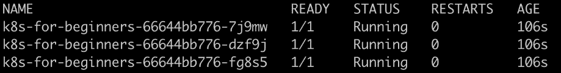

图 2.14：获取 pod 列表

部署已经创建了三个 pod，并且它们的标签（在*步骤 1*中指定的`labels`字段）恰好与我们在上一节中创建的 Service 匹配。那么，如果我们尝试访问 Service 会发生什么呢？网络流量会聪明地路由到这三个新的 pod 吗？让我们来测试一下。

1.  为了查看流量是如何分配到这三个 pod 的，我们可以通过在 Bash 的`for`循环中运行`curl`命令来模拟一系列连续的请求到 Service 端点，如下所示：

```
for i in $(seq 1 30); do curl <minikube vm ip>:<service node port>; done
```

注意

在这个命令中，如果您正在运行相同的 Minikube 实例，请使用与上一个练习中相同的 IP 和端口。如果您重新启动了 Minikube 或进行了其他更改，请按照上一个练习的*步骤 9*获取您的 Minikube 集群的正确 IP。

一旦您使用正确的 IP 和端口运行了命令，您应该会看到以下输出：

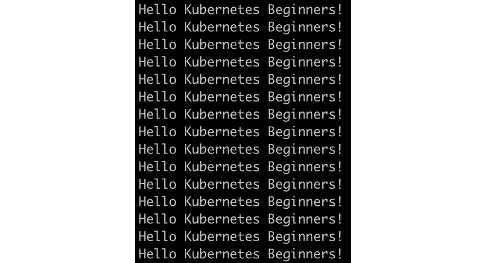

图 2.15：重复访问我们的应用

从输出中，我们可以看出所有 30 个请求都得到了预期的响应。

1.  您可以运行`kubectl logs <pod name>`来检查每个 pod 的日志。让我们再进一步，找出每个 pod 实际响应的确切请求数，这可能有助于我们找出流量是否均匀分布。为此，我们可以将每个 pod 的日志传输到`wc`命令中以获取行数：

```
kubectl logs <pod name> | wc -l
```

运行上述命令三次，复制您获得的 pod 名称，如*图 2.16*所示：

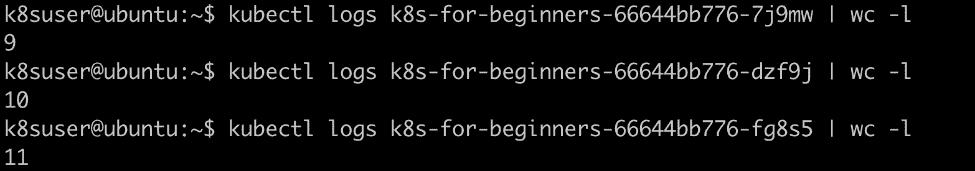

图 2.16：获取运行我们应用程序的三个 pod 副本的日志

结果显示，三个 pod 分别处理了`9`、`10`和`11`个请求。由于样本量较小，分布并不绝对均匀（即每个`10`），但足以表明服务使用的默认轮询分发策略。

注意

您可以通过查看官方文档了解 kube-proxy 如何利用 iptables 执行内部负载平衡：[`kubernetes.io/docs/concepts/services-networking/service/#proxy-mode-iptables`](https://kubernetes.io/docs/concepts/services-networking/service/#proxy-mode-iptables)。

1.  接下来，让我们学习如何扩展部署。有两种方法可以实现这一点：一种方法是修改部署的 YAML 配置，我们可以将`replicas`的值设置为另一个数字（例如`5`），另一种方法是使用`kubectl scale`命令，如下所示：

```
kubectl scale deploy k8s-for-beginners --replicas=5
```

您应该会看到以下响应：

```
deployment.apps/k8s-for-beginners scaled
```

1.  让我们验证一下是否有五个 pod 在运行：

```
kubectl get pod
```

您应该会看到类似以下的响应：

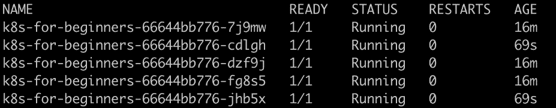

图 2.17：获取 pod 列表

输出显示现有的三个 pod 被保留，另外创建了两个新的 pod。

1.  同样，您也可以指定小于当前数量的副本。在我们的示例中，假设我们想将副本数量缩减到`2`。此命令如下所示：

```
kubectl scale deploy k8s-for-beginners --replicas=2
```

您应该会看到以下响应：

```
deployment.apps/k8s-for-beginners scaled
```

1.  现在，让我们验证一下 pod 的数量：

```
kubectl get pod
```

您应该会看到类似以下的响应：

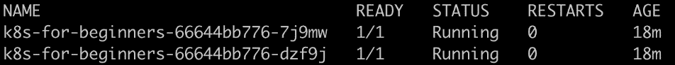

图 2.18：获取 pod 列表

如前面的截图所示，有两个 pod，它们都按预期运行。因此，在 Kubernetes 术语中，我们可以说，“部署处于期望的状态”。

1.  我们可以运行以下命令来验证这一点：

```
kubectl get deploy
```

你应该看到以下响应：

```
NAME                   READY    UP-TO-DATE   AVAILABLE    AGE
k8s-for-beginners      2/2      2            2           19m
```

1.  现在，让我们看看如果我们删除两个 pod 中的一个会发生什么：

```
kubectl delete pod <pod name>
```

你应该得到以下响应：

```
pod "k8s-for-beginners-66644bb776-7j9mw" deleted
```

1.  检查 pod 的状态以查看发生了什么：

```
kubectl get pod
```

你应该看到以下响应：

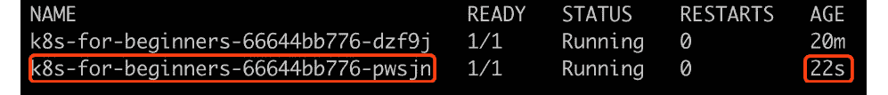

图 2.19：获取 pod 列表

我们可以看到仍然有两个 pod。从输出中值得注意的是，第一个 pod 的名称与*图 2.18*中的第二个 pod 的名称相同（这是未被删除的那个），但是突出显示的 pod 名称与*图 2.18*中的任何一个 pod 的名称都不同。这表明突出显示的那个是新创建的用来替换已删除的 pod。部署创建了一个新的 pod，以使运行中的 pod 数量满足部署的期望状态。

在这个练习中，我们学习了如何扩展部署的规模。您可以以相同的方式扩展其他类似的 Kubernetes 对象，例如 DaemonSets 和 StatefulSets。此外，对于这样的对象，Kubernetes 将尝试自动恢复失败的 pod。

# Pod 生命周期和 Kubernetes 组件

本章的前几节简要描述了 Kubernetes 组件以及它们如何在内部相互工作。另一方面，我们还演示了如何使用一些 Kubernetes API 对象（Pods、Services 和 Deployments）来组合您的应用程序。

但是 Kubernetes API 对象如何由不同的 Kubernetes 组件管理呢？让我们以 pod 为例。其生命周期可以如下所示：

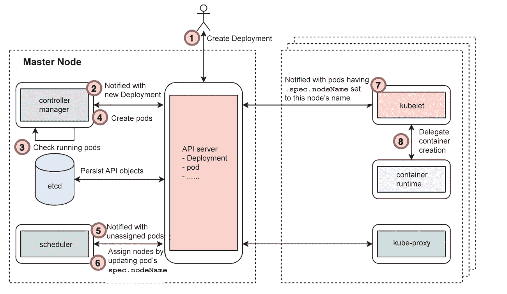

图 2.20：创建 pod 的过程

整个过程可以分解如下：

1.  用户通过向 Kubernetes API 服务器发送部署 Deployment YAML 清单来部署应用程序。API 服务器验证请求并检查其是否有效。如果有效，它将持久化部署 API 对象到其后端数据存储（etcd）。

注意

对于通过修改 API 对象演变的任何步骤，etcd 和 API 服务器之间必须发生交互，因此我们不会将交互列为额外的步骤。

1.  到目前为止，pod 还没有被创建。控制器管理器从 API 服务器那里收到通知，部署已经被创建。

1.  然后，控制器管理器会检查所需数量的副本 pod 是否已经在运行。

1.  如果正在运行的 Pod 数量不足，它会创建适当数量的 Pod。创建 Pod 是通过向 API 服务器发送具有 Pod 规范的请求来完成的。这与用户应用部署 YAML 的方式非常相似，但主要区别在于这是以编程方式在控制器管理器内部发生的。

1.  尽管 Pod 已经被创建，但它们只是存储在 etcd 中的一些 API 对象。现在，调度器从 API 服务器那里收到通知，称新的 Pod 已被创建，但尚未分配节点来运行它们。

1.  调度器检查资源使用情况，以及现有的 Pod 分配情况，然后计算最适合每个新 Pod 的节点。在这一步结束时，调度器通过将 Pod 的`nodeName`规范设置为所选节点，向 API 服务器发送更新请求。

1.  到目前为止，Pod 已被分配到适当的节点上运行。然而，没有运行实际的容器。换句话说，应用程序还没有运行。每个 kubelet（运行在不同的工作节点上）都会收到通知，指示某些 Pod 应该被运行。然后，每个 kubelet 将检查将要运行的 Pod 是否已被分配到 kubelet 正在运行的节点。

1.  一旦 kubelet 确定一个 Pod 应该在其节点上，它会调用底层的容器运行时（例如 Docker、containerd 或 cri-o）在主机上启动容器。一旦容器启动，kubelet 负责向 API 服务器报告其状态。

有了这个基本流程，现在你应该对以下问题的答案有一个模糊的理解：

+   谁负责创建 Pod？创建后 Pod 的状态是什么？

+   谁负责放置 Pod？放置后 Pod 的状态是什么？

+   谁启动具体的容器？

+   谁负责整体消息传递过程，以确保所有组件协同工作？

在接下来的练习中，我们将使用一系列具体的实验来帮助您巩固这一理解。这将让您看到事情在实践中是如何运作的。

## 练习 2.05：Kubernetes 如何管理 Pod 的生命周期

由于 Kubernetes 集群包括多个组件，并且每个组件同时工作，通常很难知道每个 pod 生命周期的每个阶段发生了什么。为了解决这个问题，我们将使用电影剪辑技术来“以慢动作播放整个生命周期”，以便观察每个阶段。我们将关闭主平面组件，然后尝试创建一个 pod。然后，我们将响应我们看到的错误，并逐步将每个组件逐个上线。这将使我们能够放慢速度，逐步检查 pod 创建过程的每个阶段。按照以下步骤完成此练习：

1.  首先，让我们使用以下命令删除之前创建的部署和服务：

```
kubectl delete deploy k8s-for-beginners && kubectl delete service k8s-for-beginners
```

您应该看到以下响应：

```
deployment.apps "k8s-for-beginners" deleted
service "k8s-for-beginners" deleted
```

1.  准备两个终端会话：一个（主机终端）用于在主机上运行命令，另一个（Minikube 终端）用于通过 SSH 在 Minikube VM 内部传递命令。因此，您的 Minikube 会话将像这样启动：

```
minikube ssh
```

您将看到以下输出：

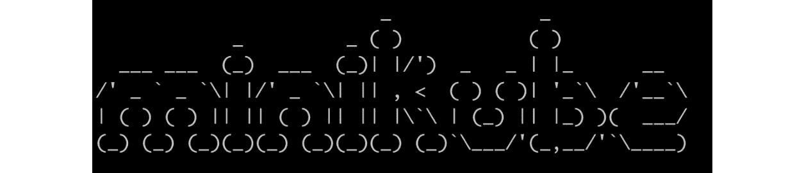

图 2.21：通过 SSH 访问 Minikube VM

注意

所有`kubectl`命令都应在主机终端会话中运行，而所有`docker`命令都应在 Minikube 终端会话中运行。

1.  在 Minikube 会话中，清理所有已停止的 Docker 容器：

```
docker rm $(docker ps -a -q)
```

您应该看到以下输出：

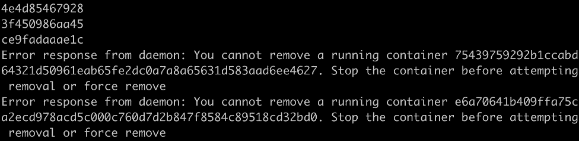

图 2.22：清理所有已停止的 Docker 容器

您可能会看到一些错误消息，比如“您无法删除正在运行的容器...”。这是因为前面的`docker rm`命令针对所有容器（`docker ps -a -q`）运行，但不会停止任何正在运行的容器。

1.  在 Minikube 会话中，通过运行以下命令停止 kubelet：

```
sudo systemctl stop kubelet
```

此命令在成功执行后不会显示任何响应。

注意

在本练习中，我们将手动停止和启动其他由 kubelet 在 Minikube 环境中管理的 Kubernetes 组件，例如 API 服务器。因此，在本练习中，需要先停止 kubelet；否则，kubelet 将自动重新启动其管理的组件。

请注意，在典型的生产环境中，与 Minikube 不同，不需要在主节点上运行 kubelet 来管理主平面组件；kubelet 只是工作节点上的一个强制组件。

1.  30 秒后，在主机终端会话中运行以下命令来检查集群的状态：

```
kubectl get node
```

您应该看到以下响应：

```
NAME         STATUS       ROLES      AGE       VERSION
minikube     NotReady     master     32h       v1.16.2
```

预计`minikube`节点的状态将更改为`NotReady`，因为 kubelet 已停止。

1.  在您的 Minikube 会话中，停止`kube-scheduler`、`kube-controller-manager`和`kube-apiserver`。正如我们之前所看到的，所有这些都作为 Docker 容器运行。因此，您可以依次使用以下命令：

```
docker stop $(docker ps | grep kube-scheduler | grep -v pause | awk '{print $1}')
docker stop $(docker ps | grep kube-controller-manager | grep -v pause | awk '{print $1}')
docker stop $(docker ps | grep kube-apiserver | grep -v pause | awk '{print $1}')
```

您应该看到以下响应：

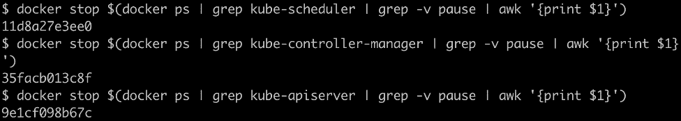

图 2.23：停止运行 Kubernetes 组件的容器

正如我们在*Kubernetes 组件概述*部分所解释的，`grep -v pause | awk '{print $1}'`命令可以获取所需 Docker 容器的确切容器 ID（`$1` = 第一列）。然后，`docker pause`命令可以暂停正在运行的 Docker 容器。

现在，三个主要的 Kubernetes 组件已经停止。

1.  现在，您需要在主机机器上创建一个部署规范。创建一个名为`k8s-for-beginners-deploy2.yaml`的文件，内容如下：

```
apiVersion: apps/v1
kind: Deployment
metadata:
  name: k8s-for-beginners
spec:
  replicas: 1
  selector:
    matchLabels:
      tier: frontend
  template:
    metadata:
      labels:
        tier: frontend
    spec:
      containers:
      - name: k8s-for-beginners
        image: packtworkshops/the-kubernetes-workshop:k8s-for-          beginners
```

1.  尝试在主机会话中运行以下命令来创建部署：

```
kubectl apply -f k8s-for-beginners-deploy2.yaml
```

您应该看到类似于以下内容的响应：

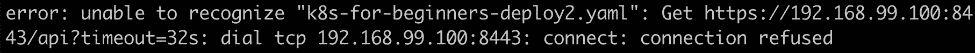

图 2.24：尝试创建新的部署

毫不奇怪，我们收到了网络超时错误，因为我们有意停止了 Kubernetes API 服务器。如果 API 服务器宕机，您将无法运行任何`kubectl`命令或使用任何依赖 API 请求的等效工具（例如 Kubernetes 仪表板）：

```
The connection to the server 192.168.99.100:8443 was refused – did you specify the right host or port?
```

1.  让我们看看如果重新启动 API 服务器并尝试再次创建部署会发生什么。通过在 Minikube 会话中运行以下命令来重新启动 API 服务器容器：

```
docker start $(docker ps -a | grep kube-apiserver | grep -v pause | awk '{print $1}')
```

该命令尝试查找携带 API 服务器的停止容器的容器 ID，然后启动它。您应该得到类似于这样的响应：

```
9e1cf098b67c
```

1.  等待 10 秒。然后，检查 API 服务器是否在线。您可以在主机会话中运行任何简单的 kubectl 命令来进行此操作。让我们尝试通过运行以下命令来获取节点列表：

```
kubectl get node
```

您应该看到以下响应：

```
NAME         STATUS       ROLES      AGE       VERSION
minikube     NotReady     master     32h       v1.16.2
```

正如您所看到的，我们能够得到一个没有错误的响应。

1.  让我们再次尝试创建部署：

```
kubectl apply -f k8s-for-beginners-deploy2.yaml
```

您应该看到以下响应：

```
deployment.apps/k8s-for-beginners created
```

1.  通过运行以下命令来检查部署是否已成功创建：

```
kubectl get deploy
```

您应该看到以下响应：

```
NAME               READY     UP-TO-DATE    AVAILABLE   AGE
k8s-for-beginners  0/1       0             0           113s
```

从前面的截图中，似乎有些问题，因为在`READY`列中，我们可以看到`0/1`，这表明与此部署关联的 pod 数量为 0，而期望的数量是 1（我们在部署规范中指定的`replicas`字段）。

1.  让我们检查所有在线的 pod：

```
kubectl get pod
```

您应该看到以下响应：

```
No resources found in default namespace.
```

我们可以看到我们的 pod 尚未创建。这是因为 Kubernetes API 服务器只创建 API 对象；任何 API 对象的实现都是由其他组件执行的。例如，在部署的情况下，是`kube-controller-manager`创建相应的 pod。

1.  现在，让我们重新启动`kube-controller-manager`。在 Minikube 会话中运行以下命令：

```
docker start $(docker ps -a | grep kube-controller-manager | grep -v pause | awk '{print $1}')
```

您应该看到类似以下的响应：

```
35facb013c8f
```

1.  等待几秒钟后，在主机会话中运行以下命令来检查部署的状态：

```
kubectl get deploy
```

您应该看到以下响应：

```
NAME               READY     UP-TO-DATE    AVAILABLE   AGE
k8s-for-beginners  0/1       1             0           5m24s
```

正如我们所看到的，我们正在寻找的 pod 仍然没有上线。

1.  现在，检查 pod 的状态：

```
kubectl get pod
```

您应该看到以下响应：

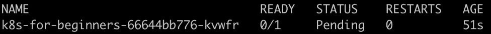

图 2.25：获取 pod 列表

输出与*步骤 15*中的输出不同，因为在这种情况下，一个 pod 是由`kube-controller-manager`创建的。但是，在`STATUS`列下我们可以看到`Pending`。这是因为将 pod 分配给适当的节点不是`kube-controller-manager`的责任；这是`kube-scheduler`的责任。

1.  在启动`kube-scheduler`之前，让我们看一下有关 pod 的一些额外信息：

```
kubectl get pod -o wide
```

您应该看到以下响应：

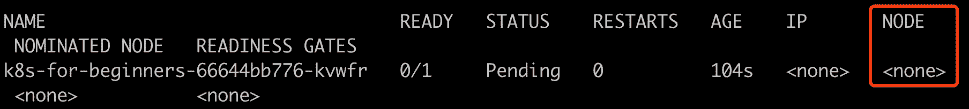

图 2.26：获取有关 pod 的更多信息

突出显示的`NODE`列表明尚未为此 pod 分配节点。这证明了调度程序没有正常工作，我们知道这是因为我们将其下线。如果调度程序在线，此响应将表明没有地方可以放置此 pod。

注意

您将在*第十七章*，*Kubernetes 中的高级调度*中学到更多关于 pod 调度的知识。

1.  让我们通过在 Minikube 会话中运行以下命令来重新启动`kube-scheduler`：

```
docker start $(docker ps -a | grep kube-scheduler | grep -v pause | awk '{print $1}')
```

您应该看到类似以下的响应：

```
11d8a27e3ee0
```

1.  我们可以通过在主机会话中运行以下命令来验证`kube-scheduler`是否工作：

```
kubectl describe pod k8s-for-beginners-66644bb776-kvwfr
```

请从*步骤 17*中获得响应中的 pod 名称，如*图 2.26*中所示。您应该看到以下输出：

```
Name:         k8s-for-beginners-66644bb776-kvwfr
Namespace:    default
Priority:     0
Node:         <none>
```

我们正在截断输出截图以便更好地展示。请看以下摘录，重点是`Events`部分：

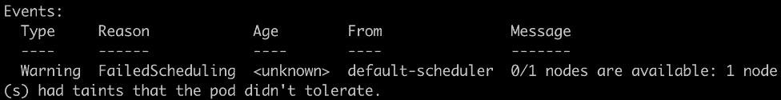

图 2.27：检查 pod 报告的事件

在`Events`部分，我们可以看到`kube-scheduler`尝试调度，但它报告没有可用的节点。为什么会这样？

这是因为我们之前停止了 kubelet，并且 Minikube 环境是一个单节点集群，因此没有可用的带有运行 kubelet 的节点，可以放置 pod。

1.  让我们通过在 Minikube 会话中运行以下命令来重新启动 kubelet：

```
sudo systemctl start kubelet
```

成功执行后，终端不应该给出任何响应。

1.  在主机终端中，通过在主机会话中运行以下命令来验证部署的状态：

```
kubectl get deploy
```

您应该看到以下响应：

```
NAME               READY     UP-TO-DATE    AVAILABLE   AGE
k8s-for-beginners  1/1       1             1           11m
```

现在，一切看起来都很健康，因为部署在`READY`列下显示`1/1`，这意味着 pod 在线。

1.  同样地，验证 pod 的状态：

```
kubectl get pod -o wide
```

您应该得到类似以下的输出：

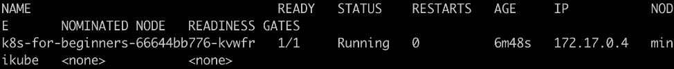

图 2.28：获取有关 pod 的更多信息

我们可以看到`STATUS`下是`Running`，并且它已被分配给`minikube`节点。

在这个练习中，我们通过逐个破坏 Kubernetes 组件然后逐个恢复它们来追踪 pod 生命周期的每个阶段。现在，基于我们对这个练习所做的观察，我们对在这个练习之前提出的问题有了更清晰的认识：

+   **步骤 12 – 16**：我们看到在部署的情况下，控制器管理器负责请求创建 pod。

+   **步骤 17 – 19**：调度程序负责选择要放置在 pod 中的节点。它通过将 pod 的`nodeName`规范设置为所需的节点来分配节点。此时，将 pod 关联到节点仅仅发生在 API 对象的级别。

+   **步骤 20 – 22**：kubelet 实际上会启动容器来运行我们的 pod。

在整个 Pod 的生命周期中，Kubernetes 组件通过适当地更新 Pod 的规范来合作。API 服务器作为接受 Pod 更新请求的关键组件，同时向感兴趣的方报告 Pod 的变化。

在接下来的活动中，我们将汇集本章学到的技能，以找出如何从基于容器的环境迁移到 Kubernetes 环境，以便运行我们的应用程序。

## 活动 2.01：在 Kubernetes 中运行 Pageview 应用程序

在*Activity 1.01*中，*创建一个简单的页面计数应用程序*，在上一章中，我们构建了一个名为 Pageview 的 Web 应用程序，并将其连接到了一个 Redis 后端数据存储。所以，这里有一个问题：在不对源代码进行任何更改的情况下，我们能否将基于 Docker 的应用程序迁移到 Kubernetes，并立即享受 Kubernetes 的好处？根据给定的指导方针，在这个活动中尝试一下。

这个活动分为两个部分：在第一部分中，我们将创建一个简单的 Pod，其中包含我们的应用程序，通过一个 Service 暴露给集群外的流量，并连接到另一个作为另一个 Pod 运行的 Redis 数据存储。在第二部分中，我们将将应用程序扩展到三个副本。

**使用 Service 将 Pageview 应用程序连接到 Redis 数据存储**

类似于 Docker 中的`--link`选项，Kubernetes 提供了一个 Service，作为一个抽象层来暴露一个应用程序（比如，一系列带有相同标签集的 Pod）可以在内部或外部访问。例如，正如我们在本章中讨论的那样，前端应用程序可以通过`NodePort` Service 暴露，以便外部用户访问。除此之外，在这个活动中，我们需要定义一个内部 Service，以便将后端应用程序暴露给前端应用程序。按照以下步骤进行：

1.  在*Activity 1.01*中，*创建一个简单的页面计数应用程序*，我们构建了两个 Docker 镜像——一个用于前端 Pageview Web 应用程序，另一个用于后端 Redis 数据存储。您可以使用本章学到的技能将它们迁移到 Kubernetes YAML 中。

1.  为该应用程序创建两个 Pod（每个由一个 Deployment 管理）是不够的。我们还必须创建 Service YAML 来将它们连接在一起。

确保清单中的`targetPort`字段与 Redis 镜像中定义的暴露端口一致，在这种情况下是`6379`。就`port`字段而言，理论上它可以是任何端口，只要它与 Pageview 应用程序中指定的端口一致即可。

这里值得一提的另一件事是 Redis 数据存储的 pod 的`name`字段。这是 Pageview 应用程序源代码中用来引用 Redis 数据存储的符号。

现在，您应该有三个 YAML 文件 - 两个 pod 和一个 Service。使用`kubectl -f <yaml 文件名>`应用它们，然后使用`kubectl get deploy,service`来确保它们被成功创建。

1.  在这个阶段，Pageview 应用程序应该能够正常运行，因为它通过 Service 与 Redis 应用程序连接在一起。然而，Service 只能作为内部连接器工作，以确保它们可以在集群内部相互通信。

要从外部访问 Pageview 应用程序，我们需要定义一个`NodePort` Service。与内部 Service 不同，我们需要明确指定`type`为`NodePort`。

1.  使用`kubectl -f <yaml 文件名>`应用外部 Service YAML。

1.  运行`minikube service <外部 service 名称>`来获取 Service URL。

1.  多次访问 URL，确保 Pageview 数量每次增加一个。

有了这个，我们成功地在 Kubernetes 中运行了 Pageview 应用程序。但是如果 Pageview 应用程序宕机怎么办？尽管 Kubernetes 可以自动创建替代的 pod，但在故障被检测到和新的 pod 准备就绪之间仍然存在停机时间。

一个常见的解决方案是增加应用程序的副本数量，以便只要至少有一个副本在运行，整个应用程序就是可用的。

**在多个副本中运行 Pageview 应用程序**

Pageview 应用程序当然可以使用单个副本运行。然而，在生产环境中，高可用性是必不可少的，并且通过在节点之间维护多个副本来避免单点故障来实现。（这将在接下来的章节中详细介绍。）

在 Kubernetes 中，为了确保应用程序的高可用性，我们可以简单地增加副本数量。按照以下步骤来做：

1.  修改 Pageview YAML 将`replicas`更改为`3`。

1.  通过运行`kubectl apply -f <pageview 应用 yaml>`来应用这些更改。

1.  通过运行`kubectl get pod`，您应该能够看到三个 Pageview pod 正在运行。

1.  使用`minikube service`命令输出中显示的 URL 多次访问。

检查每个 pod 的日志，看看请求是否均匀地分布在三个 pod 之间。

1.  现在，让我们验证 Pageview 应用程序的高可用性。在保持一个健康的 pod 的同时连续终止任意的 pod。您可以通过手动或编写脚本来实现这一点。或者，您可以打开另一个终端，检查 Pageview 应用程序是否始终可访问。

如果您选择编写脚本来终止 pod，您将看到类似以下的结果：

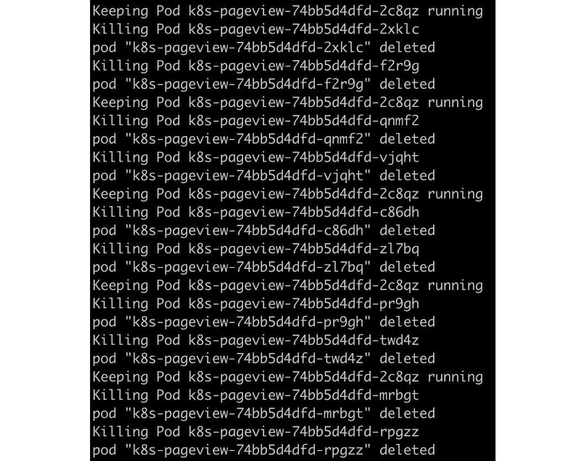

图 2.29：通过脚本杀死 pod

假设您采用类似的方法并编写脚本来检查应用程序是否在线，您应该会看到类似以下的输出：

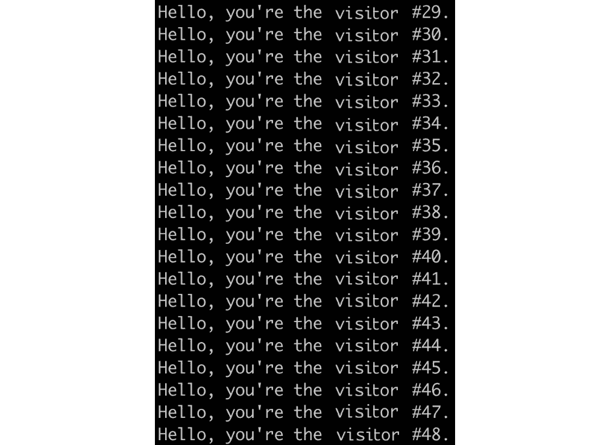

图 2.30：通过脚本重复访问应用程序

注

此活动的解决方案可在以下地址找到：[`packt.live/304PEoD`](https://packt.live/304PEoD)。

## Kubernetes 多节点集群优势一览

只有在多节点集群的环境中才能真正体会到 Kubernetes 的优势。本章以单节点集群（Minikube 环境）来演示 Kubernetes 提供的功能，就像本书的许多其他章节一样。然而，在真实的生产环境中，Kubernetes 是部署在多个工作节点和主节点上的。只有这样，您才能确保单个节点的故障不会影响应用程序的一般可用性。可靠性只是多节点 Kubernetes 集群可以为我们带来的众多好处之一。

但等等 - 难道我们不是可以在*不使用 Kubernetes*的情况下实现应用程序并以高可用的方式部署它们吗？这是真的，但通常会伴随着大量的管理麻烦，无论是在管理应用程序还是基础设施方面。例如，在初始部署期间，您可能需要手动干预，以确保所有冗余容器不在同一台机器上运行。在节点故障的情况下，您不仅需要确保新的副本被正确地重新生成，还需要确保新的副本不会落在已经运行现有副本的节点上。这可以通过使用 DevOps 工具或在应用程序端注入逻辑来实现。然而，无论哪种方式都非常复杂。Kubernetes 提供了一个统一的平台，我们可以使用它来通过描述我们想要的高可用特性（Kubernetes 原语（API 对象））将应用程序连接到适当的节点。这种模式使应用程序开发人员的思维得到解放，因为他们只需要考虑如何构建他们的应用程序。Kubernetes 在幕后处理了高可用性所需的功能，如故障检测和恢复。

# 总结

在本章中，我们使用 Minikube 来提供单节点 Kubernetes 集群，并对 Kubernetes 的核心组件以及其关键设计原理进行了高层概述。之后，我们将现有的 Docker 容器迁移到 Kubernetes，并探索了一些基本的 Kubernetes API 对象，如 pod、服务和部署。最后，我们有意破坏了一个 Kubernetes 集群，并逐个恢复了它的组件，这使我们能够了解不同的 Kubernetes 组件是如何协同工作的，以便在节点上启动和运行一个 pod。

在整个本章中，我们使用 kubectl 来管理我们的集群。我们对这个工具进行了快速介绍，但在接下来的章节中，我们将更仔细地了解这个强大的工具，并探索我们可以使用它的各种方式。
