# 3. kubectl - Kubernetes 命令中心

概述

在本章中，我们将揭开一些常见的 kubectl 命令，并看看如何使用 kubectl 来控制我们的 Kubernetes 集群。我们将从简要了解使用 kubectl 命令与 Kubernetes 集群通信的端到端过程开始。然后，我们将为 Bash 终端设置一些快捷方式和自动补全。我们将从学习如何创建、删除和管理 Kubernetes 对象的基础知识开始使用 kubectl。我们将通过练习了解在 Kubernetes 中管理资源的两种方法 - 声明式和命令式。到本章结束时，您还将学会如何使用 kubectl 实时更新运行在您的 Kubernetes 集群上的应用程序。

# 介绍

在《第一章 Kubernetes 和容器简介》中，我们看到 Kubernetes 是一个便携且高度可扩展的开源容器编排工具。它提供了非常强大的功能，可用于规模化管理容器化工作负载。在上一章中，您了解了 Kubernetes 的不同组件如何共同工作以实现期望的目标。我们还在《第二章 Kubernetes 概述》中演示了 kubectl 的一些基本用法。在本章中，我们将更仔细地研究这个实用程序，并看看如何利用其潜力。

重申一下，kubectl 是一个用于与 Kubernetes 集群交互和执行各种操作的命令行实用程序。在管理集群时，有两种使用 kubectl 的方式 - 命令式管理，重点是使用命令而不是 YAML 清单来实现所需的状态，以及声明式管理，重点是创建和更新 YAML 清单文件。kubectl 可以支持这两种管理技术来管理 Kubernetes API 对象（也称为 Kubernetes API 原语）。在上一章中，我们看到各种组件不断尝试将集群的状态从实际状态更改为所需状态。这可以通过使用 kubectl 命令或 YAML 清单来实现。

kubectl 允许您向 Kubernetes 集群发送命令。`kubectl`命令可用于部署应用程序、检查和管理 Kubernetes 对象，或者进行故障排除和查看日志。有趣的是，尽管 kubectl 是控制和与 Kubernetes 集群通信的标准工具，但它并不随 Kubernetes 一起提供。因此，即使您在集群的任何节点上运行 kubectl，您仍需要单独安装 kubectl 二进制文件，这是我们在上一章的*练习 2.01*中所做的，*使用 Minikube 和 Kubernetes 集群入门*。

本章将带您深入了解 kubectl 的幕后功能，并提供更多关于如何使用 kubectl 命令与一些常用的 Kubernetes 对象进行交互的见解。我们将学习如何为 kubectl 设置一些快捷方式。我们将带您不仅使用 kubectl 创建新对象，还对 Kubernetes 中的实时部署进行更改。但在此之前，让我们偷偷看看幕后，了解 kubectl 如何与 Kubernetes 通信的确切方式。

# kubectl 如何与 Kubernetes 通信

正如我们在上一章中看到的，API 服务器管理终端用户与 Kubernetes 之间的通信，并且还充当集群的 API 网关。为了实现这一点，它实现了基于 HTTP 和 HTTPS 协议的 RESTful API，以执行 CRUD 操作，以填充和修改 Kubernetes API 对象，例如 pod、service 等，根据用户通过 kubectl 发送的指令。这些指令可以采用各种形式。例如，要检索集群中运行的 pod 的信息，我们将使用`kubectl get pods`命令，而要创建一个新的 pod，我们将使用`kubectl run`命令。

首先，让我们看看运行`kubectl`命令时幕后发生了什么。看一下下面的插图，它提供了该过程的概述，然后我们将更仔细地查看该过程的不同细节：

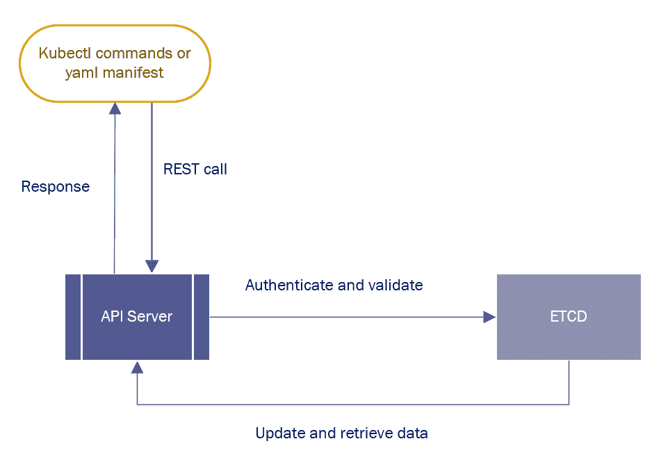

图 3.1：kubectl 实用程序的代表性流程图

kubectl 命令被转换为 API 调用，然后发送到 API 服务器。API 服务器然后对请求进行身份验证和验证。一旦身份验证和验证阶段成功，API 服务器将从`etcd`中检索和更新数据，并以请求的信息做出响应。

# 设置自动补全和快捷方式的环境

在大多数 Linux 环境中，您可以在开始使用本章提到的指令之前为 kubectl 命令设置自动补全。了解自动补全和快捷方式在 Linux 环境中的工作原理对于那些有兴趣获得由 Linux 基金会颁发的**认证 Kubernetes 管理员**（**CKA**）和**认证 Kubernetes 应用开发者**（**CKAD**）等证书的人来说将会非常有帮助。我们将在下面的练习中学习如何设置自动补全。

## 练习 3.01：设置自动补全

在本练习中，我们将向您展示如何在 Bash 中为 kubectl 命令设置自动补全和别名。这是一个有用的功能，将帮助您节省时间并避免打字错误。执行以下步骤完成本练习：

1.  我们将需要`bash-completion`包，如果尚未安装，请安装它。您可以前往 GitHub 存储库获取各种平台的安装说明，网址为[`github.com/scop/bash-completion`](https://github.com/scop/bash-completion)。如果您正在运行 Ubuntu 20.04，您可以使用以下命令通过 APT 软件包管理器安装它：

```
sudo apt-get install bash-completion
```

1.  您可以使用以下命令在 Bash 中设置自动补全：

```
source <(kubectl completion bash)
```

注意

这个命令以及本练习中的后续命令在成功执行后不会在终端上显示任何响应。

1.  如果您想在 Bash shell 中使自动补全持久化，可以使用以下命令，它将把`kubectl`自动补全写入到您当前用户目录下的`.bashrc`文件中：

```
echo "source <(kubectl completion bash)" >> ~/.bashrc 
```

1.  您也可以使用`alias`关键字为您的`kubectl`命令设置别名，方法如下：

```
alias k=kubectl
```

1.  同样，如果您想为某些特定命令设置别名，可以使用类似以下的命令：

```
alias kcdp='kubectl describe po'
alias kcds='kubectl describe svc'
alias kcdd='kubectl describe deploy'
```

1.  最后，您可以使用以下命令在按下*Tab*时设置`kubectl`命令的自动补全：

```
complete -F __start_kubectl k
```

注意

您也可以使用以下命令在`zsh`（Bash shell 的替代品）中设置自动补全：

`source <(kubectl completion zsh)`

`echo "if [ $commands[kubectl] ]; then source <(kubectl completion zsh); fi" >> ~/.zshrc`

在完成这个练习之后，你将为你的 Bash shell 设置好自动补全。你也可以在命令中使用别名，比如使用`k`代替`kubectl`。然而，为了避免混淆并保持标准化的结构，我们在本书中将使用完整的命令。

## 设置 kubeconfig 配置文件

在大多数企业环境中，通常会有不止一个 Kubernetes 集群，这取决于组织的策略。管理员、开发人员或者其他与 Kubernetes 集群打交道的角色需要与多个集群进行交互，并在不同的集群上执行不同的操作。

配置文件会让事情变得更加简单。你可以使用这个文件来存储关于不同集群、用户、命名空间和认证机制的信息。这样的配置文件被称为**kubeconfig**文件。请注意，kubeconfig 是指 kubectl 配置文件的通用方式，而不是`config`文件的名称。kubectl 使用这样的文件来存储我们选择集群并与其 API 服务器通信所需的信息。

默认情况下，kubectl 会在`$HOME/.kube`目录中查找该文件。在大多数情况下，你可以指定一个`KUBECONFIG`环境变量或使用`--kubeconfig`标志来指定 kubeconfig 文件。这些文件通常保存在`$HOME/.kube/config`中。

注意

你可以通过设置`KUBECONFIG`环境变量和`--kubeconfig`标志来了解如何配置访问多个集群的更多信息，网址为[`kubernetes.io/docs/tasks/access-application-cluster/configure-access-multiple-clusters/#set-the-kubeconfig-environment-variable`](https://kubernetes.io/docs/tasks/access-application-cluster/configure-access-multiple-clusters/#set-the-kubeconfig-environment-variable)。

安全上下文用于定义 pod 的特权和访问控制设置。我们将在*第十三章*，*Kubernetes 中的运行时和网络安全*中重新讨论访问控制和安全性。

让我们来看一下 kubeconfig 文件，以了解它是如何工作的。你可以使用以下命令查看 kubeconfig 文件：

```
kubectl config view
```

或者，你也可以使用以下命令：

```
cat $HOME/.kube/config
```

你应该会得到类似以下的输出：

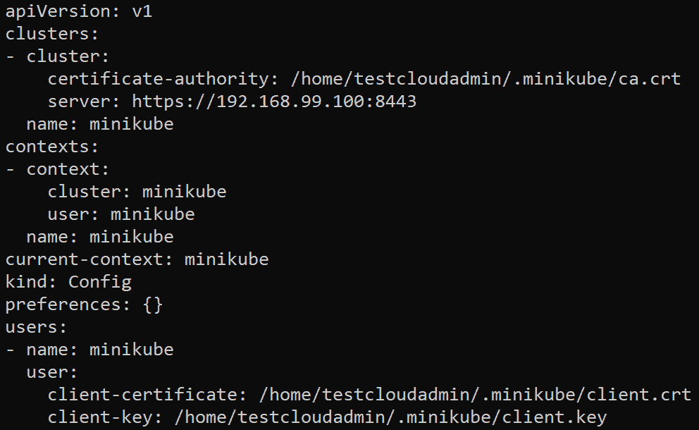

图 3.2：kubectl config view 命令的输出

`context`是访问集群所需的一组信息。 它包含集群的名称、用户和命名空间。 *图 3.2*中的`current-context`字段显示您正在使用的当前上下文。 如果要切换当前上下文，可以使用以下命令：

```
kubectl config use-context <the cluster you want to switch to>
```

例如，如果我们想要切换到名为`minikube`的上下文，我们将使用以下命令：

```
kubectl config use-context minikube
```

这将产生类似以下的输出：

```
Switched to context "minikube".
```

# 常用的 kubectl 命令

如前所述，kubectl 是一个用于与 Kubernetes API 服务器通信的 CLI 工具。 kubectl 具有许多有用的命令，用于处理 Kubernetes。 在本节中，我们将为您介绍一些常用的 kubectl 命令和快捷方式，用于管理 Kubernetes 对象。

## 常用的 kubectl 命令来创建、管理和删除 Kubernetes 对象

有几个简单的 kubectl 命令，您几乎每次都会使用。 在本节中，我们将看一些基本的 kubectl 命令：

+   `get <object>`：您可以使用此命令获取所需类型对象的列表。 使用`all`而不是指定对象类型将获取所有类型对象的列表。 默认情况下，这将获取默认命名空间中指定对象类型的列表。 您可以使用`-n`标志从特定命名空间获取对象；例如，`kubectl get pod -n mynamespace`。

+   `describe <object-type> <object-name>`：您可以使用此命令检查特定对象的所有相关信息；例如，`kubectl describe pod mypod`。

+   `logs <object-name>`：您可以使用此命令检查特定对象的所有相关日志，以找出创建该对象时发生了什么；例如，`kubectl logs mypod`。

+   `edit <object-type> <object-name>`：您可以使用此命令编辑特定对象；例如，`kubectl edit pod mypod`。

+   `delete <object-type> <object-name>`：您可以使用此命令删除特定对象；例如，`kubectl delete pod mypod`。

+   `create <filename.yaml>`：您可以使用此命令创建在 YAML 清单文件中定义的一堆 Kubernetes 对象；例如，`kubectl create -f your_spec.yaml`。

+   `apply <filename.yaml>`：您可以使用此命令创建或更新在 YAML 清单文件中定义的一堆 Kubernetes 对象；例如，`kubectl apply -f your_spec.yaml`。

## 一些简单 kubectl 命令的演示

在本节中，我们将为您介绍一些常用的 kubectl 命令。本节主要用于演示目的，因此您可能看不到与这些图像中相同的确切输出。但是，本节将帮助您了解这些命令的使用方式。您将在后面的练习中广泛使用它们，以及在整本书中。让我们来看一下：

+   如果您想显示节点，请使用以下命令：

```
kubectl get nodes
```

您将看到类似以下的输出：

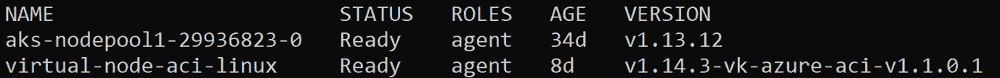

图 3.3：kubectl get nodes 命令的输出

由于我们在*练习 3.01*，*设置自动补全*中设置了别名，您也可以使用以下命令获得相同的结果：

```
k get no
```

+   如果您想显示所有当前命名空间，可以使用以下命令：

```
kubectl get namespaces
```

您应该看到类似以下的输出：

```
NAME                  STATUS         AGE
default               Active         7m5s
kube-node-lease       Active         7m14s
kube-public           Active         7m14s
kube-system           Active         7m15s
```

您也可以使用以下缩短命令获得相同的结果：

```
k get ns
```

+   如果您想检查`kubectl`的版本，可以使用以下命令：

```
kubectl version
```

您将看到类似以下的输出：

```
Client version: version.Info{Major:"1", Minor:"17", GitVersion:"v1.17.2, GitCommit: 59603c6e503c87169aea6106f57b9f242f64df89", GitTreeState:"clean", BuildDate:"2020-01-21T22:17:28Z, GoVersion:"go1.13.5", Compiler:"gc", Platform:"linux/amd64}
Server version: version.Info{Major:"1", Minor:"17", GitVersion:"v1.17.2, GitCommit: 59603c6e503c87169aea6106f57b9f242f64df89", GitTreeState:"clean", BuildDate:"2020-01-18T23:22:30Z, GoVersion:"go1.13.5", Compiler:"gc", Platform:"linux/amd64}
```

+   如果您想查看有关当前 Kubernetes 集群的一些信息，可以使用以下命令：

```
kubectl cluster-info
```

您应该看到类似以下的输出：

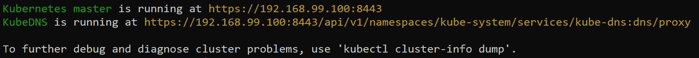

图 3.4：kubectl cluster-info 命令的输出

在我们继续进行演示之前，我们将提到一些命令，您可以使用这些命令创建一个示例应用程序，我们已经在本章的 GitHub 存储库中提供了。使用以下命令获取运行应用程序所需的所有对象的 YAML 规范：

```
curl https://raw.githubusercontent.com/PacktWorkshops/Kubernetes-Workshop/master/Chapter03/Activity03.01/sample-application.yaml --output sample-application.yaml
```

现在，您可以使用以下命令部署`sample-application.yaml`文件：

```
kubectl apply -f sample-application.yaml 
```

如果您能看到以下输出，这意味着示例应用程序已成功创建在您的 Kubernetes 集群中：

```
deployment.apps/redis-back created
service/redis-back created
deployment.apps/melonvote-front created
service/melonvote-front created
```

现在您已部署了提供的应用程序，如果您尝试本节后面显示的任何命令，您将看到与该应用程序相关的各种对象、事件等。请注意，您的输出可能与此处显示的图像不完全匹配：

+   您可以使用以下命令获取`default`命名空间下的集群中的所有内容：

```
kubectl get all
```

这将给出类似以下的输出：

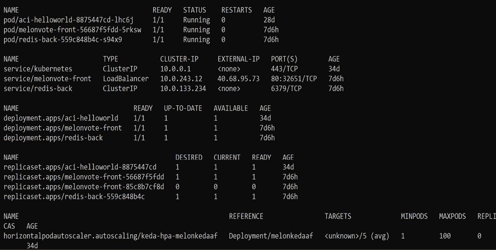

图 3.5：kubectl get all 命令的输出

+   事件描述了 Kubernetes 集群中到目前为止发生的事情，您可以使用事件更好地了解您的集群，并帮助解决任何故障排除工作。要列出默认命名空间中的所有事件，请使用以下命令：

```
kubectl get events
```

这将产生类似以下的输出：

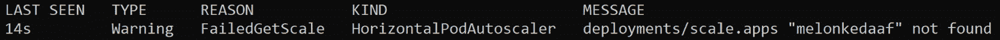

图 3.6：kubectl get events 命令的输出

+   服务是用来向最终用户公开应用程序的抽象。您将在*第八章* *Service Discovery*中了解更多关于服务的内容。您可以使用以下命令列出所有服务：

```
kubectl get services
```

这将产生类似以下的输出：

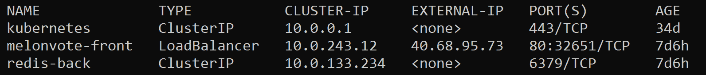

图 3.7：kubectl get services 命令的输出

您也可以使用以下缩写命令获得相同的结果：

```
k get svc
```

+   部署是一个允许我们轻松管理和更新 pod 的 API 对象。您将在*第七章* *Kubernetes Controllers*中了解更多关于部署的内容。您可以使用以下命令获取部署列表：

```
kubectl get deployments 
```

这应该会产生类似以下的响应：

```
NAME               READY    UP-TO-DATE    AVAILABLE     AGE
aci-helloworld     1/1      1             1             34d
melonvote-front    1/1      1             1             7d6h
redis-back         1/1      1             1             7d6h
```

您也可以使用以下缩写版本的命令获得相同的结果：

```
k get deploy
```

### `get`命令的一些有用标志

正如您所见，`get`命令是一个非常标准的命令，用于在我们需要获取集群中对象列表时使用。它还有一些有用的标志。让我们在这里看一些：

+   如果您想要列出所有命名空间中特定类型的资源，您可以在命令中添加`--all-namespaces`标志。例如，如果我们想要列出所有命名空间中的所有部署，我们可以使用以下命令：

```
kubectl get deployments --all-namespaces
```

这将产生类似这样的输出：

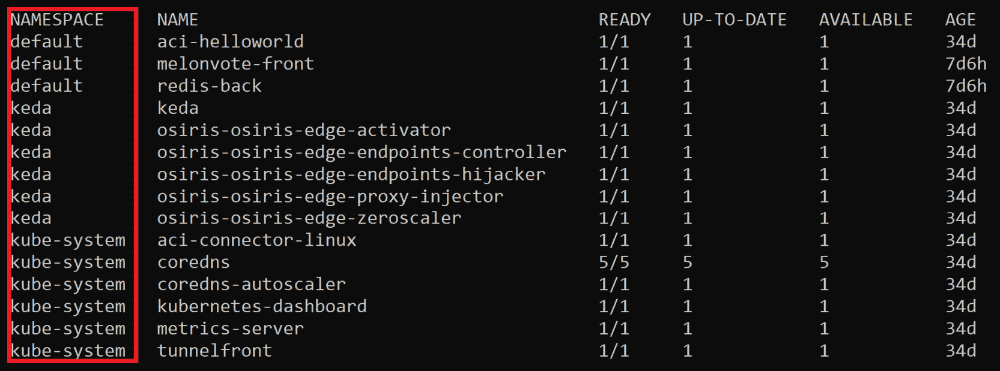

图 3.8：在所有命名空间下 kubectl get deployments 的输出

您还可以看到左侧有一个额外的列，指定了相应部署的命名空间。

+   如果您想要列出特定命名空间中特定类型的资源，您可以使用`-n`标志。在这里，`-n`标志代表`命名空间`。例如，如果您想要列出名为`keda`的命名空间中的所有部署，将使用以下命令：

```
kubectl get deployments -n keda
```

这个命令会显示类似以下的输出：

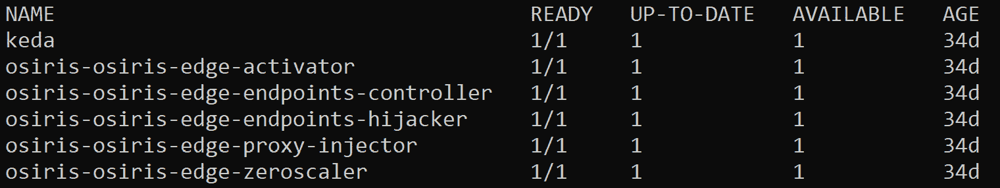

图 3.9：在 keda 命名空间下使用 kubectl get deployments 的输出

+   您可以添加`--show-labels`标志来显示列表中对象的标签。例如，如果您想要获取`default`命名空间中所有 Pod 的列表，以及它们的标签，您可以使用以下命令：

```
kubectl get pods --show-labels
```

此命令应该会产生类似以下的输出：

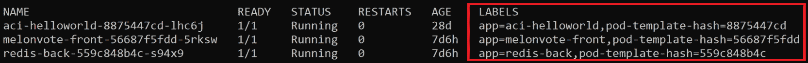

图 3.10：使用所有标签获取 kubectl get pods 的输出

右侧有一个额外的列，指定了 Pod 的标签。

+   您可以使用`-o wide`标志来显示有关对象的更多信息。这里，`-o`标志代表`输出`。让我们看一个如何使用这个标志的简单例子：

```
kubectl get pods -o wide
```

这将产生类似以下的输出：

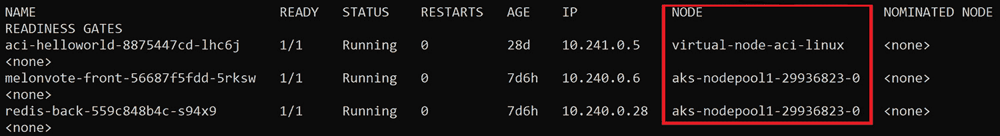

图 3.11：使用附加信息获取 kubectl get pods 的输出

您还可以看到右侧有额外的列，指定了 Pod 所在的节点，以及节点的内部 IP 地址。您可以在[`kubernetes.io/docs/reference/kubectl/overview/#output-options`](https://kubernetes.io/docs/reference/kubectl/overview/#output-options)找到更多使用`-o`标志的方法。

注意

我们将限制本节中常用的命令，以限制本章的范围。您可以在[`kubernetes.io/docs/reference/generated/kubectl/kubectl-commands`](https://kubernetes.io/docs/reference/generated/kubectl/kubectl-commands)找到更多 kubectl 命令。

# 在 Kubernetes 中填充部署

正如我们之前提到的，部署是管理和更新 Pod 的便捷方式。在 Kubernetes 中定义部署是为集群中运行的应用程序提供声明性更新的有效和高效方式。

您可以使用 kubectl 命令来创建部署，也可以使用声明性的 YAML 清单文件。在接下来的练习中，我们将在 Kubernetes 中部署一个应用程序（本练习将使用 Nginx），并学习如何使用 kubectl 命令与部署进行交互，以及如何修改 YAML 清单文件。

## 练习 3.02：创建部署

在 Kubernetes 中创建部署有两种方式 - 使用`kubectl create`/`run`命令和创建一个 YAML 格式的清单文件，然后使用`kubectl apply`命令。我们可以用这两种选项实现相同的目标。让我们尝试一下，然后进行比较：

1.  直接使用以下命令创建一个部署：

```
kubectl create deployment kubeserve --image=nginx:1.7.8
```

您可以期待类似以下的输出：

```
deployment.apps/kubeserve created
```

注意

您也可以使用`kubectl run`命令创建一个部署。为了在这里实现相同的结果，您可以使用以下命令：

`kubectl run nginx --image=nginx:1.7.8`

`kubectl run nginx --image=nginx:1.7.8 --replicas=3`

1.  您还可以通过定义部署的 YAML 清单文件来创建一个部署。使用您喜欢的文本编辑器创建一个名为`sample-deployment.yaml`的文件，内容如下：

```
apiVersion: apps/v1
kind: Deployment
metadata:
  name: kubeserve 
  labels:
    app: kubeserve 
spec:
  replicas : 3
  selector:
    matchLabels:
      app: kubeserve 
  template:
    metadata:
      labels:
        app: kubeserve 
    spec:
      containers:
      - name: nginx
        image: nginx
        ports:
        - containerPort: 80
```

在这个 YAML 定义中，`replicas`字段定义了部署中副本 pod 的数量。

1.  使用以下命令应用您在 YAML 清单文件中定义的配置：

```
kubectl apply -f sample-deployment.yaml
```

示例输出将如下所示：

```
kubectl apply -f sample-deployment.yaml
```

1.  使用以下命令检查当前存在于`default`命名空间中的部署：

```
kubectl get deployments 
```

输出将如下所示：

```
NAME              READY    UP-TO-DATE    AVAILABLE     AGE
aci-helloworld    1/1      1             1             27d
kubeserve         3/3      3             3             26m
```

在这个练习中，我们已经看到了使用不同方法创建部署的差异。`kubectl create`命令被广泛用于测试。对于大多数实施现代 DevOps 方法的企业解决方案，使用 YAML 定义来方便地定义配置，并使用 Git 等源代码控制工具进行跟踪，更有意义。当您的组织将 YAML 定义与 DevOps 工具集成时，可以使解决方案更易管理和可追踪。

现在我们已经看到如何创建一个部署，在下一个练习中，我们将学习如何修改或更新已经运行的部署。这是您经常需要做的事情，因为软件被更新到新版本，bug 被识别和修复，您的应用程序的需求发生变化，或者您的组织转移到完全新的解决方案。我们还将学习如何将部署回滚到较早的版本，如果更新没有达到预期的结果，这是您想要做的事情。

## 练习 3.03：更新部署

在这个练习中，我们将更新在上一个练习中部署的应用程序到一个更近期的版本，并演示如果有必要，我们如何回滚部署到先前的版本。

与我们在创建部署时看到的两种方法类似，更新应用程序也有两种方式——使用`kubectl set image`命令和更新 YAML 清单文件，然后使用`kubectl apply`命令。以下步骤将指导您完成这两种方法：

1.  首先，让我们使用以下命令获取当前部署的详细信息：

```
kubectl describe deploy kubeserve
```

您将看到类似以下的输出：

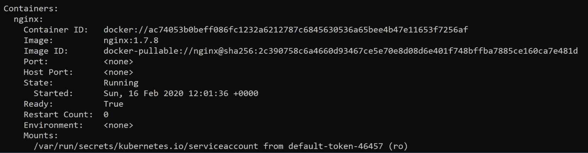

图 3.12：描述 kubeserve 部署

1.  可以使用以下命令更新图像：

```
kubectl set image deployment/kubeserve nginx=nginx:1.9.1 –-record
```

`image`子命令表示我们要更新对象的`image`字段，如我们在上一个练习的*步骤 2*中所见的 YAML 清单中定义的那样。

然后，我们以`<object-type>/<object name>`格式指定对象。

接下来的部分，`nginx=nginx:1.9.1`，告诉 Kubernetes 在 NGINX 的 Docker Hub 存储库中查找特定标记为`1.9.1`的图像。您可以在[`hub.docker.com/_/nginx?tab=tags`](https://hub.docker.com/_/nginx?tab=tags)上查看可用的标记。

`--record`标志在您想要保存`kubectl`命令对当前资源所做的更新时非常有用。

通过应用此命令，您将看到类似以下的输出：

```
deployment.extensions/kubeserve image updated
```

1.  现在，让我们使用以下命令获取部署的详细信息：

```
kubectl describe deploy kubeserve
```

您应该看到以下输出：

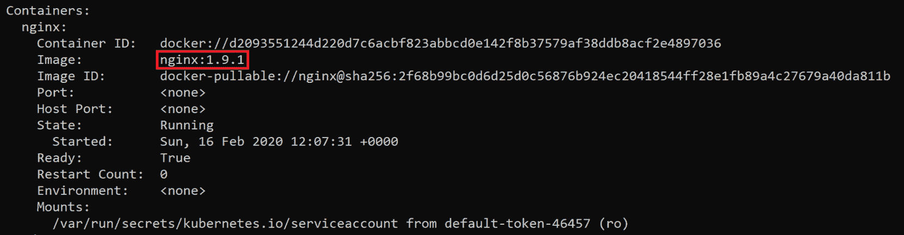

图 3.13：使用 kubectl describe 命令检查容器中的图像版本

在前面的截图中，您可以看到图像已成功更新为版本`1.9.1`。

实现相同结果的另一种方法是修改 YAML 文件，然后使用`kubectl apply`命令。我们将使用在上一个练习中创建的相同 YAML 文件。如果您没有对象的 YAML 文件，可以使用以下命令导出 YAML 清单：

```
kubectl get deploy kubeserve -o yaml > kubeserve-spec.yaml
```

该命令将输出一个名为`kubeserve-spec.yaml`的文件，其中包含在集群中生效的清单。然后，您可以使用 vim、nano 或任何其他文本编辑器对其进行编辑，然后使用`kubectl apply`命令应用编辑后的`kubeserve-spec.yaml`清单，如前一个练习中所示，还需添加`--record`标志。

1.  如果要执行回滚操作，可以使用以下命令：

```
kubectl rollout undo deployments kubeserve
```

您将看到类似以下的输出：

```
deployment.extensions/kubeserve rolled back
```

1.  您可以使用`kubectl rollout history`命令来检查特定部署的所有修订版本，如下所示：

```
kubectl rollout history deployment kubeserve
```

您将看到类似以下的输出：

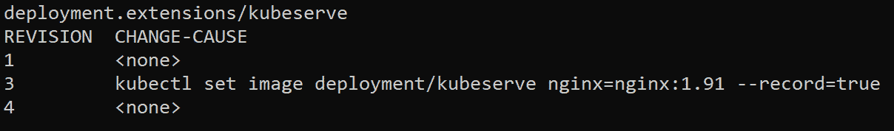

图 3.14：kubectl rollout history 命令的输出

1.  您还可以使用以下命令来检查特定修订的详细信息：

```
kubectl rollout history deployment kubeserve --revision=3
```

该命令的输出将如下所示：

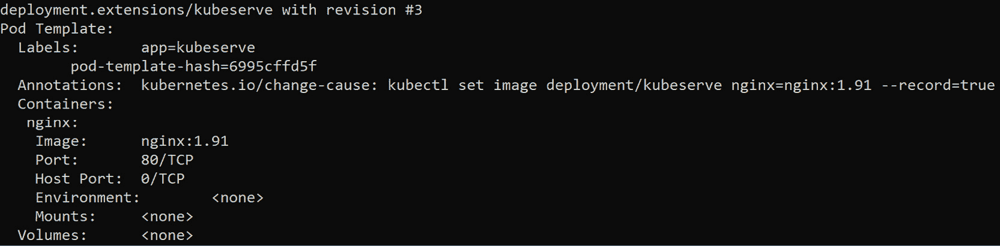

图 3.15：检查修订版本 3 的详细信息

1.  您可以通过指定`--to-revision`标志将部署回滚到特定修订版本：

```
kubectl rollout undo deployments kubeserve --to-revision=3
```

您将看到类似以下的输出：

```
deployment.extensions/kubeserve rolled back
```

在这个练习中，我们学习了如何更新已经存在的部署，以及如何将部署回滚到先前的规范。

部署允许我们以声明性的方式定义副本 Pod 的期望状态。我们将重新访问部署的工作原理，并在*第七章*，*Kubernetes Controllers*中发现更多关于它的信息。如果您有意删除单个 Pod 副本，或者如果 Pod 由于任何原因失败，由于我们定义了具有一定数量副本的部署，部署将会不断重新创建 Pod，直到您删除它为止。这就是我们所说的*自动修复*。因此，您需要删除部署本身，这也将删除由其管理的所有 Pod。我们将在接下来的练习中学习如何做到这一点。

## 练习 3.04：删除部署

在这个练习中，我们将删除在上一个练习中创建的部署：

1.  使用以下命令获取现有部署的列表：

```
kubectl get deployment
```

您可以期望看到类似以下的输出：

```
NAME              READY    UP-TO-DATE    AVAILABLE     AGE
aci-helloworld    1/1      1             1             27d
kubeserve         3/3      3             3             26m
melonkedaaf       0/0      0             0             26d
```

1.  假设，为了这个练习的目的，我们想要删除在上一个练习中创建的`kubeserve`部署。使用以下命令来删除部署：

```
kubectl delete deployment kubeserve
```

示例输出将类似于以下内容：

```
deployment.extensions "kubeserve" deleted
```

1.  获取部署列表以检查并确保目标部署已成功删除：

```
kubectl get deployment
```

您应该看到类似以下的输出：

```
NAME              READY    UP-TO-DATE    AVAILABLE     AGE
aci-helloworld    1/1      1             1             27d
kubeserve         0/0      0             0             26d
```

您可以使用`kubectl delete`命令来删除任何其他对象。但是，正如我们之前提到的，在诸如由部署管理的 Pod 的情况下，删除单个 Pod 是没有意义的，因为部署将会重新创建它们，所以您需要删除部署。

## 活动 3.01：编辑实时部署以进行真实应用程序

假设您是一名 SysOps 工程师，被要求管理一个集群并部署一个 Web 应用程序。您已经将其部署到您的 Kubernetes 集群，并使其对公众可用。自从成功部署以来，您一直在监视这个应用程序，并且您已经发现在高峰时段，Web 应用程序遇到了限流问题。根据您的监控，您想要实施的解决方案是为这个应用程序分配更多的内存和 CPU。因此，您需要编辑部署，以便为应用程序分配足够的 CPU 和内存资源来运行应用程序并在最后测试这个应用程序。您需要证明您的 Web 应用程序正在运行，并且可以通过您选择的浏览器通过公共 IP 地址访问。

为了模拟这种情况，我们将在 Kubernetes 集群中部署一个示例应用程序，并向您展示如何编辑实时部署。编辑实时部署是您在修复问题或进行测试时需要做的事情。

您可以使用以下命令获取您将在此活动中使用的 YAML 清单文件：

```
curl https://raw.githubusercontent.com/PacktWorkshops/Kubernetes-Workshop/master/Chapter03/Activity03.01/sample-application.yaml --output sample-application.yaml
```

此清单文件定义了运行应用程序所需的所有不同对象，以及应用程序本身。

注意

此清单已经改编自 Microsoft Azure 提供的开源示例，可在[`github.com/Azure-Samples/azure-voting-app-redis`](https://github.com/Azure-Samples/azure-voting-app-redis)上找到。

执行以下步骤以完成此活动：

1.  首先，使用`kubectl apply`命令和提供的 YAML 定义文件部署目标 Web 应用程序。

1.  获取暴露您的应用程序的服务的 IP 地址。对于这种简单的情况，这将类似于*练习 2.03，通过服务访问 Pod*，来自上一章。后面的章节将解释如何使用入口控制器并创建入口资源来暴露前端应用程序。

1.  使用`kubectl edit`命令编辑实时部署。您需要编辑名为`melonvote-front`的部署。以下是您需要修改以满足此场景要求的字段。您可以简单地将这些值加倍：

a) `resources.limits.cpu`：这是 CPU 使用的资源限制。

b) `resources.limits.memory`：这是内存使用的资源限制。

c) `resources.requests.cpu`: 这是请求的最小 CPU 使用量，用于启动和运行您的应用程序。

d) `resources.requests.memory`: 这是请求的最小内存使用量，用于启动和运行您的应用程序。

在本活动结束时，您将能够看到您使用 Kubernetes 部署的应用程序的用户界面：


图 3.16：活动的预期输出

注意

此活动的解决方案可在以下地址找到：[`packt.live/304PEoD`](https://packt.live/304PEoD)。

# 总结

本章揭开了 kubectl 如何允许我们使用 API 调用来控制 Kubernetes 集群的神秘面纱。首先，我们学习了如何为 kubectl 命令设置环境，并查看了一些快捷方式。此外，我们介绍了如何使用 kubectl 命令创建、编辑和删除 Kubernetes 对象，并以 Deployment 为例进行了介绍。最后，我们部署了一个真实的应用程序，并向您展示了如何编辑一个实时的 Deployment。本章中的每个示例都是在一般情境下应用的；然而，我们相信本章中培养的技能可以帮助您解决在专业环境中可能遇到的特定问题。

在下一章中，您将探索这座桥的另一侧，并深入了解 API 服务器的工作原理。您还将更仔细地研究 REST API 请求以及 API 服务器如何处理它们。
