# 第四章：4\. 如何与 Kubernetes（API 服务器）通信

概述

在本章中，我们将建立对 Kubernetes API 服务器及其各种交互方式的基础理解。我们将学习 kubectl 和其他 HTTP 客户端如何与 Kubernetes API 服务器进行通信。我们将使用一些实际演示来跟踪这些通信，并查看 HTTP 请求的详细信息。然后，我们还将看到如何查找 API 详细信息，以便您可以从头开始编写自己的 API 请求。通过本章的学习，您将能够使用任何 HTTP 客户端（如 curl）直接与 API 服务器通信，以创建 API 对象并进行 RESTful API 调用。

# 介绍

正如您在*第二章*《Kubernetes 概述》中所记得的，API 服务器充当与 Kubernetes 中所有不同组件通信的中央枢纽。在上一章中，我们看到了如何使用 kubectl 指示 API 服务器执行各种操作。

在本章中，我们将进一步了解构成 API 服务器的组件。由于 API 服务器位于整个 Kubernetes 系统的中心，因此学习如何有效地与 API 服务器本身进行通信以及如何处理 API 请求非常重要。我们还将了解各种 API 概念，如资源、API 组和 API 版本，这将帮助您了解发送到 API 服务器的 HTTP 请求和响应。最后，我们将使用多个 REST 客户端与 Kubernetes API 进行交互，以实现在上一章中使用 kubectl 命令行工具实现的许多相同结果。

# Kubernetes API 服务器

在 Kubernetes 中，控制平面组件和外部客户端（如 kubectl）之间的所有通信和操作都被转换为由 API 服务器处理的**RESTful API**调用。实际上，API 服务器是一个 RESTful Web 应用程序，它通过 HTTP 处理 RESTful API 调用以存储和更新 etcd 数据存储中的 API 对象。

API 服务器也是一个前端组件，充当与外部世界的网关，所有客户端都可以访问，比如 kubectl 命令行工具。即使控制平面中的集群组件也只能通过 API 服务器相互交互。此外，它是唯一直接与 etcd 数据存储交互的组件。由于 API 服务器是客户端访问集群的唯一方式，必须正确配置以供客户端访问。通常会看到 API 服务器实现为`kube-apiserver`。

注意

我们将在本章后面的* Kubernetes API*部分更详细地解释 RESTful API。

现在，让我们通过运行以下命令来回顾一下我们的 Minikube 集群中的 API 服务器的外观：

```
kubectl get pods -n kube-system
```

您应该看到以下响应：

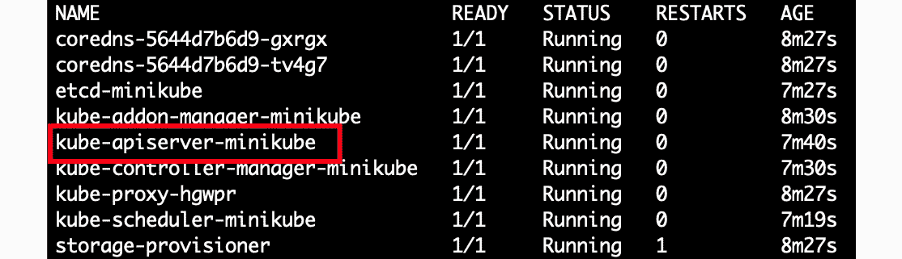

图 4.1：观察 Minikube 中 API 服务器的实现方式

正如我们在之前的章节中看到的，在 Minikube 环境中，API 服务器被称为`kube-apiserver-minikube`，位于`kube-system`命名空间中。如前面的屏幕截图所示，我们有一个 API 服务器的单个实例：`kube-apiserver-minikube`。

API 服务器是无状态的（即，其行为将始终保持一致，无论集群的状态如何），并且设计为水平扩展。通常，为了集群的高可用性，建议至少有三个实例来更好地处理负载和容错能力。

# Kubernetes HTTP 请求流程

正如我们在之前的章节中学到的，当我们运行任何`kubectl`命令时，该命令会被转换为 JSON 格式的 HTTP API 请求，并发送到 API 服务器。然后，API 服务器将响应返回给客户端，并提供任何请求的信息。以下图表显示了 API 请求的生命周期以及 API 服务器在接收请求时发生的情况：

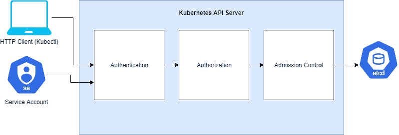

图 4.2：API 服务器 HTTP 请求流

如前图所示，HTTP 请求经过身份验证、授权和准入控制阶段。我们将在以下子主题中查看每个阶段。

## 身份验证

在 Kubernetes 中，每个 API 调用都需要通过 API 服务器进行身份验证，无论是来自集群外部的调用，比如 kubectl 发出的调用，还是来自集群内部的进程，比如 kubelet 发出的调用。

当向 API 服务器发送 HTTP 请求时，API 服务器需要对发送此请求的客户端进行身份验证。HTTP 请求将包含所需的身份验证信息，例如用户名、用户 ID 和组。身份验证方法将由请求的标头或证书确定。为了处理这些不同的方法，API 服务器有不同的身份验证插件，例如 ServiceAccount 令牌，用于对 ServiceAccounts 进行身份验证，以及至少一种其他方法来对用户进行身份验证，例如 X.509 客户端证书。

注意

集群管理员通常在集群创建过程中定义认证插件。您可以在[`kubernetes.io/docs/reference/access-authn-authz/authentication/`](https://kubernetes.io/docs/reference/access-authn-authz/authentication/)了解更多关于各种认证策略和认证插件的信息。

我们将在*第十一章* *构建您自己的 HA 集群*中查看基于证书的身份验证的实现。

API 服务器将依次调用这些插件，直到其中一个对请求进行身份验证。如果它们全部失败，则身份验证失败。如果身份验证成功，则身份验证阶段完成，请求继续到授权阶段。

## 授权

身份验证成功后，将 HTTP 请求中的属性发送到授权插件，以确定用户是否被允许执行请求的操作。不同用户可能具有不同级别的权限；例如，特定用户是否可以在请求的命名空间中创建一个 pod？用户是否可以删除一个部署？这些决定是在授权阶段做出的。

考虑一个例子，假设您有两个用户。一个名为**ReadOnlyUser**（只是一个假设的名称）应该被允许仅列出`default`命名空间中的 pod，而**ClusterAdmin**（另一个假设的名称）应该能够在所有命名空间中执行所有任务：


图 4.3：我们两个用户的权限

为了更好地理解这一点，请看以下演示：

注意

我们不会深入讨论如何创建用户，因为这将在《第十三章》《Kubernetes 中的运行时和网络安全》中讨论。对于这个演示，用户以及他们的权限已经设置好，并且通过切换上下文来演示他们的权限限制。

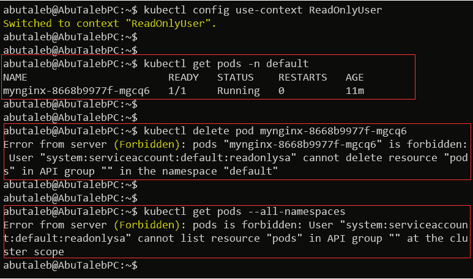

图 4.4：演示不同用户权限

请注意，从前面的截图中可以看出，`ReadOnlyUser`只能在默认命名空间中**列出**pod，但是当尝试执行其他任务时，比如在`default`命名空间中删除 pod 或者列出其他命名空间中的 pod 时，用户将会收到`Forbidden`错误。这个`Forbidden`错误是由授权插件返回的。

kubectl 提供了一个工具，您可以使用`kubectl auth can-i`来检查当前用户是否允许执行某项操作。

让我们在前面演示的情境下考虑以下例子。假设`ReadOnlyUser`运行以下命令：

```
kubectl auth can-i get pods --all-namespaces
kubectl auth can-i get pods -n default
```

用户应该看到以下响应：

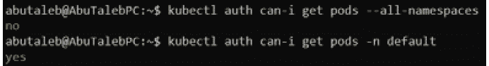

图 4.5：检查 ReadOnlyUser 的权限

现在，在切换上下文之后，假设`ClusterAdmin`用户运行以下命令：

```
kubectl auth can-i delete pods
kubectl auth can-i get pods
kubectl auth can-i get pods --all-namespaces
```

用户应该看到以下响应：

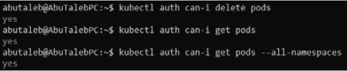

图 4.6：检查 ClusterAdmin 的权限

与认证阶段模块不同，授权模块是按顺序检查的。如果配置了多个授权模块，并且如果任何授权者批准或拒绝请求，该决定将立即返回，不会联系其他授权者。

## 准入控制

在请求经过认证和授权之后，它会经过准入控制模块。这些模块可以修改或拒绝请求。如果请求只是尝试执行读取操作，它将绕过这个阶段；但是如果它尝试创建、修改或删除，它将被发送到准入控制器插件。Kubernetes 带有一组预定义的准入控制器，尽管您也可以定义自定义的准入控制器。

这些插件可能会修改传入的对象，在某些情况下会应用系统配置的默认值，甚至会拒绝请求。与授权模块一样，如果任何准入控制器模块拒绝请求，那么请求将被丢弃，不会进一步处理。

一些例子如下：

+   如果我们配置一个自定义规则，要求每个对象都必须有一个标签（您将在第十六章“Kubernetes 准入控制器”中学习如何做到这一点），那么任何尝试创建没有标签的对象的请求都将被准入控制器拒绝。

+   当您删除一个命名空间时，它会进入“Terminating”状态，在这种状态下，Kubernetes 会尝试在删除之前清除其中的所有资源。因此，我们无法在此命名空间中创建任何新对象。`NamespaceLifecycle`就是阻止这种情况发生的。

+   当客户端尝试在不存在的命名空间中创建资源时，`NamespaceExists`准入控制器会拒绝该请求。

在 Kubernetes 中包含的不同模块中，并非所有准入控制模块都是默认启用的，默认模块通常会根据 Kubernetes 版本而变化。云基 Kubernetes 解决方案的提供商，如亚马逊网络服务（AWS）、谷歌和 Azure，控制着默认可以启用哪些插件。集群管理员还可以在初始化 API 服务器时决定启用或禁用哪些模块。通过使用`--enable-admission-plugins`标志，管理员可以控制除默认模块之外应启用哪些模块。另一方面，`--disable-admission-plugins`标志控制默认模块中应禁用哪些模块。

注意

您将在第十六章“Kubernetes 准入控制器”中学习更多关于准入控制器的知识，包括创建自定义准入控制器。

正如您在第二章“Kubernetes 概述”中所记得的，当我们使用`minikube start`命令创建集群时，Minikube 默认为我们启用了几个模块。让我们在下一个练习中更仔细地看一下这一点，我们不仅会查看默认情况下为我们启用的不同 API 模块，还会使用自定义的模块启动 Minikube。

## 练习 4.01：使用自定义模块启动 Minikube

在这个练习中，我们将看一下如何查看我们的 Minikube 实例启用的不同 API 模块，然后使用自定义的 API 模块重新启动 Minikube：

1.  如果 Minikube 尚未在您的计算机上运行，请使用以下命令启动它：

```
minikube start
```

您应该看到以下响应：

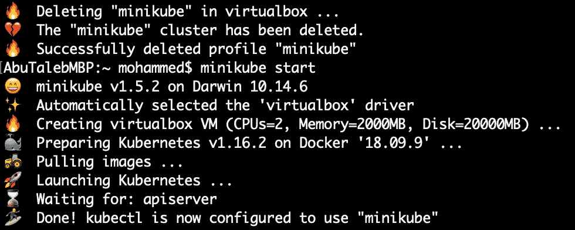

图 4.7：启动 Minikube

1.  现在，让我们看看默认情况下启用了哪些模块。使用以下命令：

```
kubectl describe pod kube-apiserver-minikube -n kube-system | grep enable-admission-plugins
```

您应该看到以下响应：

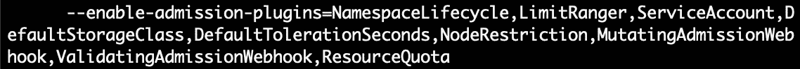

图 4.8：Minikube 中默认启用的模块

正如您可以从前面的输出中观察到的，Minikube 已为我们启用了以下模块：`NamespaceLifecycle`、`LimitRanger`、`ServiceAccount`、`DefaultStorageClass`、`DefaultTolerationSeconds`、`NodeRestriction`、`MutatingAdmissionWebhook`、`ValidatingAdmissionWebhook`和`ResourceQuota`。

注意

要了解更多关于模块的信息，请参考以下链接：[`kubernetes.io/docs/reference/access-authn-authz/admission-controllers/`](https://kubernetes.io/docs/reference/access-authn-authz/admission-controllers/ )

1.  另一种检查模块的方法是查看 API 服务器清单，方法是运行以下命令：

```
kubectl exec -it kube-apiserver-minikube -n kube-system -- kube-apiserver -h | grep "enable-admission-plugins" | grep -vi deprecated
```

注意

我们使用了`grep -vi deprecated`，因为还有另一个标志`--admission-control`，我们正在从输出中丢弃，因为该标志将在将来的版本中被弃用。

kubectl 有`exec`命令，允许我们对正在运行的 pod 执行命令。该命令将在`kube-apiserver-minikube` pod 内执行`kube-apiserver -h`命令，并将输出返回到我们的 shell：

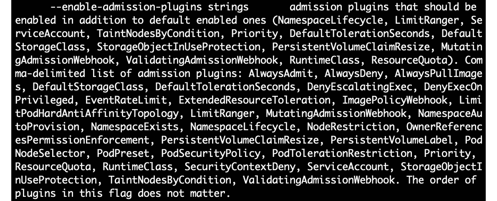

图 4.9：检查 Minikube 中默认启用的模块

1.  现在，我们将使用我们期望的配置启动 Minikube。使用以下命令：

```
minikube start --extra-config=apiserver.enable-admission-plugins="LimitRanger,NamespaceExists,NamespaceLifecycle,ResourceQuota,ServiceAccount,DefaultStorageClass,MutatingAdmissionWebhook"
```

如您在此处所见，`minikube start`命令具有`--extra-config`配置器标志，允许我们向集群安装传递附加配置。在我们的情况下，我们可以使用`--extra-config`标志，以及`--enable-admission-plugins`，并指定我们需要启用的插件。我们的命令应该产生这样的输出：

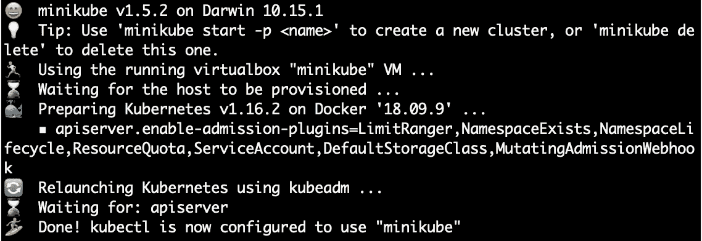

图 4.10：使用自定义模块重新启动 Minikube

1.  现在，让我们将此 Minikube 实例与我们之前的实例进行比较。使用以下命令：

```
kubectl describe pod kube-apiserver-minikube -n kube-system | grep enable-admission-plugins
```

您应该看到以下响应：


图 4.11：检查 Minikube 的自定义模块集

如果您将此处看到的模块集与*图 4.7*中的模块集进行比较，您会注意到只启用了指定的插件；而`DefaultTolerationSeconds`、`NodeRestriction`和`ValidatingAdmissionWebhook`模块不再启用。

注意

您可以通过再次运行`minikube start`来恢复 Minikube 中的默认配置。

## 验证

在让请求通过所有三个阶段之后，API 服务器然后验证对象——也就是说，它检查响应主体中以 JSON 格式携带的对象规范是否符合所需的格式和标准。

成功验证后，API 服务器将对象存储在 etcd 数据存储中，并向客户端返回响应。之后，正如您在*第二章*中学到的* Kubernetes 概述*中所了解的那样，其他组件，如调度程序和控制器管理器，接管了寻找合适的节点并实际在集群上实现对象。

# Kubernetes API

Kubernetes API 使用 JSON over HTTP 进行请求和响应。它遵循 REST 架构风格。您可以使用 Kubernetes API 来读取和编写 Kubernetes 资源对象。

注意

有关 RESTful API 的更多详细信息，请参阅[`restfulapi.net/`](https://restfulapi.net/)。

Kubernetes API 允许客户端通过标准 HTTP 方法（或 HTTP 动词）创建、更新、删除或读取对象的描述，例如以下表中的示例：

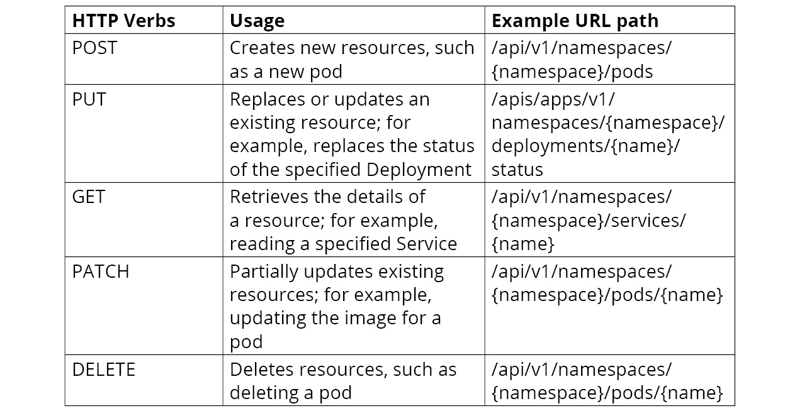

图 4.12：HTTP 动词及其用法

在 Kubernetes API 调用的上下文中，了解这些 HTTP 方法如何映射到 API 请求动词是有帮助的。因此，让我们看看哪些动词通过哪些方法发送：

+   `GET`：`get`、`list`和`watch`

一些示例 kubectl 命令是`kubectl get pod`、`kubectl describe pod <pod-name>`和`kubectl get pod -w`。

+   `POST`：`create`

一个示例 kubectl 命令是`kubectl create -f <filename.yaml>`。

+   `PATCH`：`patch`

一个示例 kubectl 命令是`kubectl set image deployment/kubeserve nginx=nginx:1.9.1`。

+   `DELETE`：`delete`

一个示例 kubectl 命令是`kubectl delete pod <pod-name>`。

+   `PUT`：`update`

一个示例 kubectl 命令是`kubectl apply -f <filename.yaml>`。

注意

如果您还没有遇到这些命令，您将在接下来的章节中遇到。随时参考本章节或以下 Kubernetes 文档，了解每个命令的 API 请求如何工作：[`kubernetes.io/docs/reference/kubernetes-api/`](https://kubernetes.io/docs/reference/kubernetes-api/)。

如前所述，这些 API 调用携带 JSON 数据，所有这些数据都有一个由 `Kind` 和 `apiVersion` 字段标识的 JSON 模式。`Kind` 是一个字符串，用于标识对象应该具有的 JSON 模式类型，而 `apiVersion` 是一个字符串，用于标识对象应该具有的 JSON 模式版本。下一个练习应该让您更好地了解这一点。

您可以参考 Kubernetes API 参考文档，查看不同的 HTTP 方法的实际操作，网址为 [`kubernetes.io/docs/reference/kubernetes-api/`](https://kubernetes.io/docs/reference/kubernetes-api/)。

例如，如果您需要在特定命名空间下创建一个 Deployment，在 `WORKLOADS APIS` 下，您可以转到 `Deployment v1 apps` > `Write Operations` > `Create`。您将看到使用 `kubectl` 或 `curl` 的 HTTP 请求和不同的示例。API 参考文档的以下页面应该让您了解如何使用此参考文档：

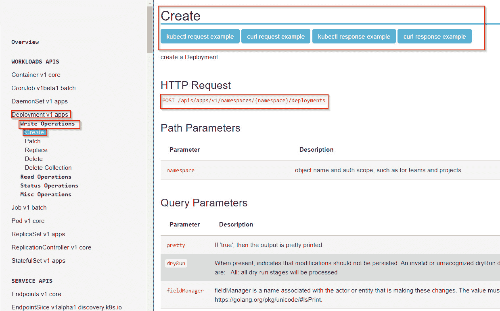

图 4.13：kubectl create 命令的 HTTP 请求

当您参考前面提到的文档时，需要牢记您的 API 服务器版本。您可以通过运行 `kubectl version --short` 命令并查找 `Server Version` 来找到您的 Kubernetes API 服务器版本。例如，如果您的 Kubernetes API 服务器版本运行的是 1.14 版本，您应该转到 Kubernetes 版本 1.14 参考文档 ([`v1-14.docs.kubernetes.io/docs/reference/generated/kubernetes-api/v1.14/`](https://v1-14.docs.kubernetes.io/docs/reference/generated/kubernetes-api/v1.14/)) 查找相关的 API 信息。

了解这一点的最佳方法是跟踪 `kubectl` 命令。让我们在接下来的部分中做到这一点。

## 跟踪 kubectl 的 HTTP 请求

让我们尝试跟踪 kubectl 发送到 API 服务器的 HTTP 请求，以更好地理解它们。在开始之前，让我们使用以下命令获取 `kube-system` 命名空间中的所有 pod：

```
kubectl get pods -n kube-system
```

该命令应该以表格视图显示输出，如下面的屏幕截图所示：

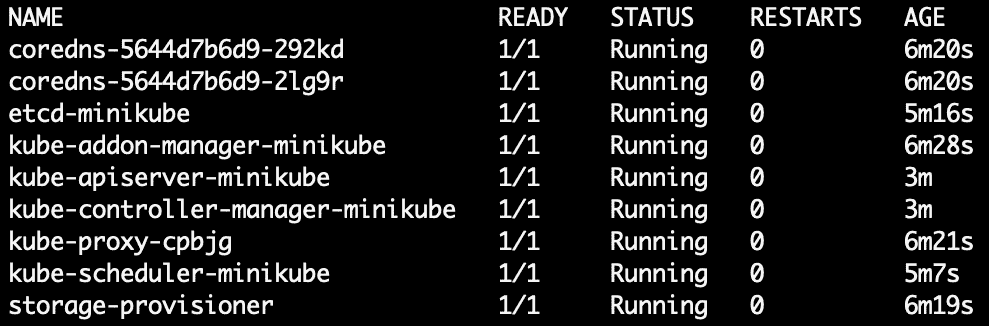

图 4.14：获取 kube-system 命名空间中 pod 的列表

在幕后，由于 kubectl 是一个 REST 客户端，它会调用 HTTP `GET`请求到 API 服务器端点，并从`/api/v1/namespaces/kube-system/pods`请求信息。

我们可以通过在`kubectl`命令中添加`--v=8`来启用详细输出。`v`表示命令的详细程度。数字越高，响应中的细节就越多。这个数字可以从`0`到`10`。让我们看看详细程度为`8`的输出：

```
kubectl get pods -n kube-system --v=8
```

这应该给出以下输出：

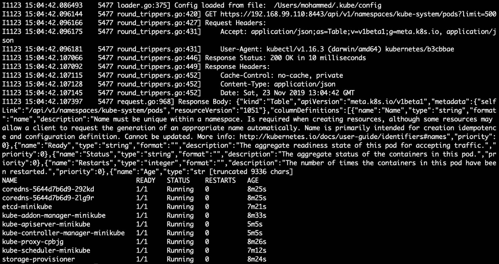

图 4.15：详细程度为 8 的 get pods 命令的输出

让我们逐个检查前面的输出，以更好地理解它：

+   输出的第一部分如下：

图 4.16：输出的一部分指示配置文件的加载

从中我们可以看到，kubectl 从我们的 kubeconfig 文件中加载了配置，其中包括 API 服务器端点、端口和凭据，如证书或身份验证令牌。

+   这是输出的下一部分：

图 4.17：输出的一部分指示 HTTP GET 请求

在这里，您可以看到将`HTTP GET`请求提及为`GET https://192.168.99.100:8443/api/v1/namespaces/kube-system/pods?limit=500`。这一行包含了我们需要针对 API 服务器执行的操作，`/api/v1/namespaces/kube-system/pods`是 API 路径。您还可以在 URL 路径的末尾看到`limit=500`，这是块大小；kubectl 以块的形式获取大量资源，以提高延迟。我们将在本章后面看到一些关于以块检索大型结果集的示例。

+   输出的下一部分如下：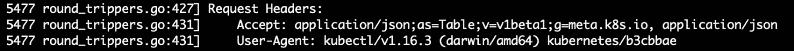

图 4.18：输出的一部分指示请求头

从输出的这部分可以看出，`请求头`描述了要获取的资源或请求资源的客户端。在我们的示例中，输出有两部分内容协商：

a) `Accept`：这是由 HTTP 客户端使用的，告诉服务器它们将接受什么内容类型。在我们的示例中，我们可以看到 kubectl 通知 API 服务器有关`application/json`内容类型。如果请求标头中不存在这个内容类型，服务器将返回默认的预配置表示类型，这与 Kubernetes API 的 JSON 模式相同，即`application/json`。我们还可以看到它正在请求以表格视图输出，这在这一行中由`as=Table`表示。

b) `User-Agent`：此标头包含有关请求此信息的客户端的信息。在这种情况下，我们可以看到 kubectl 正在提供有关自身的信息。

+   让我们来检查下一部分：

图 4.19：显示响应状态的部分输出

在这里，我们可以看到 API 服务器返回了`200 OK`HTTP 状态代码，这表明请求已在 API 服务器上成功处理。我们还可以看到处理此请求所花费的时间，为 10 毫秒。

+   让我们来看下一部分：

图 4.20：显示响应头的部分输出

正如您所看到的，这部分显示了“响应头”，其中包括请求的日期和时间等详细信息，在我们的示例中。

+   现在，让我们来看一下 API 服务器发送的主要响应：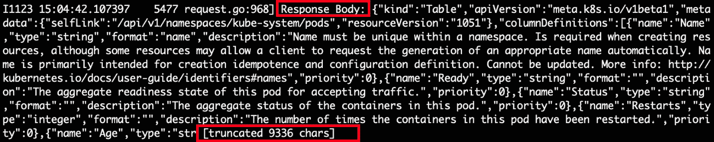

图 4.21：显示响应主体的部分输出

“响应主体”包含客户端请求的资源数据。在我们的案例中，这是有关`kube-system`命名空间中的 pod 的信息。在这里，这些信息以原始 JSON 格式呈现，然后 kubectl 可以将其呈现为整齐的表格。然而，前一个屏幕截图的突出显示部分显示，响应主体并没有我们请求的所有 JSON 输出；部分“响应主体”被截断了。这是因为`--v=8`显示了带有截断响应内容的 HTTP 请求内容。

要查看完整的响应主体，您可以使用`--v=10`运行相同的命令，这样就不会截断输出。命令将如下所示：

```
kubectl get pods -n kube-system --v=10
```

出于简洁起见，我们将不会检查使用`--v=10`详细程度的命令。

+   现在，我们来到了我们正在检查的输出的最后部分：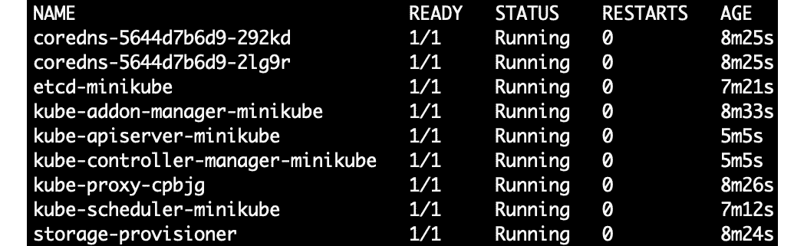

图 4.22：输出的一部分，显示最终结果

这是一个表格形式的最终输出，这也是请求的内容。kubectl 已经将原始的 JSON 数据格式化为一个整洁的表格。

注意

您可以在[`kubernetes.io/docs/reference/kubectl/cheatsheet/#kubectl-output-verbosity-and-debugging`](https://kubernetes.io/docs/reference/kubectl/cheatsheet/#kubectl-output-verbosity-and-debugging)了解更多关于 kubectl 冗长度和调试标志的信息。

## API 资源类型

在前一节中，我们看到 HTTP URL 由 API 资源、API 组和 API 版本组成。现在，让我们了解 URL 中定义的资源类型，比如 pods、namespaces 和 services。在 JSON 格式中，这被称为`Kind`：

+   **资源的集合**：这代表了资源类型的所有实例的集合，比如所有命名空间中的所有 pods。在 URL 中，这将如下所示：

```
GET /api/v1/pods
```

+   **单个资源**：这代表了资源类型的单个实例，比如在给定命名空间中检索特定 pod 的详细信息。这种情况下的 URL 将如下所示：

```
GET /api/v1/namespaces/{namespace}/pods/{name}
```

现在我们已经了解了向 API 服务器发出请求的各个方面，让我们在下一节了解 API 资源的范围。

# API 资源的范围

所有资源类型可以是集群范围的资源或命名空间范围的资源。资源的范围会影响对该资源的访问以及该资源的管理方式。让我们来看看命名空间和集群范围之间的区别。

## 命名空间范围的资源

正如我们在*第二章*中看到的，*Kubernetes 概述*，Kubernetes 利用 Linux 命名空间来组织大多数 Kubernetes 资源。同一命名空间中的资源共享相同的控制访问策略和授权检查。当一个命名空间被删除时，该命名空间中的所有资源也会被删除。

让我们看看与命名空间范围的资源交互的请求路径是什么样的：

+   返回命名空间中特定 pod 的信息：

```
GET /api/v1/namespaces/{my-namespace}/pods/{pod-name}
```

+   返回命名空间中所有 Deployments 的集合的信息：

```
GET /apis/apps/v1/namespaces/{my-namespace}/deployments
```

+   返回关于资源类型的所有实例的信息（在本例中为 services），跨所有命名空间：

```
GET /api/v1/services
```

请注意，当我们在所有命名空间中查找信息时，URL 中将不会有`namespace`。

您可以使用以下命令获取命名空间范围 API 资源的完整列表：

```
kubectl api-resources --namespaced=true
```

您应该看到类似于这样的响应：

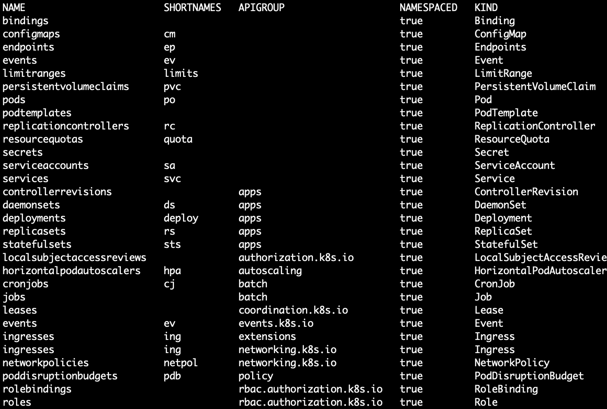

图 4.23：列出所有命名空间范围资源

## 集群范围资源

大多数 Kubernetes 资源是命名空间范围的，但命名空间资源本身不是命名空间范围的。不在命名空间范围内的资源是集群范围的。集群范围资源的其他示例是节点。由于节点是集群范围的，您可以在所需的节点上部署一个 pod，而不管您希望 pod 在哪个命名空间，一个节点可以托管来自不同命名空间的不同 pod。

让我们看看与集群范围资源交互的请求路径是什么样的：

+   返回集群中特定节点的信息：

```
GET /api/v1/nodes/{node-name}
```

+   返回集群中资源类型的所有实例的信息（在本例中是节点）：

```
GET /api/v1/nodes
```

+   您可以使用以下命令获取集群范围 API 资源的完整列表：

```
kubectl api-resources --namespaced=false
```

您应该看到类似于这样的输出：

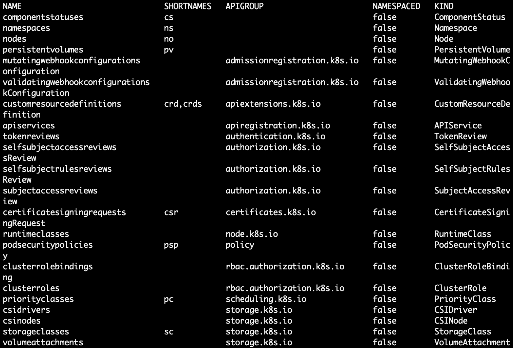

图 4.24：列出所有集群范围资源

# API 组

API 组是逻辑相关的资源的集合。例如，部署、副本集和守护进程集都属于 apps API 组：`apps/v1`。

注意

您将在*第七章*，*Kubernetes Controllers*中详细了解部署、副本集和守护进程集。事实上，本章将讨论您将在后续章节中遇到的许多 API 资源。

`--api-group`标志可用于将输出范围限定到特定的 API 组，我们将在接下来的章节中看到。让我们在接下来的章节中更仔细地看看各种 API 组。

## 核心组

这也被称为传统组。它包含诸如 pod、服务、节点和命名空间等对象。这些的 URL 路径是`/api/v1`，`apiVersion`字段中只指定版本。例如，考虑以下截图，我们正在获取有关一个 pod 的信息：

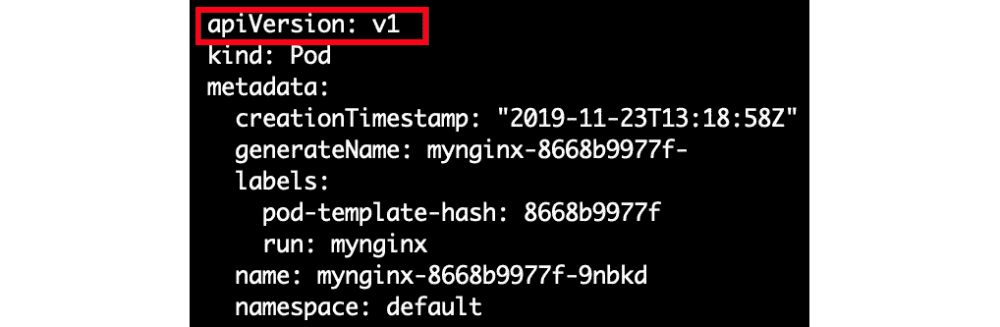

图 4.25：一个 pod 的 API 组

正如您在这里看到的，`apiVersion: v1`字段表示此资源属于核心组。

在`kubectl api-resources`命令输出中显示空条目的资源属于核心组。您还可以指定一个空参数标志（`--api-group=''`）来仅显示核心组资源，如下所示：

```
kubectl api-resources --api-group=''
```

您应该看到以下输出：

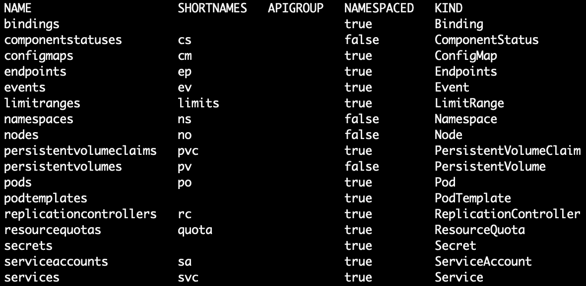

图 4.26：列出核心 API 组中的资源

## 命名组

该组包括请求 URL 格式为`/apis/$NAME/$VERSION`的对象。与核心组不同，命名组在 URL 中包含组名。例如，让我们考虑以下屏幕截图，其中我们有有关部署的信息：

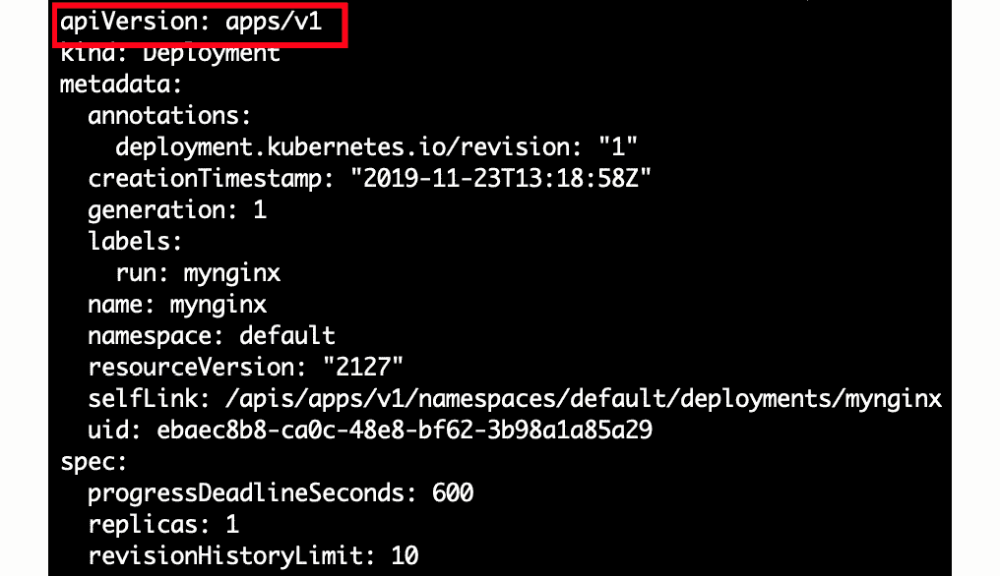

图 4.27：部署的 API 组

正如您所看到的，突出显示的字段显示`apiVersion: apps/v1`，表明此资源属于`apps`API 组。

您还可以指定`--api-group='<NamedGroup Name>'`标志来显示指定命名组中的资源。例如，让我们使用以下命令列出`apps`API 组中的资源：

```
kubectl api-resources --api-group='apps'
```

这应该会产生以下响应：

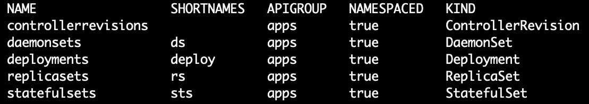

图 4.28：列出 apps API 组中的资源

在上述屏幕截图中，所有这些资源都被合并在一起，因为它们都属于我们在查询命令中指定的`apps`命名组。

作为另一个例子，让我们看一下`rbac.authorization.k8s.io API 组`，该组具有确定授权策略的资源。我们可以使用以下命令查看该组中的资源：

```
kubectl api-resources --api-group='rbac.authorization.k8s.io'
```

您应该看到以下响应：

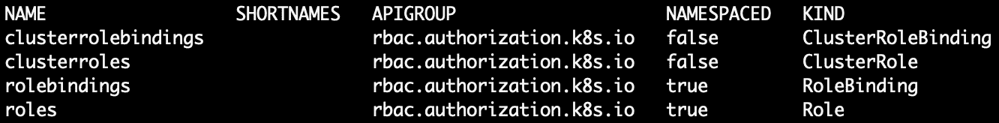

图 4.29：列出 rbac.authorization.k8s.io API 组中的资源

## 系统范围

该组包括系统范围的 API 端点，例如`/version`、`/healthz`、`/logs`和`/metrics`。例如，让我们考虑以下命令的输出：

```
kubectl version --short --v=6
```

这应该会产生类似于以下内容的输出：

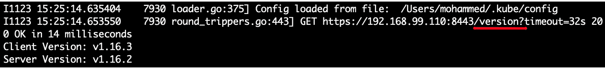

图 4.30：kubectl 版本命令的请求 URL

正如您在此屏幕截图中所看到的，当您运行`kubectl --version`时，这将转到`/version 特殊实体`，如`GET`请求 URL 中所示。

# API 版本

在 Kubernetes API 中，存在 API 版本控制的概念；也就是说，Kubernetes API 支持一种资源类型的多个版本。这些不同版本可能会有不同的行为。每个版本都有不同的 API 路径，例如`/api/v1`或`/apis/extensions/v1beta1`。

不同的 API 版本在稳定性和支持方面有所不同：

+   **Alpha**：此版本在`apiVersion`字段中以`alpha`表示，例如`/apis/batch/v1alpha1`。默认情况下禁用资源的 alpha 版本，因为它不适用于生产集群，但可以供早期采用者和愿意提供反馈和建议并报告错误的开发人员使用。此外，alpha 资源的支持可能会在 Kubernetes 的最终稳定版本确定时被取消，而无需事先通知。

+   **Beta**：此版本在`apiVersion`字段中以`beta`表示，例如`/apis/certificates.k8s.io/v1beta1`。默认情况下启用资源的 beta 版本，并且其背后的代码经过了充分测试。然而，建议仅在非业务关键场景下使用，因为可能会在后续版本中进行更改，导致不兼容性；也就是说，某些功能可能不会长时间得到支持。

+   **稳定**：对于这些版本，`apiVersion`字段只包含版本号，没有提及`alpha`或`beta`，例如`/apis/networking.k8s.io/v1`。稳定版本的资源在 Kubernetes 的许多后续版本中得到支持。因此，建议在任何关键用例中使用此版本的 API 资源。

您可以使用以下命令获取集群中启用的 API 版本的完整列表：

```
kubectl api-versions
```

您应该看到类似于以下内容的响应：

![图 4.31：已启用的 API 资源版本列表（图像/B14870_04_31.jpg）图 4.31：已启用的 API 资源版本列表在此截图中，您可能会注意到一件有趣的事情，即某些 API 资源（例如`autoscaling`）具有多个版本；例如，对于`autoscaling`，有`v1beta1`、`v1beta2`和`v1`。那么，它们之间有什么区别，应该使用哪个版本呢？让我们再次考虑`autoscaling`的例子。此功能允许您根据特定指标扩展副本控制器（例如 Deployments、ReplicaSets 或 StatefulSets）中的 Pod 数量。例如，如果平均 CPU 负载超过 50％，则可以将 Pod 的数量从 3 个扩展到 10 个。在这种情况下，版本之间的差异是功能支持。自动缩放的稳定版本是`autoscaling/v1`，它仅支持根据平均 CPU 指标缩放 pod 的数量。自动缩放的 beta 版本是`autoscaling/v2beta1`，支持根据 CPU 和内存利用率进行缩放。beta 版本中的新版本是`autoscaling/v2beta2`，支持根据自定义指标以及 CPU 和内存进行缩放 pod 的数量。然而，由于 beta 版本仍不适用于业务关键场景，当您创建自动缩放资源时，它将使用`autoscaling/v1`版本。但是，您仍然可以通过在 YAML 文件中指定 beta 版本来使用其他版本以使用附加功能，直到所需功能添加到稳定版本为止。所有这些信息可能看起来令人不知所措。然而，Kubernetes 提供了访问所有您需要导航 API 资源的信息的方法。您可以使用 kubectl 访问 Kubernetes 文档，并获取有关各种 API 资源的必要信息。让我们看看在以下练习中如何运作。## 练习 4.02：获取有关 API 资源的信息假设我们想要创建一个 ingress 对象。在这个练习中，您不需要太多了解 ingress；我们将在接下来的章节中学习它。我们将使用 kubectl 获取有关 Ingress API 资源的更多信息，确定可用的 API 版本，并找出它属于哪些组。如果您还记得之前的部分，我们需要这些信息来填写 YAML 清单的`apiVersion`字段。然后，我们还需要获取清单文件的其他字段所需的信息：1.  首先，让我们询问我们的集群是否有与`ingresses`关键字匹配的所有可用 API 资源：```    kubectl api-resources | grep ingresses    ```这个命令将通过`ingresses`关键字过滤所有 API 资源的列表。您应该得到以下输出：```    ingresses     ing     extensions            true         Ingress    ingresses     ing     networking.k8s.io     true         Ingress    ```我们可以看到我们在两个不同的 API 组上有 ingress 资源——`extensions`和`networking.k8s.io`。1.  我们还看到了如何获取属于特定组的 API 资源。让我们检查一下我们在上一步中看到的 API 组：```    kubectl api-resources --api-group="extensions"    ```您应该得到以下输出：```    NAME       SHORTNAMES     APIGROUP     NAMESPACED      KIND    ingresses  ing            extensions   true            Ingress    ```现在，让我们检查另一个组：```    kubectl api-resources --api-group="networking.k8s.io"    ```您应该看到以下输出：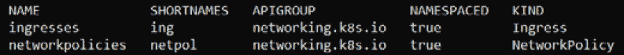

图 4.32：列出 networking.k8s.io API 组中的资源

但是，如果我们要使用 Ingress 资源，我们仍然不知道我们应该使用来自`extensions`组还是`networking.k8s.io`组的资源。在下一步中，我们将获得一些更多信息，这将帮助我们决定。

1.  使用以下命令获取更多信息：

```
kubectl explain ingress
```

您应该得到这个响应：

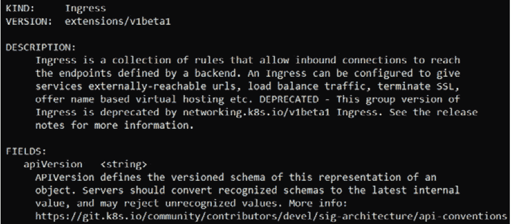

图 4.33：从扩展 API 组获取 Ingress 资源的详细信息

正如您所看到的，`kubectl explain`命令描述了 API 资源，以及与其相关的字段的详细信息。我们还可以看到 Ingress 使用`extensions/v1beta1` API 版本，但如果我们阅读`DESCRIPTION`，它提到此 Ingress 组版本已被`networking.k8s.io/v1beta1`弃用。弃用意味着标准正在逐步淘汰，尽管目前仍受支持，但不建议使用。

注意

如果您将此与我们在此练习之前看到的`autoscaling`的不同版本进行比较，您可能会认为从`v1beta`的逻辑升级路径将是`v2beta`，这完全是有道理的。然而，Ingress 资源已从`extensions`组移动到`networking.k8s.io`组，因此这违反了命名趋势。

1.  使用弃用版本不是一个好主意，所以假设您想要使用`networking.k8s.io/v1beta1`版本。但是，我们首先需要获取更多关于它的信息。我们可以向`kubectl explain`命令添加一个标志来获取关于 API 资源特定版本的信息，如下所示：

```
kubectl explain ingress --api-version=networking.k8s.io/v1beta1
```

您应该看到这个响应：

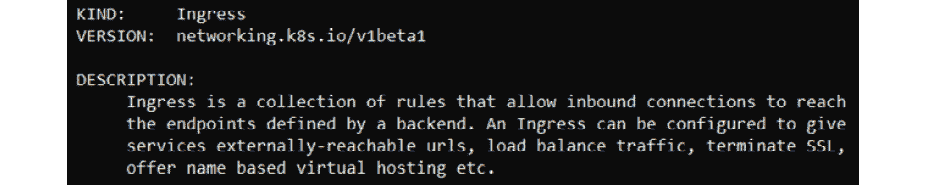

图 4.34：从 networking.k8s.io API 组获取 Ingress 资源的详细信息

1.  我们还可以通过使用`JSONPath`标识符来过滤`kubectl explain`命令的输出。这使我们能够获取关于定义 YAML 清单时需要指定的各个字段的信息。因此，例如，如果我们想要查看 Ingress 的`spec`字段，命令将如下所示：

```
kubectl explain ingress.spec --api-version=networking.k8s.io/v1beta1
```

这应该给出以下响应：

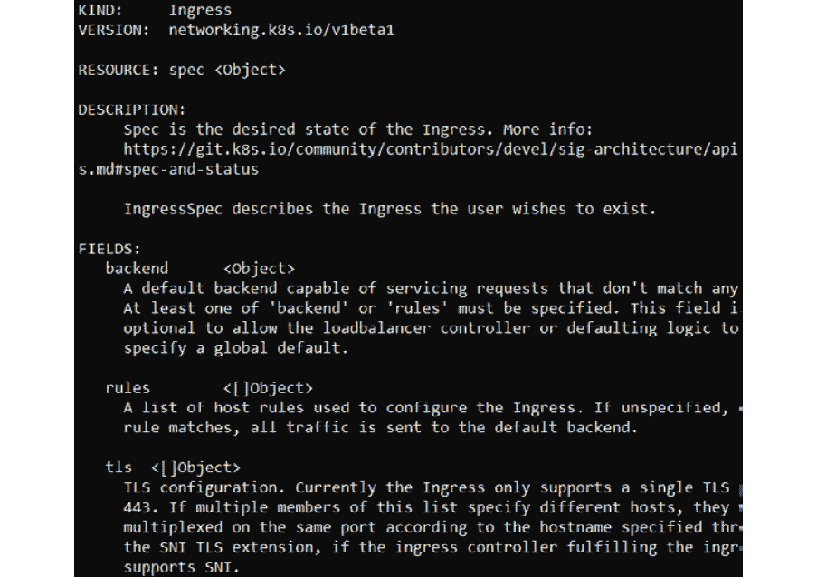

图 4.35：过滤 kubectl explain 命令的输出以获取 ingress 的 spec 字段

1.  我们可以深入了解嵌套字段的更多细节。例如，如果您想要获取有关 ingress 的`backend`字段的更多详细信息，我们可以指定`ingress.spec.backend`以获取所需的信息：

```
kubectl explain ingress.spec.backend --api-version=networking.k8s.io/v1beta1
```

这将产生以下输出：

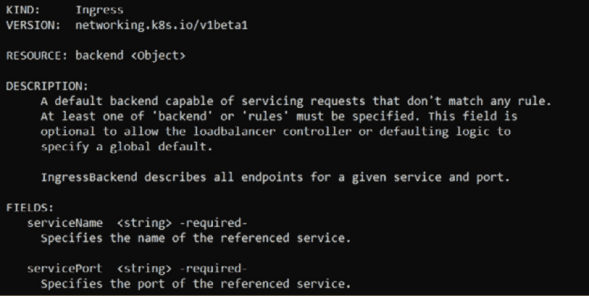

图 4.36：过滤 kubectl explain 命令的输出以获取 ingress 的 spec.backend 字段

同样，我们可以重复这个过程以获取您需要的任何字段的信息，这对于构建或修改 YAML 清单非常方便。因此，我们已经看到`kubectl explain`命令在寻找有关 API 资源的更多详细信息和文档时非常有用。在使用 YAML 清单文件创建或修改对象时，它也非常有用。

## 如何启用/禁用 API 资源、组或版本

在典型的集群中，并非所有 API 组都是默认启用的。这取决于管理员确定的集群用例。例如，一些 Kubernetes 云提供商出于稳定性和安全性原因禁用使用 alpha 级别的资源。但是，仍然可以通过使用`--runtime-config`标志在 API 服务器上启用这些资源，该标志接受逗号分隔的列表。

要能够创建任何资源，集群中应启用组和版本。例如，当您尝试在清单文件中使用`apiVersion: batch/v2alpha1`创建一个`CronJob`时，如果组/版本未启用，您将收到类似以下错误的消息：

```
No matches for kind "CronJob" in version "batch/v2alpha1".
```

要启用`batch/v2alpha1`，您需要在 API 服务器上设置`--runtime-config=batch/v2alpha1`。这可以在创建集群期间或通过更新`/etc/kubernetes/manifests/kube-apiserver.yaml`清单文件来完成。该标志还支持通过为特定版本设置`false`值来禁用 API 组或版本，例如，`--runtime-config=batch/v1=false`。

`--runtime-config`还支持`api/all`特殊键，用于控制所有 API 版本。例如，要关闭除`v1`之外的所有 API 版本，您可以传递`--runtime-config=api/all=false,api/v1=true`标志。让我们尝试自己动手创建和禁用 API 组和版本的示例练习。

## 练习 4.03：在 Minikube 集群上启用和禁用 API 组和版本

在这个练习中，我们将在启动 Minikube 时创建特定的 API 版本，禁用运行中集群中的某些 API 版本，然后在整个 API 组中启用/禁用资源：

1.  使用以下命令启动 Minikube：

```
minikube start --extra-config=apiserver.runtime-config=batch/v2alpha1
```

您应该看到以下响应：

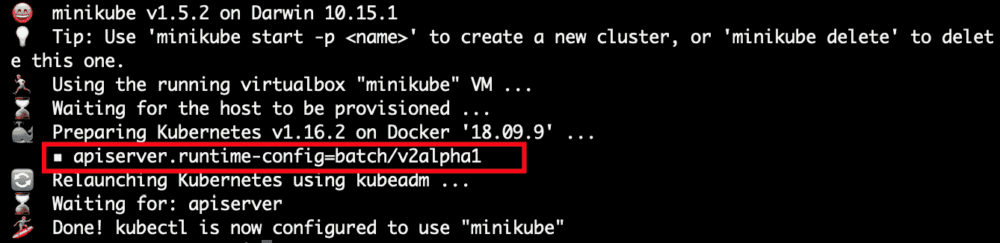

图 4.37：使用额外的 API 资源组启动 Minikube

注意

您可以参考`minikube start`文档，了解有关`--extra-config`标志的更多详细信息，网址为[`minikube.sigs.k8s.io/docs/handbook/config/`](https://minikube.sigs.k8s.io/docs/handbook/config/)。

1.  您可以通过使用`describe pod`命令并通过`runtime`关键字过滤结果来确认它是否已启用：

```
kubectl describe pod kube-apiserver-minikube -n kube-system | grep runtime
```

您应该看到以下响应：

```
--runtime-config=batch/v2alpha1
```

1.  另一种确认的方法是使用以下命令查看已启用的 API 版本：

```
kubectl api-versions | grep batch/v2alpha1
```

您应该看到以下响应：

```
batch/v2alpha1
```

1.  现在，让我们创建一个名为`CronJob`的资源，它使用`batch/v2alpha1`来确认我们的 API 服务器是否接受 API。创建一个名为`sample-cronjob.yaml`的文件，内容如下：

```
apiVersion: batch/v2alpha1
kind: CronJob
metadata:
  name: hello
spec:
  schedule: "*/1 * * * *"
  jobTemplate:
    spec:
      template:
        spec:
          containers:
          - name: hello
            image: busybox
            args:
            - /bin/sh
            - -c
            - date; echo Hello from the Kubernetes cluster
          restartPolicy: OnFailure
```

1.  现在，使用此 YAML 文件创建一个`CronJob`：

```
kubectl create -f sample-cronjob.yaml
```

您应该看到以下输出：

```
cronjob.batch/hello created
```

正如您所看到的，API 服务器接受了我们的 YAML 文件，并成功创建了`CronJob`。

1.  现在，让我们在集群上禁用`batch/v2alpha1`。为此，我们需要访问 Minikube 虚拟机（VM），如前几章所示：

```
minikube ssh
```

您应该看到这个响应：

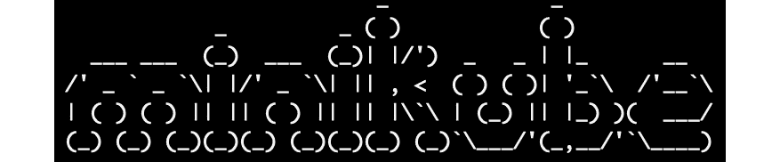

图 4.38：通过 SSH 访问 Minikube VM

1.  打开 API 服务器清单文件。这是 Kubernetes 用于 API 服务器 pod 的模板。我们将使用 vi 来修改此文件，尽管您可以使用任何您喜欢的文本编辑器：

```
sudo vi /etc/kubernetes/manifests/kube-apiserver.yaml
```

您应该看到类似以下的响应：

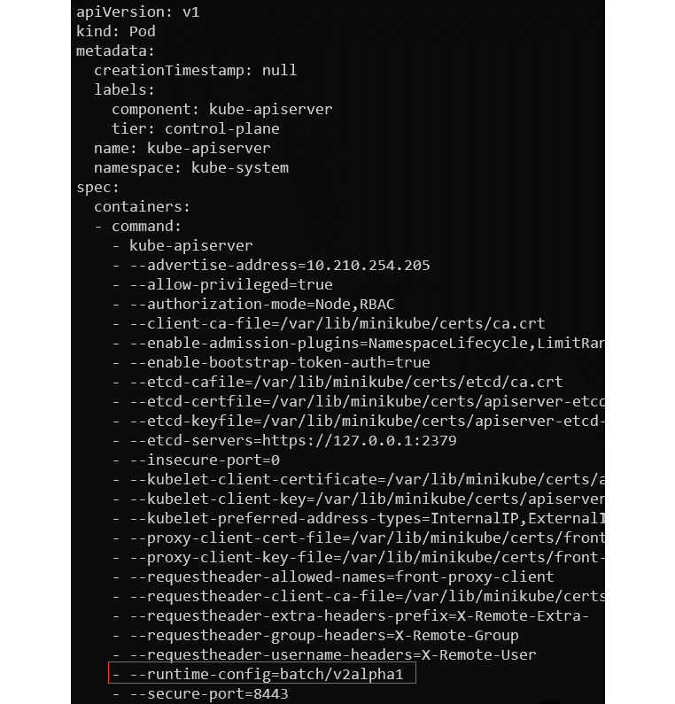

图 4.39：API 服务器规范文件

查找包含`--runtime-config=batch/v2alpha1`的行，并将其更改为`--runtime-config=batch/v2alpha1=false`。然后保存修改后的文件。

1.  使用以下命令结束 SSH 会话：

```
exit
```

1.  为了使 API 服务器清单中的更改生效，我们需要重新启动 API 服务器和控制器管理器。由于它们是部署为无状态的 pod，我们可以简单地删除它们，它们将自动重新部署。首先，让我们通过运行这个命令来删除 API 服务器：

```
kubectl delete pods -n kube-system -l component=kube-apiserver
```

您应该看到这个输出：

```
pod "kube-apiserver-minikube" deleted
```

现在，让我们删除控制器管理器：

```
kubectl delete pods -n kube-system -l component=kube-controller-manager
```

您应该看到这个输出：

```
pod "kube-controller-manager-minikube" deleted
```

请注意，对于这两个命令，我们没有按名称删除 pod。`-l`标志寻找标签。这些命令删除了`kube-system`命名空间中所有具有与`-l`标志后指定的标签匹配的 pod。

1.  我们可以使用以下命令确认`batch/v2alpha1`不再显示在 API 版本中：

```
kubectl api-versions | grep batch/v2alpha1
```

这个命令不会给你任何响应，表明我们已经禁用了`batch/v2alpha1`。

因此，我们已经看到了如何启用或禁用特定组或版本的 API 资源。但这仍然是一个广泛的方法。如果你想要禁用特定的 API 资源怎么办？

举个例子，假设你想要禁用 ingress。我们在前面的练习中看到，我们在`extensions`和`networking.k8s.io` API 组中都有 ingresses。如果你要针对特定的 API 资源，你需要指定它的组和版本。假设你想要禁用`extensions`组中的 ingress，因为它已经被弃用。在这个组中，我们只有一个版本的 ingresses，即`v1beta`，你可以从*图 4.33*中观察到。

要实现这一点，我们只需要修改`--runtime-config`标志来指定我们想要的资源。所以，如果我们想要禁用`extensions`组中的 ingress，标志将如下所示：

```
--runtime-config=extensions/v1beta1/ingresses=false
```

要禁用资源，我们可以在启动 Minikube 时使用这个标志，就像本练习的*步骤 1*中所示，或者我们可以将这行添加到 API 服务器的清单文件中，就像本练习的*步骤 7*中所示。回想一下，如果我们想要启用资源，我们只需要从这个标志的末尾删除`=false`部分。

# 使用 Kubernetes API 与集群交互

到目前为止，我们一直在使用 Kubernetes kubectl 命令行工具，这使得与我们的集群交互非常方便。它通过从客户端 kubeconfig 文件中提取 API 服务器地址和身份验证信息来实现这一点，默认情况下位于`~/.kube/config`中，正如我们在上一章中看到的那样。在本节中，我们将看看使用 curl 等 HTTP 客户端直接访问 API 服务器的不同方法。

有两种直接通过 REST API 访问 API 服务器的可能方式——通过使用 kubectl 代理模式或直接向 HTTP 客户端提供位置和身份验证凭据。我们将探讨这两种方法，以了解各自的优缺点。

## 使用 kubectl 作为代理访问 Kubernetes API 服务器

kubectl 有一个很棒的功能叫做**kubectl proxy**，这是与 API 服务器交互的推荐方法。这是推荐的，因为它更容易使用，并提供了更安全的方式，因为它通过使用自签名证书验证 API 服务器的身份，防止了**中间人**（**MITM**）攻击。

kubectl 代理将 HTTP 客户端的请求路由到 API 服务器，同时自行处理身份验证。身份验证也是通过使用我们 kubeconfig 文件中的当前配置来处理的。

为了演示如何使用 kubectl 代理，让我们首先在默认命名空间中创建一个具有两个副本的 NGINX 部署，并使用`kubectl get pods`查看它：

```
kubectl create deployment mynginx --image=nginx:latest 
```

这应该会得到类似以下的输出：

```
deployment.apps/mynginx created
```

现在，我们可以使用以下命令将我们的部署扩展到两个副本：

```
kubectl scale deployment mynginx --replicas=2
```

你应该看到类似于这样的输出：

```
deployment.apps/mynginx scaled
```

现在让我们检查一下 pod 是否正在运行：

```
kubectl get pods
```

这会产生类似以下的输出：

```
NAME                        READY    STATUS     RESTARTS   AGE
mynginx-565f67b548-gk5n2    1/1      Running    0          2m30s
mynginx-565f67b548-q6slz    1/1      Running    0          2m30s
```

要启动到 API 服务器的代理，请运行`kubectl proxy`命令：

```
kubectl proxy
```

这应该会产生以下输出：

```
Starting to serve on 127.0.0.1:8001
```

请注意前面截图中本地代理连接正在`127.0.0.1:8001`上运行，默认情况下。我们还可以通过添加`--port=<YourCustomPort>`标志来指定自定义端口，同时在命令的末尾添加`&`（和号）符号，以允许代理在终端后台运行，这样我们可以在同一个终端窗口中继续工作。因此，命令看起来像这样：

```
kubectl proxy --port=8080 &
```

这应该会得到以下响应：

```
[1] 48285
AbuTalebMBP:~ mohammed$ Starting to serve on 127.0.0.1:8080
```

代理作为后台作业运行，在前面的截图中，`[1]`表示作业编号，`48285`表示其进程 ID。要退出在后台运行的代理，可以运行`fg`将作业带回前台：

```
fg
```

这将显示以下响应：

```
kubectl proxy --port=8080
^C
```

将代理切换到前台后，我们可以简单地使用*Ctrl* + *C*退出它（如果没有其他作业在运行）。

注意

如果您对作业控制不熟悉，可以在[`www.gnu.org/software/bash/manual/html_node/Job-Control-Basics.html`](https://www.gnu.org/software/bash/manual/html_node/Job-Control-Basics.html)了解相关信息。

现在我们可以开始使用 curl 来探索 API：

```
curl http://127.0.0.1:8080/apis
```

请记住，尽管我们主要使用 YAML 来方便，但数据以 JSON 格式存储在 etcd 中。您将看到一个长的响应，类似于以下内容：

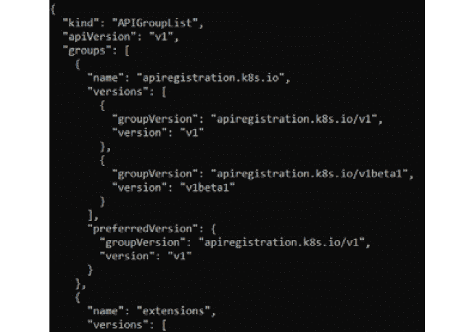

图 4.40：来自 API 服务器的响应

但是，我们如何找到查询我们之前创建的部署的确切路径？另外，我们如何查询该部署创建的 pod？

您可以先问自己几个问题：

+   部署使用的 API 版本和 API 组是什么？

在*图 4.27*中，我们看到部署在`apps/v1`中，因此我们可以从那里开始添加路径：

```
curl http://127.0.0.1:8080/apis/apps/v1
```

+   它是命名空间范围的资源还是集群范围的资源？如果它是命名空间范围的资源，命名空间的名称是什么？

我们还在 API 资源范围部分看到，部署是命名空间范围的资源。当我们创建部署时，由于我们没有指定不同的命名空间，它进入了`default`命名空间。因此，除了`apiVersion`字段外，我们还需要将`namespaces/default/deployments`添加到我们的路径中：

```
curl http://127.0.0.1:8080/apis/apps/v1/namespaces/default/deployments
```

这将返回一个包含存储在此路径上的 JSON 数据的大型输出。这是响应的一部分，给了我们需要的信息：

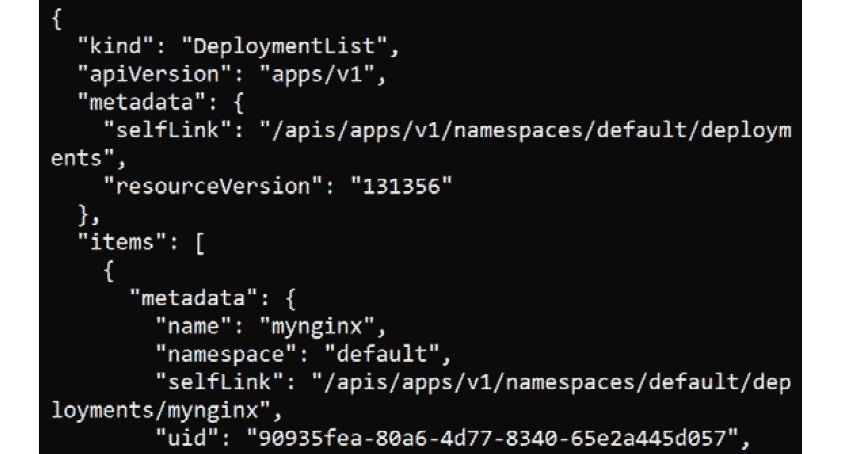

图 4.41：使用 curl 获取有关所有部署的信息

正如您在此输出中所看到的，这列出了`default`命名空间中的所有部署。您可以从`"kind": "DeploymentList"`推断出这一点。另外，请注意，响应是以 JSON 格式呈现的，而不是整齐地呈现为表格。

现在，我们可以通过将特定部署添加到路径来指定特定的部署：

```
curl http://127.0.0.1:8080/apis/apps/v1/namespaces/default/deployments/mynginx
```

您应该看到这个响应：

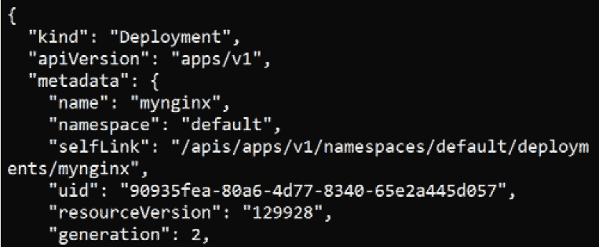

图 4.42：使用 curl 获取有关我们的 NGINX 部署的信息

您也可以将此方法用于任何其他资源。

## 使用 curl 创建对象

当您使用任何 HTTP 客户端（如 curl）向 API 服务器发送请求以创建对象时，您需要更改三件事：

1.  将`HTTP`请求方法更改为`POST`。默认情况下，curl 将使用`GET`方法。要创建对象，我们需要使用`POST`方法，正如我们在* Kubernetes API *部分学到的那样。您可以使用`-X`标志更改这一点。

1.  更改 HTTP 请求头。我们需要修改标头以通知 API 服务器请求的意图是什么。我们可以使用`-H`标志修改标头。在这种情况下，我们需要将标头设置为`'Content-Type: application/yaml'`。

1.  包括要创建的对象的规范。正如您在前两章中学到的，每个 API 资源都作为 API 对象持久存在于 etcd 中，由 YAML 规范/清单文件定义。要创建对象，您需要使用`--data`标志将 YAML 清单传递给 API 服务器，以便它可以将其持久保存在 etcd 中作为对象。

因此，curl 命令将如下所示：

```
curl -X POST <URL-path> -H 'Content-Type: application/yaml' --data <spec/manifest>
```

有时，您会随时掌握清单文件。但情况并非总是如此。此外，我们还没有看到命名空间的清单是什么样子。

让我们考虑一个情况，我们想要创建一个命名空间。通常，您会按以下方式创建命名空间：

```
kubectl create namespace my-namespace
```

这将产生以下响应：

```
namespace/my-namespace created
```

在这里，您可以看到我们创建了一个名为`my-namespace`的命名空间。但是，为了在不使用 kubectl 的情况下传递请求，我们需要用于定义命名空间的规范。我们可以通过使用`--dry-run=client`和`-o`标志来获取：

```
kubectl create namespace my-second-namespace --dry-run=client -o yaml
```

这将产生以下响应：


图 4.43：使用 dry-run 获取命名空间的规范

当您使用`kubectl`命令带有`--dry-run=client`标志时，API 服务器会将其通过正常命令的所有阶段，只是不会将更改持久化到 etcd 中。因此，命令经过了身份验证、授权和验证，但更改不是永久性的。这是一个很好的测试某个命令是否有效的方法，也可以获取 API 服务器为该命令创建的清单，就像您在之前的截图中看到的那样。让我们看看如何将其付诸实践，并使用 curl 创建一个部署。

## 练习 4.04：使用 kubectl 代理和 curl 创建和验证部署

在这个练习中，我们将在名为`example`的命名空间中创建一个名为`nginx-example`的 NGINX 部署，其中包含三个副本。我们将通过使用 kubectl 代理通过 curl 将我们的请求发送到 API 服务器来完成这个操作：

1.  首先，让我们启动我们的代理：

```
kubectl proxy &
```

这应该会得到以下响应：

```
[1] 50034
AbuTalebMBP:~ mohammed$ Starting to serve on 127.0.0.1:8080
```

代理作为后台作业启动，并在本地主机的端口`8001`上进行侦听。

1.  由于`example`命名空间不存在，我们应该在创建部署之前创建该命名空间。正如我们在上一节中学到的，我们需要获取应该用于创建命名空间的规范。让我们使用以下命令：

```
kubectl create namespace example --dry-run -o yaml
```

注意

对于 Kubernetes 版本 1.18+，请使用`--dry-run=client`。

这将产生以下输出：


图 4.44：获取我们命名空间所需的规范

现在，我们已经获得了创建命名空间所需的规范。

1.  现在，我们需要使用 curl 向 API 服务器发送请求。命名空间属于核心组，因此路径将是`/api/v1/namespaces`。在添加所有必需的参数后，用于创建命名空间的最终`curl`命令应该如下所示：

```
curl -X POST http://127.0.0.1:8001/api/v1/namespaces -H 'Content-    Type: application/yaml' --data "
apiVersion: v1
kind: Namespace
metadata:
  creationTimestamp: null
  name: example
spec: {}
status: {}
"
```

注意

您可以像前面的练习中所示的那样发现任何资源所需的路径。在这个命令中，`--data`后面的双引号(`"`)允许您在 Bash 中输入多行输入，这些输入由末尾的另一个双引号限定。因此，您可以在此之前复制上一步的输出。

现在，如果我们的命令一切正确，你应该会得到以下类似的响应：

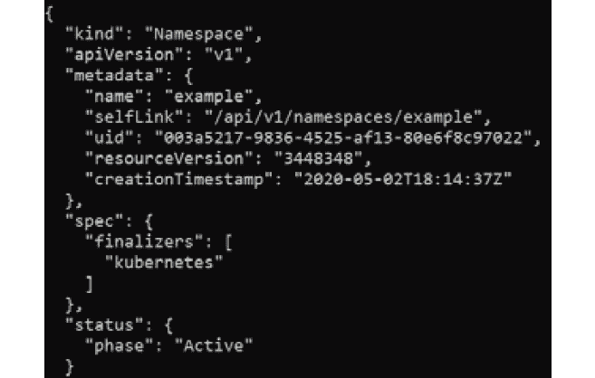

图 4.45：使用 curl 发送请求创建命名空间

1.  相同的过程适用于部署。因此，首先让我们使用`kubectl create`命令和`--dry-run=client`来了解我们的 YAML 数据的外观：

```
kubectl create deployment nginx-example -n example --image=nginx:latest --dry-run -o yaml
```

注意

对于 Kubernetes 版本 1.18+，请使用`--dry-run=client`。

您应该会得到以下响应：

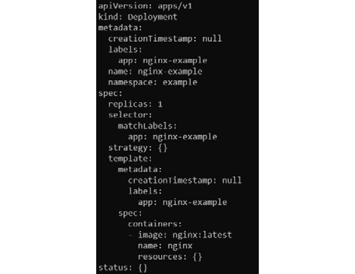

图 4.46：使用 curl 发送请求创建部署

注意

请注意，如果您使用`--dry-run=client`标志，则命名空间将不会显示，因为我们需要在 API 路径中指定它。

1.  现在，创建部署的命令将与创建命名空间的命令类似。请注意，命名空间在 API 路径中指定：

```
curl -X POST http://127.0.0.1:8001/apis/apps/v1/namespaces/example/    deployments -H 'Content-Type: application/yaml' --data "
apiVersion: apps/v1
kind: Deployment
metadata:
  creationTimestamp: null
  labels:
    run: nginx-example
  name: nginx-example
spec:
  replicas: 3
  selector:
    matchLabels:
      run: nginx-example
  strategy: {}
  template:
    metadata:
      creationTimestamp: null
      labels:
        run: nginx-example
    spec:
      containers:
      - image: nginx:latest
        name: nginx-example
        resources: {}
status: {}
"
```

如果一切正确，您应该从 API 服务器获得以下响应：

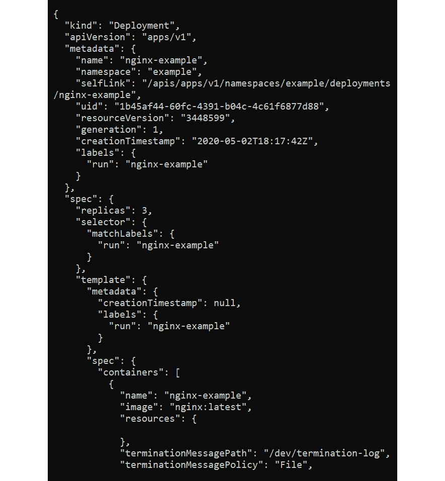

图 4.47：创建部署后 API 服务器的响应

请注意，kubectl 代理进程仍在后台运行。如果您已经完成了使用 kubectl 代理与 API 服务器的交互，则可能希望停止后台运行的代理。要做到这一点，请运行`fg`命令将 kubectl 代理进程带到前台，然后按下*Ctrl* + *C*。

因此，我们已经看到了如何使用 kubectl 代理与 API 服务器进行交互，并且通过使用 curl，我们已经能够在新的命名空间中创建了一个 NGINX 部署。

# 使用认证凭据直接访问 Kubernetes API

我们可以直接向 HTTP 客户端提供位置和凭据，而不是使用 kubectl 代理模式。如果您使用的客户端可能会被代理搞混，可以使用这种方法，但由于中间人攻击的风险，这种方法比使用 kubectl 代理不够安全。为了减轻这种风险，在使用这种方法时建议导入根证书并验证 API 服务器的身份。

在考虑使用凭据访问集群时，我们需要了解认证是如何配置的，以及我们的集群中启用了哪些认证插件。可以使用多种认证插件，允许以不同的方式与服务器进行认证：

+   客户端证书

+   ServiceAccount bearer tokens

+   认证代理

+   HTTP 基本认证

注意

请注意，上述列表仅包括一些身份验证插件。您可以在[`kubernetes.io/docs/reference/access-authn-authz/authentication/`](https://kubernetes.io/docs/reference/access-authn-authz/authentication/)了解更多关于身份验证的信息。

让我们通过以下命令查看我们集群中启用了哪些身份验证插件，查看运行中的 API 服务器进程并查看传递给 API 服务器的标志：

```
kubectl exec -it kube-apiserver-minikube -n kube-system -- /bin/sh -c "apt update ; apt -y install procps ; ps aux | grep kube-apiserver"
```

此命令将首先在我们的 Minikube 服务器上安装/更新`procps`（用于检查进程的工具）在 API 服务器中作为一个 pod 运行。然后，它将获取进程列表，并使用`kube-apiserver`关键字进行过滤。您将获得一个很长的输出，但这是我们感兴趣的部分：

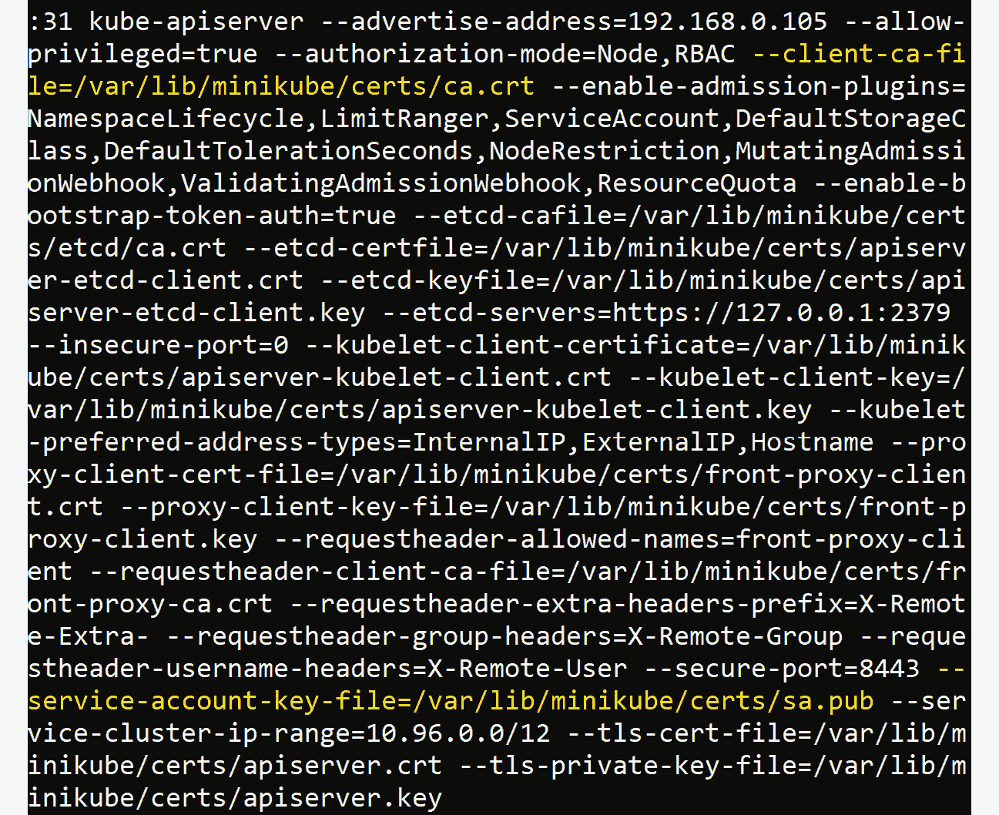

图 4.48：获取传递给 API 服务器的详细标志

此截图中的两个标志告诉我们一些重要信息：

+   `--client-ca-file=/var/lib/minikube/certs/ca.crt`

+   `--service-account-key-file=/var/lib/minikube/certs/sa.pub`

这些标志告诉我们，我们配置了两种不同的身份验证插件——基于 X.509 客户端证书（基于第一个标志）和 ServiceAccount 令牌（基于第二个标志）。现在我们将学习如何使用这两种身份验证方法与 API 服务器进行通信。

## 方法 1：使用客户端证书身份验证

X.509 证书用于验证外部请求，这是我们 kubeconfig 文件中的当前配置。`--client-ca-file=/var/lib/minikube/certs/ca.crt`标志表示用于验证客户端证书的证书颁发机构，这将用于与 API 服务器进行身份验证。X.509 证书定义了一个主题，这是在 Kubernetes 中标识用户的内容。例如，[`www.google.com/`](https://www.google.com/)使用的 SSL 的 X.509 证书包含以下信息：

```
Common Name = www.google.com
Organization = Google LLC
Locality = Mountain View
State = California
Country = US
```

当使用 X.509 证书对 Kubernetes 用户进行身份验证时，主题的“通用名称”用作用户的用户名，“组织”字段用作用户的组成员身份。

Kubernetes 对其所有 API 调用使用 TLS 协议作为安全措施。到目前为止，我们一直在使用的 HTTP 客户端 curl 可以与 TLS 一起工作。之前，kubectl 代理为我们处理了 TLS 通信，但是如果我们想直接使用 curl 进行通信，我们需要向所有 API 调用添加三个更多的细节：

+   --cert：客户端证书路径

+   --key：私钥路径

+   --cacert：证书颁发机构路径

因此，如果我们将它们组合起来，命令语法应该如下所示：

```
curl --cert <ClientCertificate> --key <PrivateKey> --cacert <CertificateAuthority> https://<APIServerAddress:port>/api
```

在本节中，我们不会创建这些证书，而是将使用在使用 Minikube 引导集群时创建的证书。所有相关信息都可以从我们的 kubeconfig 文件中获取，该文件是在初始化集群时由 Minikube 准备的。让我们看看那个文件：

```
kubectl config view
```

您应该收到以下响应：

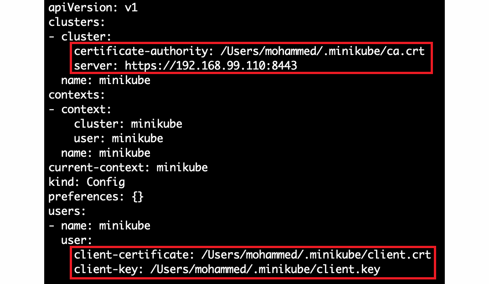

图 4.49：kubeconfig 中的 API 服务器 IP 和身份验证证书

最终的命令应该如下所示：您可以看到我们可以探索 API：

```
curl --cert ~/.minikube/client.crt --key ~/.minikube/client.key --cacert ~/.minikube/ca.crt https://192.168.99.110:8443/api
```

您应该收到以下响应：

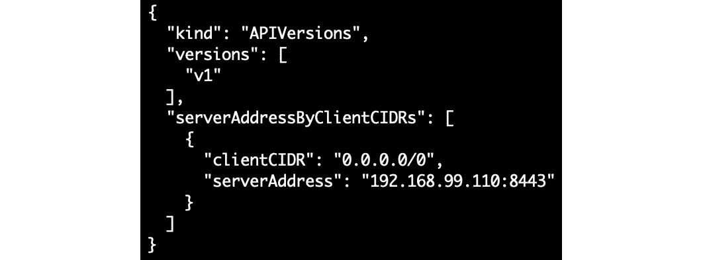

图 4.50：来自 API 服务器的响应

因此，我们可以看到 API 服务器正在响应我们的调用。您可以使用此方法来实现我们在上一节中使用 kubectl 代理所做的一切。

## 方法 2：使用 ServiceAccount Bearer Token

ServiceAccount 用于对集群内运行的进程进行身份验证，例如 pod，以允许与 API 服务器进行内部通信。它们使用签名的承载**JSON Web Tokens**（**JWTs**）与 API 服务器进行身份验证。这些令牌存储在称为**Secrets**的 Kubernetes 对象中，这是一种用于存储敏感信息的实体类型，例如前述的身份验证令牌。Secret 中存储的信息是 Base64 编码的。

因此，每个 ServiceAccount 都有一个与之相关的 secret。当 pod 使用 ServiceAccount 与 API 服务器进行身份验证时，该 secret 将被挂载到 pod 上，并且 bearer token 将被解码，然后挂载到 pod 内的以下位置：`/run/secrets/kubernetes.io/serviceaccount`。然后，pod 中的任何进程都可以使用它来与 API 服务器进行身份验证。通过 ServiceAccounts 进行身份验证是通过内置模块实现的，该模块称为准入控制器，默认情况下已启用。

然而，仅仅 ServiceAccounts 是不够的；一旦经过身份验证，Kubernetes 还需要允许该 ServiceAccount 的任何操作（这是授权阶段）。这由**基于角色的访问控制**（**RBAC**）策略来管理。在 Kubernetes 中，您可以定义某些**Roles**，然后使用**RoleBinding**将这些 Roles*绑定*到特定的用户或 ServiceAccounts。

Role 定义了允许的操作（API 动词）以及可以访问的 API 组和资源。RoleBinding 定义了哪个用户或 ServiceAccount 可以承担该角色。ClusterRole 类似于 Role，不同之处在于 Role 是命名空间范围的，而 ClusterRole 是集群范围的策略。RoleBinding 和 ClusterRoleBinding 也是同样的区别。

注意

您将在*第十章*“ConfigMaps 和 Secrets”中了解更多关于 secrets 的内容；在*第十三章*“Kubernetes 中的运行时和网络安全”中了解更多关于 RBAC 的内容；以及在*第十六章*“Kubernetes Admission Controllers”中了解有关准入控制器的更多信息。

每个命名空间都包含一个名为`default`的 ServiceAccount。我们可以使用以下命令来查看：

```
kubectl get serviceaccounts --all-namespaces
```

您应该看到以下响应：

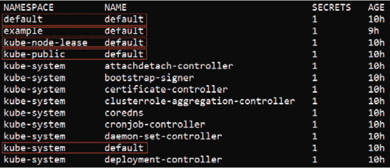

图 4.51：检查每个命名空间的默认 ServiceAccounts

如前所述，ServiceAccount 与包含 API 服务器的 CA 证书和 bearer token 的 secret 相关联。我们可以通过以下方式查看`default`命名空间中与 ServiceAccount 相关联的 secret：

```
kubectl get secrets
```

您应该得到以下响应：

```
NAME                 TYPE                                 DATA   AGE
default-token-wtkk5  kubernetes.io/service-account-token  3      10h
```

我们可以看到我们的默认命名空间中有一个名为`default-token-wtkk5`的 secret（其中`wtkk5`是一个随机字符串）。我们可以使用以下命令查看 Secret 资源的内容：

```
kubectl get secrets default-token-wtkk5 -o yaml
```

该命令将获取对象定义，如存储在 etcd 中，并以 YAML 格式显示，以便易于阅读。这将产生以下输出：

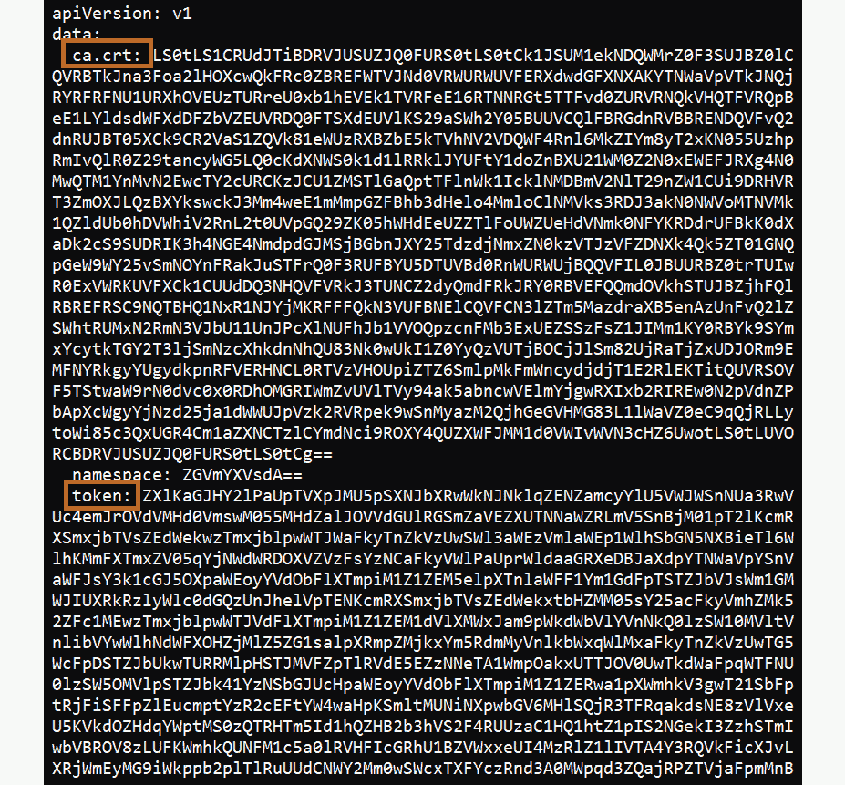

图 4.52：显示存储在密钥中的信息

请注意前面的密钥中的`namespace`、`token`和 API 服务器的 CA 证书（ca.crt）都是 Base64 编码的。您可以在 Linux 终端中使用`base64 --decode`进行解码，如下所示：

```
echo "<copied_value>" | base64 --decode
```

从前面的命令中复制并粘贴`ca.crt`或`token`的值。这将输出解码后的值，然后您可以将其写入文件或变量以供以后使用。但是，在此演示中，我们将展示另一种获取值的方法。

让我们窥探一下我们的一个 pod：

```
kubectl exec -it <pod-name> -- /bin/bash
```

此命令进入 pod，然后在其上运行 Bash shell。然后，一旦我们在 pod 内部运行 shell，我们可以探索 pod 中可用的各种挂载点：

```
df -h
```

这将产生类似以下的输出：

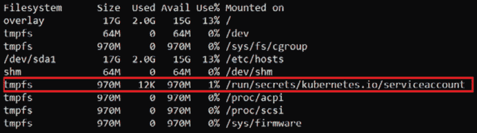

图 4.53：承载令牌的挂载点

可以进一步探索挂载点：

```
ls /var/run/secrets/kubernetes.io/serviceaccount
```

您应该看到类似以下的输出：

```
ca.crt  namespace  token
```

如您在此处所见，挂载点包含 API 服务器 CA 证书、此密钥所属的命名空间和 JWT 承载令牌。如果您在终端上尝试这些命令，可以通过输入`exit`退出 pod 的 shell。

如果我们尝试从 pod 内部使用 curl 访问 API 服务器，我们需要提供 CA 路径和令牌。让我们尝试通过从 pod 内部访问 API 服务器来列出 pod 的所有内容。

我们可以创建一个新的 Deployment，并使用以下过程启动 Bash 终端：

```
kubectl run my-bash --rm --restart=Never -it --image=ubuntu -- bash
```

这可能需要几秒钟来启动，然后您将得到类似这样的响应：

```
If you don't see a command prompt, try pressing enter.
root@my-bash: /#
```

这将启动一个运行 Ubuntu 的 Deployment，并立即将我们带入 pod 并打开 Bash shell。此命令中的`--rm`标志将在 pod 内部的所有进程终止后删除 pod，也就是在我们使用`exit`命令离开 pod 后。但现在，让我们安装 curl：

```
apt update && apt -y install curl
```

这应该产生类似这样的响应：

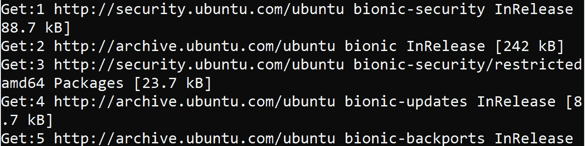

图 4.54：安装 curl

现在我们已经安装了 curl，让我们尝试使用 curl 列出 pod，通过访问 API 路径：

```
curl https://kubernetes/api/v1/namespaces/$NAMESPACE/pods
```

您应该看到以下响应：

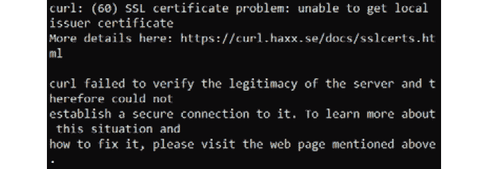

图 4.55：尝试在没有 TLS 的情况下访问 API

请注意，命令失败了。这是因为 Kubernetes 强制所有通信使用 TLS，通常拒绝不带任何身份验证令牌的不安全连接。让我们添加`--insecure`标志，这将允许使用 curl 进行不安全连接，并观察结果：

```
curl --insecure https://kubernetes/api/v1/namespaces/$NAMESPACE/pods
```

您应该得到以下响应：

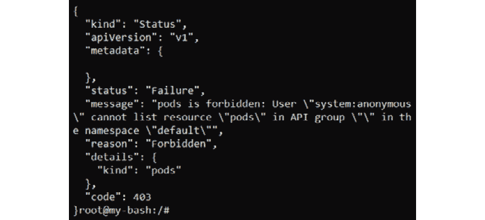

图 4.56：匿名请求 API 服务器

我们可以看到，我们能够使用不安全连接到达服务器。然而，API 服务器将我们的请求视为匿名，因为我们的命令没有提供身份。

现在，为了使命令更容易，我们可以将命名空间、CA 证书（`ca.crt`）和令牌添加到变量中，以便 API 服务器知道生成 API 请求的 ServiceAccount 的身份：

```
CACERT=/run/secrets/kubernetes.io/serviceaccount/ca.crt
TOKEN=$(cat /run/secrets/kubernetes.io/serviceaccount/token)
NAMESPACE=$(cat /run/secrets/kubernetes.io/serviceaccount/namespace)
```

请注意，当从 Pod 内部查看时，我们可以直接使用这些值，因为它们是明文（未编码的），而不是从 Secret 中解码。现在，我们已经准备好了所有参数。在使用持有者令牌身份验证时，客户端应该在请求的标头中发送这个令牌，即授权标头。这应该看起来像这样：`Authorization: Bearer <token>`。由于我们已经将令牌添加到一个变量中，我们可以简单地使用它。让我们运行`curl`命令，看看我们是否可以使用 ServiceAccount 的身份列出 Pods：

```
curl --cacert $CACERT -H "Authorization: Bearer $TOKEN" https://kubernetes/api/v1/namespaces/$NAMESPACE/pods
```

您应该得到以下响应：

图 4.57：使用默认 ServiceAccount 向 API 服务器发出的请求

](image/B14870_04_57.jpg)

图 4.57：使用默认 ServiceAccount 向 API 服务器发出的请求

请注意，我们能够到达 API 服务器，并且 API 服务器验证了`"system:serviceaccount:default:default"`的身份，它的表示形式是：`system:<resource_type>:<namespace>:<resource_name>`。然而，我们仍然得到了`Forbidden`错误，因为默认情况下 ServiceAccounts 没有任何权限。我们需要手动为我们的默认 ServiceAccount 分配权限，以便能够列出 Pods。这可以通过创建一个 RoleBinding 并将其链接到`view` ClusterRole 来完成。

打开另一个终端窗口，确保不要关闭运行`my-bash` pod 的终端会话（因为如果关闭它，pod 将被删除，您将丢失进度）。现在，在第二个终端会话中，您可以运行以下命令来创建一个`rolebinding defaultSA`-view，将`view` ClusterRole 附加到 ServiceAccount：

```
kubectl create rolebinding defaultSA-view \
  --clusterrole=view \
  --serviceaccount=default:default \
  --namespace=default
```

注意

查看 ClusterRole 应该已经存在于您的 Kubernetes 集群中，因为它是可供使用的默认 ClusterRoles 之一。

正如您可能还记得上一章所述，这是一种创建资源的命令性方法；您将学习如何在《第十三章 Kubernetes 中的运行时和网络安全》中为 RBAC 策略创建清单。请注意，我们必须将 ServiceAccount 指定为`<namespace>:<ServiceAccountName>`，并且我们有一个`--namespace`标志，因为 RoleBinding 只能应用于该命名空间内的 ServiceAccounts。您应该会得到以下响应：

```
rolebinding.rbac.authorization.k8s.io/defaultSA-view created
```

现在，回到我们访问`my-bash` pod 的终端窗口。权限设置完成后，让我们再次尝试 curl 命令：

```
curl --cacert $CACERT -H "Authorization: Bearer $TOKEN" https://kubernetes/api/v1/namespaces/$NAMESPACE/pods
```

您应该会得到以下响应：

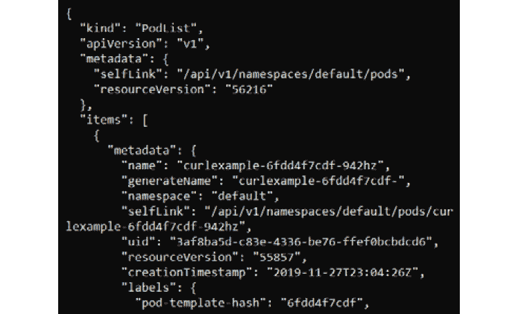

图 4.58：API 服务器的成功响应

我们的 ServiceAccount 现在可以与 API 服务器进行身份验证，并且被授权列出默认命名空间中的 pod。

在集群外部使用 ServiceAccount 令牌也是有效的。您可能希望在长期运行的作业中使用令牌而不是证书作为身份标识，因为只要 ServiceAccount 存在，令牌就不会过期，而证书的到期日期由颁发证书的机构设置。一个例子是 CI/CD 流水线，外部服务通常使用 ServiceAccount 令牌进行身份验证。

## 活动 4.01：使用 ServiceAccount 身份创建部署

在这个活动中，我们将汇集本章学到的所有知识。我们将在集群上使用各种操作，并使用不同的方法访问 API 服务器。

使用 kubectl 执行以下操作：

1.  创建一个名为`activity-example`的新命名空间。

1.  创建一个名为`activity-sa`的新 ServiceAccount。

1.  创建一个名为`activity-sa-clusteradmin`的新 RoleBinding，将`activity-sa` ServiceAccount 附加到`cluster-admin` ClusterRole（默认情况下存在）。这一步是为了确保我们的 ServiceAccount 具有与集群管理员交互所需的权限。

使用 curl 和持有者令牌进行以下操作进行身份验证：

1.  使用`activity-sa` ServiceAccount 的身份创建一个新的 NGINX 部署。

1.  列出部署中的 pod。一旦您使用 curl 检查部署，如果您已经成功完成了前面的步骤，您应该会得到一个类似于以下内容的响应：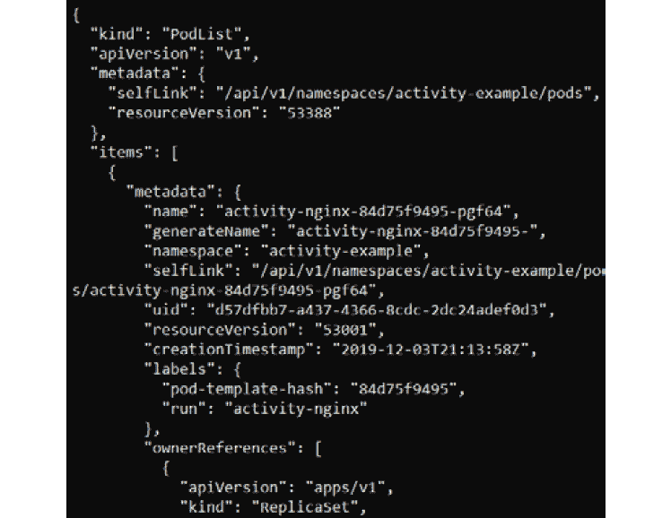

图 4.59：检查部署时的预期响应

1.  最后，删除所有相关资源的命名空间。当使用 curl 删除命名空间时，您应该看到一个响应，其中`status`字段的`phase`设置为`terminating`，如下面的屏幕截图所示：

```
"status": {
  "phase": "Terminating"
```

注意

此活动的解决方案可以在以下地址找到：[`packt.live/304PEoD`](https://packt.live/304PEoD)。

# 摘要

在本章中，我们更仔细地研究了 Kubernetes API 服务器，Kubernetes 如何使用 RESTful API 以及 API 资源的定义方式。我们了解到 kubectl 命令行实用程序中的所有命令都被转换为 RESTful HTTP API 调用，并发送到 API 服务器。我们了解到 API 调用经过多个阶段，包括身份验证、授权和准入控制。我们还更仔细地研究了每个阶段和一些涉及的模块。

然后，我们了解了一些 API 资源，它们是如何分类为命名空间范围或集群范围的资源，以及它们的 API 组和 API 版本。然后，我们学习了如何使用这些信息来构建与 Kubernetes API 交互的 API 路径。

我们还通过直接向 API 服务器发出 API 调用，使用 curl HTTP 客户端以不同的身份验证方法与对象进行交互，例如 ServiceAccounts 和 X.509 证书。

在接下来的几章中，我们将更仔细地检查大多数常用的 API 对象，主要关注这些对象提供的不同功能，以使我们能够在 Kubernetes 集群中部署和维护我们的应用程序。我们将从下一章开始，通过查看 Kubernetes 中部署的基本单元（pod）来开始这一系列章节。
