# 第五章： Pod

概述

本章介绍了 Pod 的概念，并教授如何正确配置和部署它们。我们将从创建一个简单的 Pod 开始，其中运行您的应用程序容器。我们将解释 Pod 配置的不同方面意味着什么，并根据您的应用程序或用例决定使用哪种配置。您将能够为 Pod 定义资源分配要求和限制。然后，我们将看看如何调试 Pod，检查日志，并在需要时对其进行更改。本章还涵盖了一些用于管理 Pod 中故障的更多有用工具，例如活跃性和就绪性探针以及重启策略。

# 介绍

在上一章中，我们学习了如何使用 kubectl 与 Kubernetes API 进行交互。在本章和即将到来的章节中，我们将利用这些知识与 API 进行交互，以创建各种类型的 Kubernetes 对象。

在 Kubernetes 系统中，许多实体代表了集群的状态以及集群的工作负载。这些实体被称为 Kubernetes 对象。Kubernetes 对象描述各种事物，例如，在集群中将运行哪些容器，它们将使用什么资源，这些容器将如何相互交互，以及它们将如何暴露给外部世界。

Pod 是 Kubernetes 的基本构建块，可以描述为部署的基本单元。就像我们将进程定义为执行中的程序一样，我们可以将 Pod 定义为 Kubernetes 世界中正在运行的进程。Pod 是 Kubernetes 中最小的复制单元。一个 Pod 可以有任意数量的容器在其中运行。Pod 基本上是围绕在节点上运行的容器的包装器。使用 Pod 而不是单独的容器有一些好处。例如，Pod 中的容器具有共享卷、Linux 命名空间和 cgroups。每个 Pod 都有唯一的 IP 地址，端口空间由该 Pod 中的所有容器共享。这意味着 Pod 内部的不同容器可以使用本地主机上的相应端口相互通信。

理想情况下，我们应该只在希望它们在 Kubernetes 集群中被管理和定位在一起时才在一个 pod 中使用多个容器。例如，我们可能有一个容器运行我们的应用程序，另一个容器从应用程序容器中获取日志并将其转发到一些中央存储。在这种情况下，我们希望我们的两个容器保持在一起，共享相同的 IP，以便它们可以通过 localhost 进行通信，并共享相同的存储，以便第二个容器可以读取我们的应用程序容器生成的日志。

在本章中，我们将介绍 pod 是什么，它是如何工作的，以及如何定义其 pod 规范，描述 pod 的状态。我们将经历 pod 生命周期的不同阶段，并学习如何使用健康检查或探针来控制 pod。让我们开始学习如何配置一个 pod。

# Pod 配置

为了成功配置一个 pod，我们必须首先能够阅读和理解一个 pod 配置文件。以下是一个示例 pod 配置文件：

```
apiVersion: v1
kind: Pod
metadata:
  name: pod-name
spec:
  containers:
  - name: container1-name
    image: container1-image
  - name: container2-name
    image: container2-image
```

我们可以将 pod 的配置分解为四个主要组件：

+   `apiVersion`：我们将要使用的 Kubernetes API 的版本。

+   `kind`：我们要创建的 Kubernetes 对象的类型，在这种情况下是`Pod`。

+   `metadata`：唯一标识我们正在创建的对象的元数据或信息。

+   `spec`：我们的 pod 的规范，如容器名称、镜像名称、卷和资源请求。

`apiVersion`，`kind`和`metadata`适用于所有类型的 Kubernetes 对象，并且是必需的字段。`spec`也是一个必需的字段；但是，它的布局对于不同类型的对象是不同的。

以下练习演示了如何使用这样一个 pod 配置文件来创建一个简单的 pod。

## 练习 5.01：创建一个带有单个容器的 Pod

在这个练习中，我们的目标是创建我们的第一个简单的 pod，其中运行一个单一的容器。要完成这个练习，请执行以下步骤：

1.  创建一个名为`single-container-pod.yaml`的文件，其中包含以下内容：

```
apiVersion: v1
kind: Pod
metadata:
  name: first-pod
spec:
  containers:
  - name: my-first-container
    image: nginx
```

1.  在终端中运行以下命令以创建具有上述配置的 pod：

```
kubectl create -f single-container-pod.yaml
```

您应该看到以下响应：

```
pod/first-pod created
```

输出表明已创建了 pod。

1.  通过使用以下命令获取所有 pod 的列表来验证是否已创建 pod：

```
kubectl get pods
```

您应该看到以下响应：

```
NAME         READY       STATUS       RESTARTS      AGE
first-pod    1/1         Running      0             5m44s
```

1.  现在我们已经创建了我们的第一个 pod，让我们更详细地了解一下。为了做到这一点，我们可以使用以下命令在终端中描述我们刚刚创建的 pod：

```
kubectl describe pod first-pod
```

您应该看到以下输出：

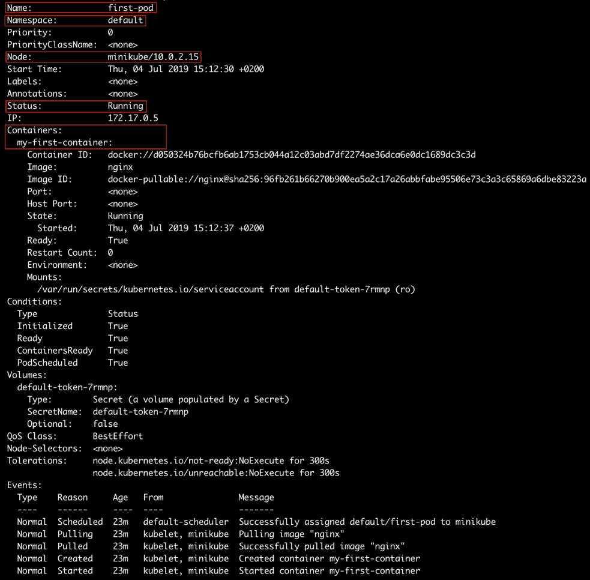

图 5.1：描述第一个 pod

输出显示了我们刚刚创建的 pod 的各种细节。在接下来的部分中，我们将通过前面输出的突出部分来了解更多关于正在运行的 pod 的信息。

## 名称

该字段说明了 pod 的名称，有时也被称为 pod ID。在特定的命名空间中，pod 名称是唯一的。Pod 名称最多可以有 253 个字符长。在 pod 名称中允许的字符是数字（0-9）、小写字母（a-z）、连字符（-）和点（.）。

考虑输出中显示的第二行*图 5.1*：

```
Name: first-pod
```

这与我们在 YAML 配置中提到的是一样的。

## 命名空间

Kubernetes 支持命名空间，在同一物理集群中创建多个虚拟集群。如果我们想要为在同一集群上工作的不同团队提供单独的环境，我们可能需要使用命名空间。命名空间还有助于限定对象名称。例如，在同一命名空间中不能有两个具有相同名称的 pod。但是，在两个不同的命名空间中可以有两个具有相同名称的 pod。现在，考虑输出中显示的第二行*图 5.1*：

```
Namespace: default
```

我们可以通过为特定的 kubectl 命令传递`--namespace`参数来临时更改请求的命名空间，或者我们可以更新 kubectl 配置以更改所有后续 kubectl 命令的命名空间。要创建一个新的命名空间，我们可以使用以下命令：

```
kubectl create namespaces <namespace-name>
```

有两种方法可以在不同的命名空间中创建 pod-通过使用 CLI 命令，或者通过在 pod 配置中指定命名空间。以下练习演示了如何在不同的命名空间中创建 pod，以获得前面提到的命名空间的好处。

## 练习 5.02：通过在 CLI 中指定命名空间来创建不同命名空间中的 Pod

在这个练习中，我们将在一个不同于`default`的命名空间中创建一个 pod。我们将使用相同的 pod 配置从*练习 5.01*，*使用单个容器创建一个 Pod*中，通过在命令参数中指定命名空间来完成这个操作。按照以下步骤完成这个练习：

1.  运行以下命令来查看我们 Kubernetes 集群中所有可用的命名空间：

```
kubectl get namespaces
```

你应该看到以下命名空间列表：

```
NAME               STATUS       AGE
default            Active       16d
kube-node-lease    Active       16d
kube-public        Active       16d
kube-system        Active       16d
```

输出显示了我们 Kubernetes 集群中的所有命名空间。`default`命名空间就像字面意思一样，是所有没有任何命名空间创建的 Kubernetes 对象的默认命名空间。

1.  运行以下命令，使用`single-container-pod.yaml`的 Pod 配置创建一个不同命名空间中的 Pod：

```
kubectl --namespace kube-public create -f single-container-pod.yaml
```

你应该看到以下响应：

```
pod/first-pod created
```

注意

如果在特定命名空间中创建了一个 Pod，只能通过切换到该命名空间来查看它。

1.  验证 Pod 是否在`kube-public`命名空间中创建：

```
kubectl --namespace kube-public get pods
```

你应该看到以下响应：

```
NAME            READY       STATUS      RESTARTS     AGE
first-pod       1/1         Running     0            8s
```

这里的输出显示我们已经成功在`kube-public`命名空间中创建了 Pod。

下一个练习演示了如何基于 YAML 文件在不同的命名空间中创建 Pod。

## 练习 5.03：通过在 Pod 配置 YAML 文件中指定命名空间来创建不同命名空间中的 Pod

在这个练习中，我们将在 YAML 配置文件中添加一行，以指定使用指定命名空间创建的所有 Pod。

1.  运行以下命令来查看我们 Kubernetes 集群中所有可用的命名空间：

```
kubectl get namespaces
```

你应该看到以下命名空间列表：

```
NAME               STATUS       AGE
default            Active       16d
kube-node-lease    Active       16d
kube-public        Active       16d
kube-system        Active       16d
```

1.  接下来，创建一个名为`single-container-pod-with-namespace.yaml`的文件，其中包含以下配置：

```
apiVersion: v1
kind: Pod
metadata:
  name: first-pod-with-namespace
  namespace: kube-public
spec:
  containers:
  - name: my-first-container
    image: nginx
```

1.  运行以下命令，使用`single-container-pod-with-namespace.yaml`的 Pod 配置创建一个 Pod：

```
kubectl create -f single-container-pod-with-namespace.yaml
```

你应该看到以下响应：

```
pod/first-pod-with-namespace created
```

1.  验证 Pod 是否在`kube-public`命名空间中创建：

```
kubectl --namespace kube-public get pods
```

你应该看到以下 Pod 列表：

```
NAME                     READY     STATUS      RESTARTS   AGE
first-pod                 1/1      Running     0          5m2s
first-pod-with-namespace  1/1      Running     0          46s
```

输出显示我们创建的新 Pod 占据了`kube-public`命名空间。使用`single-container-pod-with-namespace.yaml`的 Pod 配置创建的任何其他 Pod 都将占据相同的命名空间。

在接下来的练习中，我们将更改默认的 kubectl 命名空间，以便所有没有定义命名空间的 Pod 都使用我们新定义的命名空间，而不是`default`。

## 练习 5.04：更改所有后续 kubectl 命令的命名空间

在这个练习中，我们将把所有后续的 kubectl 命令的命名空间从`default`改为`kube-public`。

1.  运行以下命令来查看我们 Kubernetes 集群中所有可用的命名空间：

```
kubectl get namespaces
```

你应该看到以下命名空间列表：

```
NAME               STATUS       AGE
default            Active       16d
kube-node-lease    Active       16d
kube-public        Active       16d
kube-system        Active       16d
```

1.  运行以下命令，通过修改当前上下文来更改所有后续请求的命名空间：

```
kubectl config set-context $(kubectl config current-context) --namespace kube-public
```

您应该看到以下的响应：

```
Context "minikube" modified.
```

1.  运行以下命令来列出`kube-public`命名空间中的所有 pod，而不使用`namespace`参数：

```
kubectl get pods
```

您应该看到以下的 pod 列表：

```
NAME                     READY     STATUS      RESTARTS   AGE
first-pod                 1/1      Running     0          48m
first-pod-with-namespace  1/1      Running     0          44m
```

输出显示，前面的命令列出了我们在`kube-public`命名空间中创建的所有 pod。我们在*练习 5.01*中看到，使用`kubectl get pods`命令可以显示默认命名空间中的 pod。但在这里，我们得到的是`kube-public`命名空间的结果。

1.  在这一步中，我们将撤消更改，以便不影响本章中即将进行的练习。我们将再次将默认命名空间更改为`default`，以避免任何混淆：

```
kubectl config set-context $(kubectl config current-context) --namespace default
```

您应该看到以下的响应：

```
Context "minikube" modified.
```

在这个练习中，我们已经学会了如何更改和重置上下文的默认命名空间。

## 节点

正如您在之前的章节中学到的，节点是在我们的集群中运行的各种机器。这个字段反映了这个 pod 在 Kubernetes 集群中运行的节点。知道一个 pod 在哪个节点上运行可以帮助我们调试该 pod 的问题。观察*图 5.1*中显示的输出的第六行：

```
Node: minikube/10.0.2.15
```

我们可以通过运行以下命令列出 Kubernetes 集群中的所有节点：

```
kubectl get nodes
```

您应该看到以下的响应：

```
NAME         STATUS      ROLES       AGE         VERSION
minikube     Ready       <none>      16d         v1.14.3
```

在这种情况下，我们的集群中只有一个节点，因为我们在这些练习中使用的是 Minikube：

```
apiVersion: v1
kind: Pod
metadata:
  name: firstpod
spec:
  nodeName: my-favorite-node # run this pod on a specific node
  containers:
  - name: my-first-pod
    image: nginx
```

如果我们的集群中有多个节点，我们可以通过在配置中添加以下`nodeName`字段来配置我们的 pod 在特定节点上运行，就像在上一个规范的第六行中看到的那样。

注意

在生产环境中，通常不使用`nodeName`来指定某个 pod 在所需节点上运行。在下一章中，我们将学习`nodeSelector`，这是一种更好的控制 pod 分配到哪个节点的方法。

## 状态

这个字段告诉我们 pod 的状态，以便我们可以采取适当的行动，比如根据需要启动或停止一个 pod。虽然这个演示展示了获取 pod 状态的一种方式，但在实际操作中，您可能希望根据 pod 状态自动执行操作。考虑*图 5.1*中显示的输出的第十行：

```
Status: Running
```

这表明 pod 的当前状态是`Running`。这个字段反映了 pod 处于生命周期的哪个阶段。我们将在本章的下一节中讨论 pod 生命周期的各个阶段。

## 容器

在本章的前面，我们看到我们可以在一个 pod 中捆绑各种容器。这个字段列出了我们在这个 pod 中创建的所有容器。考虑*图 5.1*中从第 12 行开始的输出字段：

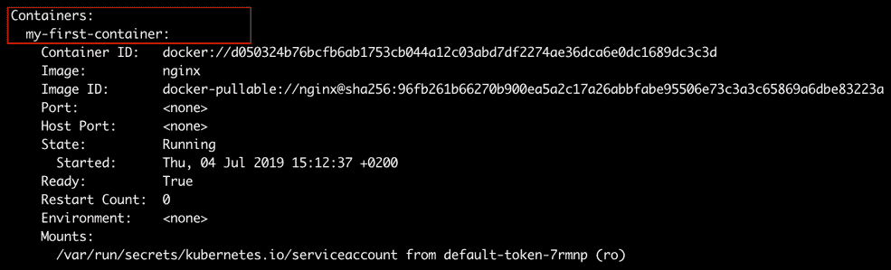

图 5.2：使用描述命令的容器字段

在这种情况下，我们只有一个。我们可以看到容器的名称和镜像与我们在 YAML 配置中指定的相同。以下是我们可以设置的其他字段的列表：

+   `Image`：Docker 镜像的名称

+   `Args`：容器入口点的参数

+   `Command`：容器启动后要运行的命令

+   `Ports`：要从容器中暴露的端口列表

+   `Env`：要在容器中设置的环境变量列表

+   `resources`：容器的资源需求

在下面的练习中，我们将使用一个简单的命令创建一个容器。

## 练习 5.05：使用 CLI 命令创建运行容器的 Pod

在这个练习中，我们将创建一个将通过运行命令来运行容器的 pod。

1.  首先，让我们创建一个名为`pod-with-container-command.yaml`的文件，其中包含以下的 pod 配置：

```
apiVersion: v1
kind: Pod
metadata:
  name: command-pod
spec:
  containers:
  - name: container-with-command
    image: ubuntu
    command:
    - /bin/bash
    - -ec
    - while :; do echo '.'; sleep 5; done
```

1.  运行以下命令，使用`pod-with-container-command.yaml`文件中定义的配置来创建 pod：

```
kubectl create -f pod-with-container-command.yaml
```

您应该会看到以下的响应：

```
pod/command-pod created
```

我们在上一步创建的 YAML 文件指示 pod 启动一个带有 Ubuntu 镜像的容器，并运行以下命令：

```
/bin/bash -ec "while :; do echo '.'; sleep 5; done"
```

这个命令应该每 5 秒打印一个点（`.`）字符到新的一行。

1.  让我们检查这个 pod 的日志，以验证它是否按预期运行。要检查 pod 的日志，我们可以使用`kubectl logs`命令：

```
kubectl logs command-pod -f
```

您应该会看到以下的响应：


图 5.3：命令-pod 的日志

在日志中，我们定期更新，每 5 秒打印一个点（`.`）字符到新的一行。因此，我们成功创建了期望的容器。

注意

`-f`标志是为了跟踪容器上的日志。也就是说，日志会实时更新。如果我们跳过该标志，我们将看到日志而不是跟踪它们。

在下一个练习中，我们将运行一个打开端口的容器，这是您经常需要做的事情，以使容器可以被集群或互联网访问。

## 练习 5.06：创建运行公开端口的容器的 Pod

在这个练习中，我们将创建一个运行容器的 pod，该容器将公开一个可以从 pod 外部访问的端口。

1.  首先，让我们创建一个名为`pod-with-exposed-port.yaml`的文件，其中包含以下 pod 配置：

```
apiVersion: v1
kind: Pod
metadata:
  name: port-exposed-pod
spec:
  containers:
    - name: container-with-exposed-port
      image: nginx
      ports:
        - containerPort: 80
```

1.  运行以下命令，使用`pod-with-exposed-port.yaml`文件创建 pod：

```
kubectl create -f pod-with-exposed-port.yaml
```

您应该会看到以下响应：

```
pod/port-exposed-pod created
```

这个 pod 应该创建一个容器并公开其端口`80`。我们已经配置了 pod 以运行具有`nginx`镜像的容器，这是一个流行的 Web 服务器。

1.  接下来，我们将把 pod 的端口`80`转发到 localhost：

```
sudo kubectl port-forward pod/port-exposed-pod 80
```

您应该会看到以下响应：

```
Forwarding from 127.0.0.1:80 -> 80
Forwarding from [::1] -> 80
```

这将把 pod 的端口`80`公开到 localhost 的端口`80`。

注意：

我们需要在一个终端中保持此命令运行。

1.  现在，我们可以在浏览器的地址栏中输入`http://localhost`或`http://127.0.0.1`。

1.  或者，我们可以运行以下命令并查看响应中默认索引页面的 HTML 源代码：

```
curl 127.0.0.1
```

您应该会看到以下输出：

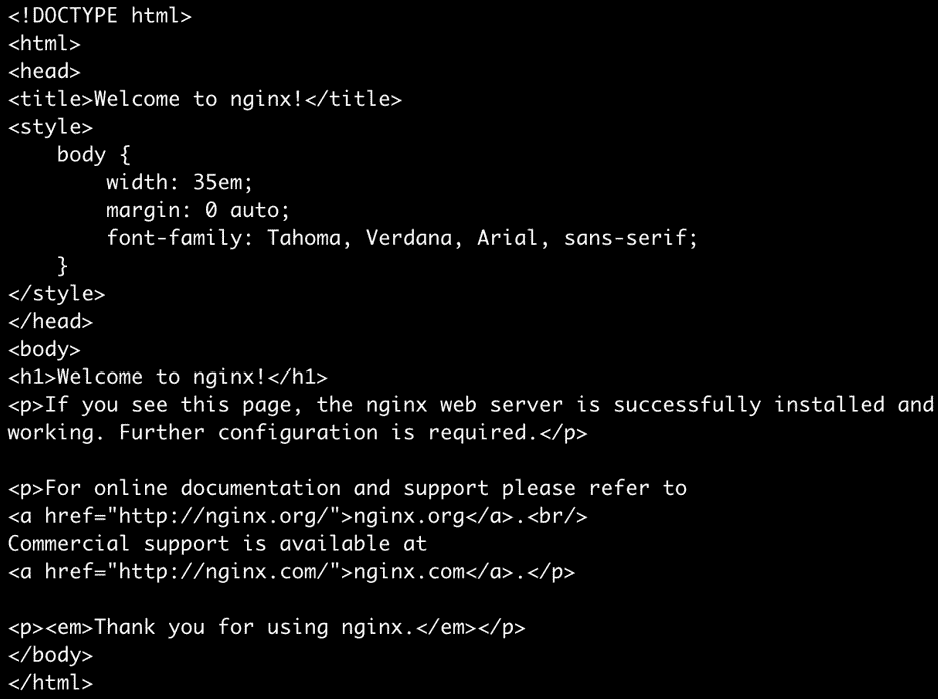

图 5.4：使用 curl 获取 HTML 源代码

1.  接下来，让我们通过使用`kubectl logs`命令来检查日志，验证 pod 是否实际接收到请求：

```
kubectl logs port-exposed-pod
```

您应该会看到以下响应：

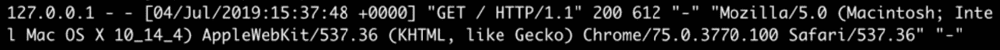

图 5.5：检查 nginx pod 的日志

日志显示，我们运行`nginx`镜像的容器正在接收我们发送到 localhost 的 HTTP 请求，并如预期地做出响应。

我们还可以为我们的容器定义最小和最大资源分配。这对于管理部署使用的资源非常有用。这可以通过 YAML 配置文件中的以下两个字段来实现：

+   `limits`：描述此容器允许的资源的最大量。

+   `requests`：描述此容器所需资源的最小量。

我们可以使用这些字段来定义容器的最小和最大内存和 CPU 资源。CPU 资源以 CPU 单位来衡量。1 个 CPU 单位表示容器可以访问 1 个逻辑 CPU 核心。

在下一个练习中，我们将创建一个具有定义资源需求的容器。

## 练习 5.07：创建运行具有资源需求的 Pod

在这个练习中，我们将创建一个带有资源需求的容器的 pod。首先，让我们看看如何配置容器的资源需求：

1.  创建一个名为`pod-with-resource-requirements.yaml`的文件，其中包含指定内存和 CPU 资源的`limits`和`requests`的 pod 配置，如下所示：

```
apiVersion: v1
kind: Pod
metadata:
  name: resource-requirements-pod
spec:
  containers:
    - name: container-with-resource-requirements
      image: nginx
      resources:
        limits:
          memory: "128M"
          cpu: "1"
        requests:
          memory: "64M"
          cpu: "0.5"
```

在这个 YAML 文件中，我们定义了容器的最小内存需求为 64MB，容器可以占用的最大内存为 128MB。如果容器尝试分配超过 128MB 的内存，它将被杀死，并显示`OOMKilled`状态。

CPU 的最小需求为 0.5（也可以理解为 500 毫 CPU，可以写为`500m`而不是`0.5`），容器只能使用最多 1 个 CPU 单位。

1.  接下来，我们将使用`kubectl create`命令创建使用此 YAML 配置的 pod：

```
kubectl create -f pod-with-resource-requirements.yaml
```

您应该看到以下响应：

```
pod/resource-requirements-pod created
```

1.  接下来，让我们确保 pod 以正确的资源需求创建。使用`describe`命令检查 pod 定义：

```
kubectl describe pod resource-requirements-pod
```

您应该看到以下输出：

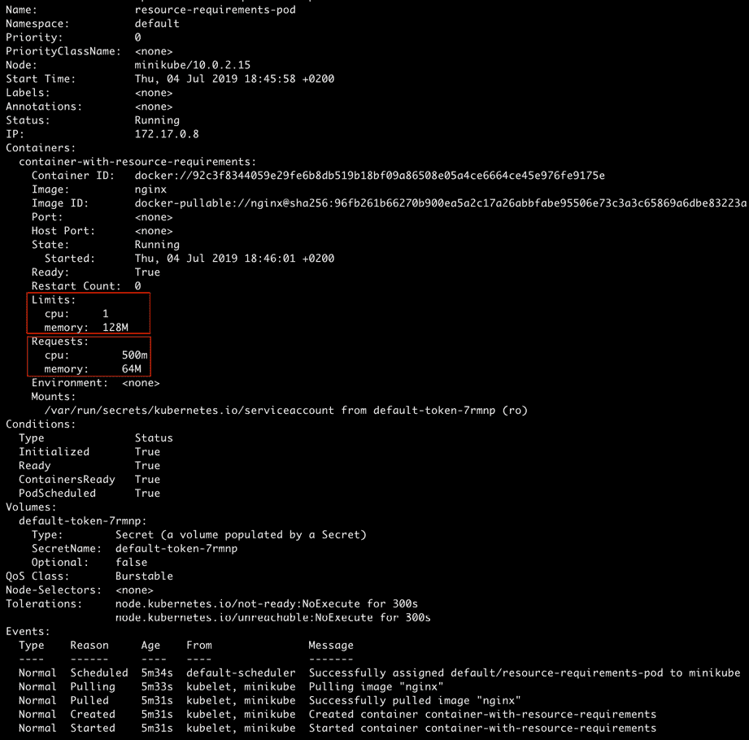

图 5.6：描述资源需求-pod

输出中突出显示的字段显示，pod 已被分配了我们在 YAML 文件中声明的`limits`和`requests`部分。

如果我们为我们的 pod 定义不切实际的资源需求会发生什么？让我们在以下练习中探讨这个问题。

## 练习 5.08：创建一个资源请求无法满足任何节点的 pod

在这个练习中，我们将创建一个具有对集群中的节点来说太大的资源请求的 pod，并查看会发生什么。

1.  创建一个名为`pod-with-huge-resource-requirements.yaml`的文件，其中包含以下 pod 配置：

```
apiVersion: v1
kind: Pod
metadata:
  name: huge-resource-requirements-pod
spec:
  containers:
    - name: container-with-huge-resource-requirements
      image: nginx
      resources:
        limits:
          memory: "128G"
          cpu: "1000"
        requests:
          memory: "64G"
          cpu: "500"
```

在这个 YAML 文件中，我们定义了内存的最小需求为 64GB，CPU 核心为 500 个。您运行此练习的机器可能不满足这些要求。

1.  接下来，我们将使用`kubectl create`命令创建使用此 YAML 配置的 pod：

```
kubectl create -f pod-with-huge-resource-requirements.yaml
```

您应该看到以下响应：

```
pod/huge-resource-requirements-pod created
```

1.  现在，让我们看看我们的 pod 发生了什么。使用`kubectl get`命令获取其状态：

```
kubectl get pod huge-resource-requirements-pod
```

您应该看到以下响应：


图 5.7：获取巨大资源需求-pod 的状态

我们看到 pod 已经处于“挂起”状态将近一分钟。这很不寻常！

1.  让我们深入挖掘，并使用以下命令描述 pod：

```
kubectl describe pod huge-resource-requirements-pod
```

您应该看到以下输出：

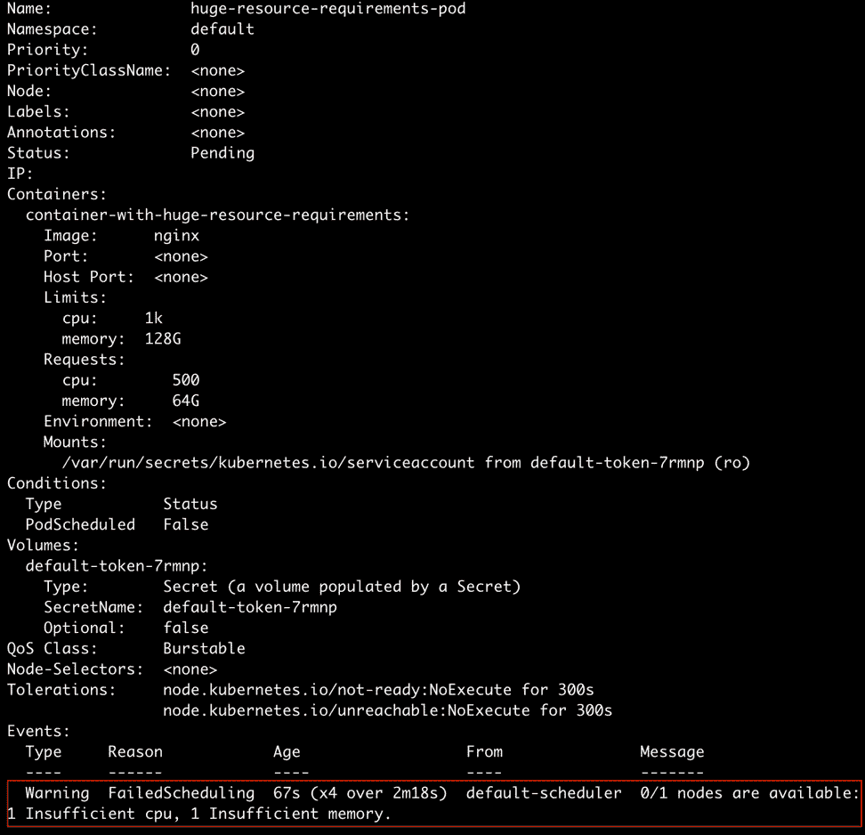

图 5.8：描述巨大资源需求的 pod

让我们专注于输出的最后一行。我们可以清楚地看到警告，指出 Kubernetes 控制器找不到满足 pod 的 CPU 和内存需求的任何节点。因此，pod 调度失败了。

总之，pod 调度是基于资源需求的。一个 pod 只会被调度到满足其所有资源需求的节点上。如果我们不指定资源（内存或 CPU）限制，那么 pod 可以使用的资源数量就没有上限。

这带来了一个风险，即一个糟糕的 pod 消耗了太多的 CPU 或分配了太多的内存，影响了在同一命名空间/集群中运行的其他 pod。因此，在生产环境中，向 pod 配置添加资源请求和限制是一个好主意。

正如本章前面提到的，一个 pod 可以运行多个容器。在接下来的练习中，我们将创建一个具有多个容器的 pod。

## 练习 5.09：创建一个包含多个容器的 pod

在这个练习中，我们将创建一个具有多个容器的 pod。为此，我们可以使用在上一节中使用的配置，唯一的区别是“容器”字段现在将包含多个容器规范。按照以下步骤完成练习：

1.  创建一个名为`multiple-container-pod.yaml`的文件，其中包含以下 pod 配置：

```
apiVersion: v1
kind: Pod
metadata:
  name: multi-container-pod
spec:
  containers:
    - name: first-container
      image: nginx
    - name: second-container
      image: ubuntu
      command:
        - /bin/bash
        - -ec
        - while :; do echo '.'; sleep 5; done
```

1.  接下来，我们将使用`kubectl create`命令创建一个使用前面的 YAML 配置的 pod：

```
kubectl create -f multiple-container-pod.yaml
```

您应该看到以下响应：

```
pod/multi-container-pod created
```

1.  接下来，我们将描述 pod 并查看它正在运行的容器：

```
kubectl describe pod multi-container-pod
```

您应该看到以下输出：

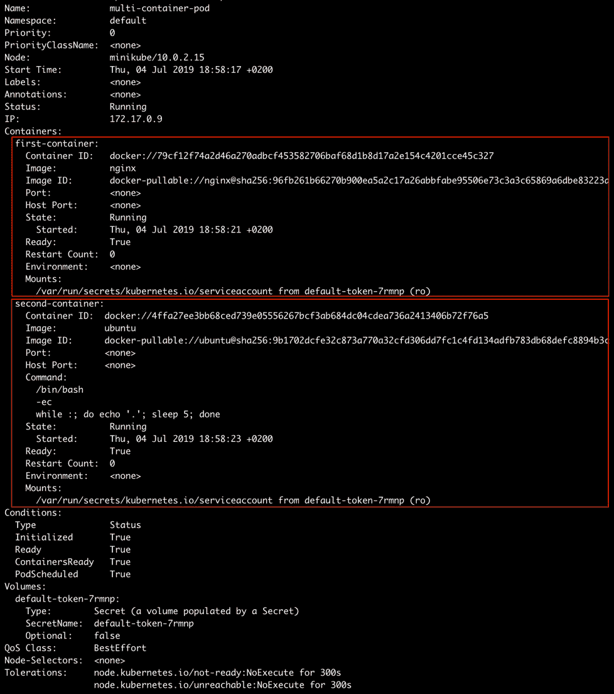

图 5.9：描述多容器 pod

从前面的输出可以看出，我们有两个容器在一个单独的 pod 中运行。现在，我们需要确保我们可以访问任一容器的日志。

我们可以指定容器名称来获取运行在 pod 中的特定容器的日志，如下所示：

```
kubectl logs <pod-name> <container-name>
```

例如，要查看第二个容器的日志，该容器每 5 秒在新行上打印出点，使用此命令：

```
kubectl logs multi-container-pod second-container -f
```

您应该看到以下响应：


图 5.10：多容器 pod 中 second-container 的日志

我们在这里看到的输出与*练习 5.05*，*使用 CLI 命令创建运行容器的 pod*类似，因为我们基本上使用了与那里定义的类似的容器。

因此，我们已经创建了一个具有多个容器的 pod，并访问了所需容器的日志。

# Pod 的生命周期

现在我们知道如何运行一个 pod 以及如何为我们的用例配置它，在本节中，我们将讨论 pod 的生命周期，以了解它的工作原理。

## Pod 的阶段

每个 pod 都有一个 pod 状态，告诉我们 pod 处于生命周期的哪个阶段。我们可以通过运行`kubectl get`命令来查看 pod 状态：

```
kubectl get pod
```

您将看到以下响应：

```
NAME         READY       STATUS        RESTARTS      AGE
first-pod    1/1         Running       0             5m44s
```

对于我们的第一个名为`first-pod`的 pod，我们看到 pod 处于`运行`状态。

让我们看看 pod 在其生命周期中可能具有的不同状态：

+   `挂起`：这意味着 pod 已经提交到集群，但控制器尚未创建所有的容器。它可能正在下载镜像或等待 pod 被调度到集群节点之一。

+   `运行`：这个状态意味着 pod 已经分配给集群节点，并且至少一个容器正在运行或正在启动过程中。

+   `成功`：这个状态意味着 pod 已经运行，并且所有的容器都已成功终止。

+   `失败`：这个状态意味着 pod 已经运行，至少一个容器以非零退出代码终止，也就是说，它未能执行其命令。

+   `未知`：这意味着无法找到 pod 的状态。这可能是因为控制器无法连接到分配给 pod 的节点。

注意

`get pod`命令无法获取被驱逐或删除的 pod。为此，您可以使用`--show-all`标志，但自 Kubernetes v1.15 以来已被弃用。

# 探针/健康检查

探针是可以配置为检查运行在 pod 中的容器的健康状况的健康检查。探针可以用来确定容器是否正在运行或准备好接收请求。探针可能返回以下结果：

+   `成功`：容器通过了健康检查。

+   `失败`：容器未通过健康检查。

+   `未知`：健康检查由于未知原因失败。

## 探针的类型

我们可以使用以下类型的探针。

### 活跃探针

这是一个用于确定特定容器是否正在运行的健康检查。如果容器未通过活跃探针，控制器将根据为 Pod 配置的重启策略尝试在同一节点上重新启动 Pod。

当特定检查失败时，指定活跃探针并希望容器在失败时被终止并重新启动是一个好主意。

### 就绪探针

这是一个用于确定特定容器是否准备好接收请求的健康检查。我们如何定义容器的就绪状态在很大程度上取决于容器内运行的应用程序。

例如，对于一个提供 Web 应用程序的容器，就绪可能意味着容器已经加载了所有静态资产，与数据库建立了连接，启动了 Web 服务器，并在主机上打开了一个特定的端口来开始提供请求。另一方面，对于提供一些数据的容器，就绪探针只有在它从磁盘加载了所有数据并准备好开始为该数据提供请求时才能成功。

如果一个容器未通过就绪探针，Kubernetes 控制器将确保该 Pod 不会收到任何请求。如果容器指定了就绪探针，其默认状态将是“失败”，直到就绪探针成功。只有在就绪探针返回“成功”状态后，容器才会开始接收请求。如果没有配置就绪探针，容器将在启动后立即开始接收请求。

## 探针的配置

我们可以使用一堆通用字段来配置探针：

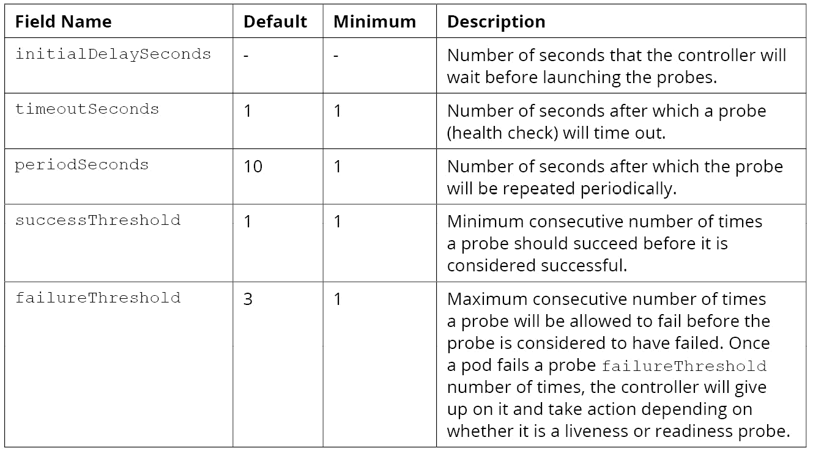

图 5.11：显示探针配置字段的表格

## 探针的实现

探针（活跃或就绪）可以通过向容器传递命令、让其获取一些资源，或尝试连接到它来实现，正如我们将在本节中看到的那样。我们可以在同一个容器中使用不同的实现来进行活跃和就绪探针。

### 命令探针

在探针的命令实现中，控制器将使容器执行指定的命令以对容器执行探针。对于此实现，我们使用`command`字段。该字段指定要执行的命令以对容器执行探针。它可以是字符串或数组。

以下示例显示了如何在容器规范中使用活跃性和就绪性探针配置：

```
livenessProbe:
  exec:
    command:
    - cat
    - /tmp/health
  initialDelaySeconds:
  periodSeconds: 15
  failureThreshold: 3
readinessProbe:
  exec:
    command:
    - cat
    - /tmp/health
  initialDelaySeconds:
  periodSeconds: 15
```

### HTTP 请求探针

在这种类型的探针中，控制器将向给定地址（主机和端口）发送 GET HTTP 请求以对容器执行探针。可以设置要在探针请求中发送的自定义 HTTP 标头。

我们可以设置以下字段来配置 HTTP 请求探针：

+   主机：将发出请求的主机名。默认为 pod IP 地址。

+   路径：发出请求的路径。

+   端口：要发出请求的端口的名称或编号。

+   `httpHeaders`：要在请求中设置的自定义标头。

+   方案：在发出请求时使用的方案。默认值为 HTTP。

以下是一个用于活跃性和就绪性的 HTTP 请求探针的示例：

```
livenessProbe:
  httpGet:
    path: /health-check
    port: 8080
  initialDelaySeconds: 10
  periodSeconds: 20
readinessProbe:
  httpGet:
    path: /health-check
    port: 8080
  initialDelaySeconds: 5
  periodSeconds: 10
```

### TCP 套接字探针

在这种探针的实现中，控制器将尝试在给定的主机和指定的端口号上建立连接。我们可以使用以下两个字段进行此探针：

+   主机：将建立连接的主机名。默认为 pod IP 地址。

+   端口：要连接的端口的名称或编号。

以下是一个 TCP 套接字探针的示例：

```
livenessProbe:
  tcpSocket:
    port: 8080
  initialDelaySeconds: 10
  periodSeconds: 20
readinessProbe:
  tcpSocket:
    port:8080
  initialDelaySeconds: 5
  periodSeconds: 10
```

### 重启策略

我们可以在 pod 规范中指定`restartPolicy`以指示控制器重新启动 pod 所需的条件。 `restartPolicy`的默认值为`Always`。它可以采用以下值：

+   `Always`：当 pod 终止时始终重新启动 pod。

+   `OnFailure`：仅在 pod 以失败终止时重新启动 pod。

+   永不：在终止后永不重新启动 pod。

如果我们希望 pod 在出现问题或变得不健康时崩溃并重新启动，我们应该将重启策略设置为`Always`或`OnFailure`。

在下面的练习中，我们将创建一个带有命令实现的活跃探针。

## 练习 5.10：创建一个运行带有活跃探针和无重启策略的容器的 pod

在这个练习中，我们将创建一个带有活跃探针和无重启策略的 pod。未为 pod 指定重启策略意味着将使用`Always`的默认策略。

1.  创建`liveness-probe.yaml`，使用以下 pod 配置：

```
apiVersion: v1
kind: Pod
metadata:
  name: liveness-probe
spec:
  containers:
    - name: ubuntu-container
      image: ubuntu
      command:
        - /bin/bash
        - -ec
        - touch /tmp/live; sleep 30; rm /tmp/live; sleep 600
      livenessProbe:
        exec:
          command:
            - cat
            - /tmp/live
        initialDelaySeconds: 5
        periodSeconds: 5
```

这个 pod 配置意味着将会创建一个来自 Ubuntu 镜像的容器，并且一旦它启动，将运行以下命令：

```
/bin/bash -ec "touch /tmp/live; sleep 30; rm /tmp/live; sleep 600"
```

前面的命令在路径`/tmp/live`创建一个空文件，休眠 30 秒，删除`/tmp/live`文件，然后休眠 10 分钟后成功终止。

接下来，我们有一个活跃探针，它每 5 秒执行一次以下命令，初始延迟为 5 秒：

```
cat /tmp/live
```

1.  运行以下命令使用`liveness-probe.yaml`创建 pod：

```
kubectl create -f liveness-probe.yaml
```

1.  当容器启动时，活跃探针将成功，因为命令将成功执行。现在，让我们等待至少 30 秒，然后运行`describe`命令：

```
kubectl describe pod liveness-probe
```

你应该看到以下输出：

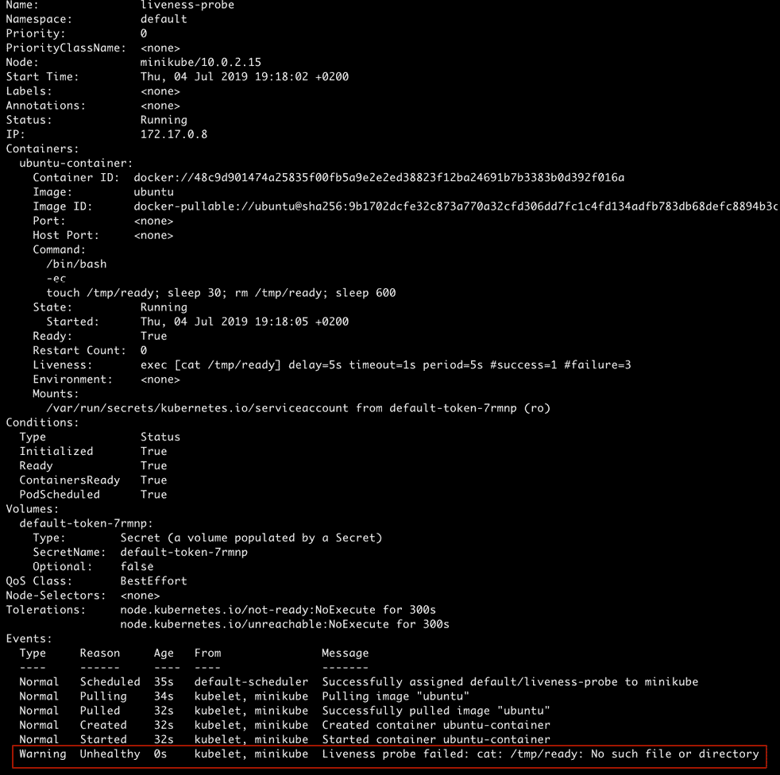

图 5.12：描述活跃探针：第一次失败

在最后一行，也就是突出显示的内容中，我们可以看到活跃探针已经第一次失败。

1.  让我们再等待几秒，直到探针失败三次，然后再次运行相同的命令：

```
kubectl describe pod liveness-probe
```

你应该看到以下输出：

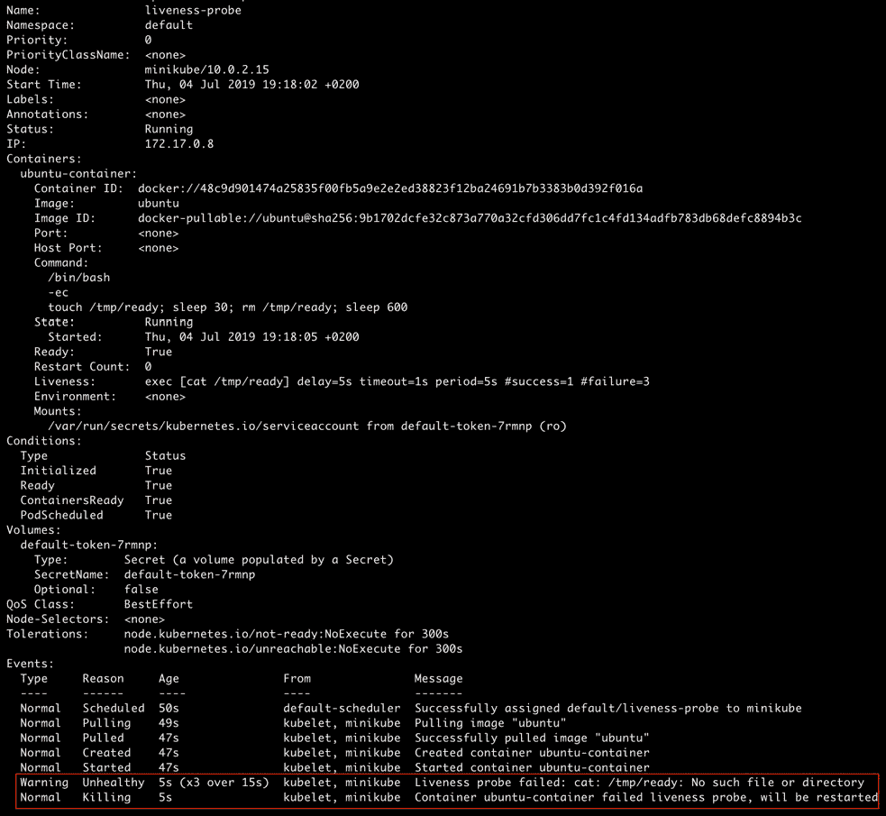

图 5.13：描述活跃探针：三次失败后

输出中最后两行突出显示的内容告诉我们，活跃探针已经失败了三次。现在，该 pod 将被杀死并重新启动。

1.  接下来，我们将使用以下命令验证该 pod 至少已经重新启动了一次：

```
kubectl get pod liveness-probe
```

你应该看到以下响应：

```
NAME             READY     STATUS      RESTARTS    AGE
liveness-probe   1/1       Running     1           89s
```

这个输出显示，该 pod 在活跃探针失败后已经重新启动。

现在让我们看看如果将重启策略设置为`Never`会发生什么。

## 练习 5.11：创建一个运行有活跃探针和重启策略的容器的 Pod

在这个练习中，我们将使用上一个练习中相同的 pod 配置，唯一的区别是`restartPolicy`字段将被设置为`Never`。按照以下步骤完成活动：

1.  创建`liveness-probe-with-restart-policy.yaml`，使用以下 pod 配置：

```
apiVersion: v1
kind: Pod
metadata:
  name: liveness-probe-never-restart
spec:
  restartPolicy: Never
  containers:
    - name: ubuntu-container
      image: ubuntu
      command:
        - /bin/bash
        - -ec
        - touch /tmp/ready; sleep 30; rm /tmp/ready; sleep 600
      livenessProbe:
        exec:
          command:
            - cat
            - /tmp/ready
        initialDelaySeconds: 5
        periodSeconds: 5
```

1.  运行以下命令使用`liveness-probe.yaml`创建 pod：

```
kubectl create -f liveness-probe-with-restart-policy.yaml
```

你应该看到以下响应：

```
pod/liveness-probe-never-restart created
```

1.  让我们等待大约一分钟，然后运行`describe`命令：

```
kubectl describe pod liveness-probe-never-restart
```

你应该看到以下输出：

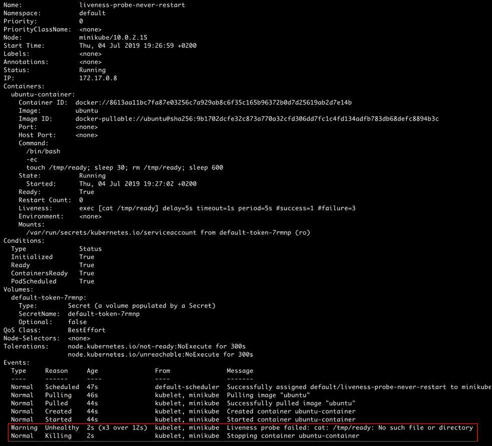

图 5.14：描述活跃探针-永不重启

正如我们所看到的，在最后两行中，控制器只会杀死容器，而不会尝试重新启动它，遵守了 pod 规范中指定的重启策略。

在接下来的练习中，我们将看一下就绪探针的实现。

## 练习 5.12：创建一个运行带有就绪探针的容器的 Pod

在这个练习中，我们将创建一个带有就绪探针的 pod。

1.  创建一个名为`readiness-probe.yaml`的文件，其中包含以下的 pod 配置：

```
apiVersion: v1
kind: Pod
metadata:
  name: readiness-probe
spec:
  containers:
    - name: ubuntu-container
      image: ubuntu
      command:
        - /bin/bash
        - -ec
        - sleep 30; touch /tmp/ready; sleep 600
      readinessProbe:
        exec:
          command:
            - cat
            - /tmp/ready
        initialDelaySeconds: 10
        periodSeconds: 5
```

前面的 pod 配置指定将从 Ubuntu 镜像创建一个容器，并且一旦启动，将运行以下命令：

```
/bin/bash -ec "sleep 30; touch /tmp/ready; sleep 600"
```

前面的命令休眠 30 秒，在`/tmp/ready`创建一个空文件，然后再休眠 10 分钟后以成功终止。

接下来，我们有一个就绪探针，它每 5 秒执行一次以下命令，初始延迟为 10 秒：

```
cat /tmp/ready
```

1.  运行以下命令使用`readiness-probe.yaml`创建 pod：

```
kubectl create -f readiness-probe.yaml
```

你应该看到以下的响应：

```
pod/readiness-probe created
```

当容器启动时，就绪探针的默认值将是`Failure`。它将在第一次执行探测之前等待 10 秒。

1.  让我们来检查一下 pod 的状态：

```
kubectl get pod readiness-probe
```

你应该看到以下的响应：

```
NAME              READY       STATUS       RESTARTS       AGE
readiness-probe   0/1         Running      0              8s
```

我们可以看到该 pod 还没有准备好。

1.  现在，让我们尝试使用`describe`命令找到有关该 pod 的更多信息。如果在容器启动后等待超过 10 秒，我们将看到就绪探针开始失败：

```
kubectl describe pod readiness-probe
```

你应该看到以下的输出：

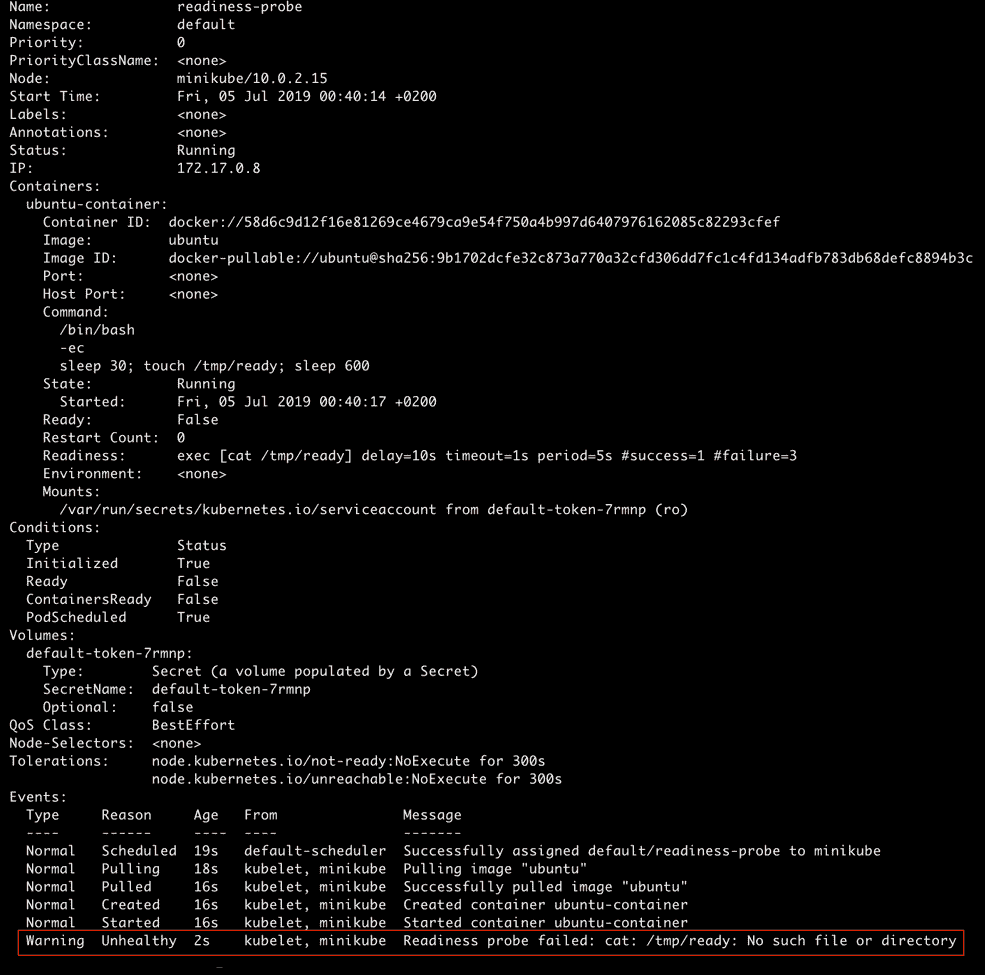

图 5.15：描述就绪探针

该输出告诉我们，就绪探针已经失败了一次。如果我们等一会儿，再次运行该命令，我们将看到就绪探针一直失败，直到容器的启动时间已经过去 30 秒。之后，就绪探针将开始成功，因为在`/tmp/ready`将创建一个文件。

1.  让我们再次检查一下 pod 的状态：

```
kubectl get pod readiness-probe
```

你应该看到以下的响应：

```
NAME              READY    STATUS      RESTARTS     AGE
readiness-probe   1/1      Running     0            66s
```

我们可以看到探针已经成功，pod 现在处于`Ready`状态。

## 在使用探针时的最佳实践

错误使用探针将无法帮助您实现预期的目的，甚至可能破坏 pod。遵循这些实践以正确使用探针：

+   对于活跃探针，`initialDelaySeconds`应该比应用程序启动所需的时间大得多。否则，容器很可能会陷入重启循环，因为它一直无法通过活跃探针，因此一直被控制器重新启动。

+   对于就绪探针，`initialDelaySeconds`可以很小，因为我们希望在容器准备就绪后尽快启用对 pod 的流量，并且在启动过程中更频繁地轮询容器在大多数情况下不会造成任何伤害。

+   对于就绪探针，我们应该小心设置`failureThreshold`，以确保我们的就绪探针在临时中断或系统问题的情况下不会过早放弃。

## 活动 5.01：在 pod 中部署应用程序

想象一下，你正在与一组开发人员合作，他们构建了一个很棒的应用程序，希望你将其部署到一个 pod 中。该应用程序有一个启动过程，大约需要 20 秒来加载所有所需的资源。一旦应用程序启动，它就准备好开始接收请求。如果出现应用程序崩溃的情况，你也希望 pod 能够重新启动。他们让你使用一个配置来创建 pod，以最好的方式满足应用程序开发人员的需求。

我们提供了一个预制的应用程序镜像，以模拟上述应用程序的行为。你可以在 pod 规范中使用这行来获取它：

```
image: packtworkshops/the-kubernetes-workshop:custom-application-for-    pods-chapter
```

注意

理想情况下，你希望在不同的命名空间中创建这个 pod，以使其与你在练习期间创建的其他内容分开。所以，可以随意创建一个命名空间，并在该命名空间中创建 pod。

以下是完成此活动的高级步骤：

1.  为你的 pod 创建一个新的命名空间。

1.  创建一个适合应用程序需求的 pod 配置。确保你使用适当的命名空间、重启策略、就绪和活跃探针，以及应用程序开发人员提供的容器镜像。

1.  使用你刚刚创建的配置创建一个 pod。

1.  确保 pod 按照要求运行。

注意

此活动的解决方案可以在以下地址找到：[`packt.live/304PEoD`](https://packt.live/304PEoD)。

# 总结

在本章中，我们已经探讨了 Pod 配置的各种组件，并学会了在何时使用何种组件。现在我们应该能够创建一个 Pod，并根据应用程序的需求选择 Pod 配置中各个字段的正确值。这种能力使我们能够利用我们对这个基本的重要构建块的深刻理解，并将其扩展到开发一个可靠部署的完整应用程序。

在下一章中，我们将讨论如何向 Pod 添加标签和任意元数据，并使用它们来识别或搜索 Pod。这将帮助我们组织我们的 Pod，并在需要时选择它们的子集。
