# 第六章：6. 标签和注释

概述

元数据对于任何组织都非常有用，并且在管理集群中潜在的成千上万的资源时非常有用。本章将教你如何向你的 Pod 或任何其他 Kubernetes 对象添加元数据。您将了解标签和注释的概念。我们还将解释它们的用例，以便您可以决定是否对特定用例使用标签或注释。您将利用标签通过使用标签选择器来组织对象，以选择或过滤组织好的对象集。您还将使用注释向对象添加非结构化的元数据信息。

# 介绍

在上一章中，我们创建了各种类型的 Pod，并管理了它们的生命周期。一旦我们开始使用不同的 Pod，理想情况下，我们希望根据某些属性对它们进行组织、分组和过滤。为了做到这一点，我们需要向我们的 Pod 添加一些信息，以便以后可以使用这些信息来对它们进行组织。我们已经看到了`name`和`namespace`字段作为 Pod 的元数据的用法。除了这些字段，我们还可以向 Pod 添加键值对，以便作为标签和注释添加额外的信息。

在本章中，我们将为这些 Pod 分配元数据，以便通过基于某些元数据的查询来识别 Pod，然后添加额外的非结构化元数据。我们将详细介绍标签和注释，并检查它们之间的区别。我们将同时使用标签和注释，并看看何时使用其中之一。

# 标签

标签是包含与 Kubernetes 对象相关的可识别信息的元数据。这些基本上是可以附加到对象（如 Pod）的键值对。每个键对于一个对象必须是唯一的。标签包含对用户有意义的信息。标签可以在创建时附加到 Pod，并且在运行时也可以添加或修改。以下是一个 YAML 文件中标签的示例：

```
metadata:
  labels:
    key1: value1
    key2: value2
```

## 标签的约束

如前所述，标签是键值对。标签键和值应遵循某些规则。存在这些约束是因为这样可以通过内部优化的数据结构和算法更快地评估使用标签的查询。Kubernetes 在内部使用优化的数据结构来维护标签与相应对象的映射，以使这些查询更快。

### 标签键

以下是标签键的示例：

```
label_prefix.com/worker-node-1
```

正如我们所看到的，标签键由两部分组成：标签前缀和标签名称。让我们更仔细地看看这两部分：

+   **标签前缀**：标签前缀是可选的，必须是 DNS 子域。它不能长于 253 个字符，也不能包含空格。标签前缀总是跟着一个斜杠（`/`）。如果不使用前缀，则假定标签键是私有的。一些前缀，如`kubernetes.io/`和`k8s.io/`，专门用于 Kubernetes 核心系统。

在我们的示例中，`label_prefix.com/`是该标签键的前缀。

+   **标签名称**：标签名称是必需的，最长可以达到 63 个字符。标签名称只能以字母数字字符（a-z，A-Z，0-9）开头和结尾；但是，它可以包含破折号（`-`），下划线（`_`），点（`.`）和中间的字母数字字符。标签名称不能包含空格或换行符。

在`label_prefix.com/worker-node-1`的示例中，标签键的名称是`worker-node-1`。

### 标签值

标签值最长可以达到 63 个字符。与标签名称类似，标签值也应该以字母数字字符开头和结尾。但是，它们可以包含破折号（`-`），下划线（`_`），点（`.`）和中间的字母数字字符。标签值不能包含空格或换行符。

## 为什么我们需要标签？

标签通常用于组织对象的子集。然后可以根据这些标签对这些对象进行过滤。使用标签，您还可以在选定的节点上运行特定的 Pods。这两种情况在以下部分中进行了详细解释。

### 按组织/团队/项目组织 Pods

标签的一个用例可能是在您公司中基于团队或组织使用标签。假设您的组织有几个团队在不同的项目上工作。您可以使不同的团队只列出他们的 Pods，甚至那些特定于某些项目的 Pods。此外，如果您是基础设施服务提供商，您可以使用组织标签仅对与特定客户组织相关的 Pods 应用更改。对于这种用例，您可以使用标签键，如`team`，`org`和`project`。以下是这种用例的一个示例`labels`部分：

```
metadata:
  labels:
    environment: production
    team: devops-infra
    project: test-k8s-infra
```

### 在特定节点上运行选择的 Pods

另一个有用的场景可能是当您希望将您的 pod 分配给具有特定硬件或其他属性的特定节点时。这可以通过向具有特殊硬件或其他属性的节点添加标签来实现。我们可以使用`nodeSelector`将 pod 分配给具有特定标签的任何节点。考虑以下示例：

```
apiVersion: v1
kind: Pod
metadata:
  name: pod-with-node-selector
spec:
  containers:
  - name: first-container
    image: nginx
  nodeSelector:
    region: east-us
    disktype: ssd
```

上述 pod 模板可用于确保 pod 将被分配到位于`east-us`地区并具有`ssd`存储的节点。此检查基于添加到节点的标签。因此，我们需要确保适当的`region`和`disktype`标签已分配给所有适用的节点。

注意

请注意，要在`nodeSelector`部分中使用的确切节点标签将由云基础设施提供商提供，并且标签键和值可能会更改。本示例中使用的值仅用于演示用例。

在接下来的练习中，我们将向您展示如何创建带有标签的 pod，向正在运行的 pod 添加标签，并修改和/或删除正在运行的 pod 的现有标签。

## 练习 6.01：创建带标签的 Pod

在这个练习中，我们的目标是创建一个带有一些标签的 pod。为了成功完成这个练习，执行以下步骤：

1.  创建一个名为`pod-with-labels.yaml`的文件，内容如下：

```
apiVersion: v1
kind: Pod
metadata:
  name: pod-with-labels
  labels:
    app: nginx
    foo: bar
spec:
  containers:
  - name: first-container
    image: nginx
```

如前面的片段所示，我们已添加了`app`和`foo`标签，并分别将它们分配为`nginx`和`bar`的值。现在，我们需要创建一个带有这些标签的 pod，并验证这些标签是否实际包含在 pod 中，这将是接下来几个步骤的重点。

1.  在终端中运行以下命令以使用上述配置创建 pod：

```
kubectl create -f pod-with-labels.yaml
```

您应该看到以下响应：

```
pod/pod-with-labels created
```

1.  使用`kubectl get`命令验证 pod 是否已创建：

```
kubectl get pod pod-with-labels
```

以下输出表明已创建了 pod：

```
NAME              READY      STATUS        RESTARTS     AGE
pod-with-labels   1/1        Running       0            4m4s
```

1.  使用`kubectl describe`命令验证实际是否已将`labels`元数据添加到 pod 中：

```
kubectl describe pod pod-with-labels
```

这应该导致以下输出：

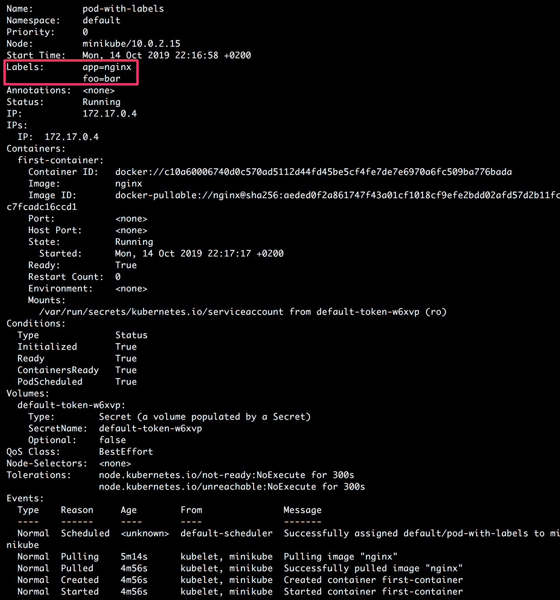

图 6.1：描述带标签的 pod

输出显示了与 pod 相关的各种细节（正如我们在上一章中看到的那样）。在这种情况下，我们将关注输出的突出部分，显示了所需的标签`app=nginx`和`foo=bar`实际上已添加到了 pod 中。请注意，在这个练习中，我们在创建 pod 时添加了标签。但是，当 pod 已经在运行时，如何给 pod 添加标签呢？下一个练习将回答这个问题。

## 练习 6.02：向运行中的 pod 添加标签

在这个练习中，我们的目标是创建一个没有标签的 pod，然后在 pod 运行时添加标签。为了成功完成这个练习，执行以下步骤：

1.  创建一个名为`pod-without-initial-labels.yaml`的文件，内容如下：

```
apiVersion: v1
kind: Pod
metadata:
  name: pod-without-initial-labels
spec:
  containers:
  - name: first-container
    image: nginx
```

请注意，我们尚未向我们的 pod 添加任何标签。

1.  在终端中运行以下命令，创建具有前面步骤中提到的配置的 pod：

```
kubectl create -f pod-without-initial-labels.yaml
```

你应该看到以下响应：

```
pod/pod-without-initial-labels created
```

1.  使用`kubectl get`命令验证 pod 是否已创建：

```
kubectl get pod pod-without-initial-labels
```

以下输出表明已创建了 pod：


图 6.2：检查没有初始标签的 pod 的状态

1.  使用`kubectl describe`命令检查`labels`元数据是否实际添加到了 pod 中：

```
kubectl describe pod pod-without-initial-labels
```

你应该看到以下输出：

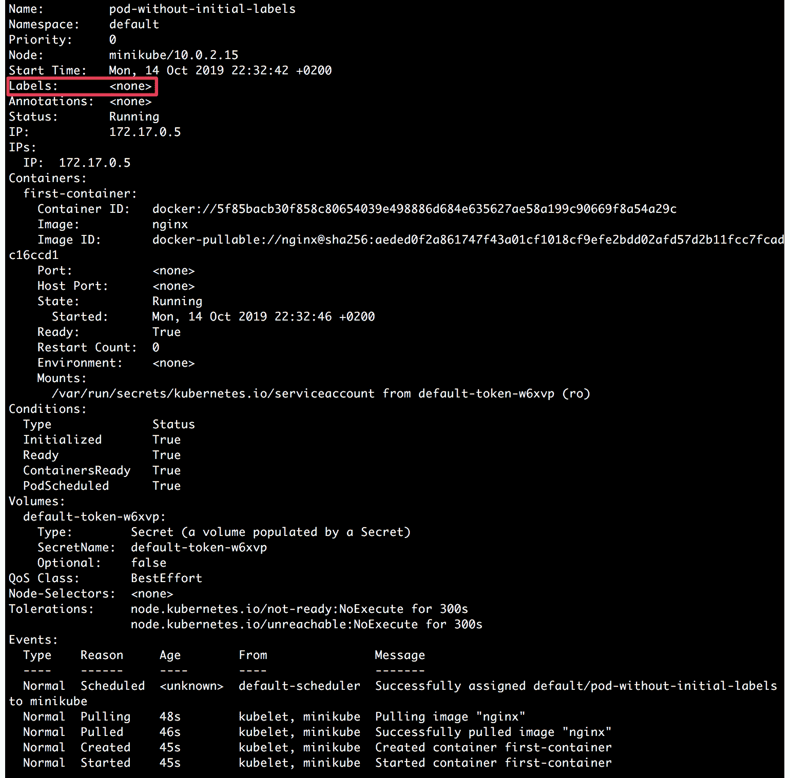

图 6.3：描述没有初始标签的 pod

在输出的突出部分中，我们可以注意到`Labels`字段为空。因此，我们可以验证，默认情况下，没有标签添加到 pod 中。在接下来的几步中，我们将添加一个标签，然后再次运行 pod，以验证标签是否实际包含在 pod 中。

1.  使用`kubectl label`命令添加标签如下：

```
kubectl label pod pod-without-initial-labels app=nginx
```

你应该看到以下响应：

```
pod/pod-without-initial-labels labeled
```

输出显示`pod-without-initial-labels` pod 已被标记。

1.  使用`kubectl describe`命令验证上一步中是否实际添加了标签：

```
kubectl describe pod pod-without-initial-labels
```

你应该看到以下输出：

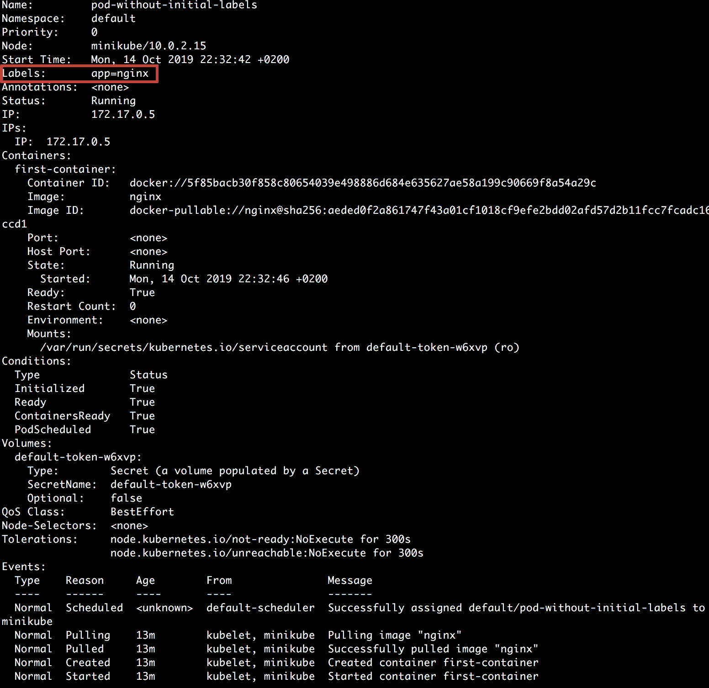

图 6.4：验证已添加 app=nginx 标签

我们可以观察到输出的突出显示部分实际上添加了`app=nginx`标签到 pod 中。在前面的情况下，我们只添加了一个标签。但是，您可以向 pod 添加多个标签，就像接下来要做的那样。

1.  接下来，让我们在同一命令中添加多个标签。我们可以通过以`key=value`格式传递多个标签，用空格分隔来实现这一点：

```
kubectl label pod pod-without-initial-labels foo=bar foo2=baz
```

您应该看到以下响应：

```
pod/pod-without-initial-labels labeled
```

1.  使用`kubectl describe`命令验证两个标签是否已添加到 pod 中：

```
kubectl describe pod pod-without-initial-labels
```

您应该看到以下输出：

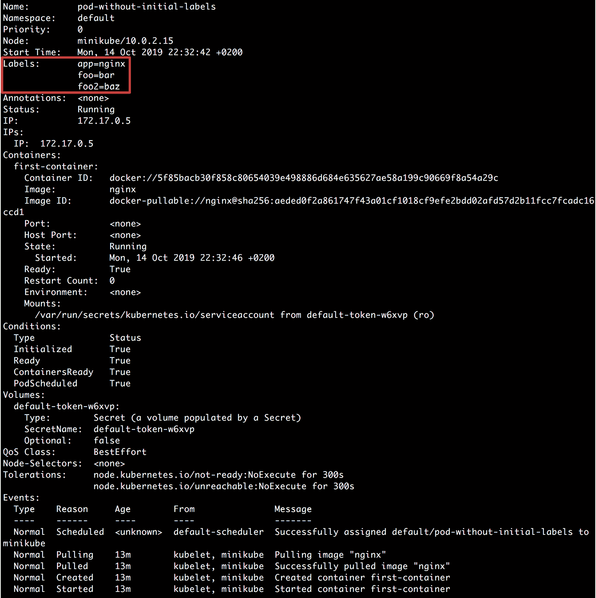

图 6.5：验证新的两个标签也已添加

在输出的突出显示部分，我们可以看到两个新标签`foo=bar`和`foo2=baz`也已添加到 pod 中。

在接下来的练习中，我们将看到如何删除和修改已经运行的 pod 的现有标签。

## 练习 6.03：修改和/或删除运行中 pod 的现有标签

在这个练习中，我们的目标是创建一个带有一些标签的 pod，并在 pod 运行时修改和删除这些标签。为了成功完成这个练习，请执行以下步骤：

1.  创建一个名为`pod-with-some-labels.yaml`的文件，内容如下：

```
apiVersion: v1
kind: Pod
metadata:
  name: pod-with-some-labels
  labels:
    app: nginx
spec:
  containers:
  - name: first-container
    image: nginx
```

如您在 pod 定义中所见，我们只添加了一个标签`app`，其值为`nginx`。

1.  在终端中运行以下命令以创建具有上述配置的 pod：

```
kubectl create -f pod-with-some-labels.yaml
```

您应该看到以下响应：

```
pod/pod-with-some-labels created
```

1.  使用`kubectl get`命令验证 pod 是否已创建：

```
kubectl get pod pod-with-some-labels
```

以下输出表明已创建了 pod：


图 6.6：检查带有一些标签的 pod 的状态

1.  使用`kubectl describe`命令验证标签是否按照 pod 配置添加：

```
kubectl describe pod pod-with-some-labels
```

您应该看到以下输出：

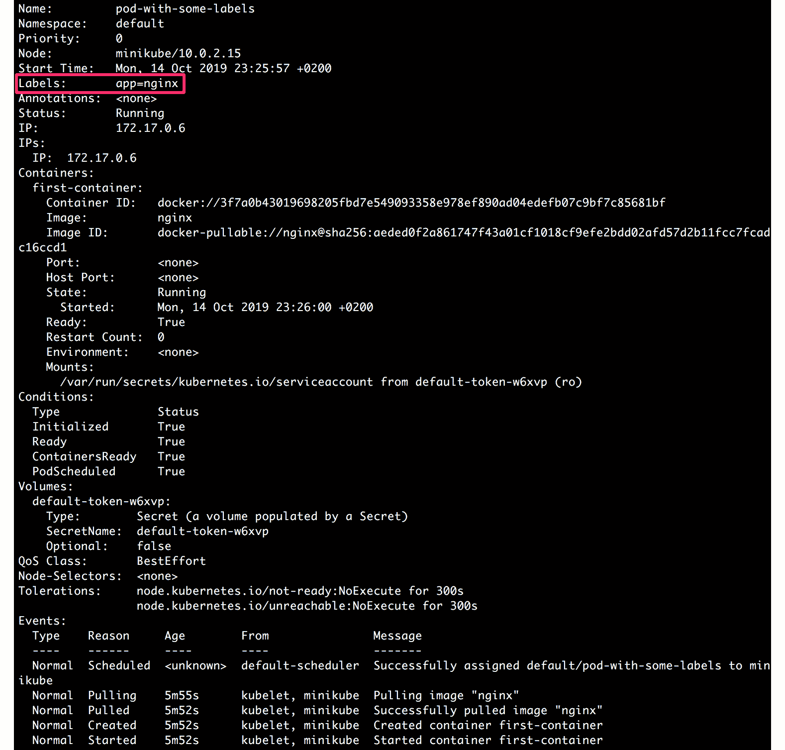

图 6.7：验证标签是否已添加到带有一些标签的 pod

一旦我们确定`app=nginx`标签存在，我们将在下一步中修改此标签。

1.  使用`kubectl label`命令将`app=nginx`标签修改为`app=nginx-application`：

```
kubectl label --overwrite pod pod-with-some-labels app=nginx-application
```

您应该看到以下响应：

```
pod/pod-with-some-labels labeled
```

1.  使用`kubectl describe`命令验证标签的值是否从`nginx`修改为`nginx-application`：

```
kubectl describe pod pod-with-some-labels
```

以下截图显示了此命令的输出：

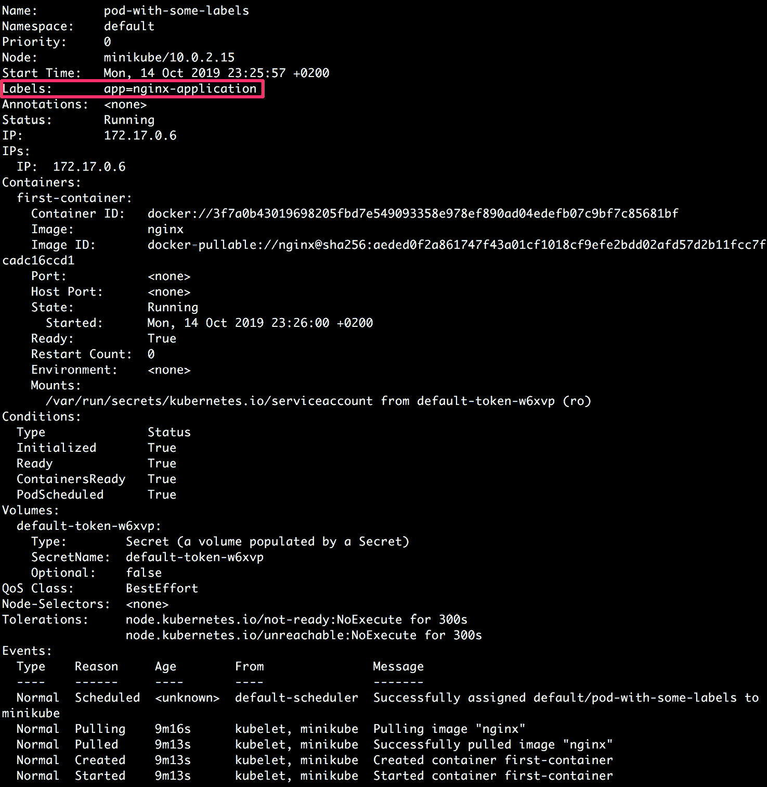

图 6.8：验证标签值是否已修改

如输出所示，我们可以看到具有`app`键的标签具有新值`nginx-application`。

1.  使用`kubectl label`命令删除具有`app`键的标签：

```
kubectl label pod pod-with-some-labels app-
```

请注意前面命令的连字符。您应该看到以下响应：

```
pod/pod-with-some-labels labeled
```

1.  使用`kubectl describe`命令验证实际上已删除具有`app`键的标签：

```
kubectl describe pod pod-with-some-labels
```

您应该看到以下输出：

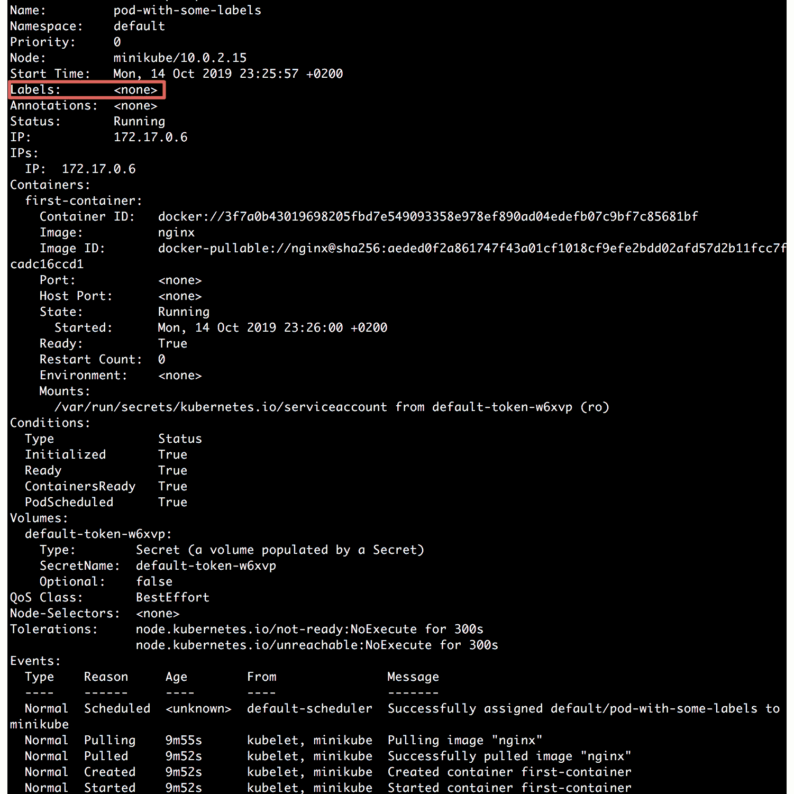

图 6.9：验证实际上已从 pod 中删除所需的标签

如前面的输出所示，我们可以再次注意到具有`app`键的标签已被删除，因此，该 pod 现在没有标签。因此，我们已经学会了如何修改和删除运行中 pod 的现有标签。

## 使用标签选择器选择 Kubernetes 对象

为了根据它们的标签对各种对象进行分组，我们使用标签选择器。它允许用户识别符合某些条件的一组对象。

我们可以使用以下语法来使用`kubectl get`命令，并使用`-l`或`--label`参数传递标签选择器：

```
kubectl get pods -l {label_selector}
```

在接下来的练习中，我们将看到如何在实际场景中使用此命令。在此之前，让我们了解在这些命令中可以使用哪些`{label_selector}`参数。

目前，有两种类型的标签选择器：基于相等性和基于集合。

### 基于相等性的选择器

基于相等性的选择器允许根据标签键和值选择 Kubernetes 对象。这些类型的选择器允许我们匹配具有给定标签键的特定标签值的所有对象。实际上，我们也有基于不等性的选择器。

总的来说，有三种运算符：`=`，`==`和`!=`。

前两个实际上在操作上是相同的，并表示基于相等性的操作，而第三个表示基于不等性的操作。在使用这些类型的选择器时，我们可以使用任何前述运算符指定多个条件。

例如，如果我们使用标签键如`environment`和`team`，我们可能想使用以下选择器：

```
environment=production
```

前面的选择器匹配所有具有标签键环境和相应的`production`值的对象：

```
team!=devops-infra
```

前面的选择器匹配所有没有`team`标签键或者存在`team`标签键但相应的值**不等于**`devops-infra`的对象。

同样，我们也可以同时使用两个选择器，用逗号（`,`）分隔：

```
environment=production,team!=devops-infra
```

在上面的例子中，选择器将匹配符合两个选择器指定的条件的所有对象。逗号充当两个选择器之间的逻辑 AND（`&&`）运算符。现在，让我们尝试在以下练习中实现这些选择器。

## 练习 6.04：使用基于相等性的标签选择器选择 Pod

在这个练习中，我们的目标是创建一些具有不同标签的 Pod，然后使用基于相等性的选择器选择它们。为了成功完成这个练习，请执行以下步骤：

1.  创建一个名为`pod-frontend-production.yaml`的文件，内容如下：

```
apiVersion: v1
kind: Pod
metadata:
  name: frontend-production
  labels:
    environment: production
    role: frontend
spec:
  containers:
  - name: application-container
    image: nginx
```

如我们所见，这是具有以下两个标签的 Pod 模板：`environment=production`和`role=frontend`。

1.  创建另一个名为`pod-backend-production.yaml`的文件，内容如下：

```
apiVersion: v1
kind: Pod
metadata:
  name: backend-production
  labels:
    environment: production
    role: backend
spec:
  containers:
  - name: application-container
    image: nginx
```

这是具有以下两个标签的 Pod 模板：`environment=production`和`role=backend`。

1.  创建另一个名为`pod-frontend-staging.yaml`的文件，内容如下：

```
apiVersion: v1
kind: Pod
metadata:
  name: frontend-staging
  labels:
    environment: staging
    role: frontend
spec:
  containers:
  - name: application-container
    image: nginx
```

这是具有以下两个标签的 Pod 模板：`environment=staging`和`role=frontend`。

1.  使用以下三个命令创建所有三个 Pod：

```
kubectl create -f pod-frontend-production.yaml
```

您应该会看到以下响应：

```
pod/frontend-production created
```

现在，运行以下命令：

```
kubectl create -f pod-backend-production.yaml
```

以下响应表示已创建 Pod：

```
pod/backend-production created
```

现在，运行以下命令：

```
kubectl create -f pod-frontend-staging.yaml
```

这应该会得到以下响应：

```
pod/frontend-staging created
```

1.  使用`--show-labels`参数来验证所有三个 Pod 是否使用正确的标签创建，首先，让我们检查`frontend-production` Pod：

```
kubectl get pod frontend-production --show-labels
```

以下响应表示已创建`frontend-production` Pod：

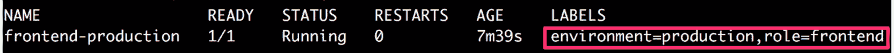

图 6.10：验证 frontend-production Pod 的标签

1.  现在，检查`backend-production` Pod：

```
kubectl get pod backend-production --show-labels
```

以下响应表示已创建`backend-production` Pod：

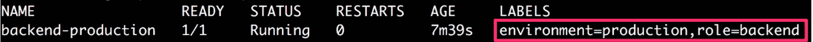

图 6.11：验证 backend-production Pod 的标签

1.  最后，检查`frontend-staging` Pod：

```
kubectl get pod frontend-staging --show-labels
```

以下响应表明`frontend-staging` pod 已被创建：

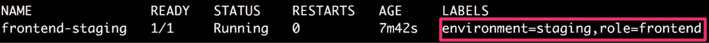

图 6.12：验证 frontend-staging pod 的标签

1.  现在，我们将使用标签选择器来查看分配给生产环境的所有 pod。我们可以使用`environment=production`作为标签选择器与`kubectl get`命令一起实现：

```
kubectl get pods -l environment=production
```

在下面的输出中，我们可以看到它只显示那些具有`environment`键和`production`值的标签的 pod：

```
NAME                    READY      STATUS       RESTARTS    AGE
backend-production      1/1        Running      0           67m
frontend-production     1/1        Running      0           68m
```

您可以从*图 6.10*和*图 6.11*确认，这些是具有`environment=production`标签的 pod。

1.  接下来，我们将使用标签选择器来查看所有具有`frontend`角色和`staging`环境的 pod。我们可以通过使用标签选择器与`kubectl get`命令来实现，如下所示：

```
kubectl get pods -l role=frontend,environment=staging
```

在下面的输出中，我们可以看到它只显示那些具有`staging`作为环境和`frontend`作为角色的 pod：

```
NAME                    READY      STATUS       RESTARTS    AGE
frontend-staging        1/1        Running      0           72m
```

在这个练习中，我们已经使用标签选择器来选择特定的 pod。`get`命令的这种标签选择器为基于标签选择所需的一组 pod 提供了一种便捷的方式。这也代表了一个常见的场景，您可能只想对涉及生产或分段环境的 pod 或前端或后端基础设施应用一些更改。

### 基于集合的选择器

基于集合的选择器允许根据给定键的一组值选择 Kubernetes 对象。这种类型的选择器允许我们匹配所有具有给定标签键和给定一组值中的一个值的对象。

有三种类型的操作符：`in`，`notin`和`exists`。让我们通过一些例子来看看这些操作符的含义：

```
environment in (production, staging)
```

在前面的例子中，选择器匹配所有具有`environment`标签键且值为`production`或`staging`的对象：

```
team notin (devops-infra)
```

在前面的例子中，选择器匹配所有具有`team`标签键且值不是`devops-infra`的对象。它还匹配那些没有`team`标签键的对象：

```
!critical
```

在前面的例子中，选择器等同于`exists`操作。它匹配所有没有`critical`标签键的对象。它根本不检查值。

注意

这两种类型的选择器也可以一起使用，正如我们将在*练习 6.06*，*使用混合标签选择器选择 Pods*中观察到的那样。

让我们在接下来的练习中实现基于集合的选择器。

## 练习 6.05：使用基于集合的标签选择器选择 Pods

在这个练习中，我们的目标是创建一些具有不同标签的 pod，然后使用基于集合的选择器来选择它们。

注意

在这个练习中，我们假设您已经成功完成了*练习 6.04*，*使用基于相等性的标签选择器选择 Pods*。我们将重用在该练习中创建的 pods。

为了成功完成这个练习，请执行以下步骤：

1.  打开终端并验证我们在*练习 6.04*，*使用基于相等性的标签选择器选择 Pods*中创建的`frontend-production` pod 是否仍在运行并具有所需的标签。我们将使用`kubectl get`命令和`--show-labels`参数：

```
kubectl get pod frontend-production --show-labels
```

以下响应表明`frontend-production` pod 存在：

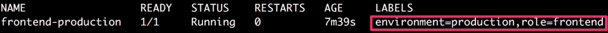

图 6.13：验证前端生产 pod 的标签

1.  使用`kubectl get`命令和`--show-labels`参数验证我们在*练习 6.04*，*使用基于相等性的标签选择器选择 Pods*中创建的`backend-production` pod 是否仍在运行并具有所需的标签：

```
kubectl get pod backend-production --show-labels
```

以下响应表明`backend-production` pod 存在：

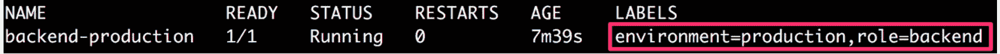

图 6.14：验证后端生产 pod 的标签

1.  使用`kubectl get`命令和`--show-labels`参数验证我们在*练习 6.04*，*使用基于相等性的标签选择器选择 Pods*中创建的`frontend-staging` pod 是否仍在运行并具有所需的标签：

```
kubectl get pod frontend-staging --show-labels
```

以下响应表明`frontend-staging` pod 存在：

图 6.15：验证前端暂存 pod 的标签

](image/B14870_06_15.jpg)

图 6.15：验证前端暂存 pod 的标签

1.  现在，我们将使用标签选择器来匹配所有环境为`production`，角色为`frontend`或`backend`的所有 pod。我们可以通过使用标签选择器和`kubectl get`命令来实现这一点，如下所示：

```
kubectl get pods -l 'role in (frontend, backend),environment in (production)'
```

您应该看到以下响应：

```
NAME                    READY      STATUS       RESTARTS    AGE
backend-production      1/1        Running      0           82m
frontend-production     1/1        Running      0           82m
```

1.  接下来，我们将使用标签选择器来匹配所有具有`environment`标签且角色不是`backend`的 pod。我们还希望排除那些没有设置`role`标签的 pod：

```
kubectl get pods -l 'environment,role,role notin (backend)'
```

这应该产生以下输出：

```
NAME                    READY      STATUS       RESTARTS    AGE
frontend-production     1/1        Running      0           86m
frontend-staging        1/1/       Running      0           86m
```

在这个例子中，我们有基于集合的选择器，可以用来获取所需的 pods。我们还可以将这些与基于选择器的 pods 结合起来，正如我们将在接下来的练习中看到的。

## 练习 6.06：使用混合标签选择器选择 Pods

在这个练习中，我们的目标是创建一些具有不同标签的 pods，然后使用基于相等性和基于集合的选择器来选择它们。

注意

在这个练习中，我们假设您已成功完成*练习 6.04*，*使用基于相等性的标签选择器选择 Pods*。我们将重用在该练习中创建的 pods。

为了成功完成这个练习，请执行以下步骤：

1.  打开终端，验证我们在*练习 6.04*，*使用基于相等性的标签选择器选择 Pods*中创建的`frontend-production` pod 是否仍在运行并具有所需的标签。我们将使用`kubectl get`命令和`--show-labels`参数：

```
kubectl get pod frontend-production --show-labels
```

下面的响应表明`frontend-production` pod 存在：

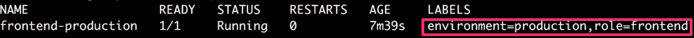

图 6.16：验证 frontend-production pod 的标签

1.  使用`kubectl get`命令和`--show-labels`参数验证我们在*练习 6.04*，*使用基于相等性的标签选择器选择 Pods*中创建的`backend-production` pod 是否仍在运行并具有所需的标签：

```
kubectl get pod backend-production --show-labels
```

下面的响应表明`backend-production` pod 存在：

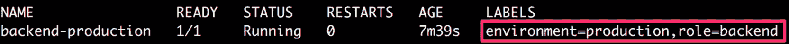

图 6.17：验证 backend-production pod 的标签

1.  使用`kubectl get`命令和`--show-labels`参数验证我们在*练习 6.04*，*使用基于相等性的标签选择器选择 Pods*中创建的`frontend-staging` pod 是否仍在运行并具有所需的标签：

```
kubectl get pod frontend-staging --show-labels
```

下面的响应表明`frontend-staging` pod 存在：

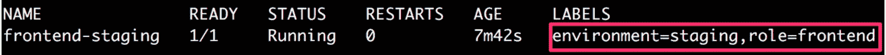

图 6.18：验证 frontend-staging pod 的标签

1.  现在，我们将使用标签选择器来匹配所有具有`frontend`角色且环境为`production`、`staging`或`dev`之一的 pod：

```
kubectl get pods -l 'role=frontend,environment in (production,staging,dev)'
```

这个命令应该给出以下 pod 列表：

```
NAME                    READY      STATUS       RESTARTS    AGE
frontend-production     1/1        Running      0           95m
frontend-staging        1/1        Running      0           95m
```

在输出中，我们只能看到具有`frontend`角色的那些 pod，而`environment`可以是给定值中的任何一个。因此，我们已经看到可以根据需要使用不同类型的选择器的混合。

# 注释

正如我们之前所看到的，标签用于添加我们稍后可以使用来过滤或选择对象的标识元数据。然而，标签在值方面有一定的限制，比如我们可以存储的字符数限制为 63 个字符，并且在开头和结尾只能使用字母数字字符。另一方面，注释在可以存储的数据类型方面有更少的限制。然而，我们不能使用注释来过滤或选择对象。

注释也是可以用于存储与 Kubernetes 对象相关的非结构化信息的键值对。以下是 YAML 文件中注释的示例：

```
metadata:
  annotations:
    key1: value1
    key2: value2
```

## 注释的约束

如前所述，注释是键值对，就像标签一样。然而，注释的规则比标签键和值的规则更宽松。更宽松的约束是因为注释不能用于过滤或选择对象。这是因为注释的键值对没有存储在一个高效的查找数据结构中。因此，在这里有更少的限制。

### 注释键

与标签键类似，注释键也有两部分：前缀和名称。注释前缀和名称的约束与标签前缀和名称的约束相同。

以下是注释键可能出现的示例：

```
annotation_prefix.com/worker-node-identifier
```

### 注释值

在注释值中，没有任何数据类型的限制。

## 注释的用例

注释通常用于添加元数据，这些元数据不会用于过滤或选择对象。它用于添加将由用户或工具用于获取有关 Kubernetes 对象的更主观信息的元数据。让我们看一些使用注释可能有用的场景：

+   注释可用于添加时间戳、提交 SHA、问题跟踪器链接，或者组织中负责特定对象的用户的名称/信息。在这种情况下，我们可以根据我们的用例使用以下类型的元数据：

```
metadata:
  annotations:
    timestamp: 123456789
    commit-SHA: d6s9shb82365yg4ygd782889us28377gf6
    JIRA-issue: "https://your-jira-link.com/issue/ABC-1234"
    owner: "https://internal-link.to.website/username"
```

+   注释还可以用于添加有关客户端库或工具的信息。我们可以添加诸如库的名称、使用的版本和公共文档链接等信息。这些信息以后可以用于调试我们应用程序中的问题：

```
metadata:
  annotations:
    node-version: 13.1.0
    node-documentation: "https://nodejs.org/en/docs/"
```

+   我们还可以使用注释来存储先前部署的 pod 配置。这在弄清当前修订之前部署的配置以及发生了什么变化方面非常有帮助：

```
metadata:
  annotations:
    previous-configuration: "{ some json containing the       previously deployed configuration of the object }"
```

+   注释还可以用于存储在部署过程中对我们的应用程序有帮助的配置或检查点。

我们将在下一个练习中学习如何向 pod 添加注释。

## 练习 6.07：添加注释以帮助应用程序调试

在这个练习中，我们将向我们的 pod 添加一些任意的元数据。为了成功完成这个练习，请执行以下步骤：

1.  创建一个名为`pod-with-annotations.yaml`的文件，内容如下：

```
apiVersion: v1
kind: Pod
metadata:
  name: pod-with-annotations
  annotations:
    commit-SHA: d6s9shb82365yg4ygd782889us28377gf6
    JIRA-issue: "https://your-jira-link.com/issue/ABC-1234"
    timestamp: "123456789"
    owner: "https://internal-link.to.website/username"
spec:
  containers:
  - name: application-container
    image: nginx
```

在 pod 定义的突出显示部分显示了我们添加的注释。

1.  在终端中运行以下命令，使用`kubectl create`命令创建 pod：

```
kubectl create -f pod-with-annotations.yaml
```

您应该收到以下响应：

```
pod/pod-with-annotations created
```

1.  在终端中运行以下命令以验证 pod 是否按预期创建：

```
kubectl get pod pod-with-annotations
```

您应该看到以下 pod 列表：

```
NAME                    READY      STATUS       RESTARTS    AGE
pod-with-annotations    1/1        Running      0           29s
```

1.  在终端中运行以下命令以验证创建的 pod 是否具有所需的注释：

```
kubectl describe pod pod-with-annotations
```

您应该看到此命令的以下输出：

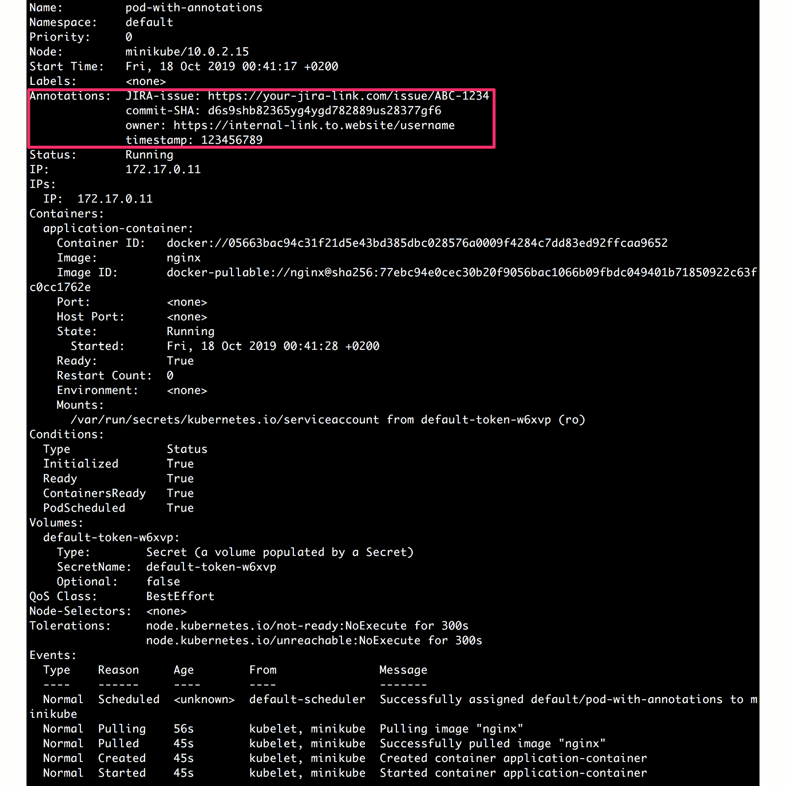

图 6.19：验证带注释的 pod 的注释

正如我们在上述输出的突出显示部分中所看到的，所需的元数据已作为注释添加到了 pod 中。现在，这些数据可以被任何了解使用的部署工具或客户端使用。

## 使用注释

在上一个练习中，我们创建了一个带有注释的 pod。与标签类似，我们可以向运行中的 pod 添加注释，并修改/删除运行中的 pod 的注释。这可以通过运行类似于标签的命令来实现。以下列表向您展示了可以对注释执行的各种操作以及相关命令：

+   因此，我们可以通过使用以下命令向运行中的 pod 添加注释：

```
kubectl annotate pod <pod_name> <annotation_key>=<annotation_label>
```

在上述命令中，我们可以添加多个注释，类似于*练习 6.02*中*步骤 7*中添加多个标签。

+   我们还可以修改（覆盖）注释，如下所示：

```
kubectl annotate --overwrite pod <pod_name> <annotation_key>=<annotation_label>
```

+   最后，我们可以使用以下命令删除注释：

```
kubectl annotate pod <pod_name> <annotation_key>-
```

注意前面命令末尾的连字符。现在我们已经了解了标签和注释以及我们可以使用它们的各种方式，让我们在以下活动中将所有这些内容汇总起来。

## 活动 6.01：使用标签/注释创建 Pod 并根据给定标准对它们进行分组

考虑到您正在支持名为`product-development`和`infra-libraries`的两个团队。这两个团队都有一些应用程序 pod 用于不同的环境（生产或分级）。如果情况确实如此，团队还希望将其 pod 标记为关键。

简而言之，您需要根据以下元数据要求创建三个 pod：

+   一个在生产环境中运行并由`product-development`团队拥有的`arbitrary-product-application` pod。这需要标记为非关键 pod。

+   一个在生产环境中运行并由`infra-libraries`团队拥有的`infra-libraries-application` pod。这需要标记为关键 pod。

+   一个在分级环境中运行并由`infra-libraries`团队拥有的`infra-libraries-application-staging` pod。由于它在分级环境中运行，因此不需要指示该 pod 的重要性。

除此之外，两个团队还想要添加另一个元数据 - "team-link"，他们希望在其中存储团队联系信息的内部链接。

一旦创建了所有三个 pod，您应该能够执行以下任务：

1.  将所有在生产环境中运行且关键的 pod 分组。

1.  将所有环境中不关键的 pod 分组。

注意

理想情况下，您希望创建此 pod 位于不同的命名空间中，以使其与您在练习期间创建的其他内容分开。因此，可以随意创建一个命名空间并在该命名空间中创建 pod。

执行此活动的高级步骤如下：

1.  为此活动创建一个命名空间。

1.  编写所有三个 pod 的 pod 配置。确保在标签和注释中正确添加所有请求的元数据。

1.  使用上一步中编写的配置创建所有三个 pod。

1.  确保所有三个 pod 都在运行并具有所有请求的元数据。

1.  将所有在生产环境中运行且关键的 pod 分组。

1.  将所有环境中不重要的 pod 分组。

对于第一个任务，您的目标是在完成活动后获得`infra-libraries-application` pod，如下所示：

```
NAME                         READY   STATUS       RESTARTS    AGE
infra-libraries-application  1/1     Running      0           12m
```

对于第二个任务，您的目标是在完成活动后获得`arbitrary-product-application`和`infra-libraries-application-staging`，如下所示：

```
NAME                                 READY  STATUS    RESTARTS   AGE
arbitrary-product-application        1/1    Running   0          14m
infra-libraries-application-staging  1/1    Running   0          14m
```

注意

此活动的解决方案可在以下地址找到：[`packt.live/304PEoD`](https://packt.live/304PEoD)。

# 总结

在本章中，我们描述了标签和注释，并使用它们添加元数据信息，这些信息可以是可识别的信息，可用于过滤或选择对象，也可以是用户或工具用于获取有关应用程序状态的更多上下文的不可识别信息。更具体地说，我们还使用标签和注释组织了诸如 pod 之类的对象。这些是重要的技能，将帮助您更有效地管理 Kubernetes 对象。

在接下来的章节中，当我们熟悉更多的 Kubernetes 对象，比如部署和服务时，我们将看到标签和标签选择器在组织用于部署或发现的 pod 时的进一步应用。
